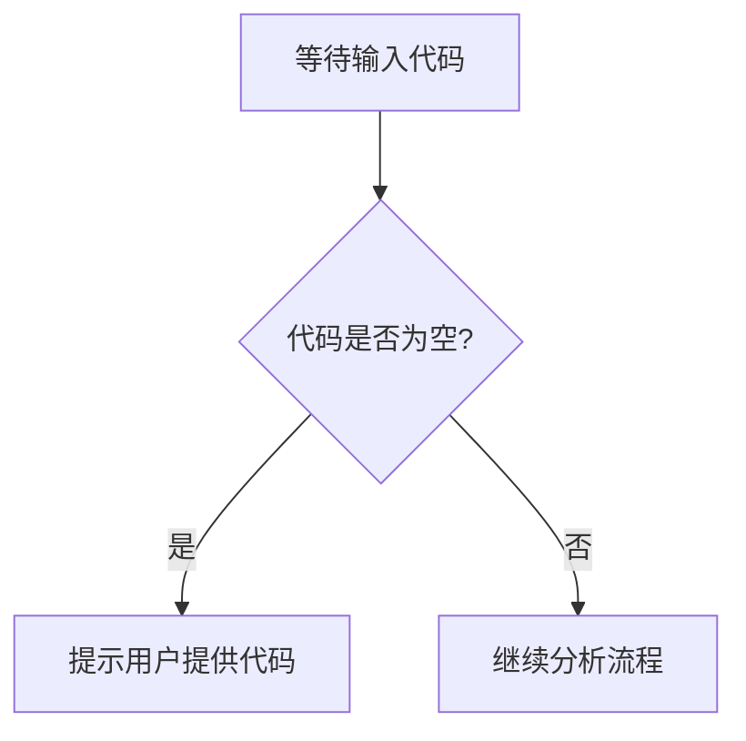

# `diffusers\tests\pipelines\ip_adapters\__init__.py` 详细设计文档

未提供源代码，无法进行分析。请提供代码以便生成详细设计文档。

## 整体流程



## 类结构

```

```

## 全局变量及字段


    

## 全局函数及方法


## 关键组件


## 问题及建议


### 已知问题

- 未提供代码，无法进行技术债务分析

### 优化建议

- 请提供待分析的源代码


## 其它


### 设计目标与约束

描述项目的设计目标、性能约束、兼容性要求、安全性要求等

### 错误处理与异常设计

说明系统如何处理错误和异常，包括错误码定义、异常类型、日志记录策略等

### 数据流与状态机

描述数据在系统中的流转过程，状态机的状态转换逻辑

### 外部依赖与接口契约

列出所有外部依赖（库、API、服务等），定义接口规范和契约

### 配置管理

说明配置项的定义、管理方式、配置加载逻辑

### 安全性设计

描述安全相关的设计，包括认证、授权、加密、输入验证等

### 性能考量

说明性能优化策略、瓶颈分析、缓存策略、并发控制等

### 兼容性设计

描述版本兼容性、前向/后向兼容性策略

### 测试策略

说明单元测试、集成测试、系统测试的策略和覆盖率目标

### 部署与运维

描述部署流程、监控告警、日志管理、备份恢复策略

### 扩展性设计

说明系统如何支持功能扩展、性能扩展、水平扩展

### 编码规范与约定

说明代码风格、命名约定、文档规范等

### 版本历史与变更记录

记录版本变更历史、重大决策记录

    