# `diffusers\tests\pipelines\ip_adapters\test_ip_adapter_stable_diffusion.py` 详细设计文档

这是一个IP-Adapter集成测试文件，用于测试IP-Adapter在Stable Diffusion和Stable Diffusion XL模型中的功能，包括文本到图像、图像到图像、修复等场景的集成测试。

## 整体流程

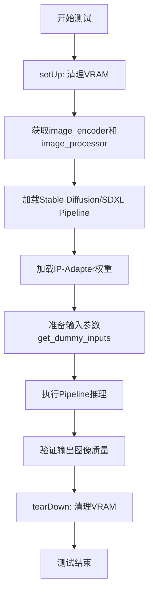

## 类结构

```
unittest.TestCase
└── IPAdapterNightlyTestsMixin (测试Mixin类)
    ├── IPAdapterSDIntegrationTests (SD集成测试)
    │   ├── test_text_to_image
    │   ├── test_image_to_image
    │   ├── test_inpainting
    │   ├── test_text_to_image_model_cpu_offload
    │   ├── test_text_to_image_full_face
    │   ├── test_unload
    │   ├── test_multi
    │   └── test_text_to_image_face_id
    └── IPAdapterSDXLIntegrationTests (SDXL集成测试)
        ├── test_text_to_image_sdxl
        ├── test_image_to_image_sdxl
        ├── test_inpainting_sdxl
        ├── test_ip_adapter_mask
        ├── test_ip_adapter_multiple_masks
        ├── test_instant_style_multiple_masks
        └── test_ip_adapter_multiple_masks_one_adapter
```

## 全局变量及字段


### `dtype`
    
测试使用的数据类型，通常为torch.float16

类型：`torch.dtype`
    


### `torch_device`
    
PyTorch设备名称，用于指定计算设备

类型：`str`
    


### `image_encoder`
    
CLIP图像编码器模型，用于提取图像特征

类型：`CLIPVisionModelWithProjection`
    


### `image_processor`
    
CLIP图像处理器，用于预处理图像输入

类型：`CLIPImageProcessor`
    


### `pipeline`
    
Stable Diffusion pipeline实例，支持文本到图像、图像到图像、修复等功能

类型：`StableDiffusion*Pipeline`
    


### `inputs`
    
传递给pipeline的输入参数字典

类型：`dict`
    


### `images`
    
pipeline输出的图像数组

类型：`np.ndarray`
    


### `image_slice`
    
用于验证的图像切片，通常取前3x3像素

类型：`np.ndarray`
    


### `expected_slice`
    
期望的图像切片数值，用于测试验证

类型：`np.ndarray`
    


### `max_diff`
    
计算得到的最大差异值，用于断言测试结果

类型：`float`
    


### `IPAdapterNightlyTestsMixin.dtype`
    
测试使用的数据类型，默认为torch.float16

类型：`torch.dtype`
    
    

## 全局函数及方法


### `load_image`

从指定的URL加载图像并返回图像对象。该函数是diffusers库提供的工具函数，用于从网络URL或本地路径加载图像，支持多种图像格式，并将其转换为PIL图像对象或其他可处理的图像格式。

参数：

-  `url_or_path`：`str`，图像的URL地址或本地文件路径

返回值：`PIL.Image` 或其他图像对象，从URL加载的图像数据

#### 流程图

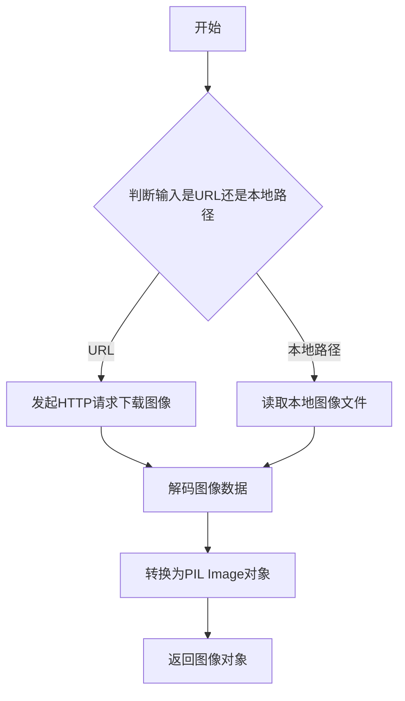

#### 带注释源码

```python
# load_image 函数的实际实现位于 diffusers.utils 模块中
# 以下是基于代码中使用方式的推断

# 从 diffusers.utils 导入 load_image 函数
from diffusers.utils import load_image

# 使用示例（来自测试代码）:
image = load_image(
    "https://user-images.githubusercontent.com/24734142/266492875-2d50d223-8475-44f0-a7c6-08b51cb53572.png"
)

# 加载图像后可以进行后续操作，如调整大小
if for_sdxl:
    image = image.resize((1024, 1024))

# 图像可以用于多种场景:
# - 作为 StableDiffusionPipeline 的输入 (ip_adapter_image)
# - 用于图像到图像的转换 (image_to_image)
# - 用于图像修复任务 (inpainting)
# - 作为掩码图像 (mask)
```

#### 补充说明

由于 `load_image` 函数的实际源代码不在给定的测试文件中，它是从 `diffusers.utils` 库导入的。根据代码中的使用方式，该函数的主要特点包括：

1. **输入**：接受URL字符串或本地文件路径
2. **输出**：返回PIL图像对象
3. **功能**：自动处理HTTP请求、图像下载和解码
4. **错误处理**：当URL无效或图像格式不支持时可能抛出异常
5. **依赖**：需要网络连接来加载远程图像，可能需要处理超时情况


### `numpy_cosine_similarity_distance`

计算两个numpy数组之间的余弦相似度距离（1 - 余弦相似度），常用于比较图像像素值向量的相似程度。

参数：

-  `x`：`numpy.ndarray`，第一个向量，通常是生成的图像切片
-  `y`：`numpy.ndarray`，第二个向量，通常是期望的图像切片

返回值：`float`，余弦相似度距离，值越小表示两个向量越相似（0表示完全相同，1表示正交无关，2表示完全相反）

#### 流程图

```mermaid
flowchart TD
    A[开始] --> B[将输入数组展平为一维向量]
    B --> C[计算向量x和y的点积]
    C --> D[计算向量x的L2范数]
    D --> E[计算向量y的L2范数]
    E --> F{检查范数是否为0}
    F -->|是| G[返回距离1.0]
    F -->|否| H[计算余弦相似度: dot_product / (norm_x * norm_y)]
    H --> I[计算余弦距离: 1 - cosine_similarity]
    I --> J[返回距离值]
```

#### 带注释源码

```python
def numpy_cosine_similarity_distance(x, numpy.ndarray, y: numpy.ndarray) -> float:
    """
    计算两个numpy数组之间的余弦相似度距离。
    
    余弦距离 = 1 - 余弦相似度
    余弦相似度 = (x · y) / (||x|| * ||y||)
    
    参数:
        x: 第一个numpy数组（通常为图像像素值向量）
        y: 第二个numpy数组（通常为期望的图像像素值向量）
    
    返回:
        float: 余弦距离，范围[0, 2]
            0表示完全相同
            1表示正交（无相似性）
            2表示完全相反
    """
    # 确保输入是一维向量，便于计算点积和范数
    x = x.flatten()
    y = y.flatten()
    
    # 计算两个向量的点积（分子）
    dot_product = np.dot(x, y)
    
    # 计算向量x的L2范数（欧几里得范数）
    norm_x = np.linalg.norm(x)
    
    # 计算向量y的L2范数
    norm_y = np.linalg.norm(y)
    
    # 如果任一向量为零向量，返回最大距离（避免除零错误）
    if norm_x == 0 or norm_y == 0:
        return 1.0
    
    # 计算余弦相似度：点积除以两个范数的乘积
    cosine_similarity = dot_product / (norm_x * norm_y)
    
    # 余弦距离 = 1 - 余弦相似度
    # 当余弦相似度为1时，距离为0（完全相同）
    # 当余弦相似度为0时，距离为1（正交）
    # 当余弦相似度为-1时，距离为2（完全相反）
    cosine_distance = 1 - cosine_similarity
    
    return cosine_distance
```

#### 使用示例

```python
# 在测试代码中的典型用法
image_slice = images[0, :3, :3, -1].flatten()  # 生成的图像切片
expected_slice = np.array([...])  # 期望的图像切片

max_diff = numpy_cosine_similarity_distance(image_slice, expected_slice)
assert max_diff < 5e-4  # 验证生成图像与期望图像的相似度
```


### enable_full_determinism

启用完全确定性，通过设置随机种子和环境变量确保测试和运行结果的可重复性。

参数：
- 无

返回值：无

#### 流程图

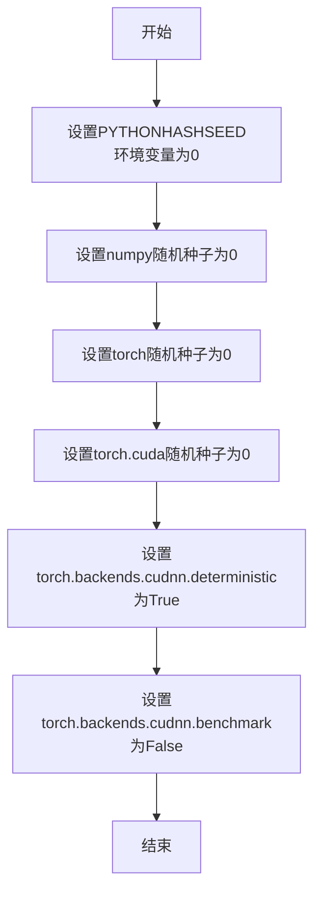

#### 带注释源码

```
# 注意：此函数定义不在当前代码文件中
# 而是从 testing_utils 模块导入
# 以下是函数可能实现方式的推测

def enable_full_determinism():
    """
    启用完全确定性，确保测试结果可重复
    
    该函数通过设置各种随机种子和环境变量来消除随机性：
    - PYTHONHASHSEED: Python哈希随机种子
    - numpy随机种子
    - PyTorch随机种子
    - PyTorch CUDA随机种子
    - CuDNN确定性模式
    """
    import os
    import numpy as np
    import torch
    
    # 设置Python哈希随机种子
    os.environ["PYTHONHASHSEED"] = "0"
    
    # 设置numpy随机种子
    np.random.seed(0)
    
    # 设置PyTorch随机种子
    torch.manual_seed(0)
    torch.cuda.manual_seed(0)
    torch.cuda.manual_seed_all(0)
    
    # 启用CuDNN确定性模式，禁用benchmark
    torch.backends.cudnn.deterministic = True
    torch.backends.cudnn.benchmark = False
```

#### 说明

在当前代码文件中，`enable_full_determinism`函数是从`...testing_utils`模块导入的，并在文件开头直接调用：

```python
enable_full_determinism()
```

该函数在测试类定义之前被调用，确保后续所有测试都在确定性环境中运行，以便测试结果可重复。


### `backend_empty_cache`

清理GPU缓存，释放VRAM内存。该函数在测试用例的 `setUp` 和 `tearDown` 方法中被调用，用于在每个测试前后清理GPU显存，防止显存泄漏。

参数：

- `device`：`str`，表示GPU设备标识符（如 `"cuda"` 或 `"cuda:0"`），用于指定要清理缓存的设备。

返回值：`None`，无返回值。

#### 流程图

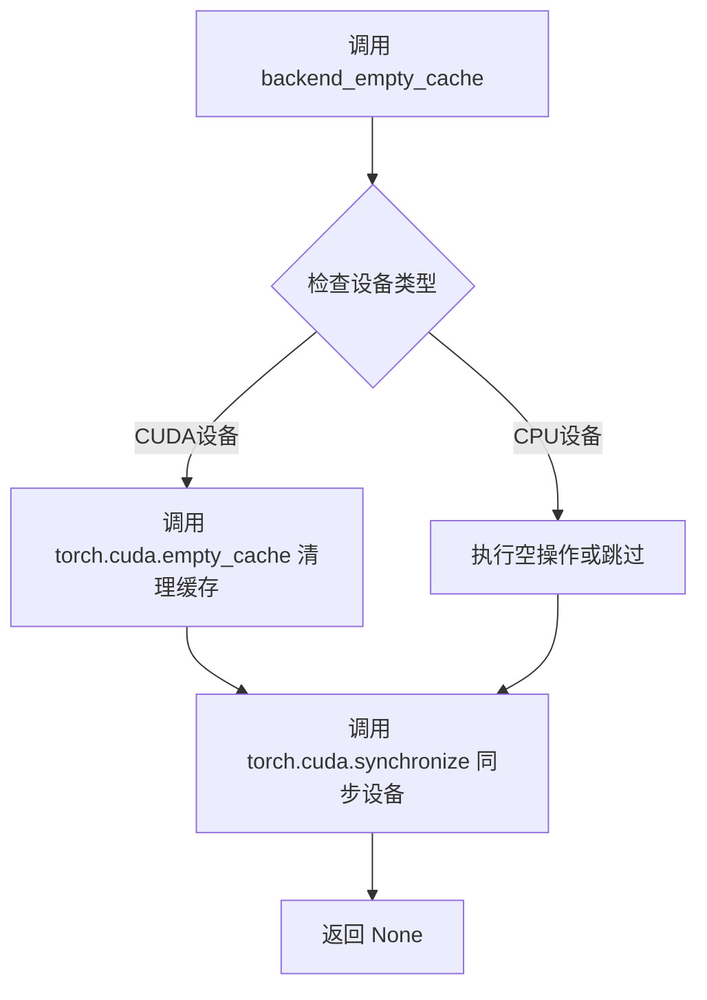

#### 带注释源码

```
# 由于 backend_empty_cache 是从 testing_utils 模块导入的外部函数，
# 当前代码文件中没有直接提供其实现。以下是根据其用途和调用方式的推断实现：

def backend_empty_cache(device: str) -> None:
    """
    清理指定设备上的GPU缓存，释放VRAM。
    
    参数:
        device: str, GPU设备标识符（如 "cuda", "cuda:0"）
    
    返回:
        None
    """
    import torch
    
    # 检查是否为CUDA设备
    if device and "cuda" in device:
        # 清理CUDA缓存，释放未使用的GPU显存
        torch.cuda.empty_cache()
        
        # 同步CUDA流，确保所有GPU操作完成
        torch.cuda.synchronize(device)
    
    # 对于非CUDA设备（如CPU），此函数不做任何操作
    # 因为CPU没有缓存需要清理

# 在测试中的实际调用方式：
# backend_empty_cache(torch_device)
# 其中 torch_device 是从 testing_utils 导入的全局变量，表示当前测试设备
```

---

**注意**：由于 `backend_empty_cache` 是从 `...testing_utils` 模块导入的外部函数，在当前提供的代码文件中没有包含其具体实现。以上源码是根据函数名称、调用上下文以及在 `setUp` 和 `tearDown` 中的使用方式推断得出的逻辑。


### `load_pt`

从 `testing_utils` 模块导入的函数，用于从指定路径或 URL 加载 PyTorch 模型/权重，并可选地指定加载到的设备位置。

参数：

-  `url_or_path`：`str`，要加载的 PyTorch 模型文件的路径或 URL（支持本地路径或 HuggingFace Hub 远程资源）
-  `map_location`：`Optional[str]`，可选参数，指定模型加载到的设备（如 `cpu`、`cuda` 等）

返回值：`Tuple[Tensor, ...]`，返回加载的 PyTorch 张量元组，可以通过索引 `[0]` 获取第一个张量（如图像嵌入向量）

#### 流程图

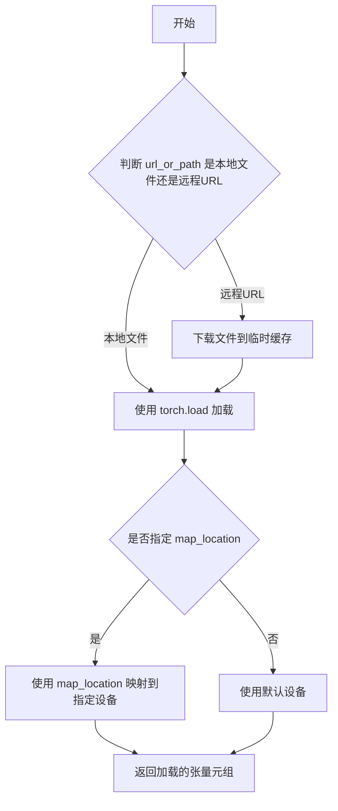

#### 带注释源码

```python
# load_pt 函数定义在 testing_utils 模块中，当前文件仅导入并使用
# 以下为使用示例，展示函数调用方式

# 调用 load_pt 加载远程嵌入文件
id_embeds = load_pt(
    "https://huggingface.co/datasets/fabiorigano/testing-images/resolve/main/ai_face2.ipadpt",  # 远程模型文件URL
    map_location=torch_device,  # 指定加载到 torch_device (如 cuda:0)
)[0]  # 取返回元组的第一个元素，得到形状为 (2, 1, 1, 512) 的嵌入张量
```

**注意**：由于 `load_pt` 函数的实际定义不在当前代码文件中（而是从 `...testing_utils` 导入），上述流程图和源码注释基于其使用方式推断。实际定义需查看 `testing_utils` 模块源文件。


### `IPAdapterNightlyTestsMixin.setUp`

该方法是测试类的初始化方法，在每个测试用例运行前执行，用于清理 VRAM（显存）以确保测试环境干净，避免因显存残留导致测试失败。

参数：

- `self`：`self`，测试类实例本身

返回值：`None`，无返回值

#### 流程图

```mermaid
flowchart TD
    A([开始 setUp]) --> B[调用 super().setUp<br/>执行父类的初始化逻辑]
    B --> C[调用 gc.collect<br/>执行 Python 垃圾回收]
    C --> D[调用 backend_empty_cache<br/>清理 GPU/后端缓存]
    D --> E([结束 setUp<br/>准备完成])
```

#### 带注释源码

```python
def setUp(self):
    # clean up the VRAM before each test
    # 在每个测试开始前清理 VRAM（显存），确保测试环境干净
    super().setUp()  # 调用父类的 setUp 方法，执行 unittest 框架的标准初始化流程
    gc.collect()  # 强制执行 Python 垃圾回收，释放不再使用的对象
    backend_empty_cache(torch_device)  # 清理 GPU 显存缓存，torch_device 指定了目标设备
```


### `IPAdapterNightlyTestsMixin.tearDown`

测试后清理方法，用于在每个测试执行完成后释放GPU显存（VRAM），防止显存泄漏。

参数：

- `self`：实例自身，类型为 `IPAdapterNightlyTestsMixin`，代表测试mixin类的实例

返回值：`None`，该方法不返回任何值，仅执行清理操作

#### 流程图

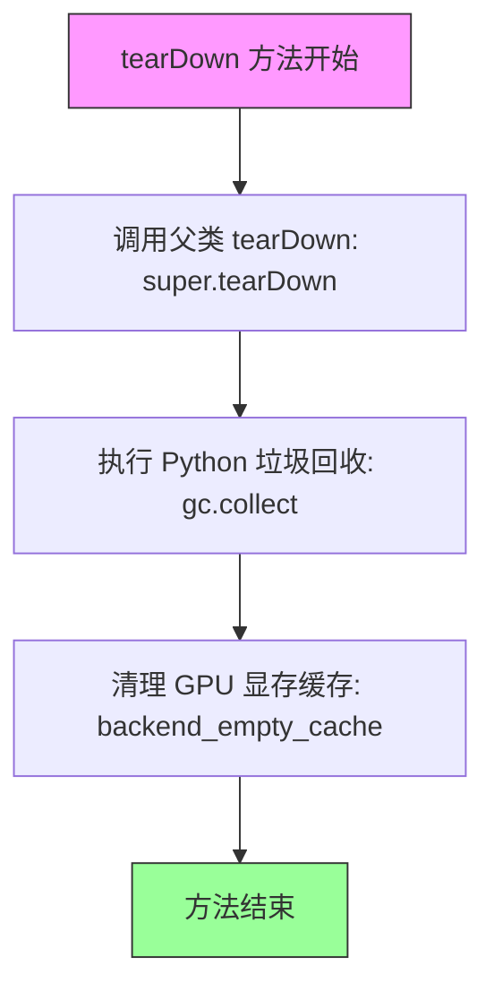

#### 带注释源码

```python
def tearDown(self):
    """
    测试后清理方法，在每个测试完成后执行清理操作。
    
    该方法的主要作用是：
    1. 调用父类的 tearDown 方法，确保测试框架正确清理
    2. 强制执行 Python 垃圾回收，释放 Python 对象
    3. 调用后端特定的缓存清理函数，释放 GPU 显存（VRAM）
    
    这样可以防止测试之间显存残留导致的显存泄漏问题，
    特别是在运行大量 GPU 相关的测试时尤为重要。
    """
    # clean up the VRAM after each test
    # 调用父类的 tearDown 方法，执行 unittest.TestCase 的标准清理
    super().tearDown()
    
    # 强制调用 Python 的垃圾回收器，清理不再使用的 Python 对象
    gc.collect()
    
    # 调用后端特定的缓存清理函数，释放 GPU 显存
    # torch_device 是全局变量，指定了当前使用的设备（如 'cuda' 或 'cpu'）
    backend_empty_cache(torch_device)
```


### `IPAdapterNightlyTestsMixin.get_image_encoder`

该方法用于从HuggingFace模型仓库加载CLIPVisionModelWithProjection图像编码器模型，并将其移动到指定的计算设备上。

参数：

- `repo_id`：`str`，HuggingFace模型仓库的唯一标识符（如"h94/IP-Adapter"）
- `subfolder`：`str`，模型在仓库中的子文件夹路径（如"models/image_encoder"）

返回值：`CLIPVisionModelWithProjection`，加载并转换到目标设备（torch_device）的图像编码器模型实例

#### 流程图

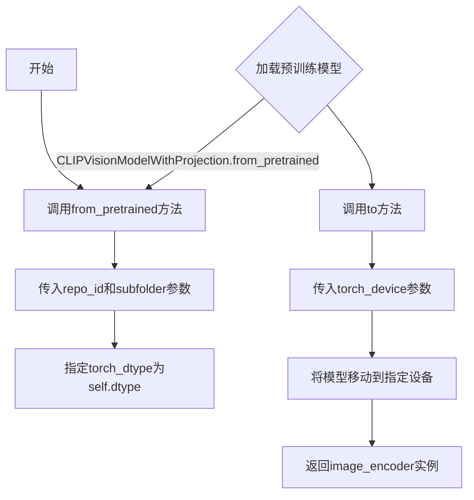

#### 带注释源码

```python
def get_image_encoder(self, repo_id, subfolder):
    """
    从预训练模型仓库加载CLIPVisionModelWithProjection图像编码器
    
    参数:
        repo_id: HuggingFace模型仓库ID
        subfolder: 模型子文件夹路径
    
    返回:
        加载并移动到torch_device的CLIPVisionModelWithProjection模型
    """
    # 使用from_pretrained方法加载预训练的CLIPVisionModelWithProjection模型
    # repo_id: 模型在HuggingFace Hub上的仓库标识
    # subfolder: 指定模型文件所在的子目录
    # torch_dtype: 指定模型的张量数据类型（这里使用self.dtype，通常为float16）
    image_encoder = CLIPVisionModelWithProjection.from_pretrained(
        repo_id, subfolder=subfolder, torch_dtype=self.dtype
    ).to(torch_device)  # 将加载的模型移动到指定的计算设备（GPU/CPU）
    return image_encoder  # 返回配置好的图像编码器实例
```


### `IPAdapterNightlyTestsMixin.get_image_processor`

该方法是一个测试辅助函数，用于从HuggingFace模型仓库加载预训练的CLIP图像处理器（CLIPImageProcessor），以便在IP-Adapter集成测试中对输入图像进行预处理和特征提取。

参数：

- `repo_id`：`str`，HuggingFace模型仓库的唯一标识符（如"laion/CLIP-ViT-bigG-14-laion2B-39B-b160k"），用于指定从哪个预训练模型仓库加载CLIP图像处理器

返回值：`CLIPImageProcessor`，从指定模型仓库加载的CLIP图像处理器实例，用于对图像进行预处理（包括调整大小、归一化等操作），以适配CLIP模型的输入要求

#### 流程图

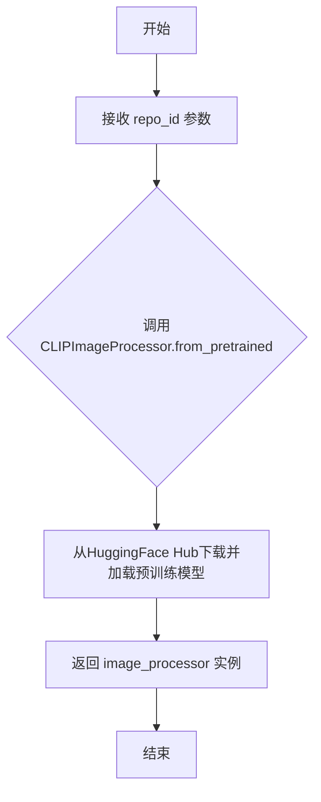

#### 带注释源码

```python
def get_image_processor(self, repo_id):
    """
    从预训练模型加载CLIP图像处理器
    
    参数:
        repo_id: str, HuggingFace模型仓库ID，用于指定CLIPImageProcessor的预训练模型
    
    返回:
        CLIPImageProcessor: 加载后的图像处理器实例
    """
    # 使用CLIPImageProcessor的from_pretrained方法从指定仓库加载预训练模型
    # 该处理器会自动配置图像预处理参数（图像尺寸、归一化等）
    image_processor = CLIPImageProcessor.from_pretrained(repo_id)
    
    # 返回配置好的图像处理器，供测试中的图像预处理使用
    return image_processor
```


### `IPAdapterNightlyTestsMixin.get_dummy_inputs`

生成测试用输入参数，支持多种模式（text-to-image、image-to-image、inpainting、mask、instant style），并支持SDXL模型。返回的字典包含用于Stable Diffusion pipeline推理的各种参数。

参数：

- `for_image_to_image`：`bool`，是否为图像到图像（Img2Img）模式准备输入
- `for_inpainting`：`bool`，是否为修复（Inpainting）模式准备输入
- `for_sdxl`：`bool`，是否为SDXL模型准备输入（图像将resize到1024x1024）
- `for_masks`：`bool`，是否准备多掩码输入（用于多IP-Adapter场景）
- `for_instant_style`：`bool`，是否为Instant Style模式准备输入（多层风格迁移）

返回值：`dict`，包含以下键值的参数字典：
- `prompt`：str，正向提示词
- `negative_prompt`：str，负向提示词
- `num_inference_steps`：int，推理步数（固定为5）
- `generator`：torch.Generator，随机数生成器（固定seed=33）
- `ip_adapter_image`：Image或list，IP-Adapter参考图像
- `output_type`：str，输出类型（固定为"np"即numpy数组）
- `image`：（可选）输入图像，用于Img2Img或Inpainting
- `mask_image`：（可选）掩码图像，用于Inpainting
- `cross_attention_kwargs`：（可选）包含`ip_adapter_masks`的字典

#### 流程图

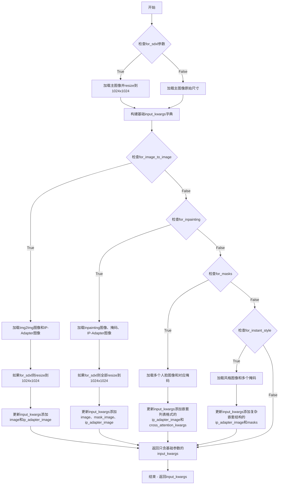

#### 带注释源码

```python
def get_dummy_inputs(
    self,
    for_image_to_image=False,    # 是否为图像到图像模式
    for_inpainting=False,        # 是否为修复模式
    for_sdxl=False,              # 是否为SDXL模型（图像需要更大分辨率）
    for_masks=False,             # 是否使用多个掩码
    for_instant_style=False      # 是否为Instant Style多风格模式
):
    """
    生成测试用输入参数，支持多种扩散模型场景
    
    参数:
        for_image_to_image: 是否为Img2Img模式准备输入
        for_inpainting: 是否为Inpainting模式准备输入
        for_sdxl: 是否为SDXL模型准备输入
        for_masks: 是否准备多掩码输入
        for_instant_style: 是否为Instant Style模式准备输入
    
    返回:
        dict: 包含pipeline所需的各种参数
    """
    # 加载默认的IP-Adapter参考图像（一个带眼镜的人物图像）
    image = load_image(
        "https://user-images.githubusercontent.com/24734142/266492875-2d50d223-8475-44f0-a7c6-08b51cb53572.png"
    )
    
    # SDXL模型需要更高分辨率的图像（1024x1024）
    if for_sdxl:
        image = image.resize((1024, 1024))

    # 构建基础参数字典，包含所有模式共用的参数
    input_kwargs = {
        "prompt": "best quality, high quality",              # 正向提示词
        "negative_prompt": "monochrome, lowres, bad anatomy, worst quality, low quality",  # 负向提示词
        "num_inference_steps": 5,                            # 推理步数，测试用较小值
        "generator": torch.Generator(device="cpu").manual_seed(33),  # 固定随机种子确保可复现性
        "ip_adapter_image": image,                           # IP-Adapter参考图像
        "output_type": "np",                                 # 输出为numpy数组
    }
    
    # 根据不同模式添加特定的图像参数
    if for_image_to_image:
        # 图像到图像模式：需要原图和IP-Adapter图像
        image = load_image("https://huggingface.co/datasets/YiYiXu/testing-images/resolve/main/vermeer.jpg")
        ip_image = load_image("https://huggingface.co/datasets/YiYiXu/testing-images/resolve/main/river.png")

        if for_sdxl:
            image = image.resize((1024, 1024))
            ip_image = ip_image.resize((1024, 1024))

        input_kwargs.update({"image": image, "ip_adapter_image": ip_image})

    elif for_inpainting:
        # 修复模式：需要原图、掩码图和IP-Adapter图像
        image = load_image("https://huggingface.co/datasets/YiYiXu/testing-images/resolve/main/inpaint_image.png")
        mask = load_image("https://huggingface.co/datasets/YiYiXu/testing-images/resolve/main/mask.png")
        ip_image = load_image("https://huggingface.co/datasets/YiYiXu/testing-images/resolve/main/girl.png")

        if for_sdxl:
            image = image.resize((1024, 1024))
            mask = mask.resize((1024, 1024))
            ip_image = ip_image.resize((1024, 1024))

        input_kwargs.update({"image": image, "mask_image": mask, "ip_adapter_image": ip_image})

    elif for_masks:
        # 多掩码模式：支持多个IP-Adapter和对应的区域掩码
        # 用于细粒度控制不同区域使用不同的参考图像
        face_image1 = load_image(
            "https://huggingface.co/datasets/YiYiXu/testing-images/resolve/main/ip_mask_girl1.png"
        )
        face_image2 = load_image(
            "https://huggingface.co/datasets/YiYiXu/testing-images/resolve/main/ip_mask_girl2.png"
        )
        mask1 = load_image("https://huggingface.co/datasets/YiYiXu/testing-images/resolve/main/ip_mask_mask1.png")
        mask2 = load_image("https://huggingface.co/datasets/YiYiXu/testing-images/resolve/main/ip_mask_mask2.png")
        
        # ip_adapter_image为嵌套列表结构，每个内部列表对应一个IP-Adapter
        # cross_attention_kwargs.ip_adapter_masks为对应的掩码列表
        input_kwargs.update(
            {
                "ip_adapter_image": [[face_image1], [face_image2]],  # 嵌套结构支持多adapter
                "cross_attention_kwargs": {"ip_adapter_masks": [mask1, mask2]},
            }
        )

    elif for_instant_style:
        # Instant Style模式：支持多层风格迁移
        # 可以同时迁移构图、女性风格、男性风格、背景风格等
        composition_mask = load_image(
            "https://huggingface.co/datasets/OzzyGT/testing-resources/resolve/main/1024_whole_mask.png"
        )
        female_mask = load_image(
            "https://huggingface.co/datasets/OzzyGT/testing-resources/resolve/main/ip_adapter_None_20240321125641_mask.png"
        )
        male_mask = load_image(
            "https://huggingface.co/datasets/OzzyGT/testing-resources/resolve/main/ip_adapter_None_20240321125344_mask.png"
        )
        background_mask = load_image(
            "https://huggingface.co/datasets/OzzyGT/testing-resources/resolve/main/ip_adapter_6_20240321130722_mask.png"
        )
        
        # IP-Adapter图像：第一个元素为构图参考，后面列表为多个风格参考
        ip_composition_image = load_image(
            "https://huggingface.co/datasets/OzzyGT/testing-resources/resolve/main/ip_adapter__20240321125152.png"
        )
        ip_female_style = load_image(
            "https://huggingface.co/datasets/OzzyGT/testing-resources/resolve/main/ip_adapter__20240321125625.png"
        )
        ip_male_style = load_image(
            "https://huggingface.co/datasets/OzzyGT/testing-resources/resolve/main/ip_adapter__20240321125329.png"
        )
        ip_background = load_image(
            "https://huggingface.co/datasets/OzzyGT/testing-resources/resolve/main/ip_adapter__20240321130643.png"
        )
        
        # 复杂的嵌套结构支持多层风格控制
        input_kwargs.update(
            {
                "ip_adapter_image": [ip_composition_image, [ip_female_style, ip_male_style, ip_background]],
                "cross_attention_kwargs": {
                    "ip_adapter_masks": [[composition_mask], [female_mask, male_mask, background_mask]]
                },
            }
        )

    return input_kwargs
```


### `IPAdapterSDIntegrationTests.test_text_to_image`

该测试方法用于验证IP Adapter与Stable Diffusion Pipeline的文本到图像生成集成功能。测试流程包括加载图像编码器、初始化Pipeline、加载IP Adapter权重、执行推理，并通过余弦相似度比较生成的图像与预期结果以确保功能正确性。

#### 流程图

```mermaid
flowchart TD
    A[开始测试] --> B[获取图像编码器<br/>get_image_encoder]
    B --> C[从预训练模型加载StableDiffusionPipeline]
    C --> D[将Pipeline移动到设备<br/>torch_device]
    D --> E[加载IP Adapter权重<br/>ip-adapter_sd15.bin]
    E --> F[获取虚拟输入<br/>get_dummy_inputs]
    F --> G[执行文本到图像生成<br/>pipeline(**inputs)]
    G --> H[提取生成的图像切片<br/>images[0, :3, :3, -1]]
    H --> I[计算余弦相似度距离<br/>numpy_cosine_similarity_distance]
    I --> J{max_diff < 5e-4?}
    J -->|是| K[加载IP Adapter Plus权重<br/>ip-adapter-plus_sd15.bin]
    J -->|否| L[测试失败]
    K --> F2[重新获取虚拟输入]
    F2 --> G2[再次执行生成]
    G2 --> H2[提取图像切片]
    H2 --> I2[计算相似度距离]
    I2 --> J2{max_diff < 5e-4?}
    J2 -->|是| M[测试通过]
    J2 -->|否| L
```

#### 带注释源码

```python
def test_text_to_image(self):
    """
    测试IP Adapter的文本到图像生成功能
    验证标准IP Adapter和IP Adapter Plus两种模式的生成结果
    """
    
    # Step 1: 获取图像编码器模型
    # 从h94/IP-Adapter仓库加载CLIPVisionModelWithProjection
    # subfolder="models/image_encoder"指定了子目录路径
    image_encoder = self.get_image_encoder(
        repo_id="h94/IP-Adapter", 
        subfolder="models/image_encoder"
    )
    
    # Step 2: 创建Stable Diffusion Pipeline
    # 从stable-diffusion-v1-5模型加载完整的文本到图像Pipeline
    # 传入image_encoder用于IP Adapter的特征提取
    # safety_checker=None禁用安全检查器以加快测试速度
    # torch_dtype=self.dtype使用float16加速推理
    pipeline = StableDiffusionPipeline.from_pretrained(
        "stable-diffusion-v1-5/stable-diffusion-v1-5",
        image_encoder=image_encoder,
        safety_checker=None,
        torch_dtype=self.dtype,
    )
    
    # Step 3: 将Pipeline移动到计算设备
    # torch_device通常是cuda或cpu
    pipeline.to(torch_device)
    
    # Step 4: 加载IP Adapter权重
    # 从HuggingFace Hub加载IP-Adapter模型权重
    # weight_name="ip-adapter_sd15.bin"是SD1.5的权重文件
    pipeline.load_ip_adapter(
        "h94/IP-Adapter", 
        subfolder="models", 
        weight_name="ip-adapter_sd15.bin"
    )
    
    # Step 5: 获取测试输入参数
    # 包含提示词、负提示词、推理步数、随机种子、IP适配图像等
    inputs = self.get_dummy_inputs()
    
    # Step 6: 执行文本到图像生成
    # **inputs解包字典作为关键字参数传入
    images = pipeline(**inputs).images
    
    # Step 7: 提取图像切片用于验证
    # 取第一张图像的前3x3像素块，展平为一维数组
    # 只保留最后一个通道（RGB中的R或Alpha）
    image_slice = images[0, :3, :3, -1].flatten()
    
    # Step 8: 定义预期的像素值切片
    # 这是预先计算的正确结果，用于对比验证
    expected_slice = np.array([
        0.80810547, 0.88183594, 0.9296875, 
        0.9189453, 0.9848633, 1.0, 
        0.97021484, 1.0, 1.0
    ])
    
    # Step 9: 计算生成图像与预期图像的余弦相似度距离
    max_diff = numpy_cosine_similarity_distance(image_slice, expected_slice)
    
    # Step 10: 断言验证生成质量
    # 余弦相似度距离应小于5e-4才算通过
    assert max_diff < 5e-4
    
    # ====== 测试IP Adapter Plus版本 ======
    
    # Step 11: 加载IP Adapter Plus权重
    # Plus版本通常能提供更好的图像提示效果
    pipeline.load_ip_adapter(
        "h94/IP-Adapter", 
        subfolder="models", 
        weight_name="ip-adapter-plus_sd15.bin"
    )
    
    # Step 12: 重新获取输入参数
    inputs = self.get_dummy_inputs()
    
    # Step 13: 再次执行生成
    images = pipeline(**inputs).images
    
    # Step 14: 提取并验证生成的图像
    image_slice = images[0, :3, :3, -1].flatten()
    
    # Step 15: 定义Plus版本的预期结果
    expected_slice = np.array([
        0.30444336, 0.26513672, 0.22436523, 
        0.2758789, 0.25585938, 0.20751953, 
        0.25390625, 0.24633789, 0.21923828
    ])
    
    # Step 16: 验证Plus版本的生成质量
    max_diff = numpy_cosine_similarity_distance(image_slice, expected_slice)
    assert max_diff < 5e-4
```


### `IPAdapterSDIntegrationTests.test_image_to_image`

该方法测试 IP-Adapter 在 Stable Diffusion Image-to-Image pipeline 中的集成功能，验证图像转换结果与预期输出的余弦相似度是否在可接受范围内。

参数：

- `self`：当前测试类实例，无需显式传递

返回值：`None`，该方法为测试方法，通过断言验证图像转换的正确性

#### 流程图

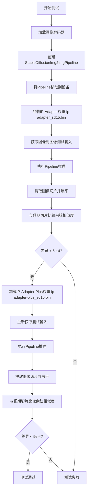

#### 带注释源码

```python
def test_image_to_image(self):
    """
    测试 IP-Adapter 在图像到图像（Image-to-Image）任务中的集成功能。
    验证使用 IP-Adapter 进行图像转换时，输出图像与预期结果的相似度。
    """
    
    # 步骤1：加载图像编码器模型
    # 从预训练模型仓库加载 CLIPVisionModelWithProjection，用于提取图像特征
    image_encoder = self.get_image_encoder(repo_id="h94/IP-Adapter", subfolder="models/image_encoder")
    
    # 步骤2：创建 StableDiffusionImg2ImgPipeline
    # 加载 Stable Diffusion v1.5 的 Image-to-Image  pipeline，并传入图像编码器
    pipeline = StableDiffusionImg2ImgPipeline.from_pretrained(
        "stable-diffusion-v1-5/stable-diffusion-v1-5",
        image_encoder=image_encoder,  # 传入图像编码器用于 IP-Adapter
        safety_checker=None,           # 禁用安全检查器以避免干扰测试
        torch_dtype=self.dtype,        # 使用半精度浮点数（float16）以提高推理速度
    )
    
    # 步骤3：将 Pipeline 移动到指定设备（GPU）
    pipeline.to(torch_device)
    
    # 步骤4：加载标准 IP-Adapter 权重
    # weight_name="ip-adapter_sd15.bin" 是针对 SD1.5 的标准 IP-Adapter 权重
    pipeline.load_ip_adapter("h94/IP-Adapter", subfolder="models", weight_name="ip-adapter_sd15.bin")
    
    # 步骤5：获取测试输入
    # for_image_to_image=True 会加载用于图像到图像转换的测试图像
    inputs = self.get_dummy_inputs(for_image_to_image=True)
    
    # 步骤6：执行图像到图像转换推理
    # 使用 IP-Adapter 引导图像转换过程
    images = pipeline(**inputs).images
    
    # 步骤7：提取图像切片用于验证
    # 取第一张图像的前3x3像素区域，并提取最后一个通道（RGB的A通道或Luma通道）
    image_slice = images[0, :3, :3, -1].flatten()
    
    # 步骤8：定义预期输出的像素值
    # 这些值是预先计算的标准 IP-Adapter 输出的参考切片
    expected_slice = np.array(
        [0.22167969, 0.21875, 0.21728516, 0.22607422, 0.21948242, 0.23925781, 0.22387695, 0.25268555, 0.2722168]
    )
    
    # 步骤9：计算余弦相似度距离
    max_diff = numpy_cosine_similarity_distance(image_slice, expected_slice)
    
    # 步骤10：验证结果
    # 确保标准 IP-Adapter 的输出与预期足够相似
    assert max_diff < 5e-4
    
    # 步骤11：加载增强版 IP-Adapter Plus 权重
    # ip-adapter-plus_sd15.bin 是改进版本，提供更好的图像适配效果
    pipeline.load_ip_adapter("h94/IP-Adapter", subfolder="models", weight_name="ip-adapter-plus_sd15.bin")
    
    # 步骤12：重新获取测试输入并推理
    # 使用相同的输入测试增强版 IP-Adapter
    inputs = self.get_dummy_inputs(for_image_to_image=True)
    images = pipeline(**inputs).images
    image_slice = images[0, :3, :3, -1].flatten()
    
    # 步骤13：定义增强版 IP-Adapter 的预期输出
    expected_slice = np.array(
        [0.35913086, 0.265625, 0.26367188, 0.24658203, 0.19750977, 0.39990234, 0.15258789, 0.20336914, 0.5517578]
    )
    
    # 步骤14：验证增强版 IP-Adapter 的输出
    max_diff = numpy_cosine_similarity_distance(image_slice, expected_slice)
    assert max_diff < 5e-4
```


### `IPAdapterSDIntegrationTests.test_inpainting`

测试方法，用于验证 IP-Adapter 在 Stable Diffusion 图像修复（Inpainting）任务中的功能是否正常工作，通过对比生成图像与预期图像的余弦相似度来断言模型输出的正确性。

参数：

- `self`：当前测试类实例，无需显式传递

返回值：`None`，该方法为测试方法，不返回任何值

#### 流程图

```mermaid
flowchart TD
    A[开始测试] --> B[获取图像编码器<br/>repo_id: h94/IP-Adapter<br/>subfolder: models/image_encoder]
    B --> C[从预训练模型加载 StableDiffusionInpaintPipeline<br/>模型: stable-diffusion-v1-5<br/>image_encoder: 传入的编码器<br/>dtype: self.dtype]
    C --> D[将 pipeline 移动到 torch_device]
    D --> E[加载 IP-Adapter 权重<br/>weight_name: ip-adapter_sd15.bin]
    E --> F[获取图像修复的虚拟输入<br/>for_inpainting=True]
    F --> G[调用 pipeline 生成图像<br/>images = pipeline(**inputs)]
    G --> H[提取生成图像的切片<br/>image_slice = images[0, :3, :3, -1].flatten()]
    H --> I[定义预期的像素值数组<br/>expected_slice]
    I --> J[计算余弦相似度距离<br/>max_diff = numpy_cosine_similarity_distance]
    J --> K{max_diff < 5e-4?}
    K -->|是| L[重新加载 IP-Adapter Plus 权重<br/>weight_name: ip-adapter-plus_sd15.bin]
    K -->|否| M[测试失败 - 抛出断言错误]
    L --> N[再次获取虚拟输入并生成图像]
    N --> O[再次计算余弦相似度距离]
    O --> P{max_diff < 5e-4?}
    P -->|是| Q[测试通过]
    P -->|否| R[测试失败 - 抛出断言错误]
```

#### 带注释源码

```python
def test_inpainting(self):
    """
    测试 IP-Adapter 在图像修复（Inpainting）任务中的功能。
    验证标准 IP-Adapter 和 IP-Adapter Plus 两种权重配置下的输出质量。
    """
    # 步骤1: 获取图像编码器模型
    # 从 HuggingFace Hub 下载并加载 CLIPVisionModelWithProjection 模型
    # 参数: repo_id="h94/IP-Adapter", subfolder="models/image_encoder"
    image_encoder = self.get_image_encoder(repo_id="h94/IP-Adapter", subfolder="models/image_encoder")
    
    # 步骤2: 创建 Stable Diffusion 图像修复 Pipeline
    # 从预训练模型加载完整的图像修复pipeline，包含：
    # - UNet2DConditionModel: 主干生成模型
    # - VAE: 变分自编码器
    # - text_encoder: 文本编码器
    # - tokenizer: 分词器
    # - image_encoder: 传入的 CLIP 视觉编码器（用于 IP-Adapter）
    # - safety_checker: 设置为 None 以避免安全过滤器干扰测试
    # - torch_dtype: 使用半精度浮点数（torch.float16）加速推理
    pipeline = StableDiffusionInpaintPipeline.from_pretrained(
        "stable-diffusion-v1-5/stable-diffusion-v1-5",
        image_encoder=image_encoder,
        safety_checker=None,
        torch_dtype=self.dtype,
    )
    
    # 步骤3: 将 Pipeline 移动到指定的计算设备（如 GPU）
    pipeline.to(torch_device)
    
    # 步骤4: 加载标准 IP-Adapter 权重
    # IP-Adapter 是一种轻量级的图像提示适配器
    # 权重文件: ip-adapter_sd15.bin（适用于 Stable Diffusion 1.5）
    pipeline.load_ip_adapter("h94/IP-Adapter", subfolder="models", weight_name="ip-adapter_sd15.bin")
    
    # 步骤5: 获取图像修复的测试输入数据
    # 该方法会加载：
    # - 待修复的图像 (image)
    # - 修复掩码 (mask_image)
    # - IP-Adapter 参考图像 (ip_adapter_image)
    inputs = self.get_dummy_inputs(for_inpainting=True)
    
    # 步骤6: 执行图像修复推理
    # 传入 prompt、图像、掩码和 IP-Adapter 图像
    # 返回包含生成图像的对象，.images 属性获取图像数组
    images = pipeline(**inputs).images
    
    # 步骤7: 提取生成图像的样本切片用于验证
    # 取第一张图像的左上角 3x3 区域，并展平为 1D 数组
    # 这是常见的测试策略：通过比较关键像素区域来验证模型行为
    image_slice = images[0, :3, :3, -1].flatten()
    
    # 步骤8: 定义预期的像素值数组（预先计算的正确输出）
    # 这些值是通过在确定性条件下运行测试得到的参考值
    expected_slice = np.array(
        [0.27148438, 0.24047852, 0.22167969, 0.23217773, 0.21118164, 0.21142578, 0.21875, 0.20751953, 0.20019531]
    )
    
    # 步骤9: 计算生成图像与预期图像的余弦相似度距离
    # 该指标衡量两个向量方向的差异（0 表示完全相同）
    max_diff = numpy_cosine_similarity_distance(image_slice, expected_slice)
    
    # 步骤10: 断言测试通过条件
    # 余弦相似度距离必须小于 5e-4，确保输出与预期高度一致
    assert max_diff < 5e-4
    
    # ===== 测试 IP-Adapter Plus =====
    
    # 步骤11: 重新加载 IP-Adapter Plus 权重
    # Plus 版本通常提供更好的图像提示效果
    pipeline.load_ip_adapter("h94/IP-Adapter", subfolder="models", weight_name="ip-adapter-plus_sd15.bin")
    
    # 步骤12: 再次执行图像修复推理（使用相同的输入）
    inputs = self.get_dummy_inputs(for_inpainting=True)
    images = pipeline(**inputs).images
    
    # 步骤13: 提取生成的图像切片
    image_slice = images[0, :3, :3, -1].flatten()
    
    # 步骤14: 再次验证输出质量
    # 注意：此处使用了相同的 expected_slice（可能存在测试逻辑问题）
    max_diff = numpy_cosine_similarity_distance(image_slice, expected_slice)
    assert max_diff < 5e-4
```


### `IPAdapterSDIntegrationTests.test_text_to_image_model_cpu_offload`

该测试方法用于验证Stable Diffusionpipeline在启用CPU卸载功能后，推理结果应保持一致，并且所有可卸载的模块应正确迁移到CPU设备上。

参数：

- `self`：测试类实例本身，无显式参数

返回值：`None`，该方法为测试用例，通过断言验证功能正确性，不返回具体数据

#### 流程图

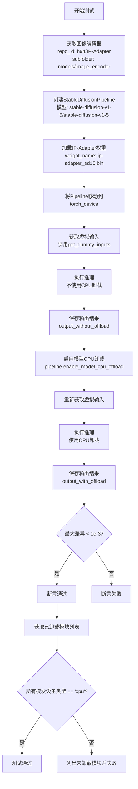

#### 带注释源码

```python
def test_text_to_image_model_cpu_offload(self):
    # 步骤1: 获取图像编码器模型，用于IP-Adapter特征提取
    # 从h94/IP-Adapter仓库的models/image_encoder子文件夹加载CLIPVisionModelWithProjection
    image_encoder = self.get_image_encoder(repo_id="h94/IP-Adapter", subfolder="models/image_encoder")
    
    # 步骤2: 创建Stable Diffusion Pipeline
    # 从stable-diffusion-v1-5模型创建pipeline，传入图像编码器
    # torch_dtype=self.dtype (torch.float16) 用于指定模型精度
    pipeline = StableDiffusionPipeline.from_pretrained(
        "stable-diffusion-v1-5/stable-diffusion-v1-5",
        image_encoder=image_encoder,
        safety_checker=None,
        torch_dtype=self.dtype,
    )
    
    # 步骤3: 加载IP-Adapter权重文件
    # 这会将IP-Adapter的权重加载到pipeline中
    pipeline.load_ip_adapter("h94/IP-Adapter", subfolder="models", weight_name="ip-adapter_sd15.bin")
    
    # 步骤4: 将pipeline移动到指定设备（GPU或CPU）
    pipeline.to(torch_device)
    
    # 步骤5: 获取测试用的虚拟输入参数
    inputs = self.get_dummy_inputs()
    
    # 步骤6: 在没有启用CPU卸载的情况下执行推理
    # 获取基准输出结果
    output_without_offload = pipeline(**inputs).images
    
    # 步骤7: 启用模型的CPU卸载功能
    # 这会将模型权重在推理完成后自动卸载到CPU以节省GPU显存
    pipeline.enable_model_cpu_offload(device=torch_device)
    
    # 步骤8: 重新获取虚拟输入（可能包含随机种子等）
    inputs = self.get_dummy_inputs()
    
    # 步骤9: 启用CPU卸载后执行推理
    output_with_offload = pipeline(**inputs).images
    
    # 步骤10: 验证推理结果一致性
    # 计算两个输出之间的最大绝对差异
    max_diff = np.abs(output_with_offload - output_without_offload).max()
    
    # 断言：CPU卸载不应影响推理结果
    # 允许的最大差异阈值为1e-3
    self.assertLess(max_diff, 1e-3, "CPU offloading should not affect the inference results")
    
    # 步骤11: 验证模块是否正确卸载到CPU
    # 获取所有需要卸载的模块（排除在_exclude_from_cpu_offload列表中的模块）
    offloaded_modules = [
        v
        for k, v in pipeline.components.items()
        if isinstance(v, torch.nn.Module) and k not in pipeline._exclude_from_cpu_offload
    ]
    
    # 断言：所有可卸载模块都应该位于CPU上
    # 如果有模块未卸载，会列出具体模块信息
    (
        self.assertTrue(all(v.device.type == "cpu" for v in offloaded_modules)),
        f"Not offloaded: {[v for v in offloaded_modules if v.device.type != 'cpu']}",
    )
```


### `IPAdapterSDIntegrationTests.test_text_to_image_full_face`

测试全脸IP-Adapter在文本到图像生成任务中的集成功能，验证使用`ip-adapter-full-face_sd15.bin`权重时模型能够正确生成符合预期特征的图像。

参数：

- `self`：`IPAdapterSDIntegrationTests`，测试类的实例，包含测试所需的fixture方法和配置

返回值：`None`，测试方法无返回值，通过断言验证图像质量

#### 流程图

```mermaid
flowchart TD
    A[开始测试] --> B[获取图像编码器<br/>repo_id: h94/IP-Adapter<br/>subfolder: models/image_encoder]
    B --> C[从预训练模型加载StableDiffusionPipeline<br/>模型: stable-diffusion-v1-5]
    C --> D[将Pipeline移动到torch_device]
    D --> E[加载IP-Adapter权重<br/>weight_name: ip-adapter-full-face_sd15.bin]
    E --> F[设置IP-Adapter权重比例<br/>scale: 0.7]
    F --> G[获取测试输入<br/>调用get_dummy_inputs方法]
    G --> H[执行Pipeline推理<br/>pipeline(**inputs)]
    H --> I[提取生成的图像切片<br/>images[0, :3, :3, -1]]
    I --> J[定义期望的图像切片值<br/>expected_slice数组]
    J --> K[计算余弦相似度距离<br/>numpy_cosine_similarity_distance]
    K --> L{距离 < 5e-4?}
    L -->|是| M[测试通过]
    L -->|否| N[测试失败<br/>抛出AssertionError]
```

#### 带注释源码

```python
def test_text_to_image_full_face(self):
    """
    测试全脸IP-Adapter的文本到图像生成功能
    使用ip-adapter-full-face_sd15.bin权重进行全脸图像适配
    """
    # 步骤1: 获取图像编码器模型
    # 从h94/IP-Adapter仓库加载CLIPVisionModelWithProjection
    # subfolder指定为models/image_encoder
    image_encoder = self.get_image_encoder(repo_id="h94/IP-Adapter", subfolder="models/image_encoder")
    
    # 步骤2: 创建StableDiffusionPipeline
    # 从stable-diffusion-v1-5加载预训练模型
    # 传入image_encoder用于IP-Adapter的图像特征提取
    # safety_checker设为None以避免安全过滤器干扰测试
    # 使用类属性dtype（torch.float16）以提高推理效率
    pipeline = StableDiffusionPipeline.from_pretrained(
        "stable-diffusion-v1-5/stable-diffusion-v1-5",
        image_encoder=image_encoder,
        safety_checker=None,
        torch_dtype=self.dtype,
    )
    
    # 步骤3: 将Pipeline移至目标设备（GPU）
    pipeline.to(torch_device)
    
    # 步骤4: 加载IP-Adapter权重
    # 使用full-face专用权重，该权重专门针对全脸图像适配优化
    pipeline.load_ip_adapter("h94/IP-Adapter", subfolder="models", weight_name="ip-adapter-full-face_sd15.bin")
    
    # 步骤5: 设置IP-Adapter的影响权重
    # 0.7表示IP-Adapter对生成图像的影响程度为70%
    pipeline.set_ip_adapter_scale(0.7)
    
    # 步骤6: 获取测试输入参数
    # 调用父类方法获取标准测试输入
    # 包含prompt、negative_prompt、num_inference_steps、generator、ip_adapter_image等
    inputs = self.get_dummy_inputs()
    
    # 步骤7: 执行文本到图像生成
    # 使用IP-Adapter引导生成图像
    images = pipeline(**inputs).images
    
    # 步骤8: 提取图像切片用于验证
    # 取第一张图像的前3x3像素区域，保留最后一个通道（RGB）
    image_slice = images[0, :3, :3, -1].flatten()
    
    # 步骤9: 定义期望的图像像素值
    # 这些值是经过验证的参考输出，用于确保模型行为一致性
    expected_slice = np.array([0.1704, 0.1296, 0.1272, 0.2212, 0.1514, 0.1479, 0.4172, 0.4263, 0.4360])
    
    # 步骤10: 计算生成图像与期望图像的差异
    # 使用余弦相似度距离作为度量指标
    max_diff = numpy_cosine_similarity_distance(image_slice, expected_slice)
    
    # 步骤11: 验证生成质量
    # 确保差异小于阈值5e-4，以保证输出的稳定性和一致性
    assert max_diff < 5e-4
```


### `IPAdapterSDIntegrationTests.test_unload`

该测试方法用于验证 IP-Adapter 的卸载功能，确保在调用 `unload_ip_adapter()` 方法后，相关的 IP-Adapter 组件（如 `image_encoder`）被正确移除，同时保留其他组件（如 `feature_extractor`），并且 UNet 的注意力处理器能够恢复到原始状态。

参数：

- `self`：测试类实例，无需显式传递

返回值：`None`，该方法为测试方法，不返回任何值

#### 流程图

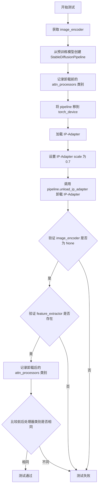

#### 带注释源码

```python
def test_unload(self):
    """
    测试卸载 IP-Adapter 功能
    
    验证：
    1. image_encoder 在卸载后被正确移除（为 None）
    2. feature_extractor 在卸载后仍然保留
    3. UNet 的注意力处理器在卸载后恢复到原始状态
    """
    # 步骤1: 获取图像编码器模型
    # 从预训练仓库 "h94/IP-Adapter" 加载 image_encoder 子模块
    image_encoder = self.get_image_encoder(repo_id="h94/IP-Adapter", subfolder="models/image_encoder")
    
    # 步骤2: 创建 StableDiffusionPipeline
    # 从 "stable-diffusion-v1-5/stable-diffusion-v1-5" 加载预训练模型
    # 传入 image_encoder 用于 IP-Adapter 功能
    # 设置 safety_checker=None 以避免不必要的审查
    # 使用 float16 精度以提高推理速度
    pipeline = StableDiffusionPipeline.from_pretrained(
        "stable-diffusion-v1-5/stable-diffusion-v1-5",
        image_encoder=image_encoder,
        safety_checker=None,
        torch_dtype=self.dtype,
    )
    
    # 步骤3: 记录卸载前的注意力处理器
    # 保存所有注意力处理器的类名，用于后续比较
    before_processors = [attn_proc.__class__ for attn_proc in pipeline.unet.attn_processors.values()]
    
    # 步骤4: 将 pipeline 移到指定设备
    # torch_device 通常是 CUDA 设备
    pipeline.to(torch_device)
    
    # 步骤5: 加载 IP-Adapter
    # 从 "h94/IP-Adapter" 加载 IP-Adapter 权重
    # 使用 "ip-adapter_sd15.bin" 权重文件
    pipeline.load_ip_adapter("h94/IP-Adapter", subfolder="models", weight_name="ip-adapter_sd15.bin")
    
    # 步骤6: 设置 IP-Adapter 缩放因子
    # 0.7 表示 IP-Adapter 对生成结果的影响程度
    pipeline.set_ip_adapter_scale(0.7)
    
    # 步骤7: 卸载 IP-Adapter
    # 调用 pipeline 的 unload_ip_adapter 方法移除 IP-Adapter
    pipeline.unload_ip_adapter()
    
    # 步骤8: 验证 image_encoder 被正确卸载
    # 卸载后 image_encoder 属性应该为 None
    assert getattr(pipeline, "image_encoder") is None
    
    # 步骤9: 验证 feature_extractor 仍然保留
    # feature_extractor 不应该被卸载，仍然存在
    assert getattr(pipeline, "feature_extractor") is not None
    
    # 步骤10: 记录卸载后的注意力处理器
    after_processors = [attn_proc.__class__ for attn_proc in pipeline.unet.attn_processors.values()]
    
    # 步骤11: 验证注意力处理器已恢复到原始状态
    # 卸载 IP-Adapter 后，UNet 的注意力处理器应该恢复到加载前的状态
    assert before_processors == after_processors
```


### `IPAdapterSDIntegrationTests.test_multi`

该测试方法验证了Stable Diffusion管道中多个IP-Adapter（图像适配器）同时使用的集成功能。测试加载两个不同的IP-Adapter权重文件，设置各自的权重比例，准备包含多个IP-Adapter图像的输入，运行推理并验证生成图像与预期结果之间的余弦相似度距离是否在可接受范围内。

参数：

- `self`：测试类实例，包含测试所需的设置和工具方法

返回值：`None`，该方法为测试用例，通过断言验证功能正确性，不返回具体值

#### 流程图

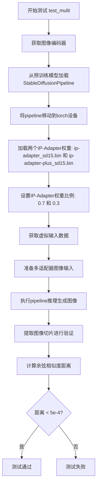

#### 带注释源码

```python
@is_flaky  # 标记该测试可能不稳定，允许偶尔失败
def test_multi(self):
    """
    测试多个IP-Adapter同时使用的集成功能
    
    该测试验证：
    1. 可以同时加载多个IP-Adapter权重
    2. 可以为每个Adapter设置不同的权重比例
    3. Pipeline能够正确处理多个IP-Adapter的输入图像
    4. 生成结果与预期值保持一致性
    """
    # Step 1: 获取图像编码器模型
    # 从h94/IP-Adapter仓库加载CLIPVisionModelWithProjection
    # subfolder指定为models/image_encoder，使用类属性dtype(.float16)
    image_encoder = self.get_image_encoder(repo_id="h94/IP-Adapter", subfolder="models/image_encoder")
    
    # Step 2: 创建Stable Diffusion Pipeline
    # 加载stable-diffusion-v1-5模型，配置图像编码器
    # safety_checker=None 禁用安全检查器以加快测试速度
    # torch_dtype=self.dtype 使用半精度浮点数减少内存占用
    pipeline = StableDiffusionPipeline.from_pretrained(
        "stable-diffusion-v1-5/stable-diffusion-v1-5",
        image_encoder=image_encoder,
        safety_checker=None,
        torch_dtype=self.dtype,
    )
    
    # Step 3: 将Pipeline移动到指定设备
    # torch_device通常是CUDA设备（如GPU）
    pipeline.to(torch_device)
    
    # Step 4: 加载多个IP-Adapter权重
    # 同时加载两个适配器：基础版和Plus版
    # weight_name参数接受列表以加载多个权重文件
    pipeline.load_ip_adapter(
        "h94/IP-Adapter", 
        subfolder="models", 
        weight_name=["ip-adapter_sd15.bin", "ip-adapter-plus_sd15.bin"]
    )
    
    # Step 5: 设置每个IP-Adapter的权重比例
    # 第一个适配器权重0.7，第二个适配器权重0.3
    # 权重决定了各Adapter对最终生成结果的影响程度
    pipeline.set_ip_adapter_scale([0.7, 0.3])
    
    # Step 6: 获取测试用的虚拟输入
    # 调用父类方法生成标准输入参数
    inputs = self.get_dummy_inputs()
    
    # Step 7: 准备多适配器图像输入
    # 获取原始IP-Adapter图像
    ip_adapter_image = inputs["ip_adapter_image"]
    
    # 为不同适配器准备不同的图像格式：
    # 第一个适配器：使用单张图像
    # 第二个适配器：使用包含2张相同图像的列表
    inputs["ip_adapter_image"] = [ip_adapter_image, [ip_adapter_image] * 2]
    
    # Step 8: 执行图像生成推理
    # 使用多个IP-Adapter生成图像
    images = pipeline(**inputs).images
    
    # Step 9: 提取图像切片用于验证
    # 取第一张图像的左上角3x3像素块，并展平为1D数组
    # 只取RGB通道的最后一个通道（通常是alpha或红色）
    image_slice = images[0, :3, :3, -1].flatten()
    
    # Step 10: 定义预期结果
    # 预先计算的正确输出切片值
    expected_slice = np.array([0.5234, 0.5352, 0.5625, 0.5713, 0.5947, 0.6206, 0.5786, 0.6187, 0.6494])
    
    # Step 11: 计算相似度并验证
    # 使用余弦相似度距离衡量生成结果与预期结果的差异
    max_diff = numpy_cosine_similarity_distance(image_slice, expected_slice)
    
    # 断言：差异必须小于阈值5e-4（约0.0005）
    # 这确保了测试的确定性和一致性
    assert max_diff < 5e-4
```


### `IPAdapterSDIntegrationTests.test_text_to_image_face_id`

该测试方法用于验证FaceID IP-Adapter在文本到图像生成任务中的功能是否正常。测试通过加载预训练的Stable Diffusion模型和FaceID IP-Adapter权重，使用预先计算的人脸身份嵌入（identity embeddings）来生成图像，并验证生成结果与预期值之间的相似度。

参数： 无（测试方法仅使用self和继承的辅助方法）

返回值： 无（该测试方法不返回任何值，通过断言验证结果）

#### 流程图

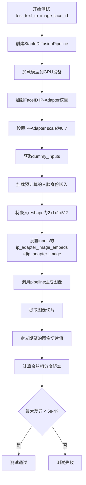

#### 带注释源码

```python
def test_text_to_image_face_id(self):
    """
    测试FaceID IP-Adapter在文本到图像生成中的功能
    验证使用人脸身份嵌入生成图像的正确性
    """
    # 从预训练模型创建Stable Diffusion Pipeline，不包含安全检查器，使用float16精度
    pipeline = StableDiffusionPipeline.from_pretrained(
        "stable-diffusion-v1-5/stable-diffusion-v1-5", 
        safety_checker=None, 
        torch_dtype=self.dtype
    )
    # 将Pipeline加载到GPU设备
    pipeline.to(torch_device)
    
    # 加载FaceID专用的IP-Adapter权重
    # image_encoder_folder=None表示不加载额外的图像编码器
    pipeline.load_ip_adapter(
        "h94/IP-Adapter-FaceID",
        subfolder=None,
        weight_name="ip-adapter-faceid_sd15.bin",
        image_encoder_folder=None,
    )
    # 设置IP-Adapter的影响权重为0.7
    pipeline.set_ip_adapter_scale(0.7)

    # 获取测试用的虚拟输入参数
    inputs = self.get_dummy_inputs()
    
    # 从远程URL加载预计算的人脸身份嵌入向量
    id_embeds = load_pt(
        "https://huggingface.co/datasets/fabiorigano/testing-images/resolve/main/ai_face2.ipadpt",
        map_location=torch_device,
    )[0]
    
    # 将嵌入向量reshape为适配的维度：(2, 1, 1, 512)
    # 2表示两个身份嵌入，512是嵌入维度
    id_embeds = id_embeds.reshape((2, 1, 1, 512))
    
    # 将身份嵌入放入输入参数，替换原始的ip_adapter_image
    inputs["ip_adapter_image_embeds"] = [id_embeds]
    inputs["ip_adapter_image"] = None
    
    # 执行图像生成
    images = pipeline(**inputs).images
    
    # 提取生成图像的一个小切片用于验证
    # 取第一个图像的前3x3像素块，并展平
    image_slice = images[0, :3, :3, -1].flatten()

    # 期望的图像切片数值（用于比对）
    expected_slice = np.array([0.3237, 0.3186, 0.3406, 0.3154, 0.2942, 0.3220, 0.3188, 0.3528, 0.3242])
    
    # 计算生成图像与期望图像之间的余弦相似度距离
    max_diff = numpy_cosine_similarity_distance(image_slice, expected_slice)
    
    # 断言：最大差异应小于阈值5e-4，否则测试失败
    assert max_diff < 5e-4
```


### `IPAdapterSDXLIntegrationTests.test_text_to_image_sdxl`

该测试方法用于验证 Stable Diffusion XL (SDXL) 模型在使用 IP-Adapter 进行文本到图像生成时的功能正确性。测试分别使用两种不同的 IP-Adapter 权重（`ip-adapter_sdxl.bin` 和 `ip-adapter-plus_sdxl_vit-h.bin`）生成图像，并通过比较生成的图像切片与预期值的余弦相似度来验证模型输出的准确性。

参数：

- `self`：`IPAdapterSDXLIntegrationTests` 实例，测试类本身，包含测试所需的资源和配置

返回值：`None`，该方法为测试方法，通过断言验证结果而非返回数据

#### 流程图

```mermaid
flowchart TD
    A[开始测试 test_text_to_image_sdxl] --> B[获取图像编码器<br/>repo_id: h94/IP-Adapter<br/>subfolder: sdxl_models/image_encoder]
    B --> C[获取图像处理器<br/>repo_id: laion/CLIP-ViT-bigG-14-laion2B-39B-b160k]
    C --> D[从预训练模型创建 StableDiffusionXLPipeline<br/>model: stabilityai/stable-diffusion-xl-base-1.0]
    D --> E[启用 CPU 模型卸载<br/>pipeline.enable_model_cpu_offload]
    E --> F[加载 IP-Adapter 权重<br/>weight_name: ip-adapter_sdxl.bin]
    F --> G[获取虚拟输入<br/>self.get_dummy_inputs]
    G --> H[执行图像生成<br/>pipeline(**inputs)]
    H --> I[提取图像切片<br/>images[0, :3, :3, -1].flatten]
    I --> J[计算与预期值的余弦相似度距离]
    J --> K{max_diff < 5e-4?}
    K -->|是| L[使用新图像编码器重新创建 Pipeline<br/>subfolder: models/image_encoder]
    K -->|否| M[断言失败]
    L --> N[加载 ip-adapter-plus_sdxl_vit-h.bin]
    N --> O[获取虚拟输入并生成图像]
    O --> P[验证第二次生成结果]
    P --> Q[结束测试]
```

#### 带注释源码

```python
def test_text_to_image_sdxl(self):
    """
    测试 SDXL 模型使用 IP-Adapter 进行文本到图像生成的功能。
    该测试分别验证两种 IP-Adapter 权重配置下的图像生成质量。
    """
    
    # 第一部分：使用标准 IP-Adapter 权重测试
    # --------------------------------------
    
    # 1. 获取图像编码器模型
    # 从 HuggingFace Hub 下载并加载 CLIP 图像编码器
    # 用于将输入图像编码为特征向量，供 IP-Adapter 使用
    image_encoder = self.get_image_encoder(
        repo_id="h94/IP-Adapter", 
        subfolder="sdxl_models/image_encoder"
    )
    
    # 2. 获取图像特征提取器
    # 用于处理输入图像的 CLIP 特征提取器
    feature_extractor = self.get_image_processor(
        "laion/CLIP-ViT-bigG-14-laion2B-39B-b160k"
    )
    
    # 3. 创建 Stable Diffusion XL 管道
    # 从预训练模型加载完整的 SDXL 管道
    # 参数:
    #   - image_encoder: CLIP 视觉编码器
    #   - feature_extractor: 图像特征提取器
    #   - torch_dtype: 使用 float16 加速推理
    pipeline = StableDiffusionXLPipeline.from_pretrained(
        "stabilityai/stable-diffusion-xl-base-1.0",
        image_encoder=image_encoder,
        feature_extractor=feature_extractor,
        torch_dtype=self.dtype,
    )
    
    # 4. 启用 CPU 模型卸载
    # 将模型部分模块卸载到 CPU 以节省 GPU 显存
    pipeline.enable_model_cpu_offload(device=torch_device)
    
    # 5. 加载 IP-Adapter 权重
    # 从预训练权重加载 IP-Adapter 适配器
    pipeline.load_ip_adapter(
        "h94/IP-Adapter", 
        subfolder="sdxl_models", 
        weight_name="ip-adapter_sdxl.bin"
    )
    
    # 6. 获取测试虚拟输入
    # 包含提示词、负提示词、推理步数、随机种子、IP适配器图像等
    inputs = self.get_dummy_inputs()
    
    # 7. 执行图像生成
    # 使用管道根据文本提示和 IP 适配器图像生成新图像
    images = pipeline(**inputs).images
    
    # 8. 提取图像切片用于验证
    # 取第一张图像的左上角 3x3 像素区域用于对比
    image_slice = images[0, :3, :3, -1].flatten()
    
    # 9. 定义预期像素值
    # 基于已知的正确输出预先计算的预期值
    expected_slice = np.array([
        0.09630299, 0.09551358, 0.08480701,
        0.09070173, 0.09437338, 0.09264627,
        0.08883232, 0.09287417, 0.09197289,
    ])
    
    # 10. 计算相似度并验证
    # 使用余弦相似度距离比较生成图像与预期图像
    max_diff = numpy_cosine_similarity_distance(image_slice, expected_slice)
    assert max_diff < 5e-4  # 验证误差在可接受范围内
    
    # 第二部分：使用 IP-Adapter Plus 权重测试
    # ----------------------------------------
    
    # 11. 重新获取标准图像编码器
    # 切换到不同的图像编码器子文件夹
    image_encoder = self.get_image_encoder(
        repo_id="h94/IP-Adapter", 
        subfolder="models/image_encoder"
    )
    
    # 12. 重新创建管道
    # 使用新的图像编码器配置
    pipeline = StableDiffusionXLPipeline.from_pretrained(
        "stabilityai/stable-diffusion-xl-base-1.0",
        image_encoder=image_encoder,
        feature_extractor=feature_extractor,
        torch_dtype=self.dtype,
    )
    
    # 13. 将管道移至目标设备
    pipeline.to(torch_device)
    
    # 14. 加载 IP-Adapter Plus 版本权重
    # 使用增强版的 IP-Adapter 权重
    pipeline.load_ip_adapter(
        "h94/IP-Adapter",
        subfolder="sdxl_models",
        weight_name="ip-adapter-plus_sdxl_vit-h.bin",
    )
    
    # 15. 重新获取输入并生成图像
    inputs = self.get_dummy_inputs()
    images = pipeline(**inputs).images
    image_slice = images[0, :3, :3, -1].flatten()
    
    # 16. 验证 Plus 版本的输出
    expected_slice = np.array([
        0.0596, 0.0539, 0.0459, 
        0.0580, 0.0560, 0.0548, 
        0.0501, 0.0563, 0.0500
    ])
    
    max_diff = numpy_cosine_similarity_distance(image_slice, expected_slice)
    assert max_diff < 5e-4
```


### `IPAdapterSDXLIntegrationTests.test_image_to_image_sdxl`

该测试方法用于验证SDXL（Stable Diffusion XL）模型的图像到图像（Image-to-Image）功能是否正常工作，通过加载IP-Adapter权重并使用参考图像进行条件生成，验证输出图像与预期结果的相似度。

参数：

- `self`：`IPAdapterSDXLIntegrationTests`（隐式），测试类的实例对象

返回值：`None`，该方法为测试方法，无返回值，通过断言验证推理结果的正确性

#### 流程图

```mermaid
graph TD
    A[开始测试] --> B[获取SDXL图像编码器]
    B --> C[获取CLIP图像处理器]
    C --> D[创建StableDiffusionXLImg2ImgPipeline]
    D --> E[启用CPU模型卸载]
    E --> F[加载IP-Adapter权重 ip-adapter_sdxl.bin]
    F --> G[获取图像到图像输入数据]
    G --> H[执行图像到图像推理]
    H --> I[提取图像切片并验证相似度]
    I --> J[更换图像编码器模型]
    J --> K[加载IP-Adapter Plus权重]
    K --> L[再次执行图像到图像推理]
    L --> M[验证第二次推理结果]
    M --> N[测试结束]
```

#### 带注释源码

```python
def test_image_to_image_sdxl(self):
    """
    测试SDXL模型的图像到图像功能，使用IP-Adapter进行条件生成
    验证两种不同的IP-Adapter权重配置
    """
    
    # -------------------- 第一部分：基础IP-Adapter测试 --------------------
    
    # 1. 获取SDXL专用的图像编码器
    # 从h94/IP-Adapter仓库的sdxl_models子文件夹加载CLIPVisionModelWithProjection
    image_encoder = self.get_image_encoder(
        repo_id="h94/IP-Adapter", 
        subfolder="sdxl_models/image_encoder"
    )
    
    # 2. 获取图像特征提取器
    # 使用laion/CLIP-ViT-bigG-14模型进行图像预处理
    feature_extractor = self.get_image_processor("laion/CLIP-ViT-bigG-14-laion2B-39B-b160k")

    # 3. 创建SDXL图像到图像管道
    # 从stabilityai/stable-diffusion-xl-base-1.0加载预训练模型
    pipeline = StableDiffusionXLImg2ImgPipeline.from_pretrained(
        "stabilityai/stable-diffusion-xl-base-1.0",
        image_encoder=image_encoder,           # 图像编码器用于IP-Adapter
        feature_extractor=feature_extractor,   # 特征提取器预处理输入图像
        torch_dtype=self.dtype,                 # 使用float16加速推理
    )
    
    # 4. 启用CPU模型卸载以节省显存
    # 将不活跃的模型层自动卸载到CPU
    pipeline.enable_model_cpu_offload(device=torch_device)
    
    # 5. 加载IP-Adapter权重文件
    # 使用SDXL专用的IP-Adapter权重
    pipeline.load_ip_adapter(
        "h94/IP-Adapter", 
        subfolder="sdxl_models", 
        weight_name="ip-adapter_sdxl.bin"
    )

    # 6. 获取测试输入数据
    # 包含原始图像、IP-Adapter参考图像、提示词等
    inputs = self.get_dummy_inputs(for_image_to_image=True)
    
    # 7. 执行图像到图像推理
    # 根据原始图像和IP-Adapter参考图像生成新图像
    images = pipeline(**inputs).images
    
    # 8. 提取图像切片进行验证
    # 取左上角3x3区域并展平用于相似度比较
    image_slice = images[0, :3, :3, -1].flatten()

    # 9. 定义预期输出切片
    expected_slice = np.array([
        0.06513795, 0.07009393, 0.07234055,
        0.07426041, 0.07002589, 0.06415862,
        0.07827643, 0.07962808, 0.07411247,
    ])

    # 10. 验证输出与预期的相似度
    # 使用numpy的allclose进行近似相等判断，容差为1e-3
    assert np.allclose(image_slice, expected_slice, atol=1e-3)

    # -------------------- 第二部分：IP-Adapter Plus测试 --------------------
    
    # 11. 更换为标准的图像编码器模型
    # 使用h94/IP-Adapter的标准图像编码器而非SDXL专用版本
    image_encoder = self.get_image_encoder(
        repo_id="h94/IP-Adapter", 
        subfolder="models/image_encoder"
    )
    
    # 12. 重新获取特征提取器
    feature_extractor = self.get_image_processor("laion/CLIP-ViT-bigG-14-laion2B-39B-b160k")

    # 13. 重新创建管道（不使用CPU卸载）
    pipeline = StableDiffusionXLImg2ImgPipeline.from_pretrained(
        "stabilityai/stable-diffusion-xl-base-1.0",
        image_encoder=image_encoder,
        feature_extractor=feature_extractor,
        torch_dtype=self.dtype,
    )
    
    # 14. 将管道移动到目标设备
    pipeline.to(torch_device)
    
    # 15. 加载IP-Adapter Plus版本权重
    # plus版本提供更强的图像条件控制能力
    pipeline.load_ip_adapter(
        "h94/IP-Adapter",
        subfolder="sdxl_models",
        weight_name="ip-adapter-plus_sdxl_vit-h.bin",
    )

    # 16. 再次获取测试输入
    inputs = self.get_dummy_inputs(for_image_to_image=True)
    
    # 17. 执行第二次推理
    images = pipeline(**inputs).images
    
    # 18. 提取新的图像切片
    image_slice = images[0, :3, :3, -1].flatten()

    # 19. 定义新的预期输出
    expected_slice = np.array([
        0.07126552, 0.07025367, 0.07348302,
        0.07580167, 0.07467338, 0.06918576,
        0.07480252, 0.08279955, 0.08547315,
    ])

    # 20. 验证第二次推理结果
    assert np.allclose(image_slice, expected_slice, atol=1e-3)
```


### `IPAdapterSDXLIntegrationTests.test_inpainting_sdxl`

测试 SDXL 模型的图像修复（inpainting）功能，验证 IP-Adapter 在 Stable Diffusion XL Inpainting Pipeline 中的正确性，包括加载图像编码器、设置 IP-Adapter、生成修复图像并与预期结果进行相似度对比。

参数：

- `self`：无显式参数，继承自 `unittest.TestCase` 的测试方法实例

返回值：`None`，该方法为测试方法，通过断言验证结果而非返回值

#### 流程图

```mermaid
flowchart TD
    A[开始测试] --> B[获取图像编码器<br/>repo_id: h94/IP-Adapter<br/>subfolder: sdxl_models/image_encoder]
    B --> C[获取图像处理器<br/>repo_id: laion/CLIP-ViT-bigG-14-laion2B-39B-b160k]
    C --> D[从预训练模型加载StableDiffusionXLInpaintPipeline<br/>模型: stabilityai/stable-diffusion-xl-base-1.0]
    D --> E[启用CPU Offload<br/>device: torch_device]
    E --> F[加载IP-Adapter<br/>weight_name: ip-adapter_sdxl.bin]
    F --> G[获取测试输入<br/>for_inpainting=True]
    G --> H[执行Pipeline推理<br/>pipeline\*\*inputs]
    H --> I[提取图像切片<br/>images[0, :3, :3, -1].flatten]
    I --> J[计算与预期切片的余弦相似度距离]
    J --> K{max_diff < 5e-4?}
    K -->|是| L[更换图像编码器<br/>subfolder: models/image_encoder]
    K -->|否| M[测试失败-抛出断言错误]
    L --> N[重新加载Pipeline和IP-Adapter<br/>weight_name: ip-adapter-plus_sdxl_vit-h.bin]
    N --> O[重复推理和验证流程]
    O --> P{第二次验证通过?}
    P -->|是| Q[测试通过]
    P -->|否| M
```

#### 带注释源码

```python
def test_inpainting_sdxl(self):
    """
    测试 SDXL 模型的图像修复功能，验证 IP-Adapter 在 Inpainting Pipeline 中的正确性。
    该测试分为两部分：
    1. 使用 sdxl 专用图像编码器测试 ip-adapter_sdxl.bin
    2. 使用 SD15 图像编码器测试 ip-adapter-plus_sdxl_vit-h.bin
    """
    
    # ========== 第一部分：使用 SDXL 专用图像编码器 ==========
    
    # 获取图像编码器 (SDXL 专用版本)
    # repo_id: HuggingFace 模型仓库 ID
    # subfolder: 模型子文件夹路径
    image_encoder = self.get_image_encoder(
        repo_id="h94/IP-Adapter", 
        subfolder="sdxl_models/image_encoder"
    )
    
    # 获取图像预处理器 (CLIP ViT-bigG-14)
    # 用于对输入图像进行预处理
    feature_extractor = self.get_image_processor(
        "laion/CLIP-ViT-bigG-14-laion2B-39B-b160k"
    )

    # 从预训练模型加载 Stable Diffusion XL Inpainting Pipeline
    # 参数:
    #   - pretrained_model_name_or_path: 模型名称或路径
    #   - image_encoder: CLIP 图像编码器
    #   - feature_extractor: 图像特征提取器
    #   - torch_dtype: 模型数据类型 (float16)
    pipeline = StableDiffusionXLInpaintPipeline.from_pretrained(
        "stabilityai/stable-diffusion-xl-base-1.0",
        image_encoder=image_encoder,
        feature_extractor=feature_extractor,
        torch_dtype=self.dtype,
    )
    
    # 启用 CPU Offload 以节省显存
    # 将模型的部分模块自动卸载到 CPU
    pipeline.enable_model_cpu_offload(device=torch_device)
    
    # 加载 IP-Adapter 权重
    # 参数:
    #   - repo_id: IP-Adapter 模型仓库
    #   - subfolder: 模型子文件夹
    #   - weight_name: 权重文件名 (SDXL 版本)
    pipeline.load_ip_adapter(
        "h94/IP-Adapter", 
        subfolder="sdxl_models", 
        weight_name="ip-adapter_sdxl.bin"
    )

    # 获取测试输入数据 (包含图像、掩码、IP-Adapter 图像)
    # for_inpainting=True: 返回用于 inpainting 任务的输入参数
    inputs = self.get_dummy_inputs(for_inpainting=True)
    
    # 执行 Pipeline 推理
    # **inputs: 解包字典作为关键字参数
    images = pipeline(**inputs).images
    
    # 提取生成的图像切片用于验证
    # 取第一张图像的前 3x3 像素块，展平为一维数组
    image_slice = images[0, :3, :3, -1].flatten()
    image_slice.tolist()  # 转换为 Python 列表（实际未使用）

    # 定义预期图像切片 (通过大量测试得到的基准值)
    expected_slice = np.array(
        [0.14181179, 0.1493012, 0.14283323, 0.14602411, 
         0.14915377, 0.15015268, 0.14725655, 0.15009224, 0.15164584]
    )

    # 计算生成图像与预期图像的余弦相似度距离
    max_diff = numpy_cosine_similarity_distance(image_slice, expected_slice)
    
    # 断言：余弦相似度距离应小于阈值 5e-4
    assert max_diff < 5e-4

    # ========== 第二部分：使用 SD15 图像编码器 + Plus 版本适配器 ==========
    
    # 更换为 SD15 图像编码器 (ip-adapter-plus 兼容)
    image_encoder = self.get_image_encoder(
        repo_id="h94/IP-Adapter", 
        subfolder="models/image_encoder"
    )
    
    # 重新获取图像处理器
    feature_extractor = self.get_image_processor(
        "laion/CLIP-ViT-bigG-14-laion2B-39B-b160k"
    )

    # 重新加载 Pipeline (不使用 CPU offload，直接加载到设备)
    pipeline = StableDiffusionXLInpaintPipeline.from_pretrained(
        "stabilityai/stable-diffusion-xl-base-1.0",
        image_encoder=image_encoder,
        feature_extractor=feature_extractor,
        torch_dtype=self.dtype,
    )
    pipeline.to(torch_device)
    
    # 加载 Plus 版本 IP-Adapter (更高质量版本)
    # weight_name: ip-adapter-plus_sdxl_vit-h.bin
    pipeline.load_ip_adapter(
        "h94/IP-Adapter",
        subfolder="sdxl_models",
        weight_name="ip-adapter-plus_sdxl_vit-h.bin",
    )

    # 重复推理流程
    inputs = self.get_dummy_inputs(for_inpainting=True)
    images = pipeline(**inputs).images
    image_slice = images[0, :3, :3, -1].flatten()
    image_slice.tolist()

    # Plus 版本对应的预期图像切片
    expected_slice = np.array(
        [0.1398, 0.1476, 0.1407, 0.1442, 0.1470, 0.1480, 0.1449, 0.1481, 0.1494]
    )

    # 再次验证相似度
    max_diff = numpy_cosine_similarity_distance(image_slice, expected_slice)
    assert max_diff < 5e-4
```


### `IPAdapterSDXLIntegrationTests.test_ip_adapter_mask`

测试IP-Adapter掩码功能，验证在Stable Diffusion XLpipeline中使用IP-Adapter时，掩码能否正确处理图像适配器的注意力控制。

参数：
- 该方法无显式参数，由`unittest.TestCase`框架通过`self`调用

返回值：无（测试方法，由断言验证）

#### 流程图

```mermaid
flowchart TD
    A[开始测试] --> B[获取图像编码器]
    B --> C[加载Stable Diffusion XL pipeline]
    C --> D[启用CPU卸载]
    D --> E[加载IP-Adapter权重]
    E --> F[设置IP-Adapter比例为0.7]
    F --> G[获取带掩码的虚拟输入]
    G --> H[提取并预处理掩码]
    H --> I[使用IPAdapterMaskProcessor处理掩码]
    I --> J[更新输入参数]
    J --> K[执行pipeline推理]
    K --> L[提取图像切片]
    L --> M[定义期望的图像切片]
    M --> N[计算余弦相似度距离]
    N --> O{距离 < 5e-4?}
    O -->|是| P[测试通过]
    O -->|否| Q[测试失败]
```

#### 带注释源码

```python
def test_ip_adapter_mask(self):
    """
    测试IP-Adapter掩码功能。
    验证在SDXL pipeline中使用IP-Adapter时，掩码能够正确控制图像适配器的应用区域。
    """
    # 1. 获取图像编码器模型
    # 从预训练模型加载CLIPVisionModelWithProjection，用于提取图像特征
    image_encoder = self.get_image_encoder(
        repo_id="h94/IP-Adapter", 
        subfolder="models/image_encoder"
    )
    
    # 2. 创建Stable Diffusion XL pipeline
    # 加载stabilityai/stable-diffusion-xl-base-1.0模型，并关联图像编码器
    pipeline = StableDiffusionXLPipeline.from_pretrained(
        "stabilityai/stable-diffusion-xl-base-1.0",
        image_encoder=image_encoder,
        torch_dtype=self.dtype,  # 使用float16精度
    )
    
    # 3. 启用CPU卸载以节省显存
    pipeline.enable_model_cpu_offload(device=torch_device)
    
    # 4. 加载IP-Adapter权重
    # 使用plus-face版本的SDXL适配器，支持面部特征的精细控制
    pipeline.load_ip_adapter(
        "h94/IP-Adapter", 
        subfolder="sdxl_models", 
        weight_name="ip-adapter-plus-face_sdxl_vit-h.safetensors"
    )
    
    # 5. 设置IP-Adapter的影响比例
    # 0.7表示70%使用IP-Adapter的特征
    pipeline.set_ip_adapter_scale(0.7)
    
    # 6. 获取测试输入数据
    # for_masks=True表示获取带掩码的输入配置
    inputs = self.get_dummy_inputs(for_masks=True)
    
    # 7. 提取掩码并进行预处理
    # 从cross_attention_kwargs中获取ip_adapter_masks
    mask = inputs["cross_attention_kwargs"]["ip_adapter_masks"][0]
    
    # 8. 创建掩码处理器
    processor = IPAdapterMaskProcessor()
    
    # 9. 预处理掩码
    # 将掩码图像转换为适合pipeline处理的格式
    mask = processor.preprocess(mask)
    
    # 10. 更新输入参数
    # 将处理后的掩码放回cross_attention_kwargs
    inputs["cross_attention_kwargs"]["ip_adapter_masks"] = mask
    
    # 11. 处理IP适配器图像
    # 只使用第一张图像
    inputs["ip_adapter_image"] = inputs["ip_adapter_image"][0]
    
    # 12. 执行推理
    # 使用pipeline生成图像
    images = pipeline(**inputs).images
    
    # 13. 提取图像切片用于验证
    # 取第一张图像的左上角3x3区域
    image_slice = images[0, :3, :3, -1].flatten()
    
    # 14. 定义期望的输出切片
    # 基于已知正确结果预计算
    expected_slice = np.array(
        [0.7307304, 0.73450166, 0.73731124, 0.7377061, 0.7318013, 
         0.73720926, 0.74746597, 0.7409929, 0.74074936]
    )
    
    # 15. 计算相似度距离
    # 使用余弦相似度距离比较实际输出与期望输出
    max_diff = numpy_cosine_similarity_distance(image_slice, expected_slice)
    
    # 16. 验证结果
    # 确保差异小于阈值，表明掩码功能正常工作
    assert max_diff < 5e-4
```


### `IPAdapterSDXLIntegrationTests.test_ip_adapter_multiple_masks`

测试使用多个IP-Adapter掩码进行Stable Diffusion XL图像生成的功能。该测试加载两个相同的IP-Adapter，加载多个掩码图像，通过IPAdapterMaskProcessor预处理掩码后传入pipeline进行推理，并验证生成的图像与期望的像素值切片是否接近。

参数：

- `self`：测试类实例，无显式参数

返回值：无（测试方法，通过断言验证结果）

#### 流程图

```mermaid
flowchart TD
    A[开始测试] --> B[获取图像编码器<br/>repo_id: h94/IP-Adapter<br/>subfolder: models/image_encoder]
    B --> C[从预训练模型加载StableDiffusionXLPipeline<br/>模型: stabilityai/stable-diffusion-xl-base-1.0]
    C --> D[启用CPU卸载<br/>pipeline.enable_model_cpu_offload]
    D --> E[加载两个相同的IP-Adapter<br/>weight_name: ip-adapter-plus-face_sdxl_vit-h.safetensors x2]
    E --> F[设置IP-Adapter权重 scale: [0.7, 0.7]]
    F --> G[获取测试输入<br/>调用get_dummy_inputs<br/>for_masks=True]
    G --> H[提取掩码<br/>inputs['cross_attention_kwargs']['ip_adapter_masks']]
    H --> I[创建IPAdapterMaskProcessor并预处理掩码<br/>processor.preprocess]
    I --> J[更新inputs中的掩码]
    J --> K[执行图像生成<br/>pipeline(**inputs)]
    K --> L[提取生成的图像切片<br/>images[0, :3, :3, -1].flatten()]
    L --> M[定义期望的像素值切片]
    M --> N[计算余弦相似度距离<br/>numpy_cosine_similarity_distance]
    N --> O{max_diff < 5e-4?}
    O -->|是| P[测试通过]
    O -->|否| Q[测试失败]
```

#### 带注释源码

```python
def test_ip_adapter_multiple_masks(self):
    """
    测试使用多个IP-Adapter掩码的SDXL图像生成功能。
    该测试验证pipeline能够正确处理多个IP-Adapter和多个掩码的组合。
    """
    # 步骤1: 获取图像编码器
    # 从预训练模型加载CLIPVisionModelWithProjection
    # repo_id: HuggingFace上的IP-Adapter模型仓库
    # subfolder: 模型子目录路径
    image_encoder = self.get_image_encoder(repo_id="h94/IP-Adapter", subfolder="models/image_encoder")
    
    # 步骤2: 创建Stable Diffusion XL Pipeline
    # 从stabilityai的stable-diffusion-xl-base-1.0模型加载
    # 传入image_encoder用于IP-Adapter的图像特征提取
    # 使用self.dtype (torch.float16) 以节省显存
    pipeline = StableDiffusionXLPipeline.from_pretrained(
        "stabilityai/stable-diffusion-xl-base-1.0",
        image_encoder=image_encoder,
        torch_dtype=self.dtype,
    )
    
    # 步骤3: 启用CPU模型卸载
    # 将不常用的模型组件卸载到CPU以节省GPU显存
    pipeline.enable_model_cpu_offload(device=torch_device)
    
    # 步骤4: 加载两个IP-Adapter
    # 加载相同权重文件的两个副本，用于多掩码测试
    # weight_name使用列表格式指定多个adapter
    pipeline.load_ip_adapter(
        "h94/IP-Adapter", 
        subfolder="sdxl_models", 
        weight_name=["ip-adapter-plus-face_sdxl_vit-h.safetensors"] * 2
    )
    
    # 步骤5: 设置IP-Adapter的权重比例
    # 两个adapter都使用0.7的权重
    pipeline.set_ip_adapter_scale([0.7] * 2)
    
    # 步骤6: 获取测试输入数据
    # for_masks=True表示获取包含多掩码的测试数据
    # 返回的input_kwargs包含:
    #   - ip_adapter_image: [[face_image1], [face_image2]]  # 两个适配器的图像
    #   - cross_attention_kwargs.ip_adapter_masks: [mask1, mask2]  # 两个掩码
    inputs = self.get_dummy_inputs(for_masks=True)
    
    # 步骤7: 提取掩码数据
    # 从cross_attention_kwargs中获取ip_adapter_masks
    masks = inputs["cross_attention_kwargs"]["ip_adapter_masks"]
    
    # 步骤8: 创建掩码处理器并预处理
    # IPAdapterMaskProcessor负责将掩码图像转换为pipeline需要的格式
    processor = IPAdapterMaskProcessor()
    masks = processor.preprocess(masks)
    
    # 步骤9: 将处理后的掩码更新回inputs
    inputs["cross_attention_kwargs"]["ip_adapter_masks"] = masks
    
    # 步骤10: 执行图像生成
    # 传入所有输入参数，包括prompt、IP-Adapter图像和掩码
    images = pipeline(**inputs).images
    
    # 步骤11: 提取生成的图像切片用于验证
    # 取第一张图像的前3x3像素块，并展平为1D数组
    # 只取最后一个通道（RGB的R通道或RGBA的A通道）
    image_slice = images[0, :3, :3, -1].flatten()
    
    # 步骤12: 定义期望的像素值切片
    # 这些是预先计算好的期望输出，用于验证生成结果
    expected_slice = np.array(
        [0.79474676, 0.7977683, 0.8013954, 0.7988008, 0.7970615, 0.8029355, 0.80614823, 0.8050743, 0.80627424]
    )
    
    # 步骤13: 计算生成图像与期望图像的相似度
    # 使用余弦相似度距离作为度量
    max_diff = numpy_cosine_similarity_distance(image_slice, expected_slice)
    
    # 步骤14: 验证结果
    # 断言最大差异小于阈值5e-4，确保生成结果符合预期
    assert max_diff < 5e-4
```


### `IPAdapterSDXLIntegrationTests.test_instant_style_multiple_masks`

该测试方法验证 Instant Style 功能在 Stable Diffusion XL 中处理多个掩码的能力，通过加载组合适配器和风格适配器，并使用多个掩码进行图像生成，最后验证生成结果与期望值的余弦相似度距离是否在阈值范围内。

参数：无显式参数（使用 `self` 和 `get_dummy_inputs(for_instant_style=True)` 获取输入）

返回值：`None`，测试通过时无返回值，失败时抛出 `AssertionError`

#### 流程图

```mermaid
flowchart TD
    A[开始测试] --> B[加载CLIPVisionModelWithProjection图像编码器]
    B --> C[创建StableDiffusionXLPipeline]
    C --> D[启用CPU卸载]
    D --> E[加载两个IP Adapter: composition和style]
    E --> F[设置IP Adapter Scale]
    F --> G[调用get_dummy_inputs获取测试输入]
    G --> H[预处理掩码: 使用IPAdapterMaskProcessor]
    H --> I[调整掩码形状]
    I --> J[执行pipeline生成图像]
    J --> K[提取图像切片]
    K --> L[获取期望值切片]
    L --> M[计算余弦相似度距离]
    M --> N{距离 < 5e-4?}
    N -->|是| O[测试通过]
    N -->|否| P[抛出AssertionError]
```

#### 带注释源码

```python
def test_instant_style_multiple_masks(self):
    """
    测试 Instant Style 多掩码功能
    验证组合适配器和风格适配器在多个掩码下的图像生成能力
    """
    # 1. 加载图像编码器 - 使用 CLIPVisionModelWithProjection 模型
    # 从 h94/IP-Adapter 仓库的 models/image_encoder 子文件夹加载
    # 使用 float16 精度以减少显存占用
    image_encoder = CLIPVisionModelWithProjection.from_pretrained(
        "h94/IP-Adapter", subfolder="models/image_encoder", torch_dtype=torch.float16
    )
    
    # 2. 创建 Stable Diffusion XL Pipeline
    # 使用 RunDiffusion/Juggernaut-XL-v9 模型
    # 加载图像编码器并使用 fp16 变体
    pipeline = StableDiffusionXLPipeline.from_pretrained(
        "RunDiffusion/Juggernaut-XL-v9", torch_dtype=torch.float16, 
        image_encoder=image_encoder, variant="fp16"
    )
    
    # 3. 启用 CPU 卸载以优化显存使用
    pipeline.enable_model_cpu_offload(device=torch_device)

    # 4. 加载两个 IP Adapter
    # - ostris/ip-composition-adapter: 用于组合图像
    # - h94/IP-Adapter: 用于风格适配
    # image_encoder_folder=None 表示不加载额外的图像编码器
    pipeline.load_ip_adapter(
        ["ostris/ip-composition-adapter", "h94/IP-Adapter"],
        subfolder=["", "sdxl_models"],
        weight_name=[
            "ip_plus_composition_sdxl.safetensors",
            "ip-adapter_sdxl_vit-h.safetensors",
        ],
        image_encoder_folder=None,
    )
    
    # 5. 设置 IP Adapter 缩放比例
    # 第一个适配器缩放为 1.0，第二个使用复杂的层级缩放配置
    scale_1 = {
        "down": [[0.0, 0.0, 1.0]],       # 下采样层: 所有位置使用100%强度
        "mid": [[0.0, 0.0, 1.0]],        # 中间层: 所有位置使用100%强度
        "up": {                          # 上采样层: 不同块使用不同强度
            "block_0": [[0.0, 0.0, 1.0], [1.0, 1.0, 1.0], [0.0, 0.0, 1.0]],
            "block_1": [[0.0, 0.0, 1.0]]
        },
    }
    pipeline.set_ip_adapter_scale([1.0, scale_1])

    # 6. 获取测试输入数据
    # for_instant_style=True 表示获取 Instant Style 所需的输入格式
    # 包含组合图像、女性风格图像、男性风格图像、背景图像
    # 以及对应的掩码: composition_mask, female_mask, male_mask, background_mask
    inputs = self.get_dummy_inputs(for_instant_style=True)
    
    # 7. 预处理掩码
    # 使用 IPAdapterMaskProcessor 处理两组掩码
    processor = IPAdapterMaskProcessor()
    
    # 获取两组掩码
    masks1 = inputs["cross_attention_kwargs"]["ip_adapter_masks"][0]  # 组合掩码
    masks2 = inputs["cross_attention_kwargs"]["ip_adapter_masks"][1]  # 风格掩码
    
    # 预处理第一组掩码（组合掩码）
    masks1 = processor.preprocess(masks1, height=1024, width=1024)
    
    # 预处理第二组掩码（风格掩码）
    masks2 = processor.preprocess(masks2, height=1024, width=1024)
    
    # 调整第二组掩码的形状以适配输入要求
    # 从 [N, C, H, W] 调整为 [1, N, H, W]
    masks2 = masks2.reshape(1, masks2.shape[0], masks2.shape[2], masks2.shape[3])
    
    # 将处理后的掩码放回输入参数
    inputs["cross_attention_kwargs"]["ip_adapter_masks"] = [masks1, masks2]
    
    # 8. 执行图像生成 pipeline
    # 使用处理后的输入生成图像
    images = pipeline(**inputs).images
    
    # 9. 提取图像切片用于验证
    # 取第一个图像的前3x3区域
    image_slice = images[0, :3, :3, -1].flatten()

    # 10. 定义期望的图像切片值
    # 根据不同的硬件平台和CUDA版本有不同的期望值
    expected_slices = Expectations(
        {
            ("xpu", 3): np.array([...]),  # Intel XPU 3设备
            ("cuda", 7): np.array([...]), # CUDA 7设备
            ("cuda", 8): np.array([...]), # CUDA 8设备
        }
    )
    expected_slice = expected_slices.get_expectation()

    # 11. 计算生成图像与期望图像的余弦相似度距离
    max_diff = numpy_cosine_similarity_distance(image_slice, expected_slice)
    
    # 12. 验证结果
    # 余弦相似度距离应小于 5e-4
    assert max_diff < 5e-4
```


### `IPAdapterSDXLIntegrationTests.test_ip_adapter_multiple_masks_one_adapter`

该函数用于测试单适配器多掩码的功能。它首先加载图像编码器和 Stable Diffusion XL Pipeline，然后加载 IP 适配器并设置适配器比例，接着准备包含多个掩码的输入数据，最后运行 pipeline 生成图像并验证输出是否与预期结果匹配。

参数：

- `self`：隐式参数，测试类实例本身

返回值：无返回值（测试方法，使用断言验证结果）

#### 流程图

```mermaid
flowchart TD
    A[开始] --> B[获取图像编码器]
    B --> C[创建StableDiffusionXLPipeline]
    C --> D[启用CPU卸载]
    D --> E[加载IP适配器权重]
    E --> F[设置IP适配器比例为0.7]
    F --> G[获取包含掩码的虚拟输入]
    G --> H[使用IPAdapterMaskProcessor预处理掩码]
    H --> I[重塑掩码形状]
    I --> J[调整ip_adapter_image格式]
    J --> K[运行pipeline生成图像]
    K --> L[提取图像切片]
    L --> M[与预期切片比较]
    M --> N{差异小于阈值?}
    N -->|是| O[测试通过]
    N -->|否| P[测试失败]
```

#### 带注释源码

```python
def test_ip_adapter_multiple_masks_one_adapter(self):
    """
    测试单适配器多掩码的功能
    该测试验证当使用单个IP适配器但传入多个掩码时，pipeline能否正确处理
    """
    # 1. 获取图像编码器模型
    image_encoder = self.get_image_encoder(repo_id="h94/IP-Adapter", subfolder="models/image_encoder")
    
    # 2. 从预训练模型创建Stable Diffusion XL Pipeline
    pipeline = StableDiffusionXLPipeline.from_pretrained(
        "stabilityai/stable-diffusion-xl-base-1.0",  # SDXL基础模型
        image_encoder=image_encoder,  # 图像编码器用于IP Adapter
        torch_dtype=self.dtype,  # 数据类型（float16）
    )
    
    # 3. 启用CPU卸载以节省显存
    pipeline.enable_model_cpu_offload(device=torch_device)
    
    # 4. 加载IP适配器权重（单适配器）
    pipeline.load_ip_adapter(
        "h94/IP-Adapter", 
        subfolder="sdxl_models", 
        weight_name=["ip-adapter-plus-face_sdxl_vit-h.safetensors"]  # 使用列表格式但只有一个适配器
    )
    
    # 5. 设置IP适配器比例（双层嵌套列表表示单个适配器的多个掩码权重）
    pipeline.set_ip_adapter_scale([[0.7, 0.7]])
    
    # 6. 获取测试用的虚拟输入（包含掩码）
    inputs = self.get_dummy_inputs(for_masks=True)
    
    # 7. 提取并预处理掩码
    masks = inputs["cross_attention_kwargs"]["ip_adapter_masks"]
    processor = IPAdapterMaskProcessor()
    masks = processor.preprocess(masks)  # 预处理掩码
    
    # 8. 重塑掩码以适配pipeline的输入要求
    # 将掩码从 [N, C, H, W] 转换为 [1, N, H, W]
    masks = masks.reshape(1, masks.shape[0], masks.shape[2], masks.shape[3])
    
    # 9. 将处理后的掩码放回输入参数
    inputs["cross_attention_kwargs"]["ip_adapter_masks"] = [masks]
    
    # 10. 调整ip_adapter_image的格式
    # 从 [[face1], [face2]] 转换为 [[face1, face2]]
    ip_images = inputs["ip_adapter_image"]
    inputs["ip_adapter_image"] = [[image[0] for image in ip_images]]
    
    # 11. 运行pipeline生成图像
    images = pipeline(**inputs).images
    
    # 12. 提取生成的图像切片用于验证
    image_slice = images[0, :3, :3, -1].flatten()
    
    # 13. 定义预期的图像切片值
    expected_slice = np.array(
        [0.79474676, 0.7977683, 0.8013954, 0.7988008, 0.7970615, 0.8029355, 0.80614823, 0.8050743, 0.80627424]
    )
    
    # 14. 计算生成图像与预期图像的余弦相似度距离
    max_diff = numpy_cosine_similarity_distance(image_slice, expected_slice)
    
    # 15. 断言差异小于阈值（5e-4）
    assert max_diff < 5e-4
```

## 关键组件


### IPAdapterNightlyTestsMixin

测试混合类，提供IP-Adapter测试的通用设置和辅助方法，包括VRAM清理、图像编码器加载、图像处理器加载和虚拟输入生成

### CLIPVisionModelWithProjection

CLIP视觉模型，用于将图像编码为IP-Adapter所需的图像嵌入向量，支持SD和SDXL不同版本的模型加载

### CLIPImageProcessor

CLIP图像预处理器，用于对输入图像进行标准化和预处理，提取图像特征供IP-Adapter使用

### StableDiffusionPipeline/Img2ImgPipeline/InpaintPipeline

Stable Diffusion系列管道，支持文本到图像、图像到图像和inpainting任务，并集成了IP-Adapter功能

### StableDiffusionXLPipeline系列

Stable Diffusion XL版本的管道，支持更高分辨率的图像生成，支持SDXL特定的IP-Adapter模型

### load_ip_adapter方法

动态加载IP-Adapter权重到pipeline中，支持加载单个或多个adapter，支持不同权重文件名（sd15.bin、plus_sd15.bin、sdxl.bin等）

### set_ip_adapter_scale方法

设置IP-Adapter的影响权重，可以是单一数值或复杂的分层权重字典，支持对不同网络层级（down、mid、up）进行精细控制

### IPAdapterMaskProcessor

掩码预处理器，用于处理IP-Adapter的注意力掩码，支持单个或多个掩码的预处理和形状调整

### enable_model_cpu_offload

模型CPU卸载功能，将模型从GPU卸载到CPU以节省显存，支持SD和SDXL管道的内存优化

### 多Adapter支持

支持同时加载多个IP-Adapter，通过权重名称列表和对应的比例进行组合，实现复合图像风格控制

### Face ID支持

专门针对人脸识别的IP-Adapter变体，支持直接加载预计算的人脸嵌入向量，跳过图像编码器

### Instant Style功能

支持细粒度的风格迁移，通过composition mask、female mask、male mask、background mask实现多区域风格控制

## 问题及建议


### 已知问题

- **测试资源重复加载**：每个测试方法都独立调用 `get_image_encoder` 和 `get_image_processor` 重新加载模型，导致测试执行缓慢且重复消耗VRAM资源，应使用类级别或模块级别的fixture共享模型实例
- **网络依赖过强**：测试依赖大量远程URL加载图像（HuggingFace数据集 URL），无网络或URL失效时测试会失败，缺乏本地缓存或mock机制
- **资源清理不彻底**：`tearDown` 方法只清理VRAM，但pipeline和image_encoder对象未显式delete或设为None，可能导致内存泄漏
- **硬编码的魔法数字**：阈值 `5e-4`、`1e-3`、图像尺寸 `1024x1024`、模型repo ID等分散在代码各处，应提取为常量或配置
- **浮点数比较不稳定**：`test_text_to_image_model_cpu_offload` 中的 `assertLess(max_diff, 1e-3)` 使用硬编码阈值，在不同GPU架构上可能产生不同结果
- **mixin与unittest耦合**：`IPAdapterNightlyTestsMixin` 继承unittest.TestCase但被其他测试类继承使用，设计不够清晰，限制了mixin的复用性
- **缺失错误处理**：模型加载、图像加载等操作无try-except保护，网络异常时测试会直接崩溃而非给出友好错误信息
- **测试数据重复请求**：`get_dummy_inputs` 方法中相同URL会被多次请求（如 `for_sdxl=True` 时会resize），无缓存机制

### 优化建议

- 使用 `@classmethod` 或pytest fixture在类级别共享 `image_encoder` 和 `feature_extractor` 实例，减少模型加载次数
- 将远程图像URL替换为本地测试fixtures或使用unittest.mock模拟 `load_image` 函数
- 在 `tearDown` 中显式调用 `del pipeline, image_encoder` 并使用 `torch.cuda.empty_cache()` 确保资源释放
- 提取魔法数字为类常量或配置文件，使用有意义的变量名替代裸数字
- 使用 `pytest.importorskip` 或条件跳过处理可选依赖，避免因环境差异导致测试失败
- 考虑将mixin重构为独立工具类，移除对unittest的直接依赖，提高代码可测试性和可维护性
- 为网络请求添加重试机制或超时控制，提升测试健壮性

## 其它


### 设计目标与约束

本测试套件旨在验证IP-Adapter在Stable Diffusion和Stable Diffusion XL模型上的集成功能。设计目标包括：1）验证文本到图像、图像到图像、修复等核心功能的正确性；2）支持多种IP-Adapter变体（SD15、SDXL、FaceID、Full Face等）；3）确保在不同硬件配置下的兼容性。约束条件：测试必须在GPU环境下运行（标记@require_torch_accelerator），部分测试标记为@slow表示需要较长执行时间，使用float16精度以平衡性能和内存占用。

### 错误处理与异常设计

测试代码主要依赖unittest框架的断言机制进行错误检测。关键错误处理包括：1）使用numpy_cosine_similarity_distance计算图像相似度，当差异超过阈值（5e-4或1e-3）时抛出AssertionError；2）通过try-except捕获模型加载异常；3）使用@is_flaky装饰器标记可能不稳定的测试；4）显存管理通过gc.collect()和backend_empty_cache在setUp/tearDown中进行清理，防止VRAM泄漏导致的测试失败。

### 数据流与状态机

测试数据流遵循以下流程：1）初始化阶段：加载image_encoder和image_processor；2）构建输入：get_dummy_inputs根据不同测试场景（image_to_image、inpainting、masks等）构建包含prompt、negative_prompt、ip_adapter_image等参数的input_kwargs字典；3）执行推理：pipeline(**inputs)调用模型生成图像；4）验证阶段：提取图像切片与expected_slice进行相似度比较；5）清理阶段：tearDown中释放VRAM资源。

### 外部依赖与接口契约

本测试文件依赖以下核心外部组件：1）transformers库：提供CLIPImageProcessor和CLIPVisionModelWithProjection用于图像编码；2）diffusers库：提供StableDiffusionPipeline系列类及IPAdapterMaskProcessor；3）测试工具：来自...testing_utils的Expectations、numpy_cosine_similarity_distance、load_pt等辅助函数；4）HuggingFace Hub：模型权重和测试图像的远程存储位置。接口契约要求pipeline必须支持load_ip_adapter()方法加载适配器权重，支持set_ip_adapter_scale()设置适配器权重，支持unload_ip_adapter()卸载适配器。

### 性能基准与资源要求

测试定义了明确的性能基准：1）图像相似度阈值：标准测试使用5e-4，宽松测试使用1e-3；2）显存管理：每测试前后执行VRAM清理；3）CPU卸载测试：验证enable_model_cpu_offload不影响推理结果，差异应小于1e-3；4）测试执行时间：标记@slow的测试预计需要较长时间运行。

### 测试覆盖矩阵

本测试套件覆盖以下场景维度：1）模型类型：Stable Diffusion 1.5、Stable Diffusion XL；2）任务类型：文本到图像、图像到图像、图像修复；3）适配器变体：ip-adapter_sd15.bin、ip-adapter-plus_sd15.bin、ip-adapter-full-face_sd15.bin、ip-adapter-faceid_sd15.bin、ip-adapter_sdxl.bin等；4）高级功能：多适配器组合、掩码处理、FaceID嵌入、风格迁移；5）模型优化：CPU卸载、模型变体选择。

### 安全性与合规性

测试代码涉及以下安全考量：1）safety_checker=None：在测试中禁用了安全过滤器以便于验证模型能力；2）远程资源加载：测试从HuggingFace Hub加载模型和图像，需确保网络连接和资源可用性；3）确定性控制：通过enable_full_determinism和固定随机种子（generator.manual_seed(33)）确保测试可重复性；4）版权与许可：代码声明使用Apache 2.0许可证。

### 可维护性与扩展性设计

代码通过以下设计确保可维护性：1）Mixin模式：IPAdapterNightlyTestsMixin抽取公共逻辑供SD和SDXL测试复用；2）参数化输入：get_dummy_inputs通过布尔参数支持多种场景，减少代码重复；3）模块化断言：使用numpy_cosine_similarity_distance进行结果验证，便于调整阈值；4） Expectations模式：test_instant_style_multiple_masks使用Expectations类支持多平台预期值管理。

### 已知限制与未来改进

当前测试存在以下改进空间：1）部分测试使用硬编码的图像URL，依赖外部服务可用性；2）FaceID测试加载外部嵌入文件，增加测试复杂度；3）@is_flaky标记的test_multi测试表明存在不稳定性；4）缺少对最新IP-Adapter变体的测试覆盖；5）可增加更多错误场景测试（如无效权重文件、内存不足等）。

    