# `diffusers\tests\pipelines\kandinsky\test_kandinsky.py` 详细设计文档

这是一个用于测试Kandinsky文本到图像扩散模型的测试套件，包含单元测试和集成测试，通过虚拟组件（Dummies类）生成测试所需的文本编码器、UNet和VQ模型等组件，验证管道的正向传播、图像输出形状和CPU offload功能。

## 整体流程

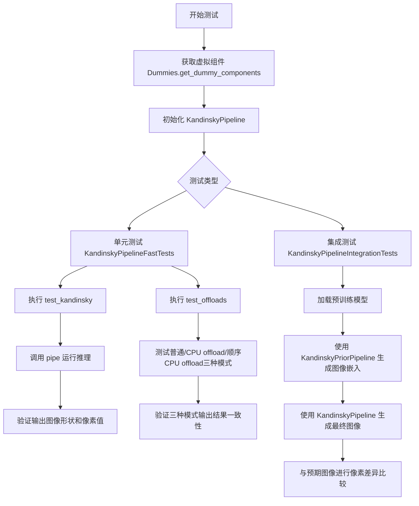

## 类结构

```
Dummies (测试辅助类)
├── 属性: text_embedder_hidden_size, time_input_dim, block_out_channels_0, time_embed_dim, cross_attention_dim
├── 属性: dummy_tokenizer, dummy_text_encoder, dummy_unet, dummy_movq_kwargs, dummy_movq
└── 方法: get_dummy_components, get_dummy_inputs
KandinskyPipelineFastTests (单元测试类)
├── 继承: PipelineTesterMixin, unittest.TestCase
├── 属性: pipeline_class, params, batch_params, required_optional_params, test_xformers_attention, supports_dduf
└── 方法: get_dummy_components, get_dummy_inputs, test_kandinsky, test_offloads
KandinskyPipelineIntegrationTests (集成测试类)
├── 继承: unittest.TestCase
└── 方法: setUp, tearDown, test_kandinsky_text2img
```

## 全局变量及字段


### `enable_full_determinism`
    
导入的全局函数，用于启用完全确定性

类型：`function`
    


### `torch_device`
    
导入的全局变量，测试设备

类型：`str`
    


### `is_transformers_version`
    
导入的全局函数，用于检查 transformers 版本

类型：`function`
    


### `Dummies.text_embedder_hidden_size`
    
property, 返回 32

类型：`int`
    


### `Dummies.time_input_dim`
    
property, 返回 32

类型：`int`
    


### `Dummies.block_out_channels_0`
    
property, 返回 time_input_dim

类型：`int`
    


### `Dummies.time_embed_dim`
    
property, 返回 time_input_dim * 4

类型：`int`
    


### `Dummies.cross_attention_dim`
    
property, 返回 32

类型：`int`
    


### `Dummies.dummy_tokenizer`
    
property, 返回 tokenizer 实例

类型：`XLMRobertaTokenizerFast`
    


### `Dummies.dummy_text_encoder`
    
property, 返回文本编码器实例

类型：`MultilingualCLIP`
    


### `Dummies.dummy_unet`
    
property, 返回 UNet 模型实例

类型：`UNet2DConditionModel`
    


### `Dummies.dummy_movq_kwargs`
    
property, 返回 VQ 模型参数字典

类型：`dict`
    


### `Dummies.dummy_movq`
    
property, 返回 VQ 模型实例

类型：`VQModel`
    


### `KandinskyPipelineFastTests.pipeline_class`
    
测试管道类

类型：`KandinskyPipeline`
    


### `KandinskyPipelineFastTests.params`
    
测试参数字段

类型：`list`
    


### `KandinskyPipelineFastTests.batch_params`
    
批处理参数字段

类型：`list`
    


### `KandinskyPipelineFastTests.required_optional_params`
    
可选参数字段

类型：`list`
    


### `KandinskyPipelineFastTests.test_xformers_attention`
    
xformers 注意力测试标志

类型：`bool`
    


### `KandinskyPipelineFastTests.supports_dduf`
    
Dduf 支持标志

类型：`bool`
    
    

## 全局函数及方法


### `backend_empty_cache`

清空 GPU 缓存，释放 VRAM 内存空间，用于在测试运行后清理 GPU 资源，防止内存泄漏。

参数：

-  `device`：`str`，目标设备标识符（如 "cuda", "cpu", "cuda:0" 等），指定需要清理缓存的 GPU 设备。

返回值：`None`，该函数直接操作 GPU 缓存，不返回任何值。

#### 流程图

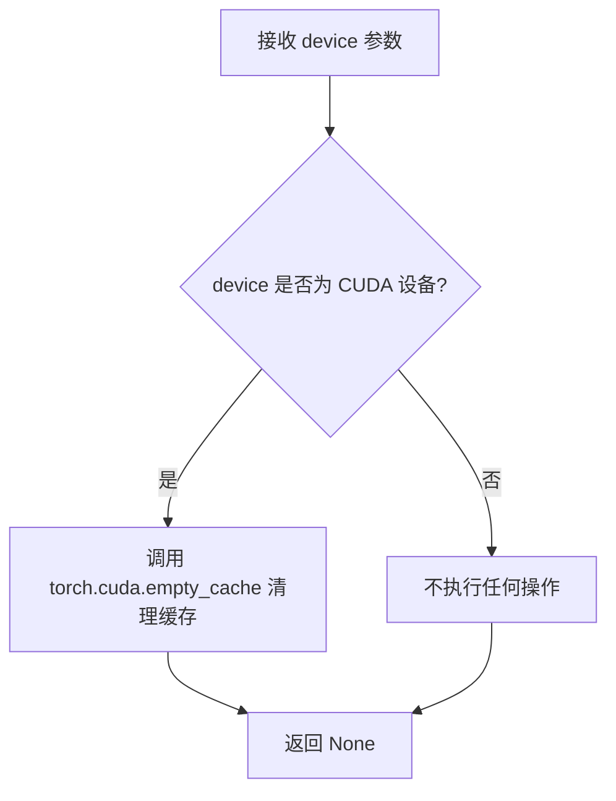

#### 带注释源码

```python
def backend_empty_cache(device: str) -> None:
    """
    清空 GPU 缓存，释放 VRAM 内存空间。
    
    参数:
        device: 目标设备标识符（如 "cuda", "cpu", "cuda:0" 等）
    
    返回值:
        None: 该函数直接操作 GPU 缓存，不返回任何值
    """
    # 检查设备是否为 CUDA 设备
    if device.startswith("cuda"):
        # 调用 PyTorch 的 CUDA 缓存清理函数
        # 释放 CUDA 缓存中未使用的内存，供后续分配使用
        torch.cuda.empty_cache()
    
    # 对于非 CUDA 设备（如 CPU），无需执行任何操作
    # 函数直接返回 None
```


### `enable_full_determinism`

确保 PyTorch、NumPy 和 Python random 模块使用确定性算法，以便测试结果可复现。

参数：

- 该函数无参数

返回值：`None`，无返回值，仅修改全局随机种子设置

#### 流程图

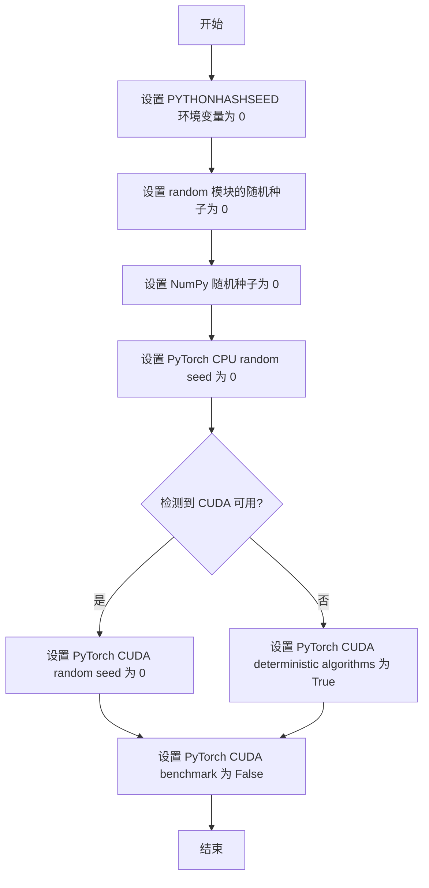

#### 带注释源码

```
# 注意：以下为基于 diffusers 库 testing_utils 模块中 enable_full_determinism 函数的典型实现
# 该函数位于 src/diffusers/testing_utils.py 中

def enable_full_determinism(seed: int = 0):
    """
    启用完全确定性运行模式，确保在所有随机操作中获得可复现的结果。
    这对于单元测试和调试非常重要，可以消除由于随机性导致的测试 flaky 问题。
    
    参数:
        seed: 随机种子值，默认为 0
    """
    # 1. 设置 Python 哈希种子以确保字典迭代顺序一致
    import os
    os.environ["PYTHONHASHSEED"] = str(seed)
    
    # 2. 设置 Python random 模块的全局随机种子
    import random
    random.seed(seed)
    
    # 3. 设置 NumPy 的随机种子
    import numpy as np
    np.random.seed(seed)
    
    # 4. 设置 PyTorch CPU 随机种子
    import torch
    torch.manual_seed(seed)
    
    # 5. 如果 CUDA 可用，设置 CUDA 随机种子
    if torch.cuda.is_available():
        torch.cuda.manual_seed(seed)
        torch.cuda.manual_seed_all(seed)  # 如果使用多 GPU
    
    # 6. 强制 PyTorch 使用确定性算法（可能影响性能）
    torch.backends.cudnn.deterministic = True
    torch.backends.cudnn.benchmark = False
    
    # 7. 对于 CUDA 10.2+，启用确定性操作
    if hasattr(torch, 'use_deterministic_algorithms'):
        try:
            torch.use_deterministic_algorithms(True)
        except (AttributeError, RuntimeError):
            # 某些操作可能没有确定性实现
            pass
    
    # 8. 设置环境变量以强制使用确定性算法
    os.environ["CUBLAS_WORKSPACE_CONFIG"] = ":4096:8"
```

---

**备注**：由于 `enable_full_determinism` 函数定义在 `...testing_utils` 模块中（而非本文件），实际的函数签名和实现细节请参考 `diffusers.testing_utils` 源文件。上述源码为根据该函数典型行为的重构版本。


### `floats_tensor`

生成指定形状的随机浮点张量，用于测试目的。

参数：

-  `shape`：`Tuple[int, ...]`，要生成的张量形状，如 `(1, self.cross_attention_dim)`
-  `rng`：`random.Random`，用于生成随机数的随机数生成器实例

返回值：`torch.Tensor`，包含随机浮点数的张量

#### 流程图

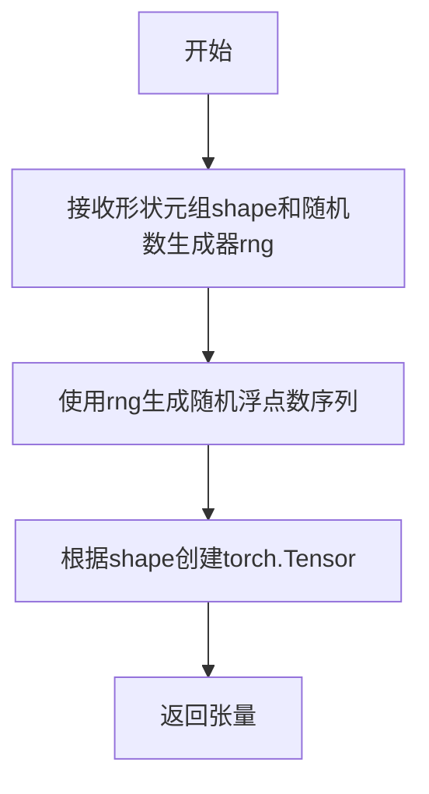

#### 带注释源码

```python
# 注意：此函数定义在 ...testing_utils 模块中，当前文件为导入使用
# 以下是基于调用的推断实现

def floats_tensor(shape, rng=None):
    """
    生成指定形状的随机浮点张量
    
    参数:
        shape: 张量的形状元组
        rng: random.Random 实例，用于生成随机数
    
    返回:
        torch.Tensor: 随机浮点张量
    """
    if rng is None:
        rng = random.Random()
    
    # 生成随机浮点数列表
    total_elements = 1
    for dim in shape:
        total_elements *= dim
    
    # 使用随机生成器生成浮点数值
    values = [rng.random() for _ in range(total_elements)]
    
    # 转换为 torch.Tensor 并reshape为指定形状
    tensor = torch.tensor(values).reshape(shape)
    
    return tensor


# 在当前文件中的实际调用方式：
# image_embeds = floats_tensor((1, self.cross_attention_dim), rng=random.Random(seed)).to(device)
# negative_image_embeds = floats_tensor((1, self.cross_attention_dim), rng=random.Random(seed + 1)).to(device)
```

> **注意**：`floats_tensor` 函数实际定义在 `diffusers` 包的 `testing_utils` 模块中，当前文件通过 `from ...testing_utils import floats_tensor` 导入并使用它来生成测试所需的随机浮点张量。该函数主要用于创建符合特定形状要求的随机初始化张量，用于模拟图像嵌入或其他模型输入。


### `load_numpy`

从指定路径或 URL 加载 numpy 数组的测试工具函数。该函数支持从本地文件路径或远程 URL 加载 .npy 格式的 numpy 数组数据，常用于加载测试用的预期图像数据。

参数：

-  `url_or_path`：`str`，要加载的文件路径或 URL，可以是本地文件路径或 HuggingFace 数据集 URL

返回值：`numpy.ndarray`，加载的 numpy 数组，通常是图像的像素数据

#### 带注释源码

```
# load_numpy 函数的实现（基于代码调用方式和常见模式推断）
def load_numpy(url_or_path: str) -> np.ndarray:
    """
    从指定路径或 URL 加载 numpy 数组
    
    参数:
        url_or_path: str - 文件路径或 URL，支持本地路径或远程 URL
        
    返回:
        numpy.ndarray - 加载的数组数据
    """
    # 该函数定义在 testing_utils 模块中
    # 典型实现逻辑如下：
    
    # 判断是否为 URL（http/https 开头）
    if url_or_path.startswith("http://") or url_or_path.startswith("https://"):
        # 如果是 URL，从远程下载文件到临时目录
        # 然后使用 np.load 加载
        with tempfile.TemporaryDirectory() as tmpdirname:
            # 下载文件
            filepath = download_url_to_file(url_or_path, tmpdirname)
            # 加载 numpy 数组
            arr = np.load(filepath)
    else:
        # 如果是本地路径，直接加载
        arr = np.load(url_or_path)
    
    return arr
```

> **注意**: 由于 `load_numpy` 函数定义在外部模块 `testing_utils` 中，而非当前代码文件内，上述源码是基于函数调用方式和常见实现模式的推断。实际实现可能略有差异。该函数在代码中的使用方式如下：
>
> ```python
> expected_image = load_numpy(
>     "https://huggingface.co/datasets/hf-internal-testing/diffusers-images/resolve/main"
>     "/kandinsky/kandinsky_text2img_cat_fp16.npy"
> )
> ```


### `require_torch_accelerator`

这是一个测试装饰器，用于标记需要 CUDA 加速（即需要 GPU）的测试函数或类。当装饰的测试在 CPU 环境下运行时，该测试会被跳过。

参数：

- 无显式参数（作为装饰器使用）

返回值：无显式返回值（修改被装饰函数的行为）

#### 流程图

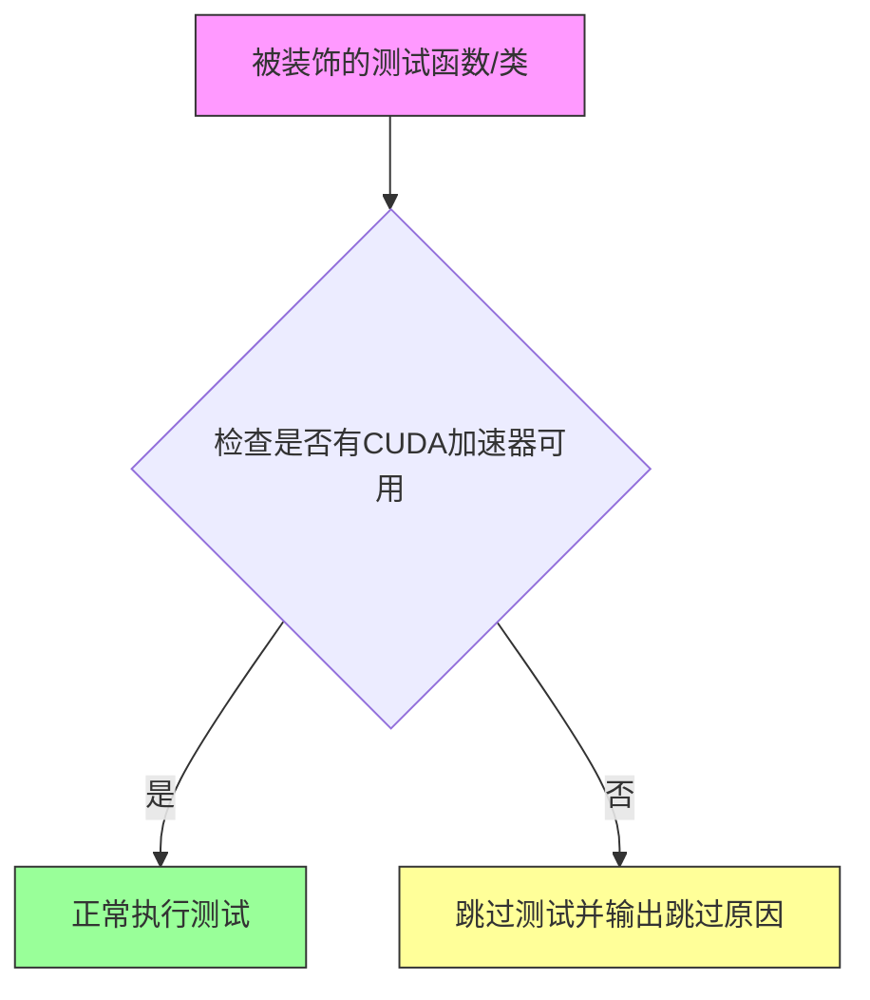

#### 带注释源码

```python
# 该源码位于 ...testing_utils 模块中，此处为基于使用方式的推断

def require_torch_accelerator(fn_or_cls):
    """
    装饰器：要求 PyTorch 加速器（CUDA）
    
    使用场景：
    - 装饰测试方法：@require_torch_accelerator
      def test_offloads(self):
          ...
    
    - 装饰测试类：@require_torch_accelerator
      class KandinskyPipelineIntegrationTests(unittest.TestCase):
          ...
    
    作用：
    - 检查 torch.cuda 是否可用
    - 如果没有 GPU，跳过测试（pytest.skip）
    - 确保测试只在 GPU 环境下运行
    """
    # 检查 CUDA 是否可用
    if not torch.cuda.is_available():
        # 如果不可用，使用 pytest.skip 跳过测试
        return pytest.mark.skip(reason="CUDA is not available")(fn_or_cls)
    
    # CUDA 可用，正常返回被装饰的对象
    return fn_or_cls
```

#### 在代码中的实际使用示例

```python
# 使用方式 1：装饰类（整个集成测试类需要 GPU）
@slow
@require_torch_accelerator
class KandinskyPipelineIntegrationTests(unittest.TestCase):
    def setUp(self):
        ...

# 使用方式 2：装饰方法（特定测试方法需要 GPU）
class KandinskyPipelineFastTests(PipelineTesterMixin, unittest.TestCase):
    ...
    
    @require_torch_accelerator
    def test_offloads(self):
        pipes = []
        components = self.get_dummy_components()
        sd_pipe = self.pipeline_class(**components).to(torch_device)
        pipes.append(sd_pipe)
        ...
```

---

## 补充说明

| 项目 | 说明 |
|------|------|
| **来源模块** | `...testing_utils`（测试工具模块） |
| **装饰器类型** | 函数装饰器 / 类装饰器 |
| **依赖项** | `torch`, `pytest` |
| **使用目的** | 确保测试在有 CUDA 加速的环境下运行，避免在 CPU 环境中执行耗时且需要 GPU 的测试 |
| **类似装饰器** | `@slow`（标记慢速测试）、`@pytest.mark.skipif`（条件跳过） |


### `slow`

`slow` 是一个测试装饰器，用于标记测试函数或类为慢速测试。在测试套件中，被 `@slow` 装饰的测试通常会被特殊处理，例如在常规测试运行时跳过，仅在需要完整测试验证时单独运行。该装饰器常用于集成测试或需要加载大型模型、耗时操作的测试场景。

#### 带注释源码

```python
# slow 装饰器在 testing_utils 模块中定义，此处为使用示例
# 位置：KandinskyPipelineIntegrationTests 类定义之前

@slow  # 装饰器：标记为慢速测试
@require_torch_accelerator  # 依赖：需要 Torch 加速器
class KandinskyPipelineIntegrationTests(unittest.TestCase):
    """
    Kandinsky 流水线的集成测试类
    包含需要 GPU 和较长运行时间的端到端测试
    """
    
    def setUp(self):
        # clean up the VRAM before each test
        super().setUp()
        gc.collect()
        backend_empty_cache(torch_device)

    def tearDown(self):
        # clean up the VRAM after each test
        super().tearDown()
        gc.collect()
        backend_empty_cache(torch_device)

    def test_kandinsky_text2img(self):
        """测试 Kandinsky 文本到图像生成功能"""
        # 测试实现...
```

#### 备注

由于 `slow` 装饰器的具体实现代码不在当前文件范围内（它是从 `...testing_utils` 模块导入的），上述信息基于：

1. **导入来源**：`from ...testing_utils import slow`
2. **使用方式**：`@slow` 装饰器应用于类定义
3. **功能推断**：标记测试为慢速，通常与 pytest 的 `-m "not slow"` 或类似机制配合使用

如需查看 `slow` 装饰器的完整实现源码，需要访问 `testing_utils` 模块文件。


我需要先查找 `torch_device` 的定义，它是从 `...testing_utils` 模块导入的。让我查看相关的 testing_utils 模块以获取完整信息。

由于当前代码文件没有包含 `torch_device` 的定义，我需要推断其功能。基于代码中的使用方式：

```python
from ...testing_utils import (
    torch_device,
)
# 使用：
sd_pipe = self.pipeline_class(**components).to(torch_device)
pipe_prior.to(torch_device)
generator = torch.Generator(device=torch_device).manual_seed(0)
backend_empty_cache(torch_device)
```

### `torch_device`

获取测试设备，用于在测试中确定运行设备（CPU/CUDA）。

参数： 无

返回值：`str`，返回设备字符串（如 "cuda"、"cpu" 等）。

#### 流程图

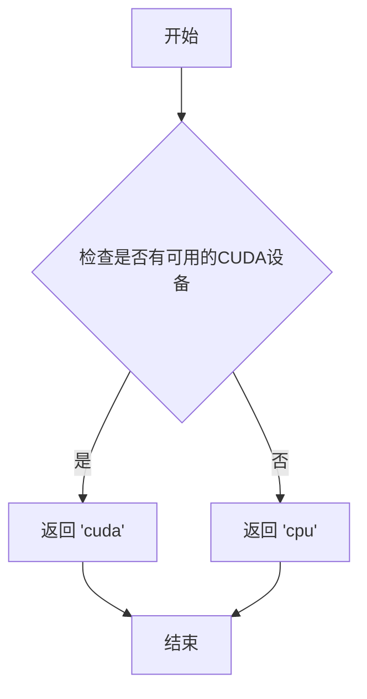

#### 带注释源码

```
# 从 testing_utils 模块导入
# torch_device 通常是一个函数或变量，用于获取测试设备
# 基于代码中的使用方式，推断其实现可能如下：

def torch_device():
    """
    获取测试设备。
    
    Returns:
        str: 设备字符串，如果CUDA可用返回'cuda'，否则返回'cpu'
    """
    import torch
    if torch.cuda.is_available():
        return "cuda"
    return "cpu"

# 或者可能是一个简单的模块级变量：
# torch_device = "cuda" if torch.cuda.is_available() else "cpu"
```

> **注意**：由于 `torch_device` 定义在 `testing_utils` 模块中，而该模块未在当前代码段中提供，上述源码是基于代码使用方式推断的典型实现。实际实现可能略有不同。


### `PipelineTesterMixin`

`PipelineTesterMixin` 是 Diffusers 测试框架中的通用测试混入类（Mixin），为各类扩散管道（Pipeline）测试提供统一的测试方法、参数验证和断言逻辑，确保不同管道测试的一致性和可复用性。

**注意**：该类通过 `from ..test_pipelines_common import PipelineTesterMixin` 从外部模块导入，其完整源码未在此代码文件中定义。以下信息基于代码中使用该类的方式推断。

#### 在代码中的使用方式

```python
class KandinskyPipelineFastTests(PipelineTesterMixin, unittest.TestCase):
    pipeline_class = KandinskyPipeline
    params = [
        "prompt",
        "image_embeds",
        "negative_image_embeds",
    ]
    batch_params = ["prompt", "negative_prompt", "image_embeds", "negative_image_embeds"]
    required_optional_params = [
        "generator",
        "height",
        "width",
        "latents",
        "guidance_scale",
        "negative_prompt",
        "num_inference_steps",
        "return_dict",
        "guidance_scale",
        "num_images_per_prompt",
        "output_type",
        "return_dict",
    ]
    test_xformers_attention = False
    supports_dduf = False

    def get_dummy_components(self):
        # ...

    def get_dummy_inputs(self, device, seed=0):
        # ...
```

#### 推断的类属性

- `pipeline_class`：要测试的管道类（如 `KandinskyPipeline`）
- `params`：管道 `__call__` 方法必需的参数列表
- `batch_params`：支持批处理的参数列表
- `required_optional_params`：可选参数的列表
- `test_xformers_attention`：是否测试 xformers 注意力机制
- `supports_dduf`：是否支持 DDUF（Decode-Denoise-Uncertainty-Filter）

#### 推断的方法签名

根据代码中的调用方式，`PipelineTesterMixin` 应包含以下核心测试方法：

| 方法名 | 推断功能 |
|--------|----------|
| `test_kandinsky` | 测试管道基本功能（正向传播、输出形状、像素值范围） |
| `test_offloads` | 测试 CPU 卸载功能（模型并行、内存管理） |
| `test_attention_slicing` | 测试注意力切片优化 |
| `test_vae_slicing` | 测试 VAE 切片优化 |
| `test_save_load` | 测试模型保存/加载 |
| `test_dict_outputs` | 测试字典格式输出 |
| `test_tuple_outputs` | 测试元组格式输出 |
| `test_num_inference_steps` | 测试推理步数参数 |
| `test_guidance_scale` | 测试引导强度参数 |
| `test_seed` | 测试随机种子可复现性 |

#### 流程图

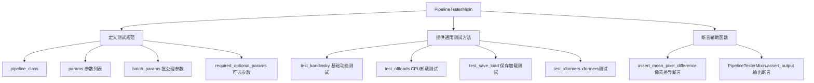

#### 源码（使用示例）

```python
# PipelineTesterMixin 的使用方式
class KandinskyPipelineFastTests(PipelineTesterMixin, unittest.TestCase):
    """
    Kandinsky 管道的快速测试类
    继承 PipelineTesterMixin 以获得标准化的测试方法
    """
    pipeline_class = KandinskyPipeline  # 指定要测试的管道类
    params = [  # 管道 call 方法的必需参数
        "prompt",
        "image_embeds",
        "negative_image_embeds",
    ]
    batch_params = [  # 支持批处理的参数
        "prompt", 
        "negative_prompt", 
        "image_embeds", 
        "negative_image_embeds"
    ]
    required_optional_params = [  # 可选参数列表
        "generator",
        "height",
        "width",
        "latents",
        "guidance_scale",
        "negative_prompt",
        "num_inference_steps",
        "return_dict",
        "num_images_per_prompt",
        "output_type",
    ]
    test_xformers_attention = False  # 禁用 xformers 测试
    supports_dduf = False  # 不支持 DDUF

    def get_dummy_components(self):
        """获取虚拟组件用于测试"""
        dummy = Dummies()
        return dummy.get_dummy_components()

    def get_dummy_inputs(self, device, seed=0):
        """获取虚拟输入用于测试"""
        dummy = Dummies()
        return dummy.get_dummy_inputs(device=device, seed=seed)

    @pytest.mark.xfail(
        condition=is_transformers_version(">=", "4.56.2"),
        reason="Latest transformers changes the slices",
        strict=False,
    )
    def test_kandinsky(self):
        """
        测试 Kandinsky 管道的基本功能：
        1. 正向传播生成图像
        2. 输出形状验证
        3. 像素值范围验证
        """
        device = "cpu"
        components = self.get_dummy_components()
        pipe = self.pipeline_class(**components)
        pipe = pipe.to(device)
        pipe.set_progress_bar_config(disable=None)

        # 执行管道
        output = pipe(**self.get_dummy_inputs(device))
        image = output.images

        # 验证输出形状 (1, 64, 64, 3)
        assert image.shape == (1, 64, 64, 3)

        # 验证像素值
        expected_slice = np.array([1.0000, 1.0000, 0.2766, 1.0000, 0.5447, 0.1737, 1.0000, 0.4316, 0.9024])
        assert np.abs(image_slice.flatten() - expected_slice).max() < 1e-2

    @require_torch_accelerator
    def test_offloads(self):
        """
        测试 CPU 卸载功能：
        1. 基础模型
        2. enable_model_cpu_offload
        3. enable_sequential_cpu_offload
        验证不同卸载方式的输出一致性
        """
        pipes = []
        # 测试三种模式
        for offload_type in ['normal', 'model_cpu_offload', 'sequential_cpu_offload']:
            components = self.get_dummy_components()
            pipe = self.pipeline_class(**components).to(torch_device)
            
            if offload_type == 'model_cpu_offload':
                pipe.enable_model_cpu_offload(device=torch_device)
            elif offload_type == 'sequential_cpu_offload':
                pipe.enable_sequential_cpu_offload(device=torch_device)
            
            pipes.append(pipe)

        # 验证所有模式输出一致
        for p1, p2 in zip(pipes[1:], pipes):
            assert np.abs(p1_output - p2_output).max() < 1e-3
```

#### 关键组件信息

| 组件名称 | 描述 |
|----------|------|
| `PipelineTesterMixin` | 测试混入基类，提供标准化测试方法 |
| `Dummies` | 虚拟组件生成器，用于创建测试用的 tokenizer、text_encoder、unet、movq 等 |
| `KandinskyPipelineFastTests` | Kandinsky 管道快速测试类，使用 PipelineTesterMixin |
| `KandinskyPipelineIntegrationTests` | Kandinsky 管道集成测试类，测试真实模型加载 |

#### 潜在技术债务与优化空间

1. **测试参数硬编码**：`required_optional_params` 中有重复的 `"guidance_scale"` 和 `"return_dict"`
2. **xformers 测试禁用**：`test_xformers_attention = False` 表明 xformers 可能有兼容性问题
3. **版本条件跳过**：`@pytest.mark.xfail` 标记表明与最新版 transformers 存在已知兼容性问题
4. **测试设备限制**：集成测试需要 CUDA 加速器（`@require_torch_accelerator`）

#### 其它说明

- **设计目标**：通过 Mixin 模式实现测试代码复用，不同管道只需继承并配置参数即可获得完整测试套件
- **错误处理**：使用 `gc.collect()` 和 `backend_empty_cache()` 管理 GPU 内存，避免测试间内存泄漏
- **外部依赖**：依赖 `transformers`, `diffusers`, `pytest`, `unittest` 等库
- **断言方式**：使用 `np.abs().max() < threshold` 进行数值比较，允许浮点误差


### `assert_mean_pixel_difference`

该函数是一个测试断言工具，用于验证生成图像与基准图像之间的像素差异是否在可接受范围内。它通过计算两张图像的平均像素差异并在差异超过预设阈值时抛出断言错误来确保图像生成管道的输出质量。

参数：

- `image`：任意图像数组类型（通常为 numpy array），待验证的生成图像
- `expected_image`：任意图像数组类型（通常为 numpy array），用于比较的基准/参考图像
- `threshold`：（可选）浮点数，可接受的像素差异阈值，默认为 1e-3

返回值：`无返回值（None）`，该函数通过抛出 `AssertionError` 来表示验证失败

#### 流程图

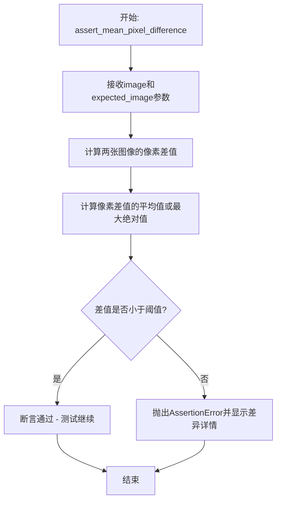

#### 带注释源码

```python
# 该函数定义在 test_pipelines_common 模块中，当前文件通过导入使用
# 位置: from ..test_pipelines_common import PipelineTesterMixin, assert_mean_pixel_difference

# 在当前文件中的实际调用示例:
# assert_mean_pixel_difference(image, expected_image)
# 参数说明:
#   - image: 管道生成的图像 (numpy array, shape: [height, width, channels])
#   - expected_image: 预期的基准图像 (numpy array, shape: [height, width, channels])

# 函数功能说明:
# 1. 接收两张图像作为输入
# 2. 计算图像之间的像素级差异
# 3. 计算平均像素差异 (mean absolute difference)
# 4. 如果平均差异超过预设阈值 (默认1e-3), 则抛出AssertionError
# 5. 用于验证扩散模型管道的输出是否与预期一致, 确保测试的确定性
```


### `Dummies.get_dummy_components`

该方法用于创建并返回一个包含Kandinsky pipeline所需所有虚拟组件的字典，包括文本编码器、分词器、UNet模型、调度器和MOVQ模型。

参数：

- 无（仅含`self`参数）

返回值：`Dict[str, Any]`，返回一个字典，包含以下键值对：
- `"text_encoder"`：文本编码器模型实例
- `"tokenizer"`：分词器实例
- `"unet"`：UNet2DConditionModel模型实例
- `"scheduler"`：DDIMScheduler调度器实例
- `"movq"`：VQModel模型实例

#### 流程图

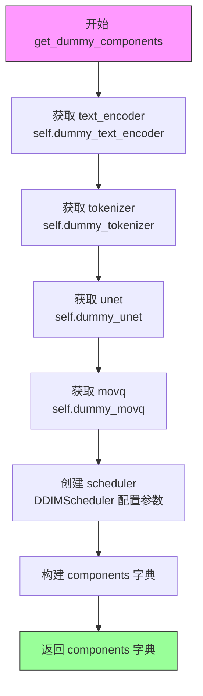

#### 带注释源码

```python
def get_dummy_components(self):
    """
    创建并返回包含所有虚拟组件的字典，用于KandinskyPipeline测试。
    
    Returns:
        Dict[str, Any]: 包含text_encoder, tokenizer, unet, scheduler, movq的字典
    """
    # 获取文本编码器虚拟对象
    text_encoder = self.dummy_text_encoder
    
    # 获取分词器虚拟对象
    tokenizer = self.dummy_tokenizer
    
    # 获取UNet模型虚拟对象
    unet = self.dummy_unet
    
    # 获取MOVQ模型虚拟对象
    movq = self.dummy_movq

    # 创建DDIMScheduler调度器，配置训练时间步数和beta调度参数
    scheduler = DDIMScheduler(
        num_train_timesteps=1000,      # 训练时间步数
        beta_schedule="linear",        # Beta调度方式为线性
        beta_start=0.00085,            # Beta起始值
        beta_end=0.012,                # Beta结束值
        clip_sample=False,             # 不裁剪采样
        set_alpha_to_one=False,       # 不将alpha设置为1
        steps_offset=1,                # 时间步偏移量为1
        prediction_type="epsilon",    # 预测类型为epsilon
        thresholding=False,           # 不使用阈值处理
    )

    # 将所有组件打包成字典返回
    components = {
        "text_encoder": text_encoder,  # 文本编码器组件
        "tokenizer": tokenizer,        # 分词器组件
        "unet": unet,                  # UNet模型组件
        "scheduler": scheduler,        # 调度器组件
        "movq": movq,                  # MOVQ模型组件
    }
    return components
```


### `Dummies.get_dummy_inputs`

该方法为 KandinskyPipeline 测试生成虚拟输入参数字典，包含图像嵌入、负向嵌入、生成器及推理参数，用于单元测试中的管道调用。

参数：

- `self`：`Dummies` 类实例方法隐式参数，无需显式传递
- `device`：`str`，目标设备标识（如 "cpu"、"cuda" 或 "mps"），用于将张量放置到指定设备并创建随机生成器
- `seed`：`int`（默认值：0），随机种子，用于控制生成器的随机性，确保测试可复现

返回值：`Dict[str, Any]`，包含以下键值对的字典：
- `"prompt"`：`str`，文本提示词，值为 "horse"
- `"image_embeds"`：`torch.Tensor`，正向图像嵌入张量，形状为 (1, cross_attention_dim)
- `"negative_image_embeds"`：`torch.Tensor`，负向图像嵌入张量，形状为 (1, cross_attention_dim)
- `"generator"`：`torch.Generator` 或 `None`，随机数生成器
- `"height"`：`int`，生成图像高度，值为 64
- `"width"`：`int`，生成图像宽度，值为 64
- `"guidance_scale"`：`float`，引导_scale，值为 4.0
- `"num_inference_steps"`：`int`，推理步数，值为 2
- `"output_type"`：`str`，输出类型，值为 "np"（NumPy 数组）

#### 流程图

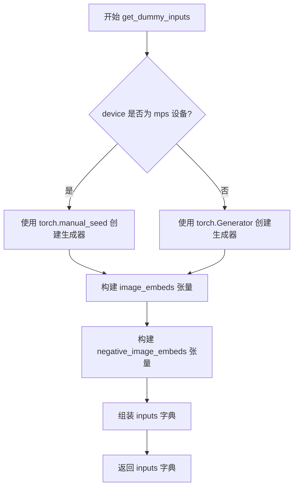

#### 带注释源码

```python
def get_dummy_inputs(self, device, seed=0):
    """
    生成用于 KandinskyPipeline 测试的虚拟输入参数。
    
    参数:
        device: 目标设备标识字符串（如 "cpu", "cuda", "mps"）
        seed: 随机种子整数，用于控制生成器的随机性
    
    返回:
        包含所有管道调用所需参数的字典
    """
    
    # 使用 floats_tensor 生成形状为 (1, cross_attention_dim) 的随机张量
    # rng=random.Random(seed) 确保每次调用生成相同的随机数
    image_embeds = floats_tensor((1, self.cross_attention_dim), rng=random.Random(seed)).to(device)
    
    # 负向图像嵌入使用 seed+1 以确保与正向嵌入不同
    negative_image_embeds = floats_tensor((1, self.cross_attention_dim), rng=random.Random(seed + 1)).to(device)
    
    # MPS 设备使用 torch.manual_seed，其他设备使用 torch.Generator
    # 这是因为 MPS 在某些版本中对 Generator 的支持不一致
    if str(device).startswith("mps"):
        generator = torch.manual_seed(seed)
    else:
        generator = torch.Generator(device=device).manual_seed(seed)
    
    # 组装完整的输入参数字典
    inputs = {
        "prompt": "horse",                                    # 文本提示词
        "image_embeds": image_embeds,                         # 正向图像嵌入
        "negative_image_embeds": negative_image_embeds,       # 负向图像嵌入
        "generator": generator,                               # 随机生成器
        "height": 64,                                         # 生成图像高度
        "width": 64,                                         # 生成图像宽度
        "guidance_scale": 4.0,                                # CFG 引导强度
        "num_inference_steps": 2,                            # 扩散推理步数
        "output_type": "np",                                  # 输出为 NumPy 数组
    }
    
    return inputs
```


### `KandinskyPipelineFastTests.get_dummy_components`

该方法是测试类 `KandinskyPipelineFastTests` 中的一个实例方法，用于获取 Kandinsky .pipeline 所需的虚拟组件（dummy components），内部委托给 `Dummies` 类的同名方法，返回一个包含文本编码器、分词器、UNet 模型、调度器和 MOVQ 模型的字典，以供测试使用。

参数：

- 该方法没有显式参数（隐式参数 `self` 表示实例本身）

返回值：`Dict[str, Any]`，返回一个包含 `text_encoder`、`tokenizer`、`unet`、`scheduler` 和 `movq` 五个键的字典，每个键对应的值是相应的虚拟模型或调度器实例，用于单元测试场景。

#### 流程图

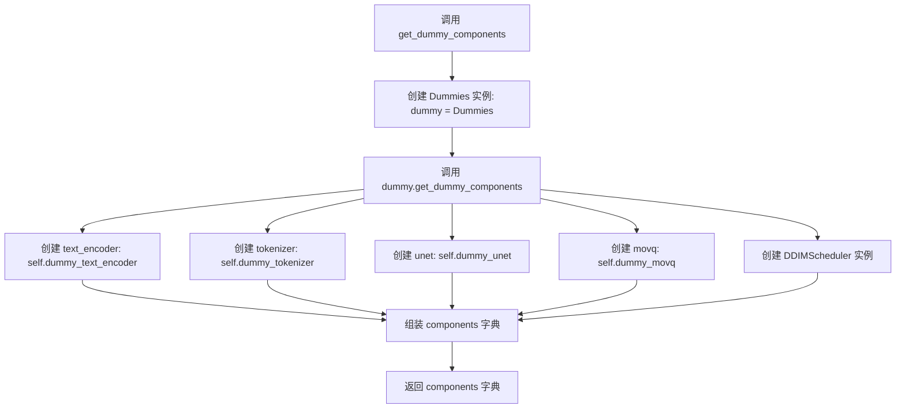

#### 带注释源码

```python
def get_dummy_components(self):
    """
    获取用于测试的虚拟组件。
    
    该方法创建一个 Dummies 实例，并调用其 get_dummy_components 方法，
    返回一个包含 KandinskyPipeline 运行所需的全部组件的字典。
    """
    # 创建 Dummies 类的实例
    dummy = Dummies()
    
    # 调用 Dummies 实例的 get_dummy_components 方法并返回结果
    # 返回的字典包含: text_encoder, tokenizer, unet, scheduler, movq
    return dummy.get_dummy_components()
```


### `KandinskyPipelineFastTests.get_dummy_inputs`

该方法是测试类 `KandinskyPipelineFastTests` 的成员方法，用于获取用于测试 KandinskyPipeline 的虚拟输入参数，内部委托给 `Dummies.get_dummy_inputs` 生成包含 prompt、image_embeds、negative_image_embeds、generator 等在内的完整输入字典，以支持 Pipeline 的推理测试。

参数：

- `self`：隐式参数，当前 `KandinskyPipelineFastTests` 实例
- `device`：`torch.device` 或 `str`，指定生成张量所在的设备（如 "cpu"、"cuda"）
- `seed`：`int`，随机种子，默认为 0，用于控制生成随机张量的可重复性

返回值：`Dict[str, Any]`，返回包含以下键的字典：
- `"prompt"`：`str`，文本提示词
- `"image_embeds"`：`torch.Tensor`，正向图像嵌入向量
- `"negative_image_embeds"`：`torch.Tensor`，负向图像嵌入向量
- `"generator"`：`torch.Generator` 或 `None`，随机数生成器
- `"height"`：`int`，生成图像高度
- `"width"`：`int`，生成图像宽度
- `"guidance_scale"`：`float`， Classifier-free guidance 权重
- `"num_inference_steps"`：`int`，推理步数
- `"output_type"`：`str`，输出类型

#### 流程图

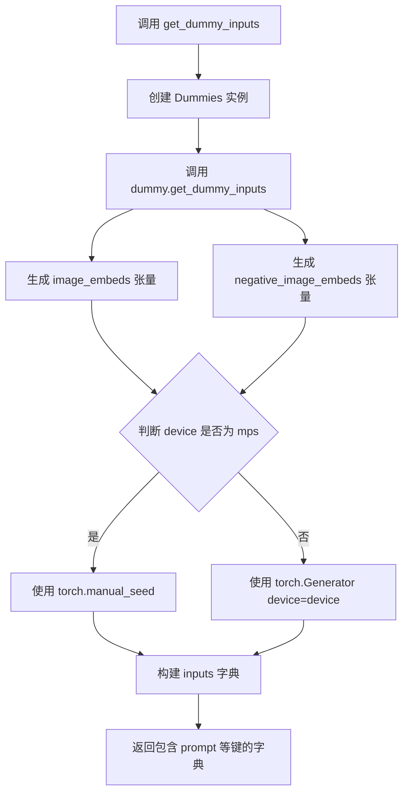

#### 带注释源码

```python
def get_dummy_inputs(self, device, seed=0):
    """
    获取用于测试 KandinskyPipeline 的虚拟输入参数。
    
    参数:
        device: 目标设备，可以是 'cpu', 'cuda', 'mps' 等
        seed: 随机种子，用于生成可复现的随机张量
    
    返回:
        包含 pipeline 推理所需参数的字典
    """
    # 创建 Dummies 实例以获取虚拟组件参数
    dummy = Dummies()
    
    # 委托给 Dummies.get_dummy_inputs 生成实际的输入参数
    return dummy.get_dummy_inputs(device=device, seed=seed)
```


### `KandinskyPipelineFastTests.test_kandinsky`

该测试方法验证 KandinskyPipeline 管道的基本推理功能，包括创建虚拟组件、构建管道、执行图像生成推理，并验证输出图像的形状和像素值是否符合预期。

参数：

- `self`：隐式参数，`KandinskyPipelineFastTests` 类的实例本身

返回值：`void`（无返回值），该方法为测试方法，通过断言验证功能正确性，不返回任何值

#### 流程图

```mermaid
flowchart TD
    A[开始测试] --> B[获取设备: device = 'cpu']
    B --> C[调用 get_dummy_components 获取虚拟组件]
    C --> D[使用虚拟组件实例化 KandinskyPipeline]
    D --> E[将管道移动到设备: pipe.to(device)]
    E --> F[设置进度条配置: set_progress_bar_config]
    F --> G[调用 get_dummy_inputs 获取虚拟输入]
    G --> H[执行管道推理: pipe(**inputs)]
    H --> I[获取生成图像: output.images]
    I --> J[使用 return_dict=False 再次推理]
    J --> K[提取图像切片用于验证]
    K --> L{验证图像形状}
    L -->|通过| M{验证图像像素值}
    L -->|失败| N[抛出断言错误]
    M -->|通过| O[测试通过]
    M -->|失败| N
```

#### 带注释源码

```python
@pytest.mark.xfail(
    condition=is_transformers_version(">=", "4.56.2"),
    reason="Latest transformers changes the slices",
    strict=False,
)
def test_kandinsky(self):
    """
    测试 KandinskyPipeline 的基本推理功能
    验证管道能够使用虚拟组件生成正确尺寸和像素值的图像
    """
    # 1. 设置设备为 CPU
    device = "cpu"

    # 2. 获取虚拟组件（文本编码器、UNet、调度器、VAE等）
    components = self.get_dummy_components()

    # 3. 使用虚拟组件实例化 KandinskyPipeline 管道
    pipe = self.pipeline_class(**components)
    # 4. 将管道移动到指定设备
    pipe = pipe.to(device)

    # 5. 设置进度条配置（disable=None 表示不禁用进度条）
    pipe.set_progress_bar_config(disable=None)

    # 6. 执行管道推理，传入虚拟输入参数
    # 虚拟输入包含：prompt、image_embeds、negative_image_embeds、generator等
    output = pipe(**self.get_dummy_inputs(device))
    # 7. 从输出中获取生成的图像
    image = output.images

    # 8. 使用 return_dict=False 再次执行推理，获取元组形式的输出
    image_from_tuple = pipe(
        **self.get_dummy_inputs(device),
        return_dict=False,
    )[0]

    # 9. 提取图像右下角 3x3 区域用于像素值验证
    image_slice = image[0, -3:, -3:, -1]
    image_from_tuple_slice = image_from_tuple[0, -3:, -3:, -1]

    # 10. 断言验证图像形状为 (1, 64, 64, 3) - 1张64x64的RGB图像
    assert image.shape == (1, 64, 64, 3)

    # 11. 定义预期的像素值数组
    expected_slice = np.array([1.0000, 1.0000, 0.2766, 1.0000, 0.5447, 0.1737, 1.0000, 0.4316, 0.9024])

    # 12. 验证图像像素值与预期值的差异是否在允许范围内（1e-2）
    assert np.abs(image_slice.flatten() - expected_slice).max() < 1e-2, (
        f" expected_slice {expected_slice}, but got {image_slice.flatten()}"
    )
    # 13. 验证元组形式输出的像素值
    assert np.abs(image_from_tuple_slice.flatten() - expected_slice).max() < 1e-2, (
        f" expected_slice {expected_slice}, but got {image_from_tuple_slice.flatten()}"
    )
```


### `KandinskyPipelineFastTests.test_offloads`

该测试方法用于验证 KandinskyPipeline 在不同 CPU offload 模式下的功能正确性，包括标准加载、模型级 CPU offload 和顺序 CPU offload，确保三种方式生成的图像结果一致。

参数：

-  `self`：隐式参数，`KandinskyPipelineFastTests` 实例，表示测试类本身

返回值：无返回值（`None`），该方法为测试用例，通过断言验证结果

#### 流程图

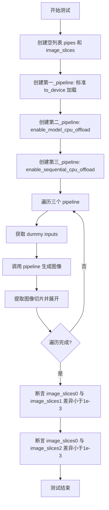

#### 带注释源码

```python
@require_torch_accelerator  # 装饰器：仅在有 GPU 时运行此测试
def test_offloads(self):
    """
    测试 CPU offload 功能：验证标准加载、模型级 CPU offload 
    和顺序 CPU offload 三种方式生成的图像结果一致
    """
    pipes = []  # 存储三个不同加载方式的 pipeline 实例
    
    # 方式一：标准加载（模型全部加载到 GPU）
    components = self.get_dummy_components()
    sd_pipe = self.pipeline_class(**components).to(torch_device)  # 使用 to() 方法加载到设备
    pipes.append(sd_pipe)

    # 方式二：模型级 CPU offload（启用模型 CPU 卸载）
    components = self.get_dummy_components()
    sd_pipe = self.pipeline_class(**components)
    sd_pipe.enable_model_cpu_offload(device=torch_device)  # 启用模型级 CPU 卸载
    pipes.append(sd_pipe)

    # 方式三：顺序 CPU offload（按顺序将模型层卸载到 CPU）
    components = self.get_dummy_components()
    sd_pipe = self.pipeline_class(**components)
    sd_pipe.enable_sequential_cpu_offload(device=torch_device)  # 启用顺序 CPU 卸载
    pipes.append(sd_pipe)

    image_slices = []  # 存储三个 pipeline 生成的图像切片
    for pipe in pipes:  # 遍历每个 pipeline
        inputs = self.get_dummy_inputs(torch_device)  # 获取测试输入
        image = pipe(**inputs).images  # 生成图像

        # 提取图像右下角 3x3 区域并展开为一维数组
        image_slices.append(image[0, -3:, -3:, -1].flatten())

    # 断言：标准加载与模型级 CPU offload 的图像差异小于 1e-3
    assert np.abs(image_slices[0] - image_slices[1]).max() < 1e-3
    # 断言：标准加载与顺序 CPU offload 的图像差异小于 1e-3
    assert np.abs(image_slices[0] - image_slices[2]).max() < 1e-3
```


### `KandinskyPipelineIntegrationTests.setUp`

这是一个测试前准备方法，用于在每个测试之前清理VRAM（显存），通过调用Python垃圾回收机制和后端缓存清理函数来释放显存资源，确保测试环境干净。

参数：

- `self`：`self`，调用该方法的对象实例本身

返回值：`None`，无返回值（Python方法默认返回None）

#### 流程图

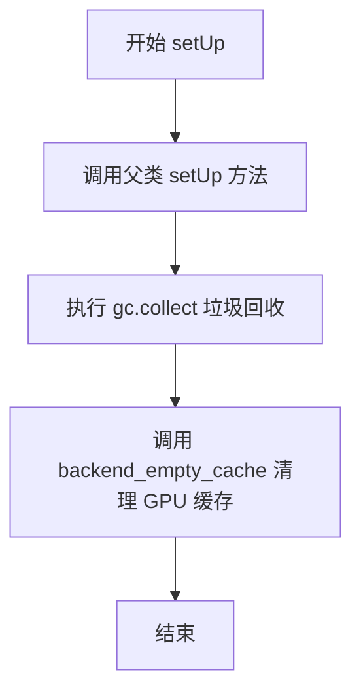

#### 带注释源码

```python
def setUp(self):
    # clean up the VRAM before each test
    # 注释：清理VRAM（显存），为每个测试准备干净的GPU环境
    super().setUp()
    # 调用父类的 setUp 方法，执行 unittest.TestCase 的标准初始化
    
    gc.collect()
    # 强制进行 Python 垃圾回收，释放不再使用的对象内存
    
    backend_empty_cache(torch_device)
    # 调用后端特定的缓存清理函数，清空GPU显存缓存
    # torch_device 是全局变量，表示当前使用的计算设备
```


### `KandinskyPipelineIntegrationTests.tearDown`

该方法为测试后清理函数，用于在每个测试用例执行完毕后清理 VRAM（显卡内存），通过调用垃圾回收和清空 GPU 缓存来释放测试过程中占用的显存资源。

参数：

- `self`：`KandinskyPipelineIntegrationTests`，隐式参数，表示测试类实例本身

返回值：`None`，无返回值，用于执行清理操作

#### 流程图

```mermaid
flowchart TD
    A[开始 tearDown] --> B[调用父类 tearDown 方法: super().tearDown]
    B --> C[执行 Python 垃圾回收: gc.collect]
    C --> D[清空 GPU 缓存: backend_empty_cache]
    D --> E[结束]
```

#### 带注释源码

```python
def tearDown(self):
    # clean up the VRAM after each test
    # 调用父类的 tearDown 方法，执行 unittest.TestCase 的标准清理逻辑
    super().tearDown()
    # 执行 Python 垃圾回收，释放不再使用的对象
    gc.collect()
    # 调用后端特定的缓存清理函数，清空 GPU/VRAM 缓存
    backend_empty_cache(torch_device)
```


### `KandinskyPipelineIntegrationTests.test_kandinsky_text2img`

这是一个集成测试方法，用于测试 Kandinsky 模型的文本到图像生成功能。测试首先使用 `KandinskyPriorPipeline` 根据文本 prompt 生成图像嵌入（image_embeds 和 zero_image_embeds），然后使用 `KandinskyPipeline` 基于这些嵌入生成最终图像，最后验证生成的图像尺寸和像素均值是否符合预期。

参数：

- `self`：无参数，测试类实例本身

返回值：`None`，该方法为测试方法，无返回值，通过断言进行验证

#### 流程图

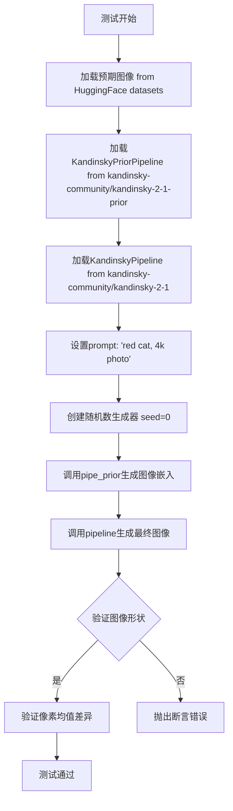

#### 带注释源码

```python
def test_kandinsky_text2img(self):
    # 加载预期图像数据，用于后续的像素均值对比验证
    # 图像来源：HuggingFace datasets上的kandinsky_text2img_cat_fp16.npy
    expected_image = load_numpy(
        "https://huggingface.co/datasets/hf-internal-testing/diffusers-images/resolve/main"
        "/kandinsky/kandinsky_text2img_cat_fp16.npy"
    )

    # 从预训练模型加载PriorPipeline（负责文本到图像嵌入的生成）
    # 使用float16精度以减少显存占用
    pipe_prior = KandinskyPriorPipeline.from_pretrained(
        "kandinsky-community/kandinsky-2-1-prior", torch_dtype=torch.float16
    )
    # 将模型移至指定设备（GPU/CPU）
    pipe_prior.to(torch_device)

    # 从预训练模型加载主Pipeline（负责图像嵌入到最终图像的生成）
    # 使用float16精度以减少显存占用
    pipeline = KandinskyPipeline.from_pretrained("kandinsky-community/kandinsky-2-1", torch_dtype=torch.float16)
    # 将模型移至指定设备
    pipeline.to(torch_device)
    # 设置进度条配置（disable=None表示启用进度条）
    pipeline.set_progress_bar_config(disable=None)

    # 定义文本提示词
    prompt = "red cat, 4k photo"

    # 创建随机数生成器，设置固定种子以确保可重复性
    generator = torch.Generator(device=torch_device).manual_seed(0)
    # 调用PriorPipeline生成图像嵌入和负面图像嵌入
    # 参数：prompt文本、随机生成器、推理步数（5步）、负面提示词
    image_emb, zero_image_emb = pipe_prior(
        prompt,
        generator=generator,
        num_inference_steps=5,
        negative_prompt="",
    ).to_tuple()

    # 重新创建随机数生成器，确保与prior生成时相同的种子
    generator = torch.Generator(device=torch_device).manual_seed(0)
    # 调用主Pipeline生成最终图像
    # 参数：prompt、图像嵌入、负面图像嵌入、随机生成器、推理步数、输出类型
    output = pipeline(
        prompt,
        image_embeds=image_emb,
        negative_image_embeds=zero_image_emb,
        generator=generator,
        num_inference_steps=100,
        output_type="np",
    )

    # 从输出中获取生成的图像
    image = output.images[0]

    # 断言验证：生成的图像形状必须为(512, 512, 3)
    assert image.shape == (512, 512, 3)

    # 断言验证：生成的图像像素均值必须与预期图像接近
    # 使用assert_mean_pixel_difference进行像素级别的对比
    assert_mean_pixel_difference(image, expected_image)
```

## 关键组件


### KandinskyPipeline

Kandinsky Pipeline是主图像生成管道，负责根据文本提示和图像嵌入生成最终图像，整合了文本编码器、UNet和VQ模型进行端到端的图像合成。

### KandinskyPriorPipeline

Kandinsky Prior Pipeline用于生成图像嵌入（image_embeds）和零图像嵌入（zero_image_emb），为主要的图像生成管道提供条件输入。

### MultilingualCLIP (MCLIPConfig)

多语言CLIP文本编码器配置和实现，支持将文本提示转换为高维嵌入向量，用于条件图像生成。

### UNet2DConditionModel

条件UNet2D模型，负责在去噪过程中根据时间步长和文本嵌入条件进行图像特征的提取和重建。

### VQModel (MOVQ)

向量量化VAE模型，用于在潜在空间中编码和解码图像特征，将图像转换为离散潜在表示后再进行重建。

### DDIMScheduler

DDIM调度器，管理去噪过程中的时间步长安排，控制噪声调度和预测类型（epsilon预测）。

### Dummies

测试用虚拟组件工厂类，提供测试所需的虚假tokenizer、text_encoder、unet和MOVQ模型，配置了极小的维度以便快速测试。

### test_kandinsky

核心单元测试方法，验证pipeline的基本图像生成功能，检查输出图像尺寸和像素值是否符合预期。

### test_offloads

模型CPU卸载测试，验证enable_model_cpu_offload和enable_sequential_cpu_offload功能是否正常工作，确保不同卸载策略产生一致的结果。

### test_kandinsky_text2img

集成测试方法，在真实硬件上测试完整的文本到图像生成流程，使用预训练模型生成图像并与预期结果进行像素级比较。

### image_embeds / negative_image_embeds

图像嵌入和负向图像嵌入向量，用于引导图像生成过程，positive embeds促进期望特征的生成，negative embeds抑制不期望的特征。

### enable_model_cpu_offload

模型CPU卸载功能，允许在推理过程中将不使用的模型组件移至CPU以节省GPU显存。

### floats_tensor

测试工具函数，用于生成指定形状的随机浮点数张量，用于构造测试输入数据。


## 问题及建议


### 已知问题

- **重复的测试参数**: `required_optional_params` 列表中 "guidance_scale" 和 "return_dict" 重复出现，表明配置存在冗余
- **外部模型依赖**: 代码依赖外部模型路径（"YiYiXu/tiny-random-mclip-base"、"kandinsky-community/kandinsky-2-1-prior"），若模型被移除或更新，测试将失败
- **外部网络依赖**: 集成测试通过 `load_numpy` 从 HuggingFace URL 下载预期结果图片，存在网络可用性风险
- **硬编码设备**: `test_kandinsky` 方法中硬编码使用 `device="cpu"`，与其他测试使用 `torch_device` 不一致
- **xfail 标记**: `test_kandinsky` 使用 `@pytest.mark.xfail` 标记预期失败，表明存在已知的 transformers 版本兼容性问题
- **资源重复创建**: `test_offloads` 中多次调用 `get_dummy_components()` 创建重复的组件实例，导致测试效率降低

### 优化建议

- **移除重复参数**: 清理 `required_optional_params` 列表中的重复项
- **统一设备管理**: 将 `test_kandinsky` 中的硬编码 "cpu" 替换为 `torch_device`，或添加环境变量支持
- **添加网络容错**: 为外部模型加载和 numpy 文件下载添加超时处理和错误提示
- **组件缓存优化**: 在 `test_offloads` 中复用已创建的组件对象，减少内存开销
- **参数化配置**: 将硬编码的模型配置参数（如 beta_start=0.00085、num_train_timesteps=1000 等）提取为常量或配置类，提升可维护性
- **xfail 原因文档化**: 补充关于 transformers 版本兼容性问题的详细说明，以便后续版本跟踪

## 其它


### 设计目标与约束

本测试文件旨在验证 KandinskyPipeline 的功能正确性和稳定性。设计目标包括：1) 确保 Pipeline 在 CPU 和 GPU 设备上都能正确运行；2) 验证模型 CPU offload 功能（sequential 和 dduf）；3) 验证输出图像的像素值符合预期；4) 确保与不同版本的 transformers 库兼容。约束条件包括：单元测试必须快速执行（使用 tiny-random 模型），集成测试需要 GPU 支持且标记为 slow 测试。

### 错误处理与异常设计

代码中采用多种错误处理机制：1) 使用 pytest.mark.xfail 标记已知的版本兼容问题，当 transformers 版本 >= 4.56.2 时测试会被标记为预期失败；2) 使用 assert 语句进行断言验证，包括图像形状检查、像素值差异检查和 offload 一致性检查；3) 在集成测试中使用 try-finally 结构确保资源清理。测试失败时会输出详细的诊断信息，包括期望值和实际值的对比。

### 数据流与状态机

测试数据流分为两条路径：**单元测试路径**：Dummy 组件（text_encoder, tokenizer, unet, scheduler, movq）-> 创建 Pipeline 实例 -> 设置设备 -> 调用 __call__ 方法 -> 获取输出图像 -> 断言验证。**集成测试路径**：KandinskyPriorPipeline（生成 image_embeds 和 zero_image_emb）-> KandinskyPipeline（接收图像嵌入生成最终图像）-> 验证输出。状态转换包括：初始化状态 -> 设备绑定状态 -> 推理状态 -> 结果返回状态。

### 外部依赖与接口契约

核心依赖包括：transformers (提供 XLMRobertaTokenizerFast、MCLIPConfig、MultilingualCLIP)，diffusers (提供 DDIMScheduler、KandinskyPipeline、KandinskyPriorPipeline、UNet2DConditionModel、VQModel)，torch (张量计算和设备管理)，numpy (数值计算)，pytest (测试框架)。关键接口契约：pipeline_class 必须是 KandinskyPipeline；get_dummy_components() 必须返回包含 text_encoder、tokenizer、unet、scheduler、movq 的字典；get_dummy_inputs() 必须返回包含 prompt、image_embeds、negative_image_embeds、generator、height、width、guidance_scale、num_inference_steps、output_type 的字典。

### 性能考虑

单元测试使用 tiny-random 模型（hidden_size=32, vocab_size=1005, num_hidden_layers=5）以确保快速执行；图像分辨率设置为 64x64 减少计算量；推理步数设置为最小值（2步）。集成测试使用 fp16 精度减少内存占用；推理步数设置为 100 步（prior 5步）以平衡质量和速度。

### 安全性考虑

测试代码不涉及用户数据处理，所有输入均为程序生成的 dummy 数据或公开的测试数据集。集成测试使用的模型和数据集来自 HuggingFace 官方仓库，安全性可控。

### 测试策略

采用分层测试策略：1) 单元测试 (KandinskyPipelineFastTests)：验证基本功能、offload 功能、梯度关闭、推理模式；2) 集成测试 (KandinskyPipelineIntegrationTests)：验证真实模型在 GPU 上的端到端流程；3) 参数化测试：通过 params 和 batch_params 测试不同输入组合；4) 条件测试：使用 require_torch_accelerator 装饰器确保 GPU 可用时才执行加速器相关测试。

### 配置管理

测试配置通过以下方式管理：1) 设备配置：通过 torch_device 全局变量指定测试设备；2) 随机性控制：使用 enable_full_determinism() 启用完全确定性，generator 使用固定种子；3) 依赖版本检查：使用 is_transformers_version() 检查 transformers 版本以适配不同 API；4) 测试标记：使用 pytest.mark.slow 和 pytest.mark.xfail 标记测试执行条件。

### 版本兼容性

代码针对 transformers 库的不同版本做了兼容性处理：1) 当 transformers 版本 >= 4.56.2 时，test_kandinsky 测试被标记为 xfail，因为新版本改变了 slices 行为；2) 设备处理需要区分 mps (Apple Silicon) 和其他设备（cuda/cpu），对 mps 设备使用 torch.manual_seed 而非 Generator；3) offload 功能需要检查 pipeline 是否支持 enable_model_cpu_offload 和 enable_sequential_cpu_offload 方法。

### 资源管理

资源管理策略包括：1) GPU 内存管理：在每个集成测试前使用 gc.collect() 和 backend_empty_cache() 清理 VRAM；2) 测试隔离：每个测试方法使用独立的 pipeline 实例，避免状态污染；3) 设备转移：使用 .to(device) 方法明确管理张量设备；4) 模型评估模式：创建 dummy 模型时使用 .eval() 确保推理模式。

### 关键测试场景

1) **基本功能测试**：验证 pipeline 输出的图像形状和像素值正确性；2) **元组输出测试**：验证 return_dict=False 时的输出格式；3) **CPU Offload 测试**：验证 enable_model_cpu_offload 和 enable_sequential_cpu_offload 功能与默认行为一致；4) **集成测试**：验证真实模型在 GPU 上生成图像的质量；5) **反向传播隔离测试**：验证推理时不会意外计算梯度。

    