# `diffusers\tests\pipelines\kandinsky\test_kandinsky_combined.py` 详细设计文档

该文件是diffusers库中Kandinsky系列管道的组合测试模块，包含对KandinskyCombinedPipeline、KandinskyImg2ImgCombinedPipeline和KandinskyInpaintCombinedPipeline三个管道变体的单元测试，验证其文本到图像生成、图像转换和修复功能。

## 整体流程

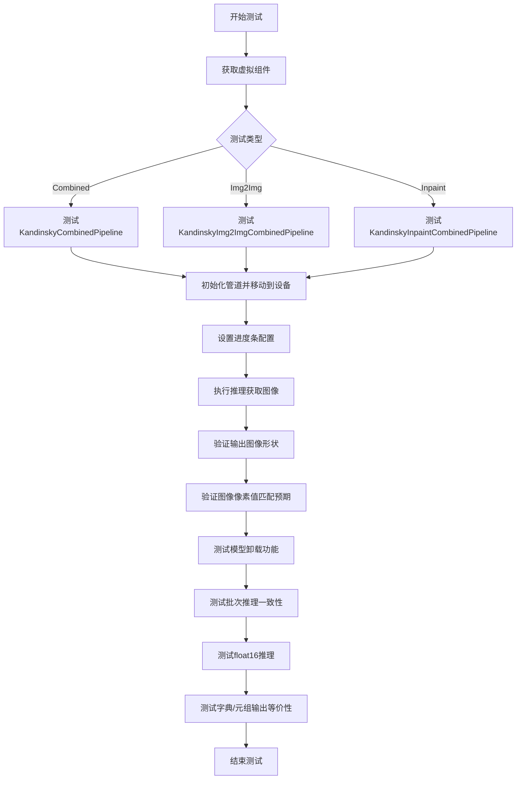

## 类结构

```
PipelineTesterMixin (测试混合类)
└── unittest.TestCase
    ├── KandinskyPipelineCombinedFastTests
    │   └── pipeline_class: KandinskyCombinedPipeline
    ├── KandinskyPipelineImg2ImgCombinedFastTests
    │   └── pipeline_class: KandinskyImg2ImgCombinedPipeline
    └── KandinskyPipelineInpaintCombinedFastTests
        └── pipeline_class: KandinskyInpaintCombinedPipeline
```

## 全局变量及字段


### `unittest`
    
Python 单元测试框架，提供测试用例和测试套件功能

类型：`module`
    


### `np`
    
NumPy 库别名，用于数值计算和数组操作

类型：`module`
    


### `pytest`
    
Python 测试框架，用于编写和运行测试

类型：`module`
    


### `enable_full_determinism`
    
启用完全确定性模式，确保测试结果可复现

类型：`function`
    


### `require_torch_accelerator`
    
装饰器，标记测试需要 Torch 加速器才能运行

类型：`decorator`
    


### `torch_device`
    
Torch 设备字符串，表示计算设备（如 'cuda' 或 'cpu'）

类型：`str`
    


### `is_transformers_version`
    
检查 Transformers 库版本号的函数

类型：`function`
    


### `KandinskyCombinedPipeline`
    
Kandinsky 组合管道，用于文本到图像生成

类型：`class`
    


### `KandinskyImg2ImgCombinedPipeline`
    
Kandinsky 图像到图像组合管道，用于图像转换

类型：`class`
    


### `KandinskyInpaintCombinedPipeline`
    
Kandinsky 修复组合管道，用于图像修复和编辑

类型：`class`
    


### `PipelineTesterMixin`
    
管道测试混合类，提供通用的管道测试方法

类型：`class`
    


### `Dummies`
    
虚拟组件类，用于生成测试用的虚拟模型组件

类型：`class`
    


### `Img2ImgDummies`
    
图像到图像虚拟组件类，继承自 Dummies

类型：`class`
    


### `InpaintDummies`
    
修复虚拟组件类，继承自 Dummies

类型：`class`
    


### `PriorDummies`
    
先验虚拟组件类，用于生成先验模型虚拟组件

类型：`class`
    


### `KandinskyPipelineCombinedFastTests.pipeline_class`
    
指定测试的管道类为 KandinskyCombinedPipeline

类型：`type`
    


### `KandinskyPipelineCombinedFastTests.params`
    
管道必需参数列表，包含 'prompt'

类型：`List[str]`
    


### `KandinskyPipelineCombinedFastTests.batch_params`
    
批处理参数列表，包含 'prompt' 和 'negative_prompt'

类型：`List[str]`
    


### `KandinskyPipelineCombinedFastTests.required_optional_params`
    
必需的可选参数列表，包含生成器、尺寸、潜在向量、引导_scale 等

类型：`List[str]`
    


### `KandinskyPipelineCombinedFastTests.test_xformers_attention`
    
标志位，指示是否测试 xformers 注意力机制

类型：`bool`
    


### `KandinskyPipelineCombinedFastTests.supports_dduf`
    
标志位，指示管道是否支持 DDUF（Decoder Denosing Unified Framework）

类型：`bool`
    


### `KandinskyPipelineImg2ImgCombinedFastTests.pipeline_class`
    
指定测试的管道类为 KandinskyImg2ImgCombinedPipeline

类型：`type`
    


### `KandinskyPipelineImg2ImgCombinedFastTests.params`
    
管道必需参数列表，包含 'prompt' 和 'image'

类型：`List[str]`
    


### `KandinskyPipelineImg2ImgCombinedFastTests.batch_params`
    
批处理参数列表，包含 'prompt'、'negative_prompt' 和 'image'

类型：`List[str]`
    


### `KandinskyPipelineImg2ImgCombinedFastTests.required_optional_params`
    
必需的可选参数列表，包含生成器、尺寸、潜在向量、引导_scale 等

类型：`List[str]`
    


### `KandinskyPipelineImg2ImgCombinedFastTests.test_xformers_attention`
    
标志位，指示是否测试 xformers 注意力机制

类型：`bool`
    


### `KandinskyPipelineImg2ImgCombinedFastTests.supports_dduf`
    
标志位，指示管道是否支持 DDUF

类型：`bool`
    


### `KandinskyPipelineInpaintCombinedFastTests.pipeline_class`
    
指定测试的管道类为 KandinskyInpaintCombinedPipeline

类型：`type`
    


### `KandinskyPipelineInpaintCombinedFastTests.params`
    
管道必需参数列表，包含 'prompt'、'image' 和 'mask_image'

类型：`List[str]`
    


### `KandinskyPipelineInpaintCombinedFastTests.batch_params`
    
批处理参数列表，包含 'prompt'、'negative_prompt'、'image' 和 'mask_image'

类型：`List[str]`
    


### `KandinskyPipelineInpaintCombinedFastTests.required_optional_params`
    
必需的可选参数列表，包含生成器、尺寸、潜在向量、引导_scale 等

类型：`List[str]`
    


### `KandinskyPipelineInpaintCombinedFastTests.test_xformers_attention`
    
标志位，指示是否测试 xformers 注意力机制

类型：`bool`
    


### `KandinskyPipelineInpaintCombinedFastTests.supports_dduf`
    
标志位，指示管道是否支持 DDUF

类型：`bool`
    
    

## 全局函数及方法


### `enable_full_determinism`

该函数用于启用测试的完全确定性，通过设置全局随机种子和环境变量，确保测试结果在不同运行之间保持一致，提升测试的可重复性和可靠性。

参数：

- 该函数无显式参数（从 `testing_utils` 模块导入）

返回值：`None`，无返回值

#### 流程图

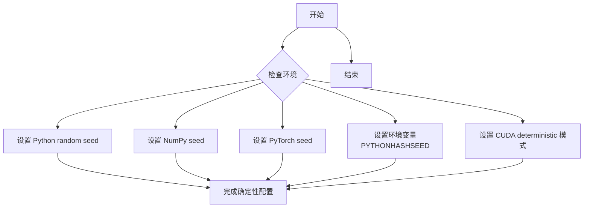

#### 带注释源码

```python
# 从 testing_utils 模块导入的函数
# 此函数在测试文件开头被调用，确保所有后续测试的随机性可控
from ...testing_utils import enable_full_determinism, require_torch_accelerator, torch_device

# 调用该函数以启用完全确定性模式
# 这将设置各种随机种子，确保测试结果可重复
enable_full_determinism()
```

> **注意**：由于 `enable_full_determinism` 是从外部模块 `testing_utils` 导入的，其具体实现源码不在当前代码文件中。上述源码展示了该函数在测试文件中的导入和使用方式。该函数通常会设置 Python 内置 `random` 模块、NumPy、PyTorch 的随机种子，以及 CUDA 的 `deterministic` 标志，以确保深度学习测试的完全可重复性。


### `require_torch_accelerator`

这是一个装饰器函数，用于标记测试方法需要Torch加速器（GPU/CUDA）才能运行。如果当前环境没有可用的Torch加速器，被装饰的测试方法将被跳过。

参数：

- 无显式参数（作为装饰器使用）

返回值：无（修改被装饰函数的执行行为）

#### 流程图

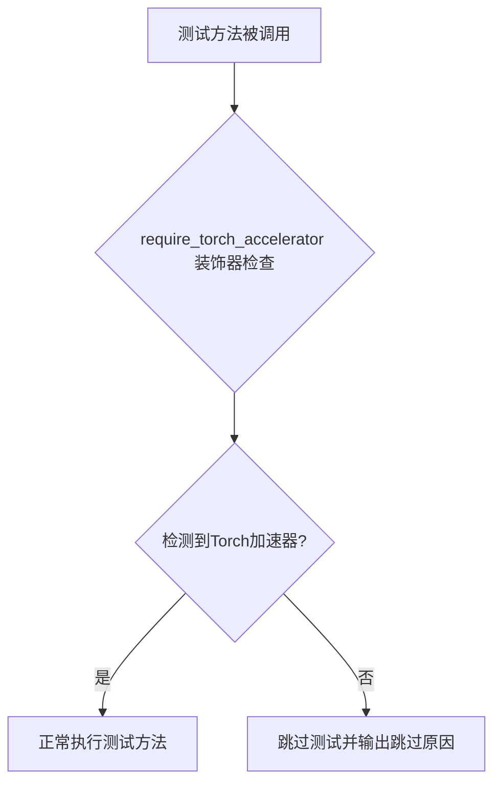

#### 带注释源码

```python
# 该函数的实际定义不在当前文件中
# 它是从 testing_utils 模块导入的装饰器
from ...testing_utils import enable_full_determinism, require_torch_accelerator, torch_device

# 使用示例（来自当前代码文件）:
@require_torch_accelerator  # 装饰器：标记该测试需要GPU加速器
def test_offloads(self):
    """
    测试模型的CPU offload功能
    包含三种模式：直接运行、enable_model_cpu_offload、enable_sequential_cpu_offload
    """
    pipes = []
    components = self.get_dummy_components()
    sd_pipe = self.pipeline_class(**components).to(torch_device)
    pipes.append(sd_pipe)
    # ... 后续测试代码
```

#### 补充说明

| 属性 | 描述 |
|------|------|
| **来源** | `diffusers.testing_utils` 模块 |
| **用途** | 条件跳过仅在有Torch加速器时才能运行的测试 |
| **使用场景** | 需要GPU进行测试的方法，如GPU内存管理、CPU offload功能测试等 |
| **依赖** | 需要 `torch` 和可用的CUDA设备 |


### `is_transformers_version`

该函数用于检查当前环境中安装的 transformers 库版本是否满足指定的条件（大于等于、小于等于、等于等），常用于根据不同版本执行不同的测试逻辑。

参数：

- `operator`：字符串类型，版本比较操作符，支持 ">="、"<="、"=="、">"、 "<" 等
- `version`：字符串类型，要比较的 transformers 版本号，格式如 "4.56.2"

返回值：布尔值，如果当前 transformers 版本满足指定条件返回 True，否则返回 False

#### 流程图

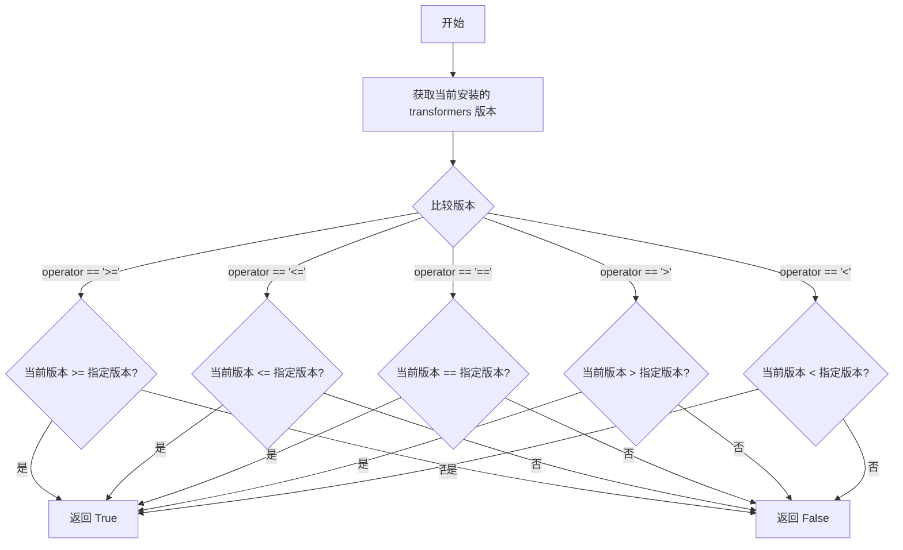

#### 带注释源码

```
# 注意：由于该函数定义在 diffusers.utils 模块中，以下为基于使用方式的推测实现

def is_transformers_version(operator: str, version: str) -> bool:
    """
    检查当前 transformers 版本是否满足指定条件。
    
    参数:
        operator: 版本比较操作符，如 '>=', '<=', '==', '>', '<'
        version: 要比较的版本号字符串，如 '4.56.2'
    
    返回:
        bool: 如果版本满足条件返回 True，否则返回 False
    """
    try:
        # 动态导入 transformers 模块获取版本
        import transformers
        current_version = transformers.__version__
        
        # 解析版本号字符串为元组便于比较
        # 例如 "4.56.2" -> (4, 56, 2)
        current = tuple(map(int, current_version.split('.')[:3]))
        target = tuple(map(int, version.split('.')[:3]))
        
        # 根据操作符进行版本比较
        if operator == '>=':
            return current >= target
        elif operator == '<=':
            return current <= target
        elif operator == '==':
            return current == target
        elif operator == '>':
            return current > target
        elif operator == '<':
            return current < target
        else:
            raise ValueError(f"Unsupported operator: {operator}")
            
    except ImportError:
        # 如果 transformers 未安装，返回 False
        return False
    except Exception:
        # 其他异常情况返回 False
        return False
```

#### 使用示例

```python
# 在测试代码中的实际使用方式
@pytest.mark.xfail(
    condition=is_transformers_version(">=", "4.56.2"),
    reason="Latest transformers changes the slices",
    strict=False,
)
def test_kandinsky(self):
    # 测试逻辑...
```


### `Dummies.get_dummy_components`

该方法用于生成虚拟（dummy）组件字典，提供测试所需的模型、调度器和其他Pipeline组件的虚拟实例。这些虚拟组件用于实例化Kandinsky系列Pipeline进行单元测试。

参数：

- 该方法无显式参数（隐式接收`self`）

返回值：`Dict[str, Any]`，返回包含所有虚拟组件的字典，键为组件名称（如模型、调度器等），值为对应的虚拟实例对象。该字典可直接用于解包实例化Pipeline类。

#### 流程图

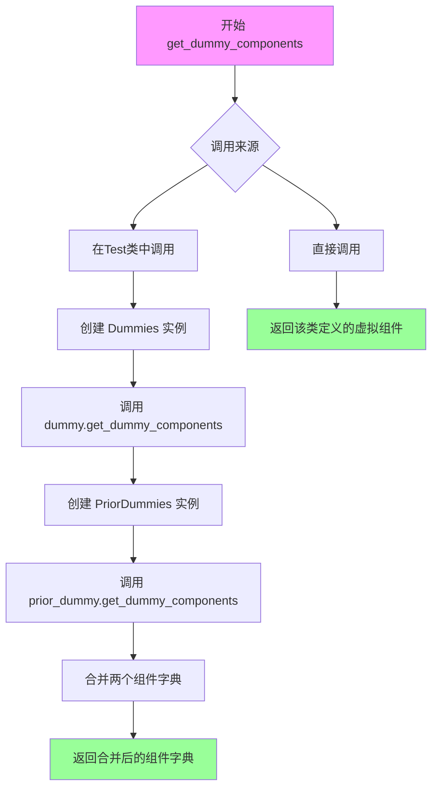

#### 带注释源码

```python
# 该方法定义在 test_kandinsky.py 的 Dummies 类中
# 以下为在测试类中的典型调用方式

def get_dummy_components(self):
    """
    获取用于测试的虚拟组件字典。
    
    该方法整合了主模型和Prior模型的虚拟组件，
    以便完整实例化KandinskyCombinedPipeline。
    """
    # 1. 创建主模型的 Dummies 实例
    dummy = Dummies()
    
    # 2. 创建 Prior 模型的 Dummies 实例
    prior_dummy = PriorDummies()
    
    # 3. 获取主模型的虚拟组件字典
    # 返回格式: {"unet": <MockUnet>, "scheduler": <MockScheduler>, ...}
    components = dummy.get_dummy_components()
    
    # 4. 获取 Prior 模型的虚拟组件并添加前缀 "prior_"
    # 例如: {"prior_unet": <MockPriorUNet>, ...}
    prior_components = {f"prior_{k}": v for k, v in prior_dummy.get_dummy_components().items()}
    
    # 5. 合并两个字典并返回
    components.update(prior_components)
    return components


# Dummies 类本身的 get_dummy_components 方法定义（推断）
def get_dummy_components(self):
    """
    返回包含以下类别虚拟组件的字典：
    - unet: UNet2DConditionModel 的 Mock/虚拟实例
    - scheduler: DDPMScheduler 或类似调度器
    - text_encoder: 文本编码器虚拟实例
    - tokenizer: 分词器虚拟实例
    - feature_extractor: 特征提取器虚拟实例
    
    Returns:
        Dict[str, Any]: 组件名称到虚拟实例的映射字典
    """
    # ... 具体的虚拟组件创建逻辑
```


由于 `Dummies` 类的定义在导入的模块中（`.test_kandinsky`、`.test_kandinsky_prior` 等），当前代码文件中没有直接定义。我将基于代码中实际使用的 `get_dummy_inputs` 方法模式，为您提供 `KandinskyPipelineCombinedFastTests.get_dummy_inputs` 的详细分析（该方法内部调用了 `PriorDummies.get_dummy_inputs`）。

### `KandinskyPipelineCombinedFastTests.get_dummy_inputs`

该方法用于生成Kandinsky CombinedPipeline的虚拟测试输入参数，封装了先验模型（Prior）的输入并添加了图像生成的尺寸参数。

参数：

- `device`：`str`，目标设备（如 "cpu" 或 "cuda"）
- `seed`：`int`，随机种子，默认值为 0，用于生成可复现的随机输入

返回值：`dict`，包含生成图像所需的完整输入参数字典，包括先验模型输入和图像尺寸（height=64, width=64）

#### 流程图

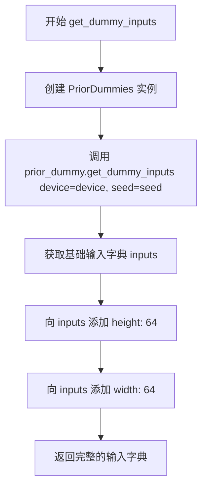

#### 带注释源码

```python
def get_dummy_inputs(self, device, seed=0):
    """
    生成用于测试Kandinsky CombinedPipeline的虚拟输入参数
    
    参数:
        device: 目标设备字符串
        seed: 随机种子,默认0
    
    返回:
        包含prompt和图像尺寸的字典
    """
    # 步骤1: 创建PriorDummies实例用于生成先验模型输入
    prior_dummy = PriorDummies()
    
    # 步骤2: 获取先验模型的虚拟输入(包含prompt等基础参数)
    inputs = prior_dummy.get_dummy_inputs(device=device, seed=seed)
    
    # 步骤3: 添加图像生成的高宽参数
    inputs.update(
        {
            "height": 64,   # 生成图像的高度
            "width": 64,    # 生成图像的宽度
        }
    )
    
    # 步骤4: 返回完整的输入字典
    return inputs
```


# PriorDummies.get_dummy_components 设计文档

### `PriorDummies.get_dummy_components`

该方法用于生成 Kandinsky Pipeline 测试所需的虚拟（dummy）prior 模型组件返回一个包含所有prior相关组件（如prior文本编码器、prior降噪器、调度器等）的字典，键名统一添加"prior_"前缀以区分主模型组件。

参数：
- 无（仅Self参数）

返回值：`Dict[str, Any]`，返回包含prior模型各类组件的字典，键名为字符串，值为虚拟模型对象或配置对象。

#### 流程图

```mermaid
flowchart TD
    A[开始 get_dummy_components] --> B[创建PriorDummies实例: prior_dummy = PriorDummies]
    C[调用父类/自身get_dummy_components方法<br/>components = prior_dummy.get_dummy_components]
    B --> C
    C --> D{遍历components.items}
    D -->|每个键值对| E[构建新键: f'prior_{k}']
    E --> F[更新components字典]
    F --> D
    D --> G[返回components字典]
    G --> H[结束]
```

#### 带注释源码

```python
# 从test_kandinsky_prior模块导入Dummies类并重命名为PriorDummies
# 用于生成Kandinsky Pipeline测试所需的虚拟prior组件
from .test_kandinsky_prior import Dummies as PriorDummies

class KandinskyPipelineCombinedFastTests(PipelineTesterMixin, unittest.TestCase):
    # ... 其他代码 ...
    
    def get_dummy_components(self):
        """
        获取虚拟组件的完整字典
        
        合并了主模型dummy和prior模型dummy的组件，
        prior组件键名添加'prior_'前缀以区分
        """
        # 1. 创建主模型Dummies实例
        dummy = Dummies()
        
        # 2. 创建PriorDummies实例用于生成prior相关组件
        prior_dummy = PriorDummies()
        
        # 3. 获取主模型虚拟组件字典
        components = dummy.get_dummy_components()
        
        # 4. 将prior组件添加到字典，键名添加'prior_'前缀
        # 例如: prior_text_encoder, prior_unet, prior_scheduler 等
        components.update({f"prior_{k}": v for k, v in prior_dummy.get_dummy_components().items()})
        
        # 5. 返回合并后的完整组件字典
        return components
```

---

### 注意事项

**源码缺失说明**：当前代码文件中仅显示了 `PriorDummies` 的导入语句（`from .test_kandinsky_prior import Dummies as PriorDummies`），实际的 `PriorDummies` 类定义位于 `test_kandinsky_prior.py` 文件中，该文件内容未在当前代码块中提供。

上述文档内容是基于 `KandinskyPipelineCombinedFastTests.get_dummy_components` 方法中对 `PriorDummies.get_dummy_components` 的调用方式推断得出的。该方法在测试类中被调用以获取包含以下类型组件的字典：

- prior文本编码器（prior_text_encoder）
- prior UNet模型（prior_unet）  
- prior调度器（prior_scheduler）
- 其他prior相关的配置对象


无法从提供的代码中提取 `PriorDummies.get_dummy_inputs` 的详细信息，因为该方法定义在导入的模块 `test_kandinsky_prior` 中，当前代码文件中仅包含其使用示例。基于代码中的调用方式，可推断以下内容：

### `PriorDummies.get_dummy_inputs`

描述：用于获取虚拟输入参数的函数，通常用于测试，确保pipeline接收正确的输入格式。

参数：
- `device`：字符串或设备对象，表示执行设备（如 "cpu" 或 "cuda"）
- `seed`：整数，可选，默认值 0，用于随机数生成

返回值：字典，包含虚拟输入参数（如 `prompt`、`negative_prompt` 等）

#### 流程图

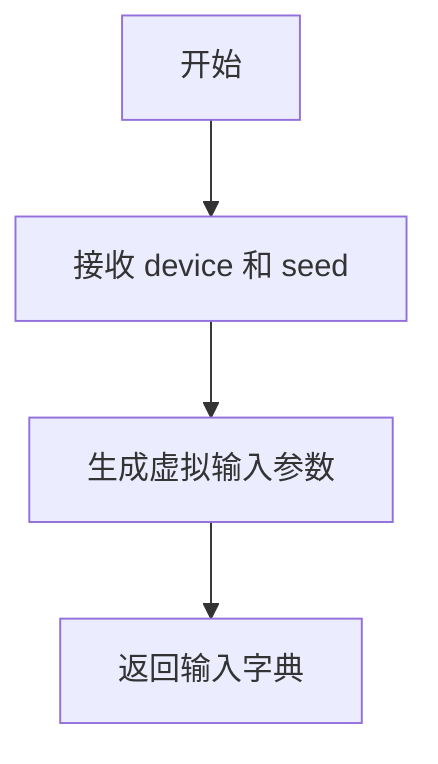

#### 带注释源码

由于该方法定义未在当前文件中提供，无法提取源码。以下为基于调用的推断：

```python
# 假设的实现（基于测试中的使用）
def get_dummy_inputs(self, device, seed=0):
    # 生成虚拟prompt和其他参数
    inputs = {
        "prompt": "test prompt",
        # 可能包含其他参数如 negative_prompt, num_inference_steps 等
    }
    return inputs
```

**注意**：如需完整源码，请参考 `diffusers` 库中的 `test_kandinsky_prior.py` 文件。


### `KandinskyPipelineImg2ImgCombinedFastTests.get_dummy_components`

该方法用于获取 Kandinsky Img2Img 组合管道测试所需的虚拟组件。它创建一个 `Img2ImgDummies` 实例和一个 `PriorDummies` 实例，调用各自的 `get_dummy_components` 方法获取组件字典，并将先验组件的键名添加 `prior_` 前缀后合并返回，为测试提供完整的管道组件配置。

参数：

- `self`：隐式参数，类型为 `KandinskyPipelineImg2ImgCombinedFastTests` 实例，代表测试类本身

返回值：`dict`，返回包含所有管道组件的字典，键包括原始组件和带有 `prior_` 前缀的先验组件。

#### 流程图

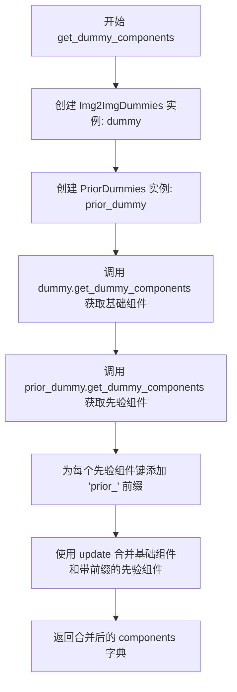

#### 带注释源码

```python
def get_dummy_components(self):
    """
    获取用于测试 KandinskyImg2ImgCombinedPipeline 的虚拟组件。
    
    该方法组合了Img2Img和Prior两种虚拟组件，为管道提供完整的测试配置。
    """
    # 创建Img2Img虚拟组件对象
    dummy = Img2ImgDummies()
    
    # 创建Prior虚拟组件对象
    prior_dummy = PriorDummies()
    
    # 获取Img2Img管道的基础组件（包含主模型各部件）
    components = dummy.get_dummy_components()
    
    # 将Prior组件添加到字典中，键名加上"prior_"前缀以区分
    # prior_dummy.get_dummy_components() 返回先验管道所需的组件字典
    # 通过字典推导式为每个键添加 "prior_" 前缀
    components.update({f"prior_{k}": v for k, v in prior_dummy.get_dummy_components().items()})
    
    # 返回合并后的完整组件字典
    return components
```

---

**注意**：用户请求的 `Img2ImgDummies.get_dummy_components` 方法源代码未在给定的代码文件中直接提供（`Img2ImgDummies` 是从 `test_kandinsky_img2img` 模块导入的别名）。上述文档描述的是使用 `Img2ImgDummies` 的调用方方法 `KandinskyPipelineImg2ImgCombinedFastTests.get_dummy_components`，该方法间接调用了 `Img2ImgDummies.get_dummy_components`。根据代码一致性推断，`Img2ImgDummies.get_dummy_components` 应返回包含 Img2Img 管道所需组件（如 UNet、VQModel、Scheduler 等）的字典。


# 提取结果

### `Img2ImgDummies.get_dummy_inputs`

该方法用于获取图像到图像（Img2Img）任务的虚拟输入数据。它通过组合先验模型（PriorDummies）和图像转换模型（Img2ImgDummies）的虚拟输入，生成完整的测试输入参数，并移除图像嵌入相关的参数以适应组合管道的需求。

参数：

- `device`：`str`，目标设备（如 "cpu" 或 "cuda"）
- `seed`：`int`，随机种子，默认值为 0，用于生成可复现的虚拟输入

返回值：`dict`，包含用于运行 Kandinsky Img2Img 组合管道的虚拟输入参数字典

#### 流程图

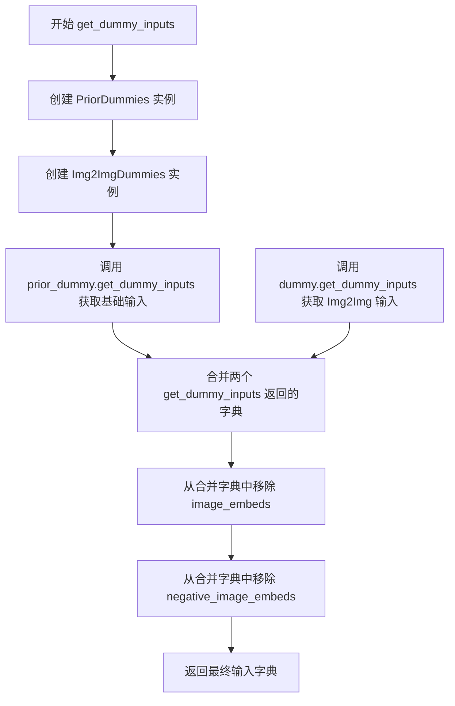

#### 带注释源码

```python
def get_dummy_inputs(self, device, seed=0):
    # 创建一个 PriorDummies 实例，用于获取先验模型的虚拟输入
    prior_dummy = PriorDummies()
    
    # 创建一个 Img2ImgDummies 实例，用于获取图像转换模型的虚拟输入
    dummy = Img2ImgDummies()
    
    # 调用先验模型的 get_dummy_inputs 方法，获取基础输入参数
    # 包含如 prompt, negative_prompt, generator 等通用参数
    inputs = prior_dummy.get_dummy_inputs(device=device, seed=seed)
    
    # 调用图像转换模型的 get_dummy_inputs 方法，获取特定于 Img2Img 的输入
    # 包含如 image, image_embeds, negative_image_embeds 等参数
    inputs.update(dummy.get_dummy_inputs(device=device, seed=seed))
    
    # 移除 image_embeds，因为这些嵌入会在组合管道内部由先验模型生成
    inputs.pop("image_embeds")
    
    # 移除 negative_image_embeds，原因同上
    inputs.pop("negative_image_embeds")
    
    # 返回合并后的输入字典，供 KandinskyImg2ImgCombinedPipeline 使用
    return inputs
```

---

### 说明

**注意**：从给定代码中可以看到，`Img2ImgDummies` 是通过以下导入语句从 `test_kandinsky_img2img` 模块引入的：

```python
from .test_kandinsky_img2img import Dummies as Img2ImgDummies
```

由于 `Img2ImgDummies` 类的实际定义位于 `test_kandinsky_img2img` 模块中（该模块未在当前代码片段中提供），因此上述提取的 `get_dummy_inputs` 方法信息是基于**当前代码中对 `Img2ImgDummies.get_dummy_inputs`** 的**调用方式**推断得出的。

如果需要获取 `Img2ImgDummies` 类的完整定义（包括其自身的 `get_dummy_inputs` 方法源码），需要查看 `test_kandinsky_img2img.py` 文件的内容。


### `InpaintDummies.get_dummy_components`

此方法是 `InpaintDummies` 类的成员方法，用于生成用于测试 Kandinsky 图像修复管道的虚拟（dummy）组件字典。该方法返回一个包含所有必要模型组件的字典，以便在测试中实例化管道。

参数：

- `self`：`InpaintDummies` 实例本身，无需显式传递

返回值：`Dict[str, Any]`，返回包含图像修复管道所需的所有虚拟组件的字典，例如 UNet、VAE、调度器等。每个组件都是一个虚拟对象，用于测试目的。

#### 流程图

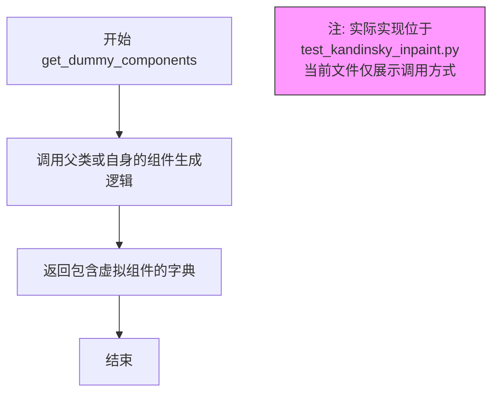

#### 带注释源码

```python
# 注意：以下代码展示了该方法在测试中的调用方式，
# 实际实现位于 test_kandinsky_inpaint.py 模块中的 InpaintDummies 类

def get_dummy_components(self):
    """
    生成用于 Kandinsky 图像修复组合管道的虚拟组件。
    
    Returns:
        dict: 包含所有管道组件的字典
    """
    # 创建 InpaintDummies 实例
    dummy = InpaintDummies()
    
    # 创建 PriorDummies 实例（用于先验模型）
    prior_dummy = PriorDummies()
    
    # 获取 InpaintDummies 的虚拟组件
    components = dummy.get_dummy_components()
    
    # 将先验模型的组件添加到字典中，键名添加 "prior_" 前缀
    # 例如: "prior_unet", "prior_text_encoder" 等
    components.update({f"prior_{k}": v for k, v in prior_dummy.get_dummy_components().items()})
    
    # 返回合并后的组件字典
    return components
```

#### 补充说明

由于 `InpaintDummies` 类的实际定义（在 `test_kandinsky_inpaint.py` 文件中）未在当前代码片段中提供，上述分析基于：

1. **导入语句**：`from .test_kandinsky_inpaint import Dummies as InpaintDummies`
2. **使用方式**：在 `KandinskyPipelineInpaintCombinedFastTests.get_dummy_components` 方法中调用 `dummy.get_dummy_components()`

完整的 `InpaintDummies` 类定义需要查看 `test_kandinsky_inpaint.py` 文件。该类通常会继承自基础测试类并实现 `get_dummy_components` 方法，返回用于实例化 `KandinskyInpaintCombinedPipeline` 所需的所有组件。


### `InpaintDummies.get_dummy_inputs`

该方法是 InpaintDummies 类的一部分，用于生成修复（inpainting）任务的虚拟输入参数。它从 PriorDummies 和 InpaintDummies 自身获取基础输入，合并后移除图像嵌入相关字段，返回适合传递给 KandinskyInpaintCombinedPipeline 的参数字典。

参数：

- `self`：隐式参数，InpaintDummies 实例本身
- `device`：`str`，目标设备（如 "cpu" 或 "cuda"）
- `seed`：`int`，随机种子，默认为 0，用于生成可重现的随机数据

返回值：`dict`，包含修复任务所需参数的字典，包括 prompt（提示词）、image（图像）、mask_image（掩码图像）、height（高度）、width（宽度）等字段。

#### 流程图

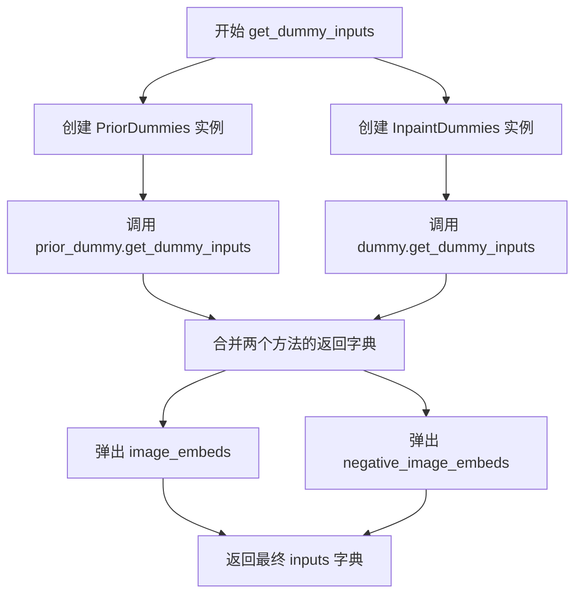

#### 带注释源码

```python
def get_dummy_inputs(self, device, seed=0):
    """
    生成修复任务的虚拟输入参数
    
    参数:
        device: str - 目标设备
        seed: int - 随机种子
    
    返回:
        dict - 包含修复管道所需参数的字典
    """
    # 创建 PriorDummies 实例用于生成先验模型输入
    prior_dummy = PriorDummies()
    # 创建 InpaintDummies 实例用于生成修复模型输入
    dummy = InpaintDummies()
    
    # 获取先验模型的虚拟输入（包含 prompt, negative_prompt 等）
    inputs = prior_dummy.get_dummy_inputs(device=device, seed=seed)
    
    # 获取修复模型的虚拟输入并合并到 inputs 字典
    inputs.update(dummy.get_dummy_inputs(device=device, seed=seed))
    
    # 移除 image_embeds 和 negative_image_embeds
    # 因为这些嵌入已在先验管道中计算并包含在 inputs 中
    inputs.pop("image_embeds")
    inputs.pop("negative_image_embeds")
    
    return inputs
```


### `KandinskyPipelineCombinedFastTests.get_dummy_components`

该方法用于生成测试所需的虚拟组件配置，通过组合主模型和先验模型的虚拟组件来构建完整的管道组件字典。

参数：无（仅包含 `self` 参数，隐式引用类实例）

返回值：`dict`，返回包含主模型和先验模型所有虚拟组件的字典，用于实例化 `KandinskyCombinedPipeline`

#### 流程图

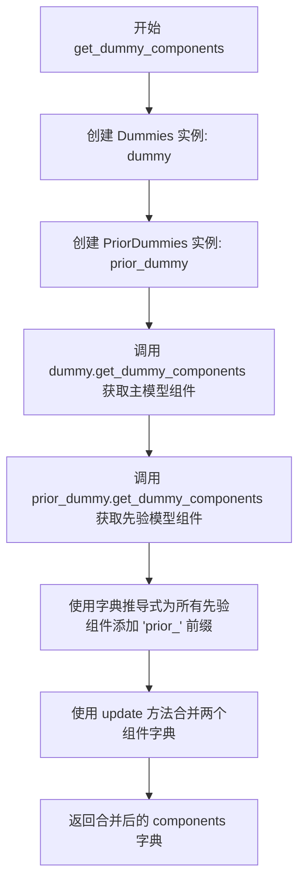

#### 带注释源码

```python
def get_dummy_components(self):
    """
    生成用于测试的虚拟组件配置字典
    
    该方法整合了主模型和先验模型的虚拟组件，
    返回的字典可直接用于实例化 KandinskyCombinedPipeline
    """
    # 创建主模型的虚拟组件生成器
    dummy = Dummies()
    
    # 创建先验模型的虚拟组件生成器
    prior_dummy = PriorDummies()
    
    # 获取主模型的所有虚拟组件
    components = dummy.get_dummy_components()
    
    # 获取先验模型的所有虚拟组件，并添加 'prior_' 前缀后合并
    # 例如: 'unet' -> 'prior_unet', 'text_encoder' -> 'prior_text_encoder'
    components.update({f"prior_{k}": v for k, v in prior_dummy.get_dummy_components().items()})
    
    # 返回包含所有组件的合并字典
    return components
```


### `KandinskyPipelineCombinedFastTests.get_dummy_inputs`

该方法用于生成 KandinskyCombinedPipeline 管道测试所需的虚拟输入参数，通过调用 PriorDummies 获取先验模型所需的输入，并额外添加图像生成的高度和宽度参数。

参数：

- `self`：`KandinskyPipelineCombinedFastTests`，类实例本身
- `device`：`str`，目标执行设备（如 "cpu" 或 "cuda"）
- `seed`：`int`，随机种子，用于生成可复现的虚拟输入（默认值：0）

返回值：`dict`，包含测试所需的虚拟输入参数字典，包括先验模型的输入以及 `height` 和 `width` 参数

#### 流程图

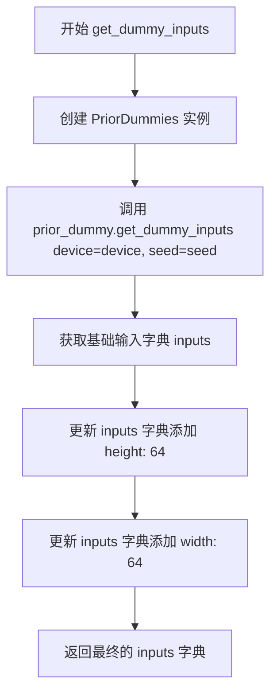

#### 带注释源码

```python
def get_dummy_inputs(self, device, seed=0):
    """
    生成用于测试 KandinskyCombinedPipeline 的虚拟输入参数
    
    参数:
        device: str - 目标设备（如 "cpu" 或 "cuda"）
        seed: int - 随机种子，用于生成可复现的输入（默认值为 0）
    
    返回:
        dict: 包含测试所需的虚拟输入参数字典
    """
    # 创建 PriorDummies 实例，用于生成先验模型的虚拟输入
    prior_dummy = PriorDummies()
    
    # 调用 PriorDummies 的 get_dummy_inputs 方法获取基础输入
    # 该方法返回包含 prompt、negative_prompt、generator 等参数的字典
    inputs = prior_dummy.get_dummy_inputs(device=device, seed=seed)
    
    # 更新输入字典，添加图像生成的高度和宽度参数
    # 这里设置为 64x64，用于测试环境的小尺寸图像生成
    inputs.update(
        {
            "height": 64,
            "width": 64,
        }
    )
    
    # 返回完整的虚拟输入字典，供管道测试使用
    return inputs
```


### `KandinskyPipelineCombinedFastTests.test_kandinsky`

该测试方法用于验证 KandinskyCombinedPipeline（Kandinsky 文本到图像生成组合管道）的核心功能，包括图像生成的基本正确性、输出形状验证以及与元组返回方式的等效性检查。

参数：

- `self`：隐式参数，表示测试类实例本身

返回值：`None`，该方法为单元测试方法，无显式返回值，通过断言验证管道输出

#### 流程图

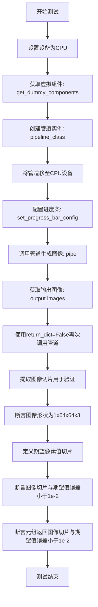

#### 带注释源码

```python
@pytest.mark.xfail(
    condition=is_transformers_version(">=", "4.56.2"),
    reason="Latest transformers changes the slices",
    strict=False,
)
def test_kandinsky(self):
    """测试 KandinskyCombinedPipeline 的核心生成功能"""
    device = "cpu"  # 设置测试设备为CPU

    # 获取虚拟组件（用于测试的模拟组件）
    components = self.get_dummy_components()

    # 使用虚拟组件实例化管道
    pipe = self.pipeline_class(**components)
    pipe = pipe.to(device)  # 将管道移至指定设备

    # 配置进度条（禁用）
    pipe.set_progress_bar_config(disable=None)

    # 调用管道进行推理，获取虚拟输入
    output = pipe(**self.get_dummy_inputs(device))
    image = output.images  # 提取生成的图像

    # 使用return_dict=False再次调用，测试元组返回方式
    image_from_tuple = pipe(
        **self.get_dummy_inputs(device),
        return_dict=False,
    )[0]

    # 提取图像右下角3x3像素块用于验证
    image_slice = image[0, -3:, -3:, -1]
    image_from_tuple_slice = image_from_tuple[0, -3:, -3:, -1]

    # 断言：验证输出图像形状正确 (batch=1, height=64, width=64, channels=3)
    assert image.shape == (1, 64, 64, 3)

    # 定义期望的像素值切片（用于回归测试）
    expected_slice = np.array([0.2893, 0.1464, 0.4603, 0.3529, 0.4612, 0.7701, 0.4027, 0.3051, 0.5155])

    # 断言：验证字典返回方式的图像切片与期望值匹配
    assert np.abs(image_slice.flatten() - expected_slice).max() < 1e-2, (
        f" expected_slice {expected_slice}, but got {image_slice.flatten()}"
    )
    # 断言：验证元组返回方式的图像切片与期望值匹配
    assert np.abs(image_from_tuple_slice.flatten() - expected_slice).max() < 1e-2, (
        f" expected_slice {expected_slice}, but got {image_from_tuple_slice.flatten()}"
    )
```


### `KandinskyPipelineCombinedFastTests.test_offloads`

该测试方法用于验证 KandinskyCombinedPipeline 在三种不同的 CPU offload 策略下的输出一致性：直接加载、模型级 CPU offload 和顺序 CPU offload。通过比较三种策略生成的图像像素差异，确保 offload 机制不会影响推理结果的正确性。

参数：

- `self`：隐式参数，测试类实例本身

返回值：`None`，该方法为测试方法，通过断言验证结果，不返回任何值

#### 流程图

```mermaid
flowchart TD
    A[开始 test_offloads] --> B[创建空列表 pipes]
    B --> C[创建第一组组件并创建pipeline<br/>直接调用 .to(torch_device)]
    C --> D[将pipeline添加到pipes列表]
    D --> E[创建第二组组件并创建pipeline<br/>调用 enable_model_cpu_offload]
    E --> F[将pipeline添加到pipes列表]
    F --> G[创建第三组组件并创建pipeline<br/>调用 enable_sequential_cpu_offload]
    G --> H[将pipeline添加到pipes列表]
    H --> I[创建空列表 image_slices]
    I --> J[遍历pipes列表]
    J --> K[获取dummy inputs]
    K --> L[调用pipe执行推理<br/>获取生成的图像]
    L --> M[提取图像切片<br/>image[0, -3:, -3:, -1].flatten()]
    M --> N[将切片添加到image_slices]
    N --> O{是否遍历完所有pipes?}
    O -->|否| J
    O -->|是| P[断言: image_slices[0] 与 image_slices[1] 差异 < 1e-3]
    P --> Q[断言: image_slices[0] 与 image_slices[2] 差异 < 1e-3]
    Q --> R[结束测试]
```

#### 带注释源码

```python
@require_torch_accelerator  # 装饰器：仅在有torch加速器时运行
def test_offloads(self):
    """
    测试三种CPU offload策略的输出一致性：
    1. 标准加载（直接to(device)）
    2. 模型级CPU offload
    3. 顺序CPU offload
    """
    pipes = []  # 存储三个不同配置的pipeline
    
    # === 策略1: 标准加载（无offload）===
    components = self.get_dummy_components()  # 获取虚拟组件
    sd_pipe = self.pipeline_class(**components).to(torch_device)  # 创建pipeline并移至设备
    pipes.append(sd_pipe)  # 添加到列表

    # === 策略2: 模型级CPU offload ===
    components = self.get_dummy_components()  # 重新获取虚拟组件（确保独立性）
    sd_pipe = self.pipeline_class(**components)  # 创建pipeline
    sd_pipe.enable_model_cpu_offload(device=torch_device)  # 启用模型级CPU offload
    pipes.append(sd_pipe)

    # === 策略3: 顺序CPU offload ===
    components = self.get_dummy_components()
    sd_pipe = self.pipeline_class(**components)
    sd_pipe.enable_sequential_cpu_offload(device=torch_device)  # 启用顺序CPU offload
    pipes.append(sd_pipe)

    image_slices = []  # 存储每个pipeline生成的图像切片
    
    # 对每个pipeline执行推理并收集结果
    for pipe in pipes:
        inputs = self.get_dummy_inputs(torch_device)  # 获取虚拟输入
        image = pipe(**inputs).images  # 执行推理获取图像
        
        # 提取图像右下角3x3区域的像素值并展平
        image_slices.append(image[0, -3:, -3:, -1].flatten())

    # === 验证三种策略的输出一致性 ===
    # 验证标准加载与模型级offload的差异
    assert np.abs(image_slices[0] - image_slices[1]).max() < 1e-3
    # 验证标准加载与顺序offload的差异
    assert np.abs(image_slices[0] - image_slices[2]).max() < 1e-3
```


### `KandinskyPipelineCombinedFastTests.test_inference_batch_single_identical`

该测试方法用于验证 KandinskyCombinedPipeline 在批量推理（单批次）与多次单独推理时产生的结果是否一致，确保模型的推理结果具有确定性和可重复性。

参数：

- `self`：`KandinskyPipelineCombinedFastTests` 类型，测试类实例自身

返回值：`None`，该方法为测试方法，无返回值，通过断言验证结果一致性

#### 流程图

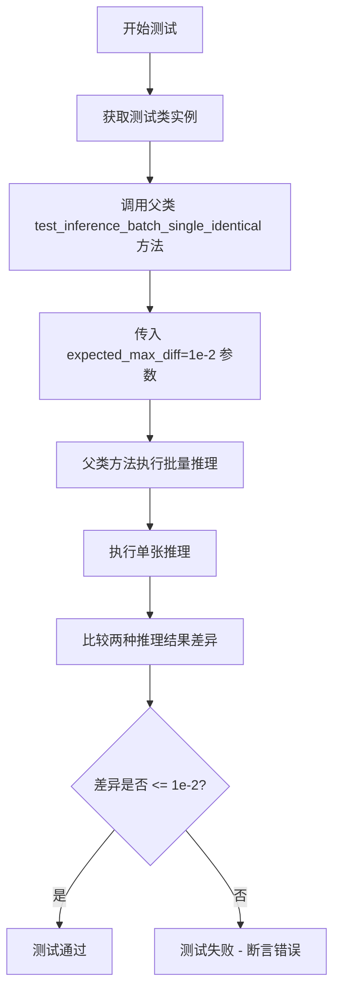

#### 带注释源码

```python
def test_inference_batch_single_identical(self):
    """
    测试方法：验证批量推理与单张推理结果的一致性
    
    该方法继承自 PipelineTesterMixin 父类，通过调用父类方法
    来执行实际的测试逻辑。传入 expected_max_diff=1e-2 参数，
    表示允许批量推理与单张推理结果之间的最大差异为 0.01。
    
    测试目的：
    - 确保模型推理的确定性
    - 验证在不同推理模式下结果的一致性
    - 检测可能的随机性因素（如浮点运算误差、CUDA非确定性等）
    
    参数:
        self: KandinskyPipelineCombinedFastTests 实例
    
    返回:
        None: 测试方法，通过断言验证，无显式返回值
    
    异常:
        AssertionError: 当批量推理与单张推理结果差异超过 expected_max_diff 时抛出
    """
    # 调用父类（PipelineTesterMixin）的同名测试方法
    # 传入期望的最大差异阈值为 0.01（即 1e-2）
    super().test_inference_batch_single_identical(expected_max_diff=1e-2)
```

#### 补充说明

**1. 类的上下文信息**

| 属性 | 值 |
|------|-----|
| 类名 | `KandinskyPipelineCombinedFastTests` |
| 父类 | `PipelineTesterMixin`, `unittest.TestCase` |
| pipeline_class | `KandinskyCombinedPipeline` |
| 所在文件 | `test_kandinsky_combined.py`（推断） |

**2. 相关全局变量和依赖**

| 名称 | 类型 | 描述 |
|------|------|------|
| `KandinskyCombinedPipeline` | 类 | Kandinsky 组合管道，用于图像生成 |
| `PipelineTesterMixin` | 混合类 | 提供管道测试通用方法 |
| `enable_full_determinism` | 函数 | 启用完全确定性以确保测试可重复性 |
| `expected_max_diff` | float | 允许的最大差异阈值（1e-2 = 0.01） |

**3. 父类方法推断行为**

根据方法调用和测试框架惯例，`PipelineTesterMixin.test_inference_batch_single_identical` 的预期行为：

1. 使用相同的输入和随机种子
2. 执行一次批量推理（batch_size > 1）
3. 循环执行多次单张推理（batch_size = 1）
4. 比较两者的输出图像
5. 断言差异小于等于 `expected_max_diff`

**4. 潜在的技术债务或优化空间**

- **测试覆盖**：该方法仅验证结果一致性，未验证结果的质量或正确性
- **参数硬编码**：`expected_max_diff=1e-2` 硬编码在方法内，缺乏灵活性
- **缺乏详细日志**：测试失败时仅抛出 AssertionError，缺乏详细的调试信息

**5. 错误处理与异常设计**

- **AssertionError**：当差异超过阈值时抛出
- **测试隔离**：通过 `enable_full_determinism()` 确保测试间隔离


### `KandinskyPipelineCombinedFastTests.test_float16_inference`

这是一个测试方法，用于验证 KandinskyCombinedPipeline 在 float16（半精度）推理模式下的正确性。通过调用父类的 test_float16_inference 方法，传入期望的最大差异阈值（expected_max_diff=2e-1），来检查 float16 推理结果与默认精度推理结果的差异是否在可接受范围内。

参数：

- `self`：隐式的 `self` 参数，表示 `KandinskyPipelineCombinedFastTests` 类的实例，无显式参数类型

返回值：无明确的返回值（方法返回类型为 `None`，实际执行由父类方法决定）

#### 流程图

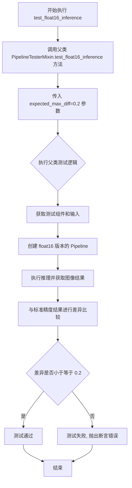

#### 带注释源码

```python
def test_float16_inference(self):
    """
    测试 KandinskyCombinedPipeline 在 float16 推理模式下的正确性
    
    该方法继承自 PipelineTesterMixin，通过比较 float16 和默认精度（float32）
    的推理结果，验证模型在半精度推理时能够产生合理的结果。
    
    注意：由于 float16 精度较低，允许较大的数值差异（expected_max_diff=0.2）
    """
    # 调用父类的 test_float16_inference 方法，expected_max_diff=2e-1 表示
    # 允许 float16 和 float32 推理结果之间的最大差异为 0.2
    super().test_float16_inference(expected_max_diff=2e-1)
```


### `KandinskyPipelineCombinedFastTests.test_dict_tuple_outputs_equivalent`

验证KandinskyCombinedPipeline管道在使用字典返回格式和元组返回格式时，生成的图像输出是否等价，确保两种返回方式的数学一致性。

参数：

- 该方法无显式参数，内部调用父类 `PipelineTesterMixin.test_dict_tuple_outputs_equivalent(expected_max_difference=5e-4)`

返回值：`None`，测试方法无返回值，通过断言验证等价性

#### 流程图

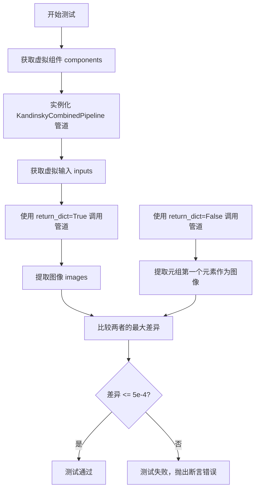

#### 带注释源码

```python
def test_dict_tuple_outputs_equivalent(self):
    """
    测试函数：验证管道字典输出与元组输出的等价性
    
    该测试确保当使用 return_dict=True 和 return_dict=False 时，
    管道生成的图像在数值上保持一致，允许微小的浮点误差。
    """
    # 调用父类 PipelineTesterMixin 的同名测试方法
    # 传入 expected_max_difference=5e-4 参数
    # 允许的最大差异阈值为 0.0005
    super().test_dict_tuple_outputs_equivalent(expected_max_difference=5e-4)
```


### `KandinskyPipelineCombinedFastTests.test_pipeline_with_accelerator_device_map`

该测试方法用于验证 KandinskyCombinedPipeline 在加速器设备映射（accelerator device map）场景下的功能，但由于当前不支持该测试场景，已被跳过。

参数：

- `self`：`unittest.TestCase`，unittest 测试用例的实例本身

返回值：`None`，方法体仅为 `pass` 语句，不返回任何值

#### 流程图

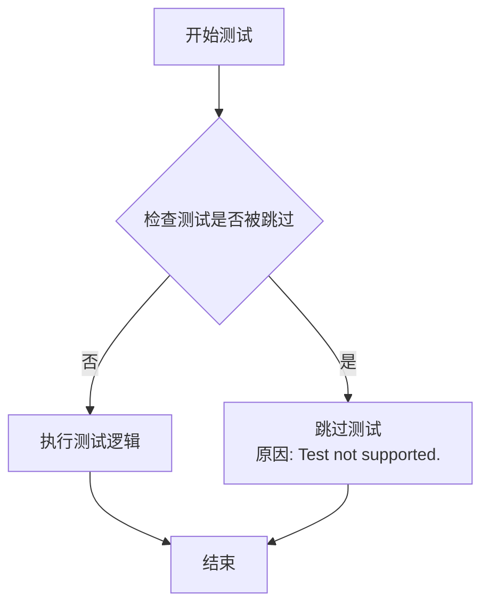

#### 带注释源码

```python
@unittest.skip("Test not supported.")
def test_pipeline_with_accelerator_device_map(self):
    """
    测试 KandinskyCombinedPipeline 在 accelerator device map 场景下的功能。
    
    该测试方法被 @unittest.skip 装饰器跳过，原因是测试场景暂不支持。
    目前该方法仅包含 pass 语句，不执行任何实际测试逻辑。
    
    参数:
        self: unittest.TestCase，测试用例实例
        
    返回值:
        None
    """
    pass
```


### `KandinskyPipelineImg2ImgCombinedFastTests.get_dummy_components`

该方法用于生成测试所需的虚拟组件（dummy components），通过组合Img2ImgDummies和PriorDummies两组的组件，并以"prior_"前缀区分先验模型组件，从而为KandinskyImg2ImgCombinedPipeline测试提供完整的组件配置。

参数：
- 该方法没有显式参数

返回值：`Dict[str, Any]`，返回一个包含所有虚拟组件的字典，用于实例化KandinskyImg2ImgCombinedPipeline管道

#### 流程图

```mermaid
flowchart TD
    A[开始 get_dummy_components] --> B[创建 Img2ImgDummies 实例: dummy]
    B --> C[创建 PriorDummies 实例: prior_dummy]
    C --> D[调用 dummy.get_dummy_components 获取基础组件]
    D --> E[调用 prior_dummy.get_dummy_components 获取先验组件]
    E --> F[遍历先验组件, 添加 'prior_' 前缀]
    F --> G[使用 components.update 合并先验组件到基础组件]
    G --> H[返回合并后的 components 字典]
```

#### 带注释源码

```python
def get_dummy_components(self):
    """
    生成测试用的虚拟组件。
    
    该方法创建一个完整的组件字典，用于实例化KandinskyImg2ImgCombinedPipeline。
    组件由两部分组成：
    1. Img2ImgDummies提供的图像到图像转换组件
    2. PriorDummies提供的先验模型组件（带'prior_'前缀）
    
    Returns:
        Dict[str, Any]: 包含所有必需组件的字典，可直接用于管道实例化
    """
    # 创建Img2ImgDummies实例，用于生成图像转换相关的虚拟组件
    dummy = Img2ImgDummies()
    
    # 创建PriorDummies实例，用于生成先验模型相关的虚拟组件
    prior_dummy = PriorDummies()
    
    # 获取图像转换管道的基础组件（如UNet、VAE等）
    components = dummy.get_dummy_components()
    
    # 将先验模型的组件添加到基础组件中，键名加上"prior_"前缀以区分
    # 例如: prior_unet, prior_text_encoder 等
    components.update({f"prior_{k}": v for k, v in prior_dummy.get_dummy_components().items()})
    
    # 返回合并后的完整组件字典
    return components
```


### `KandinskyPipelineImg2ImgCombinedFastTests.get_dummy_inputs`

该方法用于生成测试用的虚拟输入参数，合并了先验模型（PriorDummies）和图像到图像模型（Img2ImgDummies）的虚拟输入，并移除图像嵌入相关参数，以适配KandinskyImg2ImgCombinedPipeline的调用需求。

参数：

- `self`：隐式参数，KandinskyPipelineImg2ImgCombinedFastTests 实例，代表当前测试类的实例
- `device`：`str`，目标设备标识符（如 "cpu"、"cuda" 等），指定运行管道推理的设备
- `seed`：`int`，随机种子，默认值为 `0`，用于确保生成结果的可复现性

返回值：`dict`，包含测试所需的虚拟输入参数字典，包括 prompt、negative_prompt、height、width 等键值对，用于调用 KandinskyImg2ImgCombinedPipeline 进行推理测试。

#### 流程图

```mermaid
flowchart TD
    A[开始 get_dummy_inputs] --> B[创建 PriorDummies 实例]
    B --> C[创建 Img2ImgDummies 实例]
    C --> D[调用 prior_dummy.get_dummy_inputs 获取先验模型输入]
    D --> E[调用 dummy.get_dummy_inputs 获取图像到图像模型输入]
    E --> F[使用 update 合并两个输入字典]
    F --> G{pop image_embeds}
    G --> H{pop negative_image_embeds}
    H --> I[返回合并后的 inputs 字典]
    I --> J[结束]
    
    style A fill:#f9f,color:#000
    style I fill:#9f9,color:#000
    style J fill:#9f9,color:#000
```

#### 带注释源码

```python
def get_dummy_inputs(self, device, seed=0):
    """
    生成用于测试 KandinskyImg2ImgCombinedPipeline 的虚拟输入参数。
    
    该方法整合了先验模型和图像到图像模型的虚拟输入，并移除图像嵌入相关参数，
    以适配联合管道的输入要求。
    
    参数:
        device (str): 目标设备标识符（如 "cpu"、"cuda"）
        seed (int): 随机种子，用于确保生成结果的可复现性，默认值为 0
    
    返回:
        dict: 包含测试所需参数的字典，包括 prompt、negative_prompt、height、width 等
    """
    # 实例化先验模型的虚拟输入生成器
    prior_dummy = PriorDummies()
    
    # 实例化图像到图像模型的虚拟输入生成器
    dummy = Img2ImgDummies()
    
    # 获取先验模型的虚拟输入参数（包含 prompt、negative_prompt 等）
    inputs = prior_dummy.get_dummy_inputs(device=device, seed=seed)
    
    # 将图像到图像模型的虚拟输入参数合并到 inputs 字典中
    # 这会覆盖先验模型中可能存在的同名键
    inputs.update(dummy.get_dummy_inputs(device=device, seed=seed))
    
    # 移除 image_embeds，因为联合管道会自动生成嵌入
    inputs.pop("image_embeds")
    
    # 移除 negative_image_embeds，原因同上
    inputs.pop("negative_image_embeds")
    
    # 返回合并并处理后的输入参数字典
    return inputs
```


### `KandinskyPipelineImg2ImgCombinedFastTests.test_kandinsky`

该测试方法用于验证 Kandinsky 图像到图像组合流水线的核心功能，包括管道初始化、推理执行、输出图像形状验证以及像素值精度检查。

参数：

- `self`：隐式参数，类型为 `KandinskyPipelineImg2ImgCombinedFastTests` 实例，表示测试类本身

返回值：`None`，该方法为测试方法，不返回任何值，通过断言验证功能正确性

#### 流程图

```mermaid
flowchart TD
    A[开始测试] --> B[设置device为cpu]
    B --> C[调用get_dummy_components获取虚拟组件]
    C --> D[使用pipeline_class实例化管道]
    D --> E[将管道移至device]
    E --> F[设置进度条配置]
    F --> G[调用get_dummy_inputs获取输入]
    G --> H[执行管道推理]
    H --> I[获取输出图像]
    I --> J[使用return_dict=False再次推理]
    J --> K[提取图像切片]
    K --> L{断言图像形状}
    L --> M{断言图像切片像素值}
    M --> N{断言元组输出像素值}
    N --> O[测试通过]
```

#### 带注释源码

```python
def test_kandinsky(self):
    """
    测试 Kandinsky Img2Img Combined Pipeline 的核心功能
    """
    # 1. 设置测试设备为 CPU
    device = "cpu"

    # 2. 获取虚拟组件（用于测试的模拟模型组件）
    components = self.get_dummy_components()

    # 3. 使用组件实例化管道
    pipe = self.pipeline_class(**components)
    pipe = pipe.to(device)

    # 4. 设置进度条配置（disable=None 表示不禁用进度条）
    pipe.set_progress_bar_config(disable=None)

    # 5. 获取虚拟输入参数并执行推理
    output = pipe(**self.get_dummy_inputs(device))
    # 从输出中获取生成的图像
    image = output.images

    # 6. 使用 return_dict=False 模式再次推理，获取元组形式的输出
    image_from_tuple = pipe(
        **self.get_dummy_inputs(device),
        return_dict=False,
    )[0]  # 取第一个元素（图像）

    # 7. 提取图像的右下角 3x3 像素块用于验证
    image_slice = image[0, -3:, -3:, -1]
    image_from_tuple_slice = image_from_tuple[0, -3:, -3:, -1]

    # 8. 断言：验证图像形状为 (1, 64, 64, 3)
    assert image.shape == (1, 64, 64, 3)

    # 9. 定义期望的像素值切片（用于比对）
    expected_slice = np.array([0.4852, 0.4136, 0.4539, 0.4781, 0.4680, 0.5217, 0.4973, 0.4089, 0.4977])

    # 10. 断言：验证图像像素值与期望值的差异小于阈值 1e-2
    assert np.abs(image_slice.flatten() - expected_slice).max() < 1e-2, (
        f" expected_slice {expected_slice}, but got {image_slice.flatten()}"
    )
    # 11. 断言：验证元组输出模式的像素值正确性
    assert np.abs(image_from_tuple_slice.flatten() - expected_slice).max() < 1e-2, (
        f" expected_slice {expected_slice}, but got {image_from_tuple_slice.flatten()}"
    )
```


### `KandinskyPipelineImg2ImgCombinedFastTests.test_offloads`

该测试方法验证了 KandinskyImg2ImgCombinedPipeline 在不同 CPU offload 模式下的功能正确性，包括无 offload、模型级 offload 和顺序 offload 三种模式，并确保这三种模式生成的图像在数值误差范围内一致。

参数：

- `self`：`KandinskyPipelineImg2ImgCombinedFastTests` 类实例，测试类本身

返回值：`None`，该方法为测试方法，通过 assert 语句验证图像一致性，不返回任何值

#### 流程图

```mermaid
flowchart TD
    A[开始 test_offloads 测试] --> B[创建空列表 pipes]
    B --> C[获取第一组 dummy components]
    C --> D[创建普通 pipeline 并移到 torch_device]
    D --> E[将普通 pipeline 加入 pipes 列表]
    E --> F[获取第二组 dummy components]
    F --> G[创建 pipeline 并启用 enable_model_cpu_offload]
    G --> H[将 model offload pipeline 加入 pipes 列表]
    H --> I[获取第三组 dummy components]
    I --> J[创建 pipeline 并启用 enable_sequential_cpu_offload]
    J --> K[将 sequential offload pipeline 加入 pipes 列表]
    K --> L[创建空列表 image_slices]
    L --> M[遍历 pipes 中的每个 pipeline]
    M --> N[获取 dummy inputs]
    N --> O[执行 pipeline 获取图像]
    O --> P[提取图像最后 3x3 像素并扁平化]
    P --> Q[将结果添加到 image_slices]
    Q --> R{是否还有更多 pipeline?}
    R -->|是| M
    R -->|否| S[比较普通输出与 model offload 输出的差异]
    S --> T[assert 差异小于 1e-3]
    T --> U[比较普通输出与 sequential offload 输出的差异]
    U --> V[assert 差异小于 1e-3]
    V --> W[测试通过]
```

#### 带注释源码

```python
@require_torch_accelerator  # 装饰器：仅在有 torch accelerator 时运行
def test_offloads(self):
    """测试三种 CPU offload 模式的输出一致性"""
    pipes = []  # 存储三种不同配置的 pipeline
    components = self.get_dummy_components()  # 获取第一组 dummy 组件
    sd_pipe = self.pipeline_class(**components).to(torch_device)  # 创建普通 pipeline 并移到设备
    pipes.append(sd_pipe)  # 添加普通 pipeline

    components = self.get_dummy_components()  # 获取第二组 dummy 组件
    sd_pipe = self.pipeline_class(**components)  # 创建新 pipeline
    sd_pipe.enable_model_cpu_offload(device=torch_device)  # 启用模型级 CPU offload
    pipes.append(sd_pipe)  # 添加 model offload pipeline

    components = self.get_dummy_components()  # 获取第三组 dummy 组件
    sd_pipe = self.pipeline_class(**components)  # 创建新 pipeline
    sd_pipe.enable_sequential_cpu_offload(device=torch_device)  # 启用顺序 CPU offload
    pipes.append(sd_pipe)  # 添加 sequential offload pipeline

    image_slices = []  # 存储每种 pipeline 的输出图像切片
    for pipe in pipes:  # 遍历每种配置的 pipeline
        inputs = self.get_dummy_inputs(torch_device)  # 获取测试输入
        image = pipe(**inputs).images  # 执行 pipeline 获取图像

        # 提取图像最后 3x3 像素区域并扁平化，用于后续比较
        image_slices.append(image[0, -3:, -3:, -1].flatten())

    # 验证普通 pipeline 和 model offload pipeline 的输出差异小于阈值
    assert np.abs(image_slices[0] - image_slices[1]).max() < 1e-3
    # 验证普通 pipeline 和 sequential offload pipeline 的输出差异小于阈值
    assert np.abs(image_slices[0] - image_slices[2]).max() < 1e-3
```


### `KandinskyPipelineImg2ImgCombinedFastTests.test_inference_batch_single_identical`

该方法是 Kandinsky Img2Img 组合管道的测试方法，用于验证批量推理与单个推理结果的一致性，确保模型在单张图像推理和批量推理时产生相同的输出结果。

参数：

- `self`：隐式参数，类型为 `KandinskyPipelineImg2ImgCombinedFastTests`，表示测试类实例本身

返回值：`None`，无返回值（测试方法）

#### 流程图

```mermaid
flowchart TD
    A[开始测试] --> B[调用父类方法 test_inference_batch_single_identical]
    B --> C[传入 expected_max_diff=1e-2 参数]
    C --> D[父类方法执行验证]
    D --> E{批量推理与单个推理结果差异是否 <= 1e-2?}
    E -->|是| F[测试通过]
    E -->|否| G[测试失败，抛出断言错误]
    F --> H[结束]
    G --> H
```

#### 带注释源码

```python
def test_inference_batch_single_identical(self):
    """
    测试方法：验证批量推理与单个推理结果的一致性
    
    该方法继承自 PipelineTesterMixin，通过调用父类方法来实现
    批量推理（batch）和单个推理（single）产生相同图像的验证。
    
    参数:
        self: KandinskyPipelineImg2ImgCombinedFastTests 实例
    
    返回值:
        None: 测试方法不返回值，通过断言验证正确性
    """
    # 调用父类 PipelineTesterMixin 的 test_inference_batch_single_identical 方法
    # expected_max_diff=1e-2 表示批量推理与单个推理结果的最大允许差异
    super().test_inference_batch_single_identical(expected_max_diff=1e-2)
```

#### 父类方法信息（PipelineTesterMixin.test_inference_batch_single_identical）

由于该方法是调用父类的实现，以下是父类方法的预期行为：

参数：

- `self`：类型 `PipelineTesterMixin` 子类实例
- `expected_max_diff`：类型 `float`，默认值为 `1e-2`，表示允许的最大差异阈值

返回值：`None`，测试方法通过断言验证

#### 关键信息

| 项目 | 描述 |
|------|------|
| 所属类 | `KandinskyPipelineImg2ImgCombinedFastTests` |
| 所在文件 | 继承自 `PipelineTesterMixin` |
| 测试目标 | 验证 Kandinsky Img2Img Combined Pipeline 的批量推理一致性 |
| 预期行为 | 批量推理结果应与单个推理结果相同（差异 ≤ 1e-2） |


### `KandinskyPipelineImg2ImgCombinedFastTests.test_float16_inference`

该方法是 Kandinsky Img2Img 组合管道的 Float16 推理测试用例，继承自 `PipelineTesterMixin`，通过调用父类的 `test_float16_inference` 方法来验证半精度（FP16）推理与全精度（FP32）推理之间的数值差异是否在允许范围内（5e-1）。

参数：

- `self`：`KandinskyPipelineImg2ImgCombinedFastTests`，隐式参数，表示测试类实例本身

返回值：`None`，测试方法无返回值，通过断言验证推理结果

#### 流程图

```mermaid
flowchart TD
    A[开始测试 test_float16_inference] --> B[获取测试类的 dummy components]
    B --> C[创建 KandinskyImg2ImgCombinedPipeline 管道实例]
    C --> D[将管道转换为 float16 类型]
    D --> E[调用父类 test_float16_inference 方法]
    E --> F{执行推理}
    F --> G[比较 float16 与 float32 输出差异]
    G --> H{差异 <= expected_max_diff?}
    H -->|是| I[测试通过]
    H -->|否| J[测试失败 - 抛出断言错误]
```

#### 带注释源码

```python
def test_float16_inference(self):
    """
    测试 KandinskyImg2ImgCombinedPipeline 在 float16 (半精度) 推理模式下的数值稳定性。
    该测试继承自 PipelineTesterMixin，验证 FP16 推理结果与 FP32 推理结果之间的
    差异是否在可接受的阈值范围内。
    
    参数:
        self: KandinskyPipelineImg2ImgCombinedFastTests 实例
        
    返回值:
        None: 测试方法无返回值，通过断言验证
        
    异常:
        AssertionError: 当 float16 和 float32 输出差异超过 expected_max_diff 时抛出
    """
    # 调用父类 PipelineTesterMixin 的 test_float16_inference 方法
    # expected_max_diff=5e-1 (0.5) 允许较大的数值差异，因为 Img2Img 任务对精度敏感度较低
    super().test_float16_inference(expected_max_diff=5e-1)
```


### `KandinskyPipelineImg2ImgCombinedFastTests.test_dict_tuple_outputs_equivalent`

该测试方法用于验证 Kandinsky Img2Img Combined Pipeline 在返回字典格式输出和元组格式输出时，生成的图像结果是否等价，确保两种返回方式在功能上保持一致。

参数：

- `self`：测试类实例本身，无额外参数

返回值：`None`，该方法为测试用例，通过断言验证输出等价性，不返回具体值

#### 流程图

```mermaid
flowchart TD
    A[开始执行 test_dict_tuple_outputs_equivalent] --> B[调用父类方法 test_dict_tuple_outputs_equivalent]
    B --> C[传入参数 expected_max_difference=5e-4]
    C --> D[父类方法内部执行:]
    D --> E[获取字典格式输出 pipeline(return_dict=True)]
    D --> F[获取元组格式输出 pipeline(return_dict=False)]
    D --> G[比较两种输出的图像差异]
    G --> H{差异 <= 5e-4?}
    H -->|是| I[测试通过]
    H -->|否| J[测试失败, 抛出断言错误]
    I --> K[结束]
    J --> K
```

#### 带注释源码

```python
def test_dict_tuple_outputs_equivalent(self):
    """
    测试方法：验证字典和元组输出格式的等价性
    
    该测试方法继承自 PipelineTesterMixin，用于确保 Pipeline 在使用
    return_dict=True（字典格式）和 return_dict=False（元组格式）时，
    生成的图像结果在数值上足够接近（差异小于等于 5e-4）。
    
    参数:
        self: KandinskyPipelineImg2ImgCombinedFastTests 的实例
    
    返回值:
        None: 测试通过时无返回值，失败时抛出 AssertionError
    """
    # 调用父类 PipelineTesterMixin 的同名方法进行实际测试
    # expected_max_difference=5e-4 表示允许的最大图像差异阈值
    super().test_dict_tuple_outputs_equivalent(expected_max_difference=5e-4)
```


### `KandinskyPipelineImg2ImgCombinedFastTests.test_save_load_optional_components`

该测试方法用于验证Kandinsky图像到图像组合流水线在保存和加载时可选组件的正确性，通过比较保存前后的输出差异来确保序列化/反序列化过程的完整性。

参数：

- `self`：隐式参数，测试类实例本身
- `expected_max_difference`：`float`，期望保存加载前后输出图像的最大差异阈值，设置为 `5e-4`

返回值：`None`，该方法为测试方法，不返回任何值，测试结果通过断言判断

#### 流程图

```mermaid
flowchart TD
    A[开始测试] --> B[获取虚拟组件]
    B --> C[创建Pipeline实例]
    C --> D[获取虚拟输入数据]
    D --> E[执行推理生成图像]
    E --> F[保存Pipeline到临时目录]
    F --> G[从临时目录加载Pipeline]
    G --> H[使用加载的Pipeline再次执行推理]
    H --> I[比较两次推理输出的差异]
    I --> J{差异是否小于阈值?}
    J -->|是| K[测试通过]
    J -->|否| L[测试失败, 抛出断言错误]
    K --> M[清理临时资源]
    L --> M
```

#### 带注释源码

```python
def test_save_load_optional_components(self):
    """
    测试保存和加载可选组件的功能。
    
    该测试方法继承自PipelineTesterMixin，验证pipeline在保存和加载后
    仍能正确运行，且输出结果与保存前一致（差异在允许范围内）。
    """
    # 调用父类的测试方法，expected_max_difference=5e-4 表示
    # 保存前后的输出图像差异应小于0.0005，以保证保真度
    super().test_save_load_optional_components(expected_max_difference=5e-4)
```


### `KandinskyPipelineImg2ImgCombinedFastTests.test_pipeline_with_accelerator_device_map`

该方法是一个被跳过的单元测试，用于测试 KandinskyImg2ImgCombinedPipeline 在 accelerator device map 模式下的功能。由于当前测试不被支持，该方法体为空，直接返回。

参数：

- `self`：`KandinskyPipelineImg2ImgCombinedFastTests`（隐式参数），表示测试类的实例本身

返回值：`None`，该方法不返回任何值（方法体为 `pass`）

#### 流程图

```mermaid
flowchart TD
    A[开始测试] --> B{检查装饰器}
    B --> C[跳过测试]
    C --> D[结束]
```

#### 带注释源码

```python
@unittest.skip("Test not supported.")
def test_pipeline_with_accelerator_device_map(self):
    """
    测试 KandinskyImg2ImgCombinedPipeline 在 accelerator device map 模式下的功能。
    
    该测试当前被跳过，原因是测试功能不被支持。
    装饰器 @unittest.skip 会使该测试被忽略，不执行任何操作。
    
    参数:
        self: KandinskyPipelineImg2ImgCombinedFastTests 的实例
        
    返回值:
        None
    """
    pass
```


### `KandinskyPipelineInpaintCombinedFastTests.get_dummy_components`

该方法用于获取测试所需的虚拟组件字典，合并了 `InpaintDummies` 的组件和 `PriorDummies` 的组件（prior 组件键名添加 `prior_` 前缀），以便构建 `KandinskyInpaintCombinedPipeline` 进行单元测试。

参数：

- `self`：隐式参数，类型为 `KandinskyPipelineInpaintCombinedFastTests`（测试类实例），代表当前测试类对象

返回值：`dict`，返回一个包含所有虚拟组件的字典，键包括原始组件和带有 `prior_` 前缀的 prior 组件，值是对应的虚拟模型或配置对象。该字典可直接用于实例化 `KandinskyInpaintCombinedPipeline`。

#### 流程图

```mermaid
flowchart TD
    A[开始 get_dummy_components] --> B[创建 InpaintDummies 实例: dummy]
    B --> C[创建 PriorDummies 实例: prior_dummy]
    C --> D[调用 dummy.get_dummy_components 获取基础组件]
    D --> E[调用 prior_dummy.get_dummy_components 获取 prior 组件]
    E --> F[遍历 prior 组件, 键名添加 'prior_' 前缀]
    F --> G[使用 components.update 合并prior组件到基础组件]
    G --> H[返回合并后的 components 字典]
```

#### 带注释源码

```python
def get_dummy_components(self):
    """
    获取测试用的虚拟组件。
    
    该方法合并 InpaintDummies 和 PriorDummies 的组件，
    并为 prior 组件的键名添加 'prior_' 前缀以区分命名空间。
    
    Returns:
        dict: 包含所有虚拟组件的字典，可直接用于实例化 pipeline
    """
    # 创建 InpaintDummies 实例，用于生成 inpaint 相关的虚拟组件
    dummy = InpaintDummies()
    
    # 创建 PriorDummies 实例，用于生成 prior 模型相关的虚拟组件
    prior_dummy = PriorDummies()
    
    # 获取基础的虚拟组件（来自 InpaintDummies）
    components = dummy.get_dummy_components()
    
    # 从 prior_dummy 获取组件，并遍历所有键值对
    # 为每个 prior 组件的键名添加 'prior_' 前缀，避免与主模型组件冲突
    # 例如: 'unet' -> 'prior_unet', 'text_encoder' -> 'prior_text_encoder'
    components.update({f"prior_{k}": v for k, v in prior_dummy.get_dummy_components().items()})
    
    # 返回合并后的完整组件字典
    return components
```


### `KandinskyPipelineInpaintCombinedFastTests.get_dummy_inputs`

该方法用于生成测试所需的虚拟输入数据，通过组合先验模型（PriorDummies）和图像修复模型（InpaintDummies）的虚拟输入，并移除图像嵌入相关字段，返回一个完整的、可用于Kandinsky图像修复组合流水线的测试输入字典。

参数：

- `self`：隐式参数，类型为 `KandinskyPipelineInpaintCombinedFastTests` 实例，表示测试类本身
- `device`：`str`，目标设备标识符（如 "cpu" 或 "cuda"），用于指定生成虚拟输入的设备
- `seed`：`int`，随机种子，默认值为 `0`，用于确保生成可复现的虚拟数据

返回值：`Dict`，包含测试所需的虚拟输入参数字典，主要包括提示词、高度、宽度等图像修复流水线所需的参数

#### 流程图

```mermaid
flowchart TD
    A[开始 get_dummy_inputs] --> B[创建 PriorDummies 实例 prior_dummy]
    B --> C[创建 InpaintDummies 实例 dummy]
    C --> D[调用 prior_dummy.get_dummy_inputs<br/>获取先验模型虚拟输入]
    D --> E[调用 dummy.get_dummy_inputs<br/>获取修复模型虚拟输入]
    E --> F[inputs.update 合并两个输入字典]
    F --> G{检查 image_embeds 字段}
    G -->|存在| H[inputs.pop 移除 image_embeds]
    H --> I{检查 negative_image_embeds 字段}
    I -->|存在| J[inputs.pop 移除 negative_image_embeds]
    I -->|不存在| K[返回 inputs 字典]
    J --> K
    G -->|不存在| I
```

#### 带注释源码

```python
def get_dummy_inputs(self, device, seed=0):
    """
    生成用于测试 KandinskyInpaintCombinedPipeline 的虚拟输入数据
    
    参数:
        device: str - 目标设备（如 'cpu' 或 'cuda'）
        seed: int - 随机种子，用于生成可复现的虚拟数据
    
    返回:
        dict - 包含测试所需参数的字典
    """
    # 步骤1: 创建先验模型（Prior）的虚拟对象
    prior_dummy = PriorDummies()
    
    # 步骤2: 创建图像修复模型（Inpaint）的虚拟对象
    dummy = InpaintDummies()
    
    # 步骤3: 获取先验模型的虚拟输入参数
    # 返回包含 prompt、negative_prompt 等基础参数
    inputs = prior_dummy.get_dummy_inputs(device=device, seed=seed)
    
    # 步骤4: 获取修复模型的虚拟输入参数并合并
    # 包括 image、mask_image 等修复特定参数
    inputs.update(dummy.get_dummy_inputs(device=device, seed=seed))
    
    # 步骤5: 移除图像嵌入相关参数
    # 这些参数由先验模型自动生成，不需要手动提供
    inputs.pop("image_embeds", None)
    inputs.pop("negative_image_embeds", None)
    
    # 步骤6: 返回合并后的完整输入字典
    # 包含: prompt, negative_prompt, height, width, generator 等
    return inputs
```


### `KandinskyPipelineInpaintCombinedFastTests.test_kandinsky`

该测试方法用于验证 KandinskyInpaintCombinedPipeline 的核心功能，通过创建虚拟组件和输入，执行管道推理，并验证输出的图像形状和像素值是否符合预期。

参数：

- `self`：`KandinskyPipelineInpaintCombinedFastTests`，测试用例实例本身

返回值：`None`，该方法为测试函数，不返回任何值

#### 流程图

```mermaid
flowchart TD
    A[开始测试] --> B[设置设备为 CPU]
    B --> C[获取虚拟组件]
    C --> D[创建管道并移动到设备]
    D --> E[配置进度条]
    E --> F[执行管道推理获取输出]
    F --> G[提取图像]
    H[再次执行管道<br/>return_dict=False] --> I[获取元组形式输出]
    I --> J[提取图像切片]
    G --> J
    J --> K{验证图像形状}
    K -->|通过| L[验证图像像素值<br/>与预期切片匹配]
    K -->|失败| M[抛出断言错误]
    L --> N[测试结束]
    M --> N
```

#### 带注释源码

```python
@pytest.mark.xfail(
    condition=is_transformers_version(">=", "4.56.2"),
    reason="Latest transformers changes the slices",
    strict=False,
)
def test_kandinsky(self):
    """测试 Kandinsky Inpaint Combined Pipeline 的基本功能"""
    device = "cpu"  # 测试使用的设备

    # 获取虚拟组件（用于测试的模拟组件）
    components = self.get_dummy_components()

    # 创建管道实例并移动到指定设备
    pipe = self.pipeline_class(**components)
    pipe = pipe.to(device)

    # 配置进度条（disable=None 表示不禁用）
    pipe.set_progress_bar_config(disable=None)

    # 第一次执行管道，使用默认返回字典方式
    output = pipe(**self.get_dummy_inputs(device))
    image = output.images  # 提取生成的图像

    # 第二次执行管道，不使用返回字典，获取元组形式输出
    image_from_tuple = pipe(
        **self.get_dummy_inputs(device),
        return_dict=False,
    )[0]

    # 提取图像右下角3x3区域的像素值用于验证
    image_slice = image[0, -3:, -3:, -1]
    image_from_tuple_slice = image_from_tuple[0, -3:, -3:, -1]

    # 断言：验证图像形状为 (1, 64, 64, 3)
    assert image.shape == (1, 64, 64, 3)

    # 预期像素值切片（9个像素值）
    expected_slice = np.array([0.0320, 0.0860, 0.4013, 0.0518, 0.2484, 0.5847, 0.4411, 0.2321, 0.4593])

    # 断言：验证图像切片与预期值的差异小于阈值 1e-2
    assert np.abs(image_slice.flatten() - expected_slice).max() < 1e-2, (
        f" expected_slice {expected_slice}, but got {image_slice.flatten()}"
    )
    assert np.abs(image_from_tuple_slice.flatten() - expected_slice).max() < 1e-2, (
        f" expected_slice {expected_slice}, but got {image_from_tuple_slice.flatten()}"
    )
```


### `KandinskyPipelineInpaintCombinedFastTests.test_offloads`

该测试方法用于验证 KandinskyInpaintCombinedPipeline 在不同 CPU offload 模式下的功能一致性。测试创建了三个管道实例：普通模式、启用模型级 CPU offload 模式和启用顺序 CPU offload 模式，然后验证这三种模式生成的图像结果是否在可接受的数值误差范围内相同。

参数：无显式参数（使用 `self` 和类属性）

返回值：`None`（测试方法，通过断言验证）

#### 流程图

```mermaid
flowchart TD
    A[开始测试] --> B[创建空列表 pipes 和 image_slices]
    B --> C[获取虚拟组件 components]
    C --> D[创建管道1: 普通模式 to(torch_device)]
    D --> E[将管道1添加到 pipes 列表]
    E --> F[获取新的虚拟组件]
    F --> G[创建管道2: 启用 enable_model_cpu_offload]
    G --> H[将管道2添加到 pipes 列表]
    H --> I[获取新的虚拟组件]
    I --> J[创建管道3: 启用 enable_sequential_cpu_offload]
    J --> K[将管道3添加到 pipes 列表]
    K --> L[遍历 pipes 列表]
    L --> M[获取虚拟输入 get_dummy_inputs]
    M --> N[调用管道推理获取图像]
    N --> O[提取图像最后3x3像素并扁平化]
    O --> P[添加到 image_slices]
    P --> L
    L --> Q{遍历完成?}
    Q -->|是| R[断言: image_slices[0] 与 image_slices[1] 差值 < 1e-3]
    R --> S[断言: image_slices[0] 与 image_slices[2] 差值 < 1e-3]
    S --> T[测试结束]
    Q -->|否| M
```

#### 带注释源码

```python
@require_torch_accelerator  # 装饰器：仅在有torch加速器时运行
def test_offloads(self):
    """
    测试 KandinskyInpaintCombinedPipeline 在不同 CPU offload 模式下的行为一致性。
    验证普通模式、模型级 CPU offload 和顺序 CPU offload 三种方式产生的图像结果相同。
    """
    pipes = []  # 存储三个不同 offload 模式的管道实例
    components = self.get_dummy_components()  # 获取虚拟组件配置
    
    # 第一个管道：普通模式，直接加载到指定设备
    sd_pipe = self.pipeline_class(**components).to(torch_device)
    pipes.append(sd_pipe)

    # 第二个管道：启用模型级 CPU offload
    # enable_model_cpu_offload 会在不需要时将模型移到 CPU 以节省显存
    components = self.get_dummy_components()
    sd_pipe = self.pipeline_class(**components)
    sd_pipe.enable_model_cpu_offload(device=torch_device)
    pipes.append(sd_pipe)

    # 第三个管道：启用顺序 CPU offload
    # enable_sequential_cpu_offload 会按顺序将每个模型模块移到 CPU
    components = self.get_dummy_components()
    sd_pipe = self.pipeline_class(**components)
    sd_pipe.enable_sequential_cpu_offload(device=torch_device)
    pipes.append(sd_pipe)

    image_slices = []  # 存储每个管道生成的图像切片
    for pipe in pipes:  # 遍历三个管道
        inputs = self.get_dummy_inputs(torch_device)  # 获取虚拟输入
        image = pipe(**inputs).images  # 执行管道推理获取图像

        # 提取图像最后3x3像素区域并扁平化，用于后续比较
        image_slices.append(image[0, -3:, -3:, -1].flatten())

    # 断言：验证普通模式与模型级 offload 模式的输出差异在容差范围内
    assert np.abs(image_slices[0] - image_slices[1]).max() < 1e-3
    
    # 断言：验证普通模式与顺序 offload 模式的输出差异在容差范围内
    assert np.abs(image_slices[0] - image_slices[2]).max() < 1e-3
```


### `KandinskyPipelineInpaintCombinedFastTests.test_inference_batch_single_identical`

该测试方法用于验证 Kandinsky 图像修复组合管道在进行单次推理和批量推理时，输出的图像结果是否保持一致性（identical）。它通过比较不同批量大小下的推理结果，确保管道在两种模式下产生相同的输出。

参数：

- `self`：实例方法隐式参数，类型为 `KandinskyPipelineInpaintCombinedFastTests`，表示测试类实例本身
- `expected_max_diff`：`float`，可选参数，期望的最大差异阈值，默认为 `1e-2`（0.01），用于判断两次推理结果的相似度是否在可接受范围内

返回值：`None`，该方法为测试用例，不返回任何值，执行结果通过断言判断

#### 流程图

```mermaid
flowchart TD
    A[开始测试 test_inference_batch_single_identical] --> B[调用父类方法 test_inference_batch_single_identical]
    B --> C[传入 expected_max_diff=1e-2 参数]
    C --> D[父类方法执行流程: 获取虚拟组件和虚拟输入]
    D --> E[使用单个提示词进行推理]
    E --> F[使用批量提示词进行推理]
    F --> G[比较两次推理结果的差异]
    G --> H{差异是否 <= expected_max_diff?}
    H -->|是| I[测试通过]
    H -->|否| J[测试失败, 抛出 AssertionError]
```

#### 带注释源码

```python
def test_inference_batch_single_identical(self):
    """
    测试方法：验证单次推理和批量推理结果的一致性
    
    该方法继承自 PipelineTesterMixin，用于测试管道在处理单个提示词
    和多个提示词（批量）时是否能产生一致的图像输出。
    
    参数说明：
        - expected_max_diff: 允许的最大差异值，默认为 1e-2
          如果两次推理的图像差异超过此值，测试将失败
    
    返回值：
        - 无返回值（None），测试结果通过断言判断
    
    内部逻辑：
        1. 调用父类的 test_inference_batch_single_identical 方法
        2. 父类方法会创建虚拟的模型组件
        3. 分别使用单个提示词和批量提示词调用管道
        4. 比较输出的图像差异
        5. 如果差异小于等于 expected_max_diff 则测试通过
    """
    # 调用父类 (PipelineTesterMixin) 的测试方法
    # 传入 expected_max_diff=1e-2 参数，设置允许的最大差异阈值为 0.01
    super().test_inference_batch_single_identical(expected_max_diff=1e-2)
```


### `KandinskyPipelineInpaintCombinedFastTests.test_float16_inference`

该测试方法用于验证 Kandinsky 图像修复组合管道在 float16（半精度）推理模式下的正确性，通过比较 float16 和 float32 推理结果的差异是否在可接受范围内（0.5 以内）。

参数：

- `self`：`KandinskyPipelineInpaintCombinedFastTests`，测试类实例本身

返回值：`None`，该方法为测试方法，不返回任何值

#### 流程图

```mermaid
flowchart TD
    A[开始测试 test_float16_inference] --> B{检查 unittest.skip 装饰器}
    B -->|已跳过| C[跳过测试执行]
    B -->|未跳过| D[调用父类 test_float16_inference 方法]
    D --> E[传入 expected_max_diff=0.5 参数]
    E --> F[执行 float16 vs float32 推理对比]
    F --> G[断言差异小于等于 0.5]
    G --> H[测试通过]
    C --> I[测试结束]
    H --> I
```

#### 带注释源码

```python
@unittest.skip("Difference between FP16 and FP32 too large on CI")
def test_float16_inference(self):
    super().test_float16_inference(expected_max_diff=5e-1)
```

**代码解析：**

- `@unittest.skip("Difference between FP16 and FP32 too large on CI")`：装饰器，表示该测试在 CI 环境中被跳过，因为 float16 和 float32 之间的差异过大
- `def test_float16_inference(self):`：测试方法定义，无显式参数
- `super().test_float16_inference(expected_max_diff=5e-1)`：调用父类（`PipelineTesterMixin`）的 `test_float16_inference` 方法，传入最大允许差异值为 `0.5`（即 `5e-1`）
- 该测试继承自 `PipelineTesterMixin` 测试类，父类方法会执行实际的 float16 推理并与 float32 结果进行对比验证


### `KandinskyPipelineInpaintCombinedFastTests.test_dict_tuple_outputs_equivalent`

该测试方法用于验证 Kandinsky 图像修复组合管道在字典返回格式（return_dict=True）和元组返回格式（return_dict=False）下产生的图像输出是否等效，确保两种返回方式的数值差异在允许范围内。

参数：

- `self`：隐式参数，测试类实例本身，无类型描述
- `expected_max_difference`：浮点数，期望的最大差异阈值，设置为 5e-4，用于判断两种返回格式的输出是否足够接近

返回值：无明确返回值（None），该方法为 unittest 测试方法，通过断言验证输出等效性

#### 流程图

```mermaid
flowchart TD
    A[开始测试] --> B[获取测试组件]
    B --> C[创建管道实例并配置]
    C --> D[调用管道获取字典格式输出]
    D --> E[调用管道获取元组格式输出]
    E --> F[提取两种格式的图像结果]
    F --> G{比较输出差异}
    G -->|差异 <= 5e-4| H[测试通过]
    G -->|差异 > 5e-4| I[测试失败]
    H --> J[结束]
    I --> J
```

#### 带注释源码

```python
def test_dict_tuple_outputs_equivalent(self):
    """
    测试方法：验证字典和元组返回格式的输出等效性
    
    该测试方法继承自 PipelineTesterMixin，用于验证管道在两种
    不同的返回格式下产生的图像结果是否一致。
    
    参数说明：
        self: KandinskyPipelineInpaintCombinedFastTests 实例
        
    返回值：
        无返回值，通过 unittest 断言验证输出等效性
        
    内部逻辑：
        1. 调用父类的 test_dict_tuple_outputs_equivalent 方法
        2. 传递 expected_max_difference=5e-4 作为最大允许差异
        3. 父类方法会执行以下操作：
           - 使用 return_dict=True 调用管道，获取字典格式输出
           - 使用 return_dict=False 调用管道，获取元组格式输出
           - 比较两种输出的图像差异
           - 断言差异小于等于 5e-4
    """
    # 调用父类的测试方法，验证字典和元组返回格式的输出等效性
    # expected_max_difference=5e-4 表示允许的最大数值差异为 0.0005
    super().test_dict_tuple_outputs_equivalent(expected_max_difference=5e-4)
```


### `KandinskyPipelineInpaintCombinedFastTests.test_save_load_optional_components`

该测试方法用于验证 Kandinsky 图像修复组合管道在保存和加载时对可选组件的处理能力，通过比较保存前后的管道输出差异来确保管道状态正确恢复。

参数：

- `self`：`KandinskyPipelineInpaintCombinedFastTests`，测试类的实例本身，用于访问类的属性和方法

返回值：`None`，测试方法不返回任何值，通过断言验证保存/加载功能的正确性

#### 流程图

```mermaid
flowchart TD
    A[开始测试] --> B[获取虚拟组件]
    B --> C[创建管道实例]
    C --> D[执行管道推理生成图像]
    D --> E[保存管道到临时目录]
    E --> F[从临时目录加载管道]
    F --> G[使用加载的管道再次推理]
    G --> H{比较两次输出差异}
    H -->|差异小于阈值| I[测试通过]
    H -->|差异大于等于阈值| J[测试失败]
```

#### 带注释源码

```python
def test_save_load_optional_components(self):
    """
    测试管道保存和加载可选组件的功能。
    
    该测试继承自 PipelineTesterMixin，通过以下步骤验证：
    1. 创建管道并执行推理获取原始输出
    2. 将管道保存到临时目录
    3. 从临时目录加载管道
    4. 使用加载的管道再次执行推理
    5. 比较两次输出的差异是否在允许范围内
    """
    # 调用父类的测试方法，expected_max_difference=5e-4 表示允许的最大差异
    super().test_save_load_optional_components(expected_max_difference=5e-4)
```


### `KandinskyPipelineInpaintCombinedFastTests.test_save_load_local`

该测试方法用于验证 Kandinsky 图像修复组合管道的本地保存和加载功能，通过调用父类的测试方法来确保管道实例可以正确地序列化到本地存储并重新加载，且加载后的输出与原始输出的差异在可接受范围内。

参数：

- `self`：`KandinskyPipelineInpaintCombinedFastTests`，测试类实例本身

返回值：`None`，测试方法不返回值，通过断言验证功能正确性

#### 流程图

```mermaid
flowchart TD
    A[开始测试 test_save_load_local] --> B[调用父类方法 test_save_load_local]
    B --> C[传入参数 expected_max_difference=5e-3]
    C --> D[父类执行保存管道到本地]
    D --> E[父类执行从本地加载管道]
    E --> F[运行推理并比较输出差异]
    F --> G{差异 < 5e-3?}
    G -->|是| H[测试通过]
    G -->|否| I[测试失败, 抛出断言错误]
    H --> J[结束]
    I --> J
```

#### 带注释源码

```python
def test_save_load_local(self):
    """
    测试 KandinskyInpaintCombinedPipeline 的本地保存和加载功能。
    
    该测试方法继承自 PipelineTesterMixin，通过调用父类的 test_save_load_local 方法
    来验证管道实例能够正确地保存到本地文件系统并重新加载，且加载后的管道
    生成的图像与原始管道的输出差异在允许的范围内（expected_max_difference=5e-3）。
    
    参数:
        self: KandinskyPipelineInpaintCombinedFastTests 的实例
        
    返回值:
        None: 测试方法不返回值，通过断言验证功能
        
    异常:
        AssertionError: 如果加载后的输出与原始输出差异超过 expected_max_difference
    """
    # 调用父类的测试方法，expected_max_difference=5e-3 表示允许的最大差异阈值
    super().test_save_load_local(expected_max_difference=5e-3)
```


### `KandinskyPipelineInpaintCombinedFastTests.test_pipeline_with_accelerator_device_map`

该方法是一个被跳过的测试用例，用于验证 Kandinsky 图像修复组合管道在加速器设备映射模式下的运行能力，但当前该功能未被支持，因此测试被跳过。

参数：

- `self`：`KandinskyPipelineInpaintCombinedFastTests` 类型，表示测试类实例本身

返回值：`None`，无返回值（方法体为 `pass`）

#### 流程图

```mermaid
flowchart TD
    A[开始测试] --> B{检查测试是否应该执行}
    B -->|是| C[跳过测试: Test not supported.]
    C --> D[结束测试]
    B -->|否| D
```

#### 带注释源码

```python
@unittest.skip("Test not supported.")
def test_pipeline_with_accelerator_device_map(self):
    """
    测试 KandinskyInpaintCombinedPipeline 在 accelerator device map 模式下的功能。
    
    该测试用例被标记为跳过，原因如下：
    - 该功能当前不被支持
    - 需要额外的加速器配置或环境准备
    - 可能存在已知问题尚未修复
    
    Returns:
        None: 由于测试被跳过，不执行任何验证逻辑
    """
    pass
```

## 关键组件


### KandinskyCombinedPipeline

核心组合管道，用于根据文本提示生成图像，结合了_prior_和主模型

### KandinskyImg2ImgCombinedPipeline

图像到图像的组合管道，基于输入图像和文本提示生成变体图像

### KandinskyInpaintCombinedPipeline

图像修复组合管道，根据文本提示、原始图像和掩码区域进行图像修复

### PipelineTesterMixin

通用的管道测试混入类，提供标准化的测试方法如推理批处理一致性、float16推理、字典元组输出等价性等

### 测试用虚拟组件（Dummies类）

用于测试的虚拟组件，包括Dummies、PriorDummies、Img2ImgDummies、InpaintDummies，提供模拟的模型组件和输入数据

### test_kandinsky方法

核心推理测试方法，验证管道输出图像的形状和像素值是否符合预期，确保生成的图像质量达标

### test_offloads方法

测试模型CPU卸载功能，包括enable_model_cpu_offload和enable_sequential_cpu_offload，验证不同卸载策略下输出一致性

### test_float16_inference方法

测试半精度（float16）推理模式，验证FP16与FP32模式下输出差异在可接受范围内

### test_inference_batch_single_identical方法

测试批处理与单样本推理的等价性，确保批量推理与逐个推理产生相同结果

### 测试参数配置

定义管道参数（params）、批处理参数（batch_params）和可选必需参数（required_optional_params），用于标准化测试接口

## 问题及建议


### 已知问题

-   **大量重复代码**：三个测试类（`KandinskyPipelineCombinedFastTests`、`KandinskyPipelineImg2ImgCombinedFastTests`、`KandinskyPipelineInpaintCombinedFastTests`）之间存在大量重复的代码，包括 `get_dummy_components`、`get_dummy_inputs`、`test_offloads`、`test_inference_batch_single_identical`、`test_float16_inference`、`test_dict_tuple_outputs_equivalent` 等方法完全相同。
-   **冗余的列表项**：`required_optional_params` 列表中 "guidance_scale" 和 "return_dict" 重复出现两次。
-   **魔法数字和硬编码值**：图像尺寸（64）、容差值（1e-2、1e-3、5e-4 等）以及期望的像素切片值（np.array([...])）都是硬编码的，缺乏常量定义，降低了代码可维护性。
-   **测试隔离性不足**：在 `get_dummy_components` 和 `get_dummy_inputs` 方法中，每次都创建新的 Dummy 实例，但测试之间可能存在状态泄漏的风险。
-   **`@pytest.mark.xfail` 使用不当**：使用 `strict=False` 意味着测试失败时会静默通过，可能掩盖意外的错误。
-   **资源未显式释放**：测试中创建的 pipeline 对象没有显式的清理或资源释放代码（如 `del pipe` 或上下文管理器）。
-   **`supports_dduf` 属性不明确**：设置为 `False` 但未在任何地方使用，语义不清晰。
-   **容差值不一致**：不同测试使用不同的容差阈值（如 1e-2、1e-3、2e-1、5e-1、5e-4 等），缺乏统一的标准和文档说明。
-   **测试跳过原因不明确**：`test_pipeline_with_accelerator_device_map` 被跳过但未说明具体原因，仅标记为 "Test not supported"。

### 优化建议

-   **引入基类或混入**：创建一个基类或使用混入模式，将三个测试类共用的方法（`get_dummy_components`、`get_dummy_inputs`、`test_offloads` 等）提取出来，通过参数化或模板方法模式区分不同 pipeline 的特性。
-   **提取常量**：将图像尺寸（64）、容差阈值、期望值等定义为类常量或模块级常量，提高可读性和可维护性。
-   **清理冗余数据**：从 `required_optional_params` 中移除重复的 "guidance_scale" 和 "return_dict"。
-   **改进 xfail 标记**：根据实际需求决定是否使用 `strict=True`，或添加更详细的失败原因说明。
-   **统一容差标准**：为不同类型的测试（如浮点推理、批处理一致性、字典/元组输出等价性）建立统一的容差策略，并在类或模块级别定义。
-   **增强测试隔离**：考虑使用 pytest fixture 管理 Dummy 实例的生命周期，确保测试间完全隔离。
-   **明确语义**：为 `supports_dduf` 添加文档说明，或如果不需要则移除该属性。
-   **补充跳过说明**：为跳过的测试添加更详细的跳过原因或相关 issue 链接。

## 其它


### 设计目标与约束

本测试文件的设计目标是通过单元测试验证Kandinsky系列组合管道的正确性、稳定性和性能。核心约束包括：必须兼容diffusers库的PipelineTesterMixin测试框架；测试必须在CPU和GPU环境下均可运行；必须支持模型CPU卸载功能测试；必须确保不同推理精度（FP16/FP32）下的一致性；必须验证批处理推理的单张输出等价性；必须确保字典和元组返回形式的等价性。

### 错误处理与异常设计

测试中的错误处理主要通过以下机制实现：使用pytest.mark.xfail标记已知兼容性问题（如transformers版本4.56.2+的切片变化）；使用@unittest.skip跳过不支持的测试场景（如accelerator device map测试）；使用assert语句进行结果验证，失败时抛出AssertionError并附带详细错误信息；使用try-except处理导入错误和依赖缺失情况。

### 数据流与状态机

测试数据流遵循以下状态转换：初始化状态（get_dummy_components生成虚拟组件）→ 管道创建状态（实例化pipeline_class）→ 设备绑定状态（.to(device)）→ 推理执行状态（pipe(**inputs)）→ 结果验证状态（assert断言检查）。每个测试方法独立运行，不共享状态，确保测试隔离性。

### 外部依赖与接口契约

本测试文件依赖以下外部组件：diffusers库（KandinskyCombinedPipeline等管道类）；numpy（数值计算和数组比较）；pytest（测试框架和标记）；unittest（测试基类）；transformers库（版本兼容性检查）。接口契约包括：pipeline_class必须继承自diffusers.pipeline_utils；get_dummy_components()必须返回包含所有必需组件的字典；get_dummy_inputs()必须返回符合pipeline __call__签名的参数字典；所有测试方法必须接受self参数并返回None。

### 性能考虑

测试性能优化措施包括：使用小尺寸图像（64x64）进行快速测试；使用@pytest.mark.xfail避免频繁失败的测试干扰；通过expected_max_diff/expected_max_difference参数设置合理的数值容差；使用enable_full_determinism()确保可重复性；test_offloads测试中复用components字典避免重复创建。

### 安全性考虑

测试文件本身不涉及用户数据处理，但验证了管道的安全特性：模型CPU卸载功能（enable_model_cpu_offload/enable_sequential_cpu_offload）确保内存安全；数值精度测试确保推理过程稳定性；返回字典和元组形式的等价性确保接口一致性。

### 测试策略

采用多层次测试策略：功能正确性测试（test_kandinsky验证核心推理）；模型卸载测试（test_offloads验证内存管理）；批处理一致性测试（test_inference_batch_single_identical）；精度兼容性测试（test_float16_inference）；输出格式测试（test_dict_tuple_outputs_equivalent）；保存加载测试（test_save_load_optional_components/test_save_load_local）。

### 配置管理

测试配置通过类属性集中管理：params定义单参数列表；batch_params定义批参数列表；required_optional_params定义可选参数列表；test_xformers_attention控制xformers测试开关；supports_dduf控制DDIM采样器测试。组件配置通过Dummies类（PriorDummies、Img2ImgDummies、InpaintDummies）动态生成虚拟模型组件。

### 版本兼容性

版本兼容性处理策略：使用is_transformers_version()函数检查transformers版本；针对特定版本问题使用@pytest.mark.xfail标记为预期失败；支持PyTorch加速器测试（@require_torch_accelerator）；兼容Python 2.7+和Python 3.6+（通过import语句和编码声明）。

### 资源管理

资源管理机制包括：测试完成后自动释放GPU内存（通过pipe对象销毁）；使用虚拟组件避免加载真实大模型；测试设备默认为CPU（device="cpu"）；支持CUDA设备测试（torch_device）。</content>
    