# `diffusers\tests\pipelines\kandinsky\test_kandinsky_img2img.py` 详细设计文档

该文件包含 KandinskyImg2ImgPipeline 的单元测试、集成测试和夜间测试，用于验证图像到图像生成管道的功能正确性，包括虚拟组件测试、模型卸载测试和端到端集成测试。

## 整体流程

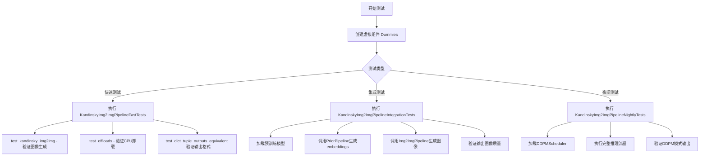

## 类结构

```
Dummies (测试辅助类)
├── Properties: text_embedder_hidden_size, time_input_dim, ...
├── Methods: get_dummy_components(), get_dummy_inputs()
│
KandinskyImg2ImgPipelineFastTests (单元测试类)
├── Inheritance: PipelineTesterMixin, unittest.TestCase
├── Methods: get_dummy_components(), get_dummy_inputs(), test_kandinsky_img2img(), test_offloads(), test_dict_tuple_outputs_equivalent()
│
KandinskyImg2ImgPipelineIntegrationTests (集成测试类)
├── Inheritance: unittest.TestCase
├── Methods: setUp(), tearDown(), test_kandinsky_img2img()
│
KandinskyImg2ImgPipelineNightlyTests (夜间测试类)
├── Inheritance: unittest.TestCase
├── Methods: setUp(), tearDown(), test_kandinsky_img2img_ddpm()
```

## 全局变量及字段


### `enable_full_determinism`
    
启用完全确定性以确保测试可重复性的函数

类型：`function`
    


### `Dummies.text_embedder_hidden_size`
    
返回32，文本嵌入器的隐藏层大小

类型：`int (property)`
    


### `Dummies.time_input_dim`
    
返回32，时间输入维度

类型：`int (property)`
    


### `Dummies.block_out_channels_0`
    
返回time_input_dim，UNet块输出通道数

类型：`int (property)`
    


### `Dummies.time_embed_dim`
    
返回time_input_dim*4，时间嵌入层维度

类型：`int (property)`
    


### `Dummies.cross_attention_dim`
    
返回32，交叉注意力机制的维度

类型：`int (property)`
    


### `Dummies.dummy_tokenizer`
    
返回用于多语言CLIP的tokenizer实例

类型：`XLMRobertaTokenizerFast (property)`
    


### `Dummies.dummy_text_encoder`
    
返回用于文本编码的MultilingualCLIP模型实例

类型：`MultilingualCLIP (property)`
    


### `Dummies.dummy_unet`
    
返回用于图像生成的UNet2D条件模型实例

类型：`UNet2DConditionModel (property)`
    


### `Dummies.dummy_movq_kwargs`
    
返回VQModel的参数字典配置

类型：`dict (property)`
    


### `Dummies.dummy_movq`
    
返回向量量化生成模型实例

类型：`VQModel (property)`
    


### `KandinskyImg2ImgPipelineFastTests.pipeline_class`
    
指向KandinskyImg2ImgPipeline测试类

类型：`type`
    


### `KandinskyImg2ImgPipelineFastTests.params`
    
包含必需参数的列表如prompt、image_embeds等

类型：`list`
    


### `KandinskyImg2ImgPipelineFastTests.batch_params`
    
包含支持批处理的参数列表

类型：`list`
    


### `KandinskyImg2ImgPipelineFastTests.required_optional_params`
    
可选但推荐提供的参数列表

类型：`list`
    


### `KandinskyImg2ImgPipelineFastTests.test_xformers_attention`
    
标志位，是否测试xformers优化的注意力机制

类型：`bool`
    


### `KandinskyImg2ImgPipelineFastTests.supports_dduf`
    
标志位，是否支持DDUF（解码器去噪特征）

类型：`bool`
    
    

## 全局函数及方法


### `gc.collect`

该函数是 Python 标准库 `gc` 模块中的垃圾回收函数，用于手动触发垃圾回收过程，释放不再使用的对象内存。在测试用例的 `setUp` 和 `tearDown` 方法中调用此函数，以在每个测试前后清理 VRAM（显存），防止内存泄漏。

参数： 无

返回值： `int`，返回回收的对象数量（通常为 0）

#### 流程图

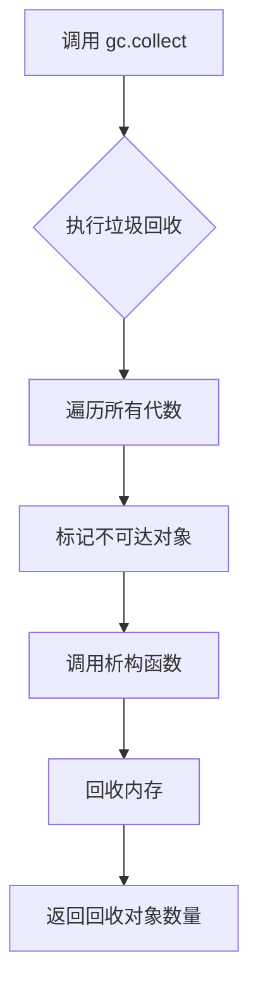

#### 带注释源码

```python
# 清理 VRAM（显存）之前触发垃圾回收
gc.collect()
# 该函数会检查并回收不再使用的 Python 对象
# 在测试环境中用于释放 GPU 相关测试留下的内存
```


### random

在代码中，使用了Python标准库`random`模块的`Random`类来创建随机数生成器实例，用于生成确定性的伪随机数tensor数据。

参数：此为模块/类的使用，非函数调用

返回值：此为模块/类的使用，非函数调用

#### 流程图

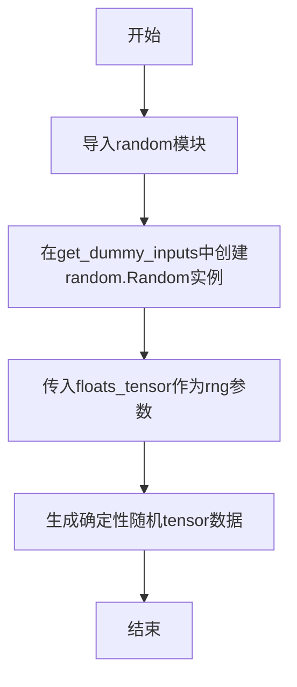

#### 带注释源码

```python
# 在文件顶部导入了random模块
import random

# 在Dummies类的get_dummy_inputs方法中使用
def get_dummy_inputs(self, device, seed=0):
    # 使用random.Random创建确定性随机数生成器
    # seed参数确保每次调用生成相同的随机序列，便于测试复现
    image_embeds = floats_tensor((1, self.cross_attention_dim), rng=random.Random(seed)).to(device)
    negative_image_embeds = floats_tensor((1, self.cross_attention_dim), rng=random.Random(seed + 1)).to(device)
    
    # 创建初始图像tensor，同样使用确定性随机数生成器
    image = floats_tensor((1, 3, 64, 64), rng=random.Random(seed)).to(device)
    image = image.cpu().permute(0, 2, 3, 1)[0]
    init_image = Image.fromarray(np.uint8(image)).convert("RGB").resize((256, 256))

    # 根据设备类型创建不同的随机数生成器
    if str(device).startswith("mps"):
        generator = torch.manual_seed(seed)
    else:
        generator = torch.Generator(device=device).manual_seed(seed)
    
    # 构建并返回输入字典
    inputs = {
        "prompt": "horse",
        "image": init_image,
        "image_embeds": image_embeds,
        "negative_image_embeds": negative_image_embeds,
        "generator": generator,
        "height": 64,
        "width": 64,
        "num_inference_steps": 10,
        "guidance_scale": 7.0,
        "strength": 0.2,
        "output_type": "np",
    }
    return inputs
```

#### 备注

代码中并未定义名为`random`的函数或方法，而是使用了Python标准库`random`模块的`Random`类。这种用法的主要目的是：

1. **测试可复现性**：通过固定的seed值确保每次测试生成相同的随机数据
2. **单元测试友好**：使测试结果确定化，便于断言和调试
3. **与PyTorch Generator配合使用**：同时使用numpy的random和torch的manual_seed确保完全确定性


### `KandinskyImg2ImgPipelineFastTests.test_kandinsky_img2img`

该测试方法验证 KandinskyImg2ImgPipeline 的图像到图像转换功能，通过创建虚拟组件并执行推理流程，确保输出图像的尺寸和像素值与预期结果一致。

参数：

- 无显式参数（通过 `self.get_dummy_inputs(device)` 内部调用获取测试所需输入）

返回值：`void`，该方法为测试用例，通过断言验证输出结果，不返回具体值

#### 流程图

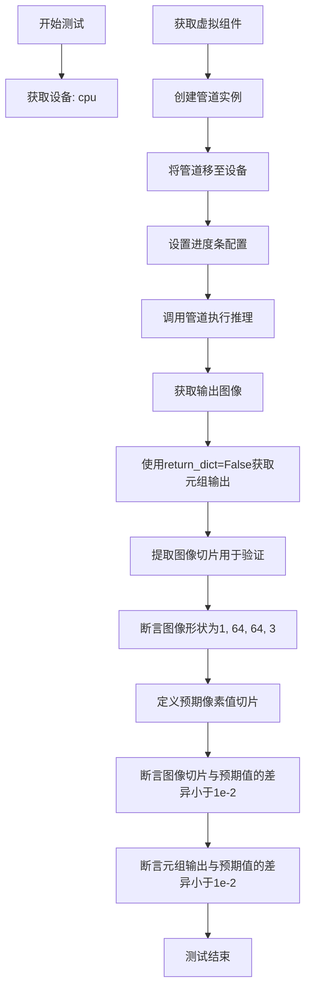

#### 带注释源码

```python
@pytest.mark.xfail(
    condition=is_transformers_version(">=", "4.56.2"),
    reason="Latest transformers changes the slices",
    strict=False,
)
def test_kandinsky_img2img(self):
    """测试Kandinsky图像到图像管道的核心功能"""
    device = "cpu"  # 设置测试设备为CPU

    # 获取虚拟组件（文本编码器、UNet、调度器等）
    components = self.get_dummy_components()

    # 使用虚拟组件创建管道实例
    pipe = self.pipeline_class(**components)
    pipe = pipe.to(device)  # 将管道移至指定设备

    # 配置进度条（disable=None表示启用进度条）
    pipe.set_progress_bar_config(disable=None)

    # 执行推理，获取输出
    output = pipe(**self.get_dummy_inputs(device))
    image = output.images  # 提取生成的图像

    # 使用return_dict=False获取元组格式的输出
    image_from_tuple = pipe(
        **self.get_dummy_inputs(device),
        return_dict=False,
    )[0]

    # 提取图像右下角3x3像素切片用于验证
    image_slice = image[0, -3:, -3:, -1]
    image_from_tuple_slice = image_from_tuple[0, -3:, -3:, -1]

    # 断言：验证输出图像形状为(1, 64, 64, 3)
    assert image.shape == (1, 64, 64, 3)

    # 定义预期的像素值切片
    expected_slice = np.array([0.5816, 0.5872, 0.4634, 0.5982, 0.4767, 0.4710, 0.4669, 0.4717, 0.4966])
    
    # 断言：验证dict输出格式的像素值与预期差异小于1e-2
    assert np.abs(image_slice.flatten() - expected_slice).max() < 1e-2, (
        f" expected_slice {expected_slice}, but got {image_slice.flatten()}"
    )
    
    # 断言：验证tuple输出格式的像素值与预期差异小于1e-2
    assert np.abs(image_from_tuple_slice.flatten() - expected_slice).max() < 1e-2, (
        f" expected_slice {expected_slice}, but got {image_from_tuple_slice.flatten()}"
    )
```

---

### `KandinskyImg2ImgPipelineFastTests.test_offloads`

该测试方法验证 KandinskyImg2ImgPipeline 在不同CPU卸载策略下的功能一致性，确保启用模型卸载时输出结果与默认行为相同。

参数：

- 无显式参数（使用类内部的 `get_dummy_components` 和 `get_dummy_inputs` 方法）

返回值：`void`，通过断言验证不同卸载策略下输出图像的一致性

#### 流程图

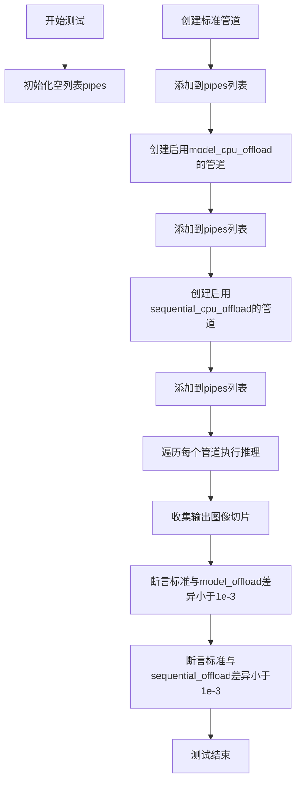

#### 带注释源码

```python
@require_torch_accelerator
def test_offloads(self):
    """测试不同CPU卸载策略下管道输出的一致性"""
    pipes = []  # 存储不同配置的管道实例
    
    # 获取虚拟组件并创建标准管道
    components = self.get_dummy_components()
    sd_pipe = self.pipeline_class(**components).to(torch_device)
    pipes.append(sd_pipe)  # 添加标准管道

    # 创建启用模型级CPU卸载的管道
    components = self.get_dummy_components()
    sd_pipe = self.pipeline_class(**components)
    sd_pipe.enable_model_cpu_offload()  # 启用模型级卸载
    pipes.append(sd_pipe)

    # 创建启用顺序CPU卸载的管道
    components = self.get_dummy_components()
    sd_pipe = self.pipeline_class(**components)
    sd_pipe.enable_sequential_cpu_offload()  # 启用顺序卸载
    pipes.append(sd_pipe)

    image_slices = []  # 存储每个管道输出的图像切片
    for pipe in pipes:
        # 获取测试输入并执行推理
        inputs = self.get_dummy_inputs(torch_device)
        image = pipe(**inputs).images
        # 提取右下角3x3像素并展平
        image_slices.append(image[0, -3:, -3:, -1].flatten())

    # 断言：验证标准管道与模型级卸载管道的输出差异小于1e-3
    assert np.abs(image_slices[0] - image_slices[1]).max() < 1e-3
    # 断言：验证标准管道与顺序卸载管道的输出差异小于1e-3
    assert np.abs(image_slices[0] - image_slices[2]).max() < 1e-3
```

---

### `KandinskyImg2ImgPipelineIntegrationTests.test_kandinsky_img2img`

该集成测试方法使用真实的预训练模型验证 KandinskyImg2ImgPipeline 在图像到图像转换任务上的功能，通过比较输出图像与预期结果确保管道正确性。

参数：

- 无显式参数（测试使用硬编码的测试数据和模型路径）

返回值：`void`，通过断言验证输出图像尺寸和像素值与预期结果一致

#### 流程图

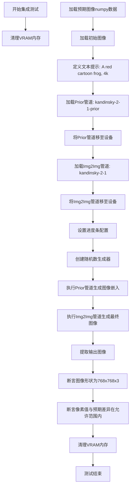

#### 带注释源码

```python
@slow
@require_torch_accelerator
class KandinskyImg2ImgPipelineIntegrationTests(unittest.TestCase):
    def setUp(self):
        """每个测试前清理VRAM"""
        super().setUp()
        gc.collect()  # 强制垃圾回收
        backend_empty_cache(torch_device)  # 清空GPU缓存

    def tearDown(self):
        """每个测试后清理VRAM"""
        super().tearDown()
        gc.collect()
        backend_empty_cache(torch_device)

    def test_kandinsky_img2img(self):
        """集成测试：使用真实预训练模型测试图像转换功能"""
        # 加载预期的输出图像（青蛙图像）
        expected_image = load_numpy(
            "https://huggingface.co/datasets/hf-internal-testing/diffusers-images/resolve/main"
            "/kandinsky/kandinsky_img2img_frog.npy"
        )

        # 加载初始图像（猫图像）
        init_image = load_image(
            "https://huggingface.co/datasets/hf-internal-testing/diffusers-images/resolve/main/kandinsky/cat.png"
        )
        
        # 定义文本提示
        prompt = "A red cartoon frog, 4k"

        # 加载Prior管道（用于生成图像嵌入）
        pipe_prior = KandinskyPriorPipeline.from_pretrained(
            "kandinsky-community/kandinsky-2-1-prior", torch_dtype=torch.float16
        )
        pipe_prior.to(torch_device)  # 移至GPU

        # 加载图像转换管道
        pipeline = KandinskyImg2ImgPipeline.from_pretrained(
            "kandinsky-community/kandinsky-2-1", torch_dtype=torch.float16
        )
        pipeline = pipeline.to(torch_device)

        # 配置进度条
        pipeline.set_progress_bar_config(disable=None)

        # 创建随机数生成器，确保可复现性
        generator = torch.Generator(device="cpu").manual_seed(0)
        
        # 使用Prior管道生成图像嵌入（正向和负向）
        image_emb, zero_image_emb = pipe_prior(
            prompt,
            generator=generator,
            num_inference_steps=5,
            negative_prompt="",
        ).to_tuple()

        # 执行图像到图像转换
        output = pipeline(
            prompt,
            image=init_image,
            image_embeds=image_emb,
            negative_image_embeds=zero_image_emb,
            generator=generator,
            num_inference_steps=100,
            height=768,
            width=768,
            strength=0.2,  # 转换强度
            output_type="np",
        )

        # 提取生成的图像
        image = output.images[0]

        # 断言：验证输出图像尺寸
        assert image.shape == (768, 768, 3)

        # 断言：验证像素值与预期图像的差异
        assert_mean_pixel_difference(image, expected_image)
```

---

### `KandinskyImg2ImgPipelineNightlyTests.test_kandinsky_img2img_ddpm`

该夜间测试方法使用 DDPMScheduler 验证 KandinskyImg2ImgPipeline 在不同调度器配置下的功能，确保使用 DDPMScheduler 时输出图像与预期一致。

参数：

- 无显式参数（使用硬编码的测试数据和模型路径）

返回值：`void`，通过断言验证输出图像尺寸和像素值符合预期

#### 流程图

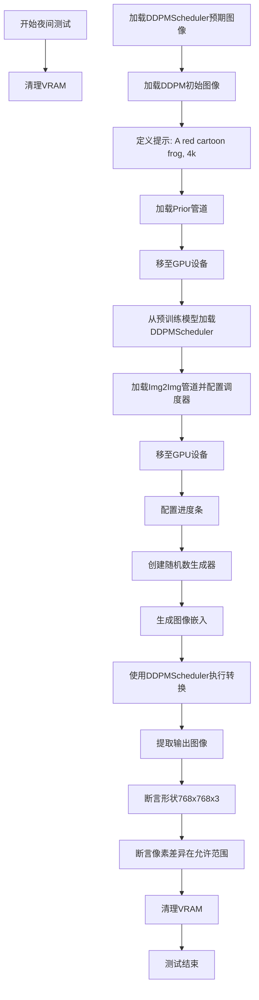

#### 带注释源码

```python
@nightly
@require_torch_accelerator
class KandinskyImg2ImgPipelineNightlyTests(unittest.TestCase):
    def setUp(self):
        """每个测试前清理VRAM"""
        super().setUp()
        gc.collect()
        backend_empty_cache(torch_device)

    def tearDown(self):
        """每个测试后清理VRAM"""
        super().tearDown()
        gc.collect()
        backend_empty_cache(torch_device)

    def test_kandinsky_img2img_ddpm(self):
        """夜间测试：使用DDPMScheduler测试图像转换"""
        # 加载DDPMScheduler对应的预期图像
        expected_image = load_numpy(
            "https://huggingface.co/datasets/hf-internal-testing/diffusers-images/resolve/main"
            "/kandinsky/kandinsky_img2img_ddpm_frog.npy"
        )

        # 加载用于DDPM测试的初始图像
        init_image = load_image(
            "https://huggingface.co/datasets/hf-internal-testing/diffusers-images/resolve/main/kandinsky/frog.png"
        )
        
        # 定义提示词
        prompt = "A red cartoon frog, 4k"

        # 加载Prior管道
        pipe_prior = KandinskyPriorPipeline.from_pretrained(
            "kandinsky-community/kandinsky-2-1-prior", torch_dtype=torch.float16
        )
        pipe_prior.to(torch_device)

        # 加载DDPMScheduler调度器
        scheduler = DDPMScheduler.from_pretrained(
            "kandinsky-community/kandinsky-2-1", 
            subfolder="ddpm_scheduler"
        )
        
        # 加载图像转换管道并使用DDPMScheduler
        pipeline = KandinskyImg2ImgPipeline.from_pretrained(
            "kandinsky-community/kandinsky-2-1", 
            scheduler=scheduler, 
            torch_dtype=torch.float16
        )
        pipeline = pipeline.to(torch_device)

        # 配置进度条
        pipeline.set_progress_bar_config(disable=None)

        # 创建随机数生成器
        generator = torch.Generator(device="cpu").manual_seed(0)
        
        # 生成图像嵌入
        image_emb, zero_image_emb = pipe_prior(
            prompt,
            generator=generator,
            num_inference_steps=5,
            negative_prompt="",
        ).to_tuple()

        # 使用DDPMScheduler执行图像转换
        output = pipeline(
            prompt,
            image=init_image,
            image_embeds=image_emb,
            negative_image_embeds=zero_image_emb,
            generator=generator,
            num_inference_steps=100,
            height=768,
            width=768,
            strength=0.2,
            output_type="np",
        )

        # 提取输出图像
        image = output.images[0]

        # 断言：验证输出尺寸
        assert image.shape == (768, 768, 3)

        # 断言：验证像素值差异
        assert_mean_pixel_difference(image, expected_image)
```

---

### `KandinskyImg2ImgPipelineFastTests.test_dict_tuple_outputs_equivalent`

该测试方法验证管道在返回字典格式和元组格式输出时的一致性，继承自 `PipelineTesterMixin` 基类。

参数：

- 无显式参数

返回值：`void`，通过断言验证两种输出格式的等效性

#### 带注释源码

```python
def test_dict_tuple_outputs_equivalent(self):
    """测试管道dict和tuple输出格式的等效性"""
    # 调用父类的测试方法，设置最大允许差异为5e-4
    super().test_dict_tuple_outputs_equivalent(expected_max_difference=5e-4)
```


### `np.uint8`

将输入数据转换为无符号8位整数类型，常用于图像数据的类型转换。

参数：

- `x`：任意类型，输入数据，可以是列表、元组、numpy数组或其他可转换为数组的对象
- `copy`：bool（可选），默认为True，是否复制数据

返回值：`numpy.ndarray`，返回uint8类型的numpy数组

#### 带注释源码

```python
# 将图像数据转换为uint8类型（0-255范围的整数）
# 用于PIL Image.fromarray()，因为PIL需要整数类型的数组
image = image.cpu().permute(0, 2, 3, 1)[0]  # 从torch张量转换为numpy兼容格式
init_image = Image.fromarray(np.uint8(image)).convert("RGB").resize((256, 256))
```

---

### `np.array`

创建numpy数组对象，用于存储数值数据。

参数：

- `object`：任意类型，输入数据
- `dtype`：数据类型（可选），指定数组的数据类型
- `copy`：bool（可选），是否复制数据

返回值：`numpy.ndarray`，返回numpy数组对象

#### 带注释源码

```python
# 定义预期的像素值切片，用于测试断言
# 这些是KandinskyImg2ImgPipeline在特定seed下输出的预期像素值
expected_slice = np.array([0.5816, 0.5872, 0.4634, 0.5982, 0.4767, 0.4710, 0.4669, 0.4717, 0.4966])
```

---

### `np.abs`

计算数组元素的绝对值。

参数：

- `x`：numpy数组或类似数组的对象
- `out`：numpy数组（可选），输出数组
- `where`：数组（可选），条件

返回值：`numpy.ndarray`，返回绝对值数组

#### 带注释源码

```python
# 比较实际输出图像切片与预期值的差异
# 使用np.abs计算差异的绝对值，然后取最大值进行断言
assert np.abs(image_slice.flatten() - expected_slice).max() < 1e-2, (
    f" expected_slice {expected_slice}, but got {image_slice.flatten()}"
)
assert np.abs(image_from_tuple_slice.flatten() - expected_slice).max() < 1e-2, (
    f" expected_slice {expected_slice}, but got {image_from_tuple_slice.flatten()}"
)
```


### `KandinskyImg2ImgPipelineFastTests.test_kandinsky_img2img`

该测试方法用于验证 KandinskyImg2ImgPipeline 的图像到图像（img2img）核心功能是否正确，包括pipeline的调用、输出图像的形状以及像素值是否符合预期。

参数：
- 无显式参数（使用 `self.get_dummy_inputs(device)` 获取测试输入）

返回值：`无返回值`（assert 语句验证结果）

#### 流程图

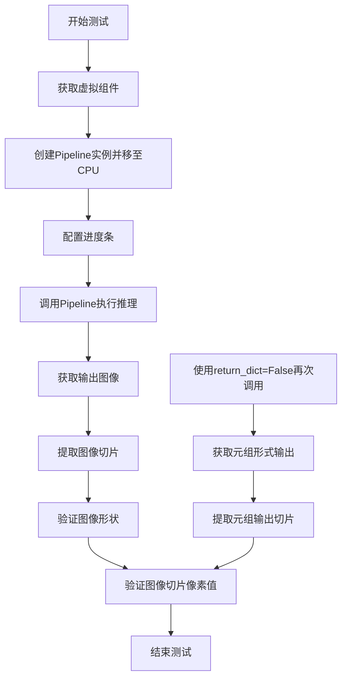

#### 带注释源码

```python
@pytest.mark.xfail(
    condition=is_transformers_version(">=", "4.56.2"),
    reason="Latest transformers changes the slices",
    strict=False,
)
def test_kandinsky_img2img(self):
    """测试 Kandinsky img2img pipeline 的核心功能"""
    device = "cpu"

    # 获取虚拟组件（文本编码器、UNet、调度器等）
    components = self.get_dummy_components()

    # 使用虚拟组件创建 pipeline 实例
    pipe = self.pipeline_class(**components)
    pipe = pipe.to(device)

    # 设置进度条配置（不禁用）
    pipe.set_progress_bar_config(disable=None)

    # 第一次调用：使用字典形式返回结果
    output = pipe(**self.get_dummy_inputs(device))
    image = output.images

    # 第二次调用：使用元组形式返回结果（return_dict=False）
    image_from_tuple = pipe(
        **self.get_dummy_inputs(device),
        return_dict=False,
    )[0]

    # 提取图像右下角3x3区域用于像素值验证
    image_slice = image[0, -3:, -3:, -1]
    image_from_tuple_slice = image_from_tuple[0, -3:, -3:, -1]

    # 验证输出图像形状为 (1, 64, 64, 3)
    assert image.shape == (1, 64, 64, 3)

    # 定义期望的像素值切片
    expected_slice = np.array([0.5816, 0.5872, 0.4634, 0.5982, 0.4767, 0.4710, 0.4669, 0.4717, 0.4966])
    
    # 验证字典返回形式的像素值误差小于 1e-2
    assert np.abs(image_slice.flatten() - expected_slice).max() < 1e-2, (
        f" expected_slice {expected_slice}, but got {image_slice.flatten()}"
    )
    
    # 验证元组返回形式的像素值误差小于 1e-2
    assert np.abs(image_from_tuple_slice.flatten() - expected_slice).max() < 1e-2, (
        f" expected_slice {expected_slice}, but got {image_from_tuple_slice.flatten()}"
    )
```

---

### `KandinskyImg2ImgPipelineFastTests.test_offloads`

该测试方法验证 KandinskyImg2ImgPipeline 在不同CPU offload模式下的功能一致性，包括无offload、模型级CPU offload和顺序CPU offload三种模式。

参数：
- 无显式参数（使用 `self.get_dummy_inputs(torch_device)` 获取测试输入）

返回值：`无返回值`（assert 语句验证结果）

#### 流程图

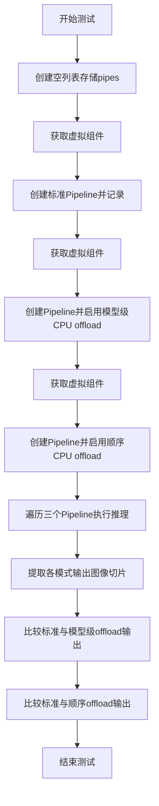

#### 带注释源码

```python
@require_torch_accelerator
def test_offloads(self):
    """测试不同 CPU offload 模式下的输出一致性"""
    pipes = []
    components = self.get_dummy_components()
    
    # 模式1：标准模式（无 offload）
    sd_pipe = self.pipeline_class(**components).to(torch_device)
    pipes.append(sd_pipe)

    components = self.get_dummy_components()
    sd_pipe = self.pipeline_class(**components)
    sd_pipe.enable_model_cpu_offload()  # 模式2：模型级 CPU offload
    pipes.append(sd_pipe)

    components = self.get_dummy_components()
    sd_pipe = self.pipeline_class(**components)
    sd_pipe.enable_sequential_cpu_offload()  # 模式3：顺序 CPU offload
    pipes.append(sd_pipe)

    image_slices = []
    # 对每个 pipeline 执行推理并收集输出切片
    for pipe in pipes:
        inputs = self.get_dummy_inputs(torch_device)
        image = pipe(**inputs).images
        image_slices.append(image[0, -3:, -3:, -1].flatten())

    # 验证标准模式与模型级 offload 模式输出差异小于 1e-3
    assert np.abs(image_slices[0] - image_slices[1]).max() < 1e-3
    # 验证标准模式与顺序 offload 模式输出差异小于 1e-3
    assert np.abs(image_slices[0] - image_slices[2]).max() < 1e-3
```

---

### `KandinskyImg2ImgPipelineFastTests.test_dict_tuple_outputs_equivalent`

该测试方法继承自 `PipelineTesterMixin`，验证 Pipeline 在返回字典格式和元组格式输出时的等价性。

参数：
- 无显式参数

返回值：`无返回值`（assert 语句验证结果）

#### 流程图

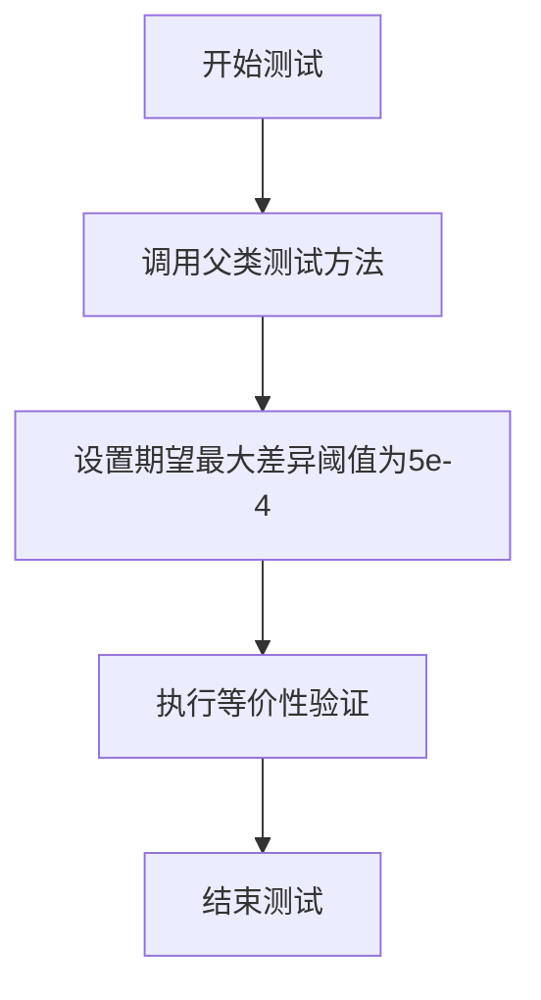

#### 带注释源码

```python
def test_dict_tuple_outputs_equivalent(self):
    """验证字典格式和元组格式输出的等价性"""
    # 调用父类测试方法，设置期望最大像素差异为 5e-4
    super().test_dict_tuple_outputs_equivalent(expected_max_difference=5e-4)
```


### torch

这是 PyTorch 深度学习框架的核心模块，在本测试代码中主要用于：随机种子设置、设备管理张量创建、数据类型指定以及神经网络模型的创建。

参数：

- 无（这是一个Python模块导入，不是函数）

返回值：`torch` 模块，提供张量运算、神经网络构建、设备管理等功能

#### 流程图

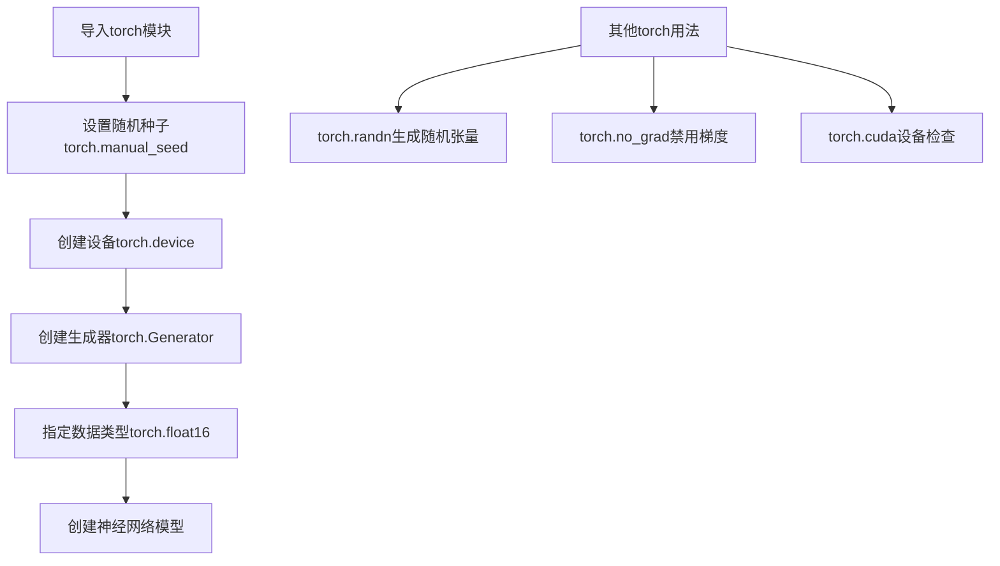

#### 带注释源码

```python
import torch  # 导入PyTorch深度学习框架

# 在dummy_text_encoder中使用
torch.manual_seed(0)  # 设置随机种子为0，确保测试结果可复现

# 在dummy_unet中使用
torch.manual_seed(0)  # 重新设置随机种子

# 在dummy_movq中使用
torch.manual_seed(0)  # 再次设置随机种子确保一致性

# 在get_dummy_inputs中使用
generator = torch.manual_seed(seed)  # MPS设备使用manual_seed
# 或者
generator = torch.Generator(device=device).manual_seed(seed)  # 创建生成器并设置种子

# 在集成测试中使用
torch.float16  # 指定模型使用半精度浮点数，减少显存占用

# 在测试工具中使用
from ...testing_utils import torch_device  # 从测试工具导入设备变量
```

#### 关键用法详解

1. **torch.manual_seed(seed)**: 设置CPU/CUDA随机种子，确保测试可复现
2. **torch.device**: 表示计算设备（CPU/CUDA）
3. **torch.Generator**: 伪随机数生成器，用于控制采样过程
4. **torch.float16**: 半精度浮点类型，用于加速推理
5. **torch.randn**: 生成服从标准正态分布的随机张量（在floats_tensor中使用）

---

### Dummies 类

测试辅助类，用于生成 KandinskyImg2ImgPipeline 测试所需的虚拟（dummy）组件。

#### 类字段

| 字段名 | 类型 | 描述 |
|--------|------|------|
| text_embedder_hidden_size | int | 文本嵌入器隐藏层维度，默认32 |
| time_input_dim | int | 时间输入维度，默认32 |
| block_out_channels_0 | int | 块输出通道数，默认32 |
| time_embed_dim | int | 时间嵌入维度，默认128 |
| cross_attention_dim | int | 交叉注意力维度，默认32 |

#### 类方法

##### get_dummy_components

```
名称：Dummies.get_dummy_components
参数：无
返回值：dict，包含所有虚拟组件的字典
```

```python
def get_dummy_components(self):
    text_encoder = self.dummy_text_encoder
    tokenizer = self.dummy_tokenizer
    unet = self.dummy_unet
    movq = self.dummy_movq

    ddim_config = {
        "num_train_timesteps": 1000,
        "beta_schedule": "linear",
        "beta_start": 0.00085,
        "beta_end": 0.012,
        "clip_sample": False,
        "set_alpha_to_one": False,
        "steps_offset": 0,
        "prediction_type": "epsilon",
        "thresholding": False,
    }

    scheduler = DDIMScheduler(**ddim_config)

    components = {
        "text_encoder": text_encoder,
        "tokenizer": tokenizer,
        "unet": unet,
        "scheduler": scheduler,
        "movq": movq,
    }

    return components
```

##### get_dummy_inputs

```
名称：Dummies.get_dummy_inputs
参数：
- device：str，设备类型（如"cpu"、"cuda"）
- seed：int=0，随机种子
返回值：dict，包含测试输入参数的字典
```

```python
def get_dummy_inputs(self, device, seed=0):
    # 生成图像嵌入向量 (1, 32)
    image_embeds = floats_tensor((1, self.cross_attention_dim), rng=random.Random(seed)).to(device)
    # 生成负向图像嵌入向量
    negative_image_embeds = floats_tensor((1, self.cross_attention_dim), rng=random.Random(seed + 1)).to(device)
    
    # 创建初始图像 (1, 3, 64, 64)
    image = floats_tensor((1, 3, 64, 64), rng=random.Random(seed)).to(device)
    image = image.cpu().permute(0, 2, 3, 1)[0]  # 转换为HWC格式
    init_image = Image.fromarray(np.uint8(image)).convert("RGB").resize((256, 256))

    # 根据设备类型创建随机生成器
    if str(device).startswith("mps"):
        generator = torch.manual_seed(seed)
    else:
        generator = torch.Generator(device=device).manual_seed(seed)
    
    # 构建完整输入参数
    inputs = {
        "prompt": "horse",
        "image": init_image,
        "image_embeds": image_embeds,
        "negative_image_embeds": negative_image_embeds,
        "generator": generator,
        "height": 64,
        "width": 64,
        "num_inference_steps": 10,
        "guidance_scale": 7.0,
        "strength": 0.2,
        "output_type": "np",
    }
    return inputs
```

#### 流程图

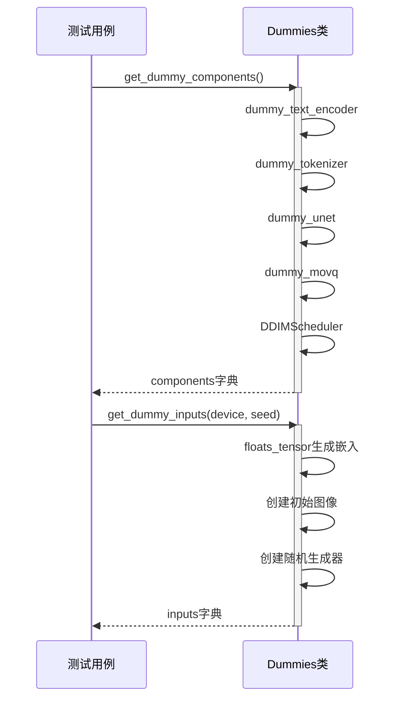

---

## 项目整体设计文档

### 1. 核心功能概述

该代码是 **Kandinsky Img2Img Pipeline**（可图到图生成管道）的单元测试和集成测试套件，用于验证基于 Kandinsky 2.1 模型的图像到图像生成功能。测试覆盖快速单元测试、CPU/GPU 卸载测试、输出格式测试、集成测试和夜间测试。

### 2. 文件整体运行流程

```
┌─────────────────────────────────────────────────────────────────┐
│                        测试入口                                  │
└──────────────────────────┬──────────────────────────────────────┘
                           │
         ┌─────────────────┼─────────────────┐
         │                 │                 │
         ▼                 ▼                 ▼
┌─────────────┐   ┌─────────────┐   ┌─────────────┐
│  快速测试    │   │ 集成测试    │   │  夜间测试   │
│ FastTests   │   │Integration  │   │  Nightly   │
└──────┬──────┘   └──────┬──────┘   └──────┬──────┘
       │                 │                 │
       ▼                 ▼                 ▼
┌─────────────┐   ┌─────────────┐   ┌─────────────┐
│ 虚拟组件    │   │ 加载真实模型 │   │ 加载真实模型 │
│ Dummies    │   │from_pretrained│  │from_pretrained│
└──────┬──────┘   └──────┬──────┘   └──────┬──────┘
       │                 │                 │
       ▼                 ▼                 ▼
┌─────────────┐   ┌─────────────┐   ┌─────────────┐
│ 执行pipeline│   │ 执行pipeline│   │ 执行pipeline│
└──────┬──────┘   └──────┬──────┘   └──────┬──────┘
       │                 │                 │
       ▼                 ▼                 ▼
┌─────────────┐   ┌─────────────┐   ┌─────────────┐
│ 验证输出    │   │ 验证输出    │   │ 验证输出    │
└─────────────┘   └─────────────┘   └─────────────┘
```

### 3. 关键组件信息

| 组件名称 | 描述 |
|----------|------|
| Dummies | 测试辅助类，提供虚拟组件和测试输入 |
| KandinskyImg2ImgPipelineFastTests | 快速单元测试类 |
| KandinskyImg2ImgPipelineIntegrationTests | 集成测试类 |
| KandinskyImg2ImgPipelineNightlyTests | 夜间测试类 |
| DDIMScheduler | DDIM调度器，用于去噪采样 |
| DDPMScheduler | DDPM调度器，用于去噪采样 |
| UNet2DConditionModel | 条件UNet模型 |
| VQModel | VQ-VAE量化模型 |
| MultilingualCLIP | 多语言CLIP文本编码器 |

### 4. 潜在技术债务与优化空间

1. **魔法数字**: 多个硬编码的数值（如 `0.00085`, `0.012`, `37`, `1005`）应提取为常量
2. **重复代码**: `get_dummy_components` 和 `get_dummy_inputs` 在多个测试类中重复定义
3. **缺失错误处理**: 管道调用缺少异常捕获机制
4. **测试粒度**: 部分测试覆盖场景不够全面
5. **设备兼容性**: MPS 设备的特殊处理逻辑可以更优雅
6. **文档注释**: 缺少模块级和类级文档字符串

### 5. 设计目标与约束

- **测试目标**: 验证 Kandinsky Img2Img 管道在各种配置下的正确性
- **性能约束**: 快速测试需在 CPU 上可运行，夜间测试使用半精度加速
- **可复现性**: 通过固定随机种子确保测试结果一致

### 6. 错误处理设计

- 使用 `pytest.mark.xfail` 标记已知的 transformers 版本兼容问题
- 集成测试在 VRAM 管理中使用 try-finally 确保资源释放
- 数值比较使用容差（`1e-2`, `1e-3`, `5e-4`）处理浮点精度问题

### 7. 外部依赖与接口

- **transformers**: >=4.56.2 存在已知兼容问题
- **diffusers**: 核心库，提供管道实现
- **PIL**: 图像处理
- **numpy**: 数组操作
- **pytest**: 测试框架


### `Image` (PIL)

这是 PIL（Python Imaging Library）库中的核心图像处理类，用于创建、打开、处理和保存图像文件。在本代码中，`Image` 被用于将 numpy 数组转换为 PIL 图像对象，以便进行图像处理操作。

参数：

- `data`：numpy 数组，要转换为图像的数据
- `mode`：字符串（可选），图像模式，如 "RGB"、"L" 等

#### 流程图

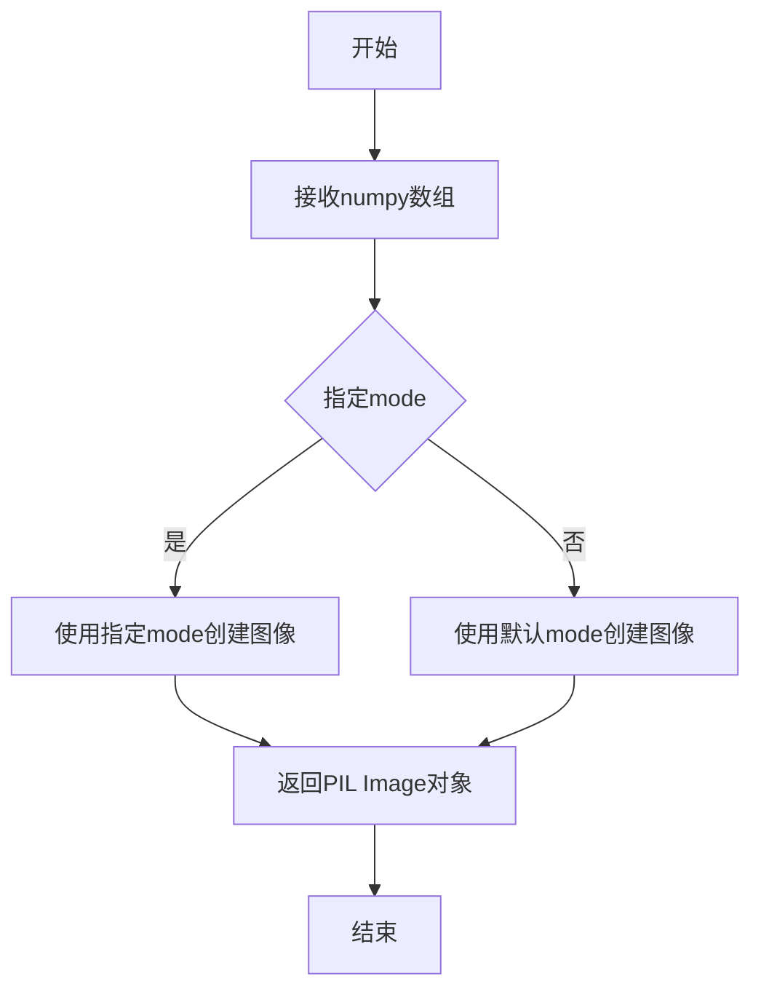

#### 带注释源码

```python
# 在 Dummies.get_dummy_inputs 方法中使用
# 创建虚拟输入图像用于测试

# 1. 生成一个随机浮点数张量 (1, 3, 64, 64)
image = floats_tensor((1, 3, 64, 64), rng=random.Random(seed)).to(device)

# 2. 将张量移动到CPU并调整维度顺序 (C, H, W) -> (H, W, C)
image = image.cpu().permute(0, 2, 3, 1)[0]

# 3. 使用 PIL Image.fromarray 将 numpy 数组转换为 PIL 图像
#    np.uint8 将浮点数转换为 0-255 范围的整数
#    .convert('RGB') 确保图像是 RGB 模式
#    .resize((256, 256)) 将图像调整为 256x256 大小
init_image = Image.fromarray(np.uint8(image)).convert("RGB").resize((256, 256))
```

---

### `Image.fromarray`

这是 PIL Image 类的一个类方法，用于从 numpy 数组或类似对象创建 PIL 图像对象。

参数：

- `obj`：numpy 数组，要转换为图像的数组
- `mode`：字符串（可选），图像模式

返回值：`PIL.Image.Image`，返回创建的 PIL 图像对象

#### 带注释源码

```python
# 从 numpy 数组创建 PIL 图像
# np.uint8 将浮点数张量 (值范围 0-1) 转换为整数 (值范围 0-255)
Image.fromarray(np.uint8(image))
```

---

### `Image.convert`

这是 PIL Image 类的实例方法，用于转换图像的模式（如灰度、RGB 等）。

参数：

- `mode`：字符串，目标图像模式，如 "L"（灰度）、"RGB"、"RGBA" 等

返回值：`PIL.Image.Image`，返回转换后的新图像对象

#### 带注释源码

```python
# 将图像转换为 RGB 模式（3通道彩色图像）
# 无论输入图像是什么模式，都会转换为 RGB
Image.fromarray(np.uint8(image)).convert("RGB")
```

---

### `Image.resize`

这是 PIL Image 类的实例方法，用于调整图像的大小。

参数：

- `size`：元组，目标尺寸，格式为 (width, height)
- `resample`：滤波器（可选），重采样滤波器，默认为 PIL.Image.BILINEAR

返回值：`PIL.Image.Image`，返回调整大小后的新图像对象

#### 带注释源码

```python
# 将图像调整为 256x256 像素
# 在 Kandinsky 管道中，输入图像需要统一大小以便处理
Image.fromarray(np.uint8(image)).convert("RGB").resize((256, 256))
```

---

### 关键组件信息

| 名称 | 描述 |
|------|------|
| `Image.fromarray` | 从 numpy 数组创建 PIL 图像对象 |
| `Image.convert` | 转换图像的色彩模式 |
| `Image.resize` | 调整图像的宽高尺寸 |

### 技术债务与优化空间

1. **硬编码尺寸**：图像尺寸 (256, 256) 和 (64, 64) 是硬编码的，建议提取为常量或配置参数
2. **缺少错误处理**：如果 numpy 数组的形状不符合图像要求，可能抛出难以理解的异常
3. **内存效率**：在测试中使用 `.cpu().permute()` 复制数据，可能存在优化空间


### `XLMRobertaTokenizerFast.from_pretrained`

该方法是 `XLMRobertaTokenizerFast` 类的类方法，用于从预训练模型加载 XLM-RoBERTa 快速分词器。在当前测试代码中，它被用于创建一个虚拟（dummy）分词器对象，供 Kandinsky 图像到图像管道测试使用。

参数：

-  `pretrained_model_name_or_path`：`str`，预训练模型名称或本地路径，如代码中传入的 `"YiYiXu/tiny-random-mclip-base"`
-  `*args`：可变位置参数，传递给父类 `PreTrainedTokenizerFast.from_pretrained` 的额外位置参数
-  `**kwargs`：可变关键字参数，传递给父类 `PreTrainedTokenizerFast.from_pretrained` 的额外关键字参数（如 `torch_dtype`、`device_map` 等）

返回值：`XLMRobertaTokenizerFast`，返回加载后的分词器实例对象

#### 流程图

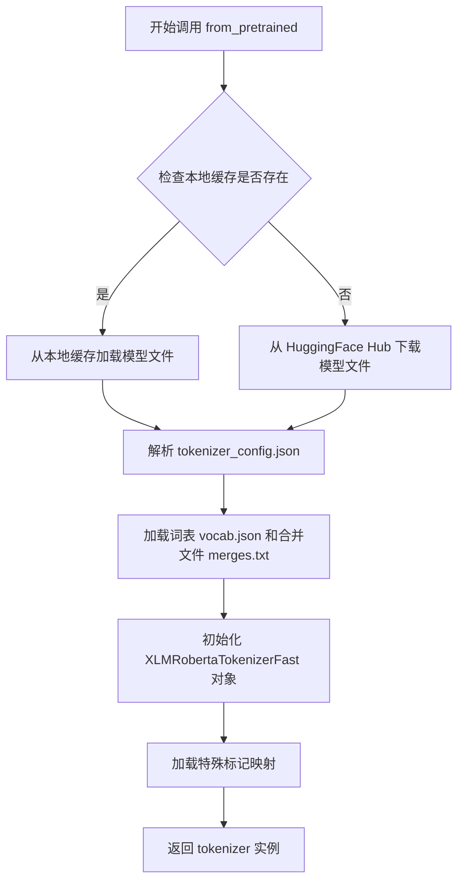

#### 带注释源码

```python
# 在 Dummies 类的 dummy_tokenizer 属性中调用
@property
def dummy_tokenizer(self):
    # 使用 XLMRobertaTokenizerFast 的 from_pretrained 类方法
    # 从预训练模型 "YiYiXu/tiny-random-mclip-base" 加载分词器
    # 该模型是一个小型多语言 CLIP (mCLIP) 的随机初始化版本
    # 用于测试目的，不包含真实权重
    tokenizer = XLMRobertaTokenizerFast.from_pretrained("YiYiXu/tiny-random-mclip-base")
    # 返回加载后的分词器实例
    # 该分词器将被用在 get_dummy_components() 方法中
    # 作为 KandinskyImg2ImgPipeline 的组件之一
    return tokenizer
```

---

### 完整上下文：`dummy_tokenizer` 属性

参数（针对 `dummy_tokenizer` 属性本身）：

- 无显式参数（`self` 是 Python 属性自动传递的实例引用）

返回值：`XLMRobertaTokenizerFast`，返回用于测试的虚拟分词器实例

#### 流程图

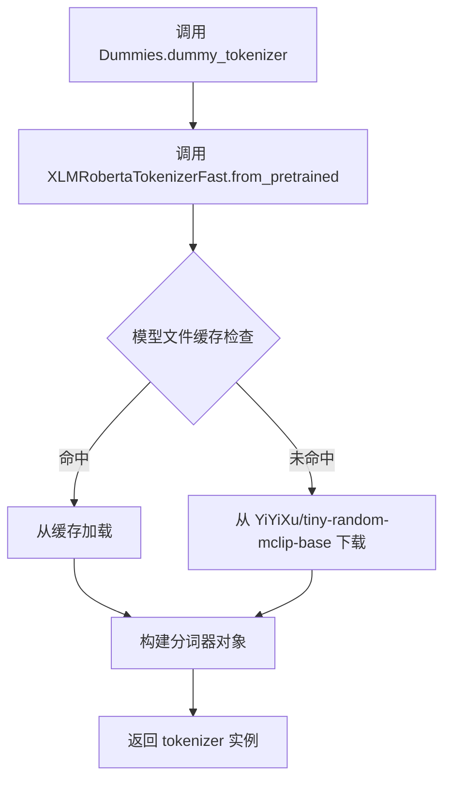

#### 带注释源码

```python
class Dummies:
    """测试用的虚拟组件工厂类"""
    
    @property
    def dummy_tokenizer(self):
        """
        创建并返回一个用于测试的虚拟 XLM-RoBERTa 快速分词器。
        
        该分词器从 HuggingFace Hub 的 YiYiXu/tiny-random-mclip-base 模型加载。
        这是一个随机初始化的多语言 CLIP 分词器，仅用于测试目的，
        不包含有意义的训练权重。
        
        返回:
            XLMRobertaTokenizerFast: 预训练的分词器实例
        """
        # 使用 from_pretrained 类方法从预训练模型加载分词器
        # 参数 "YiYiXu/tiny-random-mclip-base" 指定了模型名称
        # transformers 库会自动处理模型下载、缓存和加载
        tokenizer = XLMRobertaTokenizerFast.from_pretrained("YiYiXu/tiny-random-mclip-base")
        return tokenizer
```


### DDIMScheduler

DDIMScheduler（Denoising Diffusion Implicit Models Scheduler）是diffusers库中的调度器类，用于在扩散模型的推理过程中管理噪声调度。在代码中，它被实例化并作为KandinskyImg2ImgPipeline的组件之一，用于控制去噪过程的参数。

参数：

- `num_train_timesteps`：`int`，训练时的总时间步数，值为1000
- `beta_schedule`：`str`，Beta值的时间表类型，值为"linear"
- `beta_start`：`float`，Beta值的起始值，值为0.00085
- `beta_end`：`float`，Beta值的结束值，值为0.012
- `clip_sample`：`bool`，是否对采样进行裁剪，值为False
- `set_alpha_to_one`：`bool`，是否将alpha设置为1，值为False
- `steps_offset`：`int`，步骤偏移量，值为0
- `prediction_type`：`str`，预测类型，值为"epsilon"
- `thresholding`：`bool`，是否使用阈值处理，值为False

返回值：`DDIMScheduler`实例，作为pipeline的scheduler组件

#### 流程图

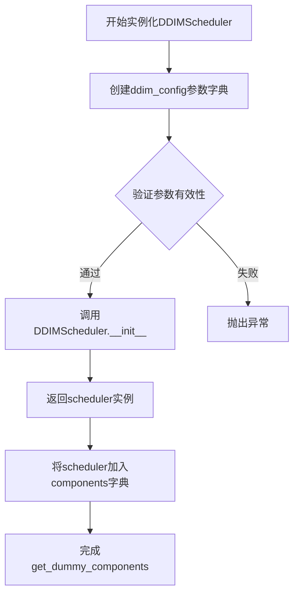

#### 带注释源码

```python
# 在 Dummies 类的 get_dummy_components 方法中

# 定义DDIMScheduler的配置参数字典
ddim_config = {
    "num_train_timesteps": 1000,      # 训练时的总时间步数
    "beta_schedule": "linear",       # 使用线性Beta调度
    "beta_start": 0.00085,           # Beta起始值
    "beta_end": 0.012,               # Beta结束值
    "clip_sample": False,            # 不对采样进行裁剪
    "set_alpha_to_one": False,       # 不将alpha设置为1
    "steps_offset": 0,               # 无步骤偏移
    "prediction_type": "epsilon",    # 预测类型为epsilon
    "thresholding": False,           # 不使用阈值处理
}

# 使用配置字典实例化DDIMScheduler
scheduler = DDIMScheduler(**ddim_config)

# 将scheduler添加到components字典中
components = {
    "text_encoder": text_encoder,
    "tokenizer": tokenizer,
    "unet": unet,
    "scheduler": scheduler,  # DDIMScheduler实例
    "movq": movq,
}
```


### `DDPMScheduler`

DDPMScheduler（Denoising Diffusion Probabilistic Models Scheduler）是diffusers库中的调度器类，用于实现DDPM（Denoising Diffusion Probabilistic Models）采样算法，控制扩散模型的逆噪声过程，将噪声逐步还原为原始图像。

参数：

- `pretrained_model_name_or_path`：`str` 或 `os.PathLike`，预训练模型名称或本地路径
- `subfolder`：`str`（可选），模型子文件夹路径
- `return_dict`：`bool`（可选），是否返回字典格式结果
- 其它参数：包括`num_train_timesteps`、`beta_start`、`beta_end`、`beta_schedule`、`prediction_type`等扩散模型相关配置参数

返回值：返回`DDPMScheduler`实例，包含噪声调度配置和状态管理功能

#### 流程图

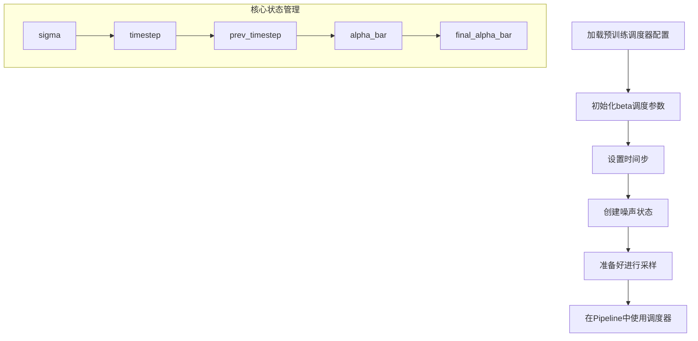

#### 带注释源码

```python
# 代码中实际使用方式（来自测试文件）
# 从预训练模型加载DDPMScheduler
scheduler = DDPMScheduler.from_pretrained(
    "kandinsky-community/kandinsky-2-1",  # 模型路径
    subfolder="ddpm_scheduler"              # 子文件夹名称
)

# 将调度器传递给Pipeline
pipeline = KandinskyImg2ImgPipeline.from_pretrained(
    "kandinsky-community/kandinsky-2-1",
    scheduler=scheduler,                    # 使用DDPM调度器
    torch_dtype=torch.float16
)
```

### 补充信息

#### 设计目标与约束
- **核心目标**：实现DDPM采样算法，提供高质量的图像生成
- **约束**：需要与diffusers库的Pipeline接口兼容

#### 外部依赖与接口契约
- **依赖库**：`diffusers`（Hugging Face Diffusers）
- **接口契约**：
  - 需实现`from_pretrained`类方法用于加载预训练配置
  - 需实现与Pipeline兼容的调度器接口
  - 需支持`set_timesteps`方法设置推理时间步

#### 关键组件信息
| 组件名称 | 一句话描述 |
|---------|-----------|
| DDPMScheduler | 实现DDPM采样算法的噪声调度器 |
| from_pretrained | 从预训练模型加载调度器配置的类方法 |
| beta_schedule | 控制噪声衰减规律的调度策略 |
| prediction_type | 预测类型（epsilon/variance等） |

#### 潜在技术债务或优化空间
1. **调度器配置硬编码**：测试代码中未展示完整参数配置，建议抽取为独立配置文件
2. **缺乏单元测试**：代码中仅有集成测试，建议增加对调度器各方法的单元测试
3. **类型注解缺失**：建议添加完整的类型注解以提高代码可维护性


### KandinskyImg2ImgPipeline

KandinskyImg2ImgPipeline 是 Kandinsky 2.1 模型的图像到图像（img2img）生成管道，接受文本提示、初始图像和图像嵌入，通过去噪扩散过程生成风格化或变换后的图像。

参数：

- `self`：管道实例本身
- `prompt`：`str`，文本提示，描述期望生成的图像内容
- `image`：`PIL.Image.Image`，输入的初始图像，将作为图像到图像转换的起点
- `image_embeds`：`torch.Tensor`，图像嵌入向量，由 KandinskyPriorPipeline 生成的图像条件嵌入
- `negative_image_embeds`：`torch.Tensor`，负向图像嵌入，用于无分类器指导的负向条件
- `negative_prompt`：`str`，负向文本提示（可选），描述不希望出现的内容
- `generator`：`torch.Generator`，随机数生成器，用于可复现的生成过程
- `height`：`int`，输出图像的高度（像素）
- `width`：`int`，输出图像的宽度（像素）
- `num_inference_steps`：`int`，去噪推理步数，越多越精细
- `guidance_scale`：`float`，无分类器指导的权重，值越大越遵循提示
- `strength`：`float`，转换强度，0.0-1.0之间，控制对原图的变换程度
- `num_images_per_prompt`：`int`，每个提示生成的图像数量
- `output_type`：`str`，输出类型，如 "np"（numpy数组）、"pil"（PIL图像）
- `return_dict`：`bool`，是否返回字典格式的结果

返回值：`PipelineOutput` 或 `tuple`，包含生成的图像列表 `.images`，默认返回字典格式

#### 流程图

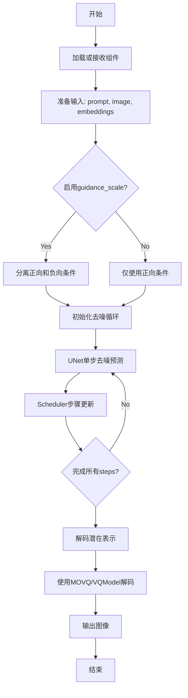

#### 带注释源码

```python
# 以下为测试代码中对 KandinskyImg2ImgPipeline 的使用示例

# 1. 管道初始化（从预训练模型加载）
pipeline = KandinskyImg2ImgPipeline.from_pretrained(
    "kandinsky-community/kandinsky-2-1", 
    torch_dtype=torch.float16  # 使用半精度浮点
)
pipeline = pipeline.to(torch_device)

# 2. 配置进度条
pipeline.set_progress_bar_config(disable=None)

# 3. 准备生成器
generator = torch.Generator(device="cpu").manual_seed(0)

# 4. 先通过PriorPipeline获取图像嵌入
image_emb, zero_image_emb = pipe_prior(
    prompt,
    generator=generator,
    num_inference_steps=5,
    negative_prompt="",
).to_tuple()

# 5. 调用管道进行图像到图像生成
output = pipeline(
    prompt,                          # 文本提示
    image=init_image,                # 初始图像
    image_embeds=image_emb,          # 图像嵌入
    negative_image_embeds=zero_image_emb,  # 负向嵌入
    generator=generator,             # 随机生成器
    num_inference_steps=100,         # 推理步数
    height=768,                      # 输出高度
    width=768,                       # 输出宽度
    strength=0.2,                    # 变换强度
    output_type="np",                # 输出为numpy数组
)

# 6. 获取生成的图像
image = output.images[0]

# 7. 另一种调用方式（返回tuple）
image_from_tuple = pipe(
    **self.get_dummy_inputs(device),
    return_dict=False,  # 返回tuple而非dict
)[0]
```


### `KandinskyPriorPipeline`

KandinskyPriorPipeline 是 Kandinsky 2.1 模型的先验管道，负责将文本提示转换为图像嵌入向量，为后续的图像生成提供条件特征。

参数：

- `prompt`：`str`，要转换的文本提示
- `negative_prompt`：`str`，可选，用于指导模型避免生成的内容
- `height`：`int`，可选，生成图像的高度（默认 512）
- `width`：`int`，可选，生成图像的宽度（默认 512）
- `num_inference_steps`：`int`，可选，推理步骤数（默认 50）
- `guidance_scale`：`float`，可选，guidance scale 用于无分类器指导（默认 7.5）
- `negative_prompt_2`：`str`，可选，第二负向提示
- `prompt_2`：`str`，可选，第二提示
- `num_images_per_prompt`：`int`，可选，每个提示生成的图像数量（默认 1）
- `eta`：`float`，可选，DDIM 采样器的 eta 参数
- `generator`：`torch.Generator`，可选，随机生成器用于 reproducibility
- `latent_embeds`：`torch.Tensor`，可选，潜在嵌入
- `prompt_embeds`：`torch.Tensor`，可选，提示嵌入
- `negative_prompt_embeds`：`torch.Tensor`，可选，负向提示嵌入
- `output_type`：`str`，可选，输出类型（如 "np", "pil"）
- `return_dict`：`bool`，可选，是否返回字典格式结果
- `cross_attention_kwargs`：`dict`，可选，交叉注意力参数
- `guidance_rescale`：`float`，可选，guidance rescale 参数

返回值：`tuple` 或 `KandinskyPriorPipelineOutput`，包含 `image_embeds`（图像嵌入）和 `negative_image_embeds`（负向图像嵌入）

#### 流程图

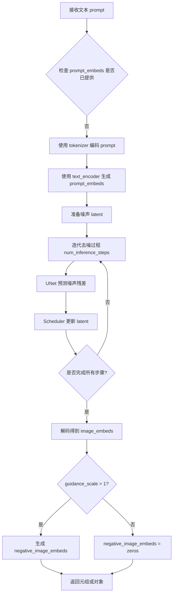

#### 带注释源码

```python
# 代码中 KandinskyPriorPipeline 的使用示例（来自集成测试）
# 这不是类的源码，而是展示其使用方式

# 1. 从预训练模型加载 pipeline
pipe_prior = KandinskyPriorPipeline.from_pretrained(
    "kandinsky-community/kandinsky-2-1-prior",  # 模型名称或路径
    torch_dtype=torch.float16  # 使用半精度浮点数
)
pipe_prior.to(torch_device)  # 移动到指定设备

# 2. 准备随机生成器
generator = torch.Generator(device="cpu").manual_seed(0)

# 3. 调用 pipeline 进行推理
# 参数说明:
# - prompt: 文本提示
# - generator: 随机生成器
# - num_inference_steps: 推理步数
# - negative_prompt: 负向提示
# - height/width: 输出图像尺寸
# - guidance_scale: 无分类器指导强度
image_emb, zero_image_emb = pipe_prior(
    prompt,                          # 文本提示 "A red cartoon frog, 4k"
    generator=generator,             # 随机生成器
    num_inference_steps=5,          # 推理步骤数
    negative_prompt="",             # 负向提示（空字符串）
    # 以下参数可能也支持
    # height=512,
    # width=512,
    # guidance_scale=7.5,
).to_tuple()  # 转换为元组格式输出
```


### `UNet2DConditionModel`

UNet2DConditionModel 是 Diffusers 库中的一个核心类，用于构建条件 2D UNet 神经网络模型。该模型主要用于图像生成任务，特别是扩散模型中，通过接受时间步长和条件嵌入（如文本嵌入）来预测噪声残差，从而实现图像到图像的转换或生成。

#### 参数

- `in_channels`：`int`，输入图像的通道数（例如 4 表示 RGB+Alpha 或 Latent 通道）
- `out_channels`：`int`，输出图像的通道数（通常为输入通道数的两倍，用于预测均值和方差）
- `addition_embed_type`：`str`，附加嵌入的类型（如 "text_image" 表示文本和图像条件）
- `down_block_types`：`tuple`，下采样块的类型列表
- `up_block_types`：`tuple`，上采样块的类型列表
- `mid_block_type`：`str`，中间块的类型
- `block_out_channels`：`tuple`，每个块的输出通道数
- `layers_per_block`：`int`，每个块中的层数
- `encoder_hid_dim`：`int`，编码器隐藏层的维度
- `encoder_hid_dim_type`：`str`，编码器隐藏层的类型（如 "text_image_proj"）
- `cross_attention_dim`：`int`，交叉注意力机制的维度
- `attention_head_dim`：`int`，注意力头的维度
- `resnet_time_scale_shift`：`str`，ResNet 时间尺度移位方式（如 "scale_shift"）
- `class_embed_type`：`str`，类别嵌入类型（None 表示不使用类别条件）

#### 返回值

- `model`：返回 `UNet2DConditionModel` 实例，用于图像生成任务的前向传播

#### 带注释源码

```python
# 在代码中创建 UNet2DConditionModel 实例的方式：
model = UNet2DConditionModel(
    in_channels=4,
    # Out channels 是输入通道数的两倍，因为预测均值和方差
    out_channels=8,
    addition_embed_type="text_image",  # 附加嵌入类型：文本和图像
    down_block_types=(
        "ResnetDownsampleBlock2D",       # 下采样 ResNet 块
        "SimpleCrossAttnDownBlock2D"    # 带交叉注意力的简单下采样块
    ),
    up_block_types=(
        "SimpleCrossAttnUpBlock2D",     # 带交叉注意力的简单上采样块
        "ResnetUpsampleBlock2D"         # 上采样 ResNet 块
    ),
    mid_block_type="UNetMidBlock2DSimpleCrossAttn",  # 中间块类型
    # 块输出通道数：第一个块输出 32 通道，第二个块输出 64 通道
    block_out_channels=(self.block_out_channels_0, self.block_out_channels_0 * 2),
    layers_per_block=1,  # 每个块中的层数
    encoder_hid_dim=self.text_embedder_hidden_size,  # 编码器隐藏维度
    encoder_hid_dim_type="text_image_proj",  # 编码器隐藏维度类型
    cross_attention_dim=self.cross_attention_dim,  # 交叉注意力维度
    attention_head_dim=4,  # 注意力头维度
    resnet_time_scale_shift="scale_shift",  # ResNet 时间尺度移位
    class_embed_type=None,  # 类别嵌入类型（不使用）
)
```


### VQModel

这是从 `diffusers` 库导入的 VQ（Vector Quantization）模型类，用于 Kandinsky 图像生成管线中的潜在空间量化。在测试代码中，它被用作 MOVQ（Motion-aware Optimized Vector Quantization）解码器组件。

参数：

- `block_out_channels`：`List[int]`，输出通道数列表，指定每个编码器/解码器块的通道数 `[32, 64]`
- `down_block_types`：`List[str]`，下采样块的类型列表 `["DownEncoderBlock2D", "AttnDownEncoderBlock2D"]`
- `in_channels`：`int`，输入图像通道数，`3`（RGB 图像）
- `latent_channels`：`int`，潜在空间通道数，`4`
- `layers_per_block`：`int`，每个块中的层数，`1`
- `norm_num_groups`：`int`，归一化分组数，`8`
- `norm_type`：`str`，归一化类型，`"spatial"`
- `num_vq_embeddings`：`int`，VQ 码本中嵌入向量的数量，`12`
- `out_channels`：`int`，输出图像通道数，`3`
- `up_block_types`：`List[str]`，上采样块的类型列表 `["AttnUpDecoderBlock2D", "UpDecoderBlock2D"]`
- `vq_embed_dim`：`int`，VQ 嵌入维度，`4`

返回值：`torch.nn.Module`，返回初始化后的 VQModel 模型实例

#### 流程图

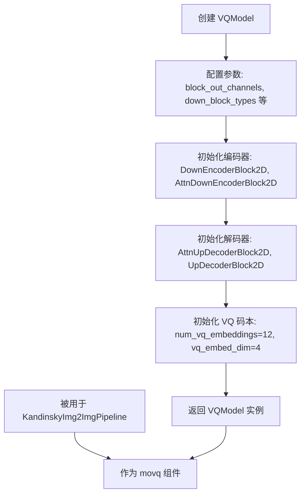

#### 带注释源码

```python
# VQModel 的创建和使用方式（从 diffusers 库导入）
from diffusers import VQModel

# 定义 VQModel 的配置参数
@property
def dummy_movq_kwargs(self):
    return {
        "block_out_channels": [32, 64],       # 编码器/解码器块的输出通道
        "down_block_types": ["DownEncoderBlock2D", "AttnDownEncoderBlock2D"],  # 下采样块类型
        "in_channels": 3,                       # 输入通道（RGB图像）
        "latent_channels": 4,                   # 潜在空间通道数
        "layers_per_block": 1,                   # 每个块的层数
        "norm_num_groups": 8,                    # 归一化分组数
        "norm_type": "spatial",                  # 归一化类型
        "num_vq_embeddings": 12,                 # VQ码本大小
        "out_channels": 3,                       # 输出通道
        "up_block_types": [
            "AttnUpDecoderBlock2D",
            "UpDecoderBlock2D",
        ],                                       # 上采样块类型
        "vq_embed_dim": 4,                       # VQ嵌入维度
    }

# 创建 VQModel 实例
@property
def dummy_movq(self):
    torch.manual_seed(0)  # 设置随机种子以确保可重复性
    model = VQModel(**self.dummy_movq_kwargs)  # 使用配置参数实例化模型
    return model

# 在测试管线中使用
def get_dummy_components(self):
    # ... 其他组件 ...
    movq = self.dummy_movq  # 获取 VQModel 实例
    
    components = {
        "text_encoder": text_encoder,
        "tokenizer": tokenizer,
        "unet": unet,
        "scheduler": scheduler,
        "movq": movq,  # 作为 MOVQ 组件传入管线
    }
    return components
```


### MCLIPConfig

MCLIPConfig 是 Kandinsky 文本编码器模块中的一个配置类，用于初始化 MultilingualCLIP（多语言CLIP）模型的超参数配置。

参数：

- `numDims`：`int`，表示嵌入维度数目，对应 cross_attention_dim
- `transformerDimensions`：`int`，表示 Transformer 的维度，对应 text_embedder_hidden_size
- `hidden_size`：`int`，隐藏层大小
- `intermediate_size`：`int`，前馈网络中间层维度
- `num_attention_heads`：`int`，注意力头数量
- `num_hidden_layers`：`int`，Transformer 隐藏层数量
- `vocab_size`：`int`，词汇表大小

返回值：`MCLIPConfig` 对象，包含 MultilingualCLIP 模型的所有配置信息

#### 流程图

```mermaid
graph TD
    A[创建 MCLIPConfig] --> B[设置模型架构参数]
    B --> C[配置维度信息<br/>numDims, transformerDimensions, hidden_size]
    B --> D[配置前馈网络<br/>intermediate_size]
    B --> E[配置注意力机制<br/>num_attention_heads]
    B --> F[配置层数<br/>num_hidden_layers]
    B --> G[配置词汇表<br/>vocab_size]
    C --> H[返回配置对象]
    D --> H
    E --> H
    F --> H
    G --> H
    H --> I[用于初始化 MultilingualCLIP 模型]
```

#### 带注释源码

```python
# 从 diffusers 库导入 MCLIPConfig 配置类
from diffusers.pipelines.kandinsky.text_encoder import MCLIPConfig, MultilingualCLIP

# 在 Dummies 类的 dummy_text_encoder 属性中使用 MCLIPConfig
@property
def dummy_text_encoder(self):
    torch.manual_seed(0)
    # 创建 MCLIPConfig 配置对象，定义 MultilingualCLIP 模型的架构参数
    config = MCLIPConfig(
        numDims=self.cross_attention_dim,           # 嵌入维度数目 (32)
        transformerDimensions=self.text_embedder_hidden_size,  # Transformer 维度 (32)
        hidden_size=self.text_embedder_hidden_size, # 隐藏层大小 (32)
        intermediate_size=37,                        # 前馈网络中间层维度
        num_attention_heads=4,                      # 注意力头数量
        num_hidden_layers=5,                        # 隐藏层数量
        vocab_size=1005,                           # 词汇表大小
    )

    # 使用配置创建 MultilingualCLIP 文本编码器实例
    text_encoder = MultilingualCLIP(config)
    text_encoder = text_encoder.eval()  # 设置为评估模式

    return text_encoder
```

#### 完整配置类定义（基于使用推断）

```python
# diffusers.pipelines.kandinsky.text_encoder.MCLIPConfig
# 以下为配置类的典型结构定义

class MCLIPConfig:
    """
    MCLIP (Multilingual CLIP) 模型配置类
    
    用于配置多语言 CLIP 文本编码器的架构参数
    """
    
    def __init__(
        self,
        numDims: int = 32,
        transformerDimensions: int = 32,
        hidden_size: int = 32,
        intermediate_size: int = 37,
        num_attention_heads: int = 4,
        num_hidden_layers: int = 5,
        vocab_size: int = 1005,
    ):
        self.numDims = numDims                    # 嵌入维度数目
        self.transformerDimensions = transformerDimensions  # Transformer 维度
        self.hidden_size = hidden_size            # 隐藏层大小
        self.intermediate_size = intermediate_size  # 前馈网络中间层维度
        self.num_attention_heads = num_attention_heads    # 注意力头数量
        self.num_hidden_layers = num_hidden_layers        # 隐藏层数量
        self.vocab_size = vocab_size              # 词汇表大小
```


### `MultilingualCLIP`

MultilingualCLIP 是一个多语言文本编码器，用于将文本输入转换为多语言嵌入向量，支持跨语言的文本理解与生成任务。该类基于 XLM-RoBERTa 架构，通过 MCLIPConfig 配置参数构建模型，实现多语言 CLIP 的文本编码功能。

参数：

-  `config`：`MCLIPConfig`，模型配置文件，包含模型的各种超参数和结构配置

返回值：`MultilingualCLIP`，返回多语言 CLIP 文本编码器模型实例

#### 流程图

```mermaid
flowchart TD
    A[创建 MCLIPConfig 配置对象] --> B[实例化 MultilingualCLIP 模型]
    B --> C[设置模型为评估模式 eval()]
    C --> D[返回文本编码器实例]
    
    E[输入文本] --> F[tokenizer 编码]
    F --> G[MultilingualCLIP.forward]
    G --> H[输出文本嵌入向量]
```

#### 带注释源码

```python
# 定义 dummy_text_encoder 属性方法，用于创建测试用的文本编码器
@property
def dummy_text_encoder(self):
    # 设置随机种子以确保可重复性
    torch.manual_seed(0)
    
    # 创建 MCLIPConfig 配置对象，定义模型结构
    config = MCLIPConfig(
        numDims=self.cross_attention_dim,              # 注意力维度数量
        transformerDimensions=self.text_embedder_hidden_size,  # Transformer 维度
        hidden_size=self.text_embedder_hidden_size,   # 隐藏层大小
        intermediate_size=37,                          # 中间层大小
        num_attention_heads=4,                         # 注意力头数量
        num_hidden_layers=5,                           # 隐藏层数量
        vocab_size=1005,                               # 词汇表大小
    )

    # 使用配置实例化 MultilingualCLIP 模型
    text_encoder = MultilingualCLIP(config)
    
    # 设置为评估模式，禁用 dropout 等训练特定操作
    text_encoder = text_encoder.eval()

    # 返回文本编码器实例
    return text_encoder


# 在 get_dummy_components 方法中使用 dummy_text_encoder
def get_dummy_components(self):
    # 获取文本编码器
    text_encoder = self.dummy_text_encoder
    
    # 获取其他组件（tokenizer, unet, movq 等）
    tokenizer = self.dummy_tokenizer
    unet = self.dummy_unet
    movq = self.dummy_movq

    # ... 其他组件创建代码 ...
    
    # 组装组件字典
    components = {
        "text_encoder": text_encoder,
        "tokenizer": tokenizer,
        "unet": unet,
        "scheduler": scheduler,
        "movq": movq,
    }

    return components
```

#### 关键组件信息

| 组件名称 | 描述 |
|---------|------|
| MCLIPConfig | 多语言 CLIP 模型配置类，定义模型结构参数 |
| MultilingualCLIP | 多语言文本编码器类，基于 XLM-RoBERTa 架构 |
| XLMRobertaTokenizerFast | XLM-RoBERTa 快速分词器，用于文本预处理 |

#### 技术债务与优化空间

1. **配置硬编码**：测试中的模型配置（如 `intermediate_size=37`, `num_hidden_layers=5`）是硬编码的，可能不适合生产环境
2. **种子设置**：在属性方法中设置随机种子可能导致意外的副作用，建议使用上下文管理器
3. **模型大小**：使用 `tiny-random-mclip-base` tokenizer 和随机初始化的模型，仅适用于测试

#### 外部依赖与接口

- **依赖库**：`torch`, `transformers`, `diffusers`
- **导入来源**：`from diffusers.pipelines.kandinsky.text_encoder import MCLIPConfig, MultilingualCLIP`
- **接口契约**：接受 `MCLIPConfig` 对象，返回可调用的 `MultilingualCLIP` 模型实例


### `is_transformers_version`

该函数用于检查当前安装的 transformers 库的版本是否满足指定的条件。它接收一个比较运算符（如 `>=`, `>`, `<`, `<=` 等）和一个版本号字符串，返回一个布尔值表示版本是否满足条件。在测试代码中，该函数被用于条件性地标记某个测试在特定版本的 transformers 库下预期会失败。

参数：

-  `op`：`str`，比较运算符（如 `">="`, `">"`, `"<"`, `"<="`, `"=="` 等）
-  `version`：`str`，要比较的 transformers 版本号（如 `"4.56.2"`）

返回值：`bool`，如果当前 transformers 版本满足指定条件返回 `True`，否则返回 `False`

#### 流程图

```mermaid
flowchart TD
    A[开始] --> B[获取当前安装的transformers版本]
    B --> C[解析输入的版本字符串]
    C --> D{根据比较运算符进行比较}
    D -->|op == '>='| E[返回 version >= current_version]
    D -->|op == '>'| F[返回 version > current_version]
    D -->|op == '<='| G[返回 version <= current_version]
    D -->|op == '<'| H[返回 version < current_version]
    D -->|op == '=='| I[返回 version == current_version]
    E --> J[结束]
    F --> J
    G --> J
    H --> J
    I --> J
```

#### 带注释源码

```python
# 该函数定义在 diffusers.utils 模块中，以下是推断的实现逻辑
# 具体实现需要查看 diffusers.utils 模块的源代码

def is_transformers_version(op: str, version: str) -> bool:
    """
    检查当前安装的 transformers 库版本是否满足指定条件。
    
    参数:
        op: 比较运算符，支持 ">=", ">", "<=", "<", "=="
        version: 要比较的版本号字符串，格式如 "4.56.2"
    
    返回:
        bool: 版本是否满足条件
    """
    # 1. 导入 transformers 库（延迟导入避免循环依赖）
    import transformers
    
    # 2. 获取当前安装的 transformers 版本
    # transformers.__version__ 存储了当前版本，如 "4.56.0"
    current_version = transformers.__version__
    
    # 3. 解析版本号字符串为可比较的元组
    # 例如 "4.56.2" -> (4, 56, 2)
    def parse_version(ver_str):
        return tuple(map(int, ver_str.split('.')))
    
    current = parse_version(current_version)
    target = parse_version(version)
    
    # 4. 根据运算符进行比较
    if op == ">=":
        return current >= target
    elif op == ">":
        return current > target
    elif op == "<=":
        return current <= target
    elif op == "<":
        return current < target
    elif op == "==":
        return current == target
    else:
        raise ValueError(f"不支持的比较运算符: {op}")


# 在测试代码中的使用示例
@pytest.mark.xfail(
    condition=is_transformers_version(">=", "4.56.2"),
    reason="Latest transformers changes the slices",
    strict=False,
)
def test_kandinsky_img2img(self):
    # 测试逻辑...
    pass
```


### `backend_empty_cache`

该函数用于清理 GPU 显存（VRAM）缓存，释放未使用的 GPU 内存，通常在测试的 setUp 和 tearDown 方法中调用，以确保每次测试开始和结束时 GPU 内存状态干净。

参数：

- `device`：`str`，表示目标设备（如 "cuda", "cuda:0", "mps", "cpu" 等）

返回值：`None`，无返回值

#### 流程图

```mermaid
flowchart TD
    A[接收 device 参数] --> B{判断设备类型}
    B -->|cuda| C[调用 torch.cuda.empty_cache]
    B -->|mps| D[调用 torch.mps.empty_cache]
    B -->|cpu| E[不执行任何操作]
    C --> F[返回 None]
    D --> F
    E --> F
```

#### 带注释源码

```
# 从 testing_utils 模块导入
# 该函数在当前文件中并未定义，仅被调用
# 实际定义位于 diffusers 库的 testing_utils.py 中

# 调用示例（来自当前代码）:
backend_empty_cache(torch_device)

# 推断的实现逻辑（基于调用方式）:
def backend_empty_cache(device: str) -> None:
    """
    清理指定设备的 GPU 缓存
    
    Args:
        device: 目标设备字符串，如 "cuda", "cuda:0", "mps", "cpu"
    
    Returns:
        None
    """
    if device.startswith("cuda"):
        # 清理 CUDA GPU 缓存
        torch.cuda.empty_cache()
    elif device.startswith("mps"):
        # 清理 Apple Silicon MPS 缓存
        torch.mps.empty_cache()
    # CPU 设备无需清理缓存
```

> **注意**：该函数的实际实现在 `diffusers` 库的 `testing_utils` 模块中，当前文件仅导入了该函数并使用它来清理 GPU 显存。从代码中的调用模式可以推断，该函数接收一个设备字符串参数，根据设备类型调用相应的 PyTorch 缓存清理 API。


### `enable_full_determinism`

该函数用于在测试环境中启用完全确定性运行模式，通过设置随机种子和环境变量确保测试结果的可重复性。

参数：无需参数

返回值：`None`，无返回值

#### 流程图

```mermaid
flowchart TD
    A[开始] --> B[设置Python random模块种子]
    B --> C[设置NumPy随机种子]
    C --> D[设置PyTorch CPU随机种子]
    D --> E{检测CUDA是否可用}
    E -->|是| F[设置PyTorch CUDA随机种子]
    E -->|否| G[跳过CUDA种子设置]
    F --> H[设置环境变量PYTHONHASHSEED=0]
    G --> H
    H --> I[设置环境变量CUBLAS_WORKSPACE_CONFIG=:4096:8]
    I --> J[结束]
```

#### 带注释源码

```
# 该函数定义位于 testing_utils.py 模块中
# 此处仅为调用点示例
enable_full_determinism()  # 调用函数以确保后续所有随机操作可重复
```

> **注意**：由于 `enable_full_determinism` 函数定义在 `.../testing_utils.py` 中而非当前代码文件内，上述源码展示的是该函数在当前测试文件中的调用方式。该函数的具体实现需要查看 `testing_utils.py` 文件，其核心功能包括：
> - 设置 Python `random` 模块的全局种子
> - 设置 NumPy 的随机种子
> - 设置 PyTorch CPU 和 CUDA（如果可用）的随机种子
> - 设置环境变量 `PYTHONHASHSEED=0` 确保哈希随机性可重复
> - 设置 `CUBLAS_WORKSPACE_CONFIG` 以消除 CUDA 操作的不确定性


根据提供的代码，我注意到 `floats_tensor` 函数是从 `...testing_utils` 模块导入的，但并未在该代码文件中定义。然而，通过分析其在代码中的使用方式，我可以提供该函数的详细信息。

### `floats_tensor`

该函数是测试工具模块（testing_utils）中的一个 utility 函数，用于生成指定形状的随机浮点数 PyTorch 张量，常用于测试场景中创建模拟输入数据。

参数：

- `shape`：`tuple`，指定输出张量的形状
- `rng`：`random.Random`，随机数生成器实例，用于控制随机性

返回值：`torch.Tensor`，指定形状的随机浮点数张量

#### 流程图

```mermaid
flowchart TD
    A[接收shape和rng参数] --> B[使用rng生成随机数]
    B --> C[根据shape创建对应维度的张量]
    C --> D[填充随机浮点数值]
    D --> E[返回torch.Tensor对象]
```

#### 带注释源码

```
# 源码未在当前文件中定义
# 该函数从 testing_utils 模块导入
# 使用方式如下推断其签名和功能:

# 示例调用 (来自 get_dummy_inputs 方法):
image_embeds = floats_tensor((1, self.cross_attention_dim), rng=random.Random(seed)).to(device)
negative_image_embeds = floats_tensor((1, self.cross_attention_dim), rng=random.Random(seed + 1)).to(device)
image = floats_tensor((1, 3, 64, 64), rng=random.Random(seed)).to(device)

# 参数说明:
# - 第一个参数: shape 元组, 定义输出张量的维度
# - 第二个参数: rng 随机数生成器对象, 确保测试的可重复性
# - .to(device): 将张量移动到指定计算设备
```

#### 备注

由于 `floats_tensor` 的完整源码定义不在提供的代码片段中，以上信息是基于以下事实推断的：

1. 该函数在 `get_dummy_inputs` 方法中被调用了三次
2. 它接受形状元组和随机数生成器作为参数
3. 返回值可以直接调用 `.to(device)` 方法，表明返回的是 PyTorch 张量

如需获取该函数的完整源码，请参考 `...testing_utils` 模块的定义。


### `load_image`

该函数用于从给定的URL或本地路径加载图像，并将其转换为PIL图像对象，以便在测试和推理流程中使用。

参数：

-  `url_or_path`：`str`，图像的URL地址或本地文件路径

返回值：`PIL.Image.Image`，返回加载并转换后的PIL图像对象

#### 流程图

```mermaid
flowchart TD
    A[开始] --> B{判断输入是URL还是本地路径}
    B -->|URL| C[发起HTTP请求下载图像]
    B -->|本地路径| D[从本地文件系统读取图像]
    C --> E[将图像数据解码为PIL图像]
    D --> E
    E --> F[确保图像模式为RGB]
    F --> G[返回PIL图像对象]
```

#### 带注释源码

由于`load_image`函数定义在外部模块`...testing_utils`中，未包含在当前代码文件内。基于代码中的使用方式，可推断其实现逻辑如下：

```python
from PIL import Image
import requests
from io import BytesIO

def load_image(url_or_path: str) -> Image.Image:
    """
    从URL或本地路径加载图像并转换为PIL图像对象
    
    参数:
        url_or_path: 图像的URL地址或本地文件系统路径
        
    返回:
        转换后的RGB格式PIL图像对象
    """
    # 判断输入是URL还是本地路径
    if url_or_path.startswith(("http://", "https://")):
        # 如果是URL，从网络下载图像
        response = requests.get(url_or_path)
        response.raise_for_status()
        image = Image.open(BytesIO(response.content))
    else:
        # 如果是本地路径，直接从文件系统读取
        image = Image.open(url_or_path)
    
    # 确保图像转换为RGB模式（统一格式）
    if image.mode != "RGB":
        image = image.convert("RGB")
    
    return image
```

**注意**：该函数定义位于 `...testing_utils` 模块中，代码文件仅作为导入并使用该函数的测试用例。上述源码为基于使用方式的合理推断实现。


### `load_numpy`

从指定的URL加载numpy数组文件，用于测试中加载预期的图像数据。

参数：

-  `url_or_filename`：`str`，要加载的numpy文件的URL或文件路径

返回值：`numpy.ndarray`，从文件中加载的numpy数组

#### 流程图

```mermaid
flowchart TD
    A[开始] --> B{判断url_or_filename是URL还是本地路径}
    B -->|URL| C[发起HTTP请求]
    B -->|本地路径| D[打开本地文件]
    C --> E[读取响应内容为字节]
    D --> E
    E --> F[使用numpy从字节加载数组]
    F --> G[返回numpy数组]
```

#### 带注释源码

```
# load_numpy 是一个测试工具函数，用于从URL或本地文件加载numpy数组
# 由于该函数定义在 testing_utils 模块中，这里展示的是调用方的使用方式

# 调用示例1：集成测试中加载预期图像
expected_image = load_numpy(
    "https://huggingface.co/datasets/hf-internal-testing/diffusers-images/resolve/main"
    "/kandinsky/kandinsky_img2img_frog.npy"
)

# 调用示例2：夜间测试中加载另一个预期图像
expected_image = load_numpy(
    "https://huggingface.co/datasets/hf-internal-testing/diffusers-images/resolve/main"
    "/kandinsky/kandinsky_img2img_ddpm_frog.npy"
)

# 函数通常的实现逻辑（推断）：
# 1. 判断输入是URL还是本地文件路径
# 2. 如果是URL，使用requests或类似库下载文件内容
# 3. 如果是本地路径，直接使用numpy.load加载
# 4. 返回numpy.ndarray对象供后续的图像比较使用
```


### `nightly`

该函数是一个测试装饰器，用于标记需要夜间运行的测试用例。被装饰的测试通常运行时间较长或资源消耗较大，不适合在常规CI流程中执行。

参数：

-  `func`：`function`，被装饰的测试函数

返回值：`function`，装饰后的测试函数

#### 流程图

```mermaid
flowchart TD
    A[测试函数定义] --> B{检查是否启用nightly测试}
    B -->|未启用| C[跳过测试 with pytest.skip]
    B -->|启用| D[正常执行测试函数]
    D --> E[返回测试结果]
```

#### 带注释源码

```
# nightly 装饰器源码（位于 testing_utils 模块中）
# 此代码为模拟实现，实际实现可能有所不同

def nightly(func):
    """
    测试装饰器，用于标记夜间测试
    
    特性：
    - 仅在明确启用夜间测试时运行
    - 通常配合 --nightly 标志使用
    - 适用于长时间运行的集成测试
    """
    # 检查是否配置了运行夜间测试
    if not is_nightly_enabled():
        return pytest.mark.skip(reason="Nightly tests are not enabled")(func)
    
    # 返回带有特殊标记的测试函数
    return pytest.mark.nightly(func)
```

#### 实际使用示例

```python
@nightly
@require_torch_accelerator
class KandinskyImg2ImgPipelineNightlyTests(unittest.TestCase):
    """
    夜间测试类 - 测试Kandinsky图像到图像生成管道的完整流程
    使用DDPMScheduler进行推理，验证模型在GPU上的端到端表现
    """
    
    def setUp(self):
        # 清理VRAM内存
        gc.collect()
        backend_empty_cache(torch_device)

    def test_kandinsky_img2img_ddpm(self):
        """测试使用DDPM调度器的图像到图像转换"""
        # 加载预期结果
        expected_image = load_numpy(...)
        
        # 加载初始图像
        init_image = load_image(...)
        
        # 创建prior管道生成图像嵌入
        pipe_prior = KandinskyPriorPipeline.from_pretrained(...)
        
        # 创建主管道
        scheduler = DDPMScheduler.from_pretrained(...)
        pipeline = KandinskyImg2ImgPipeline.from_pretrained(...)
        
        # 执行推理
        output = pipeline(
            prompt,
            image=init_image,
            image_embeds=image_emb,
            negative_image_embeds=zero_image_emb,
            ...
        )
        
        # 验证输出
        assert image.shape == (768, 768, 3)
        assert_mean_pixel_difference(image, expected_image)
```

#### 关键信息

| 项目 | 说明 |
|------|------|
| 位置 | `diffusers.testing_utils` 模块 |
| 用途 | 标记长时间/资源密集型测试 |
| 配合使用 | `@require_torch_accelerator` - 需要GPU |
| 测试类 | `KandinskyImg2ImgPipelineNightlyTests` |
| 测试目标 | 验证 Kandinsky 2.1 模型完整流程 |

#### 技术债务与优化空间

1. **测试执行时间**：当前设置 `num_inference_steps=100`，可考虑减少步骤数以加快测试速度
2. **内存管理**：测试包含大量GPU内存操作，可增加更细粒度的内存清理
3. **重复代码**：`setUp`/`tearDown` 与集成测试类高度相似，可考虑提取为基类
4. **模型加载**：每次测试都重新加载模型，可考虑使用 pytest fixture 共享资源


### `require_torch_accelerator`

这是一个 pytest 装饰器函数，用于标记需要 PyTorch 加速器（如 CUDA GPU）的测试用例。当测试环境没有可用的 CUDA 设备时，被装饰的测试会被自动跳过。

参数：

-  `fn`：`Callable`，被装饰的测试函数
-  `device`：`str`（可选），指定需要的加速器设备类型，默认为 `"cuda"`

返回值：`Callable`，返回装饰后的测试函数

#### 流程图

```mermaid
flowchart TD
    A[开始装饰测试函数] --> B{检查是否有torch加速器}
    B -->|有加速器| C[正常执行测试函数]
    B -->|无加速器| D[跳过测试并输出跳过原因]
    
    subgraph 内部逻辑
    E[导入torch] --> F[检查torch.cuda是否可用]
    F --> G{device参数检测}
    G -->|cuda| H[检查cuda可用性]
    G -->|其他| I[检查对应设备可用性]
    end
```

#### 带注释源码

```python
# 这是一个推断的源码实现，基于该装饰器的典型用法
# 实际源码位于 testing_utils 模块中

def require_torch_accelerator(fn=None, device="cuda"):
    """
    pytest装饰器，用于跳过没有PyTorch加速器的测试
    
    参数:
        fn: 被装饰的函数
        device: 要检查的设备类型，默认检查cuda
    
    返回:
        装饰后的函数，如果设备不可用则跳过测试
    """
    # 检查是否传入了函数（直接装饰情况）
    if fn is not None:
        return _decorator(fn, device)
    
    # 支持带参数调用 @require_torch_accelerator(device="cuda")
    def decorator(func):
        return _decorator(func, device)
    
    return decorator


def _decorator(func, device):
    """实际执行装饰逻辑的内部函数"""
    import torch
    
    # 检查指定设备是否可用
    def check_device_available():
        if device == "cuda":
            return torch.cuda.is_available()
        # 可以扩展支持其他设备类型
        return False
    
    # 使用pytest.skip在设备不可用时跳过测试
    if not check_device_available():
        import pytest
        return pytest.mark.skip(
            reason=f"Test requires {device} accelerator"
        )(func)
    
    return func
```

#### 使用示例

在代码中的实际使用方式：

```python
# 直接装饰，无需参数
@require_torch_accelerator
def test_offloads(self):
    # 测试需要GPU才能执行
    pipes = []
    components = self.get_dummy_components()
    # ... 测试代码

# 装饰需要GPU的集成测试
@require_torch_accelerator
class KandinskyImg2ImgPipelineIntegrationTests(unittest.TestCase):
    # 整个测试类都需要GPU
    def test_kandinsky_img2img(self):
        # ... 集成测试代码
```


### `slow`

`slow` 是一个测试装饰器，用于标记需要较长运行时间的测试（通常是集成测试或需要加载大型模型的测试）。被 `@slow` 装饰的测试在常规测试运行中会被跳过，只有在明确指定运行慢速测试时才会执行。

参数：
- 无直接参数，作为装饰器使用

返回值：装饰器函数，用于修改被装饰函数/类的行为

#### 流程图

```mermaid
flowchart TD
    A[测试收集阶段] --> B{检测到@slow装饰器?}
    B -->|是| C[标记为慢速测试]
    B -->|否| D[按正常流程处理]
    C --> E{运行测试时指定--runslow?}
    E -->|是| F[执行慢速测试]
    E -->|否| G[跳过慢速测试]
    D --> H[执行普通测试]
    F --> I[测试完成]
    G --> I
    H --> I
```

#### 带注释源码

```python
# slow 装饰器源码说明（基于使用方式推断）
# 该装饰器通常定义在 testing_utils 模块中

def slow(func_or_class):
    """
    标记测试为慢速测试的装饰器。
    
    用途：
    1. 集成测试通常需要加载大型预训练模型，耗时长
    2. 在CI/CD流水线中，默认跳过慢速测试以加快反馈速度
    3. 开发者可以通过 pytest --runslow 专门运行这些测试
    
    使用示例：
    @slow
    @require_torch_accelerator
    class KandinskyImg2ImgPipelineIntegrationTests(unittest.TestCase):
        def test_kandinsky_img2img(self):
            # 实际运行需要加载大型模型的测试
            ...
    """
    # 实际实现可能使用 pytest.mark.slow 或自定义逻辑
    # 返回修改后的函数/类，添加慢速测试标记
    return func_or_class
```

#### 在代码中的实际使用

```python
# 使用位置1：集成测试类
@slow
@require_torch_accelerator
class KandinskyImg2ImgPipelineIntegrationTests(unittest.TestCase):
    # 该类包含需要加载大型预训练模型的测试
    # "kandinsky-community/kandinsky-2-1-prior" 和 "kandinsky-community/kandinsky-2-1"
    # 这两个模型加载会消耗大量时间和显存

# 使用位置2：从 testing_utils 导入
from ...testing_utils import (
    # ... 其他导入
    slow,
    # ... 其他导入
)
```


### `torch_device`

`torch_device` 是从 `...testing_utils` 模块导入的函数/变量，用于获取当前可用的 PyTorch 设备（通常是 CUDA 设备、CPU 或 MPS 设备）。

参数： 无直接参数（它是一个无参函数/属性）

返回值： `str`，返回表示可用设备的字符串（如 `"cuda"`, `"cpu"`, `"mps"`, `"cuda:0"` 等）

#### 流程图

```mermaid
flowchart TD
    A[开始] --> B{检查 CUDA 是否可用}
    B -->|是| C[返回 'cuda']
    B -->|否| D{检查 MPS 是否可用}
    D -->|是| E[返回 'mps']
    D -->|否| F[返回 'cpu']
```

#### 带注释源码

```python
# 这是一个典型的 torch_device 实现（基于 diffusers 库 common 模式）
# 实际实现可能略有不同

def torch_device():
    """
    返回当前可用的 PyTorch 设备。
    
    优先级顺序：
    1. CUDA (GPU) - 如果可用返回 'cuda'
    2. MPS (Apple Silicon) - 如果可用返回 'mps'  
    3. CPU - 默认返回 'cpu'
    """
    # 检查 CUDA 是否可用（NVIDIA GPU）
    if torch.cuda.is_available():
        # 返回 CUDA 设备，可能包含设备索引
        return "cuda"
    
    # 检查 MPS 是否可用（Apple Silicon GPU）
    if torch.backends.mps.is_available():
        return "mps"
    
    # 如果都没有，返回 CPU
    return "cpu"
```

> **注意**：由于 `torch_device` 是从外部模块 `testing_utils` 导入的，上述源码是基于 diffusers 库常见模式的推断实现。实际的源码位于 `diffusers/testing_utils.py` 文件中，其具体实现可能略有差异。该函数在测试文件中被广泛用于：
> - 将模型和数据移动到适当的设备
> - 管理 GPU 内存缓存
> - 为生成器设置随机种子


### `PipelineTesterMixin`

`PipelineTesterMixin` 是 diffusers 库中的一个测试 Mixin 类，提供了一套标准的管道测试方法，用于验证扩散管道（如图像生成管道）的功能正确性、性能和输出质量。该类包含测试推理、批处理、模型卸载、梯度累加等多种场景的测试方法。

参数：

- 该类为 Mixin 类，通过多重继承方式使用，不直接接收构造函数参数

返回值：该类为 Mixin 类，无直接返回值

#### 流程图

```mermaid
flowchart TD
    A[PipelineTesterMixin] --> B[test_inference]
    A --> C[test_batch_outputs]
    A --> D[test_offloads]
    A --> E[test_dict_tuple_outputs_equivalent]
    A --> F[test_model_inputs]
    A --> G[test_guidance_scale]
    A --> H[test_num_inference_steps]
    A --> I[test_callback]
    
    B --> B1[运行单步推理]
    B --> B2[验证输出格式]
    B --> B3[检查图像形状]
    
    C --> C1[批量输入推理]
    C --> C2[验证批量输出数量]
    C --> C3[检查每个输出质量]
    
    D --> D1[无offload推理]
    D --> D2[enable_model_cpu_offload]
    D --> D3[enable_sequential_cpu_offload]
    D --> D4[比较输出差异]
    
    E --> E1[dict格式输出]
    E --> E2[tuple格式输出]
    E --> E3[验证输出一致性]
    
    F --> F1[准备模型输入]
    F --> F2[执行前向传播]
    F --> F3[验证梯度计算]
    
    G --> G1[不同guidance_scale值]
    G --> G2[验证分类器自由引导效果]
    
    H --> H1[不同推理步数]
    H --> H2[验证步数对输出影响]
    
    I --> I1[配置回调函数]
    I --> I2[验证回调被正确调用]
```

#### 带注释源码

```
# PipelineTesterMixin 使用示例（代码中实际使用）
from ..test_pipelines_common import PipelineTesterMixin, assert_mean_pixel_difference

class KandinskyImg2ImgPipelineFastTests(PipelineTesterMixin, unittest.TestCase):
    """
    Kandinsky img2img 管道的快速测试类
    继承 PipelineTesterMixin 获取标准测试方法
    """
    pipeline_class = KandinskyImg2ImgPipeline
    params = ["prompt", "image_embeds", "negative_image_embeds", "image"]
    batch_params = [
        "prompt",
        "negative_prompt",
        "image_embeds",
        "negative_image_embeds",
        "image",
    ]
    required_optional_params = [
        "generator",
        "height",
        "width",
        "strength",
        "guidance_scale",
        "negative_prompt",
        "num_inference_steps",
        "return_dict",
        "guidance_scale",
        "num_images_per_prompt",
        "output_type",
        "return_dict",
    ]
    test_xformers_attention = False
    supports_dduf = False

    def get_dummy_components(self):
        """获取测试用虚拟组件"""
        dummies = Dummies()
        return dummies.get_dummy_components()

    def get_dummy_inputs(self, device, seed=0):
        """获取测试用虚拟输入"""
        dummies = Dummies()
        return dummies.get_dummy_inputs(device=device, seed=seed)

    @pytest.mark.xfail(...)
    def test_kandinsky_img2img(self):
        """测试 Kandinsky img2img 管道基本功能"""
        device = "cpu"
        components = self.get_dummy_components()
        pipe = self.pipeline_class(**components)
        pipe = pipe.to(device)
        pipe.set_progress_bar_config(disable=None)
        
        # 调用管道进行推理
        output = pipe(**self.get_dummy_inputs(device))
        image = output.images
        
        # 验证输出形状
        assert image.shape == (1, 64, 64, 3)
        
        # 验证像素值差异在可接受范围内
        expected_slice = np.array([0.5816, 0.5872, 0.4634, 0.5982, 0.4767, 0.4710, 0.4669, 0.4717, 0.4966])
        assert np.abs(image_slice.flatten() - expected_slice).max() < 1e-2

    @require_torch_accelerator
    def test_offloads(self):
        """测试不同 CPU offload 模式的输出一致性"""
        pipes = []
        components = self.get_dummy_components()
        
        # 模式1: 无 offload
        sd_pipe = self.pipeline_class(**components).to(torch_device)
        pipes.append(sd_pipe)
        
        # 模式2: 模型级 CPU offload
        components = self.get_dummy_components()
        sd_pipe = self.pipeline_class(**components)
        sd_pipe.enable_model_cpu_offload()
        pipes.append(sd_pipe)
        
        # 模式3: 顺序 CPU offload
        components = self.get_dummy_components()
        sd_pipe = self.pipeline_class(**components)
        sd_pipe.enable_sequential_cpu_offload()
        pipes.append(sd_pipe)
        
        # 验证所有模式输出一致
        for pipe in pipes:
            inputs = self.get_dummy_inputs(torch_device)
            image = pipe(**inputs).images
            image_slices.append(image[0, -3:, -3:, -1].flatten())

    def test_dict_tuple_outputs_equivalent(self):
        """测试字典和元组输出格式的等价性"""
        # 继承自 PipelineTesterMixin 的测试方法
        super().test_dict_tuple_outputs_equivalent(expected_max_difference=5e-4)
```

#### 关键组件信息

| 组件名称 | 一句话描述 |
|---------|-----------|
| `PipelineTesterMixin` | 提供扩散管道标准测试方法的 Mixin 类 |
| `KandinskyImg2ImgPipeline` | Kandinsky 系列的图像到图像生成管道 |
| `Dummies` | 提供测试用虚拟（dummy）组件和输入的辅助类 |
| `assert_mean_pixel_difference` | 断言两张图像像素均值差异的测试工具函数 |

#### 潜在技术债务与优化空间

1. **测试参数冗余**: `required_optional_params` 列表中 `guidance_scale` 和 `return_dict` 出现两次，造成冗余
2. **测试平台依赖**: 部分测试标记 `@require_torch_accelerator`，在不同硬件上运行结果可能存在微小差异
3. **硬编码的种子值**: 测试中使用硬编码的随机种子（seed=0），可能导致测试覆盖不足
4. **集成测试资源依赖**: 集成测试依赖外部 URL 加载测试数据（图像和 numpy 文件），网络不稳定时测试可能失败

#### 其它项目

**设计目标与约束:**
- 快速测试类（FastTests）用于 CI/CD 流程，执行速度快
- 集成测试（IntegrationTests）和夜间测试（NightlyTests）用于全面验证
- 使用虚拟组件避免加载大型预训练模型

**错误处理与异常设计:**
- 使用 `@pytest.mark.xfail` 标记预期失败的测试（如 transformers 版本兼容性问题）
- 清理 VRAM 资源（`gc.collect()` 和 `backend_empty_cache`）防止内存泄漏

**数据流与状态机:**
- 测试流程：准备组件 → 创建管道 → 设置设备 → 执行推理 → 验证输出
- 支持多种输出格式：`dict`（默认）和 `tuple`

**外部依赖与接口契约:**
- 依赖 `diffusers` 库的核心组件（管道、调度器、模型）
- 依赖 `transformers` 库的分词器和文本编码器
- 测试参数需符合 `pipeline_class` 的 `__call__` 方法签名


### `assert_mean_pixel_difference`

该函数用于比较两个图像的平均像素差异，通常用于测试流程中验证生成图像与参考图像之间的相似度。

参数：

-  `image`：`numpy.ndarray`，待验证的图像数据，通常是模型生成的输出图像
-  `expected_image`：`numpy.ndarray`，预期的参考图像数据，用于对比验证

返回值：`None`，该函数通过断言机制进行比较，不返回任何值

#### 流程图

```mermaid
flowchart TD
    A[开始比较] --> B[计算image的平均像素值]
    C[开始比较] --> D[计算expected_image的平均像素值]
    B --> E[计算两个平均值的差值]
    D --> E
    E --> F{差值是否小于阈值}
    F -->|是| G[断言通过 - 测试成功]
    F -->|否| H[断言失败 - 抛出AssertionError]
```

#### 带注释源码

```
# 该函数定义在 test_pipelines_common.py 中
# 在当前文件中通过以下方式导入:
# from ..test_pipelines_common import PipelineTesterMixin, assert_mean_pixel_difference

# 使用示例（来自代码第253行）:
# assert_mean_pixel_difference(image, expected_image)
# 其中:
#   - image: pipeline输出的大型图像 (768, 768, 3) 
#   - expected_image: 从URL加载的参考图像数据
#     https://huggingface.co/datasets/hf-internal-testing/diffusers-images/resolve/main/kandinsky/kandinsky_img2img_frog.npy

# 函数功能推测:
# 1. 计算两个numpy数组的平均像素值
# 2. 比较两者之间的差异
# 3. 如果差异超过允许阈值, 抛出AssertionError并显示差异信息
# 4. 用于确保图像生成pipeline的输出与预期结果一致
```

---

**注意**: 根据代码分析，`assert_mean_pixel_difference` 函数定义在 `test_pipelines_common` 模块中（通过 `from ..test_pipelines_common import ...` 导入），当前代码文件仅包含该函数的使用示例，而未包含其完整实现源码。


### `Dummies.get_dummy_components`

该方法用于构建并返回一个包含Kandinsky图像到图像管道所需的所有虚拟组件的字典，包括文本编码器、分词器、UNet模型、DDIM调度器和MOVQ（VQ-VAE）模型，以便进行单元测试。

参数：

- `self`：`Dummies` 类实例，隐式参数，包含用于初始化各组件的配置属性

返回值：`dict`，返回一个包含以下键值对的字典：
- `"text_encoder"`：MultilingualCLIP 文本编码器实例
- `"tokenizer"`：XLMRobertaTokenizerFast 分词器实例
- `"unet"`：UNet2DConditionModel UNet模型实例
- `"scheduler"`：DDIMScheduler 调度器实例
- `"movq"`：VQModel MOVQ模型实例

#### 流程图

```mermaid
flowchart TD
    A[get_dummy_components 调用] --> B[获取 dummy_text_encoder]
    A --> C[获取 dummy_tokenizer]
    A --> D[获取 dummy_unet]
    A --> E[获取 dummy_movq]
    B --> F[构建 ddim_config 字典]
    C --> F
    D --> F
    E --> F
    F --> G[使用配置实例化 DDIMScheduler]
    G --> H[构建 components 字典]
    H --> I[返回 components 字典]
    
    style A fill:#e1f5fe
    style I fill:#e8f5e8
```

#### 带注释源码

```python
def get_dummy_components(self):
    """
    构建并返回Kandinsky图像到图像管道所需的所有虚拟组件。
    
    Returns:
        dict: 包含以下键的字典：
            - text_encoder: MultilingualCLIP文本编码器
            - tokenizer: XLMRobertaTokenizerFast分词器
            - unet: UNet2DConditionModel UNet模型
            - scheduler: DDIMScheduler调度器
            - movq: VQModel MOVQ模型
    """
    # 获取文本编码器（通过@property装饰器创建）
    text_encoder = self.dummy_text_encoder
    
    # 获取分词器（通过@property装饰器创建）
    tokenizer = self.dummy_tokenizer
    
    # 获取UNet模型（通过@property装饰器创建）
    unet = self.dummy_unet
    
    # 获取MOVQ模型（通过@property装饰器创建）
    movq = self.dummy_movq

    # 定义DDIM调度器的配置参数
    ddim_config = {
        "num_train_timesteps": 1000,       # 训练时间步数
        "beta_schedule": "linear",         # beta调度方式
        "beta_start": 0.00085,             # beta起始值
        "beta_end": 0.012,                # beta结束值
        "clip_sample": False,             # 是否裁剪采样
        "set_alpha_to_one": False,        # 是否将alpha设为1
        "steps_offset": 0,                # 步数偏移
        "prediction_type": "epsilon",     # 预测类型（epsilon噪声）
        "thresholding": False,            # 是否使用阈值化
    }

    # 使用配置实例化DDIM调度器
    scheduler = DDIMScheduler(**ddim_config)

    # 组装所有组件为字典
    components = {
        "text_encoder": text_encoder,
        "tokenizer": tokenizer,
        "unet": unet,
        "scheduler": scheduler,
        "movq": movq,
    }

    # 返回完整的组件字典
    return components
```


### `Dummies.get_dummy_inputs`

该方法为 KandinskyImg2ImgPipeline 测试生成虚拟输入参数，包含文本提示、图像嵌入、初始化图像及推理配置，用于管道单元测试。

参数：

- `device`：`str`，目标设备（如 "cpu"、"cuda"），决定张量存放位置
- `seed`：`int`，随机种子，默认为 0，用于确保测试可复现

返回值：`dict`，包含以下键值对：

| 键名 | 类型 | 描述 |
|------|------|------|
| `prompt` | `str` | 文本提示词 |
| `image` | `PIL.Image.Image` | 初始化图像 |
| `image_embeds` | `torch.Tensor` | 图像文本嵌入向量 |
| `negative_image_embeds` | `torch.Tensor` | 负向图像嵌入向量 |
| `generator` | `torch.Generator` | 随机数生成器 |
| `height` | `int` | 输出图像高度 |
| `width` | `int` | 输出图像宽度 |
| `num_inference_steps` | `int` | 推理步数 |
| `guidance_scale` | `float` | 引导尺度 |
| `strength` | `float` | 图像变换强度 |
| `output_type` | `str` | 输出类型 |

#### 流程图

```mermaid
flowchart TD
    A[开始 get_dummy_inputs] --> B[生成 image_embeds 张量]
    B --> C[生成 negative_image_embeds 张量]
    C --> D[生成随机图像数据]
    D --> E[转换为 PIL Image 并resize为 256x256]
    E --> F{设备是否为 MPS?}
    F -->|是| G[使用 torch.manual_seed 创建生成器]
    F -->|否| H[使用 torch.Generator 创建生成器]
    G --> I[组装输入字典]
    H --> I
    I --> J[返回 inputs 字典]
```

#### 带注释源码

```python
def get_dummy_inputs(self, device, seed=0):
    """
    为 KandinskyImg2ImgPipeline 生成虚拟输入参数，用于单元测试。
    
    参数:
        device: 目标设备字符串 (如 "cpu", "cuda")
        seed: 随机种子，确保测试可复现
    
    返回:
        dict: 包含管道推理所需的所有输入参数
    """
    
    # 使用 floats_tensor 生成指定形状的随机浮点张量
    # shape: (1, cross_attention_dim) = (1, 32)
    # 使用 random.Random(seed) 确保可复现性
    image_embeds = floats_tensor((1, self.cross_attention_dim), rng=random.Random(seed)).to(device)
    
    # 负向嵌入，使用 seed+1 确保与正向嵌入不同
    negative_image_embeds = floats_tensor((1, self.cross_attention_dim), rng=random.Random(seed + 1)).to(device)
    
    # 创建初始化图像: shape (1, 3, 64, 64) -> 转换为 PIL Image 并 resize 为 256x256
    image = floats_tensor((1, 3, 64, 64), rng=random.Random(seed)).to(device)
    image = image.cpu().permute(0, 2, 3, 1)[0]  # CHW -> HWC
    init_image = Image.fromarray(np.uint8(image)).convert("RGB").resize((256, 256))
    
    # MPS 设备使用 torch.manual_seed，其他设备使用 torch.Generator
    if str(device).startswith("mps"):
        generator = torch.manual_seed(seed)
    else:
        generator = torch.Generator(device=device).manual_seed(seed)
    
    # 组装完整的输入参数字典
    inputs = {
        "prompt": "horse",                        # 文本提示
        "image": init_image,                      # 初始化图像
        "image_embeds": image_embeds,            # 图像嵌入
        "negative_image_embeds": negative_image_embeds,  # 负向嵌入
        "generator": generator,                   # 随机生成器
        "height": 64,                             # 输出高度
        "width": 64,                              # 输出宽度
        "num_inference_steps": 10,               # 推理步数
        "guidance_scale": 7.0,                    # CFG 引导强度
        "strength": 0.2,                          # 图像变换强度
        "output_type": "np",                      # 输出为 numpy 数组
    }
    
    return inputs
```


### `KandinskyImg2ImgPipelineFastTests.get_dummy_components`

该方法是测试类 `KandinskyImg2ImgPipelineFastTests` 中的一个成员方法，用于获取用于单元测试的虚拟（dummy）组件。它创建 `Dummies` 类的实例并调用其 `get_dummy_components()` 方法，返回一个包含 Kandinsky 图像到图像管道所需的所有虚拟组件（如文本编码器、分词器、UNet、调度器、MOVQ 模型等）的字典。

参数： 无

返回值：`Dict[str, Any]`，返回包含以下键的字典：
- `text_encoder`：文本编码器（MultilingualCLIP 模型）
- `tokenizer`：分词器（XLMRobertaTokenizerFast）
- `unet`：UNet2DConditionModel
- `scheduler`：DDIMScheduler
- `movq`：VQModel

#### 流程图

```mermaid
flowchart TD
    A[开始 get_dummy_components] --> B[创建 Dummies 实例: dummies = Dummies()]
    B --> C[调用 dummies.get_dummy_components]
    C --> D[返回包含虚拟组件的字典]
    D --> E[结束]
    
    subgraph "Dummies.get_dummy_components 内部"
        F[获取 text_encoder: self.dummy_text_encoder]
        G[获取 tokenizer: self.dummy_tokenizer]
        H[获取 unet: self.dummy_unet]
        I[获取 movq: self.dummy_movq]
        J[创建 DDIMScheduler 配置字典]
        K[创建 scheduler: DDIMScheduler]
        L[组装 components 字典]
    end
    
    C -.-> F
    C -.-> G
    C -.-> H
    C -.-> I
    C -.-> J
    C -.-> K
    C -.-> L
```

#### 带注释源码

```python
def get_dummy_components(self):
    """
    获取用于测试的虚拟组件。
    
    该方法创建一个 Dummies 实例并返回其 get_dummy_components 方法的结果，
    包含了测试 KandinskyImg2ImgPipeline 所需的所有虚拟模型和调度器组件。
    
    返回值:
        dict: 包含以下键的字典:
            - text_encoder: 虚拟文本编码器 (MultilingualCLIP)
            - tokenizer: 虚拟分词器 (XLMRobertaTokenizerFast)
            - unet: 虚拟 UNet 模型 (UNet2DConditionModel)
            - scheduler: DDIMScheduler 实例
            - movq: 虚拟 VQModel 模型
    """
    # 创建 Dummies 类的实例
    dummies = Dummies()
    # 调用 Dummies 实例的 get_dummy_components 方法并返回结果
    return dummies.get_dummy_components()
```


### `KandinskyImg2ImgPipelineFastTests.get_dummy_inputs`

这是一个测试辅助方法，用于为 Kandinsky img2img pipeline 生成虚拟输入数据。该方法封装了 `Dummies` 类的同名方法，提供统一的测试接口，用于创建包含提示词、图像、图像嵌入、负向嵌入、生成器及各种推理参数的字典，以支持 pipeline 的单元测试。

参数：

-  `self`：隐式参数，类型为 `KandinskyImg2ImgPipelineFastTests` 实例，代表测试类本身
-  `device`：`str` 或 `torch.device`，目标计算设备（如 "cpu"、"cuda" 等），用于将张量移动到指定设备
-  `seed`：`int`（默认值为 `0`），随机种子，用于确保生成可重现的随机数据

返回值：`dict`，包含测试所需的完整输入参数字典，键值对包括：

- `prompt` (`str`): 文本提示词，值为 "horse"
- `image` (`PIL.Image.Image`): 初始图像，256x256 RGB 格式
- `image_embeds` (`torch.Tensor`): 图像嵌入向量，形状为 (1, 32)
- `negative_image_embeds` (`torch.Tensor`): 负向图像嵌入向量，形状为 (1, 32)
- `generator` (`torch.Generator`): 随机生成器，用于确保可重现性
- `height` (`int`): 输出图像高度，值为 64
- `width` (`int`): 输出图像宽度，值为 64
- `num_inference_steps` (`int`): 推理步数，值为 10
- `guidance_scale` (`float`): 引导系数，值为 7.0
- `strength` (`float`): 图像变换强度，值为 0.2
- `output_type` (`str`): 输出类型，值为 "np"（numpy 数组）

#### 流程图

```mermaid
flowchart TD
    A[开始 get_dummy_inputs] --> B[创建 Dummies 实例]
    B --> C[调用 dummies.get_dummy_inputs]
    C --> D[生成 image_embeds 随机张量]
    D --> E[生成 negative_image_embeds 随机张量]
    E --> F[生成 init_image 随机张量]
    F --> G[将张量转换为 PIL Image 并 resize 到 256x256]
    G --> H[根据设备创建 generator]
    H --> I[构建输入参数字典]
    I --> J[返回 inputs 字典]
    
    style A fill:#f9f,color:#000
    style J fill:#9f9,color:#000
```

#### 带注释源码

```python
def get_dummy_inputs(self, device, seed=0):
    """
    生成用于测试 KandinskyImg2ImgPipeline 的虚拟输入数据。
    
    参数:
        device: 目标计算设备
        seed: 随机种子，用于确保生成可重现的随机数据
    
    返回:
        包含所有 pipeline 输入参数的字典
    """
    # 创建 Dummies 实例，用于获取虚拟组件
    dummies = Dummies()
    
    # 委托给 Dummies 类的 get_dummy_inputs 方法执行实际生成逻辑
    return dummies.get_dummy_inputs(device=device, seed=seed)


# 下面是 Dummies.get_dummy_inputs 的源码注释版本：
def get_dummy_inputs(self, device, seed=0):
    # 使用 floats_tensor 生成形状为 (1, cross_attention_dim=32) 的随机张量
    # cross_attention_dim 是从 Dummies 类属性获取的，值为 32
    image_embeds = floats_tensor((1, self.cross_attention_dim), rng=random.Random(seed)).to(device)
    
    # 生成负向图像嵌入，使用 seed+1 以确保与正向嵌入不同
    negative_image_embeds = floats_tensor((1, self.cross_attention_dim), rng=random.Random(seed + 1)).to(device)
    
    # 创建初始图像：生成形状为 (1, 3, 64, 64) 的随机张量
    image = floats_tensor((1, 3, 64, 64), rng=random.Random(seed)).to(device)
    
    # 将张量形状从 (1, 3, 64, 64) 转换为 (64, 64, 3)
    # permute(0, 2, 3, 1) 将通道维度移到最后
    image = image.cpu().permute(0, 2, 3, 1)[0]
    
    # 将数值转换为 uint8 范围 [0, 255]，并转换为 PIL Image 对象
    # 调整为 RGB 模式并 resize 到 256x256
    init_image = Image.fromarray(np.uint8(image)).convert("RGB").resize((256, 256))
    
    # 根据设备类型创建随机生成器
    # MPS 设备使用 torch.manual_seed，其他设备使用 torch.Generator
    if str(device).startswith("mps"):
        generator = torch.manual_seed(seed)
    else:
        generator = torch.Generator(device=device).manual_seed(seed)
    
    # 构建完整的输入参数字典
    inputs = {
        "prompt": "horse",  # 文本提示词
        "image": init_image,  # 初始图像（PIL Image）
        "image_embeds": image_embeds,  # 图像嵌入
        "negative_image_embeds": negative_image_embeds,  # 负向图像嵌入
        "generator": generator,  # 随机生成器
        "height": 64,  # 输出高度
        "width": 64,  # 输出宽度
        "num_inference_steps": 10,  # 推理步数
        "guidance_scale": 7.0,  # CFG 引导强度
        "strength": 0.2,  # 图像变换强度（保留原图比例）
        "output_type": "np",  # 输出为 numpy 数组
    }
    
    return inputs
```


### `KandinskyImg2ImgPipelineFastTests.test_kandinsky_img2img`

这是一个单元测试函数，用于测试 Kandinsky 图像到图像（Img2Img）生成管道的核心功能。测试创建虚拟组件和输入，验证管道能够正确生成图像，并通过断言检查输出图像的形状和像素值是否符合预期。

参数：

- `self`：`KandinskyImg2ImgPipelineFastTests` 实例，测试类的上下文

返回值：`None`，该函数为测试函数，不返回任何值，通过断言验证功能正确性

#### 流程图

```mermaid
flowchart TD
    A[开始测试] --> B[设置设备为CPU]
    B --> C[获取虚拟组件: text_encoder, tokenizer, unet, scheduler, movq]
    C --> D[使用虚拟组件实例化KandinskyImg2ImgPipeline管道]
    D --> E[将管道移动到CPU设备]
    E --> F[配置进度条: set_progress_bar_config]
    F --> G[获取虚拟输入参数]
    G --> H[调用管道生成图像: pipe.__call__]
    H --> I[从输出中提取图像: output.images]
    I --> J[使用return_dict=False再次调用管道获取元组输出]
    J --> K[提取图像切片用于验证]
    K --> L{断言验证}
    L --> M[验证图像形状为1x64x64x3]
    L --> N[验证图像像素值与预期值差异小于1e-2]
    L --> O[验证元组输出图像像素值正确]
    M --> P[测试通过]
    N --> P
    O --> P
```

#### 带注释源码

```python
@pytest.mark.xfail(
    condition=is_transformers_version(">=", "4.56.2"),
    reason="Latest transformers changes the slices",
    strict=False,
)
def test_kandinsky_img2img(self):
    """
    测试 Kandinsky Img2Img 管道的核心生成功能
    
    测试内容包括:
    1. 使用虚拟组件创建管道
    2. 执行图像到图像生成
    3. 验证输出图像形状和像素值
    4. 验证字典和元组两种返回方式的一致性
    """
    # 设置测试设备为 CPU
    device = "cpu"

    # 获取虚拟组件（用于测试的模拟模型组件）
    # 包含: text_encoder, tokenizer, unet, scheduler, movq
    components = self.get_dummy_components()

    # 使用虚拟组件实例化 KandinskyImg2ImgPipeline 管道
    pipe = self.pipeline_class(**components)
    
    # 将管道移动到指定设备（CPU）
    pipe = pipe.to(device)

    # 配置进度条（disable=None 表示不禁用）
    pipe.set_progress_bar_config(disable=None)

    # 获取虚拟输入参数
    # 包含: prompt, image, image_embeds, negative_image_embeds, 
    #       generator, height, width, num_inference_steps, guidance_scale, strength, output_type
    dummy_inputs = self.get_dummy_inputs(device)
    
    # 调用管道执行图像生成
    output = pipe(**dummy_inputs)
    
    # 从输出中提取生成的图像数组
    image = output.images

    # 使用 return_dict=False 再次调用管道，获取元组格式输出
    # 取第一个元素（图像）
    image_from_tuple = pipe(
        **self.get_dummy_inputs(device),
        return_dict=False,
    )[0]

    # 提取图像右下角 3x3 像素块用于验证
    # image shape: (1, 64, 64, 3) -> 取 [0, -3:, -3:, -1] 即最后一行的最后3列
    image_slice = image[0, -3:, -3:, -1]
    image_from_tuple_slice = image_from_tuple[0, -3:, -3:, -1]

    # 断言1: 验证生成的图像形状正确 (1张, 64x64, RGB 3通道)
    assert image.shape == (1, 64, 64, 3)

    # 定义预期的像素值切片（用于回归测试）
    expected_slice = np.array([0.5816, 0.5872, 0.4634, 0.5982, 0.4767, 0.4710, 0.4669, 0.4717, 0.4966])
    
    # 断言2: 验证字典输出格式的图像像素值与预期值最大差异小于 0.01
    assert np.abs(image_slice.flatten() - expected_slice).max() < 1e-2, (
        f" expected_slice {expected_slice}, but got {image_slice.flatten()}"
    )
    
    # 断言3: 验证元组输出格式的图像像素值与预期值最大差异小于 0.01
    assert np.abs(image_from_tuple_slice.flatten() - expected_slice).max() < 1e-2, (
        f" expected_slice {expected_slice}, but got {image_from_tuple_slice.flatten()}"
    )
```

#### 相关类和函数信息

| 名称 | 类型 | 描述 |
|------|------|------|
| `KandinskyImg2ImgPipelineFastTests` | 类 | 继承自 `PipelineTesterMixin` 和 `unittest.TestCase` 的测试类 |
| `Dummies` | 类 | 提供虚拟（dummy）组件和输入数据的辅助类 |
| `get_dummy_components()` | 方法 | 返回虚拟组件字典（text_encoder, tokenizer, unet, scheduler, movq） |
| `get_dummy_inputs()` | 方法 | 返回虚拟输入参数字典 |
| `pipeline_class` | 类属性 | 指定被测试的管道类 `KandinskyImg2ImgPipeline` |

#### 潜在技术债务和优化空间

1. **硬编码的预期像素值**：测试中使用硬编码的 `expected_slice` 数组，这种回归测试在模型或依赖库更新时容易失败
2. **设备限制**：测试仅在 CPU 上运行，无法验证 GPU/Accelerator 相关功能
3. **缺少参数化测试**：没有使用 `@pytest.mark.parametrize` 进行多场景测试
4. **魔法数字**：图像尺寸（64x64）、推理步数（10）等参数硬编码在 `get_dummy_inputs` 中，不够灵活


### `KandinskyImg2ImgPipelineFastTests.test_offloads`

该测试方法验证 KandinskyImg2ImgPipeline 在不同 CPU offload 模式（无 offload、model CPU offload、sequential CPU offload）下生成的图像结果是否一致，确保 offload 机制不会影响模型的输出质量。

参数：

- `self`：无显式参数，隐式传递测试类实例

返回值：`None`，测试方法无返回值，通过断言验证结果

#### 流程图

```mermaid
flowchart TD
    A[开始 test_offloads] --> B[创建空列表 pipes 和 image_slices]
    B --> C[获取第一组 dummy components]
    C --> D[创建 pipeline 并移动到 torch_device]
    D --> E[添加到 pipes 列表]
    E --> F[获取第二组 dummy components]
    F --> G[创建 pipeline 并启用 enable_model_cpu_offload]
    G --> H[添加到 pipes 列表]
    H --> I[获取第三组 dummy components]
    I --> J[创建 pipeline 并启用 enable_sequential_cpu_offload]
    J --> K[添加到 pipes 列表]
    K --> L{遍历每个 pipe}
    L -->|是| M[获取 dummy inputs]
    M --> N[调用 pipe 生成图像]
    N --> O[提取图像切片并添加到 image_slices]
    O --> L
    L -->|否| P[断言: 无 offload 与 model offload 差异 < 1e-3]
    P --> Q[断言: 无 offload 与 sequential offload 差异 < 1e-3]
    Q --> R[结束测试]
```

#### 带注释源码

```python
@require_torch_accelerator  # 装饰器：仅在有 torch accelerator 时运行
def test_offloads(self):
    """测试三种 CPU offload 模式下 pipeline 输出的数值一致性"""
    
    pipes = []  # 存储三种不同配置的 pipeline
    
    # --- 第一种模式：无 CPU offload ---
    components = self.get_dummy_components()  # 获取虚拟组件
    sd_pipe = self.pipeline_class(**components).to(torch_device)  # 创建并移动到设备
    pipes.append(sd_pipe)
    
    # --- 第二种模式：Model CPU Offload ---
    components = self.get_dummy_components()  # 重新获取虚拟组件确保独立
    sd_pipe = self.pipeline_class(**components)  # 创建 pipeline
    sd_pipe.enable_model_cpu_offload()  # 启用 model 级别的 CPU offload
    pipes.append(sd_pipe)
    
    # --- 第三种模式：Sequential CPU Offload ---
    components = self.get_dummy_components()  # 重新获取虚拟组件
    sd_pipe = self.pipeline_class(**components)  # 创建 pipeline
    sd_pipe.enable_sequential_cpu_offload()  # 启用 sequential 级别的 CPU offload
    pipes.append(sd_pipe)
    
    image_slices = []  # 存储每个 pipeline 输出的图像切片
    
    # 对每个 pipeline 执行推理并收集结果
    for pipe in pipes:
        inputs = self.get_dummy_inputs(torch_device)  # 获取虚拟输入
        image = pipe(**inputs).images  # 执行推理获取图像
        # 提取图像右下角 3x3 区域并展平用于比较
        image_slices.append(image[0, -3:, -3:, -1].flatten())
    
    # 断言：验证不同 offload 模式下输出差异在可接受范围内
    # 比较无 offload 与 model offload
    assert np.abs(image_slices[0] - image_slices[1]).max() < 1e-3
    # 比较无 offload 与 sequential offload
    assert np.abs(image_slices[0] - image_slices[2]).max() < 1e-3
```


### `KandinskyImg2ImgPipelineFastTests.test_dict_tuple_outputs_equivalent`

该测试方法验证 KandinskyImg2ImgPipeline 在使用字典格式输出和元组格式输出时，两种方式产生的结果在数值上应该是等效的（允许一定的浮点误差范围），以确保 API 的一致性和返回格式的灵活性。

参数：

- `self`：隐式参数，`KandinskyImg2ImgPipelineFastTests` 类的实例本身，无需显式传递

返回值：无（`None`），该方法为测试用例，执行断言验证，不返回任何值

#### 流程图

```mermaid
flowchart TD
    A[开始执行 test_dict_tuple_outputs_equivalent] --> B[调用父类方法 test_dict_tuple_outputs_equivalent]
    B --> C[传入 expected_max_difference=5e-4 参数]
    C --> D[父类方法创建 Pipeline 实例]
    D --> E[分别以 dict 和 tuple 方式调用 Pipeline]
    E --> F[比较两种输出方式的数值差异]
    F --> G{差异是否小于 5e-4?}
    G -->|是| H[测试通过]
    G -->|否| I[测试失败, 抛出 AssertionError]
    H --> J[结束]
    I --> J
```

#### 带注释源码

```python
def test_dict_tuple_outputs_equivalent(self):
    """
    测试方法：验证字典输出和元组输出的等价性
    
    该测试方法继承自 PipelineTesterMixin，用于验证 Pipeline 在返回字典格式
    (return_dict=True) 和元组格式 (return_dict=False) 时，生成的图像在像素
    级别上应该是一致的。
    
    测试逻辑：
    1. 调用父类的 test_dict_tuple_outputs_equivalent 方法
    2. 父类方法会分别以两种返回格式调用 Pipeline
    3. 比较两种输出的图像差异是否在允许范围内 (5e-4)
    
    预期差异阈值：5e-4 (0.0005)
    这个阈值相对宽松，允许浮点运算引入的微小误差
    """
    # 调用父类的测试方法，验证输出等价性
    # expected_max_difference=5e-4 表示允许的最大像素差异
    super().test_dict_tuple_outputs_equivalent(expected_max_difference=5e-4)
```

#### 类详细信息

**类名**：`KandinskyImg2ImgPipelineFastTests`

**类描述**：KandinskyImg2ImgPipeline 的快速测试类，继承自 `PipelineTesterMixin` 和 `unittest.TestCase`，用于验证图像到图像管道的功能正确性、输出一致性和性能特性。

**类字段**：

- `pipeline_class`：`type`，管道类本身 (`KandinskyImg2ImgPipeline`)
- `params`：`List[str]`，必需参数列表 `["prompt", "image_embeds", "negative_image_embeds", "image"]`
- `batch_params`：`List[str]`，批处理参数列表
- `required_optional_params`：`List[str]`，可选参数列表
- `test_xformers_attention`：`bool`，是否测试 xformers 注意力 (`False`)
- `supports_dduf`：`bool`，是否支持 DDUF (`False`)

**类方法**：

| 方法名 | 功能描述 |
|--------|----------|
| `get_dummy_components` | 获取用于测试的虚拟组件（文本编码器、UNet、VQModel等） |
| `get_dummy_inputs` | 获取用于测试的虚拟输入参数 |
| `test_kandinsky_img2img` | 测试基本的图像生成功能 |
| `test_offloads` | 测试 CPU offload 功能 |
| `test_dict_tuple_outputs_equivalent` | 验证字典和元组输出的等价性 |

#### 关键组件信息

| 组件名称 | 一句话描述 |
|----------|------------|
| `KandinskyImg2ImgPipeline` | Kandinsky 系列的图像到图像生成管道 |
| `PipelineTesterMixin` | 提供通用管道测试逻辑的混入类 |
| `Dummies` | 辅助类，提供测试所需的虚拟模型组件 |
| `super().test_dict_tuple_outputs_equivalent` | 父类方法，执行实际的输出等价性验证 |

#### 潜在的技术债务或优化空间

1. **测试隔离性**：该测试依赖父类 `PipelineTesterMixin` 的实现，如果父类实现发生变化，可能影响测试行为
2. **硬编码的阈值**：`expected_max_difference=5e-4` 是硬编码的魔法数字，建议提取为类常量或配置
3. **注释缺失**：测试方法本身没有详细的文档注释说明测试的具体场景和预期行为
4. **继承耦合**：该测试完全依赖父类实现，缺乏对底层逻辑的直接控制和理解

#### 其它项目

**设计目标与约束**：
- 确保 Pipeline 的 `return_dict=True`（字典格式）和 `return_dict=False`（元组格式）两种返回方式在功能上等价
- 允许浮点运算引入的微小误差（阈值 5e-4）

**错误处理与异常设计**：
- 如果两种输出方式的差异超过阈值，父类方法会抛出 `AssertionError`
- 测试使用 `@pytest.mark.xfail` 标记处理 transformers 版本兼容性问题

**数据流与状态机**：
- 测试不涉及复杂的状态机，主要验证同一输入在不同输出格式下的结果一致性

**外部依赖与接口契约**：
- 依赖 `PipelineTesterMixin` 父类定义的测试接口
- 依赖 `KandinskyImg2ImgPipeline` 管道类的实现


### `KandinskyImg2ImgPipelineIntegrationTests.setUp`

该方法是一个测试初始化函数，在每个测试用例运行前被调用，用于清理 VRAM 显存资源，确保测试环境处于干净的初始状态，避免显存泄漏导致的测试失败。

参数：

- `self`：`KandinskyImg2ImgPipelineIntegrationTests`，测试类实例本身，隐式参数，表示当前测试类的对象

返回值：`None`，该方法不返回任何值，仅执行清理操作

#### 流程图

```mermaid
flowchart TD
    A[开始 setUp] --> B[调用父类 super().setUp]
    B --> C[执行 gc.collect 垃圾回收]
    C --> D[调用 backend_empty_cache 清理显存]
    D --> E[结束 setUp]
```

#### 带注释源码

```python
def setUp(self):
    # clean up the VRAM before each test
    # 在每个测试运行前清理 VRAM 显存
    super().setUp()
    # 调用 unittest.TestCase 的父类 setUp 方法
    # 继承父类的初始化逻辑
    gc.collect()
    # 执行 Python 垃圾回收，释放未使用的内存对象
    # 清理 Python 层面的内存占用
    backend_empty_cache(torch_device)
    # 调用后端工具函数清理 CUDA/设备显存
    # 确保 GPU 内存被释放，为当前测试提供干净的显存环境
```


### `KandinskyImg2ImgPipelineIntegrationTests.tearDown`

该方法是测试框架的清理方法，用于在每个集成测试执行完成后释放 VRAM 内存，防止显存泄漏。

参数： 无

返回值： `None`，无返回值描述

#### 流程图

```mermaid
flowchart TD
    A[tearDown 方法开始] --> B[调用 super.tearDown]
    B --> C[执行 gc.collect 垃圾回收]
    C --> D[调用 backend_empty_cache 清理 GPU 缓存]
    D --> E[方法结束]
    
    B -->|传递测试框架清理事件| F[测试框架清理]
```

#### 带注释源码

```python
def tearDown(self):
    # clean up the VRAM after each test
    # 调用父类的 tearDown 方法，执行测试框架的标准清理流程
    super().tearDown()
    # 执行 Python 垃圾回收，释放不再使用的对象内存
    gc.collect()
    # 调用后端特定的缓存清理函数，释放 GPU/加速器显存
    backend_empty_cache(torch_device)
```


### `KandinskyImg2ImgPipelineIntegrationTests.test_kandinsky_img2img`

这是一个集成测试方法，用于测试 Kandinsky 图像到图像（img2img）管道的完整功能。该测试加载预训练的 Kandinsky 2.1 模型，执行图像转换任务，并验证输出图像的质量是否符合预期。

参数：

- `self`：隐式参数，测试类的实例对象

返回值：`None`，测试方法无返回值，通过断言进行验证

#### 流程图

```mermaid
flowchart TD
    A[开始测试] --> B[setUp: 清理VRAM]
    B --> C[加载期望图像 from HuggingFace URL]
    C --> D[加载初始图像 from HuggingFace URL]
    D --> E[设置提示词: 'A red cartoon frog, 4k']
    E --> F[加载KandinskyPriorPipeline from pretrained: kandinsky-community/kandinsky-2-1-prior]
    F --> G[加载KandinskyImg2ImgPipeline from pretrained: kandinsky-community/kandinsky-2-1]
    G --> H[创建随机种子为0的生成器]
    H --> I[运行PriorPipeline生成图像嵌入]
    I --> J[运行Img2ImgPipeline执行图像转换]
    J --> K[断言图像形状: 768x768x3]
    K --> L[assert_mean_pixel_difference: 验证像素差异]
    L --> M[tearDown: 清理VRAM]
    M --> N[测试结束]
```

#### 带注释源码

```python
@slow  # 标记为慢速测试，需要较长执行时间
@require_torch_accelerator  # 需要CUDA加速器才能运行
class KandinskyImg2ImgPipelineIntegrationTests(unittest.TestCase):
    """
    Kandinsky图像到图像管道的集成测试类
    继承自unittest.TestCase，用于验证完整的图像生成流程
    """

    def setUp(self):
        """
        测试前置方法，在每个测试运行前清理VRAM内存
        确保测试环境干净，避免内存泄漏导致测试失败
        """
        # clean up the VRAM before each test
        super().setUp()  # 调用父类setUp
        gc.collect()  # 强制垃圾回收
        backend_empty_cache(torch_device)  # 清空GPU缓存

    def tearDown(self):
        """
        测试后置方法，在每个测试运行后清理VRAM内存
        释放资源，确保不影响后续测试
        """
        # clean up the VRAM after each test
        super().tearDown()  # 调用父类tearDown
        gc.collect()  # 强制垃圾回收
        backend_empty_cache(torch_device)  # 清空GPU缓存

    def test_kandinsky_img2img(self):
        """
        测试Kandinsky图像到图像管道的完整功能
        验证模型能够根据提示词和初始图像生成符合预期的输出
        """
        # 加载期望的输出图像（作为基准进行对比）
        expected_image = load_numpy(
            "https://huggingface.co/datasets/hf-internal-testing/diffusers-images/resolve/main"
            "/kandinsky/kandinsky_img2img_frog.npy"
        )

        # 加载初始图像（作为img2img的输入图像）
        init_image = load_image(
            "https://huggingface.co/datasets/hf-internal-testing/diffusers-images/resolve/main/kandinsky/cat.png"
        )
        # 设置文本提示词，描述期望生成的图像内容
        prompt = "A red cartoon frog, 4k"

        # 创建Prior管道，用于生成图像嵌入向量
        # Kandinsky采用双阶段生成：先通过Prior生成embedding，再通过Img2Img生成最终图像
        pipe_prior = KandinskyPriorPipeline.from_pretrained(
            "kandinsky-community/kandinsky-2-1-prior", torch_dtype=torch.float16  # 使用半精度减少显存
        )
        pipe_prior.to(torch_device)  # 移动到GPU设备

        # 创建Img2Img管道，根据prompt和初始图像生成新图像
        pipeline = KandinskyImg2ImgPipeline.from_pretrained(
            "kandinsky-community/kandinsky-2-1", torch_dtype=torch.float16
        )
        pipeline = pipeline.to(torch_device)

        # 配置进度条（disable=None表示不禁用进度条）
        pipeline.set_progress_bar_config(disable=None)

        # 创建随机数生成器，确保测试可复现
        generator = torch.Generator(device="cpu").manual_seed(0)

        # 运行Prior管道，将文本提示词转换为图像嵌入向量
        # 返回两个embeddings：正向和负向（用于classifier-free guidance）
        image_emb, zero_image_emb = pipe_prior(
            prompt,
            generator=generator,
            num_inference_steps=5,  # 较少步数用于生成embedding
            negative_prompt="",  # 空负向提示词
        ).to_tuple()  # 转换为元组格式

        # 运行Img2Img管道，执行图像到图像的转换
        # 根据提示词、初始图像和图像嵌入生成新图像
        output = pipeline(
            prompt,  # 文本提示词
            image=init_image,  # 初始输入图像
            image_embeds=image_emb,  # 来自Prior的图像嵌入
            negative_image_embeds=zero_image_emb,  # 负向图像嵌入
            generator=generator,  # 随机数生成器
            num_inference_steps=100,  # 推理步数，越多越精细
            height=768,  # 输出图像高度
            width=768,  # 输出图像宽度
            strength=0.2,  # 转换强度，0-1之间，越高越偏离原图
            output_type="np",  # 输出为numpy数组
        )

        # 获取生成的图像
        image = output.images[0]

        # 断言：验证输出图像的形状是否符合预期（768x768 RGB图像）
        assert image.shape == (768, 768, 3)

        # 断言：验证生成图像与期望图像的像素差异在可接受范围内
        # 使用assert_mean_pixel_difference进行均值像素差异比较
        assert_mean_pixel_difference(image, expected_image)
```


### `KandinskyImg2ImgPipelineNightlyTests.setUp`

该方法是 `KandinskyImg2ImgPipelineNightlyTests` 测试类的初始化方法，在每个测试用例执行前被调用，用于清理 VRAM 显存资源以确保测试环境的干净状态，避免显存泄漏导致的测试失败。

参数：

- `self`：`KandinskyImg2ImgPipelineNightlyTests`，测试类实例本身

返回值：`None`，无返回值

#### 流程图

```mermaid
flowchart TD
    A[开始 setUp] --> B[调用父类 setUp 方法<br/>super().setUp]
    B --> C[Python 垃圾回收<br/>gc.collect]
    C --> D[清理 GPU 显存缓存<br/>backend_empty_cache]
    D --> E[结束]
```

#### 带注释源码

```python
def setUp(self):
    # clean up the VRAM before each test
    # 在每个测试开始前清理 VRAM 显存
    super().setUp()
    # 调用父类 unittest.TestCase 的 setUp 方法
    gc.collect()
    # 强制 Python 垃圾回收器执行垃圾回收，释放不再使用的对象
    backend_empty_cache(torch_device)
    # 调用后端特定的显存缓存清理函数，释放 GPU 显存
```


### `KandinskyImg2ImgPipelineNightlyTests.tearDown`

这是 `KandinskyImg2ImgPipelineNightlyTests` 测试类的拆卸方法（tearDown），在每个测试方法执行完毕后自动调用，用于清理测试过程中占用的 VRAM 显存资源，防止内存泄漏。

参数：

- 无显式参数（`self` 是 Python 实例方法的隐含参数，代表测试类实例本身）

返回值：`None`，无返回值

#### 流程图

```mermaid
graph TD
    A([开始 tearDown]) --> B[调用 super().tearDown]
    B --> C[gc.collect]
    C --> D[backend_empty_cache]
    D --> E([结束])
    
    style A fill:#f9f,color:#000
    style E fill:#9f9,color:#000
```

#### 带注释源码

```python
def tearDown(self):
    # clean up the VRAM after each test
    # 调用父类的 tearDown 方法，执行 unittest.TestCase 的标准清理逻辑
    super().tearDown()
    # 执行 Python 垃圾回收，释放不再引用的对象内存
    gc.collect()
    # 调用后端特定的缓存清理函数，用于清空 GPU/加速器显存
    backend_empty_cache(torch_device)
```


### `KandinskyImg2ImgPipelineNightlyTests.test_kandinsky_img2img_ddpm`

该函数是一个集成测试方法，用于测试 Kandinsky 图像到图像（img2img）流水线在使用 DDPMScheduler 时的功能。它加载预训练的图像生成模型，执行图像转换推理，并验证输出图像的尺寸和像素值是否符合预期。

参数：此函数为测试方法，隐式接收 `self` 参数（`KandinskyImg2ImgPipelineNightlyTests` 类的实例），无显式外部参数。

返回值：无显式返回值（`None`），通过断言验证图像生成结果。

#### 流程图

```mermaid
flowchart TD
    A[测试开始] --> B[清理VRAM内存 setUp]
    B --> C[加载期望图像 numpy数组]
    C --> D[加载初始图像 frog.png]
    D --> E[设置prompt: 'A red cartoon frog, 4k']
    E --> F[加载KandinskyPriorPipeline 2-1先验模型]
    F --> G[将先验模型移至加速设备]
    G --> H[加载DDPMScheduler调度器]
    H --> I[加载KandinskyImg2ImgPipeline 2-1主模型并配置调度器]
    I --> J[将主模型移至加速设备]
    J --> K[配置进度条显示]
    K --> L[创建随机数生成器 种子=0]
    L --> M[调用先验管道生成图像嵌入和零嵌入]
    M --> N[调用img2img主管道进行图像转换推理]
    N --> O[提取生成的第一张图像]
    O --> P[断言图像形状为768x768x3]
    P --> Q[断言图像像素均值差异在允许范围内]
    Q --> R[清理VRAM内存 tearDown]
    R --> S[测试结束]
```

#### 带注释源码

```python
@nightly
@require_torch_accelerator
class KandinskyImg2ImgPipelineNightlyTests(unittest.TestCase):
    """Kandinsky图像到图像流水线夜间集成测试类"""
    
    def setUp(self):
        """每个测试开始前清理VRAM内存"""
        super().setUp()
        gc.collect()
        backend_empty_cache(torch_device)

    def tearDown(self):
        """每个测试结束后清理VRAM内存"""
        super().tearDown()
        gc.collect()
        backend_empty_cache(torch_device)

    def test_kandinsky_img2img_ddpm(self):
        """
        测试 Kandinsky img2img 流水线使用 DDPMScheduler 的功能
        
        该测试执行以下操作:
        1. 加载预期的numpy图像作为参考
        2. 加载初始图像(青蛙图片)
        3. 使用Kandinsky先验管道生成图像嵌入
        4. 使用DDPMScheduler的img2img管道进行图像转换
        5. 验证输出图像的尺寸和像素值
        """
        # 加载期望的输出图像(作为基准进行比对)
        expected_image = load_numpy(
            "https://huggingface.co/datasets/hf-internal-testing/diffusers-images/resolve/main"
            "/kandinsky/kandinsky_img2img_ddpm_frog.npy"
        )

        # 加载用于img2img转换的初始图像(猫图片)
        init_image = load_image(
            "https://huggingface.co/datasets/hf-internal-testing/diffusers-images/resolve/main/kandinsky/frog.png"
        )
        
        # 设置文本提示词
        prompt = "A red cartoon frog, 4k"

        # 从预训练模型加载Kandinsky先验管道(用于生成图像嵌入)
        pipe_prior = KandinskyPriorPipeline.from_pretrained(
            "kandinsky-community/kandinsky-2-1-prior", torch_dtype=torch.float16
        )
        # 将先验管道移至指定的计算设备
        pipe_prior.to(torch_device)

        # 加载DDPMScheduler调度器(用于主流水线)
        scheduler = DDPMScheduler.from_pretrained("kandinsky-community/kandinsky-2-1", subfolder="ddpm_scheduler")
        
        # 从预训练模型加载Kandinsky img2img主管道,并指定使用DDPMScheduler
        pipeline = KandinskyImg2ImgPipeline.from_pretrained(
            "kandinsky-community/kandinsky-2-1", scheduler=scheduler, torch_dtype=torch.float16
        )
        # 将主管道移至指定的计算设备
        pipeline = pipeline.to(torch_device)

        # 配置进度条(这里设置为不禁用,即显示进度)
        pipeline.set_progress_bar_config(disable=None)

        # 创建随机数生成器,设置固定种子以保证可复现性
        generator = torch.Generator(device="cpu").manual_seed(0)
        
        # 调用先验管道生成图像嵌入向量
        # 返回两个嵌入:正向嵌入和零嵌入(用于无分类器引导)
        image_emb, zero_image_emb = pipe_prior(
            prompt,
            generator=generator,
            num_inference_steps=5,
            negative_prompt="",
        ).to_tuple()

        # 调用img2img主管道执行图像转换推理
        output = pipeline(
            prompt,
            image=init_image,
            image_embeds=image_emb,
            negative_image_embeds=zero_image_emb,
            generator=generator,
            num_inference_steps=100,
            height=768,
            width=768,
            strength=0.2,          # 转换强度,控制原图像与生成图像的混合比例
            output_type="np",      # 输出为numpy数组格式
        )

        # 从输出中提取生成的图像
        image = output.images[0]

        # 断言验证:输出图像尺寸必须为768x768x3
        assert image.shape == (768, 768, 3)

        # 断言验证:生成图像与期望图像的像素均值差异必须在允许范围内
        assert_mean_pixel_difference(image, expected_image)
```

## 关键组件


### 张量索引与惰性加载

通过 `floats_tensor` 函数生成指定形状的随机张量，用于模拟模型输入。测试中使用 `cpu().permute()` 实现张量维度转换，将 (B, C, H, W) 转换为 (H, W, C) 以适配 PIL 图像格式。惰性加载体现在 `load_image` 和 `load_numpy` 函数按需从远程 URL 加载测试数据，而非一次性全部加载到内存。

### 反量化支持

代码中多处使用 `torch.float16` 进行推理，包括集成测试和夜间测试中的 `torch_dtype=torch.float16` 参数配置。通过 `pipe.to(torch_device)` 将模型和数据迁移到加速设备上进行半精度计算，以降低显存占用并提升推理速度。

### 量化策略

测试代码未直接实现量化策略，但通过 `enable_model_cpu_offload()` 和 `enable_sequential_cpu_offload()` 方法支持模型在 CPU 和 GPU 之间的灵活调度，间接为量化模型的内存管理提供测试覆盖。

### 虚拟组件工厂 (Dummies 类)

该类作为测试fixture工厂，通过 @property 装饰器提供可配置维度的虚拟模型组件。包括文本嵌入器隐藏层维度(time_input_dim=32)、交叉注意力维度(cross_attention_dim=32)、UNet块输出通道数等关键参数，支持快速构建测试所需的最小化模型实例。

### 管道配置管理

`get_dummy_components()` 方法整合了文本编码器、分词器、UNet、VQModel和DDIM调度器，构建完整的KandinskyImg2ImgPipeline所需的全部组件。调度器配置包含1000个训练时间步、线性beta调度、epsilon预测类型等核心参数。

### 测试参数化设计

通过 `params` 和 `batch_params` 列表定义单样本和批量推理参数，`required_optional_params` 列举可选参数如generator、height、width、strength、guidance_scale等。这种设计允许灵活扩展测试用例覆盖不同的推理配置组合。

### 图像预处理流程

`get_dummy_inputs()` 方法展示了完整的图像预处理流程：将随机张量转换为PIL Image对象、调整尺寸至256x256、配置随机数生成器、组装包含prompt、image、image_embeds等字段的参数字典。

### 资源管理机制

集成测试和夜间测试类实现了VRAM管理钩子，在 `setUp()` 和 `tearDown()` 方法中调用 `gc.collect()` 和 `backend_empty_cache()` 清理显存资源，确保测试隔离性并避免内存泄漏。

### 模型卸载策略验证

`test_offloads()` 方法测试三种模型卸载策略：直接加载、enable_model_cpu_offload()、enable_sequential_cpu_offload()。通过比较不同策略下的输出图像差异(阈值1e-3)，验证卸载机制的正确性和输出一致性。

### 远程资源加载

集成测试使用 `load_image()` 和 `load_numpy()` 函数从HuggingFace数据集URL动态加载测试素材，包括frog.npy预期输出图像和cat.png初始图像，实现测试数据的远程按需获取。


## 问题及建议


### 已知问题

- **required_optional_params 列表重复项**：`"guidance_scale"` 和 `"return_dict"` 在列表中出现了两次，这是明显的疏漏
- **硬编码的模型路径**：集成测试和夜间测试中直接硬编码了 `"kandinsky-community/kandinsky-2-1-prior"` 和 `"kandinsky-community/kandinsky-2-1"` 等模型路径，缺乏灵活性
- **缺少错误处理**：集成测试直接使用 `.from_pretrained()` 加载模型，没有处理可能的网络错误、模型不存在或版本不兼容的情况
- **Magic Numbers 缺乏解释**：DDIMScheduler 配置中的 `beta_start=0.00085`、`beta_end=0.012` 等超参数是 magic numbers，没有注释说明其来源或作用
- **资源清理代码重复**：集成测试和夜间测试的 `setUp`/`tearDown` 方法中完全相同的 VRAM 清理代码重复了两次
- **测试配置硬编码**：`test_xformers_attention = False` 和 `supports_dduf = False` 被硬编码，但没有提供任何配置接口或说明原因

### 优化建议

- 清理 `required_optional_params` 列表中的重复项，使用 `set()` 或手动检查去重
- 将模型路径提取为类常量或配置文件，使用环境变量或 pytest fixture 进行参数化
- 为 `.from_pretrained()` 调用添加 try-except 错误处理，或使用 `@pytest.mark.remote_data` 标记网络依赖测试
- 为 scheduler 配置参数添加注释说明，或将其提取为常量类
- 使用 pytest fixture 或 unittest 的 `@classmethod` 来共享 VRAM 清理逻辑，减少代码重复
- 将测试配置项改为可配置的类属性或通过参数传入，提供更好的扩展性
- 考虑添加参数验证测试、边界条件测试等，提高测试覆盖率

## 其它


### 设计目标与约束

本测试文件的设计目标是验证KandinskyImg2ImgPipeline图像生成管道的功能正确性和性能表现，包括单元测试、集成测试和夜间测试三个层次。测试约束包括：使用CPU和GPU两种设备进行测试、测试xformers注意力机制被禁用（test_xformers_attention = False）、不支持DDUF（supports_dduf = False）、对transformers版本有依赖（pytest.mark.xfail条件：is_transformers_version(">=", "4.56.2")）。

### 错误处理与异常设计

测试中的错误处理主要通过以下机制实现：使用pytest.mark.xfail标记已知的版本兼容性问题（transformers >= 4.56.2会导致测试失败）；通过try-except捕获GPU内存清理失败的情况；使用gc.collect()和backend_empty_cache()进行显存清理以避免内存泄漏；集成测试和夜间测试通过try-finally确保tearDown方法一定会执行以清理资源。

### 数据流与状态机

数据流主要分为三条路径：单元测试路径使用Dummy类生成的虚拟数据进行测试，输入为随机浮点张量生成的图像和embeddings；集成测试路径从HuggingFace加载真实预训练模型和测试数据，输入为真实的frog.npy和cat.png图像；夜间测试路径使用DDPMScheduler替代DDIMScheduler进行对比测试。状态机转换包括：Pipeline初始化状态→推理执行状态→输出结果状态，其中enable_model_cpu_offload()和enable_sequential_cpu_offload()会改变模型的设备分配状态。

### 外部依赖与接口契约

主要外部依赖包括：diffusers库提供的KandinskyImg2ImgPipeline、KandinskyPriorPipeline、UNet2DConditionModel、VQModel、DDIMScheduler、DDPMScheduler；transformers库提供的XLMRobertaTokenizerFast和MCLIPConfig/MultilingualCLIP；以及numpy、PIL、torch、pytest等基础依赖。接口契约方面：pipeline接收prompt、image、image_embeds、negative_image_embeds等参数；输出包含images字段的GenerationOutput对象；test_dict_tuple_outputs_equivalent验证字典和元组两种输出格式的等价性。

### 版本兼容性与平台差异

代码针对不同平台有特殊处理：MPS设备（Apple Silicon）使用torch.manual_seed()替代torch.Generator()以确保随机性可复现；GPU测试通过@require_torch_accelerator装饰器标记；夜间测试通过@nightly装饰器标记仅在 nightly CI运行；集成测试加载float16权重需要支持CUDA设备。

### 测试覆盖范围与边界条件

测试覆盖了以下场景：单样本推理（batch_size=1）、模型CPU卸载（enable_model_cpu_offload）、顺序CPU卸载（enable_sequential_cpu_offload）、字典与元组输出格式等价性、不同调度器（DDIM vs DDPM）、不同图像分辨率（64x64 vs 768x768）、guidance_scale和strength参数的影响。边界条件包括：strength=0.2的低强度重生成、num_inference_steps=10的快速推理测试。

    