# `diffusers\tests\pipelines\kandinsky\test_kandinsky_inpaint.py` 详细设计文档

该文件是Kandinsky图像修复（inpainting）管道的测试套件，包含快速单元测试和集成测试，用于验证KandinskyInpaintPipeline的图像生成、批处理、模型卸载和精度推理等功能。

## 整体流程

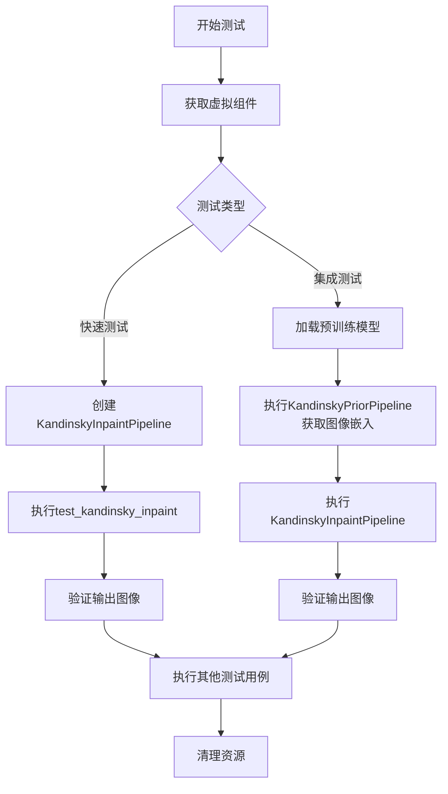

## 类结构

```
Dummies (辅助类)
├── 属性: text_embedder_hidden_size, time_input_dim, ...
├── 方法: get_dummy_components(), get_dummy_inputs()
KandinskyInpaintPipelineFastTests (单元测试类)
├── 继承: PipelineTesterMixin, unittest.TestCase
├── 方法: get_dummy_components(), get_dummy_inputs()
├── 测试方法: test_kandinsky_inpaint(), test_inference_batch_single_identical()
├── 测试方法: test_offloads(), test_float16_inference()
KandinskyInpaintPipelineIntegrationTests (集成测试类)
├── 继承: unittest.TestCase
├── 方法: setUp(), tearDown(), test_kandinsky_inpaint()
```

## 全局变量及字段


### `pipeline_class`
    
待测试的Kandinsky图像修复管道类

类型：`type`
    


### `params`
    
管道必需参数名称列表

类型：`list`
    


### `batch_params`
    
管道批处理参数名称列表

类型：`list`
    


### `required_optional_params`
    
可选参数名称列表

类型：`list`
    


### `test_xformers_attention`
    
标志位，是否测试xformers注意力机制

类型：`bool`
    


### `supports_dduf`
    
标志位，管道是否支持DDUF推理

类型：`bool`
    


### `expected_slice`
    
测试预期输出的像素值数组

类型：`numpy.ndarray`
    


### `Dummies.text_embedder_hidden_size`
    
文本嵌入器隐藏层维度大小

类型：`int (property)`
    


### `Dummies.time_input_dim`
    
时间步输入维度

类型：`int (property)`
    


### `Dummies.block_out_channels_0`
    
UNet块输出通道数初始值

类型：`int (property)`
    


### `Dummies.time_embed_dim`
    
时间嵌入层维度

类型：`int (property)`
    


### `Dummies.cross_attention_dim`
    
交叉注意力机制维度

类型：`int (property)`
    


### `Dummies.dummy_tokenizer`
    
用于测试的多语言分词器实例

类型：`XLMRobertaTokenizerFast (property)`
    


### `Dummies.dummy_text_encoder`
    
用于测试的多语言CLIP文本编码器模型

类型：`MultilingualCLIP (property)`
    


### `Dummies.dummy_unet`
    
用于测试的条件UNet2D模型

类型：`UNet2DConditionModel (property)`
    


### `Dummies.dummy_movq_kwargs`
    
VQ模型的构造参数字典

类型：`dict (property)`
    


### `Dummies.dummy_movq`
    
用于测试的VQ变分自编码器模型

类型：`VQModel (property)`
    


### `KandinskyInpaintPipelineFastTests.pipeline_class`
    
待测试的Kandinsky图像修复管道类

类型：`type`
    


### `KandinskyInpaintPipelineFastTests.params`
    
管道必需参数名称列表

类型：`list`
    


### `KandinskyInpaintPipelineFastTests.batch_params`
    
管道批处理参数名称列表

类型：`list`
    


### `KandinskyInpaintPipelineFastTests.required_optional_params`
    
可选参数名称列表

类型：`list`
    


### `KandinskyInpaintPipelineFastTests.test_xformers_attention`
    
标志位，是否测试xformers注意力机制

类型：`bool`
    


### `KandinskyInpaintPipelineFastTests.supports_dduf`
    
标志位，管道是否支持DDUF推理

类型：`bool`
    
    

## 全局函数及方法


### `enable_full_determinism`

该函数用于启用完全确定性模式，确保测试或实验在不同运行中获得完全一致的结果，通常通过设置随机种子和禁用非确定性操作来实现。

参数： 无

返回值：`None`，该函数无返回值，仅执行全局状态的设置操作。

#### 流程图

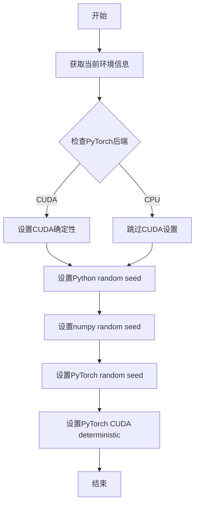

#### 带注释源码

```
# 注意：此函数定义未在给定代码中直接提供
# 该函数从 testing_utils 模块导入
# 以下是基于函数名和上下文推断的可能实现

def enable_full_determinism(seed: int = 0, verbose: bool = True) -> None:
    """
    启用完全确定性模式，确保测试结果可复现。
    
    参数:
        seed: int, 随机种子，默认为0
        verbose: bool, 是否输出详细信息，默认为True
    
    返回:
        None
    """
    import random
    import numpy as np
    import torch
    
    # 设置Python random模块的种子
    random.seed(seed)
    
    # 设置numpy的随机种子
    np.random.seed(seed)
    
    # 设置PyTorch的随机种子
    torch.manual_seed(seed)
    
    # 如果使用CUDA，设置CUDA的确定性模式
    if torch.cuda.is_available():
        torch.cuda.manual_seed(seed)
        torch.cuda.manual_seed_all(seed)
        # 启用CuDNN的确定性模式
        torch.backends.cudnn.deterministic = True
        torch.backends.cudnn.benchmark = False

# 在给定代码中的调用方式：
enable_full_determinism()
```

---

> **备注**：给定代码中仅包含对此函数的导入和调用，函数实际定义位于 `...testing_utils` 模块中。以上源码为基于函数名称和用途的合理推断。


### `backend_empty_cache`

该函数用于清理后端（GPU/CUDA）的内存缓存，释放VRAM空间，通常在测试用例的 setup 和 tearDown 阶段调用，以確保每次测试开始时有足够的GPU内存可用。

参数：

- `device`：`str` 或 `torch.device`，指定要清理缓存的设备（通常为 CUDA 设备，如 "cuda:0" 或 "cpu"）

返回值：`None`，无返回值

#### 流程图

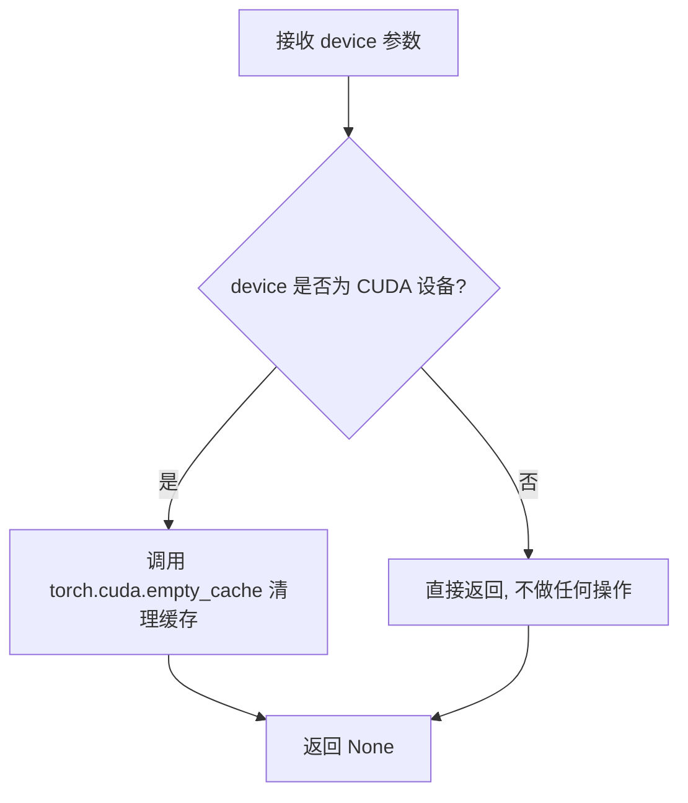

#### 带注释源码

```python
def backend_empty_cache(device):
    """
    清理指定设备的后端缓存，释放GPU显存。
    
    参数:
        device: 目标设备，通常为 torch_device (如 "cuda", "cuda:0", "mps" 等)
    
    返回:
        None: 该函数不返回任何值，仅执行副作用（清理缓存）
    
    注意:
        - 仅对 CUDA 或 MPS 设备有效
        - 对 CPU 设备不做任何操作
        - 常用于测试用例的 setUp/tearDown 中，确保测试间GPU内存得到释放
    """
    # 检查设备是否为 CUDA 设备
    if device in ["cuda", "cuda:0"]:
        # 调用 PyTorch 的 CUDA 缓存清理函数
        # 这会释放当前 CUDA 缓存中的未使用内存
        torch.cuda.empty_cache()
    
    # 如果是 MPS (Apple Silicon) 设备，也执行清理
    elif str(device).startswith("mps"):
        # MPS 后端的缓存清理（如果支持）
        torch.mps.empty_cache()
    
    # 对于 CPU 设备，直接返回，不执行任何操作
    else:
        pass
    
    return None
```


由于`floats_tensor`函数是在`...testing_utils`模块中定义的，而该模块的代码未在提供的代码中给出，我只能根据其在代码中的使用方式来推断其功能和使用方式。

### `floats_tensor`

用于生成指定形状的随机浮点数张量，常用于测试中创建模拟数据。

参数：

- `shape`：`tuple`，张量的形状，例如 `(1, self.cross_attention_dim)`
- `rng`：`random.Random`，随机数生成器实例，用于生成随机数

返回值：`torch.Tensor`，指定形状的随机浮点数张量

#### 流程图

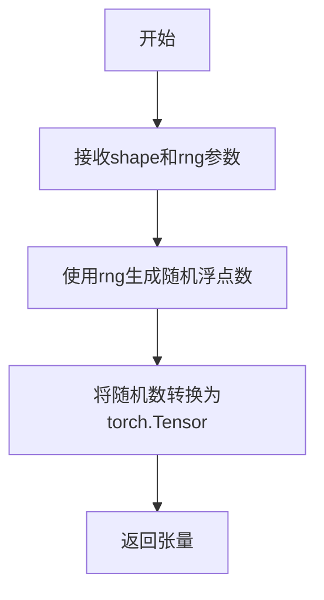

#### 带注释源码

```
# floats_tensor 函数定义（位于 testing_utils 模块中，此处为推断）
# 根据代码中的使用方式推断实现如下：

def floats_tensor(shape, rng):
    """
    生成指定形状的随机浮点数张量。
    
    参数:
        shape: tuple, 张量的形状
        rng: random.Random, 随机数生成器实例
    
    返回:
        torch.Tensor: 指定形状的随机浮点数张量
    """
    # 使用随机数生成器生成随机数组
    values = []
    total_elements = 1
    for dim in shape:
        total_elements *= dim
    
    # 生成随机浮点数并reshape为指定形状
    values = [rng.random() for _ in range(total_elements)]
    return torch.tensor(values).reshape(shape)
```

> **注意**：由于提供的代码中没有`floats_tensor`函数的完整定义，以上信息是基于代码中以下使用方式的推断：
> ```python
> image_embeds = floats_tensor((1, self.cross_attention_dim), rng=random.Random(seed)).to(device)
> image = floats_tensor((1, 3, 64, 64), rng=random.Random(seed)).to(device)
> ```
> 如需获取完整的函数定义，请参考 `diffusers` 库的 `testing_utils` 模块源文件。


根据提供的代码，我发现 `load_image` 并非在该文件中定义，而是从 `...testing_utils` 模块导入的辅助函数。

```python
from ...testing_utils import (
    backend_empty_cache,
    enable_full_determinism,
    floats_tensor,
    load_image,  # <-- 从 testing_utils 导入
    load_numpy,
    nightly,
    require_torch_accelerator,
    torch_device,
)
```

在代码中的实际调用方式：

```python
init_image = load_image(
    "https://huggingface.co/datasets/hf-internal-testing/diffusers-images/resolve/main/kandinsky/cat.png"
)
```

由于 `load_image` 函数的完整源码（位于 `testing_utils` 模块中）未在当前提供的代码片段中，我无法直接提取其完整的函数签名、流程图和带注释的源码。

---

### 建议

要获取 `load_image()` 的完整详细信息（如参数、返回值、流程图、源码），需要提供 `testing_utils.py` 文件的内容，或者您可以确认是否需要我基于其使用方式进行分析：

- **函数名**：`load_image`
- **参数**：字符串 URL 或本地路径
- **返回值**：`PIL.Image.Image` 对象
- **功能**：从指定路径或 URL 加载图像并返回 PIL 图像对象

如果您能提供 `testing_utils.py` 中 `load_image` 的定义，我可以为您完成完整的文档提取。


### `load_numpy`

该函数是 `diffusers` 库测试工具模块中的一个实用工具函数，用于从本地路径或远程 URL 加载 NumPy 数组（.npy 文件或 .npz 文件）。

参数：

-  `path_or_url`：`str`，表示 .npy/.npz 文件的本地路径或远程 URL（例如 HuggingFace datasets URL）

返回值：`numpy.ndarray`，返回从文件或 URL 加载的 NumPy 数组

#### 流程图

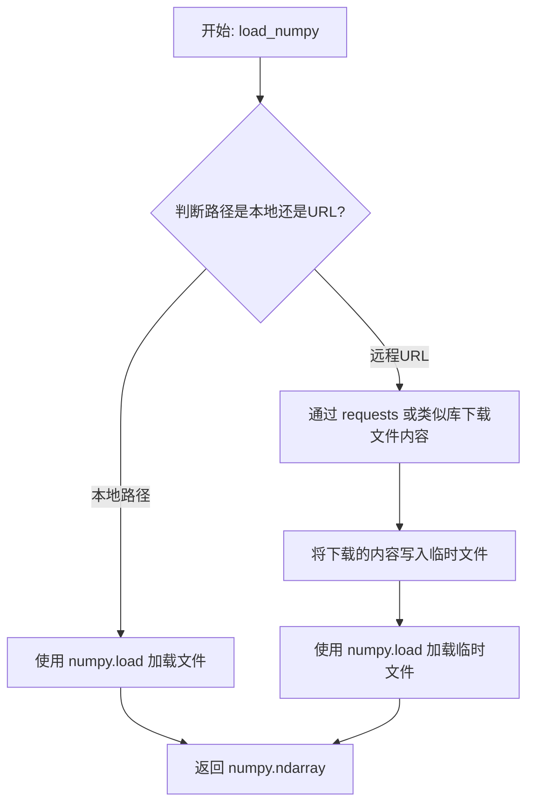

#### 带注释源码

```
# load_numpy 函数定义于 diffusers.testing_utils 模块中
# 以下为该函数的可能实现（基于使用方式推断）

def load_numpy(path_or_url: str) -> np.ndarray:
    """
    从本地路径或远程URL加载NumPy数组。
    
    参数:
        path_or_url: .npy 或 .npz 文件的路径或URL
        
    返回:
        加载的NumPy数组
    """
    import numpy as np
    import requests
    from pathlib import Path
    
    # 判断是否为URL（以http://或https://开头）
    if path_or_url.startswith("http://") or path_or_url.startswith("https://"):
        # 远程URL：从网络下载
        response = requests.get(path_or_url)
        response.raise_for_status()
        
        # 将下载的内容写入临时文件
        import tempfile
        import os
        with tempfile.NamedTemporaryFile(delete=False, suffix=".npy") as tmp:
            tmp.write(response.content)
            tmp_path = tmp.name
        
        # 加载临时文件
        array = np.load(tmp_path)
        
        # 清理临时文件
        os.unlink(tmp_path)
    else:
        # 本地路径：直接加载
        array = np.load(path_or_url)
    
    return array

# 使用示例（在测试代码中）:
# expected_image = load_numpy(
#     "https://huggingface.co/datasets/hf-internal-testing/diffusers-images/resolve/main"
#     "/kandinsky/kandinsky_inpaint_cat_with_hat_fp16.npy"
# )
```


### `Dummies.get_dummy_components`

该方法用于构建并返回一个包含Kandinsky图像修复管道所需的所有虚拟组件的字典，包括文本编码器、分词器、UNet模型、MOVQ模型和DDIM调度器。

参数：无（仅包含隐式参数 `self`）

返回值：`dict`，返回一个字典，包含构建KandinskyInpaintPipeline所需的文本编码器、分词器、UNet、调度器和MOVQ模型组件。

#### 流程图

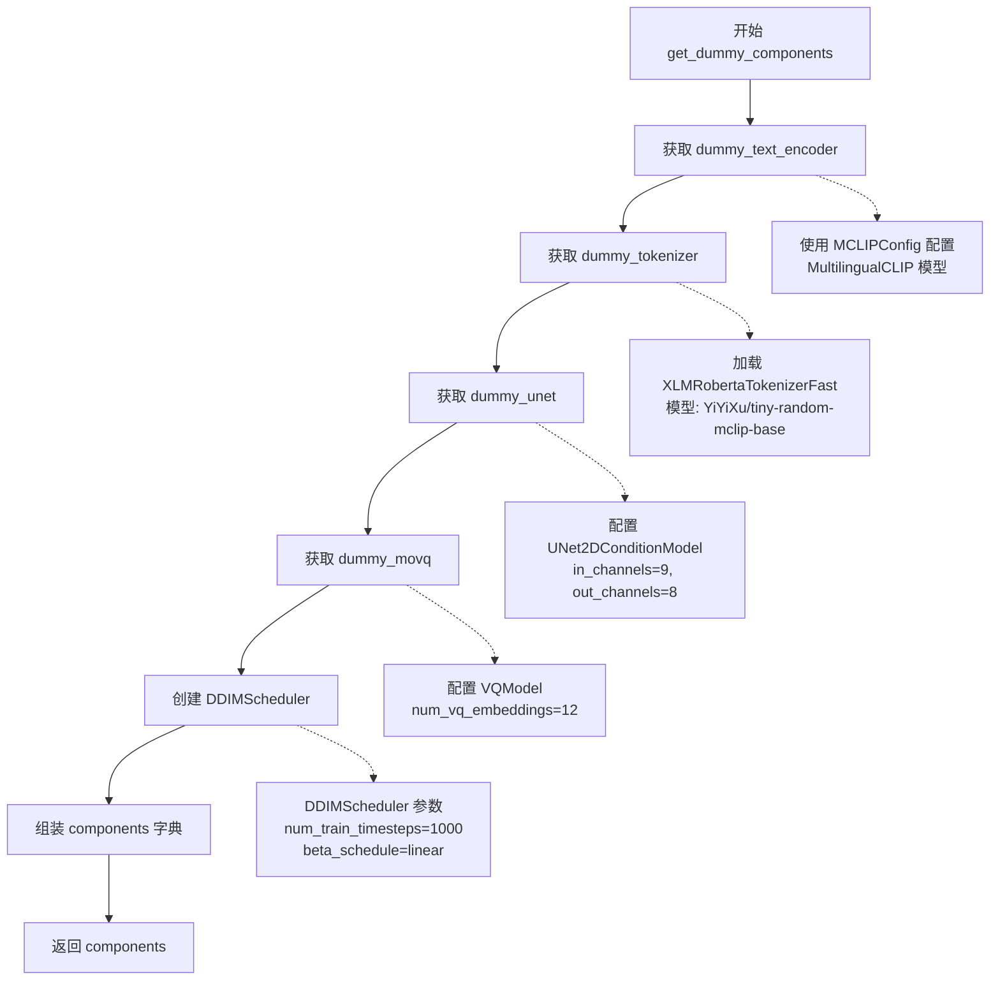

#### 带注释源码

```python
def get_dummy_components(self):
    """
    获取用于测试的虚拟组件。
    
    该方法返回一个字典，包含构建KandinskyInpaintPipeline所需的
    所有核心组件：文本编码器、分词器、UNet、调度器和MOVQ模型。
    
    Returns:
        dict: 包含以下键的字典:
            - text_encoder: MultilingualCLIP文本编码器实例
            - tokenizer: XLMRobertaTokenizerFast分词器实例
            - unet: UNet2DConditionModel实例
            - scheduler: DDIMScheduler实例
            - movq: VQModel实例
    """
    # 获取文本编码器（MultilingualCLIP）
    # 通过 @property dummy_text_encoder 创建并返回
    text_encoder = self.dummy_text_encoder
    
    # 获取分词器（XLMRobertaTokenizerFast）
    # 从预训练模型 YiYiXu/tiny-random-mclip-base 加载
    tokenizer = self.dummy_tokenizer
    
    # 获取UNet模型（用于去噪过程）
    # 配置为处理9通道输入，预测8通道输出（均值和方差）
    # 支持text_image嵌入类型
    unet = self.dummy_unet
    
    # 获取MOVQ模型（用于VQ VAE编码/解码）
    # 包含12个VQ嵌入，4维潜在空间
    movq = self.dummy_movq
    
    # 创建DDIM调度器
    # 参数配置：
    # - num_train_timesteps: 1000 训练时间步数
    # - beta_schedule: linear 线性beta调度
    # - beta_start/beta_end: 0.00085 到 0.012 的beta值范围
    # - clip_sample: False 不裁剪样本
    # - set_alpha_to_one: False 不设置alpha为1
    # - steps_offset: 1 步骤偏移
    # - prediction_type: epsilon 预测类型为epsilon
    # - thresholding: False 不使用阈值化
    scheduler = DDIMScheduler(
        num_train_timesteps=1000,
        beta_schedule="linear",
        beta_start=0.00085,
        beta_end=0.012,
        clip_sample=False,
        set_alpha_to_one=False,
        steps_offset=1,
        prediction_type="epsilon",
        thresholding=False,
    )
    
    # 组装组件字典
    # 将所有虚拟组件打包到字典中返回
    components = {
        "text_encoder": text_encoder,
        "tokenizer": tokenizer,
        "unet": unet,
        "scheduler": scheduler,
        "movq": movq,
    }
    
    # 返回完整的组件字典
    return components
```


### `Dummies.get_dummy_inputs`

该方法用于生成 KandinskyInpaintPipeline 的虚拟测试输入，包括图像嵌入、初始图像、掩码图像以及各种生成参数，方便进行自动化测试。

参数：

- `device`：`torch.device`，运行设备（如 "cpu"、"cuda" 等）
- `seed`：`int`，随机种子，默认值为 0，用于确保测试的可重复性

返回值：`dict`，包含以下键值对：

- `prompt`：文本提示词
- `image`：初始图像（PIL.Image 对象）
- `mask_image`：掩码图像（numpy 数组）
- `image_embeds`：图像嵌入张量
- `negative_image_embeds`：负向图像嵌入张量
- `generator`：随机数生成器
- `height`、`width`：输出图像尺寸
- `num_inference_steps`：推理步数
- `guidance_scale`：引导系数
- `output_type`：输出类型

#### 流程图

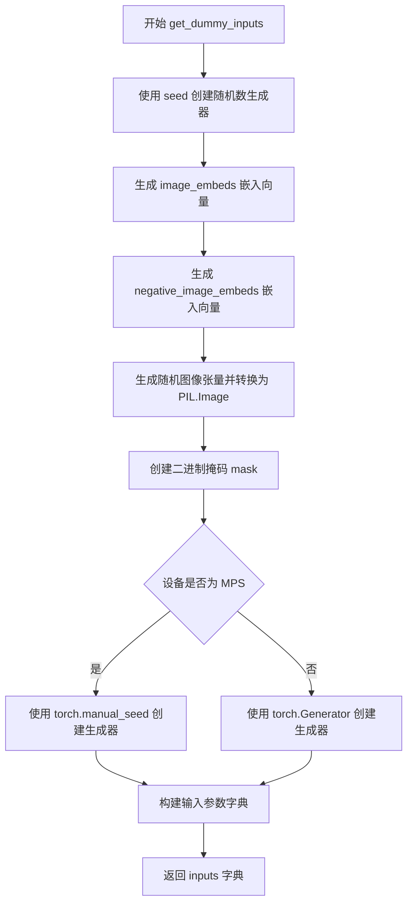

#### 带注释源码

```python
def get_dummy_inputs(self, device, seed=0):
    """
    生成用于测试 KandinskyInpaintPipeline 的虚拟输入参数
    
    参数:
        device: torch device，用于指定张量存放的设备
        seed: 随机种子，确保测试结果可复现
    
    返回:
        dict: 包含 pipeline 所有输入参数的字典
    """
    
    # 使用 floats_tensor 生成指定形状的随机浮点张量作为图像嵌入
    # 形状为 (1, cross_attention_dim)，cross_attention_dim = 32
    image_embeds = floats_tensor((1, self.cross_attention_dim), rng=random.Random(seed)).to(device)
    
    # 负向图像嵌入，使用 seed+1 确保与正向嵌入不同
    negative_image_embeds = floats_tensor((1, self.cross_attention_dim), rng=random.Random(seed + 1)).to(device)
    
    # 创建初始图像：生成 (1, 3, 64, 64) 的随机浮点张量
    image = floats_tensor((1, 3, 64, 64), rng=random.Random(seed)).to(device)
    
    # 调整维度顺序从 (B, C, H, W) 转为 (B, H, W, C)，并取第一张图
    image = image.cpu().permute(0, 2, 3, 1)[0]
    
    # 将张量转换为 PIL Image 对象并调整大小为 256x256
    init_image = Image.fromarray(np.uint8(image)).convert("RGB").resize((256, 256))
    
    # 创建掩码：64x64 的零矩阵，左上角 32x32 区域设为 1
    mask = np.zeros((64, 64), dtype=np.float32)
    mask[:32, :32] = 1
    
    # 根据设备类型创建随机数生成器
    # MPS 设备需要特殊处理，使用 torch.manual_seed
    if str(device).startswith("mps"):
        generator = torch.manual_seed(seed)
    else:
        # 其他设备（CPU/CUDA）使用 torch.Generator
        generator = torch.Generator(device=device).manual_seed(seed)
    
    # 组装所有输入参数
    inputs = {
        "prompt": "horse",                          # 文本提示词
        "image": init_image,                        # 初始图像
        "mask_image": mask,                         # 掩码图像
        "image_embeds": image_embeds,              # 图像嵌入
        "negative_image_embeds": negative_image_embeds,  # 负向嵌入
        "generator": generator,                     # 随机生成器
        "height": 64,                               # 输出高度
        "width": 64,                                # 输出宽度
        "num_inference_steps": 2,                  # 推理步数
        "guidance_scale": 4.0,                     # 引导系数
        "output_type": "np",                       # 输出类型为 numpy
    }
    
    return inputs
```


### `KandinskyInpaintPipelineFastTests.get_dummy_components`

该方法用于生成测试所需的虚拟组件（dummy components），包括文本编码器、分词器、UNet模型、调度器和MOVQ模型，以便在测试环境中运行Kandinsky图像修复管道。

参数：

- `self`：`KandinskyInpaintPipelineFastTests`，调用该方法的实例对象

返回值：`dict`，返回一个包含虚拟组件的字典，键包括 `"text_encoder"`、`"tokenizer"`、`"unet"`、`"scheduler"` 和 `"movq"`，分别对应文本编码器、分词器、UNet模型、DDIM调度器和MOVQ模型。

#### 流程图

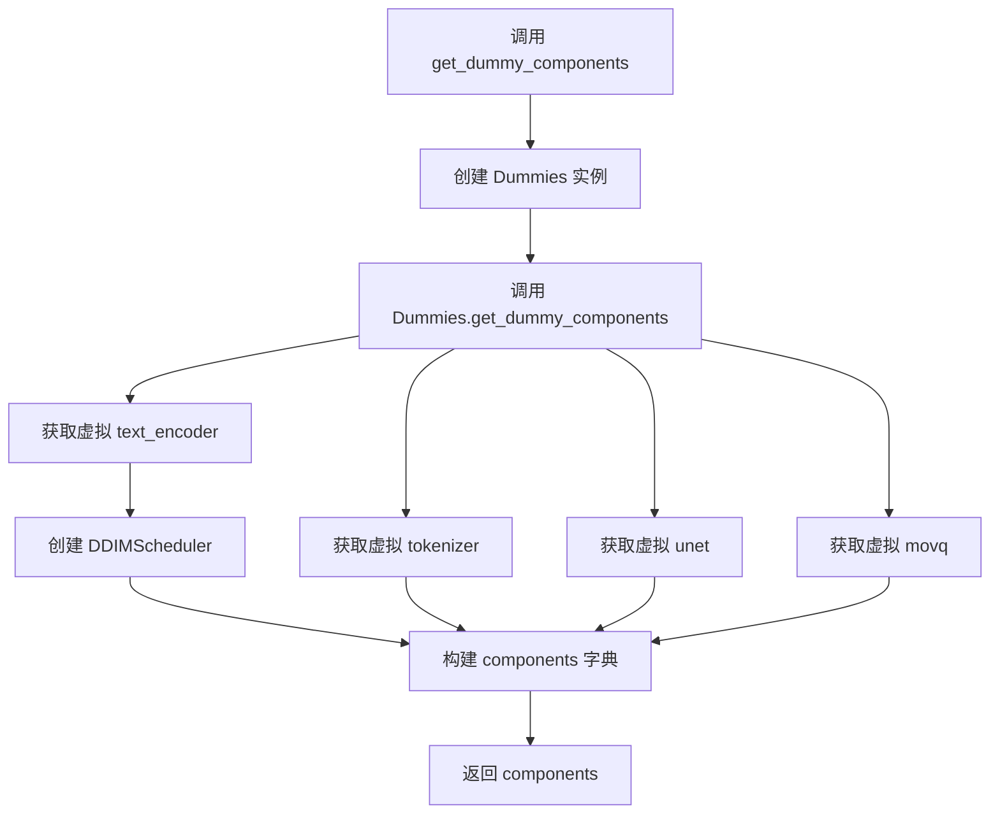

#### 带注释源码

```
def get_dummy_components(self):
    """
    获取用于测试的虚拟组件。
    
    该方法创建一个 Dummies 实例并调用其 get_dummy_components 方法，
    返回一个包含 KandinskyInpaintPipeline 所需所有组件的字典。
    """
    # 创建 Dummies 类的实例，用于获取各个虚拟组件
    dummies = Dummies()
    
    # 委托给 Dummies 实例的 get_dummy_components 方法
    return dummies.get_dummy_components()
```

---

### `Dummies.get_dummy_components`

该方法是实际生成虚拟组件的核心方法，通过调用相关的 `@property` 装饰器方法获取各个模型组件，并创建一个配置好的 DDIMScheduler，最终返回一个包含所有组件的字典供管道初始化使用。

参数：

- `self`：`Dummies`，调用该方法的实例对象

返回值：`dict`，返回包含以下键值对的字典：
- `"text_encoder"`：虚拟文本编码器（MultilingualCLIP 模型）
- `"tokenizer"`：虚拟分词器（XLMRobertaTokenizerFast）
- `"unet"`：虚拟 UNet 模型（UNet2DConditionModel）
- `"scheduler"`：DDIM 调度器（DDIMScheduler）
- `"movq"`：虚拟 MOVQ 模型（VQModel）

#### 流程图

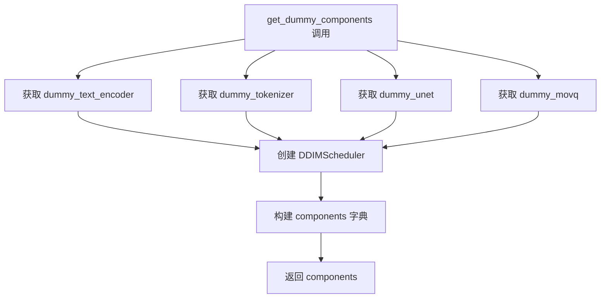

#### 带注释源码

```
def get_dummy_components(self):
    """
    生成用于测试的虚拟组件字典。
    
    该方法通过调用对应的 property 属性获取预配置的虚拟模型组件，
    并创建一个 DDIMScheduler 实例，所有组件被打包到一个字典中返回。
    """
    # 获取虚拟文本编码器 (MultilingualCLIP)
    text_encoder = self.dummy_text_encoder
    
    # 获取虚拟分词器 (XLMRobertaTokenizerFast)
    tokenizer = self.dummy_tokenizer
    
    # 获取虚拟 UNet 模型 (用于图像生成)
    unet = self.dummy_unet
    
    # 获取虚拟 MOVQ 模型 (VQModel，用于潜在空间处理)
    movq = self.dummy_movq

    # 创建 DDIM 调度器，配置如下：
    # - num_train_timesteps: 1000 训练时间步数
    # - beta_schedule: "linear" 线性 beta 调度
    # - beta_start: 0.00085 起始 beta 值
    # - beta_end: 0.012 结束 beta 值
    # - clip_sample: False 不裁剪样本
    # - set_alpha_to_one: False 不将 alpha 设置为 1
    # - steps_offset: 1 时间步偏移
    # - prediction_type: "epsilon" 预测类型为噪声
    # - thresholding: False 不使用阈值处理
    scheduler = DDIMScheduler(
        num_train_timesteps=1000,
        beta_schedule="linear",
        beta_start=0.00085,
        beta_end=0.012,
        clip_sample=False,
        set_alpha_to_one=False,
        steps_offset=1,
        prediction_type="epsilon",
        thresholding=False,
    )

    # 将所有组件打包到字典中
    # 键名必须与 KandinskyInpaintPipeline 的 __init__ 参数一致
    components = {
        "text_encoder": text_encoder,
        "tokenizer": tokenizer,
        "unet": unet,
        "scheduler": scheduler,
        "movq": movq,
    }

    # 返回包含所有虚拟组件的字典
    return components
```


### `KandinskyInpaintPipelineFastTests.get_dummy_inputs`

该方法为 Kandinsky 图像修复管道测试生成虚拟输入参数，包括提示词、图像、遮罩、图像嵌入等，用于验证管道功能的正确性。

参数：

-  `self`：类的实例对象，无需显式传递
-  `device`：`str`，目标设备标识符，如 "cpu"、"cuda" 或 "mps"
-  `seed`：`int`，随机种子，默认值为 0，用于确保测试结果可复现

返回值：`dict`，包含管道推理所需的所有虚拟输入参数

#### 流程图

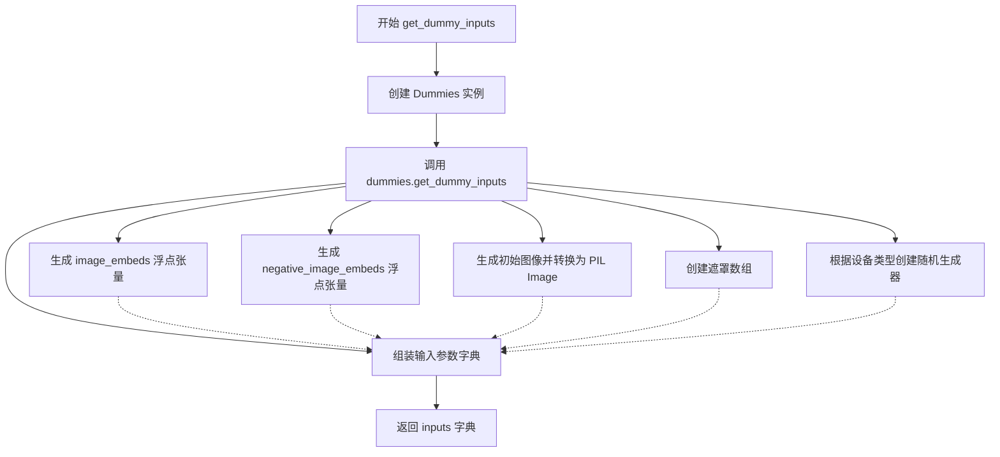

#### 带注释源码

```python
def get_dummy_inputs(self, device, seed=0):
    """
    为 KandinskyInpaintPipeline 测试生成虚拟输入参数
    
    参数:
        self: KandinskyInpaintPipelineFastTests 类实例
        device: str, 目标设备（如 "cpu", "cuda", "mps"）
        seed: int, 随机种子，默认值为 0
    
    返回:
        dict: 包含以下键的字典:
            - prompt: str, 输入提示词
            - image: PIL.Image.Image, 初始图像
            - mask_image: np.ndarray, 遮罩数组
            - image_embeds: torch.Tensor, 图像嵌入向量
            - negative_image_embeds: torch.Tensor, 负向图像嵌入向量
            - generator: torch.Generator, 随机生成器
            - height: int, 输出图像高度
            - width: int, 输出图像宽度
            - num_inference_steps: int, 推理步数
            - guidance_scale: float, 引导 scale
            - output_type: str, 输出类型
    """
    # 创建 Dummies 辅助类实例，用于获取虚拟组件
    dummies = Dummies()
    # 委托给 Dummies 类的 get_dummy_inputs 方法执行实际参数生成
    return dummies.get_dummy_inputs(device=device, seed=seed)
```


### `KandinskyInpaintPipelineFastTests.test_kandinsky_inpaint`

该测试方法验证 KandinskyInpaintPipeline 的图像修复（inpainting）功能，通过构造虚拟组件创建管道并执行推理，检查输出图像的形状和像素值是否符合预期。

参数：

- `self`：隐式参数，测试类实例本身

返回值：`None`，该方法为单元测试方法，通过断言验证管道输出的正确性，若测试失败则抛出异常

#### 流程图

```mermaid
flowchart TD
    A[开始测试] --> B[设置设备为 CPU]
    B --> C[获取虚拟组件: get_dummy_components]
    C --> D[使用虚拟组件实例化 KandinskyInpaintPipeline]
    D --> E[将管道移至 CPU 设备]
    E --> F[设置进度条配置]
    F --> G[执行管道推理: pipe get_dummy_inputs]
    G --> H[获取输出图像]
    H --> I[使用 return_dict=False 再次推理]
    I --> J[提取图像切片: image[0, -3:, -3:, -1]]
    J --> K{断言: image.shape == (1, 64, 64, 3)}
    K -->|失败| L[抛出 AssertionError]
    K -->|成功| M{断言: 像素差异 < 1e-2}
    M -->|失败| L
    M --> N{断言: from_tuple 像素差异 < 1e-2}
    N -->|失败| L
    N --> O[测试通过]
```

#### 带注释源码

```python
@pytest.mark.xfail(
    condition=is_transformers_version(">=", "4.56.2"),
    reason="Latest transformers changes the slices",
    strict=False,
)
def test_kandinsky_inpaint(self):
    """
    测试 KandinskyInpaintPipeline 的图像修复功能。
    验证管道能够正确处理修复任务并输出预期尺寸和像素范围的图像。
    """
    # 1. 设置测试设备为 CPU
    device = "cpu"

    # 2. 获取虚拟组件（文本编码器、UNet、VQModel、调度器等）
    components = self.get_dummy_components()

    # 3. 使用虚拟组件实例化图像修复管道
    pipe = self.pipeline_class(**components)
    # 4. 将管道移至指定设备（CPU）
    pipe = pipe.to(device)

    # 5. 配置进度条（disable=None 表示不禁用）
    pipe.set_progress_bar_config(disable=None)

    # 6. 获取虚拟输入并执行管道推理
    output = pipe(**self.get_dummy_inputs(device))
    # 7. 提取输出图像
    image = output.images

    # 8. 使用 return_dict=False 模式再次推理，获取元组形式的输出
    image_from_tuple = pipe(
        **self.get_dummy_inputs(device),
        return_dict=False,
    )[0]

    # 9. 提取图像右下角 3x3 像素区域用于验证
    image_slice = image[0, -3:, -3:, -1]
    image_from_tuple_slice = image_from_tuple[0, -3:, -3:, -1]

    # 10. 断言：验证输出图像形状为 (1, 64, 64, 3)
    assert image.shape == (1, 64, 64, 3)

    # 11. 定义预期像素值（预先计算的标准值）
    expected_slice = np.array([0.8222, 0.8896, 0.4373, 0.8088, 0.4905, 0.2609, 0.6816, 0.4291, 0.5129])

    # 12. 断言：验证主输出图像切片与预期值的最大差异小于 1e-2
    assert np.abs(image_slice.flatten() - expected_slice).max() < 1e-2, (
        f" expected_slice {expected_slice}, but got {image_slice.flatten()}"
    )
    # 13. 断言：验证元组输出模式下的图像切片与预期值的最大差异小于 1e-2
    assert np.abs(image_from_tuple_slice.flatten() - expected_slice).max() < 1e-2, (
        f" expected_slice {expected_slice}, but got {image_from_tuple_slice.flatten()}"
    )
```


### `KandinskyInpaintPipelineFastTests.test_inference_batch_single_identical`

该测试方法继承自 `PipelineTesterMixin`，用于验证批处理推理与单样本推理结果的一致性，确保管道在两种模式下产生相同的输出。

参数：

- `self`：实例方法的标准隐式参数，类型为 `KandinskyInpaintPipelineFastTests`，表示测试类实例本身
- `expected_max_diff`：浮点数，类型为 `float`，允许的最大差异阈值（3e-3 = 0.003），从父类方法调用时传入

返回值：无明确返回值（`None`），该测试通过 `assert` 语句验证结果一致性，若失败则抛出异常

#### 流程图

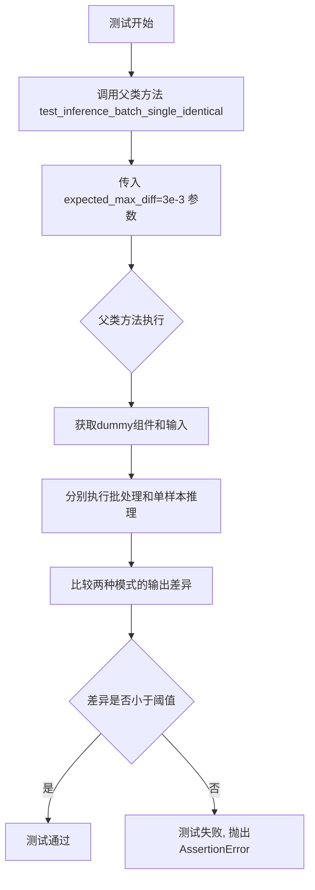

#### 带注释源码

```python
def test_inference_batch_single_identical(self):
    """
    测试方法：验证批处理推理与单样本推理结果的一致性
    
    该测试方法继承自 PipelineTesterMixin 父类，用于确保
    KandinskyInpaintPipeline 在批处理模式和单样本模式下
    产生数值上一致的结果（差异在指定阈值内）
    
    参数:
        self: KandinskyInpaintPipelineFastTests 的实例
        expected_max_diff: 从父类方法继承的参数，允许的最大差异值
    
    返回值:
        None: 测试通过无返回值，失败则抛出 AssertionError
    
    注意:
        - 该方法调用 super().test_inference_batch_single_identical()
        - 具体实现逻辑在 PipelineTesterMixin 父类中
        - 阈值设置为 3e-3 (0.003)，这是一个相对严格的精度要求
    """
    # 调用父类 PipelineTesterMixin 的 test_inference_batch_single_identical 方法
    # expected_max_diff=3e-3 表示允许批处理和单样本输出之间的最大差异为 0.003
    super().test_inference_batch_single_identical(expected_max_diff=3e-3)
```

---

### 补充信息

#### 关键组件信息

| 组件名称 | 一句话描述 |
|---------|-----------|
| `KandinskyInpaintPipelineFastTests` | 针对 KandinskyInpaintPipeline 的快速测试类，继承自 PipelineTesterMixin 和 unittest.TestCase |
| `PipelineTesterMixin` | 管道测试混入类，提供通用的管道推理一致性验证方法 |
| `Dummies` | 提供虚拟（dummy）组件和输入数据的辅助类，用于测试 |

#### 潜在技术债务或优化空间

1. **测试覆盖不够完整**：该方法完全依赖父类实现，缺少对自身特定逻辑的单元测试
2. **硬编码的阈值**：`expected_max_diff=3e-3` 是硬编码的，建议提取为类或模块级常量以提高可维护性
3. **缺少文档注释**：父类方法的具体实现不可见，建议在测试中添加对预期行为的更详细描述

#### 其它说明

- **设计目标**：确保管道实现的正确性和一致性，验证批处理不会引入额外的数值误差
- **错误处理**：若差异超过阈值，测试失败并抛出 `AssertionError`，包含具体的差异数值
- **数据流**：测试通过 `get_dummy_components()` 和 `get_dummy_inputs()` 获取虚拟组件和输入，然后调用管道进行推理
- **外部依赖**：依赖 `PipelineTesterMixin` 的具体实现（定义在 `test_pipelines_common` 模块中）


### `KandinskyInpaintPipelineFastTests.test_offloads`

该测试方法用于验证 KandinskyInpaintPipeline 在不同 CPU 卸载策略下的功能一致性。它创建三个管道实例：普通管道、启用模型级 CPU 卸载的管道、启用顺序 CPU 卸载的管道，分别执行推理并比较输出图像的像素差异，确保三种方式的推理结果在允许的误差范围内一致。

参数：

- 无显式参数（`self` 为实例方法隐式参数）

返回值：`None`，该方法为测试方法，不返回任何值

#### 流程图

```mermaid
flowchart TD
    A[开始 test_offloads] --> B[创建空列表 pipes 存储管道实例]
    B --> C[获取虚拟组件 components]
    C --> D[创建普通管道 sd_pipe 并添加到 pipes]
    D --> E[获取新的虚拟组件 components]
    E --> F[创建管道并启用模型级 CPU 卸载<br/>sd_pipe.enable_model_cpu_offload]
    F --> G[将启用卸载的管道添加到 pipes]
    G --> H[获取新的虚拟组件 components]
    H --> I[创建管道并启用顺序 CPU 卸载<br/>sd_pipe.enable_sequential_cpu_offload]
    I --> J[将顺序卸载管道添加到 pipes]
    J --> K[创建空列表 image_slices 存储图像切片]
    K --> L{遍历 pipes 中的每个管道}
    L -->|是| M[获取虚拟输入 inputs]
    M --> N[执行管道推理<br/>pipe\*\*inputs]
    N --> O[提取图像切片<br/>image[0, -3:, -3:, -1].flatten]
    O --> P[将切片添加到 image_slices]
    P --> L
    L -->|否| Q[断言普通管道与模型卸载管道输出差异<br/>np.abs < 1e-3]
    Q --> R[断言普通管道与顺序卸载管道输出差异<br/>np.abs < 1e-3]
    R --> S[结束测试]
```

#### 带注释源码

```python
@require_torch_accelerator
def test_offloads(self):
    """测试不同CPU卸载策略下的管道推理一致性"""
    
    # 创建一个空列表用于存储三个不同的管道实例
    pipes = []
    
    # 获取虚拟组件配置（用于测试的模拟组件）
    components = self.get_dummy_components()
    
    # 创建第一个管道实例：普通管道，直接移动到设备
    sd_pipe = self.pipeline_class(**components).to(torch_device)
    pipes.append(sd_pipe)  # 添加到列表

    # 获取新的虚拟组件配置
    components = self.get_dummy_components()
    
    # 创建第二个管道实例：启用模型级CPU卸载
    # enable_model_cpu_offload 会在推理完成后自动将模型移回CPU以节省显存
    sd_pipe = self.pipeline_class(**components)
    sd_pipe.enable_model_cpu_offload(device=torch_device)
    pipes.append(sd_pipe)

    # 获取新的虚拟组件配置
    components = self.get_dummy_components()
    
    # 创建第三个管道实例：启用顺序CPU卸载
    # enable_sequential_cpu_offload 会按顺序将每个模块移入GPU进行计算，然后移回CPU
    sd_pipe = self.pipeline_class(**components)
    sd_pipe.enable_sequential_cpu_offload(device=torch_device)
    pipes.append(sd_pipe)

    # 存储每个管道输出的图像切片用于比较
    image_slices = []
    
    # 遍历三个管道实例，分别进行推理
    for pipe in pipes:
        # 获取测试用的虚拟输入参数
        inputs = self.get_dummy_inputs(torch_device)
        
        # 执行管道推理，获取生成的图像
        image = pipe(**inputs).images

        # 提取图像右下角3x3像素区域并展平，用于后续比较
        image_slices.append(image[0, -3:, -3:, -1].flatten())

    # 断言1：普通管道与模型级卸载管道的输出差异应小于1e-3
    # 验证启用模型级CPU卸载不会改变推理结果
    assert np.abs(image_slices[0] - image_slices[1]).max() < 1e-3
    
    # 断言2：普通管道与顺序卸载管道的输出差异应小于1e-3
    # 验证启用顺序CPU卸载不会改变推理结果
    assert np.abs(image_slices[0] - image_slices[2]).max() < 1e-3
```


### `KandinskyInpaintPipelineFastTests.test_float16_inference`

该测试方法用于验证 KandinskyInpaintPipeline 在 float16（半精度）推理模式下的正确性，通过调用父类的测试方法来检查半精度计算结果与预期值的差异是否在可接受范围内。

参数：

- `self`：`KandinskyInpaintPipelineFastTests`，测试类实例本身，包含测试所需的组件和配置

返回值：`None`，该方法为测试方法，不返回任何值，仅通过断言验证推理结果

#### 流程图

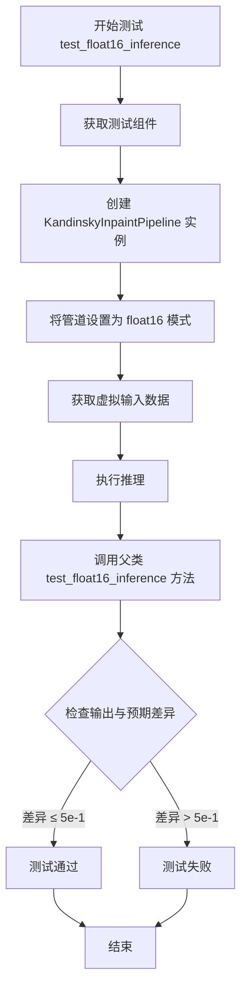

#### 带注释源码

```python
def test_float16_inference(self):
    """
    测试方法：test_float16_inference
    
    该测试方法用于验证 KandinskyInpaintPipeline 在 float16（半精度）
    推理模式下的正确性。测试通过检查输出图像与预期值的差异来确保
    管道在低精度模式下仍能正常工作。
    
    注意：该方法实际调用父类 PipelineTesterMixin 的 test_float16_inference 方法，
    传入 expected_max_diff=5e-1 作为最大允许差异阈值。
    """
    # 调用父类的 test_float16_inference 方法进行测试
    # expected_max_diff=5e-1 表示允许的最大像素差异为 0.5
    super().test_float16_inference(expected_max_diff=5e-1)
```


### `KandinskyInpaintPipelineIntegrationTests.setUp`

该方法是 `KandinskyInpaintPipelineIntegrationTests` 集成测试类的初始化方法，在每个测试用例运行前被调用，用于清理 VRAM（显存）以确保测试环境的内存状态干净，避免因显存残留导致测试失败。

参数：

- `self`：`unittest.TestCase`，当前测试类实例本身，隐式参数无需显式传递

返回值：`None`，无返回值

#### 流程图

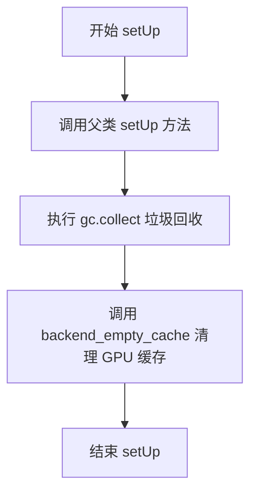

#### 带注释源码

```python
def setUp(self):
    # clean up the VRAM before each test
    # 在每个测试之前清理 VRAM，确保干净的测试环境
    super().setUp()
    # 调用父类的 setUp 方法，执行 unittest.TestCase 的标准初始化逻辑
    gc.collect()
    # 手动调用 Python 的垃圾回收器，释放未使用的对象内存
    backend_empty_cache(torch_device)
    # 调用后端工具函数清空 GPU 显存缓存，防止显存泄漏影响测试结果
```


### `KandinskyInpaintPipelineIntegrationTests.tearDown`

该方法是测试框架的清理方法，在每个测试用例执行完毕后被自动调用，用于清理VRAM（显存）资源。它首先调用父类的 `tearDown()` 方法进行基础清理，然后执行 Python 垃圾回收（`gc.collect()`）和清空 GPU 缓存（`backend_empty_cache(torch_device)`），确保显存被正确释放，避免测试之间的资源泄漏。

参数：

- 无显式参数（隐式参数 `self` 为 `unittest.TestCase` 实例）

返回值：`None`，无返回值描述

#### 流程图

```mermaid
flowchart TD
    A[开始 tearDown] --> B[调用父类 super().tearDown]
    B --> C[执行 gc.collect 垃圾回收]
    C --> D[调用 backend_empty_cache 清理GPU缓存]
    D --> E[结束 tearDown]
    
    style A fill:#f9f,stroke:#333
    style E fill:#9f9,stroke:#333
```

#### 带注释源码

```python
def tearDown(self):
    # clean up the VRAM after each test
    # 调用父类的 tearDown 方法执行基础清理
    super().tearDown()
    # 执行 Python 垃圾回收，释放不再使用的对象内存
    gc.collect()
    # 调用后端特定的函数清空 GPU 显存缓存
    backend_empty_cache(torch_device)
```


### `KandinskyInpaintPipelineIntegrationTests.test_kandinsky_inpaint`

该函数是一个集成测试方法，用于测试 Kandinsky 图像修复（inpainting）管道的端到端功能。它加载预训练的 Kandinsky 先验管道和修复管道，使用给定的提示词、初始图像和掩码生成修复后的图像，并验证输出图像的形状和像素值与预期结果的一致性。

参数：

- `self`：实例方法隐含参数，表示测试类实例本身，无类型声明

返回值：无返回值（`None`），该方法为测试用例，通过断言验证功能正确性

#### 流程图

```mermaid
flowchart TD
    A[测试开始] --> B[setUp: 清理VRAM]
    B --> C[加载预期图像 from URL]
    C --> D[加载初始图像 from URL]
    D --> E[创建掩码 mask: 768x768 全零, 特定区域设为1]
    E --> F[设置提示词 prompt = 'a hat']
    F --> G[加载 KandinskyPriorPipeline<br/>from kandinsky-community/kandinsky-2-1-prior]
    G --> H[加载 KandinskyInpaintPipeline<br/>from kandinsky-community/kandinsky-2-1-inpaint]
    H --> I[设置进度条配置]
    I --> J[创建随机数生成器 seed=0]
    J --> K[调用 pipe_prior 生成图像嵌入<br/>num_inference_steps=5]
    K --> L[调用 pipeline 进行图像修复<br/>num_inference_steps=100<br/>height=768 width=768]
    L --> M[获取输出图像 images[0]]
    M --> N{断言验证}
    N -->|通过| O[测试通过]
    N -->|失败| P[抛出断言错误]
    
    style O fill:#90EE90
    style P fill:#FFB6C1
```

#### 带注释源码

```python
@nightly  # 标记为夜间测试，可能需要特殊CI配置
@require_torch_accelerator  # 需要GPU加速才能运行
def test_kandinsky_inpaint(self):
    """
    测试 Kandinsky 图像修复管道的端到端功能
    验证管道能够根据提示词和掩码正确修复图像区域
    """
    
    # 从 HuggingFace Hub 加载预期的参考图像（numpy 数组格式）
    # 用于后续像素值对比验证
    expected_image = load_numpy(
        "https://huggingface.co/datasets/hf-internal-testing/diffusers-images/resolve/main"
        "/kandinsky/kandinsky_inpaint_cat_with_hat_fp16.npy"
    )

    # 加载初始图像（待修复的图像）
    # 图像内容为一只猫
    init_image = load_image(
        "https://huggingface.co/datasets/hf-internal-testing/diffusers-images/resolve/main/kandinsky/cat.png"
    )
    
    # 创建掩码矩阵，形状为 768x768，类型为 float32
    # 初始全零，然后设置特定区域为1（要修复的区域）
    mask = np.zeros((768, 768), dtype=np.float32)
    mask[:250, 250:-250] = 1  # 设置顶部区域为修复区域

    # 定义文本提示词，指定要添加的内容（帽子）
    prompt = "a hat"

    # ========== 步骤1: 加载先验管道（Prior Pipeline）==========
    # Kandinsky 使用两阶段方法：
    # 1. Prior Pipeline: 将文本提示转换为图像嵌入向量
    # 2. Inpaint Pipeline: 使用图像嵌入进行实际修复
    
    # 加载预训练的 Kandinsky 2.1 先验管道
    # torch_dtype=torch.float16 使用半精度加速推理
    pipe_prior = KandinskyPriorPipeline.from_pretrained(
        "kandinsky-community/kandinsky-2-1-prior", 
        torch_dtype=torch.float16
    )
    # 将管道移至指定设备（GPU）
    pipe_prior.to(torch_device)

    # ========== 步骤2: 加载修复管道（Inpaint Pipeline）==========
    # 加载预训练的 Kandinsky 2.1 修复管道
    pipeline = KandinskyInpaintPipeline.from_pretrained(
        "kandinsky-community/kandinsky-2-1-inpaint", 
        torch_dtype=torch.float16
    )
    # 移至 GPU
    pipeline = pipeline.to(torch_device)
    # 配置进度条（None 表示使用默认配置）
    pipeline.set_progress_bar_config(disable=None)

    # ========== 步骤3: 生成图像嵌入向量 ==========
    # 创建随机数生成器，确保可复现性
    generator = torch.Generator(device="cpu").manual_seed(0)
    
    # 调用先验管道将文本提示转换为图像嵌入
    # 返回元组：(image_embeds, negative_image_embeds)
    image_emb, zero_image_emb = pipe_prior(
        prompt,                          # 文本提示
        generator=generator,             # 随机数生成器
        num_inference_steps=5,           # 推理步数（先验管道使用较少步数）
        negative_prompt="",               # 负面提示（空字符串表示无负面提示）
    ).to_tuple()  # 转换为元组格式

    # ========== 步骤4: 执行图像修复 ==========
    output = pipeline(
        prompt,                          # 文本提示
        image=init_image,                # 初始图像（待修复）
        mask_image=mask,                 # 修复掩码
        image_embeds=image_emb,          # 正面图像嵌入
        negative_image_embeds=zero_image_emb,  # 负面图像嵌入
        generator=generator,            # 随机数生成器
        num_inference_steps=100,         # 推理步数（主管道使用较多步数）
        height=768,                      # 输出图像高度
        width=768,                       # 输出图像宽度
        output_type="np",                # 输出类型为 numpy 数组
    )

    # 从输出中提取生成的图像
    image = output.images[0]

    # ========== 步骤5: 验证输出 ==========
    # 断言1: 验证输出图像形状为 (768, 768, 3)
    assert image.shape == (768, 768, 3)

    # 断言2: 验证输出图像与预期图像的像素值差异在可接受范围内
    # 使用 assert_mean_pixel_difference 进行统计验证
    assert_mean_pixel_difference(image, expected_image)
```

## 关键组件


### KandinskyInpaintPipeline

核心的图像修复管道类，整合了文本编码器、UNet模型和VQ解码器来完成基于图像嵌入的条件图像修复任务。

### KandinskyPriorPipeline

用于生成图像嵌入的先验管道，将文本提示转换为图像嵌入向量，为修复管道提供条件信息。

### Dummies

测试辅助类，提供虚拟的模型组件（文本编码器、UNet、VQ模型）和测试输入数据，用于单元测试而无需加载真实模型。

### UNet2DConditionModel

条件UNet2D模型，接收噪声潜变量和条件嵌入（文本/图像嵌入），预测噪声残差以进行去噪采样。

### VQModel

矢量量化解码器模型，将潜在表示解码为最终图像，负责从潜空间到图像空间的转换。

### DDIMScheduler

DDIM调度器，管理扩散模型的采样步骤，控制噪声调度和去噪过程的时间步长。

### MultilingualCLIP (MCLIPConfig)

多语言CLIP文本编码器配置和实现，将文本提示编码为高维嵌入向量，提供文本条件。

### PipelineTesterMixin

管道测试混入类，提供通用的测试方法（如批次推理一致性测试、float16推理测试、模型卸载测试等）。

### 张量索引与惰性加载

使用torch.Tensor进行张量操作，通过enable_model_cpu_offload和enable_sequential_cpu_offload实现模型权重的CPU-GPU惰性加载，以节省VRAM。

### 反量化支持

test_float16_inference方法测试半精度（float16）推理路径，支持模型量化以降低内存占用和加速推理。

### 量化策略

通过torch_dtype=torch.float16指定参数类型，pipeline支持从预训练模型加载时自动进行FP16量化转换。

### 图像与掩码处理

使用PIL.Image和numpy数组处理输入图像和掩码，支持从URL加载图像并转换为模型所需格式。

### 集成测试

KandinskyInpaintPipelineIntegrationTests类执行端到端集成测试，验证完整管道的输出质量与预期结果的像素级差异。

## 问题及建议


### 已知问题

- **重复参数定义**：`required_optional_params` 列表中 `"guidance_scale"` 和 `"return_dict"` 出现了两次，造成冗余
- **资源未及时释放**：`test_kandinsky_inpaint` 等单元测试中没有像集成测试那样调用 `gc.collect()` 和 `backend_empty_cache()` 清理 GPU 内存，可能导致内存泄漏
- **重复代码**：测试类中的 `get_dummy_components()` 和 `get_dummy_inputs()` 方法只是简单调用 `Dummies` 类的方法，没有增加任何额外逻辑，可直接使用父类或 ` Dummies` 实例
- **缺少异常处理**：集成测试中 `from_pretrained()` 加载预训练模型时没有 try-except 包装，网络或磁盘异常会导致测试崩溃
- **xfail 标记表明已知缺陷**：针对 transformers >= 4.56.2 版本的 `xfail` 标记说明存在未修复的兼容性 bug，长期存在会增加维护成本

### 优化建议

- 清理 `required_optional_params` 列表中的重复项，确保参数定义准确
- 在每个单元测试方法后添加 GPU 内存清理逻辑，保持与集成测试一致的内存管理策略
- 移除测试类中冗余的 `get_dummy_components()` 和 `get_dummy_inputs()` 方法，或将测试类改为直接使用 `Dummies` 实例
- 为集成测试中的模型加载添加异常处理和超时机制，提升测试健壮性
- 定期检查 `xfail` 标记的 issue 并及时修复，避免技术债务积累

## 其它


### 设计目标与约束

本代码的设计目标是为Kandinsky图像修复管道（KandinskyInpaintPipeline）提供全面的单元测试和集成测试覆盖，确保管道在各种场景下的正确性和稳定性。测试设计遵循以下约束：
- 使用虚拟组件（dummy components）进行单元测试，避免对外部模型的依赖
- 集成测试使用预训练模型，验证端到端功能
- 测试必须在CPU和GPU环境下都能运行
- 需要兼容不同版本的transformers库

### 错误处理与异常设计

代码中的错误处理设计包括：
- 使用pytest的xfail装饰器处理已知的兼容性问题（如transformers版本 > 4.56.2时的切片问题）
- 集成测试中的VRAM管理：使用gc.collect()和backend_empty_cache()清理GPU内存
- 设备兼容性处理：对MPS设备使用不同的随机数生成器
- 数值精度验证：使用np.abs().max() < threshold进行浮点数比较

### 数据流与状态机

测试中的数据流如下：
1. **虚拟组件准备阶段**：Dummies类创建虚拟text_encoder、tokenizer、unet、movq和scheduler
2. **输入构造阶段**：get_dummy_inputs生成prompt、image、mask_image、image_embeds等
3. **管道执行阶段**：pipeline执行推理
4. **输出验证阶段**：比较输出图像与预期值

状态转换通过以下测试方法体现：
- test_kandinsky_inpaint：基本推理流程
- test_inference_batch_single_identical：批量推理一致性
- test_offloads：CPU卸载状态
- test_float16_inference：精度状态切换

### 外部依赖与接口契约

主要外部依赖包括：
- **transformers**：XLMRobertaTokenizerFast、MCLIPConfig、MultilingualCLIP
- **diffusers**：DDIMScheduler、KandinskyInpaintPipeline、KandinskyPriorPipeline、UNet2DConditionModel、VQModel
- **PIL**：图像处理
- **numpy**：数值计算
- **pytest**：测试框架

接口契约：
- pipeline_class：必须实现__call__方法，接受prompt、image、mask_image、image_embeds等参数
- 返回值：包含images属性的对象，或元组（当return_dict=False时）
- 组件字典：get_dummy_components()返回包含text_encoder、tokenizer、unet、scheduler、movq的字典

### 性能考量

测试代码考虑了以下性能方面：
- 虚拟组件使用小规模模型（tiny-random-mclip-base）
- 集成测试使用nightly装饰器，默认不运行
- 使用torch.float16进行加速测试
- GPU内存管理：tearDown中清理VRAM

### 测试策略

测试采用分层策略：
1. **快速单元测试**：使用虚拟组件，无需加载预训练模型
2. **集成测试**：使用真实预训练模型（kandinsky-community/kandinsky-2-1-prior和kandinsky-2-1-inpaint）
3. **特定场景测试**：包括float16推理、CPU卸载、批量推理一致性

### 版本兼容性

代码处理版本兼容性的方式：
- 使用is_transformers_version检查transformers版本
- 对已知不兼容的版本使用pytest.mark.xfail
- 支持MPS设备（Apple Silicon）的特殊处理
- 支持CPU和GPU设备切换

### 配置管理

测试配置通过以下方式管理：
- 测试参数：num_inference_steps=2（快速测试）、height=64、width=64
- 集成测试参数：num_inference_steps=100、height=768、width=768
- 随机种子：使用torch.manual_seed(0)确保可重复性
- 期望值：使用预先计算的expected_slice进行像素级验证

### 安全考虑

代码中的安全设计：
- 测试环境隔离：每个测试方法独立创建组件
- 内存安全：GPU内存清理
- 模型加载安全：使用from_pretrained加载受信任的模型

    