# `diffusers\tests\pipelines\kandinsky\test_kandinsky_prior.py` 详细设计文档

这是一个测试模块，用于测试 Kandinsky 先验管道（KandinskyPriorPipeline）的功能。通过创建虚拟的文本编码器、图像编码器、调度器等组件，验证管道在给定提示词下生成的图像嵌入（image embeddings）是否符合预期，并包含批次推理、注意力切片等关键功能的测试用例。

## 整体流程

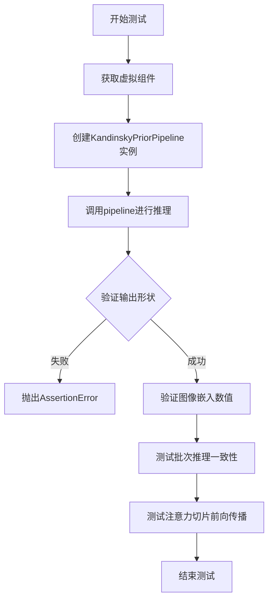

## 类结构

```
Dummies (测试辅助类)
└── 属性方法
    ├── text_embedder_hidden_size
    ├── time_input_dim
    ├── block_out_channels_0
    ├── time_embed_dim
    ├── cross_attention_dim
    ├── dummy_tokenizer
    ├── dummy_text_encoder
    ├── dummy_prior
    ├── dummy_image_encoder
    ├── dummy_image_processor
    ├── get_dummy_components()
    └── get_dummy_inputs()

KandinskyPriorPipelineFastTests (测试用例类)
├── 类属性
│   ├── pipeline_class
│   ├── params
│   ├── batch_params
│   ├── required_optional_params
│   ├── test_xformers_attention
│   └── supports_dduf
└── 测试方法
    ├── get_dummy_components()
    ├── get_dummy_inputs()
    ├── test_kandinsky_prior()
    ├── test_inference_batch_single_identical()
    └── test_attention_slicing_forward_pass()
```

## 全局变量及字段


### `unittest`
    
Python标准库单元测试模块，用于创建和运行测试用例

类型：`module`
    


### `np`
    
NumPy库，用于数值计算和数组操作

类型：`module`
    


### `torch`
    
PyTorch深度学习框架，提供张量运算和神经网络构建功能

类型：`module`
    


### `nn`
    
PyTorch神经网络模块，提供层和损失函数定义

类型：`module`
    


### `CLIPImageProcessor`
    
CLIP模型图像预处理器，用于图像预处理和归一化

类型：`class`
    


### `CLIPTextConfig`
    
CLIP文本模型配置类，定义文本编码器的结构参数

类型：`class`
    


### `CLIPTextModelWithProjection`
    
CLIP文本编码器模型，带有投影层用于生成文本嵌入

类型：`class`
    


### `CLIPTokenizer`
    
CLIP分词器，用于将文本转换为token ID序列

类型：`class`
    


### `CLIPVisionConfig`
    
CLIP视觉模型配置类，定义图像编码器的结构参数

类型：`class`
    


### `CLIPVisionModelWithProjection`
    
CLIP视觉编码器模型，带有投影层用于生成图像嵌入

类型：`class`
    


### `KandinskyPriorPipeline`
    
Kandinsky先验管道，用于生成图像先验嵌入

类型：`class`
    


### `PriorTransformer`
    
先验变换器模型，用于处理图像嵌入生成

类型：`class`
    


### `UnCLIPScheduler`
    
UnCLIP调度器，管理去噪过程中的时间步和采样策略

类型：`class`
    


### `PipelineTesterMixin`
    
管道测试混入类，提供通用的管道测试方法

类型：`class`
    


### `enable_full_determinism`
    
启用完全确定性模式的函数，确保测试可复现

类型：`function`
    


### `Dummies.text_embedder_hidden_size`
    
文本嵌入器的隐藏层维度大小

类型：`int`
    


### `Dummies.time_input_dim`
    
时间输入维度，用于时间嵌入

类型：`int`
    


### `Dummies.block_out_channels_0`
    
第一个块的输出通道数

类型：`int`
    


### `Dummies.time_embed_dim`
    
时间嵌入层的维度大小

类型：`int`
    


### `Dummies.cross_attention_dim`
    
交叉注意力机制的维度

类型：`int`
    


### `Dummies.dummy_tokenizer`
    
虚拟CLIP分词器实例

类型：`CLIPTokenizer`
    


### `Dummies.dummy_text_encoder`
    
虚拟CLIP文本编码器实例

类型：`CLIPTextModelWithProjection`
    


### `Dummies.dummy_prior`
    
虚拟先验变换器模型实例

类型：`PriorTransformer`
    


### `Dummies.dummy_image_encoder`
    
虚拟CLIP图像编码器实例

类型：`CLIPVisionModelWithProjection`
    


### `Dummies.dummy_image_processor`
    
虚拟图像处理器实例

类型：`CLIPImageProcessor`
    


### `KandinskyPriorPipelineFastTests.pipeline_class`
    
被测试的管道类KandinskyPriorPipeline

类型：`type`
    


### `KandinskyPriorPipelineFastTests.params`
    
管道参数列表，仅包含prompt

类型：`list`
    


### `KandinskyPriorPipelineFastTests.batch_params`
    
批处理参数列表，包含prompt和negative_prompt

类型：`list`
    


### `KandinskyPriorPipelineFastTests.required_optional_params`
    
必需的可选参数列表

类型：`list`
    


### `KandinskyPriorPipelineFastTests.test_xformers_attention`
    
是否测试xformers注意力机制

类型：`bool`
    


### `KandinskyPriorPipelineFastTests.supports_dduf`
    
是否支持DDUF采样方法

类型：`bool`
    
    

## 全局函数及方法


### `enable_full_determinism`

设置PyTorch和NumPy的随机种子，以确保测试的完全确定性（可复现性）。该函数通常用于测试环境，以消除随机性带来的测试结果不确定性。

参数：无需参数

返回值：`None`，该函数不返回任何值

#### 流程图

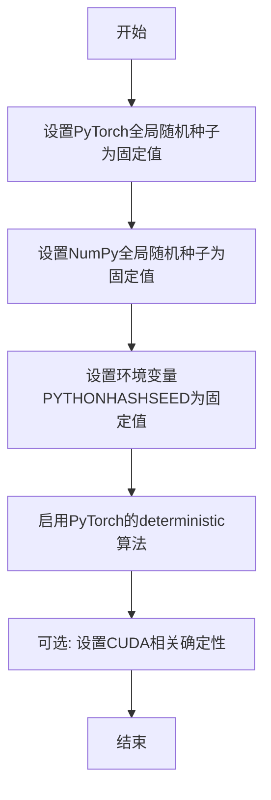

#### 带注释源码

```
# 注意：以下是基于代码上下文的推断，因为该函数定义不在当前代码文件中
# 该函数从 testing_utils 模块导入，位于 .../testing_utils.py 中

def enable_full_determinism(seed: int = 0, *args, **kwargs):
    """
    启用完全确定性模式，确保测试结果可复现。
    
    参数:
        seed: 随机种子，默认为0
        *args, **kwargs: 可能的额外参数（从实际调用来看未使用）
    """
    # 设置PyTorch的全局随机种子
    torch.manual_seed(seed)
    torch.cuda.manual_seed_all(seed)
    
    # 设置NumPy的全局随机种子
    np.random.seed(seed)
    
    # 设置Python哈希种子以确保哈希操作的一致性
    os.environ["PYTHONHASHSEED"] = str(seed)
    
    # 启用PyTorch的确定性算法（可能会影响性能）
    torch.backends.cudnn.deterministic = True
    torch.backends.cudnn.benchmark = False
    
    # 可选：设置torch.use_deterministic_algorithms()
    torch.use_deterministic_algorithms(True)

# 在当前测试文件中的调用
enable_full_determinism()
```

#### 说明

由于 `enable_full_determinism` 函数的实际定义位于 `testing_utils` 模块中（从 `...testing_utils` 导入），而在当前提供的代码片段中仅包含导入和调用语句，因此以上源码是基于该函数的典型实现方式的合理推断。

该函数在测试文件开头被调用，目的是确保后续所有随机操作（模型权重初始化、采样过程等）在每次运行测试时都能产生完全一致的结果，这对于单元测试的稳定性和可复现性至关重要。


基于提供的代码分析，`skip_mps` 函数并非在该代码文件中定义，而是从外部模块 `testing_utils` 导入的装饰器。以下是基于其使用方式的分析：

### `skip_mps`

装饰器函数，用于在测试执行时跳过 Metal Performance Shaders (MPS) 设备上的测试用例。

参数：
- 无直接参数（作为装饰器使用，接收被装饰的函数作为参数）

返回值：无直接返回值（作为装饰器使用，返回包装后的函数）

#### 流程图

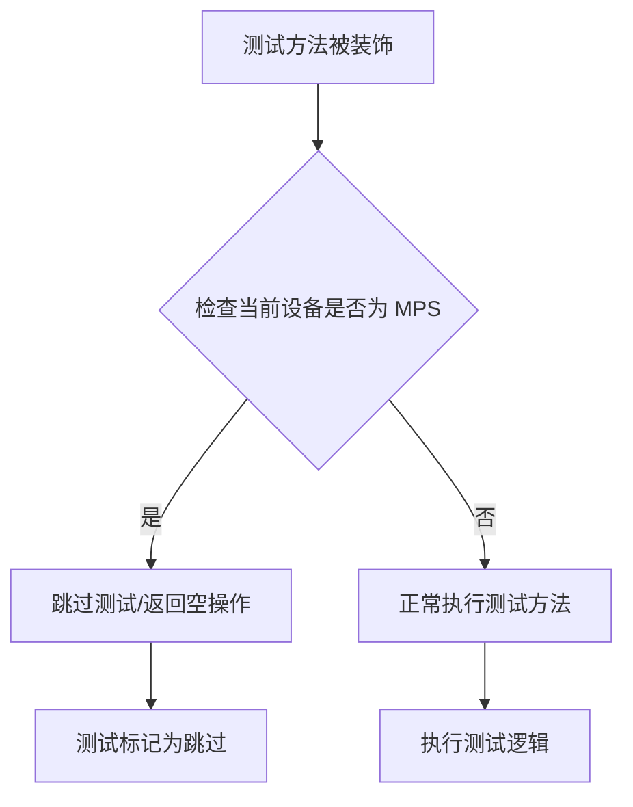

#### 带注释源码

```python
# 该函数定义在 testing_utils 模块中，当前文件通过以下方式导入：
from ...testing_utils import enable_full_determinism, skip_mps, torch_device

# 在代码中的使用方式：
@skip_mps
def test_inference_batch_single_identical(self):
    """当设备为 MPS 时跳过的测试方法"""
    self._test_inference_batch_single_identical(expected_max_diff=1e-2)

@skip_mps  
def test_attention_slicing_forward_pass(self):
    """当设备为 MPS 时跳过的测试方法"""
    test_max_difference = torch_device == "cpu"
    test_mean_pixel_difference = False
    self._test_attention_slicing_forward_pass(
        test_max_difference=test_max_difference,
        test_mean_pixel_difference=test_mean_pixel_difference,
    )
```

---

**注意**：由于 `skip_mps` 函数的完整源码定义不在当前提供的代码文件中，以上信息基于：
1. 导入语句：`from ...testing_utils import skip_mps`
2. 使用方式：作为装饰器 `@skip_mps` 使用
3. 函数命名：推断其功能为"跳过MPS测试"（MPS是Apple Silicon的GPU加速框架）


### `torch_device`

`torch_device`是从`testing_utils`模块导入的全局变量/函数，用于获取当前PyTorch运行时所使用的设备（如"cpu"、"cuda"等）。

#### 流程图

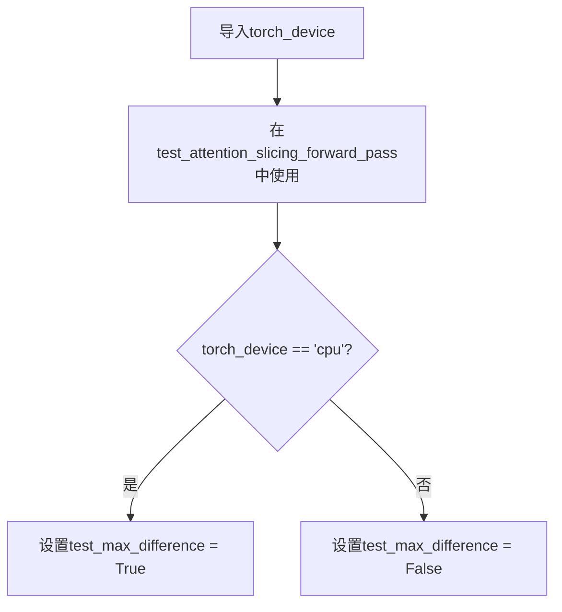

#### 带注释源码

```python
# 从testing_utils模块导入torch_device
# 注意：此函数/变量定义在外部模块中，当前文件只是导入使用
from ...testing_utils import enable_full_determinism, skip_mps, torch_device

# 在测试方法中使用torch_device
@skip_mps
def test_attention_slicing_forward_pass(self):
    # torch_device用于判断当前设备是否为CPU
    # 如果是CPU则允许进行最大差异测试，否则不允许（因为GPU结果可能因并行计算而略有不同）
    test_max_difference = torch_device == "cpu"
    test_mean_pixel_difference = False

    self._test_attention_slicing_forward_pass(
        test_max_difference=test_max_difference,
        test_mean_pixel_difference=test_mean_pixel_difference,
    )
```

---

**说明**：`torch_device`并非在此代码文件中定义，而是从`...testing_utils`模块导入的。根据代码中的使用方式（`torch_device == "cpu"`），它应该是一个字符串类型的全局变量或返回设备字符串的函数，用于标识当前PyTorch运行所在的设备平台（如"cpu"、"cuda"、"mps"等）。


### `test_kandinsky_prior`

这是KandinskyPriorPipelineFastTests类中的一个测试方法，用于验证Kandinsky先验管道（KandinskyPriorPipeline）的核心功能是否正确，包括图像嵌入生成、批处理输出和数值精度。

参数：

- `self`：`KandinskyPriorPipelineFastTests`，测试类实例本身，包含pipeline_class和必要的测试配置

返回值：`None`（无返回值），该方法为测试用例，通过assert语句进行断言验证

#### 流程图

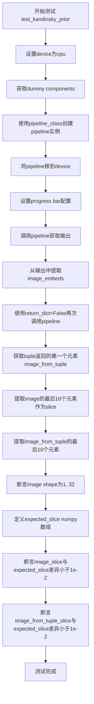

#### 带注释源码

```python
def test_kandinsky_prior(self):
    """
    测试KandinskyPriorPipeline的核心功能
    验证图像嵌入生成、输出格式和数值精度
    """
    # 1. 设置测试设备为CPU
    device = "cpu"

    # 2. 获取虚拟组件（dummy components）
    # 包含prior、image_encoder、text_encoder、tokenizer、scheduler、image_processor
    components = self.get_dummy_components()

    # 3. 使用虚拟组件创建KandinskyPriorPipeline实例
    pipe = self.pipeline_class(**components)
    # 4. 将pipeline移动到指定设备
    pipe = pipe.to(device)

    # 5. 设置进度条配置（disable=None表示不禁用进度条）
    pipe.set_progress_bar_config(disable=None)

    # 6. 调用pipeline进行推理，获取输出
    # 使用get_dummy_inputs获取虚拟输入：prompt="horse", guidance_scale=4.0等
    output = pipe(**self.get_dummy_inputs(device))
    # 7. 从输出中提取image_embeds（图像嵌入）
    image = output.image_embeds

    # 8. 测试return_dict=False的情况（返回tuple而非对象）
    image_from_tuple = pipe(
        **self.get_dummy_inputs(device),
        return_dict=False,
    )[0]  # 获取tuple的第一个元素

    # 9. 提取image的最后10个特征维度用于验证
    image_slice = image[0, -10:]

    # 10. 提取image_from_tuple的最后10个特征维度用于验证
    image_from_tuple_slice = image_from_tuple[0, -10:]

    # 11. 断言：验证输出的shape为(1, 32)
    # batch_size=1, embedding_dim=32
    assert image.shape == (1, 32)

    # 12. 定义期望的数值slice（用于精度验证）
    expected_slice = np.array(
        [-0.5948, 0.1875, -0.1523, -1.1995, -1.4061, -0.6367, -1.4607, -0.6406, 0.8793, -0.3891]
    )

    # 13. 断言：验证默认输出与期望值的差异小于1e-2
    assert np.abs(image_slice.flatten() - expected_slice).max() < 1e-2
    
    # 14. 断言：验证tuple输出与期望值的差异小于1e-2
    assert np.abs(image_from_tuple_slice.flatten() - expected_slice).max() < 1e-2
```


### `KandinskyPriorPipelineFastTests.test_inference_batch_single_identical`

该测试方法用于验证批处理推理结果与单样本推理结果的一致性，确保管道在批处理模式下能产生与单独处理每个样本相同的输出。

参数：

- `self`：`KandinskyPriorPipelineFastTests` 实例，隐式参数，测试类实例本身

返回值：`None`，该方法为测试方法，不返回任何值，通过断言验证正确性

#### 流程图

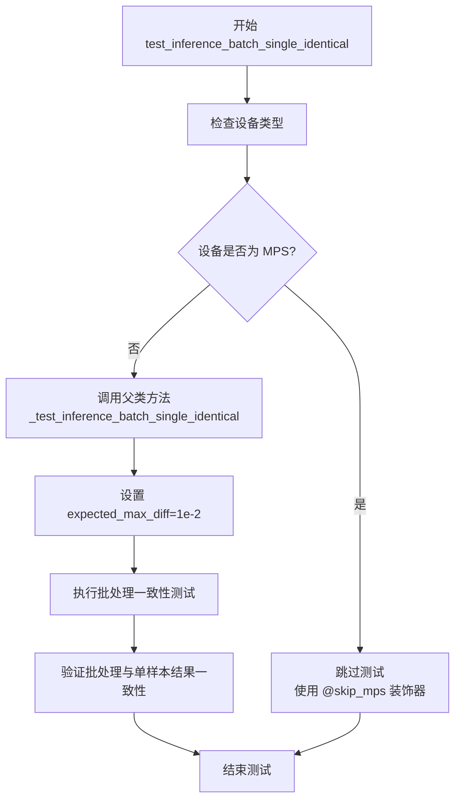

#### 带注释源码

```python
@skip_mps
def test_inference_batch_single_identical(self):
    """
    测试批处理推理与单样本推理的一致性。
    
    该测试方法验证当使用批处理（多个prompt）推理时，
    结果应该与逐个单独推理的结果一致。
    
    使用 @skip_mps 装饰器跳过 MPS (Metal Performance Shaders) 设备上的测试，
    因为 MPS 可能存在数值精度问题。
    """
    # 调用父类 PipelineTesterMixin 提供的测试方法
    # expected_max_diff=1e-2 表示允许的最大误差为 0.01
    self._test_inference_batch_single_identical(expected_max_diff=1e-2)
```

#### 补充信息

- **所属类**：`KandinskyPriorPipelineFastTests`
- **继承自**：`PipelineTesterMixin` 和 `unittest.TestCase`
- **调用方法**：内部调用 `_test_inference_batch_single_identical(expected_max_diff=1e-2)`，该方法定义在 `PipelineTesterMixin` 基类中
- **装饰器**：`@skip_mps` - 用于跳过 Apple Silicon MPS 设备上的测试
- **测试目的**：验证 `KandinskyPriorPipeline` 管道在批处理模式下的一致性，确保图像嵌入（image_embeds）在批处理和单样本模式下数值接近


### `test_attention_slicing_forward_pass`

该函数是 KandinskyPriorPipelineFastTests 类中的一个测试方法，用于验证注意力切片（attention slicing）功能的前向传递是否正常工作，通过调用混入类 PipelineTesterMixin 提供的通用测试逻辑来执行注意力切片相关的单元测试。

参数：

- `self`：`KandinskyPriorPipelineFastTests`，测试类实例本身，包含管道和测试所需的状态
- `test_max_difference`：`bool`，指示是否在 CPU 上测试最大差异，值为 `torch_device == "cpu"` 的比较结果
- `test_mean_pixel_difference`：`bool`，指示是否测试像素平均值差异，此处固定为 `False`

返回值：`None`，该方法为测试方法，不返回任何值，主要通过断言验证内部逻辑的正确性

#### 流程图

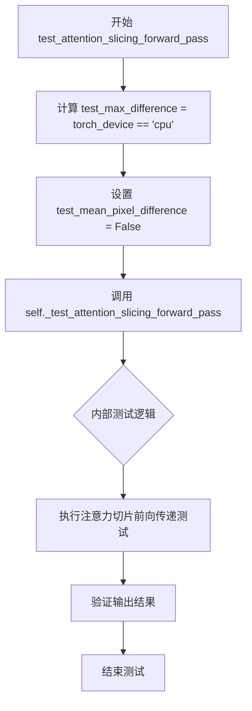

#### 带注释源码

```python
@skip_mps
def test_attention_slicing_forward_pass(self):
    """
    测试注意力切片功能的前向传递是否正常工作。
    该装饰器跳过在 MPS (Apple Silicon) 设备上的测试。
    """
    # 根据当前设备判断是否需要测试最大差异
    # 如果设备是 CPU，则启用最大差异测试
    test_max_difference = torch_device == "cpu"
    
    # 设置是否测试像素平均值差异
    # 当前设置为 False，不进行像素平均值差异测试
    test_mean_pixel_difference = False

    # 调用父类/混入类提供的通用注意力切片测试方法
    # 传入两个测试配置参数执行具体的测试逻辑
    self._test_attention_slicing_forward_pass(
        test_max_difference=test_max_difference,
        test_mean_pixel_difference=test_mean_pixel_difference,
    )
```


### `Dummies.get_dummy_components`

该方法是 `Dummies` 类的核心方法，用于生成和组装 KandinskyPriorPipeline 所需的全部虚拟（dummy）组件。它通过调用各类属性方法获取各个模型组件和调度器，然后将它们组装成一个字典返回，供管道初始化使用。

参数：
- 无（仅包含 `self` 隐式参数）

返回值：`Dict[str, Any]`，返回包含 prior、image_encoder、text_encoder、tokenizer、scheduler 和 image_processor 的组件字典，用于初始化 KandinskyPriorPipeline。

#### 流程图

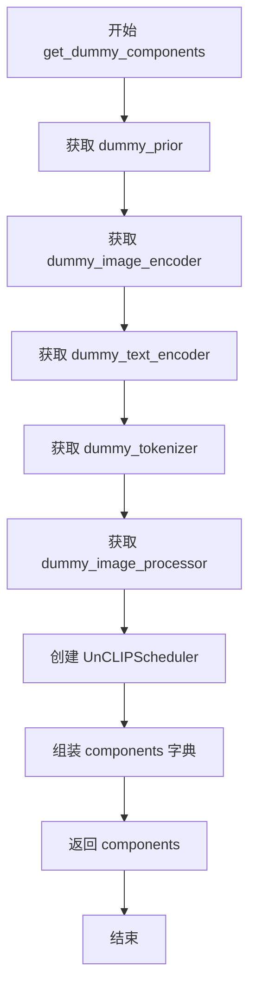

#### 带注释源码

```python
def get_dummy_components(self):
    # 获取虚拟的 PriorTransformer 模型
    prior = self.dummy_prior
    
    # 获取虚拟的 CLIP 图像编码器模型
    image_encoder = self.dummy_image_encoder
    
    # 获取虚拟的 CLIP 文本编码器模型
    text_encoder = self.dummy_text_encoder
    
    # 获取虚拟的 CLIP 分词器
    tokenizer = self.dummy_tokenizer
    
    # 获取虚拟的图像处理器
    image_processor = self.dummy_image_processor

    # 创建 UnCLIP 调度器，配置方差类型、预测类型、时间步数等参数
    scheduler = UnCLIPScheduler(
        variance_type="fixed_small_log",
        prediction_type="sample",
        num_train_timesteps=1000,
        clip_sample=True,
        clip_sample_range=10.0,
    )

    # 将所有组件组装成字典，键名为管道预期的组件名称
    components = {
        "prior": prior,
        "image_encoder": image_encoder,
        "text_encoder": text_encoder,
        "tokenizer": tokenizer,
        "scheduler": scheduler,
        "image_processor": image_processor,
    }

    # 返回完整的组件字典，供管道初始化使用
    return components
```


### `Dummies.get_dummy_inputs`

该方法用于生成测试所需的虚拟输入参数，包括提示词、随机生成器、引导_scale、推理步数和输出类型等，封装成字典返回供管道测试使用。

参数：

- `device`：`str`，目标设备标识符，用于确定如何创建随机生成器（如 "cpu"、"cuda"、"mps" 等）
- `seed`：`int`，随机种子，默认值为 `0`，用于初始化随机生成器以确保测试可复现

返回值：`dict`，包含以下键值对的字典：
- `"prompt"`：`str`，测试用的提示词，固定为 `"horse"`
- `generator`：`torch.Generator` 或 `torch.random.Generator`，随机数生成器
- `guidance_scale`：`float`，引导 scale，固定为 `4.0`
- `num_inference_steps`：`int`，推理步数，固定为 `2`
- `output_type`：`str`，输出类型，固定为 `"np"`（numpy 数组）

#### 流程图

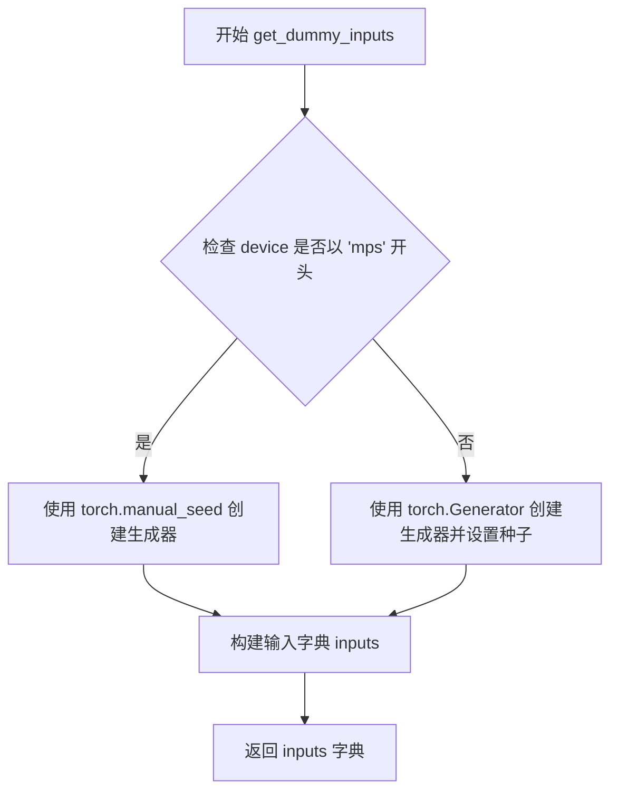

#### 带注释源码

```python
def get_dummy_inputs(self, device, seed=0):
    """
    生成用于测试的虚拟输入参数
    
    参数:
        device: 目标设备标识符
        seed: 随机种子，用于确保测试可复现
    
    返回:
        dict: 包含测试所需的各项参数
    """
    # 判断设备类型，MPS (Apple Silicon) 需要特殊处理
    if str(device).startswith("mps"):
        # MPS 设备使用 torch.manual_seed
        generator = torch.manual_seed(seed)
    else:
        # 其他设备（cpu/cuda）使用 torch.Generator 并手动设置种子
        generator = torch.Generator(device=device).manual_seed(seed)
    
    # 构建测试输入字典
    inputs = {
        "prompt": "horse",                      # 测试用提示词
        "generator": generator,                  # 随机数生成器
        "guidance_scale": 4.0,                  # Classifier-free guidance scale
        "num_inference_steps": 2,                # 推理时的采样步数
        "output_type": "np",                     # 输出格式为 numpy 数组
    }
    
    return inputs
```


### `Dummies.text_embedder_hidden_size`

该属性是 `Dummies` 类中的一个只读属性，用于返回文本嵌入器（text embedder）的隐藏层大小。在测试场景中，它提供了一个固定的整数值（32），用于配置文本编码器模型的隐藏维度，是构建虚拟测试组件的关键参数之一。

参数： 无

返回值：`int`，返回文本嵌入器的隐藏层大小，固定值为 32。

#### 流程图

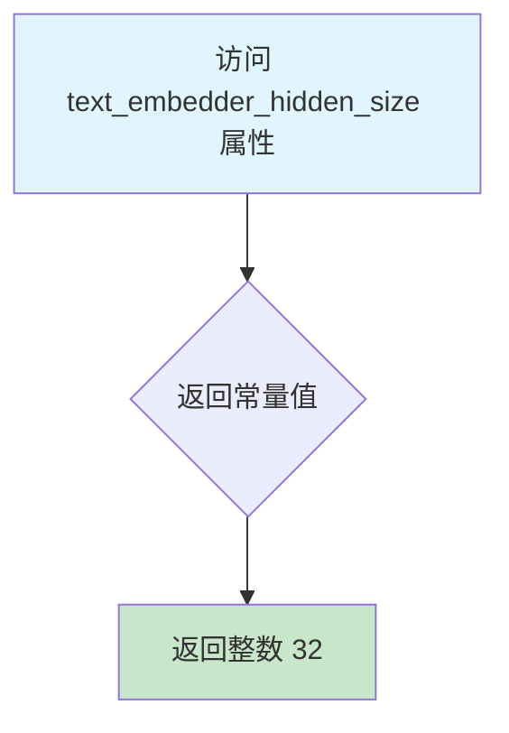

#### 带注释源码

```python
class Dummies:
    """
    Dummies 类用于生成测试所需的虚拟（dummy）组件。
    该类提供了多个属性和方法，用于创建文本编码器、图像编码器、
    分词器、调度器等测试所需的模拟对象。
    """
    
    @property
    def text_embedder_hidden_size(self):
        """
        文本嵌入器隐藏层大小属性。
        
        该属性返回文本编码器模型的隐藏层维度大小。
        在测试场景中使用固定值 32，以便创建轻量级的虚拟模型进行单元测试。
        这个值会影响以下组件的配置：
        - CLIPTextConfig 的 hidden_size 和 projection_dim
        - PriorTransformer 的 embedding_dim
        - CLIPVisionConfig 的 hidden_size 和 projection_dim
        
        Returns:
            int: 隐藏层大小，固定返回 32
        """
        return 32
```


### `Dummies.time_input_dim`

该属性是 `Dummies` 类的时间输入维度属性，返回一个整数值 32，用于定义时间（timestep）输入的维度大小。该属性通常用于确定模型中时间嵌入层的输入维度，是 Kandinsky 先验管道测试中虚拟组件的关键配置参数之一。

参数：

- `self`：`Dummies` 类型，隐式参数，表示类的实例本身

返回值：`int`，返回时间输入维度值，当前固定返回 32。该值决定了时间嵌入层（time embedding layer）的输入维度大小，与 `block_out_channels_0` 属性相关联，并影响 `time_embed_dim` 的计算（`time_input_dim * 4`）。

#### 流程图

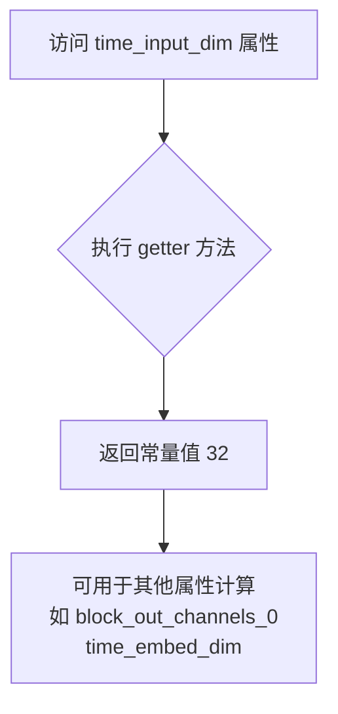

#### 带注释源码

```python
@property
def time_input_dim(self):
    """
    时间输入维度属性。
    
    返回值:
        int: 时间嵌入层的输入维度大小，固定返回 32。
        该值用于确定模型中时间相关层的维度配置。
    """
    return 32
```

#### 相关属性依赖关系

```python
# time_input_dim 被其他属性使用的关系：

@property
def block_out_channels_0(self):
    """块输出通道数，等于 time_input_dim"""
    return self.time_input_dim

@property
def time_embed_dim(self):
    """时间嵌入维度，等于 time_input_dim * 4"""
    return self.time_input_dim * 4
```

#### 使用场景说明

该属性在 `get_dummy_components` 方法中被间接使用，用于构建虚拟的 PriorTransformer 模型配置。具体来说，它通过影响 `text_embedder_hidden_size`、`block_out_channels_0` 和 `time_embed_dim` 等相关属性，最终影响模型的结构参数设置。


### `Dummies.block_out_channels_0`

这是一个属性方法，用于获取时间输入维度（time_input_dim）的值，作为块输出通道数。在 KandinskyPriorPipeline 的测试中，该属性用于配置虚拟（dummy）组件的参数。

参数：无（该方法为属性装饰器，无显式参数）

返回值：`int`，返回时间输入维度值（32），表示块输出通道数。

#### 流程图

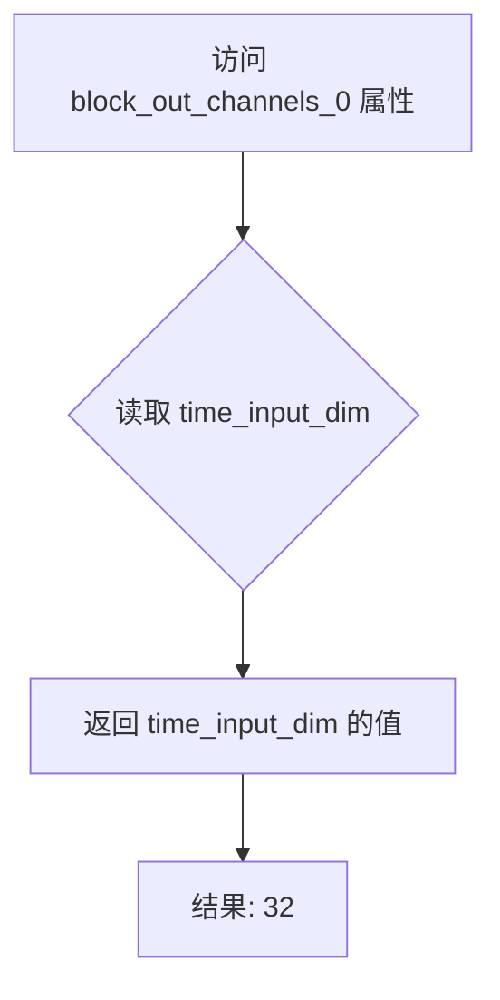

#### 带注释源码

```python
@property
def block_out_channels_0(self):
    """
    属性: block_out_channels_0
    
    描述:
        获取时间输入维度作为块输出通道数。
        该属性对应 PriorTransformer 或其他扩散模型中的通道配置。
    
    返回值:
        int: 返回 time_input_dim 的值 (32)
    """
    return self.time_input_dim
```


### `Dummies.time_embed_dim`

该属性是一个只读的计算属性，用于返回时间嵌入维度（time embedding dimension），其值等于 `time_input_dim` 属性的4倍，用于在 Kandinsky 先验管道中为时间步创建适当维度的嵌入表示。

参数：

- `self`：`Dummies` 类型，属性所属的实例对象，无需显式传递

返回值：`int`，返回时间嵌入的维度大小，计算公式为 `time_input_dim * 4`

#### 流程图

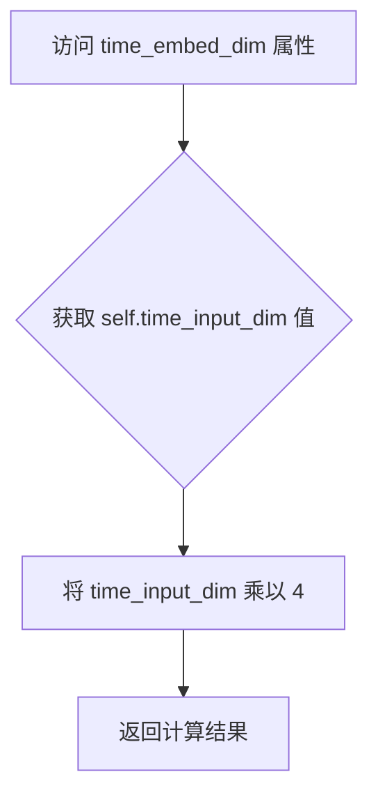

#### 带注释源码

```python
@property
def time_embed_dim(self):
    """
    计算并返回时间嵌入维度。
    
    时间嵌入维度是时间输入维度的4倍，这个缩放因子用于
    为扩散模型的时间步创建更高维度的嵌入表示，以便
    后续在先验Transformer中更好地处理时间信息。
    
    Returns:
        int: 时间嵌入维度，等于 time_input_dim * 4
    """
    return self.time_input_dim * 4
```


### `Dummies.cross_attention_dim`

交叉注意力维度属性，返回一个整数常量值 100，用于定义模型中交叉注意力机制的维度参数。

参数：

- （无参数，此为属性方法）

返回值：`int`，返回交叉注意力维度值 100

#### 流程图

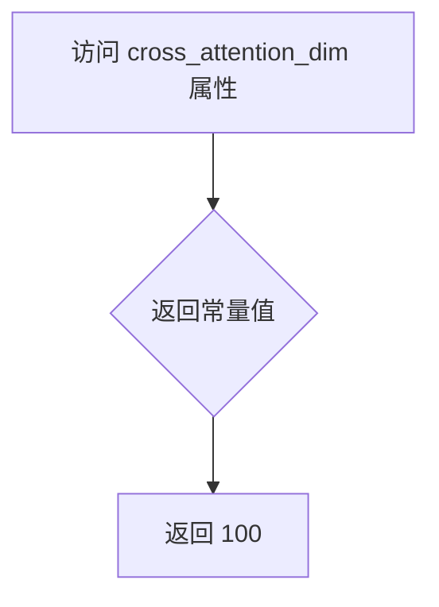

#### 带注释源码

```python
@property
def cross_attention_dim(self):
    """
    属性方法，用于获取交叉注意力维度。
    
    该属性返回一个固定的整数值 100，定义了模型中交叉注意力机制的维度。
    在 Kandin skyPriorPipeline 的上下文中，这个维度用于配置注意力机制的参数，
    确保文本和图像嵌入在共享的潜在空间中正确对齐。
    
    Returns:
        int: 交叉注意力维度值，固定返回 100
    """
    return 100
```


### `Dummies.dummy_tokenizer`

该属性用于获取一个预训练的CLIP分词器（CLIPTokenizer）实例，用于后续文本编码处理。

参数：

- `self`：`Dummies`，隐式参数，指向当前 Dummies 实例本身

返回值：`CLIPTokenizer`，返回从 HuggingFace Hub 预训练模型 "hf-internal-testing/tiny-random-clip" 加载的 CLIPTokenizer 实例

#### 流程图

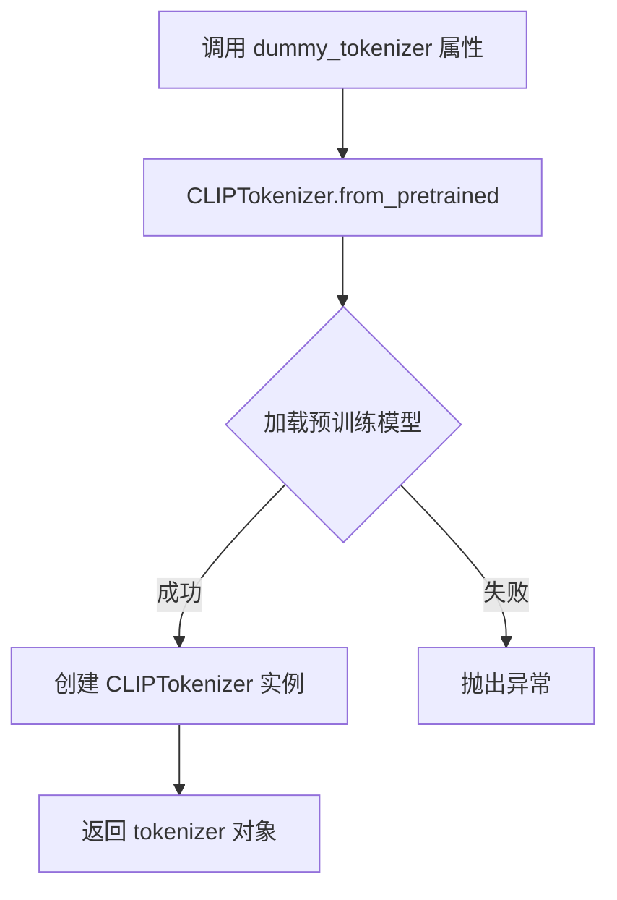

#### 带注释源码

```python
@property
def dummy_tokenizer(self):
    # 使用 HuggingFace Transformers 库的 CLIPTokenizer
    # 从预训练模型 'hf-internal-testing/tiny-random-clip' 加载分词器
    # 该模型是一个轻量级的测试用 CLIP 模型
    tokenizer = CLIPTokenizer.from_pretrained("hf-internal-testing/tiny-random-clip")
    # 返回加载完成的 tokenizer 实例，供后续文本编码使用
    return tokenizer
```

---

#### 关联信息

**所属类**: `Dummies`

**关键组件**:

- `CLIPTokenizer`：HuggingFace Transformers 库提供的 CLIP 文本分词器，用于将文本转换为 token ID 序列

**技术债务/优化空间**:

1. **硬编码模型路径**: 预训练模型路径 "hf-internal-testing/tiny-random-clip" 被硬编码在属性中，建议抽取为类常量或配置参数
2. **未缓存tokenizer**: 每次访问属性都会重新加载 tokenizer 实例，在测试场景中可能造成性能开销，可考虑使用 `@functools.cached_property` 或在类初始化时缓存

**设计约束**:

- 依赖 HuggingFace Transformers 库中的 `CLIPTokenizer`
- 返回的 tokenizer 必须与 `dummy_text_encoder` 的配置兼容（vocab_size=1000）


### `Dummies.dummy_text_encoder`

该属性是一个只读的 `@property` 方法，用于创建并返回一个配置好的 `CLIPTextModelWithProjection` 文本编码器模型实例，主要用于测试目的，通过预设的随机种子和配置参数生成一个可复现的虚拟模型。

参数：

- `self`：`Dummies`，属性所属的类实例本身，无需显式传递

返回值：`CLIPTextModelWithProjection`，返回一个配置好的 CLIP 文本编码器模型（带投影层），用于处理文本输入并生成文本嵌入向量

#### 流程图

```mermaid
flowchart TD
    A[调用 dummy_text_encoder 属性] --> B[设置随机种子 torch.manual_seed(0)]
    B --> C[获取 text_embedder_hidden_size = 32]
    C --> D[创建 CLIPTextConfig 配置对象]
    D --> E[配置模型参数: hidden_size, projection_dim, intermediate_size等]
    E --> F[使用配置创建 CLIPTextModelWithProjection 模型实例]
    F --> G[返回模型实例]
```

#### 带注释源码

```python
@property
def dummy_text_encoder(self):
    """
    创建一个用于测试的虚拟 CLIP 文本编码器模型
    
    该方法通过设置固定随机种子来确保每次调用都返回相同配置的模型，
    以便测试用例的可重复性。模型配置使用较小的参数以加快测试速度。
    
    Returns:
        CLIPTextModelWithProjection: 配置好的文本编码器模型实例
    """
    # 设置随机种子为0，确保模型初始化的可复现性
    torch.manual_seed(0)
    
    # 创建 CLIP 文本模型配置对象
    config = CLIPTextConfig(
        bos_token_id=0,           # 起始token ID
        eos_token_id=2,           # 结束token ID
        hidden_size=self.text_embedder_hidden_size,  # 隐藏层大小 (32)
        projection_dim=self.text_embedder_hidden_size,  # 投影维度 (32)
        intermediate_size=37,     # 前馈网络中间层大小
        layer_norm_eps=1e-05,     # LayerNorm  epsilon
        num_attention_heads=4,    # 注意力头数量
        num_hidden_layers=5,      # 隐藏层数量
        pad_token_id=1,           # 填充token ID
        vocab_size=1000,          # 词汇表大小
    )
    
    # 使用配置创建 CLIPTextModelWithProjection 模型并返回
    return CLIPTextModelWithProjection(config)
```


### `Dummies.dummy_prior`

该属性是一个测试用 fixture，用于创建一个配置好的 `PriorTransformer` 模型实例。它通过设置特定的模型参数（注意力头数、注意力头维度、嵌入维度等）并对模型进行随机种子固定，以确保测试的可重复性。同时，该属性还会修改模型的 `clip_std` 参数为全1，以避免后处理时返回全零结果。

参数：
- `self`：`Dummies` 类型，属性所属的类实例（隐式参数，无需显式传入）

返回值：`PriorTransformer`，返回一个配置好的 PriorTransformer 模型实例，用于 KandinskyPriorPipeline 的单元测试

#### 流程图

```mermaid
flowchart TD
    A[调用 dummy_prior 属性] --> B[设置随机种子 torch.manual_seed(0)]
    C[构建 model_kwargs 字典] --> D[num_attention_heads: 2]
    C --> E[attention_head_dim: 12]
    C --> F[embedding_dim: self.text_embedder_hidden_size]
    C --> G[num_layers: 1]
    B --> C
    H[创建 PriorTransformer 实例] --> I[传入 model_kwargs]
    I --> J[获取模型实例]
    J --> K[设置 clip_std 为全1的张量]
    K --> L[返回模型实例]
```

#### 带注释源码

```python
@property
def dummy_prior(self):
    """
    创建并返回一个用于测试的 PriorTransformer 模型实例。
    
    该属性用于 KandinskyPriorPipeline 的单元测试，创建一个具有特定配置的
    PriorTransformer 模型。模型参数经过优化，以确保测试的确定性和可重复性。
    
    Returns:
        PriorTransformer: 配置好的 PriorTransformer 模型实例
    """
    # 设置随机种子为 0，确保测试的可重复性
    torch.manual_seed(0)

    # 定义模型配置参数
    model_kwargs = {
        "num_attention_heads": 2,          # 注意力头数量
        "attention_head_dim": 12,          # 每个注意力头的维度
        "embedding_dim": self.text_embedder_hidden_size,  # 嵌入维度（来自类属性）
        "num_layers": 1,                   # 层数（设置为1以加快测试速度）
    }

    # 使用指定参数创建 PriorTransformer 模型实例
    model = PriorTransformer(**model_kwargs)
    
    # clip_std 和 clip_mean 初始化为 0，导致 PriorTransformer.post_process_latents 
    # 始终返回 0。为了避免这种情况，将 clip_std 设置为全1的张量
    model.clip_std = nn.Parameter(torch.ones(model.clip_std.shape))
    
    # 返回配置好的模型实例
    return model
```


### `Dummies.dummy_image_encoder`

这是一个测试用的小型CLIP Vision模型生成属性（property），用于创建虚拟的图像编码器组件。该属性通过固定随机种子和预设配置来生成可复现的测试模型实例，主要服务于Kandinsky PriorPipeline的单元测试场景。

参数：

- `self`：无类型（隐式参数），类的实例本身，用于访问同类中的其他属性（如 `text_embedder_hidden_size`）

返回值：`CLIPVisionModelWithProjection`，返回配置好的CLIP视觉模型实例，包含图像编码和投影功能，用于测试目的

#### 流程图

```mermaid
flowchart TD
    A[访问 dummy_image_encoder 属性] --> B[设置随机种子 torch.manual_seed(0)]
    B --> C[创建 CLIPVisionConfig 配置对象]
    C --> D[使用配置实例化 CLIPVisionModelWithProjection 模型]
    D --> E[返回模型实例]
```

#### 带注释源码

```python
@property
def dummy_image_encoder(self):
    """
    测试用虚拟图像编码器属性
    
    该属性用于生成一个配置好的CLIPVisionModelWithProjection模型实例，
    专用于KandinskyPriorPipeline的单元测试场景。通过固定随机种子确保
    测试结果的可复现性。
    
    Returns:
        CLIPVisionModelWithProjection: 配置好的CLIP视觉模型实例，
                                         包含编码和投影功能
    """
    # 设置随机种子为0，确保模型初始化的一致性，便于测试用例的确定性验证
    torch.manual_seed(0)
    
    # 构建CLIPVisionConfig配置对象，参数从Dummies类的其他属性获取
    config = CLIPVisionConfig(
        hidden_size=self.text_embedder_hidden_size,      # 隐藏层维度（32）
        image_size=224,                                  # 输入图像尺寸
        projection_dim=self.text_embedder_hidden_size,   # 投影维度（32）
        intermediate_size=37,                            # 前馈网络中间层维度
        num_attention_heads=4,                           # 注意力头数量
        num_channels=3,                                  # 输入通道数（RGB）
        num_hidden_layers=5,                             # 隐藏层数量
        patch_size=14,                                   # 图像分块大小
    )

    # 使用配置实例化CLIPVisionModelWithProjection模型
    # 该模型继承自CLIPVisionModel并添加了projection层用于输出embedding
    model = CLIPVisionModelWithProjection(config)
    
    # 返回配置好的模型实例，供测试管道使用
    return model
```


### `Dummies.dummy_image_processor`

这是一个属性方法，用于创建并返回一个配置好的CLIP图像处理器（CLIPImageProcessor），该处理器用于对输入图像进行预处理，包括调整大小、中心裁剪和归一化等操作。

参数：

- `self`：属性方法所属的实例对象，无额外参数

返回值：`CLIPImageProcessor`，返回一个配置好的CLIP图像处理器实例，用于对图像进行预处理

#### 流程图

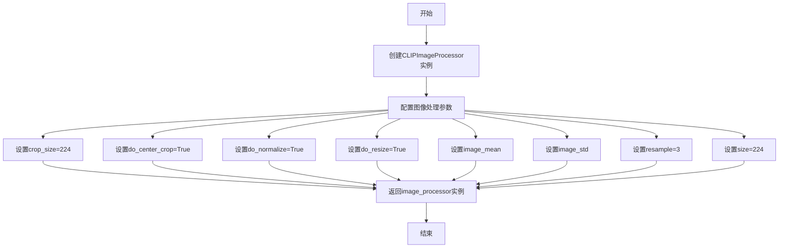

#### 带注释源码

```python
@property
def dummy_image_processor(self):
    """
    创建并返回一个配置好的CLIP图像处理器
    
    该属性用于生成一个用于测试的CLIP图像预处理器，
    包含图像大小调整、中心裁剪和归一化等配置
    """
    # 创建CLIPImageProcessor实例，配置图像处理参数
    image_processor = CLIPImageProcessor(
        crop_size=224,                    # 裁剪后的图像大小
        do_center_crop=True,              # 是否进行中心裁剪
        do_normalize=True,                # 是否进行归一化处理
        do_resize=True,                   # 是否调整图像大小
        image_mean=[0.48145466, 0.4578275, 0.40821073],  # ImageNet均值
        image_std=[0.26862954, 0.26130258, 0.27577711],  # ImageNet标准差
        resample=3,                       # 重采样方式（3代表BICUBIC）
        size=224,                         # 输入图像的目标尺寸
    )

    # 返回配置好的图像处理器实例
    return image_processor
```


### `Dummies.get_dummy_components`

该方法用于创建并返回一个包含KandinskyPriorPipeline所需的所有虚拟组件的字典。这些组件包括Prior模型、图像编码器、文本编码器、分词器、调度器和图像处理器，用于单元测试目的。

参数：

- `self`：`Dummies` 实例，代表当前虚拟组件对象

返回值：`dict`，返回一个包含以下键的字典：
- `prior`：PriorTransformer模型实例
- `image_encoder`：CLIPVisionModelWithProjection模型实例
- `text_encoder`：CLIPTextModelWithProjection模型实例
- `tokenizer`：CLIPTokenizer分词器实例
- `scheduler`：UnCLIPScheduler调度器实例
- `image_processor`：CLIPImageProcessor图像处理器实例

#### 流程图

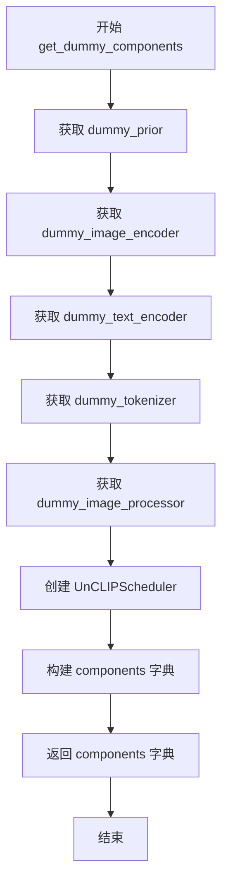

#### 带注释源码

```python
def get_dummy_components(self):
    """
    创建并返回KandinskyPriorPipeline所需的虚拟组件字典。
    这些组件用于单元测试，避免使用真实的大型模型。
    
    Returns:
        dict: 包含所有pipeline组件的字典
    """
    # 获取Prior模型实例（用于生成图像嵌入）
    prior = self.dummy_prior
    
    # 获取CLIP图像编码器实例（用于编码图像）
    image_encoder = self.dummy_image_encoder
    
    # 获取CLIP文本编码器实例（用于编码文本提示）
    text_encoder = self.dummy_text_encoder
    
    # 获取分词器实例（用于将文本转换为token）
    tokenizer = self.dummy_tokenizer
    
    # 获取图像预处理器实例（用于处理输入图像）
    image_processor = self.dummy_image_processor
    
    # 创建UnCLIP调度器
    # 参数说明：
    # - variance_type: 方差类型，设为"fixed_small_log"
    # - prediction_type: 预测类型，设为"sample"
    # - num_train_timesteps: 训练时间步数，设为1000
    # - clip_sample: 是否裁剪采样，设为True
    # - clip_sample_range: 采样裁剪范围，设为10.0
    scheduler = UnCLIPScheduler(
        variance_type="fixed_small_log",
        prediction_type="sample",
        num_train_timesteps=1000,
        clip_sample=True,
        clip_sample_range=10.0,
    )
    
    # 组装所有组件到字典中
    # 键名与KandinskyPriorPipeline的构造函数参数名对应
    components = {
        "prior": prior,                      # PriorTransformer模型
        "image_encoder": image_encoder,      # CLIP图像编码器
        "text_encoder": text_encoder,        # CLIP文本编码器
        "tokenizer": tokenizer,              # 分词器
        "scheduler": scheduler,              # 噪声调度器
        "image_processor": image_processor,  # 图像处理器
    }
    
    # 返回组件字典，供pipeline初始化使用
    return components
```


### `Dummies.get_dummy_inputs`

该方法用于生成 KandinskyPriorPipeline 的虚拟测试输入参数，根据设备类型创建随机数生成器，并返回一个包含提示词、生成器、引导比例、推理步数和输出类型的字典。

参数：

- `device`：`str`，目标运行设备（如 "cpu"、"cuda"、"mps" 等）
- `seed`：`int`，随机种子，默认值为 0，用于初始化生成器

返回值：`Dict[str, Any]`，返回包含虚拟输入参数的字典，包括 prompt（提示词）、generator（随机数生成器）、guidance_scale（引导比例）、num_inference_steps（推理步数）和 output_type（输出类型）

#### 流程图

```mermaid
flowchart TD
    A[开始 get_dummy_inputs] --> B{device 以 'mps' 开头?}
    B -->|是| C[使用 torch.manual_seed 创建生成器]
    B -->|否| D[使用 torch.Generator 创建生成器]
    C --> E[构建输入字典 inputs]
    D --> E
    E --> F[设置 prompt = 'horse']
    F --> G[设置 guidance_scale = 4.0]
    G --> H[设置 num_inference_steps = 2]
    H --> I[设置 output_type = 'np']
    I --> J[返回 inputs 字典]
```

#### 带注释源码

```python
def get_dummy_inputs(self, device, seed=0):
    """
    生成用于测试 KandinskyPriorPipeline 的虚拟输入参数。
    
    参数:
        device: 目标设备字符串（如 'cpu', 'cuda', 'mps'）
        seed: 随机种子，默认值为 0
    
    返回:
        包含虚拟输入参数的字典
    """
    # 判断设备是否为 Apple MPS (Metal Performance Shaders)
    if str(device).startswith("mps"):
        # MPS 设备使用 torch.manual_seed 直接设置种子
        generator = torch.manual_seed(seed)
    else:
        # 其他设备（CPU/CUDA）使用 torch.Generator 创建随机数生成器
        generator = torch.Generator(device=device).manual_seed(seed)
    
    # 构建输入参数字典
    inputs = {
        "prompt": "horse",           # 文本提示词
        "generator": generator,      # 随机数生成器对象
        "guidance_scale": 4.0,       # classifier-free guidance 引导比例
        "num_inference_steps": 2,    # 推理过程中的去噪步数
        "output_type": "np",         # 输出类型为 numpy 数组
    }
    return inputs
```


### `KandinskyPriorPipelineFastTests.get_dummy_components`

该方法为 Kandinsky Prior Pipeline 测试创建虚拟组件（dummy components），返回一个包含 prior 模型、图像编码器、文本编码器、tokenizer、调度器和图像处理器的字典，用于单元测试而不依赖真实的预训练模型。

参数：
- `self`：`KandinskyPriorPipelineFastTests` 实例，调用该方法的对象本身

返回值：`dict`，返回一个包含以下键值对的字典：
- `"prior"`：`PriorTransformer`，先验模型实例
- `"image_encoder"`：`CLIPVisionModelWithProjection`，图像编码器实例
- `"text_encoder"`：`CLIPTextModelWithProjection`，文本编码器实例
- `"tokenizer"`：`CLIPTokenizer`，分词器实例
- `"scheduler"`：`UnCLIPScheduler`，调度器实例
- `"image_processor"`：`CLIPImageProcessor`，图像处理器实例

#### 流程图

```mermaid
flowchart TD
    A[调用 get_dummy_components] --> B[创建 Dummies 实例]
    B --> C[调用 Dummies.get_dummy_components]
    C --> D[获取 dummy_prior PriorTransformer]
    C --> E[获取 dummy_image_encoder CLIPVisionModelWithProjection]
    C --> F[获取 dummy_text_encoder CLIPTextModelWithProjection]
    C --> G[获取 dummy_tokenizer CLIPTokenizer]
    C --> H[获取 dummy_image_processor CLIPImageProcessor]
    C --> I[创建 UnCLIPScheduler]
    D --> J[组装 components 字典]
    E --> J
    F --> J
    G --> J
    H --> J
    I --> J
    J --> K[返回 components 字典]
```

#### 带注释源码

```python
def get_dummy_components(self):
    """
    获取用于测试的虚拟组件。
    
    该方法创建一个 Dummies 辅助类的实例，并调用其 get_dummy_components 方法
    来获取一组完整的虚拟组件，用于初始化 KandinskyPriorPipeline 进行单元测试。
    
    Returns:
        dict: 包含虚拟组件的字典，包括 prior、image_encoder、text_encoder、
             tokenizer、scheduler 和 image_processor。
    """
    # 创建 Dummies 辅助类实例
    dummy = Dummies()
    # 调用 Dummies 类的 get_dummy_components 方法获取虚拟组件
    return dummy.get_dummy_components()
```


### `KandinskyPriorPipelineFastTests.get_dummy_inputs`

该方法为 Kandinsky Prior Pipeline 测试用例生成虚拟输入参数，封装了提示词、生成器、引导比例等推理所需的配置信息，用于确保测试的可重复性。

参数：

- `self`：`unittest.TestCase`，测试类实例本身
- `device`：`str`，目标计算设备（如 "cpu"、"cuda" 或 "mps"）
- `seed`：`int`，随机种子，默认为 0，用于初始化生成器以确保测试结果可复现

返回值：`Dict[str, Any]`，包含以下键值对的字典：
- `prompt`：提示词字符串
- `generator`：PyTorch 随机生成器
- `guidance_scale`：引导比例系数
- `num_inference_steps`：推理步数
- `output_type`：输出类型

#### 流程图

```mermaid
flowchart TD
    A[开始 get_dummy_inputs] --> B{device 以 'mps' 开头?}
    B -->|是| C[使用 torch.manual_seed 创建生成器]
    B -->|否| D[使用 torch.Generator 创建生成器]
    C --> E[构建输入字典 inputs]
    D --> E
    E --> F[返回 inputs 字典]
    
    style A fill:#f9f,stroke:#333
    style F fill:#9f9,stroke:#333
```

#### 带注释源码

```python
def get_dummy_inputs(self, device, seed=0):
    """
    为测试生成虚拟输入参数。
    
    参数:
        device: 目标设备字符串
        seed: 随机种子，用于生成器初始化
    
    返回:
        包含推理所需参数的字典
    """
    # 检查设备是否为 Apple MPS (Metal Performance Shaders)
    # MPS 不支持 torch.Generator，需要使用特殊的种子设置方式
    if str(device).startswith("mps"):
        # 对于 MPS 设备，直接使用 CPU 形式的随机种子
        generator = torch.manual_seed(seed)
    else:
        # 对于其他设备（CPU/CUDA），创建指定设备的生成器并设置种子
        generator = torch.Generator(device=device).manual_seed(seed)
    
    # 构建输入参数字典，包含:
    # - prompt: 测试用提示词 "horse"
    # - generator: 随机生成器实例
    # - guidance_scale: CFG 引导强度 4.0
    # - num_inference_steps: 推理步数 2（减少测试时间）
    # - output_type: 输出格式 "np" (numpy 数组)
    inputs = {
        "prompt": "horse",
        "generator": generator,
        "guidance_scale": 4.0,
        "num_inference_steps": 2,
        "output_type": "np",
    }
    return inputs
```


### `KandinskyPriorPipelineFastTests.test_kandinsky_prior`

该测试方法验证 KandinskyPriorPipeline 在 CPU 设备上生成图像嵌入（image_embeds）的功能，通过比较实际输出与预期值来确保管道的正确性，包括对输出形状和数值精度的断言检查。

参数：无（使用 `self` 和类属性）

返回值：无（测试方法，使用 `assert` 语句进行断言验证）

#### 流程图

```mermaid
flowchart TD
    A[开始测试] --> B[设置 device = 'cpu']
    B --> C[调用 get_dummy_components 获取虚拟组件]
    C --> D[使用虚拟组件创建 KandinskyPriorPipeline 实例]
    D --> E[将管道移动到 CPU 设备]
    E --> F[设置进度条配置 disable=None]
    F --> G[调用管道生成图像嵌入 output]
    G --> H[从输出中提取 image_embeds]
    H --> I[使用 return_dict=False 再次调用管道]
    I --> J[从元组形式提取 image_from_tuple]
    J --> K[提取图像切片用于断言]
    K --> L[断言 image.shape == (1, 32)]
    L --> M[断言数值精度小于 1e-2]
    M --> N[测试通过]
```

#### 带注释源码

```python
def test_kandinsky_prior(self):
    """
    测试 KandinskyPriorPipeline 的核心功能：
    验证管道能够正确生成图像嵌入（image embeddings）
    """
    # 1. 设置测试设备为 CPU
    device = "cpu"

    # 2. 获取虚拟组件（用于测试的模拟模型和处理器）
    components = self.get_dummy_components()

    # 3. 使用虚拟组件实例化管道
    pipe = self.pipeline_class(**components)
    # 4. 将管道移至指定设备
    pipe = pipe.to(device)

    # 5. 配置进度条（disable=None 表示不禁用进度条）
    pipe.set_progress_bar_config(disable=None)

    # 6. 执行管道推理，获取输出
    #    输入：prompt="horse", guidance_scale=4.0, num_inference_steps=2
    output = pipe(**self.get_dummy_inputs(device))
    # 7. 从输出中提取图像嵌入
    image = output.image_embeds

    # 8. 测试元组返回形式（return_dict=False）
    #    用于验证管道在不同返回格式下的兼容性
    image_from_tuple = pipe(
        **self.get_dummy_inputs(device),
        return_dict=False,
    )[0]

    # 9. 提取图像的切片数据用于断言
    #    取第一个样本的最后10个维度
    image_slice = image[0, -10:]
    image_from_tuple_slice = image_from_tuple[0, -10:]

    # 10. 断言输出形状正确：(batch_size=1, embedding_dim=32)
    assert image.shape == (1, 32)

    # 11. 定义预期的输出数值（用于精度验证）
    expected_slice = np.array(
        [-0.5948, 0.1875, -0.1523, -1.1995, -1.4061, -0.6367, -1.4607, -0.6406, 0.8793, -0.3891]
    )

    # 12. 断言实际输出与预期值的差异在容差范围内
    #     最大允许差异为 1e-2 (0.01)
    assert np.abs(image_slice.flatten() - expected_slice).max() < 1e-2
    assert np.abs(image_from_tuple_slice.flatten() - expected_slice).max() < 1e-2
```


### `KandinskyPriorPipelineFastTests.test_inference_batch_single_identical`

该测试方法用于验证 KandinskyPriorPipeline 在批处理模式和单张模式下的推理结果一致性，确保两种模式输出的图像嵌入（image_embeds）相同，容差为 1e-2。该测试跳过 MPS 设备。

参数：

- `self`：`KandinskyPriorPipelineFastTests`，测试类实例，隐式参数，用于访问类方法和属性

返回值：`None`，该方法为测试用例，通过断言验证结果，不返回任何值

#### 流程图

```mermaid
flowchart TD
    A[开始 test_inference_batch_single_identical] --> B[检查设备非MPS]
    B --> C[调用 _test_inference_batch_single_identical expected_max_diff=1e-2]
    C --> D{结果一致性判断}
    D -->|通过| E[测试通过]
    D -->|失败| F[抛出断言错误]
    E --> G[结束]
    F --> G
```

#### 带注释源码

```python
@skip_mps  # 装饰器：跳过MPS设备上的测试
def test_inference_batch_single_identical(self):
    """
    测试方法：验证批处理推理与单张推理结果一致性
    
    该测试方法继承自 PipelineTesterMixin，调用父类的 _test_inference_batch_single_identical
    方法进行核心验证逻辑。验证当使用批处理方式处理单个prompt时，输出结果应与
    单独处理该prompt的结果一致。
    
    参数:
        self: KandinskyPriorPipelineFastTests 实例
        
    返回值:
        None: 测试通过时无返回值，失败时抛出 AssertionError
        
    核心验证逻辑 (_test_inference_batch_single_identical):
        1. 获取虚拟组件和虚拟输入
        2. 使用 num_images_per_prompt=1 进行单张推理
        3. 使用批处理方式（多个相同的prompt）进行推理
        4. 比较两种方式的输出差异是否在 expected_max_diff 范围内
    """
    # 调用父类测试方法，expected_max_diff=1e-2 表示允许的最大差异为0.01
    self._test_inference_batch_single_identical(expected_max_diff=1e-2)
```


### `KandinskyPriorPipelineFastTests.test_attention_slicing_forward_pass`

该测试方法用于验证 Kandinsky 先验管道在启用注意力切片（attention slicing）功能时的前向传播正确性，通过比较输出与基准值的差异来确保功能正常。

参数：
- `self`：`KandinskyPriorPipelineFastTests` 实例，表示测试类本身的实例，用于调用父类方法进行验证。

返回值：`None`，该方法没有返回值，通常通过内部断言或父类方法 `_test_attention_slicing_forward_pass` 来验证结果。

#### 流程图

```mermaid
flowchart TD
    A[开始] --> B[设置 test_max_difference = (torch_device == 'cpu')]
    B --> C[设置 test_mean_pixel_difference = False]
    C --> D[调用 self._test_attention_slicing_forward_pass]
    D --> E[结束]
```

#### 带注释源码

```python
@skip_mps  # 装饰器：跳过在 MPS (Apple Silicon) 设备上的测试
def test_attention_slicing_forward_pass(self):
    # 根据当前设备是否为 CPU 来决定是否测试最大差异
    # 如果设备是 CPU，则 test_max_difference 为 True；否则为 False
    test_max_difference = torch_device == "cpu"
    
    # 设置是否测试平均像素差异，此处固定为 False
    test_mean_pixel_difference = False
    
    # 调用父类 PipelineTesterMixin 提供的测试方法
    # 该方法会实际执行注意力切片的前向传播并验证结果
    self._test_attention_slicing_forward_pass(
        test_max_difference=test_max_difference,
        test_mean_pixel_difference=test_mean_pixel_difference,
    )
```

## 关键组件


### Dummies

辅助测试类，提供用于单元测试的虚拟（dummy）组件，包括文本编码器、图像编码器、分词器、图像处理器、调度器和PriorTransformer模型。

### KandinskyPriorPipelineFastTests

测试类，继承自PipelineTesterMixin和unittest.TestCase，用于验证KandinskyPriorPipeline的功能正确性，包括前向传播、批处理一致性、注意力切片等。

### PriorTransformer (dummy_prior)

虚拟的PriorTransformer模型，用于测试。作为Kandinsky先验管道中的核心生成模型，负责生成图像嵌入。

### CLIPTextModelWithProjection (dummy_text_encoder)

虚拟的CLIP文本编码器模型，用于测试。将文本提示转换为文本嵌入向量，支持投影维度。

### CLIPVisionModelWithProjection (dummy_image_encoder)

虚拟的CLIP视觉编码器模型，用于测试。将图像转换为视觉嵌入向量，支持投影维度。

### CLIPTokenizer (dummy_tokenizer)

虚拟的分词器，用于测试。将文本提示分词为token ID序列。

### CLIPImageProcessor (dummy_image_processor)

虚拟的图像处理器，用于测试。负责图像的裁剪、归一化、缩放等预处理操作。

### UnCLIPScheduler

虚拟的调度器，用于测试。配置方差类型、预测类型、时间步数等参数。

### get_dummy_components

方法，返回包含所有虚拟组件的字典，包括prior、image_encoder、text_encoder、tokenizer、scheduler、image_processor。

### get_dummy_inputs

方法，返回用于推理的虚拟输入字典，包含prompt、generator、guidance_scale、num_inference_steps、output_type等参数。

### test_kandinsky_prior

测试方法，验证管道的基本前向传播功能，检查输出图像嵌入的形状和数值正确性。

### test_inference_batch_single_identical

测试方法，验证批处理推理与单样本推理的一致性。

### test_attention_slicing_forward_pass

测试方法，验证注意力切片优化在前向传播中的正确性。


## 问题及建议


### 已知问题

- **设备硬编码**：`test_kandinsky_prior` 方法中设备被硬编码为 `"cpu"`，而其他测试方法使用了 `torch_device` fixture，导致测试行为不一致
- **重复代码**：`get_dummy_components()` 和 `get_dummy_inputs()` 在 `Dummies` 类和 `KandinskyPriorPipelineFastTests` 类中都有定义，造成代码冗余
- **属性重复实例化**：`Dummies` 类中的 `@property` 装饰器每次访问都会创建新的模型实例（如 `dummy_tokenizer`、`dummy_text_encoder` 等），导致内存浪费和性能问题
- **随机种子管理不当**：`torch.manual_seed(0)` 在多个 `@property` 方法中重复调用，且在 `get_dummy_components` 中没有设置种子，可能导致测试结果不可预测
- **测试覆盖不足**：缺少对 `negative_prompt` 参数的测试，batch_params 中定义了 `negative_prompt` 但没有对应的测试用例验证
- **MPS设备跳过不一致**：`test_kandinsky_prior` 方法没有使用 `@skip_mps` 装饰器，但代码中使用了 `torch_device` 判断逻辑，可能在MPS设备上失败

### 优化建议

- 统一使用 `torch_device` fixture 替代硬编码的 `"cpu"`，确保测试在不同设备上的一致性
- 移除 `KandinskyPriorPipelineFastTests` 类中的重复方法，直接调用 `Dummies` 类的对应方法
- 将 `@property` 改为普通方法或使用缓存机制（`functools.cached_property`），避免重复创建模型实例
- 在 `get_dummy_components` 开始处统一设置随机种子，确保测试可重复
- 添加对 `negative_prompt` 参数的测试用例，或从 `batch_params` 中移除未使用的字段
- 为 `test_kandinsky_prior` 添加 `@skip_mps` 装饰器以保持一致性，或在测试中添加设备判断逻辑

## 其它


### 设计目标与约束

本测试文件旨在验证KandinskyPriorPipeline的功能正确性，确保PriorTransformer、CLIPTextModelWithProjection、CLIPVisionModelWithProjection等组件在pipeline中的正确集成。测试约束包括：仅支持CPU和CUDA设备（通过skip_mps装饰器跳过MPS设备），测试使用固定随机种子确保可重复性，输出精度要求误差小于1e-2。

### 错误处理与异常设计

测试代码未显式处理异常，主要通过unittest框架的断言机制验证正确性。当图像嵌入维度不匹配、输出值超出预期范围或设备不兼容时，测试会失败并报告具体的断言错误。pipeline_class为None时的初始化异常由unittest框架捕获。

### 数据流与状态机

数据流：prompt → tokenizer → text_encoder → PriorTransformer → image_embeddings。测试验证从文本提示到图像嵌入向量（shape: 1x32）的完整转换流程。状态机由UnCLIPScheduler管理，通过set_progress_bar_config配置进度条显示。

### 外部依赖与接口契约

依赖项：transformers库（CLIPTextConfig、CLIPTextModelWithProjection、CLIPTokenizer、CLIPVisionConfig、CLIPVisionModelWithProjection、CLIPImageProcessor）、diffusers库（KandinskyPriorPipeline、PriorTransformer、UnCLIPScheduler）、torch、numpy。接口契约：pipeline接受prompt、generator、guidance_scale、num_inference_steps、output_type等参数，返回包含image_embeds的PipelineOutput或元组。

### 测试覆盖范围

test_kandinsky_prior：验证pipeline基本功能和元组输出模式。test_inference_batch_single_identical：验证批量推理与单图推理结果一致性。test_attention_slicing_forward_pass：验证注意力切片优化功能的正确性。测试覆盖了前向传播、批量处理、attention slicing三种场景。

### 配置参数说明

Dummies类提供虚拟组件配置：text_embedder_hidden_size=32、cross_attention_dim=100、num_attention_heads=4、num_hidden_layers=5、vocab_size=1000。UnCLIPScheduler配置：num_train_timesteps=1000、variance_type="fixed_small_log"、prediction_type="sample"、clip_sample=True、clip_sample_range=10.0。

### 版本兼容性信息

代码注释标明版权Apache License 2.0，使用HuggingFace transfomers和diffusers库，测试兼容transformers和diffusers的版本需支持CLIPTextModelWithProjection和CLIPVisionModelWithProjection（带projection的版本）。

### 性能基准与预期

测试使用最小化配置（num_layers=1、embedding_dim=32、attention_head_dim=12）以加速测试执行。test_inference_batch_single_identical设置expected_max_diff=1e-2，允许批量与单图推理存在微小数值差异。

    