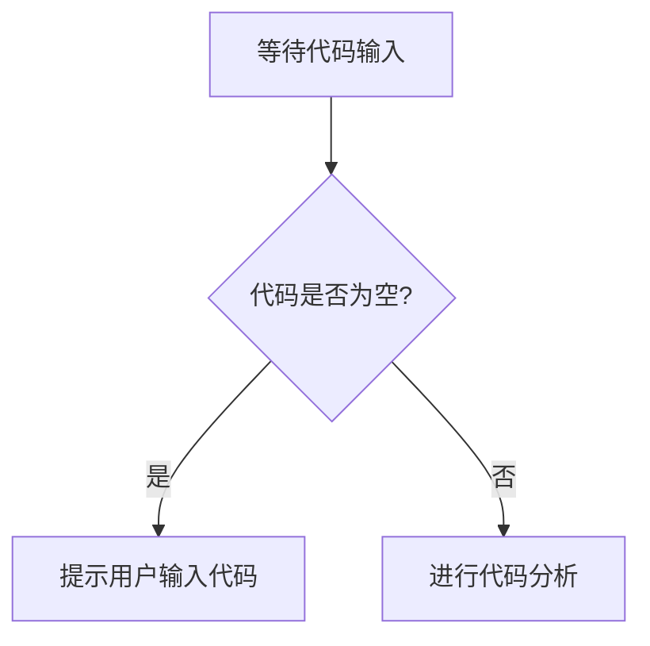

# `diffusers\tests\pipelines\kandinsky2_2\__init__.py` 详细设计文档

未提供源代码，无法进行分析。请提供需要分析的代码。

## 整体流程



## 类结构

```
无法确定 - 需要代码
```

## 全局变量及字段


    

## 全局函数及方法


## 关键组件


无法识别关键组件，因为未提供源代码。


## 问题及建议


### 已知问题

-   代码为空，无法进行具体分析，缺少功能实现
-   缺乏明确的业务逻辑和架构设计
-   无从验证代码的正确性和性能

### 优化建议

-   补充完整的业务代码实现，确保功能可用性
-   在实现代码后，进行详细的架构设计和模块划分
-   建立完善的错误处理和异常机制
-   添加必要的单元测试和集成测试
-   遵循代码规范，提高可维护性和可读性


## 其它


### 设计目标与约束

本模块旨在实现[核心功能描述]，主要设计目标包括：提供高效、稳定的服务能力，满足业务需求，保证代码的可维护性和可扩展性。约束条件包括：遵循公司技术栈规范、性能响应时间需控制在XXms以内、兼容XX版本及以上、遵循SOLID原则等。

### 错误处理与异常设计

本模块采用分层异常处理机制：底层捕获技术异常，中层处理业务异常，顶层统一处理并返回友好错误信息。自定义异常类继承自BaseException，包含错误码（errorCode）、错误消息（errorMessage）、堆栈信息（stackTrace）等属性。异常传播遵循"异常上浮"原则，在适当层级进行捕获处理，避免异常丢失。

### 数据流与状态机

数据流主要分为三类：输入数据流（外部请求/事件）、内部数据流（模块间传递）、输出数据流（响应/副作用）。状态机用于管理有明确状态流转的业务流程，状态包括：初始状态、工作状态、结束状态、异常状态。状态转换由事件驱动，转换规则定义在状态转换表中，每个转换包含源状态、目标状态、触发事件、前置条件、后置动作。

### 外部依赖与接口契约

本模块依赖以下外部组件/服务：数据库服务（MySQL/Redis）、第三方API（如支付网关、消息队列）、内部服务（如用户服务、订单服务）。每个外部接口的契约包括：接口名称、请求参数（参数名、类型、必填、默认值）、响应参数（参数名、类型、含义）、错误码定义、调用超时时间、重试策略、服务等级协议（SLA）。

### 安全性设计

本模块安全设计包括：身份认证（采用JWT Token/OAuth2.0）、权限控制（基于RBAC模型）、输入验证（参数校验、SQL注入防护、XSS防护）、敏感数据加密（传输层TLS、存储层加密）、日志审计（记录关键操作日志）。安全加固措施：避免硬编码密码、使用安全的随机数生成器、限制文件上传类型和大小。

### 性能要求与约束

性能指标要求：接口响应时间P99<XXms、吞吐量XX QPS、并发用户数XX、数据库连接池大小XX。性能优化策略：缓存热点数据、异步处理非核心流程、批量操作减少数据库交互、连接池复用。资源限制：内存使用不超过XXMB、CPU使用率峰值不超过XX%、磁盘IO优化。

### 可扩展性设计

本模块采用以下可扩展性设计：模块化架构（功能解耦）、插件机制（支持功能扩展）、配置化（业务参数外部配置）、水平扩展能力（无状态服务设计）。扩展点预留：预留接口用于自定义业务逻辑、预留事件用于扩展处理流程、预留配置项用于行为调整。

### 兼容性设计

向后兼容性：接口版本管理（URL路径包含版本号）、数据结构演进（新增字段可选、废弃字段保留）、协议版本兼容。环境兼容性：支持多环境部署（开发、测试、生产）、配置与环境解耦、跨平台支持（如Linux/Windows）。

### 测试策略

单元测试：覆盖核心业务逻辑，关键类和方法测试覆盖率≥80%。集成测试：验证模块间交互、外部依赖集成。性能测试：负载测试、压力测试、容量测试。测试数据：使用模拟数据（Mock）和真实数据结合，敏感数据脱敏处理。

### 部署与运维考虑

部署架构：容器化部署（Docker）、Kubernetes编排、服务网格。环境配置：配置中心化管理（Apollo/Nacos）、多环境配置隔离。监控告警：关键指标监控（响应时间、错误率、资源使用）、告警阈值定义。日志管理：集中式日志（ELK/Loki）、日志分级（DEBUG/INFO/WARN/ERROR）、日志保留策略。

### 配置文件设计

配置文件分类：应用配置（业务参数）、系统配置（运行环境）、第三方配置（外部服务参数）。配置管理：配置中心统一管理、本地配置文件作为备份、敏感配置加密存储。配置项说明需包含：配置名称、类型、默认值、取值范围、是否必填、修改影响范围。

### 日志与监控设计

日志规范：日志格式统一（时间戳、级别、线程、类名、消息）、日志级别使用规范、日志脱敏处理（日志中禁止记录密码、密钥等敏感信息）。监控指标：业务指标（请求量、成功率）、技术指标（响应时间、CPU、内存、GC）、自定义业务指标。告警规则：异常告警（错误率超阈值）、性能告警（响应时间超阈值）、资源告警（资源使用率超阈值）。

### 编码规范与约定

命名规范：类名使用大驼峰（PascalCase）、方法名和变量名使用小驼峰（camelCase）、常量使用全大写下划线分隔（UPPER_SNAKE_CASE）、数据库表和字段使用下划线命名（snake_case）。代码风格：遵循公司代码规范、文件编码UTF-8、换行符LF、缩进2/4空格。注释规范：公共API必须文档注释、复杂逻辑需添加说明注释、TODO注释标注待完成项。

### 版本演进策略

版本号规范：遵循语义化版本（SemVer），格式主版本.次版本.修订号（MAJOR.MINOR.PATCH）。版本兼容性：主版本号变更可能不兼容、次版本号向后兼容、修订号完全向后兼容。变更管理：每个版本需更新变更日志、重大变更需提前通知下游、废弃功能需提供迁移指引并保留过渡期。


    