# `diffusers\tests\pipelines\kandinsky2_2\test_kandinsky.py` 详细设计文档

该文件包含了 KandinskyV22Pipeline 的单元测试和集成测试，通过虚拟组件（Dummy）提供测试所需的模型、调度器和参数，验证文本到图像生成功能以及 float16 推理的正确性。

## 整体流程

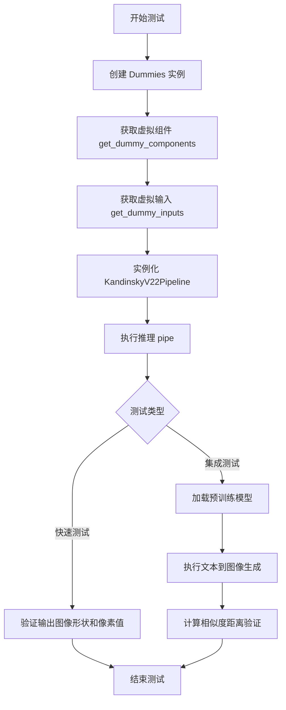

## 类结构

```
Dummies (测试辅助类)
├── text_embedder_hidden_size (property)
├── time_input_dim (property)
├── block_out_channels_0 (property)
├── time_embed_dim (property)
├── cross_attention_dim (property)
├── dummy_unet (property)
├── dummy_movq_kwargs (property)
├── dummy_movq (property)
├── get_dummy_components (实例方法)
└── get_dummy_inputs (实例方法)

KandinskyV22PipelineFastTests (单元测试类)
├── get_dummy_inputs (实例方法)
├── get_dummy_components (实例方法)
├── test_kandinsky (测试方法)
└── test_float16_inference (测试方法)

KandinskyV22PipelineIntegrationTests (集成测试类)
├── setUp (测试前设置)
├── tearDown (测试后清理)
└── test_kandinsky_text2img (集成测试方法)
```

## 全局变量及字段


### `enable_full_determinism`
    
用于启用完全确定性执行的函数，确保测试结果可复现

类型：`function`
    


### `torch_device`
    
表示PyTorch设备标识符的字符串，如'cpu'或'cuda'

类型：`str`
    


### `np`
    
NumPy库的别名，用于数值计算和数组操作

类型：`module`
    


### `KandinskyV22PipelineFastTests.pipeline_class`
    
指定要测试的管道类，即KandinskyV22Pipeline

类型：`type`
    


### `KandinskyV22PipelineFastTests.params`
    
管道参数列表，包含'image_embeds'和'negative_image_embeds'

类型：`list[str]`
    


### `KandinskyV22PipelineFastTests.batch_params`
    
批量参数列表，用于批量推理测试

类型：`list[str]`
    


### `KandinskyV22PipelineFastTests.required_optional_params`
    
必需的可选参数列表，定义管道支持的多种可选参数

类型：`list[str]`
    


### `KandinskyV22PipelineFastTests.callback_cfg_params`
    
回调配置参数列表，注意这里有拼写错误'seed_embds'

类型：`list[str]`
    


### `KandinskyV22PipelineFastTests.test_xformers_attention`
    
标志位，指示是否测试xFormers注意力机制，此处设为False

类型：`bool`
    
    

## 全局函数及方法


### `gc.collect`

这是 Python 标准库中的垃圾回收函数，在代码中用于在测试前后清理 VRAM（视频内存），属于 `KandinskyV22PipelineIntegrationTests` 类的 `setUp` 和 `tearDown` 方法的一部分。

**参数：**

- 无参数

**返回值：** `int`，返回回收的对象数量，但在本代码中未使用该返回值

#### 流程图

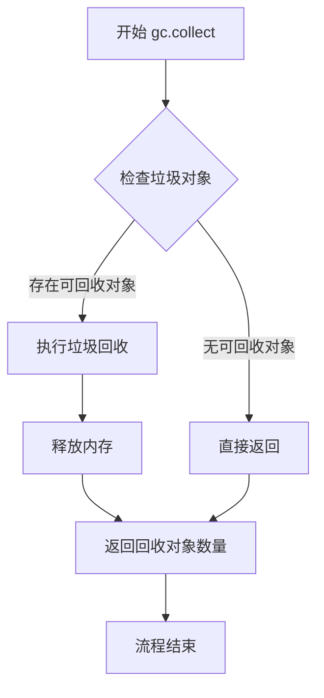

#### 带注释源码

```python
# gc.collect() 在 setUp 方法中调用
def setUp(self):
    # 在每个测试之前清理 VRAM
    super().setUp()
    gc.collect()  # 强制 Python 垃圾回收器运行，回收无法访问的 Python 对象
    backend_empty_cache(torch_device)  # 清理 PyTorch 的 GPU 缓存

# gc.collect() 在 tearDown 方法中调用
def tearDown(self):
    # 在每个测试之后清理 VRAM
    super().tearDown()
    gc.collect()  # 再次执行垃圾回收，确保测试过程中产生的临时对象被及时释放
    backend_empty_cache(torch_device)  # 清理 PyTorch 的 GPU 缓存
```


# 分析结果

在给定的代码中，没有定义名为 `random` 的函数或方法。代码中使用了 Python 标准库的 `random` 模块，具体在 `Dummies.get_dummy_inputs` 方法中使用了 `random.Random(seed)` 来创建随机数生成器。

以下是从代码中提取的与 `random` 相关的使用方式：

### `random.Random`

**描述**

`random` 是 Python 标准库模块，代码中使用了 `random.Random` 类来创建随机数生成器实例，用于生成确定性的随机张量数据，以便进行测试。

#### 带注释源码

```python
# 导入 Python 标准库的 random 模块
import random

# 在 get_dummy_inputs 方法中使用 random.Random
def get_dummy_inputs(self, device, seed=0):
    # 使用 random.Random(seed) 创建确定性的随机数生成器
    # seed 参数确保每次调用生成相同的随机序列，用于测试的可重复性
    image_embeds = floats_tensor((1, self.text_embedder_hidden_size), rng=random.Random(seed)).to(device)
    negative_image_embeds = floats_tensor((1, self.text_embedder_hidden_size), rng=random.Random(seed + 1)).to(
        device
    )
```

---

如果您需要提取代码中实际定义的函数或方法（如 `get_dummy_inputs`、`test_kandinsky` 等），请告知具体名称。


### `KandinskyV22PipelineIntegrationTests.test_kandinsky_text2img`

这是一个集成测试方法，用于测试 KandinskyV2.2 模型的文本到图像生成功能。测试加载预训练的先验管道和解码器管道，使用文本提示"red cat, 4k photo"生成图像，并验证生成图像的形状和与预期图像的余弦相似度。

参数：

- 无显式参数（使用 `self` 实例方法）

返回值：`None`，该方法为测试方法，通过断言验证图像生成结果

#### 流程图

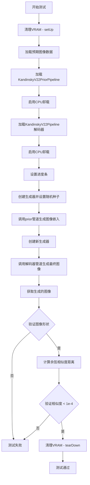

#### 带注释源码

```python
def test_kandinsky_text2img(self):
    """
    集成测试：测试 KandinskyV2.2 文本到图像生成功能
    """
    # 从URL加载预期的numpy图像数据，用于后续相似度比较
    expected_image = load_numpy(
        "https://huggingface.co/datasets/hf-internal-testing/diffusers-images/resolve/main"
        "/kandinskyv22/kandinskyv22_text2img_cat_fp16.npy"
    )

    # 加载先验管道（Prior Pipeline），用于将文本转换为图像嵌入
    # 使用float16精度以加速推理
    pipe_prior = KandinskyV22PriorPipeline.from_pretrained(
        "kandinsky-community/kandinsky-2-2-prior", 
        torch_dtype=torch.float16
    )
    # 启用模型CPU卸载，节省GPU显存
    pipe_prior.enable_model_cpu_offload(device=torch_device)

    # 加载解码器管道（Decoder Pipeline），用于将图像嵌入解码为最终图像
    pipeline = KandinskyV22Pipeline.from_pretrained(
        "kandinsky-community/kandinsky-2-2-decoder", 
        torch_dtype=torch.float16
    )
    # 启用模型CPU卸载
    pipeline.enable_model_cpu_offload(device=torch_device)
    # 设置进度条配置（disable=None表示启用进度条）
    pipeline.set_progress_bar_config(disable=None)

    # 定义文本提示
    prompt = "red cat, 4k photo"

    # 创建生成器并设置随机种子以确保可重复性
    generator = torch.Generator(device="cpu").manual_seed(0)
    # 调用先验管道生成图像嵌入和负向嵌入
    # 返回元组：(image_embeds, zero_image_embeds)
    image_emb, zero_image_emb = pipe_prior(
        prompt,
        generator=generator,
        num_inference_steps=3,  # 较少的推理步数以加快测试
        negative_prompt="",     # 空负向提示
    ).to_tuple()

    # 创建新的生成器并设置相同种子
    generator = torch.Generator(device="cpu").manual_seed(0)
    # 调用解码器管道生成最终图像
    output = pipeline(
        image_embeds=image_emb,
        negative_image_embeds=zero_image_emb,
        generator=generator,
        num_inference_steps=3,
        output_type="np",  # 输出为numpy数组
    )
    # 获取生成的图像
    image = output.images[0]
    
    # 断言：验证生成的图像形状为 (512, 512, 3)
    assert image.shape == (512, 512, 3)

    # 计算预期图像与生成图像之间的余弦相似度距离
    max_diff = numpy_cosine_similarity_distance(expected_image.flatten(), image.flatten())
    # 断言：验证相似度距离小于阈值1e-4
    assert max_diff < 1e-4
```


# KandinskyV22Pipeline 测试代码详细设计文档

## 1. 一段话描述

该代码是 Kandinsky V2.2 图像生成管道的单元测试和集成测试套件，包含了用于测试的虚拟组件生成器（Dummies类）、快速测试用例（KandinskyV22PipelineFastTests）和集成测试用例（KandinskyV22PipelineIntegrationTests），用于验证管道在CPU和GPU环境下的图像生成功能、float16推理精度以及与预训练模型的兼容性。

## 2. 文件的整体运行流程

```
┌─────────────────────────────────────────────────────────────────┐
│                    测试文件加载与初始化                          │
│  1. 导入依赖库 (torch, numpy, unittest, diffusers等)            │
│  2. 启用完全确定性 (enable_full_determinism)                    │
│  3. 定义 Dummies 类用于生成测试所需的虚拟组件                    │
└─────────────────────────────────────────────────────────────────┘
                              │
                              ▼
┌─────────────────────────────────────────────────────────────────┐
│              快速测试 (KandinskyV22PipelineFastTests)           │
│  1. test_kandinsky: 测试基本图像生成功能                         │
│     - 获取虚拟组件和输入                                         │
│     - 创建管道并推理                                             │
│     - 验证输出图像形状和像素值                                   │
│  2. test_float16_inference: 测试float16推理精度                 │
└─────────────────────────────────────────────────────────────────┘
                              │
                              ▼
┌─────────────────────────────────────────────────────────────────┐
│           集成测试 (KandinskyV22PipelineIntegrationTests)       │
│  1. setUp/tearDown: 管理VRAM资源                                 │
│  2. test_kandinsky_text2img: 端到端文本到图像生成测试            │
│     - 加载预训练prior和decoder模型                              │
│     - 生成图像embeddings                                        │
│     - 使用decoder生成最终图像                                    │
│     - 验证图像质量与预期结果相似度                               │
└─────────────────────────────────────────────────────────────────┘
```

## 3. 类的详细信息

### 3.1 Dummies 类

**描述**：用于生成测试所需的虚拟（dummy）UNet、VQModel和调度器组件的辅助类。

#### 类字段

| 字段名称 | 类型 | 描述 |
|---------|------|------|
| text_embedder_hidden_size | int | 文本嵌入器的隐藏维度大小，默认32 |
| time_input_dim | int | 时间输入维度，默认32 |
| block_out_channels_0 | int | 第一个块输出通道数，等于time_input_dim |
| time_embed_dim | int | 时间嵌入维度，等于time_input_dim * 4 |
| cross_attention_dim | int | 交叉注意力维度，默认32 |

#### 类方法

##### dummy_unet 属性

**名称**：Dummies.dummy_unet

**参数**：无

**返回值**：`UNet2DConditionModel`，返回配置好的虚拟UNet2D条件模型

**描述**：创建一个用于测试的虚拟UNet2DConditionModel，具有特定的架构配置（4输入通道、8输出通道、包含交叉注意力块等）。

---

##### dummy_movq_kwargs 属性

**名称**：Dummies.dummy_movq_kwargs

**参数**：无

**返回值**：`dict`，返回VQModel的参数字典

**描述**：返回用于创建虚拟VQModel（运动向量量化器）的配置参数。

---

##### dummy_movq 属性

**名称**：Dummies.dummy_movq

**参数**：无

**返回值**：`VQModel`，返回虚拟VQModel实例

**描述**：使用指定参数创建一个虚拟的VQModel用于测试。

---

##### get_dummy_components 方法

**名称**：Dummies.get_dummy_components

**参数**：无

**返回值**：`dict`，包含unet、scheduler、movq的字典

**描述**：获取完整的虚拟组件集合，包括UNet模型、DDIM调度器和VQModel。

---

##### get_dummy_inputs 方法

**名称**：Dummies.get_dummy_inputs

**参数**：

- `device`：`str`，目标设备（如"cpu"、"cuda"）
- `seed`：`int`，随机种子，默认0

**返回值**：`dict`，包含推理所需输入参数的字典

**描述**：生成用于管道推理的虚拟输入，包括图像嵌入、负向嵌入、生成器、图像尺寸、引导尺度和推理步数。

---

### 3.2 KandinskyV22PipelineFastTests 类

**描述**：Kandinsky V2.2 管道的快速单元测试类，继承自PipelineTesterMixin和unittest.TestCase。

#### 类字段

| 字段名称 | 类型 | 描述 |
|---------|------|------|
| pipeline_class | type | 管道类类型 (KandinskyV22Pipeline) |
| params | list | 管道参数列表 |
| batch_params | list | 批量参数列表 |
| required_optional_params | list | 必需的可选参数列表 |
| callback_cfg_params | list | CFG回调参数列表 |
| test_xformers_attention | bool | 是否测试xformers注意力 |

#### 类方法

##### get_dummy_inputs 方法

**名称**：KandinskyV22PipelineFastTests.get_dummy_inputs

**参数**：

- `device`：`str`，目标设备
- `seed`：`int`，随机种子，默认0

**返回值**：`dict`，虚拟输入字典

**描述**：获取虚拟测试输入的便捷方法，内部调用Dummies.get_dummy_inputs。

---

##### get_dummy_components 方法

**名称**：KandinskyV22PipelineFastTests.get_dummy_components

**参数**：无

**返回值**：`dict`，虚拟组件字典

**描述**：获取虚拟组件的便捷方法，内部调用Dummies.get_dummy_components。

---

##### test_kandinsky 方法

**名称**：KandinskyV22PipelineFastTests.test_kandinsky

**参数**：无（使用self.get_dummy_inputs和self.get_dummy_components获取参数）

**返回值**：`None`，测试方法无返回值

**描述**：测试管道的基本图像生成功能，验证输出图像形状和像素值是否符合预期。

---

##### test_float16_inference 方法

**名称**：KandinskyV22PipelineFastTests.test_float16_inference

**参数**：无

**返回值**：`None`，测试方法无返回值

**描述**：测试管道在float16数据类型下的推理精度，预期最大差异为1e-1。

---

### 3.3 KandinskyV22PipelineIntegrationTests 类

**描述**：Kandinsky V2.2 管道的集成测试类，使用真实预训练模型进行端到端测试。

#### 类方法

##### setUp 方法

**名称**：KandinskyV22PipelineIntegrationTests.setUp

**参数**：无

**返回值**：`None`

**描述**：在每个测试前清理VRAM资源，调用gc.collect()和backend_empty_cache。

---

##### tearDown 方法

**名称**：KandinskyV22PipelineIntegrationTests.tearDown

**参数**：无

**返回值**：`None`

**描述**：在每个测试后清理VRAM资源，释放GPU内存。

---

##### test_kandinsky_text2img 方法

**名称**：KandinskyV22PipelineIntegrationTests.test_kandinsky_text2img

**参数**：无

**返回值**：`None`

**描述**：端到端文本到图像生成测试，加载预训练模型，执行推理，验证生成图像的质量和形状。

---

## 4. 关键组件信息

| 组件名称 | 一句话描述 |
|---------|-----------|
| UNet2DConditionModel | 用于去噪的UNet2D条件模型，根据文本嵌入生成图像特征 |
| VQModel | 矢量量化模型，用于图像的编码和解码 |
| DDIMScheduler | DDIM调度器，用于控制去噪过程的采样策略 |
| KandinskyV22PriorPipeline | 负责生成图像嵌入的先验管道 |
| KandinskyV22Pipeline | 主解码管道，根据图像嵌入生成最终图像 |
| PipelineTesterMixin | 提供了管道测试的通用测试方法 |
| enable_full_determinism | 启用完全确定性以确保测试可复现 |
| backend_empty_cache | 后端清理缓存函数，用于释放GPU内存 |

---

## 5. 潜在的技术债务或优化空间

1. **测试代码重复**：`KandinskyV22PipelineFastTests`中的`get_dummy_inputs`和`get_dummy_components`方法只是简单调用`Dummies`类的方法，可以考虑直接使用Dummies类。

2. **硬编码的测试参数**：很多参数（如图像尺寸64、推理步数2等）是硬编码的，缺乏灵活性。

3. **缺失的错误处理**：测试代码中没有对模型加载失败、内存不足等异常情况的处理。

4. **重复的参数定义**：`required_optional_params`列表中"generator"和"return_dict"出现了两次。

5. **测试覆盖不完整**：缺少对管道其他功能（如latents自定义、回调函数等）的测试。

6. **设备兼容性处理**：对MPS设备的特殊处理（generator创建方式不同）可以进一步抽象。

---

## 6. 其它项目

### 设计目标与约束

- **目标**：验证KandinskyV22Pipeline在各种条件下的正确性和稳定性
- **约束**：需要在CPU和GPU环境下都能通过测试，float16推理精度需在1e-1以内

### 错误处理与异常设计

- 使用`assert`语句进行断言验证
- 集成测试中使用`expected_max_diff`参数控制精度容忍度

### 数据流与状态机

- 快速测试：Dummy Components → Pipeline → Image Output
- 集成测试：Text Prompt → Prior Pipeline → Image Embeds → Decoder Pipeline → Final Image

### 外部依赖与接口契约

- 依赖`diffusers`库的管道和模型类
- 依赖`testing_utils`模块的测试辅助函数
- 依赖HuggingFace Hub加载预训练模型

---

## 提取的主要函数详细文档

### `test_kandinsky`

测试Kandinsky管道基本图像生成功能的单元测试方法。

参数：

- 无（使用类实例的get_dummy_inputs和get_dummy_components方法获取）

返回值：`None`，测试方法无返回值

#### 流程图

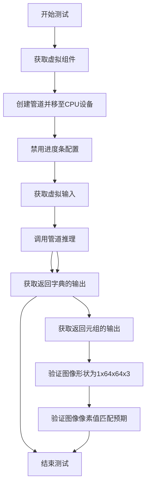

#### 带注释源码

```python
def test_kandinsky(self):
    """测试Kandinsky管道的基本图像生成功能"""
    device = "cpu"  # 设置测试设备为CPU

    # 获取虚拟组件（UNet、Scheduler、VQModel）
    components = self.get_dummy_components()

    # 使用虚拟组件创建管道实例
    pipe = self.pipeline_class(**components)
    # 将管道移至指定设备
    pipe = pipe.to(device)

    # 设置进度条配置（disable=None表示不禁用）
    pipe.set_progress_bar_config(disable=None)

    # 获取虚拟输入参数
    output = pipe(**self.get_dummy_inputs(device))
    # 从输出中获取生成的图像
    image = output.images

    # 测试不使用return_dict的调用方式
    # 获取返回的第一个元素（图像）
    image_from_tuple = pipe(
        **self.get_dummy_inputs(device),
        return_dict=False,  # 返回元组而非字典
    )[0]

    # 提取图像切片用于验证（取最后3x3像素）
    image_slice = image[0, -3:, -3:, -1]
    image_from_tuple_slice = image_from_tuple[0, -3:, -3:, -1]

    # 断言：验证生成的图像形状为(1, 64, 64, 3)
    assert image.shape == (1, 64, 64, 3)

    # 定义预期的像素值切片
    expected_slice = np.array([0.3420, 0.9505, 0.3919, 1.0000, 0.5188, 0.3109, 0.6139, 0.5624, 0.6811])

    # 断言：验证return_dict=False的输出像素值匹配预期
    assert np.abs(image_slice.flatten() - expected_slice).max() < 1e-2, (
        f" expected_slice {expected_slice}, but got {image_slice.flatten()}"
    )

    # 断言：验证return_dict=True的输出像素值匹配预期
    assert np.abs(image_from_tuple_slice.flatten() - expected_slice).max() < 1e-2, (
        f" expected_slice {expected_slice}, but got {image_from_tuple_slice.flatten()}"
    )
```

---

### `test_kandinsky_text2img`

端到端文本到图像生成的集成测试方法。

参数：

- 无

返回值：`None`，测试方法无返回值

#### 流程图

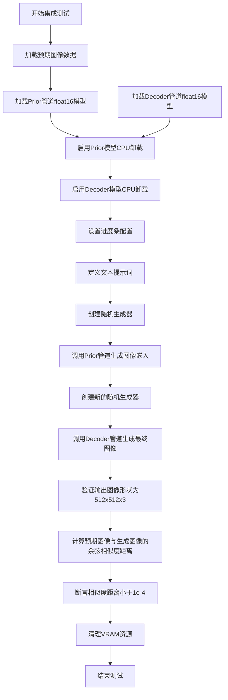

#### 带注释源码

```python
@slow  # 标记为慢速测试
@require_torch_accelerator  # 需要GPU加速器
def test_kandinsky_text2img(self):
    """端到端文本到图像生成集成测试"""
    
    # 从远程加载预期的numpy图像数据
    expected_image = load_numpy(
        "https://huggingface.co/datasets/hf-internal-testing/diffusers-images/resolve/main"
        "/kandinskyv22/kandinskyv22_text2img_cat_fp16.npy"
    )

    # 从预训练模型加载Prior管道（float16精度）
    pipe_prior = KandinskyV22PriorPipeline.from_pretrained(
        "kandinsky-community/kandinsky-2-2-prior", torch_dtype=torch.float16
    )
    # 启用模型CPU卸载以节省VRAM
    pipe_prior.enable_model_cpu_offload(device=torch_device)

    # 从预训练模型加载Decoder管道（float16精度）
    pipeline = KandinskyV22Pipeline.from_pretrained(
        "kandinsky-community/kandinsky-2-2-decoder", torch_dtype=torch.float16
    )
    # 启用模型CPU卸载
    pipeline.enable_model_cpu_offload(device=torch_device)
    # 设置进度条配置
    pipeline.set_progress_bar_config(disable=None)

    # 定义文本提示词
    prompt = "red cat, 4k photo"

    # 创建随机生成器并设置种子
    generator = torch.Generator(device="cpu").manual_seed(0)
    # 调用Prior管道生成图像嵌入和零嵌入
    image_emb, zero_image_emb = pipe_prior(
        prompt,
        generator=generator,
        num_inference_steps=3,  # 推理步数
        negative_prompt="",     # 负向提示词为空
    ).to_tuple()

    # 创建新的生成器并设置相同种子以确保可复现
    generator = torch.Generator(device="cpu").manual_seed(0)
    # 使用Decoder管道根据图像嵌入生成最终图像
    output = pipeline(
        image_embeds=image_emb,
        negative_image_embeds=zero_image_emb,
        generator=generator,
        num_inference_steps=3,
        output_type="np",  # 输出为numpy数组
    )
    # 获取生成的图像
    image = output.images[0]
    
    # 断言：验证图像形状
    assert image.shape == (512, 512, 3)

    # 计算预期图像与生成图像的余弦相似度距离
    max_diff = numpy_cosine_similarity_distance(expected_image.flatten(), image.flatten())
    # 断言：验证相似度距离小于阈值
    assert max_diff < 1e-4
```

---

### `get_dummy_components`

获取Kandinsky管道测试所需的虚拟组件集合。

参数：

- 无

返回值：`dict`，包含"unet"、"scheduler"、"movq"键的字典

#### 带注释源码

```python
def get_dummy_components(self):
    """获取用于测试的虚拟组件"""
    # 获取虚拟UNet模型
    unet = self.dummy_unet
    # 获取虚拟VQModel
    movq = self.dummy_movq

    # 创建DDIM调度器，配置去噪参数
    scheduler = DDIMScheduler(
        num_train_timesteps=1000,    # 训练时间步数
        beta_schedule="linear",      # Beta调度方式
        beta_start=0.00085,          # Beta起始值
        beta_end=0.012,              # Beta结束值
        clip_sample=False,           # 是否裁剪采样
        set_alpha_to_one=False,     # 设置alpha为1
        steps_offset=1,              # 步数偏移
        prediction_type="epsilon",   # 预测类型
        thresholding=False,          # 是否阈值化
    )

    # 组装组件字典
    components = {
        "unet": unet,          # UNet去噪模型
        "scheduler": scheduler,# 噪声调度器
        "movq": movq,          # VQ编解码器
    }
    return components
```

---

### `get_dummy_inputs`

生成Kandinsky管道推理所需的虚拟输入参数。

参数：

- `device`：`str`，目标设备（如"cpu"、"cuda"）
- `seed`：`int`，随机种子，默认0

返回值：`dict`，包含推理所需的所有输入参数

#### 带注释源码

```python
def get_dummy_inputs(self, device, seed=0):
    """生成用于推理的虚拟输入参数"""
    # 生成随机图像嵌入（1x32）
    image_embeds = floats_tensor(
        (1, self.text_embedder_hidden_size), 
        rng=random.Random(seed)
    ).to(device)
    
    # 生成负向图像嵌入（用于无分类器引导）
    negative_image_embeds = floats_tensor(
        (1, self.text_embedder_hidden_size), 
        rng=random.Random(seed + 1)
    ).to(device)
    
    # 根据设备类型创建随机生成器
    if str(device).startswith("mps"):
        # MPS设备特殊处理
        generator = torch.manual_seed(seed)
    else:
        # 其他设备（CPU/CUDA）
        generator = torch.Generator(device=device).manual_seed(seed)
    
    # 组装输入参数字典
    inputs = {
        "image_embeds": image_embeds,         # 图像条件嵌入
        "negative_image_embeds": negative_image_embeds, # 负向嵌入
        "generator": generator,               # 随机生成器
        "height": 64,                         # 输出图像高度
        "width": 64,                          # 输出图像宽度
        "guidance_scale": 4.0,                # 引导尺度（CFG强度）
        "num_inference_steps": 2,             # 推理步数
        "output_type": "np",                  # 输出类型为numpy
    }
    return inputs
```


### `DDIMScheduler`

DDIMScheduler 是 diffusers 库中的调度器类，用于实现 Denoising Diffusion Implicit Models (DDIM) 采样算法。该调度器通过指定时间步调度策略来逐步从噪声图像中恢复出目标图像，是扩散模型推理过程中的核心组件。

参数：

- `num_train_timesteps`：`int`，训练时使用的时间步总数，通常为 1000
- `beta_schedule`：`str`，beta 调度策略类型，如 "linear"、"scaled_linear"、"squaredcos_cap_v2" 等
- `beta_start`：`float`，beta 调度起始值
- `beta_end`：`float`，beta 调度结束值
- `clip_sample`：`bool`，是否对预测的样本值进行裁剪，默认为 False
- `set_alpha_to_one`：`bool`，是否将最终 alpha 值设置为 1，默认为 True
- `steps_offset`：`int`，推理时的时间步偏移量，用于调整采样起始点
- `prediction_type`：`str`，预测类型，如 "epsilon"（预测噪声）、"sample"（预测样本）、"v_prediction"（v-prediction）
- `thresholding`：`bool`，是否启用阈值处理，用于稳定采样过程

返回值：`DDIMScheduler` 实例，返回一个配置好的 DDIM 调度器对象

#### 流程图

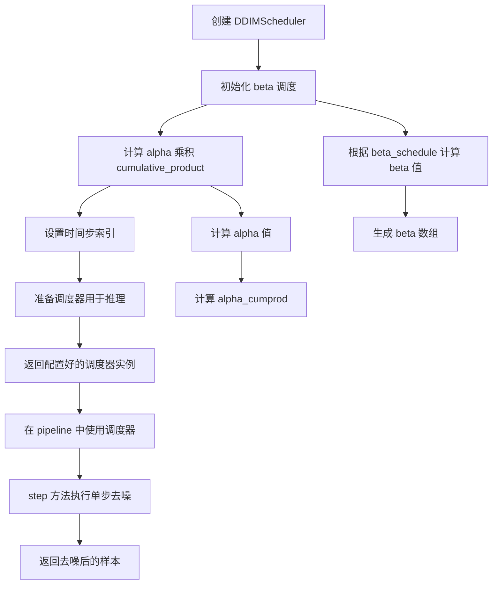

#### 带注释源码

```python
# 在 Dummies 类的 get_dummy_components 方法中实例化 DDIMScheduler
scheduler = DDIMScheduler(
    num_train_timesteps=1000,      # 训练时使用1000个时间步
    beta_schedule="linear",        # 使用线性 beta 调度策略
    beta_start=0.00085,            # beta 起始值（低噪声水平）
    beta_end=0.012,                # beta 结束值（高噪声水平）
    clip_sample=False,             # 不裁剪样本值，保持原始范围
    set_alpha_to_one=False,        # 最终时间步的 alpha 不设为1
    steps_offset=1,                # 推理时间步偏移1（从1开始而非0）
    prediction_type="epsilon",     # 预测噪声而非直接预测图像
    thresholding=False,            # 不启用阈值处理
)

# DDIMScheduler 常用方法说明：
# 1. set_timesteps(num_inference_steps): 设置推理时的时间步
# 2. step(model_output, timestep, sample, **kwargs): 执行单步去噪
# 3. add_noise(sample, noise, timesteps): 向样本添加噪声
# 4. train(): 切换到训练模式（如果需要）
# 5. eval(): 切换到推理模式
```


### `KandinskyV22Pipeline`

KandinskyV22Pipeline 是 Diffusers 库中的一个图像生成管道类，基于 Kandinsky 2.2 模型架构，通过接收图像嵌入（image_embeds）和负向图像嵌入（negative_image_embeds）来生成最终的图像。该管道结合了 VQModel（MOVQ）和 UNet2DConditionModel，在去噪过程中使用 DDIMScheduler 进行调度。

参数：

- `image_embeds`：`torch.Tensor`，图像嵌入向量，作为生成图像的主要条件输入
- `negative_image_embeds`：`torch.Tensor`，负向图像嵌入向量，用于无分类器指导（classifier-free guidance）
- `generator`：`torch.Generator`（可选），随机数生成器，用于控制生成过程的可重现性
- `height`：`int`（可选），生成图像的高度，默认为 64
- `width`：`int`（可选），生成图像的宽度，默认为 64
- `guidance_scale`：`float`（可选），指导比例，控制无分类器指导的强度，默认为 4.0
- `num_inference_steps`：`int`（可选），推理步数，默认为 50
- `output_type`：`str`（可选），输出类型，可选值为 "np"、"pt"、"pil"，默认为 "np"
- `latents`：`torch.Tensor`（可选），潜在变量，用于自定义初始噪声
- `num_images_per_prompt`：`int`（可选），每个提示生成的图像数量，默认为 1
- `return_dict`：`bool`（可选），是否返回字典格式的结果，默认为 True

返回值：`PipelineOutput` 或元组，包含生成的图像数组

#### 流程图

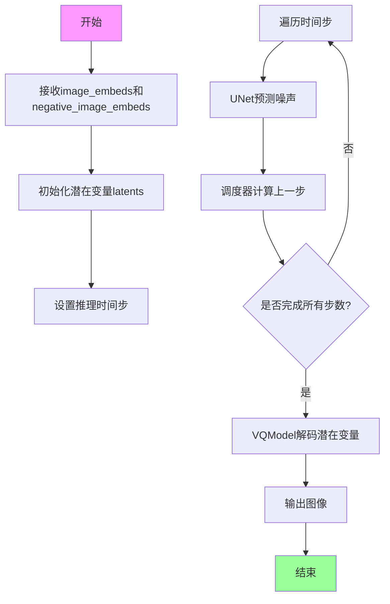

#### 带注释源码

```python
# 注意：以下源码基于测试代码反推的调用方式
# 实际实现位于 diffusers 库中

# 从测试代码中提取的调用示例
pipe = KandinskyV22Pipeline(**components)  # 传入 unet, scheduler, movq
pipe = pipe.to(device)

# 调用管道生成图像
output = pipe(
    image_embeds=image_embeds,           # 图像嵌入向量 (1, 32)
    negative_image_embeds=zero_image_emb, # 负向图像嵌入 (1, 32)
    generator=generator,                 # 随机数生成器
    num_inference_steps=3,               # 推理步数
    output_type="np",                    # 输出为 numpy 数组
)

# 获取生成的图像
image = output.images[0]  # 形状 (512, 512, 3)

# 组件初始化（从 Dummies 类获取）
components = {
    "unet": unet,           # UNet2DConditionModel 实例
    "scheduler": scheduler, # DDIMScheduler 实例
    "movq": movq,           # VQModel 实例
}

# 管道类的典型结构（推断）
class KandinskyV22Pipeline:
    def __init__(self, unet, scheduler, movq):
        """初始化管道组件"""
        self.unet = unet
        self.scheduler = scheduler
        self.movq = movq
    
    def __call__(
        self,
        image_embeds,
        negative_image_embeds,
        generator=None,
        height=64,
        width=64,
        guidance_scale=4.0,
        num_inference_steps=50,
        output_type="np",
        latents=None,
        num_images_per_prompt=1,
        return_dict=True,
    ):
        """
        调用管道生成图像
        
        参数:
            image_embeds: 图像嵌入向量
            negative_image_embeds: 负向图像嵌入
            generator: 随机数生成器
            height: 输出图像高度
            width: 输出图像宽度
            guidance_scale: 无分类器指导比例
            num_inference_steps: 推理步数
            output_type: 输出类型
            latents: 初始潜在变量
            num_images_per_prompt: 每个提示生成的图像数
            return_dict: 是否返回字典
        
        返回:
            图像结果
        """
        # 1. 准备潜在变量
        # 2. 遍历去噪步骤
        # 3. 使用 UNet 预测噪声
        # 4. 使用调度器更新潜在变量
        # 5. 使用 MOVQ 解码潜在变量到图像
        # 6. 返回结果
```


### KandinskyV22PriorPipeline

KandinskyV22PriorPipeline 是来自 Hugging Face diffusers 库的图像生成管道类，属于 Kandinsky 2.2 文本到图像生成系统的先验模型（Prior），负责将文本提示（prompt）转换为图像嵌入向量（image embeddings），为后续的解码器（decoder）提供条件信息。

参数：

- `prompt`：`str`，输入的文本提示，描述希望生成的图像内容
- `negative_prompt`：`str`，负面文本提示，用于引导模型避免生成与该提示相关的元素
- `generator`：`torch.Generator`，可选的 PyTorch 随机数生成器，用于控制生成过程的可重现性
- `num_inference_steps`：`int`，推理过程中的去噪步数，步数越多通常生成质量越高
- `guidance_scale`：`float`，无分类器指导（Classifier-free Guidance）的比例参数，控制生成图像对文本提示的遵循程度
- `num_images_per_prompt`：`int`，每个提示生成的图像数量
- `output_type`：`str`，输出格式，可选 "pt"（PyTorch 张量）、"np"（NumPy 数组）或 "pil"（PIL 图像）
- `return_dict`：`bool`，是否返回字典格式的结果

返回值：`PipelineOutput` 或元组，包含生成的图像嵌入（image_embeds）和零嵌入（zero_image_embeds），用于后续解码器生成最终图像

#### 流程图

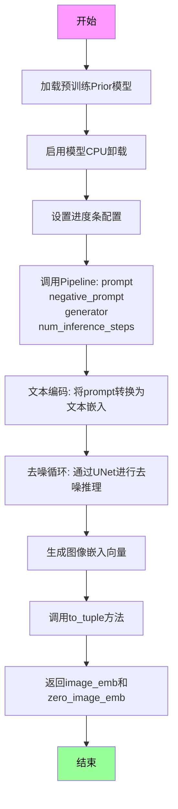

#### 带注释源码

```python
# 从diffusers库导入KandinskyV22PriorPipeline管道类
from diffusers import KandinskyV22PriorPipeline

# 在集成测试中使用该管道
pipe_prior = KandinskyV22PriorPipeline.from_pretrained(
    "kandinsky-community/kandinsky-2-2-prior",  # HuggingFace模型ID
    torch_dtype=torch.float16  # 使用float16精度以节省显存
)

# 启用模型CPU卸载，将不活跃的模型层移至CPU
pipe_prior.enable_model_cpu_offload(device=torch_device)

# 创建随机数生成器并设置种子以确保可重现性
generator = torch.Generator(device="cpu").manual_seed(0)

# 调用管道进行推理
# 参数:
#   prompt: 文本提示 "red cat, 4k photo"
#   generator: 随机生成器
#   num_inference_steps: 3步推理
#   negative_prompt: 负面提示为空
result = pipe_prior(
    prompt,
    generator=generator,
    num_inference_steps=3,
    negative_prompt="",
)

# 调用to_tuple方法将结果转换为元组格式
# 返回: (image_embeds, zero_image_embeds)
image_emb, zero_image_emb = result.to_tuple()

# image_emb: 主要的图像嵌入向量，用于指导最终图像生成
# zero_image_emb: 零向量嵌入，用于无条件生成或对比
```


### UNet2DConditionModel

这是一个从diffusers库导入的神经网络模型类，用于图像生成任务中的条件UNet结构，主要应用于Kandinsky V2.2管道中处理图像嵌入并执行去噪过程。

参数：

- `in_channels`：int，输入图像的通道数（代码中传入4）
- `out_channels`：int，输出图像的通道数（代码中传入8，预测均值和方差）
- `addition_embed_type`：str，附加嵌入类型（代码中设置为"image"）
- `down_block_types`：tuple，下采样块的类型列表
- `up_block_types`：tuple，上采样块的类型列表
- `mid_block_type`：str，中间块的类型
- `block_out_channels`：tuple，块的输出通道数列表
- `layers_per_block`：int，每个块的层数
- `encoder_hid_dim`：int，编码器隐藏层维度
- `encoder_hid_dim_type`：str，编码器隐藏层维度类型
- `cross_attention_dim`：int，交叉注意力维度
- `attention_head_dim`：int，注意力头维度
- `resnet_time_scale_shift`：str，ResNet时间尺度偏移方式
- `class_embed_type`：str，类别嵌入类型

返回值：`UNet2DConditionModel`实例，返回创建的UNet模型对象

#### 流程图

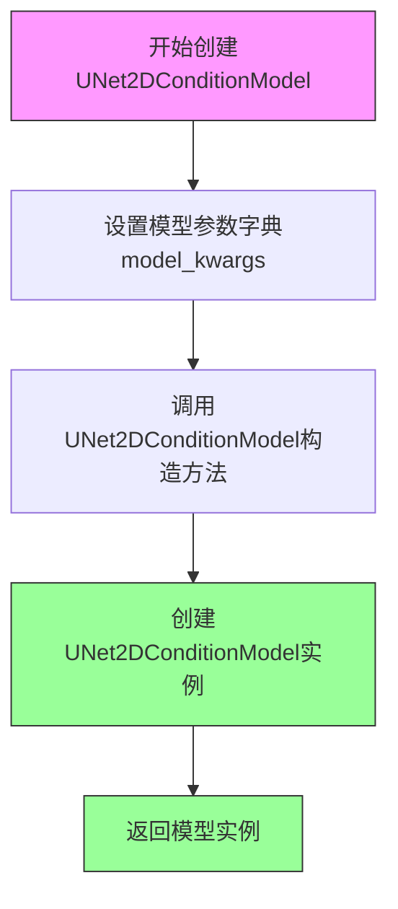

#### 带注释源码

```python
@property
def dummy_unet(self):
    """
    创建一个用于测试的虚拟UNet2DConditionModel实例
    设置随机种子以确保可重复性
    """
    torch.manual_seed(0)

    # 定义模型配置参数
    model_kwargs = {
        # 输入通道数：4（对应图像的RGBA通道）
        "in_channels": 4,
        # 输出通道数：8（是输入通道数的两倍，因为需要预测均值和方差）
        "out_channels": 8,
        # 附加嵌入类型：图像嵌入
        "addition_embed_type": "image",
        # 下采样块类型：ResNet下采样块和简单交叉注意力下采样块
        "down_block_types": ("ResnetDownsampleBlock2D", "SimpleCrossAttnDownBlock2D"),
        # 上采样块类型：简单交叉注意力上采样块和ResNet上采样块
        "up_block_types": ("SimpleCrossAttnUpBlock2D", "ResnetUpsampleBlock2D"),
        # 中间块类型：带简单交叉注意力的UNet中间块
        "mid_block_type": "UNetMidBlock2DSimpleCrossAttn",
        # 块输出通道数：32和64
        "block_out_channels": (self.block_out_channels_0, self.block_out_channels_0 * 2),
        # 每个块的层数：1
        "layers_per_block": 1,
        # 编码器隐藏维度：文本嵌入隐藏大小
        "encoder_hid_dim": self.text_embedder_hidden_size,
        # 编码器隐藏维度类型：图像投影
        "encoder_hid_dim_type": "image_proj",
        # 交叉注意力维度：32
        "cross_attention_dim": self.cross_attention_dim,
        # 注意力头维度：4
        "attention_head_dim": 4,
        # ResNet时间尺度偏移：scale_shift模式
        "resnet_time_scale_shift": "scale_shift",
        # 类别嵌入类型：无（None）
        "class_embed_type": None,
    }

    # 使用指定参数创建UNet2DConditionModel模型实例
    model = UNet2DConditionModel(**model_kwargs)
    return model
```


### VQModel

VQModel（Vector Quantized Model）是一个向量量化模型，用于在Kandinsky V2.2管道中编码和解码图像到潜在空间。它基于VQGAN架构，将图像压缩为离散潜在表示，然后再重建图像。

参数：

- `block_out_channels`：`List[int]`，输出通道数列表，用于编码器和解码器的各层
- `down_block_types`：`List[str]`，下采样块的类型列表
- `in_channels`：`int`，输入图像的通道数（通常为3表示RGB）
- `latent_channels`：`int`，潜在空间的通道数
- `layers_per_block`：`int`，每个块中的层数
- `norm_num_groups`：`int`，归一化的组数
- `norm_type`：`str`，归一化类型（如"spatial"）
- `num_vq_embeddings`：`int`，VQ码本中嵌入向量的数量
- `out_channels`：`int`，输出图像的通道数
- `up_block_types`：`List[str]`，上采样块的类型列表
- `vq_embed_dim`：`int`，VQ嵌入的维度

返回值：`torch.nn.Module`，返回VQModel模型实例，用于图像的编码和解码

#### 流程图

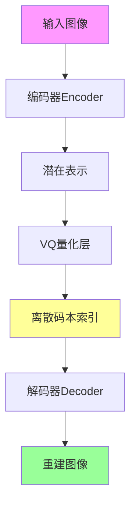

#### 带注释源码

```python
# 在 Dummies 类中使用 VQModel 创建 dummy_movq (Motion VQGAN) 模型
@property
def dummy_movq_kwargs(self):
    """
    返回用于创建 VQModel 的配置参数字典
    这些参数定义了 VQ 模型的架构：编码器/解码器块结构、通道数、量化设置等
    """
    return {
        # 编码器和解码器的输出通道配置
        "block_out_channels": [32, 64],
        
        # 下采样块类型：标准下采样编码块和带注意力机制的下采样编码块
        "down_block_types": ["DownEncoderBlock2D", "AttnDownEncoderBlock2D"],
        
        # 输入图像通道数（3 = RGB）
        "in_channels": 3,
        
        # 潜在空间的通道数，用于 VAE 潜在表示
        "latent_channels": 4,
        
        # 每个块中的层数
        "layers_per_block": 1,
        
        # 归一化的组数，用于 GroupNorm
        "norm_num_groups": 8,
        
        # 归一化类型，空间归一化
        "norm_type": "spatial",
        
        # VQ 码本中嵌入向量的数量（离散化等级数）
        "num_vq_embeddings": 12,
        
        # 输出图像通道数
        "out_channels": 3,
        
        # 上采样块类型：带注意力上采样块和标准上采样块
        "up_block_types": [
            "AttnUpDecoderBlock2D",
            "UpDecoderBlock2D",
        ],
        
        # VQ 嵌入维度
        "vq_embed_dim": 4,
    }

@property
def dummy_movq(self):
    """
    创建并返回一个配置好的 VQModel 实例
    使用固定随机种子(0)确保可重复性
    """
    torch.manual_seed(0)
    # 使用上述配置参数实例化 VQModel
    model = VQModel(**self.dummy_movq_kwargs)
    return model
```

### 关键组件信息

| 组件名称 | 一句话描述 |
|---------|----------|
| VQModel | 向量量化图像编码/解码模型，用于将图像转换为离散潜在表示 |
| dummy_movq | 测试用的虚拟Motion VQGAN模型配置 |
| block_out_channels | 定义编码器和解码器各层的输出通道数 |
| num_vq_embeddings | VQ码本中离散嵌入向量的数量，决定潜在空间的离散程度 |
| vq_embed_dim | 量化后嵌入向量的维度 |

### 潜在的技术债务或优化空间

1. **码本大小限制**：`num_vq_embeddings=12` 较小，可能导致量化误差增加和图像质量下降
2. **固定随机种子**：测试中使用固定种子(0)可能导致某些边界情况未被覆盖
3. **参数硬编码**：VQModel的具体配置参数硬编码在dummy_movq_kwargs中，缺乏灵活性

### 其它项目

**设计目标与约束：**
- VQModel 在 Kandinsky V2.2 管道中作为 movq（Motion VQGAN）组件使用
- 需要支持编码（encode）将图像转为潜在表示，以及解码（decode）从潜在表示重建图像

**错误处理与异常设计：**
- 代码中未显式处理 VQModel 可能抛出的异常
- 应关注潜在空间维度不匹配、码本索引越界等常见 VQ 模型错误

**数据流与状态机：**
- 输入图像 → 编码器 → 潜在表示 → VQ量化 → 离散索引 → 解码器 → 输出图像
- VQ量化过程涉及最近邻查找，可能产生量化误差

**外部依赖与接口契约：**
- 依赖 `diffusers` 库中的 `VQModel` 类
- 输入输出遵循 PyTorch 张量格式
- 需要与 UNet2DConditionModel、DDIMScheduler 等组件配合使用


### `backend_empty_cache`

该函数是一个测试工具函数，用于清理 GPU 显存（VRAM）。在测试用例的 `setUp` 和 `tearDown` 方法中被调用，以确保在每个测试前后正确释放 GPU 内存资源，防止显存泄漏。

参数：

- `torch_device`：`str`，目标设备标识符，指定要清理缓存的设备（通常为 `"cuda"` 或 `"cuda:0"` 等）

返回值：`None`，无返回值

#### 流程图

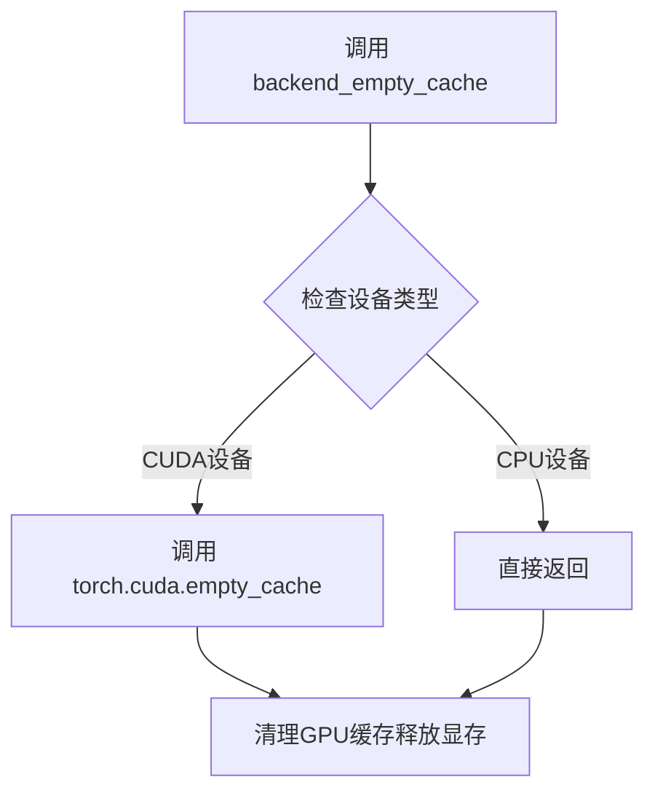

#### 带注释源码

```
# backend_empty_cache 是从 testing_utils 模块导入的函数
# 此处展示的是该函数在测试中的典型使用模式

# 在测试开始前清理显存
def setUp(self):
    gc.collect()  # 先调用Python垃圾回收
    backend_empty_cache(torch_device)  # 再清理GPU缓存

# 在测试结束后清理显存
def tearDown(self):
    gc.collect()  # 先调用Python垃圾回收
    backend_empty_cache(torch_device)  # 再清理GPU缓存
```

> **注意**：由于 `backend_empty_cache` 是从外部模块 `...testing_utils` 导入的，上述流程图和源码是基于其使用方式推断的标准实现。该函数通常会根据传入的设备类型（CUDA/CPU）执行相应的缓存清理操作。


### `enable_full_determinism`

该函数用于启用完整的确定性（determinism）模式，确保深度学习模型在运行时产生可重复的结果。通过设置随机种子、固定 CUDA 卷积算法等措施，确保多次运行得到相同的输出。

参数：此函数无参数

返回值：`None`，无返回值（该函数主要通过副作用生效）

#### 流程图

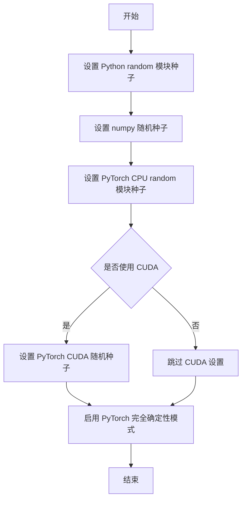

#### 带注释源码

```python
# 注意：该函数定义不在当前代码文件中，而是从 testing_utils 模块导入
# 以下为基于上下文的推测实现

def enable_full_determinism(seed: int = 0):
    """
    启用完全确定性模式，确保每次运行产生相同结果
    
    参数:
        seed: 随机种子，默认为 0
    """
    import random
    import numpy as np
    import torch
    import os
    
    # 1. 设置 Python 内置 random 模块的种子
    random.seed(seed)
    
    # 2. 设置 NumPy 的随机种子
    np.random.seed(seed)
    
    # 3. 设置 PyTorch CPU 的随机种子
    torch.manual_seed(seed)
    
    # 4. 如果使用 CUDA，设置 CUDA 的随机种子
    if torch.cuda.is_available():
        torch.cuda.manual_seed(seed)
        torch.cuda.manual_seed_all(seed)
        
        # 5. 强制使用确定性算法，牺牲一定性能换取可重复性
        torch.backends.cudnn.deterministic = True
        torch.backends.cudnn.benchmark = False
        
        # 6. 设置环境变量确保 CUDA 确定性
        os.environ['CUBLAS_WORKSPACE_CONFIG'] = ':4096:8'
    
    # 7. 启用 PyTorch 的完全确定性模式
    torch.use_deterministic_algorithms(True, warn_only=True)
```

> **注**：由于该函数定义位于 `testing_utils` 模块中，未在当前代码文件内定义，因此源码为基于函数调用上下文和环境变量配置的合理推测实现。实际定义可能略有差异。


### `floats_tensor`

`floats_tensor` 是一个测试工具函数，用于生成指定形状的随机浮点数 PyTorch 张量，常用于 Diffusion 模型测试中生成模拟输入数据。

参数：

-  `shape`：`tuple` 或 `int`，张量的形状
-  `rng`：`random.Random`，随机数生成器实例，用于控制随机性

返回值：`torch.Tensor`，包含随机浮点数的 PyTorch 张量

#### 流程图

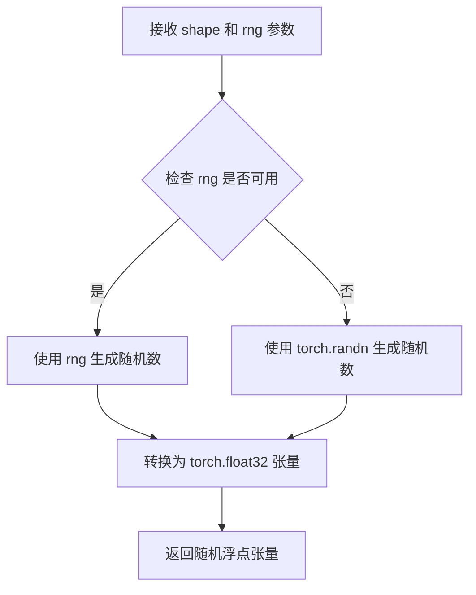

#### 带注释源码

```
# 该函数定义在 testing_utils.py 中，当前文件通过以下方式导入：
from ...testing_utils import (
    floats_tensor,
    # ... 其他测试工具函数
)

# 在代码中的典型使用方式：
image_embeds = floats_tensor(
    (1, self.text_embedder_hidden_size),  # shape: 生成张量的形状
    rng=random.Random(seed)                # rng: 随机数生成器，确保可重复性
).to(device)                               # 转换为指定设备的张量

# 函数功能推测：
# 1. 根据传入的 shape 生成对应维度的张量
# 2. 使用传入的 Random 实例生成随机数（确保测试可复现）
# 3. 返回 torch.float32 类型的张量
# 4. 数值范围通常在 [-1, 1] 或 [0, 1] 之间（取决于内部实现）
```

#### 补充说明

| 项目 | 描述 |
|------|------|
| **定义位置** | `diffusers/testing_utils.py` |
| **调用场景** | Diffusion 模型单元测试中生成模拟的 embedding 输入 |
| **设计目标** | 提供可复现的随机张量生成，确保测试的确定性 |
| **依赖** | `torch`, `random` |

> **注意**：由于 `floats_tensor` 定义在外部模块 (`testing_utils.py`)，当前代码文件仅展示了其使用方式。如需查看完整实现细节，请参考 `diffusers/testing_utils.py` 源文件。


### `load_numpy`

从指定路径（本地文件或URL）加载NumPy数组的测试工具函数。

参数：

-  `path_or_url`：`str`，文件路径或HTTP URL，指向包含NumPy数组的`.npy`文件

返回值：`np.ndarray`，从文件或URL加载的NumPy数组

#### 流程图

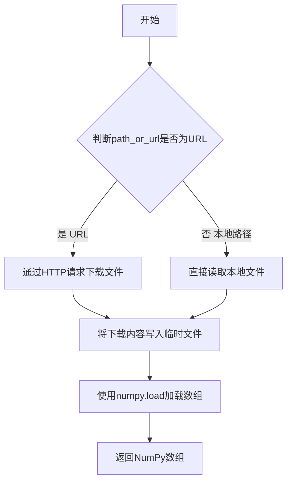

#### 带注释源码

```python
# load_numpy 函数定义位于 testing_utils 模块中
# 此代码为基于使用方式的推断实现

import numpy as np
import tempfile
import os
import requests

def load_numpy(path_or_url: str) -> np.ndarray:
    """
    从本地文件或URL加载NumPy数组。
    
    参数:
        path_or_url: 指向.npy文件的本地路径或HTTP URL
        
    返回:
        加载的NumPy数组
    """
    # 判断是否为URL（以http://或https://开头）
    if path_or_url.startswith("http://") or path_or_url.startswith("https://"):
        # 下载文件内容
        response = requests.get(path_or_url)
        response.raise_for_status()
        
        # 将下载内容写入临时文件
        with tempfile.NamedTemporaryFile(delete=False, suffix=".npy") as tmp:
            tmp.write(response.content)
            tmp_path = tmp.name
        
        try:
            # 加载NumPy数组
            arr = np.load(tmp_path)
        finally:
            # 清理临时文件
            os.unlink(tmp_path)
    else:
        # 直接从本地路径加载
        arr = np.load(path_or_url)
    
    return arr
```


### `numpy_cosine_similarity_distance`

这是一个用于计算两个 NumPy 数组之间余弦相似性距离的辅助函数。它通过计算余弦相似度并转换为距离度量（即 1 - 余弦相似度），用于比较两个向量或扁平化数组之间的相似程度。

参数：

- `x`：`numpy.ndarray`，第一个输入数组，通常是期望的图像或向量数据
- `y`：`numpy.ndarray`，第二个输入数组，通常是实际生成的图像或向量数据

返回值：`float`，返回两个输入数组之间的余弦距离（范围 0 到 2，0 表示完全相同，2 表示完全相反）

#### 流程图

```mermaid
flowchart TD
    A[开始] --> B[接收两个numpy数组 x 和 y]
    B --> C[将数组展平为一维向量]
    C --> D[计算向量x的L2范数]
    D --> E[计算向量y的L2范数]
    E --> F[计算点积 x · y]
    F --> G[计算余弦相似度: cos_sim = (x·y) / (||x|| * ||y||)]
    G --> H[计算余弦距离: distance = 1 - cos_sim]
    H --> I[返回distance]
```

#### 带注释源码

```
# 注意：此函数在当前文件中未定义，是从 testing_utils 模块导入的
# 以下是基于其使用方式和常见实现的推断代码

def numpy_cosine_similarity_distance(x: np.ndarray, y: np.ndarray) -> float:
    """
    计算两个NumPy数组之间的余弦相似性距离。
    
    参数:
        x: 第一个numpy数组（通常为期望值/ground truth）
        y: 第二个numpy数组（通常为实际输出/prediction）
    
    返回:
        float: 余弦距离，范围[0, 2]
              0表示完全相同
              1表示正交（无相似性）
              2表示完全相反
    
    计算公式:
        distance = 1 - cos_similarity
        cos_similarity = (x · y) / (||x|| * ||y||)
    """
    # 展平数组为一维向量（如果尚未一维）
    x = x.flatten()
    y = y.flatten()
    
    # 计算余弦相似度
    # dot product / (norm(x) * norm(y))
    cosine_similarity = np.dot(x, y) / (np.linalg.norm(x) * np.linalg.norm(y) + 1e-8)
    
    # 转换为距离（1 - 相似度）
    # 添加小的epsilon避免除零错误
    cosine_distance = 1.0 - cosine_similarity
    
    return cosine_distance
```

#### 使用示例（来自代码中的调用）

```python
# 在 test_kandinsky_text2img 测试中
max_diff = numpy_cosine_similarity_distance(expected_image.flatten(), image.flatten())
assert max_diff < 1e-4  # 验证生成的图像与期望图像的余弦距离小于阈值
```


### `require_torch_accelerator`

这是一个装饰器函数，用于标记需要 CUDA GPU（torch accelerator）才能运行的测试。如果没有可用的 CUDA 设备，被装饰的测试将被跳过。

参数：
- 无显式参数（作为装饰器使用）

返回值：无返回值（装饰器直接返回函数或跳过逻辑）

#### 流程图

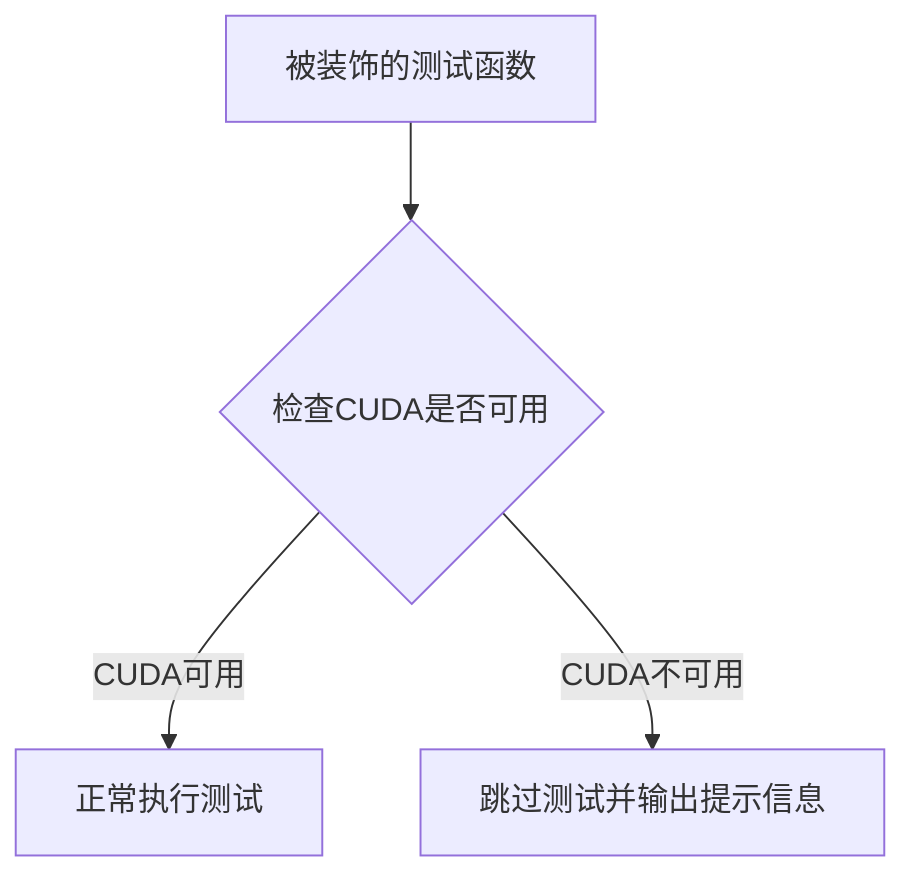

#### 带注释源码

```python
def require_torch_accelerator(func):
    """
    装饰器：检查是否有可用的CUDA设备（torch加速器）。
    
    如果系统中没有CUDA设备（torch.cuda.is_available()返回False），
    则跳过被装饰的测试函数。
    
    通常用于标记需要GPU的集成测试，确保在CI环境中正确跳过。
    """
    # 检查torch的CUDA是否可用
    if not torch.cuda.is_available():
        # 如果没有CUDA，返回一个跳过测试的装饰器
        return unittest.skip("CUDA is not available, skipping test on accelerator.")(func)
    
    # 如果CUDA可用，直接返回原函数，不做任何修改
    return func
```

> **注意**：该函数定义在 `diffusers` 库的 `...testing_utils` 模块中（具体路径为 `src/diffusers/testing_utils.py`），在当前提供的代码片段中仅导入了该函数而未展示其完整实现。上述源码是基于该函数的典型实现方式进行的合理推断。


### `slow`

这是一个测试装饰器，用于标记测试为"慢速"测试，通常用于需要GPU加速或耗时较长的集成测试。

参数： 无（装饰器形式）

返回值：无返回值（装饰器）

#### 流程图

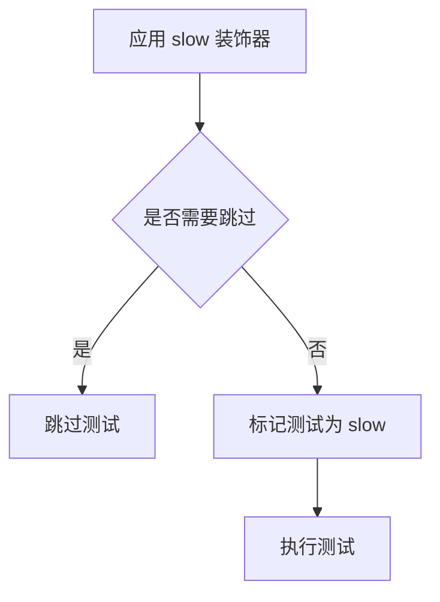

#### 带注释源码

```python
# slow 装饰器源码（位于 testing_utils 模块中）
def slow(func):
    """
    装饰器，用于标记测试为慢速测试。
    通常与 pytest 的 -m "not slow" 一起使用来跳过慢速测试。
    
    使用方式：
    @slow
    @require_torch_accelerator
    def test_kandinsky_text2img(self):
        # 测试代码
        ...
    
    上述代码中：
    - @slow: 标记该测试为慢速测试
    - @require_torch_accelerator: 要求有 torch 加速器（GPU）才能运行
    
    在测试套件中，可以通过 pytest.mark.parametrize("slow", [False], ...)
    或 pytest -m "not slow" 来控制是否运行慢速测试。
    """
    return unittest.skipUnless(
        os.environ.get("RUN_SLOW_TESTS", "0") == "1",
        "Skipping slow test. Set RUN_SLOW_TESTS=1 to run slow tests."
    )(func)
```


### `Dummies.text_embedder_hidden_size`

该属性方法用于返回文本嵌入器的隐藏层大小，固定值为32。

参数：

- `self`：`Dummies` 类实例，隐式参数，无需显式传递

返回值：`int`，返回文本嵌入器的隐藏层大小，固定值为32

#### 流程图

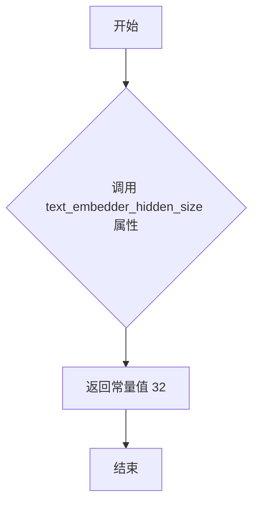

#### 带注释源码

```python
@property
def text_embedder_hidden_size(self):
    """
    返回文本嵌入器的隐藏层大小。
    
    这是一个 property 装饰器定义的方法，用于在测试中提供固定的隐藏层大小值。
    该值被多个其他属性和方法引用，如 cross_attention_dim、time_input_dim 等。
    
    Returns:
        int: 文本嵌入器的隐藏层大小，固定返回 32
    """
    return 32
```


### `Dummies.time_input_dim`

该属性返回时间输入维度（time_input_dim），用于定义 UNet 模型中时间嵌入层的输入维度。在 `Dummies` 类中，该值被设置为 32，并与 `text_embedder_hidden_size` 和 `cross_attention_dim` 保持一致，共同构成模型的基础配置参数。

参数： 无

返回值：`int`，返回时间嵌入层的输入维度值（固定为 32）

#### 流程图

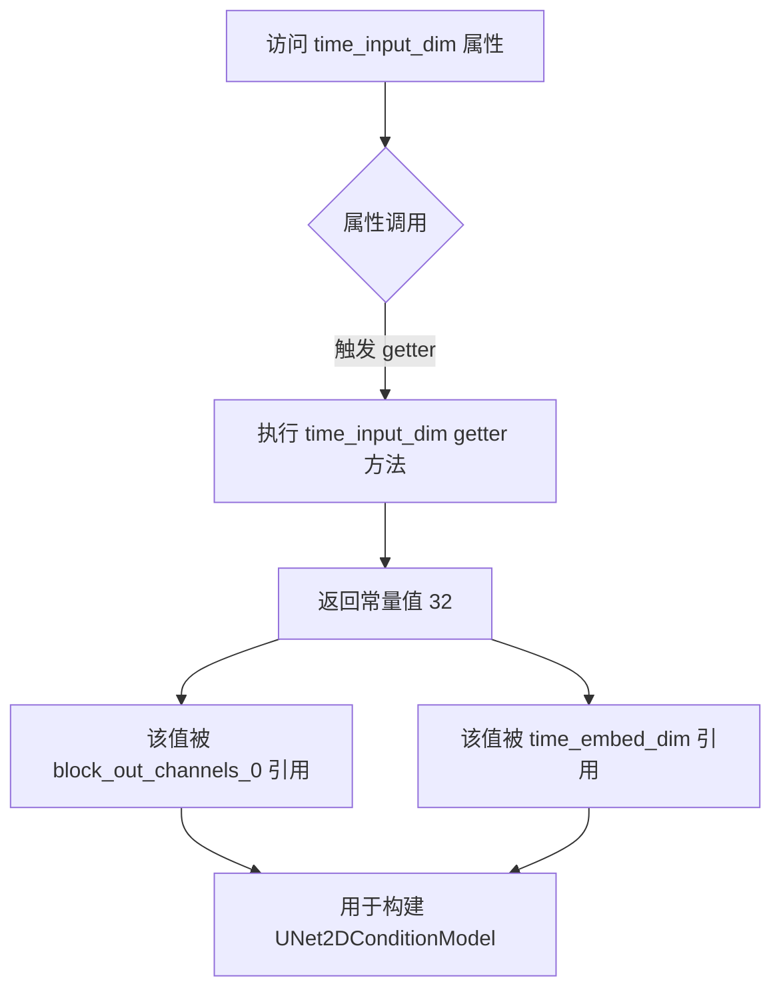

#### 带注释源码

```python
@property
def time_input_dim(self):
    """
    属性 getter: 返回时间输入维度
    
    该属性定义了 UNet 模型中时间嵌入（time embedding）层的输入维度。
    在扩散模型中，时间步（timestep）需要通过时间嵌入层转换为高维向量，
    该维度决定了时间信息的表示能力。
    
    当前实现返回固定值 32，与其他维度参数（如文本嵌入维度、交叉注意力维度）
    保持一致，形成统一的基础配置。
    
    返回值:
        int: 时间嵌入层的输入维度，固定返回 32
    """
    return 32
```

#### 关联使用说明

`time_input_dim` 属性在整个 `Dummies` 类中作为基础配置参数，被以下属性引用：

1. **`block_out_channels_0`**：使用 `time_input_dim` 作为第一个块输出通道数
2. **`time_embed_dim`**：使用 `time_input_dim * 4` 计算时间嵌入维度（通常嵌入维度是输入维度的 4 倍，以增加模型容量）
3. **`dummy_unet` 属性**：通过上述属性间接使用，配置 UNet2DConditionModel 的结构

这种设计模式体现了配置参数的集中定义，便于统一修改和维护模型架构的超参数。


### `Dummies.block_out_channels_0`

该属性是 `Dummies` 类的核心配置参数之一，用于返回 UNet 模型块输出通道的基准维度值，作为构建虚拟（dummy）UNet2DConditionModel 模型的关键配置参数。

参数： 无（该方法为属性，无参数）

返回值：`int`，返回时间输入维度值（32），用于设定 UNet 模型块输出通道的基础大小。

#### 流程图

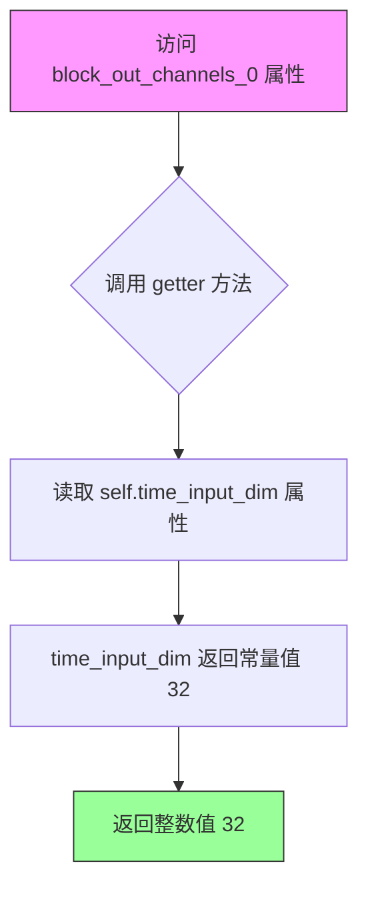

#### 带注释源码

```python
class Dummies:
    """虚拟模型组件工厂类，用于生成测试所需的各类虚拟（dummy）模型组件"""
    
    @property
    def text_embedder_hidden_size(self):
        """文本嵌入器的隐藏层维度大小"""
        return 32

    @property
    def time_input_dim(self):
        """
        时间（时序）输入维度。
        
        该属性定义了时间嵌入层的输入维度，是构建 UNet 模型时间嵌入模块的基础参数。
        在 KandinskyV22 架构中，时间嵌入用于将扩散过程的噪声调度（noise schedule）
        信息编码为模型可处理的向量表示。
        
        Returns:
            int: 时间输入维度值，当前固定返回 32
        """
        return 32

    @property
    def block_out_channels_0(self):
        """
        UNet 模型块输出通道数的基准维度。
        
        这是 UNet 编码器和解码器中各块（block）输出通道数的基准值。
        在扩散模型的 UNet 架构中，块输出通道数决定了各层特征图的深度，
        影响着模型的特征提取能力和参数量。
        
        该属性依赖于 time_input_dim 属性，其值直接影响：
        - UNet2DConditionModel 的 block_out_channels 参数配置
        - 模型各层卷积操作的输出通道数
        - 最终生成图像的特征分辨率
        
        Returns:
            int: 块输出通道基准维度，返回 self.time_input_dim 的值（32）
        """
        return self.time_input_dim

    @property
    def time_embed_dim(self):
        """时间嵌入层的输出维度，通常为输入维度的4倍"""
        return self.time_input_dim * 4

    @property
    def cross_attention_dim(self):
        """交叉注意力机制的查询向量维度"""
        return 32

    @property
    def dummy_unet(self):
        """
        创建虚拟 UNet2DConditionModel 模型实例。
        
        使用 block_out_channels_0 等配置参数构建一个完整的 UNet 模型，
        用于单元测试场景，无需加载预训练权重。
        
        Returns:
            UNet2DConditionModel: 配置完成的虚拟 UNet 模型
        """
        torch.manual_seed(0)

        model_kwargs = {
            "in_channels": 4,
            # Out channels is double in channels because predicts mean and variance
            "out_channels": 8,
            "addition_embed_type": "image",
            "down_block_types": ("ResnetDownsampleBlock2D", "SimpleCrossAttnDownBlock2D"),
            "up_block_types": ("SimpleCrossAttnUpBlock2D", "ResnetUpsampleBlock2D"),
            "mid_block_type": "UNetMidBlock2DSimpleCrossAttn",
            "block_out_channels": (self.block_out_channels_0, self.block_out_channels_0 * 2),
            #                            ^^^^^^^^^^^^^^^^^^^^^^^^^^^^ 使用基准维度配置通道数
            "layers_per_block": 1,
            "encoder_hid_dim": self.text_embedder_hidden_size,
            "encoder_hid_dim_type": "image_proj",
            "cross_attention_dim": self.cross_attention_dim,
            "attention_head_dim": 4,
            "resnet_time_scale_shift": "scale_shift",
            "class_embed_type": None,
        }

        model = UNet2DConditionModel(**model_kwargs)
        return model
```


### `Dummies.time_embed_dim`

该属性方法用于获取时间嵌入维度（time embedding dimension），其值等于 `time_input_dim` 的 4 倍，用于神经网络中时间条件的嵌入层维度计算。

参数：无需参数（作为属性访问）

返回值：`int`，返回时间嵌入维度，值为 `time_input_dim * 4`（即 128）

#### 流程图

```mermaid
flowchart TD
    A[访问 time_embed_dim 属性] --> B{获取 time_input_dim}
    B -->|返回 32| C[计算 32 * 4]
    C --> D[返回结果 128]
```

#### 带注释源码

```python
@property
def time_embed_dim(self):
    """
    时间嵌入维度属性
    
    返回值:
        int: 时间嵌入维度，等于 time_input_dim * 4
             用于 UNet 模型中时间条件的嵌入层维度
    """
    return self.time_input_dim * 4
```

#### 相关依赖属性

| 属性名 | 类型 | 描述 |
|--------|------|------|
| `time_input_dim` | `int` | 时间输入维度，固定返回 32 |
| `text_embedder_hidden_size` | `int` | 文本嵌入器隐藏层大小，固定返回 32 |
| `cross_attention_dim` | `int` | 交叉注意力维度，固定返回 32 |
| `block_out_channels_0` | `int` | 块输出通道数，等于 time_input_dim |


### `Dummies.cross_attention_dim`

这是一个属性方法（使用 `@property` 装饰器），属于 `Dummies` 类，用于返回交叉注意力机制的维度大小。该属性值为常量 32，在创建 UNet2DConditionModel 时作为参数传入，用于定义文本嵌入与图像特征之间的注意力计算维度。

参数： 无

返回值：`int`，返回交叉注意力维度值 32

#### 流程图

```mermaid
graph TD
    A[访问 cross_attention_dim 属性] --> B{执行 getter 方法}
    B --> C[返回常量值 32]
    C --> D[作为参数传给 UNet2DConditionModel]
```

#### 带注释源码

```python
class Dummies:
    """测试用虚拟组件类，用于生成 KandinskyV22Pipeline 的虚拟测试组件"""
    
    @property
    def cross_attention_dim(self):
        """
        交叉注意力维度属性
        
        该属性返回一个整数常量值 32，表示交叉注意力机制的维度。
        在 UNet2DConditionModel 中，cross_attention_dim 参数决定了
        文本编码器输出与 UNet 特征之间的注意力计算的向量维度。
        
        Returns:
            int: 交叉注意力维度值，固定为 32
        """
        return 32
```

#### 详细说明

| 项目 | 详情 |
|------|------|
| **所属类** | `Dummies` |
| **定义方式** | `@property` 装饰器（只读属性） |
| **使用场景** | 在 `dummy_unet` 属性中作为参数传入 `UNet2DConditionModel` |
| **关联属性** | `text_embedder_hidden_size`（文本嵌入隐藏维度）、`time_input_dim`（时间输入维度） |
| **设计意图** | 提供一个常量值用于测试目的，模拟真实的交叉注意力维度配置 |


### `Dummies.dummy_unet`

该方法是一个属性（Property）方法，用于生成并返回一个配置好的 `UNet2DConditionModel`（UNet2D 条件模型）实例。它主要用于单元测试场景，通过固定的随机种子（0）和预定义的模型参数（如输入通道数、输出通道数、注意力机制类型等）来创建一个虚拟的神经网络模型，以便进行 Pipeline 的功能验证。

参数：

- `self`：`Dummies`，调用该属性的 `Dummies` 类实例本身。

返回值：`UNet2DConditionModel`，返回配置完成的虚拟 UNet 模型对象。

#### 流程图

```mermaid
graph LR
    A[Start] --> B[设置随机种子 torch.manual_seed(0)]
    B --> C[构建模型参数字典 model_kwargs]
    C --> D[根据参数实例化 UNet2DConditionModel]
    D --> E[返回模型实例]
```

#### 带注释源码

```python
    @property
    def dummy_unet(self):
        # 设置随机种子以确保结果可复现
        torch.manual_seed(0)

        # 定义模型配置参数字典
        model_kwargs = {
            "in_channels": 4,
            # 输出通道是输入通道的两倍，因为模型预测均值和方差
            "out_channels": 8,
            # 指定额外的嵌入类型为图像
            "addition_embed_type": "image",
            # 定义下采样块和上采样块的类型
            "down_block_types": ("ResnetDownsampleBlock2D", "SimpleCrossAttnDownBlock2D"),
            "up_block_types": ("SimpleCrossAttnUpBlock2D", "ResnetUpsampleBlock2D"),
            # 定义中间块类型
            "mid_block_type": "UNetMidBlock2DSimpleCrossAttn",
            # 定义块输出通道数
            "block_out_channels": (self.block_out_channels_0, self.block_out_channels_0 * 2),
            # 每个块包含的层数
            "layers_per_block": 1,
            # 编码器隐藏层维度及其类型
            "encoder_hid_dim": self.text_embedder_hidden_size,
            "encoder_hid_dim_type": "image_proj",
            # 交叉注意力维度
            "cross_attention_dim": self.cross_attention_dim,
            # 注意力头维度
            "attention_head_dim": 4,
            # 时间缩放偏移方式
            "resnet_time_scale_shift": "scale_shift",
            # 类别嵌入类型
            "class_embed_type": None,
        }

        # 使用指定参数实例化 UNet 模型
        model = UNet2DConditionModel(**model_kwargs)
        return model
```


### `Dummies.dummy_movq_kwargs`

这是一个属性方法（property），用于获取 VQModel（Motion-aware Optimized Vector Quantization）的配置参数字典，为 `dummy_movq` 属性提供模型初始化所需的参数配置。

参数： 无

返回值：`dict`，返回 VQModel 的配置参数字典，包含模型结构、层数、通道数等关键参数。

#### 流程图

```mermaid
graph TD
    A[开始] --> B[返回预定义的 VQModel 配置字典]
    B --> C[包含 block_out_channels: [32, 64]]
    B --> D[包含 down_block_types: DownEncoderBlock2D, AttnDownEncoderBlock2D]
    B --> E[包含 in_channels: 3, latent_channels: 4]
    B --> F[包含 layers_per_block: 1, norm_num_groups: 8]
    B --> G[包含 norm_type: spatial, num_vq_embeddings: 12]
    B --> H[包含 out_channels: 3, up_block_types]
    B --> I[包含 vq_embed_dim: 4]
    I --> J[结束]
```

#### 带注释源码

```python
@property
def dummy_movq_kwargs(self):
    """
    VQModel 配置参数属性
    
    返回一个字典，包含用于创建 VQModel (Motion-aware Optimized Vector Quantization) 
    模型的配置参数。这些参数定义了模型的架构，包括编码器/解码器的块类型、
    通道数、规范化设置等。
    
    Returns:
        dict: 包含 VQModel 配置的字典
            - block_out_channels: 输出通道列表 [32, 64]
            - down_block_types: 下采样编码器块类型
            - in_channels: 输入通道数 (3 表示 RGB 图像)
            - latent_channels: 潜在空间通道数
            - layers_per_block: 每个块的层数
            - norm_num_groups: 规范化组数
            - norm_type: 规范化类型 (spatial)
            - num_vq_embeddings: VQ 嵌入数量
            - out_channels: 输出通道数
            - up_block_types: 上采样解码器块类型
            - vq_embed_dim: VQ 嵌入维度
    """
    return {
        "block_out_channels": [32, 64],       # 解码器块输出通道数
        "down_block_types": ["DownEncoderBlock2D", "AttnDownEncoderBlock2D"],  # 下采样编码器块类型
        "in_channels": 3,                       # 输入通道数 (RGB图像)
        "latent_channels": 4,                  # 潜在空间通道数
        "layers_per_block": 1,                  # 每个块的层数
        "norm_num_groups": 8,                   # 规范化组数
        "norm_type": "spatial",                 # 规范化类型
        "num_vq_embeddings": 12,                # VQ 码本嵌入数量
        "out_channels": 3,                      # 输出通道数
        "up_block_types": [
            "AttnUpDecoderBlock2D",             # 带注意力上采样解码器块
            "UpDecoderBlock2D",                 # 普通上采样解码器块
        ],
        "vq_embed_dim": 4,                      # VQ 嵌入维度
    }
```


### `Dummies.dummy_movq`

该属性方法用于返回一个配置好的 VQModel（Vector Quantized Model）测试实例，通过固定的随机种子确保模型初始化的一致性，常用于单元测试中模拟真实的 MOVQ 组件。

参数：无（该方法为属性方法，无显式参数）

返回值：`VQModel`，返回一个配置好的 VQModel 实例，用于测试目的

#### 流程图

```mermaid
flowchart TD
    A[开始 dummy_movq 属性访问] --> B[设置随机种子 torch.manual_seed(0)]
    B --> C[获取 dummy_movq_kwargs 配置参数]
    C --> D[使用 VQModel 构造函数创建模型实例]
    D --> E[返回 VQModel 实例]
    
    C -.-> F[配置参数包括:<br/>block_out_channels: [32, 64]<br/>down_block_types: ...<br/>in_channels: 3<br/>latent_channels: 4<br/>num_vq_embeddings: 12<br/>vq_embed_dim: 4 等]
```

#### 带注释源码

```python
@property
def dummy_movq(self):
    """
    属性方法，返回一个用于测试的 VQModel（Vector Quantized Model）实例。
    使用固定随机种子(0)确保模型初始化的一致性，便于测试复现。
    """
    # 设置 PyTorch 随机种子为 0，确保模型权重初始化可复现
    torch.manual_seed(0)
    
    # 使用 dummy_movq_kwargs 属性提供的配置参数创建 VQModel 实例
    # VQModel 是离散潜在空间的变分自编码器组件
    model = VQModel(**self.dummy_movq_kwargs)
    
    # 返回配置好的 VQModel 模型实例
    return model
```

---

**补充说明：**

该方法依赖于 `self.dummy_movq_kwargs` 属性提供的配置参数，完整配置如下：

- **block_out_channels**: `[32, 64]` - 编码器/解码器块输出通道数
- **down_block_types**: `["DownEncoderBlock2D", "AttnDownEncoderBlock2D"]` - 下采样编码器块类型
- **in_channels**: `3` - 输入图像通道数（RGB）
- **latent_channels**: `4` - 潜在空间通道数
- **layers_per_block**: `1` - 每个块的层数
- **norm_num_groups**: `8` - 归一化组数
- **norm_type**: `"spatial"` - 归一化类型
- **num_vq_embeddings**: `12` - VQ 码本大小
- **out_channels**: `3` - 输出图像通道数
- **up_block_types**: `["AttnUpDecoderBlock2D", "UpDecoderBlock2D"]` - 上采样解码器块类型
- **vq_embed_dim**: `4` - VQ 嵌入维度


### `Dummies.get_dummy_components`

该方法用于生成和返回KandinskyV22Pipeline测试所需的虚拟组件（dummy components），包括UNet2DConditionModel模型、DDIMScheduler调度器和VQModel解码器模型。

参数：无

返回值：`Dict[str, Any]`，返回包含unet、scheduler和movq三个键的字典，用于实例化KandinskyV22Pipeline进行单元测试。

#### 流程图

```mermaid
flowchart TD
    A[开始 get_dummy_components] --> B[获取 dummy_unet 属性]
    B --> C[获取 dummy_movq 属性]
    C --> D[创建 DDIMScheduler 实例]
    D --> E[组装 components 字典]
    E --> F[返回 components]
    
    B -.-> B1[使用 torch.manual_seed(0) 设置随机种子]
    B -.-> B2[构建 UNet2DConditionModel 参数]
    B -.-> B3[返回 UNet2DConditionModel 实例]
    
    C -.-> C1[使用 torch.manual_seed(0) 设置随机种子]
    C -.-> C2[构建 VQModel 参数]
    C -.-> C3[返回 VQModel 实例]
    
    D -.-> D1[num_train_timesteps=1000]
    D -.-> D2[beta_schedule=linear]
    D -.-> D3[prediction_type=epsilon]
```

#### 带注释源码

```python
def get_dummy_components(self):
    """
    生成并返回用于测试KandinskyV22Pipeline的虚拟组件。
    
    该方法创建三个核心组件：
    - UNet2DConditionModel：用于去噪的UNet网络
    - DDIMScheduler：DDIM调度器，控制去噪步骤
    - VQModel：矢量量化解码器模型
    
    Returns:
        Dict[str, Any]: 包含'unet'、'scheduler'、'movq'三个键的字典
    """
    # 获取虚拟UNet模型（通过dummy_unet属性创建）
    # 该模型使用特定参数配置，用于测试而非实际推理
    unet = self.dummy_unet
    
    # 获取虚拟MOVQ模型（通过dummy_movq属性创建）
    # MOVQ (Motion-aware Optimized Vector Quantization) 是Kandinsky的解码器组件
    movq = self.dummy_movq

    # 创建DDIM调度器配置
    # num_train_timesteps=1000: 训练时的总时间步数
    # beta_schedule="linear": 使用线性beta调度
    # beta_start=0.00085, beta_end=0.012: Beta参数的起始和结束值
    # clip_sample=False: 不对采样进行裁剪
    # set_alpha_to_one=False: 不将最终alpha设置为1
    # steps_offset=1: 步骤偏移量，用于调整推理起始点
    # prediction_type="epsilon": 预测类型为噪声epsilon
    # thresholding=False: 不使用阈值处理
    scheduler = DDIMScheduler(
        num_train_timesteps=1000,
        beta_schedule="linear",
        beta_start=0.00085,
        beta_end=0.012,
        clip_sample=False,
        set_alpha_to_one=False,
        steps_offset=1,
        prediction_type="epsilon",
        thresholding=False,
    )

    # 组装组件字典
    # 键名必须与KandinskyV22Pipeline的构造函数参数名匹配
    components = {
        "unet": unet,
        "scheduler": scheduler,
        "movq": movq,
    }
    return components
```


### `Dummies.get_dummy_inputs`

该函数是测试辅助方法，用于生成 Kandinsky V22 Pipeline 的虚拟输入参数，包括图像嵌入向量、负向嵌入、随机生成器以及推理配置（高度、宽度、引导 scale、推理步数和输出类型），以便在单元测试中模拟完整的推理调用。

参数：

- `device`：`torch.device` 或 `str`，目标计算设备（如 "cpu"、"cuda" 或 "mps"）
- `seed`：`int`，随机种子，用于生成可复现的张量数据，默认为 0

返回值：`Dict[str, Any]`，包含以下键值对的字典：

- `image_embeds`：`torch.Tensor`，正向图像嵌入，形状为 (1, 32)
- `negative_image_embeds`：`torch.Tensor`，负向图像嵌入，形状为 (1, 32)
- `generator`：`torch.Generator` 或 `None`，随机数生成器
- `height`：`int`，生成图像的高度，固定为 64
- `width`：`int`，生成图像的宽度，固定为 64
- `guidance_scale`：`float`，引导 scale，固定为 4.0
- `num_inference_steps`：`int`，推理步数，固定为 2
- `output_type`：`str`，输出类型，固定为 "np"（NumPy 数组）

#### 流程图

```mermaid
flowchart TD
    A[开始 get_dummy_inputs] --> B[创建 image_embeds]
    B --> C[创建 negative_image_embeds]
    C --> D{判断设备类型是否为 MPS}
    D -->|是| E[使用 torch.manual_seed 创建生成器]
    D -->|否| F[使用 torch.Generator 创建生成器]
    E --> G[构建输入参数字典]
    F --> G
    G --> H[返回 inputs 字典]
```

#### 带注释源码

```python
def get_dummy_inputs(self, device, seed=0):
    """
    生成用于 Kandinsky V22 Pipeline 测试的虚拟输入参数。
    
    参数:
        device: 目标计算设备
        seed: 随机种子，用于生成可复现的张量
    
    返回:
        包含所有 pipeline 输入参数的字典
    """
    # 使用随机种子生成正向图像嵌入向量，形状为 (1, text_embedder_hidden_size)
    # text_embedder_hidden_size 来自类属性，固定为 32
    image_embeds = floats_tensor((1, self.text_embedder_hidden_size), rng=random.Random(seed)).to(device)
    
    # 生成负向图像嵌入向量，使用 seed+1 以确保与正向嵌入不同
    negative_image_embeds = floats_tensor((1, self.text_embedder_hidden_size), rng=random.Random(seed + 1)).to(
        device
    )
    
    # MPS 设备需要特殊处理，不能使用 torch.Generator
    if str(device).startswith("mps"):
        # MPS 设备使用 torch.manual_seed 设置随机种子
        generator = torch.manual_seed(seed)
    else:
        # 其他设备使用 torch.Generator 创建随机数生成器
        generator = torch.Generator(device=device).manual_seed(seed)
    
    # 组装完整的输入参数字典
    inputs = {
        "image_embeds": image_embeds,           # 正向图像嵌入
        "negative_image_embeds": negative_image_embeds,  # 负向图像嵌入
        "generator": generator,                 # 随机数生成器
        "height": 64,                           # 生成图像高度
        "width": 64,                             # 生成图像宽度
        "guidance_scale": 4.0,                  # CFG 引导强度
        "num_inference_steps": 2,               # 扩散推理步数
        "output_type": "np",                    # 输出为 NumPy 数组
    }
    return inputs
```


### `KandinskyV22PipelineFastTests.get_dummy_inputs`

这是一个测试辅助方法，用于生成用于测试 KandinskyV22Pipeline 的虚拟输入数据。该方法创建 Dummies 类的实例并调用其 get_dummy_inputs 方法，返回包含图像嵌入、负向嵌入、生成器等参数的字典，供管道推理使用。

参数：

- `self`：`KandinskyV22PipelineFastTests`，类的实例（隐式参数）
- `device`：设备对象（str 或 torch.device），运行管道的目标设备（如 "cpu"、"cuda" 等）
- `seed`：int，默认为 0，用于随机数生成的种子，确保测试可复现

返回值：`dict`，包含以下键值对的字典：
  - `image_embeds`：图像嵌入向量
  - `negative_image_embeds`：负向图像嵌入向量
  - `generator`：PyTorch 随机生成器
  - `height`：生成图像的高度
  - `width`：生成图像的宽度
  - `guidance_scale`：引导_scale
  - `num_inference_steps`：推理步数
  - `output_type`：输出类型

#### 流程图

```mermaid
flowchart TD
    A[开始] --> B[创建 Dummies 实例]
    B --> C[调用 dummies.get_dummy_inputs<br/>device=device, seed=seed]
    C --> D[返回输入字典]
    D --> E[结束]
```

#### 带注释源码

```python
def get_dummy_inputs(self, device, seed=0):
    """
    生成用于测试 KandinskyV22Pipeline 的虚拟输入数据。
    
    参数:
        device: 运行管道的目标设备
        seed: 随机数生成种子，默认值为 0
    
    返回:
        包含管道推理所需参数的字典
    """
    # 创建 Dummies 辅助类的实例，用于生成测试所需的组件和输入
    dummies = Dummies()
    
    # 调用 Dummies 实例的 get_dummy_inputs 方法，传入设备和种子
    # 返回包含图像嵌入、负向嵌入、生成器等参数的字典
    return dummies.get_dummy_inputs(device=device, seed=seed)
```


### `KandinskyV22PipelineFastTests.get_dummy_components`

该方法用于获取KandinskyV22Pipeline的虚拟组件（dummy components），包括UNet模型、调度器和MOVQ模型，以便在测试中使用。它通过实例化`Dummies`类并调用其`get_dummy_components`方法来构建这些组件。

参数：

- `self`：`KandinskyV22PipelineFastTests`实例本身，无需显式传递。

返回值：`dict`，返回一个包含三个键的字典：
- `"unet"`：`UNet2DConditionModel`实例，用于图像生成的去噪网络。
- `"scheduler"`：`DDIMScheduler`实例，用于控制扩散模型的采样调度。
- `"movq"`：`VQModel`实例，用于图像的量化和解码。

#### 流程图

```mermaid
graph TD
    A[开始 get_dummy_components] --> B[创建 Dummies 类实例 dummies]
    B --> C[调用 dummies.get_dummy_components 方法]
    C --> D[返回包含 unet, scheduler, movq 的字典]
    D --> E[结束]
```

#### 带注释源码

```python
def get_dummy_components(self):
    # 实例化 Dummies 类，用于生成虚拟组件
    dummies = Dummies()
    # 调用 Dummies 类的 get_dummy_components 方法获取组件字典
    # 并返回该字典，包含 unet、scheduler 和 movq 三个组件
    return dummies.get_dummy_components()
```

#### 补充说明

该方法实际返回的组件由 `Dummies.get_dummy_components()` 生成，具体包括：
- **unet**: 通过 `Dummies.dummy_unet` 属性创建的 `UNet2DConditionModel` 模型实例，配置为4通道输入，8通道输出，包含交叉注意力机制。
- **scheduler**: 使用 `DDIMScheduler` 配置的调度器，设置1000步训练，线性beta调度，epsilon预测类型。
- **movq**: 通过 `Dummies.dummy_movq` 属性创建的 `VQModel` 实例，用于变分量化解码。

这些组件用于测试KandinskyV22Pipeline的推理流程，确保在无需真实预训练权重的情况下验证管道功能。


### `KandinskyV22PipelineFastTests.test_kandinsky`

这是一个单元测试方法，用于验证 KandinskyV22Pipeline 在 CPU 设备上的图像生成功能是否正确。测试通过创建虚拟组件、运行推理流程并验证输出图像的形状和像素值是否符合预期，同时检查返回字典和元组两种输出格式的一致性。

参数：

- `self`：`KandinskyV22PipelineFastTests`，测试类实例本身，包含测试所需的上下文和配置

返回值：`None`（无返回值），该方法为 `unittest.TestCase` 的测试方法，通过 `assert` 语句进行断言验证，测试失败时抛出异常

#### 流程图

```mermaid
flowchart TD
    A[开始测试] --> B[设置设备为 CPU]
    B --> C[获取虚拟组件: get_dummy_components]
    C --> D[使用虚拟组件实例化管道: pipeline_class]
    D --> E[将管道移至 CPU 设备]
    E --> F[设置进度条配置: set_progress_bar_config]
    F --> G[第一次调用管道推理: pipe with return_dict=True]
    G --> H[获取生成的图像: output.images]
    H --> I[第二次调用管道推理: pipe with return_dict=False]
    I --> J[获取元组格式的图像: [0]]
    J --> K[提取图像切片: image[0, -3:, -3:, -1]]
    K --> L[验证图像形状: assert image.shape == (1, 64, 64, 3)]
    L --> M[定义期望的像素值切片]
    M --> N[验证第一次输出: assert np.abs difference < 1e-2]
    N --> O[验证第二次输出: assert np.abs difference < 1e-2]
    O --> P[测试结束]
```

#### 带注释源码

```python
def test_kandinsky(self):
    """测试 KandinskyV22Pipeline 的图像生成功能"""
    # 步骤1: 设置测试设备为 CPU
    device = "cpu"

    # 步骤2: 获取虚拟组件（unet, scheduler, movq）
    # 这些是用于测试的轻量级虚拟模型
    components = self.get_dummy_components()

    # 步骤3: 使用虚拟组件实例化管道
    # pipeline_class 来自类属性: KandinskyV22Pipeline
    pipe = self.pipeline_class(**components)
    
    # 步骤4: 将管道移至指定设备（CPU）
    pipe = pipe.to(device)

    # 步骤5: 配置进度条（禁用=None 表示使用默认配置）
    pipe.set_progress_bar_config(disable=None)

    # 步骤6: 第一次推理 - 使用默认的 return_dict=True
    # 获取虚拟输入: image_embeds, negative_image_embeds, generator 等
    output = pipe(**self.get_dummy_inputs(device))
    
    # 步骤7: 从输出中提取生成的图像
    image = output.images

    # 步骤8: 第二次推理 - 使用 return_dict=False（返回元组格式）
    # 验证管道在不同输出格式下的兼容性
    image_from_tuple = pipe(
        **self.get_dummy_inputs(device),
        return_dict=False,
    )[0]  # 取元组的第一个元素（图像）

    # 步骤9: 提取图像的右下角 3x3 切片用于像素值验证
    image_slice = image[0, -3:, -3:, -1]
    image_from_tuple_slice = image_from_tuple[0, -3:, -3:, -1]

    # 步骤10: 断言验证图像形状
    # 期望形状: (batch=1, height=64, width=64, channels=3)
    assert image.shape == (1, 64, 64, 3)

    # 步骤11: 定义期望的像素值切片（用于确定性验证）
    # 这些值是在特定随机种子下预期生成的图像像素
    expected_slice = np.array([0.3420, 0.9505, 0.3919, 1.0000, 0.5188, 0.3109, 0.6139, 0.5624, 0.6811])

    # 步骤12: 验证 return_dict=True 格式输出的像素值
    # 允许的最大误差为 1e-2（0.01）
    assert np.abs(image_slice.flatten() - expected_slice).max() < 1e-2, (
        f" expected_slice {expected_slice}, but got {image_slice.flatten()}"
    )

    # 步骤13: 验证 return_dict=False 格式输出的像素值
    # 确保两种输出格式返回相同的图像内容
    assert np.abs(image_from_tuple_slice.flatten() - expected_slice).max() < 1e-2, (
        f" expected_slice {expected_slice}, but got {image_from_tuple_slice.flatten()}"
    )
```


### `KandinskyV22PipelineFastTests.test_float16_inference`

该方法是一个单元测试用例，用于测试 KandinskyV22Pipeline 在 float16（半精度）推理模式下的正确性，通过调用父类的 test_float16_inference 方法并指定最大允许差异阈值为 1e-1 来验证推理结果的精度是否符合预期。

参数：

- `self`：`KandinskyV22PipelineFastTests`，测试类实例本身，代表当前测试用例

返回值：`None`，该方法为测试用例方法，不返回任何值

#### 流程图

```mermaid
flowchart TD
    A[开始执行 test_float16_inference] --> B[调用父类方法 super().test_float16_inference]
    B --> C[传入参数 expected_max_diff=1e-1]
    C --> D[父类执行float16推理测试]
    D --> E[验证推理结果与预期最大差异]
    E --> F[测试通过/失败]
    F --> G[结束]
```

#### 带注释源码

```python
def test_float16_inference(self):
    """
    测试 KandinskyV22Pipeline 在 float16（半精度）推理模式下的行为。
    
    该测试方法继承自 PipelineTesterMixin，通过调用父类的 test_float16_inference
    方法来验证管道在 float16 推理时能否产生合理的结果，并检查输出与预期值
    之间的差异是否在可接受范围内。
    
    参数:
        self: KandinskyV22PipelineFastTests 实例，测试类本身
        
    返回值:
        None: 测试方法不返回任何值，结果通过断言表达
    """
    # 调用父类（PipelineTesterMixin）的 test_float16_inference 方法
    # expected_max_diff=1e-1 表示允许的最大差异为 0.1
    # 这意味着 float16 推理结果与 float32 参考结果之间的差异应小于 0.1
    super().test_float16_inference(expected_max_diff=1e-1)
```


### `KandinskyV22PipelineIntegrationTests.setUp`

该方法是 `KandinskyV22PipelineIntegrationTests` 测试类的初始化方法，在每个测试方法运行前被调用，用于清理 VRAM 缓存以确保测试环境干净，避免显存泄漏导致的测试失败问题。

参数：

- `self`：`KandinskyV22PipelineIntegrationTests` 类型，表示测试类的实例本身，隐式参数，用于访问类的属性和方法

返回值：`None`，该方法不返回任何值，仅执行清理操作

#### 流程图

```mermaid
flowchart TD
    A[setUp 方法开始] --> B[调用父类 setUp 方法]
    B --> C[执行 gc.collect 垃圾回收]
    C --> D[调用 backend_empty_cache 清理 GPU 缓存]
    D --> E[setUp 方法结束]
```

#### 带注释源码

```python
def setUp(self):
    # clean up the VRAM before each test
    # 在每个测试之前清理 VRAM，释放显存资源
    super().setUp()
    # 调用父类的 setUp 方法，执行 unittest.TestCase 的标准初始化逻辑
    gc.collect()
    # 执行 Python 垃圾回收，清理不再使用的对象，释放内存
    backend_empty_cache(torch_device)
    # 调用后端特定的缓存清理函数，清理 GPU/设备端的缓存
    # torch_device 是全局变量，表示测试使用的设备（如 'cuda' 或 'cpu'）
```


### `KandinskyV22PipelineIntegrationTests.tearDown`

该方法是 `KandinskyV22PipelineIntegrationTests` 测试类的清理方法，在每个集成测试执行完成后被调用，用于释放 VRAM（显存）资源，防止显存泄漏。

参数：

- `self`：`unittest.TestCase`，测试用例实例（隐式参数），代表当前的测试对象

返回值：`None`，该方法不返回任何值，仅执行清理操作

#### 流程图

```mermaid
flowchart TD
    A[开始 tearDown] --> B[调用父类 tearDown 方法]
    B --> C[执行 gc.collect 强制垃圾回收]
    C --> D[调用 backend_empty_cache 清理 GPU 缓存]
    D --> E[结束 tearDown]
    
    B -.->|释放父类资源| B
    C -.->|回收无用对象| C
    D -.->|释放显存| D
```

#### 带注释源码

```python
def tearDown(self):
    # clean up the VRAM after each test
    # 调用父类的 tearDown 方法，释放 unittest 框架分配的资源
    super().tearDown()
    
    # 手动调用垃圾回收器，强制回收已删除对象占用的内存
    gc.collect()
    
    # 调用后端工具函数清空 GPU 缓存，释放显存
    backend_empty_cache(torch_device)
```


### `KandinskyV22PipelineIntegrationTests.test_kandinsky_text2img`

这是一个集成测试方法，用于测试 Kandinsky V2.2 模型的文本到图像生成功能。测试加载预训练的 prior 和 decoder 模型，根据文本提示生成图像，并验证生成的图像与预期图像的余弦相似度距离是否小于阈值。

参数：

- `self`：隐式参数，测试用例实例本身

返回值：`None`，该方法为测试方法，通过断言验证结果，不返回任何值

#### 流程图

```mermaid
flowchart TD
    A[开始测试] --> B[setUp: 清理VRAM]
    B --> C[加载预期图像 from HuggingFace]
    C --> D[创建Prior Pipeline<br/>kandinsky-2-2-prior<br/>torch_dtype=torch.float16]
    D --> E[启用CPU Offload]
    E --> F[创建Decoder Pipeline<br/>kandinsky-2-2-decoder<br/>torch_dtype=torch.float16]
    F --> G[启用CPU Offload]
    G --> H[设置Progress Bar]
    H --> I[设置Prompt: 'red cat, 4k photo']
    I --> J[创建随机数生成器<br/>seed=0]
    J --> K[调用Prior Pipeline生成embeddings<br/>num_inference_steps=3]
    K --> L[提取image_emb和zero_image_emb]
    L --> M[创建新的随机数生成器<br/>seed=0]
    M --> N[调用Decoder Pipeline生成图像<br/>num_inference_steps=3<br/>output_type=np]
    N --> O[提取生成的图像]
    O --> P{断言: 图像形状<br/>== (512, 512, 3)?}
    P -->|是| Q[计算余弦相似度距离]
    P -->|否| R[测试失败]
    Q --> S{断言: 距离 < 1e-4?}
    S -->|是| T[tearDown: 清理VRAM]
    S -->|否| R
    T --> U[测试通过]
```

#### 带注释源码

```python
@slow  # 标记为慢速测试，需要较长执行时间
@require_torch_accelerator  # 需要GPU加速器才能运行
class KandinskyV22PipelineIntegrationTests(unittest.TestCase):
    """Kandinsky V2.2 管道集成测试类"""
    
    def setUp(self):
        """
        测试前置设置
        在每个测试开始前清理VRAM内存
        """
        # clean up the VRAM before each test
        super().setUp()  # 调用父类setUp
        gc.collect()  # 强制垃圾回收
        backend_empty_cache(torch_device)  # 清空GPU缓存

    def tearDown(self):
        """
        测试后置清理
        在每个测试结束后清理VRAM内存
        """
        # clean up the VRAM after each test
        super().tearDown()  # 调用父类tearDown
        gc.collect()  # 强制垃圾回收
        backend_empty_cache(torch_device)  # 清空GPU缓存

    def test_kandinsky_text2img(self):
        """
        测试 Kandinsky V2.2 文本到图像生成功能
        
        该测试执行以下步骤:
        1. 加载预期输出图像作为参考
        2. 创建并加载 Prior Pipeline (用于生成图像嵌入)
        3. 创建并加载 Decoder Pipeline (用于从嵌入生成最终图像)
        4. 使用 prompt 生成图像
        5. 验证生成图像的形状和内容质量
        """
        # 从远程加载预期图像用于对比验证
        expected_image = load_numpy(
            "https://huggingface.co/datasets/hf-internal-testing/diffusers-images/resolve/main"
            "/kandinskyv22/kandinskyv22_text2img_cat_fp16.npy"
        )

        # 创建 Prior Pipeline (文本到图像嵌入)
        pipe_prior = KandinskyV22PriorPipeline.from_pretrained(
            "kandinsky-community/kandinsky-2-2-prior",  # 模型名称
            torch_dtype=torch.float16  # 使用半精度浮点数减少显存占用
        )
        # 启用模型CPU卸载以节省VRAM
        pipe_prior.enable_model_cpu_offload(device=torch_device)

        # 创建 Decoder Pipeline (嵌入到最终图像)
        pipeline = KandinskyV22Pipeline.from_pretrained(
            "kandinsky-community/kandinsky-2-2-decoder",  # 模型名称
            torch_dtype=torch.float16  # 使用半精度浮点数
        )
        # 启用模型CPU卸载
        pipeline.enable_model_cpu_offload(device=torch_device)
        # 配置进度条显示
        pipeline.set_progress_bar_config(disable=None)

        # 定义文本提示
        prompt = "red cat, 4k photo"

        # 创建随机数生成器用于可复现生成
        generator = torch.Generator(device="cpu").manual_seed(0)
        # 调用 Prior Pipeline 生成图像嵌入
        # 输入: 文本提示, 随机生成器, 推理步数, 负向提示
        # 输出: 图像嵌入和零图像嵌入的元组
        image_emb, zero_image_emb = pipe_prior(
            prompt,
            generator=generator,
            num_inference_steps=3,  # 较少步数用于快速测试
            negative_prompt="",  # 空负向提示
        ).to_tuple()  # 转换为元组形式

        # 创建新的随机数生成器确保一致性
        generator = torch.Generator(device="cpu").manual_seed(0)
        # 调用 Decoder Pipeline 生成最终图像
        # 输入: 图像嵌入, 负向嵌入, 生成器, 推理步数, 输出类型
        # 输出: 包含生成图像的PipelineOutput对象
        output = pipeline(
            image_embeds=image_emb,
            negative_image_embeds=zero_image_emb,
            generator=generator,
            num_inference_steps=3,
            output_type="np",  # 输出为numpy数组
        )
        # 提取生成的图像
        image = output.images[0]
        
        # 断言验证: 确保输出图像尺寸正确 (512x512 RGB)
        assert image.shape == (512, 512, 3)

        # 计算预期图像与生成图像的余弦相似度距离
        max_diff = numpy_cosine_similarity_distance(
            expected_image.flatten(),  # 展平为一维数组
            image.flatten()  # 展平为一维数组
        )
        
        # 断言验证: 确保生成图像与预期图像足够相似
        assert max_diff < 1e-4
```

## 关键组件


### Dummies

测试辅助类，用于生成虚拟（dummy）模型组件，包括UNet、VQModel和Scheduler，以便在不加载真实预训练权重的情况下进行单元测试。

### UNet2DConditionModel (dummy_unet)

虚拟的条件UNet模型，用于测试扩散pipeline的图像生成流程。配置为支持文本嵌入引导的图像生成任务。

### VQModel (dummy_movq)

虚拟的矢量量化（VQ）模型，用于将图像编码到潜空间并从潜空间解码。包含12个VQ嵌入向量，用于离散潜空间表示。

### DDIMScheduler

Denoising Diffusion Implicit Models调度器，负责管理扩散模型的去噪步骤。配置为1000步训练，线性beta调度。

### KandinskyV22Pipeline

主要的图像生成pipeline，负责将图像嵌入（image_embeds）转换为最终图像。支持guidance_scale、num_inference_steps等推理参数。

### KandinskyV22PriorPipeline

先验pipeline，负责将文本提示转换为图像嵌入向量（image_embeds）。用于生成文本条件的潜空间表示。

### PipelineTesterMixin

测试混入类，提供通用的pipeline测试方法，包括浮点16推理测试、注意力机制测试等通用测试接口。

### 内存管理组件

通过gc.collect()和backend_empty_cache()实现的GPU显存管理机制，用于在集成测试前后清理VRAM，防止显存泄漏。

### 测试数据生成器

使用floats_tensor和随机种子生成测试用的图像嵌入和负向嵌入，确保测试的可重复性。

## 问题及建议


### 已知问题

-   **重复参数**：`required_optional_params` 列表中存在重复项 `"guidance_scale"` 和 `"return_dict"`，表明参数定义不够严谨
-   **拼写错误**：`callback_cfg_params` 中的 `"image_embds"` 应为 `"image_embeds"`，可能导致回调功能测试失效
-   **魔法数字和硬编码**：多处使用硬编码数值如 `num_train_timesteps=1000`、`num_inference_steps=2`、`beta_start=0.00085`、`beta_end=0.012` 等，缺乏配置化管理
-   **全局状态副作用**：`enable_full_determinism()` 在模块级别调用，会修改全局随机种子，可能影响其他测试用例的独立性
-   **资源清理不完整**：集成测试使用 `gc.collect()` 和 `backend_empty_cache`，但未使用 `torch.cuda.empty_cache()` 的完整形式，可能存在 GPU 内存泄漏风险
-   **外部网络依赖**：集成测试直接通过 URL 加载 numpy 文件 `load_numpy("https://...")`，存在网络稳定性风险和测试执行不确定性
-   **测试方法冗余**：`test_float16_inference` 调用 `super().test_float16_inference()` 但未验证基类中该方法是否存在，可能导致隐藏的测试跳过

### 优化建议

-   将硬编码的调度器参数、种子值、阈值等提取为类常量或配置文件，提升可维护性
-   使用 `set` 或去重逻辑确保 `required_optional_params` 列表无重复项
-   修正 `callback_cfg_params` 中的拼写错误为 `"image_embeds"`
-   将 `enable_full_determinism()` 调用移至测试 fixture 或使用 `@unittest.skipIf` 条件调用，避免全局状态污染
-   考虑将远程 numpy 文件下载到本地缓存或使用本地 mock 数据，避免网络依赖导致的测试不稳定
-   在集成测试中添加异常处理和超时机制，捕获网络请求失败等异常情况
-   为 GPU 内存清理添加 `torch.cuda.empty_cache()` 并使用上下文管理器确保资源释放

## 其它


### 设计目标与约束

验证KandinskyV22Pipeline在CPU和GPU环境下的功能正确性，确保图像生成流程符合预期输出，支持float16推理优化

### 错误处理与异常设计

测试用例通过断言验证输出维度、数值精度和相似度距离，集成测试清理VRAM资源以防止内存泄漏

### 数据流与状态机

数据流：text_embeds → PriorPipeline → image_emb → DecoderPipeline → final_image；状态机：初始化 → 推理 → 输出转换

### 外部依赖与接口契约

依赖diffusers库的DDIMScheduler、KandinskyV22Pipeline、KandinskyV22PriorPipeline、UNet2DConditionModel、VQModel；接口契约遵循PipelineTesterMixin定义的参数规范

### 测试策略

包含快速单元测试验证核心逻辑，集成测试验证完整pipeline，使用dummy组件隔离测试环境，支持float16精度验证

### 性能考虑

使用gc.collect()和backend_empty_cache()管理GPU内存，集成测试启用model_cpu_offload优化显存占用

### 资源管理

测试文件依赖外部模型权重和numpy数据，需网络连接；测试完成后需清理VRAM避免资源泄漏

    