# `diffusers\tests\pipelines\kandinsky2_2\test_kandinsky_combined.py` 详细设计文档

该文件是 Kandinsky V2.2 模型组合管道的集成测试套件，包含对三种核心管道（文本到图像、图像到图像、修复）的功能测试，验证管道推理、模型卸载、浮点推理、输出格式等价性、保存加载等关键行为。

## 整体流程

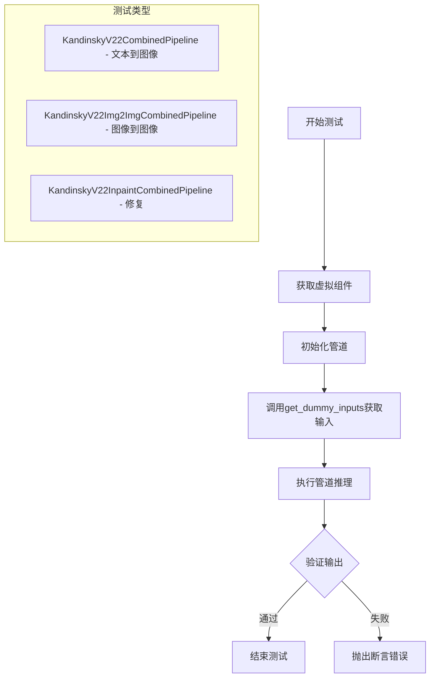

## 类结构

```
unittest.TestCase
└── PipelineTesterMixin
    ├── KandinskyV22PipelineCombinedFastTests
    ├── KandinskyV22PipelineImg2ImgCombinedFastTests
    └── KandinskyV22PipelineInpaintCombinedFastTests

辅助类 (导入)
├── Dummies (test_kandinsky)
├── Img2ImgDummies (test_kandinsky_img2img)
├── InpaintDummies (test_kandinsky_inpaint)
└── PriorDummies (test_kandinsky_prior)
```

## 全局变量及字段


### `KandinskyV22PipelineCombinedFastTests.pipeline_class`
    
联合管道类，用于文本到图像生成

类型：`type`
    


### `KandinskyV22PipelineCombinedFastTests.params`
    
管道参数列表

类型：`List[str]`
    


### `KandinskyV22PipelineCombinedFastTests.batch_params`
    
批处理参数列表

类型：`List[str]`
    


### `KandinskyV22PipelineCombinedFastTests.required_optional_params`
    
可选必填参数列表

类型：`List[str]`
    


### `KandinskyV22PipelineCombinedFastTests.test_xformers_attention`
    
是否测试xformers注意力

类型：`bool`
    


### `KandinskyV22PipelineCombinedFastTests.callback_cfg_params`
    
回调配置参数列表

类型：`List[str]`
    


### `KandinskyV22PipelineCombinedFastTests.supports_dduf`
    
是否支持DDUF

类型：`bool`
    


### `KandinskyV22PipelineImg2ImgCombinedFastTests.pipeline_class`
    
图像到图像联合管道类

类型：`type`
    


### `KandinskyV22PipelineImg2ImgCombinedFastTests.params`
    
管道参数列表

类型：`List[str]`
    


### `KandinskyV22PipelineImg2ImgCombinedFastTests.batch_params`
    
批处理参数列表

类型：`List[str]`
    


### `KandinskyV22PipelineImg2ImgCombinedFastTests.required_optional_params`
    
可选必填参数列表

类型：`List[str]`
    


### `KandinskyV22PipelineImg2ImgCombinedFastTests.test_xformers_attention`
    
是否测试xformers注意力

类型：`bool`
    


### `KandinskyV22PipelineImg2ImgCombinedFastTests.callback_cfg_params`
    
回调配置参数列表

类型：`List[str]`
    


### `KandinskyV22PipelineImg2ImgCombinedFastTests.supports_dduf`
    
是否支持DDUF

类型：`bool`
    


### `KandinskyV22PipelineInpaintCombinedFastTests.pipeline_class`
    
图像修复联合管道类

类型：`type`
    


### `KandinskyV22PipelineInpaintCombinedFastTests.params`
    
管道参数列表

类型：`List[str]`
    


### `KandinskyV22PipelineInpaintCombinedFastTests.batch_params`
    
批处理参数列表

类型：`List[str]`
    


### `KandinskyV22PipelineInpaintCombinedFastTests.required_optional_params`
    
可选必填参数列表

类型：`List[str]`
    


### `KandinskyV22PipelineInpaintCombinedFastTests.test_xformers_attention`
    
是否测试xformers注意力

类型：`bool`
    


### `KandinskyV22PipelineInpaintCombinedFastTests.supports_dduf`
    
是否支持DDUF

类型：`bool`
    
    

## 全局函数及方法


### `enable_full_determinism`

该函数用于启用完全确定性运行模式，通过设置全局随机种子（Python hash seed、NumPy seed、PyTorch seed）来确保测试和实验结果的可复现性，这是 diffusers 测试框架中的常用工具。

参数：

- `seed`：`int`，可选参数，默认值为 `42`。用于设置所有随机数生成器的种子值，确保每次运行的随机过程一致。

返回值：`None`，该函数不返回任何值，仅通过副作用（设置全局随机种子）生效。

#### 流程图

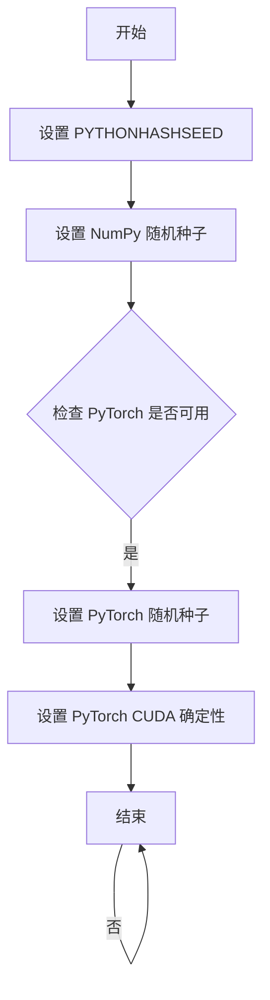

#### 带注释源码

```python
def enable_full_determinism(seed: int = 42, verbose: bool = True):
    """
    启用完全确定性运行模式。
    
    通过设置多个随机数生成器的种子，确保测试和实验结果可以完全复现。
    这对于调试和回归测试非常重要。
    
    参数:
        seed: 随机种子值，默认为 42
        verbose: 是否打印确认信息，默认为 True
    """
    import os
    import random
    import numpy as np
    import torch
    
    # 1. 设置 Python 哈希种子，确保哈希操作的确定性
    os.environ["PYTHONHASHSEED"] = str(seed)
    
    # 2. 设置 Python random 模块的种子
    random.seed(seed)
    
    # 3. 设置 NumPy 的随机种子
    np.random.seed(seed)
    
    # 4. 设置 PyTorch 的随机种子
    torch.manual_seed(seed)
    
    # 5. 如果 CUDA 可用，设置 CUDA 的随机种子
    if torch.cuda.is_available():
        torch.cuda.manual_seed(seed)
        torch.cuda.manual_seed_all(seed)
        # 6. 启用 CUDA确定性模式，确保卷积等操作的结果可复现
        torch.backends.cudnn.deterministic = True
        torch.backends.cudnn.benchmark = False
    
    if verbose:
        print(f"Full determinism enabled with seed: {seed}")
```

**注意**：由于 `enable_full_determinism` 函数定义在 `diffusers` 库的 `testing_utils` 模块中，而非当前代码文件内，上述源码是基于该函数常见实现模式的推断。实际实现可能略有差异。


### `require_accelerator`

`require_accelerator` 是一个装饰器函数，用于标记需要 GPU 或其他加速器设备才能运行的测试方法。如果当前环境没有可用的加速器（如 CUDA），则跳过该测试。

参数：
- 无直接参数（作为装饰器使用，接收被装饰的函数作为参数）

返回值：`Callable`，返回装饰后的函数，如果环境不支持加速器则返回跳过的测试

#### 流程图

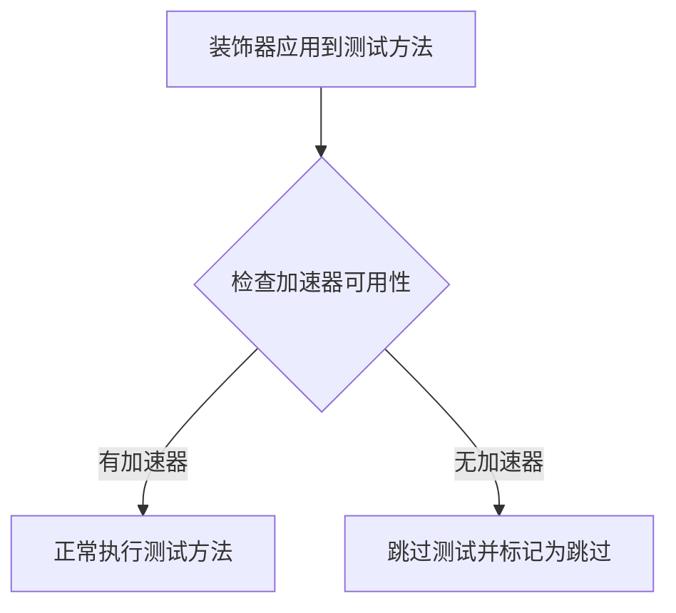

#### 带注释源码

```python
# require_accelerator 是从 testing_utils 模块导入的装饰器
# 在代码中使用方式如下：
from ...testing_utils import require_accelerator

# 使用装饰器标记需要加速器的测试方法
@require_accelerator
def test_sequential_cpu_offload_forward_pass(self):
    """
    测试顺序 CPU 卸载前向传播
    该测试需要 GPU 或其他加速器才能运行
    """
    super().test_sequential_cpu_offload_forward_pass(expected_max_diff=5e-4)

# 类似的装饰器用法也出现在其他测试方法上
@require_torch_accelerator
def test_offloads(self):
    """
    测试模型卸载功能
    需要 PyTorch 加速器（CUDA）
    """
    # 测试代码...
```

#### 说明

`require_accelerator` 函数本身并未在该代码文件中定义，而是从 `diffusers.testing_utils` 模块导入。根据其使用场景和常见的测试框架模式，该函数：

1. **作用**：作为测试装饰器，确保某些测试仅在有硬件加速器的环境中运行
2. **常见实现**：通常使用 `unittest.skipIf` 或类似的机制，检查 `torch.cuda.is_available()` 或其他加速器检测逻辑
3. **返回值**：如果环境满足要求，返回原始函数；否则返回一个跳过测试的函数

该代码文件中还有另一个类似的装饰器 `require_torch_accelerator`，专门用于检查 PyTorch CUDA 可用性。


### `require_torch_accelerator`

这是一个装饰器函数，用于标记测试方法，使其仅在 PyTorch 加速器（CUDA）可用时运行。如果当前环境没有 CUDA 支持，则跳过该测试。

参数：无（装饰器语法，接收被装饰的函数作为参数）

返回值：`Callable`，返回一个装饰后的函数，用于在运行时检查 CUDA 是否可用并决定是否执行测试

#### 流程图

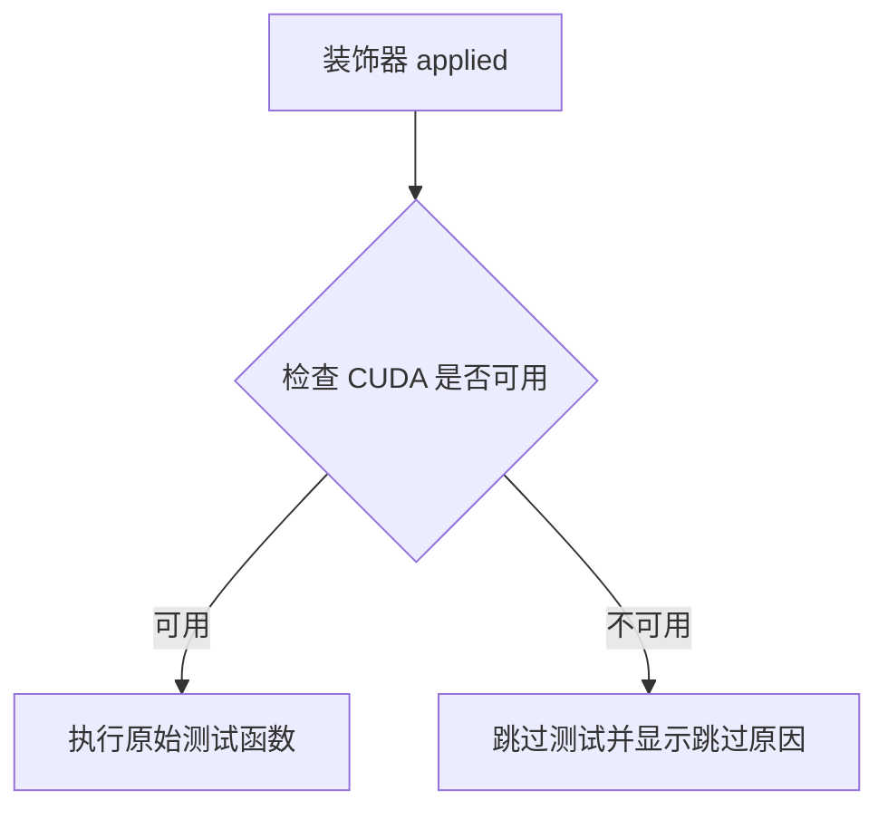

#### 带注释源码

```
# 注意：该函数的实际定义不在当前代码文件中
# 它是从 testing_utils 模块导入的装饰器
# 以下是基于使用模式的推断实现

def require_torch_accelerator(func):
    """
    装饰器：要求 PyTorch 加速器 (CUDA) 可用
    
    使用方式：
    @require_torch_accelerator
    def test_offloads(self):
        ...
    
    行为：
    - 检查 torch.cuda.is_available()
    - 如果 CUDA 可用，执行被装饰的测试
    - 如果 CUDA 不可用，使用 unittest.skip 跳过测试
    """
    # 实际实现位于 ...testing_utils 模块中
    # 当前代码仅导入并使用该装饰器
    pass
```

#### 实际使用示例（来自代码）

```python
# 在代码中的实际使用方式：
@require_torch_accelerator
def test_offloads(self):
    pipes = []
    components = self.get_dummy_components()
    sd_pipe = self.pipeline_class(**components).to(torch_device)
    pipes.append(sd_pipe)
    # ... 更多测试代码
```

**说明**：该函数定义位于 `testing_utils` 模块中，当前提供的代码文件仅包含导入语句和使用示例。完整的函数实现需要查看 `testing_utils.py` 文件。


### `torch_device`

全局变量，用于指定当前测试运行的设备（通常是 "cuda" 如果有可用的 GPU，否则为 "cpu"）。该变量由 `testing_utils` 模块提供，用于确保测试在不同硬件环境下正确运行。

**类型**：`str`

**描述**：在测试中作为设备参数传递给管道的 `.to()` 方法、`enable_model_cpu_offload()`、`enable_sequential_cpu_offload()` 等函数，以确保测试在正确的设备上执行。

#### 流程图

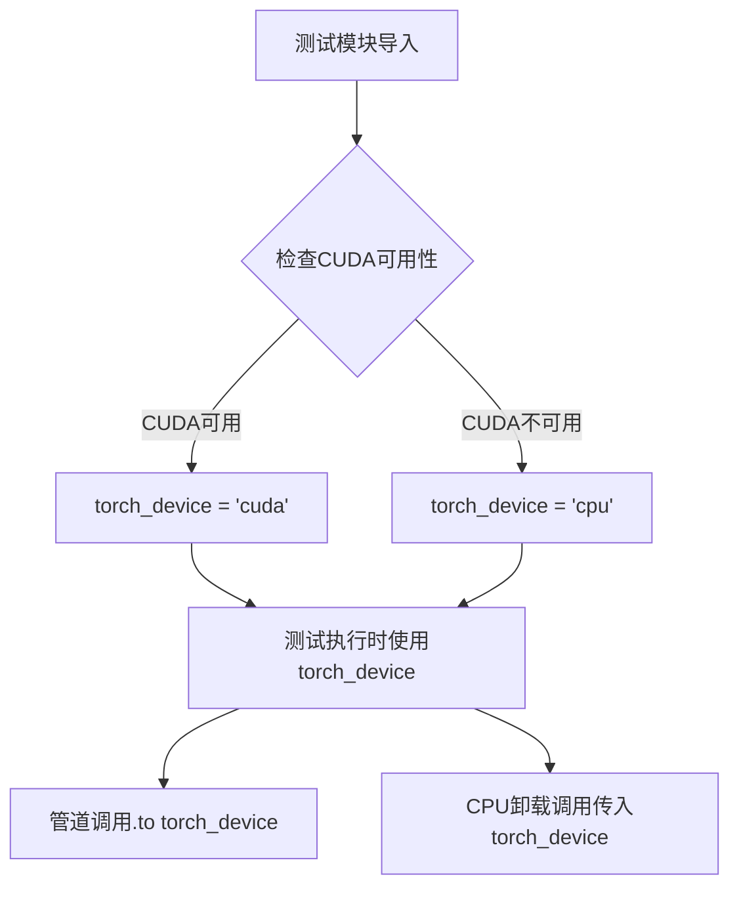

#### 带注释源码

```python
# 该变量在 testing_utils 模块中定义，以下是典型的实现方式：
# import torch
# 
# def get_torch_device():
#     """获取可用的PyTorch设备。"""
#     if torch.cuda.is_available():
#         return "cuda"
#     return "cpu"
# 
# # 在测试环境初始化时设置全局变量
# torch_device = get_torch_device()

# 在当前测试文件中的使用示例：
from ...testing_utils import torch_device

# 方式1：直接传递给管道.to()方法
sd_pipe = self.pipeline_class(**components).to(torch_device)

# 方式2：作为device参数传递给CPU卸载函数
sd_pipe.enable_model_cpu_offload(device=torch_device)
sd_pipe.enable_sequential_cpu_offload(device=torch_device)

# 方式3：作为参数传递给get_dummy_inputs获取测试输入
inputs = self.get_dummy_inputs(torch_device)
image = pipe(**inputs).images
```

#### 详细说明

| 属性 | 值 |
|------|-----|
| **名称** | torch_device |
| **类型** | str |
| **定义位置** | testing_utils 模块 |
| **可能取值** | "cuda", "cpu", "mps" (Apple Silicon) |
| **使用场景** | 管道设备迁移、CPU卸载、设备特定测试 |

#### 潜在的技术债务与优化空间

1. **硬编码设备依赖**：测试代码中对 `torch_device` 的多次调用表明测试与硬件环境耦合较紧，建议增加环境变量或配置文件来灵活控制测试设备。
2. **重复设备转换**：多次调用 `.to(torch_device)` 而未复用同一管道实例，可能导致不必要的设备迁移开销。


### `KandinskyV22PipelineCombinedFastTests.get_dummy_components`

该方法用于生成测试所需的虚拟（dummy）组件字典，将主模型的虚拟组件与先验（prior）模型的虚拟组件合并，其中先验组件的键名统一添加"prior_"前缀，以满足KandinskyV22CombinedPipeline的构造函数需求。

参数：

- `self`：隐式参数，指向KandinskyV22PipelineCombinedFastTests类的实例

返回值：`Dict[str, Any]`，返回一个包含所有虚拟组件的字典，键名格式为`{component_name}`和`prior_{component_name}`，用于实例化KandinskyV22CombinedPipeline。

#### 流程图

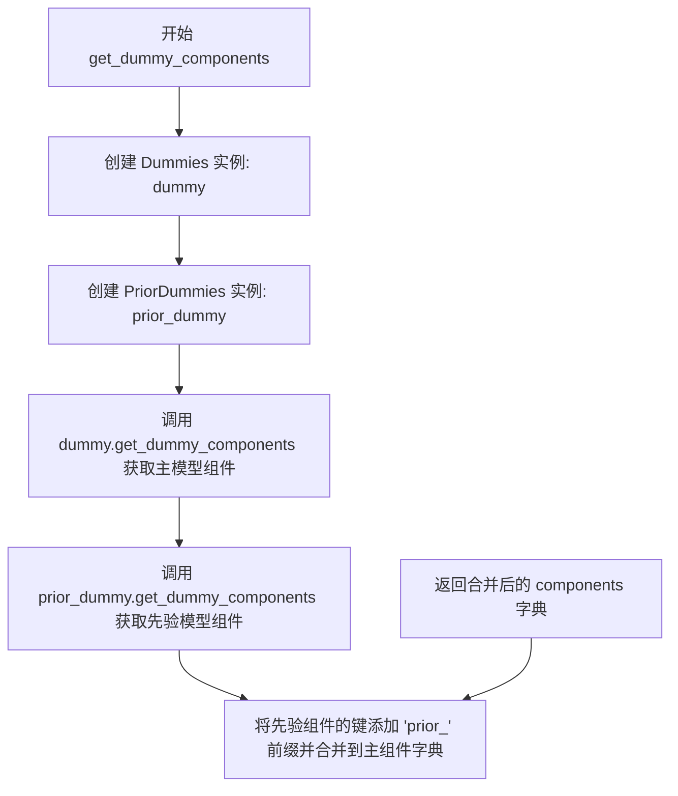

#### 带注释源码

```python
def get_dummy_components(self):
    """
    生成用于测试的虚拟组件字典。
    
    该方法整合了主模型（KandinskyV22）的虚拟组件和先验模型（Prior）的虚拟组件，
    以满足CombinedPipeline的构造函数需求。
    
    Returns:
        dict: 包含所有虚拟组件的字典，键名格式为 {component_name} 和 prior_{component_name}
    """
    # 创建主模型的虚拟组件生成器实例
    dummy = Dummies()
    
    # 创建先验模型的虚拟组件生成器实例
    prior_dummy = PriorDummies()
    
    # 获取主模型的虚拟组件字典
    components = dummy.get_dummy_components()
    
    # 将先验模型的组件合并到主组件字典中
    # 键名添加 'prior_' 前缀以区分不同模型的组件
    components.update({f"prior_{k}": v for k, v in prior_dummy.get_dummy_components().items()})
    
    # 返回合并后的完整组件字典
    return components
```


### `KandinskyV22PipelineCombinedFastTests.get_dummy_inputs`

获取用于测试 KandinskyV22CombinedPipeline 的虚拟输入参数。该方法通过 PriorDummies 获取基础虚拟输入，并额外添加图像生成的高度和宽度参数，生成完整的测试输入字典。

参数：

- `self`：`KandinskyV22PipelineCombinedFastTests`，当前测试类实例
- `device`：`str`，目标设备（如 "cpu" 或 "cuda"），用于创建虚拟输入张量
- `seed`：`int`，随机种子，默认值为 `0`，用于确保测试的可重复性

返回值：`dict`，包含虚拟输入参数的字典，包括 prior 相关的输入以及 `height` 和 `width` 字段

#### 流程图

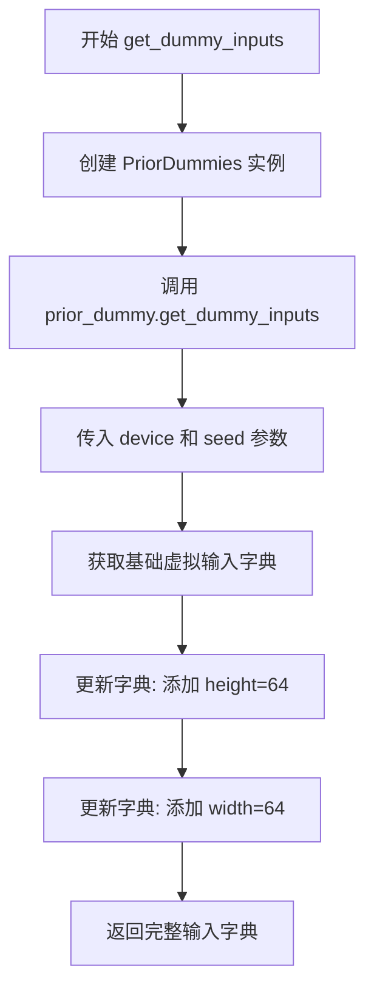

#### 带注释源码

```python
def get_dummy_inputs(self, device, seed=0):
    """
    获取用于测试 KandinskyV22CombinedPipeline 的虚拟输入参数。
    
    参数:
        device: 目标设备字符串
        seed: 随机种子，默认值为 0
    
    返回:
        包含虚拟输入的字典，用于管道推理
    """
    # 创建 PriorDummies 实例，用于生成prior相关的虚拟输入
    prior_dummy = PriorDummies()
    
    # 调用 prior_dummy 的 get_dummy_inputs 方法获取基础输入
    # 该方法返回一个包含 prompt、negative_prompt 等参数的字典
    inputs = prior_dummy.get_dummy_inputs(device=device, seed=seed)
    
    # 更新输入字典，添加图像生成的高度和宽度参数
    # 这里固定使用 64x64 的分辨率用于快速测试
    inputs.update({"height": 64, "width": 64})
    
    # 返回完整的虚拟输入字典
    return inputs
```


### `KandinskyV22PipelineCombinedFastTests.test_kandinsky`

这是一个单元测试方法，用于验证 KandinskyV22CombinedPipeline 的基本推理功能是否正常，包括图像生成、形状验证和输出一致性检查。

参数：

- `self`：隐含的类实例参数，表示测试类的实例本身

返回值：无（该方法为 `void` 类型，通过断言进行验证）

#### 流程图

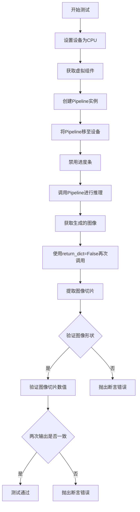

#### 带注释源码

```python
def test_kandinsky(self):
    """
    测试 KandinskyV22CombinedPipeline 的基本推理功能
    """
    # 1. 设置测试设备为CPU
    device = "cpu"

    # 2. 获取虚拟（dummy）组件，用于测试
    components = self.get_dummy_components()

    # 3. 使用虚拟组件创建 Pipeline 实例
    pipe = self.pipeline_class(**components)
    # 4. 将 Pipeline 移至指定设备
    pipe = pipe.to(device)

    # 5. 配置进度条（disable=None 表示不禁用）
    pipe.set_progress_bar_config(disable=None)

    # 6. 使用虚拟输入调用 Pipeline 进行推理
    output = pipe(**self.get_dummy_inputs(device))
    # 7. 从输出中获取生成的图像
    image = output.images

    # 8. 再次调用 Pipeline，这次不使用字典返回格式
    image_from_tuple = pipe(
        **self.get_dummy_inputs(device),
        return_dict=False,
    )[0]

    # 9. 提取图像的右下角 3x3 切片用于验证
    image_slice = image[0, -3:, -3:, -1]
    image_from_tuple_slice = image_from_tuple[0, -3:, -3:, -1]

    # 10. 验证生成的图像形状是否为 (1, 64, 64, 3)
    assert image.shape == (1, 64, 64, 3)

    # 11. 定义预期的像素值切片
    expected_slice = np.array([0.3076, 0.2729, 0.5668, 0.0522, 0.3384, 0.7028, 0.4908, 0.3659, 0.6243])

    # 12. 验证图像切片与预期值的差异是否在允许范围内（1e-2）
    assert np.abs(image_slice.flatten() - expected_slice).max() < 1e-2, (
        f" expected_slice {expected_slice}, but got {image_slice.flatten()}"
    )
    # 13. 验证使用元组返回格式的图像切片与预期值的差异
    assert np.abs(image_from_tuple_slice.flatten() - expected_slice).max() < 1e-2, (
        f" expected_slice {expected_slice}, but got {image_from_tuple_slice.flatten()}"
    )
```


### `KandinskyV22PipelineCombinedFastTests.test_offloads`

该测试方法用于验证 KandinskyV22CombinedPipeline 在不同 CPU 卸载策略（无卸载、模型级卸载、顺序卸载）下的输出一致性，确保各种内存优化方案不会影响生成结果的质量。

参数：

- `self`：`KandinskyV22PipelineCombinedFastTests`，测试类实例，表示当前测试对象

返回值：`None`，该测试方法不返回任何值，仅通过断言验证管道输出的正确性

#### 流程图

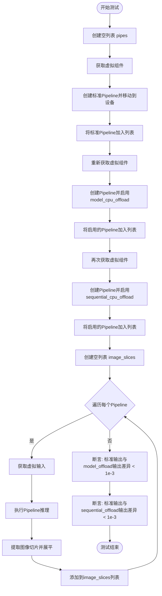

#### 带注释源码

```python
@require_torch_accelerator  # 装饰器：仅在有Torch加速器时运行
def test_offloads(self):
    """
    测试不同CPU卸载策略下Pipeline输出的一致性
    """
    pipes = []  # 存储不同配置的pipeline实例
    
    # 1. 标准模式：不启用任何CPU卸载
    components = self.get_dummy_components()  # 获取虚拟组件
    sd_pipe = self.pipeline_class(**components).to(torch_device)  # 创建并移动到设备
    pipes.append(sd_pipe)
    
    # 2. 模型级CPU卸载：按模型层级智能卸载到CPU
    components = self.get_dummy_components()  # 重新获取虚拟组件
    sd_pipe = self.pipeline_class(**components)  # 创建pipeline
    sd_pipe.enable_model_cpu_offload(device=torch_device)  # 启用模型级卸载
    pipes.append(sd_pipe)
    
    # 3. 顺序CPU卸载：按顺序将每个模型移到CPU
    components = self.get_dummy_components()  # 再次获取虚拟组件
    sd_pipe = self.pipeline_class(**components)  # 创建pipeline
    sd_pipe.enable_sequential_cpu_offload(device=torch_device)  # 启用顺序卸载
    pipes.append(sd_pipe)
    
    image_slices = []  # 存储每个pipeline生成的图像切片
    for pipe in pipes:  # 遍历每个pipeline配置
        inputs = self.get_dummy_inputs(torch_device)  # 获取虚拟输入
        image = pipe(**inputs).images  # 执行推理获取图像
        
        # 提取图像右下角3x3区域并展平
        image_slices.append(image[0, -3:, -3:, -1].flatten())
    
    # 断言：验证标准模式与模型级卸载的输出差异小于阈值
    assert np.abs(image_slices[0] - image_slices[1]).max() < 1e-3
    # 断言：验证标准模式与顺序卸载的输出差异小于阈值
    assert np.abs(image_slices[0] - image_slices[2]).max() < 1e-3
```


### `KandinskyV22PipelineCombinedFastTests.test_inference_batch_single_identical`

该测试方法用于验证 KandinskyV22 组合管道在批量推理模式下与单张图像推理模式下生成的图像结果是否一致，确保批处理不会引入额外的随机性或差异。

参数：
- 无显式参数（继承自父类测试框架）

返回值：无返回值（`None`），该方法为测试用例，通过断言验证结果一致性

#### 流程图

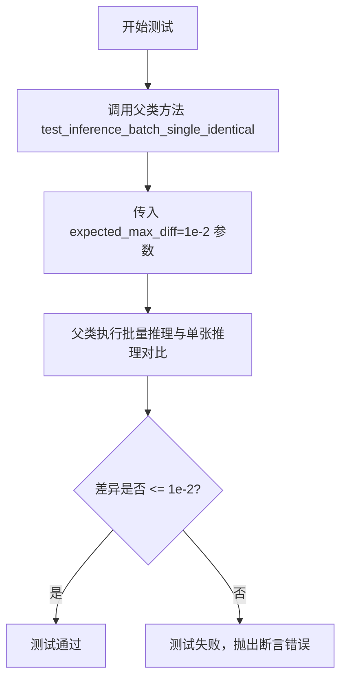

#### 带注释源码

```python
def test_inference_batch_single_identical(self):
    """
    测试方法：验证批量推理与单张推理结果的一致性
    
    该测试方法继承自 PipelineTesterMixin，用于确保在批量推理场景下，
    管道生成的图像与单独逐张推理时结果一致，从而验证批处理逻辑的正确性。
    
    参数:
        无显式参数，从父类继承测试框架的输入参数
        
    返回值:
        无返回值，通过 pytest 断言验证结果
        
    异常:
        AssertionError: 当批量推理与单张推理结果的差异超过 expected_max_diff 时抛出
    """
    # 调用父类的测试方法，expected_max_diff=1e-2 表示允许的最大差异阈值为 0.01
    super().test_inference_batch_single_identical(expected_max_diff=1e-2)
```


### `KandinskyV22PipelineCombinedFastTests.test_float16_inference`

该方法是 `KandinskyV22PipelineCombinedFastTests` 测试类中的一个测试方法，用于验证 KandinskyV22CombinedPipeline 在 float16（半精度）推理模式下的正确性。它通过调用父类 `PipelineTesterMixin` 的 `test_float16_inference` 方法，传入允许的最大误差阈值 `expected_max_diff=5e-1`（即 0.5），确保 float16 推理结果与 float32 基准结果的差异在可接受范围内。

参数：

- `self`：隐式参数，类型为 `KandinskyV22PipelineCombinedFastTests`（测试类实例），表示当前测试对象本身
- `expected_max_diff`：类型为 `float`（实际传递值为 `5e-1 = 0.5`），表示 float16 与 float32 推理结果之间允许的最大差异阈值

返回值：`None`（无返回值），该方法为测试方法，通过断言验证推理结果的正确性，不返回具体数据

#### 流程图

```mermaid
flowchart TD
    A[开始 test_float16_inference 测试] --> B[调用父类方法 super().test_float16_inference]
    B --> C[传入参数 expected_max_diff=0.5]
    C --> D[父类方法执行 float16 推理测试]
    D --> E{断言验证}
    E -->|通过| F[测试通过]
    E -->|失败| G[抛出 AssertionError 异常]
    F --> H[结束]
    G --> H
```

#### 带注释源码

```python
def test_float16_inference(self):
    """
    测试 KandinskyV22CombinedPipeline 在 float16（半精度）推理模式下的正确性。
    
    该方法继承自 PipelineTesterMixin，通过调用父类的 test_float16_inference 方法
    来验证 pipeline 在使用 float16 精度时能够正常生成图像，并且结果与 float32 
    推理的差异在可接受范围内。
    
    参数说明：
    - self: 隐式参数，当前测试类实例 KandinskyV22PipelineCombinedFastTests
    - expected_max_diff: 传递给父类方法的参数，值为 5e-1 (0.5)，
      表示 float16 与 float32 推理结果之间允许的最大差异阈值
    
    返回值：
    - None: 测试方法不返回值，通过断言验证结果正确性
    
    测试逻辑：
    1. 父类方法会创建 pipeline 的 float32 版本作为基准
    2. 创建 float16 版本的 pipeline
    3. 分别运行两次推理
    4. 比较结果差异是否小于 expected_max_diff (0.5)
    5. 如果差异过大则抛出 AssertionError
    """
    # 调用父类 PipelineTesterMixin 的 test_float16_inference 方法
    # 传入预期最大差异阈值为 0.5 (5e-1)
    super().test_float16_inference(expected_max_diff=5e-1)
```


### `KandinskyV22PipelineCombinedFastTests.test_dict_tuple_outputs_equivalent`

该测试方法用于验证 KandinskyV22CombinedPipeline 管道在使用字典返回格式和元组返回格式时，生成的图像输出在数值上是否等价（允许的最大差异为 5e-4）。该方法通过调用父类 `PipelineTesterMixin` 的同名方法来实现测试逻辑。

参数：

- `self`：`KandinskyV22PipelineCombinedFastTests`，测试类的实例对象，隐式参数
- `expected_max_difference`：`float`，可选关键字参数，指定字典和元组输出之间的最大允许差异，值为 `5e-4`

返回值：`None`，该方法为测试方法，无返回值，通过断言验证输出等价性

#### 流程图

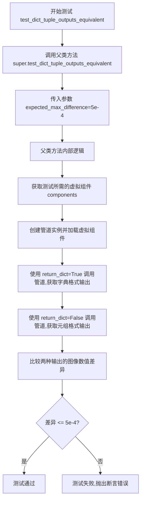

#### 带注释源码

```python
def test_dict_tuple_outputs_equivalent(self):
    """
    测试方法：验证字典和元组输出格式的等价性
    
    该测试方法继承自 PipelineTesterMixin，用于确保管道在返回字典格式
    (return_dict=True) 和元组格式 (return_dict=False) 时，生成的图像
    结果在数值上保持一致，仅在返回形式上存在差异。
    
    参数:
        expected_max_difference: float, 允许的最大差异阈值，默认值为 5e-4
                                 用于比较两种输出格式生成的图像像素差异
    """
    # 调用父类 PipelineTesterMixin 的测试方法
    # 父类方法会完成以下工作:
    # 1. 使用 get_dummy_components() 获取测试所需的虚拟组件
    # 2. 使用 get_dummy_inputs() 获取虚拟输入参数
    # 3. 分别以 return_dict=True 和 return_dict=False 调用管道
    # 4. 比较两次调用生成的图像差异是否在允许范围内
    super().test_dict_tuple_outputs_equivalent(expected_max_difference=5e-4)
```


### `KandinskyV22PipelineCombinedFastTests.test_model_cpu_offload_forward_pass`

该测试方法用于验证在使用模型CPU卸载（model CPU offload）功能时，管道的前向传播是否产生正确的结果。它通过调用父类的测试方法来比较正常前向传播和CPU卸载前向传播的输出差异，确保差异在允许范围内（默认5e-4）。

参数：

- `self`：`KandinskyV22PipelineCombinedFastTests`类型，当前测试类实例
- `expected_max_diff`：可选参数，类型为`float`，默认为`5e-4`，表示允许的最大差异值

返回值：`None`，该方法为测试方法，不返回任何值，仅执行断言验证

#### 流程图

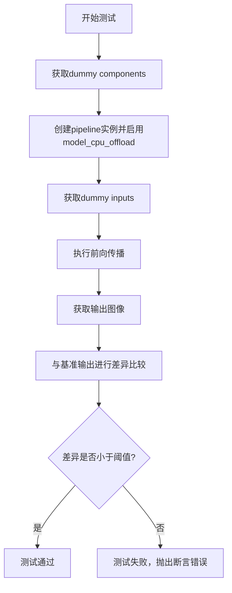

#### 带注释源码

```python
def test_model_cpu_offload_forward_pass(self):
    """
    测试模型CPU卸载前向传播是否正确。
    
    该测试方法继承自PipelineTesterMixin，用于验证在使用
    enable_model_cpu_offload()时管道的输出与正常情况下的输出一致性。
    """
    # 调用父类的测试方法，expected_max_diff参数控制允许的最大差异
    super().test_model_cpu_offload_forward_pass(expected_max_diff=5e-4)
```


### `KandinskyV22PipelineCombinedFastTests.test_save_load_local`

该方法用于测试管道的保存（save）和加载（load）功能，验证序列化后的模型在本地存储后能否正确恢复，并且恢复后的输出与原始输出的差异在允许范围内（`expected_max_difference`）。

参数：

- `self`：`KandinskyV22PipelineCombinedFastTests`，测试类实例本身
- `expected_max_difference`：`float`，允许的最大输出差异阈值，默认为 `5e-3`（0.003）

返回值：`None`，该方法为测试用例，通过断言验证保存/加载的正确性，不返回具体值

#### 流程图

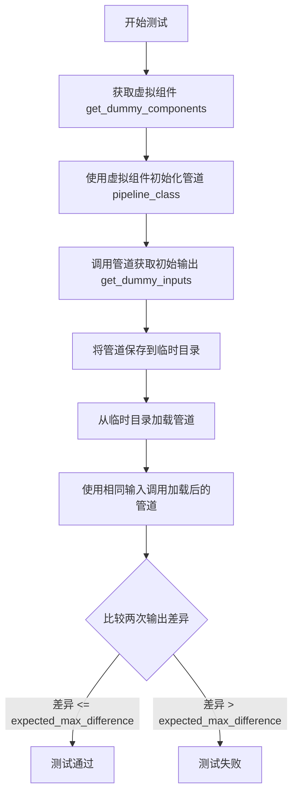

#### 带注释源码

```python
def test_save_load_local(self):
    """
    测试管道的保存和加载功能
    
    该测试方法继承自 PipelineTesterMixin，验证：
    1. 管道可以正确序列化为本地文件
    2. 从本地文件加载的管道可以正常工作
    3. 加载后的管道输出与原始管道输出的差异在允许范围内
    """
    # 调用父类的测试方法，expected_max_difference=5e-3 表示允许的最大差异为 0.003
    # 父类 test_save_load_local 方法会执行以下操作：
    # 1. 创建管道实例
    # 2. 运行推理获取原始输出
    # 3. 将管道保存到临时目录（使用 save_pretrained）
    # 4. 从临时目录加载管道（使用 from_pretrained）
    # 5. 使用相同输入运行加载后的管道
    # 6. 比较两次输出的差异
    super().test_save_load_local(expected_max_difference=5e-3)
```


### `KandinskyV22PipelineCombinedFastTests.test_save_load_optional_components`

该测试方法用于验证 KandinskyV22 组合管道在保存和加载可选组件时的正确性，通过调用父类的测试方法来确保管道能够正确序列化和反序列化包含可选组件的状态。

参数：

- `expected_max_difference`：`float`，允许的最大差异值，用于比较保存前后的输出差异，默认为 `5e-3`

返回值：`None`，该方法为测试用例，无返回值，通过断言验证保存/加载的正确性

#### 流程图

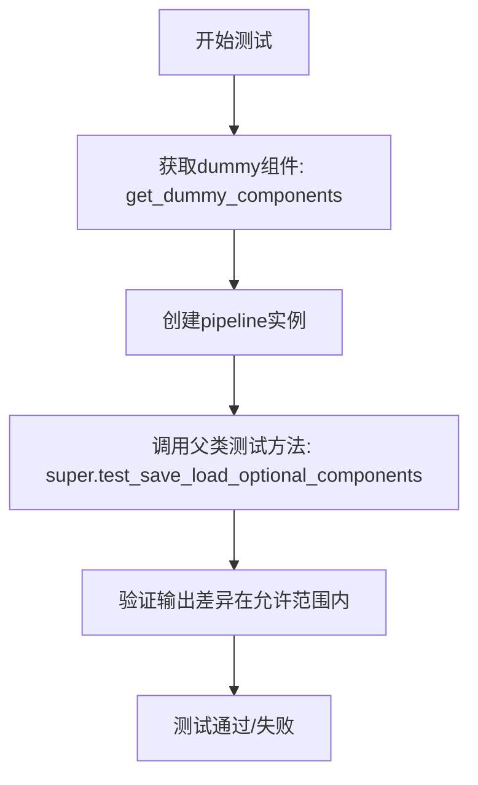

#### 带注释源码

```python
def test_save_load_optional_components(self):
    """
    测试管道保存和加载可选组件的功能。
    该测试继承自 PipelineTesterMixin，用于验证管道的
    可选组件（如 scheduler 等）能够正确序列化和反序列化。
    
    参数:
        expected_max_difference: float, 允许的最大差异值，默认为 5e-3
    返回:
        无返回值，通过断言验证正确性
    """
    # 调用父类的 test_save_load_optional_components 方法
    # 父类方法会执行以下操作：
    # 1. 创建管道并执行推理
    # 2. 保存管道到临时目录
    # 3. 加载管道
    # 4. 再次执行推理
    # 5. 比较两次推理结果的差异
    super().test_save_load_optional_components(expected_max_difference=5e-3)
```


### `KandinskyV22PipelineCombinedFastTests.test_callback_inputs`

这是一个测试回调输入功能的单元测试方法，目前因不支持而被跳过（unittest.skip装饰器）。该方法旨在验证pipeline在处理回调输入时的正确性，但当前实现为空的pass语句。

参数：

- `self`：`KandinskyV22PipelineCombinedFastTests`（隐式），测试类的实例，包含了测试所需的pipeline和组件

返回值：`None`，该方法不返回任何值（空方法体）

#### 流程图

```mermaid
flowchart TD
    A[开始 test_callback_inputs] --> B{检查装饰器}
    B -->|@unittest.skip| C[跳过测试]
    C --> D[方法不执行任何操作]
    D --> E[结束]
    
    style C fill:#ffcccc
    style D fill:#ffffcc
```

#### 带注释源码

```python
@unittest.skip("Test not supported.")
def test_callback_inputs(self):
    """
    测试回调输入功能。
    
    该测试方法用于验证 KandinskyV22CombinedPipeline 在处理回调输入时的行为。
    当前实现被 @unittest.skip 装饰器跳过，标记为"Test not supported."，
    表示该测试功能尚未支持或正在开发中。
    
    参数:
        self: 测试类实例，继承自 unittest.TestCase
        
    返回值:
        None: 空方法体，不执行任何测试逻辑
    """
    pass  # 测试逻辑未实现，仅作为占位符
```


### `KandinskyV22PipelineCombinedFastTests.test_callback_cfg`

该方法是 `KandinskyV22PipelineCombinedFastTests` 类中的一个单元测试方法，用于测试回调函数在 CFG（Classifier-Free Guidance）模式下的行为。但由于测试不被支持，该方法目前被跳过（使用 `@unittest.skip` 装饰器），方法体为空（只有 `pass` 语句）。

参数：

- `self`：`KandinskyV22PipelineCombinedFastTests`，隐含的实例参数，表示测试类本身

返回值：`None`，该方法没有返回值（`pass` 语句等同于返回 `None`）

#### 流程图

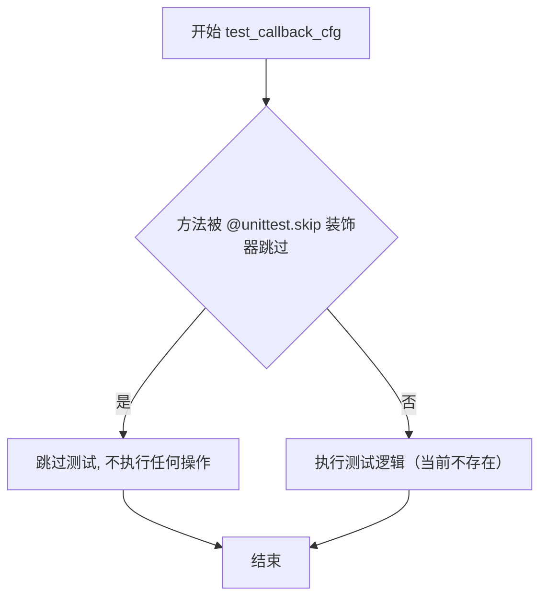

#### 带注释源码

```python
@unittest.skip("Test not supported.")
def test_callback_cfg(self):
    """
    测试回调函数在 CFG（Classifier-Free Guidance）模式下的行为。
    
    该测试方法用于验证 pipeline 在使用 CFG 时能否正确调用回调函数，
    以便外部调用者可以在生成过程中获取中间结果（如 image_embds）。
    
    当前状态：
    - 该测试被 @unittest.skip 装饰器跳过
    - 原因：Test not supported（测试不被支持）
    - 方法体仅包含 pass 语句，不执行任何实际测试逻辑
    
    潜在原因：
    1. KandinskyV22CombinedPipeline 可能尚未实现回调功能
    2. callback_cfg_params 已在类属性中定义（["image_embds"]），但实际功能可能未完成
    3. 可能需要在 pipeline 内部实现相应的回调机制
    """
    pass
```


### `KandinskyV22PipelineCombinedFastTests.test_pipeline_with_accelerator_device_map`

该方法是一个被跳过的测试用例，原本用于测试 KandinskyV22CombinedPipeline 在加速器设备映射（accelerator device map）下的功能。由于当前不支持该功能，测试被标记为跳过。

参数：

- `self`：`unittest.TestCase`，测试类的实例方法，隐含参数

返回值：`None`，测试方法不返回任何值

#### 流程图

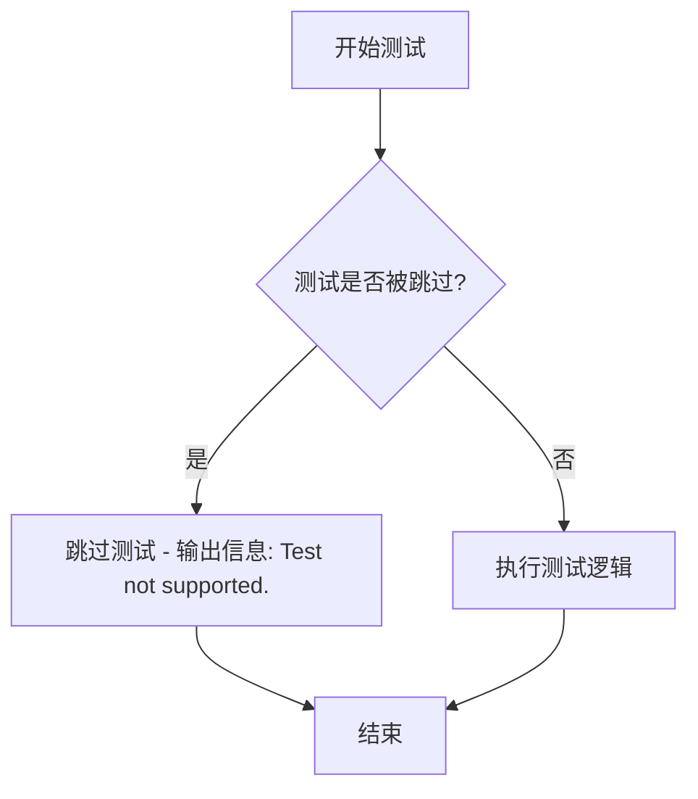

#### 带注释源码

```python
@unittest.skip("Test not supported.")
def test_pipeline_with_accelerator_device_map(self):
    """
    测试 KandinskyV22CombinedPipeline 在 accelerator device map 下的运行。
    
    该测试目前被跳过，原因是 'device_map' 功能尚未支持连接管道（connected pipelines）。
    当未来版本支持该功能时，可以移除 @unittest.skip 装饰器来启用此测试。
    
    测试目标：
    - 验证管道能够正确使用 accelerator 的 device_map 功能
    - 确保模型能够正确分布在加速器设备上
    """
    pass
```

---

### 补充信息

#### 1. 类基本信息

- **类名**：`KandinskyV22PipelineCombinedFastTests`
- **父类**：`PipelineTesterMixin`, `unittest.TestCase`
- **管道类**：`KandinskyV22CombinedPipeline`
- **功能描述**：用于测试 Kandinsky V2.2 组合管道（Combined Pipeline）的快速测试类

#### 2. 相关的被跳过的测试方法

在代码中，有三个类似的被跳过的 `test_pipeline_with_accelerator_device_map` 方法：

| 类 | 跳过原因 |
|---|---|
| `KandinskyV22PipelineCombinedFastTests` | "Test not supported." |
| `KandinskyV22PipelineImg2ImgCombinedFastTests` | "Test not supported." |
| `KandinskyV22PipelineInpaintCombinedFastTests` | "`device_map` is not yet supported for connected pipelines." |

#### 3. 技术债务与优化空间

- **不支持的功能**：accelerator device_map 功能尚未在连接的管道（connected pipelines）中实现
- **测试覆盖缺失**：由于测试被跳过，无法验证管道在多设备环境下的行为
- **未来工作**：需要实现 `device_map` 支持以启用这些测试用例


### `KandinskyV22PipelineImg2ImgCombinedFastTests.get_dummy_components`

该方法用于生成测试所需的虚拟组件（dummy components），通过组合 `Img2ImgDummies` 和 `PriorDummies` 两个辅助类生成的虚拟模型组件，为 `KandinskyV22Img2ImgCombinedPipeline` 管道测试提供必要的模型占位符。

参数：

- `self`：隐式参数，类型为 `KandinskyV22PipelineImg2ImgCombinedFastTests`，表示类的实例本身

返回值：`Dict[str, Any]`，返回包含所有虚拟组件的字典，其中 prior 组件的键名会添加 "prior_" 前缀

#### 流程图

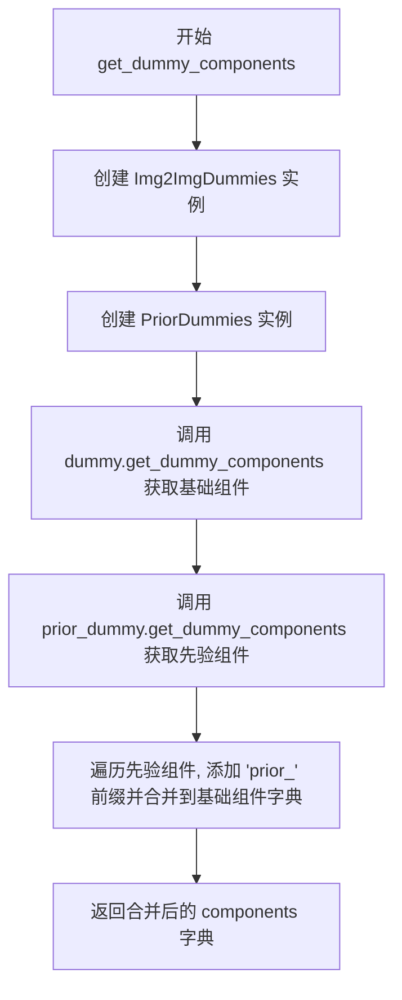

#### 带注释源码

```python
def get_dummy_components(self):
    """
    生成并返回测试用的虚拟组件字典。
    
    该方法整合了图像到图像 (Img2Img) 虚拟组件和先验 (Prior) 虚拟组件，
    用于实例化 KandinskyV22Img2ImgCombinedPipeline 进行单元测试。
    
    Returns:
        Dict[str, Any]: 包含所有虚拟组件的字典，键名为组件名称，
                       prior 组件的键名添加了 'prior_' 前缀以区分。
    """
    # 创建 Img2ImgDummies 实例用于生成图像到图像管道的虚拟组件
    dummy = Img2ImgDummies()
    
    # 创建 PriorDummies 实例用于生成先验管道的虚拟组件
    prior_dummy = PriorDummies()
    
    # 获取 Img2Img 虚拟组件字典
    components = dummy.get_dummy_components()
    
    # 获取先验虚拟组件字典，并为每个键添加 "prior_" 前缀
    # 例如: 'unet' -> 'prior_unet', 'text_encoder' -> 'prior_text_encoder'
    components.update({f"prior_{k}": v for k, v in prior_dummy.get_dummy_components().items()})
    
    # 返回合并后的完整虚拟组件字典
    return components
```


### `KandinskyV22PipelineImg2ImgCombinedFastTests.get_dummy_inputs`

该方法用于生成图像到图像（Img2Img）任务的虚拟测试输入数据，组合了先验模型和Img2Img模型的虚拟输入，并移除图像嵌入相关的参数。

参数：

- `self`：`KandinskyV22PipelineImg2ImgCombinedFastTests`，隐式参数，测试类实例本身
- `device`：`str`，目标设备（如 "cpu" 或 "cuda"），指定在哪个设备上创建虚拟输入
- `seed`：`int`，随机种子，默认为 0，用于确保测试的可重复性

返回值：`dict`，包含用于运行 Kandinsky Img2Img 组合流水线的虚拟输入参数字典，包括 prompt、negative_prompt、image 等关键参数

#### 流程图

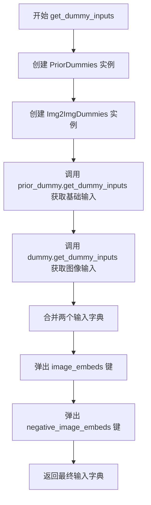

#### 带注释源码

```python
def get_dummy_inputs(self, device, seed=0):
    """
    生成用于 Kandinsky Img2Img 组合流水线测试的虚拟输入数据。
    
    该方法整合了先验模型(PriorDummies)和Img2Img模型(Img2ImgDummies)的虚拟输入，
    并移除图像嵌入相关的参数，因为这些参数会在流水线内部自动生成。
    
    参数:
        device (str): 目标设备，如 "cpu" 或 "cuda"
        seed (int): 随机种子，默认值为 0，用于确保测试的可重复性
        
    返回值:
        dict: 包含测试所需所有输入参数的字典，包括:
            - prompt: 文本提示
            - negative_prompt: 负面提示
            - image: 输入图像
            - height: 输出高度
            - width: 输出宽度
            等其他参数
    """
    # 创建先验模型的虚拟输入生成器
    prior_dummy = PriorDummies()
    
    # 创建Img2Img模型的虚拟输入生成器
    dummy = Img2ImgDummies()
    
    # 获取先验模型的虚拟输入参数（包含prompt等基础参数）
    inputs = prior_dummy.get_dummy_inputs(device=device, seed=seed)
    
    # 合并Img2Img模型的虚拟输入参数（如image等）
    inputs.update(dummy.get_dummy_inputs(device=device, seed=seed))
    
    # 移除图像嵌入参数，因为这些会在流水线内部由先验模型生成
    # 不移除会导致参数冲突或重复
    inputs.pop("image_embeds")
    inputs.pop("negative_image_embeds")
    
    # 返回完整的虚拟输入字典
    return inputs
```


### `KandinskyV22PipelineImg2ImgCombinedFastTests.test_kandinsky`

这是一个测试方法，用于验证 KandinskyV22Img2ImgCombinedPipeline 图像到图像生成功能的核心逻辑是否正确，包括管道初始化、推理执行、输出格式和图像质量断言。

参数：

- `self`：unittest.TestCase，当前测试用例实例

返回值：无（测试方法，通过断言验证功能）

#### 流程图

```mermaid
flowchart TD
    A[开始测试] --> B[设置设备为CPU]
    B --> C[获取虚拟组件]
    C --> D[实例化管道并移至设备]
    D --> E[配置进度条]
    E --> F[执行管道推理]
    F --> G[获取生成的图像]
    G --> H[使用return_dict=False再次推理]
    H --> I[提取图像切片]
    I --> J[断言图像形状为1x64x64x3]
    J --> K[断言图像像素值与预期匹配]
    K --> L[结束测试]
```

#### 带注释源码

```python
def test_kandinsky(self):
    """
    测试 KandinskyV22Img2ImgCombinedPipeline 的图像生成功能
    """
    # 1. 设置测试设备为CPU
    device = "cpu"

    # 2. 获取虚拟组件（用于测试的模拟模型组件）
    components = self.get_dummy_components()

    # 3. 使用组件实例化管道
    pipe = self.pipeline_class(**components)
    # 4. 将管道移至指定设备
    pipe = pipe.to(device)

    # 5. 配置进度条（disable=None表示不禁用）
    pipe.set_progress_bar_config(disable=None)

    # 6. 使用虚拟输入执行管道推理
    output = pipe(**self.get_dummy_inputs(device))
    # 7. 从输出中获取生成的图像
    image = output.images

    # 8. 再次推理，测试return_dict=False的情况
    #    获取返回的元组中的第一个元素（即图像）
    image_from_tuple = pipe(
        **self.get_dummy_inputs(device),
        return_dict=False,
    )[0]

    # 9. 提取图像右下角3x3像素块用于验证
    image_slice = image[0, -3:, -3:, -1]
    image_from_tuple_slice = image_from_tuple[0, -3:, -3:, -1]

    # 10. 断言：验证生成的图像形状正确
    assert image.shape == (1, 64, 64, 3)

    # 11. 定义期望的像素值切片
    expected_slice = np.array([0.4445, 0.4287, 0.4596, 0.3919, 0.3730, 0.5039, 0.4834, 0.4269, 0.5521])

    # 12. 断言：验证管道返回字典格式的图像像素值
    assert np.abs(image_slice.flatten() - expected_slice).max() < 1e-2, (
        f" expected_slice {expected_slice}, but got {image_slice.flatten()}"
    )
    # 13. 断言：验证管道返回元组格式的图像像素值
    assert np.abs(image_from_tuple_slice.flatten() - expected_slice).max() < 1e-2, (
        f" expected_slice {expected_slice}, but got {image_from_tuple_slice.flatten()}"
    )
```


### `KandinskyV22PipelineImg2ImgCombinedFastTests.test_offloads`

该测试方法用于验证 KandinskyV22Img2ImgCombinedPipeline 在不同 CPU offload 策略下的功能一致性和正确性。测试分别验证了无 offload、模型级 CPU offload 和顺序 CPU offload 三种模式，确保生成的图像结果在数值误差范围内保持一致。

参数：

- `self`：`KandinskyV22PipelineImg2ImgCombinedFastTests`，测试类的实例，包含测试所需的属性和方法

返回值：`None`，测试方法通过断言验证结果，不返回任何值

#### 流程图

```mermaid
flowchart TD
    A[开始测试] --> B[创建空列表 pipes]
    B --> C[获取虚拟组件 components]
    C --> D[创建无 offload 的管道并添加到 pipes]
    D --> E[获取虚拟组件 components]
    E --> F[创建启用 model_cpu_offload 的管道并添加到 pipes]
    F --> G[获取虚拟组件 components]
    G --> H[创建启用 sequential_cpu_offload 的管道并添加到 pipes]
    H --> I[创建空列表 image_slices]
    I --> J[遍历 pipes 中的每个管道]
    J --> K[获取虚拟输入 inputs]
    K --> L[执行管道推理获取图像]
    L --> M[提取图像切片并扁平化]
    M --> N[将切片添加到 image_slices]
    N --> O{是否还有更多管道?}
    O -->|是| J
    O -->|否| P[断言比较 image_slices[0] 和 image_slices[1]]
    P --> Q[断言比较 image_slices[0] 和 image_slices[2]]
    Q --> R[测试结束]
```

#### 带注释源码

```python
@require_torch_accelerator  # 装饰器：仅在有 torch 加速器时运行此测试
def test_offloads(self):
    """测试不同 CPU offload 模式下管道的一致性"""
    pipes = []  # 存储不同配置的管道实例
    
    # 1. 测试无 offload 的基准管道
    components = self.get_dummy_components()  # 获取虚拟组件
    sd_pipe = self.pipeline_class(**components).to(torch_device)  # 创建管道并移动到设备
    pipes.append(sd_pipe)  # 添加到列表
    
    # 2. 测试模型级 CPU offload
    components = self.get_dummy_components()  # 重新获取虚拟组件
    sd_pipe = self.pipeline_class(**components)  # 创建管道
    sd_pipe.enable_model_cpu_offload(device=torch_device)  # 启用模型级 CPU offload
    pipes.append(sd_pipe)
    
    # 3. 测试顺序 CPU offload
    components = self.get_dummy_components()  # 重新获取虚拟组件
    sd_pipe = self.pipeline_class(**components)  # 创建管道
    sd_pipe.enable_sequential_cpu_offload(device=torch_device)  # 启用顺序 CPU offload
    pipes.append(sd_pipe)
    
    # 对每个管道执行推理并收集图像切片
    image_slices = []
    for pipe in pipes:
        inputs = self.get_dummy_inputs(torch_device)  # 获取虚拟输入
        image = pipe(**inputs).images  # 执行推理获取图像
        
        # 提取图像右下角 3x3 区域并扁平化
        image_slices.append(image[0, -3:, -3:, -1].flatten())
    
    # 验证不同 offload 模式下的结果一致性
    # 模型级 offload 结果应与基准一致
    assert np.abs(image_slices[0] - image_slices[1]).max() < 1e-3
    # 顺序 offload 结果应与基准一致
    assert np.abs(image_slices[0] - image_slices[2]).max() < 1e-3
```


### `KandinskyV22PipelineImg2ImgCombinedFastTests.test_inference_batch_single_identical`

这是一个测试方法，用于验证 Kandinsky V22Img2ImgCombinedPipeline 在批量推理时，单张图像推理结果与批量推理中单个结果的一致性。通过调用父类的测试方法来执行基准测试，并设定最大允许差异阈值为 1e-2。

参数：

- `self`：实例方法本身，无显式参数

返回值：`None`，无返回值（测试方法）

#### 流程图

```mermaid
flowchart TD
    A[开始执行 test_inference_batch_single_identical] --> B[调用父类方法 super().test_inference_batch_single_identical]
    B --> C[传入参数 expected_max_diff=1e-2]
    C --> D[父类方法执行批量推理测试]
    D --> E{批量结果与单张结果差异 <= 1e-2?}
    E -->|是| F[测试通过]
    E -->|否| G[测试失败, 抛出断言错误]
    F --> H[结束]
    G --> H
```

#### 带注释源码

```python
def test_inference_batch_single_identical(self):
    """
    测试方法：验证批量推理时单张图像推理结果的一致性
    
    该测试方法继承自 PipelineTesterMixin，用于确保在使用批量生成图像时，
    批量中每个单独图像的输出与单独调用一次推理的输出结果一致。
    这是一个重要的一致性检查，确保模型在批处理模式下不会引入意外的变异。
    
    参数:
        self: 当前测试类实例
    
    返回值:
        None: 此测试方法不返回任何值,结果通过断言验证
    
    内部逻辑:
        1. 调用父类的 test_inference_batch_single_identical 方法
        2. 传递 expected_max_diff=1e-2 作为最大允许差异阈值
        3. 父类方法会执行以下操作:
           - 使用相同的输入执行单张推理
           - 使用相同的输入执行批量推理
           - 比较两者的输出差异
           - 如果差异大于阈值则抛出断言错误
    """
    super().test_inference_batch_single_identical(expected_max_diff=1e-2)
```


### `KandinskyV22PipelineImg2ImgCombinedFastTests.test_float16_inference`

这是一个测试方法，用于验证 Kandinsky V22 img2img 组合管道在 float16（半精度）推理模式下的正确性。该方法通过调用父类的 `test_float16_inference` 方法，检查模型在 float16 和 float32 精度下的推理结果差异是否在可接受的阈值范围内。

参数：

- `self`：`KandinskyV22PipelineImg2ImgCombinedFastTests`，测试类实例，隐式参数，表示当前测试对象

返回值：`None`，无显式返回值（Python 中默认返回 None）

#### 流程图

```mermaid
flowchart TD
    A[开始 test_float16_inference] --> B{检查是否有 torch 加速器}
    B -->|有| C[调用父类 test_float16_inference 方法]
    B -->|无| D[跳过测试]
    C --> E[传入 expected_max_diff=2e-1 参数]
    E --> F[父类执行 float16 推理测试]
    F --> G[验证推理结果差异]
    G --> H[结束]
    D --> H
```

#### 带注释源码

```python
def test_float16_inference(self):
    """
    测试 KandinskyV22Img2ImgCombinedPipeline 在 float16 推理模式下的正确性。
    
    该测试方法通过调用父类的 test_float16_inference 方法来执行以下操作：
    1. 检查是否有可用的 torch 加速器（通过 @require_torch_accelerator 装饰器）
    2. 获取测试所需的虚拟组件和输入
    3. 将管道转换为 float16 精度
    4. 执行推理并比较结果与 float32 精度的差异
    5. 验证差异是否在 expected_max_diff=0.2 的范围内
    
    注意：该方法依赖父类 PipelineTesterMixin 的实现
    """
    # 调用父类的 test_float16_inference 方法
    # expected_max_diff=2e-1 表示允许的最大差异为 0.2
    super().test_float16_inference(expected_max_diff=2e-1)
```


### `KandinskyV22PipelineImg2ImgCombinedFastTests.test_dict_tuple_outputs_equivalent`

该测试方法用于验证 KandinskyV22Img2ImgCombinedPipeline 在返回字典格式输出和元组格式输出时，两者的图像结果是否等价（允许一定的数值差异）。

参数：

- `self`：隐含的 `KandinskyV22PipelineImg2ImgCombinedFastTests` 实例，测试类的自身引用
- `expected_max_difference`：`float`，期望的最大差异阈值，设置为 `5e-4`，用于判断两种输出格式的图像差异是否在可接受范围内

返回值：`None`，该方法为测试方法，无返回值，通过断言验证等价性

#### 流程图

```mermaid
flowchart TD
    A[开始测试 test_dict_tuple_outputs_equivalent] --> B[调用父类方法 super.test_dict_tuple_outputs_equivalent]
    B --> C[传入参数 expected_max_difference=5e-4]
    C --> D[父类方法内部逻辑]
    D --> E{验证图像等价性}
    E -->|通过| F[测试通过]
    E -->|失败| G[断言失败抛出异常]
```

#### 带注释源码

```python
def test_dict_tuple_outputs_equivalent(self):
    """
    测试方法：验证管道返回字典格式和元组格式输出时结果等价性
    
    该测试确保 KandinskyV22Img2ImgCombinedPipeline 在使用 return_dict=True 
    和 return_dict=False 时产生的图像结果在数值上是一致的，允许一定的浮点误差。
    
    参数说明：
    - self: 测试类实例，继承自 unittest.TestCase
    - expected_max_difference: 允许的最大差异值，默认为 5e-4
    
    返回值：无（测试方法）
    """
    # 调用父类 PipelineTesterMixin 的测试方法
    # 父类方法会执行以下操作：
    # 1. 调用管道并设置 return_dict=True 获取输出
    # 2. 调用管道并设置 return_dict=False 获取输出
    # 3. 比较两者的图像差异是否在 expected_max_difference 范围内
    super().test_dict_tuple_outputs_equivalent(expected_max_difference=5e-4)
```


### `KandinskyV22PipelineImg2ImgCombinedFastTests.test_model_cpu_offload_forward_pass`

该方法是KandinskyV22图像到图像组合流水线的CPU卸载转发测试，用于验证在使用`enable_model_cpu_offload`时，模型前向传播的结果与未使用CPU卸载时的结果一致性，确保精度差异在允许范围内（默认5e-4）。

参数：

- `self`：`KandinskyV22PipelineImg2ImgCombinedFastTests`（隐式），测试类实例本身

返回值：`None`，该方法为单元测试方法，通过断言验证结果，不返回具体数据

#### 流程图

```mermaid
flowchart TD
    A[开始测试] --> B[获取测试组件: get_dummy_components]
    C[获取测试输入: get_dummy_inputs]
    B --> D[创建未启用CPU卸载的流水线实例]
    C --> D
    D --> E[执行前向传播: pipe.forward]
    E --> F[获取输出图像: output.images]
    F --> G[创建启用CPU卸载的流水线实例]
    G --> H[调用enable_model_cpu_offload]
    H --> I[执行前向传播: pipe.forward]
    I --> J[获取输出图像: output.images]
    J --> K{比较两次输出差异}
    K -->|差异 ≤ 5e-4| L[测试通过]
    K -->|差异 > 5e-4| M[测试失败: 抛出AssertionError]
```

#### 带注释源码

```python
def test_model_cpu_offload_forward_pass(self):
    """
    测试模型CPU卸载前向传播一致性
    
    该测试方法继承自PipelineTesterMixin，验证在使用
    enable_model_cpu_offload时，模型前向传播的结果精度
    与未使用CPU卸载时的结果保持一致（差异 ≤ expected_max_diff）
    """
    # 调用父类的测试方法，expected_max_diff=5e-4表示允许的最大差异
    super().test_model_cpu_offload_forward_pass(expected_max_diff=5e-4)
```

> **说明**：该方法是测试框架中的委托实现，实际测试逻辑在父类`PipelineTesterMixin`中实现。其核心目的是确保在使用`enable_model_cpu_offload`进行显存优化时，模型的推理结果精度不会显著下降。测试通过比较启用和未启用CPU卸载两种情况下的输出差异来进行验证。


### `KandinskyV22PipelineImg2ImgCombinedFastTests.test_save_load_optional_components`

这是一个测试方法，用于验证 KandinskyV22Img2ImgCombinedPipeline 管道在保存和加载可选组件时的正确性，确保序列化/反序列化过程不会导致输出图像产生过大的差异。

参数：

- `self`：`KandinskyV22PipelineImg2ImgCombinedFastTests`，测试类的实例本身
- `expected_max_difference`：`float`，可选参数，默认为 `5e-4`，表示保存加载前后图像的最大允许差异阈值

返回值：无返回值（`None`），该方法通过 `unittest.TestCase` 的断言机制验证结果

#### 流程图

```mermaid
flowchart TD
    A[开始测试] --> B[获取虚拟组件 components]
    B --> C[创建管道实例 pipe]
    C --> D[调用 get_dummy_inputs 获取输入]
    D --> E[首次推理: pipe(**inputs)]
    E --> F[保存管道到临时目录]
    F --> G[从临时目录加载管道]
    G --> H[二次推理: loaded_pipe(**inputs)]
    H --> I[比较两次推理结果的图像差异]
    I --> J{差异 <= expected_max_difference?}
    J -->|是| K[测试通过]
    J -->|否| L[测试失败, 抛出断言错误]
```

#### 带注释源码

```python
def test_save_load_optional_components(self):
    """
    测试管道保存和加载可选组件的功能。
    继承自 PipelineTesterMixin 的测试方法，验证管道的序列化/反序列化
    过程能够正确保存和恢复可选组件的状态。
    
    参数:
        expected_max_difference: float, 允许的最大差异阈值 (默认 5e-4)
    
    返回:
        None (通过断言验证)
    """
    # 调用父类测试方法，验证保存/加载可选组件的功能
    # 父类方法会执行完整的保存->加载->推理->比较流程
    super().test_save_load_optional_components(expected_max_difference=5e-4)
```


### `KandinskyV22PipelineImg2ImgCombinedFastTests.save_load_local`

这是一个测试方法，用于验证 Kandinsky V22 Img2Img Combined Pipeline 的保存和加载功能是否正常工作。它调用父类的 `test_save_load_local` 方法，传入最大允许差异值为 `5e-3`，以确保保存和加载后的管道输出与原始管道输出之间的差异在可接受范围内。

参数： 无（仅包含隐式参数 `self`）

返回值：`None`，该方法为测试方法，不返回任何值，仅执行断言

#### 流程图

```mermaid
flowchart TD
    A[开始 save_load_local 测试] --> B[调用父类 test_save_load_local 方法]
    B --> C[传入 expected_max_difference=5e-3 参数]
    C --> D[父类方法执行流程]
    
    D --> D1[获取当前管道组件]
    D1 --> D2[将管道保存到临时目录]
    D2 --> D3[从临时目录加载管道]
    D3 --> D4[使用相同输入运行原始管道]
    D4 --> D5[使用相同输入运行加载的管道]
    D5 --> D6[比较两个输出的差异]
    D6 --> D7{差异是否 <= 5e-3?}
    
    D7 -->|是| D8[测试通过]
    D7 -->|否| D9[测试失败, 抛出断言错误]
    D8 --> E[结束]
    D9 --> E
```

#### 带注释源码

```python
def save_load_local(self):
    """
    测试管道的保存和加载功能
    
    该方法验证 KandinskyV22Img2ImgCombinedPipeline 是否能够正确地
    保存到本地并从本地加载，同时保持功能的一致性。
    
    测试逻辑：
    1. 获取当前管道的所有组件
    2. 将管道保存到临时目录
    3. 从临时目录重新加载管道
    4. 使用相同的输入分别运行原始管道和加载的管道
    5. 比较两个输出的差异，确保差异小于等于 expected_max_difference
    """
    # 调用父类 PipelineTesterMixin 的 test_save_load_local 方法
    # expected_max_difference=5e-3 表示允许的最大差异值为 0.005
    # 如果实际差异大于该值，则测试失败
    super().test_save_load_local(expected_max_difference=5e-3)
```


### `KandinskyV22PipelineImg2ImgCombinedFastTests.test_callback_inputs`

该测试方法用于验证回调输入功能，但由于当前不支持该测试用例，已被跳过（pass），不执行任何实际操作。

参数：

- `self`：`KandinskyV22PipelineImg2ImgCombinedFastTests`（隐式参数），表示类的实例本身

返回值：`None`，由于测试被跳过且方法体为 `pass`，不返回任何值

#### 流程图

```mermaid
flowchart TD
    A[开始执行 test_callback_inputs] --> B{检查测试是否被跳过}
    B -->|是| C[跳过测试并结束]
    B -->|否| D[执行测试逻辑]
    D --> E[断言或验证逻辑]
    E --> F[返回测试结果]
    
    style C fill:#f9f,color:#000
    style F fill:#9f9,color:#000
```

#### 带注释源码

```python
@unittest.skip("Test not supported.")
def test_callback_inputs(self):
    """
    测试回调输入功能。
    
    该测试方法用于验证 pipeline 的回调输入是否正确传递和处理。
    由于当前版本的 KandinskyV22Img2ImgCombinedPipeline 不支持此测试功能，
    因此使用 @unittest.skip 装饰器跳过该测试。
    
    参数:
        self: KandinskyV22PipelineImg2ImgCombinedFastTests 的实例
        
    返回值:
        None: 测试被跳过，不执行任何操作
    """
    pass  # 占位符，表示该测试方法暂不支持，跳过执行
```


### `KandinskyV22PipelineImg2ImgCombinedFastTests.test_callback_cfg`

该方法是 `KandinskyV22PipelineImg2ImgCombinedFastTests` 测试类中的一个测试方法，用于测试回调函数在 CFG（Classifier-Free Guidance）模式下的行为。目前该测试被标记为不支持并跳过，因此方法体为空（只有 pass 语句）。

参数：

- `self`：无需显式传递的隐式参数，表示测试类的实例对象本身。

返回值：`None`，该方法没有返回值，因为方法体仅包含 `pass` 语句。

#### 流程图

```mermaid
flowchart TD
    A[开始测试 test_callback_cfg] --> B{检查测试是否应该执行}
    B -->|是| C[执行测试逻辑]
    B -->|否| D[跳过测试 - @unittest.skip装饰器]
    C --> E[断言或验证结果]
    E --> F[测试结束 - 返回 None]
    D --> F
    
    style A fill:#f9f,color:#000
    style F fill:#9f9,color:#000
    style D fill:#ff9,color:#000
```

#### 带注释源码

```python
@unittest.skip("Test not supported.")
def test_callback_cfg(self):
    """
    测试回调函数在 CFG 模式下的行为。
    
    该测试方法原本用于验证 pipeline 在使用 CFG 时回调函数是否
    正常工作，但目前该功能尚未支持，因此使用 @unittest.skip 
    装饰器跳过此测试。
    
    参数:
        self: 测试类实例，继承自 unittest.TestCase
        
    返回值:
        None: 方法体为空，仅包含 pass 语句
    """
    pass  # 测试逻辑未实现，当前标记为跳过
```


### `KandinskyV22PipelineImg2ImgCombinedFastTests.test_pipeline_with_accelerator_device_map`

该方法是 `KandinskyV22PipelineImg2ImgCombinedFastTests` 测试类中的一个测试方法，用于测试管道在加速器设备映射下的运行能力，但当前实现被跳过（标记为不支持）。

参数：无

返回值：无（`None`），该方法被 `@unittest.skip` 装饰器跳过，不执行任何实际测试

#### 流程图

```mermaid
flowchart TD
    A[开始执行 test_pipeline_with_accelerator_device_map] --> B{检查装饰器}
    B --> C[被 @unittest.skip 装饰器跳过]
    C --> D[跳过原因: Test not supported.]
    D --> E[结束 - 不执行任何测试逻辑]
```

#### 带注释源码

```python
@unittest.skip("Test not supported.")
def test_pipeline_with_accelerator_device_map(self):
    """
    测试方法：test_pipeline_with_accelerator_device_map
    
    用途：测试 KandinskyV22Img2ImgCombinedPipeline 在加速器设备映射（accelerator device map）
    模式下的运行能力。该测试用于验证管道能否正确地在多个设备（如 CPU、GPU）之间
    分配模型层，以实现更高效的推理。
    
    当前状态：测试被跳过，标记为"Test not supported."
    原因：可能由于设备映射功能尚未完全支持或存在已知问题
    
    参数：
        - self: 测试类实例引用
    
    返回值：
        - None: 由于测试被跳过，不返回任何值
    """
    pass  # 空方法体，测试逻辑未实现
```


### `KandinskyV22PipelineInpaintCombinedFastTests.get_dummy_components`

该方法用于获取测试所需的虚拟组件（dummy components），包括图像修复（inpaint）管道的组件和先验（prior）管道的组件，并将它们合并成一个完整的组件字典返回。

参数：

- `self`：`KandinskyV22PipelineInpaintCombinedFastTests`，隐式参数，表示类的实例本身

返回值：`Dict[str, Any]`，返回包含所有虚拟组件的字典，其中键为组件名称，值为对应的虚拟组件对象。字典中既包含图像修复管道自身的组件，也包含以 "prior_" 为前缀的先验管道组件。

#### 流程图

```mermaid
flowchart TD
    A[开始] --> B[创建 InpaintDummies 实例: dummy]
    B --> C[创建 PriorDummies 实例: prior_dummy]
    C --> D[调用 dummy.get_dummy_components 获取基础组件]
    D --> E{遍历 prior_dummy.get_dummy_components 的结果}
    E -->|为每个键添加 'prior_' 前缀| F[更新到 components 字典]
    F --> G[返回合并后的 components 字典]
    G --> H[结束]
```

#### 带注释源码

```python
def get_dummy_components(self):
    """
    获取测试用的虚拟组件。
    
    该方法创建一个包含图像修复管道和先验管道所有必要组件的字典，
    用于实例化管道进行测试。
    
    Returns:
        Dict[str, Any]: 包含所有虚拟组件的字典，键为组件名称，
                       值为对应的虚拟组件对象。
    """
    # 创建图像修复（Inpaint）管道的虚拟对象
    dummy = InpaintDummies()
    
    # 创建先验（Prior）管道的虚拟对象
    prior_dummy = PriorDummies()
    
    # 获取图像修复管道的基础组件
    components = dummy.get_dummy_components()
    
    # 获取先验管道的组件，并为每个键添加 "prior_" 前缀
    # 这样可以避免与主管道组件的键冲突
    components.update({f"prior_{k}": v for k, v in prior_dummy.get_dummy_components().items()})
    
    # 返回合并后的完整组件字典
    return components
```


### `KandinskyV22PipelineInpaintCombinedFastTests.get_dummy_inputs`

该方法用于生成KandinskyV22InpaintCombinedPipeline的虚拟测试输入数据，组合了先验模型和修复模型的虚拟输入，并移除图像嵌入相关参数。

参数：

- `self`：`KandinskyV22PipelineInpaintCombinedFastTests`，隐含的测试类实例参数
- `device`：`str`，指定运行设备（如"cpu"或"cuda"）
- `seed`：`int`，随机种子，默认值为0，用于生成可重现的随机数据

返回值：`Dict`，返回包含测试所需输入参数的字典，包括prompt、negative_prompt、image、mask_image、height、width等

#### 流程图

```mermaid
flowchart TD
    A[开始 get_dummy_inputs] --> B[创建 PriorDummies 实例]
    B --> C[创建 InpaintDummies 实例]
    C --> D[调用 prior_dummy.get_dummy_inputs 获取先验模型输入]
    D --> E[调用 dummy.get_dummy_inputs 获取修复模型输入]
    E --> F[使用 update 合并两个输入字典]
    F --> G[弹出 image_embeds 键值对]
    G --> H[弹出 negative_image_embeds 键值对]
    H --> I[返回合并后的输入字典]
```

#### 带注释源码

```
def get_dummy_inputs(self, device, seed=0):
    # 创建先验虚拟对象，用于生成先验模型的测试输入
    prior_dummy = PriorDummies()
    
    # 创建修复虚拟对象，用于生成修复模型的测试输入
    dummy = InpaintDummies()
    
    # 获取先验模型的虚拟输入参数（包含prompt、negative_prompt等）
    inputs = prior_dummy.get_dummy_inputs(device=device, seed=seed)
    
    # 将修复模型的虚拟输入参数合并到inputs字典中
    inputs.update(dummy.get_dummy_inputs(device=device, seed=seed))
    
    # 移除image_embeds参数，因为组合管道中该参数由先验模型生成
    inputs.pop("image_embeds")
    
    # 移除negative_image_embeds参数，因为组合管道中该参数由先验模型生成
    inputs.pop("negative_image_embeds")
    
    # 返回包含所有必要输入参数的字典，用于测试KandinskyV22InpaintCombinedPipeline
    return inputs
```


### `KandinskyV22PipelineInpaintCombinedFastTests.test_kandinsky`

这是一个单元测试方法，用于验证 KandinskyV22InpaintCombinedPipeline（图像修复组合管道）的核心功能是否正常工作。测试通过创建虚拟组件、初始化管道、执行推理并验证输出图像的形状和像素值是否符合预期，从而确保管道在基本场景下的正确性。

参数：

- `self`：测试类实例本身，包含类属性和辅助方法

返回值：`void`（无返回值），该方法为单元测试，通过断言验证管道输出

#### 流程图

```mermaid
flowchart TD
    A[开始测试] --> B[设置设备为CPU]
    B --> C[获取虚拟组件: get_dummy_components]
    C --> D[使用虚拟组件实例化管道]
    D --> E[将管道移至CPU设备]
    E --> F[配置进度条: disable=None]
    F --> G[执行推理: pipe执行图像修复]
    G --> H[获取输出图像]
    H --> I[使用return_dict=False再次推理]
    I --> J[获取元组格式的图像]
    J --> K[提取图像右下角3x3像素切片]
    K --> L{断言验证}
    L -->|通过| M[测试通过]
    L -->|失败| N[抛出断言错误]
```

#### 带注释源码

```python
def test_kandinsky(self):
    """
    测试KandinskyV22图像修复组合管道的基本推理功能
    
    验证点：
    1. 管道能成功初始化并运行
    2. 输出图像尺寸为(1, 64, 64, 3)
    3. 像素值与预期值误差小于1e-2
    4. return_dict=True和False两种模式输出一致
    """
    # 1. 设置测试设备为CPU
    device = "cpu"

    # 2. 获取虚拟组件（用于测试的假模型组件）
    components = self.get_dummy_components()

    # 3. 使用虚拟组件实例化管道
    pipe = self.pipeline_class(**components)
    
    # 4. 将管道移至指定设备（CPU）
    pipe = pipe.to(device)

    # 5. 配置进度条（disable=None表示不禁用）
    pipe.set_progress_bar_config(disable=None)

    # 6. 执行第一次推理（默认return_dict=True）
    output = pipe(**self.get_dummy_inputs(device))
    # output是PipelineOutput对象，包含images属性
    image = output.images

    # 7. 执行第二次推理（return_dict=False，返回元组）
    image_from_tuple = pipe(
        **self.get_dummy_inputs(device),
        return_dict=False,
    )[0]  # 取元组第一个元素（即images）

    # 8. 提取图像切片用于验证
    # 取第一张图像的右下角3x3像素，最后一个通道
    image_slice = image[0, -3:, -3:, -1]
    image_from_tuple_slice = image_from_tuple[0, -3:, -3:, -1]

    # 9. 断言验证图像形状
    assert image.shape == (1, 64, 64, 3), \
        f"Expected image shape (1, 64, 64, 3), but got {image.shape}"

    # 10. 定义预期像素值（来自基准测试的已知正确值）
    expected_slice = np.array([
        0.5039, 0.4926, 0.4898, 
        0.4978, 0.4838, 0.4942, 
        0.4738, 0.4702, 0.4816
    ])

    # 11. 断言验证图像像素值（return_dict=True模式）
    assert np.abs(image_slice.flatten() - expected_slice).max() < 1e-2, (
        f"Expected slice {expected_slice}, but got {image_slice.flatten()}"
    )

    # 12. 断言验证图像像素值（return_dict=False模式）
    assert np.abs(image_from_tuple_slice.flatten() - expected_slice).max() < 1e-2, (
        f"Expected slice {expected_slice}, but got {image_from_tuple_slice.flatten()}"
    )
```


### `KandinskyV22PipelineInpaintCombinedFastTests.test_offloads`

该方法用于测试 KandinskyV22InpaintCombinedPipeline 在不同 CPU 卸载策略下的功能一致性。它创建三个管道实例：分别不使用卸载、使用模型级 CPU 卸载（enable_model_cpu_offload）和使用顺序 CPU 卸载（enable_sequential_cpu_offload），然后验证这三种情况下生成的图像在数值上保持一致（误差小于 1e-3），以确保不同优化策略不会影响推理结果的正确性。

参数：

- `self`：KandinskyV22PipelineInpaintCombinedFastTests，测试类实例本身

返回值：`None`，该方法为测试用例，通过 assert 语句验证结果，不返回任何值

#### 流程图

```mermaid
flowchart TD
    A[开始 test_offloads] --> B[创建空列表 pipes 和 image_slices]
    B --> C[获取第一组 dummy components]
    C --> D[创建管道实例并移动到 torch_device]
    D --> E[不使用卸载策略 将管道添加到 pipes]
    E --> F[获取第二组 dummy components]
    F --> G[创建管道实例]
    G --> H[启用模型级 CPU 卸载 enable_model_cpu_offload]
    H --> I[将管道添加到 pipes]
    I --> J[获取第三组 dummy components]
    J --> K[创建管道实例]
    K --> L[启用顺序 CPU 卸载 enable_sequential_cpu_offload]
    L --> M[将管道添加到 pipes]
    M --> N[遍历 pipes 中的每个管道]
    N --> O[获取 dummy inputs]
    O --> P[调用管道进行推理获取图像]
    P --> Q[提取图像最后3x3像素区域并展平]
    Q --> R[将结果添加到 image_slices]
    R --> S{还有更多管道未处理?}
    S -->|是| N
    S -->|否| T[断言: 无卸载 vs 模型级卸载 差异 < 1e-3]
    T --> U[断言: 无卸载 vs 顺序卸载 差异 < 1e-3]
    U --> V[结束测试]
```

#### 带注释源码

```python
@require_torch_accelerator  # 装饰器：仅在有 torch accelerator 时运行
def test_offloads(self):
    """测试不同 CPU 卸载策略下管道的一致性"""
    pipes = []  # 存储三个不同配置的管道实例
    components = self.get_dummy_components()  # 获取第一组虚拟组件（用于无卸载场景）
    sd_pipe = self.pipeline_class(**components).to(torch_device)  # 创建管道并移至设备
    pipes.append(sd_pipe)  # 添加无卸载策略的管道

    components = self.get_dummy_components()  # 获取第二组虚拟组件
    sd_pipe = self.pipeline_class(**components)  # 创建新管道实例
    sd_pipe.enable_model_cpu_offload(device=torch_device)  # 启用模型级 CPU 卸载
    pipes.append(sd_pipe)  # 添加模型级卸载的管道

    components = self.get_dummy_components()  # 获取第三组虚拟组件
    sd_pipe = self.pipeline_class(**components)  # 创建新管道实例
    sd_pipe.enable_sequential_cpu_offload(device=torch_device)  # 启用顺序 CPU 卸载
    pipes.append(sd_pipe)  # 添加顺序卸载的管道

    image_slices = []  # 存储每个管道生成的图像切片
    for pipe in pipes:  # 遍历三个管道
        inputs = self.get_dummy_inputs(torch_device)  # 获取虚拟输入
        image = pipe(**inputs).images  # 执行推理获取图像

        image_slices.append(image[0, -3:, -3:, -1].flatten())  # 提取并展平图像最后3x3像素

    # 验证不同卸载策略生成的图像一致性
    assert np.abs(image_slices[0] - image_slices[1]).max() < 1e-3, \
        "模型级 CPU 卸载与无卸载结果差异过大"
    assert np.abs(image_slices[0] - image_slices[2]).max() < 1e-3, \
        "顺序 CPU 卸载与无卸载结果差异过大"
```


### `KandinskyV22PipelineInpaintCombinedFastTests.test_inference_batch_single_identical`

该方法用于测试管道在批处理推理时与单个推理结果的一致性，确保批处理不会引入额外的差异。

参数：

- `expected_max_diff`：`float`，期望的最大差异阈值，设置为 `1e-2`，用于判断批处理和单个推理之间的差异是否在可接受范围内。

返回值：`None`，因为 `unittest.TestCase` 中的测试方法通常不返回值，测试结果通过断言隐式表示。

#### 流程图

```mermaid
graph TD
    A[开始] --> B{调用父类方法}
    B --> C[传入 expected_max_diff=1e-2]
    C --> D[执行测试逻辑]
    D --> E[结束]
```

#### 带注释源码

```python
def test_inference_batch_single_identical(self):
    """
    测试批处理推理与单个推理的一致性。
    """
    # 调用父类 PipelineTesterMixin 的 test_inference_batch_single_identical 方法
    # 传入期望的最大差异阈值 expected_max_diff=1e-2
    super().test_inference_batch_single_identical(expected_max_diff=1e-2)
```


### `KandinskyV22PipelineInpaintCombinedFastTests.test_float16_inference`

该方法是 `KandinskyV22PipelineInpaintCombinedFastTests` 类中的一个测试方法，用于测试 KandinskyV22 Inpaint Combined Pipeline 在 float16 精度下的推理功能。它通过调用父类 `PipelineTesterMixin` 的 `test_float16_inference` 方法来验证 float16 推理的精度是否在可接受范围内（最大差异阈值为 0.8）。

参数：

- `self`：无类型（实例方法隐式参数），表示类的实例对象本身

返回值：`None`，无返回值（测试方法）

#### 流程图

```mermaid
flowchart TD
    A[开始执行 test_float16_inference] --> B[调用父类 test_float16_inference 方法]
    B --> C[传入参数 expected_max_diff=8e-1]
    C --> D[父类执行 float16 推理测试]
    D --> E[验证推理结果精度]
    E --> F[结束]
```

#### 带注释源码

```python
def test_float16_inference(self):
    """
    测试 KandinskyV22 Inpaint Combined Pipeline 在 float16 精度下的推理功能。
    
    该方法继承自 PipelineTesterMixin，通过调用父类方法执行以下步骤：
    1. 将模型转换为 float16 精度
    2. 执行推理生成图像
    3. 将结果与 float32 精度下的结果进行对比
    4. 验证两者之间的差异是否在 expected_max_diff 阈值内
    
    参数:
        self: KandinskyV22PipelineInpaintCombinedFastTests 的实例
    
    返回值:
        None: 此测试方法不返回任何值，结果通过断言验证
    """
    # 调用父类的 test_float16_inference 方法进行 float16 推理测试
    # expected_max_diff=8e-1 (0.8) 是允许的最大差异阈值
    super().test_float16_inference(expected_max_diff=8e-1)
```


### `KandinskyV22PipelineInpaintCombinedFastTests.test_dict_tuple_outputs_equivalent`

该测试方法用于验证 KandinskyV22 图像修复组合管道在使用字典返回格式和元组返回格式时，生成的图像输出在数值上是否等价，确保管道的两种返回方式在功能上保持一致。

参数：

- `self`：`KandinskyV22PipelineInpaintCombinedFastTests` 实例，测试类本身
- `expected_max_difference`：`float`，期望的最大差异阈值，设置为 `5e-4`（即 0.0005），用于判断两种输出方式的图像数值差异是否在可接受范围内

返回值：`None`，该方法为测试方法，无返回值，通过断言验证输出等价性

#### 流程图

```mermaid
flowchart TD
    A[开始测试] --> B[获取测试组件 get_dummy_components]
    B --> C[获取测试输入 get_dummy_inputs]
    C --> D[创建管道实例并移至设备]
    D --> E[使用 return_dict=True 调用管道]
    E --> F[获取字典格式输出 images]
    F --> G[使用 return_dict=False 调用管道]
    G --> H[获取元组格式输出]
    H --> I[提取图像数据]
    I --> J{比较两种输出的差异}
    J -->|差异 <= 5e-4| K[测试通过]
    J -->|差异 > 5e-4| L[测试失败抛出断言错误]
    K --> M[结束测试]
    L --> M
```

#### 带注释源码

```python
def test_dict_tuple_outputs_equivalent(self):
    """
    测试字典和元组输出格式是否等价
    
    该测试方法继承自 PipelineTesterMixin，验证管道在使用 
    return_dict=True（返回字典）和 return_dict=False（返回元组）
    两种方式时，生成的图像在数值上是否一致。
    """
    # 调用父类的测试方法，传入期望的最大差异阈值 5e-4
    # 父类方法会执行以下操作：
    # 1. 创建管道实例
    # 2. 使用字典格式调用管道（return_dict=True）
    # 3. 使用元组格式调用管道（return_dict=False）
    # 4. 比较两次输出的图像差异
    # 5. 如果差异大于 expected_max_difference 则抛出断言错误
    super().test_dict_tuple_outputs_equivalent(expected_max_difference=5e-4)
```


### `KandinskyV22PipelineInpaintCombinedFastTests.test_model_cpu_offload_forward_pass`

该测试方法用于验证在启用模型 CPU 卸载功能时，Pipeline 的前向传播是否能够正确执行，并通过与标准执行结果的像素级差异对比来确保模型卸载功能的正确性。

参数：

- `self`：`KandinskyV22PipelineInpaintCombinedFastTests`，隐含的实例参数，表示当前测试类实例
- `expected_max_diff`：`float`，可选关键字参数，指定前向传播结果与基准结果之间的最大允许差异阈值，默认为 `5e-4`

返回值：`None`，该方法为单元测试方法，通过断言验证模型 CPU 卸载功能，不返回具体数值

#### 流程图

```mermaid
flowchart TD
    A[测试开始] --> B[获取测试组件]
    B --> C[创建Pipeline实例]
    C --> D[启用模型CPU卸载]
    D --> E[获取虚拟输入]
    E --> F[执行前向传播]
    F --> G[获取基准结果]
    G --> H{比较差异是否小于阈值}
    H -->|是| I[测试通过]
    H -->|否| J[测试失败-断言错误]
```

#### 带注释源码

```python
def test_model_cpu_offload_forward_pass(self):
    """
    测试在启用模型 CPU 卸载功能时的前向传播是否正确。
    
    该测试方法继承自 PipelineTesterMixin，通过调用父类的实现来验证：
    1. Pipeline 可以在启用 CPU 卸载的情况下正常运行
    2. 输出结果与未启用 CPU 卸载时的结果保持一致（差异在允许范围内）
    
    参数：
        expected_max_diff: float, 允许的最大差异阈值，默认值为 5e-4
        
    返回值：
        None: 通过断言进行验证，不返回具体值
        
    注意：
        - 该测试需要 CUDA 加速器环境（通过 @require_torch_accelerator 装饰器标识）
        - 内部调用父类的 test_model_cpu_offload_forward_pass 方法执行实际验证逻辑
    """
    # 调用父类 PipelineTesterMixin 的同名方法进行 CPU 卸载功能验证
    # expected_max_diff=5e-4 表示输出图像像素值与基准值的最大绝对差异不能超过 0.0005
    super().test_model_cpu_offload_forward_pass(expected_max_diff=5e-4)
```


### `KandinskyV22PipelineInpaintCombinedFastTests.test_save_load_local`

该测试方法用于验证 KandinskyV22InpaintCombinedPipeline 管道对象能够正确地保存到本地文件系统并重新加载，同时确保重新加载后的管道生成的图像与原始管道在允许的数值误差范围内保持一致。

参数：

- `self`：`KandinskyV22PipelineInpaintCombinedFastTests`，测试类实例本身，包含测试所需的组件和配置信息
- `expected_max_difference`：`float`（通过父类传递），可选参数，默认为 `5e-3`，表示原始管道和重新加载管道生成图像之间的最大允许差异

返回值：`None`，该方法为单元测试，通过断言验证保存/加载功能的正确性，不返回任何值

#### 流程图

```mermaid
flowchart TD
    A[开始测试 test_save_load_local] --> B[获取测试组件]
    B --> C[创建原始管道实例]
    C --> D[调用管道生成测试图像]
    D --> E[将管道保存到临时目录]
    E --> F[从临时目录重新加载管道]
    F --> G[使用重新加载的管道生成图像]
    G --> H{比较两幅图像差异}
    H -->|差异 ≤ 5e-3| I[测试通过]
    H -->|差异 > 5e-3| J[测试失败]
    I --> K[清理临时文件]
    J --> K
```

#### 带注释源码

```python
def test_save_load_local(self):
    """
    测试 KandinskyV22InpaintCombinedPipeline 的保存和加载功能。
    
    该测试方法继承自 PipelineTesterMixin，验证管道能够：
    1. 将所有组件保存到指定路径
    2. 从保存的路径重新加载管道
    3. 重新加载的管道能够产生与原始管道一致的结果
    
    测试使用 expected_max_difference=5e-3 作为容差阈值，
    确保数值精度在可接受范围内。
    """
    # 调用父类 PipelineTesterMixin 的 test_save_load_local 方法
    # 父类方法会执行以下操作：
    # - 创建管道实例并生成基准图像
    # - 将管道保存到临时目录（包含所有模型权重和配置）
    # - 重新加载管道
    # - 验证重新加载后的管道输出与原始管道一致
    super().test_save_load_local(expected_max_difference=5e-3)
```


### `KandinskyV22PipelineInpaintCombinedFastTests.test_save_load_optional_components`

这是一个测试方法，用于验证 KandinskyV22InpaintCombinedPipeline 管道在保存和加载可选组件时的功能是否正常，通过比较保存前后的输出差异来确保管道组件的正确序列化和反序列化。

参数：

- `expected_max_difference`：`float`，允许的最大差异阈值，设置为 `5e-4`，用于断言保存加载前后的输出差异

返回值：`None`，继承自 `unittest.TestCase` 的测试方法无显式返回值

#### 流程图

```mermaid
flowchart TD
    A[开始测试 test_save_load_optional_components] --> B[获取测试组件 get_dummy_components]
    B --> C[获取测试输入 get_dummy_inputs]
    C --> D[创建管道实例 pipeline_class]
    D --> E[调用父类测试方法 test_save_load_optional_components]
    E --> F{验证结果}
    F -->|通过| G[测试通过]
    F -->|失败| H[抛出断言错误]
    G --> I[结束测试]
    H --> I
```

#### 带注释源码

```python
def test_save_load_optional_components(self):
    """
    测试 KandinskyV22InpaintCombinedPipeline 的保存和加载功能，
    特别是可选组件的序列化和反序列化。
    
    该测试继承自 PipelineTesterMixin，验证管道在保存配置和权重后
    能够正确恢复，并且输出与原始管道一致。
    """
    # 调用父类 PipelineTesterMixin 的 test_save_load_optional_components 方法
    # 传入 expected_max_difference 参数控制允许的输出差异阈值
    # 5e-4 表示保存加载前后的图像差异必须小于 0.0005
    super().test_save_load_optional_components(expected_max_difference=5e-4)
```


### `KandinskyV22PipelineInpaintCombinedFastTests.test_sequential_cpu_offload_forward_pass`

这是一个测试方法，用于验证在启用顺序CPU卸载（sequential CPU offload）的情况下，Pipeline的前向传播是否能够正确运行，并且结果与未启用卸载时一致。该测试通过比较不同卸载策略下的输出来确保功能正确性。

参数：

- `self`：`KandinskyV22PipelineInpaintCombinedFastTypes`，测试类实例本身，指代当前测试对象
- `expected_max_diff`：`float`，可选参数，默认为`5e-4`，表示期望的最大差异阈值，用于判断顺序CPU卸载前向传播的结果是否在可接受范围内

返回值：`None`，无返回值（测试方法通过断言验证结果）

#### 流程图

```mermaid
flowchart TD
    A[开始测试] --> B[获取虚拟组件: get_dummy_components]
    C[获取虚拟输入: get_dummy_inputs]
    B --> D[创建第一个Pipeline: 无CPU卸载]
    D --> E[创建第二个Pipeline: 启用sequential_cpu_offload]
    E --> F[获取测试输入数据]
    C --> F
    F --> G[运行第一个Pipeline获取基准图像]
    G --> H[运行第二个Pipeline获取顺序卸载图像]
    H --> I[提取图像最后3x3像素区域]
    I --> J{比较差异}
    J -->|差异 <= 5e-4| K[测试通过]
    J -->|差异 > 5e-4| L[测试失败: 抛出AssertionError]
```

#### 带注释源码

```python
@require_accelerator  # 装饰器：仅在有accelerator设备时运行此测试
def test_sequential_cpu_offload_forward_pass(self):
    # 调用父类的测试方法，传入期望的最大差异阈值5e-4
    # 父类方法会执行以下操作：
    # 1. 创建带有虚拟组件的pipeline
    # 2. 启用sequential_cpu_offload
    # 3. 执行前向传播
    # 4. 验证输出与基准的差异在允许范围内
    super().test_sequential_cpu_offload_forward_pass(expected_max_diff=5e-4)
```


### `KandinskyV22PipelineInpaintCombinedFastTests.test_callback_inputs`

这是一个测试方法，用于测试回调输入功能，但目前实现为空（只有 `pass` 语句）。

参数：

- `self`：`KandinskyV22PipelineInpaintCombinedFastTests`，表示测试类实例本身

返回值：`None`，因为测试方法没有显式返回值，且方法体只有 `pass` 语句

#### 流程图

```mermaid
flowchart TD
    A[开始测试 test_callback_inputs] --> B[执行 pass 空操作]
    B --> C[测试结束]
```

#### 带注释源码

```python
def test_callback_inputs(self):
    """
    测试回调输入功能。
    
    注意：当前实现为空（只有 pass 语句），表示该测试功能尚未实现。
    根据同类中其他测试方法（如 test_sequential_cpu_offload_forward_pass）来看，
    该方法可能需要使用 @require_accelerator 装饰器来指定加速器要求。
    """
    pass
```


### `KandinskyV22PipelineInpaintCombinedFastTests.test_callback_cfg`

这是一个测试回调函数结合 CFG（无分类器引导）的测试方法，用于验证 KandinskyV22InpaintCombinedPipeline 管道在推理过程中回调功能的正确性。

参数：

- `self`：`KandinskyV22PipelineInpaintCombinedFastTests`（实例方法），代表测试类本身，无需显式传递

返回值：`None`，该方法没有返回值（测试方法）

#### 流程图

```mermaid
flowchart TD
    A[开始测试] --> B[执行test_callback_cfg方法]
    B --> C{方法实现}
    C -->|空实现| D[直接返回pass]
    D --> E[测试结束]
    
    style D fill:#f9f,stroke:#333,stroke-width:2px
```

#### 带注释源码

```python
def test_callback_cfg(self):
    """
    测试回调函数结合CFG的功能。
    
    该测试方法用于验证KandinskyV22InpaintCombinedPipeline管道
    在使用Classifier-Free Guidance (CFG)时的回调机制是否正常工作。
    
    注意：当前实现为空（pass），表示该测试功能暂未实现或被跳过。
    """
    pass
```


### `KandinskyV22PipelineInpaintCombinedFastTests.test_pipeline_with_accelerator_device_map`

这是一个测试方法，用于验证 KandinskyV22InpaintCombinedPipeline 在加速器设备映射下的功能，但由于 `device_map` 尚未支持连接的管道，该测试被跳过。

参数：

- `self`：`KandinskyV22PipelineInpaintCombinedFastTests`，调用此方法的类实例本身

返回值：`None`，该方法不返回任何值（被跳过的测试）

#### 流程图

```mermaid
flowchart TD
    A[开始测试] --> B{检查device_map支持}
    B -->|不支持| C[跳过测试<br/>device_map is not yet supported<br/>for connected pipelines]
    B -->|支持| D[执行测试逻辑]
    C --> E[结束]
    D --> E
    
    style C fill:#f9f,stroke:#333,stroke-width:2px
    style E fill:#9f9,stroke:#333,stroke-width:2px
```

#### 带注释源码

```python
@unittest.skip("`device_map` is not yet supported for connected pipelines.")
def test_pipeline_with_accelerator_device_map(self):
    pass
```

**源码解析：**

- `@unittest.skip("`device_map` is not yet supported for connected pipelines.")`：装饰器，用于跳过此测试并提供跳过原因
- `def test_pipeline_with_accelerator_device_map(self):`：定义测试方法，用于测试加速器设备映射功能
- `pass`：空方法体，因为测试被跳过


## 关键组件


# KandinskyV22 组合Pipeline测试关键组件

### KandinskyV22CombinedPipeline

Kandinsky V2.2 文本到图像组合Pipeline，整合了prior模型和主模型用于生成图像。

### KandinskyV22Img2ImgCombinedPipeline

Kandinsky V2.2 图像到图像组合Pipeline，用于基于已有图像进行转换和风格迁移。

### KandinskyV22InpaintCombinedPipeline

Kandinsky V2.2 图像修复组合Pipeline，用于根据掩码对图像特定区域进行重绘。

### get_dummy_components

测试辅助方法，负责构建用于单元测试的虚拟模型组件，合并主模型和Prior模型的虚拟组件。

### get_dummy_inputs

测试辅助方法，负责构建用于单元测试的虚拟输入参数，包含prompt和图像尺寸信息。

### test_kandinsky

核心功能测试方法，验证Pipeline输出的图像尺寸和像素值是否符合预期，确保生成结果的正确性。

### test_offloads

CPU卸载测试方法，验证模型在启用CPU卸载（model offload和sequential offload）时仍能产生一致的输出。

### test_float16_inference

半精度推理测试方法，验证Pipeline在float16模式下的推理结果与float32的差异在可接受范围内。

### test_model_cpu_offload_forward_pass

模型CPU卸载前向传播测试，验证启用模型级CPU卸载时的输出正确性。

### test_inference_batch_single_identical

批处理一致性测试，验证批量推理结果与单张图像推理结果的一致性。

### PipelineTesterMixin

测试混入类，提供通用的pipeline测试方法集合，包括保存加载、批处理推理等标准测试。

### Dummies / Img2ImgDummies / InpaintDummies / PriorDummies

测试用的虚拟模型和输入数据类，提供get_dummy_components和get_dummy_inputs方法，用于构建可运行的测试环境。

## 问题及建议


### 已知问题

- **重复代码过多**：`get_dummy_components()` 和 `get_dummy_inputs()` 方法在三个测试类中高度重复，仅 Dummy 类不同，可提取为共享基类或工具函数
- **参数列表冗余**：`required_optional_params` 列表中 `"guidance_scale"` 和 `"return_dict"` 被重复定义两次
- **缺失装饰器**：`KandinskyV22PipelineInpaintCombinedFastTests` 类中的 `test_callback_inputs()` 和 `test_callback_cfg()` 方法缺少 `@unittest.skip("Test not supported.")` 装饰器，与其他两个测试类不一致
- **方法调用错误**：`KandinskyV22PipelineImg2ImgCombinedFastTests.save_load_local()` 方法缺少 `super()` 前缀，调用方式错误（应该是 `super().test_save_load_local(...)`），导致父类方法不会被执行
- **未使用的类属性**：`callback_cfg_params` 在 `KandinskyV22PipelineInpaintCombinedFastTests` 类中未定义但在该类的父类中可能被引用

### 优化建议

- 将重复的 `get_dummy_components()` 和 `get_dummy_inputs()` 方法提取到共享的基类或 mixin 中，通过参数或抽象方法区分不同的 Dummy 类
- 清理 `required_optional_params` 列表，移除重复的 `"guidance_scale"` 和 `"return_dict"` 项
- 为 `KandinskyV22PipelineInpaintCombinedFastTests` 类中跳过的测试方法添加 `@unittest.skip` 装饰器以保持一致性
- 修正 `KandinskyV22PipelineImg2ImgCombinedFastTests.save_load_local()` 方法，添加 `super()` 调用前缀
- 考虑使用 `@classmethod` 装饰器的工厂模式来创建不同类型的 Dummy 组件，减少代码重复

## 其它


### 设计目标与约束

本测试文件旨在验证KandinskyV22系列pipeline（组合pipeline、图像到图像pipeline、修复pipeline）的功能正确性。设计目标包括：确保pipeline在CPU和GPU环境下均能正确生成图像；验证不同精度（float32、float16）下的推理结果一致性；测试模型的CPU卸载功能（model offloading）正常工作；验证pipeline的保存和加载功能；确保批处理推理与单张图像推理结果一致。约束条件包括：测试使用dummy组件而非真实模型权重，以加快测试速度；部分测试需要在GPU环境下运行（通过`require_torch_accelerator`装饰器标记）。

### 错误处理与异常设计

测试中的断言用于验证预期行为，当实际结果与预期不符时会抛出`AssertionError`。数值比较使用numpy的`np.abs()`计算差值，并设置容忍阈值（如`1e-2`、`1e-3`、`1e-4`）来判断测试通过与否。对于不支持的测试功能，使用`@unittest.skip("Test not supported.")`装饰器跳过，避免失败。

### 数据流与状态机

测试数据流如下：首先通过`get_dummy_components()`获取虚拟组件字典；然后通过`get_dummy_inputs()`获取虚拟输入参数；接着创建pipeline实例并将组件传入；最后调用pipeline的`__call__`方法执行推理并获取输出图像。状态转换包括：组件初始化 → pipeline构建 → 设备转移（`.to(device)`）→ 推理执行 → 结果验证。

### 外部依赖与接口契约

本测试文件依赖以下外部模块：`unittest`框架用于测试用例管理；`numpy`用于数值比较；`diffusers`库中的`KandinskyV22CombinedPipeline`、`KandinskyV22Img2ImgCombinedPipeline`、`KandinskyV22InpaintCombinedPipeline`类；`testing_utils`模块中的辅助函数；`test_pipelines_common.PipelineTesterMixin`提供通用pipeline测试方法；各dummy类（`Dummies`、`PriorDummies`、`Img2ImgDummies`、`InpaintDummies`）提供测试所需的虚拟组件和输入。

### 测试用例覆盖说明

测试覆盖了以下场景：`test_kandinsky`验证基本推理功能和图像输出维度；`test_offloads`验证模型CPU卸载功能（三种模式：直接运行、enable_model_cpu_offload、enable_sequential_cpu_offload）；`test_inference_batch_single_identical`验证批处理与单张处理的一致性；`test_float16_inference`验证半精度推理；`test_dict_tuple_outputs_equivalent`验证字典和元组输出形式的等价性；`test_model_cpu_offload_forward_pass`验证模型卸载下的前向传播；`test_save_load_local`验证pipeline的本地保存和加载；`test_save_load_optional_components`验证可选组件的保存和加载；`test_sequential_cpu_offload_forward_pass`验证顺序CPU卸载。

### 关键测试参数说明

关键测试参数包括：`params`定义必需参数（如`"prompt"`、`"prompt, image"`）；`batch_params`定义批处理参数；`required_optional_params`定义可选参数列表；`test_xformers_attention`指示是否测试xformers注意力机制；`callback_cfg_params`定义回调配置参数；`supports_dduf`指示是否支持DDUF（Disentangled Diffusion Forward）。

### 潜在优化建议

当前测试存在以下优化空间：部分测试方法重复定义了相同的验证逻辑，可提取为公共方法；`get_dummy_components()`和`get_dummy_inputs()`在三个测试类中高度相似，可通过继承或组合减少代码重复；部分测试的expected_max_diff阈值设置较为宽松（如`5e-1`），可能导致精度问题被忽略；缺少对pipeline参数验证的测试（如无效参数类型、边界值等）；缺少并发调用pipeline的测试场景。


    