# `diffusers\tests\pipelines\kandinsky2_2\test_kandinsky_controlnet.py` 详细设计文档

该文件是HuggingFace diffusers库中Kandinsky V2.2 ControlNet Pipeline的单元测试和集成测试代码,主要测试基于文本提示和图像提示(ControlNet hint)生成图像的pipeline功能,包括快速单元测试和夜间集成测试,验证pipeline的推理准确性、float16推理和批次处理一致性。

## 整体流程

```mermaid
graph TD
    A[开始测试] --> B[获取虚拟组件:get_dummy_components]
B --> C[初始化Pipeline: KandinskyV22ControlnetPipeline]
C --> D[获取测试输入:get_dummy_inputs]
D --> E[执行推理: pipe.__call__]
E --> F{推理成功?}
F -- 是 --> G[验证输出图像形状: (1, 64, 64, 3)]
F -- 否 --> H[测试失败]
G --> I[对比图像数值与期望值]
I --> J{差异 < 阈值?}
J -- 是 --> K[测试通过]
J -- 否 --> L[断言失败]
K --> M[可选测试: float16推理]
M --> N[可选测试: 批次一致性]
N --> O[集成测试: 加载预训练模型]
O --> P[从HuggingFace加载Kandinsky模型]
P --> Q[执行prior pipeline获取image_embeds]
Q --> R[执行controlnet pipeline生成图像]
R --> S[验证集成测试结果]
```

## 类结构

```
unittest.TestCase
├── PipelineTesterMixin (混合类)
│   └── KandinskyV22ControlnetPipelineFastTests
└── unittest.TestCase
    └── KandinskyV22ControlnetPipelineIntegrationTests
```

## 全局变量及字段


### `DDIMScheduler`
    
Denoising Diffusion Implicit Models调度器，用于 diffusion 模型的噪声调度

类型：`class`
    


### `KandinskyV22ControlnetPipeline`
    
Kandinsky 2.2控制网络管道，用于基于图像提示和控制线索生成图像

类型：`class`
    


### `KandinskyV22PriorPipeline`
    
Kandinsky 2.2先验管道，用于生成图像嵌入向量

类型：`class`
    


### `UNet2DConditionModel`
    
条件二维U-Net模型，用于在扩散过程中预测噪声

类型：`class`
    


### `VQModel`
    
向量量化模型，用于图像的潜在空间表示

类型：`class`
    


### `Expectations`
    
测试期望值管理类，用于存储和获取不同平台的最大差异阈值

类型：`class`
    


### `backend_empty_cache`
    
后端缓存清理函数，用于释放GPU/加速器内存

类型：`function`
    


### `enable_full_determinism`
    
全确定性启用函数，设置随机种子以确保测试可复现

类型：`function`
    


### `floats_tensor`
    
浮点张量生成函数，用于创建指定形状的随机浮点数张量

类型：`function`
    


### `load_image`
    
图像加载函数，从URL或本地路径加载图像

类型：`function`
    


### `load_numpy`
    
NumPy数组加载函数，从URL或文件加载numpy数组

类型：`function`
    


### `nightly`
    
夜间测试装饰器，标记仅在夜间运行的测试

类型：`decorator`
    


### `numpy_cosine_similarity_distance`
    
余弦相似度距离计算函数，用于比较两个数组的相似性

类型：`function`
    


### `require_torch_accelerator`
    
PyTorch加速器需求装饰器，确保测试在GPU上运行

类型：`decorator`
    


### `torch_device`
    
PyTorch设备字符串，表示当前使用的计算设备

类型：`str`
    


### `np`
    
NumPy库模块，用于数值计算

类型：`module`
    


### `torch`
    
PyTorch库模块，用于深度学习计算

类型：`module`
    


### `random`
    
Python随机数生成模块

类型：`module`
    


### `gc`
    
Python垃圾回收模块

类型：`module`
    


### `unittest`
    
Python单元测试框架模块

类型：`module`
    


### `KandinskyV22ControlnetPipelineFastTests.pipeline_class`
    
测试类所属的管道类，指向KandinskyV22ControlnetPipeline

类型：`type`
    


### `KandinskyV22ControlnetPipelineFastTests.params`
    
管道参数列表，包含image_embeds、negative_image_embeds和hint

类型：`list[str]`
    


### `KandinskyV22ControlnetPipelineFastTests.batch_params`
    
批处理参数列表，用于批量推理的参数名

类型：`list[str]`
    


### `KandinskyV22ControlnetPipelineFastTests.required_optional_params`
    
必需的可选参数列表，包含生成器、高度、宽度等可选参数

类型：`list[str]`
    


### `KandinskyV22ControlnetPipelineFastTests.test_xformers_attention`
    
xFormers注意力测试标志，指示是否测试xFormers优化

类型：`bool`
    


### `KandinskyV22ControlnetPipelineFastTests.text_embedder_hidden_size`
    
文本嵌入器隐藏层维度大小，用于测试的虚拟维度值

类型：`int`
    


### `KandinskyV22ControlnetPipelineFastTests.time_input_dim`
    
时间输入维度，用于UNet时间嵌入的输入维度

类型：`int`
    


### `KandinskyV22ControlnetPipelineFastTests.block_out_channels_0`
    
第一个块输出通道数，等于time_input_dim

类型：`int`
    


### `KandinskyV22ControlnetPipelineFastTests.time_embed_dim`
    
时间嵌入维度，等于time_input_dim的4倍

类型：`int`
    


### `KandinskyV22ControlnetPipelineFastTests.cross_attention_dim`
    
交叉注意力维度，用于文本和图像条件的注意力机制

类型：`int`
    
    

## 全局函数及方法


### `enable_full_determinism`

设置随机种子和环境变量以确保深度学习模型在不同运行中获得完全可重复的结果。

参数：

- 无

返回值：`None`，无返回值

#### 流程图

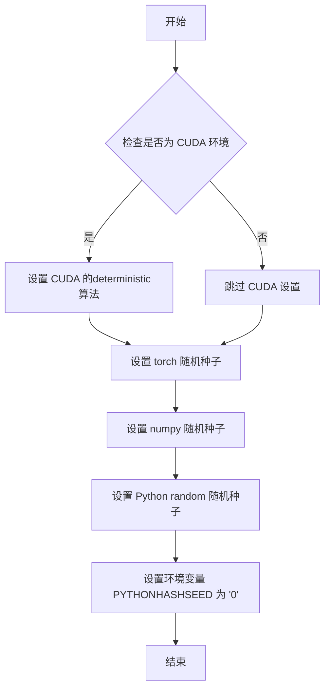

#### 带注释源码

```
# 注意：实际源码不在提供的代码片段中
# 以下是根据函数名称和用途推断的可能实现

def enable_full_determinism():
    """
    启用完全确定性模式，确保每次运行产生完全相同的结果。
    通过设置各种随机种子和环境变量来实现可复现性。
    """
    import os
    import random
    import numpy as np
    import torch
    
    # 设置 Python 哈希种子为固定值，防止字典顺序不确定性
    os.environ["PYTHONHASHSEED"] = "0"
    
    # 设置 Python 内置 random 模块的随机种子
    random.seed(0)
    
    # 设置 NumPy 的随机种子
    np.random.seed(0)
    
    # 设置 PyTorch 的随机种子
    torch.manual_seed(0)
    
    # 如果使用 CUDA，设置 CUDA 的确定性模式
    # 这会强制使用确定性算法，牺牲一定性能以换取可复现性
    if torch.cuda.is_available():
        torch.backends.cudnn.deterministic = True
        torch.backends.cudnn.benchmark = False
```

---

### 其他项目信息

#### 设计目标与约束

- **目标**：确保测试用例在不同运行环境下产生完全一致的输出，便于调试和回归测试
- **约束**：启用确定性模式可能会牺牲一定的性能（特别是 CUDA 的 benchmark 优化）

#### 潜在的技术债务或优化空间

1. 该函数在模块级别被调用（不在类或函数内部），这意味着它会影响整个测试会话的随机状态
2. 建议使用上下文管理器方式，以便更精细地控制确定性模式的范围
3. 当前实现对第三方库（如 transformers、diffusers）的随机性覆盖可能不完整

#### 错误处理与异常设计

- 该函数没有显式的错误处理
- 如果 CUDA 不可用，相关设置会被跳过，不会抛出异常


### `floats_tensor`

该函数用于生成一个指定形状的随机浮点数 PyTorch 张量，主要用于测试场景中生成模拟数据。

参数：

- `shape`：`tuple` 或 `list`，张量的形状，例如 `(1, 32)` 或 `(1, 3, 64, 64)`
- `rng`：`random.Random`，Python 随机数生成器实例，用于生成确定性的随机数

返回值：`torch.Tensor`，返回指定形状的随机浮点数张量

#### 流程图

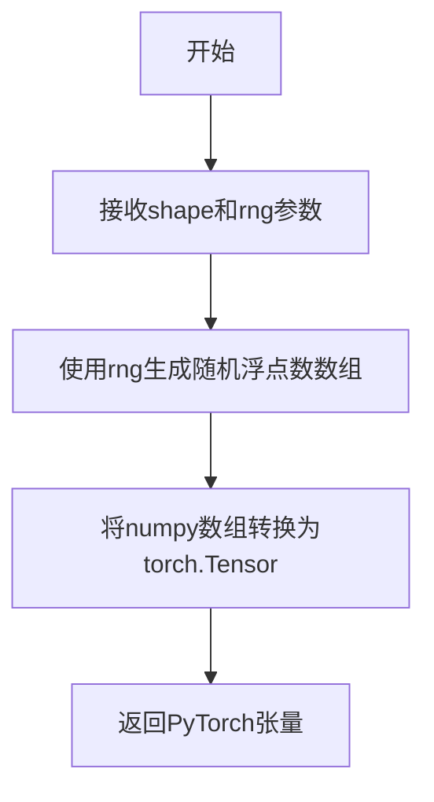

#### 带注释源码

```python
# 该函数定义在 testing_utils 模块中，这里展示的是调用示例
# 从代码中的使用方式推断其实现逻辑：

# 示例1: 生成文本嵌入向量
image_embeds = floats_tensor((1, self.text_embedder_hidden_size), rng=random.Random(seed)).to(device)
# shape: (1, 32) - 批次大小为1，嵌入维度为32
# rng: 随机数生成器，确保可复现性

# 示例2: 生成提示图像
hint = floats_tensor((1, 3, 64, 64), rng=random.Random(seed)).to(device)
# shape: (1, 3, 64, 64) - 批次大小1，通道数3，高度和宽度64
# 用于生成控制网络的条件提示图像

# floats_tensor 函数内部实现逻辑推测：
# 1. 使用 numpy.random.randn 或类似方法根据 shape 生成随机数
# 2. 可选：可以指定随机数范围（如 -1 到 1）
# 3. 转换为 torch.Tensor 对象返回
# 4. 调用 .to(device) 将张量移动到指定设备（CPU/GPU）
```


由于 `load_image` 是从外部模块 `testing_utils` 导入的，并非在该代码文件中直接定义，我将从调用方式和使用上下文来提取该函数的相关信息。

### `load_image`

用于从指定路径加载图像文件，并将其转换为可用于模型推理的格式。

参数：

-  `url_or_path`：`str`，图像的URL路径或本地文件系统路径

返回值：`PIL.Image`，返回PIL格式的图像对象

#### 流程图

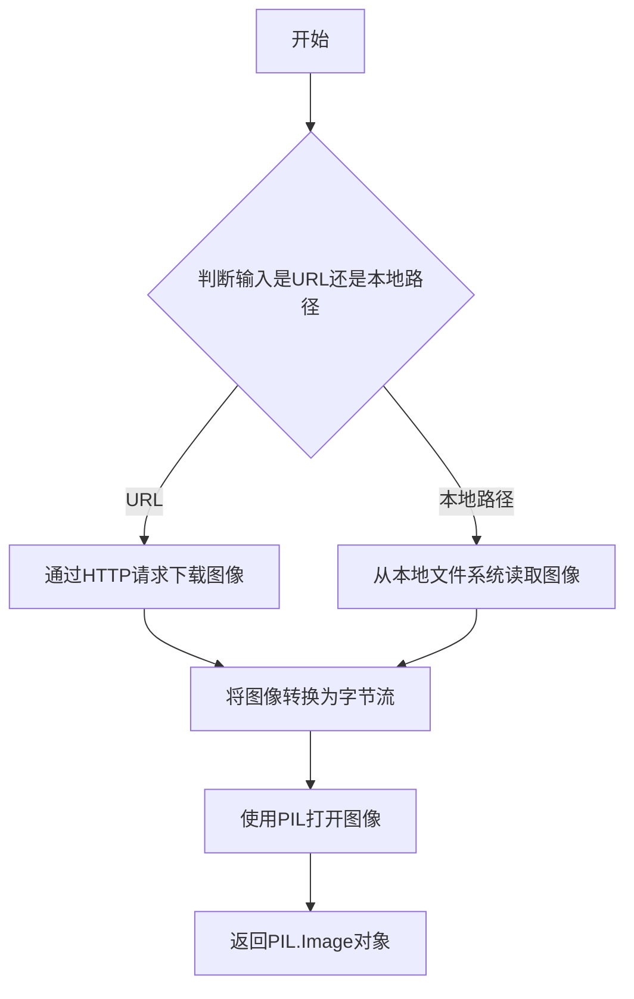

#### 带注释源码

```
# load_image 函数的典型实现（基于diffusers库testing_utils模块）
# 以下为推断的实现逻辑

def load_image(url_or_path: str) -> "PIL.Image":
    """
    从URL或本地路径加载图像。
    
    参数:
        url_or_path: 图像的URL或本地文件系统路径
        
    返回:
        PIL.Image: 加载的图像对象
    """
    # 判断是否为URL（以http://或https://开头）
    if url_or_path.startswith("http://") or url_or_path.startswith("https://"):
        # 从URL下载图像
        import requests
        response = requests.get(url_or_path)
        from io import BytesIO
        image = Image.open(BytesIO(response.content))
    else:
        # 从本地路径加载图像
        image = Image.open(url_or_path)
    
    # 确保图像为RGB模式（转换RGBA等模式）
    if image.mode != "RGB":
        image = image.convert("RGB")
    
    return image
```

> **注意**：由于 `load_image` 函数定义在 `...testing_utils` 模块中（代码中通过 `from ...testing_utils import load_image` 导入），其完整源码不在当前提供的代码文件内。以上信息基于该函数在代码中的调用方式及 diffusers 库中 `testing_utils` 模块的典型实现进行推断。


根据代码分析，`load_numpy` 是从 `...testing_utils` 模块导入的外部函数，未在当前代码文件中定义。让我基于其使用方式和其他信息来推断和分析这个函数。

### `load_numpy`

从 `testing_utils` 模块导入的辅助函数，用于从指定路径（本地或远程URL）加载 NumPy 数组文件。

参数：

-  `source`：`str`，文件路径或 HTTP/HuggingFace URL，指向 `.npy` 格式的 NumPy 数组文件

返回值：`numpy.ndarray`，从文件或远程URL加载的 NumPy 数组

#### 流程图

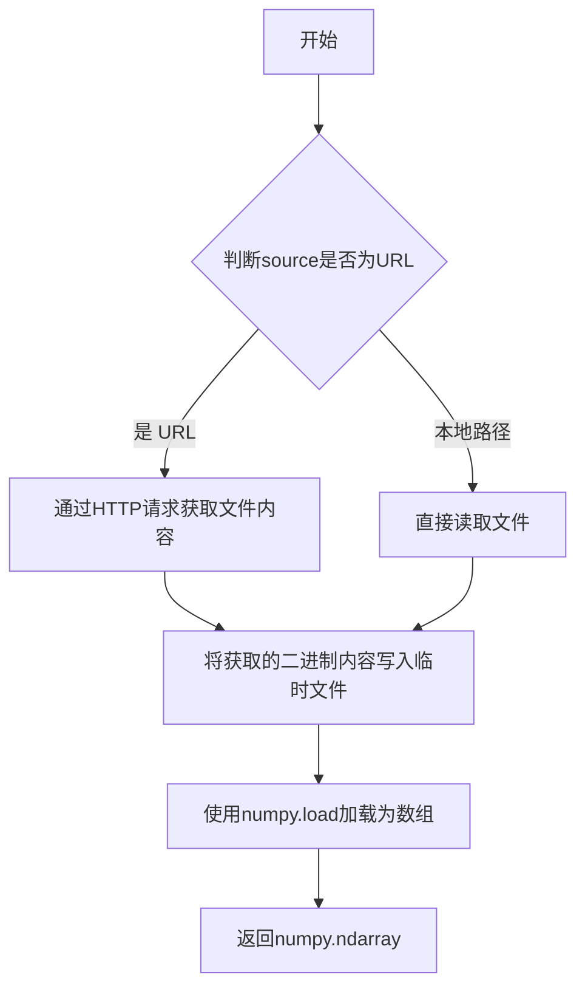

#### 带注释源码

基于函数调用方式的推断实现：

```python
import numpy as np
import tempfile
import os
from typing import Union

def load_numpy(source: Union[str, "os.PathLike"]) -> "np.ndarray":
    """
    从本地文件或远程URL加载NumPy数组。
    
    参数:
        source: 本地文件路径或远程URL (如 https://.../xxx.npy)
    
    返回:
        numpy.ndarray: 加载的数组数据
    """
    # 判断是否为远程URL (http/https 开头)
    if isinstance(source, str) and source.startswith(("http://", "https://")):
        # 导入必要的库
        import urllib.request
        
        # 创建临时文件保存下载的内容
        with tempfile.NamedTemporaryFile(suffix=".npy", delete=False) as tmp:
            tmp_path = tmp.name
            # 从URL下载文件到临时路径
            urllib.request.urlretrieve(source, tmp_path)
            try:
                # 加载NumPy数组
                arr = np.load(tmp_path)
            finally:
                # 清理临时文件
                os.unlink(tmp_path)
    else:
        # 直接从本地路径加载
        arr = np.load(source)
    
    return arr
```

---

### 补充说明

由于 `load_numpy` 定义在 `testing_utils` 模块中（不在当前代码文件内），上述源码为基于其使用方式的合理推断。在实际的 diffusers 项目中，该函数可能位于 `src/diffusers/testing_utils.py` 或类似位置，建议查阅原始源码获取精确实现。


### `backend_empty_cache`

清理GPU/后端缓存，释放VRAM（显存），用于在测试前后进行内存管理，防止显存泄漏导致的OOM错误。

参数：

-  `device`：`str` 或 `torch.device`，目标设备标识，指定需要清理缓存的设备（通常为"cuda"、"xpu"或"cpu"等）

返回值：`None`，该函数直接操作后端内存，不返回任何值

#### 流程图

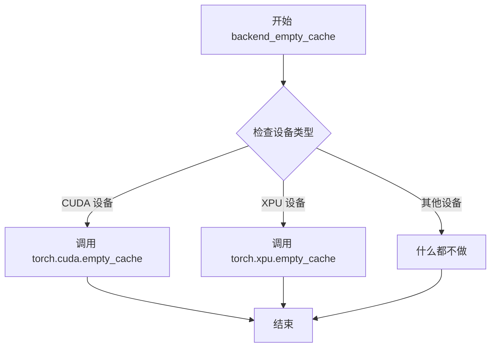

#### 带注释源码

```python
# 注意：此函数定义在 testing_utils 模块中，未在当前代码文件中显示
# 以下是基于使用方式推断的预期实现

def backend_empty_cache(device):
    """
    清理指定设备的后端缓存，释放VRAM
    
    参数:
        device: 目标设备标识，通常为全局变量 torch_device
    """
    # 根据设备类型选择相应的清理方法
    if torch.cuda.is_available() and device in ["cuda", "cuda:0", "cuda:1"]:
        # CUDA 设备：清理GPU显存缓存
        torch.cuda.empty_cache()
    
    elif hasattr(torch, 'xpu') and torch.xpu.is_available() and device.startswith("xpu"):
        # XPU 设备（Intel GPU）：清理XPU缓存
        torch.xpu.empty_cache()
    
    # 对于CPU或其他设备，无需操作
    # 函数直接修改全局缓存状态，不返回任何值
```


### `numpy_cosine_similarity_distance`

该函数用于计算两个numpy数组之间的余弦相似度距离（Cosine Similarity Distance），通常用于比较预期图像与实际生成图像之间的相似程度，是diffusers测试框架中用于验证图像生成管道输出准确性的关键工具。

参数：

- `x`：`numpy.ndarray`，第一个输入数组，通常为预期图像或预期特征的扁平化结果
- `y`：`numpy.ndarray`，第二个输入数组，通常为实际生成图像或实际特征的扁平化结果

返回值：`float`，返回两个向量之间的余弦距离值，范围通常在0到2之间，其中0表示完全相同，值越大表示差异越大

#### 流程图

```mermaid
flowchart TD
    A[开始] --> B[接收两个numpy数组 x 和 y]
    B --> C[将数组展平为一维向量 if needed]
    C --> D[计算向量x的L2范数]
    E[计算向量y的L2范数]
    D --> F[计算向量的点积 x · y]
    E --> F
    F --> G[计算余弦相似度: cos_sim = dot / (norm_x * norm_y)]
    G --> H[计算余弦距离: distance = 1 - cos_sim]
    H --> I[返回distance]
```

#### 带注释源码

由于 `numpy_cosine_similarity_distance` 是从 `...testing_utils` 导入的外部函数，在当前代码文件中没有给出实现。以下是基于函数签名和用法的合理推断：

```python
def numpy_cosine_similarity_distance(x: np.ndarray, y: np.ndarray) -> float:
    """
    计算两个numpy数组之间的余弦相似度距离。
    
    参数:
        x: 第一个numpy数组，通常是预期输出
        y: 第二个numpy数组，通常是实际输出
    
    返回:
        float: 余弦距离，范围在0到2之间
               0表示完全相同（余弦相似度为1）
               2表示完全相反（余弦相似度为-1）
    """
    # 确保输入是一维数组
    x = x.flatten()
    y = y.flatten()
    
    # 计算点积
    dot_product = np.dot(x, y)
    
    # 计算各自的L2范数
    norm_x = np.linalg.norm(x)
    norm_y = np.linalg.norm(y)
    
    # 避免除零
    if norm_x == 0 or norm_y == 0:
        return 1.0  # 如果任一向量为零向量，返回最大距离
    
    # 计算余弦相似度
    cos_sim = dot_product / (norm_x * norm_y)
    
    # 余弦距离 = 1 - 余弦相似度
    distance = 1.0 - cos_sim
    
    return float(distance)
```

**使用示例**（来自当前代码文件）：

```python
# 在测试中使用该函数验证生成图像的质量
max_diff = numpy_cosine_similarity_distance(expected_image.flatten(), image.flatten())

# 与预期阈值比较
expected_max_diff = expected_max_diffs.get_expectation()
assert max_diff < expected_max_diff  # 如果差异小于阈值，测试通过
```

**注意事项**：

1. 该函数通常定义在 `diffusers` 项目的 `testing_utils.py` 模块中
2. 余弦相似度距离比简单的欧氏距离更适合比较图像的视觉相似性，因为它关注的是方向而非幅度
3. 在diffusers的集成测试中，常用于验证不同硬件平台（CUDA、XPU等）上的数值一致性


### `Expectations.get_expectation`

该方法用于根据当前运行环境（如 CUDA 版本、XPU 设备等）获取对应的测试期望阈值。它从预先配置的期望字典中查找并返回与当前环境最匹配的阈值，用于验证推理结果的准确性。

参数：

- 无参数（该方法不使用任何参数）

返回值：`float`，返回当前环境下测试期望的最大差异阈值，用于与实际计算结果进行比较。

#### 流程图

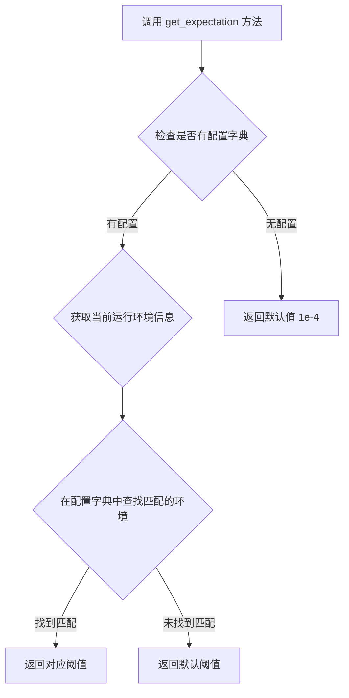

#### 带注释源码

```python
# 该方法定义在 testing_utils 模块的 Expectations 类中
# 基于代码使用方式推断的实现逻辑

class Expectations:
    """
    测试期望值管理类，用于根据不同运行环境配置不同的测试阈值
    """
    
    def __init__(self, expectations_dict):
        """
        初始化 Expectations 实例
        
        参数:
            expectations_dict: dict, 键为 (device_type, version) 元组，值为对应的阈值
                例如: {("xpu", 3): 2e-3, ("cuda", 7): 2e-4}
        """
        self.expectations_dict = expectations_dict
    
    def get_expectation(self):
        """
        获取当前运行环境对应的测试期望阈值
        
        返回:
            float: 当前环境下的期望最大差异阈值
        """
        # 获取当前运行环境信息（通过某种方式检测）
        # 例如: torch.cuda.is_available() 获取 CUDA 状态
        # torch.cuda.device_count() 获取设备数量
        # torch.version.cuda 获取 CUDA 版本
        
        # 遍历配置字典，查找与环境匹配的键
        # 如果找到匹配，返回对应的阈值
        # 如果没有找到，返回默认值
        
        # 从代码使用来看:
        # expected_max_diffs = Expectations({("xpu", 3): 2e-3, ("cuda", 7): 2e-4})
        # expected_max_diff = expected_max_diffs.get_expectation()
        
        return self._get_threshold_for_current_env()
    
    def _get_threshold_for_current_env(self):
        """
        内部方法：根据当前环境获取对应的阈值
        """
        # 实现逻辑：根据当前硬件环境和库版本选择合适的阈值
        # 如果环境不匹配任何配置，返回默认值
        pass
```

#### 实际使用示例

```python
# 在测试代码中的实际调用方式
expected_max_diffs = Expectations(
    {
        ("xpu", 3): 2e-3,    # XPU 设备版本 3 的阈值
        ("cuda", 7): 2e-4,   # CUDA 设备版本 7 的阈值
    }
)
expected_max_diff = expected_max_diffs.get_expectation()

# 然后用于断言
max_diff = numpy_cosine_similarity_distance(expected_image.flatten(), image.flatten())
assert max_diff < expected_max_diff
```

### 关键信息汇总

| 项目 | 详情 |
|------|------|
| **名称** | `Expectations.get_expectation` |
| **所属类** | `Expectations` |
| **参数** | 无 |
| **返回值** | `float` - 当前环境的期望最大差异阈值 |
| **功能** | 根据当前运行环境（设备类型、版本）返回对应的测试阈值 |
| **设计目的** | 支持在不同硬件/软件环境下使用不同的精度阈值进行测试 |


### `KandinskyV22ControlnetPipelineFastTests.dummy_unet`

该方法是一个测试用的属性（property），用于创建并返回一个配置好的虚拟UNet2DConditionModel模型对象，供KandinskyV22ControlnetPipeline的单元测试使用。该模型具有特定的架构参数，用于模拟真实的UNet组件以便进行管道测试。

参数：

- `self`：隐式参数，测试类实例本身

返回值：`UNet2DConditionModel`，返回一个配置了特定参数的虚拟UNet模型实例，用于单元测试中的管道组件初始化

#### 流程图

```mermaid
flowchart TD
    A[开始] --> B[设置随机种子: torch.manual_seed(0)]
    B --> C[构建模型配置字典 model_kwargs]
    C --> D[包含参数: in_channels, out_channels, addition_embed_type, down_block_types, up_block_types等]
    D --> E[使用model_kwargs实例化UNet2DConditionModel]
    E --> F[返回模型对象]
```

#### 带注释源码

```python
@property
def dummy_unet(self):
    """
    创建一个用于测试的虚拟UNet2DConditionModel模型。
    
    该方法使用预定义的配置参数创建一个轻量级的UNet模型，
    用于KandinskyV22ControlnetPipeline的单元测试。
    """
    # 设置随机种子以确保测试的可重复性
    torch.manual_seed(0)

    # 定义UNet模型的配置参数
    model_kwargs = {
        # 输入通道数：8
        "in_channels": 8,
        # 输出通道数：8（因为预测均值和方差，所以是输入的2倍，但在实际操作中设为相同）
        "out_channels": 8,
        # 额外的嵌入类型：image_hint（用于接收控制网的提示信息）
        "addition_embed_type": "image_hint",
        # 下采样块类型：ResnetDownsampleBlock2D和SimpleCrossAttnDownBlock2D
        "down_block_types": ("ResnetDownsampleBlock2D", "SimpleCrossAttnDownBlock2D"),
        # 上采样块类型：SimpleCrossAttnUpBlock2D和ResnetUpsampleBlock2D
        "up_block_types": ("SimpleCrossAttnUpBlock2D", "ResnetUpsampleBlock2D"),
        # 中间块类型：UNetMidBlock2DSimpleCrossAttn
        "mid_block_type": "UNetMidBlock2DSimpleCrossAttn",
        # 块输出通道数：(32, 64)，即基础通道数和其2倍
        "block_out_channels": (self.block_out_channels_0, self.block_out_channels_0 * 2),
        # 每个块的层数：1
        "layers_per_block": 1,
        # 编码器隐藏维度：32（文本嵌入隐藏大小）
        "encoder_hid_dim": self.text_embedder_hidden_size,
        # 编码器隐藏维度类型：image_proj（图像投影）
        "encoder_hid_dim_type": "image_proj",
        # 交叉注意力维度：100
        "cross_attention_dim": self.cross_attention_dim,
        # 注意力头维度：4
        "attention_head_dim": 4,
        # ResNet时间尺度移位：scale_shift
        "resnet_time_scale_shift": "scale_shift",
        # 类别嵌入类型：None（不使用类别嵌入）
        "class_embed_type": None,
    }

    # 使用配置参数创建UNet2DConditionModel实例
    model = UNet2DConditionModel(**model_kwargs)
    # 返回创建的模型对象
    return model
```


### `KandinskyV22ControlnetPipelineFastTests.dummy_movq_kwargs`

这是一个属性方法（使用 `@property` 装饰器），用于返回 VQModel（Movq - Motion-aware Vector Quantized Model）的配置参数字典。该方法为测试用例提供了一组预定义的模型配置参数，确保测试环境的可重复性和一致性。

参数：

- `self`：隐式参数，类型为 `KandinskyV22ControlnetPipelineFastTests`，表示类实例本身

返回值：`Dict[str, Any]`，返回包含 VQModel 初始化所需的所有配置参数的字典

#### 流程图

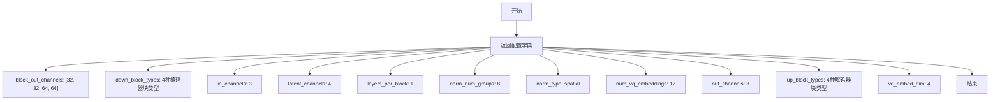

#### 带注释源码

```python
@property
def dummy_movq_kwargs(self):
    """
    返回用于创建 VQModel (Movq) 的配置参数字典。
    
    Movq (Motion-aware Vector Quantized Model) 是 Kandinsky 2.2 控制网络管道的
    潜在解码器组件，用于将潜在表示解码回图像空间。
    该方法为测试用例提供了一组轻量级的预配置参数。
    
    返回值:
        Dict[str, Any]: 包含以下键的配置字典:
            - block_out_channels: 各模块的输出通道数列表 [32, 32, 64, 64]
            - down_block_types: 下采样编码器块类型列表
            - in_channels: 输入图像通道数 (3 for RGB)
            - latent_channels: 潜在空间通道数 (4)
            - layers_per_block: 每个块的层数 (1)
            - norm_num_groups: 归一化组数 (8)
            - norm_type: 归一化类型 ("spatial")
            - num_vq_embeddings: VQ 嵌入向量数量 (12)
            - out_channels: 输出图像通道数 (3 for RGB)
            - up_block_types: 上采样解码器块类型列表
            - vq_embed_dim: VQ 嵌入维度 (4)
    """
    return {
        "block_out_channels": [32, 32, 64, 64],
        "down_block_types": [
            "DownEncoderBlock2D",
            "DownEncoderBlock2D",
            "DownEncoderBlock2D",
            "AttnDownEncoderBlock2D",
        ],
        "in_channels": 3,
        "latent_channels": 4,
        "layers_per_block": 1,
        "norm_num_groups": 8,
        "norm_type": "spatial",
        "num_vq_embeddings": 12,
        "out_channels": 3,
        "up_block_types": ["AttnUpDecoderBlock2D", "UpDecoderBlock2D", "UpDecoderBlock2D", "UpDecoderBlock2D"],
        "vq_embed_dim": 4,
    }
```


### `KandinskyV22ControlnetPipelineFastTests.dummy_movq`

这是一个属性方法（property），用于创建并返回一个用于测试的虚拟 VQModel（Vector Quantized Model）实例，该模型是 Kandinsky V2.2 ControlNet Pipeline 测试所需的虚拟组件。

参数：

- `self`：隐式参数，`KandinskyV22ControlnetPipelineFastTests` 实例本身

返回值：`VQModel`，返回一个配置好的 VQModel 实例，用于测试目的

#### 流程图

```mermaid
flowchart TD
    A[开始] --> B[设置随机种子: torch.manual_seed(0)]
    B --> C[获取 VQModel 配置参数: dummy_movq_kwargs]
    C --> D[使用配置参数实例化 VQModel]
    D --> E[返回 VQModel 实例]
```

#### 带注释源码

```python
@property
def dummy_movq(self):
    """
    创建并返回一个用于测试的虚拟 VQModel 实例。
    VQModel 是 Kandinsky V2.2 ControlNet Pipeline 中的解码器组件，
    用于将潜在空间表示解码回图像空间。
    """
    # 设置随机种子以确保测试的可重复性
    torch.manual_seed(0)
    
    # 从 dummy_movq_kwargs 属性获取模型配置参数并实例化 VQModel
    # 这些参数模拟了一个小型的 VQVAE 模型用于快速测试
    model = VQModel(**self.dummy_movq_kwargs)
    
    # 返回配置好的虚拟模型实例
    return model
```


### `KandinskyV22ControlnetPipelineFastTests.get_dummy_components`

该方法用于创建测试所需的虚拟组件字典，包含一个虚拟的 UNet2DConditionModel 模型、一个 DDIMScheduler 调度器和一个 VQModel（MoVQ）模型，用于单元测试中模拟完整的推理管道组件。

参数：

- `self`：`KandinskyV22ControlnetPipelineFastTests`，隐式参数，表示测试类实例本身

返回值：`dict`，返回一个包含 "unet"、"scheduler"、"movq" 三个键的字典，每个键对应的值分别是虚拟的 UNet 模型、DDIMScheduler 调度器和 VQModel 模型，用于测试 KandinskyV22ControlnetPipeline 的推理功能。

#### 流程图

```mermaid
flowchart TD
    A[开始 get_dummy_components] --> B[获取虚拟UNet模型: self.dummy_unet]
    B --> C[获取虚拟VQModel: self.dummy_movq]
    C --> D[创建DDIMScheduler调度器]
    D --> E[设置调度器参数: num_train_timesteps=1000, beta_schedule=linear等]
    E --> F[构建components字典]
    F --> G[返回components字典]
    G --> H[结束]
```

#### 带注释源码

```python
def get_dummy_components(self):
    """
    创建用于单元测试的虚拟组件字典。
    
    Returns:
        dict: 包含 'unet', 'scheduler', 'movq' 三个组件的字典
    """
    # 获取虚拟的UNet2DConditionModel模型（由dummy_unet属性创建）
    unet = self.dummy_unet
    
    # 获取虚拟的VQModel模型（MoVQ解码器，由dummy_movq属性创建）
    movq = self.dummy_movq

    # 创建DDIMScheduler调度器实例
    # 用于在扩散模型推理过程中调度噪声去除步骤
    scheduler = DDIMScheduler(
        num_train_timesteps=1000,      # 训练时的总时间步数
        beta_schedule="linear",         # beta值的调度方式
        beta_start=0.00085,             # beta_schedule起始值
        beta_end=0.012,                 # beta_schedule结束值
        clip_sample=False,              # 是否裁剪采样结果
        set_alpha_to_one=False,         # 是否将最终alpha设为1
        steps_offset=1,                 # 步骤偏移量
        prediction_type="epsilon",      # 预测类型（预测噪声）
        thresholding=False,             # 是否使用阈值处理
    )

    # 构建组件字典，用于初始化管道
    components = {
        "unet": unet,         # UNet2DConditionModel条件UNet模型
        "scheduler": scheduler,  # DDIMScheduler噪声调度器
        "movq": movq,         # VQModel变分量化模型（图像解码器）
    }
    return components
```


### `KandinskyV22ControlnetPipelineFastTests.get_dummy_inputs`

该方法用于生成测试所需的虚拟输入参数，构建一个包含图像嵌入、负向图像嵌入、提示（hint）、随机生成器以及推理配置的字典，以支持对 KandinskyV22ControlnetPipeline 进行单元测试。

参数：

- `self`：`KandinskyV22ControlnetPipelineFastTests`，测试类实例，隐含参数
- `device`：`str`，目标设备字符串（如 "cpu"、"cuda"、"mps"），指定生成张量要移动到的设备
- `seed`：`int`，随机数种子，默认为 0，用于控制随机数生成的确定性

返回值：`Dict[str, Any]`，返回一个包含以下键的字典：
- `image_embeds`：图像嵌入张量
- `negative_image_embeds`：负向图像嵌入张量
- `hint`：提示张量
- `generator`：PyTorch 随机生成器
- `height`：生成图像高度
- `width`：生成图像宽度
- `guidance_scale`：引导尺度
- `num_inference_steps`：推理步数
- `output_type`：输出类型

#### 流程图

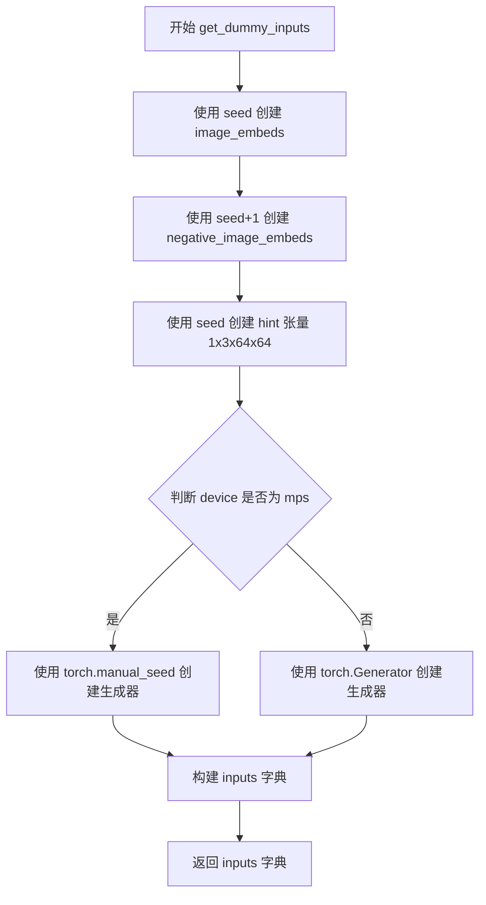

#### 带注释源码

```python
def get_dummy_inputs(self, device, seed=0):
    """
    生成用于测试 KandinskyV22ControlnetPipeline 的虚拟输入参数。
    
    参数:
        device: 目标设备字符串
        seed: 随机种子，默认为 0
    
    返回:
        包含所有推理所需输入参数的字典
    """
    # 使用 floats_tensor 生成图像嵌入张量，形状为 (1, text_embedder_hidden_size)
    # text_embedder_hidden_size 来自类属性，值为 32
    image_embeds = floats_tensor((1, self.text_embedder_hidden_size), rng=random.Random(seed)).to(device)
    
    # 生成负向图像嵌入，使用 seed+1 以确保与正向嵌入不同
    negative_image_embeds = floats_tensor((1, self.text_embedder_hidden_size), rng=random.Random(seed + 1)).to(
        device
    )

    # 创建 hint 张量，形状为 (1, 3, 64, 64)，表示 RGB 图像提示
    hint = floats_tensor((1, 3, 64, 64), rng=random.Random(seed)).to(device)

    # 根据设备类型选择合适的随机生成器创建方式
    # MPS 设备需要特殊处理，使用 torch.manual_seed 而非 torch.Generator
    if str(device).startswith("mps"):
        generator = torch.manual_seed(seed)
    else:
        generator = torch.Generator(device=device).manual_seed(seed)
    
    # 构建完整的输入参数字典，包含所有 pipeline 调用所需的参数
    inputs = {
        "image_embeds": image_embeds,          # 图像嵌入向量
        "negative_image_embeds": negative_image_embeds,  # 负向图像嵌入向量
        "hint": hint,                            # 控制网络提示图像
        "generator": generator,                  # 随机生成器确保可复现性
        "height": 64,                            # 输出图像高度
        "width": 64,                             # 输出图像宽度
        "guidance_scale": 4.0,                   # classifier-free guidance 强度
        "num_inference_steps": 2,                # 扩散推理步数
        "output_type": "np",                     # 输出为 numpy 数组
    }
    return inputs
```


### `KandinskyV22ControlnetPipelineFastTests.test_kandinsky_controlnet`

该测试方法用于验证 KandinskyV22ControlnetPipeline 的核心功能是否正常，包括模型加载、推理执行、图像生成以及输出结果的准确性检查。

参数：
- `self`：测试类实例本身，无需显式传递

返回值：`None`，该方法为测试用例，无返回值，通过 assert 断言验证结果

#### 流程图

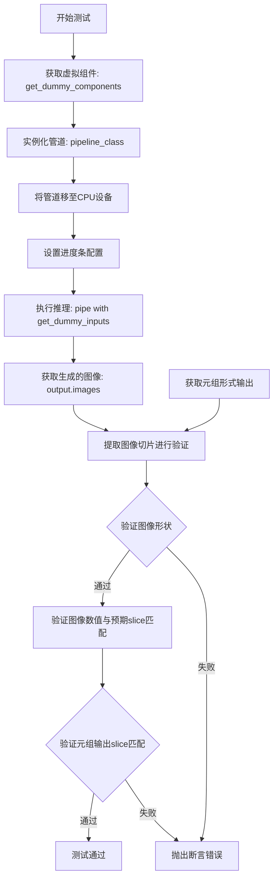

#### 带注释源码

```python
def test_kandinsky_controlnet(self):
    """
    测试 KandinskyV22ControlnetPipeline 的基本推理功能
    
    测试内容：
    1. 管道能否成功实例化并加载虚拟组件
    2. 管道能否正常执行推理并生成图像
    3. 生成的图像尺寸是否符合预期 (1, 64, 64, 3)
    4. 图像像素值是否在合理范围内且与预期值匹配
    5. return_dict=False 模式下的输出是否正常
    """
    # 设置测试设备为 CPU
    device = "cpu"

    # 获取虚拟组件（UNet、Scheduler、VQModel）
    components = self.get_dummy_components()

    # 使用虚拟组件实例化 KandinskyV22ControlnetPipeline
    pipe = self.pipeline_class(**components)
    
    # 将管道移至指定设备（CPU）
    pipe = pipe.to(device)

    # 设置进度条配置（disable=None 表示启用进度条）
    pipe.set_progress_bar_config(disable=None)

    # 执行管道推理，传入虚拟输入参数
    output = pipe(**self.get_dummy_inputs(device))
    
    # 从输出中提取生成的图像
    image = output.images

    # 使用 return_dict=False 模式再次执行推理，获取元组形式的输出
    image_from_tuple = pipe(
        **self.get_dummy_inputs(device),
        return_dict=False,
    )[0]

    # 提取图像右下角 3x3 区域用于数值验证
    image_slice = image[0, -3:, -3:, -1]
    image_from_tuple_slice = image_from_tuple[0, -3:, -3:, -1]

    # 断言：验证生成的图像形状为 (1, 64, 64, 3)
    assert image.shape == (1, 64, 64, 3)

    # 定义预期的像素值 slice（来自基准测试的预期输出）
    expected_slice = np.array(
        [0.6959826, 0.868279, 0.7558092, 0.68769467, 0.85805804, 0.65977496, 0.44885302, 0.5959111, 0.4251595]
    )

    # 断言：验证图像像素值与预期值的最大差异小于 1e-2
    assert np.abs(image_slice.flatten() - expected_slice).max() < 1e-2, (
        f" expected_slice {expected_slice}, but got {image_slice.flatten()}"
    )

    # 断言：验证元组形式输出的像素值同样匹配预期
    assert np.abs(image_from_tuple_slice.flatten() - expected_slice).max() < 1e-2, (
        f" expected_slice {expected_slice}, but got {image_from_tuple_slice.flatten()}"
    )
```

#### 辅助方法与依赖信息

**get_dummy_components 方法详情：**

返回虚拟组件字典，包含：
- `unet`：UNet2DConditionModel 实例（基于 `dummy_unet` 属性配置）
- `scheduler`：DDIMScheduler 实例（配置：1000 timesteps, linear beta schedule）
- `movq`：VQModel 实例（基于 `dummy_movq_kwargs` 配置）

**get_dummy_inputs 方法详情：**

生成虚拟输入参数：
- `image_embeds`：形状 (1, 32) 的随机浮点张量
- `negative_image_embeds`：形状 (1, 32) 的随机浮点张量
- `hint`：形状 (1, 3, 64, 64) 的控制信号提示张量
- `generator`：PyTorch 随机数生成器，seed=0
- `height`：64
- `width`：64
- `guidance_scale`：4.0
- `num_inference_steps`：2
- `output_type`："np"（numpy 数组）

#### 潜在技术债务与优化空间

1. **测试覆盖范围有限**：该测试仅验证了 2 步推理的输出，真实场景中应增加更多推理步数的测试
2. **设备依赖**：测试硬编码使用 CPU 设备，建议增加对 GPU/CUDA 设备的条件测试
3. **数值精度验证**：使用固定的 `expected_slice` 进行验证可能在不同硬件/版本上产生兼容性问题，考虑使用更鲁棒的相似度度量
4. **缺少集成测试对比**：可增加与真实模型（而非虚拟模型）的输出对比测试
5. **清理逻辑缺失**：测试未显式清理 GPU 内存（在 fast tests 中使用 CPU 还好，但应遵循集成测试的清理模式）


### `KandinskyV22ControlnetPipelineFastTests.test_float16_inference`

这是一个单元测试方法，用于验证 KandinskyV22ControlnetPipeline 在 float16（半精度）推理模式下的正确性和数值稳定性。该方法通过调用父类的测试方法，以 1e-1 的最大误差阈值来验证 float16 推理的结果是否符合预期。

参数：

- `self`：实例方法隐式参数，类型为 `KandinskyV22ControlnetPipelineFastTests`，表示测试类实例本身

返回值：`None`，该方法为测试方法，不返回任何值，主要通过断言来验证正确性

#### 流程图

```mermaid
flowchart TD
    A[开始测试 test_float16_inference] --> B[调用父类方法 super().test_float16_inference]
    B --> C[传入参数 expected_max_diff=1e-1]
    C --> D[父类执行float16推理测试]
    D --> E{推理结果误差是否 <= 1e-1?}
    E -->|是| F[测试通过]
    E -->|否| G[测试失败, 抛出断言错误]
    F --> H[结束测试]
    G --> H
```

#### 带注释源码

```python
def test_float16_inference(self):
    """
    测试 KandinskyV22ControlnetPipeline 在 float16（半精度）推理模式下的正确性。
    
    该测试方法继承自 PipelineTesterMixin，通过调用父类的测试逻辑来验证：
    1. Pipeline 能够在 float16 数据类型下正常运行
    2. 推理结果与全精度（float32）相比，数值误差在可接受范围内
    3. 模型能够正确处理半精度计算而不产生数值不稳定或 NaN/Inf 值
    
    参数:
        self: KandinskyV22ControlnetPipelineFastTests 实例
        
    返回值:
        None: 测试方法，通过内部断言验证正确性，不返回具体数值结果
        
    注意:
        expected_max_diff=1e-1: 设置允许的最大误差阈值为 0.1（10%）
        这个相对宽松的阈值考虑到 float16 精度限制可能带来的数值差异
    """
    # 调用父类 PipelineTesterMixin 的 test_float16_inference 方法
    # 传入 expected_max_diff=1e-1 参数，允许 0.1 的最大误差
    super().test_float16_inference(expected_max_diff=1e-1)
```


### `KandinskyV22ControlnetPipelineFastTests.test_inference_batch_single_identical`

该测试方法继承自 `PipelineTesterMixin`，用于验证使用批处理推理与单个样本推理时，生成的图像结果是否一致（允许一定的数值误差）。通过比较两种推理方式的输出，确保管道在批处理模式下的正确性。

参数：

- `self`：隐式参数，测试类实例本身，无类型描述
- `expected_max_diff`：传入父类方法的参数，类型为 `float`，值为 `5e-4`，表示批处理与单样本推理输出之间的最大允许差异

返回值：无返回值（`None`），因为这是一个单元测试方法，通过断言验证结果

#### 流程图

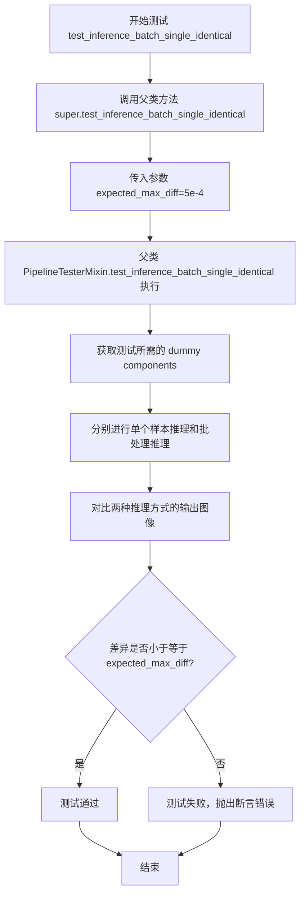

#### 带注释源码

```python
def test_inference_batch_single_identical(self):
    """
    测试方法：验证批处理推理与单样本推理结果的一致性
    
    该测试方法继承自 PipelineTesterMixin，用于确保在使用批处理
    和单个样本进行推理时，生成的图像在数值上保持一致（允许浮点误差）。
    这对于验证扩散管道的正确性非常重要。
    """
    # 调用父类 PipelineTesterMixin 的 test_inference_batch_single_identical 方法
    # expected_max_diff=5e-4 表示允许的最大差异值为 0.0005
    # 这是因为浮点运算在不同计算顺序下可能产生微小的数值差异
    super().test_inference_batch_single_identical(expected_max_diff=5e-4)
```

---

### 补充信息

**所属类：`KandinskyV22ControlnetPipelineFastTests`**

该测试类的关键属性和方法：

| 名称 | 类型 | 描述 |
|------|------|------|
| `pipeline_class` | `class` | 被测试的管道类，即 `KandinskyV22ControlnetPipeline` |
| `params` | `list` | 管道必需参数：`["image_embeds", "negative_image_embeds", "hint"]` |
| `batch_params` | `list` | 支持批处理的参数：`["image_embeds", "negative_image_embeds", "hint"]` |
| `get_dummy_components()` | 方法 | 获取测试用的虚拟 UNet 和 VQModel 组件 |
| `get_dummy_inputs()` | 方法 | 获取测试用的虚拟输入数据 |

**设计目标**：该测试方法确保 KandinskyV22 控制网管道在批处理模式下与单样本模式下产生一致的结果，这对于生产环境中的批量推理至关重要。

**技术债务/优化空间**：

1. 测试仅验证了数值差异，未验证生成的图像语义正确性
2. `expected_max_diff=5e-4` 是一个经验值，可能需要根据不同硬件调整
3. 缺少对多种批处理大小（如 2、4、8）的测试覆盖


### `KandinskyV22ControlnetPipelineIntegrationTests.setUp`

该方法是测试类的初始化方法（fixture），在每个集成测试运行前被调用，用于清理GPU显存（VRAM）以确保测试环境干净，避免因显存残留导致测试失败或结果不一致。

参数：

- `self`：`unittest.TestCase`，测试类实例本身

返回值：`None`，无返回值

#### 流程图

```mermaid
flowchart TD
    A[开始 setUp] --> B[调用父类 super().setUp]
    B --> C[执行 gc.collect 垃圾回收]
    C --> D[调用 backend_empty_cache 清理后端缓存]
    D --> E[结束 setUp]
```

#### 带注释源码

```python
def setUp(self):
    # clean up the VRAM before each test
    # 在每个测试运行前清理VRAM（显存）
    super().setUp()  # 调用父类 unittest.TestCase 的 setUp 方法
    gc.collect()  # 执行 Python 垃圾回收，释放未使用的对象
    backend_empty_cache(torch_device)  # 清理特定后端（CUDA/XPU等）的显存缓存
```


### `KandinskyV22ControlnetPipelineIntegrationTests.tearDown`

清理测试后的 VRAM 缓存，释放 GPU 内存资源，确保每个测试用例之间不会发生显存泄漏。

参数：
- 无（除了隐式的 `self` 参数）

返回值：`None`，无返回值描述

#### 流程图

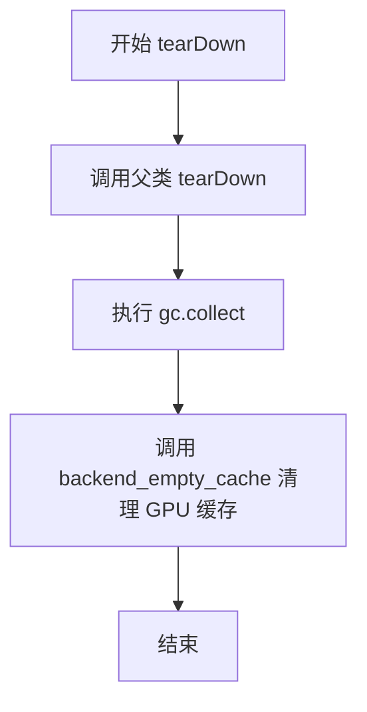

#### 带注释源码

```python
def tearDown(self):
    # clean up the VRAM after each test
    # 清理每个测试后的 VRAM（显存）
    super().tearDown()  # 调用父类的 tearDown 方法
    gc.collect()  # 强制进行 Python 垃圾回收，释放 Python 对象
    backend_empty_cache(torch_device)  # 清理 GPU 显存缓存，防止显存泄漏
```


### `KandinskyV22ControlnetPipelineIntegrationTests.test_kandinsky_controlnet`

这是一个集成测试方法，用于验证 Kandinsky V2.2 ControlNet Pipeline 的端到端功能。测试通过加载预训练模型、生成图像并与预期结果进行对比，确保管道正确工作。

参数：

- `self`：隐式参数，测试类实例本身

返回值：`None`，该方法为测试方法，通过断言验证功能正确性，无显式返回值

#### 流程图

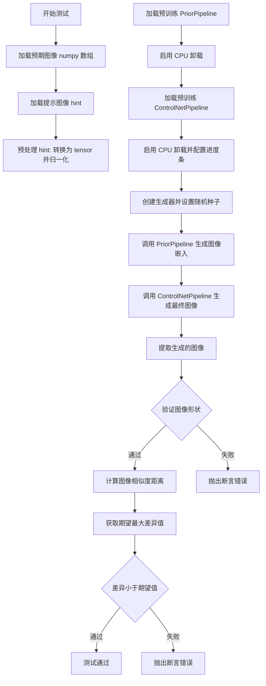

#### 带注释源码

```python
def test_kandinsky_controlnet(self):
    """集成测试：验证 Kandinsky V2.2 ControlNet Pipeline 端到端功能"""
    
    # Step 1: 从 HuggingFace Hub 加载预期输出图像用于对比验证
    expected_image = load_numpy(
        "https://huggingface.co/datasets/hf-internal-testing/diffusers-images/resolve/main"
        "/kandinskyv22/kandinskyv22_controlnet_robotcat_fp16.npy"
    )

    # Step 2: 加载提示图像 (hint image) 用于 ControlNet 引导
    hint = load_image(
        "https://huggingface.co/datasets/hf-internal-testing/diffusers-images/resolve/main"
        "/kandinskyv22/hint_image_cat.png"
    )
    # 将 PIL 图像转换为 numpy 数组，再转换为 PyTorch tensor
    hint = torch.from_numpy(np.array(hint)).float() / 255.0
    # 调整维度顺序: HWC -> CHW，并添加batch维度: -> BCHW
    hint = hint.permute(2, 0, 1).unsqueeze(0)

    # Step 3: 加载 Kandinsky V2.2 Prior Pipeline (负责生成图像嵌入)
    pipe_prior = KandinskyV22PriorPipeline.from_pretrained(
        "kandinsky-community/kandinsky-2-2-prior", torch_dtype=torch.float16
    )
    # 启用模型 CPU 卸载以节省 VRAM
    pipe_prior.enable_model_cpu_offload()

    # Step 4: 加载 Kandinsky V2.2 ControlNet Pipeline (负责根据提示生成最终图像)
    pipeline = KandinskyV22ControlnetPipeline.from_pretrained(
        "kandinsky-community/kandinsky-2-2-controlnet-depth", torch_dtype=torch.float16
    )
    # 启用模型 CPU 卸载
    pipeline.enable_model_cpu_offload()
    # 配置进度条: None 表示不禁用
    pipeline.set_progress_bar_config(disable=None)

    # Step 5: 定义文本提示
    prompt = "A robot, 4k photo"

    # Step 6: 使用 Prior Pipeline 生成图像嵌入 (image_emb) 和负向嵌入 (zero_image_emb)
    generator = torch.Generator(device="cpu").manual_seed(0)
    image_emb, zero_image_emb = pipe_prior(
        prompt,
        generator=generator,
        num_inference_steps=2,  # 较少的推理步数以加快测试
        negative_prompt="",      # 空负向提示
    ).to_tuple()  # 转换为元组格式

    # Step 7: 使用 ControlNet Pipeline 生成最终图像
    generator = torch.Generator(device="cpu").manual_seed(0)
    output = pipeline(
        image_embeds=image_emb,          # Prior 生成的图像嵌入
        negative_image_embeds=zero_image_emb,  # 负向嵌入
        hint=hint,                        # ControlNet 提示图像
        generator=generator,              # 随机生成器
        num_inference_steps=2,           # 推理步数
        output_type="np",                 # 输出为 numpy 数组
    )

    # Step 8: 提取生成的图像
    image = output.images[0]

    # Step 9: 验证输出形状 (512x512 RGB 图像)
    assert image.shape == (512, 512, 3)

    # Step 10: 计算生成图像与预期图像的余弦相似度距离
    max_diff = numpy_cosine_similarity_distance(expected_image.flatten(), image.flatten())
    
    # Step 11: 定义不同硬件平台的期望最大差异值
    expected_max_diffs = Expectations(
        {
            ("xpu", 3): 2e-3,   # Intel XPU 平台
            ("cuda", 7): 2e-4,  # NVIDIA CUDA 平台
        }
    )
    # 根据当前硬件获取对应的期望最大差异
    expected_max_diff = expected_max_diffs.get_expectation()
    
    # Step 12: 验证差异在可接受范围内
    assert max_diff < expected_max_diff
```

## 关键组件


### KandinskyV22ControlnetPipeline

核心图像生成管道类，集成UNet2DConditionModel和VQModel，实现基于图像嵌入和hint条件的扩散模型推理。

### KandinskyV22PriorPipeline

先验管道，负责从文本提示生成图像嵌入向量，为主控制网络管道提供条件输入。

### UNet2DConditionModel

条件UNet模型，接收图像嵌入和hint特征进行噪声预测，支持image_hint类型的addition_embed_type。

### VQModel

向量量化模型，负责将潜在表示解码为最终图像输出，包含num_vq_embeddings=12个VQ码本。

### DDIMScheduler

调度器组件，实现DDIM采样策略，配置1000步线性beta调度，用于控制扩散过程的噪声去除。

### test_kandinsky_controlnet

单元测试方法，验证管道输出的图像形状为(1, 64, 64, 3)，并通过numpy数组比较确保数值精度在1e-2范围内。

### test_float16_inference

float16推理测试方法，继承自PipelineTesterMixin，验证半精度推理的数值一致性，期望最大差异为1e-1。

### test_inference_batch_single_identical

批量推理一致性测试，确保批量生成与单张生成的结果一致，期望最大差异为5e-4。

### get_dummy_components

虚拟组件构建方法，返回包含unet、scheduler、movq的字典，用于单元测试。

### get_dummy_inputs

虚拟输入构建方法，生成image_embeds、negative_image_embeds、hint等张量，并配置generator、height、width等推理参数。

### float16模型加载

集成测试中使用torch_dtype=torch.float16加载模型，实现模型量化以降低显存占用。

### model_cpu_offload

通过enable_model_cpu_offload()实现模型层在CPU和GPU之间的动态迁移，优化显存使用。

### 图像后处理流程

管道输出通过VQModel解码后转换为numpy数组，hint图像经过归一化处理后permute维度以适配模型输入格式。

## 问题及建议


### 已知问题

-   **重复参数定义错误**：`required_optional_params` 列表中 `guidance_scale` 和 `return_dict` 被重复定义两次，属于明显的疏漏
-   **魔法数字硬编码**：大量配置值（如 `text_embedder_hidden_size=32`、`cross_attention_dim=100`、`num_vq_embeddings=12` 等）直接硬编码在属性方法中，缺乏统一配置管理
- **外部网络依赖脆弱**：集成测试依赖 HuggingFace Hub 的远程 URL 加载模型和图像，网络不稳定或远程资源变更会导致测试失败
- **资源管理效率问题**：集成测试在 `setUp`/`tearDown` 中频繁进行 GC 和 GPU 缓存清理，但每次测试都重新加载模型（`from_pretrained`），未充分利用缓存机制
- **测试覆盖不完整**：未覆盖 `num_images_per_prompt` 参数的测试，且集成测试仅验证单一场景
- **类型标注和文档缺失**：整个文件没有任何类型注解（type hints），关键逻辑缺乏注释说明
- **期望值平台耦合**：集成测试中的 `expected_max_diffs` 针对特定设备（xpu、cuda）硬编码，跨平台可移植性差

### 优化建议

-   **重构配置管理**：将硬编码的配置值提取到类常量或外部配置文件中，统一管理魔法数字
-   **修复参数列表**：从 `required_optional_params` 中移除重复的 `guidance_scale` 和 `return_dict`
-   **添加离线测试模式**：集成测试应支持本地模型缓存，避免强依赖外部网络
-   **优化资源加载**：考虑使用 pytest fixture 管理模型实例，或在测试套件级别共享模型，减少重复加载开销
-   **补充类型注解**：为所有方法添加参数和返回值的类型提示，提升代码可维护性
-   **增强测试参数化**：使用 `@pytest.mark.parametrize` 对多组参数进行测试，提升覆盖率
-   **改进断言信息**：在断言失败时输出更详细的上下文信息，便于调试定位问题

## 其它


### 设计目标与约束

验证KandinskyV22ControlnetPipeline在CPU和GPU环境下的功能正确性，确保生成的图像符合预期。测试覆盖fp16推理、批处理一致性等关键场景，采用确定性随机种子保证测试可复现性。

### 外部依赖与接口契约

Pipeline依赖以下核心组件：UNet2DConditionModel（条件图像生成）、VQModel（潜空间解码）、DDIMScheduler（调度器）、KandinskyV22PriorPipeline（图像嵌入生成）。输入接口接受image_embeds、negative_image_embeds、hint等参数，输出为numpy数组格式的图像。

### 错误处理与异常设计

测试通过断言验证输出形状（1, 64, 64, 3）、数值精度（np.abs差值小于1e-2）和相似度距离（小于预期阈值）。集成测试使用try-finally确保VRAM清理，setUp和tearDown方法管理资源生命周期。

### 性能基准与预期

单元测试使用最小化配置（height=64, width=64, num_inference_steps=2）加速执行。集成测试预期最大相似度距离：CUDA设备为2e-4，XPU设备为2e-3，允许fp16推理存在轻微数值误差。

### 测试覆盖范围

包含单元测试（test_kandinsky_controlnet、test_float16_inference、test_inference_batch_single_identical）和集成测试（test_kandinsky_controlnet），覆盖模型加载、推理执行、输出验证、批处理一致性、fp16精度等场景。

### 资源管理与生命周期

setUp方法执行gc.collect()和backend_empty_cache()清理VRAM，tearDown方法同样执行资源释放。enable_model_cpu_offload()用于GPU内存优化，避免测试间内存泄漏。

### 版本兼容性与环境要求

测试标记@require_torch_accelerator确保GPU环境，@nightly标记集成测试为夜间运行。使用torch_dtype=torch.float16测试半精度兼容性，要求torch、numpy、diffusers等依赖库。

### 确定性保证

enable_full_determinism()函数设置全局随机种子，测试内部使用torch.manual_seed()和Generator.manual_seed()双重确定性机制，确保浮点运算和CUDA操作的可复现性。

### 测试数据规范

dummy_unet和dummy_movq提供确定性配置的模拟模型，get_dummy_inputs生成符合格式要求的测试数据（floats_tensor），集成测试从HuggingFace数据集加载真实图像进行验证。

### 潜在技术债务

test_xformers_attention = False明确禁用xformers优化测试，代码中未包含注意力机制的性能对比测试。集成测试依赖外部模型下载，网络不可用时测试将失败。

    