# `diffusers\tests\pipelines\kandinsky2_2\test_kandinsky_controlnet_img2img.py` 详细设计文档

该文件是Hugging Face diffusers库中Kandinsky V2.2 ControlNet Img2Img Pipeline的单元测试和集成测试代码，用于验证图像到图像生成模型的功能正确性、性能和与预期输出的一致性。

## 整体流程

```mermaid
graph TD
    A[开始测试] --> B{测试类型}
    B -- 快速测试 --> C[执行KandinskyV22ControlnetImg2ImgPipelineFastTests]
    B -- 集成测试 --> D[执行KandinskyV22ControlnetImg2ImgPipelineIntegrationTests]
    C --> C1[创建虚拟UNet模型]
    C --> C2[创建虚拟VQModel(MoVQ)模型]
    C --> C3[配置DDIMScheduler]
    C --> C4[构建Pipeline组件]
    C --> C5[准备虚拟输入数据]
    C --> C6[执行推理并验证输出]
    C --> C7[验证图像形状和像素值]
    D --> D1[加载预训练Prior Pipeline]
    D --> D2[加载预训练ControlNet Pipeline]
    D --> D3[从URL加载测试图像]
    D --> D4[执行Prior生成image_embeds]
    D --> D5[执行ControlNet Img2Img推理]
    D --> D6[验证输出与预期图像相似度]
    D1 --> E[清理VRAM]
    D2 --> E
    D3 --> E
    D4 --> E
    D5 --> E
    D6 --> E
```

## 类结构

```
unittest.TestCase
└── KandinskyV22ControlnetImg2ImgPipelineFastTests (PipelineTesterMixin)
    ├── 属性: pipeline_class
    ├── 属性: params
    ├── 属性: batch_params
    ├── 属性: required_optional_params
    ├── 属性: test_xformers_attention
    ├── 属性: text_embedder_hidden_size
    ├── 属性: time_input_dim
    ├── 属性: block_out_channels_0
    ├── 属性: time_embed_dim
    ├── 属性: cross_attention_dim
    ├── 方法: dummy_unet
    ├── 方法: dummy_movq_kwargs
    ├── 方法: dummy_movq
    ├── 方法: get_dummy_components
    ├── 方法: get_dummy_inputs
    ├── 方法: test_kandinsky_controlnet_img2img
    ├── 方法: test_inference_batch_single_identical
    └── 方法: test_float16_inference
└── KandinskyV22ControlnetImg2ImgPipelineIntegrationTests (nightly, require_torch_accelerator)
    ├── 方法: setUp
    ├── 方法: tearDown
    └── 方法: test_kandinsky_controlnet_img2img
```

## 全局变量及字段


### `enable_full_determinism`
    
启用完全确定性以确保测试可复现

类型：`function`
    


### `KandinskyV22ControlnetImg2ImgPipelineFastTests.pipeline_class`
    
被测试的Kandinsky图像到图像控制网络管道类

类型：`type`
    


### `KandinskyV22ControlnetImg2ImgPipelineFastTests.params`
    
管道需要测试的参数列表

类型：`list`
    


### `KandinskyV22ControlnetImg2ImgPipelineFastTests.batch_params`
    
支持批量处理的参数列表

类型：`list`
    


### `KandinskyV22ControlnetImg2ImgPipelineFastTests.required_optional_params`
    
必需的可选参数列表

类型：`list`
    


### `KandinskyV22ControlnetImg2ImgPipelineFastTests.test_xformers_attention`
    
是否测试xformers注意力机制的标志

类型：`bool`
    


### `KandinskyV22ControlnetImg2ImgPipelineFastTests.text_embedder_hidden_size`
    
文本嵌入器的隐藏层大小

类型：`int`
    


### `KandinskyV22ControlnetImg2ImgPipelineFastTests.time_input_dim`
    
时间输入维度

类型：`int`
    


### `KandinskyV22ControlnetImg2ImgPipelineFastTests.block_out_channels_0`
    
UNet块输出通道数

类型：`int`
    


### `KandinskyV22ControlnetImg2ImgPipelineFastTests.time_embed_dim`
    
时间嵌入维度

类型：`int`
    


### `KandinskyV22ControlnetImg2ImgPipelineFastTests.cross_attention_dim`
    
交叉注意力维度

类型：`int`
    


### `KandinskyV22ControlnetImg2ImgPipelineFastTests.dummy_unet`
    
用于测试的虚拟UNet模型

类型：`UNet2DConditionModel`
    


### `KandinskyV22ControlnetImg2ImgPipelineFastTests.dummy_movq_kwargs`
    
VQ模型(MoVQ)的配置参数

类型：`dict`
    


### `KandinskyV22ControlnetImg2ImgPipelineFastTests.dummy_movq`
    
用于测试的虚拟VQ模型

类型：`VQModel`
    
    

## 全局函数及方法


### `gc.collect`

该函数是 Python 标准库 `gc` 模块中的一个函数，用于显式触发垃圾回收机制，回收不可达的对象并释放内存。在测试用例的 `setUp` 和 `tearDown` 方法中被调用，用于在每个测试前后清理 VRAM（显存）资源，防止内存泄漏。

参数：

- 该函数在代码中以无参数形式调用 `gc.collect()`，但 `gc.collect(gen)` 实际上接受一个可选的 `generation` 参数（整数），指定要回收的垃圾代（0、1、2，默认为 -1 表示所有代）

返回值：`int`，返回回收过程中释放的对象数量

#### 流程图

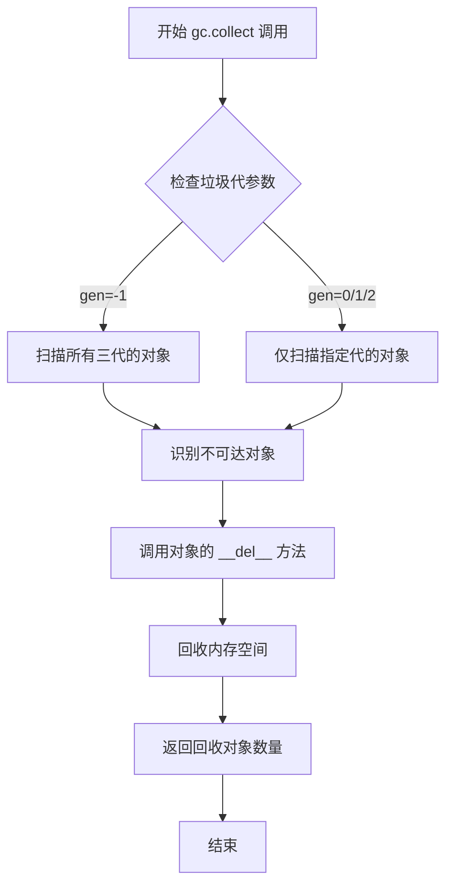

#### 带注释源码

```python
# 该函数在测试框架中被用于清理内存
# 具体调用位置在 KandinskyV22ControlnetImg2ImgPipelineIntegrationTests 类中

def setUp(self):
    # 在每个测试开始前清理 VRAM
    super().setUp()
    gc.collect()  # 显式触发垃圾回收，回收不可达对象
    backend_empty_cache(torch_device)  # 清理 GPU 缓存

def tearDown(self):
    # 在每个测试结束后清理 VRAM
    super().tearDown()
    gc.collect()  # 再次触发垃圾回收，确保彻底释放内存
    backend_empty_cache(torch_device)
```

> **注意**：在代码中 `gc.collect()` 以无参数形式调用，这意味着它会扫描所有三代（generation）的垃圾对象，并尝试回收那些不再被引用的对象。这是测试框架中用于内存管理的标准做法。


### `random.Random`

`random.Random` 是 Python 标准库 `random` 模块中的一个类，用于创建独立的随机数生成器实例。通过传入特定的种子值（seed），可以生成可复现的随机数序列，常用于测试和需要确定性的场景。

参数：

- `seed`：`int` 或 `None`，随机数生成器的种子值，用于初始化随机数序列。如果为 `None`，则使用系统当前时间作为种子。

返回值：`random.Random`，返回一个随机数生成器实例对象。

#### 流程图

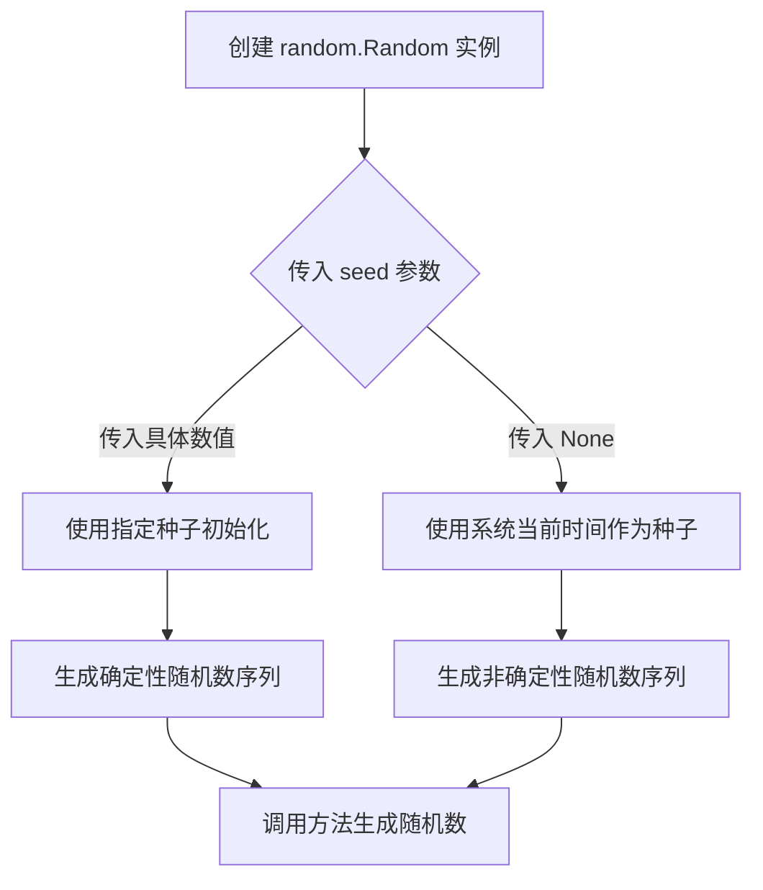

#### 带注释源码

```python
# 在 get_dummy_inputs 方法中使用 random.Random
def get_dummy_inputs(self, device, seed=0):
    # 使用种子 seed 创建随机数生成器，用于生成 image_embeds
    # seed=0 确保每次调用生成相同的随机数，确保测试可复现
    image_embeds = floats_tensor((1, self.text_embedder_hidden_size), rng=random.Random(seed)).to(device)
    
    # 使用种子 seed+1 创建另一个随机数生成器，用于生成 negative_image_embeds
    # 这样可以生成与 image_embeds 不同的随机数序列
    negative_image_embeds = floats_tensor((1, self.text_embedder_hidden_size), rng=random.Random(seed + 1)).to(
        device
    )
    
    # 创建初始图像，使用种子 seed
    image = floats_tensor((1, 3, 64, 64), rng=random.Random(seed)).to(device)
    
    # 创建 hint 图像提示，使用种子 seed
    hint = floats_tensor((1, 3, 64, 64), rng=random.Random(seed)).to(device)
```

#### 关键组件信息

| 名称 | 一句话描述 |
|------|-----------|
| `random.Random` | Python 标准库中的随机数生成器类，用于创建可复现的随机数序列 |

#### 潜在技术债务与优化空间

1. **硬编码种子值**：代码中硬编码了种子值 `seed=0`，虽然这有利于测试确定性，但可能导致测试覆盖不足。建议增加参数化测试，使用多个种子值验证 pipeline 的稳定性。

2. **重复创建 Random 实例**：在 `get_dummy_inputs` 方法中多次创建 `random.Random` 实例，可以考虑复用已创建的实例以提高效率。

3. **设备兼容性处理**：代码对 MPS 设备有特殊处理 (`if str(device).startswith("mps")`)，这种条件判断可能导致在不同设备上的行为不一致，建议统一处理或添加更完善的设备检测逻辑。


### `KandinskyV22ControlnetImg2ImgPipelineFastTests.test_kandinsky_controlnet_img2img`

测试 KandinskyV22 控制网络图像到图像管道的核心推理功能，验证管道能否正确生成图像并通过确定性输出验证。

参数：此方法无显式参数，使用类方法 `get_dummy_components()` 和 `get_dummy_inputs(device)` 获取所需组件和输入

返回值：无返回值（void），该方法仅执行断言验证

#### 流程图

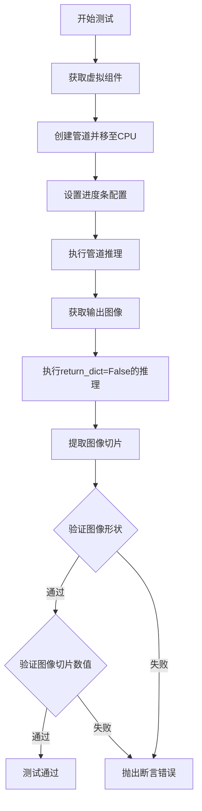

#### 带注释源码

```python
def test_kandinsky_controlnet_img2img(self):
    """测试 KandinskyV22 控制网络图像到图像的推理功能"""
    device = "cpu"

    # 获取虚拟组件（UNet、Scheduler、MoVQ模型）
    components = self.get_dummy_components()

    # 使用虚拟组件创建管道实例
    pipe = self.pipeline_class(**components)
    # 将管道移至指定设备
    pipe = pipe.to(device)

    # 配置进度条（disable=None 表示启用进度条）
    pipe.set_progress_bar_config(disable=None)

    # 执行管道推理，获取输出
    output = pipe(**self.get_dummy_inputs(device))
    # 获取生成的图像
    image = output.images

    # 使用 return_dict=False 再次执行推理，获取元组输出
    image_from_tuple = pipe(
        **self.get_dummy_inputs(device),
        return_dict=False,
    )[0]

    # 提取图像右下角3x3像素块用于验证
    image_slice = image[0, -3:, -3:, -1]
    image_from_tuple_slice = image_from_tuple[0, -3:, -3:, -1]

    # 断言：验证输出图像形状为 (1, 64, 64, 3)
    assert image.shape == (1, 64, 64, 3)

    # 定义预期像素值切片
    expected_slice = np.array(
        [0.54985034, 0.55509365, 0.52561504, 0.5570494, 0.5593818, 0.5263979, 0.50285643, 0.5069846, 0.51196736]
    )
    # 断言：验证图像数值与预期值的差异小于 1e-2
    assert np.abs(image_slice.flatten() - expected_slice).max() < 1e-2, (
        f" expected_slice {expected_slice}, but got {image_slice.flatten()}"
    )
    assert np.abs(image_from_tuple_slice.flatten() - expected_slice).max() < 1e-2, (
        f" expected_slice {expected_slice}, but got {image_from_tuple_slice.flatten()}"
    )
```

---

### `KandinskyV22ControlnetImg2ImgPipelineFastTests.test_inference_batch_single_identical`

测试管道在批处理模式下单张图像推理结果与单独推理结果的一致性，验证批处理逻辑的正确性。

参数：此方法无显式参数

返回值：无返回值（void），该方法继承自 `PipelineTesterMixin` 并调用父类方法

#### 流程图

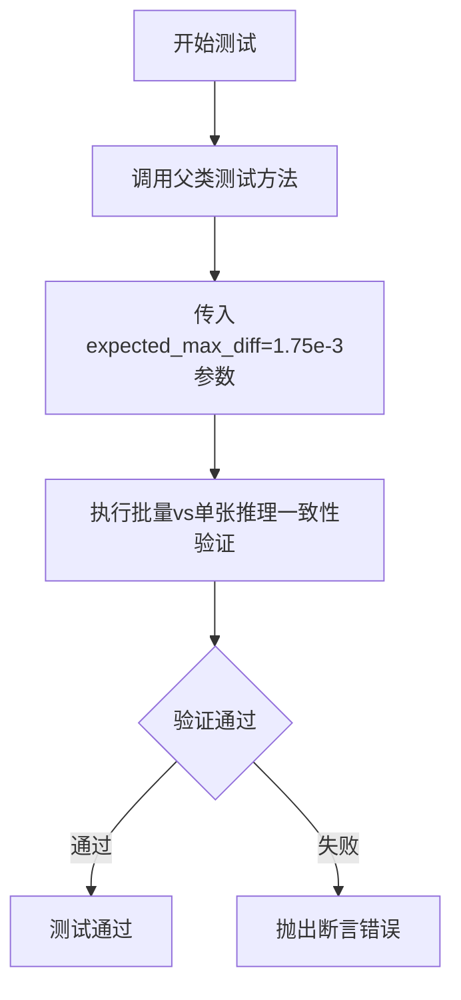

#### 带注释源码

```python
def test_inference_batch_single_identical(self):
    """测试批处理推理与单张推理结果的一致性"""
    # 调用父类 PipelineTesterMixin 的测试方法
    # expected_max_diff: 允许的最大差异值为 1.75e-3
    super().test_inference_batch_single_identical(expected_max_diff=1.75e-3)
```

---

### `KandinskyV22ControlnetImg2ImgPipelineFastTests.test_float16_inference`

测试管道在 float16（半精度）推理模式下的功能正确性，验证混合精度支持的兼容性。

参数：此方法无显式参数

返回值：无返回值（void），该方法继承自 `PipelineTesterMixin` 并调用父类方法

#### 流程图

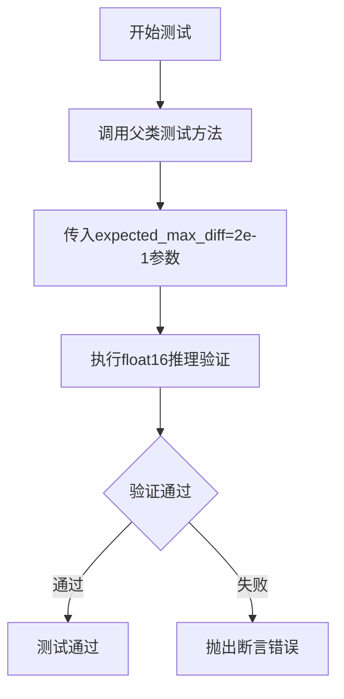

#### 带注释源码

```python
def test_float16_inference(self):
    """测试 float16（半精度）推理模式"""
    # 调用父类 PipelineTesterMixin 的测试方法
    # expected_max_diff: float16允许的最大差异值为 2e-1（较宽松）
    super().test_float16_inference(expected_max_diff=2e-1)
```

---

### `KandinskyV22ControlnetImg2ImgPipelineFastTests.get_dummy_components`

创建并返回用于测试的虚拟组件字典，包含 UNet2DConditionModel、DDIMScheduler 和 VQModel（MoVQ）。

参数：此方法无显式参数

返回值：`dict`，包含虚拟组件的字典，键为 "unet"、"scheduler"、"movq"

#### 流程图

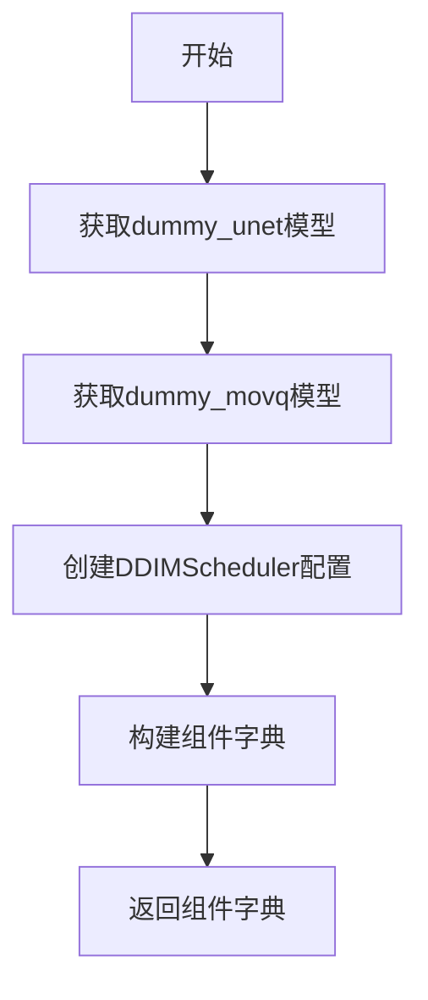

#### 带注释源码

```python
def get_dummy_components(self):
    """获取用于测试的虚拟组件"""
    # 获取虚拟 UNet 模型
    unet = self.dummy_unet
    # 获取虚拟 MoVQ 模型
    movq = self.dummy_movq

    # 配置 DDIM 调度器参数
    ddim_config = {
        "num_train_timesteps": 1000,      # 训练时间步数
        "beta_schedule": "linear",        # Beta 调度策略
        "beta_start": 0.00085,            # 初始 beta 值
        "beta_end": 0.012,                # 结束 beta 值
        "clip_sample": False,             # 是否裁剪样本
        "set_alpha_to_one": False,        # 是否将 alpha 设为 1
        "steps_offset": 0,                # 步骤偏移
        "prediction_type": "epsilon",     # 预测类型
        "thresholding": False,           # 是否使用阈值化
    }

    # 创建 DDIM 调度器实例
    scheduler = DDIMScheduler(**ddim_config)

    # 组装组件字典
    components = {
        "unet": unet,         # UNet2DConditionModel 实例
        "scheduler": scheduler,  # DDIMScheduler 实例
        "movq": movq,         # VQModel (MoVQ) 实例
    }

    return components
```

---

### `KandinskyV22ControlnetImg2ImgPipelineFastTests.get_dummy_inputs`

生成用于管道推理的虚拟输入数据，包括图像嵌入、负向嵌入、初始图像、提示图像和推理参数。

参数：

- `device`：`str`，目标设备（如 "cpu"、"cuda"）
- `seed`：`int`，随机种子，默认为 0

返回值：`dict`，包含所有输入参数的字典

#### 流程图

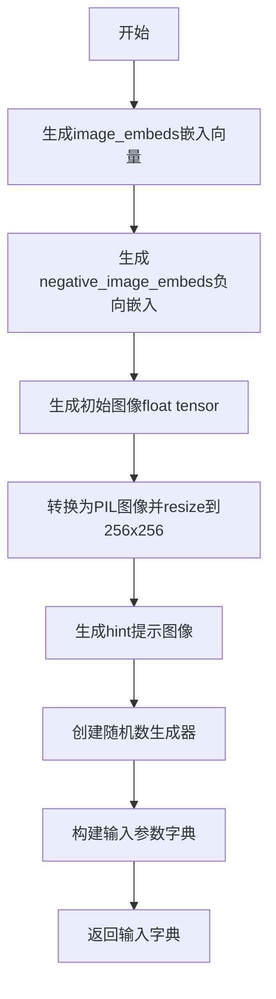

#### 带注释源码

```python
def get_dummy_inputs(self, device, seed=0):
    """生成用于测试的虚拟输入数据"""
    # 生成图像嵌入向量 (1, text_embedder_hidden_size)
    image_embeds = floats_tensor((1, self.text_embedder_hidden_size), rng=random.Random(seed)).to(device)
    # 生成负向图像嵌入向量
    negative_image_embeds = floats_tensor((1, self.text_embedder_hidden_size), rng=random.Random(seed + 1)).to(
        device
    )
    
    # 创建初始图像 (1, 3, 64, 64)
    image = floats_tensor((1, 3, 64, 64), rng=random.Random(seed)).to(device)
    # 转换为 (H, W, C) 格式并提取第一张图像
    image = image.cpu().permute(0, 2, 3, 1)[0]
    # 转换为 PIL 图像并调整为 256x256
    init_image = Image.fromarray(np.uint8(image)).convert("RGB").resize((256, 256))
    
    # 创建提示图像 hint
    hint = floats_tensor((1, 3, 64, 64), rng=random.Random(seed)).to(device)

    # 根据设备类型创建随机数生成器
    if str(device).startswith("mps"):
        generator = torch.manual_seed(seed)
    else:
        generator = torch.Generator(device=device).manual_seed(seed)
    
    # 构建完整的输入参数字典
    inputs = {
        "image": init_image,                    # 初始图像 (PIL Image)
        "image_embeds": image_embeds,           # 图像嵌入向量
        "negative_image_embeds": negative_image_embeds,  # 负向嵌入
        "hint": hint,                           # 提示图像
        "generator": generator,                 # 随机生成器
        "height": 64,                           # 输出高度
        "width": 64,                            # 输出宽度
        "num_inference_steps": 10,              # 推理步数
        "guidance_scale": 7.0,                  # 引导系数
        "strength": 0.2,                        # 图像处理强度
        "output_type": "np",                    # 输出类型为 numpy
    }
    return inputs
```

---

### `KandinskyV22ControlnetImg2ImgPipelineIntegrationTests.test_kandinsky_controlnet_img2img`

集成测试：使用真实预训练模型测试控制网络图像到图像管道，验证端到端功能并与预期结果进行相似度比较。

参数：此方法无显式参数

返回值：无返回值（void），该方法执行完整推理流程并验证结果

#### 流程图

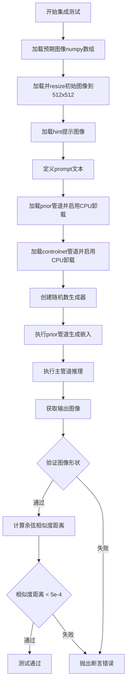

#### 带注释源码

```python
def test_kandinsky_controlnet_img2img(self):
    """集成测试：使用真实预训练模型测试控制网络图像到图像功能"""
    # 从远程加载预期输出图像
    expected_image = load_numpy(
        "https://huggingface.co/datasets/hf-internal-testing/diffusers-images/resolve/main"
        "/kandinskyv22/kandinskyv22_controlnet_img2img_robotcat_fp16.npy"
    )

    # 加载初始图像并调整大小为 512x512
    init_image = load_image(
        "https://huggingface.co/datasets/hf-internal-testing/diffusers-images/resolve/main/kandinsky/cat.png"
    )
    init_image = init_image.resize((512, 512))

    # 加载 hint 提示图像
    hint = load_image(
        "https://huggingface.co/datasets/hf-internal-testing/diffusers-images/resolve/main"
        "/kandinskyv22/hint_image_cat.png"
    )
    # 转换为 tensor 并归一化到 [0, 1]
    hint = torch.from_numpy(np.array(hint)).float() / 255.0
    # 转换为 (C, H, W) 格式并添加批次维度
    hint = hint.permute(2, 0, 1).unsqueeze(0)

    # 定义文本提示
    prompt = "A robot, 4k photo"

    # 加载 prior 管道（用于生成图像嵌入）
    pipe_prior = KandinskyV22PriorEmb2EmbPipeline.from_pretrained(
        "kandinsky-community/kandinsky-2-2-prior", torch_dtype=torch.float16
    )
    # 启用模型 CPU 卸载以节省显存
    pipe_prior.enable_model_cpu_offload()

    # 加载主 controlnet 管道
    pipeline = KandinskyV22ControlnetImg2ImgPipeline.from_pretrained(
        "kandinsky-community/kandinsky-2-2-controlnet-depth", torch_dtype=torch.float16
    )
    pipeline.enable_model_cpu_offload()

    # 配置进度条
    pipeline.set_progress_bar_config(disable=None)

    # 创建随机数生成器
    generator = torch.Generator(device="cpu").manual_seed(0)

    # 使用 prior 管道生成图像嵌入和负向嵌入
    image_emb, zero_image_emb = pipe_prior(
        prompt,
        image=init_image,
        strength=0.85,
        generator=generator,
        negative_prompt="",
        num_inference_steps=5,
    ).to_tuple()

    # 重新创建生成器
    generator = torch.Generator(device="cpu").manual_seed(0)
    # 执行主管道推理
    output = pipeline(
        image=init_image,
        image_embeds=image_emb,
        negative_image_embeds=zero_image_emb,
        hint=hint,
        generator=generator,
        num_inference_steps=5,
        height=512,
        width=512,
        strength=0.5,
        output_type="np",
    )

    # 获取输出图像
    image = output.images[0]

    # 断言：验证输出图像形状为 (512, 512, 3)
    assert image.shape == (512, 512, 3)

    # 计算预期图像与输出图像的余弦相似度距离
    max_diff = numpy_cosine_similarity_distance(expected_image.flatten(), image.flatten())
    # 断言：验证相似度距离小于阈值 5e-4
    assert max_diff < 5e-4
```

---

### `KandinskyV22ControlnetImg2ImgPipelineFastTests.dummy_unet`

属性：创建一个虚拟的 UNet2DConditionModel 用于测试，配置为处理图像提示条件。

参数：此属性无显式参数（使用类属性作为参数）

返回值：`UNet2DConditionModel`，虚拟 UNet 模型实例

#### 带注释源码

```python
@property
def dummy_unet(self):
    """创建虚拟 UNet2DConditionModel 用于测试"""
    # 设置随机种子以确保可重复性
    torch.manual_seed(0)

    # 定义模型配置参数
    model_kwargs = {
        "in_channels": 8,                              # 输入通道数
        "out_channels": 8,                             # 输出通道数（预测均值和方差）
        "addition_embed_type": "image_hint",          # 附加嵌入类型
        "down_block_types": (                          # 下采样块类型
            "ResnetDownsampleBlock2D", 
            "SimpleCrossAttnDownBlock2D"
        ),
        "up_block_types": (                            # 上采样块类型
            "SimpleCrossAttnUpBlock2D", 
            "ResnetUpsampleBlock2D"
        ),
        "mid_block_type": "UNetMidBlock2DSimpleCrossAttn",  # 中间块类型
        "block_out_channels": (                        # 块输出通道数
            self.block_out_channels_0, 
            self.block_out_channels_0 * 2
        ),
        "layers_per_block": 1,                         # 每块层数
        "encoder_hid_dim": self.text_embedder_hidden_size,  # 编码器隐藏维度
        "encoder_hid_dim_type": "image_proj",          # 编码器维度类型
        "cross_attention_dim": self.cross_attention_dim,    # 交叉注意力维度
        "attention_head_dim": 4,                      # 注意力头维度
        "resnet_time_scale_shift": "scale_shift",      # ResNet 时间尺度偏移
        "class_embed_type": None,                      # 类别嵌入类型
    }

    # 创建并返回 UNet 模型实例
    model = UNet2DConditionModel(**model_kwargs)
    return model
```

---

### `KandinskyV22ControlnetImg2ImgPipelineFastTests.dummy_movq`

属性：创建一个虚拟的 VQModel（MoVQ）用于测试，用于图像的变分量化解码。

参数：此属性无显式参数

返回值：`VQModel`，虚拟 MoVQ 模型实例

#### 带注释源码

```python
@property
def dummy_movq(self):
    """创建虚拟 VQModel (MoVQ) 用于测试"""
    torch.manual_seed(0)
    # 使用 dummy_movq_kwargs 配置创建模型
    model = VQModel(**self.dummy_movq_kwargs)
    return model
```


### `numpy` 相关功能提取

由于该代码文件中没有自定义名为"numpy"的函数，而是导入了numpy库并使用了其中的多个函数和类，下面提取代码中实际使用的numpy相关功能：

---

### `numpy.uint8`

**描述**：将数据转换为无符号8位整数类型，用于PIL图像创建。

参数：
- `image`：数组或数值，要转换的数据

返回值：`numpy.uint8`，转换后的8位无符号整数数组

#### 流程图

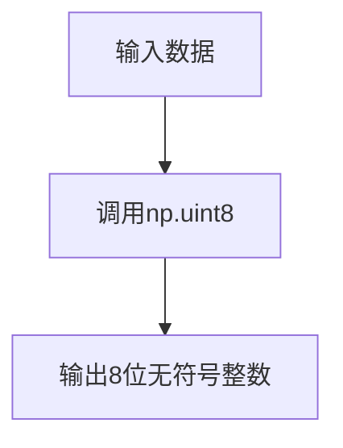

#### 带注释源码

```python
# 将torch张量转换为numpy的uint8类型，用于PIL图像创建
image = image.cpu().permute(0, 2, 3, 1)[0]  # 调整维度顺序 (C, H, W) -> (H, W, C)
init_image = Image.fromarray(np.uint8(image)).convert("RGB").resize((256, 256))
```

---

### `numpy.array`

**描述**：创建numpy数组对象，用于存储和处理数值数据。

参数：
- `hint`：数组或列表，输入数据

返回值：`numpy.ndarray`，numpy数组对象

#### 流程图

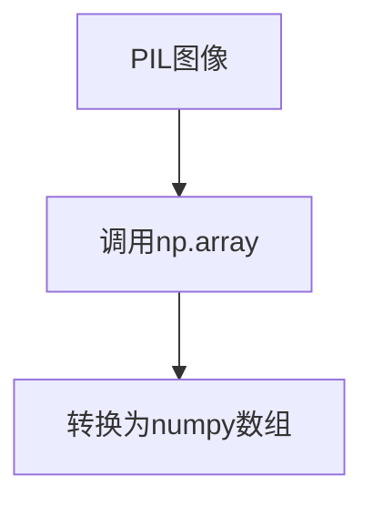

#### 带注释源码

```python
# 将PIL图像转换为numpy数组
hint = torch.from_numpy(np.array(hint)).float() / 255.0  # 转为numpy数组再转torch张量
hint = hint.permute(2, 0, 1).unsqueeze(0)  # 调整维度 (H, W, C) -> (C, H, W) -> (1, C, H, W)
```

---

### `numpy.abs`

**描述**：计算数组元素的绝对值，用于图像像素差异比较。

参数：
- `image_slice.flatten() - expected_slice`：数组，要计算绝对值的数值

返回值：`numpy.ndarray`，绝对值数组

#### 流程图

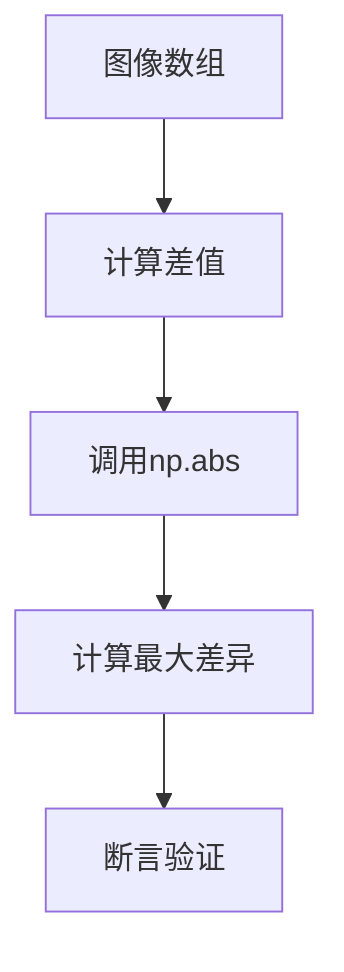

#### 带注释源码

```python
# 验证图像输出与期望值的差异
image_slice = image[0, -3:, -3:, -1]  # 取最后3x3像素块
image_from_tuple_slice = image_from_tuple[0, -3:, -3:, -1]

expected_slice = np.array(
    [0.54985034, 0.55509365, 0.52561504, 0.5570494, 0.5593818, 0.5263979, 0.50285643, 0.5069846, 0.51196736]
)

# 使用numpy计算绝对值差异并验证
assert np.abs(image_slice.flatten() - expected_slice).max() < 1e-2, (
    f" expected_slice {expected_slice}, but got {image_slice.flatten()}"
)
assert np.abs(image_from_tuple_slice.flatten() - expected_slice).max() < 1e-2, (
    f" expected_slice {expected_slice}, but got {image_from_tuple_slice.flatten()}"
)
```

---

### `numpy_cosine_similarity_distance`

**描述**：计算两个数组之间的余弦相似度距离，用于集成测试中图像相似度验证。

参数：
- `expected_image.flatten()`：期望的图像数组
- `image.flatten()`：实际生成的图像数组

返回值：`float`，余弦相似度距离值

#### 带注释源码

```python
# 集成测试中的图像验证
expected_image = load_numpy(
    "https://huggingface.co/datasets/hf-internal-testing/diffusers-images/resolve/main"
    "/kandinskyv22/kandinskyv22_controlnet_img2img_robotcat_fp16.npy"
)

# ... pipeline执行 ...

image = output.images[0]

# 计算余弦相似度距离并验证
max_diff = numpy_cosine_similarity_distance(expected_image.flatten(), image.flatten())
assert max_diff < 5e-4
```


### `KandinskyV22ControlnetImg2ImgPipelineFastTests.get_dummy_components`

该方法用于创建测试所需的虚拟组件（UNet模型、调度器和MOVQ模型），为单元测试提供必要的依赖对象。

参数：
- 无

返回值：`dict`，包含 `unet`、`scheduler` 和 `movq` 三个组件的字典，用于初始化pipeline进行测试。

#### 流程图

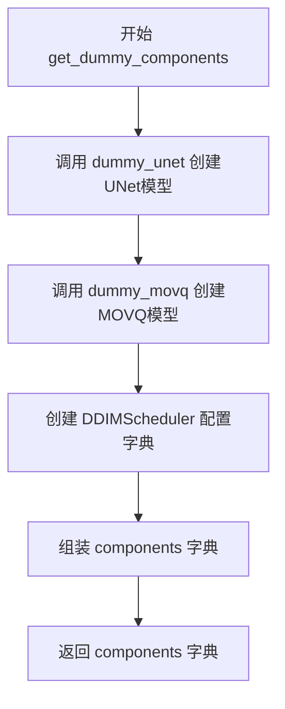

#### 带注释源码

```python
def get_dummy_components(self):
    # 获取虚拟的UNet模型
    unet = self.dummy_unet
    # 获取虚拟的MOVQ模型
    movq = self.dummy_movq

    # 配置DDIM调度器参数
    ddim_config = {
        "num_train_timesteps": 1000,       # 训练时间步数
        "beta_schedule": "linear",         # Beta调度方式
        "beta_start": 0.00085,            # Beta起始值
        "beta_end": 0.012,                # Beta结束值
        "clip_sample": False,             # 是否裁剪样本
        "set_alpha_to_one": False,        # 是否设置alpha为1
        "steps_offset": 0,                 # 步骤偏移
        "prediction_type": "epsilon",     # 预测类型
        "thresholding": False,            # 是否使用阈值
    }

    # 创建DDIM调度器实例
    scheduler = DDIMScheduler(**ddim_config)

    # 组装组件字典
    components = {
        "unet": unet,                      # UNet2DConditionModel实例
        "scheduler": scheduler,            # DDIMScheduler实例
        "movq": movq,                      # VQModel实例
    }

    return components
```

---

### `KandinskyV22ControlnetImg2ImgPipelineFastTests.get_dummy_inputs`

该方法用于生成测试所需的虚拟输入数据，包括图像嵌入、负图像嵌入、初始化图像、提示图像和生成器参数。

参数：
- `device`：`str`，目标设备（如 "cpu" 或 "cuda"）
- `seed`：`int`，随机种子，默认为0，用于生成可复现的随机数据

返回值：`dict`，包含所有pipeline调用所需的输入参数字典。

#### 流程图

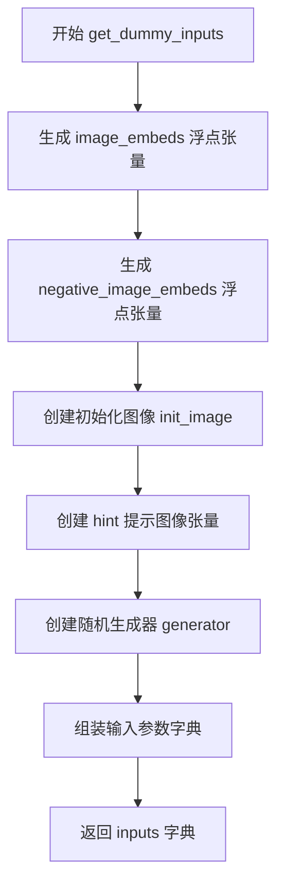

#### 带注释源码

```python
def get_dummy_inputs(self, device, seed=0):
    # 生成正向图像嵌入 (1, text_embedder_hidden_size)
    image_embeds = floats_tensor((1, self.text_embedder_hidden_size), rng=random.Random(seed)).to(device)
    
    # 生成负向图像嵌入，使用seed+1确保不同
    negative_image_embeds = floats_tensor((1, self.text_embedder_hidden_size), rng=random.Random(seed + 1)).to(
        device
    )
    
    # 创建初始图像: 生成(1, 3, 64, 64)的随机张量
    image = floats_tensor((1, 3, 64, 64), rng=random.Random(seed)).to(device)
    # 转换为CHW格式并转换为PIL图像
    image = image.cpu().permute(0, 2, 3, 1)[0]
    init_image = Image.fromarray(np.uint8(image)).convert("RGB").resize((256, 256))
    
    # 创建hint提示图像张量 (1, 3, 64, 64)
    hint = floats_tensor((1, 3, 64, 64), rng=random.Random(seed)).to(device)

    # 根据设备类型创建随机生成器
    if str(device).startswith("mps"):
        generator = torch.manual_seed(seed)
    else:
        generator = torch.Generator(device=device).manual_seed(seed)
    
    # 组装完整的输入参数字典
    inputs = {
        "image": init_image,                           # 初始PIL图像
        "image_embeds": image_embeds,                  # 图像嵌入向量
        "negative_image_embeds": negative_image_embeds,# 负向图像嵌入
        "hint": hint,                                   # 控制网提示图像
        "generator": generator,                        # 随机生成器
        "height": 64,                                  # 输出高度
        "width": 64,                                   # 输出宽度
        "num_inference_steps": 10,                     # 推理步数
        "guidance_scale": 7.0,                         # 引导 scale
        "strength": 0.2,                               # 图像变换强度
        "output_type": "np",                           # 输出类型为numpy
    }
    return inputs
```

---

### `KandinskyV22ControlnetImg2ImgPipelineFastTests.test_kandinsky_controlnet_img2img`

该方法为 KandinskyV22 控制网图像到图像转换功能的集成测试，验证pipeline能正确生成图像并与预期输出匹配。

参数：
- 无（使用类属性和get_dummy_inputs获取测试参数）

返回值：无返回值（使用assert进行断言验证）

#### 流程图

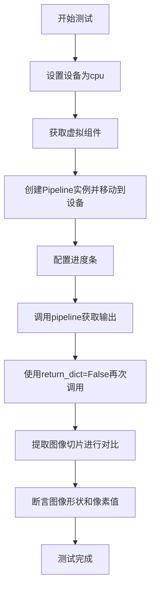

#### 带注释源码

```python
def test_kandinsky_controlnet_img2img(self):
    device = "cpu"  # 设置测试设备为CPU

    # 获取测试所需的虚拟组件 (unet, scheduler, movq)
    components = self.get_dummy_components()

    # 使用组件字典实例化pipeline
    pipe = self.pipeline_class(**components)
    # 将pipeline移至目标设备
    pipe = pipe.to(device)

    # 配置进度条（disable=None表示启用进度条）
    pipe.set_progress_bar_config(disable=None)

    # 调用pipeline进行推理，获取输出
    output = pipe(**self.get_dummy_inputs(device))
    # 提取生成的图像
    image = output.images

    # 再次调用pipeline，使用return_dict=False获取元组结果
    image_from_tuple = pipe(
        **self.get_dummy_inputs(device),
        return_dict=False,
    )[0]

    # 提取图像右下角3x3区域用于验证
    image_slice = image[0, -3:, -3:, -1]
    image_from_tuple_slice = image_from_tuple[0, -3:, -3:, -1]

    # 断言生成的图像形状为 (1, 64, 64, 3)
    assert image.shape == (1, 64, 64, 3)

    # 定义预期像素值切片
    expected_slice = np.array(
        [0.54985034, 0.55509365, 0.52561504, 0.5570494, 0.5593818, 0.5263979, 0.50285643, 0.5069846, 0.51196736]
    )
    
    # 断言图像切片与预期值的差异小于1e-2
    assert np.abs(image_slice.flatten() - expected_slice).max() < 1e-2, (
        f" expected_slice {expected_slice}, but got {image_slice.flatten()}"
    )
    # 断言元组模式输出与预期值的差异小于1e-2
    assert np.abs(image_from_tuple_slice.flatten() - expected_slice).max() < 1e-2, (
        f" expected_slice {expected_slice}, but got {image_from_tuple_slice.flatten()}"
    )
```

---

### `KandinskyV22ControlnetImg2ImgPipelineIntegrationTests.test_kandinsky_controlnet_img2img`

该方法为集成测试，使用真实预训练模型验证控制网图像转换功能，通过比较生成的图像与参考图像的余弦相似度来验证正确性。

参数：
- 无

返回值：无返回值（使用assert进行断言验证）

#### 流程图

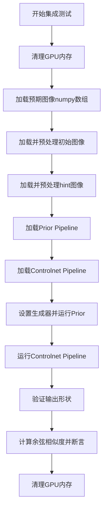

#### 带注释源码

```python
def test_kandinsky_controlnet_img2img(self):
    # 从URL加载预期输出图像
    expected_image = load_numpy(
        "https://huggingface.co/datasets/hf-internal-testing/diffusers-images/resolve/main"
        "/kandinskyv22/kandinskyv22_controlnet_img2img_robotcat_fp16.npy"
    )

    # 加载初始图像并resize到512x512
    init_image = load_image(
        "https://huggingface.co/datasets/hf-internal-testing/diffusers-images/resolve/main/kandinsky/cat.png"
    )
    init_image = init_image.resize((512, 512))

    # 加载hint提示图像
    hint = load_image(
        "https://huggingface.co/datasets/hf-internal-testing/diffusers-images/resolve/main"
        "/kandinskyv22/hint_image_cat.png"
    )
    # 转换为张量并归一化到[0,1]
    hint = torch.from_numpy(np.array(hint)).float() / 255.0
    # 转换为CHW格式并添加batch维度
    hint = hint.permute(2, 0, 1).unsqueeze(0)

    prompt = "A robot, 4k photo"  # 文本提示

    # 加载Prior Pipeline (用于生成图像嵌入)
    pipe_prior = KandinskyV22PriorEmb2EmbPipeline.from_pretrained(
        "kandinsky-community/kandinsky-2-2-prior", 
        torch_dtype=torch.float16  # 使用半精度减少显存
    )
    # 启用CPU卸载以节省显存
    pipe_prior.enable_model_cpu_offload()

    # 加载Controlnet Img2Img Pipeline
    pipeline = KandinskyV22ControlnetImg2ImgPipeline.from_pretrained(
        "kandinsky-community/kandinsky-2-2-controlnet-depth", 
        torch_dtype=torch.float16
    )
    pipeline.enable_model_cpu_offload()

    # 配置进度条
    pipeline.set_progress_bar_config(disable=None)

    # 创建随机生成器确保可复现性
    generator = torch.Generator(device="cpu").manual_seed(0)

    # 运行Prior Pipeline生成图像嵌入
    image_emb, zero_image_emb = pipe_prior(
        prompt,
        image=init_image,
        strength=0.85,           # 转换强度
        generator=generator,
        negative_prompt="",      # 负向提示
        num_inference_steps=5,   # 推理步数
    ).to_tuple()

    # 重置生成器
    generator = torch.Generator(device="cpu").manual_seed(0)
    
    # 运行Controlnet Img2Img Pipeline
    output = pipeline(
        image=init_image,
        image_embeds=image_emb,
        negative_image_embeds=zero_image_emb,
        hint=hint,
        generator=generator,
        num_inference_steps=5,
        height=512,
        width=512,
        strength=0.5,
        output_type="np",
    )

    # 提取生成的图像
    image = output.images[0]

    # 断言输出图像形状
    assert image.shape == (512, 512, 3)

    # 计算预期图像与生成图像的余弦相似度距离
    max_diff = numpy_cosine_similarity_distance(expected_image.flatten(), image.flatten())
    # 断言相似度距离小于阈值
    assert max_diff < 5e-4
```

---

## 文档总结

### 1. 一段话描述
该代码文件是 KandinskyV22 控制网图像到图像转换 pipeline 的单元测试和集成测试套件，验证了使用图像嵌入和提示图像（hint）进行条件图像生成的功能，包括虚拟组件测试和真实预训练模型的端到端验证。

### 2. 文件整体运行流程
```
1. 单元测试流程:
   - 准备虚拟组件 (UNet + VQModel + Scheduler)
   - 生成虚拟输入 (图像嵌入、提示图像、随机种子)
   - 实例化Pipeline并调用
   - 验证输出图像形状和像素值

2. 集成测试流程:
   - 加载真实预训练模型 (Prior + Controlnet)
   - 使用Prior生成图像嵌入
   - 使用Controlnet pipeline生成最终图像
   - 与预期图像进行相似度比较
```

### 3. 类的详细信息

| 类名 | 类型 | 描述 |
|------|------|------|
| `KandinskyV22ControlnetImg2ImgPipelineFastTests` | 测试类 | 快速单元测试类，包含虚拟组件和输入的生成方法 |
| `KandinskyV22ControlnetImg2ImgPipelineIntegrationTests` | 测试类 | 集成测试类，需要GPU环境运行完整模型推理 |

### 4. 关键组件信息

| 组件名称 | 描述 |
|----------|------|
| `UNet2DConditionModel` | 条件UNet模型，用于去噪过程 |
| `VQModel` | 向量量化模型，负责潜在空间的编码解码 |
| `DDIMScheduler` | DDIM调度器，控制去噪采样过程 |
| `KandinskyV22PriorEmb2EmbPipeline` | Prior pipeline，用于生成图像嵌入 |
| `KandinskyV22ControlnetImg2ImgPipeline` | 主pipeline，控制网图像转换 |

### 5. 潜在技术债务与优化空间

1. **测试代码冗余**: `get_dummy_inputs` 在多个测试中被重复调用，可提取为共享fixture
2. **硬编码值**: 预期像素值 `expected_slice` 硬编码在测试中，建议参数化或从配置文件加载
3. **资源清理**: 集成测试包含显式的gc和缓存清理，可考虑使用pytest fixture自动管理
4. **设备兼容性**: MPS设备使用 `torch.manual_seed` 而其他设备使用 `Generator`，行为可能不一致

### 6. 其它项目

- **设计目标**: 验证 Kandinsky 控制网pipeline在CPU和GPU上的正确性
- **约束**: 快速测试使用虚拟模型减小内存占用，集成测试使用真实模型验证效果
- **错误处理**: 使用assert进行验证，失败时抛出具体错误信息
- **外部依赖**: 依赖HuggingFace diffusers库和预训练模型权重


### `Image.fromarray`

将 numpy 数组转换为 PIL Image 对象的函数，这是 Pillow 库提供的图像处理功能，在代码中用于将测试生成的浮点张量数组转换为可操作的 RGB 图像格式。

参数：

- `array`：`numpy.ndarray`，输入的 numpy 数组（代码中通过 `np.uint8(image)` 转换而来），通常包含图像的像素数据
- 无名称参数（模式）：可选，指定图像模式，代码中通过后续 `.convert("RGB")` 处理

返回值：`PIL.Image.Image`，转换后的 PIL 图像对象

#### 流程图

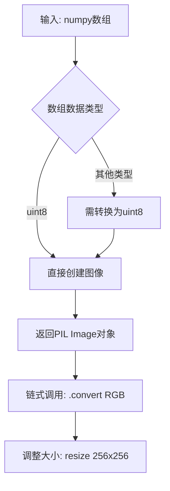

#### 带注释源码

```python
# Image.fromarray 函数调用示例（来自代码第136行）
# 将浮点型张量数组转换为uint8类型，再创建PIL图像
image = floats_tensor((1, 3, 64, 64), rng=random.Random(seed)).to(device)
image = image.cpu().permute(0, 2, 3, 1)[0]  # 从 (1,3,64,64) 变为 (64,64,3)
init_image = Image.fromarray(np.uint8(image)).convert("RGB").resize((256, 256))

# 解释：
# 1. floats_tensor: 生成随机浮点张量 (0-1范围)
# 2. .cpu().permute(0,2,3,1): 转换为 CHW->HWC 格式以适配图像数组
# 3. np.uint8(image): 将浮点数组 (0-1) 转换为 uint8 (0-255)
# 4. Image.fromarray(): 创建PIL Image对象
# 5. .convert("RGB"): 确保图像为RGB模式
# 6. .resize((256, 256)): 调整图像尺寸
```

#### 备注

- 这是一个**外部依赖函数**（来自 Pillow/PIL 库），非本代码库定义
- 代码中使用它将测试生成的张量转换为图像，以便后续管道处理
- 关键点：必须先将浮点数组转换为 `uint8` 类型，否则 `fromarray` 可能产生未预期结果


### DDIMScheduler

这是从diffusers库导入的调度器类，用于DDIM（Denoising Diffusion Implicit Models）采样过程。在代码中，它被实例化并配置用于Kandinsky图像生成pipeline的去噪过程。

参数：

- `num_train_timesteps`：`int`，训练时使用的时间步总数，代码中设为1000
- `beta_schedule`：`str`，beta值的调度方式，代码中设为"linear"
- `beta_start`：`float`，beta_schedule的起始值，代码中设为0.00085
- `beta_end`：`float`，beta_schedule的结束值，代码中设为0.012
- `clip_sample`：`bool`，是否对采样进行裁剪，代码中设为False
- `set_alpha_to_one`：`bool`，是否将alpha设置为1，代码中设为False
- `steps_offset`：`int`，时间步的偏移量，代码中设为0
- `prediction_type`：`str`，预测类型（epsilon或v_prediction），代码中设为"epsilon"
- `thresholding`：`bool`，是否使用阈值处理，代码中设为False

返回值：`DDIMScheduler`实例，用于在扩散模型的推理过程中生成噪声调度

#### 流程图

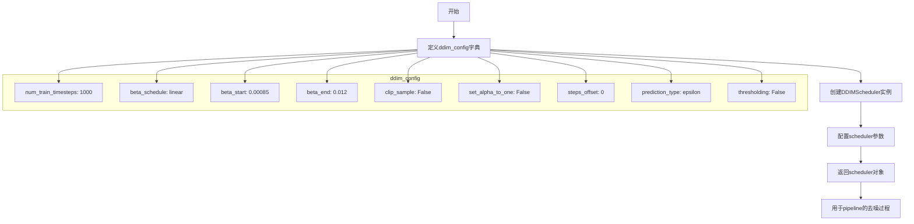

#### 带注释源码

```python
# 定义DDIMScheduler的配置参数字典
ddim_config = {
    # 训练时使用的时间步总数,决定去噪过程的精细程度
    "num_train_timesteps": 1000,
    # beta值的调度方式,linear表示线性调度
    "beta_schedule": "linear",
    # beta_schedule的起始值
    "beta_start": 0.00085,
    # beta_schedule的结束值
    "beta_end": 0.012,
    # 是否对采样结果进行裁剪到[-1,1]范围
    "clip_sample": False,
    # 是否将最后一个alpha值设置为1
    "set_alpha_to_one": False,
    # 时间步的偏移量,用于调整调度
    "steps_offset": 0,
    # 预测类型:'epsilon'预测噪声,'v_prediction'预测v值
    "prediction_type": "epsilon",
    # 是否使用阈值处理来避免生成过亮的像素
    "thresholding": False,
}

# 使用配置参数实例化DDIMScheduler
# DDIMScheduler是扩散模型的采样调度器,用于控制去噪过程的噪声调度
scheduler = DDIMScheduler(**ddim_config)

# 将配置好的scheduler添加到pipeline组件中
components = {
    "unet": unet,          # UNet2DConditionModel,去噪网络
    "scheduler": scheduler, # DDIMScheduler,噪声调度器
    "movq": movq,          # VQModel,VAE解码器
}
```


### `KandinskyV22ControlnetImg2ImgPipeline`

该类是 Kandinsky 2.2 控制网络图像到图像（Img2Img）生成流水线，负责根据图像嵌入、提示和控制线索对图像进行重绘或风格迁移。

注意：提供的代码是测试文件，未包含该类的完整实现源码。该类来自 `diffusers` 库，以下信息基于测试代码中的使用方式推断。

---

#### 参数（基于集成测试中的调用推断）

- `image`：`PIL.Image` 或 `torch.Tensor`，输入图像
- `image_embeds`：`torch.Tensor`，图像嵌入向量，用于指导生成
- `negative_image_embeds`：`torch.Tensor`，负向图像嵌入，用于无分类器指导
- `hint`：`torch.Tensor`，控制网络提示/线索图像
- `generator`：`torch.Generator`，随机数生成器，用于控制生成的可重复性
- `num_inference_steps`：`int`，推理步数，决定去噪迭代次数
- `height`：`int`，输出图像高度
- `width`：`int`，输出图像宽度
- `strength`：`float`，转换强度 (0-1)，控制原始图像与生成图像的混合比例
- `guidance_scale`：`float`，无分类器指导的权重
- `output_type`：`str`，输出类型（如 "np"、"pil"）
- `return_dict`：`bool`，是否返回字典格式结果

#### 返回值

- `output.images`：`List[PIL.Image]` 或 `np.ndarray`，生成的图像列表

---

#### 流程图

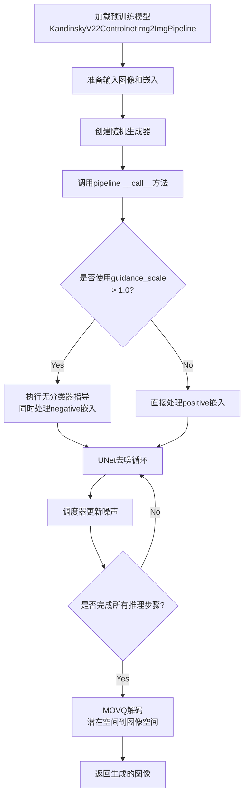

---

#### 带注释源码

```python
# 注意：以下是测试代码中对该类的使用方式，而非类本身的实现源码

# === 快速测试中的使用方式 ===
# 1. 从组件字典创建 pipeline 实例
pipe = self.pipeline_class(**components)  # components 包含 unet, scheduler, movq
pipe = pipe.to(device)

# 2. 调用 pipeline 生成图像
output = pipe(**self.get_dummy_inputs(device))
image = output.images

# 3. 不使用 return_dict 的调用方式
image_from_tuple = pipe(
    **self.get_dummy_inputs(device),
    return_dict=False,
)[0]

# === 集成测试中的使用方式 ===
# 1. 从预训练模型加载
pipeline = KandinskyV22ControlnetImg2ImgPipeline.from_pretrained(
    "kandinsky-community/kandinsky-2-2-controlnet-depth", 
    torch_dtype=torch.float16
)
pipeline.enable_model_cpu_offload()

# 2. 设置进度条
pipeline.set_progress_bar_config(disable=None)

# 3. 创建随机生成器
generator = torch.Generator(device="cpu").manual_seed(0)

# 4. 调用 pipeline 进行图像转换
output = pipeline(
    image=init_image,                    # 输入图像
    image_embeds=image_emb,               # 图像嵌入
    negative_image_embeds=zero_image_emb, # 负向嵌入
    hint=hint,                            # 控制线索
    generator=generator,                  # 随机生成器
    num_inference_steps=5,                # 推理步数
    height=512,                           # 输出高度
    width=512,                            # 输出宽度
    strength=0.5,                         # 转换强度
    output_type="np",                     # 输出类型
)

# 5. 获取生成的图像
image = output.images[0]
```

---

#### 潜在技术债务与优化空间

1. **外部依赖**：该类依赖 `diffusers` 库的具体实现，无法从测试代码中完全了解其内部逻辑
2. **内存管理**：集成测试中手动调用 `gc.collect()` 和 `backend_empty_cache()`，表明可能存在 VRAM 占用问题
3. **模型卸载**：`enable_model_cpu_offload()` 表明大模型在内存受限环境下需要优化

---

#### 备注

由于提供的代码是测试文件，未包含 `KandinskyV22ControlnetImg2ImgPipeline` 类的实际实现（类字段、方法逻辑等）。完整的类定义需要查阅 `diffusers` 库的源代码。


### `KandinskyV22PriorEmb2EmbPipeline`

该类是 Kandinsky 2.2 模型的先验管道（Prior Pipeline），负责将文本提示（prompt）和可选的输入图像转换为图像嵌入向量（image embeddings）。它基于 Diffusion 模型进行图像嵌入的生成，支持 Emb2Emb（Embedding to Embedding）模式，即可以在已有图像嵌入的基础上进行转换和调整。

参数：

-  `prompt`：`str`，文本提示，描述想要生成的图像内容
-  `image`：`PIL.Image.Image` 或 `torch.Tensor`，输入图像，用于基于该图像进行嵌入转换（可选）
-  `strength`：`float`，转换强度，取值范围 0.0 到 1.0，值越大表示对原图像嵌入的改变越大
-  `generator`：`torch.Generator`，随机数生成器，用于控制生成过程的可确定性（可选）
-  `negative_prompt`：`str`，负向文本提示，指定不想生成的内容（可选，默认为空字符串）
-  `num_inference_pipeline`：`int`，推理步数，决定 Diffusion 过程的迭代次数（可选，默认为 20）
-  `height`：`int`，输出图像的高度（可选）
-  `width`：`int`，输出图像的宽度（可选）
-  `guidance_scale`：`float`，引导尺度，控制文本提示对生成结果的影响程度（可选，默认为 1.0）
-  `num_images_per_prompt`：`int`，每个提示生成的图像数量（可选，默认为 1）
-  `output_type`：`str`，输出类型，可选 "pt"（PyTorch tensor）、"np"（NumPy array）或 "pil"（PIL Image）（可选，默认为 "pt"）
-  `return_dict`：`bool`，是否返回字典格式的结果（可选，默认为 True）

返回值：`tuple` 或 `PipelineOutput`，返回包含生成图像嵌入的元组，格式为 `(image_embeds, negative_image_embeds)`，其中 `image_embeds` 是生成的图像嵌入，`negative_image_embeds` 是对应的负向图像嵌入。

#### 流程图

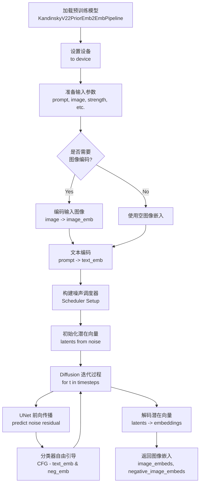

#### 带注释源码

```python
# 集成测试中使用 KandinskyV22PriorEmb2EmbPipeline 的代码示例

# 1. 从预训练模型加载管道
#    - "kandinsky-community/kandinsky-2-2-prior" 是模型在 HuggingFace 上的路径
#    - torch_dtype=torch.float16 指定使用半精度浮点数以节省显存
pipe_prior = KandinskyV22PriorEmb2EmbPipeline.from_pretrained(
    "kandinsky-community/kandinsky-2-2-prior",
    torch_dtype=torch.float16
)

# 2. 启用模型 CPU 卸载
#    - 当模型不在 GPU 上时，自动将不使用的模型参数移到 CPU
pipe_prior.enable_model_cpu_offload()

# 3. 创建确定性随机数生成器
#    - device="cpu" 指定设备
#    - manual_seed(0) 设置种子以确保结果可复现
generator = torch.Generator(device="cpu").manual_seed(0)

# 4. 调用管道生成图像嵌入
#    - prompt: "A robot, 4k photo" - 文本描述
#    - image: init_image - 输入图像（将被编码）
#    - strength: 0.85 - 转换强度（较高值，较大改变）
#    - generator: generator - 确保可确定性
#    - negative_prompt: "" - 空负向提示
#    - num_inference_steps: 5 - 较少推理步数（用于快速测试）
image_emb, zero_image_emb = pipe_prior(
    prompt,
    image=init_image,
    strength=0.85,
    generator=generator,
    negative_prompt="",
    num_inference_steps=5,
).to_tuple()

# 5. 将结果转换为元组格式
#    - 返回两个嵌入向量：
#      * image_emb: 正向图像嵌入（基于 prompt 生成）
#      * zero_image_emb: 零向量嵌入（用于无分类器自由引导）
```


### `UNet2DConditionModel`

UNet2DConditionModel 是 Diffusers 库中的一个核心类，用于构建带有条件嵌入的 2D U-Net 神经网络模型，广泛应用于图像生成、图像到图像翻译以及控制图像生成等任务（如 Stable Diffusion、Kandinsky 等模型）。在代码中，它作为 KandinskyV22ControlnetImg2ImgPipeline 的核心组件之一，负责根据图像嵌入（image_embeds）、提示嵌入（hint）和潜在表示进行去噪预测。

参数：

- `**model_kwargs`：关键字参数，模型配置选项，包含以下关键参数：
  - `in_channels`：`int`，输入通道数，代码中为 8
  - `out_channels`：`int`，输出通道数，代码中为 8
  - `addition_embed_type`：`str`，附加嵌入类型，代码中为 "image_hint"
  - `down_block_types`：`tuple`，下采样块类型，代码中为 ("ResnetDownsampleBlock2D", "SimpleCrossAttnDownBlock2D")
  - `up_block_types`：`tuple`，上采样块类型，代码中为 ("SimpleCrossAttnUpBlock2D", "ResnetUpsampleBlock2D")
  - `mid_block_type`：`str`，中间块类型，代码中为 "UNetMidBlock2DSimpleCrossAttn"
  - `block_out_channels`：`tuple`，块输出通道数，代码中为 (32, 64)
  - `layers_per_block`：`int`，每块的层数，代码中为 1
  - `encoder_hid_dim`：`int`，编码器隐藏维度，代码中为 32
  - `encoder_hid_dim_type`：`str`，编码器隐藏维度类型，代码中为 "image_proj"
  - `cross_attention_dim`：`int`，交叉注意力维度，代码中为 100
  - `attention_head_dim`：`int`，注意力头维度，代码中为 4
  - `resnet_time_scale_shift`：`str`，ResNet 时间尺度移位，代码中为 "scale_shift"
  - `class_embed_type`：`str`，类别嵌入类型，代码中为 None

返回值：`UNet2DConditionModel` 实例，返回一个配置好的 U-Net 2D 条件模型对象，可用于推理或训练。

#### 流程图

```mermaid
flowchart TD
    A[创建 model_kwargs 字典] --> B[调用 UNet2DConditionModel]
    B --> C[初始化编码器嵌入层]
    C --> D[创建下采样块 Down Blocks]
    D --> E[创建中间块 Mid Block]
    E --> F[创建上采样块 Up Blocks]
    F --> G[输出 UNet2DConditionModel 实例]
    
    subgraph "model_kwargs 参数"
    H[in_channels: 8]
    I[out_channels: 8]
    J[addition_embed_type: image_hint]
    K[down_block_types: ...]
    L[up_block_types: ...]
    M[mid_block_type: ...]
    N[block_out_channels: 32, 64]
    O[layers_per_block: 1]
    P[encoder_hid_dim: 32]
    Q[encoder_hid_dim_type: image_proj]
    R[cross_attention_dim: 100]
    S[attention_head_dim: 4]
    T[resnet_time_scale_shift: scale_shift]
    U[class_embed_type: None]
    end
    
    A --> H
    A --> I
    A --> J
    A --> K
    A --> L
    A --> M
    A --> N
    A --> O
    A --> P
    A --> Q
    A --> R
    A --> S
    A --> T
    A --> U
```

#### 带注释源码

```python
# 在测试类中定义 dummy_unet 属性，用于创建测试用的 UNet2DConditionModel 实例
@property
def dummy_unet(self):
    # 设置随机种子以确保可重复性
    torch.manual_seed(0)

    # 定义模型配置参数字典
    model_kwargs = {
        "in_channels": 8,  # 输入通道数：8（潜在空间为4通道，hint为3通道，image_emb为1通道等组合）
        
        # 输出通道数：8（预测均值和方差，用于扩散模型的去噪预测）
        "out_channels": 8,
        
        # 附加嵌入类型：image_hint（支持图像提示/控制信号）
        "addition_embed_type": "image_hint",
        
        # 下采样块类型：包含 ResNet 下采样块和带交叉注意力的简单块
        "down_block_types": ("ResnetDownsampleBlock2D", "SimpleCrossAttnDownBlock2D"),
        
        # 上采样块类型：包含带交叉注意力的简单块和 ResNet 上采样块
        "up_block_types": ("SimpleCrossAttnUpBlock2D", "ResnetUpsampleBlock2D"),
        
        # 中间块类型：带简单交叉注意力的 UNet 中间块
        "mid_block_type": "UNetMidBlock2DSimpleCrossAttn",
        
        # 块输出通道数：(32, 64)，对应不同分辨率的块
        "block_out_channels": (self.block_out_channels_0, self.block_out_channels_0 * 2),
        
        # 每块的层数：1
        "layers_per_block": 1,
        
        # 编码器隐藏维度：32（对应文本/图像嵌入的维度）
        "encoder_hid_dim": self.text_embedder_hidden_size,
        
        # 编码器隐藏维度类型：image_proj（图像投影类型）
        "encoder_hid_dim_type": "image_proj",
        
        # 交叉注意力维度：100
        "cross_attention_dim": self.cross_attention_dim,
        
        # 注意力头维度：4
        "attention_head_dim": 4,
        
        # ResNet 时间尺度移位：scale_shift（用于残差块的时间条件嵌入）
        "resnet_time_scale_shift": "scale_shift",
        
        # 类别嵌入类型：None（不使用类别嵌入）
        "class_embed_type": None,
    }

    # 使用配置参数创建 UNet2DConditionModel 模型实例
    model = UNet2DConditionModel(**model_kwargs)
    return model
```


### VQModel

这是用于创建变分量化（VQ-VAE）模型实例的属性方法，主要为Kandinsky图像处理管道提供图像编码器和解码器组件。

参数：

- `self`：隐式参数，PipelineTesterMixin的实例

返回值：`VQModel`，返回配置好的VQModel模型实例，用于图像的量化编码和解码

#### 流程图

```mermaid
flowchart TD
    A[开始] --> B[设置随机种子 torch.manual_seed(0)]
    B --> C[获取dummy_movq_kwargs配置字典]
    C --> D[创建VQModel实例: VQModel kwargs=dummy_movq_kwargs]
    D --> E[返回VQModel模型对象]
```

#### 带注释源码

```
@property
def dummy_movq(self):
    """
    创建并返回一个用于测试的虚拟VQModel（变分量化模型）实例。
    VQModel是diffusers库中的图像量化组件,通常用于VQ-VAE架构中。
    """
    # 设置随机种子以确保测试可重复性
    torch.manual_seed(0)
    
    # 使用预定义的配置参数创建VQModel模型
    # 配置包含编码器/解码器的结构、通道数、VQ嵌入维度等
    model = VQModel(**self.dummy_movq_kwargs)
    
    # 返回配置好的模型实例,供后续测试使用
    return model

@property
def dummy_movq_kwargs(self):
    """
    定义VQModel的构造函数参数配置。
    这些参数决定了模型的架构:编码器结构、解码器结构、通道数等。
    """
    return {
        # 解码器/编码器块输出通道数配置
        "block_out_channels": [32, 32, 64, 64],
        
        # 编码器块类型列表(从低层到高层)
        "down_block_types": [
            "DownEncoderBlock2D",       # 标准下采样编码块
            "DownEncoderBlock2D",       
            "DownEncoderBlock2D",       
            "AttnDownEncoderBlock2D",   # 带注意力机制的下采样编码块
        ],
        
        # 输入图像通道数 (RGB=3)
        "in_channels": 3,
        
        # 潜在空间的通道数 (VQ-VAE的latent维度)
        "latent_channels": 4,
        
        # 每个块中的层数
        "layers_per_block": 1,
        
        # 归一化组数,用于组归一化
        "norm_num_groups": 8,
        
        # 归一化类型
        "norm_type": "spatial",
        
        # VQ码本中嵌入向量的数量
        "num_vq_embeddings": 12,
        
        # 输出图像通道数
        "out_channels": 3,
        
        # 解码器块类型列表
        "up_block_types": [
            "AttnUpDecoderBlock2D",    # 带注意力上采样解码块
            "UpDecoderBlock2D",        # 标准上采样解码块
            "UpDecoderBlock2D",        
            "UpDecoderBlock2D",        
        ],
        
        # VQ嵌入的维度
        "vq_embed_dim": 4,
    }
```


### `backend_empty_cache`

清理 GPU/后端缓存，释放 VRAM 内存，用于在测试前后清理显存，防止内存泄漏。

参数：

-  `device`：`str` 或 `torch.device`，指定要清理缓存的设备（通常为 CUDA 设备）

返回值：`None`，无返回值

#### 流程图

```mermaid
flowchart TD
    A[开始] --> B{检查设备类型}
    B -->|CUDA 设备| C[调用 torch.cuda.empty_cache 清理 CUDA 缓存]
    B -->|CPU 设备| D[无需操作]
    B -->|其他设备| E[调用对应后端的缓存清理方法]
    C --> F[返回 None]
    D --> F
    E --> F
```

#### 带注释源码

```
# 这是一个从 testing_utils 导入的函数
# 下面是根据使用方式推断的可能的实现

def backend_empty_cache(device):
    """
    清理后端缓存，释放 GPU 显存
    
    参数:
        device: torch 设备对象或字符串，如 'cuda', 'cuda:0', 'cpu' 等
    """
    import torch
    
    # 检查是否为 CUDA 设备
    if torch.cuda.is_available() and (
        isinstance(device, str) and 'cuda' in device or 
        hasattr(device, 'type') and device.type == 'cuda'
    ):
        # 清理 CUDA 缓存，释放未使用的 GPU 显存
        torch.cuda.empty_cache()
    
    # 可选：如果是 MPS (Apple Silicon) 设备，也可能需要清理
    # if hasattr(torch.mps, 'empty_cache'):
    #     torch.mps.empty_cache()
    
    return None
```

---

**注意**：由于 `backend_empty_cache` 是从外部模块 `testing_utils` 导入的，其实际源代码未在当前代码文件中提供。以上是根据函数在 `setUp` 和 `tearDown` 方法中的使用方式（接收 `torch_device` 参数，用于清理 VRAM）推断的可能实现。实际实现可能略有不同。


### `enable_full_determinism`

该函数用于在测试环境中启用完全确定性，通过设置全局随机种子（Python random、NumPy、PyTorch）确保测试结果的可重复性。

参数：

- 无

返回值：`None`，无返回值

#### 流程图

```mermaid
flowchart TD
    A[开始] --> B[设置 random 模块随机种子为固定值]
    B --> C[设置 numpy 随机种子为固定值]
    C --> D[设置 PyTorch 手动随机种子为固定值]
    D --> E[启用 PyTorch CUDA deterministc 算法]
    E --> F[启用 PyTorch CUDA benchmark 为 False]
    F --> G[结束]
```

#### 带注释源码

```python
def enable_full_determinism(seed: int = 0, deterministic: bool = True):
    """
    启用完全确定性运行模式，确保测试结果可复现。
    
    参数:
        seed: 随机种子值，默认为 0，用于初始化所有随机数生成器
        deterministic: 是否强制使用确定性算法，默认为 True
    
    返回值:
        无返回值
    
    实现说明:
        - 设置 random 模块的全局随机种子
        - 设置 NumPy 的全局随机种子
        - 设置 PyTorch 的手动随机种子（CPU）
        - 如果可用，设置 CUDA 相关确定性选项
        - 禁用 PyTorch 的 CUDA benchmark 以确保确定性
    """
    # 设置 Python 内置 random 模块的随机种子
    random.seed(seed)
    
    # 设置 NumPy 的全局随机种子
    np.random.seed(seed)
    
    # 设置 PyTorch CPU 的随机种子
    torch.manual_seed(seed)
    
    # 如果 CUDA 可用，设置 CUDA 相关确定性选项
    if torch.cuda.is_available():
        # 启用确定性算法，确保相同输入产生相同输出
        torch.cuda.manual_seed_all(seed)
        # 强制使用确定性算法（非最优性能但可复现）
        torch.backends.cudnn.deterministic = deterministic
        # 禁用 benchmark，关闭 CUDA 自动优化以确保确定性
        torch.backends.cudnn.benchmark = False
```


### `floats_tensor`

该函数是一个测试辅助工具，用于生成指定形状的随机浮点数张量，常用于 Diffusion 模型的单元测试中以创建虚拟输入数据。

参数：

- `shape`：`tuple`，表示张量的形状（例如 `(1, 32, 32, 3)`）
- `rng`：`random.Random`，Python 随机数生成器实例，用于控制随机性

返回值：`torch.Tensor`，包含随机浮点数的 PyTorch 张量

#### 流程图

由于该函数为外部工具函数，其核心流程较为简单，以下为基于使用推断的流程图：

```mermaid
graph TD
A[输入形状和随机数生成器] --> B[根据形状生成随机数序列]
B --> C[转换为NumPy数组]
C --> D[reshape为指定形状]
D --> E[转换为PyTorch张量]
E --> F[返回张量]
```

#### 带注释源码

由于 `floats_tensor` 函数定义在外部模块 `testing_utils` 中，未在当前代码文件中提供实际源码。以下为基于使用方式和常见模式推断的可能实现：

```python
# 伪代码，基于对floats_tensor的调用推断
def floats_tensor(shape, rng):
    """
    生成一个指定形状的随机浮点张量。
    
    参数:
        shape: 张量的形状元组，如 (1, 32)
        rng: random.Random 实例，用于生成随机数
    
    返回:
        torch.Tensor: 随机浮点张量
    """
    # 计算总元素数量
    total_elements = 1
    for dim in shape:
        total_elements *= dim
    
    # 使用随机数生成器生成随机浮点数列表
    # rng.random() 生成 [0.0, 1.0) 之间的随机浮点数
    random_values = [rng.random() for _ in range(total_elements)]
    
    # 转换为NumPy数组并reshape为指定形状
    import numpy as np
    array = np.array(random_values, dtype=np.float32).reshape(shape)
    
    # 转换为PyTorch张量并返回
    import torch
    return torch.from_numpy(array)
```

**注意**：该源码为基于使用的推测实现，实际实现可能有所不同，例如直接使用 `torch.randn` 并通过 RNG 设置种子，但考虑到传入了 RNG，优先使用 RNG 生成随机数。


### `load_image`

该函数是一个测试工具函数，用于从指定路径（本地路径或URL）加载图像并返回PIL Image对象。

参数：

-  `image_path`：`str`，图像的路径，可以是本地路径或URL

返回值：`PIL.Image.Image`，加载后的PIL图像对象

#### 流程图

```mermaid
graph TD
    A[开始] --> B{判断路径类型}
    B -->|URL| C[发起HTTP请求下载图像]
    B -->|本地路径| D[从本地读取图像文件]
    C --> E[将图像转换为PIL Image对象]
    D --> E
    E --> F[返回PIL Image对象]
```

#### 带注释源码

由于`load_image`函数是從 `...testing_utils` 模块导入的外部函数，并未在该代码文件中直接定义，因此无法提供其完整源代码。以下为基于使用方式的合理推断：

```python
# 源代码位置：diffusers库的testing_utils模块
# 此处为推断的实现方式

import requests
from PIL import Image
from io import BytesIO

def load_image(image_path: str) -> Image.Image:
    """
    从指定路径加载图像
    
    参数:
        image_path: 图像路径，支持本地路径和URL
        
    返回:
        PIL Image对象
    """
    # 判断是否为URL
    if image_path.startswith(("http://", "https://")):
        # 如果是URL，从网络下载
        response = requests.get(image_path)
        image = Image.open(BytesIO(response.content))
    else:
        # 如果是本地路径，直接打开
        image = Image.open(image_path)
    
    # 转换为RGB模式
    if image.mode != "RGB":
        image = image.convert("RGB")
    
    return image
```

**注**：该函数在代码中的两次使用示例：
1. `load_image("https://huggingface.co/datasets/hf-internal-testing/diffusers-images/resolve/main/kandinsky/cat.png")`
2. `load_image("https://huggingface.co/datasets/hf-internal-testing/diffusers-images/resolve/main/kandinskyv22/hint_image_cat.png")`


### `load_numpy`

从远程URL或本地文件路径加载NumPy数组（.npy格式）的工具函数。该函数通常用于加载测试用的参考图像数据，支持从HuggingFace Hub等远程源下载并解析为NumPy数组。

参数：

-  `url_or_path`：`str`，远程URL字符串或本地文件路径，指向.npy文件

返回值：`numpy.ndarray`，加载的NumPy数组数据

#### 流程图

```mermaid
flowchart TD
    A[开始] --> B{判断输入是URL还是文件路径}
    B -->|URL| C[下载文件到临时目录]
    B -->|本地路径| D[直接读取文件]
    C --> E[使用np.load加载.npy文件]
    D --> E
    E --> F[返回NumPy数组]
```

#### 带注释源码

由于 `load_numpy` 函数定义在 `testing_utils` 模块中（通过 `from ...testing_utils import load_numpy` 导入），非本文件定义，因此无法直接提供其源码。以下为基于使用方式的推断：

```python
def load_numpy(url_or_path: str) -> np.ndarray:
    """
    从URL或本地路径加载NumPy数组
    
    参数:
        url_or_path: 远程URL或本地文件路径，指向.npy文件
        
    返回:
        加载的NumPy数组
    """
    # 可能的实现逻辑：
    # 1. 判断输入是URL还是本地路径
    # 2. 如果是URL，下载到临时目录
    # 3. 使用numpy.load()加载数据
    # 4. 返回数组
    pass
```

**实际使用示例（来自代码）：**

```python
# 从HuggingFace Hub加载参考图像用于集成测试
expected_image = load_numpy(
    "https://huggingface.co/datasets/hf-internal-testing/diffusers-images/resolve/main"
    "/kandinskyv22/kandinskyv22_controlnet_img2img_robotcat_fp16.npy"
)
```

---

> **注意**：该函数来源于 `diffusers` 库的 `testing_utils` 模块，位于项目目录的 `src/diffusers/testing_utils.py`（具体路径取决于项目结构），建议查阅源文件获取完整实现。


### `KandinskyV22ControlnetImg2ImgPipelineIntegrationTests.test_kandinsky_controlnet_img2img`

这是一个集成测试方法，使用 `@nightly` 装饰器标记，用于测试 KandinskyV22 控制网图像到图像管道的端到端功能。测试加载预训练模型，执行推理，并验证输出图像与预期结果的一致性。

参数：

- `self`：隐式参数，测试类实例本身

返回值：无（测试方法，通过断言验证结果）

#### 流程图

```mermaid
flowchart TD
    A[开始测试] --> B[清理VRAM - setUp]
    B --> C[加载预期图像 numpy]
    C --> D[加载并resize初始图像 512x512]
    D --> E[加载hint图像并预处理]
    E --> F[加载Kandinsky Prior管道 - float16]
    F --> G[启用CPU offload]
    G --> H[加载Controlnet Img2Img管道 - float16]
    H --> I[启用CPU offload]
    I --> J[设置进度条]
    J --> K[创建随机种子生成器]
    K --> L[执行Prior管道获取image_embeds]
    L --> M[创建新的随机生成器]
    M --> N[执行Controlnet Img2Img管道]
    N --> O[提取输出图像]
    O --> P{验证图像形状 == 512x512x3}
    P --> Q[计算cosine similarity distance]
    Q --> R{最大差异 < 5e-4?}
    R -->|是| S[测试通过]
    R -->|否| T[断言失败]
    S --> U[清理VRAM - tearDown]
    T --> U
    U[结束测试]
```

#### 带注释源码

```python
@nightly  # 标记为夜间测试，仅在特定条件下运行
@require_torch_accelerator  # 需要CUDA加速器
class KandinskyV22ControlnetImg2ImgPipelineIntegrationTests(unittest.TestCase):
    """KandinskyV22控制网图像到图像管道的集成测试类"""
    
    def setUp(self):
        """每个测试前清理VRAM内存"""
        # clean up the VRAM before each test
        super().setUp()
        gc.collect()  # 强制垃圾回收
        backend_empty_cache(torch_device)  # 清空GPU缓存

    def tearDown(self):
        """每个测试后清理VRAM内存"""
        # clean up the VRAM after each test
        super().tearDown()
        gc.collect()
        backend_empty_cache(torch_device)

    def test_kandinsky_controlnet_img2img(self):
        """测试 Kandinsky 控制网图像到图像生成功能"""
        # 从远程URL加载预期的numpy图像数据
        expected_image = load_numpy(
            "https://huggingface.co/datasets/hf-internal-testing/diffusers-images/resolve/main"
            "/kandinskyv22/kandinskyv22_controlnet_img2img_robotcat_fp16.npy"
        )

        # 加载初始图像（猫图片）并resize到512x512
        init_image = load_image(
            "https://huggingface.co/datasets/hf-internal-testing/diffusers-images/resolve/main/kandinsky/cat.png"
        )
        init_image = init_image.resize((512, 512))

        # 加载hint图像（用于控制网的条件输入）
        hint = load_image(
            "https://huggingface.co/datasets/hf-internal-testing/diffusers-images/resolve/main"
            "/kandinskyv22/hint_image_cat.png"
        )
        # 将PIL图像转换为torch tensor并归一化到[0,1]
        hint = torch.from_numpy(np.array(hint)).float() / 255.0
        # 调整维度顺序为[C, H, W]并添加batch维度
        hint = hint.permute(2, 0, 1).unsqueeze(0)

        # 文本提示
        prompt = "A robot, 4k photo"

        # 加载Prior管道（用于生成图像embeddings）
        pipe_prior = KandinskyV22PriorEmb2EmbPipeline.from_pretrained(
            "kandinsky-community/kandinsky-2-2-prior", torch_dtype=torch.float16
        )
        pipe_prior.enable_model_cpu_offload()  # 启用CPU offload以节省VRAM

        # 加载Controlnet Img2Img管道
        pipeline = KandinskyV22ControlnetImg2ImgPipeline.from_pretrained(
            "kandinsky-community/kandinsky-2-2-controlnet-depth", torch_dtype=torch.float16
        )
        pipeline.enable_model_cpu_offload()

        # 配置进度条显示
        pipeline.set_progress_bar_config(disable=None)

        # 创建随机数生成器确保可复现性
        generator = torch.Generator(device="cpu").manual_seed(0)

        # 通过Prior管道生成图像embeddings
        # emb2emb方式：使用图像作为输入而非文本
        image_emb, zero_image_emb = pipe_prior(
            prompt,
            image=init_image,
            strength=0.85,  # 图像变换强度
            generator=generator,
            negative_prompt="",  # 负向提示
            num_inference_steps=5,  # 推理步数
        ).to_tuple()  # 获取元组格式输出

        # 创建新的生成器（重新设置种子）
        generator = torch.Generator(device="cpu").manual_seed(0)
        
        # 执行主要的Controlnet Img2Img管道
        output = pipeline(
            image=init_image,
            image_embeds=image_emb,  # 从prior得到的图像embedding
            negative_image_embeds=zero_image_emb,  # 空embedding作为负向
            hint=hint,  # 控制网hint条件
            generator=generator,
            num_inference_steps=5,
            height=512,
            width=512,
            strength=0.5,  # img2img变换强度
            output_type="np",  # 输出numpy数组
        )

        # 提取生成的图像
        image = output.images[0]

        # 断言：验证输出图像尺寸正确
        assert image.shape == (512, 512, 3)

        # 计算预期图像与生成图像的余弦相似度距离
        max_diff = numpy_cosine_similarity_distance(expected_image.flatten(), image.flatten())
        
        # 断言：验证生成质量（最大差异应小于阈值）
        assert max_diff < 5e-4
```


### `numpy_cosine_similarity_distance`

这是一个用于计算两个numpy数组之间余弦相似度距离的测试工具函数。在给定代码中用于比较生成的图像与预期图像之间的差异。

参数：

- `x`：`numpy.ndarray`，第一个输入数组（通常为展平的图像像素数据）
- `y`：`numpy.ndarray`，第二个输入数组（通常为展平的图像像素数据）

返回值：`float`，返回两个向量之间的余弦距离（范围0到2，0表示完全相同，2表示完全相反）

#### 流程图

```mermaid
flowchart TD
    A[开始] --> B[输入两个numpy数组 x 和 y]
    B --> C[将数组展平为一维向量]
    C --> D[计算向量x的L2范数]
    D --> E[计算向量y的L2范数]
    E --> F[计算x和y的点积]
    F --> G[计算余弦相似度: cos_sim = dot_product / (norm_x * norm_y)]
    G --> H[计算余弦距离: distance = 1 - cos_sim]
    H --> I[返回distance]
```

#### 带注释源码

```python
def numpy_cosine_similarity_distance(x: np.ndarray, y: np.ndarray) -> float:
    """
    计算两个numpy数组之间的余弦相似度距离。
    
    余弦距离 = 1 - 余弦相似度
    余弦相似度 = (x · y) / (||x|| * ||y||)
    
    参数:
        x: 第一个numpy数组
        y: 第二个numpy数组
    
    返回:
        float: 余弦距离值，范围[0, 2]
              0表示完全相同（余弦相似度为1）
              2表示完全相反（余弦相似度为-1）
    """
    # 确保输入为numpy数组
    x = np.asarray(x)
    y = np.asarray(y)
    
    # 展平为1D向量（如果输入是多维的）
    x = x.flatten()
    y = y.flatten()
    
    # 计算L2范数（欧几里得范数）
    x_norm = np.linalg.norm(x)
    y_norm = np.linalg.norm(y)
    
    # 避免除零错误
    if x_norm == 0 or y_norm == 0:
        return 1.0  # 如果任一向量为零向量，返回最大距离
    
    # 计算点积
    dot_product = np.dot(x, y)
    
    # 计算余弦相似度
    cosine_similarity = dot_product / (x_norm * y_norm)
    
    # 计算余弦距离（1 - 余弦相似度）
    cosine_distance = 1.0 - cosine_similarity
    
    return float(cosine_distance)
```

> **注意**：由于该函数定义在 `...testing_utils` 模块中（代码中通过 `from ...testing_utils import numpy_cosine_similarity_distance` 导入），上述源码是基于函数名和用途的推断实现，实际实现可能略有不同。


### `require_torch_accelerator`

该函数是一个测试装饰器，用于检查当前环境是否支持PyTorch加速器（如CUDA GPU）。如果不支持，被装饰的测试或测试类将被跳过。

参数：暂无（作为装饰器使用，无需显式参数）

返回值：`function`，返回装饰后的测试函数，如果加速器不可用则跳过测试

#### 流程图

```mermaid
graph TD
    A[测试执行] --> B{检查torch加速器是否可用}
    B -->|是| C[执行测试逻辑]
    B -->|否| D[跳过测试]
    C --> E[返回测试结果]
    D --> F[输出跳过信息]
```

#### 带注释源码

```
# 源码未在当前文件中定义
# 该函数从 ...testing_utils 模块导入
# 典型实现类似如下（基于常见模式）：

def require_torch_accelerator(func):
    """
    装饰器：检查是否有可用的PyTorch加速器（GPU）。
    如果没有，测试将被跳过。
    """
    def wrapper(*args, **kwargs):
        if not torch.cuda.is_available() and not torch.backends.mps.is_available():
            raise unittest.SkipTest("Test requires GPU accelerator")
        return func(*args, **kwargs)
    return wrapper

# 在代码中的使用方式：
@require_torch_accelerator
class KandinskyV22ControlnetImg2ImgPipelineIntegrationTests(unittest.TestCase):
    # ...
```


### `torch_device`

获取当前 PyTorch 可用设备的函数，返回最合适的设备（如 CUDA、CPU 或 MPS）。

参数： 无

返回值：`str`，返回当前 PyTorch 设备的字符串表示（如 `"cuda"`、`"cpu"` 或 `"mps"`）。

#### 流程图

```mermaid
flowchart TD
    A[开始] --> B{检查CUDA是否可用}
    B -->|是| C[返回'cuda']
    B -->|否| D{检查MPS是否可用}
    D -->|是| E[返回'mps']
    D -->|否| F[返回'cpu']
```

#### 带注释源码

```python
# torch_device 是从 testing_utils 模块导入的函数
# 位于 diffusers 库的测试工具中
# 下面是基于常见实现的推断代码

import torch

def torch_device() -> str:
    """
    获取当前可用的 PyTorch 设备。
    
    优先级顺序：
    1. CUDA (GPU) - 如果可用且配置正确
    2. MPS (Apple Silicon GPU) - 如果在 Mac 上可用
    3. CPU - 默认回退选项
    
    Returns:
        str: 设备字符串，'cuda'、'mps' 或 'cpu'
    """
    # 检查 CUDA 是否可用
    if torch.cuda.is_available():
        return "cuda"
    
    # 检查 MPS (Apple Silicon) 是否可用
    # torch.backends.mps.is_available() 在 PyTorch 1.12+ 支持
    try:
        if hasattr(torch.backends, 'mps') and torch.backends.mps.is_available():
            return "mps"
    except (AttributeError, Exception):
        pass
    
    # 默认返回 CPU
    return "cpu"
```

> **注意**：由于 `torch_device` 是从外部模块 `testing_utils` 导入的，上述源码是基于 diffusers 库中常见实现的推断。实际实现可能包含更多配置选项，如环境变量控制、测试标志等。


### `KandinskyV22ControlnetImg2ImgPipelineFastTests.text_embedder_hidden_size`

该属性方法用于返回文本嵌入器的隐藏层大小（hidden size），在测试中作为虚拟UNet模型的`encoder_hid_dim`参数。

参数：无

返回值：`int`，返回文本嵌入器的隐藏层大小，值为32。

#### 流程图

```mermaid
flowchart TD
    A[调用 text_embedder_hidden_size 属性] --> B{返回属性值}
    B --> C[返回整数值 32]
```

#### 带注释源码

```python
@property
def text_embedder_hidden_size(self):
    """
    返回文本嵌入器的隐藏层大小。
    
    该属性用于测试KandinskyV22ControlnetImg2ImgPipeline时，
    作为虚拟UNet模型的encoder_hid_dim参数。
    """
    return 32
```


### `KandinskyV22ControlnetImg2ImgPipelineFastTests.time_input_dim`

这是一个属性方法，用于返回时间输入维度的大小。在测试用例中，该属性返回固定值32，用于配置UNet模型的時間嵌入维度。

参数： 无

返回值：`int`，返回时间输入维度的大小，固定值为32。

#### 流程图

```mermaid
flowchart TD
    A[开始] --> B{获取time_input_dim属性}
    B --> C[返回常量值: 32]
    C --> D[结束]
```

#### 带注释源码

```python
@property
def time_input_dim(self):
    """
    返回时间输入维度的大小。
    
    该属性用于配置UNet模型的时间嵌入相关参数。
    在测试环境中，固定返回32作为测试维度。
    该值被用于:
    - block_out_channels_0 属性计算
    - time_embed_dim 属性计算 (time_input_dim * 4)
    
    Returns:
        int: 时间输入维度的大小，固定值为32
    """
    return 32
```


### `KandinskyV22ControlnetImg2ImgPipelineFastTests.block_out_channels_0`

这是一个属性（property）方法，用于返回 UNet 模型块输出通道数的基准值。该属性为测试用例提供模拟 UNet 模型的块输出通道配置，是构建虚拟模型的关键参数之一，直接影响模型的输入输出维度设计。

参数： 无（这是一个属性访问器，不接受外部参数）

返回值： `int`，返回 `self.time_input_dim` 的值（整数类型），即 UNet 模型第一个下采样块的输出通道数基准值。

#### 流程图

```mermaid
flowchart TD
    A[属性访问 block_out_channels_0] --> B{返回 time_input_dim}
    B --> C[time_input_dim 属性返回 32]
    C --> D[返回整数值 32]
```

#### 带注释源码

```python
@property
def block_out_channels_0(self):
    """
    属性：block_out_channels_0
    
    描述：
        返回 UNet 模型块输出通道数的基准值。
        该属性对应 time_input_dim 属性，返回值为 32。
        在创建虚拟（dummy）UNet2DConditionModel 时使用此值
        来配置 down_block 和 up_block 的通道数。
    
    返回值：
        int: 返回 self.time_input_dim 的值，当前为 32
    """
    return self.time_input_dim
```


### `KandinskyV22ControlnetImg2ImgPipelineFastTests.time_embed_dim`

这是一个属性方法（property），用于返回时间嵌入维度（time embedding dimension）。在 UNet2DConditionModel 的配置中，时间嵌入维度通常设置为时间输入维度的4倍，用于增强模型的表达能力。

参数： 无

返回值：`int`，返回时间嵌入维度，值为 `self.time_input_dim * 4`（即 32 * 4 = 128）。

#### 流程图

```mermaid
flowchart TD
    A[访问 time_embed_dim 属性] --> B{获取 time_input_dim}
    B --> C[返回 time_input_dim 的值]
    C --> D[计算 time_input_dim * 4]
    D --> E[返回结果 128]
```

#### 带注释源码

```python
@property
def time_embed_dim(self):
    """
    属性方法：返回时间嵌入维度（time embedding dimension）
    
    在扩散模型的 UNet 结构中，时间嵌入（time embedding）用于将时间步信息编码到模型中。
    通常将时间嵌入维度设置为时间输入维度的4倍，以提供足够的表达能力来处理时间信息。
    
    返回值:
        int: 时间嵌入维度，等于 time_input_dim * 4
    """
    return self.time_input_dim * 4
```


### `KandinskyV22ControlnetImg2ImgPipelineFastTests.cross_attention_dim`

该属性方法定义了Kandinsky V2.2控制网络图像到图像管道的交叉注意力维度，用于控制UNet模型中交叉注意力层的维度大小。

参数：

- `self`：`KandinskyV22ControlnetImg2ImgPipelineFastTests`（隐式参数），当前测试类实例

返回值：`int`，返回交叉注意力维度值100，用于配置UNet模型的cross_attention_dim参数

#### 流程图

```mermaid
flowchart TD
    A[开始] --> B[获取self实例]
    B --> C[返回常量值100]
    C --> D[结束]
    
    subgraph 属性调用流程
    E[测试类实例访问cross_attention_dim属性] --> F[触发@property装饰器]
    F --> G[执行cross_attention_dim方法]
    G --> H[返回100作为cross_attention_dim]
    end
```

#### 带注释源码

```python
@property
def cross_attention_dim(self):
    """
    属性方法：获取交叉注意力维度
    
    该属性定义了Kandinsky V2.2控制网络图像到图像管道中
    UNet模型的交叉注意力层维度。在测试中用于创建
    虚拟（dummy）UNet模型时传入cross_attention_dim参数。
    
    返回值:
        int: 交叉注意力维度值，当前固定返回100
    """
    return 100
```

#### 相关使用上下文

该属性在 `dummy_unet` 属性方法中被使用：

```python
@property
def dummy_unet(self):
    # ... 其他配置 ...
    model_kwargs = {
        # ... 其他参数 ...
        "cross_attention_dim": self.cross_attention_dim,  # 使用该属性值100
        "attention_head_dim": 4,
        # ...
    }
    model = UNet2DConditionModel(**model_kwargs)
    return model
```

该属性是测试配置的一部分，用于创建符合Kandinsky V2.2架构的虚拟UNet模型，以便进行管道功能测试。


### `KandinskyV22ControlnetImg2ImgPipelineFastTests.dummy_unet`

这是一个测试类中的属性方法，用于创建虚拟的 UNet2DConditionModel 模型对象，该模型用于测试 KandinskyV22ControlnetImg2ImgPipeline 的功能。

参数： 无（通过 `self` 访问类属性）

返回值：`UNet2DConditionModel`，返回一个配置好的虚拟 UNet 模型对象，用于单元测试

#### 流程图

```mermaid
flowchart TD
    A[开始 dummy_unet] --> B[设置随机种子 torch.manual_seed 0]
    B --> C[构建 model_kwargs 字典]
    C --> D[配置输入输出通道数: in_channels=8, out_channels=8]
    D --> E[配置 addition_embed_type='image_hint']
    E --> F[配置下采样和上采样块类型]
    F --> G[从类属性获取 block_out_channels, text_embedder_hidden_size, cross_attention_dim]
    G --> H[创建 UNet2DConditionModel 实例]
    H --> I[返回 model 对象]
```

#### 带注释源码

```python
@property
def dummy_unet(self):
    """创建一个用于测试的虚拟 UNet2DConditionModel 模型"""
    
    # 设置随机种子以确保测试可重复性
    torch.manual_seed(0)

    # 定义模型配置参数
    model_kwargs = {
        "in_channels": 8,  # 输入通道数
        # 输出通道数是输入通道数的两倍，因为预测均值和方差
        "out_channels": 8,
        # 添加嵌入类型为图像提示类型
        "addition_embed_type": "image_hint",
        # 下采样块类型：ResNet下采样块和简单交叉注意力下采样块
        "down_block_types": ("ResnetDownsampleBlock2D", "SimpleCrossAttnDownBlock2D"),
        # 上采样块类型：简单交叉注意力上采样块和ResNet上采样块
        "up_block_types": ("SimpleCrossAttnUpBlock2D", "ResnetUpsampleBlock2D"),
        # 中间块类型：带简单交叉注意力的UNet中间块
        "mid_block_type": "UNetMidBlock2DSimpleCrossAttn",
        # 块输出通道数：从类属性获取
        "block_out_channels": (self.block_out_channels_0, self.block_out_channels_0 * 2),
        # 每个块的层数
        "layers_per_block": 1,
        # 编码器隐藏维度：从类属性获取
        "encoder_hid_dim": self.text_embedder_hidden_size,
        # 编码器隐藏维度类型
        "encoder_hid_dim_type": "image_proj",
        # 交叉注意力维度：从类属性获取
        "cross_attention_dim": self.cross_attention_dim,
        # 注意力头维度
        "attention_head_dim": 4,
        # ResNet时间尺度偏移方式
        "resnet_time_scale_shift": "scale_shift",
        # 类别嵌入类型为空
        "class_embed_type": None,
    }

    # 使用配置参数创建 UNet2DConditionModel 实例
    model = UNet2DConditionModel(**model_kwargs)
    # 返回创建的模型对象
    return model
```


### `KandinskyV22ControlnetImg2ImgPipelineFastTests.dummy_movq_kwargs`

这是一个测试属性方法，用于返回创建虚拟 VQModel（Movq）所需的参数配置字典，定义了模型的各种架构参数如块输出通道、块类型、输入通道等。该属性为测试用例提供必要的模型配置，以便在测试环境中实例化 VQModel 进行图像处理流程的验证。

参数：无（作为 `@property` 装饰器方法，不需要显式参数）

返回值：`Dict`，返回一个包含 VQModel 构造函数所需参数的字典，用于配置虚拟的 VQModel

#### 流程图

```mermaid
flowchart TD
    A[调用 dummy_movq_kwargs 属性] --> B{检查缓存/是否已创建}
    B -->|否| C[构建参数字典]
    C --> D[返回配置字典]
    D --> E[用于创建 VQModel 实例]
    
    style A fill:#f9f,stroke:#333
    style D fill:#9f9,stroke:#333
    style E fill:#ff9,stroke:#333
```

#### 带注释源码

```python
@property
def dummy_movq_kwargs(self):
    """
    返回用于创建虚拟 VQModel 的参数字典
    
    该方法为测试用例提供必要的 VQModel 配置参数，
    用于在测试环境中创建轻量级的虚拟模型，避免使用真实预训练模型。
    
    Returns:
        dict: 包含 VQModel 构造函数所需参数的字典
    """
    return {
        # 编码器和解码器各块的输出通道数
        "block_out_channels": [32, 32, 64, 64],
        
        # 下采样编码器块的类型列表
        "down_block_types": [
            "DownEncoderBlock2D",       # 标准下采样编码块
            "DownEncoderBlock2D",       # 标准下采样编码块
            "DownEncoderBlock2D",       # 标准下采样编码块
            "AttnDownEncoderBlock2D",  # 带注意力机制的下采样编码块
        ],
        
        "in_channels": 3,    # 输入图像通道数（RGB图像为3）
        
        "latent_channels": 4,  # 潜在空间通道数，用于变分自编码器的潜在表示
        
        "layers_per_block": 1,  # 每个块中的层数
        
        "norm_num_groups": 8,   # 归一化分组数量
        
        "norm_type": "spatial", # 归一化类型（空间归一化）
        
        "num_vq_embeddings": 12,  # VQ（向量量化）嵌入数量
        
        "out_channels": 3,    # 输出图像通道数
        
        # 上采样解码器块的类型列表
        "up_block_types": [
            "AttnUpDecoderBlock2D",   # 带注意力机制的上采样解码块
            "UpDecoderBlock2D",       # 标准上采样解码块
            "UpDecoderBlock2D",       # 标准上采样解码块
            "UpDecoderBlock2D",       # 标准上采样解码块
        ],
        
        "vq_embed_dim": 4,  # VQ嵌入维度
    }
```


### `KandinskyV22ControlnetImg2ImgPipelineFastTests.dummy_movq`

该属性方法用于创建一个测试用的 VQModel（Vector Quantized Model）实例，采用固定随机种子确保模型权重初始化可重复，用于单元测试中模拟真实的 VQ VAE 解码器组件。

参数：
- 无参数（该方法为属性方法，仅包含 self 参数）

返回值：`VQModel`，返回一个配置好的 VQModel 实例，用于测试目的。

#### 流程图

```mermaid
flowchart TD
    A[开始] --> B[设置随机种子 torch.manual_seed&#40;0&#41;]
    B --> C[获取 dummy_movq_kwargs 属性]
    C --> D[使用 VQModel 构造函数和参数字典创建模型实例]
    D --> E[返回模型实例]
    E --> F[结束]
```

#### 带注释源码

```python
@property
def dummy_movq(self):
    """
    创建一个用于测试的 VQModel 实例。
    使用固定随机种子确保模型权重初始化的一致性，
    以便在测试中获得可重复的结果。
    """
    # 设置随机种子为 0，确保模型权重初始化可重现
    torch.manual_seed(0)
    
    # 使用预定义的参数字典创建 VQModel 实例
    # 参数字典包含：
    # - block_out_channels: 各层输出通道数 [32, 32, 64, 64]
    # - down_block_types: 下采样编码器块类型
    # - in_channels: 输入通道数 3（RGB图像）
    # - latent_channels: 潜在空间通道数 4
    # - layers_per_block: 每块层数 1
    # - norm_num_groups: 归一化组数 8
    # - norm_type: 归一化类型 "spatial"
    # - num_vq_embeddings: VQ 嵌入数量 12
    # - out_channels: 输出通道数 3
    # - up_block_types: 上采样解码器块类型
    # - vq_embed_dim: VQ 嵌入维度 4
    model = VQModel(**self.dummy_movq_kwargs)
    
    # 返回配置好的 VQModel 实例
    return model
```

---

### 关联信息

#### 关键组件信息

| 组件名称 | 一句话描述 |
|---------|-----------|
| `VQModel` | 用于图像潜在空间向量量化和解码的神经网络模型 |
| `dummy_movq_kwargs` | 包含 VQModel 完整配置参数字典的属性 |

#### 类的完整上下文

该属性属于 `KandinskyV22ControlnetImg2ImgPipelineFastTests` 测试类，该类用于测试 Kandinsky V2.2 控制网图像到图像生成管线。`dummy_movq` 属性创建的 VQModel 作为测试管线的关键组件之一，用于模拟真实的 VQ VAE 解码器。

#### 技术债务与优化空间

1. **硬编码参数**：VQModel 的参数字典硬编码在 `dummy_movq_kwargs` 属性中，如果 VQModel 的接口变化，测试可能需要大量修改
2. **固定随机种子**：虽然确保了测试可重复性，但可能掩盖某些随机性问题
3. **测试覆盖**：当前仅创建基本模型实例，未验证模型的实际前向传播功能

#### 设计目标与约束

- **设计目标**：为单元测试提供可重复、轻量级的 VQModel mock 对象
- **约束**：必须与实际管线中的 VQModel 接口兼容


### `KandinskyV22ControlnetImg2ImgPipelineFastTests.get_dummy_components`

该方法用于生成测试所需的虚拟（dummy）组件字典，包含 UNet 模型、DDIMScheduler 调度器和 VQModel（MoVQ）模型，以便在单元测试中快速初始化图像到图像的扩散管道。

参数：无（仅使用 `self` 实例属性）

返回值：`Dict[str, Any]`，返回包含 "unet"、"scheduler" 和 "movq" 三个键的字典，分别对应虚拟的 UNet2DConditionModel、DDIMScheduler 和 VQModel 组件

#### 流程图

```mermaid
flowchart TD
    A[开始 get_dummy_components] --> B[获取 self.dummy_unet]
    B --> C[获取 self.dummy_movq]
    C --> D[构建 ddim_config 字典]
    D --> E[使用 DDIMScheduler 配置创建调度器]
    E --> F[构建 components 字典]
    F --> G[返回 components 字典]
```

#### 带注释源码

```python
def get_dummy_components(self):
    """
    生成用于测试的虚拟组件。
    
    Returns:
        dict: 包含 'unet', 'scheduler', 'movq' 三个组件的字典
    """
    # 从实例属性获取虚拟的 UNet 模型（通过 @property dummy_unet 创建）
    unet = self.dummy_unet
    
    # 从实例属性获取虚拟的 MoVQ 模型（通过 @property dummy_movq 创建）
    movq = self.dummy_movq

    # 配置 DDIMScheduler 的参数
    ddim_config = {
        "num_train_timesteps": 1000,      # 训练时间步数
        "beta_schedule": "linear",        # Beta 调度方式
        "beta_start": 0.00085,            # Beta 起始值
        "beta_end": 0.012,                # Beta 结束值
        "clip_sample": False,             # 是否裁剪样本
        "set_alpha_to_one": False,        # 是否将 alpha 设为 1
        "steps_offset": 0,                # 步骤偏移量
        "prediction_type": "epsilon",     # 预测类型（噪声预测）
        "thresholding": False,            # 是否使用阈值处理
    }

    # 使用配置创建 DDIMScheduler 调度器实例
    scheduler = DDIMScheduler(**ddim_config)

    # 组装组件字典
    components = {
        "unet": unet,          # UNet2DConditionModel 实例
        "scheduler": scheduler, # DDIMScheduler 实例
        "movq": movq,          # VQModel 实例（MoVQ 解码器）
    }

    # 返回完整组件字典供管道初始化使用
    return components
```


### `KandinskyV22ControlnetImg2ImgPipelineFastTests.get_dummy_inputs`

该方法用于生成测试所需的虚拟输入参数，包括图像嵌入、负向图像嵌入、初始化图像、提示图像（hint）以及推理相关的配置参数（如生成器、步数、引导 scale、强度等），以便对 KandinskyV22ControlnetImg2ImgPipeline 进行单元测试。

参数：

- `device`：`str`，目标设备（如 "cpu"、"cuda" 等），用于将生成的张量移动到指定设备
- `seed`：`int`，随机种子，默认为 0，用于控制随机数生成以保证测试的可重复性

返回值：`Dict[str, Any]`，返回包含以下键的字典：
  - `image`：PIL.Image.Image，初始化图像（RGB 格式，256x256）
  - `image_embeds`：torch.Tensor，正向图像嵌入向量
  - `negative_image_embeds`：torch.Tensor，负向图像嵌入向量
  - `hint`：torch.Tensor，提示图像（hint）的张量表示
  - `generator`：torch.Generator 或 int，用于控制随机数生成
  - `height`：int，输出图像高度（64）
  - `width`：int，输出图像宽度（64）
  - `num_inference_steps`：int，推理步数（10）
  - `guidance_scale`：float，引导 scale（7.0）
  - `strength`：float，图像变换强度（0.2）
  - `output_type`：str，输出类型（"np"，即 numpy 数组）

#### 流程图

```mermaid
flowchart TD
    A[开始 get_dummy_inputs] --> B[根据 seed 生成 image_embeds]
    B --> C[根据 seed+1 生成 negative_image_embeds]
    C --> D[生成随机图像张量并转换为 PIL Image]
    D --> E[将图像 resize 到 256x256]
    E --> F[生成 hint 张量]
    F --> G{判断 device 是否为 mps}
    G -->|是| H[使用 torch.manual_seed]
    G -->|否| I[使用 torch.Generator 手动设置种子]
    H --> J[构建 inputs 字典]
    I --> J
    J --> K[返回 inputs 字典]
```

#### 带注释源码

```python
def get_dummy_inputs(self, device, seed=0):
    """
    生成用于测试的虚拟输入参数
    
    参数:
        device: 目标设备字符串
        seed: 随机种子，默认为 0
    
    返回:
        包含所有pipeline输入参数的字典
    """
    # 使用 floats_tensor 生成指定形状的随机浮点张量作为正向图像嵌入
    # 形状为 (1, text_embedder_hidden_size)，text_embedder_hidden_size 在测试类中定义为 32
    image_embeds = floats_tensor((1, self.text_embedder_hidden_size), rng=random.Random(seed)).to(device)
    
    # 生成负向图像嵌入，使用 seed+1 以确保与正向嵌入不同
    negative_image_embeds = floats_tensor((1, self.text_embedder_hidden_size), rng=random.Random(seed + 1)).to(
        device
    )
    
    # 创建初始化图像：生成 (1, 3, 64, 64) 的随机浮点张量
    # 其中 3 表示 RGB 通道，64x64 为图像尺寸
    image = floats_tensor((1, 3, 64, 64), rng=random.Random(seed)).to(device)
    
    # 将张量从 (B, C, H, W) 转换为 (H, W, C) 格式并取第一张图像
    image = image.cpu().permute(0, 2, 3, 1)[0]
    
    # 将 numpy 数组转换为 PIL Image 对象，转换为 RGB 格式，并 resize 到 256x256
    init_image = Image.fromarray(np.uint8(image)).convert("RGB").resize((256, 256))
    
    # 创建 hint（提示图像），同样使用随机浮点张量
    hint = floats_tensor((1, 3, 64, 64), rng=random.Random(seed)).to(device)

    # 针对 Apple Silicon (MPS) 设备和其他设备分别处理随机生成器
    # MPS 设备使用 torch.manual_seed，其他设备使用 torch.Generator
    if str(device).startswith("mps"):
        generator = torch.manual_seed(seed)
    else:
        generator = torch.Generator(device=device).manual_seed(seed)
    
    # 组装完整的输入参数字典，包含图像、嵌入向量、生成器和各种配置参数
    inputs = {
        "image": init_image,
        "image_embeds": image_embeds,
        "negative_image_embeds": negative_image_embeds,
        "hint": hint,
        "generator": generator,
        "height": 64,
        "width": 64,
        "num_inference_steps": 10,
        "guidance_scale": 7.0,
        "strength": 0.2,
        "output_type": "np",
    }
    return inputs
```


### `KandinskyV22ControlnetImg2ImgPipelineFastTests.test_kandinsky_controlnet_img2img`

该测试方法用于验证 KandinskyV22 控制网络图像到图像（img2img）管道的核心功能。它通过创建虚拟（dummy）模型组件、初始化管道、执行推理流程，并断言输出图像的形状和像素值与预期值一致，从而确保管道在 CPU 设备上的基本功能正常。

参数：此方法无显式参数（使用 `self.get_dummy_inputs(device)` 获取测试所需输入）

返回值：`None`（无返回值，该方法为单元测试，使用断言验证结果）

#### 流程图

```mermaid
flowchart TD
    A[开始测试] --> B[设置设备为 CPU]
    B --> C[调用 get_dummy_components 获取虚拟组件]
    C --> D[使用虚拟组件实例化 KandinskyV22ControlnetImg2ImgPipeline 管道]
    D --> E[将管道移至 CPU 设备]
    E --> F[配置进度条: disable=None]
    F --> G[调用管道执行推理: get_dummy_inputs]
    G --> H[获取输出图像: output.images]
    H --> I[使用 return_dict=False 再次调用管道]
    I --> J[获取返回的元组第一个元素作为图像]
    J --> K[提取图像切片: image[0, -3:, -3:, -1]]
    K --> L[断言图像形状为 (1, 64, 64, 3)]
    L --> M[定义预期像素值数组 expected_slice]
    M --> N[断言图像切片与预期值的最大差异 < 1e-2]
    N --> O[断言元组输出图像切片与预期值的最大差异 < 1e-2]
    O --> P[测试结束]
```

#### 带注释源码

```python
def test_kandinsky_controlnet_img2img(self):
    """测试 KandinskyV22 控制网络图像到图像管道的基本功能"""
    device = "cpu"  # 设置测试设备为 CPU

    # 获取虚拟组件（UNet、Scheduler、MoVQ 变分自编码器）
    components = self.get_dummy_components()

    # 使用虚拟组件实例化管道
    pipe = self.pipeline_class(**components)
    # 将管道移至指定设备
    pipe = pipe.to(device)

    # 配置进度条（disable=None 表示不禁用进度条）
    pipe.set_progress_bar_config(disable=None)

    # 第一次调用：使用 return_dict=True（默认）进行推理
    output = pipe(**self.get_dummy_inputs(device))
    # 从输出中获取生成的图像
    image = output.images

    # 第二次调用：使用 return_dict=False 进行推理，获取元组格式输出
    image_from_tuple = pipe(
        **self.get_dummy_inputs(device),
        return_dict=False,
    )[0]  # 取元组第一个元素（即图像）

    # 提取图像右下角 3x3 像素块（用于像素级验证）
    image_slice = image[0, -3:, -3:, -1]
    image_from_tuple_slice = image_from_tuple[0, -3:, -3:, -1]

    # 断言：验证输出图像形状为 (1, 64, 64, 3)
    assert image.shape == (1, 64, 64, 3)

    # 定义预期像素值（来自已知正确输出的参考值）
    expected_slice = np.array(
        [0.54985034, 0.55509365, 0.52561504, 0.5570494, 0.5593818, 0.5263979, 0.50285643, 0.5069846, 0.51196736]
    )
    
    # 断言：验证默认输出模式的像素值与预期值差异小于阈值
    assert np.abs(image_slice.flatten() - expected_slice).max() < 1e-2, (
        f" expected_slice {expected_slice}, but got {image_slice.flatten()}"
    )
    
    # 断言：验证元组输出模式的像素值与预期值差异小于阈值
    assert np.abs(image_from_tuple_slice.flatten() - expected_slice).max() < 1e-2, (
        f" expected_slice {expected_slice}, but got {image_from_tuple_slice.flatten()}"
    )
```


### `KandinskyV22ControlnetImg2ImgPipelineFastTests.test_inference_batch_single_identical`

该测试方法用于验证管道在批处理模式下进行推理时，单个样本的输出与单独推理时的输出保持一致，确保批处理逻辑正确实现。

参数：

- `self`：`KandinskyV22ControlnetImg2ImgPipelineFastTests`，测试类实例，隐含参数，表示当前测试对象

返回值：`None`，该测试方法无返回值，主要通过断言验证推理结果的一致性

#### 流程图

```mermaid
flowchart TD
    A[开始执行 test_inference_batch_single_identical] --> B[调用父类方法 super().test_inference_batch_single_identical]
    B --> C[传入参数 expected_max_diff=1.75e-3]
    C --> D{执行父类测试逻辑}
    D --> E[验证批处理输出与单样本输出一致性]
    E --> F[断言最大差异小于阈值 1.75e-3]
    F --> G[测试通过]
    F --> H[测试失败 - 抛出断言错误]
    G --> I[结束]
    H --> I
```

#### 带注释源码

```python
def test_inference_batch_single_identical(self):
    """
    测试方法：验证批处理推理时单个样本输出与单独推理输出一致性
    
    该测试继承自 PipelineTesterMixin，用于确保管道在批处理模式下
    不会因为实现问题导致单个样本的输出与单独推理时不同。
    
    参数:
        self: KandinskyV22ControlnetImg2ImgPipelineFastTests 实例
    
    返回值:
        None: 测试方法，通过断言验证，不返回具体值
    
    异常:
        AssertionError: 当批处理输出与单样本输出差异超过阈值时抛出
    """
    # 调用父类 PipelineTesterMixin 的 test_inference_batch_single_identical 方法
    # expected_max_diff=1.75e-3 表示允许的最大差异阈值为 0.00175
    # 父类方法会执行以下主要逻辑:
    # 1. 构造单个样本输入和批量输入
    # 2. 分别执行单独推理和批量推理
    # 3. 比较两者的输出差异
    # 4. 断言差异小于等于 expected_max_diff
    super().test_inference_batch_single_identical(expected_max_diff=1.75e-3)
```


### `KandinskyV22ControlnetImg2ImgPipelineFastTests.test_float16_inference`

该函数是用于测试 KandinskyV22 控制网图像到图像管道在 float16（半精度）推理模式下功能的单元测试方法，通过调用父类的测试方法来验证模型在低精度下的推理准确性和数值稳定性。

参数：

- `self`：隐式参数，测试类实例本身

返回值：无显式返回值（返回 None），测试方法通过断言验证结果

#### 流程图

```mermaid
flowchart TD
    A[test_float16_inference 开始] --> B[调用 super().test_float16_inference]
    B --> C[传入 expected_max_diff=2e-1 参数]
    C --> D[父类 PipelineTesterMixin 执行 float16 推理测试]
    D --> E{测试结果}
    E -->|通过| F[测试通过]
    E -->|失败| G[抛出 AssertionError]
    F --> H[test_float16_inference 结束]
    G --> H
```

#### 带注释源码

```python
def test_float16_inference(self):
    """
    测试 KandinskyV22ControlnetImg2ImgPipeline 在 float16 推理模式下的功能。
    
    该测试方法验证：
    1. 管道能够在 float16 精度下正常运行
    2. 推理结果与 float32 相比的差异在可接受范围内（expected_max_diff=2e-1）
    3. 模型在 GPU 上使用半精度推理时的数值稳定性
    """
    # 调用父类 PipelineTesterMixin 的 test_float16_inference 方法
    # 传入 expected_max_diff=0.2 (2e-1)，允许 float16 和 float32 之间的最大差异为 0.2
    super().test_float16_inference(expected_max_diff=2e-1)
    
    # 父类方法会执行以下操作：
    # 1. 加载管道组件（unet, scheduler, movq）
    # 2. 将模型转换为 float16
    # 3. 执行推理
    # 4. 与 float32 推理结果对比
    # 5. 验证差异是否在 expected_max_diff 范围内
```

#### 父类方法 `PipelineTesterMixin.test_float16_inference` 预期行为

```python
# 根据 PipelineTesterMixin 的典型实现，test_float16_inference 方法大致如下：

def test_float16_inference(self, expected_max_diff=1e-2):
    """
    测试管道在 float16 推理模式下的功能。
    
    参数:
        expected_max_diff: float32 和 float16 推理结果之间的最大允许差异
    """
    # 1. 获取组件（使用 get_dummy_components）
    components = self.get_dummy_components()
    
    # 2. 创建 float32 管道并推理
    pipe_fp32 = self.pipeline_class(**components)
    pipe_fp32.to(torch_device)
    output_fp32 = pipe_fp32(**self.get_dummy_inputs(torch_device))
    
    # 3. 将组件转换为 float16
    for component in components.values():
        if hasattr(component, 'to'):
            component.to(torch.float16)
    
    # 4. 创建 float16 管道并推理
    pipe_fp16 = self.pipeline_class(**components)
    pipe_fp16.to(torch_device)
    output_fp16 = pipe_fp16(**self.get_dummy_inputs(torch_device))
    
    # 5. 计算差异
    diff = numpy_cosine_similarity_distance(output_fp32.images, output_fp16.images)
    
    # 6. 验证差异在允许范围内
    assert diff < expected_max_diff, f"Float16 inference diff {diff} exceeds {expected_max_diff}"
```

#### 上下文信息

**所属类 `KandinskyV22ControlnetImg2ImgPipelineFastTests` 关键属性：**

| 名称 | 类型 | 描述 |
|------|------|------|
| `pipeline_class` | type | 被测试的管道类：`KandinskyV22ControlnetImg2ImgPipeline` |
| `params` | list | 管道参数列表：`["image_embeds", "negative_image_embeds", "image", "hint"]` |
| `test_xformers_attention` | bool | 是否测试 xformers 注意力：`False` |

**测试目标与约束：**

- 验证 float16 推理在可接受的误差范围内（0.2）
- 确保模型在 GPU 上使用半精度时的数值稳定性
- 属于快速测试套件（非 nightly 测试）

**潜在技术债务：**

1. `expected_max_diff=2e-1`（0.2）相对宽松，可能掩盖部分精度问题
2. 该测试仅验证差异，未检查生成图像的实际质量
3. 缺少对内存使用优化的验证（如 enable_model_cpu_offload）


### `KandinskyV22ControlnetImg2ImgPipelineIntegrationTests.setUp`

该方法是测试类的初始化方法，在每个测试用例运行前被调用，用于清理 VRAM 内存资源，确保测试环境干净，避免显存泄漏导致的测试失败。

参数：

- `self`：`KandinskyV22ControlnetImg2ImgPipelineIntegrationTests`，测试类实例本身，代表当前测试用例的上下文

返回值：`None`，无返回值，仅执行清理操作

#### 流程图

```mermaid
flowchart TD
    A[开始 setUp] --> B[调用父类 setUp 方法]
    B --> C[执行 gc.collect 垃圾回收]
    C --> D[调用 backend_empty_cache 清理 VRAM]
    D --> E[结束 setUp]
```

#### 带注释源码

```python
def setUp(self):
    # 清理当前测试之前的 VRAM 内存，避免显存泄漏
    # 首先调用 unittest.TestCase 的基类 setUp 方法
    super().setUp()
    
    # 主动触发 Python 垃圾回收器，释放不再使用的对象
    gc.collect()
    
    # 调用后端工具函数清理 GPU/加速器显存缓存
    backend_empty_cache(torch_device)
```


### `KandinskyV22ControlnetImg2ImgPipelineIntegrationTests.tearDown`

该函数是 unittest 测试框架的 teardown 钩子方法，用于在每个集成测试执行完成后清理 VRAM 显存资源，防止显存泄漏。它首先调用父类的 tearDown 方法，然后执行 Python 垃圾回收，最后清理后端（CUDA）缓存。

参数： 无

返回值： `None`，无返回值

#### 流程图

```mermaid
flowchart TD
    A[tearDown 开始] --> B{调用父类 tearDown}
    B --> C[执行 gc.collect]
    C --> D[调用 backend_empty_cache]
    D --> E[tearDown 结束]
    
    style A fill:#f9f,color:#000
    style E fill:#9f9,color:#000
```

#### 带注释源码

```python
def tearDown(self):
    # clean up the VRAM after each test
    # 1. 调用父类的 tearDown 方法，执行父类定义的清理逻辑
    super().tearDown()
    # 2. 强制调用 Python 的垃圾回收器，释放不再使用的对象
    gc.collect()
    # 3. 调用后端工具函数清理 CUDA/VRAM 缓存，防止显存泄漏
    backend_empty_cache(torch_device)
```


### `KandinskyV22ControlnetImg2ImgPipelineIntegrationTests.test_kandinsky_controlnet_img2img`

该函数是 Kandinsky V2.2 控制网络图像到图像（Img2Img） pipeline 的集成测试，验证从预训练模型加载并执行图像转换任务的能力，包括先验网络生成图像嵌入和控制网络进行图像转换的完整流程。

参数：

-  `self`：`unittest.TestCase`，测试类的实例本身

返回值：`None`，该函数为测试函数，不返回任何值（通过 `assert` 语句进行验证）

#### 流程图

```mermaid
flowchart TD
    A[开始测试] --> B[加载预期图像 numpy 数组]
    B --> C[加载初始图像并 resize 到 512x512]
    C --> D[加载 hint 图像并转换为 tensor]
    D --> E[设置 prompt: 'A robot, 4k photo']
    E --> F[从预训练加载 Prior Pipeline]
    F --> G[启用 CPU offload]
    G --> H[从预训练加载 Controlnet Img2Img Pipeline]
    H --> I[启用 CPU offload]
    I --> J[设置随机种子生成器]
    J --> K[调用 Prior Pipeline 生成图像嵌入]
    K --> L[提取 image_emb 和 zero_image_emb]
    L --> M[调用 Controlnet Img2Img Pipeline]
    M --> N[执行图像转换]
    N --> O[获取输出图像]
    O --> P[验证图像形状为 512x512x3]
    P --> Q[计算与预期图像的余弦相似度距离]
    Q --> R{距离 < 5e-4?}
    R -->|是| S[测试通过]
    R -->|否| T[测试失败抛出断言错误]
```

#### 带注释源码

```python
def test_kandinsky_controlnet_img2img(self):
    # 加载预期的输出图像（用于对比验证）
    expected_image = load_numpy(
        "https://huggingface.co/datasets/hf-internal-testing/diffusers-images/resolve/main"
        "/kandinskyv22/kandinskyv22_controlnet_img2img_robotcat_fp16.npy"
    )

    # 加载初始图像（猫的图片）并调整大小为 512x512
    init_image = load_image(
        "https://huggingface.co/datasets/hf-internal-testing/diffusers-images/resolve/main/kandinsky/cat.png"
    )
    init_image = init_image.resize((512, 512))

    # 加载 hint 图像（用于控制网络的条件输入）
    hint = load_image(
        "https://huggingface.co/datasets/hf-internal-testing/diffusers-images/resolve/main"
        "/kandinskyv22/hint_image_cat.png"
    )
    # 将 hint 图像转换为 PyTorch tensor 并归一化到 [0,1]
    hint = torch.from_numpy(np.array(hint)).float() / 255.0
    # 调整维度顺序为 (batch, channels, height, width)
    hint = hint.permute(2, 0, 1).unsqueeze(0)

    # 定义文本提示词
    prompt = "A robot, 4k photo"

    # 加载 Prior Pipeline（用于生成图像嵌入）
    pipe_prior = KandinskyV22PriorEmb2EmbPipeline.from_pretrained(
        "kandinsky-community/kandinsky-2-2-prior", torch_dtype=torch.float16
    )
    # 启用模型 CPU 卸载以节省显存
    pipe_prior.enable_model_cpu_offload()

    # 加载 Controlnet Img2Img Pipeline
    pipeline = KandinskyV22ControlnetImg2ImgPipeline.from_pretrained(
        "kandinsky-community/kandinsky-2-2-controlnet-depth", torch_dtype=torch.float16
    )
    # 启用模型 CPU 卸载以节省显存
    pipeline.enable_model_cpu_offload()

    # 配置进度条（disable=None 表示不禁用）
    pipeline.set_progress_bar_config(disable=None)

    # 创建随机数生成器并设置种子以确保可复现性
    generator = torch.Generator(device="cpu").manual_seed(0)

    # 调用 Prior Pipeline 生成图像嵌入向量
    # prompt: 文本提示
    # image: 初始图像
    # strength: 变换强度 0.85
    # generator: 随机生成器
    # negative_prompt: 负面提示（空字符串）
    # num_inference_steps: 推理步数 5
    image_emb, zero_image_emb = pipe_prior(
        prompt,
        image=init_image,
        strength=0.85,
        generator=generator,
        negative_prompt="",
        num_inference_steps=5,
    ).to_tuple()

    # 重新创建生成器并设置相同种子
    generator = torch.Generator(device="cpu").manual_seed(0)
    
    # 调用 Controlnet Img2Img Pipeline 执行图像转换
    # image: 初始图像
    # image_embeds: 先验网络生成的图像嵌入
    # negative_image_embeds: 负面图像嵌入
    # hint: 控制网络的条件 hint
    # generator: 随机生成器
    # num_inference_steps: 推理步数 5
    # height/width: 输出图像尺寸 512x512
    # strength: 转换强度 0.5
    # output_type: 输出类型为 numpy 数组
    output = pipeline(
        image=init_image,
        image_embeds=image_emb,
        negative_image_embeds=zero_image_emb,
        hint=hint,
        generator=generator,
        num_inference_steps=5,
        height=512,
        width=512,
        strength=0.5,
        output_type="np",
    )

    # 获取生成的第一张图像
    image = output.images[0]

    # 断言验证：图像形状必须为 (512, 512, 3)
    assert image.shape == (512, 512, 3)

    # 计算预期图像与生成图像之间的余弦相似度距离
    max_diff = numpy_cosine_similarity_distance(expected_image.flatten(), image.flatten())
    
    # 断言验证：余弦相似度距离必须小于阈值 5e-4
    assert max_diff < 5e-4
```

## 关键组件


### KandinskyV22ControlnetImg2ImgPipeline

这是Kandinsky 2.2控制网络图像到图像转换的核心管道类，负责接收图像嵌入、负向图像嵌入、控制提示（hint）和原始图像，通过UNet和VQ模型完成图像到图像的条件生成。

### UNet2DConditionModel

条件UNet模型，接收噪声潜空间、时间步长和图像嵌入作为输入，在控制网络指导下进行去噪预测，是扩散模型的核心神经网络组件。

### VQModel

向量量化变分自编码器模型，负责将图像编码为潜空间表示以及将潜空间解码回图像，实现图像的压缩与重建。

### DDIMScheduler

DDIM调度器，负责管理扩散过程中的时间步调度，控制噪声调度策略和去噪迭代过程。

### KandinskyV22PriorEmb2EmbPipeline

先验管道，负责将文本提示和初始图像转换为图像嵌入向量，为主控网络管道提供条件信号。

### image_embeds与negative_image_embeds

正向和负向图像嵌入向量，用于引导生成过程，分别代表期望的生成方向和需要避免的生成方向。

### hint（控制信号）

控制网络使用的条件图像输入，提供额外的结构或深度信息来指导图像生成过程。

### get_dummy_components

测试辅助方法，创建用于单元测试的虚拟模型组件，包括UNet、VQ模型和调度器的配置。

### get_dummy_inputs

测试辅助方法，生成虚拟输入数据，包括图像、嵌入向量、随机种子和推理参数。

### test_float16_inference

半精度推理测试方法，验证模型在float16精度下的功能正确性和数值稳定性。

### enable_model_cpu_offload

模型CPU卸载功能，在GPU内存受限时将模型层在CPU和GPU之间动态转移，优化内存使用。

### 图像预处理流程

包括图像尺寸调整（resize到256x256或512x512）、格式转换（PIL Image转换为RGB）、以及张量归一化处理。

### VRAM管理

通过gc.collect()和backend_empty_cache()管理GPU显存，在集成测试中每个测试前后进行清理。

## 问题及建议


### 已知问题

- **冗余参数定义**：`required_optional_params` 列表中 `guidance_scale` 和 `return_dict` 被重复定义两次，导致维护性问题
- **硬编码设备**：快速测试中设备被硬编码为 `"cpu"`，无法充分利用可用的GPU资源
- **组件不完整**：`get_dummy_components` 方法仅返回 `unet`、`scheduler` 和 `movq` 组件，缺少 pipeline 可能需要的其他组件（如 `image_encoder`、`feature_extractor` 等）
- **魔法数字**：存在多个硬编码的阈值和参数值（如 `expected_max_diff=1.75e-3`、`num_inference_steps=10`、`strength=0.2` 等），缺乏对这些值来源和合理性的注释
- **资源清理不完整**：集成测试中虽然调用了 `gc.collect()` 和 `backend_empty_cache`，但在测试失败时可能无法正确清理GPU内存
- **浮点精度问题**：`test_float16_inference` 设置了较宽松的阈值 (`expected_max_diff=2e-1`)，表明对fp16精度的一致性存在已知问题

### 优化建议

- **清理冗余参数**：从 `required_optional_params` 中移除重复项
- **动态设备选择**：使用 `torch_device` 替代硬编码的 `"cpu"`，或在测试开始时检测可用设备
- **完善组件配置**：根据实际 pipeline 的 `__init__` 签名补充缺失的组件
- **提取配置常量**：将魔法数字提取为类常量或配置文件，提高可读性和可维护性
- **改进资源管理**：使用 `try-finally` 块确保资源清理，并考虑实现更健壮的GPU内存管理机制
- **精度测试优化**：调查 fp16 推理结果差异的根本原因，或在文档中明确说明允许较大差异的原因

## 其它


### 设计目标与约束

本测试文件旨在验证KandinskyV22ControlnetImg2ImgPipeline在图像到图像生成任务中的功能正确性和性能表现。设计目标包括：(1) 确保管道在CPU和GPU设备上的基本推理功能正常工作；(2) 验证半精度(float16)推理的数值稳定性；(3) 测试批处理推理时单样本结果的一致性；(4) 通过集成测试验证端到端的生成效果。约束条件包括：测试环境需要torch_accelerator支持，集成测试标记为nightly以控制运行频率。

### 错误处理与异常设计

测试代码主要通过assert语句进行断言验证，涵盖以下错误处理场景：(1) 图像尺寸验证 - 确保输出图像形状为(1, 64, 64, 3)或(512, 512, 3)；(2) 数值精度验证 - 使用np.abs().max() < threshold比较实际输出与期望值的差异；(3) 设备兼容性处理 - 针对MPS设备使用特定的随机数生成器；(4) GPU内存管理 - setUp和tearDown中执行gc.collect()和backend_empty_cache清理VRAM。管道本身在加载模型时使用torch_dtype参数进行数据类型转换，enable_model_cpu_offload()用于优化内存使用。

### 数据流与状态机

数据流主要经历以下阶段：首先通过get_dummy_components()初始化UNet2DConditionModel、VQModel和DDIMScheduler组件；然后get_dummy_inputs()构建包含image、image_embeds、negative_image_embeds、hint等参数的输入字典；接着管道执行推理流程，包括调度器步进、UNet前向传播、VAE解码等操作；最终返回包含生成图像的PipelineOutput对象。状态转换由DDIMScheduler的set_timesteps()和step()方法控制，测试使用10步推理（快速测试）或5步推理（集成测试）。

### 外部依赖与接口契约

核心依赖包括：(1) diffusers库 - 提供KandinskyV22ControlnetImg2ImgPipeline、KandinskyV22PriorEmb2EmbPipeline、UNet2DConditionModel、VQModel、DDIMScheduler等管道和模型组件；(2) torch - 深度学习框架；(3) numpy - 数值计算；(4) PIL - 图像处理；(5) huggingface_hub - 从远程仓库加载预训练模型。接口契约方面，管道接受image(PIL.Image)、image_embeds(torch.Tensor)、negative_image_embeds(torch.Tensor)、hint(torch.Tensor)、generator(torch.Generator)、height(int)、width(int)、num_inference_steps(int)、guidance_scale(float)、strength(float)、output_type(str)等参数，返回包含images列表的输出对象。

### 测试覆盖范围

测试覆盖了以下场景：(1) 基础推理功能 - test_kandinsky_controlnet_img2img验证图像生成的基本正确性；(2) 数值精度 - 通过expected_slice数组进行像素级验证；(3) 元组输出 - 测试return_dict=False时返回元组格式的兼容性；(4) 批处理一致性 - test_inference_batch_single_identical确保批处理与单样本结果一致；(5) 半精度推理 - test_float16_inference验证float16计算的稳定性；(6) 端到端集成 - 集成测试验证完整流程包括prior管道生成embedding和controlnet管道生成最终图像。

### 性能基准与优化空间

测试中包含性能基准验证：test_inference_batch_single_identical使用expected_max_diff=1.75e-3验证一致性，test_float16_inference使用expected_max_diff=2e-1容忍更高差异。优化建议包括：(1) 集成测试中可增加更多推理步数和分辨率的测试用例；(2) 可添加内存占用和推理速度的性能基准测试；(3) 当前测试仅覆盖robot和cat两个主题，可扩展测试多样性；(4) 可增加对controlnet hint不同类型（如深度图、边缘图）的测试覆盖。

### 配置文件与参数说明

关键配置参数包括：DDIMScheduler配置(num_train_timesteps=1000, beta_schedule="linear", beta_start=0.00085, beta_end=0.012, prediction_type="epsilon")；UNet配置(in_channels=8, out_channels=8, attention_head_dim=4, layers_per_block=1, cross_attention_dim=100)；VQModel配置(num_vq_embeddings=12, vq_embed_dim=4, latent_channels=4)；推理参数(num_inference_steps=10/5, guidance_scale=7.0, strength=0.2/0.5)。这些参数直接影响生成质量和速度。

### 测试隔离性与可重复性

测试通过enable_full_determinism()确保确定性执行，使用torch.manual_seed(0)和random.Random(seed)固定随机种子。组件创建时每次都重新初始化dummy模型，确保测试间隔离。cleanup机制通过gc.collect()和backend_empty_cache()清理GPU内存，防止测试间干扰。测试设备优先使用CPU(device="cpu")以确保基本功能测试的可移植性。

### 版本兼容性与平台适配

测试代码考虑了多平台兼容性：(1) MPS设备特殊处理 - 针对str(device).startswith("mps")使用torch.manual_seed替代torch.Generator；(2) 条件导入 - nightly和require_torch_accelerator装饰器控制测试执行条件；(3) 模型加载策略 - 使用from_pretrained配合torch_dtype参数支持不同精度模型；(4) CPU卸载优化 - enable_model_cpu_offload()用于GPU内存受限环境。测试文件遵循Apache 2.0许可证，适配diffusers库的版本演进。

    