# `diffusers\tests\pipelines\kandinsky2_2\test_kandinsky_img2img.py` 详细设计文档

这是一个针对 Kandinsky V2.2 图像到图像（img2img）管道的单元测试和集成测试文件，包含快速单元测试（使用虚拟组件）和慢速集成测试（使用真实预训练模型），用于验证管道在CPU和GPU环境下的图像生成功能、Float16推理、输出形状和像素值正确性。

## 整体流程

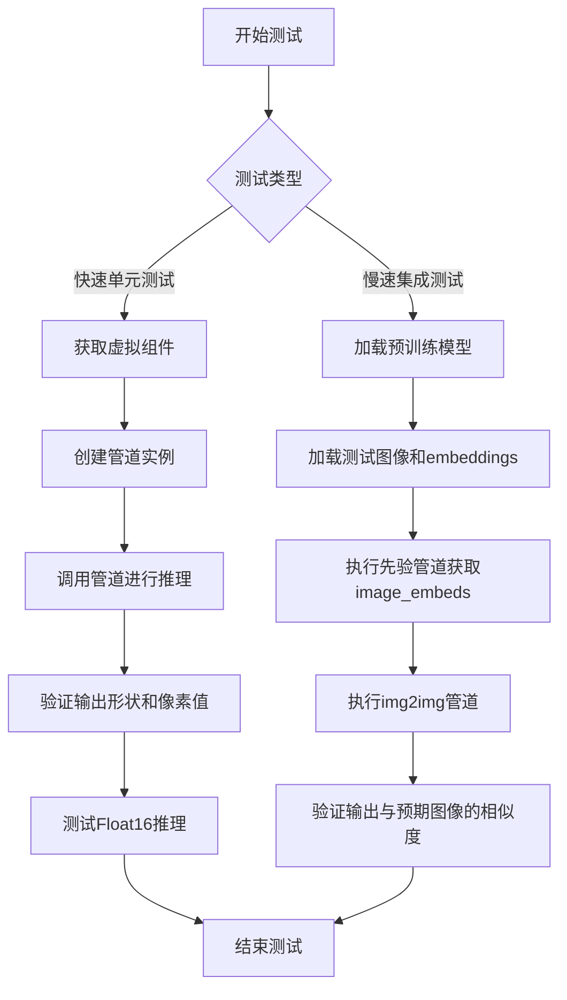

## 类结构

```
Dummies (测试辅助类)
├── 属性: text_embedder_hidden_size, time_input_dim, ...
├── 方法: get_dummy_components(), get_dummy_inputs()
KandinskyV22Img2ImgPipelineFastTests (单元测试类)
├── 继承: PipelineTesterMixin, unittest.TestCase
├── 方法: get_dummy_components(), get_dummy_inputs(), test_kandinsky_img2img(), test_float16_inference()
KandinskyV22Img2ImgPipelineIntegrationTests (集成测试类)
├── 继承: unittest.TestCase
├── 方法: setUp(), tearDown(), test_kandinsky_img2img()
```

## 全局变量及字段


### `gc`
    
Python垃圾回收模块，用于内存管理

类型：`module`
    


### `random`
    
随机数生成模块，用于生成随机数据

类型：`module`
    


### `unittest`
    
Python单元测试框架

类型：`module`
    


### `np`
    
numpy数值计算库别名，用于数值计算和数组操作

类型：`module`
    


### `torch`
    
PyTorch深度学习框架，用于构建和运行神经网络

类型：`module`
    


### `Image`
    
PIL图像处理库，用于图像加载和处理

类型：`class`
    


### `DDIMScheduler`
    
DDIM调度器类，用于扩散模型的噪声调度

类型：`class`
    


### `KandinskyV22Img2ImgPipeline`
    
Kandinsky图像到图像管道类，用于基于文本嵌入的图像转换

类型：`class`
    


### `KandinskyV22PriorPipeline`
    
Kandinsky先验管道类，用于生成图像嵌入向量

类型：`class`
    


### `UNet2DConditionModel`
    
条件UNet模型类，用于条件图像生成任务

类型：`class`
    


### `VQModel`
    
VQ VAE模型类，用于图像的矢量量化变分自编码

类型：`class`
    


### `enable_full_determinism`
    
启用完全确定性，设置随机种子以确保可重复性

类型：`function`
    


### `pipeline_class`
    
管道类变量，指向KandinskyV22Img2ImgPipeline

类型：`class`
    


### `params`
    
管道参数列表，包含image_embeds、negative_image_embeds、image

类型：`list`
    


### `batch_params`
    
批处理参数列表，包含需要批处理化的参数

类型：`list`
    


### `required_optional_params`
    
必需的可选参数列表，定义管道支持的可选参数

类型：`list`
    


### `test_xformers_attention`
    
xformers注意力测试标志，设置为False表示不测试

类型：`bool`
    


### `callback_cfg_params`
    
CFG回调参数列表，用于配置回调的参数名

类型：`list`
    


### `device`
    
设备变量，指定运行设备如cpu或cuda

类型：`str`
    


### `components`
    
组件字典变量，包含unet、scheduler、movq等模型组件

类型：`dict`
    


### `pipe`
    
管道实例变量，KandinskyV22Img2ImgPipeline的实例

类型：`object`
    


### `output`
    
管道输出变量，包含生成的图像和其他输出

类型：`object`
    


### `image`
    
生成的图像变量，存储管道输出的图像数据

类型：`ndarray`
    


### `expected_slice`
    
期望的像素值数组，用于单元测试验证

类型：`ndarray`
    


### `expected_image`
    
期望的参考图像，用于集成测试验证

类型：`ndarray`
    


### `init_image`
    
初始输入图像，用于图像到图像转换的源图像

类型：`Image`
    


### `prompt`
    
文本提示，用于生成图像的文本描述

类型：`str`
    


### `pipe_prior`
    
先验管道实例，用于生成图像嵌入

类型：`object`
    


### `pipeline`
    
img2img管道实例，KandinskyV22Img2ImgPipeline的实例

类型：`object`
    


### `generator`
    
随机数生成器，用于控制图像生成的随机性

类型：`Generator`
    


### `image_emb`
    
图像嵌入，由先验管道生成的图像向量表示

类型：`Tensor`
    


### `zero_image_emb`
    
零图像嵌入，用于无条件的图像生成

类型：`Tensor`
    


### `max_diff`
    
最大差异值，用于比较生成图像与期望图像的相似度

类型：`float`
    


### `Dummies.Dummies.text_embedder_hidden_size`
    
文本嵌入层隐藏维度，默认值为32

类型：`property int`
    


### `Dummies.Dummies.time_input_dim`
    
时间输入维度，默认值为32

类型：`property int`
    


### `Dummies.Dummies.block_out_channels_0`
    
块输出通道数，默认等于time_input_dim值为32

类型：`property int`
    


### `Dummies.Dummies.time_embed_dim`
    
时间嵌入维度，默认值为time_input_dim*4即128

类型：`property int`
    


### `Dummies.Dummies.cross_attention_dim`
    
交叉注意力维度，默认值为32

类型：`property int`
    


### `Dummies.Dummies.dummy_unet`
    
虚拟UNet模型，用于测试的模拟UNet结构

类型：`property UNet2DConditionModel`
    


### `Dummies.Dummies.dummy_movq_kwargs`
    
VQ模型配置参数字典，包含VQ模型的架构参数

类型：`property dict`
    


### `Dummies.Dummies.dummy_movq`
    
虚拟VQ VAE模型，用于测试的模拟矢量量化模型

类型：`property VQModel`
    


### `KandinskyV22Img2ImgPipelineFastTests.KandinskyV22Img2ImgPipelineFastTests.pipeline_class`
    
管道类引用，指向KandinskyV22Img2ImgPipeline类

类型：`class`
    


### `KandinskyV22Img2ImgPipelineFastTests.KandinskyV22Img2ImgPipelineFastTests.params`
    
管道参数列表，定义管道的主要输入参数

类型：`list`
    


### `KandinskyV22Img2ImgPipelineFastTests.KandinskyV22Img2ImgPipelineFastTests.batch_params`
    
批处理参数列表，定义支持批处理的参数

类型：`list`
    


### `KandinskyV22Img2ImgPipelineFastTests.KandinskyV22Img2ImgPipelineFastTests.required_optional_params`
    
必需的可选参数列表，定义管道可使用的可选参数

类型：`list`
    


### `KandinskyV22Img2ImgPipelineFastTests.KandinskyV22Img2ImgPipelineFastTests.test_xformers_attention`
    
xformers注意力测试标志，控制是否测试xformers优化

类型：`bool`
    


### `KandinskyV22Img2ImgPipelineFastTests.KandinskyV22Img2ImgPipelineFastTests.callback_cfg_params`
    
CFG回调参数列表，用于Classifier-Free Guidance回调的参数

类型：`list`
    
    

## 全局函数及方法


### `enable_full_determinism`

启用完全确定性测试，确保在测试过程中所有随机数生成操作（如 NumPy、Python random、PyTorch）都使用固定的种子，从而使测试结果可复现。

参数： 无

返回值：`None`，该函数没有返回值，仅修改全局随机状态

#### 流程图

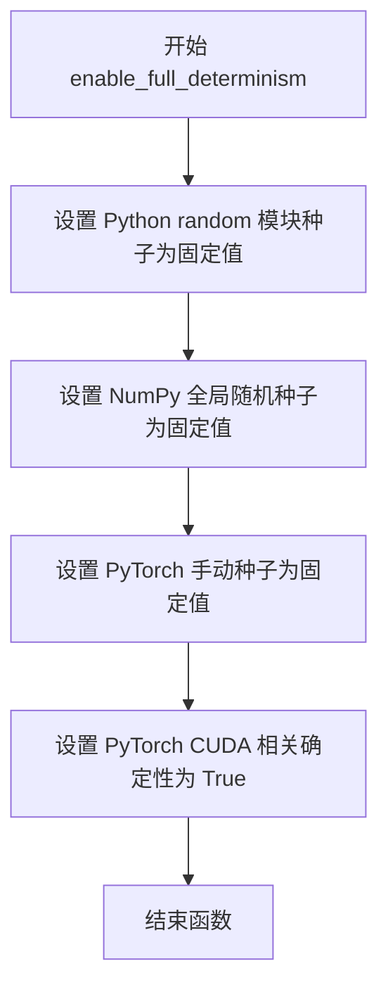

#### 带注释源码

```python
# 该函数定义位于 testing_utils 模块中，此处为调用示例
# 导入语句在文件顶部
from ...testing_utils import enable_full_determinism

# 在测试文件加载时立即调用，确保后续所有测试使用确定性随机数
enable_full_determinism()
```

> **注意**：由于 `enable_full_determinism` 函数定义在 `...testing_utils` 模块中，而非当前代码文件内，以上源码仅为调用点。该函数通常实现以下功能：
> - 设置 `random.seed(42)`
> - 设置 `np.random.seed(42)`
> - 设置 `torch.manual_seed(42)`
> - 设置 `torch.cuda.manual_seed_all(42)`
> - 设置 `torch.backends.cudnn.deterministic = True`
> - 设置 `torch.backends.cudnn.benchmark = False`


### `backend_empty_cache`

清理GPU缓存，释放VRAM内存，用于在测试前后清理GPU资源，防止内存泄漏。

参数：

- `device`：`str` 或 `torch.device`，指定要清理缓存的设备，通常为 CUDA 设备

返回值：`None`，无返回值

#### 流程图

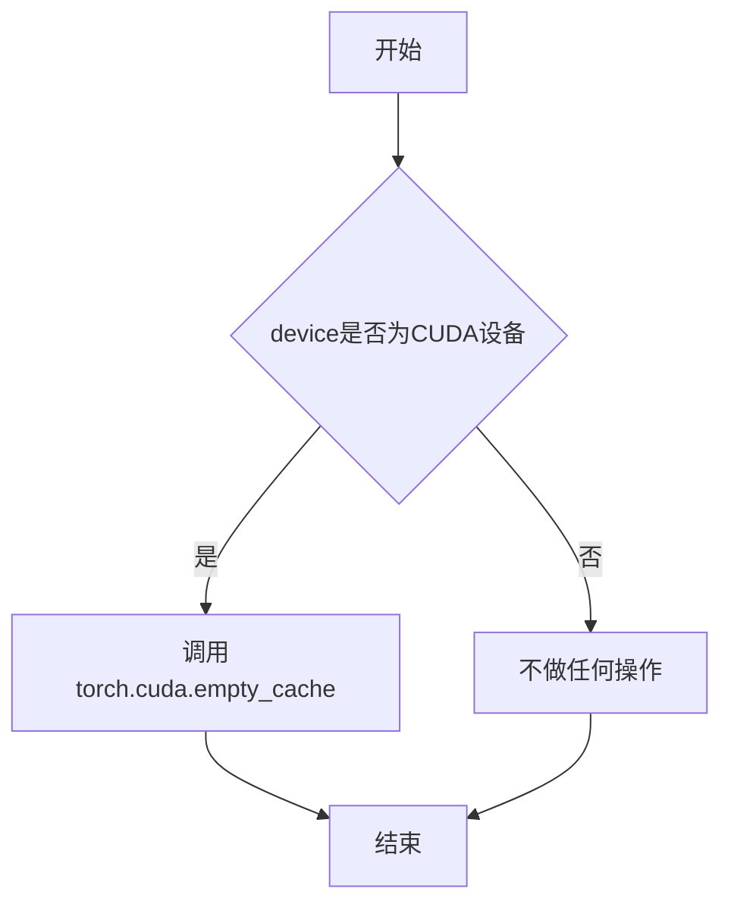

#### 带注释源码

```
# 该函数定义在 testing_utils 模块中（未在当前文件中给出）
# 根据导入和调用方式推断其实现如下：

def backend_empty_cache(device):
    """
    清理GPU缓存以释放VRAM内存
    
    参数:
        device: torch设备对象或字符串，如 'cuda:0' 或 'cpu'
    
    返回:
        None
    """
    import torch
    
    # 检查是否为CUDA设备
    if torch.cuda.is_available() and str(device).startswith('cuda'):
        # 调用PyTorch的CUDA缓存清理函数
        torch.cuda.empty_cache()
```

#### 使用示例

在当前代码中，该函数被用于集成测试的 `setUp` 和 `tearDown` 方法中：

```python
def setUp(self):
    # 在每个测试前清理VRAM
    super().setUp()
    gc.collect()
    backend_empty_cache(torch_device)

def tearDown(self):
    # 在每个测试后清理VRAM
    super().tearDown()
    gc.collect()
    backend_empty_cache(torch_device)
```


### `floats_tensor`

生成指定形状的随机浮点 PyTorch 张量，用于测试目的。该函数接受形状元组和随机数生成器对象，返回一个填充随机浮点数的 PyTorch 张量，常用于 diffusers 库测试中创建模拟输入数据。

参数：

-  `shape`：`tuple`，张量的目标形状，例如 `(1, 32)` 或 `(1, 3, 64, 64)`
-  `rng`：`random.Random`，Python 随机数生成器实例，用于控制随机数生成的种子，确保测试的可重复性

返回值：`torch.Tensor`，包含指定形状的随机浮点数张量

#### 流程图

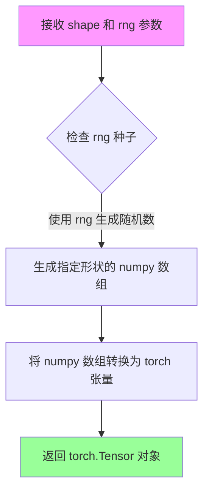

#### 带注释源码

```python
# floats_tensor 函数定义于 testing_utils 模块中
# 此处展示在代码中的典型使用模式：

# 用法1：生成一维嵌入向量张量 (1, 32)
image_embeds = floats_tensor((1, self.text_embedder_hidden_size), rng=random.Random(seed)).to(device)

# 用法2：生成负向嵌入向量张量 (1, 32)
negative_image_embeds = floats_tensor((1, self.text_embedder_hidden_size), rng=random.Random(seed + 1)).to(device)

# 用法3：生成四维图像张量 (1, 3, 64, 64)
image = floats_tensor((1, 3, 64, 64), rng=random.Random(seed)).to(device)

# 典型实现逻辑（推断）：
# 1. 使用 rng 生成指定形状的随机浮点数序列
# 2. 将随机数 reshape 为目标形状
# 3. 转换为 PyTorch 张量返回
# 4. 通过 .to(device) 移动到指定计算设备
```


### `load_image`

从外部测试工具模块导入的实用函数，用于从指定路径或URL加载图像文件，并将其转换为PIL Image对象。

参数：

-  `source`：`str`，图像来源，可以是本地文件路径或URL

返回值：`PIL.Image.Image`，返回PIL格式的图像对象

#### 流程图

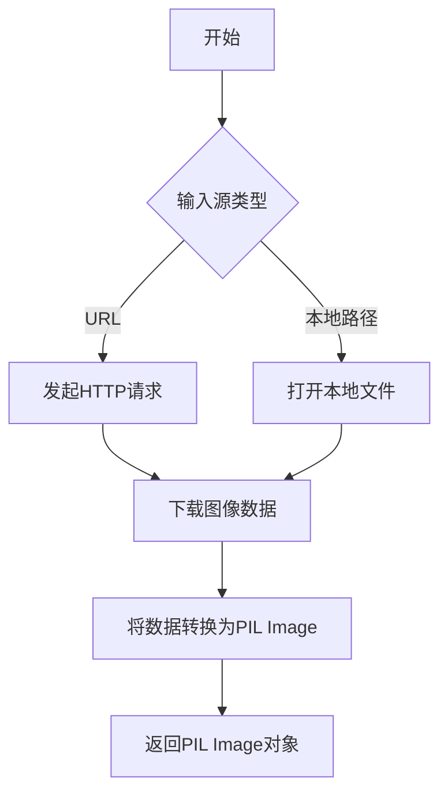

#### 带注释源码

```python
# load_image 函数定义不在当前代码文件中
# 它是从 testing_utils 模块导入的外部函数
# 以下是其在代码中的调用方式和使用场景：

# 从URL加载图像
init_image = load_image(
    "https://huggingface.co/datasets/hf-internal-testing/diffusers-images/resolve/main/kandinsky/cat.png"
)

# 返回的 init_image 是 PIL.Image.Image 对象
# 可直接用于 KandinskyV22Img2ImgPipeline 的图像生成任务
```


### `load_numpy`

该函数是一个测试工具函数，从指定的文件路径或URL加载numpy数组数据。在代码中用于加载参考图像数据以进行集成测试验证。

参数：

-  `url_or_path`：`str`，numpy数组文件的URL链接或本地文件路径

返回值：`np.ndarray`，返回加载的numpy多维数组（通常为图像的像素数据）

#### 流程图

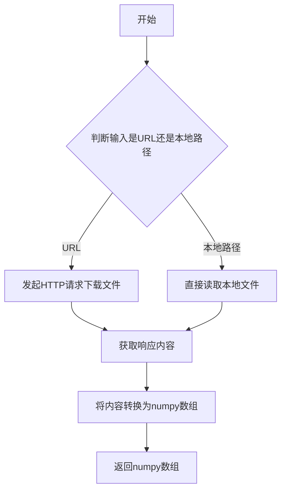

#### 带注释源码

```
# 注意：此函数从 ...testing_utils 模块导入，源码不在当前文件中
# 以下为根据使用方式推断的函数签名和用途

def load_numpy(url_or_path: str) -> np.ndarray:
    """
    从URL或本地路径加载numpy数组
    
    参数:
        url_or_path: numpy数组文件的URL或本地路径
        
    返回:
        加载后的numpy多维数组
    """
    # 在代码中的调用示例：
    expected_image = load_numpy(
        "https://huggingface.co/datasets/hf-internal-testing/diffusers-images/resolve/main"
        "/kandinskyv22/kandinskyv22_img2img_frog.npy"
    )
```

#### 补充说明

| 项目 | 说明 |
|------|------|
| **来源** | 从 `...testing_utils` 模块导入，非本文件实现 |
| **使用场景** | KandinskyV22Img2ImgPipelineIntegrationTests 集成测试中用于加载期望的输出图像 |
| **依赖** | 需要numpy库支持 |
| **输入格式** | URL字符串（指向.npy文件）或本地文件路径 |
| **输出格式** | numpy.ndarray，通常为3D数组（高度×宽度×通道） |


### `numpy_cosine_similarity_distance`

该函数用于计算两个numpy数组之间的余弦相似度距离（Cosine Similarity Distance），常用于比较图像或特征向量的相似程度。在测试中用于验证生成图像与预期图像之间的差异。

参数：

- `x`：`numpy.ndarray`，第一个输入数组（通常为flatten后的图像数据）
- `y`：`numpy.ndarray`，第二个输入数组（通常为flatten后的图像数据）

返回值：`float`，返回两个数组之间的余弦距离值，值越小表示两者越相似

#### 流程图

```mermaid
flowchart TD
    A[开始] --> B[接收两个numpy数组 x 和 y]
    B --> C[计算向量x的L2范数]
    C --> D[计算向量y的L2范数]
    D --> E[计算x和y的点积]
    E --> F[计算余弦相似度: dot / (norm_x * norm_y)]
    F --> G[计算余弦距离: 1 - cosine_similarity]
    G --> H[返回距离值]
```

#### 带注释源码

```
# 源码不可见，该函数定义在 ...testing_utils 模块中
# 以下为基于函数名和用法的推断实现

def numpy_cosine_similarity_distance(x: np.ndarray, y: np.ndarray) -> float:
    """
    计算两个数组之间的余弦相似度距离
    
    参数:
        x: 第一个numpy数组
        y: 第二个numpy数组
        
    返回:
        float: 余弦距离，范围[0, 2]，0表示完全相同，2表示完全相反
    """
    # 将输入展平为1D向量
    x = x.flatten()
    y = y.flatten()
    
    # 计算点积
    dot_product = np.dot(x, y)
    
    # 计算范数
    norm_x = np.linalg.norm(x)
    norm_y = np.linalg.norm(y)
    
    # 避免除零
    if norm_x == 0 or norm_y == 0:
        return 1.0  # 如果任一向量为零范数，返回最大距离
    
    # 计算余弦相似度
    cosine_similarity = dot_product / (norm_x * norm_y)
    
    # 余弦距离 = 1 - 余弦相似度
    cosine_distance = 1.0 - cosine_similarity
    
    return float(cosine_distance)
```

#### 使用示例

在代码中的实际调用方式：

```python
max_diff = numpy_cosine_similarity_distance(expected_image.flatten(), image.flatten())
assert max_diff < 1e-4  # 验证生成的图像与预期图像足够相似
```


### `Dummies.get_dummy_components`

获取虚拟组件，用于创建测试所需的虚拟 UNet、VQModel（Movq）和调度器（Scheduler）对象，以便在单元测试中运行推理流程。

参数：

- 无参数（仅包含 `self`）

返回值：`Dict[str, Any]`，返回一个包含虚拟组件的字典，包含 `"unet"`（UNet2DConditionModel）、`"scheduler"`（DDIMScheduler）和 `"movq"`（VQModel）三个键值对。

#### 流程图

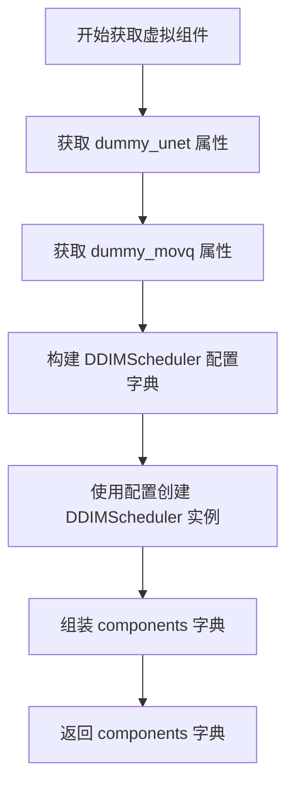

#### 带注释源码

```python
def get_dummy_components(self):
    """
    获取虚拟组件，用于测试KandinskyV22Img2ImgPipeline
    
    Returns:
        Dict[str, Any]: 包含unet、scheduler、movq三个组件的字典
    """
    # 从属性获取虚拟UNet模型
    # dummy_unet 是一个配置好的 UNet2DConditionModel 实例
    unet = self.dummy_unet
    
    # 从属性获取虚拟MOVQ模型（VQModel）
    # 用于图像的变分自编码器编码和解码
    movq = self.dummy_movq

    # 构建DDIM调度器配置参数
    ddim_config = {
        "num_train_timesteps": 1000,      # 训练时间步数
        "beta_schedule": "linear",         # Beta调度方式
        "beta_start": 0.00085,             # 初始beta值
        "beta_end": 0.012,                 # 结束beta值
        "clip_sample": False,              # 是否裁剪采样
        "set_alpha_to_one": False,         # 是否将alpha设为1
        "steps_offset": 0,                 # 步数偏移
        "prediction_type": "epsilon",      # 预测类型（预测噪声）
        "thresholding": False,             # 是否使用阈值处理
    }

    # 使用配置创建DDIMScheduler调度器实例
    # 用于扩散模型的噪声调度
    scheduler = DDIMScheduler(**ddim_config)

    # 组装组件字典，用于初始化Pipeline
    components = {
        "unet": unet,         # UNet2DConditionModel：条件UNet模型
        "scheduler": scheduler,  # DDIMScheduler：DDIM调度器
        "movq": movq,         # VQModel：MOVQ变分量化模型
    }

    # 返回组件字典，供pipeline_class(**components)使用
    return components
```


### `Dummies.get_dummy_inputs`

该方法是测试辅助方法，用于生成虚拟（dummy）输入数据，模拟 Kandinsky V2.2 Img2Img Pipeline 所需的图像和嵌入向量，以便在无需真实模型推理的情况下进行单元测试。

参数：

- `device`：`torch.device`，指定生成张量所放置的目标设备（如 cpu、cuda 等）
- `seed`：`int`，随机种子，用于控制生成数据的随机性，默认为 0

返回值：`dict`，包含图像生成所需的完整输入参数字典，包括图像张量、文本嵌入、负向嵌入、随机生成器及推理参数

#### 流程图

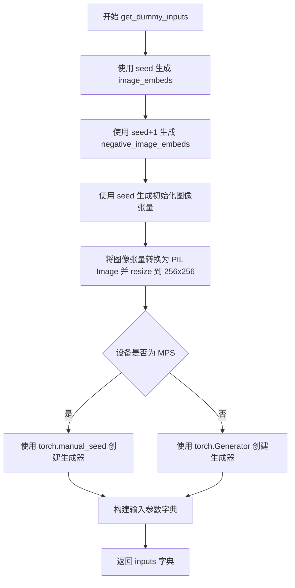

#### 带注释源码

```python
def get_dummy_inputs(self, device, seed=0):
    # 使用 floats_tensor 生成形状为 (1, text_embedder_hidden_size) 的随机张量
    # text_embedder_hidden_size = 32，由属性提供
    # rng=random.Random(seed) 确保生成可复现
    image_embeds = floats_tensor((1, self.text_embedder_hidden_size), rng=random.Random(seed)).to(device)
    
    # 生成负向图像嵌入，使用 seed+1 以获得与正向不同的随机数据
    negative_image_embeds = floats_tensor((1, self.text_embedder_hidden_size), rng=random.Random(seed + 1)).to(
        device
    )
    
    # 创建初始图像张量：形状 (1, 3, 64, 64)，3 代表 RGB 通道
    image = floats_tensor((1, 3, 64, 64), rng=random.Random(seed)).to(device)
    
    # 调整维度顺序：从 (batch, channels, height, width) 转为 (batch, height, width, channels)
    image = image.cpu().permute(0, 2, 3, 1)[0]
    
    # 将张量转换为 PIL Image 对象并转换为 RGB 模式
    # np.uint8 确保像素值在 0-255 范围内
    init_image = Image.fromarray(np.uint8(image)).convert("RGB").resize((256, 256))

    # MPS 设备需要特殊处理，使用 torch.manual_seed 而非 torch.Generator
    if str(device).startswith("mps"):
        generator = torch.manual_seed(seed)
    else:
        # 为目标设备创建随机生成器，设置相同种子确保可复现性
        generator = torch.Generator(device=device).manual_seed(seed)
    
    # 构建完整的输入参数字典，用于 Pipeline 调用
    inputs = {
        "image": init_image,                      # 初始图像 (PIL Image)
        "image_embeds": image_embeds,             # 图像嵌入向量
        "negative_image_embeds": negative_image_embeds,  # 负向嵌入
        "generator": generator,                   # 随机生成器
        "height": 64,                             # 输出图像高度
        "width": 64,                              # 输出图像宽度
        "num_inference_steps": 10,               # 推理步数
        "guidance_scale": 7.0,                    # CFG 引导强度
        "strength": 0.2,                          # 图像变换强度
        "output_type": "np",                      # 输出类型为 numpy
    }
    return inputs
```


### `KandinskyV22Img2ImgPipelineFastTests.test_kandinsky_img2img`

该测试方法用于验证 Kandinsky V2.2 图像到图像（img2img）管道的核心功能。测试通过构造虚拟组件创建管道实例，执行推理流程，并验证输出图像的形状和像素值是否符合预期，确保管道在基本场景下能正确运行。

参数：

- `self`：`KandinskyV22Img2ImgPipelineFastTests`，测试类实例本身，隐式参数，用于访问类方法和属性

返回值：`None`，该方法为单元测试方法，通过断言验证结果，不返回具体数据

#### 流程图

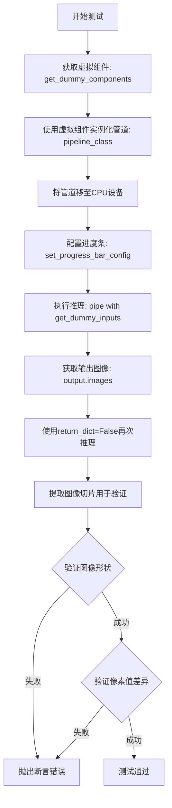

#### 带注释源码

```python
def test_kandinsky_img2img(self):
    """测试Kandinsky V2.2图像到图像管道的核心功能"""
    
    # 步骤1: 设置设备为CPU
    device = "cpu"

    # 步骤2: 获取虚拟组件（unet、scheduler、movq等）
    components = self.get_dummy_components()

    # 步骤3: 使用虚拟组件实例化管道
    pipe = self.pipeline_class(**components)
    
    # 步骤4: 将管道移至指定设备（CPU）
    pipe = pipe.to(device)

    # 步骤5: 配置进度条（disable=None表示不禁用）
    pipe.set_progress_bar_config(disable=None)

    # 步骤6: 执行管道推理，传入虚拟输入
    # 调用get_dummy_inputs获取测试所需的输入参数
    output = pipe(**self.get_dummy_inputs(device))
    
    # 步骤7: 从输出中提取生成的图像
    image = output.images

    # 步骤8: 使用return_dict=False再次执行推理
    # 用于测试元组返回形式的兼容性
    image_from_tuple = pipe(
        **self.get_dummy_inputs(device),
        return_dict=False,
    )[0]  # 取第一个返回值（图像）

    # 步骤9: 提取图像右下角3x3区域用于验证
    # image shape: (batch, height, width, channels)
    image_slice = image[0, -3:, -3:, -1]
    image_from_tuple_slice = image_from_tuple[0, -3:, -3:, -1]

    # 步骤10: 断言验证图像形状为(1, 64, 64, 3)
    assert image.shape == (1, 64, 64, 3)

    # 步骤11: 定义预期的像素值切片
    expected_slice = np.array([
        0.5712, 0.5443, 0.4725,  # 第一行
        0.6195, 0.5184, 0.4651,  # 第二行
        0.4473, 0.4590, 0.5016   # 第三行
    ])
    
    # 步骤12: 验证图像切片与预期值的差异
    # 使用最大绝对误差，阈值为1e-2（0.01）
    assert np.abs(image_slice.flatten() - expected_slice).max() < 1e-2, (
        f" expected_slice {expected_slice}, but got {image_slice.flatten()}"
    )
    
    # 步骤13: 验证元组返回形式的图像切片
    assert np.abs(image_from_tuple_slice.flatten() - expected_slice).max() < 1e-2, (
        f" expected_slice {expected_slice}, but got {image_from_tuple_slice.flatten()}"
    )
```


### `KandinskyV22Img2ImgPipelineFastTests.test_float16_inference`

该测试方法继承自 `PipelineTesterMixin`，用于验证 KandinskyV22Img2ImgPipeline 在 float16（半精度）推理模式下的正确性，通过比较 float16 和 float32 推理结果的差异是否在可接受范围内（默认为 2e-1）。

参数：无（该方法没有显式参数）

返回值：无（测试方法无返回值，通过断言验证正确性）

#### 流程图

```mermaid
flowchart TD
    A[开始 test_float16_inference] --> B[调用父类方法 super().test_float16_inference]
    B --> C[传入参数 expected_max_diff=2e-1]
    C --> D{父类方法执行}
    D --> E[创建 Float16 管道实例]
    E --> F[创建 Float32 管道实例]
    F --> G[使用相同输入执行推理]
    G --> H[比较两种精度的输出差异]
    H --> I{差异是否 <= 2e-1?}
    I -->|是| J[测试通过]
    I -->|否| K[测试失败, 抛出断言错误]
    J --> L[结束]
    K --> L
```

#### 带注释源码

```python
def test_float16_inference(self):
    """
    Float16 推理测试方法。
    
    该方法继承自 PipelineTesterMixin，用于测试管道在 float16（半精度）模式下的
    推理功能。通过将模型和输入转换为 float16 类型，执行推理并与 float32 推理
    结果进行比较，验证精度损失是否在可接受范围内。
    
    测试目标：
    - 验证 float16 推理不会导致明显的数值误差
    - 确保模型在 GPU 等支持半精度的设备上能正常运行
    - 捕获可能的精度相关问题
    """
    # 调用父类的 test_float16_inference 方法
    # expected_max_diff 参数指定了 float16 和 float32 输出之间的最大允许差异
    # 这里设置为 0.2 (2e-1)，允许较大的误差范围以适应复杂的图像生成任务
    super().test_float16_inference(expected_max_diff=2e-1)
```


### `KandinskyV22Img2ImgPipelineIntegrationTests.setUp`

测试初始化方法，用于在每个测试用例执行前清理 VRAM 内存，确保测试环境处于干净的初始状态。

参数：

- `self`：`unittest.TestCase`，隐式参数，代表当前的测试实例对象

返回值：`None`，无返回值，该方法仅执行副作用（内存清理）

#### 流程图

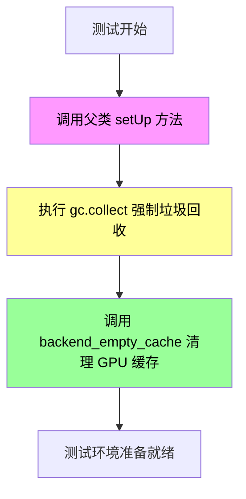

#### 带注释源码

```python
def setUp(self):
    # clean up the VRAM before each test
    # 清理每次测试前的 VRAM 内存，确保测试环境干净
    
    # 调用父类的 setUp 方法，执行 unittest.TestCase 的标准初始化逻辑
    super().setUp()
    
    # 强制 Python 垃圾回收器运行，释放不再使用的对象内存
    gc.collect()
    
    # 调用后端工具函数清理 GPU 显存缓存
    # torch_device 是全局变量，指向当前使用的计算设备
    backend_empty_cache(torch_device)
```


### `KandinskyV22Img2ImgPipelineIntegrationTests.tearDown`

测试清理方法，用于在每个集成测试执行完成后清理GPU显存（VRAM），防止显存泄漏导致的测试失败。

参数：
- 无参数（继承自 `unittest.TestCase.tearDown`）

返回值：`None`，无返回值描述

#### 流程图

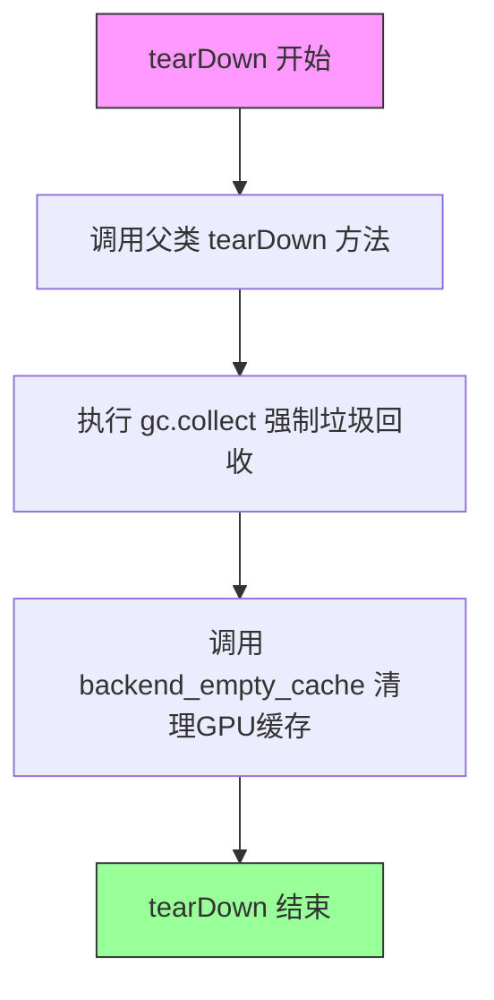

#### 带注释源码

```python
def tearDown(self):
    # clean up the VRAM after each test
    # 在每个测试完成后清理VRAM显存，防止显存泄漏
    
    # 调用父类的tearDown方法，确保执行父类的清理逻辑
    super().tearDown()
    
    # 执行Python的垃圾回收，释放不再使用的对象内存
    gc.collect()
    
    # 调用后端特定的缓存清理函数，清理GPU显存缓存
    # torch_device 是测试工具模块中定义的全局变量，表示当前测试设备
    backend_empty_cache(torch_device)
```

---

### 补充说明

| 项目 | 描述 |
|------|------|
| **所属类** | `KandinskyV22Img2ImgPipelineIntegrationTests` |
| **类职责** | KandinskyV22图像到图像管道的集成测试，验证完整Pipeline的推理流程 |
| **设计动机** | 集成测试通常加载大型模型到GPU显存，需要显式清理以确保单个测试不会影响后续测试的显存可用性 |
| **外部依赖** | `gc`（Python内置模块）、`backend_empty_cache`（testing_utils自定义函数）、`torch_device`（全局设备标识符） |
| **异常处理** | 无显式异常处理，依赖 unittest 框架的默认行为 |
| **技术债务** | 未对 `backend_empty_cache` 调用失败的情况进行处理，若清理失败可能导致静默的显存泄漏 |


### `Dummies.get_dummy_components`

该方法是 `Dummies` 类的核心方法，用于生成测试所需的虚拟组件（UNet模型、调度器、Movq模型），返回一个包含这三个组件的字典，供 KandinskyV22Img2ImgPipeline 快速测试使用。

参数：
- 无显式参数（隐式接收 `self` 参数）

返回值：`dict`，返回包含 `unet`（UNet2DConditionModel）、`scheduler`（DDIMScheduler）、`movq`（VQModel）的组件字典

#### 流程图

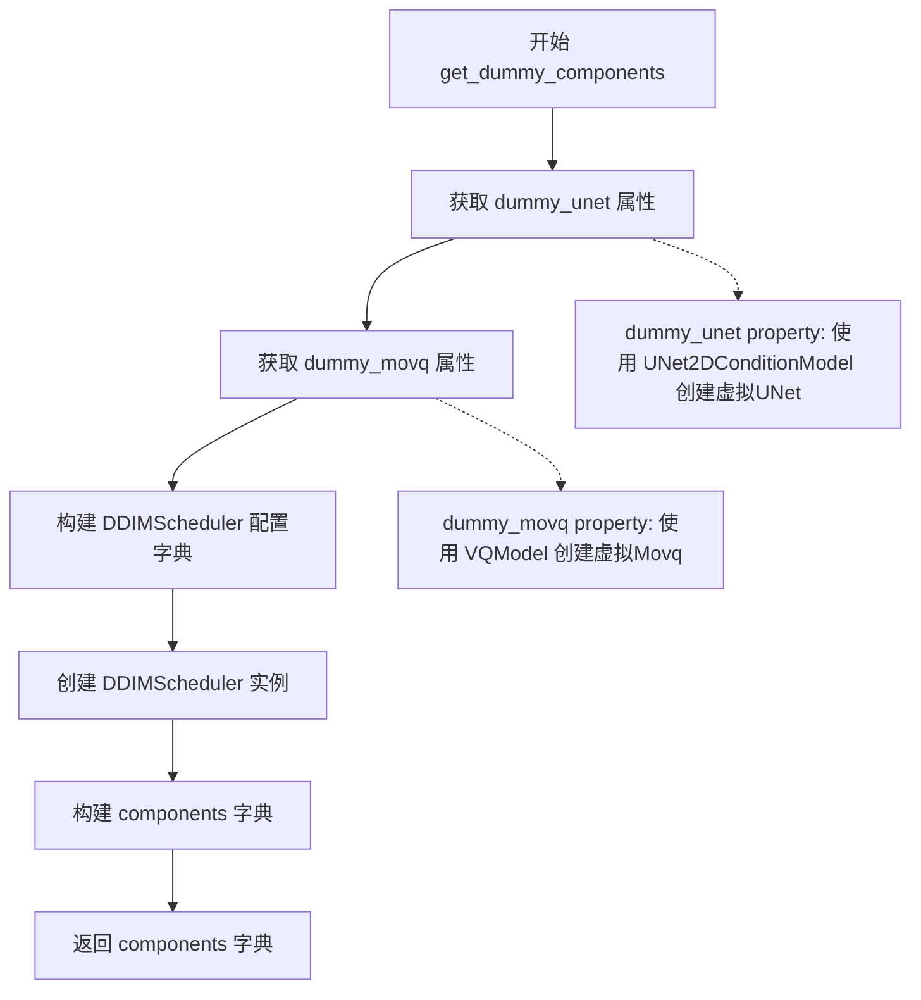

#### 带注释源码

```python
def get_dummy_components(self):
    """
    获取虚拟组件字典，包含用于测试的 UNet、Scheduler 和 MOVQ 模型
    
    Returns:
        dict: 包含 'unet', 'scheduler', 'movq' 三个键的组件字典
    """
    # 从 dummy_unet 属性获取虚拟 UNet2DConditionModel 实例
    unet = self.dummy_unet
    
    # 从 dummy_movq 属性获取虚拟 VQModel 实例
    movq = self.dummy_movq

    # 构建 DDIMScheduler 的配置参数字典
    ddim_config = {
        "num_train_timesteps": 1000,      # 训练时间步数
        "beta_schedule": "linear",         # Beta 调度方式
        "beta_start": 0.00085,            # Beta 起始值
        "beta_end": 0.012,                # Beta 结束值
        "clip_sample": False,             # 是否裁剪采样
        "set_alpha_to_one": False,        # 是否将 alpha 设置为 1
        "steps_offset": 0,                # 步数偏移
        "prediction_type": "epsilon",     # 预测类型
        "thresholding": False,            # 是否使用阈值化
    }

    # 使用配置创建 DDIMScheduler 调度器实例
    scheduler = DDIMScheduler(**ddim_config)

    # 组装完整的组件字典
    components = {
        "unet": unet,        # UNet2DConditionModel 实例
        "scheduler": scheduler,  # DDIMScheduler 实例
        "movq": movq,        # VQModel 实例
    }

    # 返回组件字典供 Pipeline 使用
    return components
```

---

### 相关的 `Dummies` 类辅助属性

#### `Dummies.dummy_unet` (property)

创建虚拟 UNet2DConditionModel 实例，用于测试。

返回：`UNet2DConditionModel`，虚拟 UNet 模型

#### `Dummies.dummy_movq` (property)

创建虚拟 VQModel 实例，用于测试。

返回：`VQModel`，虚拟 VQ 变分自编码器模型

#### `Dummies.dummy_movq_kwargs` (property)

返回 VQModel 的构建参数字典。

返回：`dict`，VQModel 的模型配置参数


### `Dummies.get_dummy_inputs`

该方法为 KandinskyV22Img2ImgPipeline 生成虚拟输入参数，用于单元测试。它创建随机的图像嵌入、负向图像嵌入和初始图像，并根据设备类型初始化随机生成器，最后返回一个包含图像、嵌入向量、生成器及推理参数的字典。

参数：

- `device`：`str` 或 `torch.device`，指定计算设备（如 "cpu"、"cuda"、"mps" 等）
- `seed`：`int`，随机种子，默认为 0，用于确保测试的可重复性

返回值：`dict`，包含以下键值对：

- `image`：`PIL.Image.Image`，调整大小后的初始图像（256x256，RGB 格式）
- `image_embeds`：`torch.Tensor`，图像嵌入向量，形状为 (1, 32)
- `negative_image_embeds`：`torch.Tensor`，负向图像嵌入向量，形状为 (1, 32)
- `generator`：`torch.Generator` 或 `torch.Generator`，随机数生成器
- `height`：`int`，输出图像高度，固定为 64
- `width`：`int`，输出图像宽度，固定为 64
- `num_inference_steps`：`int`，推理步数，固定为 10
- `guidance_scale`：`float`，引导_scale，固定为 7.0
- `strength`：`float`，图像变换强度，固定为 0.2
- `output_type`：`str`，输出类型，固定为 "np"（NumPy 数组）

#### 流程图

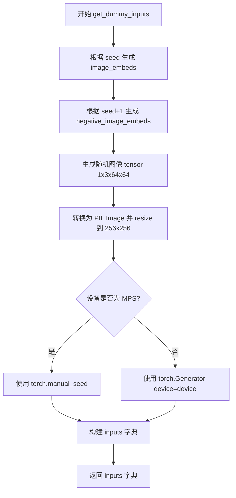

#### 带注释源码

```python
def get_dummy_inputs(self, device, seed=0):
    """
    生成用于测试 KandinskyV22Img2ImgPipeline 的虚拟输入参数
    
    参数:
        device: 计算设备 (如 'cpu', 'cuda', 'mps')
        seed: 随机种子，用于确保测试可重复性
    
    返回:
        包含图像、嵌入向量、生成器及推理参数的字典
    """
    
    # 使用随机种子生成图像嵌入向量 (1, 32)
    # floats_tensor 是 diffusers.testing_utils 中的辅助函数
    image_embeds = floats_tensor(
        (1, self.text_embedder_hidden_size),  # 形状: (1, 32)
        rng=random.Random(seed)  # 随机数生成器
    ).to(device)  # 移动到指定设备
    
    # 生成负向图像嵌入向量，使用 seed+1 以获得不同的随机值
    negative_image_embeds = floats_tensor(
        (1, self.text_embedder_hidden_size),
        rng=random.Random(seed + 1)
    ).to(device)
    
    # 创建初始图像 (随机噪声图像)
    # 形状: (1, 3, 64, 64) - 批量大小1, RGB 3通道, 64x64分辨率
    image = floats_tensor(
        (1, 3, 64, 64),
        rng=random.Random(seed)
    ).to(device)
    
    # 将 tensor 转换为 PIL Image
    # 1. permute(0, 2, 3, 1): 将通道维度移到最后 (1, 64, 64, 3)
    # 2. [0]: 取出第一个样本
    # 3. cpu(): 移回 CPU
    # 4. numpy(): 转为 NumPy 数组
    # 5. uint8: 转为无符号整数 (0-255)
    # 6. fromarray: 从数组创建 PIL Image
    # 7. convert('RGB'): 转换为 RGB 模式
    # 8. resize((256, 256)): 调整大小以匹配 pipeline 输入要求
    image = image.cpu().permute(0, 2, 3, 1)[0]
    init_image = Image.fromarray(np.uint8(image)).convert("RGB").resize((256, 256))
    
    # 初始化随机生成器
    # MPS 设备不支持 torch.Generator，需使用 torch.manual_seed
    if str(device).startswith("mps"):
        generator = torch.manual_seed(seed)
    else:
        # 为指定设备创建随机生成器并设置种子
        generator = torch.Generator(device=device).manual_seed(seed)
    
    # 构建输入参数字典
    inputs = {
        "image": init_image,                    # 初始图像 (PIL Image)
        "image_embeds": image_embeds,           # 图像嵌入向量
        "negative_image_embeds": negative_image_embeds,  # 负向嵌入
        "generator": generator,                 # 随机生成器
        "height": 64,                           # 输出高度
        "width": 64,                            # 输出宽度
        "num_inference_steps": 10,              # 推理步数
        "guidance_scale": 7.0,                  # CFG 引导强度
        "strength": 0.2,                        # 图像变换强度 (0-1)
        "output_type": "np",                    # 输出类型: NumPy 数组
    }
    
    return inputs
```


### `KandinskyV22Img2ImgPipelineFastTests.get_dummy_components`

获取用于测试的虚拟（dummy）组件，返回一个包含 UNet、调度器和 MOVQ 模型的字典，用于实例化 KandinskyV2.2 Image-to-Image Pipeline 进行单元测试。

参数：

- 无（隐式参数 `self`：当前测试类实例）

返回值：`dict`，返回包含以下键值对的字典：
- `"unet"`：`UNet2DConditionModel`，虚拟 UNet 模型
- `"scheduler"`：`DDIMScheduler`，虚拟调度器
- `"movq"`：`VQModel`，虚拟 MOVQ 变分量化模型

#### 流程图

```mermaid
flowchart TD
    A[开始 get_dummy_components] --> B[创建 Dummies 实例: dummies = Dummies()]
    B --> C[调用 dummies.get_dummy_components]
    C --> D[获取 dummy_unet 属性]
    D --> E[获取 dummy_movq 属性]
    E --> F[构建 DDIMScheduler 配置字典 ddim_config]
    F --> G[使用配置创建 DDIMScheduler 实例]
    G --> H[组装 components 字典]
    H --> I[返回 components 字典]
    I --> J[结束]
```

#### 带注释源码

```python
def get_dummy_components(self):
    """
    获取用于测试的虚拟组件。
    
    创建一个 Dummies 实例并调用其 get_dummy_components 方法，
    返回包含 UNet、调度器和 MOVQ 模型的字典，用于实例化 Pipeline。
    
    参数:
        无（隐式参数 self 指向测试类实例）
    
    返回值:
        dict: 包含以下键值对的字典:
            - "unet": UNet2DConditionModel 实例
            - "scheduler": DDIMScheduler 实例
            - "movq": VQModel 实例
    """
    # 创建 Dummies 辅助类的实例，用于获取虚拟组件
    dummies = Dummies()
    
    # 调用 Dummies 实例的 get_dummy_components 方法获取组件字典
    return dummies.get_dummy_components()
```


### `KandinskyV22Img2ImgPipelineFastTests.get_dummy_inputs`

该方法是测试辅助函数，用于生成图像到图像（Img2Img）扩散管道的虚拟输入数据。它通过创建随机张量作为图像嵌入、负向嵌入和初始图像，并配置推理参数（如推理步数、引导强度等），为管道测试提供标准化的输入样本。

参数：

- `device`：`str`，目标设备标识符（如 "cpu"、"cuda" 等），用于将张量放置到指定设备上
- `seed`：`int`，随机种子，默认为 0，用于确保生成可复现的随机数据

返回值：`dict`，包含以下键值对的字典：
  - `image`：PIL.Image，初始图像（RGB 格式，256x256）
  - `image_embeds`：torch.Tensor，正向图像嵌入向量（形状为 1×32）
  - `negative_image_embeds`：torch.Tensor，负向图像嵌入向量（形状为 1×32）
  - `generator`：torch.Generator 或 torch.Generator，用于控制随机数生成
  - `height`：`int`，输出图像高度（64）
  - `width`：`int`，输出图像宽度（64）
  - `num_inference_steps`：`int`，推理步数（10）
  - `guidance_scale`：`float`，引导系数（7.0）
  - `strength`：`float`，转换强度（0.2）
  - `output_type`：`str`，输出类型（"np"，即 NumPy 数组）

#### 流程图

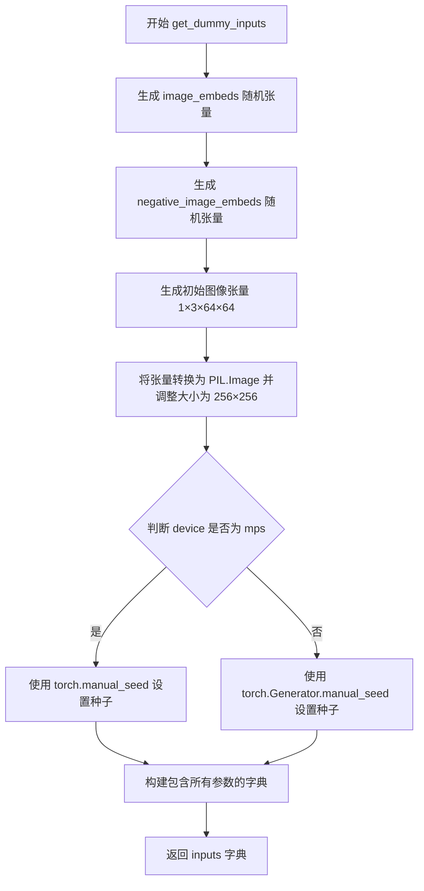

#### 带注释源码

```
def get_dummy_inputs(self, device, seed=0):
    # 生成正向图像嵌入向量，使用指定种子确保可复现性
    # 形状: (1, text_embedder_hidden_size) = (1, 32)
    image_embeds = floats_tensor((1, self.text_embedder_hidden_size), rng=random.Random(seed)).to(device)
    
    # 生成负向图像嵌入向量，使用 seed+1 确保与正向嵌入不同
    negative_image_embeds = floats_tensor((1, self.text_embedder_hidden_size), rng=random.Random(seed + 1)).to(
        device
    )
    
    # 创建初始图像: 形状 (1, 3, 64, 64) 的随机张量
    image = floats_tensor((1, 3, 64, 64), rng=random.Random(seed)).to(device)
    
    # 转换张量维度从 (N, C, H, W) 变为 (N, H, W, C) 以便转换为 PIL Image
    image = image.cpu().permute(0, 2, 3, 1)[0]
    
    # 将数值转换为 uint8 并创建 PIL RGB 图像，然后调整大小为 256×256
    init_image = Image.fromarray(np.uint8(image)).convert("RGB").resize((256, 256))

    # 根据设备类型选择随机数生成方式
    # MPS (Apple Silicon) 设备使用不同的随机数生成 API
    if str(device).startswith("mps"):
        generator = torch.manual_seed(seed)
    else:
        # 标准 CUDA/CPU 设备使用 torch.Generator
        generator = torch.Generator(device=device).manual_seed(seed)
    
    # 组装完整的测试输入参数字典
    inputs = {
        "image": init_image,                    # 初始图像
        "image_embeds": image_embeds,           # 正向图像嵌入
        "negative_image_embeds": negative_image_embeds,  # 负向图像嵌入
        "generator": generator,                 # 随机数生成器
        "height": 64,                           # 输出高度
        "width": 64,                             # 输出宽度
        "num_inference_steps": 10,              # 推理步数
        "guidance_scale": 7.0,                  # Classifier-free guidance 强度
        "strength": 0.2,                        # 图像转换强度 (0-1)
        "output_type": "np",                    # 输出为 NumPy 数组
    }
    return inputs
```


### `KandinskyV22Img2ImgPipelineFastTests.test_kandinsky_img2img`

测试 Kandinsky V2.2 图像到图像（img2img）管道的基本功能，包括管道实例化、推理执行、输出图像形状验证以及像素值正确性检查。

参数：

- `self`：隐式参数，`KandinskyV22Img2ImgPipelineFastTests` 类的实例

返回值：`None`，无返回值（测试方法）

#### 流程图

```mermaid
flowchart TD
    A[开始测试] --> B[获取虚拟组件: get_dummy_components]
    B --> C[创建管道实例: KandinskyV22Img2ImgPipeline]
    C --> D[将管道移至CPU设备]
    D --> E[设置进度条配置: set_progress_bar_config]
    E --> F[调用管道推理: pipe with return_dict=True]
    F --> G[获取输出图像: output.images]
    G --> H[调用管道推理: pipe with return_dict=False]
    H --> I[获取元组形式输出: image_from_tuple]
    I --> J[断言图像形状: (1, 64, 64, 3)]
    J --> K[断言图像像素值与预期切片匹配]
    K --> L[结束测试]
```

#### 带注释源码

```python
def test_kandinsky_img2img(self):
    """
    测试 Kandinsky V2.2 img2img 管道的基本功能
    验证管道能够正确执行图像到图像的推理并输出预期形状和像素值的图像
    """
    # 1. 设置设备为 CPU
    device = "cpu"

    # 2. 获取虚拟组件（用于测试的模拟模型组件）
    components = self.get_dummy_components()

    # 3. 使用虚拟组件创建管道实例
    pipe = self.pipeline_class(**components)
    # 4. 将管道移至指定设备（CPU）
    pipe = pipe.to(device)

    # 5. 配置进度条（disable=None 表示不禁用）
    pipe.set_progress_bar_config(disable=None)

    # 6. 执行管道推理（使用 return_dict=True 默认模式）
    output = pipe(**self.get_dummy_inputs(device))
    # 7. 从输出中提取图像
    image = output.images

    # 8. 执行管道推理（使用 return_dict=False 模式，获取元组形式输出）
    image_from_tuple = pipe(
        **self.get_dummy_inputs(device),
        return_dict=False,
    )[0]

    # 9. 提取图像切片用于像素值验证（取右下角 3x3 区域）
    image_slice = image[0, -3:, -3:, -1]
    image_from_tuple_slice = image_from_tuple[0, -3:, -3:, -1]

    # 10. 断言验证输出图像形状为 (1, 64, 64, 3)
    assert image.shape == (1, 64, 64, 3)

    # 11. 定义预期的像素值切片（用于回归测试）
    expected_slice = np.array([0.5712, 0.5443, 0.4725, 0.6195, 0.5184, 0.4651, 0.4473, 0.4590, 0.5016])
    # 12. 断言验证 return_dict=True 模式的输出像素值
    assert np.abs(image_slice.flatten() - expected_slice).max() < 1e-2, (
        f" expected_slice {expected_slice}, but got {image_slice.flatten()}"
    )
    # 13. 断言验证 return_dict=False 模式的输出像素值
    assert np.abs(image_from_tuple_slice.flatten() - expected_slice).max() < 1e-2, (
        f" expected_slice {expected_slice}, but got {image_from_tuple_slice.flatten()}"
    )
```


### `KandinskyV22Img2ImgPipelineFastTests.test_float16_inference`

该测试方法用于验证 KandinskyV22Img2ImgPipeline 在 float16（半精度）推理模式下的正确性，通过调用父类的 test_float16_inference 方法并设置最大允许差异阈值为 0.2，以确保 float16 推理结果与全精度结果的差异在可接受范围内。

参数：

- `self`：隐式参数，TestCase 实例本身，无需显式传递

返回值：`None`，该方法为测试方法，不返回任何值

#### 流程图

```mermaid
flowchart TD
    A[开始 test_float16_inference 测试] --> B[调用父类方法 super().test_float16_inference]
    B --> C[传入参数 expected_max_diff=2e-1]
    C --> D[父类方法执行 float16 推理测试]
    D --> E{推理结果差异是否 <= 0.2}
    E -->|是| F[测试通过]
    E -->|否| G[测试失败, 抛出断言错误]
    F --> H[结束]
    G --> H
```

#### 带注释源码

```python
def test_float16_inference(self):
    """
    测试 Float16（半精度）推理功能
    
    该方法继承自 PipelineTesterMixin，通过调用父类的 test_float16_inference 方法
    来验证 Pipeline 在使用 float16 数据类型时能够正确运行。
    父类方法会执行以下操作：
    1. 将 Pipeline 的所有组件转换为 float16 类型
    2. 执行推理操作
    3. 将结果与 float32 推理结果进行对比
    4. 验证两者之间的差异是否在 expected_max_diff 范围内
    
    Returns:
        None: 这是一个测试方法，不返回任何值
    """
    # 调用父类 (PipelineTesterMixin) 的 test_float16_inference 方法
    # expected_max_diff=2e-1 表示允许 float16 和 float32 推理结果之间的
    # 最大差异为 0.2，这是一个相对宽松的阈值，考虑到 float16 精度较低
    super().test_float16_inference(expected_max_diff=2e-1)
```


### `KandinskyV22Img2ImgPipelineIntegrationTests.setUp`

在每个测试运行前执行的前置准备工作，主要用于清理VRAM（视频随机存取内存），释放GPU缓存资源，确保测试环境处于干净状态，避免因显存残留导致测试结果不稳定。

参数：

- `self`：`KandinskyV22Img2ImgPipelineIntegrationTests`，隐式参数，代表当前测试类实例本身

返回值：`None`，该方法不返回任何值，仅执行清理操作

#### 流程图

```mermaid
flowchart TD
    A[开始 setUp] --> B[调用父类 setUp 方法<br/>super().setUp]
    B --> C[执行 Python 垃圾回收<br/>gc.collect]
    C --> D[调用后端缓存清理函数<br/>backend_empty_cache]
    D --> E[结束 setUp]
    
    style A fill:#e1f5fe
    style E fill:#e8f5e8
```

#### 带注释源码

```python
def setUp(self):
    # clean up the VRAM before each test
    # 注释：清理VRAM，为每个测试准备干净的环境
    super().setUp()  # 调用父类的 setUp 方法，执行 unittest.TestCase 的标准初始化
    gc.collect()  # 手动调用 Python 的垃圾回收器，清理不再使用的 Python 对象
    backend_empty_cache(torch_device)  # 调用后端工具函数清理 GPU/TPU 等设备的显存缓存
```


### `KandinskyV22Img2ImgPipelineIntegrationTests.tearDown`

该方法为测试后清理方法，用于在每个集成测试执行完成后释放 GPU/VRAM 内存资源，防止内存泄漏确保测试环境干净。

参数：

- `self`：`unittest.TestCase` 隐式参数，表示测试类实例本身，无实际描述

返回值：`None`，无返回值

#### 流程图

```mermaid
flowchart TD
    A[tearDown 开始] --> B[调用父类 tearDown 方法]
    B --> C[执行 gc.collect 强制垃圾回收]
    C --> D[调用 backend_empty_cache 清理 GPU 缓存]
    D --> E[tearDown 结束]

    style A fill:#f9f,stroke:#333
    style E fill:#9f9,stroke:#333
```

#### 带注释源码

```python
def tearDown(self):
    # clean up the VRAM after each test
    # 清理每次测试后的 VRAM 内存
    super().tearDown()  # 调用父类 unittest.TestCase 的 tearDown 方法，执行标准清理
    gc.collect()  # 强制 Python 垃圾回收器运行，回收不再使用的对象
    backend_empty_cache(torch_device)  # 调用后端特定的 GPU 缓存清理函数，释放 VRAM
```


### `KandinskyV22Img2ImgPipelineIntegrationTests.test_kandinsky_img2img`

该集成测试函数使用真实的预训练模型验证 Kandinsky V2.2 图像到图像（img2img）管道的端到端功能。测试流程包括：加载先验管道（prior pipeline）生成图像嵌入，然后使用 img2img 管道基于初始图像和图像嵌入生成新图像，最后通过与预期图像的余弦相似度比较来验证管道输出的正确性。

参数：无（使用 `self` 实例属性）

返回值：`None`，该函数为测试函数，不返回任何值，测试结果通过断言（assert）验证

#### 流程图

```mermaid
flowchart TD
    A[开始测试] --> B[加载预期图像 numpy 数组]
    B --> C[加载初始图像 from URL]
    C --> D[定义文本提示: 'A red cartoon frog, 4k']
    D --> E[创建 KandinskyV22PriorPipeline]
    E --> F[加载 kandinsky-2-2-prior 模型<br/>torch_dtype=torch.float16]
    F --> G[启用 CPU offload]
    G --> H[创建 KandinskyV22Img2ImgPipeline]
    H --> I[加载 kandinsky-2-2-decoder 模型<br/>torch_dtype=torch.float16]
    I --> J[启用 CPU offload]
    J --> K[设置进度条配置]
    K --> L[创建随机数生成器 seed=0]
    L --> M[调用 prior 管道生成图像嵌入]
    M --> N[提取 image_emb 和 zero_image_emb]
    N --> O[创建新的随机数生成器 seed=0]
    O --> P[调用 img2img 管道进行推理]
    P --> Q[提取生成的图像]
    Q --> R{验证图像形状<br/>assert shape == (768, 768, 3)}
    R --> S[计算余弦相似度距离]
    S --> T{验证相似度<br/>assert max_diff < 1e-4}
    T --> U[测试通过]
    T --> V[测试失败: 抛出 AssertionError]
    
    style U fill:#90EE90
    style V fill:#FFB6C1
```

#### 带注释源码

```python
@slow  # 标记为慢速测试，需要较长时间运行
@require_torch_accelerator  # 需要 CUDA 可用的 GPU 才能运行
class KandinskyV22Img2ImgPipelineIntegrationTests(unittest.TestCase):
    """Kandinsky V2.2 图像到图像管道的集成测试类"""
    
    def setUp(self):
        """每个测试前清理 VRAM 内存"""
        # 清理 VRAM 在每个测试之前
        super().setUp()
        gc.collect()  # 强制垃圾回收
        backend_empty_cache(torch_device)  # 清空 GPU 缓存

    def tearDown(self):
        """每个测试后清理 VRAM 内存"""
        # 清理 VRAM 在每个测试之后
        super().tearDown()
        gc.collect()  # 强制垃圾回收
        backend_empty_cache(torch_device)  # 清空 GPU 缓存

    def test_kandinsky_img2img(self):
        """
        集成测试：使用真实模型验证 Kandinsky V2.2 img2img 管道
        
        测试流程：
        1. 加载预期输出图像作为参考
        2. 加载输入初始图像
        3. 使用 Prior 管道生成图像嵌入
        4. 使用 Img2Img 管道基于图像嵌入转换图像
        5. 验证输出图像与预期图像的相似度
        """
        # 从 HuggingFace 数据集加载预期的 numpy 图像数组
        # 该图像是测试的参考标准输出
        expected_image = load_numpy(
            "https://huggingface.co/datasets/hf-internal-testing/diffusers-images/resolve/main"
            "/kandinskyv22/kandinskyv22_img2img_frog.npy"
        )

        # 从 HuggingFace 数据集加载初始输入图像（猫的图像）
        init_image = load_image(
            "https://huggingface.co/datasets/hf-internal-testing/diffusers-images/resolve/main/kandinsky/cat.png"
        )
        
        # 文本提示，描述期望生成的图像内容
        prompt = "A red cartoon frog, 4k"

        # 创建先验管道（Prior Pipeline）
        # Prior 管道负责将文本提示转换为图像嵌入向量
        pipe_prior = KandinskyV22PriorPipeline.from_pretrained(
            "kandinsky-community/kandinsky-2-2-prior",  # HuggingFace 模型 ID
            torch_dtype=torch.float16  # 使用半精度浮点数减少内存占用
        )
        
        # 启用模型 CPU 卸载以节省 VRAM
        # 当模型不在 GPU 上时自动移到 CPU
        pipe_prior.enable_model_cpu_offload(device=torch_device)

        # 创建图像到图像管道（Img2Img Pipeline）
        # 负责基于图像嵌入和初始图像生成新图像
        pipeline = KandinskyV22PriorPipeline.from_pretrained(
            "kandinsky-community/kandinsky-2-2-decoder",  # HuggingFace 模型 ID
            torch_dtype=torch.float16  # 使用半精度浮点数
        )
        
        # 启用 CPU 卸载
        pipeline.enable_model_cpu_offload(device=torch_device)
        
        # 配置进度条（disable=None 表示启用进度条）
        pipeline.set_progress_bar_config(disable=None)

        # 创建随机数生成器，确保测试可重复性
        generator = torch.Generator(device="cpu").manual_seed(0)
        
        # 调用先验管道生成图像嵌入
        # image_emb: 正向图像嵌入（对应 prompt）
        # zero_image_emb: 负向图像嵌入（对应空负向提示）
        image_emb, zero_image_emb = pipe_prior(
            prompt,  # 文本提示
            generator=generator,
            num_inference_steps=5,  # 推理步数（较少用于测试）
            negative_prompt="",  # 负向提示（空字符串）
        ).to_tuple()  # 转换为元组

        # 创建新的随机数生成器（相同 seed 确保可重复性）
        generator = torch.Generator(device="cpu").manual_seed(0)
        
        # 调用图像到图像管道执行转换
        output = pipeline(
            image=init_image,  # 初始输入图像
            image_embeds=image_emb,  # 文本生成的图像嵌入
            negative_image_embeds=zero_image_emb,  # 负向图像嵌入
            generator=generator,  # 随机数生成器
            num_inference_steps=5,  # 推理步数
            height=768,  # 输出图像高度
            width=768,  # 输出图像宽度
            strength=0.2,  # 转换强度（0-1，越高越保留原图特征）
            output_type="np",  # 输出为 numpy 数组
        )

        # 从输出中提取生成的图像
        image = output.images[0]

        # ====== 验证测试结果 ======
        
        # 验证输出图像的形状是否符合预期
        assert image.shape == (768, 768, 3), f"Expected shape (768, 768, 3), got {image.shape}"

        # 计算预期图像与生成图像之间的余弦相似度距离
        # 距离越小表示图像越相似
        max_diff = numpy_cosine_similarity_distance(expected_image.flatten(), image.flatten())
        
        # 验证相似度距离是否在可接受范围内
        assert max_diff < 1e-4, f"Image similarity distance {max_diff} exceeds threshold 1e-4"
```

## 关键组件


### KandinskyV22Img2ImgPipeline

Kandinsky V2.2图像到图像转换管道，结合VQModel和UNet2DConditionModel实现基于文本嵌入的图像生成与转换，支持float16推理和模型CPU卸载。

### KandinskyV22PriorPipeline

Kandinsky V2.2先验管道，用于根据文本提示生成图像嵌入向量（image_embeds和zero_image_emb），为Img2Img管道提供条件输入。

### UNet2DConditionModel

条件UNet2D模型，接受文本嵌入和时间步信息，预测噪声残差用于去噪过程，配置为支持图像条件嵌入（addition_embed_type="image"）。

### VQModel

向量量化自编码器模型，将图像编码到潜在空间并进行量化，支持12个VQ嵌入（num_vq_embeddings=12），用于Kandinsky的图像重建。

### DDIMScheduler

DDIM调度器，用于去噪扩散隐式模型采样，控制噪声调度和去噪步数，配置为1000个训练时间步和线性beta schedule。

### Dummies类

测试辅助类，通过@property装饰器实现惰性加载机制，生成虚拟的UNet、VQModel和调度器组件，以及对应的虚拟输入参数，支持快速单元测试。

### 张量索引与惰性加载

使用@property装饰器实现虚拟组件的惰性加载（dummy_unet、dummy_movq等），避免在类初始化时立即创建重型模型；通过floats_tensor生成指定形状的随机张量用于测试。

### float16量化与推理支持

代码中多处使用torch_dtype=torch.float16进行半精度推理，通过enable_model_cpu_offload实现模型CPU卸载，有效降低显存占用。

### 测试框架与数据加载

集成测试从HuggingFace数据集加载真实图像（load_image）和numpy数组（load_numpy），通过numpy_cosine_similarity_distance计算图像相似度验证生成质量。

### 内存管理与清理

集成测试使用gc.collect()和backend_empty_cache()在每个测试前后清理VRAM，防止内存泄漏；支持mps设备的特殊处理（manual_seed而非Generator）。


## 问题及建议


### 已知问题

-   `required_optional_params` 列表中存在重复项 (`guidance_scale` 和 `return_dict` 各出现两次)，可能导致参数验证逻辑出现异常
-   `test_float16_inference` 方法调用父类方法时未传递完整的必要参数，依赖父类的默认行为，可能导致测试覆盖不足
-   集成测试中使用了 `torch.float16` 但设备指定为 CPU (`torch_device`)，存在潜在的设备类型不匹配风险
-   `Dummies` 类中 `dummy_unet` 和 `dummy_movq` 属性通过 `@property` 装饰器实现但每次访问都会重新创建模型实例，造成不必要的计算开销
-   集成测试依赖外部 URL 加载图像和 numpy 数组，网络不稳定时会导致测试失败
-   `get_dummy_components` 方法每次调用都会创建新的 scheduler 实例，而非复用配置字典

### 优化建议

-   移除 `required_optional_params` 列表中的重复项，使用 `list(set(...))` 或手动去重
-   为 `test_float16_inference` 方法显式传递所有必要参数，确保测试行为明确可控
-   将 `@property` 装饰器改为缓存机制或普通属性，使用 `functools.cached_property` 避免重复实例化模型
-   考虑将外部依赖（图像、numpy 文件）下载到本地或使用 mock 替代，提高测试的独立性和稳定性
-   提取 `ddim_config` 字典为类级别常量或配置类，提升可维护性
-   添加更多边界条件测试和错误处理测试，如无效输入、内存压力等情况

## 其它


### 设计目标与约束

本测试文件的设计目标是为 KandinskyV22Img2ImgPipeline 提供全面、可靠的测试覆盖，确保图像到图像转换功能在不同场景下的正确性。约束条件包括：测试必须在 CPU 和 GPU 环境下均可运行，需要支持 float16 推理测试，且必须遵循 diffusers 库的测试框架规范。

### 错误处理与异常设计

测试文件中的错误处理主要通过断言机制实现。在 test_kandinsky_img2img 中，使用 np.abs().max() < 1e-2 进行数值精度验证，使用 assert image.shape == (1, 64, 64, 3) 进行输出维度校验。在集成测试中，使用 numpy_cosine_similarity_distance 进行图像相似度比较，阈值为 1e-4。任何测试失败都会抛出 AssertionError 并附带详细的错误信息。

### 数据流与状态机

测试数据流遵循以下路径：首先通过 Dummies 类的 get_dummy_components() 创建虚拟组件（unet、scheduler、movq），然后通过 get_dummy_inputs() 生成测试输入（图像、embeddings、生成器参数）。测试执行时，管道接收输入参数，执行推理流程，最终返回包含图像的结果对象。状态转换主要体现在 VRAM 管理上：setUp 中执行 gc.collect() 和 backend_empty_cache() 清理内存，tearDown 中执行相同的清理操作。

### 外部依赖与接口契约

本测试文件依赖以下外部组件：diffusers 库（提供管道和模型类）、torch、numpy、PIL、unittest 框架。关键接口契约包括：pipeline_class 必须是 KandinskyV22Img2ImgPipeline，params 必须包含 ["image_embeds", "negative_image_embeds", "image"]，batch_params 必须包含相同的参数列表，required_optional_params 定义了所有可选参数的集合。任何实现 PipelineTesterMixin 的测试类都必须遵循这些契约。

### 性能考虑

测试性能主要关注两个方面：内存管理和推理速度。集成测试中使用 enable_model_cpu_offload() 实现 CPU 卸载，减少 VRAM 占用。setUp 和 tearDown 中的 gc.collect() 和 backend_empty_cache() 确保每次测试后释放 GPU 内存。测试使用较小的参数配置（num_inference_steps=5，height=64/width=64）以加快执行速度。

### 安全性考虑

测试代码本身不涉及用户数据处理，所有测试均使用虚拟数据和预训练模型。在加载外部资源（模型和测试图像）时，使用 HTTP URL 而非本地路径，依赖于 HuggingFace Hub 的安全性。测试未涉及敏感操作，无需额外安全措施。

### 测试覆盖率

当前测试覆盖了以下场景：基本推理功能测试（test_kandinsky_img2img）、float16 精度测试（test_float16_inference）、集成测试（KandinskyV22Img2ImgPipelineIntegrationTests）。覆盖率包括：管道初始化、推理执行、输出维度验证、数值精度验证、模型 CPU 卸载、内存管理等方面。但缺少对以下场景的测试：错误输入验证、边界条件测试、并发调用测试、梯度计算测试。

### 配置管理

测试配置通过多个层次管理：管道配置在 Dummies.get_dummy_components() 中定义（DDIMScheduler 参数），输入配置在 Dummies.get_dummy_inputs() 中定义（推理步数、引导系数、强度等），全局配置通过装饰器（@slow、@require_torch_accelerator）和类属性（test_xformers_attention = False、callback_cfg_params）定义。所有配置均以硬编码形式存在，未使用外部配置文件。

### 版本兼容性

测试代码声明了 Python 编码为 UTF-8，版权声明适用于 Apache License 2.0。依赖版本通过导入语句隐式指定，要求 diffusers 库版本支持 KandinskyV22Img2ImgPipeline、UNet2DConditionModel、VQModel 等组件。测试未包含版本检测逻辑，假设运行环境中已安装兼容版本的依赖库。

### 资源管理

资源管理主要体现在 GPU 内存管理上。集成测试类在 setUp 和 tearDown 方法中显式管理 VRAM：每次测试前执行 gc.collect() 清理 Python 垃圾回收，再调用 backend_empty_cache() 清理 GPU 缓存。模型加载使用 torch_dtype=torch.float16 以减少内存占用，并启用 enable_model_cpu_offload() 实现模型级别的内存优化。

### 并发与线程安全性

测试代码为单线程执行，不涉及并发场景。管道实例在每个测试方法中独立创建，不共享状态。虚拟输入通过随机种子生成，确保测试可重复性。未发现线程安全隐患。


    