# `diffusers\tests\pipelines\kandinsky2_2\test_kandinsky_inpaint.py` 详细设计文档

该文件包含Kandinsky V2.2图像修复流水线的单元测试和集成测试，使用Dummies类生成虚拟组件进行测试，验证图像修复功能的正确性，包括快速测试和慢速集成测试两种模式。

## 整体流程

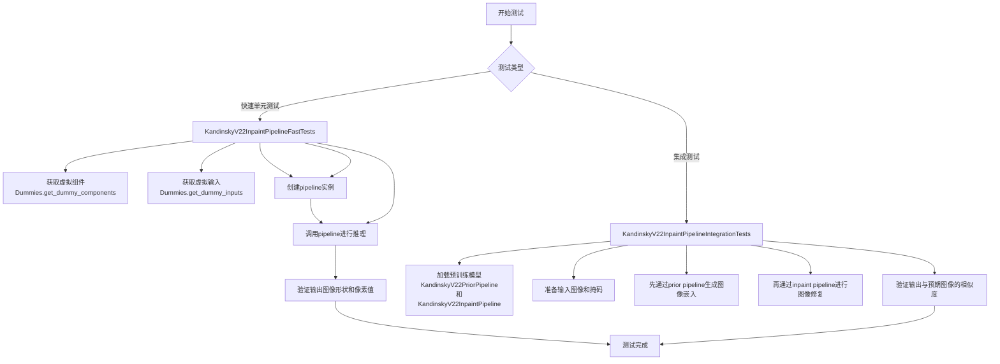

## 类结构

```
Dummies (测试辅助类)
├── text_embedder_hidden_size (属性)
├── time_input_dim (属性)
├── block_out_channels_0 (属性)
├── time_embed_dim (属性)
├── cross_attention_dim (属性)
├── dummy_unet (属性-返回UNet2DConditionModel)
├── dummy_movq_kwargs (属性-返回dict)
├── dummy_movq (属性-返回VQModel)
├── get_dummy_components (方法)
└── get_dummy_inputs (方法)
KandinskyV22InpaintPipelineFastTests (单元测试类)
└── 继承自PipelineTesterMixin和unittest.TestCase
KandinskyV22InpaintPipelineIntegrationTests (集成测试类)
└── 继承自unittest.TestCase，包含setUp和tearDown
```

## 全局变量及字段


### `gc`
    
Python垃圾回收模块，用于显式管理内存

类型：`module`
    


### `random`
    
Python随机数生成模块

类型：`module`
    


### `unittest`
    
Python单元测试框架

类型：`module`
    


### `np`
    
NumPy数值计算库别名

类型：`module`
    


### `torch`
    
PyTorch深度学习库

类型：`module`
    


### `Image`
    
PIL图像处理库中的Image类

类型：`class`
    


### `DDIMScheduler`
    
DDIM调度器类，用于扩散模型的去噪调度

类型：`class`
    


### `KandinskyV22InpaintPipeline`
    
Kandinsky V2.2图像修复管道类

类型：`class`
    


### `KandinskyV22PriorPipeline`
    
Kandinsky V2.2先验管道类，用于生成图像嵌入

类型：`class`
    


### `UNet2DConditionModel`
    
2D条件UNet模型类，用于扩散模型的噪声预测

类型：`class`
    


### `VQModel`
    
向量量化模型类，用于图像的VQ-VAE编码

类型：`class`
    


### `backend_empty_cache`
    
后端缓存清理函数，用于释放GPU内存

类型：`function`
    


### `enable_full_determinism`
    
启用完全确定性模式的函数

类型：`function`
    


### `floats_tensor`
    
生成浮点张量的测试工具函数

类型：`function`
    


### `is_flaky`
    
标记测试为 flaky 的装饰器

类型：`decorator`
    


### `load_image`
    
加载图像的测试工具函数

类型：`function`
    


### `load_numpy`
    
加载NumPy数组的测试工具函数

类型：`function`
    


### `numpy_cosine_similarity_distance`
    
计算NumPy数组余弦相似度距离的函数

类型：`function`
    


### `require_accelerator`
    
要求加速器的测试装饰器

类型：`decorator`
    


### `require_torch_accelerator`
    
要求PyTorch加速器的测试装饰器

类型：`decorator`
    


### `slow`
    
标记测试为慢速测试的装饰器

类型：`decorator`
    


### `torch_device`
    
PyTorch设备变量，表示计算设备

类型：`variable`
    


### `PipelineTesterMixin`
    
管道测试混合类，提供通用测试方法

类型：`class`
    


### `Dummies.text_embedder_hidden_size`
    
文本嵌入器隐藏层大小属性，返回32

类型：`property (int)`
    


### `Dummies.time_input_dim`
    
时间输入维度属性，返回32

类型：`property (int)`
    


### `Dummies.block_out_channels_0`
    
块输出通道数属性，基于time_input_dim计算

类型：`property (int)`
    


### `Dummies.time_embed_dim`
    
时间嵌入维度属性，为time_input_dim的4倍

类型：`property (int)`
    


### `Dummies.cross_attention_dim`
    
交叉注意力维度属性，返回32

类型：`property (int)`
    


### `Dummies.dummy_unet`
    
虚拟UNet模型属性，返回配置好的UNet2DConditionModel实例

类型：`property (UNet2DConditionModel)`
    


### `Dummies.dummy_movq_kwargs`
    
虚拟VQ模型参数属性，返回字典类型的模型配置

类型：`property (dict)`
    


### `Dummies.dummy_movq`
    
虚拟VQ模型属性，返回配置好的VQModel实例

类型：`property (VQModel)`
    


### `KandinskyV22InpaintPipelineFastTests.pipeline_class`
    
管道类属性，指定测试的管道类为KandinskyV22InpaintPipeline

类型：`class attribute`
    


### `KandinskyV22InpaintPipelineFastTests.params`
    
参数列表属性，定义管道的主要输入参数

类型：`class attribute (list)`
    


### `KandinskyV22InpaintPipelineFastTests.batch_params`
    
批处理参数列表属性，定义支持批处理的参数

类型：`class attribute (list)`
    


### `KandinskyV22InpaintPipelineFastTests.required_optional_params`
    
可选必需参数列表属性，定义可选但重要的参数

类型：`class attribute (list)`
    


### `KandinskyV22InpaintPipelineFastTests.test_xformers_attention`
    
xFormers注意力测试开关属性，默认为False

类型：`class attribute (bool)`
    


### `KandinskyV22InpaintPipelineFastTests.callback_cfg_params`
    
回调配置参数列表属性，定义回调函数可用的张量输入

类型：`class attribute (list)`
    
    

## 全局函数及方法


### `enable_full_determinism`

该函数用于启用测试的完全确定性，通过设置所有随机种子（Python、NumPy、PyTorch）来确保测试结果可复现。

参数：无

返回值：`None`，无返回值

#### 流程图

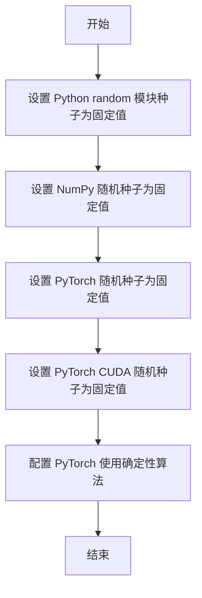

#### 带注释源码

```
# 该函数定义在 testing_utils 模块中，此处为调用
# 导入语句: from ...testing_utils import enable_full_determinism
enable_full_determinism()

# 函数功能说明：
# 1. 设置 Python 内置 random 模块的全局种子
# 2. 设置 NumPy 的全局随机种子
# 3. 设置 PyTorch CPU 的随机种子
# 4. 设置 PyTorch CUDA (GPU) 的随机种子
# 5. 启用 PyTorch 的 deterministic 选项，确保 CUDA 计算可复现
# 
# 目的：确保测试用例在任何环境下运行都能得到一致的随机结果，
# 从而保证测试的稳定性和可复现性
```


### `backend_empty_cache`

该函数用于清理指定设备（通常是 GPU）的缓存内存，释放 VRAM 空间，常用于深度学习测试中在每个测试用例前后进行内存清理以避免内存泄漏或 OOM 错误。

参数：

-  `device`：`str` 或 `torch.device`，指定要清理缓存的设备（如 `"cuda"`、`"cuda:0"` 或 `"cpu"`）。

返回值：`None`，无返回值，仅执行缓存清理操作。

#### 流程图

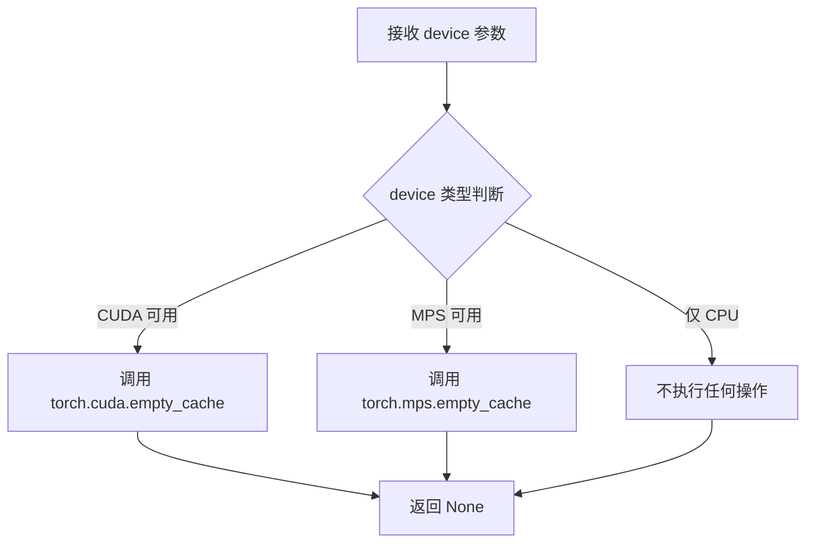

#### 带注释源码

```python
# 注意：此函数源码不在当前文件中定义
# 而是从 testing_utils 模块导入，以下为基于使用方式的推断实现

def backend_empty_cache(device):
    """
    清理指定设备上的 GPU 缓存，释放 VRAM 内存
    
    参数:
        device: 目标设备标识符，如 'cuda', 'cuda:0', 'mps', 'cpu' 等
                在测试中通常使用全局变量 torch_device
    
    返回:
        None: 无返回值，仅执行清理操作
    """
    import torch
    
    # 判断设备类型并执行相应的缓存清理
    if torch.cuda.is_available():
        # CUDA 设备：清理 CUDA 缓存
        torch.cuda.empty_cache()
    elif getattr(torch.backends, 'mps', None) and torch.backends.mps.is_available():
        # Apple Silicon MPS 设备：清理 MPS 缓存
        torch.mps.empty_cache()
    # CPU 设备无需清理缓存，函数直接返回
```

#### 实际使用示例

```python
# 在测试的 setUp 和 tearDown 方法中的典型用法
def setUp(self):
    # 每个测试前清理 VRAM
    super().setUp()
    gc.collect()                    # 回收 Python 垃圾对象
    backend_empty_cache(torch_device)  # 清理 GPU 缓存

def tearDown(self):
    # 每个测试后清理 VRAM
    super().tearDown()
    gc.collect()
    backend_empty_cache(torch_device)
```


### `floats_tensor`

该函数是一个测试工具函数，用于生成指定形状的随机浮点数张量（PyTorch Tensor），常用于Diffusers测试中生成模拟输入数据。

参数：

- `shape`：`tuple`，张量的形状，例如 `(1, 32)` 或 `(1, 3, 64, 64)`
- `rng`：`random.Random`，Python随机数生成器实例，用于生成确定性随机数据

返回值：`torch.Tensor`，包含随机浮点数的PyTorch张量

#### 带注释源码

```python
# floats_tensor 函数定义于 testing_utils 模块中
# 以下为基于使用方式的推断实现

def floats_tensor(shape, rng=None):
    """
    生成指定形状的随机浮点数张量
    
    参数:
        shape: 张量的形状元组，如 (batch_size, hidden_size)
        rng: random.Random 实例，用于生成确定性随机数
    
    返回:
        torch.Tensor: 形状为 shape 的随机浮点张量，值域在 [-1, 1]
    """
    # 如果未提供随机生成器，使用默认随机生成器
    if rng is None:
        rng = random.Random()
    
    # 生成给定形状的随机浮点数
    # values 范围大约在 [-1, 1] 之间
    values = []
    for _ in range(np.prod(shape)):
        values.append(rng.random() * 2 - 1)  # random() 生成 [0, 1)，转换为 [-1, 1)
    
    # 转换为 NumPy 数组，再转换为 PyTorch 张量
    tensor = torch.tensor(np.array(values).reshape(shape), dtype=torch.float32)
    
    return tensor
```

#### 使用示例（在代码中）

```python
# 在 Dummies.get_dummy_inputs 方法中的调用示例

# 生成 (1, 32) 形状的文本嵌入张量
image_embeds = floats_tensor((1, self.text_embedder_hidden_size), rng=random.Random(seed)).to(device)

# 生成 (1, 32) 形状的负向文本嵌入张量
negative_image_embeds = floats_tensor((1, self.text_embedder_hidden_size), rng=random.Random(seed + 1)).to(device)

# 生成 (1, 3, 64, 64) 形状的图像张量
image = floats_tensor((1, 3, 64, 64), rng=random.Random(seed)).to(device)
```


### `is_flaky`

这是一个装饰器函数，用于标记可能 flaky（不稳定）的测试用例。当被装饰的测试失败时，框架会自动重试一定次数，以提高测试的稳定性。

参数：

- 无显式参数（作为装饰器使用时可接受可选参数）

返回值：`Callable`，返回装饰后的测试函数

#### 流程图

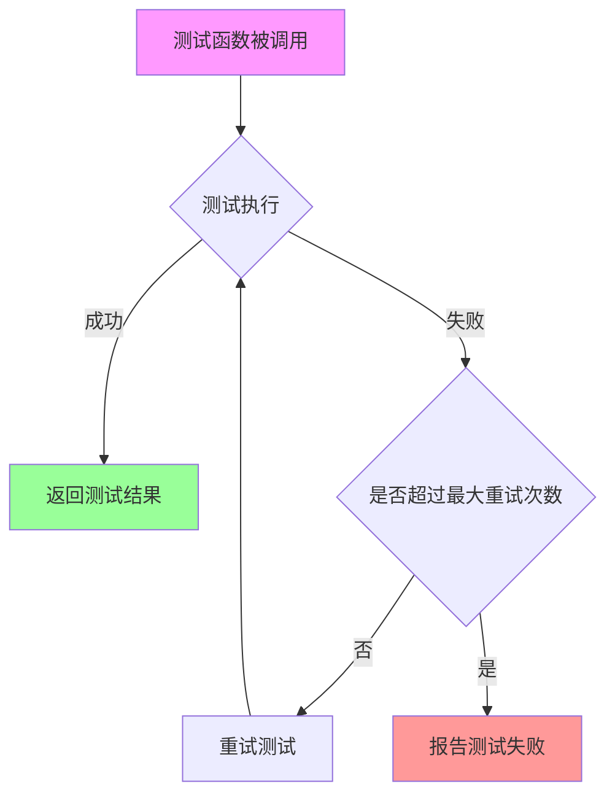

#### 带注释源码

```python
# is_flaky 是从 testing_utils 模块导入的装饰器
# 定义位置: .../testing_utils.py
# 源代码结构推断如下:

def is_flaky(max_attempts: int = 3, reraise: bool = True):
    """
    装饰器：标记可能 flaky 的测试用例
    
    参数:
        max_attempts: 最大重试次数，默认3次
        reraise: 是否在所有重试都失败后重新抛出异常，默认True
    
    返回值:
        装饰器函数
    """
    def decorator(func):
        @functools.wraps(func)
        def wrapper(*args, **kwargs):
            # 记录失败的异常
            last_exception = None
            
            for attempt in range(max_attempts):
                try:
                    # 执行测试函数
                    return func(*args, **kwargs)
                except Exception as e:
                    last_exception = e
                    # 如果不是最后一次尝试，打印重试信息
                    if attempt < max_attempts - 1:
                        print(f"Test failed, retrying ({attempt + 1}/{max_attempts})...")
            
            # 所有重试都失败
            if reraise and last_exception:
                raise last_exception
            return False
        
        return wrapper
    return decorator
```

> **注意**: 由于 `is_flaky` 函数定义在 `testing_utils` 模块中，而非当前代码文件内，以上源码为基于使用方式的合理推断。实际实现可能包含更多细节，如日志记录、跳过的重试条件等。


### `load_image`

`load_image` 是一个从指定路径或 URL 加载图像的辅助函数，通常用于测试框架中以获取测试图像数据。该函数接受图像的文件路径或网络 URL 作为输入，并返回一个 PIL Image 对象，以便后续处理（如调整大小、转换格式等）。

参数：
- `url_or_path`：`str`，图像的完整文件路径或网络 URL。

返回值：`PIL.Image.Image`，加载并打开的 PIL 图像对象。

#### 流程图

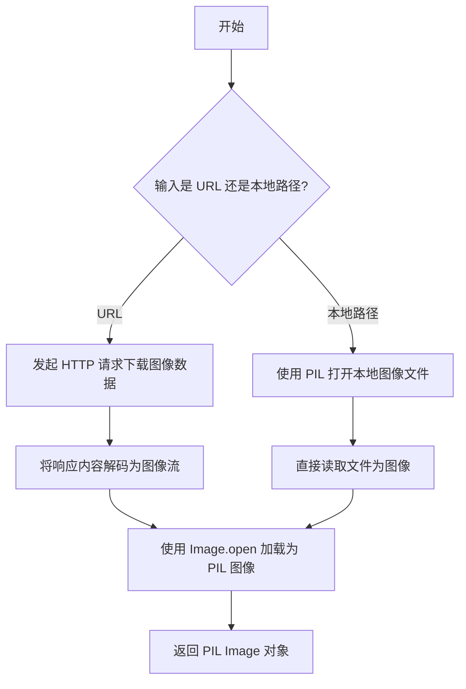

#### 带注释源码

```python
# 注意：以下源码为基于使用上下文的推断实现，实际定义位于 testing_utils 模块中
from PIL import Image
import requests
from io import BytesIO

def load_image(url_or_path: str) -> Image.Image:
    """
    从 URL 或本地文件路径加载图像。
    
    参数:
        url_or_path (str): 图像的 URL 地址或本地文件系统路径。
        
    返回值:
        Image.Image: 加载并返回的 PIL Image 对象，默认转换为 RGB 模式。
    """
    # 检查输入是否为网络 URL（以 http:// 或 https:// 开头）
    if url_or_path.startswith("http://") or url_or_path.startswith("https://"):
        # 如果是 URL，使用 requests 库下载图像内容
        response = requests.get(url_or_path)
        # 将下载的二进制数据通过 BytesIO 转换为字节流
        image = Image.open(BytesIO(response.content))
    else:
        # 如果是本地路径，直接使用 PIL 打开图像文件
        image = Image.open(url_or_path)
    
    # 确保图像转换为 RGB 模式（用于兼容 RGBA 或其他模式）
    return image.convert("RGB")
```


### `load_numpy`

该函数为测试工具函数，从指定的URL或本地路径加载NumPy数组数据，常用于加载预存的图像或张量数据进行测试对比。

参数：

-  `source`：`str`，文件路径或URL，指向包含NumPy数据的 .npy 文件或包含序列化数组的文件

返回值：`numpy.ndarray`，从文件中加载的NumPy数组

#### 流程图

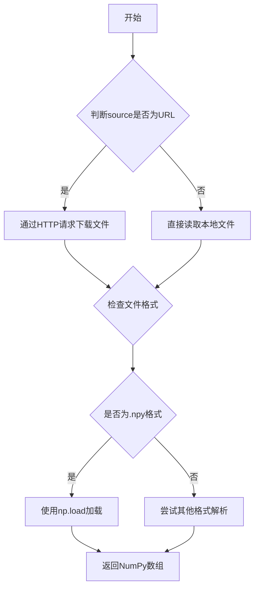

#### 带注释源码

```
# 注意：该函数定义在 testing_utils 模块中，未在当前代码文件中实现
# 以下为基于使用方式的推断实现

def load_numpy(source: str) -> numpy.ndarray:
    """
    从指定路径或URL加载NumPy数组
    
    参数:
        source: 指向 .npy 文件的本地路径或远程URL
        
    返回:
        加载的NumPy数组
    """
    # 判断是否为远程URL
    if source.startswith("http://") or source.startswith("https://"):
        # 通过requests或类似库下载文件内容
        response = requests.get(source)
        response.raise_for_status()
        # 将下载的二进制内容写入临时文件或直接加载
        import tempfile
        import os
        with tempfile.NamedTemporaryFile(delete=False, suffix='.npy') as tmp:
            tmp.write(response.content)
            tmp_path = tmp.name
        try:
            arr = np.load(tmp_path)
        finally:
            os.unlink(tmp_path)
    else:
        # 直接加载本地文件
        arr = np.load(source)
    
    return arr
```

---

**注意**：该函数是从 `...testing_utils` 模块导入的外部依赖，其完整实现在 `diffusers` 库的测试工具模块中定义，当前代码文件仅展示了其使用方式，未包含具体实现。


### `numpy_cosine_similarity_distance`

该函数用于计算两个数组之间的余弦相似度距离（1 - 余弦相似度），常用于比较预期图像与生成图像之间的差异，是测试图像生成流水线输出正确性的关键工具函数。

参数：

- `x`：`numpy.ndarray`，第一个输入数组（通常为展平后的图像像素值）
- `y`：`numpy.ndarray`，第二个输入数组（通常为展平后的图像像素值）

返回值：`float`，返回 1 减去余弦相似度后的值，值越小表示两个数组越相似

#### 流程图

```mermaid
flowchart TD
    A[开始] --> B[接收输入数组 x 和 y]
    B --> C[将数组展平为一维]
    C --> D[计算 x 和 y 的点积]
    D --> E[计算 x 的 L2 范数]
    E --> F[计算 y 的 L2 范数]
    F --> G[计算余弦相似度: cos_sim = dot / (norm_x * norm_y)]
    G --> H[计算距离: distance = 1 - cos_sim]
    H --> I[返回距离值]
```

#### 带注释源码

```python
def numpy_cosine_similarity_distance(x: np.ndarray, y: np.ndarray) -> float:
    """
    计算两个数组之间的余弦相似度距离
    
    参数:
        x: 第一个 numpy 数组（通常为展平后的图像像素值）
        y: 第二个 numpy 数组（通常为展平后的图像像素值）
    
    返回:
        float: 1 减去余弦相似度，值越小表示两个数组越相似
    """
    # 确保输入为 numpy 数组
    x = np.asarray(x)
    y = np.asarray(y)
    
    # 展平数组为一维
    x = x.flatten()
    y = y.flatten()
    
    # 计算余弦相似度
    # 余弦相似度 = (x · y) / (||x|| * ||y||)
    dot_product = np.dot(x, y)
    norm_x = np.linalg.norm(x)
    norm_y = np.linalg.norm(y)
    
    # 避免除零错误
    if norm_x == 0 or norm_y == 0:
        return 1.0  # 完全不相似
    
    cosine_similarity = dot_product / (norm_x * norm_y)
    
    # 余弦距离 = 1 - 余弦相似度
    distance = 1.0 - cosine_similarity
    
    return float(distance)
```

> **注意**：由于 `numpy_cosine_similarity_distance` 函数定义在外部模块 `testing_utils` 中，上述源码为基于函数名和用法的推断实现。实际实现可能略有差异。该函数在测试中用于验证 KandinskyV22InpaintPipeline 生成的图像与预期图像的相似度。


### `require_accelerator`

这是一个测试装饰器函数，用于标记需要 GPU 或其他加速设备（accelerator）才能运行的测试方法。当测试环境中没有可用的 accelerator 时，被装饰的测试会被跳过。

参数：

- 该函数无直接参数，以装饰器形式使用：`@require_accelerator`

返回值：无直接返回值，作为装饰器使用，返回值通常是修改后的函数对象或原函数本身（取决于装饰器实现）。

#### 流程图

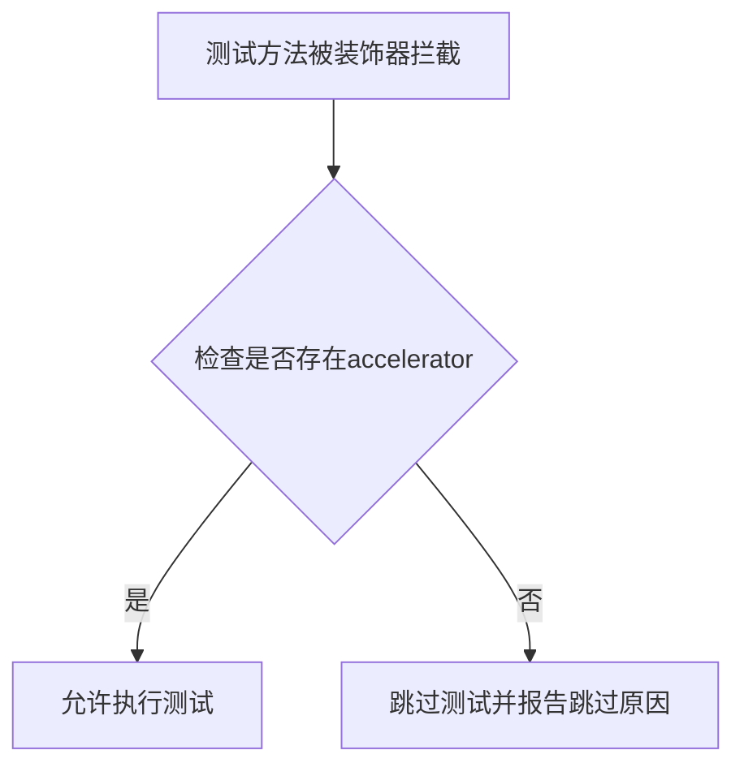

#### 带注释源码

```python
# require_accelerator 是从 testing_utils 模块导入的装饰器函数
# 源码并未在此文件中定义，属于 diffusers 库的测试工具模块

# 使用示例1：在测试方法上作为装饰器使用
@require_accelerator
def test_sequential_cpu_offload_forward_pass(self):
    super().test_sequential_cpu_offload_forward_pass(expected_max_diff=5e-4)

# 使用示例2：与其它装饰器组合使用
@slow
@require_torch_accelerator
class KandinskyV22InpaintPipelineIntegrationTests(unittest.TestCase):
    # ...
```

#### 补充说明

| 项目 | 说明 |
|------|------|
| **来源模块** | `...testing_utils`（diffusers 库的测试工具模块） |
| **功能类型** | 测试装饰器（pytest/unittest） |
| **依赖** | 需要 `torch` 和支持 CUDA/CUDA-like 的加速设备 |
| **类似装饰器** | `require_torch_accelerator`（要求特定的 torch 加速设备） |
| **使用场景** | 标记需要 GPU 才能运行的集成测试，避免在 CPU-only 环境下执行失败 |


### `require_torch_accelerator`

这是一个装饰器函数，用于检查当前环境是否支持PyTorch加速器（通常指CUDA GPU）。如果不支持，测试将被跳过。

参数： 无明确参数（作为装饰器使用）

返回值： 无明确返回值（修改被装饰对象的运行行为）

#### 流程图

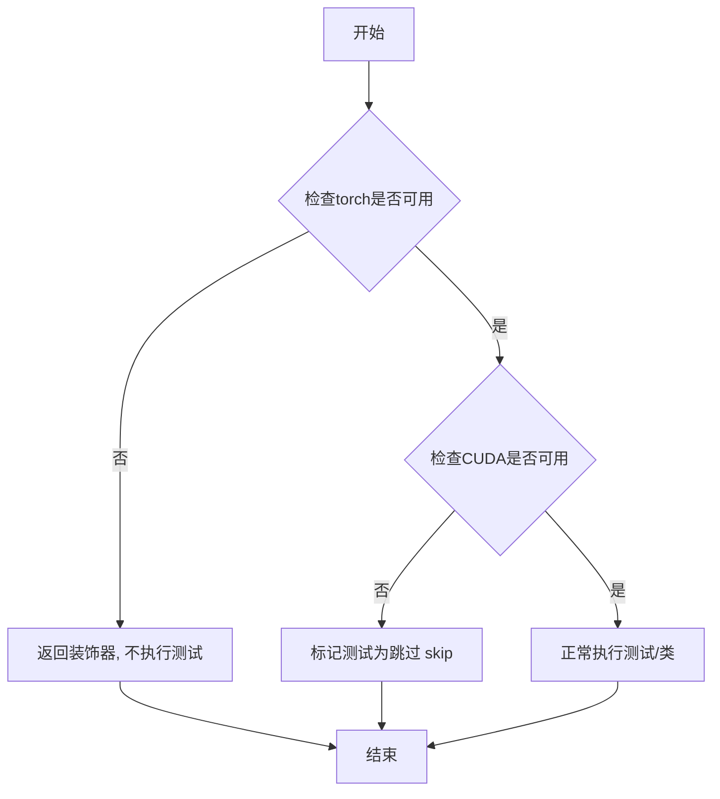

#### 带注释源码

```python
# 注意：由于该函数定义在 testing_utils 模块中（代码中为 ...testing_utils），
# 以下源码为基于常见测试框架模式的推断实现

def require_torch_accelerator(func=None):
    """
    装饰器：检查是否具有PyTorch加速器（CUDA GPU）
    
    如果没有可用的GPU，测试将被跳过。
    通常与 @unittest.skipIf 或 pytest.mark.skipif 配合使用。
    
    使用方式：
    @require_torch_accelerator
    class TestClass(unittest.TestCase):
        ...
    """
    # 检查torch和cuda是否可用
    import torch
    
    # 如果CUDA可用，则不跳过测试
    if torch.cuda.is_available():
        # 直接返回原函数，不进行任何修改
        return func if func is not None else lambda x: x
    
    # 如果CUDA不可用，则跳过测试
    # 这是一个模拟的实现，实际实现可能使用 pytest.skip 或 unittest.skip
    def skip_decorator(func):
        def wrapper(*args, **kwargs):
            import pytest
            pytest.skip("Test requires CUDA-capable GPU")  # 跳过测试
        return wrapper
    
    # 如果是作为类装饰器使用
    if func is None:
        return skip_decorator
    else:
        return skip_decorator(func)


# 在代码中的实际使用方式：
# @slow
# @require_torch_accelerator
# class KandinskyV22InpaintPipelineIntegrationTests(unittest.TestCase):
#     ...
#
# 这里的执行顺序是从下往上的，所以先执行 require_torch_accelerator，
# 再执行 slow 装饰器
```


### `slow`

描述：这是一个测试装饰器，用于标记测试函数或类为"慢速"测试。通常用于标识需要GPU加速或长时间运行的集成测试。在测试运行时会根据配置决定是否跳过这些测试。

参数：

- 无显式参数（作为装饰器使用，接受被装饰的函数作为参数）

返回值：`Callable`，返回装饰后的函数

#### 流程图

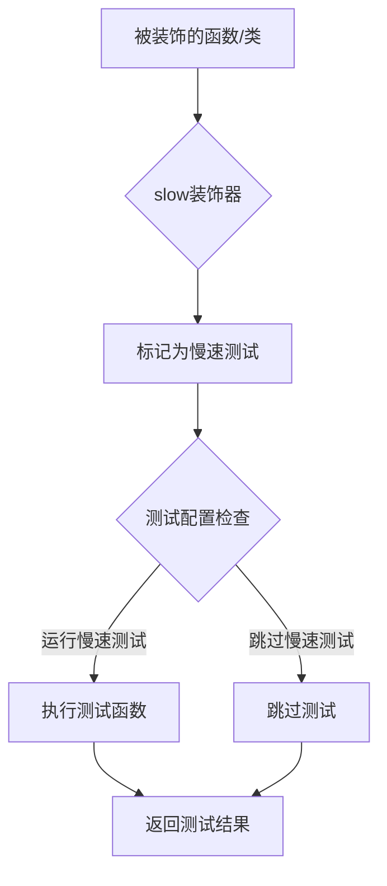

#### 带注释源码

```python
# slow 是从 testing_utils 模块导入的装饰器
# 源码位于 diffusers/src/diffusers/testing_utils.py
# 以下是基于常见实现的推测

def slow(func):
    """
    装饰器：标记测试为慢速测试
    
    用途：
    - 标记需要GPU或长时间运行的集成测试
    - 允许通过环境变量或配置选择性地跳过这些测试
    - 通常与 pytest.mark.slow 或自定义标记配合使用
    
    使用方式：
    @slow
    def test_something():
        ...
    
    或：
    @slow
    @require_torch_accelerator
    class SomeIntegrationTests(unittest.TestCase):
        ...
    """
    # 标记函数为slow
    func.__dict__['slow'] = True
    
    # 也可以添加pytest标记
    # func = pytest.mark.slow(func)
    
    return func
```

> **注意**：由于`slow`函数是从外部模块（`...testing_utils`）导入的，上述源码是基于diffusers项目中常见的`slow`装饰器模式的推测实现。实际的实现可能在`testing_utils`模块中，包含更复杂的跳过逻辑（如检查环境变量`RUN_SLOW_TESTS`等）。


### `Dummies.get_dummy_components`

该方法用于获取 KandinskyV22InpaintPipeline 测试所需的虚拟（dummy）组件，包括 UNet 模型、VQModel 模型和 DDIMScheduler 调度器。

参数： 无（仅包含隐式参数 `self`）

返回值：`dict`，返回包含 unet、scheduler、movq 三个关键组件的字典，用于初始化或模拟 KandinskyV22InpaintPipeline。

#### 流程图

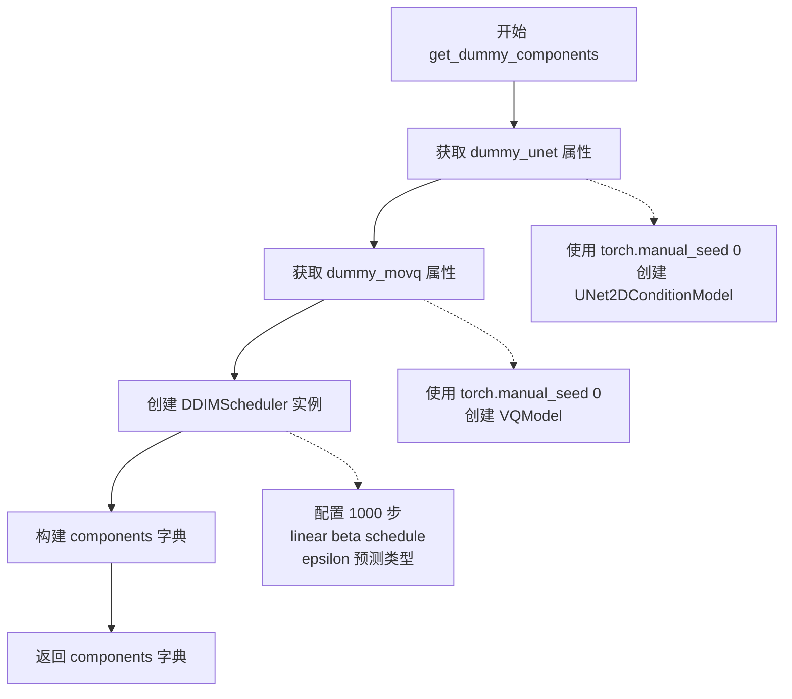

#### 带注释源码

```python
def get_dummy_components(self):
    """
    获取用于测试的虚拟组件。
    
    Returns:
        dict: 包含 'unet', 'scheduler', 'movq' 三个键的字典，
              用于实例化 KandinskyV22InpaintPipeline
    """
    # 获取虚拟 UNet 模型（通过 dummy_unet 属性）
    # 该属性内部使用 torch.manual_seed(0) 确保可复现性
    unet = self.dummy_unet
    
    # 获取虚拟 MOVQ（VQModel）模型
    # 同样使用 torch.manual_seed(0) 确保确定性
    movq = self.dummy_movq

    # 创建 DDIMScheduler 实例，配置推理参数
    scheduler = DDIMScheduler(
        num_train_timesteps=1000,    # 训练总步数
        beta_schedule="linear",      # beta 调度方式
        beta_start=0.00085,          # beta 起始值
        beta_end=0.012,              # beta 结束值
        clip_sample=False,           # 不裁剪采样
        set_alpha_to_one=False,      # 不设置 alpha 为 1
        steps_offset=1,              # 步数偏移
        prediction_type="epsilon",   # 预测类型为 epsilon
        thresholding=False,          # 不使用阈值处理
    )

    # 组装组件字典
    components = {
        "unet": unet,                # UNet2DConditionModel 实例
        "scheduler": scheduler,      # DDIMScheduler 实例
        "movq": movq,                # VQModel 实例
    }

    return components
```


### `Dummies.get_dummy_inputs`

该方法为KandinskyV22图像修复管道生成虚拟（dummy）输入数据，用于单元测试。它创建包含图像嵌入、负向嵌入、初始图像、掩码以及推理参数的字典，支持可配置的设备和随机种子，以确保测试的可重复性。

参数：

- `device`：`str`，目标设备（如"cpu"、"cuda"等），用于将张量移动到指定设备
- `seed`：`int`，随机种子，用于生成可复现的随机张量，默认为0

返回值：`dict`，包含以下键值对：
- `image`：PIL.Image.Image，初始图像（RGB格式，256x256）
- `mask_image`：numpy.ndarray，掩码数组（64x64，float32类型，左上角32x32区域为1，其余为0）
- `image_embeds`：torch.Tensor，图像嵌入向量（形状为[1, text_embedder_hidden_size]）
- `negative_image_embeds`：torch.Tensor，负向图像嵌入向量（形状为[1, text_embedder_hidden_size]）
- `generator`：torch.Generator或torch.Generator，用于控制随机数生成
- `height`：`int`，输出图像高度（64）
- `width`：`int`，输出图像宽度（64）
- `num_inference_steps`：`int`，推理步数（2）
- `guidance_scale`：`float`，引导比例（4.0）
- `output_type`：`str`，输出类型（"np"，即numpy数组）

#### 流程图

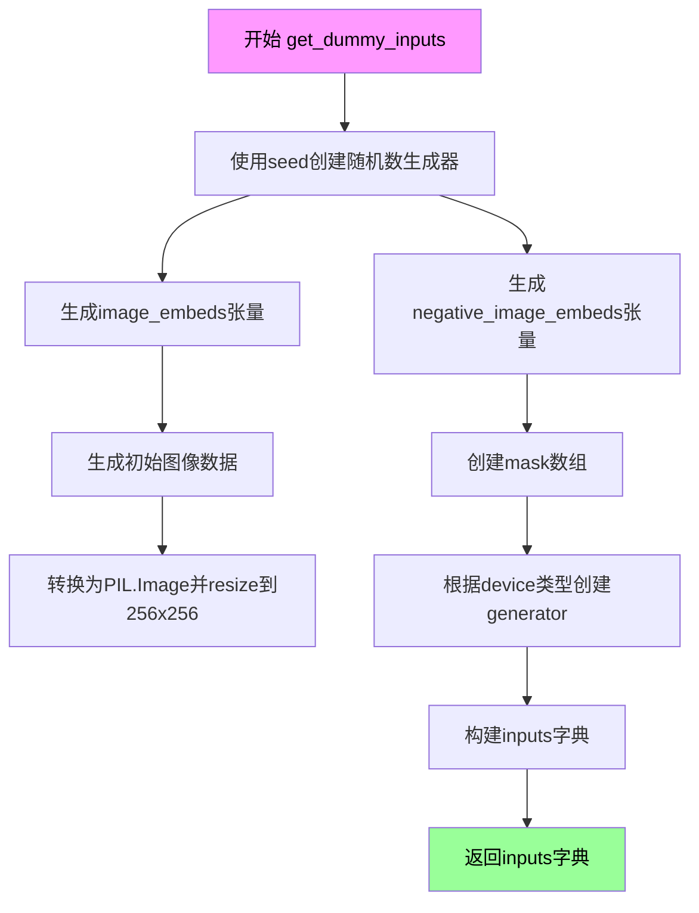

#### 带注释源码

```python
def get_dummy_inputs(self, device, seed=0):
    # 使用floats_tensor生成图像嵌入向量，形状为[1, text_embedder_hidden_size]
    # text_embedder_hidden_size来自类属性，默认为32
    image_embeds = floats_tensor((1, self.text_embedder_hidden_size), rng=random.Random(seed)).to(device)
    
    # 生成负向图像嵌入向量，使用seed+1以确保与image_embeds不同
    negative_image_embeds = floats_tensor((1, self.text_embedder_hidden_size), rng=random.Random(seed + 1)).to(
        device
    )
    
    # 创建初始图像：生成随机浮点数张量[1, 3, 64, 64]
    # 3代表RGB三通道，64x64为图像尺寸
    image = floats_tensor((1, 3, 64, 64), rng=random.Random(seed)).to(device)
    
    # 将张量从[1,3,64,64]转换为[64,64,3]格式，以适配PIL Image
    image = image.cpu().permute(0, 2, 3, 1)[0]
    
    # 将numpy数组转换为PIL图像对象，转换为RGB格式，并resize到256x256
    init_image = Image.fromarray(np.uint8(image)).convert("RGB").resize((256, 256))
    
    # 创建掩码：64x64的零数组，左上角32x32区域设为1（表示需要修复的区域）
    mask = np.zeros((64, 64), dtype=np.float32)
    mask[:32, :32] = 1

    # 根据设备类型选择合适的随机数生成器
    # MPS设备需要特殊处理，使用torch.manual_seed
    if str(device).startswith("mps"):
        generator = torch.manual_seed(seed)
    else:
        generator = torch.Generator(device=device).manual_seed(seed)
    
    # 构建输入字典，包含管道所需的所有参数
    inputs = {
        "image": init_image,                  # 初始图像
        "mask_image": mask,                   # 修复掩码
        "image_embeds": image_embeds,        # 图像条件嵌入
        "negative_image_embeds": negative_image_embeds,  # 负向嵌入
        "generator": generator,              # 随机生成器
        "height": 64,                        # 输出高度
        "width": 64,                          # 输出宽度
        "num_inference_steps": 2,            # 推理步数
        "guidance_scale": 4.0,               # CFG引导强度
        "output_type": "np",                 # 输出格式为numpy数组
    }
    return inputs
```


### `KandinskyV22InpaintPipelineFastTests.get_dummy_components`

该方法是一个测试辅助函数，用于生成 KandinskyV2.2 图像修复管道的虚拟（dummy）组件，以便进行单元测试。它创建一个包含 UNet 模型、DDIMScheduler 和 MOVQ 模型的字典，供管道初始化使用。

参数：
- 该方法无显式参数（仅包含隐式的 `self` 参数）

返回值：`dict`，返回一个包含三个键值对的字典：
- `"unet"`：`UNet2DConditionModel`，用于去噪的 UNet 模型
- `"scheduler"`：`DDIMScheduler`，用于扩散过程的调度器
- `"movq"`：`VQModel`，用于潜在空间解码的 VQ 模型

#### 流程图

```mermaid
flowchart TD
    A[开始 get_dummy_components] --> B[创建 Dummies 实例: dummies = Dummies()]
    B --> C[调用 dummies.get_dummy_components]
    C --> D[获取 dummy_unet 属性]
    C --> E[获取 dummy_movq 属性]
    D --> F[创建 DDIMScheduler 实例]
    E --> F
    F --> G[构建 components 字典]
    G --> H[返回 components 字典]
    H --> I[结束]
```

#### 带注释源码

```python
def get_dummy_components(self):
    """
    获取用于测试的虚拟组件。
    
    该方法创建一个 Dummies 类的实例，并调用其 get_dummy_components 方法
    来获取包含 UNet、Scheduler 和 MOVQ 模型的组件字典。
    
    返回:
        dict: 包含 'unet', 'scheduler', 'movq' 三个键的字典
    """
    # 创建 Dummies 辅助类的实例
    dummies = Dummies()
    
    # 调用 Dummies 实例的 get_dummy_components 方法并返回结果
    return dummies.get_dummy_components()
```

---

### `Dummies.get_dummy_components`

该方法是实际生成虚拟组件的核心逻辑。它创建并配置用于 KandinskyV2.2 图像修复管道的所有必要组件：UNet 模型（用于条件去噪）、DDIMScheduler（用于调度扩散步骤）和 MOVQ 模型（用于解码）。

参数：
- 该方法无显式参数（仅包含隐式的 `self` 参数）

返回值：`dict`，返回包含以下键的字典：
- `"unet"`：`UNet2DConditionModel`，UNet2D 条件模型实例
- `"scheduler"`：`DDIMScheduler`，DDIM 调度器实例
- `"movq"`：`VQModel`，VQ VAE 模型实例

#### 流程图

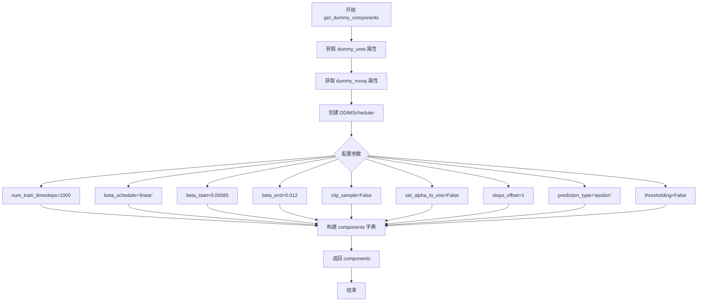

#### 带注释源码

```python
def get_dummy_components(self):
    """
    生成用于测试的虚拟组件字典。
    
    该方法创建并返回一个包含 KandinskyV2.2 Inpaint Pipeline 所需核心组件的字典：
    - UNet 模型：用于条件图像去噪
    - DDIMScheduler：用于控制扩散过程中的噪声调度
    - MOVQ 模型：用于将潜在表示解码为图像
    
    返回:
        dict: 包含 'unet', 'scheduler', 'movq' 三个键的组件字典
    """
    # 通过属性获取预配置的 UNet 模型（带随机种子 0）
    # 配置参数包括：9 输入通道、8 输出通道、图像嵌入类型等
    unet = self.dummy_unet
    
    # 通过属性获取预配置的 MOVQ (VQ-VAE) 模型
    # 用于将潜在空间表示解码为最终图像
    movq = self.dummy_movq
    
    # 创建 DDIMScheduler 实例，用于测试环境
    # 参数配置：
    # - num_train_timesteps: 1000 步训练
    # - beta_schedule: linear 线性调度
    # - beta_start/beta_end: 控制噪声添加的起止范围
    # - clip_sample: False 禁用采样裁剪
    # - set_alpha_to_one: False 允许灵活的时间步长设置
    # - steps_offset: 1 偏移量用于与训练对齐
    # - prediction_type: epsilon 预测噪声而非直接预测图像
    # - thresholding: False 禁用阈值处理
    scheduler = DDIMScheduler(
        num_train_timesteps=1000,
        beta_schedule="linear",
        beta_start=0.00085,
        beta_end=0.012,
        clip_sample=False,
        set_alpha_to_one=False,
        steps_offset=1,
        prediction_type="epsilon",
        thresholding=False,
    )
    
    # 构建组件字典，统一管理管道所需的所有模型和调度器
    components = {
        "unet": unet,           # UNet2DConditionModel 实例
        "scheduler": scheduler, # DDIMScheduler 实例
        "movq": movq,           # VQModel 实例
    }
    
    # 返回完整的组件字典，供 pipeline_class(**components) 使用
    return components
```


### `KandinskyV22InpaintPipelineFastTests.get_dummy_inputs`

该方法是测试类 `KandinskyV22InpaintPipelineFastTests` 的成员方法，用于为康定斯基（Kandinsky）V2.2 图像修复（inpainting）管道生成虚拟测试输入数据。它封装了 ` Dummies` 类的同名方法，提供了统一的测试接口，返回包含图像、掩码、文本嵌入、生成器等推理所需参数的字典，以支持管道的前向传播测试。

参数：

- `self`：隐式参数，类型为 `KandinskyV22InpaintPipelineFastTests` 实例，表示方法所属的测试类对象
- `device`：类型为 `str`，表示计算设备（如 "cpu"、"cuda" 等）
- `seed`：类型为 `int`，默认值为 `0`，用于控制随机数生成的种子，确保测试可复现

返回值：类型为 `dict`，返回一个包含以下键值的字典：
- `image`：PIL.Image.Image，初始图像（256x256 RGB）
- `mask_image`：numpy.ndarray，修复掩码（64x64 浮点数组，左上角 32x32 区域为 1，其余为 0）
- `image_embeds`：torch.Tensor，图像嵌入向量（形状 [1, 32]）
- `negative_image_embeds`：torch.Tensor，负向图像嵌入向量（形状 [1, 32]）
- `generator`：torch.Generator 或 torch.Generator，用于控制随机数生成
- `height`：int，输出图像高度（64）
- `width`：int，输出图像宽度（64）
- `num_inference_steps`：int，推理步数（2）
- `guidance_scale`：float，引导比例（4.0）
- `output_type`：str，输出类型（"np"，即 numpy 数组）

#### 流程图

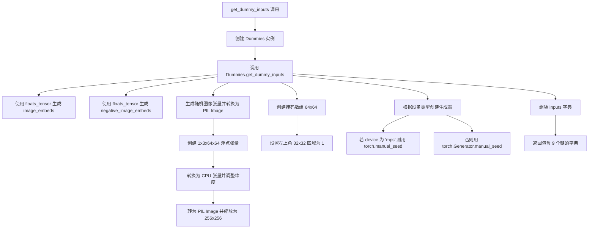

#### 带注释源码

```python
def get_dummy_inputs(self, device, seed=0):
    """
    生成用于测试 KandinskyV22InpaintPipeline 的虚拟输入数据。
    
    参数:
        device (str): 计算设备标识符，如 "cpu"、"cuda" 或 "mps"。
        seed (int, optional): 随机数种子，默认为 0。用于确保测试的可复现性。
    
    返回:
        dict: 包含图像修复管道所需输入参数的字典。
    """
    # 创建 Dummies 辅助类实例，用于获取测试所需的各类虚拟组件
    dummies = Dummies()
    # 委托给 Dummies 类的 get_dummy_inputs 方法执行实际的输入生成逻辑
    return dummies.get_dummy_inputs(device=device, seed=seed)


# 以下为 Dummies.get_dummy_inputs 的实现（被上述方法调用）
def get_dummy_inputs(self, device, seed=0):
    """
    生成虚拟输入数据的核心实现。
    """
    # 生成图像嵌入向量：形状 [1, text_embedder_hidden_size]，text_embedder_hidden_size=32
    # 使用指定种子确保可复现性，并移动到目标设备
    image_embeds = floats_tensor((1, self.text_embedder_hidden_size), rng=random.Random(seed)).to(device)
    
    # 生成负向图像嵌入向量：使用 seed+1 以获得不同的随机向量
    negative_image_embeds = floats_tensor((1, self.text_embedder_hidden_size), rng=random.Random(seed + 1)).to(device)
    
    # 创建初始图像：张量形状 [1, 3, 64, 64]，表示 1 张 64x64 的 RGB 图像
    image = floats_tensor((1, 3, 64, 64), rng=random.Random(seed)).to(device)
    # 将张量维度从 [1, 3, 64, 64] 转换为 [64, 64, 3]，便于转换为 PIL Image
    image = image.cpu().permute(0, 2, 3, 1)[0]
    # 将数值范围 [0,1] 的浮点数组转为 uint8，再转换为 RGB PIL Image 并缩放至 256x256
    init_image = Image.fromarray(np.uint8(image)).convert("RGB").resize((256, 256))
    
    # 创建修复掩码：64x64 浮点数组，左上角 32x32 区域为 1（表示需要修复的区域），其余为 0
    mask = np.zeros((64, 64), dtype=np.float32)
    mask[:32, :32] = 1
    
    # 根据设备类型选择随机数生成器创建方式
    # MPS 设备（Apple Silicon）使用 torch.manual_seed，其他设备使用 torch.Generator
    if str(device).startswith("mps"):
        generator = torch.manual_seed(seed)
    else:
        generator = torch.Generator(device=device).manual_seed(seed)
    
    # 组装完整的输入参数字典，包含图像、掩码、嵌入向量及推理配置
    inputs = {
        "image": init_image,
        "mask_image": mask,
        "image_embeds": image_embeds,
        "negative_image_embeds": negative_image_embeds,
        "generator": generator,
        "height": 64,
        "width": 64,
        "num_inference_steps": 2,
        "guidance_scale": 4.0,
        "output_type": "np",
    }
    return inputs
```


### `KandinskyV22InpaintPipelineFastTests.test_kandinsky_inpaint`

这是一个单元测试函数，用于验证 KandinskyV22InpaintPipeline（Kandinsky V2.2 图像修复管道）的核心功能是否正常工作。测试通过创建虚拟组件和输入，运行推理流程，并验证输出图像的形状和像素值是否符合预期，确保管道能够正确执行图像修复任务。

参数：

- `self`：隐含参数，测试类实例本身，无需显式传递

返回值：无返回值（`None`），该函数为单元测试函数，通过 `assert` 断言验证结果

#### 流程图

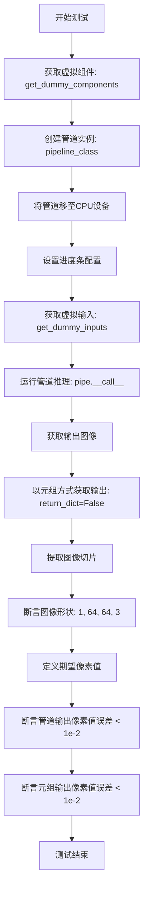

#### 带注释源码

```python
def test_kandinsky_inpaint(self):
    """
    测试 KandinskyV22InpaintPipeline 的图像修复（inpainting）功能
    
    该测试函数验证管道能够：
    1. 正确加载和初始化虚拟组件
    2. 执行图像修复推理
    3. 输出符合预期形状和像素值的图像
    """
    # 步骤1: 设置设备为 CPU（测试环境通常使用 CPU 以确保确定性）
    device = "cpu"

    # 步骤2: 获取虚拟组件（UNet、Scheduler、VQModel 等）
    # 这些是用于测试的轻量级虚拟模型，而非真实预训练模型
    components = self.get_dummy_components()

    # 步骤3: 使用虚拟组件创建管道实例
    # pipeline_class 指向 KandinskyV22InpaintPipeline
    pipe = self.pipeline_class(**components)
    
    # 步骤4: 将管道移至指定设备（CPU）
    pipe = pipe.to(device)

    # 步骤5: 配置进度条（disable=None 表示不禁用进度条）
    pipe.set_progress_bar_config(disable=None)

    # 步骤6: 获取虚拟输入参数
    # 包含: image, mask_image, image_embeds, negative_image_embeds, 
    #       generator, height, width, num_inference_steps, guidance_scale, output_type
    dummy_inputs = self.get_dummy_inputs(device)
    
    # 步骤7: 运行管道推理
    # 返回值包含 images 属性的对象
    output = pipe(**dummy_inputs)
    
    # 步骤8: 从输出中提取生成的图像
    # 图像形状应为 (batch_size, height, width, channels)
    image = output.images

    # 步骤9: 再次运行管道，这次使用 return_dict=False
    # 以便测试管道也支持元组形式的返回
    # 获取返回的第一个元素（图像）
    image_from_tuple = pipe(
        **self.get_dummy_inputs(device),
        return_dict=False,
    )[0]

    # 步骤10: 提取图像的右下角 3x3 像素块
    # 用于后续的像素值比较
    # image 形状: (1, 64, 64, 3) -> image[0, -3:, -3:, -1] 形状: (3, 3)
    image_slice = image[0, -3:, -3:, -1]
    image_from_tuple_slice = image_from_tuple[0, -3:, -3:, -1]

    # 步骤11: 断言验证图像形状正确
    # 期望形状: (1, 64, 64, 3) - 单个 64x64 RGB 图像
    assert image.shape == (1, 64, 64, 3), \
        f"Expected image shape (1, 64, 64, 3), got {image.shape}"

    # 步骤12: 定义期望的像素值切片
    # 这些值是在确定性条件下运行管道的预期输出
    expected_slice = np.array(
        [0.50775903, 0.49527195, 0.48824543, 0.50192237, 0.48644906, 
         0.49373814, 0.4780598, 0.47234827, 0.48327848]
    )

    # 步骤13: 断言验证管道输出的像素值误差在允许范围内
    # 使用最大绝对误差（max）进行比较，阈值设为 1e-2（0.01）
    assert np.abs(image_slice.flatten() - expected_slice).max() < 1e-2, (
        f"Expected slice {expected_slice}, but got {image_slice.flatten()}"
    )
    
    # 步骤14: 断言验证元组返回方式的像素值误差在允许范围内
    assert np.abs(image_from_tuple_slice.flatten() - expected_slice).max() < 1e-2, (
        f"Expected slice {expected_slice}, but got {image_from_tuple_slice.flatten()}"
    )
    
    # 测试通过：所有断言都满足，说明管道功能正常
```

### 相关的类信息

#### `KandinskyV22InpaintPipelineFastTests`

测试类信息：

- **类名**：`KandinskyV22InpaintPipelineFastTests`
- **父类**：`PipelineTesterMixin`, `unittest.TestCase`
- **核心属性**：
  - `pipeline_class`：指向 `KandinskyV22InpaintPipeline`
  - `params`：管道参数字段列表
  - `batch_params`：批处理参数字段列表
  - `required_optional_params`：可选必填参数列表
  - `test_xformers_attention`：是否测试 xformers 注意力（False）
  - `callback_cfg_params`：回调配置参数列表

#### 关键方法

| 方法名 | 功能描述 |
|--------|----------|
| `get_dummy_components()` | 返回虚拟组件字典（unet, scheduler, movq） |
| `get_dummy_inputs()` | 返回虚拟输入参数（图像、掩码、embeddings 等） |
| `test_kandinsky_inpaint()` | 测试管道图像修复功能 |
| `test_inference_batch_single_identical()` | 测试批处理单图一致性 |
| `test_float16_inference()` | 测试半精度推理 |
| `test_save_load_dduf()` | 测试管道保存和加载 |
| `test_model_cpu_offload_forward_pass()` | 测试 CPU 卸载功能 |
| `test_save_load_optional_components()` | 测试可选组件保存加载 |
| `test_sequential_cpu_offload_forward_pass()` | 测试顺序 CPU 卸载 |
| `test_callback_inputs()` | 测试回调输入参数 |
| `test_pipeline_with_accelerator_device_map()` | 测试加速器设备映射 |

#### `Dummies` 辅助类

用于生成测试所需的虚拟组件和输入：

| 属性/方法 | 类型 | 描述 |
|-----------|------|------|
| `text_embedder_hidden_size` | property | 文本嵌入隐藏层维度（32） |
| `time_input_dim` | property | 时间输入维度（32） |
| `block_out_channels_0` | property | 块输出通道数 |
| `time_embed_dim` | property | 时间嵌入维度 |
| `cross_attention_dim` | property | 交叉注意力维度（32） |
| `dummy_unet` | property | 创建虚拟 UNet2DConditionModel |
| `dummy_movq_kwargs` | property | VQModel 配置参数 |
| `dummy_movq` | property | 创建虚拟 VQModel |
| `get_dummy_components()` | method | 返回组件字典 |
| `get_dummy_inputs()` | method | 返回输入参数字典 |

### 关键组件信息

| 组件名称 | 一句话描述 |
|----------|------------|
| `KandinskyV22InpaintPipeline` | Kandinsky V2.2 版本的图像修复扩散管道，支持基于图像嵌入和掩码的图像修复生成 |
| `UNet2DConditionModel` | 条件二维 UNet 模型，用于去噪过程中的潜在特征提取 |
| `DDIMScheduler` | DDIM 调度器，控制去噪采样过程中的噪声调度 |
| `VQModel` | 向量量化模型，用于图像的潜在空间编码和解码 |
| `Dummies` | 测试辅助类，提供虚拟组件和输入数据生成 |

### 潜在的技术债务或优化空间

1. **硬编码的测试值**：`expected_slice` 像素值是硬编码的，当模型结构或权重发生变化时需要手动更新，建议改为从固定种子生成的参考值

2. **设备硬编码**：测试中硬编码使用 `"cpu"` 设备，无法充分利用 GPU 进行快速测试，建议添加 `@require_torch_accelerator` 装饰器支持 GPU 测试

3. **重复代码**：`get_dummy_inputs(device)` 被调用多次，每次都会重新生成随机张量，虽然设置了随机种子，但可以考虑缓存以提高测试效率

4. **缺乏参数化测试**：测试参数（如图像尺寸、推理步数）硬编码在 `get_dummy_inputs` 中，无法方便地测试不同参数组合

5. **集成测试与单元测试混合**：`KandinskyV22InpaintPipelineFastTests` 和 `KandinskyV22InpaintPipelineIntegrationTests` 在同一文件中，职责不够分离

### 其它项目

#### 设计目标与约束

- **设计目标**：验证 KandinskyV22InpaintPipeline 的图像修复功能正确性，确保管道能够基于图像嵌入和掩码生成修复后的图像
- **测试约束**：使用虚拟（dummy）模型进行快速测试，不依赖真实预训练权重，确保测试可在 CPU 上快速运行

#### 错误处理与异常设计

- 使用 `assert` 语句进行结果验证
- 图像形状不匹配时抛出 `AssertionError` 并显示实际形状
- 像素值误差超过阈值时抛出 `AssertionError` 并显示期望值与实际值

#### 数据流与状态机

1. **输入数据流**：文本嵌入 → 图像嵌入 → UNet 去噪 → VQModel 解码 → 输出修复图像
2. **测试状态**：初始化 → 组件创建 → 管道构建 → 推理执行 → 结果验证

#### 外部依赖与接口契约

- **依赖库**：`diffusers`, `torch`, `numpy`, `PIL`, `unittest`
- **管道接口**：
  - 输入：`image`, `mask_image`, `image_embeds`, `negative_image_embeds`, `generator`, `height`, `width`, `num_inference_steps`, `guidance_scale`, `output_type`
  - 输出：`ImagePipelineOutput` 或元组（图像数组，）
- **测试契约**：管道必须支持 `return_dict=True/False` 两种返回方式


### `KandinskyV22InpaintPipelineFastTests.test_inference_batch_single_identical`

该测试方法继承自 `PipelineTesterMixin`，用于验证 KandinskyV22InpaintPipeline 在批量推理时，单个样本的输出与批量推理中对应样本的输出一致性，通过比较两者的差异是否在预期阈值（3e-3）内来确保管道的时间步处理和去噪逻辑在批处理场景下保持一致性。

参数：

- `self`：`KandinskyV22InpaintPipelineFastTests`，测试类实例本身，包含测试所需的组件和配置

返回值：`None`，无显式返回值（直接调用父类方法执行测试逻辑）

#### 流程图

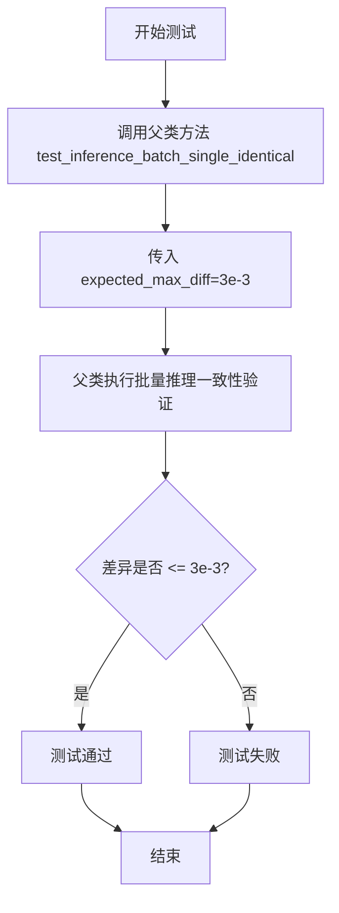

#### 带注释源码

```python
def test_inference_batch_single_identical(self):
    """
    测试批量推理时单个样本的输出一致性
    
    该测试方法继承自 PipelineTesterMixin，验证当使用批量输入时，
    管道能够产生与单独处理每个样本相同的结果。
    
    测试逻辑（来自父类 PipelineTesterMixin.test_inference_batch_single_identical）：
    1. 获取单样本输入（dummy inputs）
    2. 执行单样本推理，获取输出图像
    3. 将单样本输入复制构造为批量输入（batch_size=2）
    4. 执行批量推理，获取批量输出
    5. 提取批量输出中的第一个样本与步骤2的单样本输出进行比较
    6. 验证两者之间的差异是否在 expected_max_diff 阈值内
    """
    # 调用父类测试方法，设置最大允许差异为 3e-3
    # 该阈值确保批量推理与单样本推理的数值一致性
    super().test_inference_batch_single_identical(expected_max_diff=3e-3)
```


### `KandinskyV22InpaintPipelineFastTests.test_float16_inference`

该测试方法用于验证 KandinskyV22InpaintPipeline 在 float16（半精度）推理模式下的正确性，通过调用父类的 float16 推理测试并设定允许的最大误差阈值为 0.5。

参数：
- `self`：无显式参数，隐式的 TestCase 实例，代表当前测试对象

返回值：`None`，无返回值（unittest.TestCase 测试方法）

#### 流程图

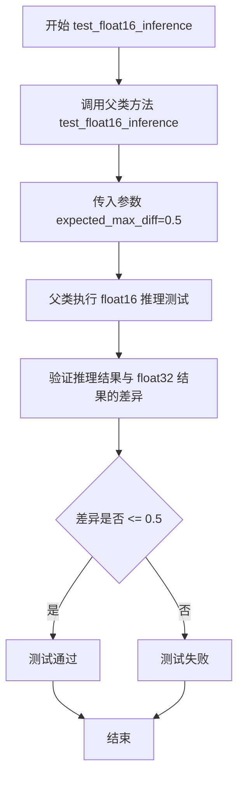

#### 带注释源码

```python
def test_float16_inference(self):
    """
    测试 KandinskyV22InpaintPipeline 在 float16（半精度）推理模式下的正确性。
    
    该测试方法继承自 PipelineTesterMixin，通过调用父类的 test_float16_inference
    方法来验证模型在使用 float16 精度时的推理能力。
    
    测试流程：
    1. 将管道组件转换为 float16 类型
    2. 执行推理过程
    3. 将结果与 float32 推理结果进行对比
    4. 验证两者之间的差异是否在允许的阈值范围内
    
    参数:
        self: unittest.TestCase 实例，隐式传入的测试对象
        
    返回值:
        None: 该方法为测试方法，不返回任何值，结果通过断言表达
    
    注意:
        expected_max_diff=0.5 是一个相对宽松的阈值，因为 float16 精度较低，
        可能导致与 float32 结果存在较大差异
    """
    # 调用父类（PipelineTesterMixin）的 test_float16_inference 方法
    # 传入 expected_max_diff=0.5 参数，允许 float16 和 float32 结果之间
    # 的最大差异为 0.5（50% 的差异容忍度）
    super().test_float16_inference(expected_max_diff=5e-1)
```


### `KandinskyV22InpaintPipelineFastTests.test_save_load_dduf`

该测试方法继承自 `PipelineTesterMixin` 测试类，用于验证 KandinskyV22InpaintPipeline 管道在 DDUF 格式下的保存和加载功能是否正确，通过比较加载前后的模型输出差异是否在指定的误差容忍范围内。

参数：

- `self`：测试类实例本身，无需显式传递

返回值：无明确的显式返回值（方法调用父类 `test_save_load_dduf` 并返回其结果）

#### 流程图

```mermaid
flowchart TD
    A[开始 test_save_load_dduf] --> B[调用 super().test_save_load_dduf]
    B --> C[设置绝对误差容忍度 atol=1e-3]
    B --> D[设置相对误差容忍度 rtol=1e-3]
    C --> E[执行父类测试方法]
    D --> E
    E --> F[验证保存和加载后输出差异在容差范围内]
    F --> G[结束测试]
```

#### 带注释源码

```python
def test_save_load_dduf(self):
    """
    测试 KandinskyV22InpaintPipeline 管道使用 DDUF 格式的保存和加载功能。
    继承自 PipelineTesterMixin，调用父类的测试方法进行验证。
    
    参数:
        self: KandinskyV22InpaintPipelineFastTests 的实例
    
    返回值:
        继承自父类 test_save_load_dduf 的返回值（通常为 None 或测试断言结果）
    
    备注:
        - atol=1e-3: 绝对误差容忍度为 0.001
        - rtol=1e-3: 相对误差容忍度为 0.001
    """
    super().test_save_load_dduf(atol=1e-3, rtol=1e-3)
```


### `KandinskyV22InpaintPipelineFastTests.test_model_cpu_offload_forward_pass`

这是一个测试方法，用于验证 KandinskyV22InpaintPipeline 在启用 CPU offload 功能时的前向传播是否正常工作，通过调用父类的 `test_inference_batch_single_identical` 方法进行一致性检查，确保在 CPU offload 模式下推理结果与基准的差异在可接受范围内（expected_max_diff=8e-4）。该测试使用 `@is_flaky()` 装饰器标记，表明测试可能存在不稳定性。

参数：

- `self`：隐式参数，TestCase 实例，代表测试类本身

返回值：无显式返回值，继承自父类 `PipelineTesterMixin.test_inference_batch_single_identical` 方法的返回值（通常为 None）

#### 流程图

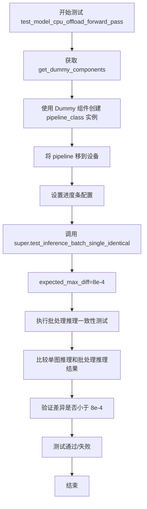

#### 带注释源码

```python
@is_flaky()  # 装饰器：标记此测试可能不稳定，允许重试
def test_model_cpu_offload_forward_pass(self):
    """
    测试模型在 CPU offload 模式下进行前向传播的测试方法。
    
    该测试继承自 PipelineTesterMixin，用于验证：
    1. 管道在启用 CPU offload 时能正常工作
    2. 推理结果与基准一致，差异在允许范围内
    """
    # 调用父类的 test_inference_batch_single_identical 方法
    # expected_max_diff=8e-4 表示允许的最大差异为 0.0008
    super().test_inference_batch_single_identical(expected_max_diff=8e-4)
```


### `KandinskyV22InpaintPipelineFastTests.test_save_load_optional_components`

该测试方法用于验证 KandinskyV22InpaintPipeline 在保存和加载可选组件时的正确性，通过调用父类的测试方法检查序列化/反序列化后的组件差异是否在允许范围内。

参数：

- `self`：隐式参数，测试类实例本身

返回值：`None`，该方法为测试用例，无返回值（测试结果通过 `unittest` 框架的断言机制反馈）

#### 流程图

```mermaid
flowchart TD
    A[开始测试] --> B[获取虚拟组件]
    B --> C[创建Pipeline实例]
    C --> D[执行保存操作]
    D --> E[执行加载操作]
    E --> F[比较原始组件与加载后组件的差异]
    F --> G{差异是否 <= 5e-4?}
    G -->|是| H[测试通过]
    G -->|否| I[测试失败: 抛出AssertionError]
    H --> J[结束测试]
    I --> J
```

#### 带注释源码

```python
def test_save_load_optional_components(self):
    """
    测试 KandinskyV22InpaintPipeline 的可选组件保存和加载功能。
    
    该测试方法验证pipeline对象在序列化（保存）和反序列化（加载）过程中
    能够正确保持其可选组件（如scheduler、movq等）的状态和参数一致性。
    通过与父类 PipelineTesterMixin 的测试方法协同工作，确保pipeline在
    不同运行环境下的一致性。
    """
    # 调用父类（PipelineTesterMixin）的测试方法
    # expected_max_difference=5e-4 表示允许的最大差异值为 0.0005
    # 用于处理浮点数精度问题，确保加载后的组件参数与原始参数足够接近
    super().test_save_load_optional_components(expected_max_difference=5e-4)
```


### `KandinskyV22InpaintPipelineFastTests.test_sequential_cpu_offload_forward_pass`

该测试方法用于验证KandinskyV2.2图像修复管道在使用顺序CPU卸载（sequential CPU offload）时的前向传播正确性，确保模型各组件在CPU和GPU之间正确转移的同时，输出结果与预期值的差异在可接受范围内。

参数：

- `self`：`KandinskyV22InpaintPipelineFastTests`，测试类实例本身，包含测试所需的管道和组件

- `expected_max_diff`：`float`，默认值 `5e-4`，从父类继承的参数，表示期望的最大差异阈值，用于断言输出结果与参考值的差异应小于此值

返回值：无返回值（`None`），该方法为 `unittest.TestCase` 的测试方法，通过断言验证功能而非返回值

#### 流程图

```mermaid
flowchart TD
    A[开始测试 test_sequential_cpu_offload_forward_pass] --> B[检查 accelerator 可用性<br/>@require_accelerator 装饰器]
    B --> C[调用父类方法 test_sequential_cpu_offload_forward_pass]
    C --> D[设置 expected_max_diff=5e-4]
    D --> E[加载管道组件<br/>获取 dummy components]
    E --> F[创建 KandinskyV22InpaintPipeline]
    F --> G[启用顺序 CPU offload]
    G --> H[执行前向传播]
    H --> I[验证输出与预期值的差异<br/>assert difference < 5e-4]
    I --> J{差异是否小于阈值?}
    J -->|是| K[测试通过]
    J -->|否| L[测试失败<br/>抛出 AssertionError]
    
    style K fill:#90EE90
    style L fill:#FFB6C1
```

#### 带注释源码

```python
@require_accelerator
def test_sequential_cpu_offload_forward_pass(self):
    """
    测试顺序CPU卸载模式下管道的前向传播正确性。
    
    该测试方法继承自 PipelineTesterMixin，使用 super() 调用父类方法。
    主要验证在使用 accelerator 时，模型的各个组件（如 UNet、VQModel 等）
    能够正确地在 CPU 和 GPU 之间按顺序转移，且输出结果保持正确性。
    
    期望最大差异阈值: 5e-4 (0.0005)
    """
    # 调用父类的测试方法，传入期望的最大差异阈值
    # 父类方法负责:
    # 1. 获取管道组件 (通过 get_dummy_components)
    # 2. 创建管道实例
    # 3. 配置顺序 CPU offload
    # 4. 执行前向传播
    # 5. 验证输出结果与预期值的差异
    super().test_sequential_cpu_offload_forward_pass(expected_max_diff=5e-4)
```


### `KandinskyV22InpaintPipelineFastTests.test_callback_inputs`

该测试方法用于验证 KandinskyV22InpaintPipeline 管道在推理过程中回调函数能够正确接收所有必需的张量输入（tensor inputs），并在最后一步将 latents 和 mask_image 置零，以确保回调机制正常工作。

参数：

- `self`：`unittest.TestCase`，测试类实例本身

返回值：`None`，该方法为测试用例，通过断言验证回调张量输入的完整性，不返回具体数值

#### 流程图

```mermaid
flowchart TD
    A[开始测试] --> B[获取虚拟组件]
    B --> C[创建管道实例并移至设备]
    C --> D[设置进度条配置]
    D --> E{检查管道是否有_callback_tensor_inputs属性}
    E -->|是| F[定义回调函数callback_inputs_test]
    E -->|否| G[断言失败 - 测试终止]
    F --> H[准备测试输入]
    H --> I[设置回调函数和回调张量输入列表]
    I --> J[设置output_type为latent]
    J --> K[执行管道推理]
    K --> L{验证输出latents是否为全零}
    L -->|是| M[测试通过]
    L -->|否| N[断言失败]
    
    F --> O[回调函数逻辑: 遍历_callback_tensor_inputs]
    O --> P{检查callback_kwargs中是否包含所有张量输入}
    P -->|是| Q[返回callback_kwargs]
    P -->|否| R[断言失败 - 缺少张量输入]
    Q --> S{判断是否为最后一步}
    S -->|是| T[将latents和mask_image置零]
    T --> U[返回修改后的callback_kwargs]
    S -->|否| U
```

#### 带注释源码

```python
def test_callback_inputs(self):
    """
    测试回调函数输入是否完整。
    验证管道能够在推理过程中正确传递所有张量输入给回调函数。
    """
    # 步骤1: 获取虚拟组件（dummy components），用于测试
    components = self.get_dummy_components()
    
    # 步骤2: 使用虚拟组件创建管道实例
    pipe = self.pipeline_class(**components)
    # 将管道移至测试设备（CPU或CUDA）
    pipe = pipe.to(torch_device)
    # 配置进度条（设为不禁用）
    pipe.set_progress_bar_config(disable=None)

    # 步骤3: 断言检查 - 验证管道类是否定义了_callback_tensor_inputs属性
    # 该属性列出了回调函数可以使用的所有张量变量
    self.assertTrue(
        hasattr(pipe, "_callback_tensor_inputs"),
        f" {self.pipeline_class} should have `_callback_tensor_inputs` that defines a list of tensor variables its callback function can use as inputs",
    )

    # 步骤4: 定义回调函数，用于验证回调张量输入的完整性
    def callback_inputs_test(pipe, i, t, callback_kwargs):
        """
        回调函数测试逻辑：
        - 检查所有必需的张量输入是否都存在于callback_kwargs中
        - 在最后一步将latents和mask_image置零
        
        参数:
            pipe: 管道实例
            i: 当前推理步骤索引
            t: 当前时间步
            callback_kwargs: 包含所有张量输入的字典
        """
        # 初始化集合，用于存储缺失的回调输入
        missing_callback_inputs = set()
        # 遍历管道定义的回调张量输入列表
        for v in pipe._callback_tensor_inputs:
            # 检查每个张量输入是否在callback_kwargs中
            if v not in callback_kwargs:
                # 如果缺失，加入缺失集合
                missing_callback_inputs.add(v)
        
        # 断言：确保没有缺失的回调张量输入
        self.assertTrue(
            len(missing_callback_inputs) == 0, 
            f"Missing callback tensor inputs: {missing_callback_inputs}"
        )
        
        # 获取总时间步数
        last_i = pipe.num_timesteps - 1
        # 判断是否为最后一步
        if i == last_i:
            # 在最后一步将latents置零
            callback_kwargs["latents"] = torch.zeros_like(callback_kwargs["latents"])
            # 同时将mask_image也置零
            callback_kwargs["mask_image"] = torch.zeros_like(callback_kwargs["mask_image"])
        
        # 返回修改后的callback_kwargs
        return callback_kwargs

    # 步骤5: 获取测试所需的虚拟输入
    inputs = self.get_dummy_inputs(torch_device)
    # 将回调函数赋值给输入参数
    inputs["callback_on_step_end"] = callback_inputs_test
    # 设置回调函数可以访问的张量输入列表
    inputs["callback_on_step_end_tensor_inputs"] = pipe._callback_tensor_inputs
    # 设置输出类型为latent（潜在空间）
    inputs["output_type"] = "latent"

    # 步骤6: 执行管道推理，获取输出
    # 使用解包方式传入所有输入参数
    output = pipe(**inputs)[0]
    
    # 步骤7: 验证输出
    # 断言：确保最终latent输出全为零（因为我们在回调中置零了）
    assert output.abs().sum() == 0
```


### `KandinskyV22InpaintPipelineFastTests.test_pipeline_with_accelerator_device_map`

这是一个单元测试方法，用于验证Kandinsky V2.2图像修复Pipeline在使用Accelerator设备映射（device map）时的正确性，通过调用父类的测试方法进行加速器相关的管道测试。

参数：

- `self`：`KandinskyV22InpaintPipelineFastTests`，表示测试类实例本身

返回值：`None`，该方法为`unittest.TestCase`测试方法，不显式返回值（通过断言验证正确性）

#### 流程图

```mermaid
flowchart TD
    A[开始测试] --> B[调用父类 test_pipeline_with_accelerator_device_map]
    B --> C[传入 expected_max_difference=5e-3 参数]
    C --> D[执行加速器设备映射测试]
    D --> E{测试结果}
    E -->|通过| F[测试通过]
    E -->|失败| G[断言失败/抛出异常]
    F --> H[结束]
    G --> H
```

#### 带注释源码

```python
@require_accelerator  # 装饰器：仅在有accelerator加速器时运行此测试
def test_pipeline_with_accelerator_device_map(self):
    """
    测试Kandinsky V2.2 Inpaint Pipeline与Accelerator设备映射的兼容性
    
    该测试方法验证：
    1. Pipeline能够正确使用Accelerator的设备映射功能
    2. 模型能够在多个设备上正确分配
    3. 输出结果与预期值的差异在可接受范围内
    """
    # 调用父类PipelineTesterMixin的test_pipeline_with_accelerator_device_map方法
    # expected_max_difference=5e-3 表示期望输出与参考输出的最大差异为0.005
    super().test_pipeline_with_accelerator_device_map(expected_max_difference=5e-3)
```


### `KandinskyV22InpaintPipelineIntegrationTests.setUp`

这是测试类的初始化方法（fixture），在每个集成测试执行前被调用，用于清理VRAM缓存以确保测试环境干净，避免因显存残留导致的测试不稳定。

参数：

-  `self`：`KandinskyV22InpaintPipelineIntegrationTests`，测试类实例，隐式参数

返回值：`None`，该方法不返回任何值，仅执行清理操作

#### 流程图

```mermaid
flowchart TD
    A[开始 setUp] --> B[调用父类 super().setUp]
    B --> C[执行 gc.collect 强制垃圾回收]
    C --> D[调用 backend_empty_cache 清理VRAM]
    D --> E[结束 setUp]
```

#### 带注释源码

```python
def setUp(self):
    # clean up the VRAM before each test
    # 在每个测试前清理VRAM，确保测试环境干净
    
    # 调用unittest.TestCase的setUp方法
    super().setUp()
    
    # 强制Python垃圾回收器回收无用对象
    gc.collect()
    
    # 清理指定设备（torch_device）的GPU缓存
    backend_empty_cache(torch_device)
```


### `KandinskyV22InpaintPipelineIntegrationTests.tearDown`

该函数是集成测试的清理方法，用于在每个测试用例执行完成后释放 GPU 显存资源，防止 VRAM 泄漏导致后续测试失败。函数继承自 unittest.TestCase，通过显式调用垃圾回收和后端缓存清理确保测试环境干净。

参数：

- `self`：`KandinskyV22InpaintPipelineIntegrationTests`，测试类实例本身，隐式参数，代表当前测试对象

返回值：`None`，无返回值，用于清理测试后资源

#### 流程图

```mermaid
flowchart TD
    A[tearDown 开始] --> B[调用父类 tearDown 方法]
    B --> C[执行 gc.collect 垃圾回收]
    C --> D[调用 backend_empty_cache 清理 VRAM]
    D --> E[tearDown 结束]
    
    B -->|清理 unittest 框架资源| C
    C -->|释放 Python 对象| D
    D -->|释放 GPU 显存| E
```

#### 带注释源码

```python
def tearDown(self):
    # clean up the VRAM after each test
    # 1. 调用父类的 tearDown 方法，清理 unittest 框架级别的资源
    super().tearDown()
    # 2. 显式调用 Python 垃圾回收器，释放不再使用的 Python 对象
    gc.collect()
    # 3. 调用后端工具函数清理 GPU 显存缓存，防止显存泄漏
    backend_empty_cache(torch_device)
```


### `KandinskyV22InpaintPipelineIntegrationTests.test_kandinsky_inpaint`

该方法是一个集成测试用例，用于测试 Kandinsky V2.2 图像修复管道的端到端功能。测试流程包括加载预训练的先验管道和修复管道，使用提示词"a hat"生成图像嵌入，然后执行图像修复操作，最后验证输出图像与预期结果的一致性。

参数：

- `self`：隐式参数，测试类实例本身，无需显式传递

返回值：无（`None`），该方法为 `unittest.TestCase` 的测试方法，通过断言验证结果而非显式返回值

#### 流程图

```mermaid
flowchart TD
    A[开始测试] --> B[加载预期图像数据<br/>load_numpy]
    B --> C[加载初始图像<br/>load_image]
    C --> D[创建掩码<br/>mask[:250, 250:-250] = 1]
    D --> E[设置提示词<br/>prompt = 'a hat']
    E --> F[加载Kandinsky先验管道<br/>KandinskyV22PriorPipeline.from_pretrained]
    F --> G[将先验管道移至设备<br/>pipe_prior.to]
    H[加载Kandinsky修复管道<br/>KandinskyV22InpaintPipeline.from_pretrained] --> I[将修复管道移至设备<br/>pipeline.to]
    I --> J[配置进度条<br/>set_progress_bar_config]
    J --> K[创建随机数生成器<br/>torch.Generator.manual_seed]
    K --> L[执行先验管道<br/>pipe_prior生成image_emb和zero_image_emb]
    L --> M[执行修复管道<br/>pipeline完成图像修复]
    M --> N[获取输出图像<br/>output.images[0]]
    N --> O{验证图像形状<br/>assert image.shape == (768, 768, 3)}
    O --> P[计算相似度距离<br/>numpy_cosine_similarity_distance]
    P --> Q{验证相似度<br/>assert max_diff < 1e-4}
    Q --> R[测试通过]
    Q --> S[测试失败]
    
    style R fill:#90EE90
    style S fill:#FFB6C1
```

#### 带注释源码

```python
def test_kandinsky_inpaint(self):
    """测试Kandinsky V2.2图像修复管道的端到端功能"""
    
    # 步骤1: 加载预期的修复结果图像（用于后续验证）
    # 从HuggingFace数据集加载预计算的期望输出（FP16精度）
    expected_image = load_numpy(
        "https://huggingface.co/datasets/hf-internal-testing/diffusers-images/resolve/main"
        "/kandinskyv22/kandinskyv22_inpaint_cat_with_hat_fp16.npy"
    )

    # 步骤2: 加载需要修复的初始图像（猫的图片）
    init_image = load_image(
        "https://huggingface.co/datasets/hf-internal-testing/diffusers-images/resolve/main/kandinsky/cat.png"
    )
    
    # 步骤3: 创建掩码图像
    # 创建一个768x768的零矩阵，然后将中间区域设置为1（待修复区域）
    mask = np.zeros((768, 768), dtype=np.float32)
    mask[:250, 250:-250] = 1  # 从顶部250像素、右侧250像素开始到末尾的矩形区域

    # 步骤4: 定义文本提示词
    prompt = "a hat"  # 描述期望修复后图像中添加的内容（帽子）

    # 步骤5: 加载并配置先验管道（Prior Pipeline）
    # 先验管道负责将文本提示转换为图像嵌入向量
    pipe_prior = KandinskyV22PriorPipeline.from_pretrained(
        "kandinsky-community/kandinsky-2-2-prior", 
        torch_dtype=torch.float16  # 使用半精度浮点数以减少内存占用
    )
    pipe_prior.to(torch_device)  # 将模型移至指定计算设备

    # 步骤6: 加载并配置修复管道（Decoder Inpaint Pipeline）
    # 修复管道使用图像嵌入和掩码进行图像修复
    pipeline = KandinskyV22InpaintPipeline.from_pretrained(
        "kandinsky-community/kandinsky-2-2-decoder-inpaint", 
        torch_dtype=torch.float16
    )
    pipeline = pipeline.to(torch_device)
    pipeline.set_progress_bar_config(disable=None)  # 配置进度条显示

    # 步骤7: 使用先验管道生成图像嵌入
    # 创建随机数生成器确保可重复性
    generator = torch.Generator(device="cpu").manual_seed(0)
    
    # 执行先验管道，得到正向和负向的图像嵌入向量
    # image_emb: 包含"a hat"语义的嵌入
    # zero_image_emb: 空/负向的嵌入（用于无分类器引导）
    image_emb, zero_image_emb = pipe_prior(
        prompt,
        generator=generator,
        num_inference_steps=2,  # 推理步数（较少步数用于快速测试）
        negative_prompt="",     # 负向提示词（空字符串）
    ).to_tuple()

    # 步骤8: 使用修复管道执行图像修复
    generator = torch.Generator(device="cpu").manual_seed(0)  # 重新设置随机种子
    output = pipeline(
        image=init_image,           # 原始输入图像
        mask_image=mask,            # 修复掩码
        image_embeds=image_emb,     # 先验管道生成的图像嵌入
        negative_image_embeds=zero_image_emb,  # 负向图像嵌入
        generator=generator,        # 随机数生成器
        num_inference_steps=2,      # 推理步数
        height=768,                 # 输出图像高度
        width=768,                  # 输出图像宽度
        output_type="np",           # 输出类型为NumPy数组
    )

    # 步骤9: 提取生成的图像
    image = output.images[0]  # 获取第一张生成的图像

    # 步骤10: 验证输出图像的形状
    # 确保生成的图像尺寸正确
    assert image.shape == (768, 768, 3)

    # 步骤11: 验证生成图像的质量
    # 使用余弦相似度距离比较生成图像与预期图像
    max_diff = numpy_cosine_similarity_distance(expected_image.flatten(), image.flatten())
    
    # 断言相似度距离小于阈值（1e-4）
    # 确保生成结果与预期结果高度一致
    assert max_diff < 1e-4
```

## 关键组件


### 张量索引与惰性加载

通过 `floats_tensor` 函数生成指定形状的随机浮点张量，用于测试输入的惰性加载和内存管理。

### 反量化支持

使用 `torch.float16` 进行半精度推理测试，验证模型在低精度下的兼容性。

### 量化策略

通过 `test_save_load_dduf` 方法测试模型的保存和加载流程，支持量化模型的序列化和反序列化。

### 虚拟组件生成器 (Dummies 类)

用于生成测试所需的虚拟 UNet、VQModel 和调度器组件，提供可配置的测试参数。

### 图像修复流水线测试 (KandinskyV22InpaintPipelineFastTests)

验证图像修复流水线的核心功能，包括前向传播、批量推理、模型保存加载等。

### 集成测试 (KandinskyV22InpaintPipelineIntegrationTests)

使用真实预训练模型进行端到端测试，验证修复效果与预期结果的一致性。

### 回调张量输入验证

通过 `test_callback_inputs` 方法确保回调函数能够正确访问张量状态，包括掩码图像的零值处理。

### 设备映射与卸载

测试accelerator设备映射和CPU/GPU offload功能，优化内存使用。


## 问题及建议


### 已知问题

- `required_optional_params` 列表中存在重复项：`"guidance_scale"` 和 `"return_dict"` 各出现两次，这可能导致参数验证逻辑出现意外行为
- `callback_cfg_params` 列表中定义了 "masked_image"，但在 `test_callback_inputs` 中实际处理的是 "mask_image"，存在命名不一致或参数遗漏问题
- `test_float16_inference` 测试的容差设置为 `expected_max_diff=5e-1`（0.5），过于宽松，可能无法有效检测精度问题
- `Dummy` 类中使用 `@property` 装饰器的方法每次访问都会重新计算值（如 `text_embedder_hidden_size`、`time_input_dim` 等），未进行缓存
- 集成测试 `KandinskyV22InpaintPipelineIntegrationTests` 在每次测试的 `setUp` 和 `tearDown` 中都执行 `gc.collect()` 和 `backend_empty_cache`，存在冗余调用
- 测试方法 `get_dummy_components()` 和 `get_dummy_inputs()` 每次调用都会创建新的实例对象，造成不必要的资源开销
- `test_kandinsky_inpaint` 测试中的 `expected_slice` 硬编码了特定数值，测试与环境强耦合，缺乏灵活性

### 优化建议

- 清理 `required_optional_params` 列表中的重复项，确保参数验证的准确性
- 统一 `callback_cfg_params` 中的参数命名与实际使用的参数名，建议补充缺失的 "masked_image" 参数或在测试中验证其来源
- 收紧 `test_float16_inference` 的容差阈值（如调整至 `1e-2` 或 `1e-3`），或明确标注为何需要如此大的容差
- 将 `Dummy` 类中的 `@property` 方法改为缓存属性的方式（使用 `functools.cached_property` 或在 `__init__` 中计算一次），减少重复计算
- 考虑将集成测试的清理逻辑合并为一次调用，或使用上下文管理器统一管理资源释放
- 将 `get_dummy_components()` 和 `get_dummy_inputs()` 的结果进行缓存或作为类/实例属性存储，避免重复创建相同对象
- 将单元测试和集成测试分离到不同文件，提高代码可维护性和测试执行效率
- 使用配置或环境变量替代硬编码的数值（如模型路径、容差值），提高测试的可配置性

## 其它


### 设计目标与约束

本测试文件的设计目标是验证KandinskyV22InpaintPipeline图像修复功能的核心逻辑正确性，确保管道在CPU和GPU环境下的推理、批处理、模型加载/保存、内存管理等功能正常工作。设计约束包括：使用dummy模型而非真实预训练模型以加快测试速度，测试必须在有限资源下快速完成（num_inference_steps=2），集成测试需要GPU加速器支持。

### 错误处理与异常设计

测试中主要使用assert语句进行断言验证，包括：图像形状验证(image.shape == (1, 64, 64, 3))、数值精度验证(np.abs(...).max() < 1e-2)、相似度验证(max_diff < 1e-4)。对于flaky测试使用@is_flaky()装饰器标记，允许偶尔的失败。GPU内存管理通过gc.collect()和backend_empty_cache()进行清理，防止内存泄漏导致的测试失败。

### 数据流与状态机

测试数据流：get_dummy_components()创建UNet、Scheduler(MOVQ)组件 → get_dummy_inputs()生成测试输入(图像、mask、embeddings) → pipeline执行推理 → 输出验证。状态转换：组件初始化 → 设备迁移(to(device)) → 推理执行 → 结果验证。callback机制在推理每步后执行，可修改latents和mask_image状态。

### 外部依赖与接口契约

主要依赖：diffusers库(KandinskyV22InpaintPipeline, DDIMScheduler, UNet2DConditionModel, VQModel)，torch/numpy/PIL图像处理，testing_utils工具函数。接口契约：pipeline接受image、mask_image、image_embeds、negative_image_embeds、generator等参数，返回包含images的输出对象。集成测试依赖外部模型(kandinsky-community/kandinsky-2-2-prior和kandinsky-2-2-decoder-inpaint)及测试数据集。

### 测试策略

采用分层测试策略：单元测试(Dummies类)使用dummy模型验证核心逻辑，集成测试使用真实预训练模型验证端到端功能。测试覆盖：推理一致性(test_kandinsky_inpaint)、批处理(test_inference_batch_single_identical)、数据类型(test_float16_inference)、保存加载(test_save_load_dduf/test_save_load_optional_components)、内存管理(test_model_cpu_offload_forward_pass/test_sequential_cpu_offload_forward_pass)、回调机制(test_callback_inputs)、设备映射(test_pipeline_with_accelerator_device_map)。

### 性能考虑与基准

测试使用最小化配置(num_inference_steps=2, height=64/768, width=64/768)以快速执行。精度阈值设置：图像输出1e-2，float16推理5e-1，保存加载1e-3/1e-3，CPU offload 5e-4，设备映射5e-3。集成测试在GPU上运行以获得合理执行时间。

### 并发与线程安全

测试主要运行在单线程环境，pipeline的set_progress_bar_config(disable=None)控制进度条显示。test_sequential_cpu_offload_forward_pass验证顺序CPU卸载的线程安全性。

### 配置管理

测试配置通过Dummy类属性集中管理(text_embedder_hidden_size=32, time_input_dim=32等)，get_dummy_components()统一返回组件字典。required_optional_params定义可选参数列表，params和batch_params定义主要测试参数。

### 版本兼容性与依赖

依赖torch和diffusers库，测试标记@slow表示需要较长执行时间，@require_torch_accelerator表示需要CUDA支持。KandinskyV22PriorPipeline和KandinskyV22InpaintPipeline的版本需要匹配。

### 资源管理

GPU内存管理：setUp()和tearDown()中执行gc.collect()和backend_empty_cache()清理VRAM。测试设备通过torch_device全局变量配置，支持CPU和CUDA设备。

### 安全考虑

测试代码不涉及用户数据处理，仅使用dummy数据。外部模型加载使用torch_dtype=torch.float16减少内存占用。

### 监控与日志

使用set_progress_bar_config(disable=None)控制进度条显示，集成测试中可观察推理进度。assert失败时提供详细错误信息包含期望值和实际值。


    