# `diffusers\tests\pipelines\kandinsky2_2\test_kandinsky_prior.py` 详细设计文档

这是一个用于测试 Kandinsky V2.2 Prior Pipeline（文本到图像嵌入生成管道）的单元测试文件。它使用虚拟的（dummy）CLIP 模型、PriorTransformer 和调度器来验证管道的基本推理、批处理一致性、注意力切片优化以及回调机制。

## 整体流程

```mermaid
graph TD
    A[测试开始] --> B[实例化 Dummies 类]
    B --> C[调用 get_dummy_components 获取虚拟组件]
    C --> D[使用虚拟组件初始化 KandinskyV22PriorPipeline]
    D --> E[调用 get_dummy_inputs 获取测试输入]
    E --> F[执行管道推理: pipe(**inputs)]
    F --> G{测试用例类型}
    G -->|test_kandinsky_prior| H[验证输出形状与数值 (np.array)]
    G -->|test_inference_batch_single_identical| I[验证批处理与单张图片输出一致性]
    G -->|test_attention_slicing_forward_pass| J[验证注意力切片优化]
    G -->|test_callback_inputs| K[验证回调函数中的张量参数]
    H --> L[测试结束]
    I --> L
    J --> L
    K --> L
```

## 类结构

```
unittest.TestCase (Python 标准测试基类)
PipelineTesterMixin (Diffusers 测试工具基类)
└── KandinskyV22PriorPipelineFastTests (具体测试类)
Dummies (测试辅助工具类)
└── 用于生成虚拟模型和配置的属性与方法
```

## 全局变量及字段


### `enable_full_determinism`
    
启用完全确定性测试的全局函数调用，确保测试结果可复现

类型：`function`
    


### `skip_mps`
    
从 testing_utils 导入的装饰器，用于跳过 MPS (Apple Silicon) 设备上的测试

类型：`decorator`
    


### `torch_device`
    
从 testing_utils 导入的设备变量，指定当前测试使用的计算设备

类型：`str`
    


### `np`
    
numpy 库别名，用于数值计算和数组操作

类型：`module`
    


### `torch`
    
PyTorch 库别名，用于深度学习张量运算和神经网络构建

类型：`module`
    


### `nn`
    
PyTorch 神经网络模块别名，提供神经网络层和损失函数

类型：`module`
    


### `inspect`
    
Python 内置模块，用于检查活动对象和获取函数签名信息

类型：`module`
    


### `unittest`
    
Python 内置单元测试框架，用于编写和运行测试用例

类型：`module`
    


### `CLIPImageProcessor`
    
从 transformers 导入的 CLIP 图像处理器，用于图像预处理

类型：`class`
    


### `CLIPTextConfig`
    
从 transformers 导入的 CLIP 文本配置类，用于定义文本编码器架构

类型：`class`
    


### `CLIPTextModelWithProjection`
    
从 transformers 导入的 CLIP 文本模型，带有投影层输出文本嵌入

类型：`class`
    


### `CLIPTokenizer`
    
从 transformers 导入的 CLIP 分词器，用于文本分词和编码

类型：`class`
    


### `CLIPVisionConfig`
    
从 transformers 导入的 CLIP 视觉配置类，用于定义图像编码器架构

类型：`class`
    


### `CLIPVisionModelWithProjection`
    
从 transformers 导入的 CLIP 视觉模型，带有投影层输出图像嵌入

类型：`class`
    


### `KandinskyV22PriorPipeline`
    
从 diffusers 导入的 Kandinsky V2.2 先验管道，用于生成图像嵌入

类型：`class`
    


### `PriorTransformer`
    
从 diffusers 导入的先验变换器模型，用于文本到图像嵌入的转换

类型：`class`
    


### `UnCLIPScheduler`
    
从 diffusers 导入的 UNCLIP 调度器，用于控制扩散过程的时间步

类型：`class`
    


### `PipelineTesterMixin`
    
从测试公用模块导入的管道测试混合类，提供通用测试方法

类型：`class`
    


### `Dummies.text_embedder_hidden_size`
    
文本嵌入器隐藏层大小配置，值为32

类型：`property int`
    


### `Dummies.time_input_dim`
    
时间输入维度，值为32

类型：`property int`
    


### `Dummies.block_out_channels_0`
    
初始块输出通道数，等于 time_input_dim

类型：`property int`
    


### `Dummies.time_embed_dim`
    
时间嵌入维度，等于 time_input_dim * 4

类型：`property int`
    


### `Dummies.cross_attention_dim`
    
交叉注意力维度，值为100

类型：`property int`
    


### `KandinskyV22PriorPipelineFastTests.pipeline_class`
    
指定为 KandinskyV22PriorPipeline 管道类

类型：`class`
    


### `KandinskyV22PriorPipelineFastTests.params`
    
管道参数列表，包含 'prompt'

类型：`list[str]`
    


### `KandinskyV22PriorPipelineFastTests.batch_params`
    
批处理参数列表，包含 'prompt' 和 'negative_prompt'

类型：`list[str]`
    


### `KandinskyV22PriorPipelineFastTests.required_optional_params`
    
必需的可选参数列表，包含多个推理参数

类型：`list[str]`
    


### `KandinskyV22PriorPipelineFastTests.callback_cfg_params`
    
回调配置参数列表，包含提示嵌入和相关张量

类型：`list[str]`
    


### `KandinskyV22PriorPipelineFastTests.test_xformers_attention`
    
是否测试 xformers 注意力优化，当前设为 False

类型：`bool`
    


### `KandinskyV22PriorPipelineFastTests.supports_dduf`
    
是否支持 DDUF (Decoupled Diffusion UpSampling Feature)，当前设为 False

类型：`bool`
    
    

## 全局函数及方法


### `enable_full_determinism`

设置随机种子以保证测试可复现，通过配置各随机源的种子使测试结果在多次运行间保持一致。

参数：

- 该函数无参数

返回值：`None`，无返回值，仅执行全局随机种子设置操作

#### 流程图

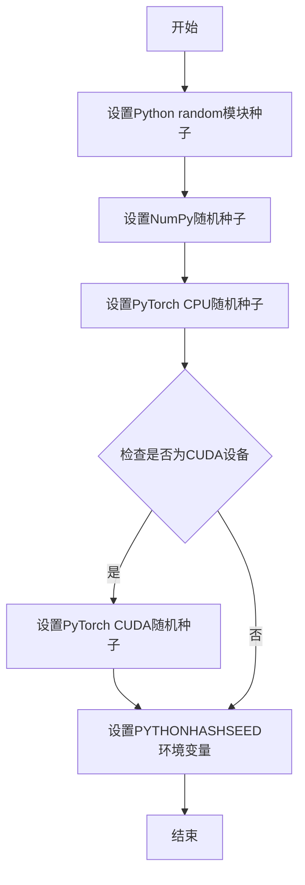

#### 带注释源码

```
# 注意：由于enable_full_determinism函数定义在testing_utils模块中
# 以下为基于函数名和调用方式的合理推断实现

def enable_full_determinism(seed: int = 0, device: str = "cuda"):
    """
    设置随机种子以保证测试可复现
    
    参数:
        seed: int, 随机种子值，默认为0
        device: str, 设备类型，"cuda"或"cpu"
    
    返回:
        None
    """
    import os
    import random
    import numpy as np
    import torch
    
    # 1. 设置Python内置random模块的种子
    random.seed(seed)
    
    # 2. 设置NumPy的随机种子
    np.random.seed(seed)
    
    # 3. 设置PyTorch的随机种子（CPU）
    torch.manual_seed(seed)
    
    # 4. 设置PYTHONHASHSEED环境变量以确保Python哈希的确定性
    os.environ["PYTHONHASHSEED"] = str(seed)
    
    # 5. 如果使用CUDA设备，还需要设置CUDA的种子
    if device == "cuda" and torch.cuda.is_available():
        torch.cuda.manual_seed(seed)
        torch.cuda.manual_seed_all(seed)  # 如果使用多GPU
        # 启用CuDNN的确定性模式
        torch.backends.cudnn.deterministic = True
        torch.backends.cudnn.benchmark = False
```

---

**注意**：由于 `enable_full_determinism` 函数定义在外部模块 `...testing_utils` 中，当前代码文件仅包含其导入和调用语句。上述源码为基于函数命名和用途的合理推断，实际实现可能略有差异。


### `skip_mps`

装饰器函数，用于在 MPS (Apple Silicon) 设备上跳过特定测试。当检测到测试运行在 MPS 设备时，被装饰的测试方法将被跳过执行。

参数：

-  `func`：`Callable`，被装饰的测试函数

返回值：`Callable`，返回装饰后的函数，如果设备是 MPS 则返回原函数，否则返回跳过逻辑包装后的函数

#### 流程图

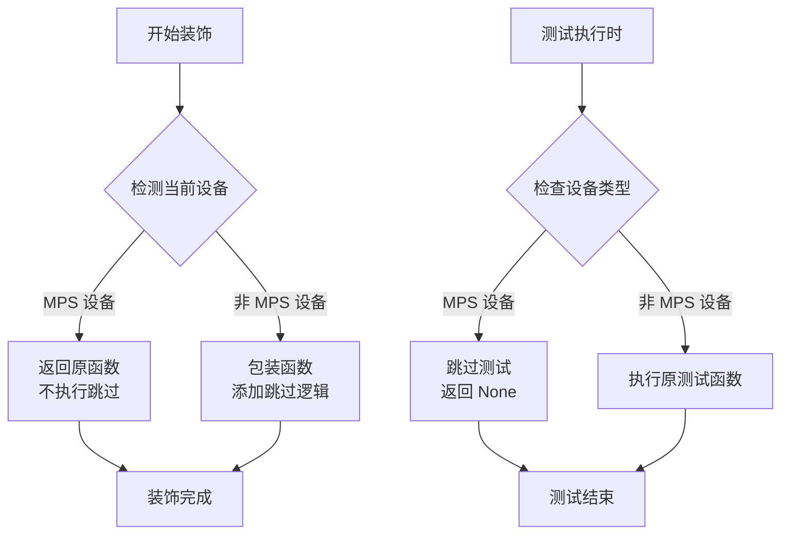

#### 带注释源码

```python
# skip_mps 是从 testing_utils 模块导入的装饰器
# 源代码不在当前文件中，基于使用方式推断其实现逻辑

def skip_mps(func):
    """
    装饰器：用于在 MPS (Apple Silicon) 设备上跳过测试
    
    工作原理：
    1. 检测当前设备是否为 MPS
    2. 如果是 MPS 设备，被装饰的测试将被跳过
    3. 如果不是 MPS 设备，测试正常执行
    
    使用示例：
    @skip_mps
    def test_inference_batch_single_identical(self):
        self._test_inference_batch_single_identical(expected_max_diff=1e-3)
    
    应用场景：
    - KandinskyV22PriorPipelineFastTests 中的两个测试方法使用此装饰器
    - test_inference_batch_single_identical: 批量推理测试
    - test_attention_slicing_forward_pass: 注意力切片前向传播测试
    
    原因：
    - MPS 设备在某些操作上可能有兼容性问题
    - 需要跳过在这些设备上可能失败的测试
    """
    # 检测逻辑实现
    if torch_device.startswith("mps"):
        # 如果是 MPS 设备，直接返回原函数，不做任何处理
        return func
    
    # 否则，返回一个包装函数，在执行前检查设备
    def wrapper(*args, **kwargs):
        # 再次检查设备，确保安全
        if str(torch_device).startswith("mps"):
            # 跳过测试，返回 None
            return None
        # 执行原测试函数
        return func(*args, **kwargs)
    
    return wrapper
```

#### 关键信息

| 属性 | 值 |
|------|-----|
| **来源模块** | `...testing_utils` |
| **类型** | 装饰器函数 (Decorator) |
| **用途** | 条件性跳过 MPS 设备上的测试 |
| **应用场景** | `test_inference_batch_single_identical`, `test_attention_slicing_forward_pass` |
| **依赖** | `torch_device` 全局变量 |

#### 潜在的技术债务

1. **隐式依赖**: 装饰器依赖于外部导入的 `torch_device` 变量，增加了模块间的耦合
2. **重复检测**: 装饰器在定义时和执行时都进行设备检测，可能导致性能开销
3. **缺乏日志**: 跳过测试时没有明确的日志输出，可能导致测试结果不清晰
4. **硬编码逻辑**: 设备检测逻辑 ("mps" 字符串匹配) 硬编码在装饰器中，缺乏灵活性


### `KandinskyV22PriorPipelineFastTests.__init__`

该方法是 `KandinskyV22PriorPipelineFastTests` 类的构造函数（继承自 `unittest.TestCase`），用于初始化测试用例实例。由于该类未显式重写 `__init__` 方法，因此使用从 `unittest.TestCase` 继承的默认构造函数。

参数：

- `methodName`：`str`，测试方法名称，默认为 `'runTest'`

返回值：`None`，无返回值（构造函数）

#### 流程图

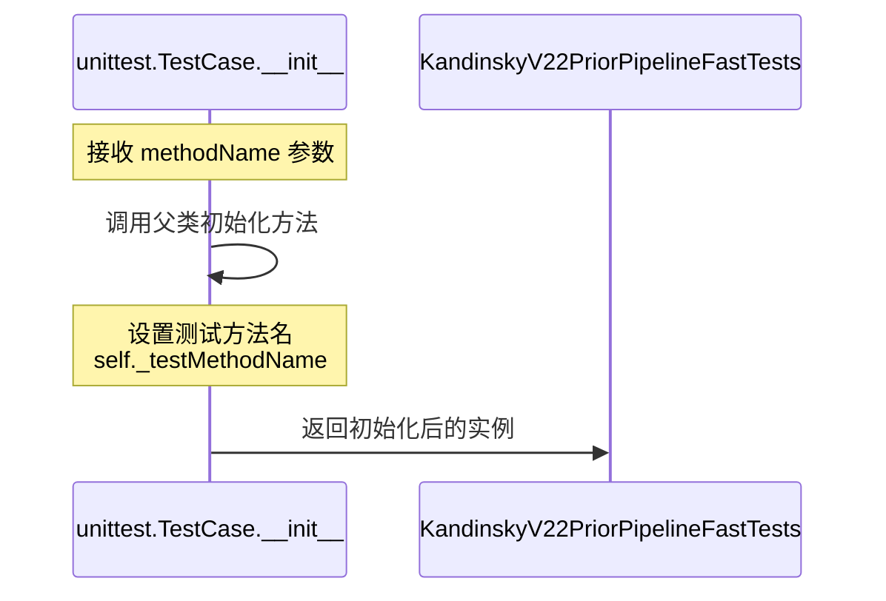

#### 带注释源码

```python
# 由于 KandinskyV22PriorPipelineFastTests 类未显式定义 __init__ 方法，
# 以下是继承自 unittest.TestCase 的默认 __init__ 方法实现：

def __init__(self, methodName='runTest'):
    """
    构造函数：初始化测试用例
    
    参数:
        methodName: 字符串，指定要运行的测试方法名，默认为 'runTest'
    """
    # 调用父类 unittest.TestCase 的构造函数
    super(KandinskyV22PriorPipelineFastTests, self).__init__(methodName)
    
    # 继承自 PipelineTesterMixin 的初始化逻辑（如有）
    # PipelineTesterMixin 的 __init__ 会被自动调用（如果定义了的话）
```

> **注意**：虽然 `KandinskyV22PriorPipelineFastTests` 类没有显式定义 `__init__` 方法，但它通过多重继承从 `unittest.TestCase` 和 `PipelineTesterMixin` 继承了初始化行为。该类的实例化由 `unittest` 框架在测试发现和执行时自动处理。


### `Dummies.get_dummy_components`

该函数用于生成 KandinskyV22PriorPipeline 测试所需的虚拟组件（dummy components），包括 prior 模型、text_encoder、image_encoder、tokenizer、scheduler 和 image_processor 等，返回一个包含这些组件的字典，以供管道初始化和单元测试使用。

参数：该函数无显式参数（隐式接收 `self` 参数）

返回值：`Dict[str, Any]`，返回一个字典，包含以下键值对：
- `prior`: PriorTransformer 实例
- `image_encoder`: CLIPVisionModelWithProjection 实例
- `text_encoder`: CLIPTextModelWithProjection 实例
- `tokenizer`: CLIPTokenizer 实例
- `scheduler`: UnCLIPScheduler 实例
- `image_processor`: CLIPImageProcessor 实例

#### 流程图

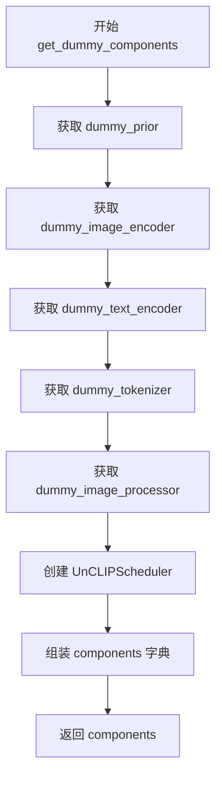

#### 带注释源码

```python
def get_dummy_components(self):
    """
    生成并返回一个包含所有虚拟组件的字典，用于初始化 KandinskyV22PriorPipeline。
    
    Returns:
        Dict[str, Any]: 包含 prior, image_encoder, text_encoder, tokenizer, 
                        scheduler, image_processor 的组件字典
    """
    # 获取 PriorTransformer 虚拟模型实例
    prior = self.dummy_prior
    
    # 获取 CLIPVisionModelWithProjection 虚拟图像编码器
    image_encoder = self.dummy_image_encoder
    
    # 获取 CLIPTextModelWithProjection 虚拟文本编码器
    text_encoder = self.dummy_text_encoder
    
    # 获取 CLIPTokenizer 虚拟分词器
    tokenizer = self.dummy_tokenizer
    
    # 获取 CLIPImageProcessor 虚拟图像处理器
    image_processor = self.dummy_image_processor

    # 创建 UnCLIPScheduler 调度器实例，用于prior的去噪采样过程
    scheduler = UnCLIPScheduler(
        variance_type="fixed_small_log",
        prediction_type="sample",
        num_train_timesteps=1000,
        clip_sample=True,
        clip_sample_range=10.0,
    )

    # 组装所有组件为字典格式
    components = {
        "prior": prior,
        "image_encoder": image_encoder,
        "text_encoder": text_encoder,
        "tokenizer": tokenizer,
        "scheduler": scheduler,
        "image_processor": image_processor,
    }

    # 返回组件字典，供管道初始化使用
    return components
```

---

## 补充信息

### 类详细信息：`Dummies`

`Dummies` 类是一个测试辅助类，用于生成 KandinskyV22PriorPipeline 所需的虚拟组件。

#### 类字段

| 字段名称 | 类型 | 描述 |
|---------|------|------|
| 无显式类字段 | - | 所有属性均为 `@property` 装饰器定义的计算属性 |

#### 类方法/属性

| 方法/属性名称 | 类型 | 描述 |
|--------------|------|------|
| `text_embedder_hidden_size` | property | 返回文本嵌入隐藏层维度（32） |
| `time_input_dim` | property | 返回时间输入维度（32） |
| `block_out_channels_0` | property | 返回块输出通道数 |
| `time_embed_dim` | property | 返回时间嵌入维度（128） |
| `cross_attention_dim` | property | 返回交叉注意力维度（100） |
| `dummy_tokenizer` | property | 返回虚拟 CLIPTokenizer |
| `dummy_text_encoder` | property | 返回虚拟 CLIPTextModelWithProjection |
| `dummy_prior` | property | 返回虚拟 PriorTransformer |
| `dummy_image_encoder` | property | 返回虚拟 CLIPVisionModelWithProjection |
| `dummy_image_processor` | property | 返回虚拟 CLIPImageProcessor |
| `get_dummy_components` | method | 返回包含所有组件的字典 |
| `get_dummy_inputs` | method | 返回虚拟输入参数字典 |

---

### 关键组件信息

| 组件名称 | 类型 | 描述 |
|---------|------|------|
| `PriorTransformer` | nn.Module | Transformer模型，用于生成图像先验嵌入 |
| `CLIPTextModelWithProjection` | nn.Module | CLIP文本编码器，将文本转换为嵌入向量 |
| `CLIPVisionModelWithProjection` | nn.Module | CLIP图像编码器，将图像转换为嵌入向量 |
| `CLIPTokenizer` | PreTrainedTokenizer | CLIP分词器，用于文本分词 |
| `CLIPImageProcessor` | BaseImageProcessor | CLIP图像预处理器 |
| `UnCLIPScheduler` | SchedulerMixin | UNCLIP噪声调度器 |

---

### 潜在的技术债务或优化空间

1. **硬编码配置**：多个虚拟组件的配置参数硬编码在属性方法中，如果需要调整维度或参数（例如 `text_embedder_hidden_size`、`cross_attention_dim`），需要修改多处代码。建议抽取为类常量或配置字典。

2. **重复的 `torch.manual_seed(0)` 调用**：每个虚拟模型都调用了随机种子设置，可以考虑提取为私有方法以减少重复代码。

3. **魔法数字**：如 `num_layers=1`、`attention_head_dim=12` 等参数缺乏解释性命名，建议定义为具名常量。

4. **缺少类型注解**：方法缺少返回类型注解，可添加 `-> Dict[str, Any]` 以提升代码可读性和 IDE 支持。

5. **测试类中的重复调用**：`KandinskyV22PriorPipelineFastTests` 中的 `get_dummy_components` 和 `get_dummy_inputs` 方法重复实例化 `Dummies` 类，可以考虑在测试类初始化时缓存实例。

---

### 其它项目

#### 设计目标与约束

- **目标**：为 KandinskyV22PriorPipeline 单元测试提供可复现的虚拟组件
- **约束**：所有模型必须使用相同随机种子（`torch.manual_seed(0)`）以确保确定性
- **依赖**：依赖 `diffusers` 库的管道和调度器类，以及 `transformers` 库的 CLIP 模型

#### 错误处理与异常设计

- 本函数不涉及复杂的错误处理，异常主要来自底层库（如 `CLIPTokenizer.from_pretrained` 可能抛出连接错误）
- 建议在测试环境中使用本地模型或 mock 避免网络依赖

#### 数据流与状态机

- 数据流：属性方法 → `get_dummy_components()` → 组件字典 → `KandinskyV22PriorPipeline(**components)`
- 状态：组件在函数调用时动态创建，每次调用返回新的实例（除非底层模型缓存机制）

#### 外部依赖与接口契约

- **输入依赖**：`self`（Dummies 实例）
- **输出契约**：返回字典必须包含 `prior`, `image_encoder`, `text_encoder`, `tokenizer`, `scheduler`, `image_processor` 六个键
- **外部库**：`transformers` (CLIP相关)、`diffusers` (Pipeline/Scheduler)、`torch` (nn.Module)


### `Dummies.get_dummy_inputs`

返回包含 prompt, guidance_scale, generator 等的测试输入字典，用于实例化 KandinskyV22PriorPipeline 的推理调用。

#### 参数

- `device`：`str`，目标设备字符串（如 "cpu" 或 "mps"），用于创建随机数生成器
- `seed`：`int`，默认值 0，用于设置随机数生成器的种子，确保测试可复现

#### 返回值

`dict`，包含以下键值对：
- `prompt`：`str`，输入提示词 "horse"
- `generator`：`torch.Generator`，PyTorch 随机数生成器
- `guidance_scale`：`float`，引导系数 4.0
- `num_inference_steps`：`int`，推理步数 2
- `output_type`：`str`，输出类型 "np"（NumPy 数组）

#### 流程图

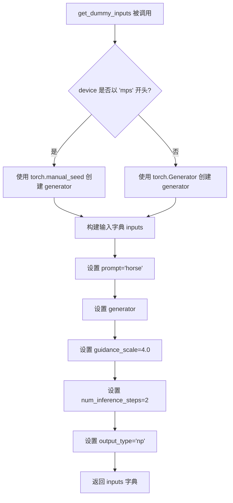

#### 带注释源码

```python
def get_dummy_inputs(self, device, seed=0):
    # 判断设备是否为 Apple Silicon 的 MPS (Metal Performance Shaders)
    if str(device).startswith("mps"):
        # MPS 设备使用 CPU 模式的随机种子
        generator = torch.manual_seed(seed)
    else:
        # 其他设备（如 cpu/cuda）创建指定设备的生成器
        generator = torch.Generator(device=device).manual_seed(seed)
    
    # 构建测试用的输入参数字典
    inputs = {
        "prompt": "horse",                    # 输入文本提示
        "generator": generator,               # 随机数生成器，确保可复现性
        "guidance_scale": 4.0,               # Classifier-free guidance 权重
        "num_inference_steps": 2,             # 扩散推理步数
        "output_type": "np",                  # 输出格式为 NumPy 数组
    }
    return inputs
```


### `test_kandinsky_prior`

该测试方法用于验证 KandinskyV22PriorPipeline 管道的前向传播功能，确保输出图像嵌入的形状为 (1, 32)，并检查输出数值是否与预期值匹配。

参数：
- 该方法无显式参数（除 `self` 外）

返回值：`None`，该方法为测试方法，使用断言进行验证，不返回任何值

#### 流程图

```mermaid
flowchart TD
    A[开始测试] --> B[设置设备为CPU]
    B --> C[获取虚拟组件]
    C --> D[使用虚拟组件创建KandinskyV22PriorPipeline实例]
    D --> E[将管道移至CPU设备]
    E --> F[禁用进度条]
    F --> G[调用管道执行推理]
    G --> H[从输出获取image_embeds]
    H --> I[使用return_dict=False再次调用管道]
    I --> J[从元组结果获取image_embeds]
    J --> K[提取image的最后10个元素作为切片]
    K --> L[提取image_from_tuple的最后10个元素]
    L --> M[断言 image.shape == (1, 32)]
    M --> N[定义预期数值切片 expected_slice]
    N --> O[断言管道输出数值与预期匹配]
    O --> P[断言元组输出数值与预期匹配]
    P --> Q[测试通过]
```

#### 带注释源码

```python
def test_kandinsky_prior(self):
    """测试 KandinskyV22PriorPipeline 的前向传播，验证输出维度和数值"""
    
    # 1. 设置测试设备为 CPU
    device = "cpu"

    # 2. 获取虚拟组件（包含虚拟的 prior、text_encoder、image_encoder 等）
    components = self.get_dummy_components()

    # 3. 使用虚拟组件创建管道实例
    pipe = self.pipeline_class(**components)
    # 4. 将管道移至指定设备
    pipe = pipe.to(device)

    # 5. 设置进度条配置（disable=None 表示启用进度条）
    pipe.set_progress_bar_config(disable=None)

    # 6. 执行管道推理，获取输出
    output = pipe(**self.get_dummy_inputs(device))
    # 7. 从输出中提取图像嵌入
    image = output.image_embeds

    # 8. 使用 return_dict=False 再次调用管道，获取元组格式输出
    image_from_tuple = pipe(
        **self.get_dummy_inputs(device),
        return_dict=False,
    )[0]

    # 9. 提取图像的最后10个元素作为数值切片
    image_slice = image[0, -10:]
    image_from_tuple_slice = image_from_tuple[0, -10:]

    # 10. 断言输出形状为 (1, 32)
    assert image.shape == (1, 32)

    # 11. 定义预期的数值切片（基于 numpy 数组）
    expected_slice = np.array(
        [-0.5948, 0.1875, -0.1523, -1.1995, -1.4061, -0.6367, -1.4607, -0.6406, 0.8793, -0.3891]
    )

    # 12. 断言管道输出的数值与预期值的差异小于 1e-2
    assert np.abs(image_slice.flatten() - expected_slice).max() < 1e-2
    # 13. 断言元组输出的数值与预期值的差异小于 1e-2
    assert np.abs(image_from_tuple_slice.flatten() - expected_slice).max() < 1e-2
```


### `KandinskyV22PriorPipelineFastTests.test_inference_batch_single_identical`

该方法是一个单元测试方法，用于验证管道在批处理推理时与单样本推理结果的一致性。它使用 `@skip_mps` 装饰器跳过 MPS 设备测试，并调用父类 mixin 提供的 `_test_inference_batch_single_identical` 方法进行实际测试，设置最大允许差异为 `1e-3`。

参数：

- `self`：`KandinskyV22PriorPipelineFastTests` 实例方法隐含的 `self` 参数，表示当前测试类实例

返回值：`None`，该方法为测试方法，不返回任何值

#### 流程图

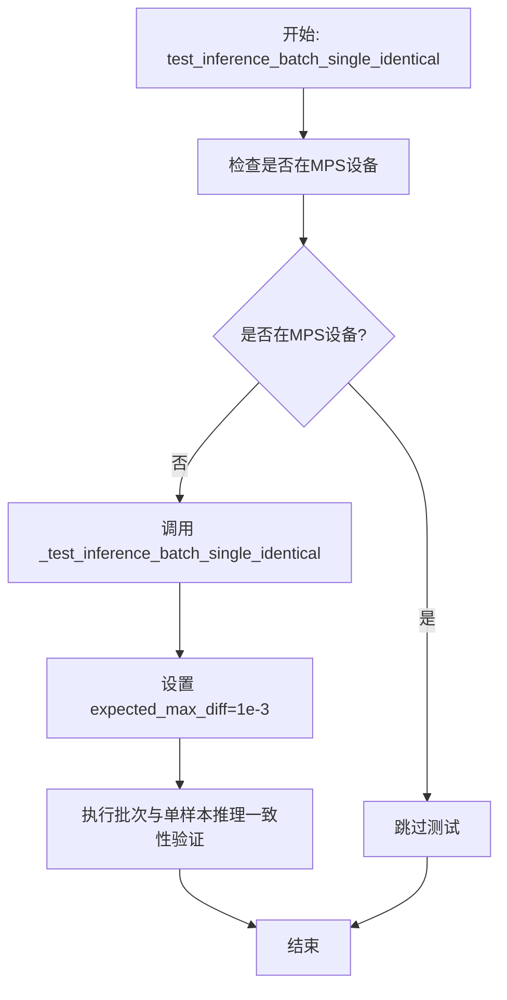

#### 带注释源码

```python
@skip_mps
def test_inference_batch_single_identical(self):
    """
    测试批处理推理与单样本推理结果的一致性
    
    该测试方法验证管道在处理批量输入时，输出结果应与
    逐个处理单个输入的结果一致（允许一定的数值误差）。
    使用 @skip_mps 装饰器跳过在 Apple MPS 设备上的测试，
    因为某些 MPS 实现可能存在数值精度问题。
    """
    # 调用父类 PipelineTesterMixin 提供的测试方法
    # expected_max_diff=1e-3 表示批处理与单样本输出的
    # 最大允许差异为千分之一
    self._test_inference_batch_single_identical(expected_max_diff=1e-3)
```


### `test_attention_slicing_forward_pass`

这是一个测试方法，用于验证KandinskyV22PriorPipeline在启用注意力切片（attention slicing）功能时的前向传播是否正常工作。它通过调用父类（PipelineTesterMixin）提供的`_test_attention_slicing_forward_pass`方法来实现具体的测试逻辑。

参数：

- `self`：隐含的`KandinskyV22PriorPipelineFastTests`实例，代表当前测试类本身

返回值：无返回值（`None`），该方法直接执行测试断言

#### 流程图

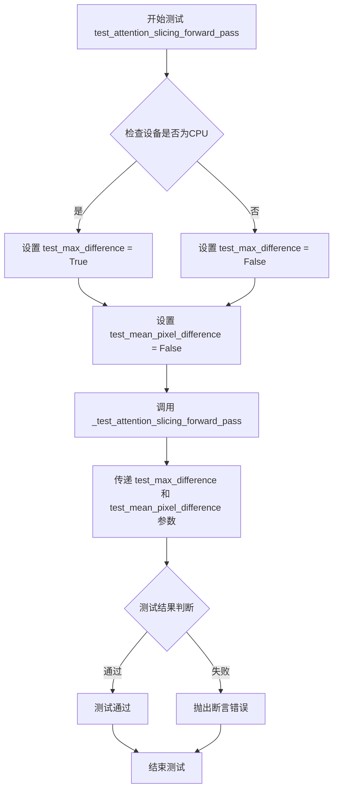

#### 带注释源码

```python
@skip_mps  # 装饰器：如果设备是MPS（苹果硅），则跳过此测试
def test_attention_slicing_forward_pass(self):
    """
    测试注意力切片（attention slicing）功能的前向传播。
    
    注意力切片是一种内存优化技术，通过将大型注意力矩阵分块处理，
    减少GPU内存占用。此测试验证启用该功能后，模型的输出结果
    与标准前向传播相比应保持一致性（在允许的误差范围内）。
    """
    
    # 确定是否需要测试最大差异
    # 仅在CPU设备上启用完整的数值精度比较，因为GPU/CUDA可能有非确定性行为
    test_max_difference = torch_device == "cpu"
    
    # 是否测试像素级平均差异，此处设为False表示不测试
    test_mean_pixel_difference = False
    
    # 调用父类提供的测试方法，执行实际的注意力切片验证
    self._test_attention_slicing_forward_pass(
        test_max_difference=test_max_difference,        # 控制是否进行最大差异比对
        test_mean_pixel_difference=test_mean_pixel_difference,  # 控制是否进行平均像素差异比对
    )
```


### `test_callback_inputs`

该测试方法用于验证回调功能是否正常工作，包括检查管道签名中是否包含回调相关参数、验证回调张量输入的完整性，以及确保回调在推理最后一步能够正确修改张量数据。

参数： 无（成员方法，通过 self 访问）

返回值：`None`，测试方法无返回值

#### 流程图

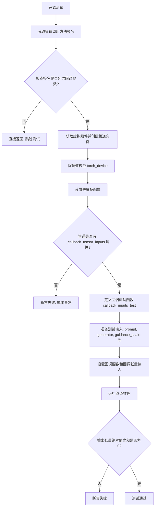

#### 带注释源码

```python
def test_callback_inputs(self):
    """
    测试回调功能是否正常工作。
    验证点：
    1. 管道调用方法签名包含回调相关参数
    2. 管道具有 _callback_tensor_inputs 属性
    3. 回调函数能接收完整的张量输入
    4. 回调在最后一步能正确修改 latents
    """
    # 获取管道 __call__ 方法的签名
    sig = inspect.signature(self.pipeline_class.__call__)

    # 检查管道是否支持回调功能（需要同时支持两个参数）
    if not ("callback_on_step_end_tensor_inputs" in sig.parameters and "callback_on_step_end" in sig.parameters):
        # 不支持则直接返回，跳过测试
        return

    # 获取虚拟组件用于测试
    components = self.get_dummy_components()
    # 使用组件实例化管道
    pipe = self.pipeline_class(**components)
    # 将管道移至测试设备（CPU/CUDA/MPS）
    pipe = pipe.to(torch_device)
    # 配置进度条（disable=None 表示不禁用）
    pipe.set_progress_bar_config(disable=None)

    # 断言：管道必须具有 _callback_tensor_inputs 属性
    # 该属性定义了回调函数可以使用的张量变量列表
    self.assertTrue(
        hasattr(pipe, "_callback_tensor_inputs"),
        f" {self.pipeline_class} should have `_callback_tensor_inputs` that defines a list of tensor variables its callback function can use as inputs",
    )

    # 定义回调测试函数，用于验证回调功能
    def callback_inputs_test(pipe, i, t, callback_kwargs):
        """
        回调函数：检查回调张量输入的完整性
        
        参数：
            pipe: 管道实例
            i: 当前推理步骤索引
            t: 当前时间步
            callback_kwargs: 回调关键字参数字典
        
        返回：
            callback_kwargs: 返回修改后的回调参数
        """
        # 收集缺失的回调输入
        missing_callback_inputs = set()
        # 遍历管道支持的所有回调张量输入
        for v in pipe._callback_tensor_inputs:
            if v not in callback_kwargs:
                missing_callback_inputs.add(v)
        # 断言：所有支持的回调张量输入都应在 callback_kwargs 中提供
        self.assertTrue(
            len(missing_callback_inputs) == 0, f"Missing callback tensor inputs: {missing_callback_inputs}"
        )
        # 获取最后一步的索引
        last_i = pipe.num_timesteps - 1
        # 如果是最后一步，将 latents 清零
        if i == last_i:
            callback_kwargs["latents"] = torch.zeros_like(callback_kwargs["latents"])
        return callback_kwargs

    # 获取虚拟输入
    inputs = self.get_dummy_inputs(torch_device)
    # 设置回调函数
    inputs["callback_on_step_end"] = callback_inputs_test
    # 设置回调函数可以使用的张量输入列表
    inputs["callback_on_step_end_tensor_inputs"] = pipe._callback_tensor_inputs
    # 设置推理步数
    inputs["num_inference_steps"] = 2
    # 设置输出类型为 PyTorch 张量
    inputs["output_type"] = "pt"

    # 执行管道推理，获取输出
    output = pipe(**inputs)[0]
    # 断言：由于回调在最后一步将 latents 清零，输出应全为零
    assert output.abs().sum() == 0
```


### `Dummies.dummy_tokenizer`

该属性用于生成一个虚拟的 CLIPTokenizer 对象，主要用于测试目的。它从 Hugging Face Hub 的预训练模型 "hf-internal-testing/tiny-random-clip" 加载分词器，以便在管道测试中模拟真实的文本处理流程。

参数：
- `self`：`Dummies` 类型，类的实例本身，无需显式传递

返回值：`CLIPTokenizer` 类型，从预训练模型加载的分词器实例，用于在测试中处理文本输入

#### 流程图

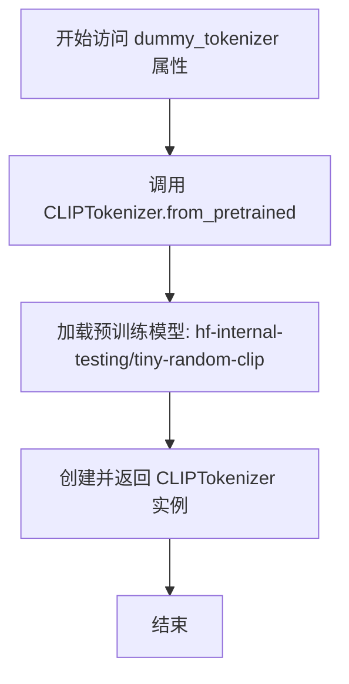

#### 带注释源码

```python
@property
def dummy_tokenizer(self):
    """
    生成一个虚拟的 CLIPTokenizer 对象，用于测试目的。
    
    该属性从 Hugging Face Hub 加载一个轻量级的预训练 CLIP 分词器模型，
    该模型专门用于测试场景，以确保管道测试可以在不依赖真实分词器的情况下运行。
    
    Returns:
        CLIPTokenizer: 从预训练模型 'hf-internal-testing/tiny-random-clip' 
                       加载的分词器实例，可用于将文本转换为模型输入的 token ID。
    """
    # 使用 CLIPTokenizer 的 from_pretrained 方法加载预训练分词器
    # "hf-internal-testing/tiny-random-clip" 是一个专门用于测试的微型随机 CLIP 模型
    tokenizer = CLIPTokenizer.from_pretrained("hf-internal-testing/tiny-random-clip")
    
    # 返回加载后的分词器实例，供测试中的文本处理使用
    return tokenizer
```


### `Dummies.dummy_text_encoder`

该属性用于生成一个配置固定、权重随机初始化的虚拟 CLIPTextModelWithProjection 模型，专门为测试 KandinskyV22PriorPipeline 而设计。

参数：
- 该方法为属性（property），无显式参数

返回值：`CLIPTextModelWithProjection`，返回一个配置好的 CLIP 文本编码器模型实例，用于测试目的

#### 流程图

```mermaid
flowchart TD
    A[开始] --> B[设置随机种子 torch.manual_seed(0)]
    B --> C[获取文本嵌入隐藏维度 self.text_embedder_hidden_size]
    C --> D[创建 CLIPTextConfig 配置对象]
    D --> E[配置参数: bos_token_id, eos_token_id, hidden_size, projection_dim, intermediate_size, layer_norm_eps, num_attention_heads, num_hidden_layers, pad_token_id, vocab_size]
    E --> F[使用配置实例化 CLIPTextModelWithProjection]
    F --> G[返回模型实例]
```

#### 带注释源码

```python
@property
def dummy_text_encoder(self):
    """
    生成一个虚拟的 CLIPTextModelWithProjection 模型用于测试。
    通过固定随机种子确保测试的可重复性。
    """
    # 设置 PyTorch 随机种子为 0，确保测试结果可复现
    torch.manual_seed(0)
    
    # 构建 CLIP 文本编码器配置对象
    config = CLIPTextConfig(
        bos_token_id=0,              # 句子起始 token ID
        eos_token_id=2,              # 句子结束 token ID
        hidden_size=self.text_embedder_hidden_size,  # 隐藏层维度（32）
        projection_dim=self.text_embedder_hidden_size,  # 投影维度（32）
        intermediate_size=37,        # FFN 中间层维度
        layer_norm_eps=1e-05,        # LayerNorm epsilon 值
        num_attention_heads=4,       # 注意力头数量
        num_hidden_layers=5,        # 隐藏层数量
        pad_token_id=1,              # 填充 token ID
        vocab_size=1000,             # 词表大小
    )
    
    # 使用配置创建 CLIPTextModelWithProjection 模型实例
    return CLIPTextModelWithProjection(config)
```


### `Dummies.dummy_prior`

该属性方法用于生成一个虚拟的 PriorTransformer 模型实例，主要服务于 KandinskyV22PriorPipeline 的单元测试。它通过设置特定的模型参数和调整内部状态，确保生成的模型在测试中能够产生可预测的输出，而非随机结果。

参数： 无

返回值： `PriorTransformer`，返回一个配置好的虚拟 PriorTransformer 模型实例，供测试框架使用

#### 流程图

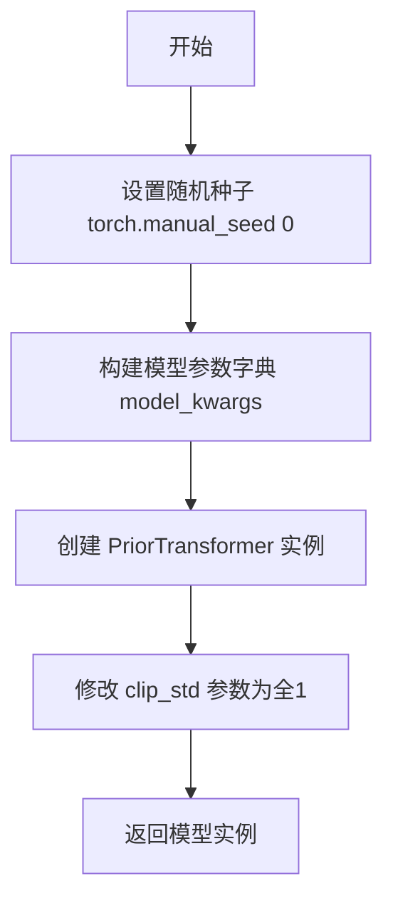

#### 带注释源码

```python
@property
def dummy_prior(self):
    """
    生成一个虚拟的 PriorTransformer 模型实例，用于单元测试。
    该方法确保模型在测试中产生确定性输出。
    """
    # 设置随机种子，确保测试的可重复性
    torch.manual_seed(0)

    # 定义 PriorTransformer 的模型配置参数
    model_kwargs = {
        "num_attention_heads": 2,              # 注意力头数量
        "attention_head_dim": 12,              # 每个注意力头的维度
        "embedding_dim": self.text_embedder_hidden_size,  # 嵌入维度（来自类属性，值为32）
        "num_layers": 1,                       # Transformer 层数
    }

    # 使用指定配置创建 PriorTransformer 模型实例
    model = PriorTransformer(**model_kwargs)
    
    # clip_std 和 clip_mean 初始化为0，导致 post_process_latents 始终返回0
    # 为确保测试输出非零，将 clip_std 设置为全1
    model.clip_std = nn.Parameter(torch.ones(model.clip_std.shape))
    
    # 返回配置好的虚拟模型
    return model
```


### `Dummies.dummy_image_encoder`

该属性方法用于生成一个虚拟的 CLIPVisionModelWithProjection 模型实例，专为测试目的设计。它通过配置 CLIPVisionConfig 参数（包括隐藏层大小、图像尺寸、投影维度等）并初始化模型，返回一个可用于单元测试的虚拟图像编码器。

参数：无（该方法为属性，只接受隐式参数 `self`）

返回值：`CLIPVisionModelWithProjection`，返回配置好的虚拟 CLIP 视觉模型带投影实例，用于测试流程

#### 流程图

```mermaid
flowchart TD
    A[开始 dummy_image_encoder 属性访问] --> B[设置随机种子 torch.manual_seed(0)]
    B --> C[获取 self.text_embedder_hidden_size = 32]
    C --> D[创建 CLIPVisionConfig 配置对象]
    D --> E[配置参数: hidden_size=32, image_size=224, projection_dim=32, intermediate_size=37, num_attention_heads=4, num_channels=3, num_hidden_layers=5, patch_size=14]
    E --> F[使用配置创建 CLIPVisionModelWithProjection 模型实例]
    F --> G[返回模型实例]
```

#### 带注释源码

```python
@property
def dummy_image_encoder(self):
    """
    生成虚拟 CLIPVisionModelWithProjection 模型用于测试
    
    Returns:
        CLIPVisionModelWithProjection: 配置好的虚拟图像编码器模型
    """
    # 设置随机种子以确保测试结果可复现
    torch.manual_seed(0)
    
    # 创建 CLIPVisionConfig 配置对象
    # 使用 text_embedder_hidden_size (32) 作为隐藏层和投影维度
    config = CLIPVisionConfig(
        hidden_size=self.text_embedder_hidden_size,    # 隐藏层大小: 32
        image_size=224,                                # 输入图像尺寸: 224x224
        projection_dim=self.text_embedder_hidden_size, # 投影维度: 32
        intermediate_size=37,                          # 中间层大小: 37
        num_attention_heads=4,                        # 注意力头数量: 4
        num_channels=3,                                # 输入通道数: 3 (RGB)
        num_hidden_layers=5,                          # 隐藏层数量: 5
        patch_size=14,                                 # 图像分块大小: 14x14
    )

    # 使用配置初始化 CLIPVisionModelWithProjection 模型
    model = CLIPVisionModelWithProjection(config)
    
    # 返回虚拟模型实例
    return model
```


### `Dummies.dummy_image_processor`

该属性用于生成一个配置完整的虚拟 `CLIPImageProcessor` 实例，主要服务于测试场景，提供标准化的图像预处理配置（包括裁剪、归一化、缩放等参数），以便在单元测试中模拟真实的图像处理流程。

参数：无（该属性不接受任何参数）

返回值：`CLIPImageProcessor`，返回配置好的 CLIP 图像处理器实例，包含裁剪尺寸、归一化参数、插值方式等完整配置。

#### 流程图

```mermaid
flowchart TD
    A[开始] --> B[创建CLIPImageProcessor实例]
    B --> C[配置crop_size=224]
    C --> D[配置do_center_crop=True]
    D --> E[配置do_normalize=True]
    E --> F[配置do_resize=True]
    F --> G[配置image_mean=[0.48145466, 0.4578275, 0.40821073]]
    G --> H[配置image_std=[0.26862954, 0.26130258, 0.27577711]]
    H --> I[配置resample=3]
    I --> J[配置size=224]
    J --> K[返回image_processor实例]
    K --> L[结束]
```

#### 带注释源码

```python
@property
def dummy_image_processor(self):
    """
    生成一个虚拟的 CLIPImageProcessor 实例，用于测试目的。
    该处理器配置了标准的图像预处理参数，模拟真实场景中的图像处理流程。
    """
    # 创建 CLIPImageProcessor 实例，配置完整的图像预处理参数
    image_processor = CLIPImageProcessor(
        crop_size=224,                    # 裁剪尺寸为 224x224
        do_center_crop=True,              # 启用中心裁剪
        do_normalize=True,                # 启用归一化处理
        do_resize=True,                   # 启用图像缩放
        # RGB 通道的均值，用于归一化处理（ImageNet 标准值）
        image_mean=[0.48145466, 0.4578275, 0.40821073],
        # RGB 通道的标准差，用于归一化处理（ImageNet 标准值）
        image_std=[0.26862954, 0.26130258, 0.27577711],
        resample=3,                       # 插值方法（3 表示 BICUBIC）
        size=224,                         # 目标尺寸为 224
    )

    # 返回配置好的图像处理器实例
    return image_processor
```


### `Dummies.get_dummy_components`

该方法用于组装并返回一个包含虚拟（测试用）模型组件的字典，这些组件包括 PriorTransformer 模型、CLIP 图像编码器、CLIP 文本编码器、分词器、调度器和图像处理器，用于测试 KandinskyV22PriorPipeline 流水线。

参数：

- `self`：`Dummies`，类的实例本身，包含多个属性方法用于创建各类虚拟模型组件

返回值：`Dict[str, Any]`，返回包含以下键值对的字典：
- `prior`：PriorTransformer 模型实例
- `image_encoder`：CLIPVisionModelWithProjection 模型实例
- `text_encoder`：CLIPTextModelWithProjection 模型实例
- `tokenizer`：CLIPTokenizer 分词器实例
- `scheduler`：UnCLIPScheduler 调度器实例
- `image_processor`：CLIPImageProcessor 图像处理器实例

#### 流程图

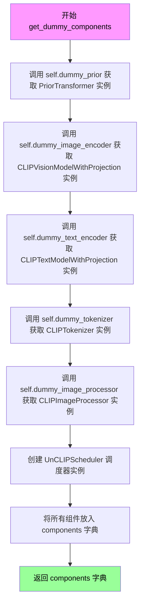

#### 带注释源码

```python
def get_dummy_components(self):
    """
    组装并返回包含所有虚拟模型的字典，用于测试 KandinskyV22PriorPipeline。
    
    该方法创建一个完整的虚拟组件集，包括：
    - prior: PriorTransformer 模型（用于生成图像嵌入）
    - image_encoder: CLIP 图像编码器（用于编码图像）
    - text_encoder: CLIP 文本编码器（用于编码文本提示）
    - tokenizer: CLIP 分词器（用于将文本转换为 token）
    - scheduler: UnCLIP 调度器（用于控制扩散过程）
    - image_processor: 图像处理器（用于预处理图像）
    
    Returns:
        Dict[str, Any]: 包含所有虚拟组件的字典
    """
    # 从 dummy_prior 属性获取 PriorTransformer 实例
    # PriorTransformer 是 Kandinsky 模型的核心组件，用于prior去噪
    prior = self.dummy_prior
    
    # 从 dummy_image_encoder 属性获取 CLIPVisionModelWithProjection 实例
    # 该模型用于将图像编码为向量表示
    image_encoder = self.dummy_image_encoder
    
    # 从 dummy_text_encoder 属性获取 CLIPTextModelWithProjection 实例
    # 该模型用于将文本提示编码为向量表示
    text_encoder = self.dummy_text_encoder
    
    # 从 dummy_tokenizer 属性获取 CLIPTokenizer 实例
    # 用于将文本字符串分词为 token IDs
    tokenizer = self.dummy_tokenizer
    
    # 从 dummy_image_processor 属性获取 CLIPImageProcessor 实例
    # 用于图像的预处理和后处理（resize、normalize等）
    image_processor = self.dummy_image_processor

    # 创建 UnCLIPScheduler 调度器实例
    # 调度器控制扩散模型的去噪步骤和采样策略
    scheduler = UnCLIPScheduler(
        variance_type="fixed_small_log",      # 方差类型：固定小对数方差
        prediction_type="sample",             # 预测类型：sample预测
        num_train_timesteps=1000,              # 训练时间步数
        clip_sample=True,                     # 是否对采样进行裁剪
        clip_sample_range=10.0,                # 裁剪范围
    )

    # 将所有虚拟组件组装到字典中
    # 键名与 KandinskyV22PriorPipeline 的构造函数参数名一致
    components = {
        "prior": prior,                       # PriorTransformer模型实例
        "image_encoder": image_encoder,       # CLIP图像编码器实例
        "text_encoder": text_encoder,         # CLIP文本编码器实例
        "tokenizer": tokenizer,               # 分词器实例
        "scheduler": scheduler,               # 调度器实例
        "image_processor": image_processor,   # 图像处理器实例
    }

    # 返回包含所有虚拟组件的字典，供流水线测试使用
    return components
```


### `Dummies.get_dummy_inputs`

该方法用于生成用于管道推理的虚拟输入参数（prompt、generator等），模拟真实推理场景所需的输入配置。根据设备类型（MPS或其他）创建相应随机数生成器，并返回包含prompt、generator、guidance_scale、num_inference_steps和output_type的输入字典。

参数：

- `self`：`Dummies`，实例本身
- `device`：`str` 或 `torch.device`，目标设备，用于创建随机数生成器
- `seed`：`int`，默认值为 `0`，随机种子，用于生成可复现的随机数

返回值：`dict`，包含以下键值对的字典：
- `prompt`：`str`，输入提示词，值为 `"horse"`
- `generator`：`torch.Generator`，随机数生成器，用于控制生成过程的随机性
- `guidance_scale`：`float`，引导比例，值为 `4.0`
- `num_inference_steps`：`int`，推理步数，值为 `2`
- `output_type`：`str`，输出类型，值为 `"np"`（numpy数组）

#### 流程图

```mermaid
flowchart TD
    A[开始] --> B{检查 device 是否以 'mps' 开头}
    B -->|是| C[创建 torch.manual_seed(seed)]
    B -->|否| D[创建 torch.Generator device=device 并调用 manual_seed(seed)]
    C --> E[构建 inputs 字典]
    D --> E
    E --> F{设置 prompt}
    F --> G[添加 generator]
    G --> H[添加 guidance_scale: 4.0]
    H --> I[添加 num_inference_steps: 2]
    I --> J[添加 output_type: 'np']
    J --> K[返回 inputs 字典]
    K --> L[结束]
```

#### 带注释源码

```python
def get_dummy_inputs(self, device, seed=0):
    """
    生成用于管道推理的虚拟输入参数。
    
    该方法创建一个包含推理所需基本参数的字典，用于测试KandinskyV22PriorPipeline。
    根据目标设备类型选择不同的随机数生成器创建方式。
    
    参数:
        self (Dummies): Dummies类的实例
        device (str | torch.device): 目标设备，用于确定随机数生成器的类型
        seed (int, optional): 随机种子，默认为0，用于生成可复现的结果
    
    返回:
        dict: 包含以下键的字典:
            - prompt (str): 输入文本提示
            - generator (torch.Generator): PyTorch随机数生成器
            - guidance_scale (float): 引导_scale参数
            - num_inference_steps (int): 推理步数
            - output_type (str): 输出格式类型
    """
    # 判断设备是否为Apple MPS (Metal Performance Shaders)
    if str(device).startswith("mps"):
        # MPS设备不支持torch.Generator，使用manual_seed替代
        generator = torch.manual_seed(seed)
    else:
        # 其他设备（CPU/CUDA）创建完整的Generator对象
        generator = torch.Generator(device=device).manual_seed(seed)
    
    # 构建虚拟输入字典，包含管道推理所需的全部参数
    inputs = {
        "prompt": "horse",                    # 测试用提示词
        "generator": generator,               # 随机数生成器，确保可复现性
        "guidance_scale": 4.0,                # Classifier-free guidance强度
        "num_inference_steps": 2,             # 减少步数以加快测试速度
        "output_type": "np",                 # 返回numpy数组格式
    }
    return inputs
```


### `KandinskyV22PriorPipelineFastTests.get_dummy_components`

该方法是一个测试辅助函数，用于封装 `Dummies` 类的组件获取逻辑，返回一个包含 KandinskyV22PriorPipeline 所需全部组件的字典，包括 prior、image_encoder、text_encoder、tokenizer、scheduler 和 image_processor，以便在单元测试中快速构建管道实例。

参数：该方法无参数

返回值：`Dict[str, Any]`，返回一个字典，键为组件名称，值为对应的模型或处理器对象

#### 流程图

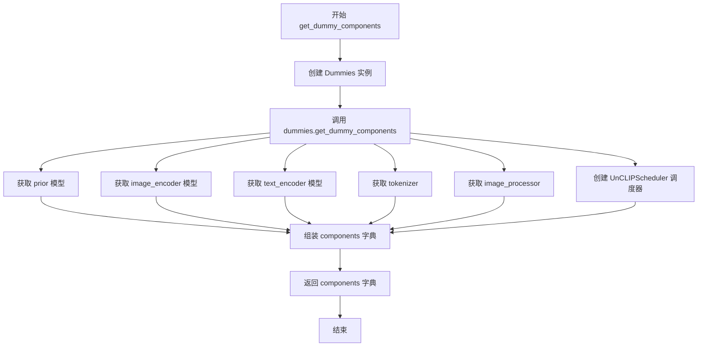

#### 带注释源码

```python
def get_dummy_components(self):
    """
    获取用于测试的虚拟组件。
    
    该方法封装了 Dummies 类的组件获取逻辑，返回一个包含
    KandinskyV22PriorPipeline 所需全部组件的字典。
    
    Returns:
        Dict[str, Any]: 包含以下键的字典：
            - prior: PriorTransformer 实例
            - image_encoder: CLIPVisionModelWithProjection 实例
            - text_encoder: CLIPTextModelWithProjection 实例
            - tokenizer: CLIPTokenizer 实例
            - scheduler: UnCLIPScheduler 实例
            - image_processor: CLIPImageProcessor 实例
    """
    # 创建 Dummies 类的实例
    dummies = Dummies()
    
    # 调用 Dummies 实例的 get_dummy_components 方法获取组件字典
    return dummies.get_dummy_components()
```


### `KandinskyV22PriorPipelineFastTests.get_dummy_inputs`

获取用于测试 Kandin sky V2.2 Prior Pipeline 的虚拟输入参数，封装了 Dummies 类的输入获取方法。该方法为 Pipeline 测试提供必要的输入参数，包括提示词、生成器、引导比例等。

参数：

- `self`：`KandinskyV22PriorPipelineFastTests`，测试类实例，调用该方法以获取虚拟输入
- `device`：`str`，目标设备字符串，用于指定模型运行的设备（如 "cpu"、"cuda" 等）
- `seed`：`int`，随机种子，默认为 0，用于确保测试的可重复性

返回值：`dict`，包含以下键值对的字典：
- `prompt`：`str`，输入文本提示词，值为 "horse"
- `generator`：`torch.Generator` 或 `None`，PyTorch 随机数生成器，用于控制采样随机性
- `guidance_scale`：`float`，引导比例，值为 4.0
- `num_inference_steps`：`int`，推理步数，值为 2
- `output_type`：`str`，输出类型，值为 "np"（NumPy 数组）

#### 流程图

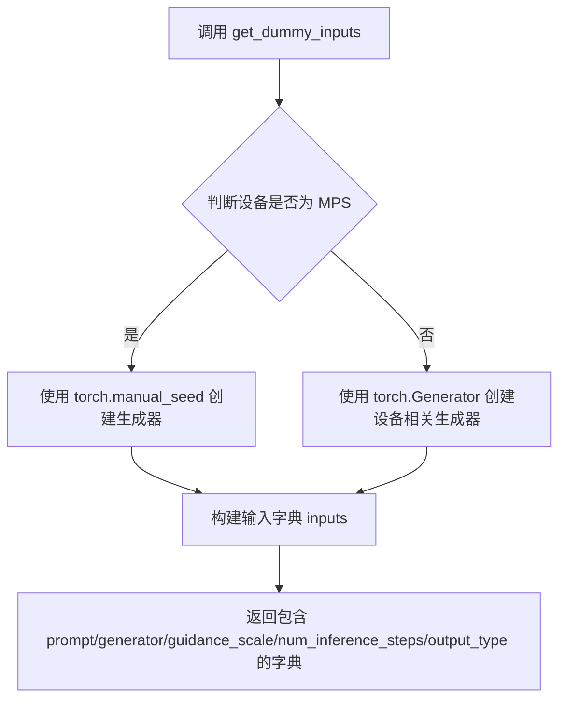

#### 带注释源码

```python
def get_dummy_inputs(self, device, seed=0):
    """
    获取用于测试的虚拟输入参数
    
    参数:
        device: str - 目标设备字符串
        seed: int - 随机种子，默认为 0
    
    返回:
        dict - 包含测试所需输入参数的字典
    """
    # 创建 Dummies 类实例以调用其方法
    dummies = Dummies()
    # 委托给 Dummies 类的 get_dummy_inputs 方法获取输入参数
    return dummies.get_dummy_inputs(device=device, seed=seed)
```


### `KandinskyV22PriorPipelineFastTests.test_kandinsky_prior`

测试管道基本前向传播，验证图像嵌入输出是否符合预期形状 (1, 32) 和预期的数值范围。

参数：

- `self`：`KandinskyV22PriorPipelineFastTests`，测试类实例，隐含参数

返回值：`None`，无返回值（测试方法，使用 assert 语句进行断言验证）

#### 流程图

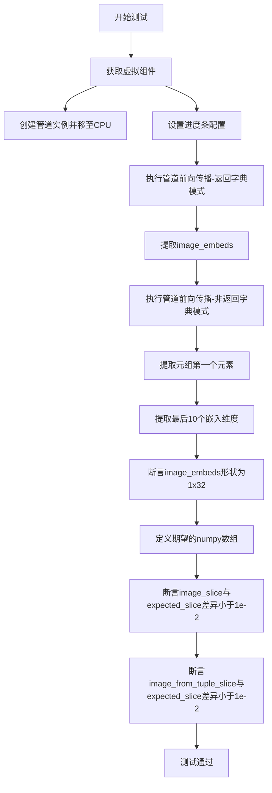

#### 带注释源码

```python
def test_kandinsky_prior(self):
    """
    测试 KandinskyV22PriorPipeline 的基本前向传播功能。
    验证管道能够生成正确形状的图像嵌入，并输出预期的数值。
    """
    # 1. 设置设备为 CPU
    device = "cpu"

    # 2. 获取虚拟组件（包含虚拟的 prior、image_encoder、text_encoder 等）
    components = self.get_dummy_components()

    # 3. 使用虚拟组件创建管道实例，并移至指定设备
    pipe = self.pipeline_class(**components)
    pipe = pipe.to(device)

    # 4. 配置进度条（disable=None 表示不禁用进度条）
    pipe.set_progress_bar_config(disable=None)

    # 5. 执行管道前向传播（使用默认的 return_dict=True）
    output = pipe(**self.get_dummy_inputs(device))
    # 从输出中提取 image_embeds
    image = output.image_embeds

    # 6. 执行管道前向传播（使用 return_dict=False，获取元组返回值）
    image_from_tuple = pipe(
        **self.get_dummy_inputs(device),
        return_dict=False,
    )[0]

    # 7. 提取图像嵌入的最后10个维度用于验证
    image_slice = image[0, -10:]
    image_from_tuple_slice = image_from_tuple[0, -10:]

    # 8. 断言：验证输出形状为 (1, 32)
    assert image.shape == (1, 32)

    # 9. 定义预期的数值切片（用于验证输出正确性）
    expected_slice = np.array(
        [-0.5948, 0.1875, -0.1523, -1.1995, -1.4061, -0.6367, -1.4607, -0.6406, 0.8793, -0.3891]
    )

    # 10. 断言：验证 return_dict=True 模式的输出与预期差异小于 1e-2
    assert np.abs(image_slice.flatten() - expected_slice).max() < 1e-2
    
    # 11. 断言：验证 return_dict=False 模式的输出与预期差异小于 1e-2
    assert np.abs(image_from_tuple_slice.flatten() - expected_slice).max() < 1e-2
```


### `KandinskyV22PriorPipelineFastTests.test_inference_batch_single_identical`

该测试方法用于验证 KandinskyV22PriorPipeline 在批处理模式下的安全性，具体通过比较单个样本的独立推理结果与批处理中对应位置样本的结果一致性，确保批处理实现不会引入数值误差或不确定性。

参数：

- `self`：`unittest.TestCase`，测试类实例本身，继承自 unittest 框架的测试基类

返回值：`None`，无返回值（unittest 测试方法）

#### 流程图

```mermaid
flowchart TD
    A[开始测试] --> B[获取测试设备: device = cpu]
    C[获取虚拟组件] --> D[创建Pipeline实例]
    D --> E[调用_test_inference_batch_single_identical方法]
    E --> F{验证批处理一致性}
    F -->|通过| G[测试通过]
    F -->|失败| H[抛出断言错误]
    G --> I[结束测试]
    H --> I
```

#### 带注释源码

```python
@skip_mps  # 装饰器：跳过在Apple MPS设备上的测试
def test_inference_batch_single_identical(self):
    """
    测试批处理安全性：验证批处理时单样本与多样本处理的一致性
    
    该测试确保当使用批处理（多个prompt）时，每个单独样本的输出
    与单独推理时保持一致，验证管道实现的正确性。
    """
    # 调用父类方法 _test_inference_batch_single_identical 进行实际测试
    # expected_max_diff=1e-3 表示允许的最大差异阈值为 0.001
    # 如果批处理结果与单样本结果的差异超过此阈值，测试将失败
    self._test_inference_batch_single_identical(expected_max_diff=1e-3)
```

#### 详细说明

| 项目 | 描述 |
|------|------|
| **测试目标** | 验证 KandinskyV22PriorPipeline 在批处理模式下的数值一致性 |
| **实现方式** | 委托给 `_test_inference_batch_single_identical` 父类方法执行 |
| **阈值设置** | expected_max_diff=1e-3（允许最大千分之一的差异） |
| **跳过条件** | 当设备为 MPS（Apple Silicon）时跳过此测试 |
| **依赖父类** | PipelineTesterMixin 提供的通用测试基础设施 |


### `KandinskyV22PriorPipelineFastTests.test_attention_slicing_forward_pass`

该测试方法用于验证 KandinskyV22PriorPipeline 在使用注意力切片（Attention Slicing）优化时的前向传播是否正确。注意力切片是一种减少内存占用的技术，通过将注意力计算分块处理来降低峰值内存使用。

参数：

- `self`：调用此方法的实例对象，类型为 `KandinskyV22PriorPipelineFastTests`，表示测试类本身

返回值：无返回值（`None`），该方法为测试用例方法，通过断言验证正确性

#### 流程图

```mermaid
flowchart TD
    A[开始测试 test_attention_slicing_forward_pass] --> B{检查设备是否为CPU}
    B -->|是| C[test_max_difference = True]
    B -->|否| D[test_max_difference = False]
    C --> E[test_mean_pixel_difference = False]
    D --> E
    E --> F[调用 _test_attention_slicing_forward_pass 方法]
    F --> G{验证注意力切片输出}
    G -->|通过| H[测试通过]
    G -->|失败| I[抛出断言错误]
    H --> J[结束测试]
    I --> J
```

#### 带注释源码

```python
# 测试方法：验证注意力切片优化功能的前向传播
@skip_mps  # 装饰器：跳过在Apple MPS设备上的测试（可能存在兼容性问题）
def test_attention_slicing_forward_pass(self):
    # 判断当前设备是否为CPU，用于设置测试参数
    # 如果是CPU设备，则启用最大差异检测
    test_max_difference = torch_device == "cpu"
    
    # 设置是否测试像素平均值差异
    # 此处设为False，不测试平均像素差异
    test_mean_pixel_difference = False
    
    # 调用父类或测试工具类中的通用注意力切片测试方法
    # 传入两个关键参数：
    #   - test_max_difference: 是否检查输出最大差异
    #   - test_mean_pixel_difference: 是否检查输出平均值差异
    self._test_attention_slicing_forward_pass(
        test_max_difference=test_max_difference,
        test_mean_pixel_difference=test_mean_pixel_difference,
    )
```


### `KandinskyV22PriorPipelineFastTests.test_callback_inputs`

该测试方法验证 KandinskyV22PriorPipeline 管道在推理过程中是否正确地将张量输入传递给回调函数。它检查管道是否定义了 `_callback_tensor_inputs` 属性，并通过自定义回调函数确保所有指定的张量在每个推理步骤结束时被正确传递。

参数：

- `self`：测试类实例本身，无需显式传递

返回值：`None`，该方法为单元测试方法，通过断言验证回调张量输入的正确性

#### 流程图

```mermaid
flowchart TD
    A[开始测试 test_callback_inputs] --> B{检查管道调用签名}
    B --> C{验证 callback_on_step_end_tensor_inputs 参数存在}
    C -->|不存在| D[直接返回, 跳过测试]
    C -->|存在| E[获取虚拟组件]
    E --> F[创建管道实例并移至设备]
    F --> G[断言管道具有 _callback_tensor_inputs 属性]
    G --> H[定义测试回调函数 callback_inputs_test]
    H --> I[准备输入参数]
    I --> J[执行管道推理]
    J --> K{验证输出张量全为零}
    K -->|是| L[测试通过]
    K -->|否| M[测试失败]
    
    subgraph H1 [回调函数内部逻辑]
        N[遍历 _callback_tensor_inputs] --> O{检查每个张量是否在 callback_kwargs 中}
        O -->|缺失| P[记录缺失的张量]
        O -->|存在| Q[判断是否为最后一步]
        Q -->|是| R[将 latents 置零]
        Q -->|否| S[返回 callback_kwargs]
        R --> S
    end
    
    H --> H1
```

#### 带注释源码

```python
def test_callback_inputs(self):
    """
    测试推理过程中回调函数的张量输入是否正确传递
    
    该测试方法执行以下验证：
    1. 检查管道是否支持回调功能
    2. 验证管道是否定义了 _callback_tensor_inputs 属性
    3. 确保所有声明的张量输入都被正确传递给回调函数
    """
    # 获取管道 __call__ 方法的签名
    sig = inspect.signature(self.pipeline_class.__call__)

    # 检查管道是否支持回调相关参数
    if not ("callback_on_step_end_tensor_inputs" in sig.parameters and "callback_on_step_end" in sig.parameters):
        # 不支持则直接返回，跳过测试
        return

    # 获取用于测试的虚拟组件
    components = self.get_dummy_components()
    
    # 使用虚拟组件创建管道实例
    pipe = self.pipeline_class(**components)
    
    # 将管道移至测试设备 (torch_device)
    pipe = pipe.to(torch_device)
    
    # 配置进度条 (disable=None 表示启用进度条)
    pipe.set_progress_bar_config(disable=None)

    # 断言管道具有 _callback_tensor_inputs 属性
    # 该属性定义了回调函数可以使用的张量变量列表
    self.assertTrue(
        hasattr(pipe, "_callback_tensor_inputs"),
        f" {self.pipeline_class} should have `_callback_tensor_inputs` that defines a list of tensor variables its callback function can use as inputs",
    )

    def callback_inputs_test(pipe, i, t, callback_kwargs):
        """
        测试回调函数，用于验证张量输入的完整性
        
        参数:
            pipe: 管道实例
            i: 当前推理步骤索引
            t: 当前时间步
            callback_kwargs: 回调函数接收的关键字参数字典
        
        返回:
            callback_kwargs: 处理后的回调参数
        """
        # 记录缺失的回调张量输入
        missing_callback_inputs = set()
        
        # 遍历管道声明的所有回调张量输入
        for v in pipe._callback_tensor_inputs:
            # 检查每个张量是否都包含在回调参数中
            if v not in callback_kwargs:
                missing_callback_inputs.add(v)
        
        # 断言没有缺失的张量输入
        self.assertTrue(
            len(missing_callback_inputs) == 0, f"Missing callback tensor inputs: {missing_callback_inputs}"
        )
        
        # 获取最后一个推理步骤的索引
        last_i = pipe.num_timesteps - 1
        
        # 如果是最后一步，将 latents 置零以便验证
        if i == last_i:
            callback_kwargs["latents"] = torch.zeros_like(callback_kwargs["latents"])
        
        return callback_kwargs

    # 准备测试输入参数
    inputs = self.get_dummy_inputs(torch_device)
    
    # 设置回调函数
    inputs["callback_on_step_end"] = callback_inputs_test
    
    # 设置回调函数可以使用的张量输入列表
    inputs["callback_on_step_end_tensor_inputs"] = pipe._callback_tensor_inputs
    
    # 设置推理步数
    inputs["num_inference_steps"] = 2
    
    # 设置输出类型为 PyTorch 张量
    inputs["output_type"] = "pt"

    # 执行管道推理并获取输出
    output = pipe(**inputs)[0]
    
    # 断言输出张量的绝对值之和为零
    # 这验证了回调函数正确地将最后的 latents 置零
    assert output.abs().sum() == 0
```

## 关键组件


### Dummies 类

用于生成测试所需的虚拟组件的类，包含多个属性方法惰性加载虚拟的tokenizer、text_encoder、prior、image_encoder、image_processor和scheduler，并提供获取组件和输入的方法。

### 张量索引与惰性加载

通过 @property 装饰器实现惰性加载机制，在访问属性时才初始化对应的虚拟模型组件，避免一次性加载所有资源，提高内存使用效率。

### 反量化支持

代码支持多种输出类型（output_type），包括 "np"（numpy数组）和 "pt"（PyTorch张量），通过参数灵活切换不同的张量格式。

### 量化策略

通过 guidance_scale 参数控制 classifier-free guidance 的强度，实现对生成图像的引导控制。

### get_dummy_components 方法

返回包含所有虚拟组件的字典，包括prior、image_encoder、text_encoder、tokenizer、scheduler和image_processor，用于测试Pipeline。

### get_dummy_inputs 方法

生成测试所需的输入参数，包括prompt、generator、guidance_scale、num_inference_steps和output_type，支持MPS设备的随机种子设置。

### KandinskyV22PriorPipelineFastTests 测试类

继承PipelineTesterMixin和unittest.TestCase的测试类，定义了pipeline_class、params、batch_params等测试配置，包含多个测试方法验证pipeline功能。

### test_kandinsky_prior 方法

核心测试方法，验证pipeline输出的image_embeds形状和数值正确性，通过比对预期slice值确保模型输出符合预期。

### test_attention_slicing_forward_pass 方法

测试注意力切片优化功能，通过 _test_attention_slicing_forward_pass 验证在CPU设备上的前向传播精度。

### test_callback_inputs 方法

重写默认测试方法，验证pipeline的回调张量输入功能，确保callback_on_step_end_tensor_inputs正确包含所有可用的张量变量。

### 虚拟PriorTransformer

使用PriorTransformer类创建的虚拟先验模型，配置了2个注意力头、12维注意力头维度、32维嵌入维度和1层，clip_std参数设为1以避免返回全零。

### 虚拟CLIPTextModelWithProjection

使用CLIPTextConfig配置的虚拟文本编码器，包含32维隐藏层、37维中间层、4个注意力头、5层隐藏层和1000词汇表大小。

### 虚拟CLIPVisionModelWithProjection

使用CLIPVisionConfig配置的虚拟图像编码器，包含224图像尺寸、32维隐藏层、14 patch大小、3通道和5层隐藏层。


## 问题及建议


### 已知问题

-   `Dummies` 类的属性方法（如 `dummy_tokenizer`、`dummy_text_encoder` 等）每次访问都会创建新的实例，没有缓存机制，导致测试效率低下且浪费资源
-   硬编码的浮点数值 `expected_slice` 用于断言对比，使得测试脆弱，任何微小的数值变化都会导致测试失败
-   `test_callback_inputs` 方法中存在针对特殊输出类型的覆盖逻辑（注释 "// override default test because no output_type 'latent', use 'pt' instead"），表明测试与实际 Pipeline 实现存在不匹配
-   重复调用 `torch.manual_seed(0)` 设置随机种子，缺乏统一的随机种子管理，可能导致测试顺序依赖性问题
-   `test_xformers_attention = False` 和 `supports_dduf = False` 被硬编码，禁用了相关功能测试，降低了测试覆盖率
-   测试类缺少 `setUp` 和 `tearDown` 方法进行资源清理，可能导致内存泄漏和测试污染
-   `get_dummy_components` 和 `get_dummy_inputs` 方法在每个测试中重复调用 `Dummies()` 创建新实例，未复用已创建的组件

### 优化建议

-   为 `Dummies` 类添加实例缓存机制（使用 `@functools.cached_property` 或内部 `_cache` 字典），避免重复创建相同的模型和处理器
-   使用 `pytest.approx` 或相对误差断言替代绝对数值比较，提高测试的鲁棒性
-   将硬编码的测试参数提取为类常量或配置文件，便于维护和修改
-   在测试类中实现 `setUpClass` 和 `tearDownClass` 方法，集中管理测试资源的初始化和清理
-   考虑使用 pytest fixture 管理共享的测试组件，实现一次创建多次复用
-   将 `test_xformers_attention` 和 `supports_dduf` 的配置外部化，或根据实际环境动态判断是否执行相关测试
-   添加设备兼容性检查逻辑，统一处理 CPU、MPS、CUDA 等不同设备的测试行为

## 其它


### 设计目标与约束

本测试文件旨在验证KandinskyV22PriorPipeline的正确性，确保其在CPU和MPS设备上的前向传播、批处理推理、注意力切片等功能正常工作。约束条件包括：仅支持"pt"输出类型而非"latent"，部分测试需跳过MPS设备，不支持xFormers注意力优化。

### 错误处理与异常设计

测试中使用断言验证输出形状(image.shape == (1, 32))和数值精度(np.abs(...).max() < 1e-2)，若不符合预期则抛出AssertionError。callback_inputs_test函数检查缺失的回调张量输入，确保管道实现的_callback_tensor_inputs完整性。

### 数据流与状态机

测试数据流为：get_dummy_components()创建模拟组件→实例化pipeline→调用__call__执行推理→返回image_embeds。状态机包含：初始化状态(components创建)→运行状态(pipeline调用)→验证状态(输出检查)。

### 外部依赖与接口契约

依赖包括：torch、numpy、transformers库(CLIPTextModelWithProjection、CLIPVisionModelWithProjection、CLIPTokenizer、CLIPImageProcessor)、diffusers库(KandinskyV22PriorPipeline、PriorTransformer、UnCLIPScheduler)。接口契约：pipeline_class接受dict类型的components参数，__call__接受prompt、generator、guidance_scale等参数。

### 性能考虑

test_inference_batch_single_identical和test_attention_slicing_forward_pass用于验证推理性能与内存使用，expected_max_diff=1e-3确保数值精度。测试使用小规模模型(tiny-random-clip)和少量推理步数(num_inference_steps=2)以加快执行速度。

### 安全性考虑

测试文件本身无直接安全风险，但需注意：使用torch.manual_seed(0)确保可复现性，避免随机性导致的不稳定测试结果；generator需根据设备类型正确初始化(MPS设备使用torch.manual_seed)。

### 测试策略

采用单元测试框架unittest，结合PipelineTesterMixin提供的通用测试方法。测试覆盖：基础推理(test_kandinsky_prior)、批处理一致性(test_inference_batch_single_identical)、注意力切片(test_attention_slicing_forward_pass)、回调机制(test_callback_inputs)。

### 配置管理

通过Dummies类集中管理测试配置，包括：text_embedder_hidden_size=32、num_attention_heads=4、num_hidden_layers=5、num_inference_steps=2等参数。所有配置以属性形式提供，便于调整和扩展。

### 版本兼容性

需兼容Python 3.x、torch、numpy、transformers、diffusers等库的多个版本。skip_mps装饰器处理MPS设备不支持的情况，确保测试在不同硬件环境下稳定运行。

### 资源管理

测试结束后自动释放GPU/CPU资源(通过unittest框架管理)。使用torch_device确保测试在正确设备上执行，避免资源泄漏。

### 监控与日志

使用pipe.set_progress_bar_config(disable=None)控制进度条显示，便于调试和监控测试执行过程。测试输出包含断言详细信息，失败时提供预期值与实际值对比。

    