# `diffusers\tests\pipelines\kandinsky2_2\test_kandinsky_prior_emb2emb.py` 详细设计文档

这是KandinskyV22PriorEmb2EmbPipeline的单元测试文件，用于测试文本提示和图像到图像嵌入的生成功能，验证模型在给定文本提示和输入图像的情况下生成图像嵌入向量的正确性。

## 整体流程

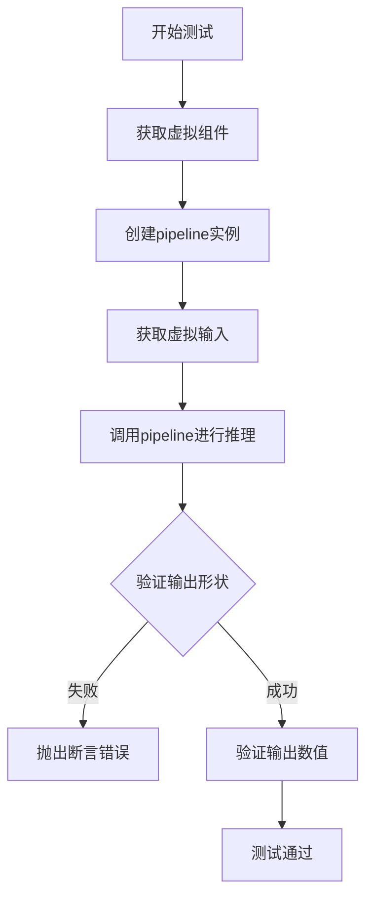

## 类结构

```
KandinskyV22PriorEmb2EmbPipelineFastTests (测试类)
└── 继承自 PipelineTesterMixin, unittest.TestCase
```

## 全局变量及字段


### `enable_full_determinism`
    
启用完全确定性以确保测试结果可重复

类型：`function`
    


### `KandinskyV22PriorEmb2EmbPipelineFastTests.pipeline_class`
    
待测试的Kandinsky V2.2先验嵌入到嵌入管道类

类型：`Type[KandinskyV22PriorEmb2EmbPipeline]`
    


### `KandinskyV22PriorEmb2EmbPipelineFastTests.params`
    
管道需要测试的参数列表,包含prompt和image

类型：`list[str]`
    


### `KandinskyV22PriorEmb2EmbPipelineFastTests.batch_params`
    
支持批处理的参数列表,包含prompt和image

类型：`list[str]`
    


### `KandinskyV22PriorEmb2EmbPipelineFastTests.required_optional_params`
    
必需的可选参数列表,包含num_images_per_prompt、strength、generator等

类型：`list[str]`
    


### `KandinskyV22PriorEmb2EmbPipelineFastTests.test_xformers_attention`
    
标识是否测试xformers注意力机制,当前设置为False

类型：`bool`
    


### `KandinskyV22PriorEmb2EmbPipelineFastTests.supports_dduf`
    
标识是否支持DDUF(Denoising Diffusion Unconditional Flow),当前设置为False

类型：`bool`
    
    

## 全局函数及方法


### `enable_full_determinism`

该函数用于确保测试环境的完全确定性，通过设置 Python random、NumPy 和 PyTorch 的随机种子，以使测试结果可复现。

参数：无

返回值：无

#### 流程图

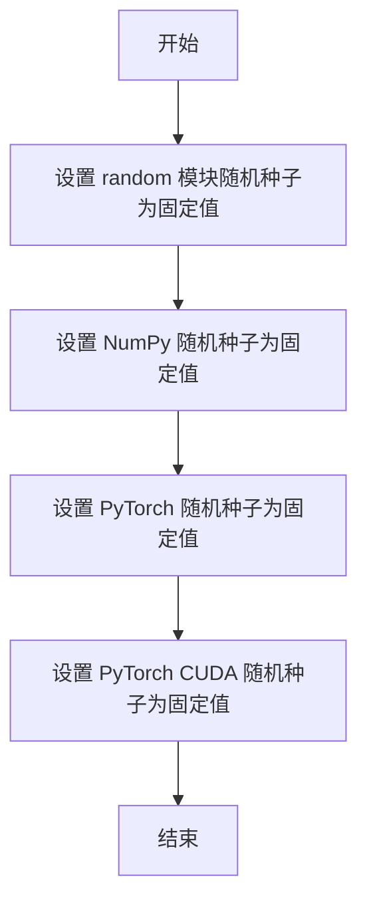

#### 带注释源码

```python
# 从 testing_utils 模块导入 enable_full_determinism 函数
from ...testing_utils import (
    enable_full_determinism,
    floats_tensor,
    skip_mps,
    torch_device,
)

# 在模块加载时调用该函数，确保后续所有随机操作都是确定性的
enable_full_determinism()
```


### `floats_tensor`

用于生成指定形状的浮点数张量，通常用于测试目的，生成随机浮点数值的张量。

参数：

-  `shape`：`tuple` 或 `int`，表示输出张量的形状
-  `rng`：`random.Random`，可选，随机数生成器，默认为 None

返回值：`torch.Tensor`，包含随机浮点数的张量

#### 流程图

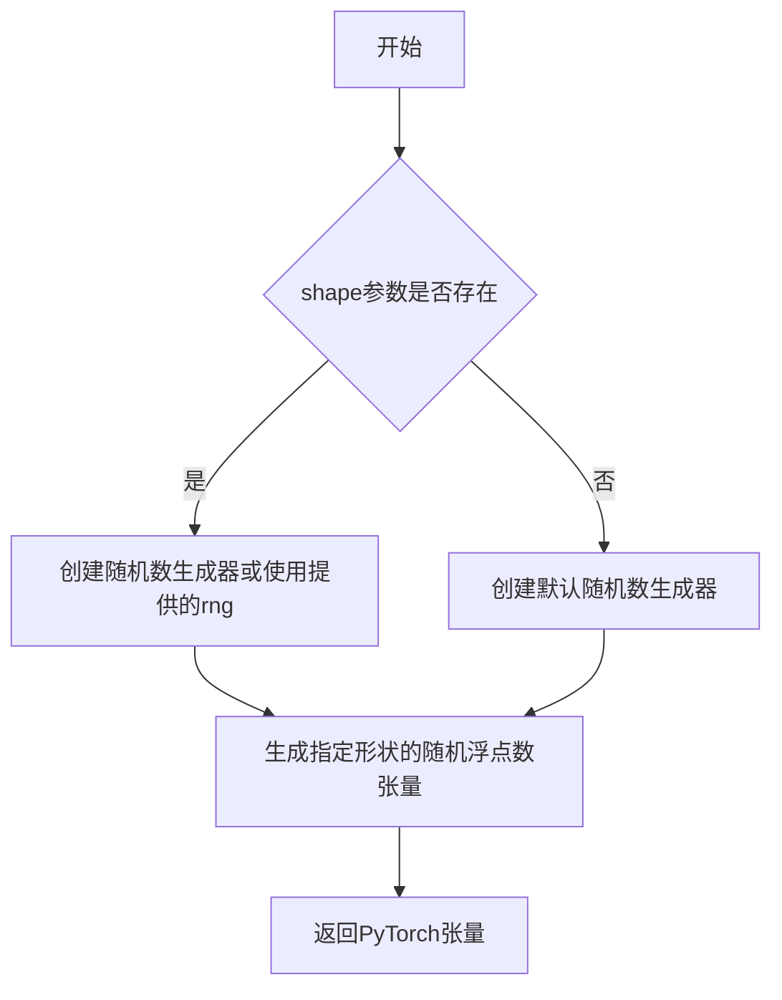

#### 带注释源码

```python
# 从测试工具模块导入floats_tensor函数
from ...testing_utils import (
    enable_full_determinism,
    floats_tensor,  # <-- 目标函数
    skip_mps,
    torch_device,
)

# 在get_dummy_inputs方法中的使用示例：
def get_dummy_inputs(self, device, seed=0):
    if str(device).startswith("mps"):
        generator = torch.manual_seed(seed)
    else:
        generator = torch.Generator(device=device).manual_seed(seed)

    # 调用floats_tensor生成形状为(1, 3, 64, 64)的随机浮点数张量
    # 参数1: shape - 张量形状 (1, 3, 64, 64)
    # 参数2: rng - 随机数生成器，使用random.Random(seed)创建
    image = floats_tensor((1, 3, 64, 64), rng=random.Random(seed)).to(device)
    
    # 将张量转换为numpy数组并调整维度顺序
    image = image.cpu().permute(0, 2, 3, 1)[0]
    
    # 使用PIL将数组转换为图像对象
    init_image = Image.fromarray(np.uint8(image)).convert("RGB").resize((256, 256))

    inputs = {
        "prompt": "horse",
        "image": init_image,
        "strength": 0.5,
        "generator": generator,
        "guidance_scale": 4.0,
        "num_inference_steps": 2,
        "output_type": "np",
    }
    return inputs
```

#### 关键信息

| 项目 | 详情 |
|------|------|
| 函数来源 | `diffusers.testing_utils` 模块 |
| 主要用途 | 在单元测试中生成指定形状的随机浮点数张量 |
| 使用场景 | 创建模拟图像数据、测试模型输入、验证管道功能 |
| 数值范围 | 通常生成 [-1, 1] 范围内的浮点数 |
| 设备支持 | 支持通过 `.to(device)` 迁移到指定设备（CPU/GPU） |


由于 `skip_mps` 是从外部模块 `...testing_utils` 导入的函数，而不是在当前代码文件中定义的，我无法直接获取其完整源代码。根据代码上下文和函数命名，我提供以下分析：

### skip_mps

跳过在 MPS (Metal Performance Shaders) 设备上运行的测试的装饰器函数。

参数：

-  `func`：`Callable`，被装饰的测试函数

返回值：`Callable`，装饰后的函数，如果设备是 MPS 则返回空函数，否则返回原函数

#### 流程图

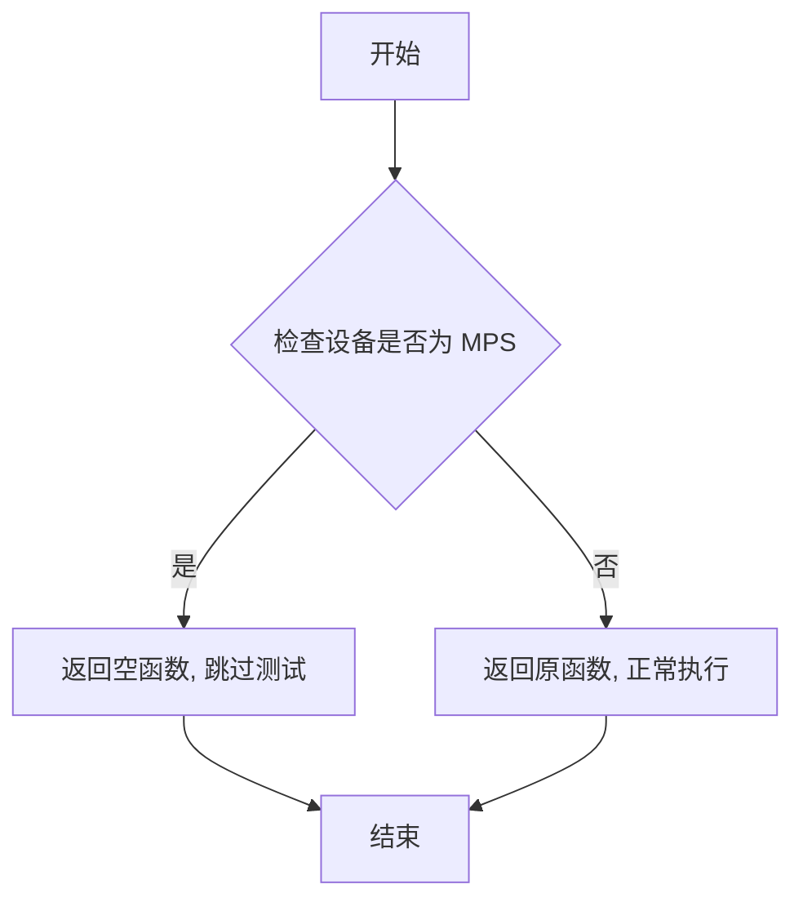

#### 带注释源码

由于 `skip_mps` 函数定义不在当前代码文件中，无法提供其源代码。根据函数用途和代码中的使用方式，推断其实现可能如下：

```
# 推断的实现（基于函数用途）
def skip_mps(func):
    """
    装饰器：跳过在 MPS 设备上运行的测试
    
    当检测到设备为 MPS (Metal Performance Shaders) 时，
    装饰的测试函数将被跳过，不执行。
    """
    import functools
    from ...testing_utils import torch_device
    
    @functools.wraps(func)
    def wrapper(*args, **kwargs):
        if str(torch_device).startswith("mps"):
            # 在 MPS 设备上，跳过测试
            return
        return func(*args, **kwargs)
    
    return wrapper
```

**注意**：实际的 `skip_mps` 函数定义在 `diffusers` 库的 `testing_utils` 模块中，需要查看该模块的源代码才能获取准确实现。当前代码仅展示了该函数的导入和在测试方法上作为装饰器的使用方式。


### `torch_device`

`torch_device` 是一个从 `testing_utils` 模块导入的全局变量（或函数），用于获取当前测试环境所使用的 PyTorch 设备（如 `"cpu"` 或 `"cuda"`），以便在测试中根据设备类型执行特定的断言逻辑。

参数：
- 无参数

返回值：`str`，返回当前 PyTorch 设备名称（如 "cpu"、"cuda" 等）

#### 流程图

```mermaid
flowchart TD
    A[开始] --> B{获取 torch_device}
    B --> C[返回设备字符串]
    C --> D[在测试中用于条件判断]
    D --> E[例如: test_max_difference = torch_device == "cpu"]
```

#### 带注释源码

```python
# 从 testing_utils 模块导入 torch_device
# 该模块位于 diffusers 包的测试工具目录中
from ...testing_utils import (
    enable_full_determinism,
    floats_tensor,
    skip_mps,
    torch_device,  # <-- 导入获取当前设备的工具
)
from ..test_pipelines_common import PipelineTesterMixin

# 在测试方法中使用 torch_device
@skip_mps
def test_attention_slicing_forward_pass(self):
    # torch_device 返回设备字符串，用于判断是否进行精度测试
    test_max_difference = torch_device == "cpu"
    test_mean_pixel_difference = False

    self._test_attention_slicing_forward_pass(
        test_max_difference=test_max_difference,
        test_mean_pixel_difference=test_mean_pixel_difference,
    )
```

#### 备注

在 `diffusers` 库的 `testing_utils` 模块中，`torch_device` 通常被实现为一个函数或全局变量，其定义类似于：

```python
# 可能的实现方式（基于使用推断）
def torch_device() -> str:
    """返回当前测试使用的设备"""
    if torch.cuda.is_available():
        return "cuda"
    return "cpu"

# 或者作为一个模块级变量
# torch_device = "cuda" if torch.cuda.is_available() else "cpu"
```

该工具的主要用途是在测试中实现设备相关的条件判断，例如在 CPU 上进行完整的精度测试，而在 GPU 上可能允许一定的数值差异。


### `KandinskyV22PriorEmb2EmbPipelineFastTests.text_embedder_hidden_size`

该属性用于返回文本嵌入器的隐藏层大小（hidden size），在测试中固定返回32，用于配置CLIP文本编码器和其他相关组件的维度参数。

参数：无（属性方法，仅包含隐式参数 `self`）

返回值：`int`，返回文本嵌入器的隐藏层大小，值为32

#### 流程图

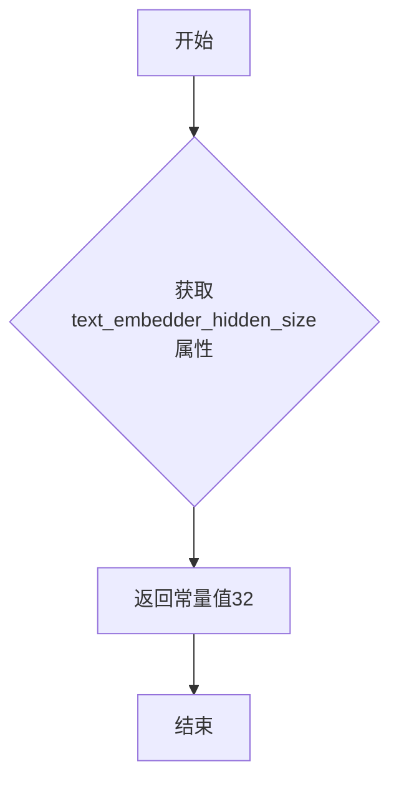

#### 带注释源码

```python
@property
def text_embedder_hidden_size(self):
    """
    属性方法，返回文本嵌入器的隐藏层大小
    
    该属性用于配置测试中CLIPTextModelWithProjection的hidden_size参数，
    同时也用于PriorTransformer的embedding_dim参数以及其他相关维度计算。
    在当前测试配置中，固定返回32以满足快速测试的需求。
    
    Returns:
        int: 文本嵌入器的隐藏层大小，固定值为32
    """
    return 32
```


### `KandinskyV22PriorEmb2EmbPipelineFastTests.time_input_dim`

这是一个属性方法（Property），用于返回时间输入维度（time input dimension）的常量值32。该属性在测试类中作为配置参数使用，用于定义模型隐藏层大小、嵌入维度等关键配置。

参数：

- `self`：`KandinskyV22PriorEmb2EmbPipelineFastTests`，隐式参数，指向测试类实例本身

返回值：`int`，返回常量值32，表示时间输入维度。该值用于配置文本嵌入器的隐藏大小（`text_embedder_hidden_size`）、先验模型的嵌入维度（`embedding_dim`）以及块输出通道数（`block_out_channels_0`）等关键参数。

#### 流程图

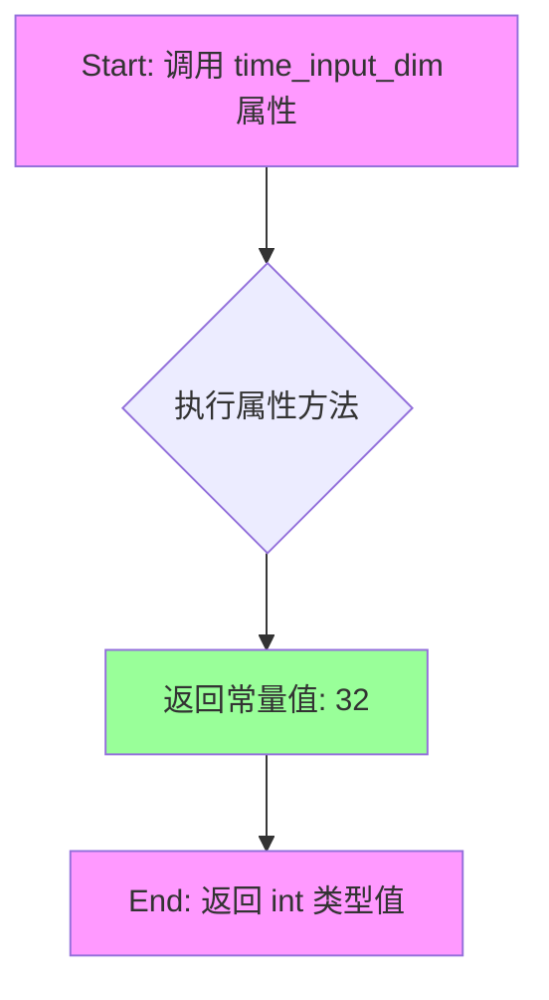

#### 带注释源码

```python
@property
def time_input_dim(self):
    """
    属性方法：返回时间输入维度值
    
    该属性用于配置 Kandinsky V2.2 先验管道的测试参数：
    - 用作 text_embedder_hidden_size（文本嵌入器隐藏大小）
    - 用作 block_out_channels_0（初始块输出通道数）
    - 用作先验模型的 embedding_dim（嵌入维度）
    
    Returns:
        int: 常量值 32，表示时间输入维度
    """
    return 32
```


### `KandinskyV22PriorEmb2EmbPipelineFastTests.block_out_channels_0`

这是一个属性方法（property），用于返回测试管道的输出通道数配置。该属性是 KandinskyV22 先验 Emb2Emb 管道快速测试类的一部分，主要用于提供测试所需的模型配置参数，通常与时间输入维度保持一致，以满足测试用例对模型架构的初始化需求。

参数： 无（属性方法不接受显式参数）

返回值：`int`，返回时间输入维度（`time_input_dim`）的值，默认为 32，用于定义测试中 Transformer 模型的输出通道配置。

#### 流程图

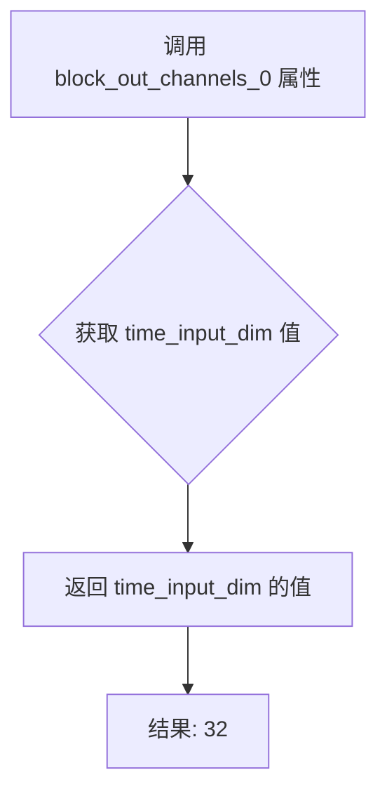

#### 带注释源码

```python
@property
def block_out_channels_0(self):
    """
    返回用于测试的输出通道数配置。
    
    该属性提供 PriorTransformer 模型的 block_out_channels_0 参数，
    用于定义网络层输出通道维度。通常与 time_input_dim 保持一致，
    以确保测试配置的一致性。
    
    返回:
        int: 返回 time_input_dim 的值，默认为 32
    """
    return self.time_input_dim
```


### `KandinskyV22PriorEmb2EmbPipelineFastTests.time_embed_dim`

该属性方法用于返回时间嵌入维度，其值等于时间输入维度的四倍，用于定义Transformer模型中时间嵌入层的输出维度。

参数：无

返回值：`int`，返回时间嵌入的维度大小（值为128，即time_input_dim * 4）

#### 流程图

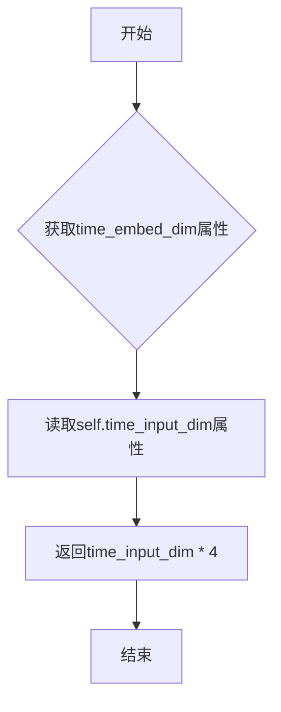

#### 带注释源码

```python
@property
def time_embed_dim(self):
    """
    属性方法：返回时间嵌入维度
    
    该属性计算时间嵌入的维度，基于time_input_dim乘以4得出。
    在Kandinsky V2.2 prior pipeline中，时间嵌入维度通常设置为
    输入维度的4倍，这是Transformer模型中的常见设计模式。
    
    返回:
        int: 时间嵌入维度，等于time_input_dim * 4
    """
    return self.time_input_dim * 4
```

#### 关联属性说明

| 属性名 | 类型 | 描述 |
|--------|------|------|
| `time_input_dim` | property (int) | 时间输入维度，固定返回32 |
| `text_embedder_hidden_size` | property (int) | 文本嵌入器隐藏层大小，返回32 |
| `cross_attention_dim` | property (int) | 交叉注意力维度，返回100 |


### `KandinskyV22PriorEmb2EmbPipelineFastTests.cross_attention_dim`

这是一个属性方法（property），用于返回测试配置中的交叉注意力维度值，为测试用例提供模型配置参数。

参数：
- 无参数

返回值：`int`，返回交叉注意力维度值 100，用于配置 PriorTransformer 模型的注意力机制参数。

#### 流程图

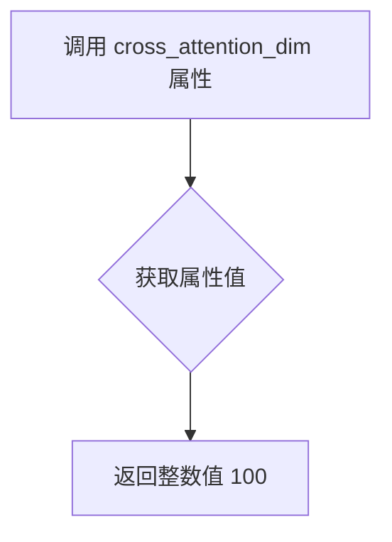

#### 带注释源码

```python
@property
def cross_attention_dim(self):
    """
    属性方法：返回测试配置中的交叉注意力维度值
    
    该属性用于配置 PriorTransformer 模型的注意力机制参数，
    返回一个固定的测试用维度值 100，用于确保测试环境的一致性。
    
    参数:
        无（属性方法不接受额外参数）
    
    返回值:
        int: 交叉注意力维度值，固定返回 100
    """
    return 100
```


### `KandinskyV22PriorEmb2EmbPipelineFastTests.dummy_tokenizer`

该属性方法用于创建一个虚拟的 CLIPTokenizer 对象，主要用于测试目的。通过从预训练的小型随机 CLIP 模型中加载 tokenizer，为单元测试提供文本分词功能。

参数：无（隐含参数 `self` 为测试类实例本身）

返回值：`CLIPTokenizer`，返回一个用于测试的 CLIP 分词器实例

#### 流程图

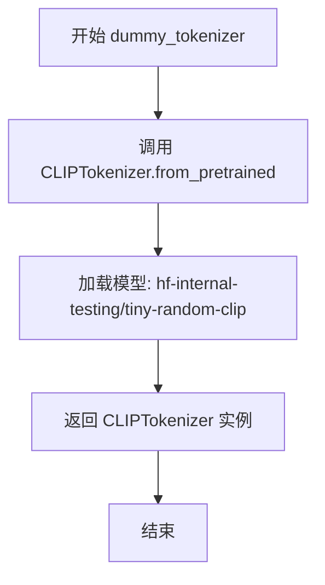

#### 带注释源码

```python
@property
def dummy_tokenizer(self):
    """
    创建并返回一个用于测试的虚拟 CLIPTokenizer 对象。
    该 tokenizer 从 HuggingFace 测试仓库加载一个小型随机 CLIP 模型，
    用于在单元测试中模拟真实的文本分词功能。
    
    Returns:
        CLIPTokenizer: 用于测试的 CLIP 分词器实例
    """
    # 从预训练模型加载分词器
    # 使用 huggingface 测试仓库中的小型随机 CLIP 模型
    tokenizer = CLIPTokenizer.from_pretrained("hf-internal-testing/tiny-random-clip")
    # 返回分词器实例供测试使用
    return tokenizer
```


### `KandinskyV22PriorEmb2EmbPipelineFastTests.dummy_text_encoder`

该属性方法用于创建一个虚拟的 CLIP 文本编码器（`CLIPTextModelWithProjection`）实例，专门用于测试目的。它使用预定义的配置参数（如隐藏层大小、注意力头数、层数等）初始化一个小型文本编码器模型，以便在不需要加载真实预训练权重的情况下进行单元测试。

参数：

- `self`：隐式参数，`KandinskyV22PriorEmb2EmbPipelineFastTests` 类的实例

返回值：`CLIPTextModelWithProjection`，返回一个配置好的 CLIP 文本编码器模型实例，用于测试流程

#### 流程图

```mermaid
flowchart TD
    A[开始 dummy_text_encoder] --> B[设置随机种子 torch.manual_seed(0)]
    B --> C[创建 CLIPTextConfig 配置对象]
    C --> D[配置参数: bos_token_id, eos_token_id, hidden_size=32, projection_dim=32, intermediate_size=37, layer_norm_eps=1e-05, num_attention_heads=4, num_hidden_layers=5, pad_token_id=1, vocab_size=1000]
    D --> E[使用配置创建 CLIPTextModelWithProjection 实例]
    E --> F[返回 CLIPTextModelWithProjection 模型]
```

#### 带注释源码

```python
@property
def dummy_text_encoder(self):
    """
    创建一个用于测试的虚拟 CLIP 文本编码器模型。
    
    Returns:
        CLIPTextModelWithProjection: 配置好的文本编码器模型实例
    """
    # 设置随机种子以确保测试结果的可重复性
    torch.manual_seed(0)
    
    # 定义 CLIP 文本模型配置参数
    config = CLIPTextConfig(
        bos_token_id=0,              # 序列开始标记 ID
        eos_token_id=2,              # 序列结束标记 ID
        hidden_size=self.text_embedder_hidden_size,  # 隐藏层大小（从类属性获取，值为 32）
        projection_dim=self.text_embedder_hidden_size,  # 投影维度
        intermediate_size=37,         # FFN 中间层维度
        layer_norm_eps=1e-05,        # LayerNorm epsilon 值
        num_attention_heads=4,       # 注意力头数量
        num_hidden_layers=5,         # 隐藏层数量
        pad_token_id=1,              # 填充标记 ID
        vocab_size=1000,             # 词汇表大小
    )
    
    # 使用配置创建 CLIPTextModelWithProjection 模型实例并返回
    return CLIPTextModelWithProjection(config)
```


### `KandinskyV22PriorEmb2EmbPipelineFastTests.dummy_prior`

这是一个测试辅助属性方法，用于创建一个虚拟的 PriorTransformer 模型实例，供单元测试使用。该方法初始化随机种子，配置模型参数（注意力头数、注意力头维度、嵌入维度、层数），并对 `clip_std` 参数进行特殊处理以确保后续的 `post_process_latents` 方法不会返回零值。

参数：

- `self`：隐式参数，测试类实例本身

返回值：`PriorTransformer`，返回一个配置好的虚拟 PriorTransformer 模型实例

#### 流程图

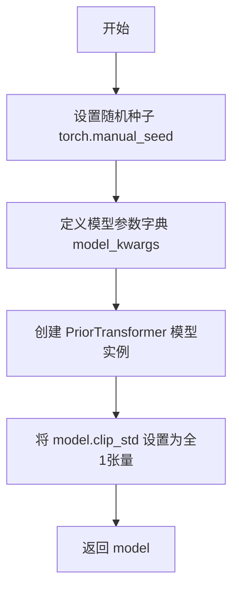

#### 带注释源码

```python
@property
def dummy_prior(self):
    """
    创建一个用于测试的虚拟 PriorTransformer 模型
    
    Returns:
        PriorTransformer: 配置好的模型实例，用于单元测试
    """
    # 设置随机种子以确保测试可重复性
    torch.manual_seed(0)

    # 定义模型配置参数
    model_kwargs = {
        "num_attention_heads": 2,           # 注意力头数量
        "attention_head_dim": 12,           # 每个注意力头的维度
        "embedding_dim": self.text_embedder_hidden_size,  # 嵌入维度（从类属性获取，值为32）
        "num_layers": 1,                    # Transformer层数
    }

    # 使用配置参数实例化 PriorTransformer 模型
    model = PriorTransformer(**model_options)
    
    # 特殊处理：clip_std 和 clip_mean 初始化为0
    # 这会导致 PriorTransformer.post_process_latents 总是返回0
    # 为了确保测试能正确运行，将 clip_std 设置为全1张量
    model.clip_std = nn.Parameter(torch.ones(model.clip_std.shape))
    
    # 返回配置好的虚拟模型
    return model
```


### `KandinskyV22PriorEmb2EmbPipelineFastTests.dummy_image_encoder`

该属性方法用于创建一个虚拟的 CLIP 视觉编码器模型（CLIPVisionModelWithProjection），配置了特定的视觉参数（隐藏层大小、图像尺寸、注意力头数等），作为测试用例的组成部分，用于 Kandinsky V2.2 Prior Emb2Emb Pipeline 的单元测试。

参数：

- `self`：`KandinskyV22PriorEmb2EmbPipelineFastTests`，隐式参数，指向测试类实例

返回值：`CLIPVisionModelWithProjection`，返回配置好的 CLIP 视觉模型实例，用于后续的 pipeline 测试

#### 流程图

```mermaid
flowchart TD
    A[开始 dummy_image_encoder] --> B[设置随机种子 torch.manual_seed(0)]
    B --> C[创建 CLIPVisionConfig 配置对象]
    C --> D[配置 hidden_size=32<br/>image_size=224<br/>projection_dim=32<br/>intermediate_size=37<br/>num_attention_heads=4<br/>num_channels=3<br/>num_hidden_layers=5<br/>patch_size=14]
    D --> E[使用配置创建 CLIPVisionModelWithProjection 模型实例]
    E --> F[返回 model 实例]
```

#### 带注释源码

```python
@property
def dummy_image_encoder(self):
    """
    创建一个用于测试的虚拟 CLIP 视觉编码器模型
    
    该方法生成一个配置好的 CLIPVisionModelWithProjection 实例，
    用于 KandinskyV22PriorEmb2EmbPipeline 的单元测试场景
    """
    # 设置随机种子以确保测试结果的可重复性
    torch.manual_seed(0)
    
    # 创建 CLIPVisionConfig 配置对象
    # 配置参数说明：
    # - hidden_size: 隐藏层维度，与 text_embedder_hidden_size 保持一致(32)
    # - image_size: 输入图像尺寸(224)
    # - projection_dim: 投影维度，与隐藏层大小相同(32)
    # - intermediate_size: FFN 中间层维度(37)
    # - num_attention_heads: 注意力头数量(4)
    # - num_channels: 输入图像通道数(3，RGB)
    # - num_hidden_layers: 隐藏层数量(5)
    # - patch_size: 图像分块大小(14)
    config = CLIPVisionConfig(
        hidden_size=self.text_embedder_hidden_size,  # 32
        image_size=224,
        projection_dim=self.text_embedder_hidden_size,  # 32
        intermediate_size=37,
        num_attention_heads=4,
        num_channels=3,
        num_hidden_layers=5,
        patch_size=14,
    )

    # 使用配置创建 CLIPVisionModelWithProjection 模型实例
    # 该模型输出视觉嵌入向量，用于后续的图像到图像转换任务
    model = CLIPVisionModelWithProjection(config)
    
    # 返回配置好的模型，供测试用例使用
    return model
```


### `KandinskyV22PriorEmb2EmbPipelineFastTests.dummy_image_processor`

这是一个属性方法（Property），用于创建并返回一个配置好的 CLIP 图像预处理器（CLIPImageProcessor），该预处理器在单元测试中用于模拟图像处理流程。

参数：

- （无参数，属性方法只使用 `self`）

返回值：`CLIPImageProcessor`，返回一个配置好的图像预处理器实例，包含裁剪、归一化、缩放等参数，用于测试中处理输入图像。

#### 流程图

```mermaid
flowchart TD
    A[开始: dummy_image_processor 属性访问] --> B{检查缓存的 image_processor}
    B -->|否| C[创建新的 CLIPImageProcessor]
    B -->|是| F[返回缓存的实例]
    
    C --> D[配置图像处理参数]
    D --> E[返回 image_processor 实例]
    
    E --> F[返回 CLIPImageProcessor]
    
    subgraph 参数配置
        P1[crop_size=224]
        P2[do_center_crop=True]
        P3[do_normalize=True]
        P4[do_resize=True]
        P5[image_mean=[0.48145466, 0.4578275, 0.40821073]]
        P6[image_std=[0.26862954, 0.26130258, 0.27577711]]
        P7[resample=3]
        P8[size=224]
    end
```

#### 带注释源码

```python
@property
def dummy_image_processor(self):
    """
    创建并返回一个用于测试的 CLIP 图像预处理器
    
    该方法初始化一个 CLIPImageProcessor 实例，配置了标准的图像预处理参数：
    - 中心裁剪 (center crop)
    - 图像归一化 (normalization)
    - 图像缩放 (resize)
    
    这些参数基于 CLIP 模型的标准预处理配置，用于确保测试的一致性。
    """
    # 创建 CLIPImageProcessor 实例，配置各项图像处理参数
    image_processor = CLIPImageProcessor(
        crop_size=224,                    # 裁剪尺寸为 224x224
        do_center_crop=True,              # 启用中心裁剪
        do_normalize=True,                # 启用图像归一化
        do_resize=True,                   # 启用图像缩放
        # ImageNet 标准的图像均值 (RGB通道)
        image_mean=[0.48145466, 0.4578275, 0.40821073],
        # ImageNet 标准的图像标准差 (RGB通道)
        image_std=[0.26862954, 0.26130258, 0.27577711],
        resample=3,                       # 重采样方法 (PIL.BILINEAR=3)
        size=224,                          # 目标尺寸为 224
    )

    # 返回配置好的图像预处理器实例
    return image_processor
```


### `KandinskyV22PriorEmb2EmbPipelineFastTests.get_dummy_components`

该方法用于生成测试所需的虚拟（dummy）组件字典，包含了Kandinsky V22 Prior Emb2EmbPipeline所需的全部组件（prior模型、图像编码器、文本编码器、分词器、调度器和图像处理器），以便在单元测试中进行快速初始化和测试。

参数：无（仅隐式包含 `self` 参数，指向测试类实例）

返回值：`Dict[str, Any]`，返回包含管道所有组件的字典，键名为 "prior"、"image_encoder"、"text_encoder"、"tokenizer"、"scheduler"、"image_processor"

#### 流程图

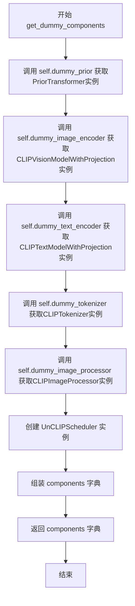

#### 带注释源码

```python
def get_dummy_components(self):
    """
    生成用于测试的虚拟组件字典。
    
    该方法创建一个完整的虚拟管道所需的所有组件，
    用于单元测试而非实际推理。
    """
    # 获取PriorTransformer模型实例（用于prior去噪）
    prior = self.dummy_prior
    
    # 获取CLIP图像编码器实例（用于编码输入图像）
    image_encoder = self.dummy_image_encoder
    
    # 获取CLIP文本编码器实例（用于编码文本提示）
    text_encoder = self.dummy_text_encoder
    
    # 获取CLIP分词器实例（用于分词文本输入）
    tokenizer = self.dummy_tokenizer
    
    # 获取图像预处理器实例（用于图像预处理）
    image_processor = self.dummy_image_processor

    # 创建UnCLIP调度器实例（用于噪声调度）
    # 参数说明：
    # - variance_type: 方差类型，fixed_small_log表示固定小对数方差
    # - prediction_type: 预测类型，sample表示预测噪声样本
    # - num_train_timesteps: 训练时间步数
    # - clip_sample: 是否裁剪样本
    # - clip_sample_range: 样本裁剪范围
    scheduler = UnCLIPScheduler(
        variance_type="fixed_small_log",
        prediction_type="sample",
        num_train_timesteps=1000,
        clip_sample=True,
        clip_sample_range=10.0,
    )

    # 组装组件字典
    # 键名必须与管道类的__init__参数名一致
    components = {
        "prior": prior,                    # PriorTransformer模型
        "image_encoder": image_encoder,    # CLIPVisionModelWithProjection模型
        "text_encoder": text_encoder,      # CLIPTextModelWithProjection模型
        "tokenizer": tokenizer,            # CLIPTokenizer分词器
        "scheduler": scheduler,            # UnCLIPScheduler调度器
        "image_processor": image_processor,# CLIPImageProcessor处理器
    }

    # 返回完整的组件字典
    return components
```


### `KandinskyV22PriorEmb2EmbPipelineFastTests.get_dummy_inputs`

该方法用于生成测试所需的虚拟输入参数，包括文本提示、图像、生成器等，模拟 Emb2Emb 推理管道的完整输入配置。

参数：

- `device`：`str`，目标设备标识（如 "cpu"、"cuda"、"mps"），用于创建随机数生成器
- `seed`：`int`，随机数种子，默认值为 0，确保测试结果可复现

返回值：`dict`，包含以下键值对：

- `prompt`：文本提示字符串
- `image`：PIL Image 对象（预处理后的图像）
- `strength`：浮点数，强度参数
- `generator`：torch.Generator 实例，随机数生成器
- `guidance_scale`：浮点数，引导尺度
- `num_inference_steps`：整数，推理步数
- `output_type`：字符串，输出类型

#### 流程图

```mermaid
flowchart TD
    A[开始 get_dummy_inputs] --> B{device 是否为 mps}
    B -->|是| C[使用 torch.manual_seed]
    B -->|否| D[使用 torch.Generator(device).manual_seed]
    C --> E[生成随机图像张量]
    D --> E
    E --> F[转换为 CPU 并调整维度]
    F --> G[转换为 PIL Image]
    G --> H[调整大小为 256x256]
    H --> I[构建输入字典]
    I --> J[返回 inputs 字典]
```

#### 带注释源码

```python
def get_dummy_inputs(self, device, seed=0):
    """
    生成用于测试 KandinskyV22PriorEmb2EmbPipeline 的虚拟输入参数
    
    参数:
        device: str - 目标设备，如 'cpu', 'cuda', 'mps'
        seed: int - 随机种子，默认 0
    
    返回:
        dict: 包含管道推理所需的所有虚拟输入参数
    """
    # 根据设备类型选择随机数生成方式
    # MPS 设备需要特殊处理，直接使用 torch.manual_seed
    if str(device).startswith("mps"):
        generator = torch.manual_seed(seed)
    else:
        # 其他设备使用 torch.Generator 创建随机数生成器
        generator = torch.Generator(device=device).manual_seed(seed)

    # 生成随机浮点数张量 (1, 3, 64, 64) - 模拟输入图像
    image = floats_tensor((1, 3, 64, 64), rng=random.Random(seed)).to(device)
    
    # 维度变换: (1, 3, 64, 64) -> (64, 64, 3)
    # permute 将通道维度移到最后，cpu() 移回 CPU，pick 第一张图
    image = image.cpu().permute(0, 2, 3, 1)[0]
    
    # 将数值转换为 PIL Image 对象并调整为标准尺寸
    # 流程: uint8 数组 -> PIL Image -> RGB 模式 -> 256x256
    init_image = Image.fromarray(np.uint8(image)).convert("RGB").resize((256, 256))

    # 构建完整的输入参数字典
    inputs = {
        "prompt": "horse",              # 文本提示
        "image": init_image,            # 预处理后的图像
        "strength": 0.5,                # emb2emb 强度参数
        "generator": generator,         # 随机数生成器
        "guidance_scale": 4.0,          # Classifier-free guidance 权重
        "num_inference_steps": 2,       # 扩散推理步数
        "output_type": "np",            # 输出格式为 numpy 数组
    }
    return inputs
```


### `KandinskyV22PriorEmb2EmbPipelineFastTests.test_kandinsky_prior_emb2emb`

该测试方法验证 KandinskyV22PriorEmb2EmbPipeline 在_emb2emb（图像到嵌入）模式下的核心功能，包括管道实例化、图像编码、嵌入生成、输出格式兼容性（字典/元组模式）以及数值精度验证。

参数：

- `self`：隐式参数，测试类实例本身

返回值：无显式返回值（void），该方法通过断言验证管道输出的正确性

#### 流程图

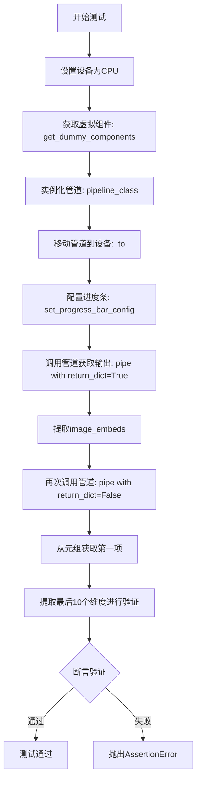

#### 带注释源码

```python
def test_kandinsky_prior_emb2emb(self):
    """
    测试KandinskyV22PriorEmb2EmbPipeline的emb2emb（图像到嵌入）功能
    验证管道能正确处理图像输入并生成图像嵌入
    """
    # 步骤1: 设置测试设备为CPU
    device = "cpu"

    # 步骤2: 获取虚拟/测试组件（包含模型、tokenizer、scheduler等）
    components = self.get_dummy_components()

    # 步骤3: 使用测试组件实例化管道
    pipe = self.pipeline_class(**components)
    # 步骤4: 将管道移至指定设备（CPU）
    pipe = pipe.to(device)

    # 步骤5: 配置进度条（disable=None表示不禁用）
    pipe.set_progress_bar_config(disable=None)

    # 步骤6: 使用return_dict=True调用管道（默认模式）
    output = pipe(**self.get_dummy_inputs(device))
    # 从输出中提取图像嵌入
    image = output.image_embeds

    # 步骤7: 使用return_dict=False调用管道（返回元组模式）
    image_from_tuple = pipe(
        **self.get_dummy_inputs(device),
        return_dict=False,
    )[0]  # 获取元组中的第一个元素（image_embeds）

    # 步骤8: 提取嵌入的最后10个维度用于验证
    image_slice = image[0, -10:]
    image_from_tuple_slice = image_from_tuple[0, -10:]

    # 步骤9: 验证输出形状为(1, 32)
    assert image.shape == (1, 32)

    # 步骤10: 定义预期的数值切片（基于已知正确输出）
    expected_slice = np.array(
        [-0.8947, 0.7225, -0.2400, -1.4224, -1.9268, -1.1454, -1.8220, -0.7972, 1.0465, -0.5207]
    )

    # 步骤11: 验证return_dict=True模式的数值精度（误差<1e-2）
    assert np.abs(image_slice.flatten() - expected_slice).max() < 1e-2
    # 步骤12: 验证return_dict=False模式的数值精度（误差<1e-2）
    assert np.abs(image_from_tuple_slice.flatten() - expected_slice).max() < 1e-2
```


### `KandinskyV22PriorEmb2EmbPipelineFastTests.test_inference_batch_single_identical`

该方法是一个单元测试，用于验证管道在批量推理时与单张图像推理时产生相同的结果（忽略数值误差）。它通过调用父类 `PipelineTesterMixin` 提供的 `_test_inference_batch_single_identical` 方法来执行测试，并设置最大允许误差为 `1e-2`。

参数：

- `self`：`KandinskyV22PriorEmb2EmbPipelineFastTests`，测试类实例本身，包含测试所需的组件和配置

返回值：`None`，该方法为测试方法，不返回任何值

#### 流程图

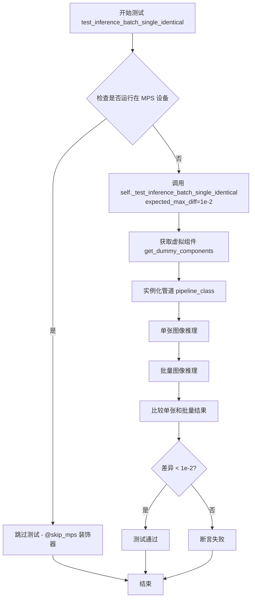

#### 带注释源码

```python
@skip_mps  # 装饰器：如果设备是 MPS (Apple Silicon)，则跳过此测试
def test_inference_batch_single_identical(self):
    """
    测试批量推理与单张推理结果的一致性
    
    该测试方法验证当使用相同的输入参数进行批量推理时，
    结果应与逐张推理的结果一致（考虑浮点精度误差）。
    这是确保管道正确处理批量数据的重要测试。
    """
    # 调用父类 PipelineTesterMixin 提供的测试方法
    # expected_max_diff=1e-2 表示允许的最大差异为 0.01
    self._test_inference_batch_single_identical(expected_max_diff=1e-2)
```


### `KandinskyV22PriorEmb2EmbPipelineFastTests.test_attention_slicing_forward_pass`

这是一个单元测试方法，用于测试 KandinskyV22PriorEmb2EmbPipeline 在使用注意力切片（attention slicing）技术时的前向传播是否正常工作。该测试确保启用注意力切片后，模型的输出结果与标准前向传播一致，主要用于验证优化功能不影响模型的正确性。

参数：

- `self`：KandinskyV22PriorEmb2EmbPipelineFastTests，测试类实例本身

返回值：`None`，该方法为测试方法，不返回任何值，仅执行断言验证

#### 流程图

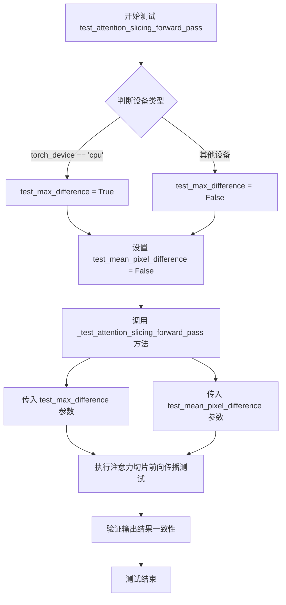

#### 带注释源码

```python
@skip_mps  # 装饰器：跳过MPS设备上的测试
def test_attention_slicing_forward_pass(self):
    """
    测试使用注意力切片技术时的前向传播是否正常工作。
    
    注意力切片是一种内存优化技术，通过将注意力计算分片处理
    来减少GPU内存占用。此测试验证该优化不会影响输出正确性。
    """
    # 判断是否在CPU设备上，CPU上需要测试最大差异
    test_max_difference = torch_device == "cpu"
    
    # 是否测试像素平均值差异，此处固定为False
    test_mean_pixel_difference = False
    
    # 调用基类的注意力切片测试方法，验证优化后的前向传播
    self._test_attention_slicing_forward_pass(
        test_max_difference=test_max_difference,  # 是否测试最大差异
        test_mean_pixel_difference=test_mean_pixel_difference,  # 是否测试像素均值差异
    )
```

## 关键组件


### KandinskyV22PriorEmb2EmbPipeline

KandinskyV22PriorEmb2EmbPipeline 是 Kandinsky 2.2 模型的先验嵌入到嵌入管道，核心功能是将文本提示和图像输入转换为图像嵌入向量，用于后续的图像生成任务。

### PriorTransformer

PriorTransformer 是先验变换器模型，负责将文本嵌入和图像嵌入进行转换和预测，生成用于图像合成的图像嵌入表示。

### CLIPTextModelWithProjection

CLIPTextModelWithProjection 是带投影的 CLIP 文本编码器，用于将文本提示编码为文本嵌入向量，具备投影层以生成高维特征表示。

### CLIPVisionModelWithProjection

CLIPVisionModelWithProjection 是带投影的 CLIP 视觉编码器，用于将输入图像编码为图像嵌入向量，具备投影层以生成与文本空间对齐的特征表示。

### CLIPTokenizer

CLIPTokenizer 是文本分词器，负责将文本提示分割为词元序列，用于文本编码器的输入处理。

### CLIPImageProcessor

CLIPImageProcessor 是图像预处理器，负责对输入图像进行裁剪、缩放、归一化等预处理操作，以符合 CLIP 模型的输入要求。

### UnCLIPScheduler

UnCLIPScheduler 是调度器，用于管理扩散过程中的噪声调度，控制去噪步骤的时间步长和采样策略。

### 张量索引与惰性加载

代码中通过 `.to(device)` 实现模型的懒加载，将模型参数按需转移到目标设备；通过张量切片操作 `image[0, -10:]` 和 `.permute()` 实现灵活的索引访问。

### 反量化支持

测试中使用 NumPy 数组 (`np.array`) 进行数值比较和精度验证，支持浮点数到整数的反量化转换用于图像重建。

### 量化策略

测试配置中通过 `torch.manual_seed(0)` 设置确定性种子，配合 `enable_full_determinism()` 实现可重复的测试结果，确保量化环境下的稳定性。

### PipelineTesterMixin

PipelineTesterMixin 是管道测试混合类，提供通用的测试方法如 `_test_inference_batch_single_identical` 和 `_test_attention_slicing_forward_pass`，用于验证管道的功能和性能。


## 问题及建议


### 已知问题

-   **重复创建组件**：每次访问 `@property` 装饰的 `dummy_prior`、`dummy_text_encoder` 等方法时都会创建新的模型实例，导致内存和计算资源浪费
-   **硬编码的魔数配置**：图像预处理的 `image_mean`、`image_std`、`size`、`crop_size` 等参数硬编码在代码中，缺乏可配置性
-   **脆弱的模型修改**：在 `dummy_prior` 属性中直接修改 `model.clip_std = nn.Parameter(...)` 依赖于 PriorTransformer 的内部实现细节，容易因上游代码更新而失效
-   **设备处理不一致**：`get_dummy_inputs` 方法对 MPS 设备使用 `torch.manual_seed(seed)`，而其他设备使用 `torch.Generator(device=device).manual_seed(seed)`，可能导致测试结果不一致
-   **缺乏输入验证**：测试方法未对 `params` 和 `batch_params` 中声明的参数进行验证，无法确保参数正确性
-   **魔法数字**：测试中使用的阈值（如 `1e-2`、batch size `1`、图像尺寸 `64`、`256` 等）散落在代码中，缺乏常量定义

### 优化建议

-   **缓存 dummy 组件**：使用 `@functools.lru_cache` 或在类初始化时创建一次组件并缓存，避免重复创建
-   **提取配置常量**：将图像预处理参数、阈值、模型配置等提取为类级别常量或配置文件
-   **统一随机数生成**：对所有设备使用统一的随机数生成方式，或使用测试框架提供的确定性工具
-   **增强错误信息**：在断言中添加更详细的错误信息，如打印实际值与期望值的对比
-   **添加参数校验**：在测试开始时验证 `params` 和 `batch_params` 中声明的参数是否在实际调用中被正确使用
-   **解耦依赖实现**：避免直接修改模型内部参数，可通过配置或 mock 方式处理特殊需求

## 其它


### 设计目标与约束

本测试文件旨在验证 KandinskyV22PriorEmb2EmbPipeline 在图像到embedding转换过程中的正确性。设计目标包括：确保pipeline能够正确处理图像输入并生成对应的image_embeds；验证批量处理和单样本处理的一致性；支持不同设备（CPU/MPS/GPU）的测试。约束条件包括：测试仅使用虚拟（dummy）组件，不依赖真实的预训练模型权重；使用固定的随机种子以确保测试的可重复性；最大允许误差为1e-2。

### 错误处理与异常设计

测试类中使用了skip_mps装饰器来跳过MPS设备上的特定测试，因为某些功能（如attention slicing）在MPS上可能存在问题。测试通过assert语句验证输出结果的正确性，当断言失败时会抛出AssertionError。PipelineTesterMixin提供了通用的测试框架方法，用于处理各种边缘情况。

### 数据流与状态机

测试数据流如下：get_dummy_components方法创建虚拟的prior、image_encoder、text_encoder、tokenizer、scheduler和image_processor组件；get_dummy_inputs方法生成包含prompt、image、strength、generator等参数的输入字典；test_kandinsky_prior_emb2emb方法将组件传递给pipeline类并执行推理流程，最终返回包含image_embeds的输出对象。状态机涉及pipeline的初始化（__init__）、设备转移（to方法）和推理调用（__call__方法）三个主要状态。

### 外部依赖与接口契约

本测试文件依赖以下外部包和模块：torch（PyTorch深度学习框架）、numpy（数值计算）、PIL（图像处理）、transformers（HuggingFace的CLIP模型相关类）、diffusers（Kandinsky pipeline及相关组件）、testing_utils（测试工具函数）、test_pipelines_common（通用pipeline测试Mixin）。接口契约方面：pipeline_class必须实现__call__方法并返回包含image_embeds的输出对象；组件字典必须包含prior、image_encoder、text_encoder、tokenizer、scheduler、image_processor六个键；输入参数必须符合required_optional_params中定义的参数规范。

### 性能考虑与基准

测试使用轻量级的虚拟组件（hidden_size=32，num_layers=1，num_attention_heads=2）以加快测试执行速度。test_inference_batch_single_identical方法验证批量推理与单样本推理结果的一致性，确保推理优化不会影响结果正确性。test_attention_slicing_forward_pass方法测试注意力切片优化在不同设备上的表现。

### 测试策略

采用单元测试与集成测试相结合的方式：每个test方法独立运行，使用setUp或类级别的get_dummy_components/get_dummy_inputs方法准备测试数据。使用装饰器skip_mps条件性地跳过特定平台不支持的测试。测试覆盖范围包括：基本功能测试（test_kandinsky_prior_emb2emb）、批量推理测试（test_inference_batch_single_identical）、注意力优化测试（test_attention_slicing_forward_pass）。

### 兼容性考虑

测试代码通过torch_device变量适配不同设备（CPU/MPS/CUDA）。使用条件判断处理MPS设备的随机数生成器差异。pipeline的return_dict参数支持字典和元组两种返回格式的兼容性测试。output_type参数支持"np"（numpy数组）输出格式。

### 安全考虑

测试文件仅使用虚拟组件，不涉及真实的用户数据或敏感信息。随机数种子通过enable_full_determinism函数固定，确保测试结果可重现且不包含随机安全风险。

### 配置与参数说明

核心配置参数包括：text_embedder_hidden_size=32（文本嵌入维度）、time_input_dim=32（时间输入维度）、cross_attention_dim=100（交叉注意力维度）、num_images_per_prompt=1（每提示词生成的图像数量）、strength=0.5（图像到embedding的转换强度）、guidance_scale=4.0（引导 scale）、num_inference_steps=2（推理步数）、output_type="np"（输出类型为numpy数组）。

### 使用示例

测试类的典型使用流程：首先通过get_dummy_components获取虚拟组件字典，然后使用get_dummy_inputs生成测试输入参数，最后将组件和输入传递给pipeline_class创建实例并执行调用。测试人员可以通过继承KandinskyV22PriorEmb2EmbPipelineFastTests类并重写相关属性和方法来扩展测试用例。

    