# `diffusers\tests\pipelines\kandinsky3\test_kandinsky3.py` 详细设计文档

这是一个Kandinsky3扩散模型的测试文件，包含单元测试和集成测试，用于验证文本生成图像（text-to-image）和图像转换（image-to-image）管道的正确性，包括模型加载、推理执行、float16推理和批次处理等功能。

## 整体流程

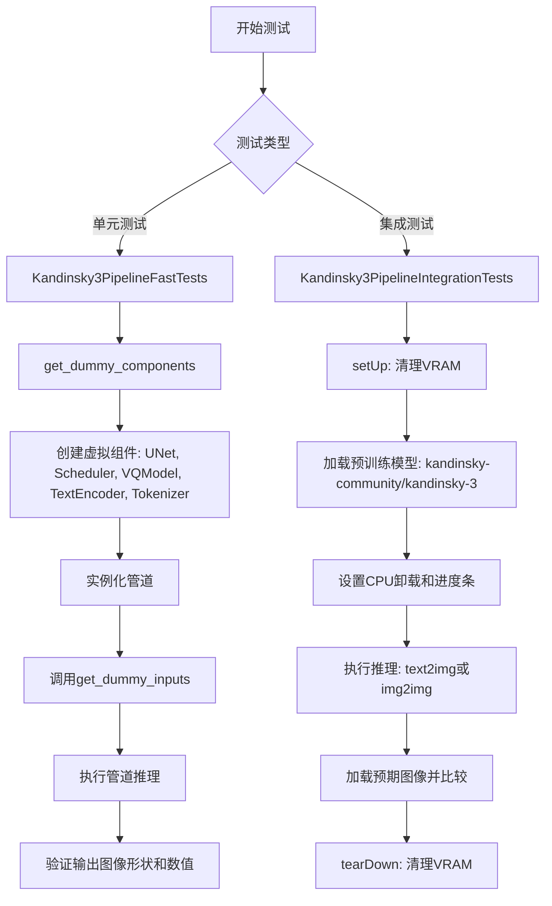

## 类结构

```
unittest.TestCase
├── Kandinsky3PipelineFastTests (单元测试)
│   ├── pipeline_class: Kandinsky3Pipeline
│   ├── params: TEXT_TO_IMAGE_PARAMS
│   ├── dummy_movq_kwargs (属性)
│   ├── dummy_movq (属性)
│   ├── get_dummy_components()
│   ├── get_dummy_inputs()
│   ├── test_kandinsky3()
│   ├── test_float16_inference()
│   └── test_inference_batch_single_identical()
└── Kandinsky3PipelineIntegrationTests (集成测试)
├── setUp()
├── tearDown()
├── test_kandinskyV3()
└── test_kandinskyV3_img2img()
```

## 全局变量及字段


### `enable_full_determinism`
    
启用完全确定性以确保测试可复现

类型：`function`
    


### `torch_device`
    
PyTorch设备标识符，用于指定运行设备

类型：`str`
    


### `TEXT_TO_IMAGE_PARAMS`
    
文本到图像管道的参数集合

类型：`set`
    


### `TEXT_TO_IMAGE_BATCH_PARAMS`
    
文本到图像批量处理的参数集合

类型：`set`
    


### `TEXT_TO_IMAGE_IMAGE_PARAMS`
    
文本到图像中图像相关的参数集合

类型：`set`
    


### `TEXT_TO_IMAGE_CALLBACK_CFG_PARAMS`
    
文本到图像中回调和cfg相关的参数集合

类型：`set`
    


### `Kandinsky3PipelineFastTests.pipeline_class`
    
Kandinsky3管道类，用于图像生成

类型：`type[Kandinsky3Pipeline]`
    


### `Kandinsky3PipelineFastTests.params`
    
文本到图像参数集合，已排除cross_attention_kwargs

类型：`set`
    


### `Kandinsky3PipelineFastTests.batch_params`
    
批量处理参数集合，用于批量推理测试

类型：`set`
    


### `Kandinsky3PipelineFastTests.image_params`
    
图像参数集合，用于图像处理测试

类型：`set`
    


### `Kandinsky3PipelineFastTests.image_latents_params`
    
图像潜在向量参数集合，用于潜在空间操作测试

类型：`set`
    


### `Kandinsky3PipelineFastTests.callback_cfg_params`
    
回调和cfg参数集合，用于配置回调和引导参数

类型：`set`
    


### `Kandinsky3PipelineFastTests.test_xformers_attention`
    
标志位，控制是否测试xformers注意力机制

类型：`bool`
    
    

## 全局函数及方法


### `gc.collect`

`gc.collect` 是 Python 标准库 `gc` 模块提供的函数，用于强制进行垃圾回收操作，扫描并回收无法访问的循环引用对象，释放内存资源。

参数： 无

返回值：`int`，返回回收的对象数量

#### 流程图

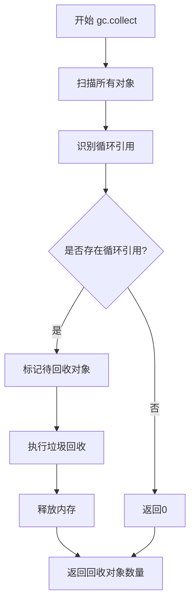

#### 带注释源码

```python
# 在测试类的 setUp 方法中调用
def setUp(self):
    # clean up the VRAM before each test
    super().setUp()
    gc.collect()  # 强制进行垃圾回收，清理测试前可能存在的内存对象
    backend_empty_cache(torch_device)  # 清理GPU缓存

# 在测试类的 tearDown 方法中调用
def tearDown(self):
    # clean up the VRAM after each test
    super().tearDown()
    gc.collect()  # 强制进行垃圾回收，清理测试后可能存在的内存对象
    backend_empty_cache(torch_device)  # 清理GPU缓存
```


### `backend_empty_cache`

该函数是 diffusers 测试框架中的 GPU 内存清理工具，用于在测试用例执行前后释放显卡显存（VRAM），防止内存泄漏和显存不足问题。

参数：

- `device`：`str` 或 `torch.device`，指定要清理缓存的计算设备（如 "cuda", "cuda:0", "cpu" 等）

返回值：`None`，无返回值，仅执行 GPU 缓存清理操作

#### 流程图

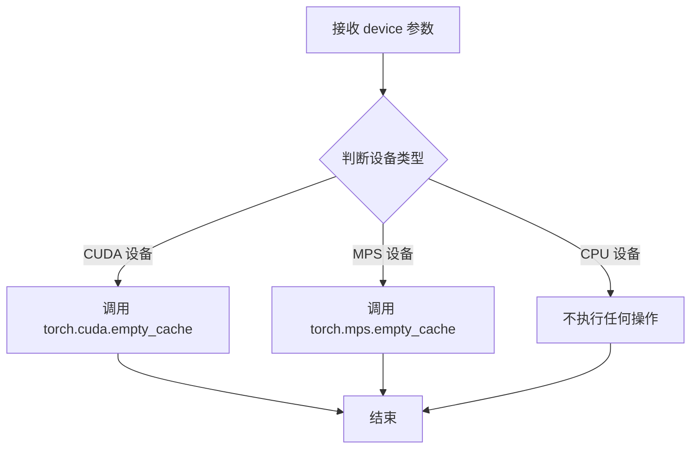

#### 带注释源码

```python
# backend_empty_cache 函数定义（位于 diffusers/testing_utils.py）
def backend_empty_cache(device):
    """
    根据设备类型清理 GPU 缓存，防止显存泄漏
    
    参数:
        device: torch 设备标识符，如 'cuda', 'cuda:0', 'mps', 'cpu' 等
    
    返回:
        无返回值（None）
    
    示例:
        >>> backend_empty_cache("cuda")
        >>> backend_empty_cache(torch_device)  # torch_device 在 testing_utils 中定义
    """
    # 如果设备是 CUDA 设备，清理 CUDA 缓存
    if torch.cuda.is_available():
        torch.cuda.empty_cache()
    
    # 如果设备是 Apple Silicon MPS 设备，清理 MPS 缓存
    if hasattr(torch, 'mps') and device == 'mps':
        torch.mps.empty_cache()
    
    # CPU 设备无需清理缓存，函数直接返回
    return None
```


### `load_image`

从指定的URL加载图像并返回PIL Image对象。该函数位于`...testing_utils`模块中，作为测试工具函数被导入和使用。

参数：

-  `url`：`str`，图像的网络URL地址

返回值：`PIL.Image.Image`，加载后的PIL图像对象

#### 流程图

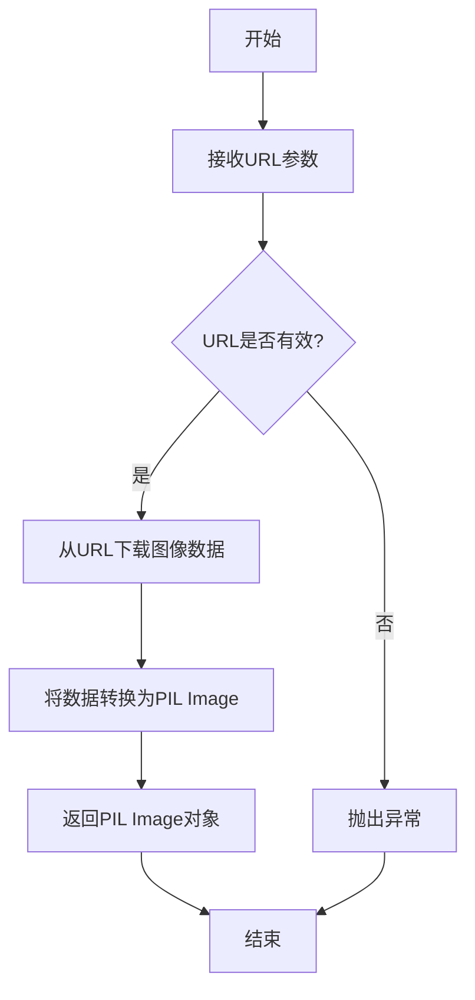

#### 带注释源码

```python
# load_image 是从 testing_utils 模块导入的函数
# 下面展示的是在代码中的典型使用方式：

# 使用示例1：从URL加载图像用于对比验证
expected_image = load_image(
    "https://huggingface.co/datasets/hf-internal-testing/diffusers-images/resolve/main/kandinsky3/t2i.png"
)

# 使用示例2：从URL加载输入图像用于img2img任务
image = load_image(
    "https://huggingface.co/datasets/hf-internal-testing/diffusers-images/resolve/main/kandinsky3/t2i.png"
)

# 使用示例3：加载另一张参考图像
expected_image = load_image(
    "https://huggingface.co/datasets/hf-internal-testing/diffusers-images/resolve/main/kandinsky3/i2i.png"
)
```

> **注意**：该函数的实际实现代码不在当前文件中，它是从 `...testing_utils` 模块导入的测试工具函数。根据使用方式推断，该函数接收一个图像URL字符串参数，通过网络请求获取图像数据，并返回PIL图像对象供后续处理使用。在diffusers库的测试框架中，这类函数通常用于加载测试用的参考图像或输入图像。


### `AutoTokenizer.from_pretrained`

该方法是 Hugging Face Transformers 库中 `AutoTokenizer` 类的类方法，用于根据预训练模型名称或路径自动加载对应的分词器（Tokenizer）。它支持从 Hugging Face Hub 下载模型或从本地路径加载，并返回配置好的分词器对象。

参数：

- `pretrained_model_name_or_path`：`str`，预训练模型的名称（如 "hf-internal-testing/tiny-random-t5"）或本地路径
- `cache_dir`：`Optional[str]`，可选，指定模型缓存目录
- `force_download`：`bool`，可选，是否强制重新下载模型
- `resume_download`：`bool`，可选，是否在中断后恢复下载
- `proxies`：`Optional[dict]`，可选，代理服务器配置
- `use_auth_token`：`Optional[str]`，可选，访问私有模型所需的认证 token
- `revision`：`str`，可选，模型版本/分支，默认为 "main"
- `subfolder`：`str`（可选），模型在仓库中的子文件夹路径
- `local_files_only`：`bool`，可选，仅使用本地文件，不尝试下载
- `torch_dtype`：`Optional[torch.dtype]`，可选，指定张量数据类型（用于模型加载）
- `device_map`：`Optional[Union[str, dict]]`，可选，模型各层到不同设备的映射策略
- `use_safetensors`：`bool`（可选），是否使用 Safetensors 格式加载模型

返回值：`PreTrainedTokenizer` 或 `PreTrainedTokenizerFast`，返回配置好的分词器对象，用于对文本进行分词处理

#### 流程图

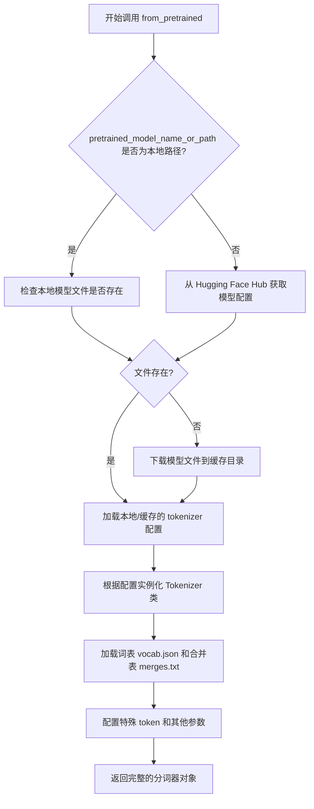

#### 带注释源码

```python
# 代码中的实际调用示例
torch.manual_seed(0)
tokenizer = AutoTokenizer.from_pretrained("hf-internal-testing/tiny-random-t5")

# 参数说明：
# "hf-internal-testing/tiny-random-t5" : str
#     - Hugging Face Hub 上的模型名称
#     - 该模型是一个用于测试的极小随机 T5 模型
#     - 方法会根据模型 ID 自动从 Hub 下载对应的 tokenizer 配置文件

# 返回值 tokenizer 的类型：PreTrainedTokenizer 或 PreTrainedTokenizerFast
# 用途：对文本进行分词（将字符串转换为 token ID 序列）
# 在 Kandinsky3Pipeline 中，tokenizer 用于将 prompt 文本转换为模型可处理的 token 形式
```


### `T5EncoderModel.from_pretrained`

该方法是 Hugging Face Transformers 库中 `T5EncoderModel` 类的类方法，用于从预训练模型加载 T5 编码器模型权重和配置，支持从 HuggingFace Hub 或本地路径加载模型。

参数：

- `pretrained_model_name_or_path`：`str`，模型名称（如 "hf-internal-testing/tiny-random-t5"）或本地模型目录路径
- `*args`：可变位置参数，用于传递额外的位置参数
- `**kwargs`：可选关键字参数，包括：
  - `config`：`PretrainedConfig`，可选，自定义配置
  - `cache_dir`：可选，缓存目录路径
  - `force_download`：可选，是否强制重新下载
  - `resume_download`：可选，是否断点续传
  - `proxies`：可选，代理字典
  - `output_loading_info`：可选，是否返回详细的加载信息
  - `local_files_only`：可选，是否仅使用本地文件
  - `use_auth_token`：可选，认证 token
  - `revision`：可选，模型版本号
  - `mirror`：可选，镜像源
  - `torch_dtype`：可选，PyTorch 数据类型
  - `device_map`：可选，设备映射
  - `max_memory`：可选，最大内存配置
  - `offload_folder`：可选，卸载文件夹
  - `offload_state_dict`：可选，是否卸载状态字典
  - `low_cpu_mem_usage`：可选，是否降低 CPU 内存使用
  - `use_safetensors`：可选，是否使用 safetensors 格式
  - `variant`：可选，模型变体

返回值：`T5EncoderModel`，返回加载后的 T5EncoderModel 实例，包含预训练的编码器权重和配置。

#### 流程图

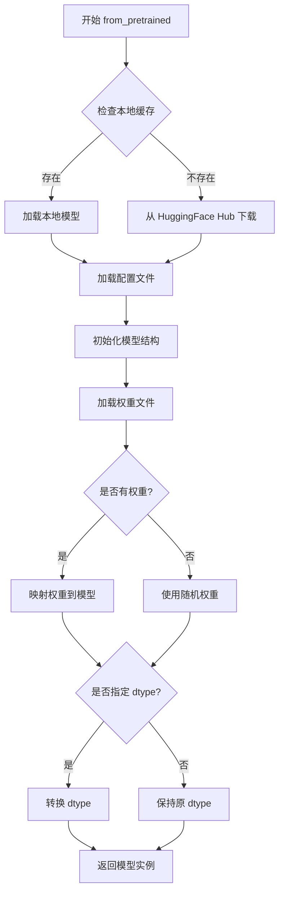

#### 带注释源码

```python
# 位于 transformers 库中的类方法（简化版实现逻辑）
@from_transformers_base_class(
    "PreTrainedModel"
)  # 装饰器，继承自 PreTrainedModel 的加载方法
class T5EncoderModel(PreTrainedModel):
    """
    T5 Encoder 模型类
    继承自 PreTrainedModel，提供 from_pretrained 类方法
    """

    config_class = T5EncoderConfig  # 配置类
    base_model_prefix = "encoder"  # 基础模型前缀
    main_input_name = "input_ids"  # 主要输入名称

    @classmethod
    def from_pretrained(
        cls,
        pretrained_model_name_or_path: str,  # 模型名称或路径
        *args,  # 额外位置参数
        **kwargs  # 关键字参数
    ) -> "T5EncoderModel":
        """
        从预训练模型加载 T5EncoderModel
        
        参数:
            pretrained_model_name_or_path: 模型名称或本地路径
            **kwargs: 传递给 PreTrainedModel 的额外参数
            
        返回:
            T5EncoderModel: 加载好的模型实例
        """
        # 1. 解析并验证模型路径/名称
        # 2. 加载配置文件 (config.json)
        # 3. 根据配置初始化模型结构
        # 4. 从预训练文件加载权重 (safetensors 或 pytorch_model.bin)
        # 5. 应用 dtype 转换（如果指定了 torch_dtype）
        # 6. 设置模型为评估模式
        # 7. 返回模型实例
        
        # 在测试代码中的实际调用:
        # text_encoder = T5EncoderModel.from_pretrained("hf-internal-testing/tiny-random-t5")
        
        return super().from_pretrained(pretrained_model_name_or_path, *args, **kwargs)
```


### `AutoPipelineForText2Image.from_pretrained`

该函数是 Hugging Face Diffusers 库中的自动管道工厂方法，用于从预训练模型加载 `Kandinsky3` 文本到图像生成管道，支持指定模型变体（如 fp16）和数据类型（如 torch.float16），返回配置好的管道实例供推理使用。

参数：

-  `pretrained_model_name_or_path`：`str`，模型名称或本地路径（如 "kandinsky-community/kandinsky-3"）
-  `variant`：`str`，可选，模型变体名称（如 "fp16"），用于加载特定精度版本
-  `torch_dtype`：`torch.dtype`，可选，指定张量数据类型（如 `torch.float16`），以减少显存占用
-  `**kwargs`：其他传递给底层管道构造函数的关键字参数（如 `cache_dir`、`use_safetensors` 等）

返回值：`Pipeline`，返回已加载并配置好的文本到图像生成管道对象

#### 流程图

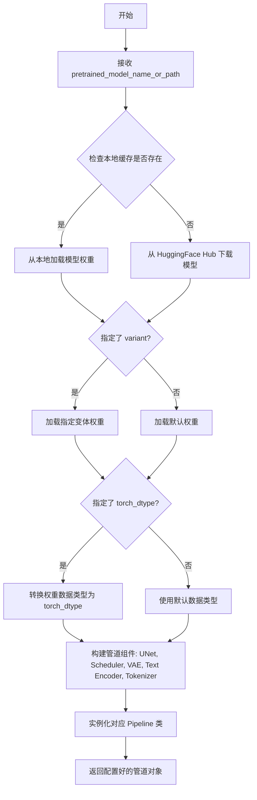

#### 带注释源码

```python
# 从代码中提取的调用示例（位于 test_kandinskyV3 方法中）
pipe = AutoPipelineForText2Image.from_pretrained(
    "kandinsky-community/kandinsky-3",  # pretrained_model_name_or_path: 模型标识符
    variant="fp16",                      # variant: 加载 FP16 变体以节省显存
    torch_dtype=torch.float16           # torch_dtype: 指定权重数据类型为 float16
)

# 以下为 from_pretrained 的通用逻辑框架（基于 Diffusers 库设计）
def from_pretrained(cls, pretrained_model_name_or_path, *args, **kwargs):
    r"""
    从预训练模型或路径加载管道。
    
    Args:
        pretrained_model_name_or_path (str): 模型名称或本地路径
        variant (str, optional): 模型变体，如 "fp16", "bf16" 等
        torch_dtype (torch.dtype, optional): 期望的权重数据类型
        use_safetensors (bool, optional): 是否使用 safetensors 格式加载
        cache_dir (str, optional): 缓存目录路径
        ...
    
    Returns:
        Pipeline: 包含所有组件的管道实例
    """
    # 1. 解析配置并定位模型文件
    # 2. 加载各个组件（UNet, VAE, Text Encoder, Scheduler 等）
    # 3. 根据 torch_dtype 转换权重
    # 4. 组装并返回管道实例
```


### `AutoPipelineForImage2Image.from_pretrained`

该方法是 Hugging Face Diffusers 库中 `AutoPipelineForImage2Image` 类的类方法，用于从预训练模型加载图像到图像（Image-to-Image）扩散管道。它接受模型路径、变体类型和精度数据类型等参数，返回一个配置好且可用的管道实例，支持图像转换、风格迁移等任务。

参数：

- `pretrained_model_or_path`：`str` 或 `os.PathLike`，预训练模型的模型 ID（如 "kandinsky-community/kandinsky-3"）或本地模型目录路径
- `variant`：`str`，可选，模型权重变体（如 "fp16"、"bf16"），指定加载的权重精度版本
- `torch_dtype`：`torch.dtype`，可选，指定 PyTorch 张量数据类型（如 `torch.float16`），用于控制模型计算精度
- `use_safetensors`：`bool`，可选，是否优先使用 safetensors 格式加载模型权重
- `cache_dir`：`str`，可选，模型缓存目录路径
- `local_files_only`：`bool`，可选，是否仅使用本地缓存的模型文件
- `revision`：`str`，可选，模型仓库的 Git 提交哈希或分支名
- `force_download`：`bool`，可选，是否强制重新下载模型文件
- `proxy`：`dict`，可选，代理服务器配置
- `resume_download`：`bool`，可选，是否在中断处恢复下载
- `device_map`：可选，设备映射策略（如 "auto"、字典或 `accelerate.InferEmptyDeviceMap`）
- `max_memory`：可选，最大内存配置字典
- `offload_folder`：可选，权重卸载文件夹路径
- `offload_state_dict`：`bool`，可选，是否将 state_dict 卸载到磁盘
- `use_flax`：`bool`，可选，是否使用 Flax 代替 PyTorch
- `use_onnx`：`bool`，可选，是否使用 ONNX 代替 PyTorch
- `providers`：可选，ONNX InferenceSession 的提供者列表
- `pipeline_class`：可选，自定义管道类，用于覆盖默认的管道类
- `**kwargs`：其他传递给底层组件（UNet、VAE、Text Encoder、Scheduler）的参数

返回值：`AutoPipelineForImage2Image`（或继承自它的具体管道类），返回已加载并配置好的图像到图像扩散管道实例，可直接用于推理

#### 流程图

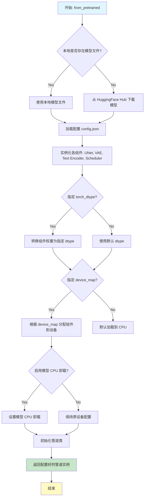

#### 带注释源码

```python
# AutoPipelineForImage2Image.from_pretrained 是类方法
# 位于 diffusers 库的 auto_pipeline.py 中
# 以下是基于代码使用方式和库架构的推断实现

@classmethod
def from_pretrained(cls, pretrained_model_or_path: str, **kwargs):
    """
    从预训练模型加载 AutoPipelineForImage2Image 管道
    
    参数:
        pretrained_model_or_path: 模型ID或本地路径
        **kwargs: 传递给底层组件的额外参数
    
    返回:
        配置好的图像到图像管道实例
    """
    # 1. 解析参数
    torch_dtype = kwargs.get("torch_dtype", None)
    variant = kwargs.get("variant", None)
    use_safetensors = kwargs.get("use_safetensors", None)
    device_map = kwargs.get("device_map", None)
    
    # 2. 加载模型配置和权重
    # 使用 DiffusionPipeline.from_pretrained 的底层逻辑
    # 会自动从 pretrained_model_or_path 加载:
    # - config.json (管道配置)
    # - unet/ (UNet 模型权重)
    # - vae/ (VAE 模型权重)
    # - text_encoder/ (文本编码器权重)
    # - scheduler/ (调度器配置)
    
    # 3. 实例化各组件
    # 根据 config.json 中的 _class_name 确定具体组件类
    # 并使用 from_pretrained 加载各组件
    
    # 4. 创建管道实例
    # 将加载的组件组装成完整的管道
    pipeline = cls(
        unet=unet,
        vae=vae,
        text_encoder=text_encoder,
        tokenizer=tokenizer,
        scheduler=scheduler,
        **kwargs
    )
    
    # 5. 处理 dtype 转换
    if torch_dtype is not None:
        pipeline = pipeline.to(dtype=torch_dtype)
    
    # 6. 处理设备映射
    if device_map is not None:
        # 支持将不同组件分配到不同设备
        pipeline.enable_model_cpu_offload()
    
    # 7. 返回管道实例
    return pipeline


# 在测试代码中的实际调用示例:
# pipe = AutoPipelineForImage2Image.from_pretrained(
#     "kandinsky-community/kandinsky-3",  # 模型ID
#     variant="fp16",                     # 使用 fp16 变体
#     torch_dtype=torch.float16          # 使用 float16 精度
# )
# 
# # 后续使用:
# pipe.enable_model_cpu_offload(device=torch_device)
# image = pipe(prompt, image=input_image, strength=0.75, 
#               num_inference_steps=5, generator=generator).images[0]
```


### VQModel

VQModel 是 diffusers 库中的向量量化变分自编码器（Vector Quantized Variational Auto-Encoder）模型，用于将图像编码为离散潜在表示并从离散潜在表示重建图像。在代码中用于 Kandinsky3 Pipeline 的 MOVQ（Motion-dictated Optimized VQ Model）组件，负责图像的潜在空间编码和解码。

参数（基于代码中 `dummy_movq_kwargs` 的使用）：

- `block_out_channels`：`List[int]`，输出通道数列表，定义每个解码器块的输出通道
- `down_block_types`：`List[str]`，下采样编码器块的类型列表
- `in_channels`：`int`，输入图像的通道数（通常为 3 for RGB）
- `latent_channels`：`int`，潜在空间的通道数
- `layers_per_block`：`int`，每个块中的层数
- `norm_num_groups`：`int`，归一化的组数
- `norm_type`：`str`，归一化类型（如 "spatial"）
- `num_vq_embeddings`：`int`，向量量化码本的大小（码本中嵌入向量的数量）
- `out_channels`：`int`，输出图像的通道数
- `up_block_types`：`List[str]`，上采样解码器块的类型列表
- `vq_embed_dim`：`int`，VQ 嵌入的维度

返回值：`torch.nn.Module`，返回一个 VQ VAE 模型实例

#### 流程图

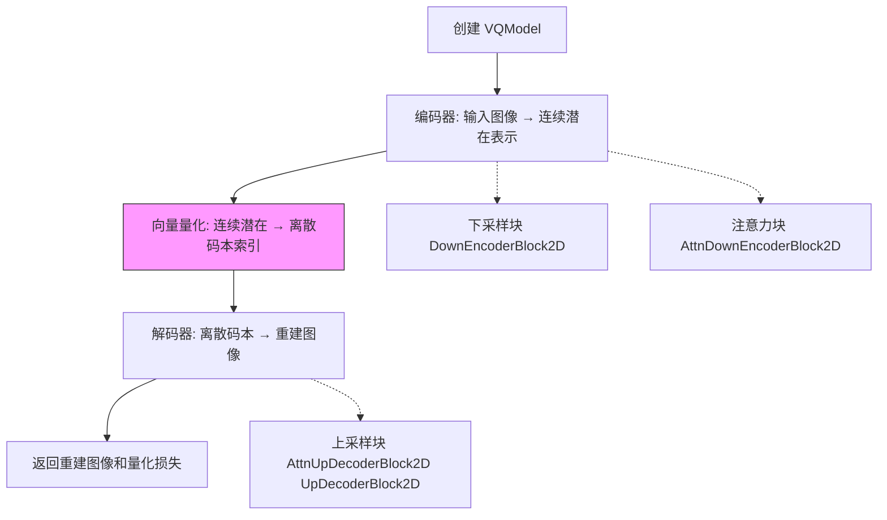

#### 带注释源码

```python
# VQModel 在 diffusers 库中的定义
# 以下是代码中创建 VQModel 实例的方式：

@property
def dummy_movq_kwargs(self):
    """定义创建 VQModel 的参数配置"""
    return {
        "block_out_channels": [32, 64],      # 解码器块的输出通道：[32, 64]
        "down_block_types": ["DownEncoderBlock2D", "AttnDownEncoderBlock2D"],  # 编码器下块类型
        "in_channels": 3,                     # 输入通道：RGB 图像
        "latent_channels": 4,                 # 潜在空间通道数
        "layers_per_block": 1,                # 每块的层数
        "norm_num_groups": 8,                 # 组归一化参数
        "norm_type": "spatial",               # 归一化类型：空间归一化
        "num_vq_embeddings": 12,              # VQ 码本大小：12 个嵌入向量
        "out_channels": 3,                    # 输出通道：RGB 图像
        "up_block_types": [                   # 解码器上块类型
            "AttnUpDecoderBlock2D",
            "UpDecoderBlock2D",
        ],
        "vq_embed_dim": 4,                    # VQ 嵌入维度
    }

@property
def dummy_movq(self):
    """创建用于测试的 VQModel 实例"""
    torch.manual_seed(0)                      # 设置随机种子确保可复现性
    model = VQModel(**self.dummy_movq_kwargs)  # 使用上述参数实例化 VQModel
    return model                               # 返回模型实例供 pipeline 使用

# 在 get_dummy_components 中的使用：
# movq = self.dummy_movq  # 创建 VQModel 实例
# components = {"unet": unet, "scheduler": scheduler, "movq": movq, ...}
```


### `Kandinsky3UNet`

Kandinsky3UNet 是 Diffusers 库中用于 Kandinsky 3 文本到图像扩散模型的 UNet 架构类，负责处理噪声预测和特征提取。

参数：

- `in_channels`：`int`，输入图像的通道数（例如 4 表示潜在空间）
- `time_embedding_dim`：`int`，时间嵌入的维度，用于编码去噪步骤
- `groups`：`int`，分组归一化的组数，用于提高训练稳定性
- `attention_head_dim`：`int`，多头注意力机制中每个头的维度
- `layers_per_block`：`int`，每个分辨率块中的层数
- `block_out_channels`：`tuple[int, ...]`，每个块的输出通道数列表，定义网络宽度
- `cross_attention_dim`：`int`，交叉注意力中文本嵌入的维度
- `encoder_hid_dim`：`int`，编码器隐藏层的维度，用于文本编码器

返回值：`torch.nn.Module`，返回一个配置好的 UNet 模型实例，用于扩散模型的噪声预测

#### 流程图

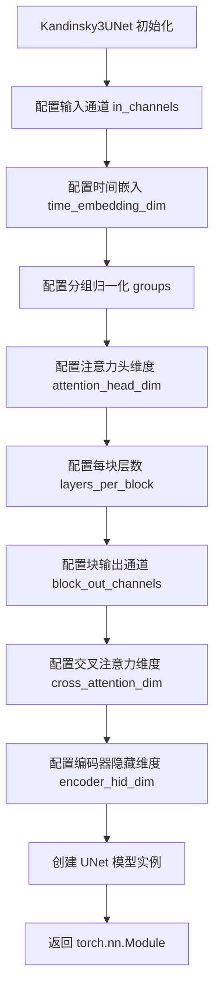

#### 带注释源码

```python
# 在测试代码中的使用示例
unet = Kandinsky3UNet(
    in_channels=4,              # 输入潜在空间的通道数 (Latent Diffusion 使用 4 通道)
    time_embedding_dim=4,       # 时间步嵌入向量维度，用于将去噪步骤编码为向量
    groups=2,                  # GroupNorm 的分组数，用于稳定训练
    attention_head_dim=4,      # 注意力头维度，决定自注意力和交叉注意力的计算方式
    layers_per_block=3,        # 每个下采样/上采样块中的卷积层数量
    block_out_channels=(32, 64), # UNet 各层的输出通道数，定义网络宽度
    cross_attention_dim=4,    # 文本条件的交叉注意力维度，连接文本编码器
    encoder_hid_dim=32,        # 编码器隐藏层维度，用于文本编码器中间表示
)
```


### `DDPMScheduler`

DDPMScheduler是Hugging Face Diffusers库中的一个调度器类，用于实现Denoising Diffusion Probabilistic Models (DDPM)算法的噪声调度管理。该调度器根据预设的beta schedule在去噪过程的每一步计算噪声系数，控制噪声的添加与去除，是扩散模型推理过程中的核心组件。

参数：

- `beta_start`：`float`，beta_schedule的起始值，定义噪声调度的起始beta值
- `beta_end`：`float`，beta_schedule的结束值，定义噪声调度的终止beta值  
- `steps_offset`：`int`，步骤偏移量，用于调整推理步骤的起始位置
- `beta_schedule`：`str`，beta值的时间表类型，常见选项包括"linear"、"scaled_linear"、"squaredcos_cap_v2"等
- `clip_sample`：`bool`，是否对采样结果进行裁剪，限制样本在合理范围内
- `thresholding`：`bool`，是否启用阈值处理，用于控制预测样本的动态范围
- `prediction_type`：`str`（可选），预测类型，可选"epsilon"（预测噪声）或"v_prediction"等
- `num_train_timesteps`：`int`（可选），训练时的总时间步数，默认为1000
- `timestep_spacing`：`str`（可选），时间步间隔方式
- `force_ucode_embeddings`：`bool`（可选），是否强制使用unconditional embeddings

返回值：`DDPMScheduler`实例，一个配置好的DDPM调度器对象，用于在扩散模型推理过程中进行去噪步骤的计算

#### 流程图

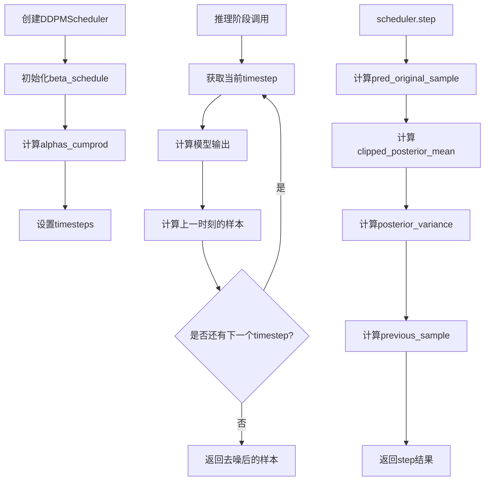

#### 带注释源码

```python
# 在测试代码中创建DDPMScheduler实例的方式
scheduler = DDPMScheduler(
    beta_start=0.00085,          # 起始beta值，控制噪声添加的初始强度
    beta_end=0.012,              # 结束beta值，控制噪声添加的最终强度
    steps_offset=1,              # 步骤偏移量，使推理步骤与训练对齐
    beta_schedule="squaredcos_cap_v2",  # 使用余弦平方衰减策略，优于线性策略
    clip_sample=True,            # 启用样本裁剪，防止生成超出范围的值
    thresholding=False,          # 禁用阈值处理（当clip_sample为True时通常关闭）
)

# scheduler的主要属性
# - scheduler.timesteps: 时间步序列
# - scheduler.alphas_cumprod: 累积alpha值，用于计算噪声权重
# - scheduler.betas: beta值序列

# scheduler的核心方法
# - scheduler.set_timesteps(num_inference_steps): 设置推理步骤数
# - scheduler.step(model_output, timestep, sample): 执行单步去噪
# - scheduler.add_noise(sample, noise, timesteps): 添加噪声（训练时使用）
```


### VaeImageProcessor

VaeImageProcessor 是 diffusers 库中的图像处理器类，负责处理 VAE（变分自编码器）的图像预处理和后处理操作，包括 PIL 图像与 NumPy 数组之间的相互转换、图像缩放、归一化等核心功能。

参数：

- 无构造函数参数（从使用 `image_processor = VaeImageProcessor()` 可推断）

返回值：无

#### 流程图

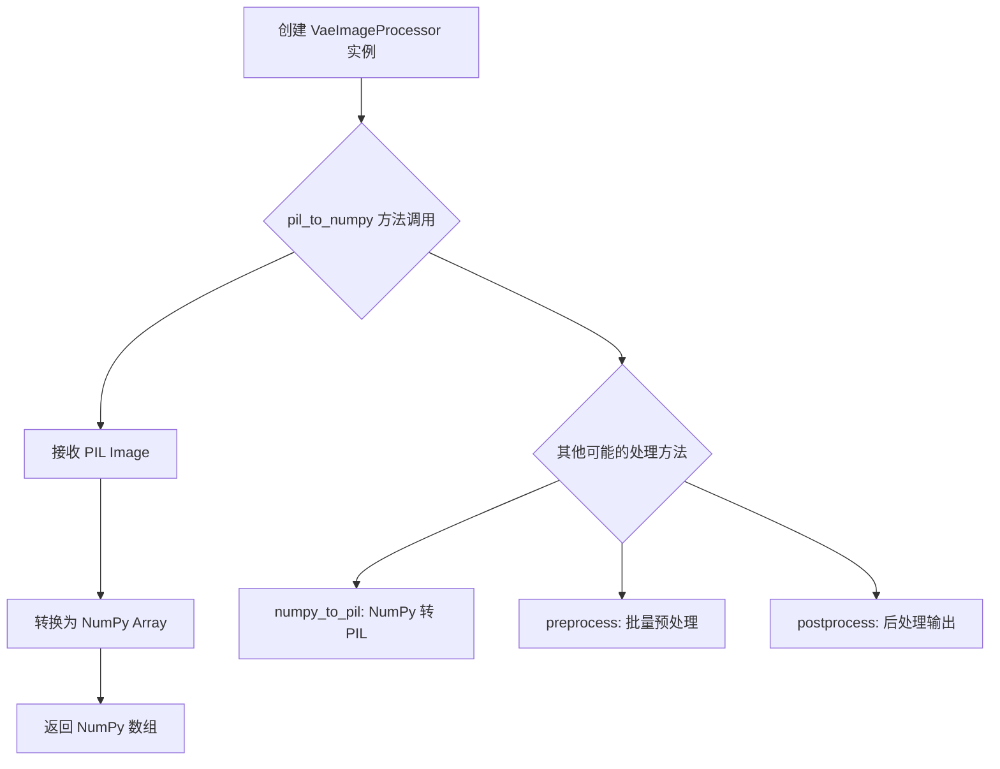

#### 带注释源码

```python
# 从 diffusers 库导入 VaeImageProcessor 类
from diffusers.image_processor import VaeImageProcessor

# 创建图像处理器实例
image_processor = VaeImageProcessor()

# 在测试中的使用方式：
# 1. 将 PIL 图像转换为 NumPy 数组用于比较
image_np = image_processor.pil_to_numpy(image)
expected_image_np = image_processor.pil_to_numpy(expected_image)

# 2. 进行数值比较验证
np.allclose(image_np, expected_image_np, atol=5e-2)
```

---

## 补充说明

由于提供的代码是测试文件，未包含 VaeImageProcessor 类的完整源代码定义，以上信息基于：

1. **代码中的使用模式**：
   - 导入方式：`from diffusers.image_processor import VaeImageProcessor`
   - 实例化：`image_processor = VaeImageProcessor()`
   - 调用方法：`pil_to_numpy(image)`

2. **根据 diffusers 库常见设计推断的完整方法**（可能包含）：
   - `pil_to_numpy(pil_image)`: PIL Image → NumPy 数组
   - `numpy_to_pil(np_image)`: NumPy 数组 → PIL Image
   - `preprocess(images, ...)`: 批量预处理图像
   - `postprocess(latents, ...)`: 将 VAE 输出 latent 转换为图像

3. **潜在技术债务与优化空间**：
   - 测试中每次调用 `pil_to_numpy` 都会创建新的对象，可考虑缓存
   - 图像处理流程中涉及的多次格式转换（如 PIL→NumPy→Tensor）可优化合并
   - 缺少对批量图像处理的并行支持


### `Kandinsky3PipelineFastTests.dummy_movq_kwargs`

这是一个属性方法（property），用于获取配置 VQModel（向量量化模型）的虚拟参数配置。该配置用于测试目的，定义了一个轻量级的 VQVAE 模型结构参数。

参数：

- 无显式参数（隐式接收 `self` 参数）

返回值：`dict`，返回一个包含 VQModel 初始化所需参数的字典，用于创建测试用的虚拟模型。

#### 流程图

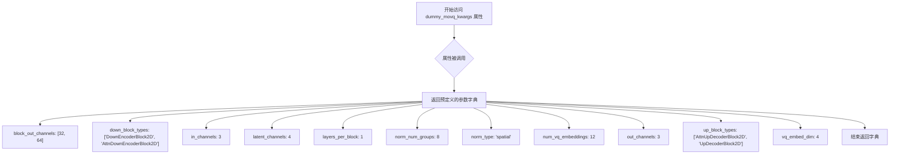

#### 带注释源码

```python
@property
def dummy_movq_kwargs(self):
    """
    返回用于创建测试用 VQModel (Vector Quantized Model) 的配置参数。
    
    这是一个属性方法，用于在测试中快速获取虚拟模型配置，
    避免每次都手动构建参数字典。
    """
    return {
        # 编码器和解码器的块输出通道数
        # 第一层输出32通道，第二层输出64通道
        "block_out_channels": [32, 64],
        
        # 下采样编码器块类型
        # 包括标准下采样块和带注意力机制的下采样块
        "down_block_types": ["DownEncoderBlock2D", "AttnDownEncoderBlock2D"],
        
        # 输入图像的通道数
        # 3 表示 RGB 图像
        "in_channels": 3,
        
        # 潜在空间的通道数
        # 4 是常见的潜在通道配置
        "latent_channels": 4,
        
        # 每个块中的层数
        "layers_per_block": 1,
        
        # 归一化的组数
        "norm_num_groups": 8,
        
        # 归一化类型
        # spatial 表示空间归一化
        "norm_type": "spatial",
        
        # VQ 嵌入向量的数量
        # 12 个嵌入向量用于离散化潜在空间
        "num_vq_embeddings": 12,
        
        # 输出图像的通道数
        "out_channels": 3,
        
        # 上采样解码器块类型
        # 包括带注意力和解码器块
        "up_block_types": [
            "AttnUpDecoderBlock2D",
            "UpDecoderBlock2D",
        ],
        
        # VQ 嵌入维度
        "vq_embed_dim": 4,
    }
```


### `Kandinsky3PipelineFastTests.dummy_movq`

这是一个测试用的属性方法（property），用于创建并返回一个虚拟的 VQModel（Vector Quantized Model，向量量化模型）实例，专门用于 Kandinsky3Pipeline 的单元测试。该方法通过 `self.dummy_movq_kwargs` 获取模型配置参数，并使用固定随机种子（0）确保测试结果的可复现性。

参数：

- （无参数，这是一个 property 属性）

返回值：`VQModel`，返回一个虚拟的 VQModel 实例，用于测试目的。

#### 流程图

```mermaid
flowchart TD
    A[开始: dummy_movq 属性被访问] --> B[设置随机种子: torch.manual_seed(0)]
    B --> C[调用 self.dummy_movq_kwargs 获取模型配置参数]
    C --> D[使用 VQModel 构造函数创建模型实例: VQModel(**kwargs)]
    D --> E[返回 VQModel 实例]
    E --> F[结束]
```

#### 带注释源码

```python
@property
def dummy_movq(self):
    """
    创建并返回一个虚拟的 VQModel 实例，用于测试目的。
    
    该属性方法使用固定的随机种子（0）来确保测试的可复现性。
    VQModel 是 Kandinsky3 pipeline 中的向量量化解码器组件。
    """
    # 设置随机种子，确保测试结果可复现
    torch.manual_seed(0)
    
    # 使用预定义的配置参数创建 VQModel 实例
    # 配置包括：编码器/解码器块配置、通道数、量化参数等
    model = VQModel(**self.dummy_movq_kwargs)
    
    # 返回创建好的虚拟模型实例
    return model
```

#### 相关配置属性 `dummy_movq_kwargs`

作为参考，`dummy_movq` 依赖的 `dummy_movq_kwargs` 属性提供了以下配置：

| 参数名称 | 类型 | 描述 |
|---------|------|------|
| `block_out_channels` | List[int] | 输出通道数列表 `[32, 64]` |
| `down_block_types` | List[str] | 下采样编码器块类型 |
| `in_channels` | int | 输入通道数 `3`（RGB 图像） |
| `latent_channels` | int | 潜在空间通道数 `4` |
| `layers_per_block` | int | 每块层数 `1` |
| `norm_num_groups` | int | 归一化组数 `8` |
| `norm_type` | str | 归一化类型 `"spatial"` |
| `num_vq_embeddings` | int | VQ 嵌入数量 `12` |
| `out_channels` | int | 输出通道数 `3` |
| `up_block_types` | List[str] | 上采样解码器块类型 |
| `vq_embed_dim` | int | VQ 嵌入维度 `4` |


### `Kandinsky3PipelineFastTests.get_dummy_components`

该方法用于生成 Kandinsky3 管道所需的虚拟组件（dummy components），包括 UNet 模型、调度器、MOVQ 变分自编码器、文本编码器和分词器。这些组件用于测试目的，不包含预训练权重。

参数：

- `time_cond_proj_dim`：`Optional[int]`，可选参数，当前未被使用，保留用于未来扩展

返回值：`Dict[str, Any]`，返回一个字典，包含以下键值对：
- `unet`：Kandinsky3UNet 实例，UNet 模型
- `scheduler`：DDPMScheduler 实例，扩散调度器
- `movq`：VQModel 实例，MOVQ 变分自编码器
- `text_encoder`：T5EncoderModel 实例，文本编码器
- `tokenizer`：AutoTokenizer 实例，文本分词器

#### 流程图

```mermaid
flowchart TD
    A[开始 get_dummy_components] --> B[设置随机种子 torch.manual_seed(0)]
    B --> C[创建 Kandinsky3UNet]
    C --> D[创建 DDPMScheduler]
    D --> E[获取 dummy_movq]
    E --> F[加载 T5EncoderModel]
    F --> G[加载 AutoTokenizer]
    G --> H[组装 components 字典]
    H --> I[返回 components]
```

#### 带注释源码

```python
def get_dummy_components(self, time_cond_proj_dim=None):
    """
    生成用于测试的虚拟组件字典。
    
    参数:
        time_cond_proj_dim: 可选参数，当前未使用
        
    返回:
        包含 unet, scheduler, movq, text_encoder, tokenizer 的字典
    """
    # 设置随机种子以确保可重复性
    torch.manual_seed(0)
    
    # 创建 Kandinsky3 UNet 模型
    # 参数配置：4通道输入，4维时间嵌入，2个组，4维注意力头
    # 每块3层，块输出通道为[32, 64]，交叉注意力维数为4，编码器隐藏维数为32
    unet = Kandinsky3UNet(
        in_channels=4,
        time_embedding_dim=4,
        groups=2,
        attention_head_dim=4,
        layers_per_block=3,
        block_out_channels=(32, 64),
        cross_attention_dim=4,
        encoder_hid_dim=32,
    )
    
    # 创建 DDPMScheduler 调度器
    # 配置 beta 调度参数：起始值0.00085，结束值0.012
    # 使用 squaredcos_cap_v2 调度策略，启用 clip_sample
    scheduler = DDPMScheduler(
        beta_start=0.00085,
        beta_end=0.012,
        steps_offset=1,
        beta_schedule="squaredcos_cap_v2",
        clip_sample=True,
        thresholding=False,
    )
    
    # 重新设置随机种子并获取 MOVQ 模型
    torch.manual_seed(0)
    movq = self.dummy_movq
    
    # 加载预训练的 T5 文本编码器（用于测试的小型随机模型）
    torch.manual_seed(0)
    text_encoder = T5EncoderModel.from_pretrained("hf-internal-testing/tiny-random-t5")
    
    # 加载对应的分词器
    torch.manual_seed(0)
    tokenizer = AutoTokenizer.from_pretrained("hf-internal-testing/tiny-random-t5")
    
    # 组装组件字典并返回
    components = {
        "unet": unet,
        "scheduler": scheduler,
        "movq": movq,
        "text_encoder": text_encoder,
        "tokenizer": tokenizer,
    }
    return components
```


### `Kandinsky3PipelineFastTests.get_dummy_inputs`

该方法用于生成 Kandinsky3 管道测试所需的虚拟输入参数，包括提示词、随机数生成器、推理步数、引导系数、输出类型和图像尺寸。它根据不同的设备类型（MPS 或其他）创建适当随机数生成器，以确保测试的可重复性。

参数：

- `device`：设备标识，用于指定计算设备（如 "cpu"、"cuda" 或 "mps"）
- `seed`：整数，随机种子，默认值为 0，用于控制生成器的随机性

返回值：`dict`，包含以下键值对：

- `prompt`（str）：测试用的提示词文本
- `generator`（torch.Generator）：PyTorch 随机数生成器对象
- `num_inference_steps`（int）：推理步数
- `guidance_scale`（float）：引导系数
- `output_type`（str）：输出类型
- `width`（int）：生成图像的宽度
- `height`（int）：生成图像的高度

#### 流程图

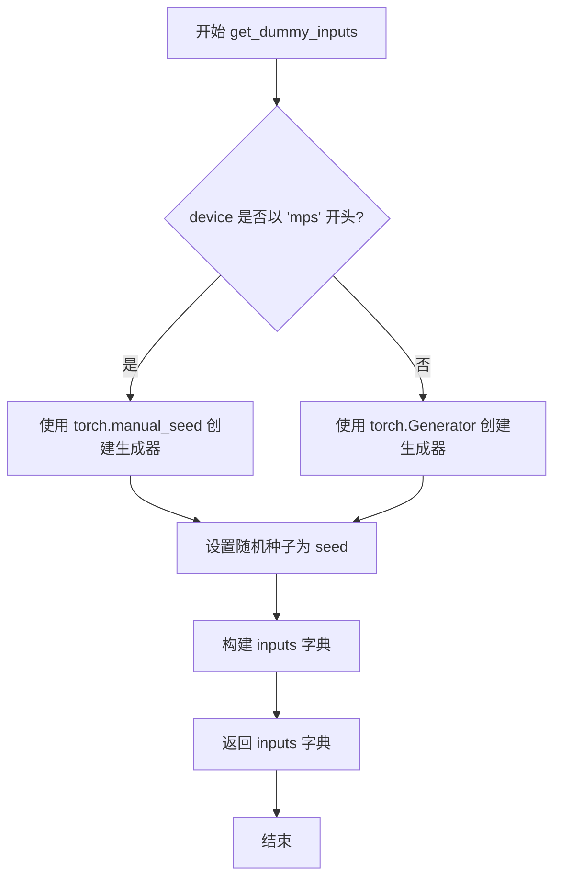

#### 带注释源码

```python
def get_dummy_inputs(self, device, seed=0):
    """
    生成用于测试 Kandinsky3 管道的虚拟输入参数。
    
    参数:
        device: 计算设备标识，如 'cpu', 'cuda', 'mps' 等
        seed: 随机种子，用于确保测试可重复性，默认值为 0
    
    返回:
        包含测试所需参数的字典
    """
    # 判断设备类型，MPS (Apple Silicon) 需要特殊处理
    if str(device).startswith("mps"):
        # MPS 设备不支持 torch.Generator，使用 torch.manual_seed 代替
        generator = torch.manual_seed(seed)
    else:
        # 其他设备创建标准 PyTorch 随机数生成器
        generator = torch.Generator(device=device).manual_seed(seed)
    
    # 构建包含所有测试参数的字典
    inputs = {
        "prompt": "A painting of a squirrel eating a burger",  # 测试用提示词
        "generator": generator,  # 随机数生成器确保可重复性
        "num_inference_steps": 2,  # 较少的推理步数加快测试速度
        "guidance_scale": 6.0,  # 引导系数，控制文本提示的影响力
        "output_type": "np",  # 返回 NumPy 数组格式
        "width": 16,  # 较小的图像尺寸减少测试资源消耗
        "height": 16,
    }
    return inputs
```


### `Kandinsky3PipelineFastTests.test_kandinsky3`

该测试方法用于验证 Kandinsky3Pipeline 的核心功能是否正常，包括模型加载、推理执行和输出图像的质量检查。测试通过使用虚拟组件（dummy components）进行单元测试，确保管道能够正确生成指定尺寸的图像，并且输出像素值在预期范围内。

参数：无（仅包含隐式参数 `self`）

返回值：`None`，该方法为测试方法，通过断言验证功能，不返回具体数值

#### 流程图

```mermaid
flowchart TD
    A[开始测试 test_kandinsky3] --> B[设置 device = 'cpu']
    B --> C[调用 get_dummy_components 获取虚拟组件]
    C --> D[使用虚拟组件实例化 Kandinsky3Pipeline]
    D --> E[将管道移动到 CPU 设备]
    E --> F[设置进度条配置 disable=None]
    F --> G[调用 get_dummy_inputs 获取输入参数]
    G --> H[执行管道推理: pipe(**inputs)]
    H --> I[从输出中提取图像: output.images]
    I --> J[提取图像切片: image[0, -3:, -3:, -1]]
    J --> K{断言: image.shape == (1, 16, 16, 3)?}
    K -->|是| L[定义期望像素值数组 expected_slice]
    L --> M{断言: 像素误差 < 1e-2?}
    M -->|是| N[测试通过]
    M -->|否| O[抛出断言错误]
    K -->|否| O
```

#### 带注释源码

```python
def test_kandinsky3(self):
    """
    测试 Kandinsky3Pipeline 的基本图像生成功能。
    验证管道能够使用虚拟组件生成指定尺寸的图像，
    并确保输出图像的像素值在预期范围内。
    """
    # 设置测试设备为 CPU
    device = "cpu"

    # 获取虚拟组件（UNet、调度器、Movq、文本编码器、分词器）
    components = self.get_dummy_components()

    # 使用虚拟组件实例化 Kandinsky3Pipeline 管道
    pipe = self.pipeline_class(**components)
    # 将管道移动到指定设备（CPU）
    pipe = pipe.to(device)

    # 配置进度条（disable=None 表示不禁用进度条）
    pipe.set_progress_bar_config(disable=None)

    # 执行管道推理，传入虚拟输入参数
    # 返回值包含生成图像等输出
    output = pipe(**self.get_dummy_inputs(device))
    # 从输出中提取生成的图像列表
    image = output.images

    # 提取图像的一个切片用于验证
    # 获取最后3x3像素区域，并取最后一个通道（RGB中的任一通道）
    image_slice = image[0, -3:, -3:, -1]

    # 断言：验证生成的图像形状是否为 (1, 16, 16, 3)
    # 1: 批量大小, 16: 高度, 16: 宽度, 3: RGB通道数
    assert image.shape == (1, 16, 16, 3)

    # 定义期望的像素值切片（用于比对）
    expected_slice = np.array([0.3768, 0.4373, 0.4865, 0.4890, 0.4299, 0.5122, 0.4921, 0.4924, 0.5599])

    # 断言：验证实际像素值与期望值的最大误差是否小于阈值 1e-2
    # 如果误差超过阈值，抛出详细的错误信息
    assert np.abs(image_slice.flatten() - expected_slice).max() < 1e-2, (
        f" expected_slice {expected_slice}, but got {image_slice.flatten()}"
    )
```


### `Kandinsky3PipelineFastTests.test_float16_inference`

该测试方法用于验证 Kandinsky3Pipeline 在 float16（半精度）推理模式下的功能正确性，通过调用父类的测试逻辑并设置最大允许误差阈值为 0.1 来判断推理结果是否在可接受范围内。

参数：

- `self`：`Kandinsky3PipelineFastTests`，隐式参数，表示测试类实例本身

返回值：`None`，无返回值（测试方法）

#### 流程图

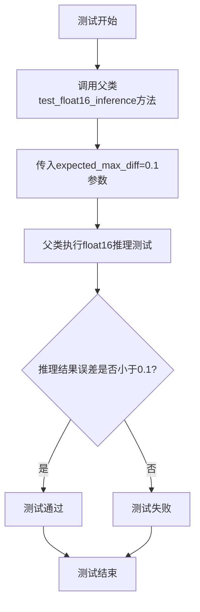

#### 带注释源码

```python
def test_float16_inference(self):
    """
    测试 Kandinsky3 Pipeline 在 float16（半精度）推理模式下的功能。
    
    该方法继承自 PipelineTesterMixin，通过调用父类的测试逻辑来验证：
    1. 模型能够在 float16 数据类型下正常加载和运行
    2. 推理结果与 float32 相比的误差在允许的范围内（expected_max_diff=1e-1）
    
    Returns:
        None: 这是一个测试方法，不返回任何值，结果通过断言表达
    """
    # 调用父类（PipelineTesterMixin）的 test_float16_inference 方法
    # expected_max_diff=1e-1 表示允许 float16 和 float32 推理结果之间的
    # 最大绝对误差为 0.1，这是考虑到 float16 精度较低而设置的合理阈值
    super().test_float16_inference(expected_max_diff=1e-1)
```


### `Kandinsky3PipelineFastTests.test_inference_batch_single_identical`

该测试方法继承自 `PipelineTesterMixin`，用于验证在使用批量推理（batch inference）时，单个样本的输出与单独推理时的输出一致性，以确保管道在批处理模式下功能正确。

参数：

- `self`：`Kandinsky3PipelineFastTests`，测试类实例（隐式参数）
- `expected_max_diff`：`float`，期望的最大差异阈值，代码中传入值为 `1e-2`（0.01），用于比较批量推理与单独推理结果的差异容忍度

返回值：`None`，无返回值（测试方法）

#### 流程图

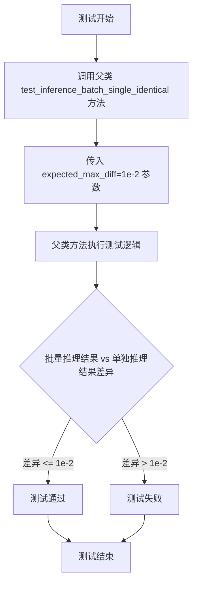

#### 带注释源码

```python
def test_inference_batch_single_identical(self):
    """
    测试方法：验证批量推理时单个样本的输出与单独推理时的输出一致性
    
    该方法继承自 PipelineTesterMixin 父类，实际测试逻辑在父类中实现。
    子类通过调用父类方法并传入 expected_max_diff 参数来执行测试。
    """
    # 调用父类的 test_inference_batch_single_identical 方法
    # 参数 expected_max_diff=1e-2 表示允许批量推理与单独推理之间
    # 的最大差异为 0.01（用于浮点数比较的容差）
    super().test_inference_batch_single_identical(expected_max_diff=1e-2)
```


### `Kandinsky3PipelineIntegrationTests.setUp`

这是一个测试类的初始化方法，在每个测试方法运行前被调用。该方法通过调用垃圾回收和清空 GPU 缓存来清理 VRAM 内存，确保测试环境干净，避免因内存残留导致测试结果不稳定。

参数：

- `self`：`unittest.TestCase`，代表测试类实例本身

返回值：`None`，该方法不返回任何值，仅执行副作用操作

#### 流程图

```mermaid
flowchart TD
    A[开始 setUp] --> B[调用 super().setUp]
    B --> C[执行 gc.collect 垃圾回收]
    C --> D[调用 backend_empty_cache 清理 GPU 缓存]
    D --> E[结束 setUp]
```

#### 带注释源码

```python
def setUp(self):
    # clean up the VRAM before each test
    # 在每个测试开始前清理 VRAM 内存
    super().setUp()  # 调用父类的 setUp 方法
    gc.collect()      # 强制进行垃圾回收，释放 Python 对象
    backend_empty_cache(torch_device)  # 清空 GPU 缓存，释放显存
```


### `Kandinsky3PipelineIntegrationTests.tearDown`

该方法是 `Kandinsky3PipelineIntegrationTests` 测试类的拆箱方法（tearDown），用于在每个集成测试执行完成后执行清理操作，释放 VRAM 内存，防止内存泄漏。

参数：

- `self`：`unittest.TestCase`，隐式参数，表示测试类实例本身

返回值：`None`，无返回值

#### 流程图

```mermaid
flowchart TD
    A[tearDown 开始] --> B[调用父类 tearDown 方法]
    B --> C[执行 gc.collect 强制垃圾回收]
    C --> D[调用 backend_empty_cache 清理 GPU 缓存]
    D --> E[tearDown 结束]
    
    style A fill:#f9f,color:#333
    style E fill:#9f9,color:#333
```

#### 带注释源码

```python
def tearDown(self):
    """在每个集成测试后清理 VRAM 内存
    
    该方法继承自 unittest.TestCase，在每个测试方法执行完毕后自动调用。
    主要用于释放 GPU 显存，防止测试之间的内存泄漏，确保测试环境的稳定性。
    """
    # 调用父类的 tearDown 方法，执行 unittest 框架的标准清理操作
    super().tearDown()
    
    # 强制进行 Python 垃圾回收，释放不再使用的 Python 对象
    gc.collect()
    
    # 调用后端特定的缓存清理函数，释放 GPU 显存
    # torch_device 是全局变量，标识当前使用的计算设备
    backend_empty_cache(torch_device)
```


### `Kandinsky3PipelineIntegrationTests.test_kandinskyV3`

该方法是 Kandinsky3 文本到图像生成管道的集成测试用例，用于验证模型能够根据文本提示词生成符合预期尺寸（1024x1024）的图像，并通过像素级对比确保生成质量与参考图像一致。

参数：无（除隐式参数 `self` 外）

返回值：无（该方法为 `void` 类型，通过 `assert` 语句进行测试断言）

#### 流程图

```mermaid
flowchart TD
    A[开始测试] --> B[setUp: 清理VRAM]
    B --> C[加载预训练 Kandinsky3 管道<br/>AutoPipelineForText2Image.from_pretrained]
    C --> D[启用CPU模型卸载<br/>enable_model_cpu_offload]
    D --> E[设置进度条配置<br/>set_progress_bar_config]
    E --> F[定义文本提示词<br/>prompt]
    F --> G[创建随机数生成器<br/>Generator.manual_seed]
    G --> H[执行管道推理<br/>pipe: prompt, num_inference_steps=5]
    H --> I[获取生成图像<br/>image = images[0]]
    I --> J{断言图像尺寸<br/>image.size == (1024, 1024)}
    J -->|失败| K[抛出 AssertionError]
    J -->|成功| L[加载参考图像<br/>load_image]
    L --> M[创建图像处理器<br/>VaeImageProcessor]
    M --> N[转换图像为NumPy数组<br/>pil_to_numpy]
    N --> O{断言图像相似性<br/>np.allclose: atol=5e-2}
    O -->|失败| K
    O -->|成功| P[tearDown: 清理VRAM]
    P --> Q[测试结束]
```

#### 带注释源码

```python
def test_kandinskyV3(self):
    # 使用 AutoPipelineForText2Image 从预训练模型加载 Kandinsky3 管道
    # variant="fp16" 指定使用半精度权重以减少内存占用
    # torch_dtype=torch.float16 指定计算使用半精度浮点数
    pipe = AutoPipelineForText2Image.from_pretrained(
        "kandinsky-community/kandinsky-3", variant="fp16", torch_dtype=torch.float16
    )
    
    # 启用模型CPU卸载功能，当模型不在GPU上运行时将其移至CPU
    # device=torch_device 指定目标设备
    pipe.enable_model_cpu_offload(device=torch_device)
    
    # 配置进度条，disable=None 表示保持默认设置（显示进度条）
    pipe.set_progress_bar_config(disable=None)

    # 定义文本提示词，描述期望生成的图像内容
    # 场景：地铁车厢内部，有浣熊坐在座位上，其中一只在看报纸，窗外可见城市背景
    prompt = "A photograph of the inside of a subway train. There are raccoons sitting on the seats. One of them is reading a newspaper. The window shows the city in the background."

    # 创建CPU设备上的随机数生成器，种子设为0以确保可重复性
    generator = torch.Generator(device="cpu").manual_seed(0)

    # 执行管道推理生成图像
    # num_inference_steps=5 指定推理步数（较少步数用于快速测试）
    # generator=0 指定随机种子以确保结果可复现
    # .images[0] 获取生成的第一张图像
    image = pipe(prompt, num_inference_steps=5, generator=generator).images[0]

    # 断言生成的图像尺寸必须为 1024x1024
    assert image.size == (1024, 1024)

    # 从HuggingFace数据集加载预期的参考图像
    expected_image = load_image(
        "https://huggingface.co/datasets/hf-internal-testing/diffusers-images/resolve/main/kandinsky3/t2i.png"
    )

    # 创建VAE图像处理器，用于图像格式转换
    image_processor = VaeImageProcessor()

    # 将PIL图像转换为NumPy数组格式
    image_np = image_processor.pil_to_numpy(image)
    expected_image_np = image_processor.pil_to_numpy(expected_image)

    # 断言生成的图像与参考图像的像素差异在允许范围内
    # atol=5e-2 指定绝对误差容限为0.05
    self.assertTrue(np.allclose(image_np, expected_image_np, atol=5e-2))
```


### `Kandinsky3PipelineIntegrationTests.test_kandinskyV3_img2img`

这是一个集成测试方法，用于测试 Kandinsky3 模型的图像到图像（img2img）功能。该测试加载预训练的 Kandinsky3 模型，对输入图像进行图像到图像转换，验证输出图像的尺寸和像素值与预期图像的一致性。

参数：

- `self`：`Kandinsky3PipelineIntegrationTests`，测试类的实例本身

返回值：`None`，该方法是一个测试方法，不返回任何值（通过断言验证结果）

#### 流程图

```mermaid
flowchart TD
    A[开始测试] --> B[加载预训练模型 AutoPipelineForImage2Image]
    B --> C[启用模型 CPU 卸载]
    C --> D[设置进度条配置]
    D --> E[创建随机数生成器]
    E --> F[加载输入图像]
    F --> G[调整图像大小为 512x512]
    G --> H[调用 pipe 进行 img2img 推理]
    H --> I[获取输出图像]
    I --> J[断言图像尺寸为 512x512]
    J --> K[加载预期图像]
    K --> L[创建图像处理器]
    L --> M[将图像转换为 numpy 数组]
    M --> N[使用 np.allclose 验证图像相似度]
    N --> O[测试通过]
```

#### 带注释源码

```python
def test_kandinskyV3_img2img(self):
    """
    测试 Kandinsky3 模型的图像到图像（img2img）功能
    这是一个集成测试，验证模型能够根据提示词对输入图像进行转换
    """
    # 从预训练模型加载图像到图像管道
    # 使用 fp16 变体以提高推理速度，使用 float16 数据类型
    pipe = AutoPipelineForImage2Image.from_pretrained(
        "kandinsky-community/kandinsky-3", variant="fp16", torch_dtype=torch.float16
    )
    
    # 启用模型 CPU 卸载，将模型暂时移到 CPU 以节省 GPU 显存
    pipe.enable_model_cpu_offload(device=torch_device)
    
    # 设置进度条配置，disable=None 表示不禁用进度条
    pipe.set_progress_bar_config(disable=None)

    # 创建随机数生成器，seed=0 确保测试可重复性
    generator = torch.Generator(device="cpu").manual_seed(0)

    # 从 URL 加载输入图像
    image = load_image(
        "https://huggingface.co/datasets/hf-internal-testing/diffusers-images/resolve/main/kandinsky3/t2i.png"
    )
    
    # 设置目标尺寸
    w, h = 512, 512
    # 使用双三次插值调整图像大小，reducing_gap=1 优化性能
    image = image.resize((w, h), resample=Image.BICUBIC, reducing_gap=1)
    
    # 定义图像转换的提示词
    prompt = "A painting of the inside of a subway train with tiny raccoons."

    # 调用管道执行图像到图像转换
    # strength=0.75 表示转换强度，num_inference_steps=5 表示推理步数
    # 使用 generator 确保结果可重复
    image = pipe(prompt, image=image, strength=0.75, num_inference_steps=5, generator=generator).images[0]

    # 断言输出图像尺寸为 512x512
    assert image.size == (512, 512)

    # 加载预期图像用于对比
    expected_image = load_image(
        "https://huggingface.co/datasets/hf-internal-testing/diffusers-images/resolve/main/kandinsky3/i2i.png"
    )

    # 创建图像处理器，用于图像格式转换
    image_processor = VaeImageProcessor()

    # 将 PIL 图像转换为 numpy 数组
    image_np = image_processor.pil_to_numpy(image)
    expected_image_np = image_processor.pil_to_numpy(expected_image)

    # 断言图像像素值在容差范围内相等（atol=5e-2）
    self.assertTrue(np.allclose(image_np, expected_image_np, atol=5e-2))
```

## 关键组件


### Kandinsky3PipelineFastTests

快速测试类，继承自PipelineTesterMixin和unittest.TestCase，用于对Kandinsky3Pipeline进行单元测试，包含模型组件初始化、虚拟输入构建和推理测试。

### Kandinsky3PipelineIntegrationTests

集成测试类，使用@slow和@require_torch_accelerator装饰器，从预训练模型加载进行端到端测试，验证文本到图像和图像到图像的生成效果。

### VQModel

VQVAE（向量量化变分自编码器）模型，用于将图像编码到潜在空间并进行重建，包含编码器、解码器和量化层。

### Kandinsky3UNet

Kandinsky3专用的U-Net模型，处理潜在空间的扩散过程，支持时间条件嵌入、交叉注意力机制，用于去噪生成图像。

### DDPMScheduler

DDPM（去噪扩散概率模型）调度器，管理扩散过程的噪声调度，支持beta_schedule配置和采样阈值设置。

### T5EncoderModel

T5文本编码器模型，将文本提示编码为文本嵌入向量，为UNet提供文本条件信息。

### AutoTokenizer

T5分词器，将文本prompt转换为token IDs序列，供文本编码器处理。

### VaeImageProcessor

VAE图像处理器，负责PIL图像与NumPy数组之间的转换，用于图像预处理和结果验证。

### AutoPipelineForText2Image

自动化文本到图像生成pipeline，整合文本编码器、UNet、VAE和调度器，支持从预训练模型加载。

### AutoPipelineForImage2Image

自动化图像到图像生成pipeline，支持基于输入图像进行风格迁移或内容变换，支持strength参数控制变换强度。

### 张量索引与惰性加载

通过torch.Generator手动设置随机种子实现可重现的张量生成，pipeline采用惰性加载模式在需要时才加载模型权重。

### 反量化支持

test_float16_inference方法测试float16（半精度）推理，支持expected_max_diff=1e-1的容差范围，用于验证模型在不同精度下的行为一致性。

### 量化策略

集成测试中使用variant="fp16"和torch_dtype=torch.float16加载预训练模型，实现模型量化以减少内存占用和加速推理。

### 内存管理

setUp和tearDown方法中调用gc.collect()和backend_empty_cache(torch_device)清理VRAM，防止测试间内存泄漏。

### 模型CPU卸载

使用pipe.enable_model_cpu_offload(device=torch_device)实现模型在CPU和GPU间的动态卸载，优化显存使用。


## 问题及建议


### 已知问题

-   **重复的随机种子设置**: `get_dummy_components`方法中多次调用`torch.manual_seed(0)`（共5次），代码冗余且表明对随机性控制不够清晰
-   **魔法数字和硬编码值**: `num_inference_steps=2`、`guidance_scale=6.0`、`width=16`、`height=16`等硬编码在方法中，应提取为类常量或配置参数
-   **重复的图像处理逻辑**: 集成测试中`VaeImageProcessor`的创建和`pil_to_numpy`调用在两个测试方法中完全重复
-   **测试隔离不完善**: 集成测试中`setUp`和`tearDown`使用共享的`gc.collect()`和`backend_empty_cache`，但未考虑测试失败时的资源清理
-   **设备处理不一致**: `get_dummy_inputs`中对MPS设备有特殊处理（直接用`torch.manual_seed`），而其他设备用`torch.Generator`，增加了跨设备测试的复杂性
-   **测试验证不够全面**: `test_kandinskyV3_img2img`仅验证图像尺寸`assert image.size == (512, 512)`，缺少对生成图像内容质量的验证
-   **全局状态依赖**: 模块顶层调用`enable_full_determinism()`修改全局状态，可能影响其他测试的执行
-   **xformers测试被禁用**: `test_xformers_attention = False`直接禁用，但未说明原因或提供配置开关
-   **缺少错误处理测试**: 没有测试 pipeline 在异常输入（如空prompt、无效参数）下的行为
-   **父类方法强依赖**: `test_float16_inference`和`test_inference_batch_single_identical`直接调用`super()`方法，测试行为完全依赖父类实现

### 优化建议

-   将所有硬编码的测试参数（如steps、guidance_scale、尺寸）提取为类级别的常量或从`pipeline_params`中明确导入
-   将`VaeImageProcessor`创建和图像处理逻辑提取为测试类的私有辅助方法，避免重复代码
-   在`get_dummy_components`中只设置一次随机种子，然后在组件创建后根据需要单独设置
-   增加测试验证维度：对生成的图像进行更详细的检查，如统计特性、边缘检测等，而不仅仅是数值匹配
-   考虑使用pytest的参数化功能或添加专门的错误处理测试用例
-   将全局的`enable_full_determinism()`调用移至测试 fixture 中，确保更好的隔离性
-   添加对不同设备（CUDA、CPU、MPS）的条件测试逻辑，而不是在代码中硬编码设备特定的处理
-   为禁用的xformers测试提供配置选项或文档说明，以便在支持的环境中启用

## 其它


### 设计目标与约束

本测试文件的设计目标是为Kandinsky3Pipeline提供全面的测试覆盖，包括单元测试和集成测试。单元测试使用dummy组件确保快速执行，集成测试使用真实模型验证功能。约束条件包括：必须支持CPU和GPU测试环境，需要清理VRAM内存，测试必须在合理时间内完成（集成测试标记为slow）。

### 错误处理与异常设计

测试中主要通过assert语句进行断言验证。图像形状验证使用`assert image.shape == (1, 16, 16, 3)`，数值精度验证使用`np.abs(image_slice.flatten() - expected_slice).max() < 1e-2`，集成测试使用`np.allclose`进行图像相似度比较，允许一定的误差范围(atol=5e-2)。当断言失败时，测试框架会自动捕获并报告错误。

### 数据流与状态机

单元测试流程：get_dummy_components() → 创建pipeline → get_dummy_inputs() → 调用pipeline → 验证输出。集成测试流程：from_pretrained()加载模型 → enable_model_cpu_offload()内存优化 → 设置generator → 调用pipeline → 验证输出图像。状态转换：初始化 → 设备绑定 → 推理执行 → 结果验证 → 资源清理。

### 外部依赖与接口契约

主要依赖包括：diffusers库(Kandinsky3Pipeline, Kandinsky3UNet, VQModel, DDPMScheduler)、transformers库(AutoTokenizer, T5EncoderModel)、torch、numpy、PIL。外部模型依赖：kandinsky-community/kandinsky-3和hf-internal-testing/tiny-random-t5。测试图像来源：HuggingFace datasets的hf-internal-testing/diffusers-images仓库。

### 测试覆盖范围

Kandinsky3PipelineFastTests覆盖：基础推理测试(test_kandinsky3)、float16推理测试(test_float16_inference)、批处理单样本一致性测试(test_inference_batch_single_identical)。Kandinsky3PipelineIntegrationTests覆盖：文本到图像生成(test_kandinskyV3)、图像到图像转换(test_kandinskyV3_img2img)。

### 配置与参数说明

关键参数配置：num_inference_steps=2(单元测试)/5(集成测试)，guidance_scale=6.0，output_type="np"，width=16/height=16(单元测试)/1024x1024或512x512(集成测试)。scheduler使用DDPMScheduler，beta范围0.00085-0.012，beta_schedule="squaredcos_cap_v2"。

### 性能基准与优化建议

单元测试设计为快速执行(仅2步推理，小分辨率16x16)。集成测试使用fp16精度和model_cpu_offload优化内存占用。setUp/tearDown中执行gc.collect()和backend_empty_cache清理VRAM。建议：可增加更多压力测试、边界条件测试、并发测试等。

    