# `diffusers\tests\pipelines\kandinsky3\test_kandinsky3_img2img.py` 详细设计文档

这是一个用于测试Kandinsky3图像到图像（Image-to-Image）扩散pipeline的测试套件，包含快速单元测试和集成测试，验证模型在CPU/GPU上的推理、批处理、精度和模型加载等核心功能。

## 整体流程

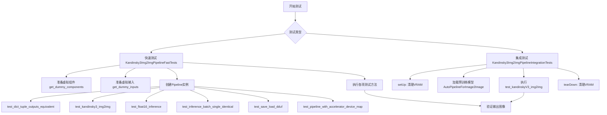

## 类结构

```
unittest.TestCase (Python标准库)
├── PipelineTesterMixin (测试混合类)
├── Kandinsky3Img2ImgPipelineFastTests
│   ├── dummy_movq_kwargs (property)
│   ├── dummy_movq (property)
│   ├── get_dummy_components()
│   ├── get_dummy_inputs()
│   └── 6个测试方法
└── Kandinsky3Img2ImgPipelineIntegrationTests
    ├── setUp()
    ├── tearDown()
    └── test_kandinskyV3_img2img()
```

## 全局变量及字段


### `Kandinsky3Img2ImgPipelineFastTests.pipeline_class`
    
The pipeline class being tested, Kandinsky3Img2ImgPipeline

类型：`type`
    


### `Kandinsky3Img2ImgPipelineFastTests.params`
    
Set of parameters for text-guided image variation pipeline, excluding height and width

类型：`set`
    


### `Kandinsky3Img2ImgPipelineFastTests.batch_params`
    
Batch parameters for text-guided image variation

类型：`set`
    


### `Kandinsky3Img2ImgPipelineFastTests.image_params`
    
Image parameters for image-to-image pipeline

类型：`set`
    


### `Kandinsky3Img2ImgPipelineFastTests.image_latents_params`
    
Image latents parameters for text-to-image pipeline

类型：`set`
    


### `Kandinsky3Img2ImgPipelineFastTests.callback_cfg_params`
    
Callback configuration parameters for text-to-image pipeline

类型：`set`
    


### `Kandinsky3Img2ImgPipelineFastTests.test_xformers_attention`
    
Flag indicating whether to test xformers attention, disabled for this pipeline

类型：`bool`
    


### `Kandinsky3Img2ImgPipelineFastTests.required_optional_params`
    
Frozenset of required optional parameters for inference

类型：`frozenset`
    


### `Kandinsky3Img2ImgPipelineFastTests.dummy_movq_kwargs`
    
Property returning dictionary of VQModel configuration kwargs for dummy model creation

类型：`property`
    


### `Kandinsky3Img2ImgPipelineFastTests.dummy_movq`
    
Property returning dummy VQModel instance for testing

类型：`property`
    


### `Kandinsky3Img2ImgPipelineFastTests.get_dummy_components`
    
Method returning dictionary of dummy pipeline components including unet, scheduler, movq, text_encoder, and tokenizer

类型：`method`
    


### `Kandinsky3Img2ImgPipelineFastTests.get_dummy_inputs`
    
Method returning dictionary of dummy inputs including prompt, image, generator, strength, num_inference_steps, guidance_scale, and output_type

类型：`method`
    


### `Kandinsky3Img2ImgPipelineFastTests.test_dict_tuple_outputs_equivalent`
    
Test method verifying dictionary and tuple outputs are equivalent

类型：`method`
    


### `Kandinsky3Img2ImgPipelineFastTests.test_kandinsky3_img2img`
    
Test method for Kandinsky3 image-to-image pipeline inference

类型：`method`
    


### `Kandinsky3Img2ImgPipelineFastTests.test_float16_inference`
    
Test method for float16 inference with expected max difference threshold

类型：`method`
    


### `Kandinsky3Img2ImgPipelineFastTests.test_inference_batch_single_identical`
    
Test method verifying batch inference produces identical results to single inference

类型：`method`
    


### `Kandinsky3Img2ImgPipelineFastTests.test_save_load_dduf`
    
Test method for pipeline save and load functionality with DDUF format

类型：`method`
    


### `Kandinsky3Img2ImgPipelineFastTests.test_pipeline_with_accelerator_device_map`
    
Test method for pipeline with accelerator device map

类型：`method`
    
    

## 全局函数及方法


### `enable_full_determinism`

该函数用于设置所有随机种子（Python、NumPy、PyTorch等），以确保测试或实验的完全确定性，使每次运行产生相同的结果。

参数： 无

返回值：`None`

#### 流程图

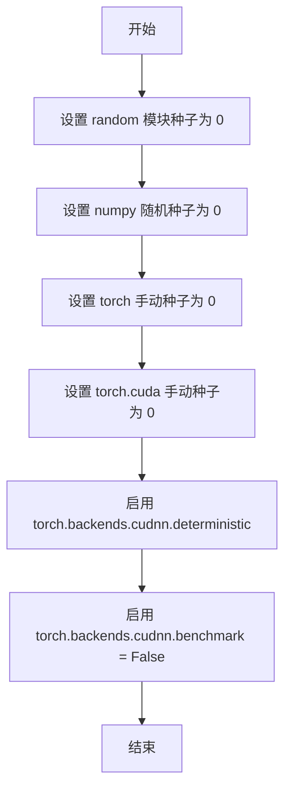

#### 带注释源码

```
# 这是一个从 testing_utils 模块导入的函数
# 以下是基于其典型行为的推断实现

def enable_full_determinism(seed: int = 0):
    """
    启用完全确定性，确保每次运行产生相同的结果。
    
    参数:
        seed: 随机种子值，默认为 0
    """
    # 1. 设置 Python 内置 random 模块的种子
    random.seed(seed)
    
    # 2. 设置 NumPy 的随机种子
    np.random.seed(seed)
    
    # 3. 设置 PyTorch CPU 和 CUDA 的手动种子
    torch.manual_seed(seed)
    torch.cuda.manual_seed_all(seed)
    
    # 4. 强制使用确定性算法，牺牲一定性能以换取可重复性
    torch.backends.cudnn.deterministic = True
    torch.backends.cudnn.benchmark = False
    
    # 5. 设置 PyTorch 分布式训练的种子（如果使用）
    # torch.distributed.barrier() 确保所有进程同步
    
    return None
```

---

**注意**：由于 `enable_full_determinism` 函数定义在 `...testing_utils` 模块中（而非当前代码文件内），上述源码是基于该函数典型行为的合理推断。实际实现可能包含更多细节，如环境变量设置（`PYTHONHASHSEED`）或其他框架的种子设置。


### `backend_empty_cache`

清理 GPU/后端缓存，释放 VRAM 内存，用于在测试结束后清理 GPU 显存。

参数：

-  `device`：`str` 或 `torch.device`，指定要清理缓存的设备（如 "cuda", "cuda:0", "cpu" 等）

返回值：`None`，无返回值

#### 流程图

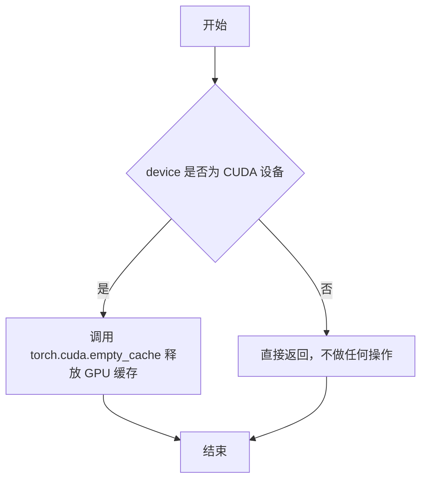

#### 带注释源码

```
# 该函数的具体实现位于 testing_utils 模块中
# 以下为基于函数调用方式的推断实现

def backend_empty_cache(device):
    """
    清理后端（GPU）的内存缓存。
    
    参数:
        device: 目标设备，通常为 'cuda', 'cuda:0', 'cpu' 等
    """
    # 检查是否为 CUDA 设备
    if isinstance(device, str) and device.startswith("cuda"):
        # 调用 PyTorch 的 CUDA 缓存清理函数
        # 释放 GPU 缓存中未使用的内存
        torch.cuda.empty_cache()
    elif hasattr(device, "type") and device.type == "cuda":
        # 处理 torch.device 对象
        torch.cuda.empty_cache()
    # 对于 CPU 设备，无需操作，直接返回
```

> **注意**：由于 `backend_empty_cache` 是从外部模块 `...testing_utils` 导入的，上述源码为基于函数调用方式和常见实现的推断。实际实现可能包含更多设备类型（如 XPU、MPS 等）的处理逻辑。


### `floats_tensor`

生成一个指定形状的随机浮点 PyTorch 张量，常用于测试中创建模拟输入数据。

参数：

-  `shape`：`tuple` 或 `int`，张量的形状
-  `rng`：`random.Random`，可选，随机数生成器。如果不提供，则使用默认随机状态

返回值：`torch.Tensor`，包含随机浮点数的张量

#### 流程图

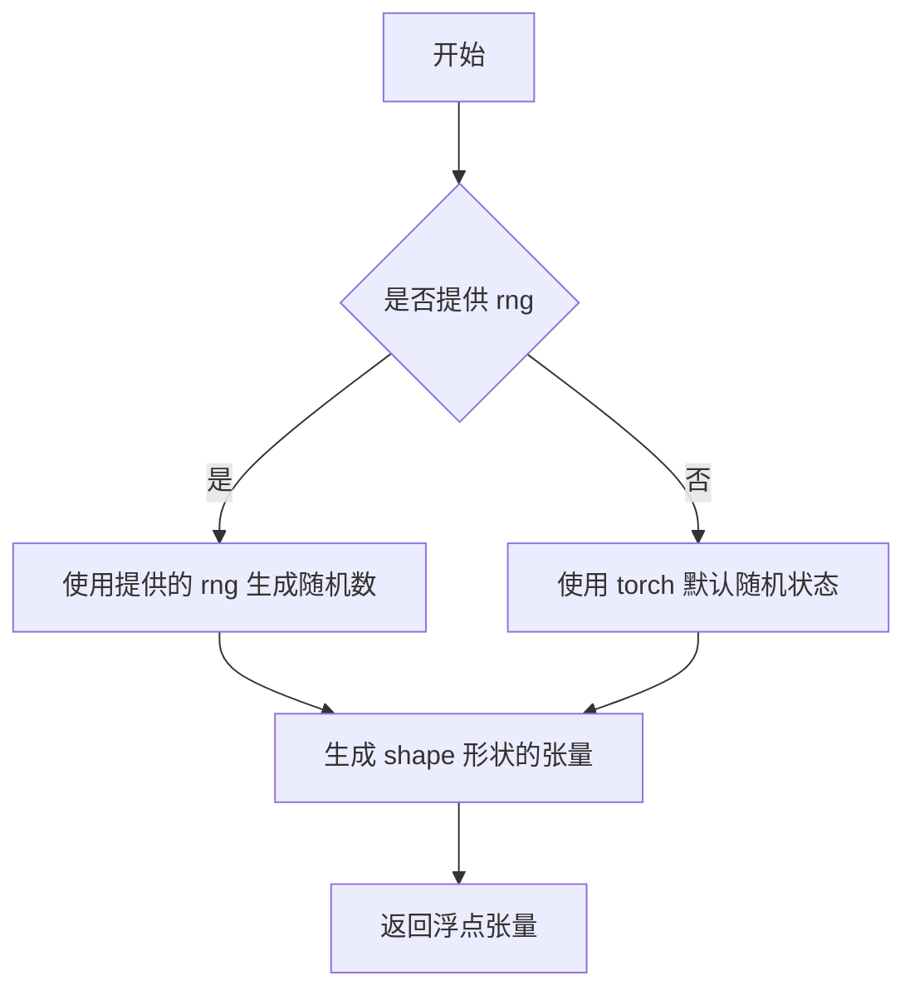

#### 带注释源码

```python
# 从提供的代码片段中提取的使用方式：
# image = floats_tensor((1, 3, 64, 64), rng=random.Random(seed)).to(device)

# 函数签名推断：
def floats_tensor(shape, rng=None):
    """
    生成一个指定形状的随机浮点 PyTorch 张量。
    
    参数：
        shape: 张量的形状，例如 (1, 3, 64, 64)
        rng: 可选的随机数生成器，用于控制随机性以确保测试可重复性
    
    返回：
        torch.Tensor: 包含随机浮点数的张量，值通常在 [0, 1) 范围内
    """
    # 具体实现需要查看 testing_utils 模块
    # 根据使用模式，这是一个测试辅助函数
```


### `load_image`

从指定路径或URL加载图像并转换为PIL Image对象的测试工具函数。

参数：

-  `url_or_path`：`str`，图像的URL路径或本地文件路径

返回值：`PIL.Image.Image`，返回加载的PIL图像对象

#### 流程图

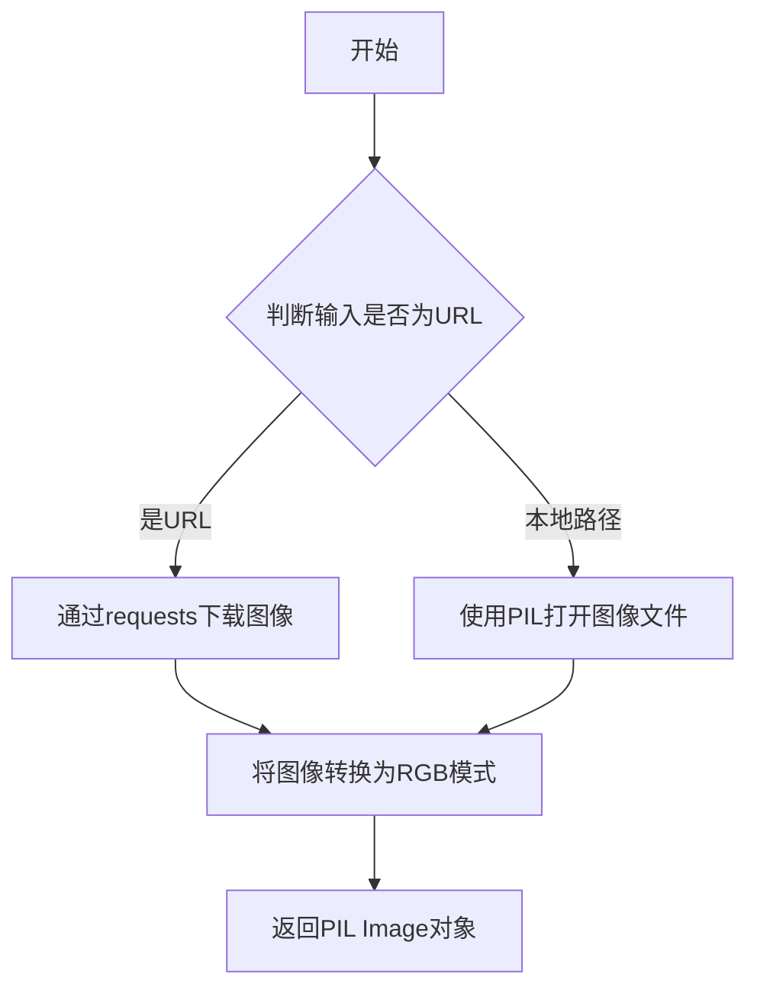

#### 带注释源码

```python
# load_image 函数定义在 testing_utils 模块中
# 当前代码文件中仅导入并使用了该函数
# 导入来源: from ...testing_utils import load_image

# 使用示例 (来自代码第247-249行):
image = load_image(
    "https://huggingface.co/datasets/hf-internal-testing/diffusers-images/resolve/main/kandinsky3/t2i.png"
)

# 使用示例 (来自代码第262-264行):
expected_image = load_image(
    "https://huggingface.co/datasets/hf-internal-testing/diffusers-images/resolve/main/kandinsky3/i2i.png"
)
```

> **注意**: `load_image` 函数定义在 `...testing_utils` 模块中，在当前提供的代码文件中仅有导入语句和使用示例，未包含该函数的完整实现源码。该函数通常用于测试框架中，从URL或本地路径加载图像供扩散模型测试使用。


### `Kandinsky3Img2ImgPipelineFastTests.dummy_movq_kwargs`

这是一个属性方法（@property），用于返回创建虚拟（dummy）VQModel（Movq - Vector Quantized Model）所需的配置参数字典，主要用于测试目的。

参数：
- 该方法无参数（作为 property 被访问）

返回值：`Dict[str, Any]`，返回一个包含 VQModel 初始化所需关键字参数的字典，定义了模型的架构配置，包括通道数、块类型、层数等。

#### 流程图

```mermaid
flowchart TD
    A[访问 dummy_movq_kwargs 属性] --> B{返回配置字典}
    
    B --> C[block_out_channels: [32, 64]]
    B --> D[down_block_types: DownEncoderBlock2D, AttnDownEncoderBlock2D]
    B --> E[in_channels: 3]
    B --> F[latent_channels: 4]
    B --> G[layers_per_block: 1]
    B --> H[norm_num_groups: 8]
    B --> I[norm_type: spatial]
    B --> J[num_vq_embeddings: 12]
    B --> K[out_channels: 3]
    B --> L[up_block_types: AttnUpDecoderBlock2D, UpDecoderBlock2D]
    B --> M[vq_embed_dim: 4]
    
    C & D & E & F & G & H & I & J & K & L & M --> N[字典被 dummy_movq 属性方法使用]
    N --> O[用于创建测试用 VQModel 实例]
```

#### 带注释源码

```python
@property
def dummy_movq_kwargs(self):
    """
    返回用于创建虚拟（dummy）VQModel的配置参数。
    
    这些参数定义了一个小型的VQModel（Vector Quantized Model）架构，
    用于测试目的。该模型是Kandinsky3图像到图像管道的关键组件，
    负责图像的编码和解码。
    
    返回:
        Dict[str, Any]: 包含VQModel初始化所需的关键字参数字典
    """
    return {
        # 下采样块的输出通道数
        "block_out_channels": [32, 64],
        # 下采样块的类型列表
        "down_block_types": ["DownEncoderBlock2D", "AttnDownEncoderBlock2D"],
        # 输入图像的通道数（RGB图像为3）
        "in_channels": 3,
        # 潜在空间的通道数
        "latent_channels": 4,
        # 每个块中的层数
        "layers_per_block": 1,
        # 归一化组的数量
        "norm_num_groups": 8,
        # 归一化类型
        "norm_type": "spatial",
        # VQ嵌入层的数量（码本大小）
        "num_vq_embeddings": 12,
        # 输出图像的通道数
        "out_channels": 3,
        # 上采样块的类型列表
        "up_block_types": [
            "AttnUpDecoderBlock2D",
            "UpDecoderBlock2D",
        ],
        # VQ嵌入的维度
        "vq_embed_dim": 4,
    }
```


### `Kandinsky3Img2ImgPipelineFastTests.dummy_movq`

这是一个测试用的属性方法，用于创建并返回一个虚拟的 VQModel（Vector Quantized Model）实例，主要用于 Kandinsky3 图像到图像管道的单元测试。该方法通过硬编码的参数配置生成一个轻量级的 VQ 模型，以便在测试环境中进行快速的推理验证。

参数：

- （无显式参数，隐式接收 `self`）

返回值：`VQModel`，返回一个预配置的 VQModel 实例，用于测试目的

#### 流程图

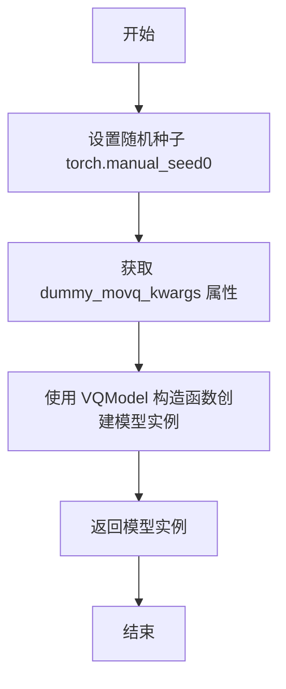

#### 带注释源码

```python
@property
def dummy_movq(self):
    """
    创建并返回一个用于测试的虚拟 VQModel 实例。
    
    该方法通过设置固定随机种子确保测试的可重复性，
    并使用预定义的模型配置参数实例化 VQModel。
    """
    # 设置随机种子为0，确保测试结果的可重复性
    torch.manual_seed(0)
    
    # 从 dummy_movq_kwargs 属性获取模型配置参数
    # 包含：通道数、块类型、层数、规范化参数等
    model = VQModel(**self.dummy_movq_kwargs)
    
    # 返回配置好的 VQModel 实例
    return model
```


### `Kandinsky3Img2ImgPipelineFastTests.get_dummy_components`

该方法用于生成虚拟（dummy）组件字典，包含 Kandinsky3 图像到图像扩散管道所需的所有核心组件（UNet、调度器、VAE、文本编码器和分词器），主要服务于单元测试场景，确保测试可以在不加载真实预训练权重的情况下运行。

参数：

- `time_cond_proj_dim`：`Optional[int]`，可选参数，时间条件投影维度，用于控制 UNet 的时间嵌入维度，默认值为 `None`

返回值：`Dict[str, Union[Kandinsky3UNet, DDPMScheduler, VQModel, T5EncoderModel, AutoTokenizer]]`，返回一个包含虚拟组件的字典，键为 `"unet"`、`"scheduler"`、`"movq"`、`"text_encoder"`、`"tokenizer"`，值分别为对应的虚拟模型实例

#### 流程图

```mermaid
flowchart TD
    A[开始 get_dummy_components] --> B[设置随机种子 torch.manual_seed(0)]
    B --> C[创建 Kandinsky3UNet 实例]
    C --> D[创建 DDPMScheduler 实例]
    D --> E[调用 self.dummy_movq 属性创建 VQModel]
    E --> F[创建 T5EncoderModel 虚拟模型]
    F --> G[创建 AutoTokenizer 虚拟分词器]
    G --> H[组装 components 字典]
    H --> I[返回 components 字典]
```

#### 带注释源码

```python
def get_dummy_components(self, time_cond_proj_dim=None):
    """
    生成用于测试的虚拟组件字典。
    
    参数:
        time_cond_proj_dim: 可选的时间条件投影维度参数,
                          当前实现中未直接使用但保留接口扩展性
    
    返回:
        包含虚拟组件的字典: unet, scheduler, movq, text_encoder, tokenizer
    """
    # 设置随机种子确保测试结果可复现
    torch.manual_seed(0)
    # 创建虚拟 UNet 模型，参数使用最小化配置以加快测试速度
    unet = Kandinsky3UNet(
        in_channels=4,              # 输入通道数（latent space 维度）
        time_embedding_dim=4,       # 时间嵌入维度
        groups=2,                   # 分组归一化组数
        attention_head_dim=4,       # 注意力头维度
        layers_per_block=3,         # 每个块的层数
        block_out_channels=(32, 64), # 块输出通道数
        cross_attention_dim=4,      # 交叉注意力维度
        encoder_hid_dim=32,         # 编码器隐藏层维度
    )
    
    # 创建虚拟调度器，用于控制扩散过程
    scheduler = DDPMScheduler(
        beta_start=0.00085,         # Beta 起始值
        beta_end=0.012,             # Beta 结束值
        steps_offset=1,             # 步骤偏移量
        beta_schedule="squaredcos_cap_v2", # Beta 调度策略
        clip_sample=True,           # 是否裁剪采样
        thresholding=False,         # 是否启用阈值化
    )
    
    # 设置随机种子并创建虚拟 VQ VAE 模型（movq）
    torch.manual_seed(0)
    movq = self.dummy_movq
    
    # 创建虚拟 T5 文本编码器（从预训练模型加载最小版本）
    torch.manual_seed(0)
    text_encoder = T5EncoderModel.from_pretrained("hf-internal-testing/tiny-random-t5")
    
    # 创建虚拟 T5 分词器
    torch.manual_seed(0)
    tokenizer = AutoTokenizer.from_pretrained("hf-internal-testing/tiny-random-t5")
    
    # 组装组件字典并返回
    components = {
        "unet": unet,               # UNet 模型
        "scheduler": scheduler,     # 扩散调度器
        "movq": movq,               # VQ VAE 模型
        "text_encoder": text_encoder, # 文本编码器
        "tokenizer": tokenizer,     # 分词器
    }
    return components
```


### `Kandinsky3Img2ImgPipelineFastTests.get_dummy_inputs`

该函数用于生成测试用的虚拟输入参数，创建一个随机初始图像、文本提示和扩散模型推理所需的各种参数，以便对 Kandinsky3Img2ImgPipeline 进行单元测试。

参数：

- `device`：`torch.device`，指定运行设备（如 "cpu"、"cuda" 等）
- `seed`：`int`，默认为 0，用于随机数生成的种子值

返回值：`Dict[str, Any]`，返回包含测试所需的输入参数字典，包括提示词、初始图像、随机数生成器、强度、推理步数、引导比例和输出类型。

#### 流程图

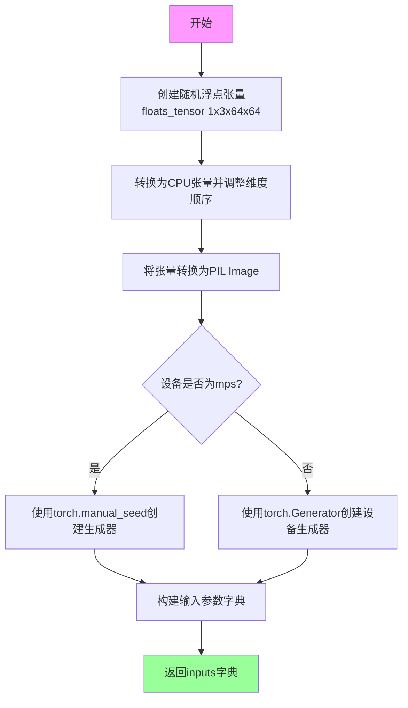

#### 带注释源码

```python
def get_dummy_inputs(self, device, seed=0):
    # 创建一个形状为 (1, 3, 64, 64) 的随机浮点张量
    # 使用 random.Random(seed) 确保可重现性
    image = floats_tensor((1, 3, 64, 64), rng=random.Random(seed)).to(device)
    
    # 将张量从 (1, 3, 64, 64) 转换为 (64, 64, 3) 格式
    # 便于转换为 PIL Image
    image = image.cpu().permute(0, 2, 3, 1)[0]
    
    # 将浮点数据转换为 uint8 并创建 RGB PIL Image
    init_image = Image.fromarray(np.uint8(image)).convert("RGB")
    
    # 针对 mps 设备使用不同的随机数生成方式
    # 因为 mps 不完全支持 torch.Generator
    if str(device).startswith("mps"):
        generator = torch.manual_seed(seed)
    else:
        # 为指定设备创建随机数生成器
        generator = torch.Generator(device=device).manual_seed(seed)
    
    # 构建完整的测试输入参数字典
    inputs = {
        "prompt": "A painting of a squirrel eating a burger",  # 测试用提示词
        "image": init_image,                                   # 初始图像（用于image-to-image）
        "generator": generator,                               # 随机数生成器
        "strength": 0.75,                                      # 图像变换强度 (0-1)
        "num_inference_steps": 10,                             # 扩散模型推理步数
        "guidance_scale": 6.0,                                 # CFG 引导强度
        "output_type": "np",                                   # 输出类型为 numpy 数组
    }
    return inputs
```


### `Kandinsky3Img2ImgPipelineFastTests.test_dict_tuple_outputs_equivalent`

该测试方法用于验证 Kandinsky3Img2ImgPipeline 在返回字典格式和元组格式输出时结果是否等价，确保 pipeline 的两种输出方式行为一致。

参数：

- `expected_slice`：`Optional[np.ndarray]`，期望的输出图像切片值，用于在 CPU 设备上与实际输出进行对比验证

返回值：`bool`，返回父类测试方法的布尔结果，表示字典和元组输出是否等价（通常返回 `True` 表示测试通过）

#### 流程图

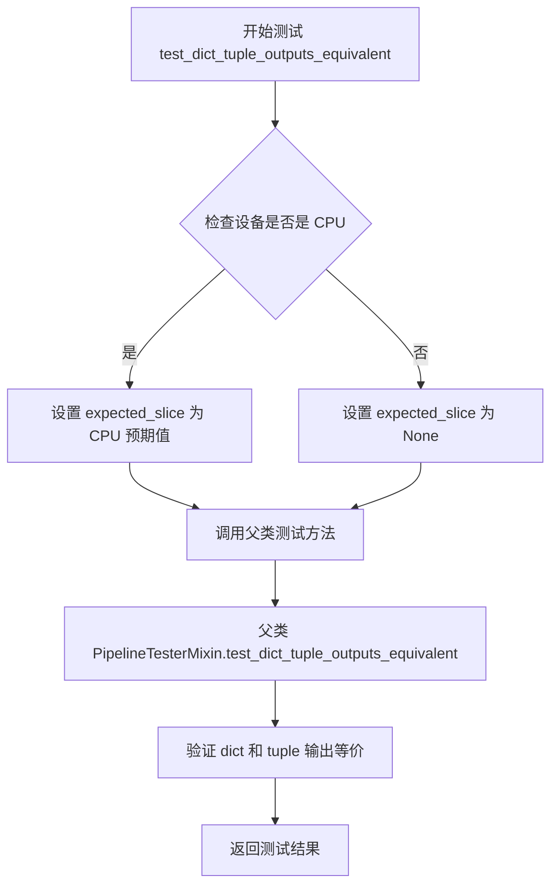

#### 带注释源码

```python
def test_dict_tuple_outputs_equivalent(self):
    """
    测试字典和元组输出格式是否等价
    
    该测试方法继承自 PipelineTesterMixin，用于验证 Kandinsky3Img2ImgPipeline
    在使用 return_dict=True 和 return_dict=False 两种配置时，输出的图像结果是否一致。
    """
    # 初始化期望值为 None
    expected_slice = None
    
    # 根据当前设备设置期望的输出切片值
    # 如果是 CPU 设备，使用预定义的预期值进行精确比对
    if torch_device == "cpu":
        expected_slice = np.array([0.5762, 0.6112, 0.4150, 0.6018, 0.6167, 0.4626, 0.5426, 0.5641, 0.6536])
    
    # 调用父类的测试方法，执行实际的等价性验证
    # 父类方法会：
    # 1. 使用 return_dict=True 调用 pipeline
    # 2. 使用 return_dict=False 调用 pipeline
    # 3. 比较两次输出的图像结果
    # 4. 返回布尔值表示是否等价
    super().test_dict_tuple_outputs_equivalent(expected_slice=expected_slice)
```


### `Kandinsky3Img2ImgPipelineFastTests.test_kandinsky3_img2img`

这是一个单元测试方法，用于测试 Kandinsky3 图像到图像（img2img）管道的核心功能。该方法通过创建虚拟组件、初始化管道、执行推理并验证输出图像的形状和像素值是否符合预期，从而确保管道在 CPU 设备上能够正确运行。

参数：该方法无显式参数，使用 `self.get_dummy_inputs(device)` 内部获取测试所需的输入参数。

返回值：`None`，该方法为测试方法，通过断言验证功能，不返回实际数据。

#### 流程图

```mermaid
flowchart TD
    A[开始测试] --> B[设置设备为CPU]
    B --> C[调用get_dummy_components获取虚拟组件]
    C --> D[使用虚拟组件初始化pipeline_class管道]
    D --> E[将管道移至CPU设备]
    E --> F[配置进度条]
    F --> G[调用get_dummy_inputs获取虚拟输入]
    G --> H[执行管道推理: pipe(**inputs)]
    H --> I[获取输出图像: output.images]
    I --> J[提取图像切片: image[0, -3:, -3:, -1]]
    J --> K[断言图像形状为1, 64, 64, 3]
    K --> L[定义期望的像素值数组]
    L --> M[断言实际像素值与期望值误差小于1e-2]
    M --> N[测试通过]
```

#### 带注释源码

```python
def test_kandinsky3_img2img(self):
    """测试Kandinsky3图像到图像管道的核心推理功能"""
    
    # 步骤1: 设置测试设备为CPU
    device = "cpu"

    # 步骤2: 获取虚拟组件（UNet、调度器、VAE、文本编码器、分词器）
    components = self.get_dummy_components()

    # 步骤3: 使用虚拟组件实例化管道对象
    pipe = self.pipeline_class(**components)
    
    # 步骤4: 将管道移至指定设备（CPU）
    pipe = pipe.to(device)

    # 步骤5: 配置进度条（disable=None表示不禁用）
    pipe.set_progress_bar_config(disable=None)

    # 步骤6: 获取虚拟输入参数（提示词、初始图像、生成器、推理步数等）
    output = pipe(**self.get_dummy_inputs(device))
    
    # 步骤7: 从输出中提取生成的图像
    image = output.images

    # 步骤8: 提取图像右下角3x3区域的像素值用于验证
    image_slice = image[0, -3:, -3:, -1]

    # 断言1: 验证输出图像的形状是否符合预期 (batch=1, height=64, width=64, channels=3)
    assert image.shape == (1, 64, 64, 3)

    # 步骤9: 定义期望的像素值切片（基于确定性随机种子0的预期输出）
    expected_slice = np.array(
        [0.576259, 0.6132097, 0.41703486, 0.603196, 0.62062526, 0.4655338, 0.5434324, 0.5660727, 0.65433365]
    )

    # 断言2: 验证实际像素值与期望值的最大误差小于1e-2（0.01）
    assert np.abs(image_slice.flatten() - expected_slice).max() < 1e-2, (
        f" expected_slice {expected_slice}, but got {image_slice.flatten()}"
    )
```


### `Kandinsky3Img2ImgPipelineFastTests.test_float16_inference`

该方法是 `Kandinsky3Img2ImgPipelineFastTests` 测试类中的一个测试方法，用于验证 Kandinsky3 图像到图像生成管道在 float16（半精度）推理模式下的正确性。通过调用父类 `PipelineTesterMixin` 的同名方法执行测试，并设定最大允许误差阈值为 `1e-1`。

参数：

- `self`：`Kandinsky3Img2ImgPipelineFastTests` 类型，测试类实例本身，代表当前测试对象

返回值：`None`，该方法为单元测试方法，通常不返回值（测试结果通过断言判断）

#### 流程图

```mermaid
flowchart TD
    A[开始 test_float16_inference] --> B[调用父类方法 super().test_float16_inference]
    B --> C[传入参数 expected_max_diff=1e-1]
    C --> D[父类方法执行 float16 推理测试]
    D --> E{推理结果是否通过断言}
    E -->|通过| F[测试通过]
    E -->|失败| G[抛出 AssertionError]
    F --> H[结束]
    G --> H
```

#### 带注释源码

```python
def test_float16_inference(self):
    """
    测试 Kandinsky3Img2ImgPipeline 在 float16（半精度）推理模式下的功能。
    
    该测试方法验证管道在使用 float16 数据类型时能够正确运行，
    并确保输出结果与 float32 相比的差异在可接受范围内（1e-1）。
    """
    # 调用父类 PipelineTesterMixin 的 test_float16_inference 方法
    # expected_max_diff=1e-1 表示 float16 和 float32 输出之间的最大允许差异
    super().test_float16_inference(expected_max_diff=1e-1)
```


### `Kandinsky3Img2ImgPipelineFastTests.test_inference_batch_single_identical`

这是一个单元测试方法，用于验证Kandinsky3图像到图像（Image-to-Image）Pipeline在批量推理时，单个样本的输出与单独推理时的一致性。该方法继承自`PipelineTesterMixin`基类，通过调用父类方法执行一致性检查，并设置允许的最大数值误差阈值为`1e-2`（0.01）。

参数：

- `self`：`Kandinsky3Img2ImgPipelineFastTests`，隐式参数，表示测试类实例本身
- `expected_max_diff`：`float`，可选关键字参数，指定批量推理结果与单样本推理结果之间的最大允许差异阈值，默认为`1e-2`

返回值：`None`，该方法为测试方法，不返回任何值，主要通过断言验证模型行为

#### 流程图

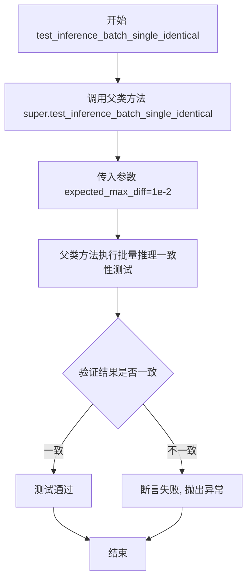

#### 带注释源码

```python
def test_inference_batch_single_identical(self):
    """
    测试方法：验证批量推理时单个样本与单独推理的输出一致性
    
    该测试方法继承自 PipelineTesterMixin 基类，用于确保在使用批处理
    进行推理时，模型对单个样本的处理结果与单独对该样本进行推理的结果
    保持数值一致性。这是确保扩散模型推理正确性的重要测试用例。
    
    参数:
        无显式参数（继承自父类的 expected_max_diff 参数）
    
    返回值:
        None: 作为 unittest.TestCase 的测试方法，不返回值，结果通过断言验证
    """
    # 调用父类 PipelineTesterMixin 的 test_inference_batch_single_identical 方法
    # expected_max_diff=1e-2 表示允许批量推理与单样本推理之间最大差异为 0.01
    # 这确保了数值精度在可接受范围内
    super().test_inference_batch_single_identical(expected_max_diff=1e-2)
```


### `Kandinsky3Img2ImgPipelineFastTests.test_save_load_dduf`

这是一个测试方法，用于验证 Kandinsky3 图像到图像管道的保存和加载功能是否正常工作。该方法调用父类的 `test_save_load_dduf` 方法，并使用指定的绝对误差容差（atol=1e-3）和相对误差容差（rtol=1e-3）来验证加载后的模型输出与原始输出的一致性。

参数：

- `self`：隐式参数，测试类实例本身

返回值：无（测试方法，通过断言验证）

#### 流程图

```mermaid
flowchart TD
    A[开始执行 test_save_load_dduf] --> B[调用父类方法 super().test_save_load_dduf]
    B --> C[传入参数 atol=1e-3, rtol=1e-3]
    C --> D[父类方法执行保存操作]
    D --> E[父类方法执行加载操作]
    E --> F[比较保存前后的输出差异]
    F --> G{差异是否在容差范围内?}
    G -->|是| H[测试通过]
    G -->|否| I[测试失败，抛出断言错误]
```

#### 带注释源码

```python
def test_save_load_dduf(self):
    """
    测试 Kandinsky3Img2ImgPipeline 的保存和加载功能（DDUF - 可能指 Dump/Download and Upload Functionality）
    
    该测试方法执行以下操作：
    1. 创建并运行管道生成图像
    2. 保存管道到磁盘
    3. 从磁盘加载管道
    4. 使用加载的管道重新生成图像
    5. 比较两次生成的图像是否在容差范围内一致
    
    参数:
        atol: 绝对误差容差，设置为 1e-3
        rtol: 相对误差容差，设置为 1e-3
    
    返回值:
        无（通过断言验证）
    """
    # 调用父类 PipelineTesterMixin 的 test_save_load_dduf 方法
    # 传入绝对误差容差和相对误差容差参数
    super().test_save_load_dduf(atol=1e-3, rtol=1e-3)
```


### `Kandinsky3Img2ImgPipelineFastTests.test_pipeline_with_accelerator_device_map`

该测试方法用于验证 Kandinsky3 图像到图像（Image-to-Image）管道在使用accelerator和device_map时的正确性，通过调用父类的测试方法并设定最大允许差异值为0.005来确保管道在分布式设备上运行时输出结果的精度符合预期。

参数：

- `expected_max_difference`：`float`，期望的最大差异值（默认值5e-3=0.005），用于验证加速器推理结果与基准结果的差异容忍度

返回值：`None`，该方法为测试用例，无返回值，通过断言验证管道行为

#### 流程图

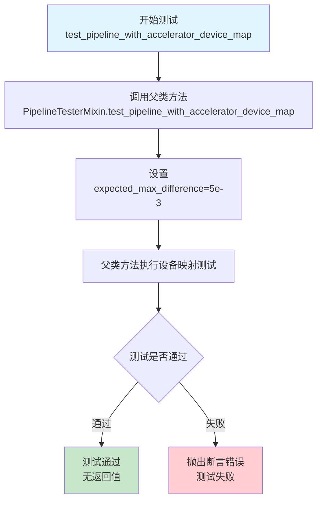

#### 带注释源码

```python
def test_pipeline_with_accelerator_device_map(self):
    """
    测试 Kandinsky3Img2ImgPipeline 在使用 accelerator 和 device_map 时的行为。
    
    该测试方法继承自 PipelineTesterMixin，验证管道在配置了设备映射后
    能够正确地在多个设备（如 CPU、GPU）上分配模型组件，并保持推理结果的一致性。
    
    参数:
        expected_max_difference: float, 允许的最大差异阈值，用于比较加速器推理
                                结果与基准结果的差异，默认为 5e-3 (0.005)
    
    返回值:
        None: 此测试方法不返回任何值，通过断言验证测试结果
    
    注意:
        - 此方法调用 super().test_pipeline_with_accelerator_device_map()
        - 需要 torch_accelerator 装饰器标记的测试环境
        - 测试会验证模型在不同设备上的输出一致性
    """
    # 调用父类 PipelineTesterMixin 的测试方法
    # 传递 expected_max_difference 参数控制结果差异容忍度
    super().test_pipeline_with_accelerator_device_map(expected_max_difference=5e-3)
```


### `Kandinsky3Img2ImgPipelineIntegrationTests.setUp`

该方法是 Kandinsky3 图像到图像管道集成测试类的初始化方法，在每个测试方法执行前被自动调用，用于清理 VRAM 内存并调用父类的 setUp 方法，为测试准备干净的环境。

参数：

- `self`：无类型（实例方法隐式参数），代表测试类实例本身

返回值：`None`，无返回值

#### 流程图

```mermaid
flowchart TD
    A[setUp 方法开始] --> B[调用父类 setUp 方法<br/>super().setUp]
    B --> C[执行垃圾回收<br/>gc.collect]
    C --> D[清空 GPU 缓存<br/>backend_empty_cache]
    D --> E[setUp 方法结束]
```

#### 带注释源码

```python
def setUp(self):
    # clean up the VRAM before each test
    # 在每个测试运行前清理 VRAM（显存）
    
    # 1. 首先调用父类的 setUp 方法
    #    确保 unittest.TestCase 的基本初始化逻辑被执行
    super().setUp()
    
    # 2. 执行 Python 垃圾回收，释放不再使用的对象内存
    gc.collect()
    
    # 3. 调用后端特定的缓存清空函数
    #    torch_device 是全局变量，表示当前 PyTorch 设备（如 'cuda' 或 'cpu'）
    #    这步操作确保 GPU 显存被释放，防止 OOM 错误
    backend_empty_cache(torch_device)
```


### `Kandinsky3Img2ImgPipelineIntegrationTests.tearDown`

该方法是 Kandinsky3 图片到图片流水线的集成测试类的拆卸方法，在每个测试用例执行完毕后被调用，用于清理 VRAM（显存）资源，通过调用父类的 tearDown 方法、Python 垃圾回收和后端缓存清空操作来确保测试环境被正确重置，避免显存泄漏影响后续测试。

参数：

- `self`：`Kandinsky3Img2ImgPipelineIntegrationTests`，代表测试类实例本身，隐式参数，用于访问类属性和方法

返回值：`None`，该方法不返回任何值，仅执行清理操作

#### 流程图

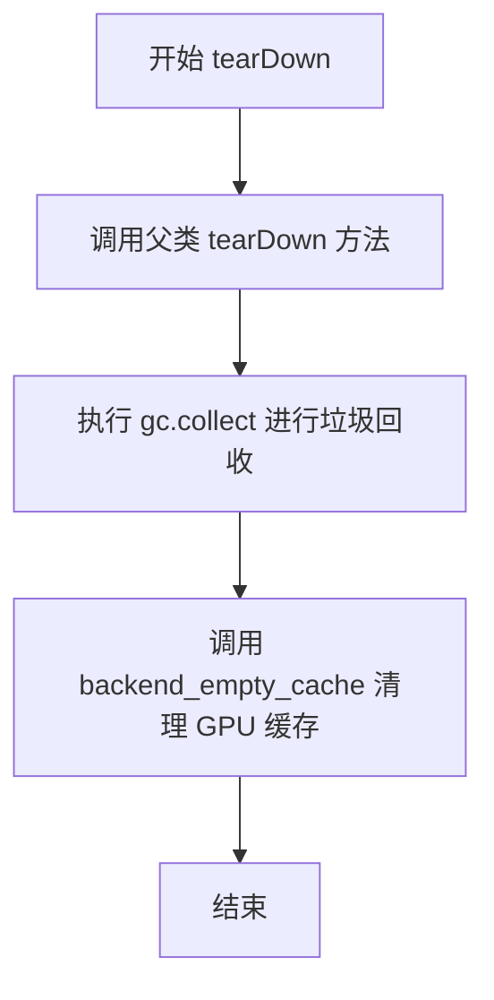

#### 带注释源码

```python
def tearDown(self):
    # clean up the VRAM after each test
    # 在每个测试执行完毕后清理 VRAM（显存）
    super().tearDown()
    # 调用父类的 tearDown 方法，执行 unittest.TestCase 的标准清理逻辑
    gc.collect()
    # 强制调用 Python 的垃圾回收器，释放不再使用的对象内存
    backend_empty_cache(torch_device)
    # 调用后端工具函数清空 GPU/设备显存缓存，防止显存泄漏
```


### `Kandinsky3Img2ImgPipelineIntegrationTests.test_kandinskyV3_img2img`

该方法是 Kandinsky3 图像到图像（Image-to-Image） pipeline 的集成测试用例，用于验证使用预训练模型进行图像转换的功能是否正常工作。测试流程包括：加载预训练模型、准备输入图像、执行图像转换推理、验证输出图像尺寸及与预期图像的相似度。

参数：

- `self`：隐式参数，测试类实例本身

返回值：无（`None`），该方法为测试用例，通过断言验证结果而非返回值

#### 流程图

```mermaid
flowchart TD
    A[开始测试] --> B[加载预训练模型<br/>AutoPipelineForImage2Image.from_pretrained]
    B --> C[启用模型CPU卸载<br/>enable_model_cpu_offload]
    C --> D[设置进度条配置<br/>set_progress_bar_config]
    D --> E[创建随机数生成器<br/>torch.Generator.manual_seed]
    E --> F[加载输入图像<br/>load_image t2i.png]
    F --> G[调整图像尺寸为512x512<br/>image.resize]
    G --> H[定义提示词prompt<br/>地铁里的浣熊画作]
    H --> I[调用pipeline执行img2img推理<br/>pipe]
    I --> J[提取生成的图像<br/>images[0]]
    J --> K{验证图像尺寸}
    K -->|通过| L[加载预期图像<br/>i2i.png]
    K -->|失败| M[测试失败]
    L --> N[转换为numpy数组<br/>pil_to_numpy]
    N --> O{图像相似度验证<br/>np.allclose atol=5e-2}
    O -->|通过| P[测试通过]
    O -->|失败| M
    P --> Q[结束测试]
    M --> Q
```

#### 带注释源码

```python
def test_kandinskyV3_img2img(self):
    """
    Kandinsky3 Image-to-Image 集成测试方法
    验证使用 kandinsky-community/kandinsky-3 预训练模型进行图像转换
    """
    # 步骤1: 从预训练模型加载图像到图像pipeline
    # 使用 fp16 变体以提高推理速度，使用 float16 数据类型
    pipe = AutoPipelineForImage2Image.from_pretrained(
        "kandinsky-community/kandinsky-3", variant="fp16", torch_dtype=torch.float16
    )
    
    # 步骤2: 启用模型CPU卸载功能
    # 将模型从GPU卸载到CPU以节省显存，适用于显存有限的场景
    pipe.enable_model_cpu_offload(device=torch_device)
    
    # 步骤3: 配置进度条
    # disable=None 表示启用进度条显示
    pipe.set_progress_bar_config(disable=None)
    
    # 步骤4: 创建确定性随机数生成器
    # 使用固定种子(0)确保测试结果可复现
    generator = torch.Generator(device="cpu").manual_seed(0)
    
    # 步骤5: 加载输入图像
    # 从HuggingFace数据集加载用于图像转换的输入图像
    image = load_image(
        "https://huggingface.co/datasets/hf-internal-testing/diffusers-images/resolve/main/kandinsky3/t2i.png"
    )
    
    # 步骤6: 调整图像尺寸
    # 将输入图像调整为512x512像素，使用双三次插值
    w, h = 512, 512
    image = image.resize((w, h), resample=Image.BICUBIC, reducing_gap=1)
    
    # 步骤7: 定义文本提示词
    # 描述期望生成的图像内容：地铁车厢内有小浣熊的画作
    prompt = "A painting of the inside of a subway train with tiny raccoons."
    
    # 步骤8: 执行图像到图像转换推理
    # 参数说明:
    #   - prompt: 文本提示词
    #   - image: 输入图像
    #   - strength: 转换强度 (0.75)，值越大对原图改变越多
    #   - num_inference_steps: 推理步数 (5)
    #   - generator: 确定性随机数生成器
    image = pipe(prompt, image=image, strength=0.75, num_inference_steps=5, generator=generator).images[0]
    
    # 步骤9: 验证输出图像尺寸
    # 确保生成的图像尺寸为512x512
    assert image.size == (512, 512)
    
    # 步骤10: 加载预期图像用于对比
    # 从HuggingFace数据集加载标准预期输出图像
    expected_image = load_image(
        "https://huggingface.co/datasets/hf-internal-testing/diffusers-images/resolve/main/kandinsky3/i2i.png"
    )
    
    # 步骤11: 创建图像处理器
    # 用于将PIL图像转换为numpy数组进行数值比较
    image_processor = VaeImageProcessor()
    
    # 步骤12: 将图像转换为numpy数组
    # 用于后续的数值比较
    image_np = image_processor.pil_to_numpy(image)
    expected_image_np = image_processor.pil_to_numpy(expected_image)
    
    # 步骤13: 验证生成图像与预期图像的相似度
    # 使用np.allclose进行近似相等比较，允许绝对误差为0.05
    self.assertTrue(np.allclose(image_np, expected_image_np, atol=5e-2))
```

## 关键组件


### Kandinsky3Img2ImgPipeline

Kandinsky 3的图像到图像（Image-to-Image）生成管道，负责接收文本提示和初始图像，通过VQ模型编码、UNet去噪和DDPM调度器进行图像转换和风格迁移。

### Kandinsky3UNet

Kandinsky专用的UNet模型，用于去噪过程中的潜在空间预测，支持时间嵌入、交叉注意力机制和多层块结构。

### VQModel (movq)

向量量化生成模型（Vector Quantized Model），负责图像的编码和解码，将图像转换为潜在表示并从潜在表示重建图像。

### DDPMScheduler

DDPM（Diffusion Probabilistic Models）调度器，管理扩散模型的噪声调度和去噪步骤，控制推理过程中的噪声水平。

### T5EncoderModel

基于T5架构的文本编码器，将文本提示转换为文本嵌入向量，供UNet进行交叉注意力处理。

### AutoTokenizer

文本分词器，将用户输入的文本提示转换为模型可处理的token序列。

### VaeImageProcessor

VAE图像处理器，负责PIL图像与NumPy数组之间的格式转换，支持图像预处理和后处理。

### AutoPipelineForImage2Image

自动化图像到图像管道加载器，支持从预训练模型加载完整的图像生成管道。

### Dummy Components & Test Utilities

测试框架提供的虚拟组件（dummy_movq、get_dummy_components、get_dummy_inputs）和工具函数（floats_tensor、load_image），用于单元测试和集成测试的快速验证。

### GPU内存管理

集成测试中的VRAM清理机制（gc.collect、backend_empty_cache），确保每次测试前后释放GPU显存。

### 潜在技术债务

测试代码中包含硬编码的expected_slice数值用于CPU和float16推理的验证，这种数值敏感性可能导致跨平台测试的不稳定性；此外，部分测试继承自PipelineTesterMixin但未完全展示父类方法的实现细节。


## 问题及建议


### 已知问题

-   **测试参数传递不完整**：`test_float16_inference`、`test_inference_batch_single_identical`、`test_save_load_dduf`、`test_pipeline_with_accelerator_device_map` 等方法直接调用 `super()` 但未传递所有必需参数，可能导致父类测试行为不符合预期。
-   **设备硬编码不一致**：`test_kandinsky3_img2img` 中设备被硬编码为 `"cpu"`，而其他测试使用全局变量 `torch_device`，导致测试环境不一致。
-   **条件断言可能导致隐藏问题**：`test_dict_tuple_outputs_equivalent` 中 `expected_slice` 仅在 `torch_device == "cpu"` 时有值，其他设备类型为 `None`，可能掩盖非 CPU 设备上的断言问题。
-   **集成测试缺少异常处理**：网络请求加载外部图像（`load_image`）没有 try-except 包装，网络波动会导致测试失败。
-   **快速测试缺少资源清理**：集成测试有 `setUp`/`tearDown` 清理 VRAM，但 `Kandinsky3Img2ImgPipelineFastTests` 缺少对应的资源清理机制，可能导致内存累积。
-   **魔法数字缺乏说明**：`get_dummy_inputs` 中的 `strength=0.75`、`guidance_scale=6.0`、`num_inference_steps=10` 等关键参数无注释说明其设计意图。

### 优化建议

-   **统一设备管理**：将 `test_kandinsky3_img2img` 中的设备改为使用 `torch_device` 全局变量，或在类级别定义设备属性。
-   **完善参数传递**：检查 `PipelineTesterMixin` 的接口，确保所有继承方法调用时传递完整的参数（如 `expected_max_diff`、`atol`、`rtol` 等）。
-   **添加资源清理**：在 `Kandinsky3Img2ImgPipelineFastTests` 中添加 `setUp`/`tearDown` 方法，参照集成测试实现 VRAM 清理逻辑。
-   **增加网络容错**：使用 `unittest.mock` 或添加异常捕获处理外部图像加载失败的情况，提升测试稳定性。
-   **提取测试配置**：将魔法数字抽取为类常量或测试配置属性，并添加文档注释说明各参数的业务含义。
-   **增强 `expected_slice` 逻辑**：为非 CPU 设备提供明确的预期值或跳过条件，避免 `None` 导致的隐式行为。

## 其它


### 设计目标与约束

本测试文件旨在验证 Kandinsky3 图像到图像（Image-to-Image）扩散模型的 pipeline 功能正确性，包括单元测试和集成测试。测试覆盖模型推理、批处理一致性、float16 推理精度、保存加载功能以及 accelerator 设备映射等场景。约束条件包括：需使用 CPU 或 CUDA 设备运行，集成测试标记为 slow 仅在配备 GPU 时执行，测试使用固定随机种子确保可复现性。

### 错误处理与异常设计

代码主要依赖 diffusers 框架内置的异常处理机制。测试中通过 `assert` 语句验证输出结果的正确性，包括图像维度、像素值范围、与预期值的差异阈值等。集成测试中包含 VRAM 清理逻辑（`gc.collect()` 和 `backend_empty_cache`）以防止内存泄漏导致的测试失败。异常场景包括：设备不兼容（通过 `@require_torch_accelerator` 装饰器跳过）、模型加载失败、图像处理异常等。

### 数据流与状态机

测试数据流如下：1）初始化阶段：创建虚拟模型组件（UNet、Scheduler、VQModel、TextEncoder、Tokenizer）或加载预训练模型；2）输入准备阶段：根据 seed 生成随机图像和生成器；3）推理阶段：调用 pipeline 的 `__call__` 方法执行图像转换；4）验证阶段：检查输出图像的尺寸、像素值与预期值的差异。状态转换包括：设备迁移（to device）、模型 CPU offload、progress bar 配置等。

### 外部依赖与接口契约

本测试文件依赖以下外部组件：1）transformers 库提供 T5EncoderModel 和 AutoTokenizer；2）diffusers 库提供 pipeline、UNet、Scheduler、VQModel 等核心组件；3）PIL 库用于图像处理；4）numpy 用于数值计算；5）torch 用于张量操作。接口契约包括：pipeline 接受 prompt、image、strength、num_inference_steps、guidance_scale 等参数，返回包含 images 的对象；测试使用标准化的参数结构（TEXT_GUIDED_IMAGE_VARIATION_PARAMS 等）。

### 配置与参数说明

关键配置参数包括：1）image_params：IMAGE_TO_IMAGE_IMAGE_PARAMS 定义图像相关参数；2）batch_params：TEXT_GUIDED_IMAGE_VARIATION_BATCH_PARAMS 定义批处理参数；3）callback_cfg_params：TEXT_TO_IMAGE_CALLBACK_CFG_PARAMS 定义 CFG 回调参数；4）required_optional_params：强制可选参数集（num_inference_steps、num_images_per_prompt、generator、output_type、return_dict）。虚拟模型配置：UNet 使用 4 通道输入、4 维 time embedding、2 组、4 头注意力、3 层每块、32/64 输出通道；VQModel 使用 12 个 VQ embeddings、4 维嵌入维度。

### 性能考虑

测试设计考虑了性能因素：1）单元测试使用小尺寸图像（64x64）和较少推理步数（10 步）；2）集成测试使用 512x512 图像和 5 步推理以平衡速度与验证质量；3）通过 `enable_model_cpu_offload()` 优化 GPU 内存使用；4）提供 xformers 注意力测试开关（test_xformers_attention = False）。float16 推理测试允许 1e-1 的最大差异，批处理测试允许 1e-2 的差异。

### 测试策略

测试采用分层策略：1）单元测试（Kandinsky3Img2ImgPipelineFastTests）：验证核心功能在 CPU 上的确定性行为，包括字典/元组输出等价性、float16 推理、批处理一致性、保存加载等；2）集成测试（Kandinsky3Img2ImgPipelineIntegrationTests）：使用真实预训练模型（kandinsky-community/kandinsky-3）在 GPU 上验证端到端功能；3）回归测试：通过固定 expected_slice 值确保模型更新不破坏现有功能。测试使用 unittest 框架，通过继承 PipelineTesterMixin 获得通用测试方法。

### 资源清理与生命周期

资源管理涉及：1）测试前清理：集成测试的 setUp 方法执行 gc.collect() 和 backend_empty_cache；2）测试后清理：tearDown 方法同样执行资源清理；3）设备迁移：pipeline 在测试开始时移至目标设备（CPU 或 CUDA）；4）模型 offload：集成测试启用 CPU offload 以释放 GPU 显存。Generator 对象在每次测试中重新创建，确保随机性的可复现性。

### 安全性考虑

代码无直接的用户输入处理或敏感数据操作。安全考虑包括：1）模型加载来源验证：集成测试使用官方 huggingface 路径；2）图像加载安全：使用 PIL 库处理外部 URL 图像；3）内存安全：通过显式资源清理避免显存泄漏。测试代码本身不执行模型权重训练或微调，风险较低。

### 版本兼容性与迁移

代码依赖特定版本的 diffusers API（AutoPipelineForImage2Image、VQModel 等）。兼容性考虑：1）使用 frozenset 定义不可变配置；2）通过参数差集（TEXT_GUIDED_IMAGE_VARIATION_PARAMS - {"height", "width"}）适应不同 pipeline 接口；3）设备检测使用 `str(device).startswith("mps")` 处理 Apple Silicon 特殊情况。测试文件头部明确标注 Apache 2.0 许可证和版权信息。

    