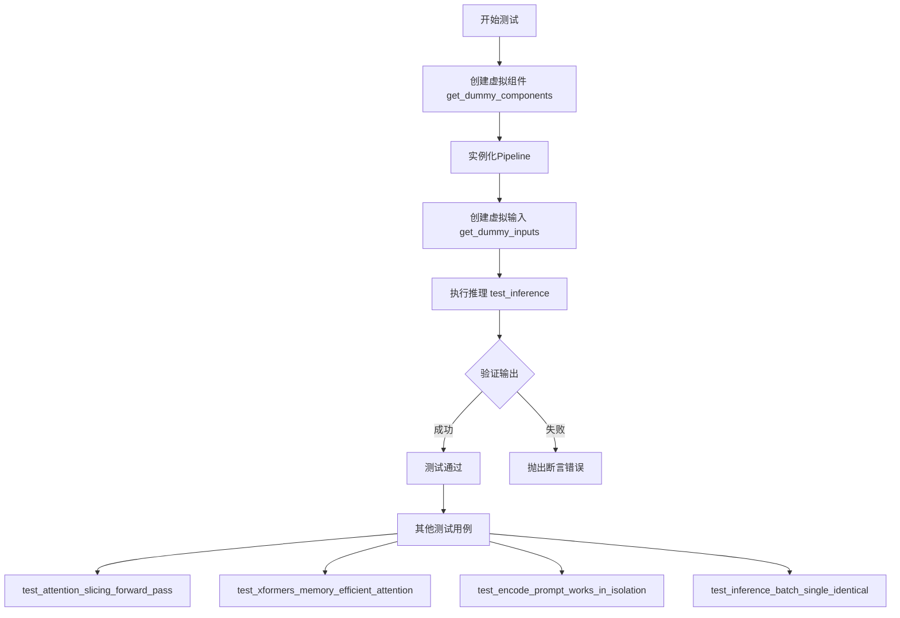
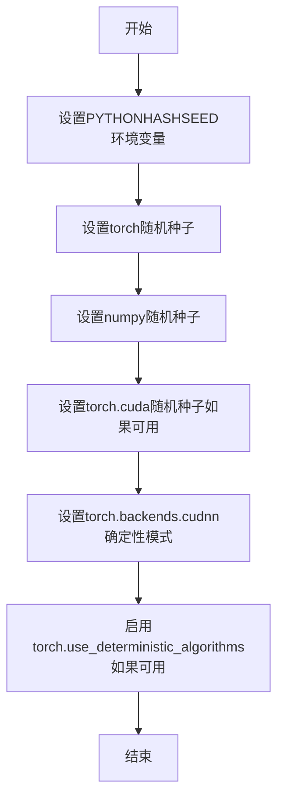
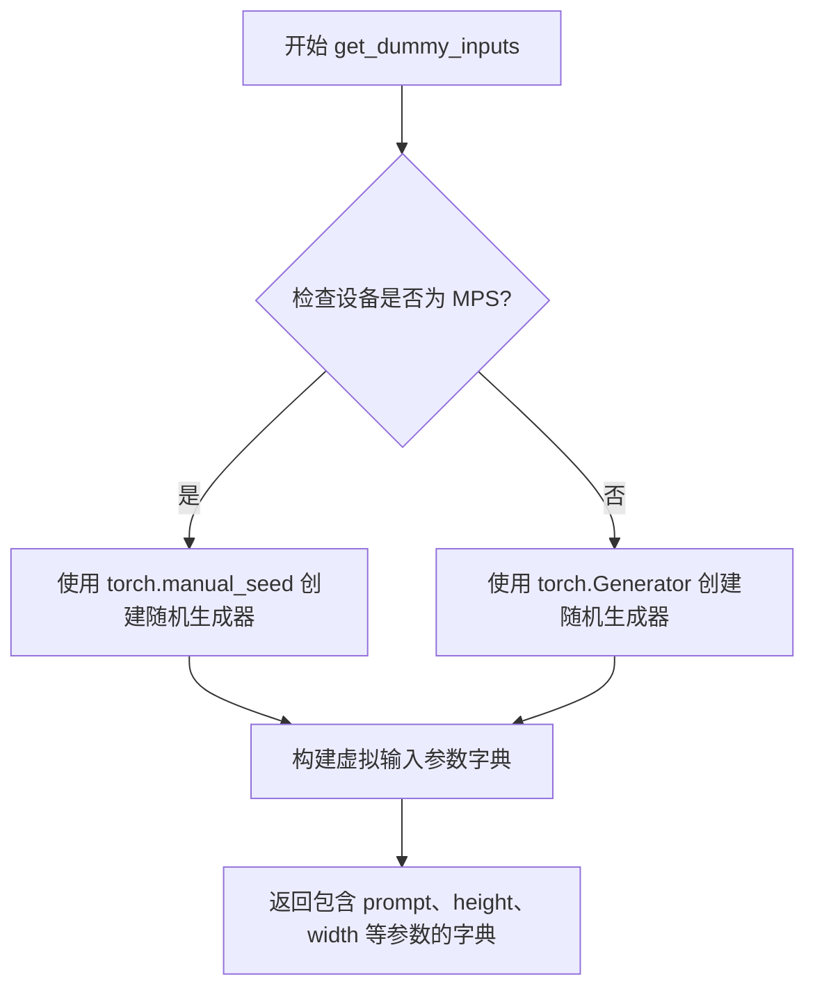
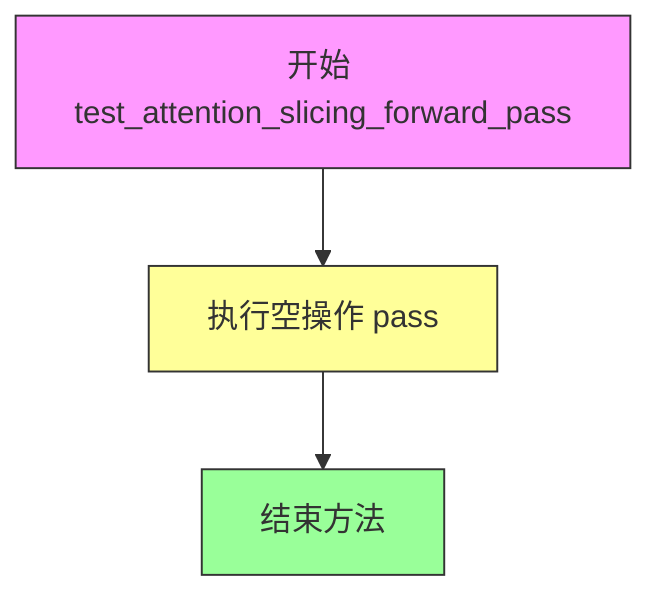
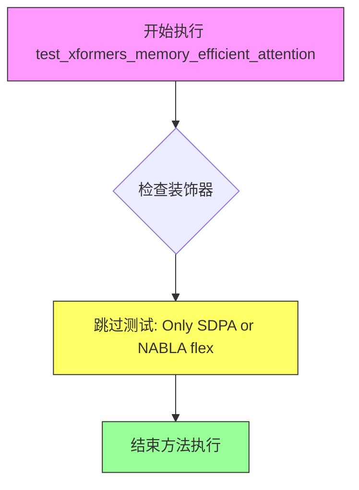
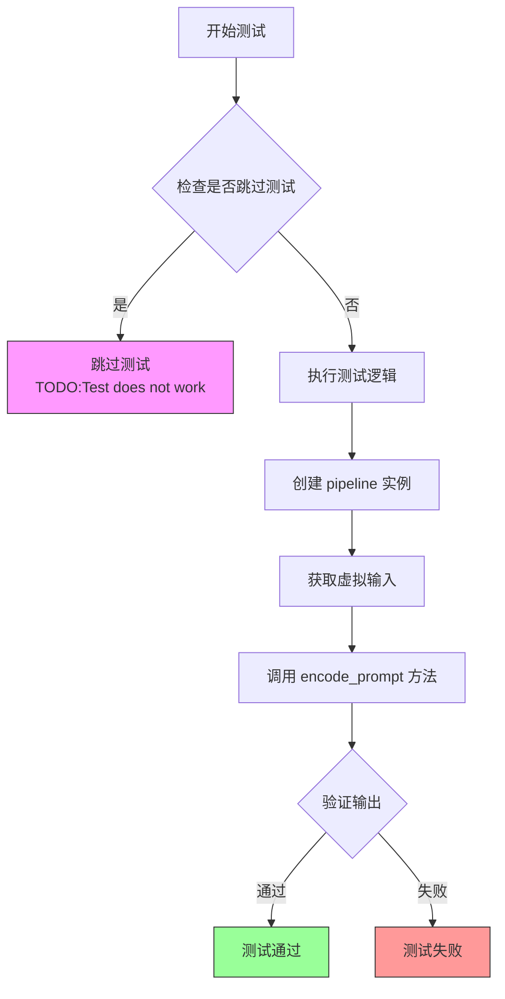
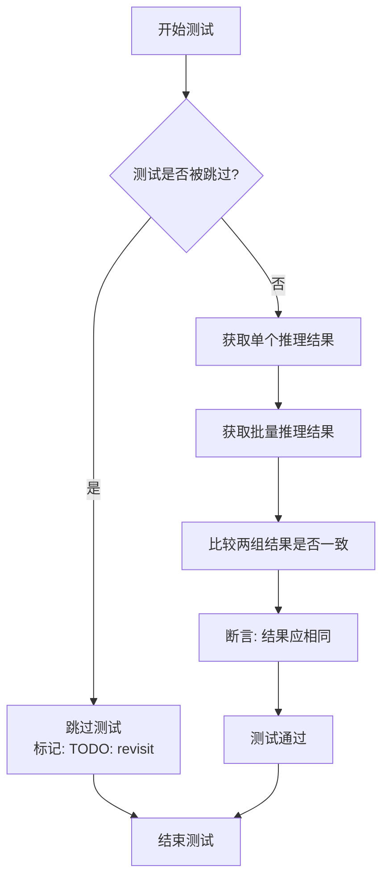

# `diffusers\tests\pipelines\kandinsky5\test_kandinsky5.py` 详细设计文档

这是一个Kandinsky5文本到视频(Text-to-Video)生成Pipeline的单元测试文件，包含了用于验证pipeline功能的多个测试用例，包括推理测试、注意力切片测试、xformers内存效率测试等，并使用虚拟组件进行测试。

## 整体流程



## 类结构

```
unittest.TestCase
└── PipelineTesterMixin
    └── Kandinsky5T2VPipelineFastTests
```

## 全局变量及字段


### `Kandinsky5T2VPipelineFastTests.pipeline_class`
    
被测试的pipeline类，用于文本到视频生成任务

类型：`Type[Kandinsky5T2VPipeline]`
    


### `Kandinsky5T2VPipelineFastTests.batch_params`
    
批量测试参数列表，包含prompt和negative_prompt

类型：`List[str]`
    


### `Kandinsky5T2VPipelineFastTests.params`
    
推理参数集合，包含prompt、height、width、num_frames、num_inference_steps、guidance_scale

类型：`frozenset`
    


### `Kandinsky5T2VPipelineFastTests.required_optional_params`
    
必需的可选参数集合，用于定义可选参数的默认值

类型：`set`
    


### `Kandinsky5T2VPipelineFastTests.test_xformers_attention`
    
是否测试xformers注意力机制，默认为False表示不测试

类型：`bool`
    


### `Kandinsky5T2VPipelineFastTests.supports_optional_components`
    
是否支持可选组件，默认为True表示支持

类型：`bool`
    


### `Kandinsky5T2VPipelineFastTests.supports_dduf`
    
是否支持DDUF（Decoupled Diffusion UpSampling Feature），默认为False

类型：`bool`
    


### `Kandinsky5T2VPipelineFastTests.test_attention_slicing`
    
是否测试注意力切片功能，默认为False表示不测试

类型：`bool`
    
    

## 全局函数及方法


### `enable_full_determinism`

启用完全确定性以确保测试可复现，通过设置随机种子和环境变量使所有随机操作在多次运行中产生一致的结果。

参数： 无

返回值：`None`，该函数不返回任何值，仅通过副作用生效。

#### 流程图



#### 带注释源码

```
# 注意：以下为基于调用的推断源码，实际定义在 testing_utils 模块中

def enable_full_determinism():
    """
    启用完全确定性以确保测试可复现。
    
    该函数通过设置各种随机种子和环境变量，确保深度学习模型
    在每次运行时产生完全一致的输出，这对于测试和调试至关重要。
    """
    import os
    import random
    import numpy as np
    import torch
    
    # 设置Python哈希种子，确保字典遍历顺序一致
    # 但注意：在Python 3.3+中，PYTHONHASHSEED需要在程序启动时设置
    # 此处仅为说明，实际可能需要在运行前设置
    os.environ["PYTHONHASHSEED"] = "0"
    
    # 设置Python random模块的随机种子
    random.seed(0)
    
    # 设置NumPy的随机种子
    np.random.seed(0)
    
    # 设置PyTorch的随机种子
    torch.manual_seed(0)
    
    # 如果使用CUDA，设置GPU随机种子
    if torch.cuda.is_available():
        torch.cuda.manual_seed(0)
        torch.cuda.manual_seed_all(0)
    
    # 设置cuDNN为确定性模式，牺牲一定性能换取可复现性
    torch.backends.cudnn.deterministic = True
    torch.backends.cudnn.benchmark = False
    
    # 尝试启用PyTorch确定性算法（如果可用）
    # 这会强制使用确定性算法，牺牲性能换取可复现性
    if hasattr(torch, 'use_deterministic_algorithms'):
        try:
            torch.use_deterministic_algorithms(True)
        except RuntimeError:
            # 某些操作可能没有确定性实现
            pass
    
    return None
```

#### 使用示例

```python
# 在测试文件顶部调用，确保整个测试文件的随机性可控
from ...testing_utils import enable_full_determinism

# 启用完全确定性
enable_full_determinism()

# 此后所有的随机操作都将产生一致的结果
class Kandinsky5T2VPipelineFastTests(PipelineTesterMixin, unittest.TestCase):
    # 测试代码...
```

#### 技术说明

| 项目 | 说明 |
|------|------|
| **设计目标** | 确保测试结果可复现，消除由于随机性导致的测试 flaky 问题 |
| **性能影响** | 确定性模式会牺牲一定性能（尤其是 cuDNN 优化） |
| **副作用** | 全局影响随机数生成器状态，可能影响并行测试 |
| **依赖项** | 需要 PyTorch、NumPy、Python 标准库 |


### `Kandinsky5T2VPipelineFastTests.get_dummy_components`

创建虚拟的pipeline组件用于测试，初始化并返回一个包含VAE、文本编码器（Qwen2.5-VL和CLIP）、分词器、Transformer和调度器等核心组件的字典，以确保测试的可重复性和确定性。

参数：

- `self`：隐式参数，测试类实例本身，无需显式传递

返回值：`Dict[str, Any]`，返回一个字典，包含以下键值对：
- `"vae"`：`AutoencoderKLHunyuanVideo` 实例，视频变分自编码器
- `"text_encoder"`：`Qwen2_5_VLForConditionalGeneration` 实例，Qwen2.5-VL文本编码器
- `"tokenizer"`：Qwen2.5-VL分词器
- `"text_encoder_2"`：`CLIPTextModel` 实例，CLIP文本编码器
- `"tokenizer_2"`：CLIP分词器
- `"transformer"`：`Kandinsky5Transformer3DModel` 实例，Kandinsky 5 3D变换器
- `"scheduler"`：`FlowMatchEulerDiscreteScheduler` 实例，流匹配欧拉离散调度器

#### 流程图

```mermaid
flowchart TD
    A[开始 get_dummy_components] --> B[设置随机种子 torch.manual_seed(0)]
    B --> C[创建 VAE: AutoencoderKLHunyuanVideo]
    C --> D[创建 Scheduler: FlowMatchEulerDiscreteScheduler]
    D --> E[设置 Qwen 隐藏大小 qwen_hidden_size = 32]
    E --> F[创建 Qwen 配置 Qwen2_5_VLConfig]
    F --> G[创建 Qwen 文本编码器 Qwen2_5_VLForConditionalGeneration]
    G --> H[从预训练模型加载 Qwen 分词器 AutoProcessor]
    H --> I[设置 CLIP 隐藏大小 clip_hidden_size = 16]
    I --> J[创建 CLIP 配置 CLIPTextConfig]
    J --> K[创建 CLIP 文本编码器 CLIPTextModel]
    K --> L[从预训练模型加载 CLIP 分词器 CLIPTokenizer]
    L --> M[创建 Transformer: Kandinsky5Transformer3DModel]
    M --> N[组装组件为字典]
    N --> O[返回字典包含7个组件]
    O --> P[结束]
```

#### 带注释源码

```python
def get_dummy_components(self):
    """
    创建虚拟的pipeline组件用于测试
    
    该方法初始化所有必需的模型组件，使用固定随机种子确保测试的可重复性。
    包含VAE、两个文本编码器（Qwen2.5-VL和CLIP）、对应的分词器、Transformer和调度器。
    
    Returns:
        Dict[str, Any]: 包含以下键的字典:
            - vae: AutoencoderKLHunyuanVideo 实例
            - text_encoder: Qwen2_5_VLForConditionalGeneration 实例
            - tokenizer: Qwen2.5-VL 分词器
            - text_encoder_2: CLIPTextModel 实例
            - tokenizer_2: CLIP 分词器
            - transformer: Kandinsky5Transformer3DModel 实例
            - scheduler: FlowMatchEulerDiscreteScheduler 实例
    """
    # 设置随机种子为0，确保测试结果的可重复性
    torch.manual_seed(0)
    
    # 创建视频变分自编码器 (VAE)
    # 用于将视频编码到潜在空间以及从潜在空间解码重建视频
    vae = AutoencoderKLHunyuanVideo(
        act_fn="silu",                           # 激活函数: SiLU
        block_out_channels=[32, 64],           # 块输出通道数
        down_block_types=[                      # 下采样块类型
            "HunyuanVideoDownBlock3D",
            "HunyuanVideoDownBlock3D",
        ],
        in_channels=3,                          # 输入通道数 (RGB)
        latent_channels=16,                     # 潜在空间通道数
        layers_per_block=1,                     # 每个块的层数
        mid_block_add_attention=False,          # 中间块是否添加注意力
        norm_num_groups=32,                     # 归一化组数
        out_channels=3,                         # 输出通道数
        scaling_factor=0.476986,                # 缩放因子
        spatial_compression_ratio=8,           # 空间压缩比
        temporal_compression_ratio=4,          # 时间压缩比
        up_block_types=[                        # 上采样块类型
            "HunyuanVideoUpBlock3D",
            "HunyuanVideoUpBlock3D",
        ],
    )

    # 创建流匹配欧拉离散调度器
    # 用于扩散模型的噪声调度，shift参数控制噪声调度的时间步偏移
    scheduler = FlowMatchEulerDiscreteScheduler(shift=7.0)

    # 定义Qwen隐藏大小，用于文本编码器和Transformer
    qwen_hidden_size = 32
    
    # 重新设置随机种子，确保组件初始化的一致性
    torch.manual_seed(0)
    
    # 创建Qwen2.5-VL配置对象
    # 配置文本和视觉编码器的架构参数
    qwen_config = Qwen2_5_VLConfig(
        text_config={                           # 文本配置
            "hidden_size": qwen_hidden_size,
            "intermediate_size": qwen_hidden_size,
            "num_hidden_layers": 2,            # 隐藏层数量
            "num_attention_heads": 2,           # 注意力头数
            "num_key_value_heads": 2,          # KV头数
            "rope_scaling": {                   # 旋转位置嵌入缩放
                "mrope_section": [2, 2, 4],
                "rope_type": "default",
                "type": "default",
            },
            "rope_theta": 1000000.0,           # RoPE基础频率
        },
        vision_config={                        # 视觉配置
            "depth": 2,
            "hidden_size": qwen_hidden_size,
            "intermediate_size": qwen_hidden_size,
            "num_heads": 2,
            "out_hidden_size": qwen_hidden_size,
        },
        hidden_size=qwen_hidden_size,          # 主隐藏大小
        vocab_size=152064,                     # 词汇表大小
        vision_end_token_id=151653,            # 视觉结束token ID
        vision_start_token_id=151652,         # 视觉开始token ID
        vision_token_id=151654,                # 视觉token ID
    )
    
    # 使用配置创建Qwen2.5-VL条件生成模型
    text_encoder = Qwen2_5_VLForConditionalGeneration(qwen_config)

    # 从预训练模型加载Qwen分词器
    # 使用tiny-random模型用于快速测试
    tokenizer = AutoProcessor.from_pretrained("hf-internal-testing/tiny-random-Qwen2VLForConditionalGeneration")

    # 定义CLIP隐藏大小
    clip_hidden_size = 16
    
    # 重新设置随机种子
    torch.manual_seed(0)
    
    # 创建CLIP文本配置
    clip_config = CLIPTextConfig(
        bos_token_id=0,                        # 开始token ID
        eos_token_id=2,                        # 结束token ID
        hidden_size=clip_hidden_size,          # 隐藏大小
        intermediate_size=16,                 # 中间层大小
        layer_norm_eps=1e-05,                  # 层归一化epsilon
        num_attention_heads=2,                 # 注意力头数
        num_hidden_layers=2,                  # 隐藏层数量
        pad_token_id=1,                        # 填充token ID
        vocab_size=1000,                       # 词汇表大小
        projection_dim=clip_hidden_size,      # 投影维度
    )
    
    # 使用配置创建CLIP文本编码器模型
    text_encoder_2 = CLIPTextModel(clip_config)

    # 从预训练模型加载CLIP分词器
    tokenizer_2 = CLIPTokenizer.from_pretrained("hf-internal-testing/tiny-random-clip")

    # 重新设置随机种子
    torch.manual_seed(0)
    
    # 创建Kandinsky 5 3D变换器模型
    # 核心扩散变换器组件，处理文本和视觉条件的融合
    transformer = Kandinsky5Transformer3DModel(
        in_visual_dim=16,                      # 视觉输入维度
        in_text_dim=qwen_hidden_size,         # 文本输入维度 (Qwen)
        in_text_dim2=clip_hidden_size,        # 文本输入维度2 (CLIP)
        time_dim=16,                           # 时间步维度
        out_visual_dim=16,                     # 视觉输出维度
        patch_size=(1, 2, 2),                 # 3D补丁大小
        model_dim=16,                          # 模型维度
        ff_dim=32,                             # 前馈网络维度
        num_text_blocks=1,                    # 文本块数量
        num_visual_blocks=2,                  # 视觉块数量
        axes_dims=(1, 1, 2),                  # 轴维度
        visual_cond=False,                     # 是否使用视觉条件
        attention_type="regular",              # 注意力类型
    )

    # 返回包含所有组件的字典
    # 这些组件将用于初始化Kandinsky5T2VPipeline进行测试
    return {
        "vae": vae,                            # 视频VAE
        "text_encoder": text_encoder,          # Qwen2.5-VL文本编码器
        "tokenizer": tokenizer,                # Qwen分词器
        "text_encoder_2": text_encoder_2,      # CLIP文本编码器
        "tokenizer_2": tokenizer_2,            # CLIP分词器
        "transformer": transformer,           # Kandinsky 5 3D变换器
        "scheduler": scheduler,                # 噪声调度器
    }
```


### `Kandinsky5T2VPipelineFastTests.get_dummy_inputs`

创建虚拟的输入参数用于测试 Kandinsky5T2VPipeline，包括提示词、图像尺寸、帧数、推理步数、引导比例等关键测试参数，并针对 MPS 设备特殊处理随机生成器。

参数：

- `self`：隐式参数，TestCase 实例，指向当前测试类对象
- `device`：`str`，目标设备字符串，用于创建 PyTorch 生成器（如 "cpu" 或 "mps"）
- `seed`：`int`，随机种子，默认值为 0，确保测试结果可复现

返回值：`Dict[str, Any]`，返回包含测试所需所有输入参数的字典

#### 流程图



#### 带注释源码

```python
def get_dummy_inputs(self, device, seed=0):
    """
    创建虚拟的输入参数用于测试 Kandinsky5T2VPipeline 管道。
    
    此方法生成一组完整的测试输入参数，用于验证管道的推理功能。
    针对 Apple MPS 设备特殊处理随机生成器的创建方式。
    
    参数:
        device: 目标设备字符串，指定在哪个设备上运行测试
        seed: 随机种子，用于确保测试结果的可复现性
    
    返回:
        包含测试所需所有输入参数的字典
    """
    # 针对 MPS 设备使用不同的随机生成器创建方式
    if str(device).startswith("mps"):
        # MPS 设备不支持 torch.Generator，使用 torch.manual_seed 替代
        generator = torch.manual_seed(seed)
    else:
        # 其他设备（CPU/CUDA）使用标准生成器
        generator = torch.Generator(device=device).manual_seed(seed)

    # 返回虚拟输入参数字典，包含管道推理所需的所有参数
    return {
        "prompt": "a red square",           # 文本提示词
        "height": 32,                        # 生成图像高度
        "width": 32,                         # 生成图像宽度
        "num_frames": 5,                    # 生成帧数（视频）
        "num_inference_steps": 2,           # 推理步数
        "guidance_scale": 4.0,              # 引导比例（ classifier-free guidance）
        "generator": generator,             # 随机生成器确保可复现
        "output_type": "pt",                # 输出类型（PyTorch 张量）
        "max_sequence_length": 8,           # 最大序列长度
    }
```


### `Kandinsky5T2VPipelineFastTests.test_inference`

该方法用于测试 Kandinsky5T2VPipeline 的基础推理功能，验证模型能够正确执行文本到视频（Text-to-Video）的生成流程，并通过断言确保输出视频的形状符合预期。

参数：无（仅包含隐式参数 `self`）

返回值：`None`，该方法通过 `unittest` 断言验证输出，不返回具体值

#### 流程图

```mermaid
flowchart TD
    A[开始 test_inference 测试] --> B[设置设备为 cpu]
    B --> C[调用 get_dummy_components 获取虚拟组件]
    C --> D[使用虚拟组件实例化 Kandinsky5T2VPipeline]
    D --> E[将 pipeline 移动到指定设备 cpu]
    E --> F[设置进度条配置 disable=None]
    F --> G[调用 get_dummy_inputs 获取虚拟输入]
    G --> H[执行 pipeline 推理: pipe\*\*inputs]
    H --> I[从输出中提取视频 frames[0]]
    I --> J{断言验证 video.shape == (3, 3, 16, 16)}
    J -->|通过| K[测试通过]
    J -->|失败| L[抛出 AssertionError]
```

#### 带注释源码

```python
def test_inference(self):
    """
    测试 Kandinsky5T2VPipeline 的基础推理功能。
    验证pipeline能够正确执行文本到视频的生成，并输出正确形状的视频张量。
    """
    # 步骤1: 设置测试设备为 CPU
    device = "cpu"
    
    # 步骤2: 获取虚拟组件（用于测试的模拟模型组件）
    # 包含: vae, text_encoder, tokenizer, text_encoder_2, tokenizer_2, transformer, scheduler
    components = self.get_dummy_components()
    
    # 步骤3: 使用虚拟组件实例化 pipeline
    pipe = self.pipeline_class(**components)
    
    # 步骤4: 将 pipeline 移动到指定设备
    pipe.to(device)
    
    # 步骤5: 设置进度条配置，disable=None 表示不禁用进度条
    pipe.set_progress_bar_config(disable=None)
    
    # 步骤6: 获取虚拟输入参数
    # 包含: prompt="a red square", height=32, width=32, num_frames=5,
    #       num_inference_steps=2, guidance_scale=4.0, generator, output_type, max_sequence_length
    inputs = self.get_dummy_inputs(device)
    
    # 步骤7: 执行 pipeline 推理，传入输入参数
    output = pipe(**inputs)
    
    # 步骤8: 从输出中提取视频帧（取第一个序列的帧）
    video = output.frames[0]
    
    # 步骤9: 断言验证输出视频的形状
    # 预期形状: (3, 3, 16, 16) 对应 (channels, frames, height, width)
    self.assertEqual(video.shape, (3, 3, 16, 16))
```


### `Kandinsky5T2VPipelineFastTests.test_attention_slicing_forward_pass`

该方法用于测试 Kandinsky5T2VPipeline 的注意力切片（attention slicing）前向传播功能，但由于 `test_attention_slicing = False` 配置，目前为空实现（pass），未实际执行注意力切片的测试逻辑。

参数：

- `self`：隐式参数，类型为 `Kandinsky5T2VPipelineFastTests`，表示测试类实例本身

返回值：`None`，该方法没有返回值

#### 流程图



#### 带注释源码

```python
def test_attention_slicing_forward_pass(self):
    """
    测试注意力切片前向传播功能。
    
    该方法用于验证 Kandinsky5T2VPipeline 在使用注意力切片优化时的
    前向传播是否正常工作。注意力切片是一种减少显存占用的技术，
    通过将注意力计算分块处理来降低峰值显存使用。
    
    注意：由于类属性 test_attention_slicing = False，当前为空实现。
    实际测试逻辑需要在启用注意力切片功能后实现。
    """
    pass  # 空实现，当前未进行任何注意力切片测试
```


### `Kandinsky5T2VPipelineFastTests.test_xformers_memory_efficient_attention`

该方法用于测试 xformers 库的内存高效注意力机制是否正常工作，但由于当前环境仅支持 SDPA（Scaled Dot Product Attention）或 NABLA（flex）注意力机制，该测试被跳过。

参数：

- `self`：隐式参数，测试类实例本身，无需显式传递

返回值：`None`，无返回值（该测试方法被 `@unittest.skip` 装饰器跳过）

#### 流程图



#### 带注释源码

```python
@unittest.skip("Only SDPA or NABLA (flex)")
def test_xformers_memory_efficient_attention(self):
    """
    测试 xformers 库的内存高效注意力机制
    
    注意：该测试当前被跳过，原因如下：
    1. xformers 的 memory_efficient_attention 需要特定的编译支持
    2. 当前测试环境仅支持 SDPA 或 NABLA (flex) 类型的注意力机制
    3. 该测试留待未来在支持 xformers 的环境中启用
    
    参数:
        self: 测试类实例，继承自 unittest.TestCase
        
    返回值:
        None: 由于方法被跳过，不执行任何测试逻辑
        
    跳过原因说明:
        - "Only SDPA or NABLA (flex)": 表明当前后端仅支持
          Scaled Dot Product Attention (SDPA) 或 NABLA flex 两种注意力实现
    """
    pass
```


### `Kandinsky5T2VPipelineFastTests.test_encode_prompt_works_in_isolation`

该测试方法用于验证提示编码器（prompt encoder）在隔离环境下是否能正常工作，即不依赖完整的 pipeline 流程，单独测试文本编码功能。但该测试目前被跳过（标记为 TODO:Test does not work）。

参数：

- `self`：`Kandinsky5T2VPipelineFastTests`，测试类实例本身，无需额外参数

返回值：`None`，测试方法无返回值，通常通过 `self.assert*` 方法进行断言验证

#### 流程图



#### 带注释源码

```python
@unittest.skip("TODO:Test does not work")
def test_encode_prompt_works_in_isolation(self):
    """
    测试提示编码器隔离工作。
    
    该测试方法旨在验证 Kandinsky5T2VPipeline 的提示编码功能
    可以独立于完整的推理流程正常工作。
    
    测试目标：
    - 验证 text_encoder 和 text_encoder_2 都能正确编码 prompt
    - 验证两个编码器的输出可以正确合并
    - 验证在隔离环境下编码器不会受到 pipeline 其他组件的影响
    
    当前状态：
    - 该测试被标记为跳过，原因是测试尚未实现或存在已知问题
    - 方法体仅包含 pass 语句，实际测试逻辑未实现
    """
    pass
```


### `Kandinsky5T2VPipelineFastTests.test_inference_batch_single_identical`

该测试方法用于验证批量推理（batch inference）与单个推理（single inference）的结果一致性，确保模型在两种推理模式下产生相同的输出。当前该测试被标记为跳过（TODO: revisit），函数体为空，等待未来重新实现。

参数：
- 无显式参数（继承自 unittest.TestCase 的测试方法无需显式参数）

返回值：
- `None`，该测试方法无返回值（当前实现为空）

#### 流程图



#### 带注释源码

```python
@unittest.skip("TODO: revisit")
def test_inference_batch_single_identical(self):
    """
    测试批量推理与单个推理的一致性。
    
    该测试方法旨在验证当使用批量输入（batch input）和
    单独输入（single input）时，模型是否产生一致的输出结果。
    
    用途：
    - 确保模型的推理逻辑在批处理和单样本处理时行为一致
    - 验证扩散模型的去噪过程不受批量维度影响
    
    当前状态：
    - 被 @unittest.skip 装饰器跳过
    - 标记原因: TODO: revisit（待重新访问）
    - 函数体为空（仅有 pass），等待未来实现
    """
    pass
```

## 关键组件


### Kandinsky5T2VPipeline

Kandinsky5的视频生成管道，整合了Qwen2.5-VL和CLIP双文本编码器、VAE解码器和3D变换器模型，用于根据文本提示生成视频。

### AutoencoderKLHunyuanVideo

HunyuanVideo的变分自编码器(VAE)，负责视频的潜在空间编码和解码，支持空间和时间维度压缩。

### Qwen2_5_VLForConditionalGeneration

Qwen2.5视觉语言模型作为主要文本编码器，将文本提示转换为文本嵌入向量，支持多模态理解。

### CLIPTextModel

CLIP文本编码器作为辅助文本编码器，提供额外的文本特征表示，增强文本理解能力。

### Kandinsky5Transformer3DModel

Kandinsky5的3D变换器核心模型，负责在潜在空间中根据文本条件进行去噪生成，输出视频的潜在表示。

### FlowMatchEulerDiscreteScheduler

基于Flow Match的欧拉离散调度器，用于控制去噪过程中的噪声调度和采样步数。

### PipelineTesterMixin

测试混入类，提供管道测试的通用方法和断言工具，确保管道符合预期的接口和行为规范。

### get_dummy_components

创建用于测试的虚拟组件方法，初始化所有模型和调度器的轻量级配置，用于快速测试而不需要真实预训练权重。

### get_dummy_inputs

创建用于推理测试的虚拟输入参数方法，生成符合管道接口要求的提示词、尺寸、帧数等参数。

### test_inference

核心推理测试方法，验证管道能够正确执行完整的文本到视频生成流程并输出正确形状的结果。


## 问题及建议


### 已知问题

- **测试方法空实现**：`test_attention_slicing_forward_pass` 方法只有 `pass` 语句，未实现任何测试逻辑
- **大量跳过测试**：`test_xformers_memory_efficient_attention`、`test_encode_prompt_works_in_isolation`、`test_inference_batch_single_identical` 三个测试被跳过，缺少对这些功能的验证
- **重复的随机种子设置**：代码中多次调用 `torch.manual_seed(0)`，分散在 `get_dummy_components` 和 `get_dummy_inputs` 方法中，增加维护成本
- **测试断言不充分**：`test_inference` 仅验证输出视频的 shape 为 (3, 3, 16, 16)，未验证生成内容的合理性和数值范围
- **缺少关键参数测试**：negative_prompt、latents、callback_on_step_end、max_sequence_length 等在 params 中定义但未在测试中覆盖
- **硬编码配置分散**：大量配置参数（如 shift=7.0、scaling_factor=0.476986 等）硬编码在方法中，缺乏统一的配置管理
- **外部模型依赖**：依赖 `hf-internal-testing/tiny-random-Qwen2VLForConditionalGeneration` 和 `hf-internal-testing/tiny-random-clip` 等外部模型，可能导致测试不稳定
- **get_dummy_components 过于臃肿**：该方法包含大量模型配置代码，超过 100 行，难以阅读和维护

### 优化建议

- 实现 `test_attention_slicing_forward_pass` 方法或移除该空方法
- 调查并修复被跳过的测试，或添加明确的 TODO 注释说明原因和计划修复时间
- 抽取随机种子设置为独立的辅助方法或使用 fixture 管理
- 增加更全面的断言，包括数值范围检查、内容非零验证等
- 添加针对 optional_params 的独立测试用例，覆盖 negative_prompt、latents、callback 等参数
- 将配置参数抽取为类级别常量或配置文件，提高可读性和可维护性
- 考虑使用 mock 替代外部模型依赖，提高测试的确定性和执行速度
- 重构 `get_dummy_components`，将不同组件的初始化拆分为独立的私有方法

## 其它


### 设计目标与约束

本测试文件旨在验证Kandinsky5T2VPipeline的核心功能，确保文本到视频生成管线能够正确处理输入提示词并生成符合预期尺寸的视频帧。测试设计遵循最小化原则，使用dummy组件和最小参数配置以加快测试执行速度，同时保持对核心功能的全面覆盖。约束条件包括：仅支持CPU设备测试、禁用了xformers注意力优化、跳过了部分不兼容的测试用例。

### 错误处理与异常设计

测试文件中通过unittest框架的断言机制处理错误，当输出帧的形状不符合预期时将抛出AssertionError。使用@unittest.skip装饰器跳过已知不兼容的测试用例，避免误报。get_dummy_components和get_dummy_inputs方法在组件或输入配置无效时可能导致后续测试失败，但测试本身不包含额外的异常处理逻辑。Generator设备兼容性通过startswith("mps")检查处理MPS设备特殊情况。

### 数据流与状态机

测试数据流遵循以下路径：首先通过get_dummy_components创建虚拟模型组件（VAE、文本编码器x2、Transformer、调度器），然后通过get_dummy_inputs生成符合管道要求的参数字典，最后调用pipeline执行推理。状态转换主要包括：组件初始化状态→管道实例化状态→设备绑定状态→推理执行状态→输出验证状态。测试不涉及复杂的运行时状态机，主要验证单次完整执行流程。

### 外部依赖与接口契约

本测试依赖以下核心外部组件：PyTorch（张量运算）、Transformers库（Qwen2_5_VLForConditionalGeneration、CLIPTextModel、CLIPTokenizer、AutoProcessor）、Diffusers库（Kandinsky5T2VPipeline及相关组件、FlowMatchEulerDiscreteScheduler、AutoencoderKLHunyuanVideo）。接口契约方面，pipeline_class必须实现__call__方法并接受prompt、height、width、num_frames、num_inference_steps、guidance_scale等参数，返回包含frames属性的对象。get_dummy_components返回的字典键必须与pipeline_class的初始化参数完全匹配。

### 测试覆盖范围与边界条件

测试覆盖了以下场景：基本推理功能验证（test_inference）、批处理兼容性（通过batch_params定义）、可选参数处理（通过required_optional_params定义）、输出类型指定（output_type="pt"）、生成器种子控制（支持确定性输出）、序列长度限制（max_sequence_length=8）。边界条件处理：MPS设备特殊处理、跳过的测试用例标注了具体原因（xformers不可用、测试未实现、功能待修订）。

### 配置管理与测试隔离

通过enable_full_determinism()启用完全确定性，确保测试结果可复现。每次测试使用torch.manual_seed(0)重置随机种子，确保组件初始化的确定性。get_dummy_components为每个组件独立设置种子，避免状态污染。测试使用独立的pipeline实例（每次调用self.pipeline_class(**components)），确保测试间隔离。

### 性能考量与优化建议

当前测试配置使用极小模型尺寸（hidden_size=16/32、num_hidden_layers=2）以最大化测试速度。num_inference_steps设为2（最小值）、num_frames设为5、height/width设为32，均为测试优化配置。建议：可考虑添加性能基准测试记录推理耗时；可添加内存使用监控；可考虑为CI环境添加快速回归检测。

### 扩展性与未来改进

测试框架设计支持扩展新组件和新测试用例。通过supports_optional_components=True表明支持可选组件测试，通过supports_dduf=False明确不支持DDUF功能。改进建议：可添加更多推理参数组合测试、可添加输出质量主观评估框架、可添加跨平台兼容性测试（GPU/CPU/MPS）、可补充性能回归测试阈值。

### 已知限制与待办事项

文件中包含多个标记为TODO的待办测试用例：test_encode_prompt_works_in_olation（编码提示词隔离测试）、test_inference_batch_single_identical（批处理一致性测试）。xformers注意力测试被永久跳过，原因是仅支持SDPA或NABLA（flex）。attention_slicing测试为空实现（pass），表明该功能尚未完整实现。

### 测试最佳实践与代码质量

代码遵循以下最佳实践：使用描述性的测试方法命名、规范的参数命名（device、seed等）、清晰的文档字符串（通过代码注释体现）、合理的测试分组（通过unittest.TestCase类组织）。建议改进：可添加测试失败时的详细错误消息、可为每个测试添加docstring说明测试目的、可考虑使用pytest parametrize进行参数化测试。


    