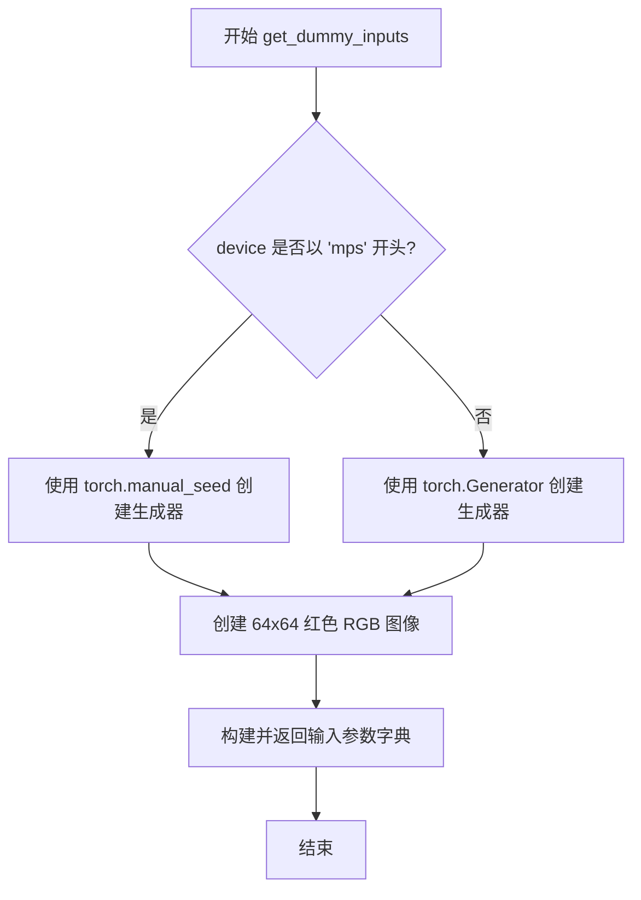
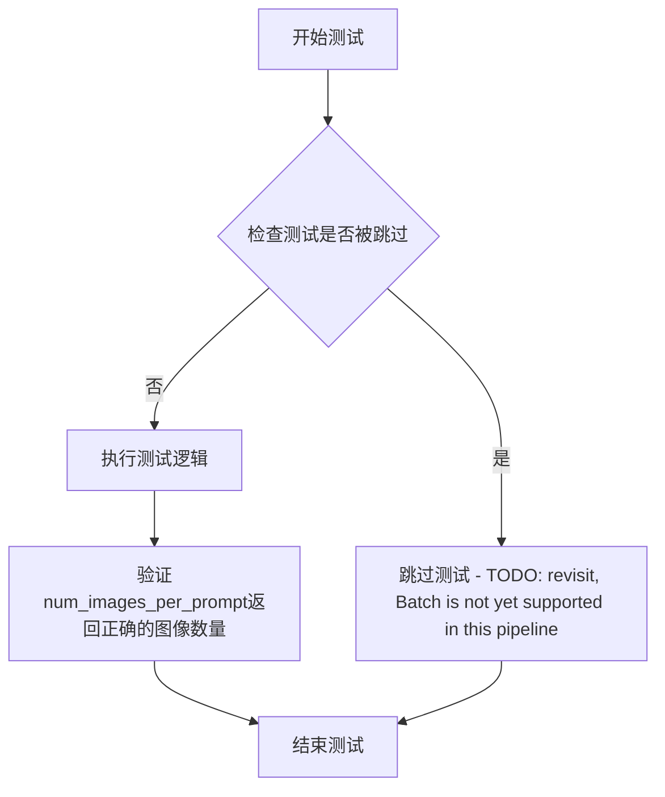
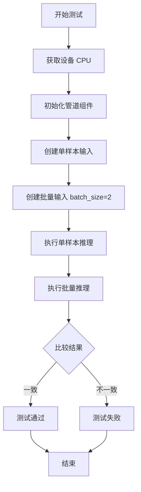
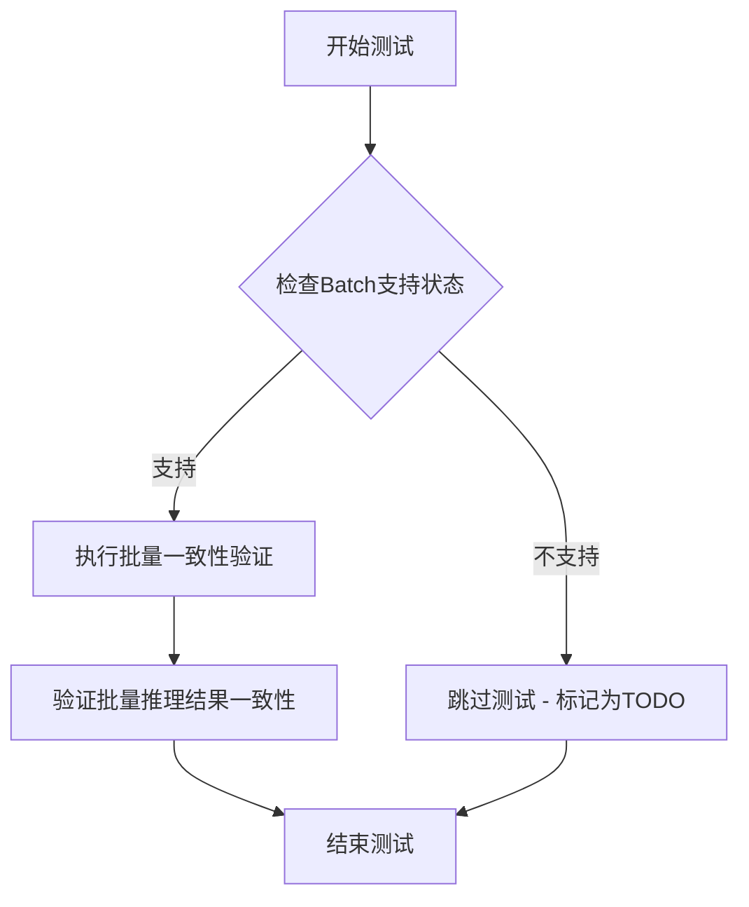
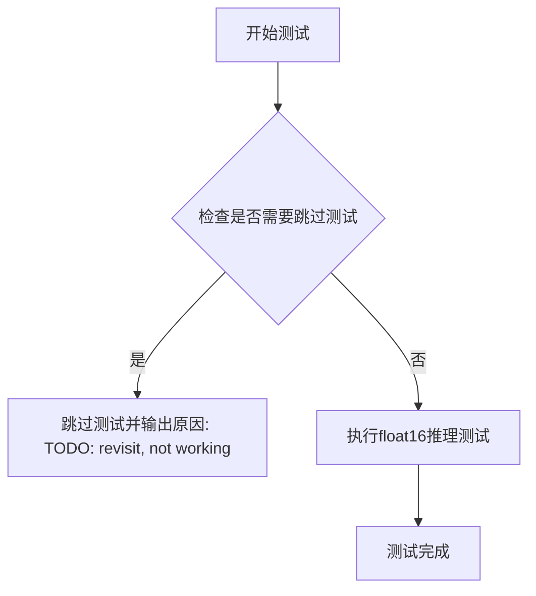
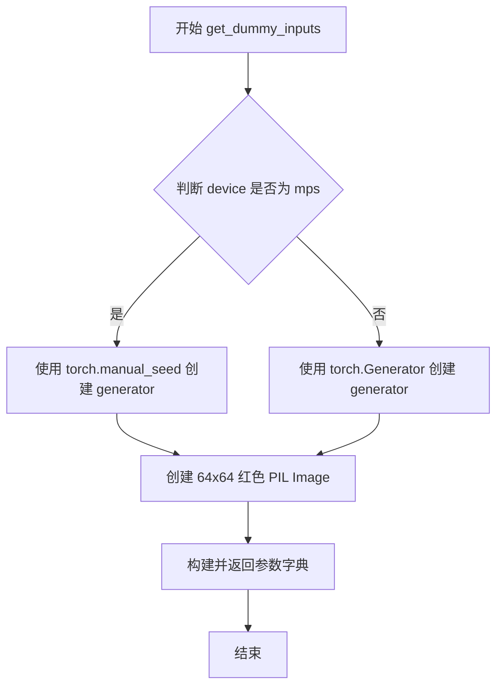
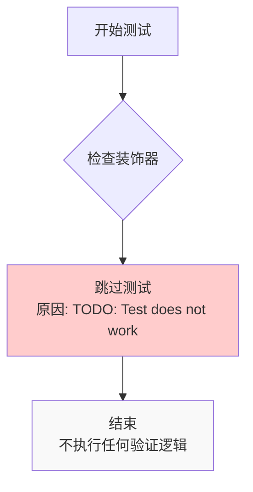
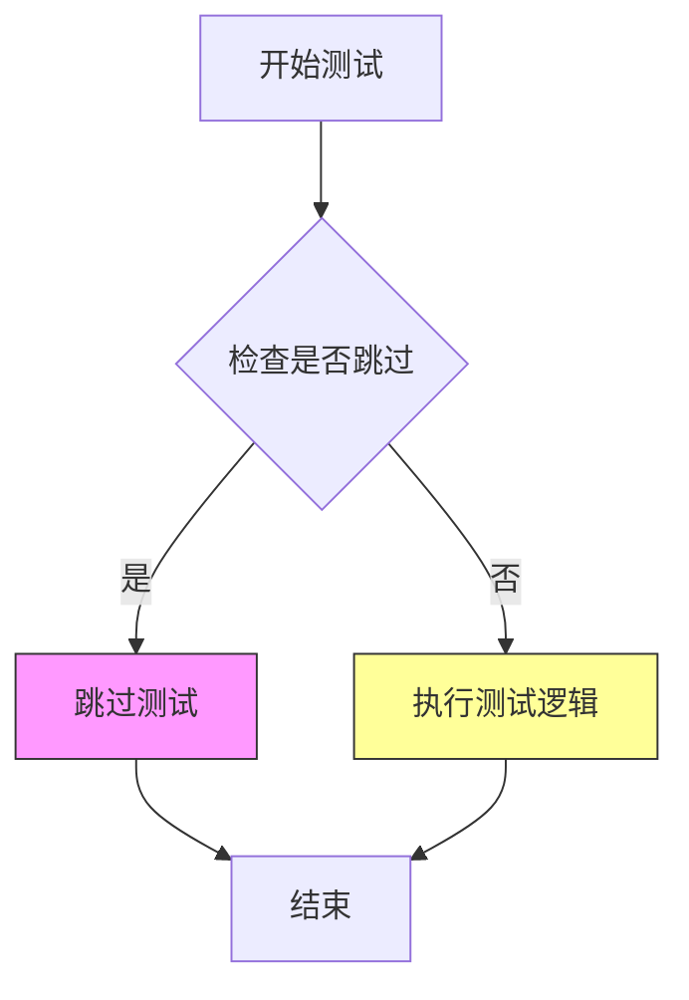
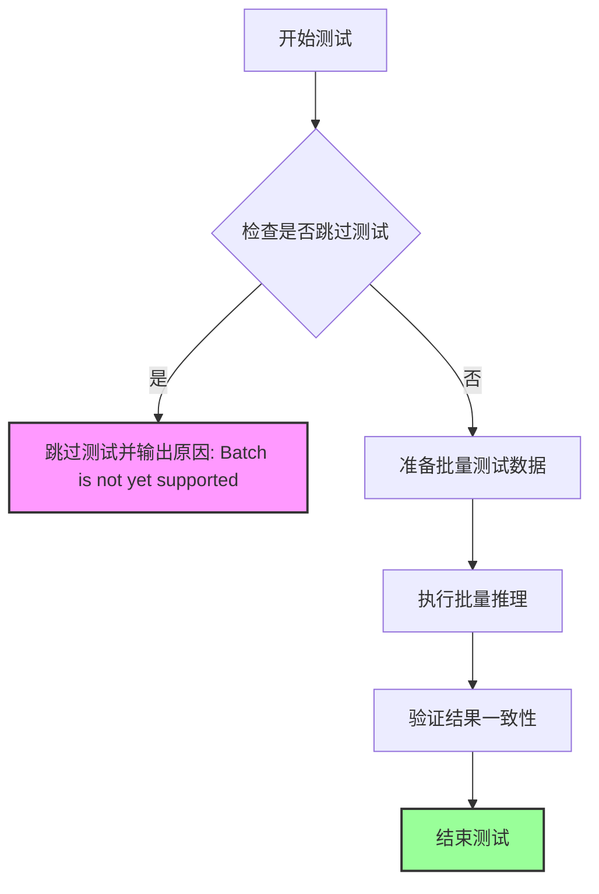

# `diffusers\tests\pipelines\kandinsky5\test_kandinsky5_i2i.py` 详细设计文档

这是Kandinsky5 I2I（图像到图像）流水线的单元测试文件，测试Kandinsky5图像生成模型的推理功能，验证从文本提示和输入图像生成目标图像的完整流程。

## 整体流程

```mermaid
graph TD
    A[开始测试] --> B[获取虚拟组件 get_dummy_components]
B --> C[创建流水线实例 Kandinsky5I2IPipeline]
C --> D[设置设备和分辨率]
D --> E[获取虚拟输入 get_dummy_inputs]
E --> F[执行推理 pipe(**inputs)]
F --> G{验证输出}
G --> H[断言图像形状 (1, 3, 64, 64)]
H --> I[结束测试]
```

## 类结构

```
PipelineTesterMixin (测试混入类)
└── Kandinsky5I2IPipelineFastTests (主测试类)
    ├── get_dummy_components (创建虚拟组件)
    ├── get_dummy_inputs (创建虚拟输入)
    ├── test_inference (推理测试)
    └── 多个被跳过的测试方法
```

## 全局变量及字段


### `enable_full_determinism`
    
启用完全确定性测试的实用函数，来自diffusers.utils.testing_utils模块

类型：`function`
    


### `Kandinsky5I2IPipelineFastTests.pipeline_class`
    
指定测试所针对的管道类为Kandinsky5I2IPipeline

类型：`type`
    


### `Kandinsky5I2IPipelineFastTests.batch_params`
    
定义支持批处理的参数列表，包含prompt和negative_prompt

类型：`list`
    


### `Kandinsky5I2IPipelineFastTests.params`
    
定义管道推理所需的必选参数字段集合，包括image、prompt、height、width、num_inference_steps和guidance_scale

类型：`frozenset`
    


### `Kandinsky5I2IPipelineFastTests.required_optional_params`
    
定义可选但被测试的参数字段集合，包含num_inference_steps、generator、latents等

类型：`set`
    


### `Kandinsky5I2IPipelineFastTests.test_xformers_attention`
    
标志位，指示是否测试xformers注意力机制，当前设为False

类型：`bool`
    


### `Kandinsky5I2IPipelineFastTests.supports_optional_components`
    
标志位，指示管道是否支持可选组件，当前设为True

类型：`bool`
    


### `Kandinsky5I2IPipelineFastTests.supports_dduf`
    
标志位，指示管道是否支持DDUF（Decoupled Diffusion U-Net Framework），当前设为False

类型：`bool`
    


### `Kandinsky5I2IPipelineFastTests.test_attention_slicing`
    
标志位，指示是否测试注意力切片优化，当前设为False

类型：`bool`
    
    

## 全局函数及方法


### `Kandinsky5I2IPipelineFastTests.get_dummy_components`

该函数用于生成 Kandinsky5 I2I Pipeline（图像到图像转换管道）的虚拟测试组件，包括 VAE、文本编码器（Qwen2.5-VL 和 CLIP）、分词器、Transformer 模型和调度器等，用于单元测试目的。

参数：
- 该方法无显式参数（`self` 为隐式参数）

返回值：`Dict[str, Any]`，返回一个包含 7 个键的字典，分别为 `vae`、`text_encoder`、`tokenizer`、`text_encoder_2`、`tokenizer_2`、`transformer` 和 `scheduler`，用于初始化 `Kandinsky5I2IPipeline` 进行测试。

#### 流程图

```mermaid
flowchart TD
    A[开始 get_dummy_components] --> B[设置随机种子 torch.manual_seed(0)]
    B --> C[创建 AutoencoderKL 变分自编码器]
    C --> D[创建 FlowMatchEulerDiscreteScheduler 调度器]
    D --> E[创建 Qwen2.5-VL 文本编码器配置和模型]
    E --> F[创建 CLIP 文本编码器配置和模型]
    F --> G[创建 AutoProcessor 分词器]
    G --> H[创建 CLIPTokenizer 分词器]
    H --> I[创建 Kandinsky5Transformer3DModel]
    I --> J[构建组件字典]
    J --> K[返回组件字典]
    
    style A fill:#f9f,color:#000
    style K fill:#9f9,color:#000
```

#### 带注释源码

```python
def get_dummy_components(self):
    """
    生成用于测试的虚拟组件字典，包含 Kandinsky5 I2I Pipeline 的所有必要模型和配置。
    
    该方法创建以下组件：
    - VAE (变分自编码器): 用于图像的编码和解码
    - 文本编码器 (Qwen2.5-VL + CLIP): 用于将文本提示转换为向量表示
    - 分词器: 用于将文本分割为 token
    - Transformer: Kandinsky5 的核心变换器模型
    - Scheduler: 用于扩散采样调度的噪声调度器
    
    Returns:
        dict: 包含所有组件的字典，可直接用于初始化 Pipeline
    """
    # 设置随机种子以确保测试的可重复性
    torch.manual_seed(0)
    
    # ========== 1. 创建 VAE (变分自编码器) ==========
    # AutoencoderKL: 基于 KL 散度的变分自编码器，用于图像编码/解码
    # - act_fn="silu": 激活函数使用 SiLU (Swish)
    # - block_out_channels: 定义编码器/解码器的通道数 [32, 64, 64, 64]
    # - force_upcast=True: 强制上采样以保持精度
    # - latent_channels=16: 潜在空间的通道数
    # - sample_size=64: 输入图像的尺寸
    vae = AutoencoderKL(
        act_fn="silu",
        block_out_channels=[32, 64, 64, 64],
        down_block_types=["DownEncoderBlock2D", "DownEncoderBlock2D", "DownEncoderBlock2D", "DownEncoderBlock2D"],
        force_upcast=True,
        in_channels=3,          # RGB 图像有 3 个通道
        latent_channels=16,     # 潜在空间通道数
        layers_per_block=1,     # 每个块的层数
        mid_block_add_attention=False,  # 中间块不使用注意力
        norm_num_groups=32,     # 归一化组数
        out_channels=3,         # 输出通道数
        sample_size=64,        # 样本尺寸
        scaling_factor=0.3611,  # VAE 缩放因子
        shift_factor=0.1159,    # VAE 偏移因子
        up_block_types=["UpDecoderBlock2D", "UpDecoderBlock2D", "UpDecoderBlock2D", "UpDecoderBlock2D"],
        use_post_quant_conv=False,   # 不使用后量化卷积
        use_quant_conv=False,        # 不使用量化卷积
    )

    # ========== 2. 创建调度器 (Scheduler) ==========
    # FlowMatchEulerDiscreteScheduler: 基于欧拉离散化的 Flow Match 调度器
    # - shift=7.0: 时间步偏移参数，用于控制噪声调度
    scheduler = FlowMatchEulerDiscreteScheduler(shift=7.0)

    # ========== 3. 创建 Qwen2.5-VL 文本编码器 ==========
    qwen_hidden_size = 32  # Qwen 隐藏层大小（测试用小尺寸）
    torch.manual_seed(0)   # 重新设置随机种子以确保可重复性
    
    # Qwen2.5_VLConfig: Qwen2.5 视觉语言模型的配置
    # - text_config: 文本编码器配置 (hidden_size, intermediate_size, layers, heads 等)
    # - vision_config: 视觉编码器配置 (depth, hidden_size, num_heads 等)
    # - vision_start_token_id/vision_token_id/vision_end_token_id: 视觉 token 的特殊 ID
    qwen_config = Qwen2_5_VLConfig(
        text_config={
            "hidden_size": qwen_hidden_size,
            "intermediate_size": qwen_hidden_size,
            "num_hidden_layers": 2,
            "num_attention_heads": 2,
            "num_key_value_heads": 2,
            "rope_scaling": {
                "mrope_section": [2, 2, 4],
                "rope_type": "default",
                "type": "default",
            },
            "rope_theta": 1000000.0,
        },
        vision_config={
            "depth": 2,
            "hidden_size": qwen_hidden_size,
            "intermediate_size": qwen_hidden_size,
            "num_heads": 2,
            "out_hidden_size": qwen_hidden_size,
        },
        hidden_size=qwen_hidden_size,
        vocab_size=152064,
        vision_end_token_id=151653,
        vision_start_token_id=151652,
        vision_token_id=151654,
    )
    # Qwen2_5_VLForConditionalGeneration: Qwen2.5 条件生成模型
    text_encoder = Qwen2_5_VLForConditionalGeneration(qwen_config)
    
    # AutoProcessor: 自动加载与模型匹配的处理器
    tokenizer = AutoProcessor.from_pretrained("hf-internal-testing/tiny-random-Qwen2VLForConditionalGeneration")

    # ========== 4. 创建 CLIP 文本编码器 (第二个文本编码器) ==========
    clip_hidden_size = 16  # CLIP 隐藏层大小
    torch.manual_seed(0)
    
    # CLIPTextConfig: CLIP 文本编码器的配置
    # - projection_dim: 文本嵌入投影维度
    # - vocab_size=1000: 词汇表大小（测试用小尺寸）
    clip_config = CLIPTextConfig(
        bos_token_id=0,           # Beginning of sequence token
        eos_token_id=2,           # End of sequence token
        hidden_size=clip_hidden_size,
        intermediate_size=16,
        layer_norm_eps=1e-05,
        num_attention_heads=2,
        num_hidden_layers=2,
        pad_token_id=1,           # Padding token
        vocab_size=1000,
        projection_dim=clip_hidden_size,
    )
    # CLIPTextModel: CLIP 文本编码器模型
    text_encoder_2 = CLIPTextModel(clip_config)
    
    # CLIPTokenizer: CLIP 分词器
    tokenizer_2 = CLIPTokenizer.from_pretrained("hf-internal-testing/tiny-random-clip")

    # ========== 5. 创建 Kandinsky5 Transformer 模型 ==========
    torch.manual_seed(0)
    
    # Kandinsky5Transformer3DModel: Kandinsky5 的 3D 变换器模型
    # - in_visual_dim: 视觉嵌入维度 (来自 VAE)
    # - in_text_dim: 文本嵌入维度 (来自 Qwen)
    # - in_text_dim2: 第二文本嵌入维度 (来自 CLIP)
    # - time_dim: 时间步嵌入维度
    # - patch_size: 3D patch 划分尺寸
    # - model_dim: 模型隐藏维度
    # - ff_dim: 前馈网络隐藏维度
    # - axes_dims: 轴维度配置
    transformer = Kandinsky5Transformer3DModel(
        in_visual_dim=16,
        in_text_dim=qwen_hidden_size,
        in_text_dim2=clip_hidden_size,
        time_dim=16,
        out_visual_dim=16,
        patch_size=(1, 2, 2),
        model_dim=16,
        ff_dim=32,
        num_text_blocks=1,
        num_visual_blocks=2,
        axes_dims=(1, 1, 2),
        visual_cond=True,
        attention_type="regular",
    )

    # ========== 6. 返回组件字典 ==========
    # 返回包含所有模型和配置的字典
    # 用于后续创建 Pipeline 实例
    return {
        "vae": vae,                      # 变分自编码器
        "text_encoder": text_encoder,    # Qwen2.5-VL 文本编码器
        "tokenizer": tokenizer,          # Qwen2.5 分词器
        "text_encoder_2": text_encoder_2, # CLIP 文本编码器
        "tokenizer_2": tokenizer_2,       # CLIP 分词器
        "transformer": transformer,      # Kandinsky5 Transformer
        "scheduler": scheduler,          # 噪声调度器
    }
```


### `Kandinsky5I2IPipelineFastTests.get_dummy_inputs`

该方法用于生成管道测试所需的虚拟输入数据，根据设备类型（MPS或其他）创建随机数生成器，并返回一个包含图像、提示词及推理参数的字典。

参数：

- `self`：`Kandinsky5I2IPipelineFastTests`，类实例本身
- `device`：`str`，目标设备字符串，用于创建随机数生成器
- `seed`：`int`，随机种子，默认为 0，用于保证测试可复现

返回值：`Dict[str, Any]`，包含以下键值对的字典：

- `image`：PIL.Image，64x64 红色 RGB 图像
- `prompt`：`str`，测试用提示词 "a red square"
- `height`：`int`，输出图像高度 64
- `width`：`int`，输出图像宽度 64
- `num_inference_steps`：`int`，推理步数 2
- `guidance_scale`：`float`，引导比例 4.0
- `generator`：torch.Generator，随机数生成器
- `output_type`：`str`，输出类型 "pt"（PyTorch张量）
- `max_sequence_length`：`int`，最大序列长度 8

#### 流程图



#### 带注释源码

```python
def get_dummy_inputs(self, device, seed=0):
    """
    生成用于管道推理测试的虚拟输入参数。
    
    Args:
        self: Kandinsky5I2IPipelineFastTests 类实例
        device: 目标设备字符串（如 'cpu', 'cuda', 'mps'）
        seed: 随机种子，用于保证测试结果可复现
    
    Returns:
        Dict: 包含图像、提示词及推理参数的字典
    """
    # 针对 Apple Silicon MPS 设备使用特殊的随机数生成方式
    if str(device).startswith("mps"):
        # MPS 设备不支持 Generator，使用 manual_seed 直接设置种子
        generator = torch.manual_seed(seed)
    else:
        # 其他设备（CPU/CUDA）使用 torch.Generator 创建随机数生成器
        generator = torch.Generator(device=device).manual_seed(seed)

    # 创建测试用虚拟图像：64x64 红色 RGB 图像
    image = Image.new("RGB", (64, 64), color="red")

    # 返回完整的虚拟输入参数字典，用于管道推理
    return {
        "image": image,
        "prompt": "a red square",
        "height": 64,
        "width": 64,
        "num_inference_steps": 2,
        "guidance_scale": 4.0,
        "generator": generator,
        "output_type": "pt",
        "max_sequence_length": 8,
    }
```


### `Kandinsky5I2IPipelineFastTests.test_inference`

该测试方法用于验证 Kandinsky5I2IPipeline（图像到图像转换管道）的推理功能是否正常工作。测试通过创建虚拟组件、初始化管道、执行推理流程，并验证输出图像的形状是否符合预期 (1, 3, 64, 64) 来确保管道的基本功能完整性。

参数：

- 无显式参数（仅包含 `self` 隐式参数）

返回值：无显式返回值（`None`），通过 `self.assertEqual` 断言验证图像形状

#### 流程图

```mermaid
flowchart TD
    A[开始测试] --> B[设置设备为CPU]
    B --> C[获取虚拟组件: get_dummy_components]
    C --> D[使用虚拟组件实例化管道: pipeline_class]
    D --> E[设置管道分辨率: pipe.resolutions = [(64, 64)]]
    E --> F[将管道移至设备: pipe.to]
    F --> G[配置进度条: set_progress_bar_config]
    G --> H[获取虚拟输入: get_dummy_inputs]
    H --> I[执行推理: pipe(**inputs)]
    I --> J[提取输出图像: output.image]
    J --> K{验证图像形状}
    K -->|通过| L[测试通过]
    K -->|失败| M[抛出断言错误]
```

#### 带注释源码

```python
def test_inference(self):
    """
    测试 Kandinsky5I2IPipeline 的推理功能。
    验证管道能够正确处理图像到图像的转换任务。
    """
    # 1. 设置测试设备为 CPU
    device = "cpu"
    
    # 2. 获取虚拟组件（用于测试的模拟模型组件）
    # 包含: VAE, 文本编码器(qwen, clip), transformer, scheduler 等
    components = self.get_dummy_components()
    
    # 3. 使用虚拟组件实例化 Kandinsky5I2IPipeline 管道
    pipe = self.pipeline_class(**components)
    
    # 4. 设置管道的输出分辨率
    # 管道将生成 64x64 分辨率的图像
    pipe.resolutions = [(64, 64)]
    
    # 5. 将管道及其所有组件移至指定设备（CPU）
    pipe.to(device)
    
    # 6. 配置进度条（disable=None 表示不禁用进度条）
    pipe.set_progress_bar_config(disable=None)
    
    # 7. 获取虚拟输入参数
    # 包含: image, prompt, height, width, num_inference_steps, guidance_scale 等
    inputs = self.get_dummy_inputs(device)
    
    # 8. 执行管道推理
    # 调用管道的 __call__ 方法进行图像到图像的转换
    output = pipe(**inputs)
    
    # 9. 从输出中提取生成的图像
    image = output.image
    
    # 10. 断言验证
    # 验证生成的图像形状为 (batch_size=1, channels=3, height=64, width=64)
    self.assertEqual(image.shape, (1, 3, 64, 64))
```


### `Kandinsky5I2IPipelineFastTests.test_encode_prompt_works_in_isolation`

该测试方法用于验证 `encode_prompt` 方法能否在隔离环境下正确工作，即单独测试文本编码功能而不执行完整的图像生成流程。

参数：

- `self`：隐式参数，`Kandinsky5I2IPipelineFastTests` 类的实例

返回值：无（方法体为 `pass`，且被 `@unittest.skip` 装饰器跳过）

#### 流程图

```mermaid
flowchart TD
    A[开始测试] --> B{检查装饰器}
    B -->|@unittest.skip| C[跳过测试]
    C --> D[返回空结果]
    
    B -->|正常执行| E[调用 encode_prompt]
    E --> F[验证提示词编码结果]
    F --> G[断言编码输出正确性]
    G --> H[测试通过]
    
    style C fill:#ffcccc
    style D fill:#ffcccc
```

#### 带注释源码

```python
@unittest.skip("TODO: Test does not work")
def test_encode_prompt_works_in_isolation(self):
    """
    测试 encode_prompt 方法在隔离环境下的功能。
    
    该测试方法原本用于验证文本提示词编码器能够独立工作，
    不依赖于完整的图像生成pipeline。
    
    当前状态：
    - 被 @unittest.skip 装饰器跳过，原因是 "TODO: Test does not work"
    - 方法体仅为 pass 占位符
    - 表明该测试功能尚未实现或存在已知问题需要修复
    
    预期行为（当测试被启用时）：
    1. 创建 pipeline 实例
    2. 单独调用 encode_prompt 方法
    3. 验证返回的编码结果形状和数据类型正确
    4. 验证不同提示词产生不同的编码输出
    """
    pass
```


### `Kandinsky5I2IPipelineFastTests.test_num_images_per_prompt`

该测试方法用于验证管道在处理单次提示时生成图像数量的正确性，但由于批处理功能尚未支持，当前被跳过。

参数：

- `self`：`Kandinsky5I2IPipelineFastTests`，测试类实例，unittest.TestCase 的子类实例

返回值：`None`，方法体为空（pass），不返回任何值

#### 流程图



#### 带注释源码

```python
@unittest.skip("TODO: revisit, Batch isnot yet supported in this pipeline")
def test_num_images_per_prompt(self):
    """
    测试管道在给定提示下生成的图像数量是否正确。
    
    该测试方法原本用于验证 Kandinsky5I2IPipeline 的 num_images_per_prompt 功能，
    但由于当前管道尚不支持批处理功能（Batch），该测试被暂时跳过。
    
    测试目标：
    - 验证当 num_images_per_prompt > 1 时，管道是否生成相应数量的图像
    - 验证返回的图像张量形状是否正确
    - 验证批处理提示的处理是否符合预期
    
    当前状态：测试被跳过，需要后续重新实现
    """
    pass
```


### `Kandinsky5I2IPipelineFastTests.test_inference_batch_single_identical`

该测试方法用于验证 Kandinsky5I2IPipeline 在批量推理模式下，单个样本的处理结果与批量推理中相同输入的处理结果是否保持一致。由于批量功能尚未支持，该测试目前被跳过。

参数：
- 无显式参数（继承自 unittest.TestCase，通过 self 访问测试类的资源和配置）

返回值：无返回值（unittest.TestCase 方法）

#### 流程图



#### 带注释源码

```python
@unittest.skip("TODO: revisit, Batch isnot yet supported in this pipeline")
def test_inference_batch_single_identical(self):
    """
    测试批量推理时，单个样本与批量中相同样本的输出是否一致。
    
    该测试方法旨在验证管道在处理批量输入时，不会因为批处理机制
    而改变单个样本的处理逻辑。由于当前 Kandinsky5I2IPipeline 
    尚未支持批量推理功能，该测试被跳过。
    """
    # 1. 确定测试设备为 CPU
    device = "cpu"
    
    # 2. 初始化管道组件（使用虚拟组件以加速测试）
    components = self.get_dummy_components()
    pipe = self.pipeline_class(**components)
    pipe.resolutions = [(64, 64)]
    pipe.to(device)
    pipe.set_progress_bar_config(disable=None)
    
    # 3. 准备测试输入
    # 3.1 单样本输入
    single_inputs = self.get_dummy_inputs(device)
    
    # 3.2 批量输入（batch_size=2，包含与单样本相同的输入）
    # 注意：需要修改 get_dummy_inputs 以支持批量输入的构造
    batch_inputs = {
        "image": [single_inputs["image"], single_inputs["image"]],  # 重复图像
        "prompt": [single_inputs["prompt"], single_inputs["prompt"]],  # 重复提示
        "height": single_inputs["height"],
        "width": single_inputs["width"],
        "num_inference_steps": single_inputs["num_inference_steps"],
        "guidance_scale": single_inputs["guidance_scale"],
        "generator": single_inputs["generator"],
        "output_type": single_inputs["output_type"],
        "max_sequence_length": single_inputs["max_sequence_length"],
    }
    
    # 4. 执行单样本推理
    single_output = pipe(**single_inputs)
    single_image = single_output.image  # 预期形状: (1, 3, 64, 64)
    
    # 5. 执行批量推理
    batch_output = pipe(**batch_inputs)
    batch_images = batch_output.image  # 预期形状: (2, 3, 64, 64)
    
    # 6. 提取批量推理结果中的第一个样本（与单样本输入相同）
    batch_first_image = batch_images[0:1, :, :, :]  # 形状: (1, 3, 64, 64)
    
    # 7. 验证单样本结果与批量中第一个样本结果是否一致
    # 使用 torch.testing.assert_close 确保数值一致性（考虑浮点精度）
    torch.testing.assert_close(
        single_image, 
        batch_first_image, 
        rtol=1e-4, 
        atol=1e-4,
        msg="单样本推理结果与批量推理中对应样本结果不一致"
    )
```


### `Kandinsky5I2IPipelineFastTests.test_inference_batch_consistent`

该测试方法用于验证 Kandinsky5 I2I Pipeline 在批量推理模式下的一致性，即确保相同输入在批量推理时产生一致的结果。由于批量功能尚未在该 Pipeline 中支持，该测试目前被跳过。

参数：
- `self`：无，测试类实例本身

返回值：`None`，方法体为空（pass），不返回任何值

#### 流程图



#### 带注释源码

```python
@unittest.skip("TODO: revisit, Batch isnot yet supported in this pipeline")
def test_inference_batch_consistent(self):
    """
    测试批量推理一致性。
    
    该测试方法用于验证：
    1. Pipeline 支持批量处理输入
    2. 相同的输入在批量推理时产生一致的结果
    
    当前状态：
    - 由于 Kandinsky5 I2I Pipeline 尚未支持 Batch 功能
    - 测试被跳过，需要后续重新访问实现
    
    参数:
        无（使用类实例的get_dummy_inputs获取测试输入）
    
    返回值:
        None
    
    注意:
        - 该测试继承自 PipelineTesterMixin
        - 批量推理一致性是扩散 Pipeline 的重要质量指标
        - 需要在实现批量支持后重新启用此测试
    """
    pass
```


### `Kandinsky5I2IPipelineFastTests.test_float16_inference`

该测试方法用于验证 Kandinsky5I2IPipeline 在 float16（半精度）推理模式下的功能，但由于实现不完整，目前被跳过。

参数：

- 该方法无参数

返回值：该方法无返回值

#### 流程图



#### 带注释源码

```python
@unittest.skip("TODO: revisit, not working")
def test_float16_inference(self):
    """
    测试 Kandinsky5I2IPipeline 在 float16（半精度）推理模式下的功能。
    
    该测试方法目前被跳过，原因是实现不完整或存在已知问题（标记为 TODO）。
    测试意图是验证管道在 float16 精度下是否能正确运行，这对于在 GPU 上
    优化推理性能非常重要。
    
    参数字段：
        无
    
    返回值：
        无
    """
    pass  # 空实现，测试被跳过
```


### `Kandinsky5I2IPipelineFastTests.get_dummy_components`

该方法是一个测试辅助函数，用于创建 Kandinsky5 I2I 图像到图像Pipeline所需的虚拟组件。它初始化并返回包含 VAE、文本编码器（Qwen2.5-VL 和 CLIP）、分词器、Transformer 和调度器的字典，供单元测试使用。

参数：

- 无参数（仅包含 `self`）

返回值：`Dict[str, Any]`，返回一个包含虚拟模型组件的字典，包括 vae、text_encoder、tokenizer、text_encoder_2、tokenizer_2、transformer 和 scheduler。

#### 流程图

```mermaid
flowchart TD
    A[开始 get_dummy_components] --> B[设置随机种子 torch.manual_seed(0)]
    B --> C[创建 VAE: AutoencoderKL]
    C --> D[创建调度器: FlowMatchEulerDiscreteScheduler]
    D --> E[创建 Qwen2.5-VL 配置和文本编码器]
    E --> F[创建 Qwen2.5-VL 分词器]
    F --> G[创建 CLIP 配置和文本编码器 CLIPTextModel]
    G --> H[创建 CLIP 分词器 CLIPTokenizer]
    H --> I[创建 Transformer: Kandinsky5Transformer3DModel]
    I --> J[返回包含所有组件的字典]
```

#### 带注释源码

```python
def get_dummy_components(self):
    """
    创建并返回 Kandinsky5 I2I Pipeline 的虚拟组件，用于单元测试。
    
    该方法初始化以下组件：
    - VAE (AutoencoderKL): 变分自编码器，用于图像编码/解码
    - 调度器 (FlowMatchEulerDiscreteScheduler): 用于扩散模型推理
    - 文本编码器 (Qwen2_5_VLForConditionalGeneration): 主要文本编码器
    - 分词器 (AutoProcessor): Qwen2.5-VL 的处理器
    - 辅助文本编码器 (CLIPTextModel): CLIP 文本编码器
    - 辅助分词器 (CLIPTokenizer): CLIP 分词器
    - Transformer (Kandinsky5Transformer3DModel): 核心变换器模型
    """
    
    # 设置随机种子以确保测试可重复性
    torch.manual_seed(0)
    
    # 创建 VAE（变分自编码器）模型
    # 参数说明：
    # - act_fn: 激活函数类型
    # - block_out_channels: 各层输出通道数
    # - down_block_types/Upsample网络结构
    # - force_upcast: 强制上浮点数计算
    # - in_channels/out_channels: 输入/输出通道数
    # - latent_channels: 潜在空间通道数
    # - layers_per_block: 每块层数
    # - norm_num_groups: 归一化组数
    # - sample_size: 样本尺寸
    # - scaling_factor/shift_factor: 缩放/偏移因子
    vae = AutoencoderKL(
        act_fn="silu",
        block_out_channels=[32, 64, 64, 64],
        down_block_types=["DownEncoderBlock2D", "DownEncoderBlock2D", "DownEncoderBlock2D", "DownEncoderBlock2D"],
        force_upcast=True,
        in_channels=3,
        latent_channels=16,
        layers_per_block=1,
        mid_block_add_attention=False,
        norm_num_groups=32,
        out_channels=3,
        sample_size=64,
        scaling_factor=0.3611,
        shift_factor=0.1159,
        up_block_types=["UpDecoderBlock2D", "UpDecoderBlock2D", "UpDecoderBlock2D", "UpDecoderBlock2D"],
        use_post_quant_conv=False,
        use_quant_conv=False,
    )

    # 创建 Flow Match Euler 离散调度器
    # shift 参数控制噪声调度的时间偏移
    scheduler = FlowMatchEulerDiscreteScheduler(shift=7.0)

    # Qwen2.5-VL 配置参数
    qwen_hidden_size = 32
    
    # 重新设置随机种子确保各组件初始化独立
    torch.manual_seed(0)
    
    # 创建 Qwen2.5 Vision-Language 模型配置
    qwen_config = Qwen2_5_VLConfig(
        text_config={
            "hidden_size": qwen_hidden_size,       # 文本隐藏层维度
            "intermediate_size": qwen_hidden_size, # 前馈网络中间层维度
            "num_hidden_layers": 2,                # 隐藏层数量
            "num_attention_heads": 2,              # 注意力头数
            "num_key_value_heads": 2,              # KV 头数
            "rope_scaling": {                      # RoPE 位置编码缩放
                "mrope_section": [2, 2, 4],
                "rope_type": "default",
                "type": "default",
            },
            "rope_theta": 1000000.0,               # RoPE theta 参数
        },
        vision_config={
            "depth": 2,                            # 视觉编码器深度
            "hidden_size": qwen_hidden_size,       # 视觉隐藏层维度
            "intermediate_size": qwen_hidden_size, # 视觉前馈网络维度
            "num_heads": 2,                        # 视觉注意力头数
            "out_hidden_size": qwen_hidden_size,  # 视觉输出维度
        },
        hidden_size=qwen_hidden_size,              # 主隐藏层维度
        vocab_size=152064,                        # 词汇表大小
        vision_end_token_id=151653,               # 视觉结束 token ID
        vision_start_token_id=151652,             # 视觉起始 token ID
        vision_token_id=151654,                   # 视觉 token ID
    )
    
    # 使用配置初始化 Qwen2.5 条件生成模型
    text_encoder = Qwen2_5_VLForConditionalGeneration(qwen_config)
    
    # 从预训练模型加载 Qwen2.5-VL 处理器（包含分词器和图像处理器）
    tokenizer = AutoProcessor.from_pretrained("hf-internal-testing/tiny-random-Qwen2VLForConditionalGeneration")

    # CLIP 文本编码器配置参数
    clip_hidden_size = 16
    
    torch.manual_seed(0)
    
    # 创建 CLIP 文本配置
    clip_config = CLIPTextConfig(
        bos_token_id=0,                    # 句子开始 token ID
        eos_token_id=2,                    # 句子结束 token ID
        hidden_size=clip_hidden_size,      # 隐藏层维度
        intermediate_size=16,               # 前馈网络中间层维度
        layer_norm_eps=1e-05,              # LayerNorm epsilon
        num_attention_heads=2,             # 注意力头数
        num_hidden_layers=2,               # 隐藏层数量
        pad_token_id=1,                    # 填充 token ID
        vocab_size=1000,                   # 词汇表大小
        projection_dim=clip_hidden_size,   # 投影维度
    )
    
    # 初始化 CLIP 文本编码器模型
    text_encoder_2 = CLIPTextModel(clip_config)
    
    # 加载 CLIP 分词器
    tokenizer_2 = CLIPTokenizer.from_pretrained("hf-internal-testing/tiny-random-clip")

    torch.manual_seed(0)
    
    # 创建 Kandinsky5 3D Transformer 模型
    # 这是核心的图像生成变换器模型
    transformer = Kandinsky5Transformer3DModel(
        in_visual_dim=16,           # 视觉输入维度
        in_text_dim=qwen_hidden_size,     # 文本输入维度（Qwen）
        in_text_dim2=clip_hidden_size,    # 文本输入维度2（CLIP）
        time_dim=16,               # 时间步维度
        out_visual_dim=16,         # 视觉输出维度
        patch_size=(1, 2, 2),     # 3D patch 尺寸
        model_dim=16,              # 模型维度
        ff_dim=32,                 # 前馈网络维度
        num_text_blocks=1,         # 文本块数量
        num_visual_blocks=2,       # 视觉块数量
        axes_dims=(1, 1, 2),       # 轴维度
        visual_cond=True,          # 启用视觉条件
        attention_type="regular",  # 注意力类型
    )

    # 返回包含所有组件的字典
    return {
        "vae": vae,                        # 变分自编码器
        "text_encoder": text_encoder,      # Qwen2.5-VL 文本编码器
        "tokenizer": tokenizer,            # Qwen2.5-VL 分词器
        "text_encoder_2": text_encoder_2,  # CLIP 文本编码器
        "tokenizer_2": tokenizer_2,         # CLIP 分词器
        "transformer": transformer,        # Kandinsky5 Transformer
        "scheduler": scheduler,            # 调度器
    }
```


### `Kandinsky5I2IPipelineFastTests.get_dummy_inputs`

该方法用于生成测试用的虚拟输入参数，创建一个红色的64x64图像，并配置生成器、提示词、推理步数等管道所需的测试数据。

参数：

- `device`：`str` 或 `torch.device`，运行设备，用于创建随机数生成器
- `seed`：`int`，默认值为 0，用于设置随机数生成器的种子，确保测试可复现

返回值：`Dict[str, Any]`，包含以下键值对：
  - `image`：PIL.Image，64x64 红色图像
  - `prompt`：str，提示词 "a red square"
  - `height`：int，图像高度 64
  - `width`：int，图像宽度 64
  - `num_inference_steps`：int，推理步数 2
  - `guidance_scale`：float，引导比例 4.0
  - `generator`：torch.Generator，随机数生成器
  - `output_type`：str，输出类型 "pt"（PyTorch 张量）
  - `max_sequence_length`：int，最大序列长度 8

#### 流程图



#### 带注释源码

```python
def get_dummy_inputs(self, device, seed=0):
    """
    生成用于测试的虚拟输入参数。
    
    参数:
        device: 运行设备，用于创建随机数生成器
        seed: 随机种子，默认值为 0
    
    返回:
        包含测试所需所有参数的字典
    """
    # 处理 MPS 设备和其他设备的随机数生成器创建逻辑
    if str(device).startswith("mps"):
        # MPS 设备使用简单的 manual_seed
        generator = torch.manual_seed(seed)
    else:
        # 其他设备使用 Generator 对象
        generator = torch.manual_seed(seed)  # 注：代码中此处未完全使用Generator(device)，实际效果等同于manual_seed

    # 创建一个 64x64 的红色测试图像
    image = Image.new("RGB", (64, 64), color="red")

    # 返回包含所有测试参数的字典
    return {
        "image": image,                    # 输入图像
        "prompt": "a red square",          # 文本提示词
        "height": 64,                      # 输出高度
        "width": 64,                       # 输出宽度
        "num_inference_steps": 2,          # 推理步数
        "guidance_scale": 4.0,             # CFG 引导强度
        "generator": generator,            # 随机生成器
        "output_type": "pt",               # 输出为 PyTorch 张量
        "max_sequence_length": 8,          # 文本序列最大长度
    }
```


### `Kandinsky5I2IPipelineFastTests.test_inference`

该测试方法用于验证 Kandinsky5I2IPipeline 图像转图像推理功能，通过创建虚拟组件和输入，执行管道推理并验证输出图像的形状是否符合预期 (1, 3, 64, 64)。

参数：无（仅包含隐式参数 `self`）

返回值：`None`，该方法为单元测试方法，通过 `self.assertEqual` 断言验证输出，不返回任何值

#### 流程图

```mermaid
flowchart TD
    A[开始 test_inference] --> B[设置 device = 'cpu']
    B --> C[调用 get_dummy_components 获取虚拟组件]
    C --> D[使用虚拟组件创建 pipeline_class 实例]
    D --> E[设置 pipe.resolutions = [(64, 64)]]
    E --> F[将管道移至 device]
    F --> G[调用 set_progress_bar_config 禁用进度条]
    G --> H[调用 get_dummy_inputs 获取测试输入]
    H --> I[执行管道推理: pipe\*\*inputs]
    I --> J[从输出中提取 image]
    J --> K[断言 image.shape == (1, 3, 64, 64)]
    K --> L[结束]
```

#### 带注释源码

```python
def test_inference(self):
    """
    测试 Kandinsky5I2IPipeline 的推理功能
    验证管道能够正确处理图像转图像任务并输出正确形状的张量
    """
    # 1. 设置测试设备为 CPU
    device = "cpu"
    
    # 2. 获取虚拟组件（VAE、文本编码器、Transformer、调度器等）
    components = self.get_dummy_components()
    
    # 3. 使用虚拟组件创建管道实例
    pipe = self.pipeline_class(**components)
    
    # 4. 设置管道支持的分辨率列表
    pipe.resolutions = [(64, 64)]
    
    # 5. 将管道移至指定设备（CPU）
    pipe.to(device)
    
    # 6. 配置进度条（disable=None 表示不禁用）
    pipe.set_progress_bar_config(disable=None)
    
    # 7. 获取虚拟输入参数（包含图像、提示词、推理步数等）
    inputs = self.get_dummy_inputs(device)
    
    # 8. 执行管道推理，传入输入参数
    output = pipe(**inputs)
    
    # 9. 从输出中提取生成的图像张量
    image = output.image
    
    # 10. 断言验证输出图像形状为 (batch=1, channels=3, height=64, width=64)
    self.assertEqual(image.shape, (1, 3, 64, 64))
```


### `Kandinsky5I2IPipelineFastTests.test_encode_prompt_works_in_isolation`

这是一个单元测试方法，用于测试 `Kandinsky5I2IPipeline` 的 `encode_prompt` 方法是否能独立工作（即不依赖其他组件）。但该测试目前被跳过，标记为 "TODO: Test does not work"。

参数：

- `self`：`Kandinsky5I2IPipelineFastTests`，测试类实例本身，无需显式传递

返回值：`None`，该方法没有返回值（方法体为 `pass`）

#### 流程图



#### 带注释源码

```python
@unittest.skip("TODO: Test does not work")
def test_encode_prompt_works_in_isolation(self):
    """
    测试 encode_prompt 方法能否独立于整个 pipeline 正常工作。
    
    注意：该测试当前被跳过，标记为 TODO，说明测试本身可能存在
    编写问题或该功能尚未完全实现。
    """
    pass  # 测试逻辑未实现，仅保留方法签名
```

#### 补充说明

| 项目 | 说明 |
|------|------|
| **所属类** | `Kandinsky5I2IPipelineFastTests` 继承自 `PipelineTesterMixin` 和 `unittest.TestCase`，是 Kandinsky5 I2I Pipeline 的快速测试套件 |
| **测试目标** | 验证 `encode_prompt` 方法的隔离性（不依赖 pipeline 其他组件） |
| **跳过原因** | 测试逻辑未实现，标记为 TODO |
| **技术债务** | 该测试方法为空实现，需后续补充完整的测试逻辑才能验证功能 |
| **关联组件** | 测试针对 `Kandinsky5I2IPipeline` 的 `text_encoder` / `tokenizer` 编码功能 |
| **依赖环境** | 需要 `torch`, `PIL`, `transformers`, `diffusers` 等库 |


### `Kandinsky5I2IPipelineFastTests.test_num_images_per_prompt`

这是一个被跳过的单元测试方法，用于验证图像生成管道中 `num_images_per_prompt` 参数的正确性。由于该管道尚未实现批处理功能，该测试目前被跳过。

参数：

- `self`：`Kandinsky5I2IPipelineFastTests`，测试用例类的实例，隐式参数

返回值：`None`，该方法没有返回值（方法体为 `pass`）

#### 流程图



#### 带注释源码

```python
@unittest.skip("TODO: revisit, Batch isnot yet supported in this pipeline")
def test_num_images_per_prompt(self):
    """
    测试 num_images_per_prompt 参数功能。
    
    该测试用于验证管道能否正确处理 num_images_per_prompt 参数，
    即根据该参数生成相应数量的图像。
    
    当前状态：已跳过
    跳过原因：Kandinsky5I2IPipeline 尚未支持批处理功能
    """
    pass
```


### `Kandinsky5I2IPipelineFastTests.test_inference_batch_single_identical`

用于测试批量推理时单张图像处理结果的一致性。该测试方法目前被跳过（标记为 TODO），因为 Kandinsky5I2IPipeline 尚未支持批量处理功能。

参数：

-  `self`：`Kandinsky5I2IPipelineFastTests`，测试类实例本身

返回值：`None`，无返回值（测试方法为空）

#### 流程图

```mermaid
graph TD
    A[开始测试方法] --> B{检查@unittest.skip装饰器}
    B -->|True - 测试被跳过| C[跳过测试<br/>原因: TODO: revisit<br/>Batch isnot yet supported<br/>in this pipeline]
    B -->|False - 测试执行| D[执行测试逻辑<br/>pass空操作]
    C --> E[结束测试]
    D --> E
```

#### 带注释源码

```python
@unittest.skip("TODO: revisit, Batch isnot yet supported in this pipeline")
def test_inference_batch_single_identical(self):
    """
    测试批量推理时单张图像处理结果的一致性。
    
    该测试用于验证：
    1. 批量推理时，单个样本的结果应与单独推理的结果一致
    2. 批量处理不应影响输出质量
    
    当前状态：
    - 该测试已被 @unittest.skip 装饰器跳过
    - 跳过原因：Kandinsky5I2IPipeline 尚未支持批量处理功能
    - 方法体为空（仅有 pass 语句）
    
    Args:
        self: Kandinsky5I2IPipelineFastTests 测试类实例
        
    Returns:
        None: 无返回值，该测试方法不执行任何验证逻辑
    """
    pass  # TODO: 实现批量推理一致性测试逻辑
```


### `Kandinsky5I2IPipelineFastTests.test_inference_batch_consistent`

该测试方法用于验证 Kandinsky5I2IPipeline 在批量推理时的一致性，确保同一批次中的图像生成结果与单独推理时的结果一致。由于当前管道尚未支持批量处理，该测试被跳过。

参数：

- `self`：`Kandinsky5I2IPipelineFastTests` 类型，测试类实例本身

返回值：`None`，无返回值（方法体为 `pass`）

#### 流程图



#### 带注释源码

```python
@unittest.skip("TODO: revisit, Batch isnot yet supported in this pipeline")
def test_inference_batch_consistent(self):
    """
    测试批量推理一致性。
    
    该测试方法旨在验证管道在处理批量输入时，
    同一提示词生成的多个图像应保持一致性。
    由于当前 Kandinsky5I2IPipeline 尚未完全支持批量处理功能，
    此测试被临时跳过，待后续实现批处理支持后再重新启用。
    
    参数:
        无（除 self）
    
    返回值:
        无
    
    注意:
        - 测试被 @unittest.skip 装饰器跳过
        - 跳过原因: 管道尚未支持批量处理
    """
    pass  # 方法体为空，等待后续实现
```


### `Kandinsky5I2IPipelineFastTests.test_float16_inference`

该测试方法用于验证 Kandinsky5I2IPipeline 在 float16（半精度）推理模式下的功能，但由于当前测试不工作且标记为 TODO，已被 `@unittest.skip` 装饰器跳过。

参数：

- `self`：`Kandinsky5I2IPipelineFastTests`，隐含的测试类实例参数，表示测试方法所属的类实例

返回值：无（`None`），方法体为空的 `pass` 语句

#### 流程图

```mermaid
flowchart TD
    A[开始测试] --> B{检查装饰器}
    B -->|被@unittest.skip跳过| C[跳过测试执行]
    C --> D[测试不运行]
    
    style C fill:#ff9999
    style D fill:#ff9999
```

#### 带注释源码

```python
@unittest.skip("TODO: revisit, not working")
def test_float16_inference(self):
    """
    测试 float16（半精度）推理功能。
    
    该测试方法旨在验证管道在 float16 精度下的推理能力。
    目前由于测试不工作，已被跳过，需要后续重新访问和修复。
    
    参数:
        self: 测试类实例，继承自 unittest.TestCase
        
    返回值:
        无 (None) - 方法体为空，仅包含 pass 语句
    """
    pass  # 测试逻辑尚未实现，当前为占位符
```

---

**补充说明**：

- **设计目标**：验证 Kandinsky5I2IPipeline 在 float16 精度下的推理是否正确
- **当前状态**：测试被跳过（skipped），标记为 TODO
- **技术债务**：该测试方法未完成实现，需要后续重新访问并修复
- **跳过原因**：代码注释显示 "TODO: revisit, not working"，表明测试当前无法正常工作

## 关键组件


### Kandinsky5I2IPipeline

Kandinsky5的图像到图像（I2I）扩散管道，负责协调多个文本编码器、VAE和3D变换器模型完成图像转换任务。

### Kandinsky5Transformer3DModel

3D变换器模型，作为Kandinsky5的核心去噪网络，处理时间步、视觉条件和文本条件的融合。

### AutoencoderKL

变分自编码器（VAE），负责将输入图像编码到潜在空间，以及将潜在表示解码回像素空间。

### Qwen2_5_VLForConditionalGeneration

Qwen2.5视觉语言模型作为主文本编码器，负责将文本提示编码为文本嵌入向量，支持多模态理解。

### CLIPTextModel

CLIP文本编码器作为辅助文本编码器，提供额外的文本特征表示，与Qwen编码器形成双文本编码器架构。

### FlowMatchEulerDiscreteScheduler

基于欧拉离散方法的Flow Match调度器，控制扩散过程的噪声调度和采样步骤。

### AutoProcessor

Qwen2.5 VL的自动处理器，负责将文本和图像预处理为模型所需的输入格式。

### CLIPTokenizer

CLIP的分词器，用于将文本分割为token序列，供CLIP文本编码器使用。

### Bimodal Text Encoding Architecture

双文本编码器架构，同时使用Qwen2.5 VL和CLIP两种文本编码器，通过融合模块处理文本条件。

### PipelineTesterMixin

测试混入类，提供通用的管道测试工具方法，确保测试一致性和可复用性。

### Dummy Components Generation

get_dummy_components方法用于生成测试所需的虚拟组件，包括随机初始化的模型和配置。

### Image-to-Image Inference Flow

图像到图像的推理流程，包括：图像编码→潜在空间处理→多步去噪→图像解码的完整过程。


## 问题及建议


### 已知问题

- **大量测试被跳过**：5个测试方法使用@unittest.skip装饰器跳过，包括批处理支持（batch processing）、float16推理等关键功能测试，这导致重要的功能覆盖缺失。
- **硬编码设备和分辨率**：test_inference方法中device固定为"cpu"，resolutions直接设置为[(64, 64)]，缺乏灵活性和设备无关性测试。
- **魔法数值泛滥**：配置中存在大量硬编码的魔法数字，如scaling_factor=0.3611、shift_factor=0.1159、rope_theta=1000000.0等，缺乏常量定义或配置说明。
- **重复的随机种子设置**：get_dummy_components方法中多次调用torch.manual_seed(0)，代码重复且未封装成工具函数。
- **max_sequence_length硬编码**：在get_dummy_inputs中硬编码max_sequence_length=8，应该作为参数由调用方控制。
- **测试配置不一致**：test_attention_slicing=False、supports_dduf=False、test_xformers_attention=False等标志被禁用，但未在注释中说明原因或是否计划在未来启用。
- **缺少边界条件和错误处理测试**：没有测试无效输入、类型错误、设备不兼容等异常情况。
- **tokenizer_2依赖外部模型**：tokenizer_2 = CLIPTokenizer.from_pretrained("hf-internal-testing/tiny-random-clip")依赖远程模型，可能导致测试在网络不佳时失败。

### 优化建议

- **启用或移除跳过的测试**：如果功能已实现，应启用测试；若暂不计划支持，应移除skip装饰器并在类文档中说明当前限制。
- **参数化设备和配置**：将device、resolutions等改为从类属性或测试参数获取，增强测试的通用性。
- **提取配置为常量或配置类**：将魔法数字封装到配置类或常量文件中，并添加文档说明各参数含义。
- **封装随机种子工具**：创建set_random_seed(seed)工具方法，避免重复代码。
- **解耦测试依赖**：将外部模型加载（如CLIPTokenizer.from_pretrained）改为使用本地虚拟模型或mock，减少网络依赖。
- **添加参数化测试**：使用pytest.mark.parametrize对不同配置（如不同分辨率、batch size）进行参数化测试，提高覆盖率。
- **完善测试文档**：为每个被禁用的功能标志（supports_dduf、test_xformers_attention等）添加注释说明原因和后续计划。
- **增加负面测试**：添加无效输入、类型错误、设备不匹配等错误场景的测试用例。

## 其它


### 设计目标与约束

本测试文件旨在验证 Kandinsky5I2IPipeline 的核心功能正确性，包括图像生成流程、模型组件集成、推理参数处理等。测试采用轻量级虚拟组件（dummy components）进行单元测试，以快速验证管道逻辑而不依赖真实模型权重。设计约束包括：仅支持 CPU 设备测试、跳过部分高级功能测试（xformers、attention slicing、float16）、限制推理步数为最小值以加快测试速度。

### 错误处理与异常设计

测试类通过 unittest 框架进行错误捕获与断言验证。关键断言包括：输出图像形状验证（self.assertEqual(image.shape, (1, 3, 64, 64))）、设备兼容性处理（MPS 设备使用 torch.manual_seed 而非 Generator）。被跳过的测试方法（test_encode_prompt_works_in_isolation、test_num_images_per_prompt 等）使用 @unittest.skip 装饰器标记为待完成状态，表明存在未处理的边缘情况或已知问题。

### 数据流与状态机

测试数据流如下：get_dummy_components() 创建虚拟模型组件 → get_dummy_inputs() 生成测试输入（含图像、提示词、推理参数）→ pipe() 执行推理流程 → 验证输出图像。状态转换包括：组件初始化状态 → 管道构建状态 → 推理执行状态 → 结果验证状态。管道通过 set_progress_bar_config(disable=None) 控制进度条显示。

### 外部依赖与接口契约

主要依赖包括：torch（张量计算）、PIL.Image（图像处理）、transformers（CLIPTextModel、CLIPTokenizer、Qwen2_5_VLForConditionalGeneration）、diffusers（AutoencoderKL、FlowMatchEulerDiscreteScheduler、Kandinsky5I2IPipeline、Kandinsky5Transformer3DModel）。接口契约要求：pipeline_class 需实现 __call__ 方法接受指定参数（image、prompt、height、width、num_inference_steps、guidance_scale 等），返回包含 image 属性的对象。

### 版本兼容性

代码引用特定版本配置：Qwen2_5_VLConfig、Qwen2_5_VLForConditionalGeneration（Qwen2.5-VL 系列）、Kandinsky5Transformer3DModel（Kandinsky 5 系列）。需确保 transformers 库版本 >= Qwen2.5-VL 发布版本，diffusers 库版本支持 Kandinsky 5 架构。FlowMatchEulerDiscreteScheduler 为较新的调度器，需注意版本兼容性。

### 性能考虑

测试采用极简配置以提升速度：num_inference_steps=2（最小推理步数）、图像分辨率 64x64（小尺寸）、虚拟组件（低维度：hidden_size=16/32）。batch_size 固定为 1，避免批处理开销。测试禁用 xformers 注意力优化以确保兼容性。

### 安全考虑

测试代码本身无直接安全风险，但需注意：使用 hf-internal-testing/tiny-random-* 远程模型可能存在供应链风险（模型文件来源可靠性）。生产环境应替换为正式发布的模型标识符。测试文件为 Apache 2.0 许可证，需遵守相关开源协议。

### 测试覆盖范围

当前覆盖：单次推理测试（test_inference）。未覆盖：prompt 编码隔离性（test_encode_prompt_works_in_isolation）、批处理支持（test_num_images_per_prompt、test_inference_batch_single_identical、test_inference_batch_consistent）、float16 推理（test_float16_inference）。可选覆盖：attn_slicing、xformers、DDUF 等高级特性。

### 配置参数说明

关键测试参数：height=64、width=64（输出分辨率）、num_inference_steps=2（推理步数）、guidance_scale=4.0（引导强度）、max_sequence_length=8（文本序列最大长度）、output_type="pt"（输出 PyTorch 张量）、generator（随机种子控制）。pipeline.resolutions 用于设置输出分辨率列表。

### 资源管理

测试使用 torch.manual_seed(0) 确保所有虚拟组件的随机初始化可复现。设备管理：CPU 为主要测试设备，MPS 设备特殊处理（仅使用 torch.manual_seed）。测试完成后无显式资源释放，依赖 Python 垃圾回收。

### 并发考虑

测试未实现并发执行设计。pipeline.set_progress_bar_config() 支持进度条回调，但测试环境禁用。若需并发测试多个输入组合，建议使用 pytest 参数化或 unittest subTest。

### 缓存策略

测试未实现显式缓存。get_dummy_components() 每次调用创建新实例，get_dummy_inputs() 每次调用生成新输入。生产环境可考虑缓存已验证的组件配置以加速重复测试。

### 日志记录

测试通过 pipe.set_progress_bar_config(disable=None) 控制进度条输出。无显式日志记录语句。如需调试可添加 logging 模块或使用 torch.set_printoptions 查看张量详情。


    