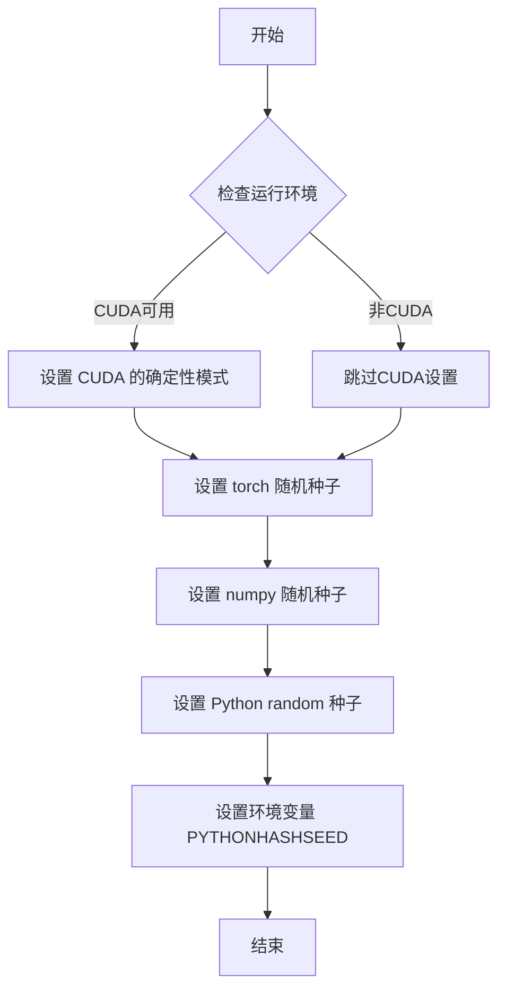
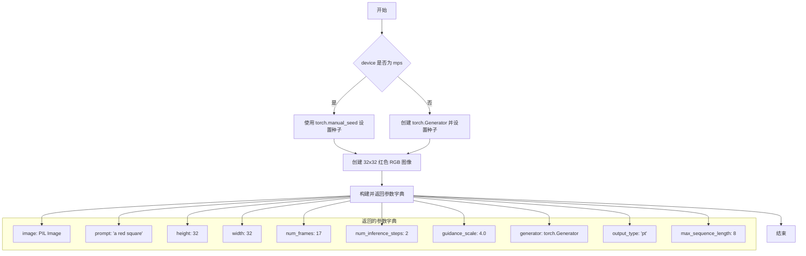
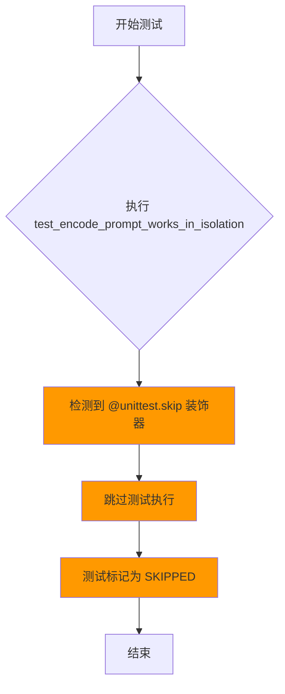
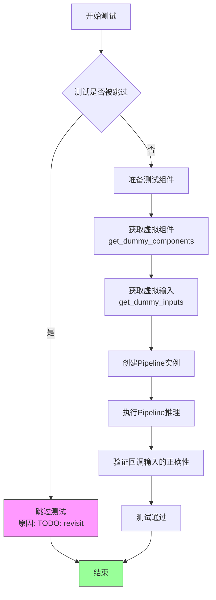
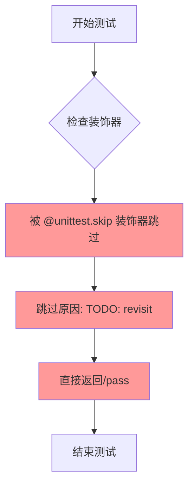

# `diffusers\tests\pipelines\kandinsky5\test_kandinsky5_i2v.py` 详细设计文档

这是Kandinsky5图像到视频生成流水线的单元测试文件，测试了Kandinsky5I2VPipeline的推理功能，包括虚拟组件的创建、虚拟输入的生成、以及视频生成推理的验证。

## 整体流程

```mermaid
graph TD
    A[开始测试] --> B[get_dummy_components]
    B --> C[创建VAE组件]
    B --> D[创建Qwen2.5 VL文本编码器]
    B --> E[创建CLIP文本编码器]
    B --> F[创建Kandinsky5Transformer3DModel]
    B --> G[创建Scheduler]
C --> H[初始化Pipeline实例]
D --> H
E --> H
F --> H
G --> H
H --> I[get_dummy_inputs]
I --> J[创建测试输入参数]
J --> K[调用pipeline执行推理]
K --> L[获取输出frames]
L --> M[验证视频形状: (17, 3, 32, 32)]
M --> N[测试结束]
```

## 类结构

```
PipelineTesterMixin (测试混入基类)
└── Kandinsky5I2VPipelineFastTests (测试类)
    ├── get_dummy_components (方法)
    ├── get_dummy_inputs (方法)
    ├── test_inference (方法)
    ├── test_encode_prompt_works_in_isolation (方法-已跳过)
    ├── test_callback_inputs (方法-已跳过)
    └── test_inference_batch_single_identical (方法-已跳过)
```

## 全局变量及字段


### `Kandinsky5I2VPipelineFastTests.pipeline_class`
    
流水线类引用，指向待测试的Kandinsky5I2VPipeline

类型：`type`
    


### `Kandinsky5I2VPipelineFastTests.batch_params`
    
批处理参数列表，包含prompt和negative_prompt

类型：`list`
    


### `Kandinsky5I2VPipelineFastTests.params`
    
推理参数集合，定义流水线推理时需要的关键参数

类型：`frozenset`
    


### `Kandinsky5I2VPipelineFastTests.required_optional_params`
    
可选必需参数集合，包含可选但测试时常用的参数

类型：`set`
    


### `Kandinsky5I2VPipelineFastTests.test_xformers_attention`
    
xformers注意力测试标志，控制是否测试xformers优化

类型：`bool`
    


### `Kandinsky5I2VPipelineFastTests.supports_optional_components`
    
支持可选组件标志，表示流水线是否支持可选组件

类型：`bool`
    


### `Kandinsky5I2VPipelineFastTests.supports_dduf`
    
DDUF支持标志，表示是否支持DDUF功能

类型：`bool`
    


### `Kandinsky5I2VPipelineFastTests.test_attention_slicing`
    
注意力切片测试标志，控制是否测试注意力切片优化

类型：`bool`
    
    

## 全局函数及方法


### `enable_full_determinism`

该函数用于启用完全确定性测试模式，通过设置全局随机种子和环境变量，确保深度学习模型在测试过程中的所有随机操作（如权重初始化、数据增强、CUDA计算等）均可复现，从而获得稳定一致的测试结果。

参数：无需参数

返回值：`None`，该函数不返回任何值，仅执行全局状态的修改

#### 流程图



#### 带注释源码

```python
# 从 diffusers 库的测试工具模块导入该函数
from diffusers.utils.testing_utils import enable_full_determinism

# 在测试文件开头调用，启用完全确定性测试模式
# 这确保了所有随机操作都是可预测的，使测试结果可复现
enable_full_determinism()
```


### `Kandinsky5I2VPipelineFastTests.get_dummy_components`

该方法用于创建虚拟模型组件，作为测试 `Kandinsky5I2VPipeline` 管道的测试数据。它初始化了一个包含 VAE、文本编码器（Qwen2.5-VL 和 CLIP）、分词器、3D 变换器和调度器的字典，所有组件均使用虚拟的小规模参数，以便在不影响功能的前提下快速执行单元测试。

参数：无

返回值：`Dict[str, Any]`，返回一个包含以下键的字典：
- `vae`：AutoencoderKLHunyuanVideo 实例
- `text_encoder`：Qwen2_5_VLForConditionalGeneration 实例
- `tokenizer`：AutoProcessor 实例
- `text_encoder_2`：CLIPTextModel 实例
- `tokenizer_2`：CLIPTokenizer 实例
- `transformer`：Kandinsky5Transformer3DModel 实例
- `scheduler`：FlowMatchEulerDiscreteScheduler 实例

#### 流程图

```mermaid
flowchart TD
    A[开始 get_dummy_components] --> B[设置随机种子 torch.manual_seed(0)]
    B --> C[创建 AutoencoderKLHunyuanVideo 虚拟 VAE]
    C --> D[创建 FlowMatchEulerDiscreteScheduler 调度器]
    D --> E[设置 qwen_hidden_size = 32]
    E --> F[创建 Qwen2_5_VLConfig 配置]
    F --> G[创建 Qwen2_5_VLForConditionalGeneration 文本编码器]
    G --> H[从预训练模型加载 AutoProcessor 分词器]
    H --> I[设置 clip_hidden_size = 16]
    I --> J[创建 CLIPTextConfig 配置]
    J --> K[创建 CLIPTextModel 第二文本编码器]
    K --> L[从预训练模型加载 CLIPTokenizer 分词器]
    L --> M[创建 Kandinsky5Transformer3DModel 虚拟变换器]
    M --> N[返回包含所有组件的字典]
    N --> O[结束]
```

#### 带注释源码

```python
def get_dummy_components(self):
    """
    创建虚拟模型组件，用于测试 Kandinsky5I2VPipeline。
    所有组件均使用虚拟参数，以便快速执行单元测试。
    """
    # 设置随机种子以确保测试可重复性
    torch.manual_seed(0)
    
    # 创建虚拟 VAE (变分自编码器) 模型
    # 用于将图像编码到潜在空间和从潜在空间解码
    vae = AutoencoderKLHunyuanVideo(
        act_fn="silu",                                    # 激活函数：SiLU
        block_out_channels=[32, 64, 64],                  # 每个分辨率级别的输出通道数
        down_block_types=[                                # 下采样块类型
            "HunyuanVideoDownBlock3D",
            "HunyuanVideoDownBlock3D",
            "HunyuanVideoDownBlock3D",
        ],
        in_channels=3,                                    # 输入通道数（RGB图像为3）
        latent_channels=16,                               # 潜在空间的通道数
        layers_per_block=1,                               # 每个块中的层数
        mid_block_add_attention=False,                    # 中间块是否添加注意力机制
        norm_num_groups=32,                               # 归一化组数
        out_channels=3,                                   # 输出通道数
        scaling_factor=0.476986,                          # 缩放因子
        spatial_compression_ratio=8,                      # 空间压缩比
        temporal_compression_ratio=4,                     # 时间压缩比
        up_block_types=[                                  # 上采样块类型
            "HunyuanVideoUpBlock3D",
            "HunyuanVideoUpBlock3D",
            "HunyuanVideoUpBlock3D",
        ],
    )

    # 创建调度器，用于控制扩散模型的采样过程
    scheduler = FlowMatchEulerDiscreteScheduler(shift=7.0)

    # Qwen2.5-VL 文本编码器配置
    qwen_hidden_size = 32
    torch.manual_seed(0)
    qwen_config = Qwen2_5_VLConfig(
        text_config={
            "hidden_size": qwen_hidden_size,              # 文本隐藏层维度
            "intermediate_size": qwen_hidden_size,        # 前馈层中间维度
            "num_hidden_layers": 2,                       # 隐藏层数量
            "num_attention_heads": 2,                     # 注意力头数
            "num_key_value_heads": 2,                     # KV 头数
            "rope_scaling": {                             # RoPE 缩放配置
                "mrope_section": [2, 2, 4],
                "rope_type": "default",
                "type": "default",
            },
            "rope_theta": 1000000.0,                      # RoPE 基础频率
        },
        vision_config={                                   # 视觉编码器配置
            "depth": 2,                                   # 视觉编码器深度
            "hidden_size": qwen_hidden_size,              # 视觉隐藏层维度
            "intermediate_size": qwen_hidden_size,       # 视觉中间层维度
            "num_heads": 2,                               # 视觉注意力头数
            "out_hidden_size": qwen_hidden_size,         # 输出隐藏层维度
        },
        hidden_size=qwen_hidden_size,                     # 主隐藏层维度
        vocab_size=152064,                                # 词汇表大小
        vision_end_token_id=151653,                      # 视觉结束 token ID
        vision_start_token_id=151652,                     # 视觉开始 token ID
        vision_token_id=151654,                           # 视觉 token ID
    )
    
    # 创建 Qwen2.5-VL 文本编码器模型
    text_encoder = Qwen2_5_VLForConditionalGeneration(qwen_config)
    
    # 加载 Qwen2.5-VL 的处理器（包含分词器和图像处理器）
    tokenizer = AutoProcessor.from_pretrained("hf-internal-testing/tiny-random-Qwen2VLForConditionalGeneration")

    # CLIP 文本编码器配置（作为第二文本编码器）
    clip_hidden_size = 16
    torch.manual_seed(0)
    clip_config = CLIPTextConfig(
        bos_token_id=0,                                   # 句子开始 token ID
        eos_token_id=2,                                   # 句子结束 token ID
        hidden_size=clip_hidden_size,                     # 隐藏层维度
        intermediate_size=16,                             # 前馈层中间维度
        layer_norm_eps=1e-05,                             # LayerNorm epsilon
        num_attention_heads=2,                           # 注意力头数
        num_hidden_layers=2,                             # 隐藏层数量
        pad_token_id=1,                                   # 填充 token ID
        vocab_size=1000,                                  # 词汇表大小
        projection_dim=clip_hidden_size,                  # 投影维度
    )
    
    # 创建 CLIP 文本编码器模型
    text_encoder_2 = CLIPTextModel(clip_config)
    
    # 加载 CLIP 分词器
    tokenizer_2 = CLIPTokenizer.from_pretrained("hf-internal-testing/tiny-random-clip")

    # 创建 Kandinsky5 3D 变换器模型
    torch.manual_seed(0)
    transformer = Kandinsky5Transformer3DModel(
        in_visual_dim=16,                                 # 视觉输入维度
        in_text_dim=qwen_hidden_size,                    # 文本输入维度（Qwen）
        in_text_dim2=clip_hidden_size,                   # 文本输入维度2（CLIP）
        time_dim=16,                                      # 时间嵌入维度
        out_visual_dim=16,                               # 视觉输出维度
        patch_size=(1, 2, 2),                            # 3D 补丁大小
        model_dim=16,                                    # 模型维度
        ff_dim=32,                                       # 前馈层维度
        num_text_blocks=1,                              # 文本块数量
        num_visual_blocks=2,                             # 视觉块数量
        axes_dims=(1, 1, 2),                            # 轴维度
        visual_cond=True,                                # 启用视觉条件
        attention_type="regular",                        # 注意力类型
    )

    # 返回包含所有虚拟组件的字典
    return {
        "vae": vae,                                       # VAE 变分自编码器
        "text_encoder": text_encoder,                     # Qwen2.5-VL 文本编码器
        "tokenizer": tokenizer,                           # Qwen2.5-VL 分词器
        "text_encoder_2": text_encoder_2,                 # CLIP 文本编码器
        "tokenizer_2": tokenizer_2,                        # CLIP 分词器
        "transformer": transformer,                       # Kandinsky5 3D 变换器
        "scheduler": scheduler,                           # 采样调度器
    }
```


### `Kandinsky5I2VPipelineFastTests.get_dummy_inputs`

该方法用于创建虚拟输入参数，为 Kandinsky5I2VPipeline 的单元测试提供必要的输入数据，包括图像、提示词、尺寸、帧数、推理步数等配置信息。

参数：

- `self`：隐式参数，测试类实例本身
- `device`：`str` 或 `torch.device`，指定计算设备（如 "cpu"、"cuda" 等）
- `seed`：`int`，默认值 0，用于设置随机种子以确保测试可复现

返回值：`Dict[str, Any]`，返回一个包含虚拟输入参数的字典，包括图像、提示词、尺寸、帧数、推理步数、引导比例、生成器、输出类型和最大序列长度等

#### 流程图



#### 带注释源码

```python
def get_dummy_inputs(self, device, seed=0):
    """
    创建虚拟输入参数，用于测试 Kandinsky5I2VPipeline
    
    参数:
        device: 计算设备，str 或 torch.device 类型
        seed: 随机种子，默认值为 0，用于确保测试结果可复现
    
    返回:
        包含测试所需所有输入参数的字典
    """
    
    # 根据设备类型选择不同的随机数生成器创建方式
    # MPS (Apple Silicon) 设备使用 torch.manual_seed()
    # 其他设备（如 CPU、CUDA）使用 torch.Generator 并设置种子
    if str(device).startswith("mps"):
        generator = torch.manual_seed(seed)
    else:
        generator = torch.Generator(device=device).manual_seed(seed)

    # 创建一个 32x32 像素的红色 RGB 图像作为测试输入
    # Image.new(mode, size, color) - 创建指定颜色和尺寸的新图像
    image = Image.new("RGB", (32, 32), color="red")

    # 返回包含所有测试所需参数的字典
    return {
        "image": image,                      # 输入图像 (PIL Image)
        "prompt": "a red square",            # 文本提示词
        "height": 32,                        # 生成图像高度
        "width": 32,                         # 生成图像宽度
        "num_frames": 17,                    # 视频帧数
        "num_inference_steps": 2,            # 推理步数
        "guidance_scale": 4.0,               # CFG 引导比例
        "generator": generator,              # 随机数生成器
        "output_type": "pt",                 # 输出类型 (PyTorch tensor)
        "max_sequence_length": 8,            # 最大序列长度
    }
```


### `Kandinsky5I2VPipelineFastTests.test_inference`

该方法是 `Kandinsky5I2VPipelineFastTests` 类的推理测试方法，用于验证 Kandinsky5I2VPipeline 在给定虚拟组件和输入的情况下能够正确执行图像到视频的推理流程，并输出符合预期尺寸的视频帧。

参数：无（仅包含 self）

返回值：`None`，该方法为单元测试方法，通过 `self.assertEqual` 断言验证输出视频的形状是否符合预期，不返回任何值。

#### 流程图

```mermaid
flowchart TD
    A[开始 test_inference 测试] --> B[设置设备为 CPU]
    B --> C[调用 get_dummy_components 获取虚拟组件]
    C --> D[使用虚拟组件实例化 Kandinsky5I2VPipeline]
    D --> E[将管道移至 CPU 设备]
    E --> F[配置进度条设置]
    F --> G[调用 get_dummy_inputs 获取虚拟输入]
    G --> H[执行管道推理: pipe\*\*inputs]
    H --> I[从输出中提取视频帧: output.frames[0]]
    I --> J[断言验证视频形状为 (17, 3, 32, 32)]
    J --> K[测试结束]
```

#### 带注释源码

```python
def test_inference(self):
    # 1. 设置测试设备为 CPU
    device = "cpu"
    
    # 2. 获取虚拟组件（包含 VAE、文本编码器、Transformer、调度器等）
    components = self.get_dummy_components()
    
    # 3. 使用虚拟组件实例化管道对象
    pipe = self.pipeline_class(**components)
    
    # 4. 将管道移至指定设备（CPU）
    pipe.to(device)
    
    # 5. 配置进度条（disable=None 表示不禁用进度条）
    pipe.set_progress_bar_config(disable=None)

    # 6. 获取虚拟输入参数（包含图像、提示词、尺寸、帧数等）
    inputs = self.get_dummy_inputs(device)
    
    # 7. 执行管道推理，传入所有输入参数
    # 返回值包含 frames 属性，其中 frames[0] 为生成的视频
    output = pipe(**inputs)
    
    # 8. 从输出中提取第一个视频帧序列
    video = output.frames[0]

    # 9. 验证输出视频的形状：
    # - 17 帧 (num_frames=17)
    # - 3 通道 (RGB)
    # - 32x32 分辨率 (height=32, width=32)
    self.assertEqual(video.shape, (17, 3, 32, 32))
```


### `Kandinsky5I2VPipelineFastTests.test_encode_prompt_works_in_isolation`

这是一个单元测试方法，用于测试提示编码的隔离功能是否正常工作。该测试目前被跳过（skip），因为测试用例尚未实现完成，仅包含空实现（pass）。

参数：
- `self`：Kandinsky5I2VPipelineFastTests 实例，隐式参数，表示测试类实例本身

返回值：`None`，该方法没有返回值

#### 流程图



#### 带注释源码

```python
@unittest.skip("TODO:Test does not work")
def test_encode_prompt_works_in_isolation(self):
    """
    测试提示编码在隔离环境下的工作状态。
    
    该测试方法原本用于验证 Kandinsky5I2VPipeline 的提示编码功能
    是否能够正确地在隔离环境中运行，不受其他组件的影响。
    
    当前状态：
    - 使用 @unittest.skip 装饰器跳过执行
    - 跳过原因：TODO 标记，测试尚未实现
    - 方法体仅包含 pass 语句，无实际测试逻辑
    
    Args:
        self: Kandinsky5I2VPipelineFastTests 实例
        
    Returns:
        None: 该方法不返回任何值
    """
    pass  # 空实现，等待后续实现测试逻辑
```


### `Kandinsky5I2VPipelineFastTests.test_callback_inputs`

该测试方法用于验证回调输入（callback inputs）在 Kandinsky5I2VPipeline 中的功能，通过检查回调机制是否能正确接收和处理推理过程中的中间状态和张量数据。目前该测试被标记为跳过（TODO: revisit），等待后续重新访问和实现。

参数：

- `self`：无类型（类实例本身），Kandinsky5I2VPipelineFastTests 类的实例，用于访问继承的测试框架方法和类属性

返回值：`None`，该方法为测试方法，不返回任何值

#### 流程图



#### 带注释源码

```python
@unittest.skip("TODO: revisit")
def test_callback_inputs(self):
    """
    测试回调输入功能（callback inputs）。
    
    该测试方法用于验证 Kandinsky5I2VPipeline 的回调机制，
    确保 callback_on_step_end 和 callback_on_step_end_tensor_inputs 
    参数能正确工作，允许用户在推理过程的每个步骤结束后
    访问和修改中间状态。
    
    当前状态：
    - 被 @unittest.skip 装饰器跳过
    - 原因标记为 "TODO: revisit"，表示需要后续重新访问
    - 方法体为空（只有 pass 语句）
    
    测试目的（预期）：
    - 验证回调函数能被正确调用
    - 验证回调能接收正确的张量输入
    - 验证回调修改能影响后续推理步骤
    
    继承关系：
    - 父类: PipelineTesterMixin, unittest.TestCase
    - 测试类: Kandinsky5I2VPipelineFastTests
    
    相关参数（从类属性可知）：
    - callback_on_step_end: 步骤结束回调函数
    - callback_on_step_end_tensor_inputs: 回调接收的张量输入列表
    """
    pass
```


### `Kandinsky5I2VPipelineFastTests.test_inference_batch_single_identical`

这是一个被跳过的批处理一致性测试方法，用于验证批量推理时单张图片的处理结果与单独处理时是否一致。目前该测试因 TODO 原因被暂时跳过。

参数：

- `self`：`unittest.TestCase`，测试类实例本身

返回值：`None`，该方法没有返回值（被跳过）

#### 流程图



#### 带注释源码

```python
@unittest.skip("TODO: revisit")
def test_inference_batch_single_identical(self):
    """
    批处理一致性测试方法。
    
    该方法原本用于测试：
    1. 批量推理时，使用 batch_size=1 的结果
    2. 与单独推理（单张图片）的结果进行一致性比较
    3. 确保模型在批处理和单独处理时输出相同的结果
    
    当前状态：
    - 被 @unittest.skip 装饰器跳过
    - 跳过原因标注为 "TODO: revisit"（需要重新访问）
    - 方法体只有 pass 语句，无实际测试逻辑
    
    Args:
        self: 测试类实例，继承自 unittest.TestCase
        
    Returns:
        None: 该方法不返回任何值
        
    Note:
        这是 PipelineTesterMixin 提供的标准测试方法之一，
        用于验证管道的批处理一致性功能。
    """
    pass
```

## 关键组件


### Kandinsky5I2VPipeline

核心视频生成管道，融合Qwen2.5-VL和CLIP双文本编码器与HunyuanVideo VAE，通过FlowMatchEulerDiscreteScheduler调度实现图像到视频(I2V)的扩散生成。

### AutoencoderKLHunyuanVideo

HunyuanVideo变分自编码器，负责视频潜在空间的压缩与重建，支持3D卷积的空间(8x)和时间(4x)压缩，包含silu激活函数和组归一化。

### FlowMatchEulerDiscreteScheduler

Flow Matching欧拉离散调度器，使用shift=7.0参数控制噪声调度，实现从噪声到数据样本的生成路径。

### Qwen2_5_VLForConditionalGeneration

Qwen2.5视觉语言模型作为主文本编码器，支持多模态输入(文本+图像)，通过rope_theta=1000000.0的高频旋转位置编码和mrope_section=[2,2,4]的多分辨率位置编码处理时序信息。

### CLIPTextModel

CLIP文本编码器作为辅助文本特征提取器，提供projection_dim=16的文本嵌入，与Qwen编码器特征融合后输入Transformer。

### Kandinsky5Transformer3DModel

Kandinsky5三维Transformer骨干网络，支持视觉条件(visual_cond=True)，采用patch_size=(1,2,2)的三维分块策略，融合双文本路径(num_text_blocks=1, num_visual_blocks=2)和多轴维度(axes_dims=(1,1,2))。

### PipelineTesterMixin

测试框架基类，定义了pipeline测试的标准接口，包含批处理参数(batch_params)、推理参数(params)和可选参数(required_optional_params)的规范。

### 图像到视频生成流程

17帧RGB视频(32×32)生成，输入图像经过VAE编码为潜在表示，文本提示经双编码器编码后注入Transformer，通过2步推理(num_inference_steps=2)和guidance_scale=4.0的分类器自由引导生成最终视频。


## 问题及建议


### 已知问题

- **硬编码配置和魔法数字**：多处使用硬编码的数值如`qwen_hidden_size = 32`、`clip_hidden_size = 16`、`seed=0`、`num_frames=17`等，缺乏配置常量或从配置对象中读取，降低了代码的可维护性和可测试性
- **测试覆盖不完整**：存在3个被`@unittest.skip`装饰器跳过的测试方法（`test_encode_prompt_works_in_isolation`、`test_callback_inputs`、`test_inference_batch_single_identical`），标记为TODO但从未实现
- **设备兼容性处理不规范**：使用`if str(device).startswith("mps"):`这种字符串匹配方式检测MPS设备，逻辑脆弱且不优雅
- **测试断言过于简单**：`test_inference`方法仅验证输出张量的形状`(17, 3, 32, 32)`，缺少对输出数值范围、生成器一致性、负向提示词效果等方面的验证
- **外部模型依赖风险**：代码依赖外部预训练模型（`hf-internal-testing/tiny-random-Qwen2VLForConditionalGeneration`、`hf-internal-testing/tiny-random-clip`），如果这些模型不可用将导致测试失败
- **重复初始化代码**：`torch.manual_seed(0)`在多个地方重复调用，增加了维护成本
- **测试开关硬编码**：`test_xformers_attention = False`、`test_attention_slicing = False`、`supports_dduf = False`等配置直接硬编码，缺少注释说明原因
- **缺少文档注释**：类和方法缺乏文档字符串（docstring），代码可读性和可维护性较差

### 优化建议

- **提取配置常量**：将所有硬编码的数值提取为类常量或配置文件，提升可维护性
- **实现跳过的测试**：补充实现被跳过的测试用例，或删除这些空方法以避免代码混淆
- **使用标准设备检测**：采用PyTorch官方的设备检测API（如`device.type == 'mps'`）替代字符串匹配
- **增强测试断言**：添加对输出内容合理性的验证，如检查数值范围、验证生成器确定性等
- **考虑本地模型或Mock**：对于外部模型依赖，考虑使用本地小型模型或Mock对象，提高测试的独立性和稳定性
- **统一随机种子管理**：在测试类初始化时统一设置随机种子，避免重复调用
- **添加文档注释**：为类、主要方法和复杂逻辑添加docstring，提升代码可读性
- **配置注释说明**：为测试开关添加注释说明为何禁用某些功能（如性能考量、功能未实现等）

## 其它


### 设计目标与约束

本测试文件的设计目标是验证 Kandinsky5I2VPipeline 的图像到视频生成功能，确保 pipeline 在给定输入图像和提示词的情况下能够正确生成指定尺寸、帧数的视频内容。核心约束包括：测试仅支持 CPU 设备运行，使用虚拟组件进行单元测试，测试帧数固定为 17 帧，图像尺寸为 32x32，且跳过了多个待实现的测试用例（标记为 TODO）。

### 错误处理与异常设计

测试文件中采用 unittest 框架的标准错误处理机制，通过 `self.assertEqual` 进行结果验证。当视频形状不符合预期时，测试将失败并抛出 AssertionError。代码中的 `@unittest.skip` 装饰器用于跳过暂未实现的测试用例，避免因功能缺失导致测试失败。当前存在两个被跳过的测试：`test_encode_prompt_works_inisolation` 和 `test_inference_batch_single_identical`，均标记为待重新访问。

### 数据流与状态机

测试的数据流从 `get_dummy_inputs()` 开始，生成包含图像、提示词、尺寸参数、帧数、推理步数、引导系数等输入字典。数据流经 `pipeline_class(**components)` 初始化 pipeline，随后通过 `pipe(**inputs)` 执行推理，最终返回包含 `frames` 属性的输出对象。状态机转换路径为：组件初始化 → 输入准备 → Pipeline 执行 → 输出验证。状态转换过程中涉及 VAE 编码、文本编码、多模态变换器处理、调度器迭代等多个状态节点。

### 外部依赖与接口契约

测试依赖于以下核心外部依赖库：PyTorch（张量运算）、PIL（图像处理）、Transformers（CLIP 和 Qwen2.5-VL 模型）、Diffusers（Pipeline 和相关模型组件）。关键接口契约包括：`pipeline_class` 必须接受 vae、text_encoder、tokenizer、text_encoder_2、tokenizer_2、transformer、scheduler 等组件参数；`get_dummy_components()` 必须返回包含上述所有组件的字典；`get_dummy_inputs()` 必须返回符合 Pipeline 签名的输入字典，包含 image、prompt、height、width、num_frames、num_inference_steps、guidance_scale 等必填字段。

### 性能基准与测试覆盖

当前测试覆盖范围包括：单次推理功能测试（test_inference）、虚拟组件构建（get_dummy_components）、输入数据生成（get_dummy_inputs）。测试性能基准较为简单：2 步推理生成 17 帧 32x32 视频。由于使用 CPU 和虚拟组件，测试执行速度较快，但缺乏性能指标（如推理时间、内存占用）的量化记录。测试覆盖率存在缺口：跳过的三个测试用例涉及 prompt 编码隔离性、回调输入、批量推理一致性等重要场景。

### 安全性与合规性

代码包含 Apache License 2.0 许可证声明，符合开源合规要求。测试文件仅使用虚拟模型（通过 `torch.manual_seed(0)` 确保可重复性），不涉及真实用户数据或敏感信息。测试环境通过 `enable_full_determinism()` 启用完全确定性，确保测试结果的可重复性。代码中无外部网络请求（模型加载使用 hf-internal-testing 预训练模型），符合安全测试环境要求。

### 扩展性与未来考虑

当前测试架构支持可选组件（`supports_optional_components = True`），但禁用了 xformers 注意力优化（`test_xformers_attention = False`）和注意力切片（`test_attention_slicing = False`）。Pipeline 设计支持负面提示词（negative_prompt）功能，但在 `get_dummy_inputs()` 中未提供该参数。扩展方向包括：实现跳过的测试用例、添加性能基准测试、增加负面提示词测试覆盖、支持更多输出类型（除 "pt" 外的 numpy、pil 等格式）。

### 集成与部署注意事项

该测试文件作为 Kandinsky5 Pipeline 测试套件的一部分，需与 `PipelineTesterMixin` 配合使用。部署时需确保所有依赖库版本兼容：Transformers 需支持 Qwen2_5_VLForConditionalGeneration，Diffusers 需包含 Kandinsky5I2VPipeline、AutoencoderKLHunyuanVideo、FlowMatchEulerDiscreteScheduler、Kandinsky5Transformer3DModel 等组件。测试执行顺序遵循 unittest 框架默认的字母顺序，CI/CD 集成时需配置适当的超时时间和资源限制。


    