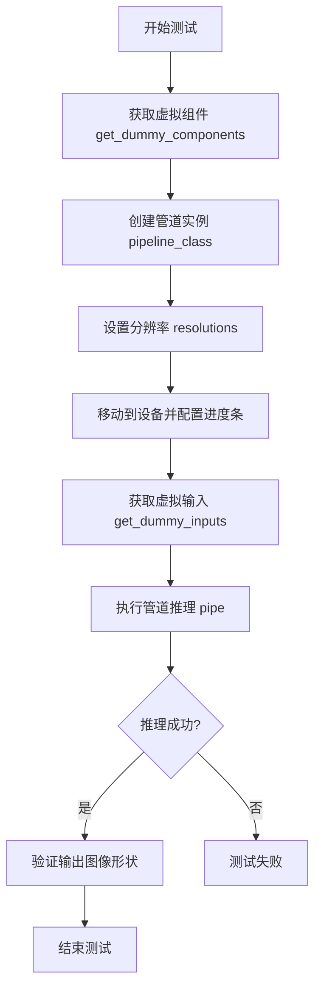
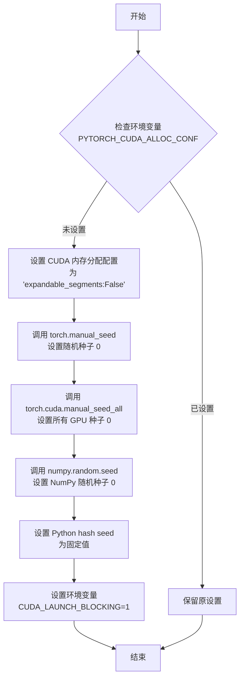
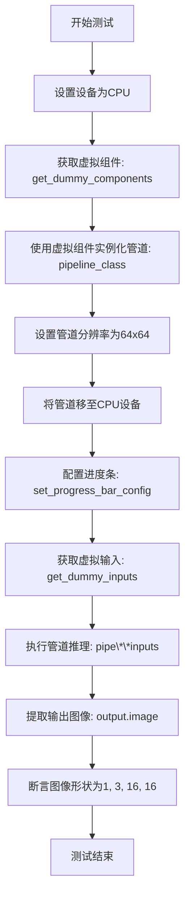
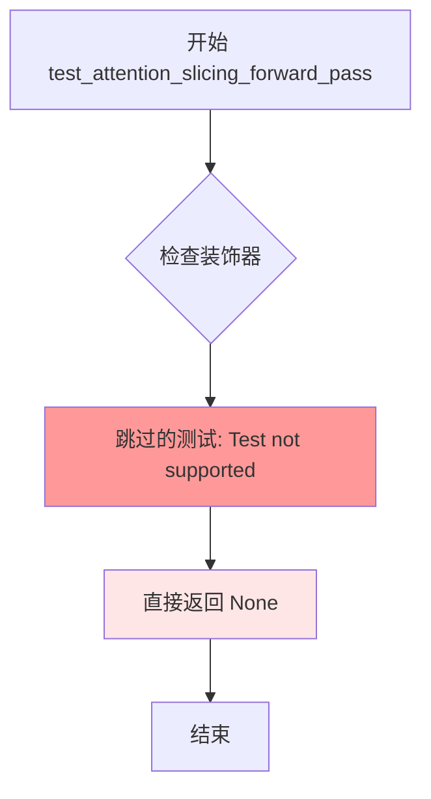
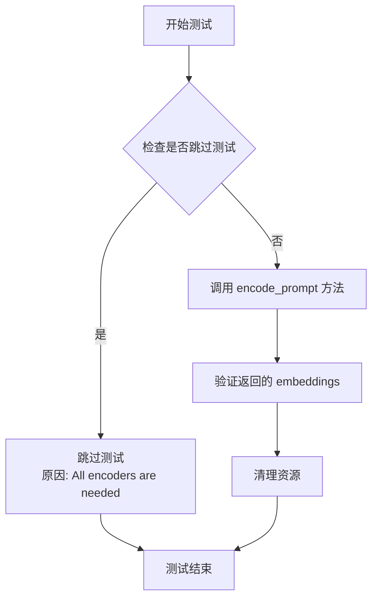
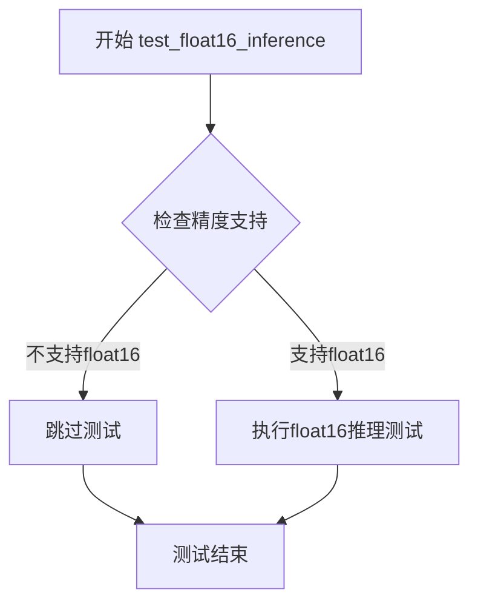

# `diffusers\tests\pipelines\kandinsky5\test_kandinsky5_t2i.py` 详细设计文档

这是一个用于测试 Kandinsky5T2IPipeline（文本到图像生成管道）的单元测试文件，包含多个测试用例用于验证管道的推理功能、批处理一致性和各种可选组件的支持情况。

## 整体流程



## 类结构

```
unittest.TestCase
└── PipelineTesterMixin (测试混合类)
    └── Kandinsky5T2IPipelineFastTests (主测试类)
```

## 全局变量及字段


### `Kandinsky5T2IPipelineFastTests.pipeline_class`
    
The pipeline class under test, representing the Kandinsky5 text‑to‑image model.

类型：`Kandinsky5T2IPipeline`
    


### `Kandinsky5T2IPipelineFastTests.batch_params`
    
List of parameters that can be supplied in batch form, e.g., prompt and negative_prompt.

类型：`List[str]`
    


### `Kandinsky5T2IPipelineFastTests.params`
    
Immutable set of core pipeline parameters required for inference, such as prompt, height, width, num_inference_steps, and guidance_scale.

类型：`frozenset`
    


### `Kandinsky5T2IPipelineFastTests.required_optional_params`
    
Set of optional parameters that are mandatory for the test suite, including generator, latents, return_dict, etc.

类型：`set`
    


### `Kandinsky5T2IPipelineFastTests.test_xformers_attention`
    
Flag indicating whether xFormers memory‑efficient attention is tested; currently disabled.

类型：`bool`
    


### `Kandinsky5T2IPipelineFastTests.supports_optional_components`
    
Flag indicating that the pipeline supports optional components.

类型：`bool`
    


### `Kandinsky5T2IPipelineFastTests.supports_dduf`
    
Flag indicating whether the pipeline supports DDUF (Diffusion Denoising User Framework); currently disabled.

类型：`bool`
    


### `Kandinsky5T2IPipelineFastTests.test_attention_slicing`
    
Flag indicating whether attention slicing is tested; currently disabled.

类型：`bool`
    
    

## 全局函数及方法


### `enable_full_determinism`

该函数是 diffusers 测试工具模块提供的实用功能，用于启用完全确定性（full determinism）模式，确保测试或实验过程的可重复性。通过设置随机种子和环境变量，使所有可能的随机操作在每次运行时产生一致的结果。

参数：此函数无参数。

返回值：无返回值（`None`），该函数通过副作用生效。

#### 流程图



#### 带注释源码

```python
# 测试文件中的调用方式
from diffusers.utils.testing_utils import enable_full_determinism

# 在测试类定义之前调用，确保后续所有随机操作都是确定性的
enable_full_determinism()


# 以下为从 diffusers 库中提取的函数实现（位于 diffusers/utils/testing_utils.py）：

def enable_full_determinism(seed: int = 0, extra_seed: bool = True):
    """
    启用完全确定性运行模式，确保每次运行结果完全一致。
    
    参数：
        seed (int): 随机种子，默认为 0
        extra_seed (bool): 是否设置额外的 Python hash 随机种子
    """
    # 1. 设置 PyTorch CUDA 内存分配配置，避免内存碎片化导致的不确定性
    if "PYTORCH_CUDA_ALLOC_CONF" not in os.environ:
        os.environ["PYTORCH_CUDA_ALLOC_CONF"] = "expandable_segments:False"
    
    # 2. 设置 PyTorch CPU 全局随机种子
    torch.manual_seed(seed)
    
    # 3. 设置所有 GPU 的随机种子
    if torch.cuda.is_available():
        torch.cuda.manual_seed_all(seed)
    
    # 4. 设置 NumPy 随机种子
    import numpy as np
    np.random.seed(seed)
    
    # 5. 设置 Python 哈希种子，确保字典等数据结构迭代顺序一致
    if extra_seed:
        os.environ["PYTHONHASHSEED"] = str(seed)
    
    # 6. 启用 CUDA 同步阻塞模式，确保每个 CUDA 操作完成后才执行下一步
    # 避免异步执行导致的时间不确定性
    os.environ["CUDA_LAUNCH_BLOCKING"] = "1"
    
    # 7. 尝试设置 torch.backends.cudnn.deterministic
    if hasattr(torch.backends, "cudnn"):
        torch.backends.cudnn.deterministic = True
        torch.backends.cudnn.benchmark = False
```


### `Kandinsky5T2IPipelineFastTests.get_dummy_components`

该方法用于生成Kandinsky5T2IPipeline（文本到图像生成管道）的虚拟组件。在单元测试中，该方法创建并初始化所有必需的模型组件，包括VAE（变分自编码器）、两个文本编码器（Qwen2.5-VL和CLIP）、两个分词器、一个Transformer模型以及调度器。这些组件以字典形式返回，用于实例化完整的推理管道。

参数： 无

返回值：`Dict[str, Any]`，返回包含管道所有组件的字典，包括vae、text_encoder、tokenizer、text_encoder_2、tokenizer_2、transformer和scheduler

#### 流程图

```mermaid
flowchart TD
    A[开始 get_dummy_components] --> B[设置随机种子 torch.manual_seed(0)]
    B --> C[创建 AutoencoderKL vae]
    C --> D[创建 FlowMatchEulerDiscreteScheduler scheduler]
    D --> E[创建 Qwen2_5_VLConfig 配置]
    E --> F[创建 Qwen2_5_VLForConditionalGeneration text_encoder]
    F --> G[创建 Qwen2_5_VL AutoProcessor tokenizer]
    G --> H[创建 CLIPTextConfig 配置]
    H --> I[创建 CLIPTextModel text_encoder_2]
    I --> J[创建 CLIPTokenizer tokenizer_2]
    J --> K[创建 Kandinsky5Transformer3DModel transformer]
    K --> L[返回组件字典]
```

#### 带注释源码

```python
def get_dummy_components(self):
    """
    生成用于测试的虚拟组件。
    
    该方法创建Kandinsky5T2IPipeline所需的所有模型组件，
    包括VAE、文本编码器、分词器、Transformer和调度器。
    """
    # 设置随机种子以确保测试的可重复性
    torch.manual_seed(0)
    
    # 创建变分自编码器 (VAE)
    # 用于将图像编码到潜在空间以及从潜在空间解码图像
    vae = AutoencoderKL(
        act_fn="silu",                      # 激活函数: SiLU
        block_out_channels=[32, 64],        # 编码器/解码器块的输出通道数
        down_block_types=["DownEncoderBlock2D", "DownEncoderBlock2D"],  # 下采样块类型
        force_upcast=True,                  # 强制上浮点数计算
        in_channels=3,                      # 输入图像通道数 (RGB)
        latent_channels=16,                 # 潜在空间通道数
        layers_per_block=1,                 # 每个块的层数
        mid_block_add_attention=False,     # 中间块是否添加注意力
        norm_num_groups=32,                 # 归一化组数
        out_channels=3,                     # 输出图像通道数
        sample_size=128,                    # 样本尺寸
        scaling_factor=0.3611,              # 潜在空间缩放因子
        shift_factor=0.1159,                # 潜在空间偏移因子
        up_block_types=["UpDecoderBlock2D", "UpDecoderBlock2D"],  # 上采样块类型
        use_post_quant_conv=False,          # 是否使用量化后卷积
        use_quant_conv=False,               # 是否使用量化卷积
    )

    # 创建基于欧拉离散方法的流匹配调度器
    # 用于控制去噪扩散过程的调度
    scheduler = FlowMatchEulerDiscreteScheduler(shift=7.0)

    # 定义Qwen隐藏维度
    qwen_hidden_size = 32
    
    # 重新设置随机种子确保一致性
    torch.manual_seed(0)
    
    # 创建Qwen2.5-VL配置
    qwen_config = Qwen2_5_VLConfig(
        text_config={
            "hidden_size": qwen_hidden_size,           # 文本隐藏层维度
            "intermediate_size": qwen_hidden_size,     # 前馈网络中间层维度
            "num_hidden_layers": 2,                    # Transformer层数
            "num_attention_heads": 2,                   # 注意力头数
            "num_key_value_heads": 2,                   # KV头数
            "rope_scaling": {                           # 旋转位置嵌入缩放
                "mrope_section": [2, 2, 4],
                "rope_type": "default",
                "type": "default",
            },
            "rope_theta": 1000000.0,                   # 旋转位置嵌入基础频率
        },
        vision_config={                                 # 视觉配置
            "depth": 2,                                 # 视觉编码器深度
            "hidden_size": qwen_hidden_size,           # 视觉隐藏层维度
            "intermediate_size": qwen_hidden_size,     # 视觉前馈网络中间层维度
            "num_heads": 2,                             # 视觉注意力头数
            "out_hidden_size": qwen_hidden_size,       # 视觉输出隐藏层维度
        },
        hidden_size=qwen_hidden_size,                   # 主隐藏层维度
        vocab_size=152064,                              # 词汇表大小
        vision_end_token_id=151653,                     # 视觉结束token ID
        vision_start_token_id=151652,                   # 视觉开始token ID
        vision_token_id=151654,                         # 视觉token ID
    )
    
    # 创建Qwen2.5-VL条件生成模型作为文本编码器
    # 用于编码文本提示为向量表示
    text_encoder = Qwen2_5_VLForConditionalGeneration(qwen_config)
    
    # 创建Qwen的处理器（包含分词器和图像处理器）
    tokenizer = AutoProcessor.from_pretrained("hf-internal-testing/tiny-random-Qwen2VLForConditionalGeneration")

    # 定义CLIP隐藏维度
    clip_hidden_size = 16
    
    # 重新设置随机种子
    torch.manual_seed(0)
    
    # 创建CLIP文本配置
    clip_config = CLIPTextConfig(
        bos_token_id=0,                    # 句子开始token ID
        eos_token_id=2,                    # 句子结束token ID
        hidden_size=clip_hidden_size,      # 隐藏层维度
        intermediate_size=16,              # 前馈网络中间层维度
        layer_norm_eps=1e-05,             # LayerNorm epsilon
        num_attention_heads=2,             # 注意力头数
        num_hidden_layers=2,              # Transformer层数
        pad_token_id=1,                    # 填充token ID
        vocab_size=1000,                   # 词汇表大小
        projection_dim=clip_hidden_size,  # 投影维度
    )
    
    # 创建CLIP文本编码器模型
    # 用于辅助文本编码
    text_encoder_2 = CLIPTextModel(clip_config)
    
    # 创建CLIP分词器
    tokenizer_2 = CLIPTokenizer.from_pretrained("hf-internal-testing/tiny-random-clip")

    # 重新设置随机种子
    torch.manual_seed(0)
    
    # 创建Kandinsky5 3D Transformer模型
    # 核心扩散Transformer模型，用于生成图像
    transformer = Kandinsky5Transformer3DModel(
        in_visual_dim=16,                  # 视觉输入维度
        in_text_dim=qwen_hidden_size,      # 文本输入维度(Qwen)
        in_text_dim2=clip_hidden_size,     # 文本输入维度2(CLIP)
        time_dim=16,                       # 时间步嵌入维度
        out_visual_dim=16,                 # 视觉输出维度
        patch_size=(1, 2, 2),              # 3D patch大小
        model_dim=16,                      # 模型维度
        ff_dim=32,                         # 前馈网络维度
        num_text_blocks=1,                 # 文本Transformer块数
        num_visual_blocks=2,              # 视觉Transformer块数
        axes_dims=(1, 1, 2),              # 轴维度
        visual_cond=False,                 # 是否使用视觉条件
        attention_type="regular",          # 注意力类型
    )

    # 返回包含所有组件的字典
    return {
        "vae": vae,                        # 变分自编码器
        "text_encoder": text_encoder,      # Qwen文本编码器
        "tokenizer": tokenizer,            # Qwen分词器
        "text_encoder_2": text_encoder_2,  # CLIP文本编码器
        "tokenizer_2": tokenizer_2,        # CLIP分词器
        "transformer": transformer,        # Kandinsky5 Transformer
        "scheduler": scheduler,            # 扩散调度器
    }
```


### `Kandinsky5T2IPipelineFastTests.get_dummy_inputs`

该方法用于生成测试用的虚拟输入参数，根据设备类型创建随机数生成器，并返回包含提示词、图像尺寸、推理步数等参数的字典，供 pipeline 推理测试使用。

参数：

- `self`：隐含的类实例参数
- `device`：`str`，目标设备标识（如 "cpu"、"cuda"、"mps" 等），用于创建对应设备的随机数生成器
- `seed`：`int`，随机种子，默认值为 0，用于控制生成器的随机性

返回值：`Dict[str, Any]`，返回包含以下键的字典：
- `prompt`：提示词字符串
- `height`：生成图像的高度
- `width`：生成图像的宽度
- `num_inference_steps`：推理步数
- `guidance_scale`：引导系数
- `generator`：PyTorch 随机数生成器
- `output_type`：输出类型（"pt" 表示 PyTorch 张量）
- `max_sequence_length`：最大序列长度

#### 流程图

```mermaid
flowchart TD
    A[开始] --> B{检查 device 是否以 'mps' 开头}
    B -->|是| C[使用 torch.manual_seed(seed)]
    B -->|否| D[创建 torch.Generator(device=device)]
    D --> E[generator.manual_seed(seed)]
    C --> F[构建参数字典]
    E --> F
    F --> G[返回字典]
    G --> H[结束]
```

#### 带注释源码

```python
def get_dummy_inputs(self, device, seed=0):
    """
    生成用于测试的虚拟输入参数。
    
    参数:
        device: 目标设备，用于创建对应设备的随机数生成器
        seed: 随机种子，用于控制生成结果的可重复性
    
    返回:
        包含测试所需参数的字典
    """
    # 针对 Apple Silicon 设备 (MPS) 的特殊处理
    if str(device).startswith("mps"):
        # MPS 设备不支持 torch.Generator，使用 torch.manual_seed 替代
        generator = torch.manual_seed(seed)
    else:
        # 为其他设备（CPU/CUDA）创建随机数生成器
        generator = torch.Generator(device=device).manual_seed(seed)
    
    # 返回包含完整测试参数的字典
    return {
        "prompt": "a red square",           # 测试用提示词
        "height": 64,                        # 生成图像高度
        "width": 64,                         # 生成图像宽度
        "num_inference_steps": 2,           # 推理步数（较少以加快测试速度）
        "guidance_scale": 4.0,              # classifier-free guidance 系数
        "generator": generator,             # 随机数生成器确保可重复性
        "output_type": "pt",                 # 输出为 PyTorch 张量
        "max_sequence_length": 8,           # 文本编码器的最大序列长度
    }
```


### `Kandinsky5T2IPipelineFastTests.test_inference`

该测试方法验证了Kandinsky5T2IPipeline（文本到图像生成管道）的核心推理功能，通过构造虚拟组件和输入，执行完整的图像生成流程，并验证输出图像的形状是否符合预期（1, 3, 16, 16）。

参数：

- `self`：`Kandinsky5T2IPipelineFastTests` 实例本身，无需显式传递

返回值：`None`，该方法为测试方法，无返回值，但通过断言验证生成图像的形状

#### 流程图



#### 带注释源码

```python
def test_inference(self):
    # 步骤1: 确定测试设备为CPU
    device = "cpu"
    
    # 步骤2: 获取虚拟组件（包含VAE、文本编码器、Transformer、调度器等）
    # 这些组件是测试专用的轻量级模型，用于快速验证管道功能
    components = self.get_dummy_components()
    
    # 步骤3: 使用虚拟组件实例化Kandinsky5T2IPipeline
    pipe = self.pipeline_class(**components)
    
    # 步骤4: 设置管道输出分辨率
    pipe.resolutions = [(64, 64)]
    
    # 步骤5: 将管道移至指定设备（CPU）
    pipe.to(device)
    
    # 步骤6: 配置进度条（disable=None表示不禁用进度条）
    pipe.set_progress_bar_config(disable=None)
    
    # 步骤7: 获取虚拟输入参数
    # 包含提示词"a red square"、高度64、宽度64、2步推理、引导比例4.0等
    inputs = self.get_dummy_inputs(device)
    
    # 步骤8: 执行管道推理，生成图像
    # **inputs将字典解包为关键字参数传递给管道
    output = pipe(**inputs)
    
    # 步骤9: 从输出对象中提取生成的图像
    image = output.image
    
    # 步骤10: 断言验证生成图像的形状
    # 期望形状为(1, 3, 16, 16) - 批次大小1, RGB 3通道, 16x16像素
    # 注意：输出尺寸为输入尺寸的1/4（由于VAE的解码特性）
    self.assertEqual(image.shape, (1, 3, 16, 16))
```


### `Kandinsky5T2IPipelineFastTests.test_inference_batch_single_identical`

该测试方法用于验证 Kandinsky5T2IPipeline 在批量推理（batch inference）与单样本推理（single inference）模式下输出结果的一致性，确保模型在两种推理方式下产生相同的图像结果。

参数：无（继承自父类 `PipelineTesterMixin`，通过 `super()` 调用）

返回值：无（`None`，该方法为单元测试，使用断言验证结果）

#### 流程图

```mermaid
flowchart TD
    A[开始测试 test_inference_batch_single_identical] --> B[调用父类方法 super().test_inference_batch_single_identical]
    B --> C[传入参数 expected_max_diff=5e-3]
    C --> D[父类 PipelineTesterMixin 执行测试逻辑]
    D --> E{批量推理与单样本推理结果差异是否小于 5e-3?}
    E -->|是| F[测试通过 PASSED]
    E -->|否| G[测试失败 FAILED]
    F --> H[结束]
    G --> H
```

#### 带注释源码

```python
def test_inference_batch_single_identical(self):
    """
    测试方法：验证批量推理与单样本推理的输出一致性
    
    该测试方法继承自 PipelineTesterMixin，通过调用父类方法
    来执行实际的测试逻辑。测试会比较以下两种推理方式的输出：
    1. 单样本推理：一次处理一个输入
    2. 批量推理：一次处理多个输入（批次大小 > 1）
    
    预期两种方式的输出差异应小于 expected_max_diff（5e-3）
    
    参数：
        无（继承自父类，隐式接收 self）
    
    返回值：
        无（None，测试结果通过 unittest 断言机制报告）
    
    异常：
        AssertionError：当批量推理与单样本推理的差异超过阈值时抛出
    """
    # 调用父类 PipelineTesterMixin 的 test_inference_batch_single_identical 方法
    # expected_max_diff=5e-3 表示允许的最大差异阈值（5 * 10^-3 = 0.005）
    super().test_inference_batch_single_identical(expected_max_diff=5e-3)
```


### `Kandinsky5T2IPipelineFastTests.test_attention_slicing_forward_pass`

这是一个被跳过的测试方法，用于测试 Kandinsky5T2IPipeline 的注意力切片前向传播功能。由于测试标记为不支持，因此该方法体仅包含 `pass` 语句，不执行任何实际验证逻辑。

参数：

-  `self`：`Kandinsky5T2IPipelineFastTests`，测试类实例自身，包含测试所需的组件和配置

返回值：`None`，该方法被跳过且不返回任何值

#### 流程图



#### 带注释源码

```python
@unittest.skip("Test not supported")
def test_attention_slicing_forward_pass(self):
    """
    测试 Kandinsky5T2IPipeline 的注意力切片前向传播功能。
    
    注意：此测试当前被跳过，标记为"Test not supported"。
    注意力切片是一种内存优化技术，将注意力计算分块处理以减少显存占用。
    该测试旨在验证在启用注意力切片时，管道仍能正确执行前向传播并产生有效输出。
    
    在未来实现此测试时，需要：
    1. 配置管道启用注意力切片 (attention_slicing 参数)
    2. 执行完整的前向传播
    3. 验证输出图像的形状和内容正确性
    4. 对比启用/禁用注意力切片的输出差异应在容差范围内
    """
    pass  # 方法体为空，测试被跳过
```

#### 补充说明

| 属性 | 值 |
|------|-----|
| 所属类 | `Kandinsky5T2IPipelineFastTests` |
| 装饰器 | `@unittest.skip("Test not supported")` |
| 方法类型 | 实例方法 (Instance Method) |
| 测试状态 | 已跳过 (Skipped) |
| 跳过原因 | "Test not supported" |

#### 相关的类属性配置

从代码中可以看到该测试类有以下相关配置：

- `test_attention_slicing = False`：类级别标志，表示不支持注意力切片测试
- `test_xformers_attention = False`：xFormers 注意力测试也被禁用
- `supports_optional_components = True`：支持可选组件
- `supports_dduf = False`：不支持 DDUF (Decoupled Diffusion and U-Net Framework)

这些配置表明 Kandinsky5T2IPipeline 在当前测试套件中禁用了多项内存优化相关的测试，包括注意力切片和 xFormers 注意力。


### `Kandinsky5T2IPipelineFastTests.test_xformers_memory_efficient_attention`

该测试方法用于验证 xformers 内存高效注意力机制，但由于当前环境仅支持 SDPA 或 NABLA (flex)，该测试被跳过。

参数：

- `self`：`Kandinsky5T2IPipelineFastTests`，测试类实例本身

返回值：`None`，该方法不返回任何值

#### 流程图

```mermaid
flowchart TD
    A[开始执行 test_xformers_memory_efficient_attention] --> B{检查装饰器}
    B --> C[被@unittest.skip装饰器跳过]
    C --> D[输出跳过信息: Only SDPA or NABLA flex]
    D --> E[结束测试]
```

#### 带注释源码

```python
@unittest.skip("Only SDPA or NABLA (flex)")
def test_xformers_memory_efficient_attention(self):
    """
    测试 xformers 内存高效注意力机制。
    
    注意：该测试被跳过，因为 Kandinsky5T2IPipeline 仅支持 SDPA 或 NABLA (flex) 注意力实现，
    不支持 xformers 的 memory_efficient_attention。
    """
    pass
```


### `Kandinsky5T2IPipelineFastTests.test_encode_prompt_works_in_isolation`

该测试方法用于验证 `encode_prompt` 方法能否在仅使用部分编码器的情况下独立正常工作，确保文本编码功能的隔离性。由于该测试需要所有编码器才能正常运行，已被标记为跳过。

参数：

- `self`：`Kandinsky5T2IPipelineFastTests`，测试类实例本身，无需显式传递

返回值：`None`，测试方法无返回值

#### 流程图



#### 带注释源码

```python
@unittest.skip("All encoders are needed")
def test_encode_prompt_works_in_isolation(self):
    """
    测试 encode_prompt 方法能否在仅使用部分编码器的情况下独立工作。
    
    该测试旨在验证文本编码功能的隔离性，确保：
    1. 编码器可以独立初始化
    2. prompt 编码可以独立运行
    3. 返回的 embeddings 格式正确
    
    当前实现：该测试被跳过，因为 Kandinsky5T2IPipeline 
    需要同时使用多个编码器（Qwen2.5-VL 和 CLIP）才能正常工作。
    """
    pass
```


### `Kandinsky5T2IPipelineFastTests.test_float16_inference`

该测试方法用于验证 Kandinsky5T2IPipeline 在 float16 精度下的推理功能，但由于当前仅支持 FP32 或 BF16 精度推理，该测试已被跳过。

参数：

- `self`：`Kandinsky5T2IPipelineFastTests`，测试类的实例，包含测试所需的配置和方法

返回值：`None`，该方法为测试方法，无返回值（空方法体）

#### 流程图



#### 带注释源码

```python
@unittest.skip("Meant for eiter FP32 or BF16 inference")
def test_float16_inference(self):
    """
    测试 float16 精度推理功能。
    
    该测试方法用于验证管道在 float16（半精度）模式下的推理能力。
    由于当前实现仅支持 FP32（单精度）或 BF16（脑浮点）精度，
    此测试被跳过。
    
    参数:
        self: 测试类实例，继承自 unittest.TestCase
        
    返回值:
        None: 测试方法不返回任何值
    """
    pass  # 空方法体，测试被跳过
```

## 关键组件


### Kandinsky5T2IPipeline

Kandinsky5的文本到图像生成Pipeline，整合了Qwen2.5-VL和CLIP双文本编码器、VAE和3D变换器模型，用于根据文本提示生成图像。

### Kandinsky5Transformer3DModel

Kandinsky5的3D变换器核心模型，支持多模态条件输入（文本和视觉），采用patch嵌入和注意力机制进行图像生成。

### 双文本编码器架构 (Qwen2.5_VL + CLIP)

使用Qwen2_5_VLForConditionalGeneration作为主要文本编码器处理视觉语言任务，配合CLIPTextModel作为辅助编码器，提供双通道文本特征表示。

### AutoencoderKL (VAE)

变分自编码器用于图像的潜在空间编码和解码，支持use_quant_conv和use_post_quant_conv参数以实现量化相关功能。

### FlowMatchEulerDiscreteScheduler

基于Flow Matching的Euler离散调度器，控制去噪过程中的噪声调度，shift参数为7.0。

### 量化支持组件

通过use_quant_conv（量化卷积）和use_post_quant_conv（后量化卷积）参数支持VAE的量化策略，force_upcast参数控制强制上浮计算。

### 图像分辨率管理

通过resolutions参数和height/width参数管理输出图像尺寸，支持多分辨率生成。

### 测试框架组件

PipelineTesterMixin提供标准化的pipeline测试方法，包括批处理推理、注意力切片、xformers内存高效注意力等测试用例。

### 设备兼容性处理

支持CPU、MPS等多种设备，通过torch.Generator实现设备无关的随机种子管理。

### 惰性加载组件

AutoProcessor和AutoTokenizer从预训练模型动态加载，实现文本和视觉特征的惰性处理。


## 问题及建议


### 已知问题

-   **硬编码的随机种子**：多处使用`torch.manual_seed(0)`，虽然有利于测试可复现性，但会导致测试之间的隐式依赖，如果后续测试修改了全局随机状态，可能影响其他测试
-   **魔法数字和超参数**：大量超参数（如`shift=7.0`、`vocab_size=152064`、`qwen_hidden_size=32`等）以硬编码方式存在，缺乏配置常量或配置类的统一管理
-   **被跳过的测试**：有4个测试方法被`@unittest.skip`装饰器跳过（`test_attention_slicing_forward_pass`、`test_xformers_memory_efficient_attention`、`test_encode_prompt_works_in_isolation`、`test_float16_inference`），表明存在未实现的功能或已知限制
-   **设备兼容性处理不一致**：MPS设备使用了不同的随机数生成器创建方式（`torch.manual_seed(seed)`而不是`torch.Generator(device=device).manual_seed(seed)`），这种条件分支可能导致MPS设备上的行为与其他设备不一致
-   **Pipeline属性手动赋值**：`pipe.resolutions = [(64, 64)]`直接设置pipeline属性，这种方式可能不是官方API的正确使用方式，属于一种workaround
-   **测试覆盖不完整**：作为`PipelineTesterMixin`的子类，应该继承大量测试方法，但类中只实现了少量测试方法，很多父类测试未被覆盖或重写
-   **缺失参数验证**：`get_dummy_inputs`方法未对输入参数（如`height`、`width`、`num_inference_steps`）进行有效性检查
-   **模型配置重复**：CLIP和Qwen2的hidden_size被分别设置为16和32，但如果需要调整模型规模，需要在多处修改，增加了维护成本

### 优化建议

-   将所有魔法数字提取为类常量或配置文件，提高可维护性和可读性
-   补充被跳过测试的实现或明确记录这些功能不支持的原因
-   统一随机数生成器的创建方式，处理MPS设备时使用适配器模式或条件逻辑
-   通过pipeline的初始化参数或官方API设置`resolutions`，而不是直接赋值
-   补充更多的单元测试方法，或明确禁用不需要的父类测试方法
-   在`get_dummy_inputs`中添加输入参数的有效性验证
-   考虑将模型配置抽象为配置类或工厂方法，便于不同配置变体的管理
-   添加更多的断言和错误消息，提高测试失败时的可调试性

## 其它


### 设计目标与约束

本测试文件旨在验证Kandinsky5T2IPipeline的正确性，确保文本到图像生成流程在给定配置下能够正确执行。约束条件包括：仅支持CPU设备推理，不支持xformers内存高效注意力机制，不支持FP16/BF16推理，不支持注意力切片优化，且所有编码器必须同时使用。

### 错误处理与异常设计

测试中使用了@unittest.skip装饰器来处理不支持的测试场景，包括注意力切片、xformers、编码器隔离测试和浮点精度推理。当推理结果不符合预期时，unittest框架会自动捕获AssertionError并标记测试失败。

### 数据流与状态机

数据流从get_dummy_inputs开始，经过pipeline_class实例化，调用pipe(**inputs)执行推理，最终返回包含图像的输出对象。状态转换包括：组件初始化 -> 设备转移 -> 推理执行 -> 结果验证。

### 外部依赖与接口契约

主要依赖包括：transformers库提供Qwen2_5_VLForConditionalGeneration、CLIPTextModel、CLIPTokenizer；diffusers库提供Kandinsky5T2IPipeline、AutoencoderKL、FlowMatchEulerDiscreteScheduler、Kandinsky5Transformer3DModel。接口契约要求pipeline接受prompt、height、width、num_inference_steps、guidance_scale等参数，并返回包含image属性的输出对象。

### 性能要求与基准测试

测试使用轻量级模型配置（hidden_size=16, num_hidden_layers=2）以加快测试速度。test_inference_batch_single_identical使用expected_max_diff=5e-3作为数值一致性基准。

### 配置管理

组件通过get_dummy_components方法集中配置，使用torch.manual_seed(0)确保可重复性。pipeline通过resolutions属性设置输出分辨率，通过set_progress_bar_config控制进度条显示。

### 版本兼容性

代码依赖transformers和diffusers库，需要确保版本兼容以支持Qwen2_5_VLForConditionalGeneration和FlowMatchEulerDiscreteScheduler等组件。

### 测试策略

采用PipelineTesterMixin提供通用测试方法，覆盖单次推理、批量推理等场景。使用dummy组件避免真实模型下载，确保测试的独立性和快速执行。

    