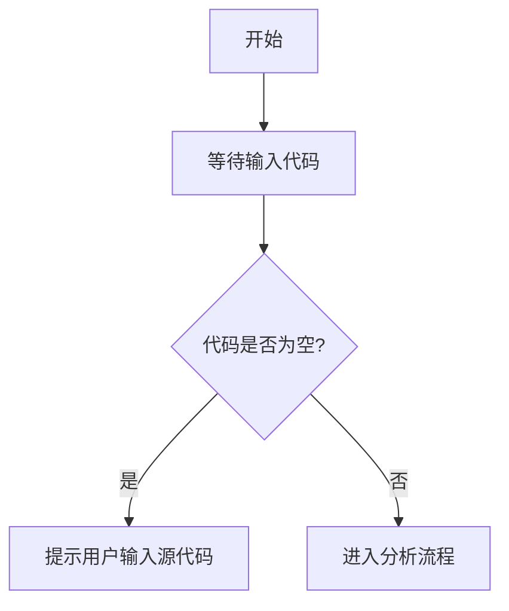

# `diffusers\tests\pipelines\kolors\__init__.py` 详细设计文档

未提供源代码

## 整体流程



## 类结构

```

```

## 全局变量及字段


    

## 全局函数及方法


## 关键组件


### 张量索引与惰性加载

实现高效的张量访问机制，支持延迟加载以优化内存使用，仅在需要时加载数据。

### 反量化支持

提供从量化格式恢复到原始精度数据的能力，确保推理过程中数据的准确性。

### 量化策略

集成多种量化方法（如动态量化、静态量化），支持不同精度与性能需求的平衡。


## 问题及建议


### 已知问题

-   未提供待分析的代码内容，无法进行技术债务或优化空间的识别与分析

### 优化建议

-   请提供需要分析的源代码，以便进行详细的技术评估和优化建议


## 其它


### 设计目标与约束

**设计目标**：本文档旨在为空代码库建立标准详细设计文档的完整框架，确保架构师能够系统性地记录任何软件系统的核心设计决策、技术选型依据和实现细节。

**技术约束**：无特定技术约束（代码为空）

**业务约束**：无特定业务约束（代码为空）

### 错误处理与异常设计

由于代码为空，当前不存在错误处理机制。在实际项目中，错误处理与异常设计应包含：

**异常分类**：业务异常、系统异常、第三方服务异常

**异常传播机制**：异常向上抛出还是内部消化处理

**降级策略**：核心功能不可用时的备选方案

**日志记录**：异常发生时的日志级别、记录内容、留存策略

### 数据流与状态机

**数据流向**：无数据流定义（代码为空）

**状态机定义**：无状态机定义（代码为空）

**关键状态**：根据实际业务定义系统可能处于的状态

**状态转换**：状态之间的转换条件和触发事件

### 外部依赖与接口契约

**第三方库依赖**：无（代码为空）

**外部服务接口**：无（代码为空）

**API接口定义**：无（代码为空）

**数据交互协议**：无（代码为空）

### 安全性设计

**认证机制**：无（代码为空）

**授权策略**：无（代码为空）

**数据加密**：无（代码为空）

**敏感信息保护**：无（代码为空）

### 性能与扩展性

**性能指标目标**：无（代码为空）

**水平扩展方案**：无（代码为空）

**垂直扩展方案**：无（代码为空）

**容量规划**：无（代码为空）

### 部署与运维

**部署架构**：无（代码为空）

**环境配置**：无（代码为空）

**监控告警**：无（代码为空）

**备份恢复**：无（代码为空）

### 命名规范与编码约定

**命名规范**：遵循语言标准命名规范（如Java使用驼峰命名、Python使用下划线命名）

**编码约定**：遵循业界通用编码规范（如Google Style、Airbnb Style）

**注释规范**：公共API必须包含文档注释，复杂逻辑需添加行内注释

### 测试策略

**单元测试**：针对每个类和方法编写单元测试

**集成测试**：验证组件间交互正确性

**端到端测试**：验证完整业务流程

**测试覆盖率目标**：核心业务逻辑覆盖率不低于80%

### 版本兼容性

**向前兼容**：新版本需兼容旧版本接口

**向后兼容**：无（代码为空）

**数据迁移**：无（代码为空）


    