# `diffusers\tests\pipelines\kolors\test_kolors.py` 详细设计文档

这是一个KolorsPipeline的单元测试文件，用于验证文本到图像生成模型的功能正确性，包含推理测试、保存加载测试、浮点精度测试和批处理一致性测试。

## 整体流程

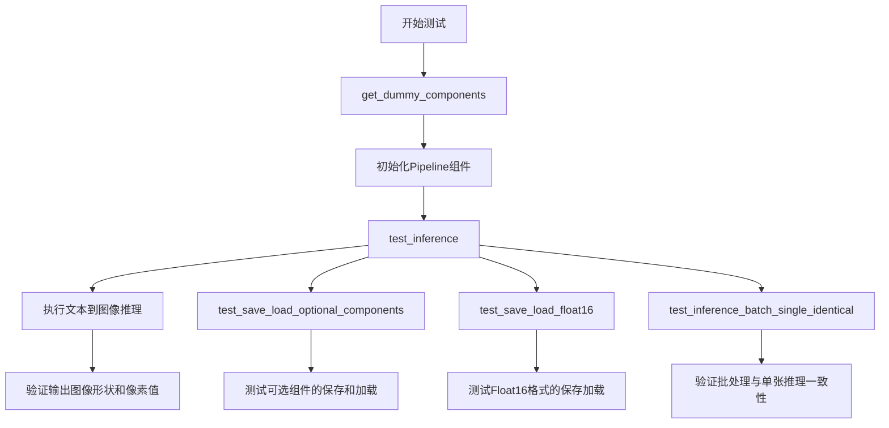

## 类结构

```
KolorsPipelineFastTests (unittest.TestCase)
├── pipeline_class: 类属性 - Pipeline类型
├── params: 类属性 - 文本到图像参数
├── batch_params: 类属性 - 批处理参数
├── image_params: 类属性 - 图像参数
├── image_latents_params: 类属性 - 潜在空间参数
├── callback_cfg_params: 类属性 - 回调配置参数
├── supports_dduf: 类属性 - DDUF支持标志
├── test_layerwise_casting: 类属性 - 层wise类型转换测试标志
├── get_dummy_components: 方法 - 创建虚拟组件
├── get_dummy_inputs: 方法 - 创建虚拟输入
├── test_inference: 方法 - 推理测试
├── test_save_load_optional_components: 方法 - 保存加载可选组件测试
├── test_save_load_float16: 方法 - Float16保存加载测试
└── test_inference_batch_single_identical: 方法 - 批处理一致性测试
```

## 全局变量及字段


### `np`
    
NumPy库，用于数值计算和数组操作

类型：`module`
    


### `torch`
    
PyTorch库，用于深度学习模型构建和计算

类型：`module`
    


### `AutoencoderKL`
    
VAE变分自编码器，用于图像的编码和解码

类型：`class`
    


### `EulerDiscreteScheduler`
    
欧拉离散调度器，用于扩散模型的噪声调度

类型：`class`
    


### `KolorsPipeline`
    
Kolors文本到图像Pipeline，实现文本生成图像功能

类型：`class`
    


### `UNet2DConditionModel`
    
条件UNet2D模型，用于扩散过程中的图像去噪

类型：`class`
    


### `ChatGLMModel`
    
ChatGLM文本编码器模型，用于将文本转换为嵌入向量

类型：`class`
    


### `ChatGLMTokenizer`
    
ChatGLM分词器，用于文本的分词和编码

类型：`class`
    


### `enable_full_determinism`
    
启用完全确定性函数，确保测试结果可复现

类型：`function`
    


### `KolorsPipelineFastTests.pipeline_class`
    
Pipeline类引用，指向KolorsPipeline

类型：`class`
    


### `KolorsPipelineFastTests.params`
    
文本到图像生成参数，包含推理所需的配置

类型：`tuple`
    


### `KolorsPipelineFastTests.batch_params`
    
批处理参数，用于批量生成图像的配置

类型：`tuple`
    


### `KolorsPipelineFastTests.image_params`
    
图像参数，定义图像相关的配置

类型：`tuple`
    


### `KolorsPipelineFastTests.image_latents_params`
    
潜在空间参数，用于潜在空间图像处理的配置

类型：`tuple`
    


### `KolorsPipelineFastTests.callback_cfg_params`
    
回调配置参数集合，包含额外嵌入和时间ID等回调参数

类型：`set`
    


### `KolorsPipelineFastTests.supports_dduf`
    
是否支持DDUF，决定是否启用DDUF功能

类型：`bool`
    


### `KolorsPipelineFastTests.test_layerwise_casting`
    
是否测试层wise类型转换，用于验证模型层的类型转换

类型：`bool`
    
    

## 全局函数及方法


### `enable_full_determinism`

该函数用于启用测试的完全确定性，通过设置全局随机种子和环境变量，确保每次运行测试时得到相同的随机结果，从而使测试具有可重复性和确定性。

参数：该函数不接受任何显式参数。

返回值：`None`，该函数主要通过副作用生效，不返回任何值。

#### 流程图

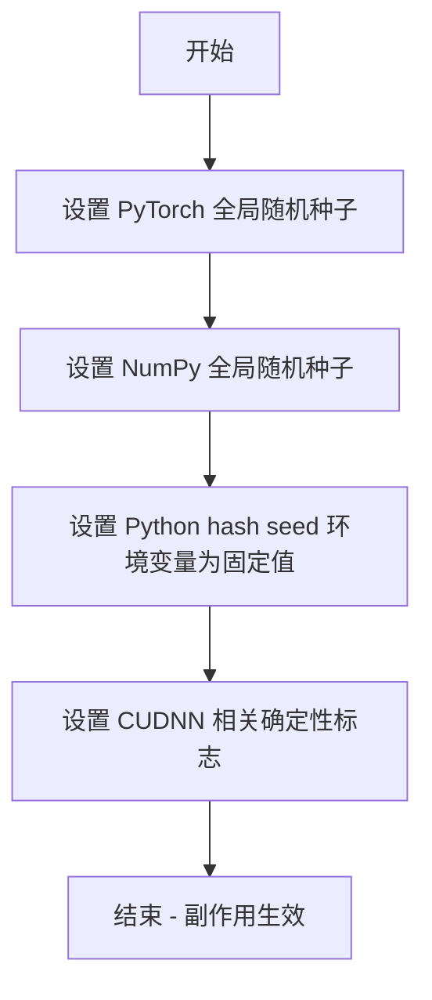

#### 带注释源码

```python
# 从 testing_utils 模块导入 enable_full_determinism 函数
# 该函数定义在 diffusers/testing_utils.py 中
from ...testing_utils import enable_full_determinism

# 在测试类定义之前调用该函数
# 作用：全局启用确定性模式，确保所有随机操作可复现
enable_full_determinism()

# 此后所有 PyTorch、NumPy 等库的随机操作都将产生确定性结果
# 便于测试用例的稳定性和可重复性验证

class KolorsPipelineFastTests(PipelineTesterMixin, unittest.TestCase):
    # ... 测试类定义
```


### `KolorsPipelineFastTests.get_dummy_components()`

该方法用于在 KolorsPipeline 单元测试中创建虚拟（dummy）模型组件，包括 UNet2DConditionModel（条件扩散模型）、EulerDiscreteScheduler（调度器）、AutoencoderKL（VAE 编码器-解码器）、ChatGLMModel（文本编码器）和 ChatGLMTokenizer（分词器），并将这些组件组装成字典返回，以供 Pipeline 推理测试使用。

参数：

- `time_cond_proj_dim`：`Optional[int]`，可选参数，用于指定 UNet 模型的时间条件投影维度，默认为 None（使用模型内部默认值）

返回值：`Dict[str, Any]`，返回一个包含虚拟模型组件的字典，键名为组件名称（如 "unet"、"scheduler"、"vae"、"text_encoder"、"tokenizer" 等），键值为对应的模型实例或 None

#### 流程图

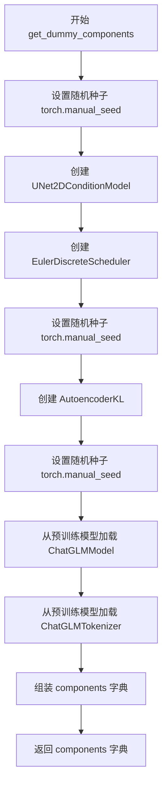

#### 带注释源码

```python
def get_dummy_components(self, time_cond_proj_dim=None):
    """
    创建用于测试的虚拟模型组件。
    
    参数:
        time_cond_proj_dim: 可选参数，指定UNet的时间条件投影维度
    
    返回:
        包含所有Pipeline组件的字典
    """
    # 设置随机种子，确保测试结果可复现
    torch.manual_seed(0)
    
    # 创建虚拟 UNet2DConditionModel（条件扩散模型）
    # 用于图像生成的去噪过程
    unet = UNet2DConditionModel(
        block_out_channels=(2, 4),           # UNet 编码器/解码器的通道数
        layers_per_block=2,                   # 每个分辨率级别的层数
        time_cond_proj_dim=time_cond_proj_dim,# 时间条件投影维度
        sample_size=32,                       # 输入/输出样本的空间尺寸
        in_channels=4,                        # 输入通道数（Latent空间）
        out_channels=4,                       # 输出通道数
        down_block_types=("DownBlock2D", "CrossAttnDownBlock2D"),  # 下采样块类型
        up_block_types=("CrossAttnUpBlock2D", "UpBlock2D"),        # 上采样块类型
        attention_head_dim=(2, 4),            # 注意力头维度
        use_linear_projection=True,           # 使用线性投影
        addition_embed_type="text_time",      # 额外嵌入类型（文本+时间）
        addition_time_embed_dim=8,            # 时间嵌入维度
        transformer_layers_per_block=(1, 2),  # Transformer层数
        projection_class_embeddings_input_dim=56,  # 类别嵌入输入维度
        cross_attention_dim=8,                # 交叉注意力维度
        norm_num_groups=1,                   # 组归一化组数
    )
    
    # 创建离散欧拉调度器（Euler Discrete Scheduler）
    # 控制扩散模型的采样去噪步骤
    scheduler = EulerDiscreteScheduler(
        beta_start=0.00085,                   # Beta 起始值
        beta_end=0.012,                       # Beta 结束值
        steps_offset=1,                      # 步骤偏移量
        beta_schedule="scaled_linear",        # Beta 调度策略
        timestep_spacing="leading",           # 时间步间隔策略
    )
    
    # 重新设置随机种子，确保VAE初始化可复现
    torch.manual_seed(0)
    
    # 创建虚拟 AutoencoderKL（变分自编码器）
    # 用于将图像编码到潜在空间和解码回图像空间
    vae = AutoencoderKL(
        block_out_channels=[32, 64],         # VAE 通道数
        in_channels=3,                       # 输入图像通道（RGB）
        out_channels=3,                      # 输出图像通道
        down_block_types=["DownEncoderBlock2D", "DownEncoderBlock2D"],  # 下采样编码块
        up_block_types=["UpDecoderBlock2D", "UpDecoderBlock2D"],        # 上采样解码块
        latent_channels=4,                   # 潜在空间通道数
        sample_size=128,                      # 样本尺寸
    )
    
    # 重新设置随机种子，确保文本编码器加载可复现
    torch.manual_seed(0)
    
    # 从预训练模型加载虚拟 ChatGLMModel（文本编码器）
    # 用于将文本提示编码为文本嵌入向量
    text_encoder = ChatGLMModel.from_pretrained(
        "hf-internal-testing/tiny-random-chatglm3-6b",  # HuggingFace 测试模型路径
        torch_dtype=torch.float32,             # 使用32位浮点精度
    )
    
    # 加载虚拟 ChatGLMTokenizer（文本分词器）
    # 用于将文本字符串分词为token ID序列
    tokenizer = ChatGLMTokenizer.from_pretrained(
        "hf-internal-testing/tiny-random-chatglm3-6b"
    )

    # 组装所有组件到字典中
    components = {
        "unet": unet,                         # UNet条件扩散模型
        "scheduler": scheduler,               # 采样调度器
        "vae": vae,                          # VAE编解码器
        "text_encoder": text_encoder,        # 文本编码器
        "tokenizer": tokenizer,              # 文本分词器
        "image_encoder": None,               # 图像编码器（可选，设为None）
        "feature_extractor": None,           # 特征提取器（可选，设为None）
    }
    
    return components
```


### `KolorsPipelineFastTests.get_dummy_inputs`

该方法用于为 KolorsPipeline 推理测试创建虚拟输入数据，封装了提示词、随机数生成器、推理步数、引导系数和输出类型等关键参数，以支持可重复的确定性测试。

参数：

- `device`：`torch.device` 或 str，目标设备（如 "cpu"、"cuda"、"mps"），用于创建随机数生成器
- `seed`：`int`，随机种子，默认值为 0，用于确保测试结果可复现

返回值：`Dict[str, Any]`，包含以下键的字典：
- `prompt`：`str`，输入文本提示
- `generator`：`torch.Generator`，随机数生成器实例
- `num_inference_steps`：`int`，推理步数
- `guidance_scale`：`float`，分类器自由引导（CFG）系数
- `output_type`：`str`，输出格式类型

#### 流程图

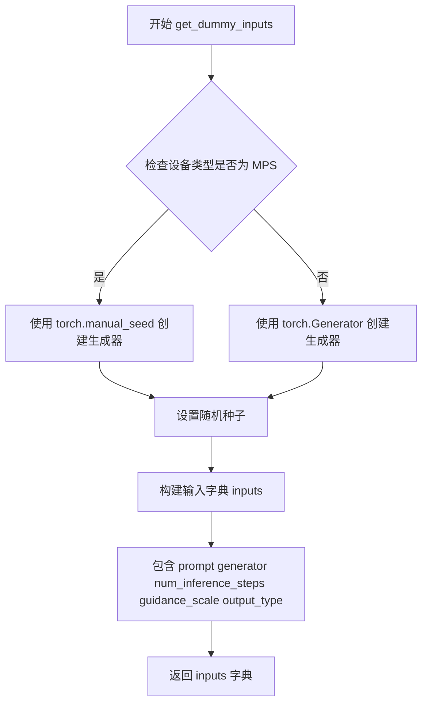

#### 带注释源码

```python
def get_dummy_inputs(self, device, seed=0):
    """
    为 KolorsPipeline 测试创建虚拟输入参数
    
    参数:
        device: 目标设备，用于创建随机数生成器
        seed: 随机种子，确保测试可重复性
    
    返回:
        包含推理所需参数的字典
    """
    # 判断设备是否为 MPS (Apple Silicon)
    if str(device).startswith("mps"):
        # MPS 设备使用 CPU 风格的随机种子
        generator = torch.manual_seed(seed)
    else:
        # 其他设备（CPU/CUDA）使用设备特定的生成器
        generator = torch.Generator(device=device).manual_seed(seed)
    
    # 构建测试输入参数字典
    inputs = {
        "prompt": "A painting of a squirrel eating a burger",  # 测试用提示词
        "generator": generator,  # 随机数生成器，确保可复现
        "num_inference_steps": 2,  # 简化的推理步数，加快测试速度
        "guidance_scale": 5.0,  # CFG 引导系数
        "output_type": "np",  # 输出为 NumPy 数组
    }
    return inputs
```

---

#### 技术债务与优化空间

1. **设备判断方式不够健壮**：使用 `str(device).startswith("mps")` 的字符串匹配方式可能不够可靠，建议使用 `device.type == "mps"` 或 `isinstance(device, torch.device)` 进行更严格的类型检查。
2. **硬编码的提示词**：测试提示词直接硬编码在方法内部，如果需要测试不同提示词需要修改源码，可考虑将其参数化或提取为类属性。
3. **默认值假设**：假设 `num_inference_steps=2` 和 `guidance_scale=5.0` 适用于所有测试场景，但对于某些边界测试可能需要不同的值。


### `KolorsPipelineFastTests.test_inference`

该测试方法用于验证 KolorsPipeline 推理功能，通过创建虚拟组件和输入，执行图像生成推理，并验证输出图像的形状和像素值是否符合预期，以确保管道在 CPU 设备上能够正确运行且输出数值在可接受的误差范围内。

参数：

- `self`：`KolorsPipelineFastTests`，测试类实例本身，包含测试所需的配置和工具方法

返回值：无返回值（`None`），通过 `unittest.TestCase` 的断言方法 `assertEqual` 和 `assertLessEqual` 验证推理结果的正确性

#### 流程图

```mermaid
flowchart TD
    A[开始测试] --> B[设置设备为CPU]
    B --> C[调用get_dummy_components获取虚拟组件]
    C --> D[使用虚拟组件实例化KolorsPipeline]
    D --> E[将管道移至CPU设备]
    E --> F[禁用进度条配置]
    F --> G[调用get_dummy_inputs获取虚拟输入]
    G --> H[执行管道推理: pipe\*\*inputs]
    H --> I[获取输出图像]
    I --> J[提取图像切片: image[0, -3:, -3:, -1]]
    J --> K[断言图像形状为1, 64, 64, 3]
    K --> L[定义预期像素值数组]
    L --> M[计算实际与预期差异的最大绝对值]
    M --> N{差异 <= 1e-3?}
    N -->|是| O[测试通过]
    N -->|否| P[测试失败]
```

#### 带注释源码

```python
def test_inference(self):
    """执行KolorsPipeline的推理测试，验证图像生成功能"""
    # 步骤1: 设置测试设备为CPU
    device = "cpu"

    # 步骤2: 获取虚拟组件（UNet、VAE、文本编码器、调度器等）
    # 这些组件使用小规模配置，用于快速测试
    components = self.get_dummy_components()
    
    # 步骤3: 使用虚拟组件实例化KolorsPipeline管道
    pipe = self.pipeline_class(**components)
    
    # 步骤4: 将管道移至指定设备（CPU）
    pipe.to(device)
    
    # 步骤5: 设置进度条配置（disable=None表示不禁用进度条）
    pipe.set_progress_bar_config(disable=None)

    # 步骤6: 获取虚拟输入参数
    # 包含提示词、随机数生成器、推理步数、引导系数、输出类型等
    inputs = self.get_dummy_inputs(device)
    
    # 步骤7: 执行管道推理，生成图像
    # 返回PipelineOutput对象，其images属性包含生成的图像
    image = pipe(**inputs).images
    
    # 步骤8: 提取图像切片用于数值验证
    # 取第一张图像的最后3x3像素区域，取所有通道
    image_slice = image[0, -3:, -3:, -1]

    # 步骤9: 验证输出图像的形状
    # 期望形状为(1, 64, 64, 3)，即1张64x64的RGB图像
    self.assertEqual(image.shape, (1, 64, 64, 3))
    
    # 步骤10: 定义预期的像素值数组（用于确定性验证）
    expected_slice = np.array(
        [0.26413745, 0.4425478, 0.4102801, 0.42693347, 0.52529025, 0.3867405, 0.47512037, 0.41538602, 0.43855375]
    )
    
    # 步骤11: 计算实际输出与预期值的最大绝对差异
    max_diff = np.abs(image_slice.flatten() - expected_slice).max()
    
    # 步骤12: 验证差异在可接受范围内（≤1e-3）
    self.assertLessEqual(max_diff, 1e-3)
```


### `KolorsPipelineFastTests.test_save_load_optional_components`

该测试方法用于验证 KolorsPipeline 在保存和加载时对可选组件（如 `image_encoder` 和 `feature_extractor` 为 None 时）的处理能力，并确保保存/加载前后生成的图像差异在可接受范围内。

参数：

- `self`：隐式参数，测试类实例本身

返回值：无（`None`），该方法为测试用例，通过断言验证结果而非返回值

#### 流程图

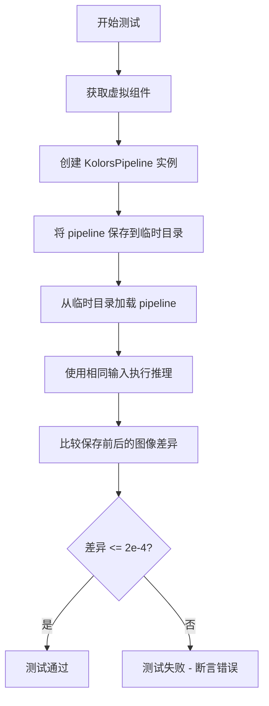

#### 带注释源码

```python
def test_save_load_optional_components(self):
    """
    测试保存和加载可选组件的功能。
    
    该测试继承自 PipelineTesterMixin，验证当 pipeline 包含可选组件
    (如 image_encoder 和 feature_extractor 为 None) 时，
    仍然可以正确保存和加载，且加载后的输出与原始输出保持一致。
    
    参数:
        self: KolorsPipelineFastTests 实例
    
    返回值:
        None: 测试方法，通过 unittest 断言验证，不返回具体值
    
    异常:
        AssertionError: 如果保存/加载前后的图像差异超过 expected_max_difference
    """
    # 调用父类的测试方法，传递期望的最大差异阈值
    # expected_max_difference=2e-4 表示保存/加载前后的图像像素值
    # 平均差异应不超过 0.0002，以保证模型行为的确定性
    super().test_save_load_optional_components(expected_max_difference=2e-4)
```


### `KolorsPipelineFastTests.test_save_load_float16`

该测试方法用于验证 KolorsPipeline 在 Float16（半精度）模型格式下的保存和加载功能是否正常工作，通过比较保存前后的模型输出差异来确保模型权重在序列化/反序列化过程中没有精度损失或损坏。

参数：
- `self`：测试类实例本身，无需显式传递

返回值：`None`，该方法为 `unittest.TestCase` 的测试用例，通过断言验证功能正确性

#### 流程图

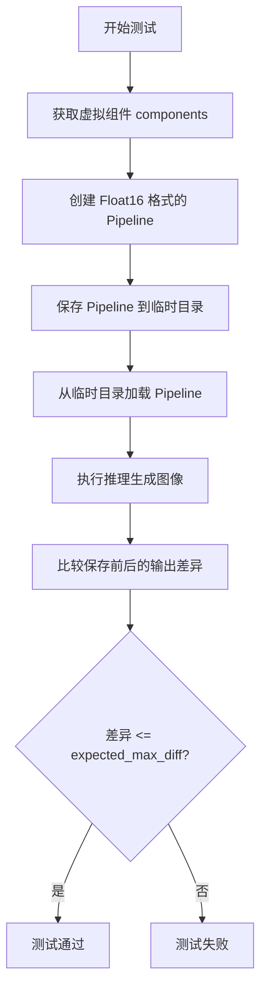

#### 带注释源码

```python
def test_save_load_float16(self):
    """
    测试 KolorsPipeline 在 Float16 格式下的保存和加载功能。
    
    该方法继承自 PipelineTesterMixin，测试流程如下：
    1. 创建虚拟组件（UNet、VAE、Text Encoder 等）
    2. 将 Pipeline 转换为 float16 精度
    3. 保存 Pipeline 到临时文件
    4. 从临时文件加载 Pipeline
    5. 使用相同的输入执行推理
    6. 比较保存前后的输出差异
    
    参数:
        expected_max_diff: 允许的最大差异阈值，设为 0.2（2e-1）
                          由于 float16 精度较低，需要较大的容差
    """
    # 调用父类的测试方法，传入期望的最大差异值
    super().test_save_load_float16(expected_max_diff=2e-1)
```

---

### 补充信息

#### 设计目标与约束
- **目标**：验证 KolorsPipeline 在半精度（float16）模型格式下的序列化与反序列化能力
- **约束**：由于 float16 精度较低，允许较大的输出差异（0.2）

#### 关键技术细节
- 该方法依赖于父类 `PipelineTesterMixin` 实现的通用测试逻辑
- `expected_max_diff=2e-1` 表明测试允许 20% 的输出差异，这是因为 float16 精度导致的数值误差
- 测试使用虚拟组件（dummy components）避免依赖真实模型权重

#### 潜在优化空间
1. 可以考虑为不同的精度格式（float16、bfloat16、float32）设置不同的差异阈值
2. 当前测试只验证了输出差异，未验证模型内部状态（如模型权重、配置文件）是否正确保存


### `KolorsPipelineFastTests.test_inference_batch_single_identical`

该测试方法用于验证 KolorsPipeline 批处理推理的一致性，确保批量生成的单张图像与单独生成的图像结果一致（允许一定的数值误差）。

参数：此方法无显式参数。

返回值：`None`，无返回值（测试方法通过断言进行验证）。

#### 流程图

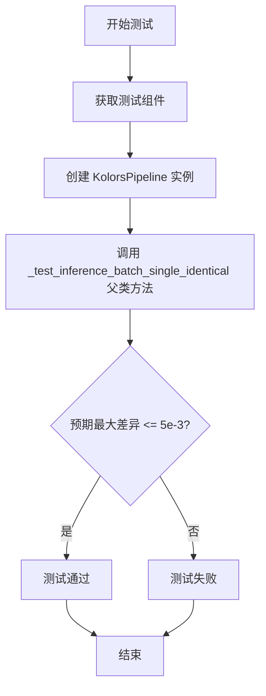

#### 带注释源码

```python
def test_inference_batch_single_identical(self):
    """
    测试批处理推理的一致性。
    
    该测试方法继承自 PipelineTesterMixin，验证在使用相同随机种子时：
    1. 单张图像生成 (batch_size=1)
    2. 批量图像生成 (batch_size>1)
    两者产生的图像结果应该一致（或在可接受范围内一致）
    """
    # 调用父类混合器中的测试方法
    # expected_max_diff=5e-3 表示允许的最大差异阈值为 0.005
    self._test_inference_batch_single_identical(expected_max_diff=5e-3)
```


### `KolorsPipelineFastTests.get_dummy_components`

该方法用于创建虚拟（dummy）模型组件，作为 Kolors Pipeline 单元测试的输入。它通过设置随机种子并初始化各模型组件（UNet、Scheduler、VAE、Text Encoder、Tokenizer），构建一个完整的测试用_pipeline组件字典。

参数：

- `time_cond_proj_dim`：`int` 或 `None`（可选），用于设置 UNet2DConditionModel 的时间条件投影维度。如果为 None，则使用默认值。

返回值：`dict`，返回一个包含虚拟模型组件的字典，键包括 "unet"、"scheduler"、"vae"、"text_encoder"、"tokenizer"、"image_encoder" 和 "feature_extractor"。

#### 流程图

```mermaid
flowchart TD
    A[开始 get_dummy_components] --> B[设置随机种子 torch.manual_seed(0)]
    B --> C[创建 UNet2DConditionModel]
    C --> D[传入 time_cond_proj_dim 等参数]
    D --> E[创建 EulerDiscreteScheduler]
    E --> F[设置随机种子 torch.manual_seed(0)]
    F --> G[创建 AutoencoderKL VAE模型]
    G --> H[设置随机种子 torch.manual_seed(0)]
    H --> I[从预训练模型加载 ChatGLMModel 作为 text_encoder]
    I --> J[从预训练模型加载 ChatGLMTokenizer]
    J --> K[构建 components 字典]
    K --> L[返回 components 字典]
```

#### 带注释源码

```python
def get_dummy_components(self, time_cond_proj_dim=None):
    """
    创建虚拟模型组件，用于 KolorsPipeline 单元测试
    
    参数:
        time_cond_proj_dim: 可选的整数值，用于设置 UNet 的 time_cond_proj_dim 参数
    """
    # 设置随机种子以确保测试结果可复现
    torch.manual_seed(0)
    
    # 创建 UNet2DConditionModel 实例
    # 这是一个用于图像生成的条件 UNet 模型
    unet = UNet2DConditionModel(
        block_out_channels=(2, 4),           # UNet 块的输出通道数
        layers_per_block=2,                   # 每个块的层数
        time_cond_proj_dim=time_cond_proj_dim, # 时间条件投影维度（可选参数）
        sample_size=32,                      # 样本空间尺寸
        in_channels=4,                       # 输入通道数
        out_channels=4,                      # 输出通道数
        down_block_types=("DownBlock2D", "CrossAttnDownBlock2D"),  # 下采样块类型
        up_block_types=("CrossAttnUpBlock2D", "UpBlock2D"),        # 上采样块类型
        attention_head_dim=(2,4),            # 注意力头维度
        use_linear_projection=True,          # 使用线性投影
        addition_embed_type="text_time",     # 额外的嵌入类型
        addition_time_embed_dim=8,           # 时间嵌入维度
        transformer_layers_per_block=(1, 2), # 每个块的 transformer 层数
        projection_class_embeddings_input_dim=56, # 投影类别嵌入输入维度
        cross_attention_dim=8,               # 交叉注意力维度
        norm_num_groups=1,                   # 归一化组数
    )
    
    # 创建 Euler 离散调度器
    # 用于控制扩散模型的采样过程
    scheduler = EulerDiscreteScheduler(
        beta_start=0.00085,       # Beta 起始值
        beta_end=0.012,          # Beta 结束值
        steps_offset=1,          # 步数偏移
        beta_schedule="scaled_linear",  # Beta 调度方式
        timestep_spacing="leading",     # 时间步间距
    )
    
    # 重新设置随机种子，确保 VAE 初始化的可复现性
    torch.manual_seed(0)
    
    # 创建 AutoencoderKL (VAE) 模型
    # 用于将图像编码到潜在空间和解码回来
    vae = AutoencoderKL(
        block_out_channels=[32, 64],     # VAE 块的输出通道
        in_channels=3,                   # 输入通道 (RGB图像)
        out_channels=3,                  # 输出通道
        down_block_types=["DownEncoderBlock2D", "DownEncoderBlock2D"], # 下采样块类型
        up_block_types=["UpDecoderBlock2D", "UpDecoderBlock2D"],       # 上采样块类型
        latent_channels=4,                # 潜在空间通道数
        sample_size=128,                 # 样本尺寸
    )
    
    # 重新设置随机种子，确保文本编码器初始化的可复现性
    torch.manual_seed(0)
    
    # 从预训练模型加载 ChatGLMModel 作为文本编码器
    # "hf-internal-testing/tiny-random-chatglm3-6b" 是一个用于测试的小型随机模型
    text_encoder = ChatGLMModel.from_pretrained(
        "hf-internal-testing/tiny-random-chatglm3-6b", 
        torch_dtype=torch.float32  # 使用 float32 精度
    )
    
    # 从预训练模型加载 ChatGLMTokenizer
    # 用于将文本 prompts 转换为 token IDs
    tokenizer = ChatGLMTokenizer.from_pretrained(
        "hf-internal-testing/tiny-random-chatglm3-6b"
    )
    
    # 构建组件字典，包含所有模型组件
    # 其中 image_encoder 和 feature_extractor 设为 None（Kolors 不需要这些）
    components = {
        "unet": unet,                 # UNet2DConditionModel 实例
        "scheduler": scheduler,      # EulerDiscreteScheduler 实例
        "vae": vae,                   # AutoencoderKL 实例
        "text_encoder": text_encoder,# ChatGLMModel 实例
        "tokenizer": tokenizer,       # ChatGLMTokenizer 实例
        "image_encoder": None,       # 图像编码器（Kolors不需要）
        "feature_extractor": None,   # 特征提取器（Kolors不需要）
    }
    
    # 返回包含所有虚拟组件的字典
    return components
```


### `KolorsPipelineFastTests.get_dummy_inputs`

创建虚拟输入数据，用于测试 KolorsPipeline 的推理功能。该方法根据指定的设备和随机种子生成器，构造包含提示词、生成器、推理步数、引导比例和输出类型等关键参数的输入字典。

参数：

- `self`：隐式的类实例参数，代表 `KolorsPipelineFastTests` 类的实例
- `device`：`torch.device` 或 `str`，指定生成器所属的设备（如 "cpu"、"cuda" 或 "mps"）
- `seed`：`int`，随机种子，用于生成可重现的随机数，默认为 0

返回值：`dict`，包含以下键值对的字典：
- `"prompt"`：`str`，输入的文本提示词
- `"generator"`：`torch.Generator`，随机数生成器对象
- `"num_inference_steps"`：`int`，推理步数
- `"guidance_scale"`：`float`，引导比例系数
- `"output_type"`：`str`，输出类型（"np" 表示 NumPy 数组）

#### 流程图

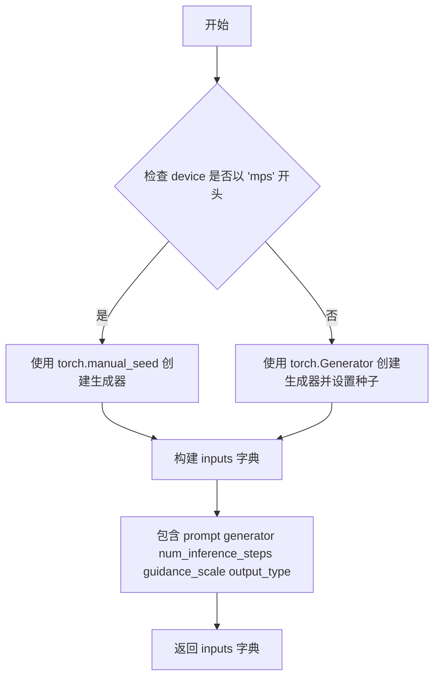

#### 带注释源码

```python
def get_dummy_inputs(self, device, seed=0):
    """
    创建虚拟输入数据，用于测试 KolorsPipeline 推理。
    
    参数:
        device: torch.device or str - 生成器所属的设备
        seed: int - 随机种子，默认为 0
    
    返回:
        dict - 包含测试所需的虚拟输入参数
    """
    # 判断设备是否为 Apple Silicon 的 MPS (Metal Performance Shaders)
    if str(device).startswith("mps"):
        # MPS 设备不支持 torch.Generator，使用 torch.manual_seed 替代
        generator = torch.manual_seed(seed)
    else:
        # 其他设备（CPU/CUDA）使用 torch.Generator 以获得更好的随机性控制
        generator = torch.Generator(device=device).manual_seed(seed)
    
    # 构建测试用的虚拟输入参数字典
    inputs = {
        "prompt": "A painting of a squirrel eating a burger",  # 文本提示词
        "generator": generator,  # 随机数生成器，确保可重现性
        "num_inference_steps": 2,  # 推理步数（较少步数用于快速测试）
        "guidance_scale": 5.0,  # Classifier-free guidance 引导比例
        "output_type": "np",  # 输出为 NumPy 数组格式
    }
    return inputs
```


### `KolorsPipelineFastTests.test_inference`

该测试方法用于验证 KolorsPipeline 的推理功能是否正常工作。它创建虚拟组件和输入，执行图像生成推理，然后验证输出图像的形状和像素值是否符合预期结果。

参数：
- 该方法无显式参数（隐式使用 `self`）

返回值：`None`，该方法为测试方法，通过断言验证推理结果，不返回实际数据

#### 流程图

```mermaid
flowchart TD
    A[开始 test_inference] --> B[设置设备为 CPU]
    B --> C[调用 get_dummy_components 获取虚拟组件]
    C --> D[使用虚拟组件实例化 KolorsPipeline]
    D --> E[将管道移至 CPU 设备]
    E --> F[设置进度条配置 disable=None]
    F --> G[调用 get_dummy_inputs 获取测试输入]
    G --> H[执行管道推理: pipe\*\*inputs]
    H --> I[从结果中提取图像]
    I --> J[提取图像切片 image[0, -3:, -3:, -1]]
    J --> K[断言图像形状为 (1, 64, 64, 3)]
    K --> L[定义期望的像素值数组]
    L --> M[计算实际与期望的最大差异]
    M --> N{最大差异 <= 1e-3?}
    N -->|是| O[测试通过]
    N -->|否| P[测试失败]
```

#### 带注释源码

```python
def test_inference(self):
    """
    测试 KolorsPipeline 的推理功能
    验证生成的图像形状和像素值是否符合预期
    """
    # 1. 设置测试设备为 CPU
    device = "cpu"

    # 2. 获取虚拟组件（UNet、VAE、Scheduler、TextEncoder、Tokenizer 等）
    components = self.get_dummy_components()
    
    # 3. 使用虚拟组件实例化 KolorsPipeline 管道
    pipe = self.pipeline_class(**components)
    
    # 4. 将管道移至指定设备（CPU）
    pipe.to(device)
    
    # 5. 配置进度条（disable=None 表示不禁用进度条）
    pipe.set_progress_bar_config(disable=None)

    # 6. 获取虚拟输入参数（prompt、generator、num_inference_steps 等）
    inputs = self.get_dummy_inputs(device)
    
    # 7. 执行管道推理，生成图像
    #    输入包含：prompt、generator、num_inference_steps=2、guidance_scale=5.0、output_type='np'
    image = pipe(**inputs).images
    
    # 8. 从生成的图像中提取最后 3x3 像素区域用于验证
    #    image shape: [batch, height, width, channels]
    image_slice = image[0, -3:, -3:, -1]

    # 9. 断言验证：图像形状必须为 (1, 64, 64, 3)
    #    - 1: batch size
    #    - 64x64: 图像高度和宽度
    #    - 3: RGB 通道数
    self.assertEqual(image.shape, (1, 64, 64, 3))
    
    # 10. 定义期望的像素值数组（9个值，对应 3x3 图像区域）
    expected_slice = np.array(
        [0.26413745, 0.4425478, 0.4102801, 0.42693347, 0.52529025, 0.3867405, 0.47512037, 0.41538602, 0.43855375]
    )
    
    # 11. 计算实际输出与期望输出的最大差异
    max_diff = np.abs(image_slice.flatten() - expected_slice).max()
    
    # 12. 断言验证：最大差异必须小于等于 1e-3（0.001）
    self.assertLessEqual(max_diff, 1e-3)
```


### `KolorsPipelineFastTests.test_save_load_optional_components`

该测试方法用于验证 KolorsPipeline 中可选组件（如 `image_encoder` 和 `feature_extractor`）的保存和加载功能是否正常工作。通过调用父类的同名测试方法，检测在保存和重新加载 pipeline 后，这些可选组件是否能正确恢复。

参数：

- `self`：`KolorsPipelineFastTests`，测试类实例，隐式参数，代表当前测试对象

返回值：`None`，此测试方法不返回任何值，仅通过断言验证保存/加载的正确性

#### 流程图

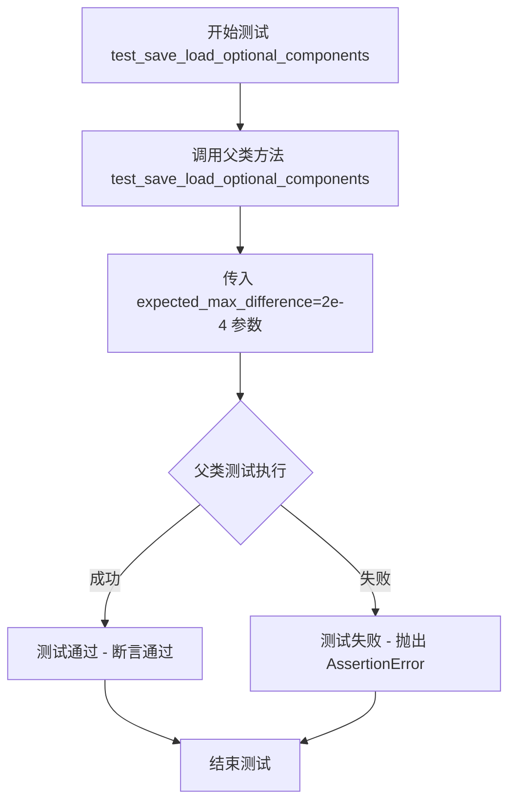

#### 带注释源码

```python
def test_save_load_optional_components(self):
    """
    测试可选组件的保存和加载功能。
    
    该方法继承自 PipelineTesterMixin，通过调用父类的测试方法
    来验证 pipeline 中可选组件（如 image_encoder, feature_extractor）
    在经过 save_pretrained 和 from_pretrained 后是否能正确保存和加载。
    
    expected_max_difference=2e-4 定义了加载后的组件与原始组件之间的
    最大允许差异，用于确保加载后的组件功能正常。
    """
    # 调用父类（PipelineTesterMixin）的测试方法
    # 传递 expected_max_difference=2e-4 作为期望的最大差异阈值
    super().test_save_load_optional_components(expected_max_difference=2e-4)
```

#### 关键信息补充

| 项目 | 说明 |
|------|------|
| **测试类** | `KolorsPipelineFastTests` |
| **父类** | `PipelineTesterMixin`, `unittest.TestCase` |
| **被调用父类方法** | `PipelineTesterMixin.test_save_load_optional_components(expected_max_difference)` |
| **测试目的** | 验证可选组件（`image_encoder`, `feature_extractor`）的序列化和反序列化 |
| **差异阈值** | `2e-4` (0.0002) |
| **相关组件** | `KolorsPipeline` 及其可选组件 `image_encoder`, `feature_extractor` |


### `KolorsPipelineFastTests.test_save_load_float16`

该测试方法用于验证 KolorsPipeline 在 Float16（半精度）数据类型下的保存和加载功能是否正常工作，通过比较保存前后模型的输出差异来确保序列化/反序列化过程的正确性。

参数：

- `self`：`KolorsPipelineFastTests`，测试类实例本身
- `expected_max_diff`：`float`，允许保存加载前后模型输出之间的最大差异阈值，设置为 `2e-1`（即 0.1）

返回值：`None`，该方法为测试用例，通过断言验证正确性，不返回具体值

#### 流程图

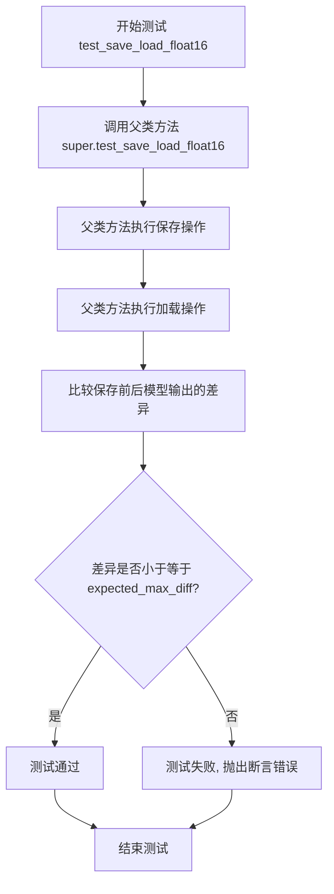

#### 带注释源码

```python
def test_save_load_float16(self):
    """
    测试 Float16 格式的模型保存和加载功能
    
    该测试方法继承自 PipelineTesterMixin,用于验证:
    1. Pipeline 能够在 float16 数据类型下正确保存
    2. 保存的模型能够正确加载恢复
    3. 加载后的模型输出与原始模型输出的差异在允许范围内
    
    测试逻辑:
    - 将 Pipeline 转换为 float16 类型
    - 保存 Pipeline 到临时目录
    - 从临时目录重新加载 Pipeline
    - 比较原始 Pipeline 和加载后 Pipeline 的输出
    - 验证差异是否在 expected_max_diff 阈值内
    """
    # 调用父类 PipelineTesterMixin 的测试方法
    # expected_max_diff=2e-1 表示允许 0.1 的最大差异
    # 这是因为 float16 精度较低,差异可能比 float32 大
    super().test_save_load_float16(expected_max_diff=2e-1)
```


### `KolorsPipelineFastTests.test_inference_batch_single_identical`

该测试方法用于验证 Kolors Pipeline 在批处理模式（batch）与单张模式（single）下的推理结果一致性，确保模型在两种推理方式下产生相同的输出，这是保证 pipeline 行为稳定性的关键测试。

参数：无显式参数（继承自 unittest.TestCase）

返回值：无返回值（测试方法，通过 unittest 断言验证）

#### 流程图

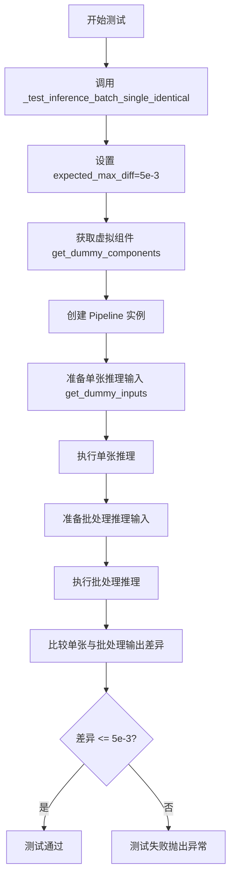

#### 带注释源码

```python
def test_inference_batch_single_identical(self):
    """
    测试批处理与单张推理一致性
    
    该测试方法验证 KolorsPipeline 在以下两种推理模式下产生的输出是否一致：
    1. 单张推理模式：一次处理一个 prompt
    2. 批处理模式：一次处理多个相同的 prompt
    
    一致性通过 expected_max_diff 参数控制，允许的最大差异为 5e-3（0.005）
    
    用途：
    - 确保模型在不同推理批次大小下行为一致
    - 验证随机性控制（generator）正确工作
    - 防止模型内部状态因批处理而产生副作用
    """
    # 调用父类 PipelineTesterMixin 提供的测试方法
    # expected_max_diff=5e-3 设置了允许的最大像素差异阈值
    # 如果批处理与单张推理的输出差异超过此值，测试将失败
    self._test_inference_batch_single_identical(expected_max_diff=5e-3)
```

## 关键组件


### KolorsPipeline

Kolors管道的主类，负责协调文本到图像的生成过程，包含UNet去噪模型、VAE解码器、文本编码器等核心组件的调用与数据流转。

### UNet2DConditionModel

条件2D UNet模型，负责去噪过程，接受文本embedding和时间步信息进行逐步去噪生成潜在表示。

### AutoencoderKL

变分自编码器，负责将潜在表示解码为最终图像，并将输入图像编码为潜在表示。

### ChatGLMModel

ChatGLM文本编码模型，将文本prompt转换为文本embedding向量，供UNet进行条件生成。

### ChatGLMTokenizer

ChatGLM分词器，负责将文本prompt转换为token ids，供文本编码模型使用。

### EulerDiscreteScheduler

欧拉离散调度器，负责管理扩散模型的采样时间步调度，控制去噪过程的步伐。

### PipelineTesterMixin

管道测试混入类，提供通用的管道测试方法，包括推理、批处理一致性等测试功能。

### get_dummy_components

创建测试用虚拟组件的函数，初始化所有管道组件的测试配置，包括UNet、VAE、文本编码器等。

### get_dummy_inputs

创建测试用虚拟输入的函数，生成测试所需的prompt、生成器、推理步数等参数。

### test_inference

推理测试方法，验证管道端到端的图像生成功能，检查输出图像的形状和像素值。

### test_save_load_optional_components

保存加载可选组件测试，验证管道的序列化和反序列化功能。

### test_save_load_float16

float16保存加载测试，验证半精度模型保存和加载的正确性。

### test_inference_batch_single_identical

批处理与单次推理一致性测试，验证批量推理与逐个推理结果的一致性。


## 问题及建议


### 已知问题

- **硬编码的测试种子和期望值**：代码中多处使用硬编码的随机种子（`torch.manual_seed(0)`）和硬编码的期望输出值（`expected_slice`），这些值在不同环境或PyTorch版本中可能导致测试失败，缺乏灵活性。
- **重复的随机种子设置**：`get_dummy_components` 方法中多次调用 `torch.manual_seed(0)`（第47、55、60行），存在代码重复，可以提取到单一位置。
- **设备兼容性处理不一致**：`get_dummy_inputs` 中对 MPS 设备使用了特殊的随机生成器处理方式（第77-79行），这种条件判断逻辑可以更统一地处理。
- **测试参数阈值差异大**：`test_save_load_float16` 中使用 `expected_max_diff=2e-1`（2e-1 = 0.2），而 `test_save_load_optional_components` 使用 `expected_max_difference=2e-4`（2e-4 = 0.0002），两者相差1000倍，可能表明float16测试的阈值设置过于宽松。
- **缺少错误处理测试**：测试用例仅覆盖正常流程，缺少对异常输入（如空prompt、无效guidance_scale、负数steps等）的边界测试。
- **重复实例化模型**：每个测试方法都会重新创建 pipeline 和组件，没有使用类级别的 fixture 共享，导致测试执行效率较低。
- **隐藏的全局状态依赖**：`enable_full_determinism()` 是全局设置，可能影响其他测试的执行顺序和结果，测试隔离性不足。
- **缺失测试方法覆盖**：虽然调用了 `test_inference_batch_single_identical`，但实际的 `_test_inference_batch_single_identical` 方法的测试逻辑不可见，可能存在测试覆盖盲区。

### 优化建议

- **参数化测试配置**：将硬编码的阈值（`1e-3`、`2e-4`、`2e-1`、`5e-3`）提取为类常量或配置文件，便于统一管理和调整。
- **使用 fixture 管理资源**：利用 pytest fixture 或 unittest 的 `setUpClass` 共享模型组件，减少重复加载，提高测试性能。
- **统一随机状态管理**：使用 `torch.Generator` 并显式传递随机生成器，避免依赖全局随机种子设置，增强测试确定性。
- **增加边界测试**：添加针对无效输入（空字符串、None、超出范围参数）的异常测试用例，提升测试覆盖率。
- **标准化设备处理**：创建统一的设备初始化方法，消除 MPS 设备的特殊处理逻辑。
- **添加测试文档**：为关键测试方法添加 docstring，说明测试目的、预期行为和潜在限制。
- **分离关注点**：将 `get_dummy_components` 和 `get_dummy_inputs` 的构建逻辑进一步模块化，便于复用和维护。

## 其它


### 1. 一段话描述

KolorsPipelineFastTests 是 Hugging Face diffusers 库中 KolorsPipeline 的单元测试类，通过继承 PipelineTesterMixin 并使用 unittest 框架，对文本到图像生成管道进行全面测试，包括推理、模型保存加载、浮点精度以及批处理一致性等功能验证。

### 2. 文件的整体运行流程

该测试文件运行流程如下：首先通过 `get_dummy_components` 方法创建虚拟的模型组件（UNet、VAE、文本编码器等），然后通过 `get_dummy_inputs` 方法准备测试输入参数，最后执行多个测试方法验证管道功能。测试使用固定的随机种子确保可复现性，并通过断言验证输出图像的形状和数值范围是否符合预期。

### 3. 类的详细信息

#### 3.1 类字段

| 字段名称 | 类型 | 描述 |
|---------|------|------|
| pipeline_class | type | 指定测试的管道类为 KolorsPipeline |
| params | TEXT_TO_IMAGE_PARAMS | 文本到图像管道的参数配置 |
| batch_params | TEXT_TO_IMAGE_BATCH_PARAMS | 批处理参数配置 |
| image_params | TEXT_TO_IMAGE_IMAGE_PARAMS | 图像参数配置 |
| image_latents_params | TEXT_TO_IMAGE_IMAGE_PARAMS | 图像潜在向量参数配置 |
| callback_cfg_params | set | 回调配置参数，包含 add_text_embeds 和 add_time_ids |
| supports_dduf | bool | 标记是否支持 DDUF，设为 False |
| test_layerwise_casting | bool | 标记是否测试逐层类型转换，设为 True |

#### 3.2 类方法

##### get_dummy_components

- **方法名称**: get_dummy_components
- **参数名称**: time_cond_proj_dim
- **参数类型**: Optional[int]
- **参数描述**: 时间条件投影维度参数，用于配置 UNet 模型的时间嵌入层
- **返回值类型**: dict
- **返回值描述**: 返回包含所有模型组件的字典，包括 unet、scheduler、vae、text_encoder、tokenizer、image_encoder 和 feature_extractor
- **mermaid 流程图**:

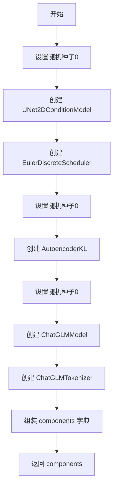

- **带注释源码**:

```python
def get_dummy_components(self, time_cond_proj_dim=None):
    torch.manual_seed(0)  # 设置随机种子确保可复现性
    unet = UNet2DConditionModel(
        block_out_channels=(2, 4),
        layers_per_block=2,
        time_cond_proj_dim=time_cond_proj_dim,  # 时间条件投影维度
        sample_size=32,
        in_channels=4,
        out_channels=4,
        down_block_types=("DownBlock2D", "CrossAttnDownBlock2D"),
        up_block_types=("CrossAttnUpBlock2D", "UpBlock2D"),
        attention_head_dim=(2, 4),
        use_linear_projection=True,
        addition_embed_type="text_time",  # 支持文本和时间嵌入
        addition_time_embed_dim=8,
        transformer_layers_per_block=(1, 2),
        projection_class_embeddings_input_dim=56,
        cross_attention_dim=8,
        norm_num_groups=1,
    )
    scheduler = EulerDiscreteScheduler(  # 离散调度器
        beta_start=0.00085,
        beta_end=0.012,
        steps_offset=1,
        beta_schedule="scaled_linear",
        timestep_spacing="leading",
    )
    torch.manual_seed(0)
    vae = AutoencoderKL(  # 变分自编码器
        block_out_channels=[32, 64],
        in_channels=3,
        out_channels=3,
        down_block_types=["DownEncoderBlock2D", "DownEncoderBlock2D"],
        up_block_types=["UpDecoderBlock2D", "UpDecoderBlock2D"],
        latent_channels=4,
        sample_size=128,
    )
    torch.manual_seed(0)
    text_encoder = ChatGLMModel.from_pretrained(  # 文本编码器
        "hf-internal-testing/tiny-random-chatglm3-6b", torch_dtype=torch.float32
    )
    tokenizer = ChatGLMTokenizer.from_pretrained(  # 分词器
        "hf-internal-testing/tiny-random-chatglm3-6b"
    )

    components = {  # 组装组件字典
        "unet": unet,
        "scheduler": scheduler,
        "vae": vae,
        "text_encoder": text_encoder,
        "tokenizer": tokenizer,
        "image_encoder": None,
        "feature_extractor": None,
    }
    return components
```

##### get_dummy_inputs

- **方法名称**: get_dummy_inputs
- **参数名称**: device, seed
- **参数类型**: str, int
- **参数描述**: device 指定测试设备，seed 指定随机种子
- **返回值类型**: dict
- **返回值描述**: 返回包含 prompt、generator、num_inference_steps、guidance_scale 和 output_type 的输入字典
- **mermaid 流程图**:

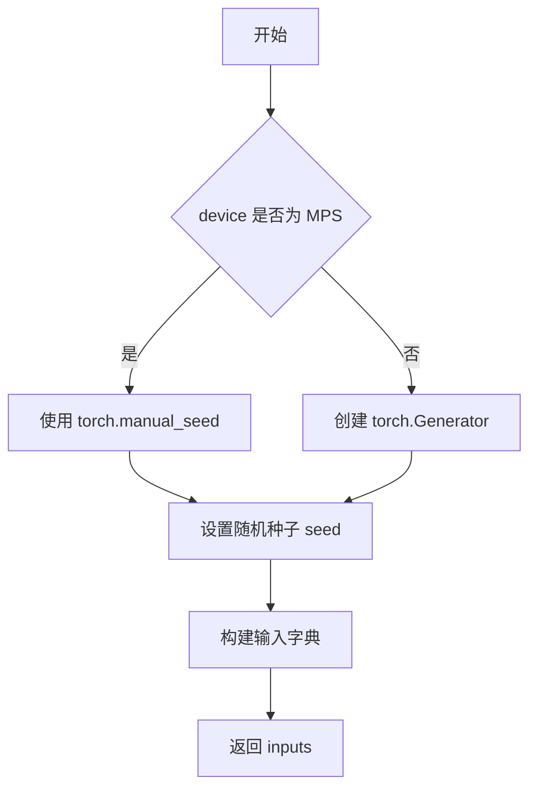

- **带注释源码**:

```python
def get_dummy_inputs(self, device, seed=0):
    if str(device).startswith("mps"):  # MPS 设备特殊处理
        generator = torch.manual_seed(seed)
    else:
        generator = torch.Generator(device=device).manual_seed(seed)
    inputs = {  # 构建测试输入参数
        "prompt": "A painting of a squirrel eating a burger",  # 测试用提示词
        "generator": generator,  # 随机数生成器确保可复现性
        "num_inference_steps": 2,  # 推理步数
        "guidance_scale": 5.0,  # 引导系数
        "output_type": "np",  # 输出类型为 numpy 数组
    }
    return inputs
```

##### test_inference

- **方法名称**: test_inference
- **参数名称**: 无
- **参数类型**: 无
- **参数描述**: 无
- **返回值类型**: None
- **返回值描述**: 无返回值，通过断言验证推理结果
- **mermaid 流程图**:

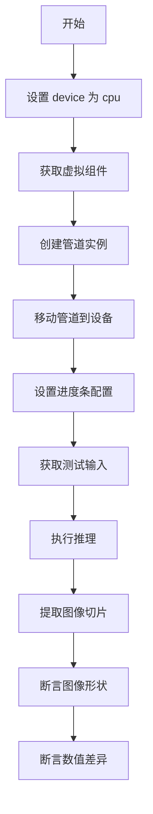

- **带注释源码**:

```python
def test_inference(self):
    device = "cpu"  # 使用 CPU 设备进行测试

    components = self.get_dummy_components()  # 获取虚拟组件
    pipe = self.pipeline_class(**components)  # 实例化管道
    pipe.to(device)  # 移动到指定设备
    pipe.set_progress_bar_config(disable=None)  # 配置进度条

    inputs = self.get_dummy_inputs(device)  # 获取测试输入
    image = pipe(**inputs).images  # 执行推理
    image_slice = image[0, -3:, -3:, -1]  # 提取右下角 3x3 像素切片

    self.assertEqual(image.shape, (1, 64, 64, 3))  # 验证输出形状
    expected_slice = np.array(  # 预期像素值
        [0.26413745, 0.4425478, 0.4102801, 0.42693347, 0.52529025, 0.3867405, 0.47512037, 0.41538602, 0.43855375]
    )
    max_diff = np.abs(image_slice.flatten() - expected_slice).max()  # 计算最大差异
    self.assertLessEqual(max_diff, 1e-3)  # 断言差异在允许范围内
```

##### test_save_load_optional_components

- **方法名称**: test_save_load_optional_components
- **参数名称**: 无（继承自父类）
- **参数类型**: 无
- **参数描述**: 继承自 PipelineTesterMixin，测试可选组件的保存和加载
- **返回值类型**: None
- **返回值描述**: 无返回值，通过断言验证模型保存加载功能
- **mermaid 流程图**: 继承自父类流程
- **带注释源码**:

```python
def test_save_load_optional_components(self):
    super().test_save_load_optional_components(expected_max_difference=2e-4)  # 调用父类测试方法，允许 2e-4 的差异
```

##### test_save_load_float16

- **方法名称**: test_save_load_float16
- **参数名称**: 无（继承自父类）
- **参数类型**: 无
- **参数描述**: 继承自 PipelineTesterMixin，测试浮点16位精度模型的保存加载
- **返回值类型**: None
- **返回值描述**: 无返回值，通过断言验证浮点16位模型功能
- **mermaid 流程图**: 继承自父类流程
- **带注释源码**:

```python
def test_save_load_float16(self):
    super().test_save_load_float16(expected_max_diff=2e-1)  # 调用父类测试方法，允许 2e-1 的差异
```

##### test_inference_batch_single_identical

- **方法名称**: test_inference_batch_single_identical
- **参数名称**: 无（继承自父类）
- **参数类型**: 无
- **参数描述**: 继承自 PipelineTesterMixin，测试批处理与单样本推理结果一致性
- **返回值类型**: None
- **返回值描述**: 无返回值，通过断言验证批处理功能
- **mermaid 流程图**: 继承自父类流程
- **带注释源码**:

```python
def test_inference_batch_single_identical(self):
    self._test_inference_batch_single_identical(expected_max_diff=5e-3)  # 调用内部测试方法，允许 5e-3 的差异
```

### 4. 全局变量和全局函数

#### 4.1 全局变量

| 变量名称 | 类型 | 描述 |
|---------|------|------|
| enable_full_determinism | function | 来自 testing_utils 模块的函数，用于启用完全确定性以确保测试可复现 |

#### 4.2 全局函数

| 函数名称 | 参数 | 描述 |
|---------|------|------|
| enable_full_determinism | seed: int | 设置环境变量和随机种子以确保测试的完全确定性 |

### 5. 关键组件信息

| 组件名称 | 描述 |
|---------|------|
| KolorsPipeline | Kolors 文本到图像生成管道，整合文本编码器、UNet、VAE 和调度器 |
| UNet2DConditionModel | 条件 UNet 模型，用于去噪潜在表示 |
| AutoencoderKL | VAE 变分自编码器，用于编码和解码图像潜在表示 |
| EulerDiscreteScheduler | 欧拉离散调度器，用于扩散模型的时间步调度 |
| ChatGLMModel | ChatGLM 文本编码模型，用于将文本转换为嵌入 |
| ChatGLMTokenizer | ChatGLM 分词器，用于文本分词 |
| PipelineTesterMixin | 管道测试混合类，提供通用测试方法 |

### 6. 潜在的技术债务或优化空间

1. **测试覆盖不全面**: 当前测试仅使用 CPU 设备，未测试 GPU/CUDA 环境下的推理性能和正确性
2. **硬编码的预期值**: test_inference 中的 expected_slice 是硬编码的数值，当模型实现变更时需要手动更新
3. **缺少异步测试**: 未测试管道的异步调用和多线程并发场景
4. **参数化测试缺失**: 未使用 pytest 参数化功能，对多种输入组合进行测试
5. **性能基准测试缺失**: 缺少推理时间和内存占用的性能测试
6. **错误处理测试不足**: 未测试输入验证、异常情况下的错误处理

### 7. 其它项目

#### 7.1 设计目标与约束

- **目标**: 验证 KolorsPipeline 在标准配置下的功能正确性，确保文本到图像生成管道符合预期行为
- **约束**: 
  - 测试必须在 CPU 上可执行以保证 CI/CD 兼容性
  - 使用虚拟/微型模型减少测试资源消耗
  - 测试必须快速执行以适应频繁的代码变更验证

#### 7.2 错误处理与异常设计

- 测试使用 unittest 断言进行错误检测
- 继承自 PipelineTesterMixin 的测试方法会验证模型保存加载、类型转换等操作的异常情况
- 输入参数通过 get_dummy_inputs 进行预验证，确保无效输入不会导致测试失败

#### 7.3 数据流与状态机

- 数据流: prompt → tokenizer → text_encoder → ChatGLMModel → text_embeds → UNet2DConditionModel → denoised_latents → vae.decode → image
- 状态机: 初始化组件 → 设置推理参数 → 执行扩散步骤 → 解码潜在表示 → 输出图像
- 测试验证完整数据流的正确性和各组件间的数据传递

#### 7.4 外部依赖与接口契约

- **diffusers 库**: 核心依赖，提供 Pipeline、Scheduler、Model 等基础组件
- **transformers 库**: 通过 ChatGLMModel 和 ChatGLMTokenizer 间接依赖
- **numpy**: 用于数值比较和数组操作
- **torch**: 深度学习框架依赖
- **接口契约**: 
  - pipeline_class 必须接受 components 字典并实现 __call__ 方法
  - 组件必须实现 to() 方法支持设备迁移
  - 管道输出必须包含 images 属性

#### 7.5 测试设计原则

- **可复现性**: 通过固定随机种子确保每次测试结果一致
- **隔离性**: 每个测试方法独立创建管道实例，避免状态污染
- **可维护性**: 使用配置类（TEXT_TO_IMAGE_PARAMS 等）集中管理测试参数
- **渐进式验证**: 从简单推理测试到复杂的保存加载测试，逐层验证功能

#### 7.6 配置与参数说明

| 参数名称 | 默认值 | 描述 |
|---------|--------|------|
| num_inference_steps | 2 | 扩散推理步数，较小的值加快测试速度 |
| guidance_scale | 5.0 | classifier-free guidance 引导系数 |
| output_type | "np" | 输出格式为 numpy 数组便于验证 |
| expected_max_diff | 1e-3 | 推理结果最大允许差异 |
| batch_size | 1 | 测试用批处理大小 |

    