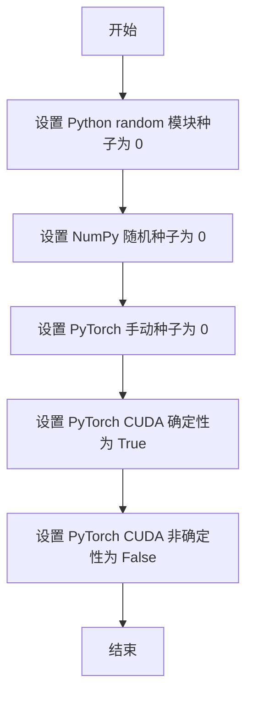
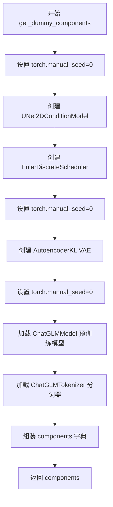
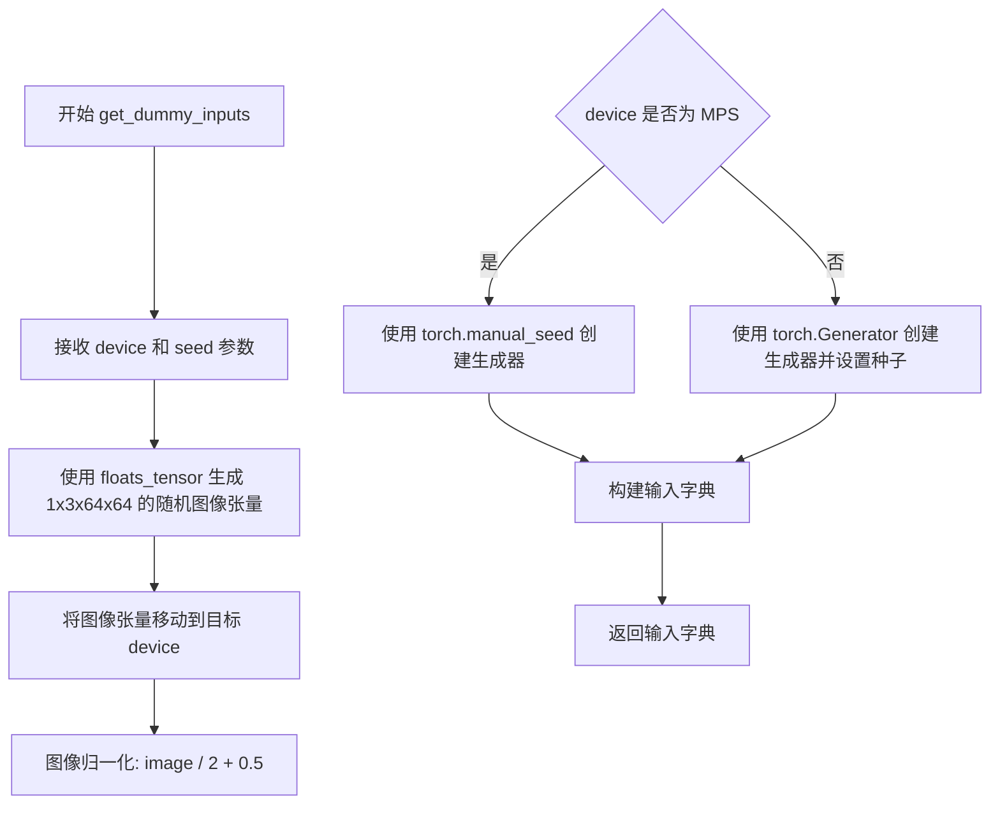
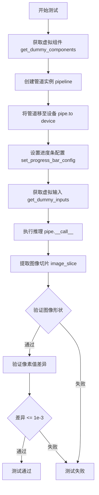
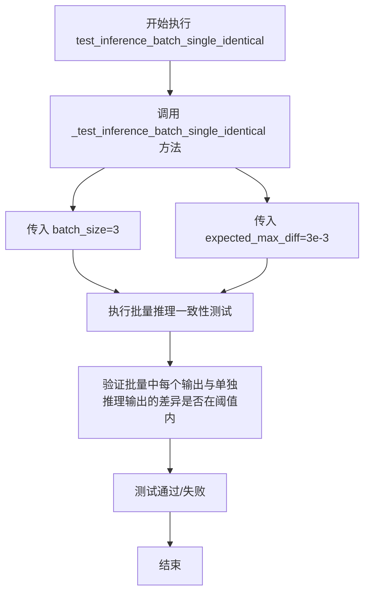
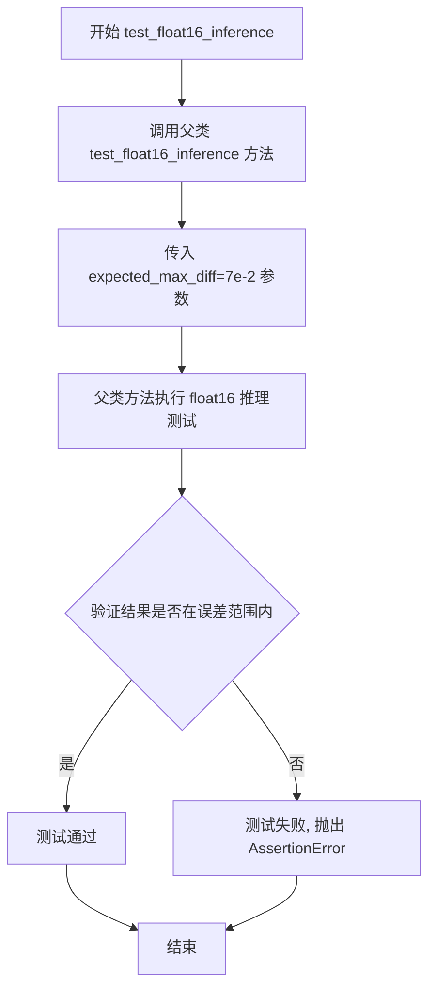
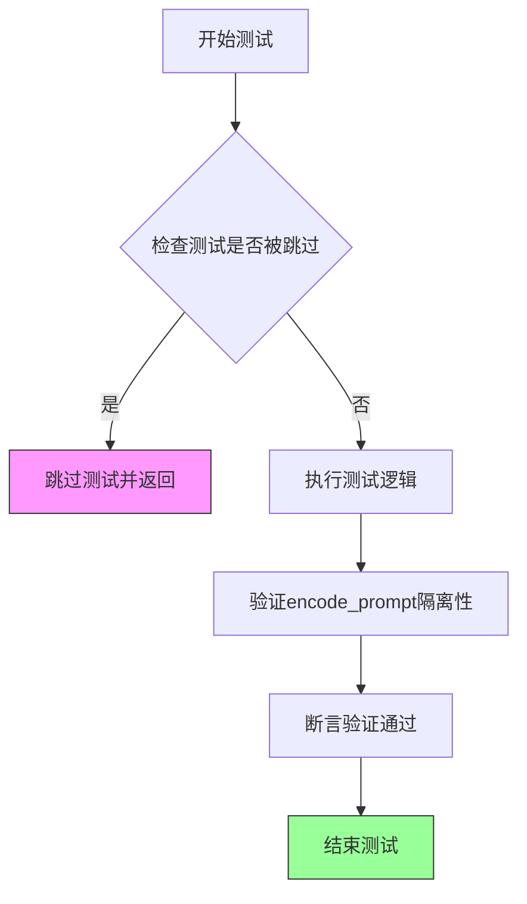
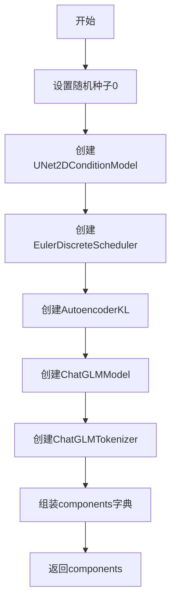
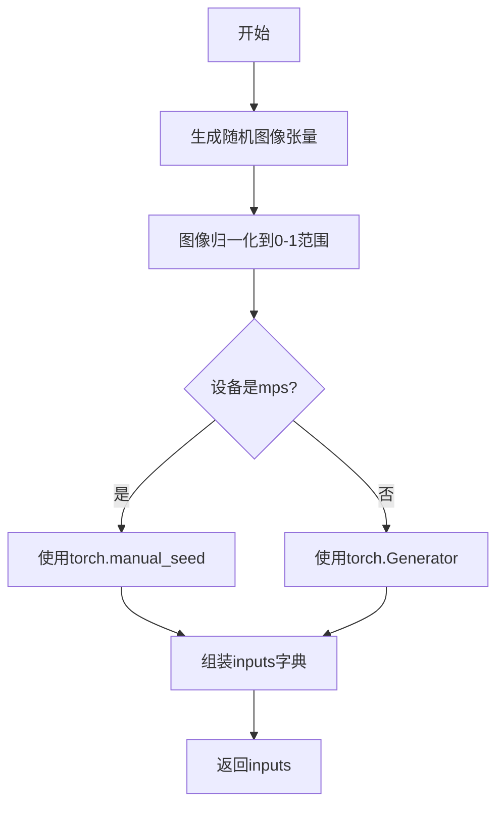
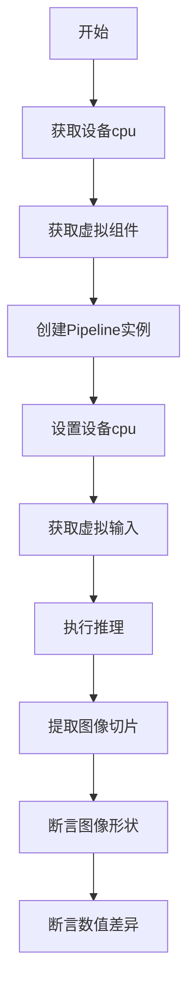

# `diffusers\tests\pipelines\kolors\test_kolors_img2img.py` 详细设计文档

这是一个用于测试 Kolors 图像到图像（Image-to-Image）扩散模型流水线的单元测试类，验证管道在给定输入图像和提示词的条件下能够正确执行推理并生成输出图像，包含了推理一致性、半精度推理等多个测试用例。

## 整体流程

```mermaid
graph TD
    A[开始测试] --> B[获取虚拟组件 get_dummy_components]
    B --> C[创建管道实例 pipeline_class]
    C --> D[获取虚拟输入 get_dummy_inputs]
    D --> E[执行推理 pipe(**inputs)]
    E --> F{测试类型}
    F --> G[test_inference: 验证输出图像形状和像素值]
    F --> H[test_inference_batch_single_identical: 验证批量推理一致性]
    F --> I[test_float16_inference: 验证半精度推理]
    G --> J[结束]
    H --> J
    I --> J
```

## 类结构

```
unittest.TestCase
└── PipelineTesterMixin
    └── KolorsPipelineImg2ImgFastTests (测试类)
```

## 全局变量及字段


### `KolorsPipelineImg2ImgFastTests.pipeline_class`
    
指定待测试的管道类，即 KolorsImg2ImgPipeline，用于图像到图像的生成测试

类型：`type`
    


### `KolorsPipelineImg2ImgFastTests.params`
    
定义文本到图像管道的单样本参数集合，用于验证管道调用接口的完整性

类型：`TEXT_TO_IMAGE_PARAMS`
    


### `KolorsPipelineImg2ImgFastTests.batch_params`
    
定义文本到图像管道的批量参数集合，用于验证批量输入的处理能力

类型：`TEXT_TO_IMAGE_BATCH_PARAMS`
    


### `KolorsPipelineImg2ImgFastTests.image_params`
    
定义图像相关的参数集合，用于验证图像输入输出的处理逻辑

类型：`TEXT_TO_IMAGE_IMAGE_PARAMS`
    


### `KolorsPipelineImg2ImgFastTests.image_latents_params`
    
定义图像潜在向量参数集合，用于验证潜在空间图像的处理流程

类型：`TEXT_TO_IMAGE_IMAGE_PARAMS`
    


### `KolorsPipelineImg2ImgFastTests.callback_cfg_params`
    
包含文本嵌入和时间ID的回调配置参数集合，用于验证Classifier-Free Guidance的回调功能

类型：`set`
    


### `KolorsPipelineImg2ImgFastTests.supports_dduf`
    
标识该管道是否支持DDUF（Decoder-only Unet Fusion）功能，当前设置为不支持

类型：`bool`
    
    

## 全局函数及方法


### `enable_full_determinism`

该函数用于确保测试或实验的完全确定性，通过设置所有随机数生成器的种子（包含 Python、NumPy、PyTorch 等）来保证每次运行结果的一致性，常用于单元测试和可复现性验证场景。

参数：

- 该函数无参数

返回值：`None`，无返回值

#### 流程图



#### 带注释源码

```
# 该函数定义于 diffusers 库的 testing_utils 模块中
# 位置: src/diffusers/testing_utils.py

def enable_full_determinism():
    """
    确保测试的完全确定性，设置了多个库的随机种子。
    """
    # 设置 Python 内置 random 模块的种子
    random.seed(0)
    
    # 设置 NumPy 的随机种子
    np.random.seed(0)
    
    # 设置 PyTorch CPU 的随机种子
    torch.manual_seed(0)
    
    # 强制 PyTorch 使用确定性算法（如果可用）
    # 这会影响 CUDA 卷积等操作的行为
    torch.cuda.manual_seed_all(0)
    
    # 设置 PyTorch 后端为确定性模式
    # 注意：部分操作在确定性模式下可能较慢
    torch.backends.cudnn.deterministic = True
    torch.backends.cudnn.benchmark = False
```

---

> **注意**：当前提供的代码文件中仅包含对 `enable_full_determinism` 函数的导入和调用，该函数的实际定义位于 `diffusers` 库内部的 `testing_utils.py` 模块中。上方源码为基于该函数调用行为的合理推断，实际实现请参照官方源码。


### `KolorsPipelineImg2ImgFastTests.get_dummy_components`

该方法用于创建 KolorsImg2ImgPipeline 测试所需的虚拟组件（dummy components），包括 UNet、调度器、VAE、文本编码器和分词器等，并返回一个包含这些组件的字典，以供后续的推理测试使用。

参数：

- `time_cond_proj_dim`：`Optional[int]`，可选参数，用于设置 UNet 模型的时间条件投影维度（time_cond_proj_dim），如果不提供则默认为 None

返回值：`Dict[str, Any]`，返回包含以下键的字典：
- `unet`：UNet2DConditionModel 实例
- `scheduler`：EulerDiscreteScheduler 实例
- `vae`：AutoencoderKL 实例
- `text_encoder`：ChatGLMModel 实例
- `tokenizer`：ChatGLMTokenizer 实例
- `image_encoder`：None
- `feature_extractor`：None

#### 流程图



#### 带注释源码

```python
# 从测试类中提取的方法
def get_dummy_components(self, time_cond_proj_dim=None):
    """
    创建用于测试的虚拟组件
    
    参数:
        time_cond_proj_dim: 可选的时间条件投影维度参数
    """
    # 设置随机种子以确保可重复性
    torch.manual_seed(0)
    
    # 创建 UNet2DConditionModel 模型
    # 用于图像到图像的条件扩散
    unet = UNet2DConditionModel(
        block_out_channels=(2, 4),          # 块输出通道数
        layers_per_block=2,                  # 每个块的层数
        time_cond_proj_dim=time_cond_proj_dim,  # 时间条件投影维度
        sample_size=32,                       # 样本尺寸
        in_channels=4,                        # 输入通道数
        out_channels=4,                       # 输出通道数
        down_block_types=("DownBlock2D", "CrossAttnDownBlock2D"),  # 下采样块类型
        up_block_types=("CrossAttnUpBlock2D", "UpBlock2D"),        # 上采样块类型
        attention_head_dim=(2, 4),           # 注意力头维度
        use_linear_projection=True,          # 使用线性投影
        addition_embed_type="text_time",     # 额外嵌入类型
        addition_time_embed_dim=8,            # 时间嵌入维度
        transformer_layers_per_block=(1, 2), # 每块的Transformer层数
        projection_class_embeddings_input_dim=56,  # 投影类嵌入输入维度
        cross_attention_dim=8,                # 交叉注意力维度
        norm_num_groups=1,                    # 归一化组数
    )
    
    # 创建欧拉离散调度器
    # 控制扩散模型的采样步骤和噪声调度
    scheduler = EulerDiscreteScheduler(
        beta_start=0.00085,      # 起始beta值
        beta_end=0.012,          # 结束beta值
        steps_offset=1,          # 步骤偏移
        beta_schedule="scaled_linear",  # beta调度策略
        timestep_spacing="leading",      # 时间步间距策略
    )
    
    # 重新设置随机种子
    torch.manual_seed(0)
    
    # 创建变分自编码器 (VAE)
    # 用于图像的编码和解码
    vae = AutoencoderKL(
        block_out_channels=[32, 64],       # 块输出通道
        in_channels=3,                     # 输入通道 (RGB)
        out_channels=3,                    # 输出通道
        down_block_types=["DownEncoderBlock2D", "DownEncoderBlock2D"],  # 下采样编码块
        up_block_types=["UpDecoderBlock2D", "UpDecoderBlock2D"],        # 上采样解码块
        latent_channels=4,                 # 潜在空间通道数
        sample_size=128,                    # 样本尺寸
    )
    
    # 重新设置随机种子
    torch.manual_seed(0)
    
    # 加载文本编码器模型
    # 使用ChatGLM模型进行文本编码
    text_encoder = ChatGLMModel.from_pretrained(
        "hf-internal-testing/tiny-random-chatglm3-6b", 
        torch_dtype=torch.float32
    )
    
    # 加载分词器
    # 用于将文本转换为token
    tokenizer = ChatGLMTokenizer.from_pretrained("hf-internal-testing/tiny-random-chatglm3-6b")

    # 组装所有组件到字典中
    components = {
        "unet": unet,                        # UNet模型
        "scheduler": scheduler,              # 调度器
        "vae": vae,                          # VAE模型
        "text_encoder": text_encoder,        # 文本编码器
        "tokenizer": tokenizer,              # 分词器
        "image_encoder": None,              # 图像编码器（未使用）
        "feature_extractor": None,          # 特征提取器（未使用）
    }
    
    # 返回组件字典
    return components
```


### `KolorsPipelineImg2ImgFastTests.get_dummy_inputs`

该方法用于生成用于 Kolors 图像到图像（Img2Img）Pipeline 推理测试的虚拟输入数据，包括预设的提示词、随机生成的图像张量、随机生成器、推理步数、引导系数、输出类型和图像强度等参数，以确保测试的可重复性和确定性。

参数：

- `device`：`str` 或 `torch.device`，目标设备（如 "cpu"、"cuda" 等），用于创建张量和生成器
- `seed`：`int`，默认值=0，用于随机数生成器的种子，确保测试结果可复现

返回值：`dict`，包含以下键值对的字典：
- `"prompt"`：str，文本提示词
- `image`：torch.Tensor，输入图像张量
- `generator`：torch.Generator，随机数生成器
- `num_inference_steps`：int，推理步数
- `guidance_scale`：float，引导系数
- `output_type`：str，输出类型（如 "np" 表示 numpy）
- `strength`：float，图像转换强度

#### 流程图



#### 带注释源码

```python
def get_dummy_inputs(self, device, seed=0):
    # 使用 floats_tensor 辅助函数生成形状为 (1, 3, 64, 64) 的随机浮点张量
    # rng=random.Random(seed) 确保使用固定种子生成确定性随机数
    image = floats_tensor((1, 3, 64, 64), rng=random.Random(seed)).to(device)
    
    # 将图像归一化到 [0, 1] 范围
    # 原始浮点张量范围通常是 [-1, 1]，通过 /2+0.5 变换到 [0, 1]
    image = image / 2 + 0.5

    # 根据设备类型选择不同的随机生成器创建方式
    # MPS (Apple Silicon) 设备需要特殊处理，使用 torch.manual_seed
    if str(device).startswith("mps"):
        generator = torch.manual_seed(seed)
    else:
        # 其他设备（如 cpu, cuda）使用 torch.Generator 并设置种子
        generator = torch.Generator(device=device).manual_seed(seed)

    # 构建包含所有推理所需参数的字典
    inputs = {
        "prompt": "A painting of a squirrel eating a burger",  # 测试用提示词
        "image": image,                                         # 输入图像张量
        "generator": generator,                                 # 随机数生成器确保可复现性
        "num_inference_steps": 2,                               # 推理步数（快速测试用较小值）
        "guidance_scale": 5.0,                                  # CFG 引导强度
        "output_type": "np",                                    # 输出为 numpy 数组
        "strength": 0.8,                                        # 图像转换强度（0-1之间）
    }

    return inputs
```


### `KolorsPipelineImg2ImgFastTests.test_inference`

这是一个单元测试方法，用于验证 KolorsImg2ImgPipeline 图像到图像推理功能的正确性。测试创建虚拟组件和输入，执行推理后验证输出图像的形状和像素值是否符合预期。

参数：

- `self`：隐含的实例参数，表示测试类本身

返回值：`None`，无返回值，通过断言验证推理结果的正确性

#### 流程图



#### 带注释源码

```python
def test_inference(self):
    """测试 KolorsImg2ImgPipeline 的推理功能"""
    device = "cpu"  # 测试设备为 CPU

    # 获取虚拟组件（UNet、VAE、Scheduler、Text Encoder 等）
    components = self.get_dummy_components()
    
    # 使用虚拟组件创建 KolorsImg2ImgPipeline 实例
    pipe = self.pipeline_class(**components)
    
    # 将管道移至指定设备（CPU）
    pipe.to(device)
    
    # 设置进度条配置（disable=None 表示不禁用进度条）
    pipe.set_progress_bar_config(disable=None)

    # 获取虚拟输入（包含 prompt、image、generator 等）
    inputs = self.get_dummy_inputs(device)
    
    # 执行图像到图像推理，获取结果图像
    image = pipe(**inputs).images
    
    # 提取图像切片用于验证（取最后一个 3x3 区域）
    image_slice = image[0, -3:, -3:, -1]

    # 断言1：验证输出图像形状为 (1, 64, 64, 3)
    self.assertEqual(image.shape, (1, 64, 64, 3))
    
    # 定义预期的像素值切片
    expected_slice = np.array(
        [0.54823864, 0.43654007, 0.4886489, 0.63072854, 0.53641886, 0.4896852, 0.62123513, 0.5621531, 0.42809626]
    )
    
    # 计算实际输出与预期值的最大差异
    max_diff = np.abs(image_slice.flatten() - expected_slice).max()
    
    # 断言2：验证最大差异不超过 1e-3
    self.assertLessEqual(max_diff, 1e-3)
```


### `KolorsPipelineImg2ImgFastTests.test_inference_batch_single_identical`

该方法是 Kolors 图像到图像（Img2Img）流水线的批量推理一致性测试，用于验证批量推理时每个单独的输出与单独推理时的输出一致，以确保批量处理不会引入误差。

参数：

- `self`：隐式参数，`KolorsPipelineImg2ImgFastTests` 类的实例对象

返回值：无（`None`），该方法为 `unittest.TestCase` 的测试方法，通过断言验证结果

#### 流程图



#### 带注释源码

```python
def test_inference_batch_single_identical(self):
    """
    测试批量推理时单个样本的输出与单独推理时的输出一致性。
    
    该测试方法继承自 PipelineTesterMixin，用于验证：
    1. 批量推理时，每个单独的输出应该与单独执行推理时的输出相同
    2. 确保批量处理不会引入数值误差或不确定性
    
    参数:
        self: KolorsPipelineImg2ImgFastTests 实例
        
    返回值:
        None: 通过 unittest 断言验证结果
        
    调用:
        内部调用 _test_inference_batch_single_identical 方法，传入：
        - batch_size=3: 测试用的批量大小
        - expected_max_diff=3e-3: 允许的最大差异阈值
    """
    self._test_inference_batch_single_identical(batch_size=3, expected_max_diff=3e-3)
```


### `KolorsPipelineImg2ImgFastTests.test_float16_inference`

该测试方法用于验证 KolorsImg2ImgPipeline 在 float16（半精度）推理模式下的功能正确性，通过调用父类的 float16 推理测试并设定最大误差阈值为 0.07。

参数：

- `self`：当前测试类实例，无需显式传递

返回值：`None`，该方法为测试方法，通过断言验证结果，不返回具体数据

#### 流程图



#### 带注释源码

```python
def test_float16_inference(self):
    """
    测试方法：test_float16_inference
    
    该方法用于验证 KolorsImg2ImgPipeline 在 float16（半精度）推理模式下的功能正确性。
    测试继承自 PipelineTesterMixin，通过调用父类方法执行以下验证：
    1. 将管道组件转换为 float16 类型
    2. 执行推理过程
    3. 验证输出图像与预期结果的误差在允许范围内
    
    参数:
        self: KolorsPipelineImg2ImgFastTests 实例本身，Python 自动传递
    
    返回值:
        None: 测试方法不返回具体数值，通过 self.assert* 方法进行断言验证
    
    异常:
        AssertionError: 当推理结果与预期值的差异超过 expected_max_diff 时抛出
    """
    # 调用父类 PipelineTesterMixin 的 test_float16_inference 方法
    # expected_max_diff=7e-2 (0.07) 表示允许的最大误差范围
    super().test_float16_inference(expected_max_diff=7e-2)
```


### `KolorsPipelineImg2ImgFastTests.test_encode_prompt_works_in_isolation`

该测试方法用于验证 `encode_prompt` 函数在隔离环境下的工作能力，确保文本编码过程不依赖于其他组件的状态。但该测试被跳过，原因是 KolorsImg2ImgPipeline 不像 Kolors Text-to-Image Pipeline 那样接受 pooled embeddings 作为输入，因此不支持此测试场景。

参数：

- `self`：`KolorsPipelineImg2ImgFastTests`，测试类实例本身

返回值：`None`，该方法被 `@unittest.skip` 装饰器跳过，不执行任何操作

#### 流程图



#### 带注释源码

```python
@unittest.skip("Test not supported because kolors img2img doesn't take pooled embeds as inputs unlike kolors t2i.")
def test_encode_prompt_works_in_isolation(self):
    """
    测试 encode_prompt 方法在隔离环境下的工作能力。
    
    该测试旨在验证文本编码功能可以独立工作，不受其他 pipeline 组件状态的影响。
    但由于 KolorsImg2ImgPipeline 不支持 pooled embeddings 输入，该测试被跳过。
    
    参数:
        self: KolorsPipelineImg2ImgFastTests 实例
        
    返回值:
        None: 测试被跳过，无返回值
    """
    pass  # 测试逻辑未实现，方法体为空
```

## 关键组件


### 一段话描述

该代码是KolorsImg2ImgPipeline的单元测试文件，用于验证Kolors图像到图像扩散模型管道的核心功能，包括推理一致性、批处理处理和float16推理支持，确保模型在CPU和GPU设备上能正确执行图像转换任务。

### 文件的整体运行流程

1. **测试类初始化**：创建`KolorsPipelineImg2ImgFastTests`测试类，继承`PipelineTesterMixin`和`unittest.TestCase`
2. **配置设置**：定义pipeline_class、params、batch_params等测试参数
3. **组件准备**：`get_dummy_components`方法创建虚拟的UNet、VAE、文本编码器、tokenizer和scheduler
4. **输入准备**：`get_dummy_inputs`方法生成测试用的图像和推理参数
5. **测试执行**：
   - `test_inference`：验证单次推理输出形状和数值正确性
   - `test_inference_batch_single_identical`：验证批处理与单次推理一致性
   - `test_float16_inference`：验证float16推理的数值精度

### 类的详细信息

#### 类字段

| 名称 | 类型 | 描述 |
|------|------|------|
| pipeline_class | type | 被测试的Pipeline类（KolorsImg2ImgPipeline） |
| params | tuple | 文本到图像推理参数集合 |
| batch_params | tuple | 批处理参数集合 |
| image_params | tuple | 图像参数集合 |
| image_latents_params | tuple | 图像潜在向量参数集合 |
| callback_cfg_params | set | 回调配置参数集合 |
| supports_dduf | bool | 是否支持DDUF格式标志 |

#### 类方法

##### get_dummy_components

- **名称**: get_dummy_components
- **参数**: time_cond_proj_dim (可选，int或None)
- **参数类型**: Optional[int]
- **参数描述**: 时间条件投影维度，用于配置UNet模型
- **返回值类型**: dict
- **返回值描述**: 包含所有虚拟组件的字典（unet、scheduler、vae、text_encoder、tokenizer等）
- **mermaid流程图**: 

- **带注释源码**:
```python
def get_dummy_components(self, time_cond_proj_dim=None):
    torch.manual_seed(0)  # 设置随机种子确保可重复性
    unet = UNet2DConditionModel(
        block_out_channels=(2, 4),
        layers_per_block=2,
        time_cond_proj_dim=time_cond_proj_dim,
        sample_size=32,
        in_channels=4,
        out_channels=4,
        down_block_types=("DownBlock2D", "CrossAttnDownBlock2D"),
        up_block_types=("CrossAttnUpBlock2D", "UpBlock2D"),
        # specific config below
        attention_head_dim=(2, 4),
        use_linear_projection=True,
        addition_embed_type="text_time",
        addition_time_embed_dim=8,
        transformer_layers_per_block=(1, 2),
        projection_class_embeddings_input_dim=56,
        cross_attention_dim=8,
        norm_num_groups=1,
    )
    scheduler = EulerDiscreteScheduler(
        beta_start=0.00085,
        beta_end=0.012,
        steps_offset=1,
        beta_schedule="scaled_linear",
        timestep_spacing="leading",
    )
    torch.manual_seed(0)
    vae = AutoencoderKL(
        block_out_channels=[32, 64],
        in_channels=3,
        out_channels=3,
        down_block_types=["DownEncoderBlock2D", "DownEncoderBlock2D"],
        up_block_types=["UpDecoderBlock2D", "UpDecoderBlock2D"],
        latent_channels=4,
        sample_size=128,
    )
    torch.manual_seed(0)
    text_encoder = ChatGLMModel.from_pretrained(
        "hf-internal-testing/tiny-random-chatglm3-6b", torch_dtype=torch.float32
    )
    tokenizer = ChatGLMTokenizer.from_pretrained("hf-internal-testing/tiny-random-chatglm3-6b")

    components = {
        "unet": unet,
        "scheduler": scheduler,
        "vae": vae,
        "text_encoder": text_encoder,
        "tokenizer": tokenizer,
        "image_encoder": None,
        "feature_extractor": None,
    }
    return components
```

##### get_dummy_inputs

- **名称**: get_dummy_inputs
- **参数**: device (str), seed (int，默认0)
- **参数类型**: str, int
- **参数描述**: device指定运行设备，seed指定随机种子
- **返回值类型**: dict
- **返回值描述**: 包含推理所需所有输入参数的字典
- **mermaid流程图**:

- **带注释源码**:
```python
def get_dummy_inputs(self, device, seed=0):
    image = floats_tensor((1, 3, 64, 64), rng=random.Random(seed)).to(device)  # 生成4D图像张量
    image = image / 2 + 0.5  # 将图像值归一化到[0,1]范围

    if str(device).startswith("mps"):  # Apple Silicon特殊处理
        generator = torch.manual_seed(seed)
    else:
        generator = torch.Generator(device=device).manual_seed(seed)

    inputs = {
        "prompt": "A painting of a squirrel eating a burger",
        "image": image,
        "generator": generator,
        "num_inference_steps": 2,
        "guidance_scale": 5.0,
        "output_type": "np",
        "strength": 0.8,
    }

    return inputs
```

##### test_inference

- **名称**: test_inference
- **参数**: 无
- **参数类型**: 无
- **参数描述**: 无
- **返回值类型**: None
- **返回值描述**: 无返回值，通过断言验证
- **mermaid流程图**:

- **带注释源码**:
```python
def test_inference(self):
    device = "cpu"

    components = self.get_dummy_components()  # 获取测试用虚拟组件
    pipe = self.pipeline_class(**components)  # 实例化pipeline
    pipe.to(device)
    pipe.set_progress_bar_config(disable=None)

    inputs = self.get_dummy_inputs(device)  # 获取测试输入
    image = pipe(**inputs).images  # 执行推理
    image_slice = image[0, -3:, -3:, -1]  # 提取右下角3x3像素

    self.assertEqual(image.shape, (1, 64, 64, 3))  # 验证输出形状
    expected_slice = np.array(
        [0.54823864, 0.43654007, 0.4886489, 0.63072854, 0.53641886, 0.4896852, 0.62123513, 0.5621531, 0.42809626]
    )
    max_diff = np.abs(image_slice.flatten() - expected_slice).max()  # 计算最大差异
    self.assertLessEqual(max_diff, 1e-3)  # 验证数值精度
```

##### test_inference_batch_single_identical

- **名称**: test_inference_batch_single_identical
- **参数**: 无
- **参数类型**: 无
- **参数描述**: 无
- **返回值类型**: None
- **返回值描述**: 无返回值，通过断言验证
- **带注释源码**:
```python
def test_inference_batch_single_identical(self):
    self._test_inference_batch_single_identical(batch_size=3, expected_max_diff=3e-3)  # 继承自PipelineTesterMixin
```

##### test_float16_inference

- **名称**: test_float16_inference
- **参数**: 无
- **参数类型**: 无
- **参数描述**: 无
- **返回值类型**: None
- **返回值描述**: 无返回值，通过断言验证
- **带注释源码**:
```python
def test_float16_inference(self):
    super().test_float16_inference(expected_max_diff=7e-2)  # 调用父类float16测试
```

### 关键组件信息

#### 组件1：UNet2DConditionModel
用于条件图像生成的UNet模型，支持时间步条件嵌入，是扩散模型的核心去噪网络。

#### 组件2：AutoencoderKL
变分自编码器(VAE)，负责图像与潜在表示之间的转换，用于编码输入图像和解码生成图像。

#### 组件3：ChatGLMModel & ChatGLMTokenizer
文本编码器组件，将文本提示转换为模型可理解的嵌入表示，支持文本-时间联合嵌入。

#### 组件4：EulerDiscreteScheduler
离散欧拉调度器，控制扩散模型的去噪采样过程，管理时间步长和噪声调度。

#### 组件5：KolorsImg2ImgPipeline
图像到图像扩散管道，整合上述组件实现基于文本提示的图像转换功能。

#### 组件6：PipelineTesterMixin
测试混入类，提供通用pipeline测试方法（如批处理一致性测试、float16测试等）。

### 潜在的技术债务或优化空间

1. **测试参数硬编码**：虚拟组件的配置参数硬编码在`get_dummy_components`中，缺乏参数化配置机制
2. **缺失的测试覆盖**：部分测试被跳过（如`test_encode_prompt_works_in_isolation`），存在测试盲区
3. **设备兼容性处理**：MPS设备的特殊处理可能导致某些边缘情况被忽视
4. **重复随机种子设置**：多次调用`torch.manual_seed(0)`，存在潜在的状态污染风险
5. **魔数使用**：阈值参数（如`1e-3`、`3e-3`、`7e-2`）以魔数形式存在，缺乏配置管理

### 其它项目

#### 设计目标与约束
- 验证pipeline在CPU和float16精度下的正确性
- 确保批处理推理与单次推理结果一致性
- 限制推理步数为2以加快测试速度

#### 错误处理与异常设计
- 使用`unittest.assertLessEqual`验证数值精度
- 通过`unittest.skip`跳过不支持的测试用例

#### 数据流与状态机
- 输入：prompt + image → 编码器处理 → UNet去噪 → VAE解码 → 输出图像
- 状态：初始化 → 推理中 → 完成

#### 外部依赖与接口契约
- 依赖diffusers库的核心组件（UNet2DConditionModel、AutoencoderKL等）
- 依赖Kolors特定组件（ChatGLMModel、ChatGLMTokenizer）
- 依赖testing_utils和pipeline_params中的测试工具


## 问题及建议


### 已知问题

- **隐藏的测试跳过逻辑**：`test_encode_prompt_works_in_isolation` 被无条件跳过，理由是"kolors img2img不像kolors t2i那样接受pooled embeds作为输入"，这可能掩盖了潜在的功能问题或测试遗漏
- **硬编码的Magic Number**：测试中使用 `7e-2` 作为 float16 推理的预期最大差异阈值，这个值相对较大（7%），可能导致精度问题被忽视
- **设备兼容性处理不一致**：`get_dummy_inputs` 方法中对 MPS 设备使用了不同的随机数生成逻辑（直接使用 `torch.manual_seed(seed)` 而非 `torch.Generator`），可能导致测试结果在不同设备间不一致
- **参数冗余**：`image_latents_params` 被定义但未在当前测试中明确使用，不清楚是否有意为之
- **父类方法依赖**：`test_float16_inference` 调用 `super().test_float16_inference()`，依赖于 `PipelineTesterMixin` 中具体实现，耦合度高且父类变更会影响测试行为
- **缺乏显式资源管理**：测试未显式清理 `pipe` 资源，依赖 unittest 隐式处理

### 优化建议

- **增加参数验证测试**：为 img2img 特有的参数（如 `strength`）添加专门的参数验证测试
- **统一随机数生成逻辑**：在所有设备上使用统一的 `torch.Generator` 方式生成随机数，消除设备特定代码路径
- **降低 float16 阈值或增加调查**：将 `expected_max_diff` 从 `7e-2` 降低到更严格的值（如 `1e-2`），或调查为何差异如此之大
- **补充边界条件测试**：添加对 `strength=0` 和 `strength=1` 边界值的测试，以及 `num_inference_steps=1` 的最小步数测试
- **解耦测试逻辑**：将父类调用改为显式验证逻辑，减少对 mixin 实现的依赖
- **添加清理方法**：实现 `tearDown` 方法显式释放 pipeline 资源，提高测试隔离性

## 其它


### 设计目标与约束

本测试文件旨在验证 KolorsImg2ImgPipeline 图像到图像推理功能的正确性和稳定性。测试覆盖单次推理、批处理一致性、float16精度推理等核心场景。约束条件包括：设备限制（CPU/MPS）、确定性测试支持、图像输出格式为numpy数组、推理步数较少（2步）以加快测试速度。

### 错误处理与异常设计

测试代码通过 unittest 框架进行断言验证。使用 np.assertLessEqual 检查图像差异是否在允许阈值内（test_inference 使用1e-3，test_inference_batch_single_identical 使用3e-3，test_float16_inference 使用7e-2）。skip装饰器用于标记不支持的测试用例（如test_encode_prompt_works_in_isolation）。Generator设备兼容性处理（MPS设备特殊处理）体现了对不同硬件平台的错误适配。

### 数据流与状态机

测试数据流：get_dummy_components() → 初始化Pipeline → get_dummy_inputs() → 执行推理 → 断言验证。状态转换：组件初始化 → 管道加载 → 参数配置 → 前向传播 → 输出验证。无显式状态机，状态由unittest.TestCase生命周期管理（setup/test/teardown）。

### 外部依赖与接口契约

核心依赖：diffusers库（KolorsImg2ImgPipeline、AutoencoderKL、EulerDiscreteScheduler、UNet2DConditionModel）、ChatGLMModel、ChatGLMTokenizer、numpy、torch、unittest。外部模型依赖：hf-internal-testing/tiny-random-chatglm3-6b。接口契约：pipeline_class必须实现__call__方法返回含images属性的对象，get_dummy_components返回包含unet/scheduler/vae/text_encoder/tokenizer等组件的字典。

### 测试策略与覆盖率

测试策略：单元测试 + 回归测试 + 精度测试。覆盖场景：1）单次推理输出维度与数值正确性；2）批处理单样本与多样本输出一致性；3）float16精度推理精度损失容限；4）MPS设备兼容性；5）全确定性模式支持。覆盖率缺口：未测试多步推理、guidance_scale影响、strength参数敏感性、错误输入处理。

### 性能特征与基准

测试使用轻量级模型配置（tiny-random-chatglm3-6b、小尺寸UNet/VAE）以加速执行。基准数值：单次推理预期输出shape为(1,64,64,3)，图像像素值范围[0,1]，expected_slice为预计算的参考输出。float16精度测试容差较大（7e-2）反映了低精度推理的固有误差。

### 配置与参数说明

关键配置参数：time_cond_proj_dim（时间条件投影维度）、addition_embed_type="text_time"（文本时间嵌入类型）、transformer_layers_per_block每块变换器层数、projection_class_embeddings_input_dim投影类嵌入输入维度。测试参数：num_inference_steps=2、guidance_scale=5.0、strength=0.8、output_type="np"。

### 安全性考虑

测试代码无用户输入处理，无敏感数据操作。模型加载使用公共测试模型（hf-internal-testing），无认证或令牌需求。随机数种子固定（torch.manual_seed(0)）确保测试可复现性，防止随机性导致的不稳定测试结果。

### 兼容性设计

MPS设备特殊处理：generator创建逻辑区分mps和其他设备。Python版本兼容性：使用unittest而非pytest特有语法。依赖版本约束：通过diffusers库统一管理底层组件版本。输出类型兼容性：支持np/torch/pil多种输出格式验证。

    