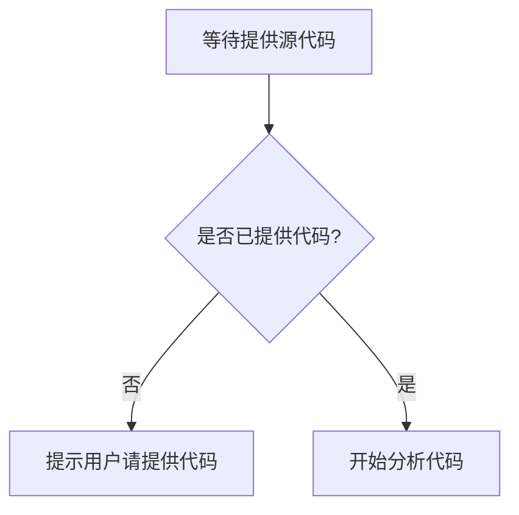

# `diffusers\tests\pipelines\latent_consistency_models\__init__.py` 详细设计文档

未提供源代码

## 整体流程



## 类结构

```

```

## 全局变量及字段


    

## 全局函数及方法


## 关键组件


无关键组件可识别（未提供源代码）


## 问题及建议


### 已知问题

-   未提供代码内容，无法进行技术债务和优化空间分析

### 优化建议

-   请提供待分析的源代码以便进行详细的技术评估


## 其它


### 设计目标与约束
描述系统的核心设计目标，如高性能、可扩展性、易维护性等，并列出技术约束、业务约束、性能约束等。

### 错误处理与异常设计
明确异常分类、错误码体系、异常传播机制、统一的错误响应格式以及日志记录策略。

### 数据流与状态机
绘制主要业务对象的状态转换图，说明数据在系统中的流动路径、关键节点以及状态变更的触发条件。

### 外部依赖与接口契约
列出所有外部系统、第三方库及接口的调用方式，包括请求/响应结构、协议、版本号及兼容性要求。

### 性能要求与评估
定义响应时间、吞吐量、并发用户数、资源利用率等关键性能指标，并给出评估方法和基准测试方案。

### 安全性与合规性
阐述身份认证、授权、加密、审计等安全措施，以及符合行业标准（如GDPR、PCI‑DSS）的合规要求。

### 可维护性与可测试性
说明代码组织、模块化原则、单元测试覆盖率、集成测试策略及持续集成/持续部署流水线设计。

### 部署架构
描述服务实例数量、负载均衡、容器化方案（如Docker、Kubernetes）以及多环境（开发、测试、生产）部署拓扑。

### 监控与日志
定义关键监控指标、日志收集方案、告警阈值以及故障定位的追踪链路（如使用ELK、Prometheus、Grafana）。

### 配置管理
明确配置文件的结构、配置加载方式、敏感信息的加密存储以及不同环境的配置切换机制。

### 版本管理与发布策略
规定代码分支模型（如Git Flow）、版本号命名规则、发布节奏以及回滚方案。

### 资源管理
说明CPU、内存、磁盘、网络等资源的使用上限、分配策略以及超限的熔断与降级机制。

### 文档与注释规范
制定代码注释、API文档、技术手册的编写规范，确保文档与代码同步更新。

### 扩展性与未来考虑
分析系统未来可能的功能扩展、业务增长和技术演进，并预留相应的接口和升级路径。

    