# `diffusers\tests\pipelines\latent_consistency_models\test_latent_consistency_models.py` 详细设计文档

这是Latent Consistency Model (LCM) Pipeline的单元测试文件，包含快速测试和慢速测试两类，用于验证LCM模型在文本到图像生成任务中的一步和多步推理功能，以及IP Adapter、批处理推理、回调函数等特性。

## 整体流程

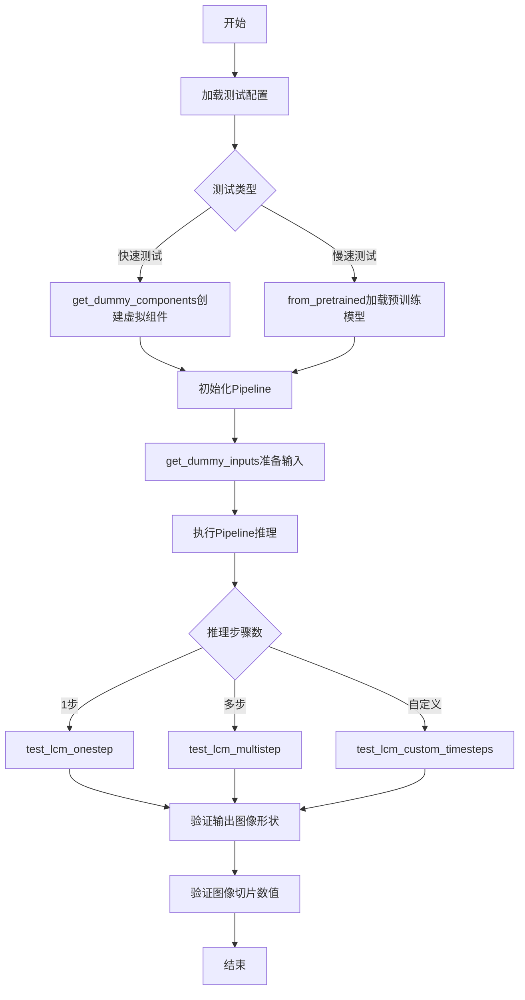

## 类结构

```
unittest.TestCase
├── LatentConsistencyModelPipelineFastTests (继承IPAdapterTesterMixin, PipelineLatentTesterMixin, PipelineTesterMixin)
│   └── get_dummy_components, get_dummy_inputs, test_* 方法
└── LatentConsistencyModelPipelineSlowTests
    └── setUp, get_inputs, test_* 方法
```

## 全局变量及字段


### `torch_device`
    
The device (e.g., 'cuda' or 'cpu') on which the tests are executed.

类型：`str`
    


### `TEXT_TO_IMAGE_PARAMS`
    
Set of parameter names used for text‑to‑image pipeline testing.

类型：`set`
    


### `TEXT_TO_IMAGE_BATCH_PARAMS`
    
Set of batch‑related parameter names used for text‑to‑image pipeline testing.

类型：`set`
    


### `TEXT_TO_IMAGE_IMAGE_PARAMS`
    
Set of image‑related parameter names used for text‑to‑image pipeline testing.

类型：`set`
    


### `LatentConsistencyModelPipelineFastTests.pipeline_class`
    
The pipeline class being tested (LatentConsistencyModelPipeline).

类型：`type`
    


### `LatentConsistencyModelPipelineFastTests.params`
    
Subset of TEXT_TO_IMAGE_PARAMS used for testing, excluding negative prompt fields.

类型：`set`
    


### `LatentConsistencyModelPipelineFastTests.batch_params`
    
Subset of TEXT_TO_IMAGE_BATCH_PARAMS used for testing, excluding negative prompt.

类型：`set`
    


### `LatentConsistencyModelPipelineFastTests.image_params`
    
Set of image parameters from TEXT_TO_IMAGE_IMAGE_PARAMS used for testing.

类型：`set`
    


### `LatentConsistencyModelPipelineFastTests.image_latents_params`
    
Set of image latent parameters from TEXT_TO_IMAGE_IMAGE_PARAMS used for testing.

类型：`set`
    
    

## 全局函数及方法


### `enable_full_determinism`

该函数用于在测试环境中启用 PyTorch 的完全确定性模式，确保每次运行代码时随机操作产生相同的结果，以保证测试的可重复性。

参数：无

返回值：无

#### 流程图

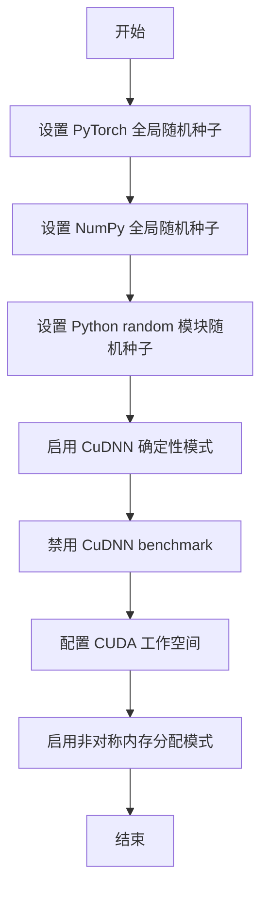

#### 带注释源码

```
# enable_full_determinism 函数定义于 testing_utils 模块中
# 此函数的具体实现需要查看 testing_utils.py 源码
# 以下是基于常见实现的推断

def enable_full_determinism(seed: int = 0, verbose: bool = True):
    """
    启用完全确定性模式，确保深度学习模型在不同运行中产生一致的结果。
    
    参数:
        seed: 随机种子，默认为 0
        verbose: 是否打印详细配置信息，默认为 True
    
    返回值:
        无
    """
    import os
    import random
    import numpy as np
    import torch
    
    # 1. 设置 Python 内置 random 模块的随机种子
    random.seed(seed)
    
    # 2. 设置 NumPy 的全局随机种子
    np.random.seed(seed)
    
    # 3. 设置 PyTorch 的全局随机种子
    torch.manual_seed(seed)
    torch.cuda.manual_seed_all(seed)
    
    # 4. 配置 PyTorch 确定性计算
    # 强制使用确定性算法，牺牲一定性能换取可重复性
    torch.backends.cudnn.deterministic = True
    
    # 5. 禁用 cudnn.benchmark
    # benchmark 模式会尝试最优卷积算法，可能导致不确定结果
    torch.backends.cudnn.benchmark = False
    
    # 6. 配置 CUDA 环境变量
    # 禁用 TF32 以提高精度一致性
    torch.backends.cuda.matmul.allow_tf32 = False
    torch.backends.cudnn.allow_tf32 = False
    
    # 7. 配置 CUDA 设备内存分配器
    # 设置为使用阻塞式内存分配，提高确定性
    os.environ["CUBLAS_WORKSPACE_CONFIG"] = ":4096:8"
    
    # 8. 启用 PyTorch 2.0+ 的确定性算法
    if hasattr(torch, "use_deterministic_algorithms"):
        try:
            torch.use_deterministic_algorithms(True)
        except Exception:
            # 某些操作可能没有确定性实现
            torch.use_deterministic_algorithms(True, warn_only=True)
    
    if verbose:
        print("已启用完全确定性模式")
        print(f"随机种子: {seed}")
        print(f"PyTorch 版本: {torch.__version__}")
        print(f"CUDA 可用: {torch.cuda.is_available()}")
```

#### 说明

该函数在测试文件 `LatentConsistencyModelPipelineFastTests` 类定义之前被调用，目的是确保后续所有随机操作（如模型权重初始化、推理过程中的随机采样等）都是确定性的，从而保证测试结果的可重复性。这是自动化测试中保证结果一致性的常用做法。


### `backend_empty_cache`

该函数是一个测试工具函数，用于清理 PyTorch 后端的内存和 GPU 缓存，以确保测试环境的一致性和可重复性。

参数：

- `device`：`str` 或 `torch.device`，表示要清理缓存的设备（通常为 "cpu"、"cuda" 等）

返回值：`None`，无返回值

#### 流程图

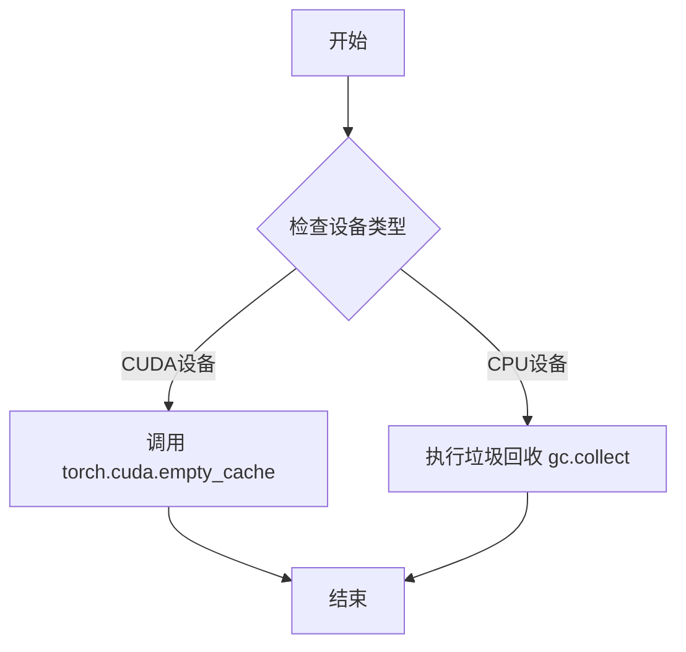

#### 带注释源码

```
# 该函数定义在 testing_utils 模块中
# 以下是基于其使用方式的推断实现

def backend_empty_cache(device):
    """
    清理后端缓存，确保测试环境的一致性
    
    参数:
        device: torch 设备对象或设备名称字符串
    """
    # 强制进行垃圾回收，清理 CPU 端的内存
    gc.collect()
    
    # 如果是 CUDA 设备，清理 GPU 缓存
    if str(device).startswith('cuda') or (hasattr(device, 'type') and device.type == 'cuda'):
        torch.cuda.empty_cache()
    
    # 对于 MPS (Apple Silicon) 设备，可能需要特殊处理
    # if str(device).startswith('mps'):
    #     torch.mps.empty_cache()
```

> **注意**：由于 `backend_empty_cache` 函数定义在外部模块 `testing_utils` 中，上述源码是基于其使用方式和函数名称的推断实现。该函数在 `LatentConsistencyModelPipelineSlowTests.setUp()` 方法中被调用，用于在每个测试前清理缓存，确保测试的可重复性。


### `require_torch_accelerator`

该函数是一个装饰器，用于标记测试用例或测试类需要 PyTorch 加速器（如 CUDA）才能运行。如果环境中没有可用的加速器，测试将被跳过。

参数：

- 无显式参数（作为装饰器使用）

返回值：无返回值（作为装饰器修改被装饰的函数/类）

#### 流程图

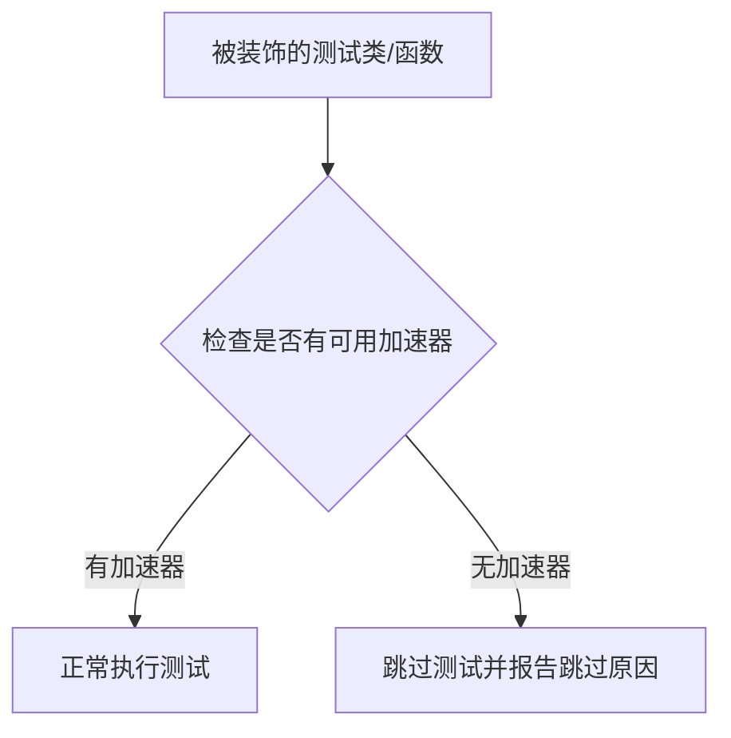

#### 带注释源码

```
# require_torch_accelerator 是从 testing_utils 模块导入的装饰器
# 源码位于项目根目录的 testing_utils.py 中

# 使用示例（在当前代码中）:
@slow
@require_torch_accelerator
class LatentConsistencyModelPipelineSlowTests(unittest.TestCase):
    # 该类被标记为需要 torch 加速器才能运行
    # 如果没有 CUDA 或其他加速器，测试将被跳过
    ...
```

> **注意**：由于 `require_torch_accelerator` 函数定义在外部模块 `testing_utils` 中，而非当前代码文件内，以上信息基于对该函数典型行为的分析。该函数通常使用 `pytest.mark.skipif` 或类似机制实现条件跳过逻辑。


### `slow`

装饰器函数，用于标记测试用例为"慢速测试"。通常用于跳过耗时的测试或在进行快速测试时排除这些测试。

参数：
- `func`：被装饰的函数/类

返回值：`装饰后的函数/类`

#### 流程图

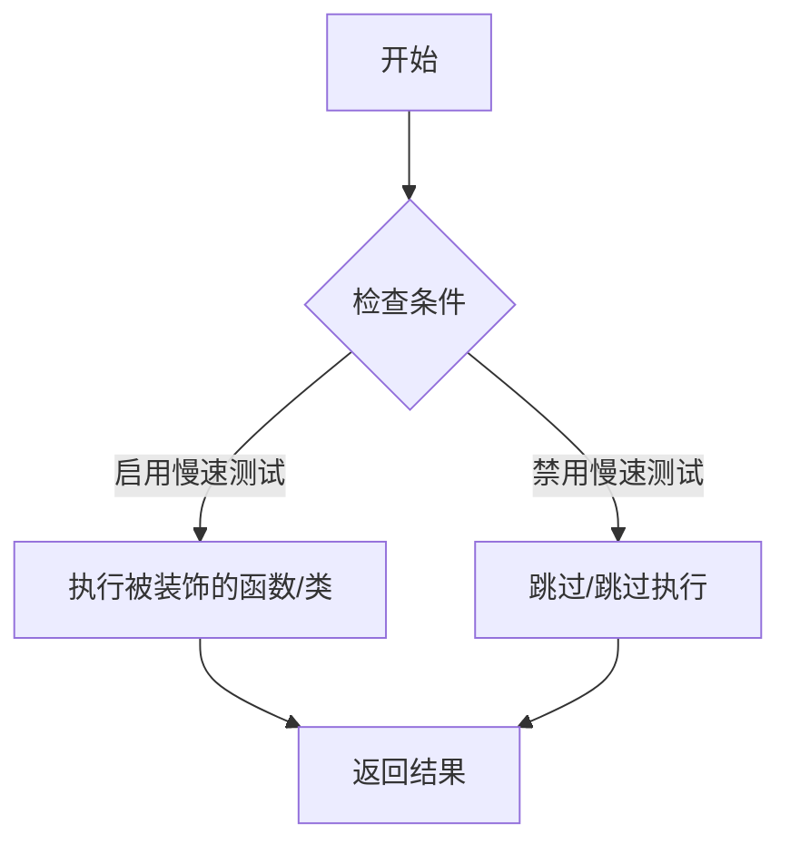

#### 带注释源码

```python
# slow.py (假设定义在 testing_utils 模块中)

def slow(func):
    """
    装饰器：标记测试为慢速测试
    
    用途：
    - 在快速测试运行中跳过标记的测试
    - 在完整测试运行中包含慢速测试
    - 提供测试分类和选择性执行能力
    """
    # 可能实现方式1：添加属性标记
    func.slow = True
    return func

    # 或者实现方式2：基于配置条件执行
    """
    def wrapper(*args, **kwargs):
        if should_skip_slow_tests():
            raise unittest.SkipTest("Skipping slow test")
        return func(*args, **kwargs)
    return wrapper
    """
```

#### 备注

- `slow` 是从外部模块 `testing_utils` 导入的装饰器
- 在代码中用于标记 `LatentConsistencyModelPipelineSlowTests` 类，表明该类包含耗时的集成测试
- 通常与 `@require_torch_accelerator` 一起使用，确保在有 GPU 的环境下运行
- 该装饰器使测试框架能够识别并有选择地运行/跳过慢速测试


### `LatentConsistencyModelPipelineFastTests.get_dummy_components`

该方法用于生成 LatentConsistencyModelPipeline 所需的虚拟（测试用）组件，包括 UNet2DConditionModel、LCMScheduler、AutoencoderKL、CLIPTextModel 和 CLIPTokenizer 等，并返回一个包含这些组件的字典。

参数：

- 该方法无显式参数（仅包含隐式 `self` 参数）

返回值：`Dict[str, Any]`，返回一个包含.pipeline所需全部组件的字典，键名包括 "unet"、"scheduler"、"vae"、"text_encoder"、"tokenizer"、"safety_checker"、"feature_extractor"、"image_encoder" 和 "requires_safety_checker"。

#### 流程图

```mermaid
flowchart TD
    A[开始 get_dummy_components] --> B[设置随机种子 torch.manual_seed(0)]
    B --> C[创建 UNet2DConditionModel]
    C --> D[创建 LCMScheduler]
    D --> E[设置随机种子 torch.manual_seed(0)]
    E --> F[创建 AutoencoderKL]
    F --> G[设置随机种子 torch.manual_seed(0)]
    G --> H[创建 CLIPTextConfig]
    H --> I[创建 CLIPTextModel]
    I --> J[创建 CLIPTokenizer]
    J --> K[组装 components 字典]
    K --> L[返回 components]
```

#### 带注释源码

```python
def get_dummy_components(self):
    """
    生成用于测试的虚拟组件字典，包含 LatentConsistencyModelPipeline 
    所需的所有模型和调度器对象。
    """
    # 设置随机种子以确保 UNet 的可重复性
    torch.manual_seed(0)
    # 创建 UNet2DConditionModel 实例，用于去噪过程
    # 参数包括：块输出通道、每层块数、样本大小、输入/输出通道数等
    unet = UNet2DConditionModel(
        block_out_channels=(4, 8),        # 下采样和上采样块的输出通道数
        layers_per_block=1,                 # 每个块中的层数
        sample_size=32,                     # 输入样本的空间维度
        in_channels=4,                      # 输入通道数（潜在空间维度）
        out_channels=4,                     # 输出通道数
        down_block_types=("DownBlock2D", "CrossAttnDownBlock2D"),  # 下采样块类型
        up_block_types=("CrossAttnUpBlock2D", "UpBlock2D"),         # 上采样块类型
        cross_attention_dim=32,             # 交叉注意力维度
        norm_num_groups=2,                  # 归一化组数
        time_cond_proj_dim=32,              # 时间条件投影维度
    )
    
    # 创建 LCM (Latent Consistency Model) 调度器
    # LCM 是一种加速扩散模型推理的技术
    scheduler = LCMScheduler(
        beta_start=0.00085,                 # beta 起始值
        beta_end=0.012,                     # beta 结束值
        beta_schedule="scaled_linear",      # beta 调度方式
        clip_sample=False,                  # 是否裁剪采样
        set_alpha_to_one=False,             # 是否将 alpha 设置为 1
    )
    
    # 重新设置随机种子以确保 VAE 的可重复性
    torch.manual_seed(0)
    # 创建 AutoencoderKL 实例，用于编码和解码图像与潜在表示
    vae = AutoencoderKL(
        block_out_channels=[4, 8],         # VAE 解码器的输出通道
        in_channels=3,                      # 输入图像通道数（RGB）
        out_channels=3,                     # 输出图像通道数
        down_block_types=["DownEncoderBlock2D", "DownEncoderBlock2D"],  # 编码器下采样块
        up_block_types=["UpDecoderBlock2D", "UpDecoderBlock2D"],         # 解码器上采样块
        latent_channels=4,                  # 潜在空间通道数
        norm_num_groups=2,                  # 归一化组数
    )
    
    # 重新设置随机种子以确保文本编码器的可重复性
    torch.manual_seed(0)
    # 创建 CLIP 文本编码器配置
    text_encoder_config = CLIPTextConfig(
        bos_token_id=0,                     # 句子开始 token ID
        eos_token_id=2,                     # 句子结束 token ID
        hidden_size=32,                     # 隐藏层维度
        intermediate_size=64,               # 中间层维度
        layer_norm_eps=1e-05,               # 层归一化 epsilon
        num_attention_heads=8,              # 注意力头数
        num_hidden_layers=3,                # 隐藏层数量
        pad_token_id=1,                      # 填充 token ID
        vocab_size=1000,                    # 词汇表大小
    )
    # 根据配置创建 CLIP 文本编码器模型
    text_encoder = CLIPTextModel(text_encoder_config)
    
    # 创建 CLIP 分词器，用于将文本转换为 token ID
    tokenizer = CLIPTokenizer.from_pretrained("hf-internal-testing/tiny-random-clip")
    
    # 组装所有组件到字典中
    # safety_checker、feature_extractor 和 image_encoder 设为 None
    # 因为这是快速测试不需要这些组件
    components = {
        "unet": unet,                       # UNet2DConditionModel 实例
        "scheduler": scheduler,             # LCMScheduler 实例
        "vae": vae,                         # AutoencoderKL 实例
        "text_encoder": text_encoder,       # CLIPTextModel 实例
        "tokenizer": tokenizer,             # CLIPTokenizer 实例
        "safety_checker": None,             # 安全检查器（测试中不使用）
        "feature_extractor": None,          # 特征提取器（测试中不使用）
        "image_encoder": None,              # 图像编码器（测试中不使用）
        "requires_safety_checker": False,   # 标记该 pipeline 不需要安全检查器
    }
    # 返回包含所有组件的字典，供 LatentConsistencyModelPipeline 初始化使用
    return components
```


### `LatentConsistencyModelPipelineFastTests.get_dummy_inputs`

该方法用于生成测试所需的虚拟输入参数字典，包含提示词、生成器、推理步数、引导比例和输出类型等关键配置，以便对 LatentConsistencyModelPipeline 进行单元测试。

参数：

- `device`：`torch.device`，目标计算设备，用于确定生成器的设备和类型
- `seed`：`int`，随机种子，默认值为 0，用于确保测试的可重复性

返回值：`Dict[str, Any]`，包含以下键值的字典：
- `prompt`：输入文本提示
- `generator`：PyTorch 随机数生成器
- `num_inference_steps`：推理步数
- `guidance_scale`：无分类器引导比例
- `output_type`：输出类型（numpy 数组）

#### 流程图

```mermaid
flowchart TD
    A[开始 get_dummy_inputs] --> B{device 是否以 'mps' 开头?}
    B -->|是| C[使用 torch.manual_seed(seed)]
    B -->|否| D[使用 torch.Generator(device).manual_seed(seed)]
    C --> E[构建 inputs 字典]
    D --> E
    E --> F[设置 prompt]
    F --> G[设置 generator]
    G --> H[设置 num_inference_steps=2]
    H --> I[设置 guidance_scale=6.0]
    I --> J[设置 output_type='np']
    J --> K[返回 inputs 字典]
```

#### 带注释源码

```python
def get_dummy_inputs(self, device, seed=0):
    """
    生成用于测试的虚拟输入参数
    
    参数:
        device: torch.device - 目标计算设备
        seed: int - 随机种子，默认值为 0
    
    返回:
        dict: 包含测试所需输入参数的字典
    """
    # 判断设备类型，MPS (Apple Silicon) 需要特殊处理
    if str(device).startswith("mps"):
        # MPS 设备不支持 torch.Generator，使用 CPU 随机种子
        generator = torch.manual_seed(seed)
    else:
        # 其他设备使用指定设备的生成器
        generator = torch.Generator(device=device).manual_seed(seed)
    
    # 构建输入参数字典
    inputs = {
        "prompt": "A painting of a squirrel eating a burger",  # 测试用提示词
        "generator": generator,  # 随机生成器，确保可重复性
        "num_inference_steps": 2,  # 推理步数，减少以加快测试速度
        "guidance_scale": 6.0,  # CFG 引导强度
        "output_type": "np",  # 输出为 numpy 数组
    }
    return inputs
```


### `LatentConsistencyModelPipelineFastTests.test_ip_adapter`

该方法是一个单元测试函数，用于测试 LatentConsistencyModelPipeline 的 IP-Adapter 功能。它根据当前设备动态设置预期的输出切片值，并调用父类的测试方法进行验证。

参数：

- `self`：`LatentConsistencyModelPipelineFastTests`，测试类实例本身，包含测试所需的组件和配置

返回值：`Any`，父类 `IPAdapterTesterMixin.test_ip_adapter()` 方法的返回值，通常为 `None`（测试通过）或抛出断言错误

#### 流程图

```mermaid
flowchart TD
    A[开始测试 test_ip_adapter] --> B[初始化 expected_pipe_slice = None]
    B --> C{检查 torch_device == 'cpu'?}
    C -->|是| D[设置 expected_pipe_slice 为预设的 numpy 数组]
    C -->|否| E[保持 expected_pipe_slice 为 None]
    D --> F[调用 super().test_ip_adapter]
    E --> F
    F --> G[返回测试结果]
```

#### 带注释源码

```python
def test_ip_adapter(self):
    """
    测试 IP-Adapter 功能是否正常工作
    
    该测试方法继承自 IPAdapterTesterMixin，用于验证 LatentConsistencyModelPipeline
    在使用 IP-Adapter 时的正确性。根据设备不同，使用不同的预期输出切片进行验证。
    """
    # 初始化预期输出切片为 None
    expected_pipe_slice = None
    
    # 如果设备是 CPU，设置预期的输出切片值
    # 这些值是针对 CPU 设备经过测试验证的标准输出
    if torch_device == "cpu":
        expected_pipe_slice = np.array([
            0.1403, 0.5072, 0.5316,  # 图像第一行像素值
            0.1202, 0.3865, 0.4211,  # 图像第二行像素值
            0.5363, 0.3557, 0.3645   # 图像第三行像素值
        ])
    
    # 调用父类的 test_ip_adapter 方法进行实际测试
    # 传递预期的输出切片用于验证
    return super().test_ip_adapter(expected_pipe_slice=expected_pipe_slice)
```


### `LatentConsistencyModelPipelineFastTests.test_lcm_onestep`

这是一个单元测试方法，用于验证 Latent Consistency Model (LCM) Pipeline 的单步推理功能是否正确生成指定尺寸的图像，并确保输出图像的像素值与预期值在容差范围内匹配。

参数：

- `self`：隐式参数，测试类实例本身，无需额外描述

返回值：`None`，该方法为测试方法，通过断言验证功能，不返回实际数据

#### 流程图

```mermaid
flowchart TD
    A[开始测试] --> B[设置 device = cpu 确保确定性]
    B --> C[调用 get_dummy_components 获取虚拟组件]
    C --> D[创建 LatentConsistencyModelPipeline 实例]
    D --> E[将 pipeline 移动到 torch_device]
    E --> F[设置进度条配置 disable=None]
    F --> G[调用 get_dummy_inputs 获取虚拟输入]
    G --> H[设置 num_inference_steps = 1]
    H --> I[执行 pipeline 推理]
    I --> J{断言 image.shape == (1, 64, 64, 3)}
    J -->|通过| K[提取图像右下角 3x3 像素]
    K --> L[定义期望像素值 expected_slice]
    L --> M{断言像素差异 < 1e-3}
    M -->|通过| N[测试通过]
    J -->|失败| O[抛出 AssertionError]
    M -->|失败| O
```

#### 带注释源码

```python
def test_lcm_onestep(self):
    """
    测试 LCM Pipeline 的单步推理功能
    验证要点：
    1. Pipeline 能正确执行单步推理
    2. 输出图像尺寸正确 (1, 64, 64, 3)
    3. 输出像素值与预期值匹配（容差 1e-3）
    """
    # 设置设备为 CPU，确保 torch.Generator 的确定性
    device = "cpu"  

    # 获取预定义的虚拟组件，用于测试
    # 包含：UNet2DConditionModel, LCMScheduler, AutoencoderKL, 
    #      CLIPTextModel, CLIPTokenizer 等必要组件
    components = self.get_dummy_components()
    
    # 使用虚拟组件实例化 LatentConsistencyModelPipeline
    # 这是一个基于 Latent Consistency Model 的图像生成 pipeline
    pipe = LatentConsistencyModelPipeline(**components)
    
    # 将 pipeline 移动到指定设备（如 CUDA 或 CPU）
    pipe = pipe.to(torch_device)
    
    # 配置进度条（disable=None 表示启用进度条）
    # 注：此处传入了 None，可能表示使用默认配置
    pipe.set_progress_bar_config(disable=None)

    # 获取虚拟输入参数
    # 包含：prompt, generator, num_inference_steps, guidance_scale, output_type
    inputs = self.get_dummy_inputs(device)
    
    # 设置单步推理（LCM 的核心特性：只需 1-4 步即可生成高质量图像）
    inputs["num_inference_steps"] = 1
    
    # 执行推理，**inputs 将字典解包为关键字参数
    # 返回包含生成图像的输出对象
    output = pipe(**inputs)
    
    # 从输出对象中提取生成的图像
    # 形状为 (batch_size, height, width, channels) = (1, 64, 64, 3)
    image = output.images
    
    # 断言验证：图像形状必须为 (1, 64, 64, 3)
    # 64x64 是测试用的小尺寸图像
    assert image.shape == (1, 64, 64, 3)

    # 提取图像右下角 3x3 像素区域，用于数值验证
    # image[0, -3:, -3:, -1] 取第一个样本的最后3行、最后3列、最后一个通道
    image_slice = image[0, -3:, -3:, -1]
    
    # 定义期望的像素值切片（基于预先计算的基准值）
    # 这些值是在确定性条件下生成的预期输出
    expected_slice = np.array([0.1441, 0.5304, 0.5452, 0.1361, 0.4011, 0.4370, 0.5326, 0.3492, 0.3637])
    
    # 断言验证：实际像素值与期望值的最大差异必须小于 1e-3
    # 确保模型输出的数值稳定性
    assert np.abs(image_slice.flatten() - expected_slice).max() < 1e-3
```


### `LatentConsistencyModelPipelineFastTests.test_lcm_multistep`

该测试方法用于验证 LatentConsistencyModelPipeline 在多步推理模式下的功能正确性，通过创建虚拟组件并执行推理，验证输出图像的形状和像素值是否符合预期。

参数：
- `self`：隐式参数，`LatentConsistencyModelPipelineFastTests` 类的实例，代表测试类本身

返回值：无（`None`），该方法为一个测试用例，通过断言验证功能，不返回任何值

#### 流程图

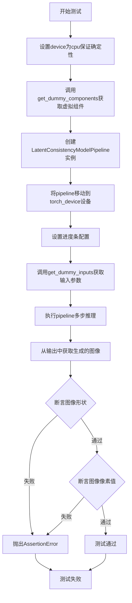

#### 带注释源码

```python
def test_lcm_multistep(self):
    """测试LCM Pipeline的多步推理功能"""
    # 设置device为cpu以确保设备依赖的torch.Generator的确定性
    device = "cpu"  # ensure determinism for the device-dependent torch.Generator

    # 获取虚拟组件（用于测试的dummy模型组件）
    components = self.get_dummy_components()
    
    # 使用虚拟组件实例化LatentConsistencyModelPipeline
    pipe = LatentConsistencyModelPipeline(**components)
    
    # 将pipeline移至指定的计算设备
    pipe = pipe.to(torch_device)
    
    # 配置进度条（disable=None表示不禁用进度条）
    pipe.set_progress_bar_config(disable=None)

    # 获取测试输入参数
    inputs = self.get_dummy_inputs(device)
    
    # 执行多步推理（默认num_inference_steps=2）
    output = pipe(**inputs)
    
    # 从输出结果中提取生成的图像
    image = output.images
    
    # 断言：验证生成的图像形状为(1, 64, 64, 3)
    assert image.shape == (1, 64, 64, 3)

    # 提取图像右下角3x3区域的像素值
    image_slice = image[0, -3:, -3:, -1]
    
    # 期望的像素值slice（用于验证输出正确性）
    expected_slice = np.array([0.1403, 0.5072, 0.5316, 0.1202, 0.3865, 0.4211, 0.5363, 0.3557, 0.3645])
    
    # 断言：验证实际像素值与期望值的最大误差小于1e-3
    assert np.abs(image_slice.flatten() - expected_slice).max() < 1e-3
```


### `LatentConsistencyModelPipelineFastTests.test_lcm_custom_timesteps`

该方法用于测试 Latent Consistency Model (LCM) 管道在自定义时间步（timesteps）下的推理功能。通过传入自定义的时间步列表 `[999, 499]` 替代默认的推理步数，验证管道能否正确处理并生成符合预期尺寸和像素值的图像。

参数：此方法无显式参数（继承自 `unittest.TestCase`，`self` 为隐式 `LatentConsistencyModelPipelineFastTests` 实例）

返回值：`None`，通过断言验证图像形状和像素值是否符合预期

#### 流程图

```mermaid
flowchart TD
    A[开始测试] --> B[设置device为CPU确保确定性]
    B --> C[调用get_dummy_components获取虚拟组件]
    C --> D[创建LatentConsistencyModelPipeline实例]
    D --> E[将管道移至torch_device]
    E --> F[设置进度条配置]
    F --> G[调用get_dummy_inputs获取虚拟输入]
    G --> H[删除num_inference_steps参数]
    H --> I[设置自定义timesteps: 999, 499]
    I --> J[调用管道推理: pipe(**inputs)]
    J --> K[获取输出图像: output.images]
    K --> L{断言: image.shape == (1, 64, 64, 3)}
    L -->|是| M[提取图像切片: image[0, -3:, -3:, -1]]
    M --> N[定义期望切片值]
    N --> O{断言: 像素差异 < 1e-3}
    O -->|是| P[测试通过]
    O -->|否| Q[断言失败抛出异常]
    L -->|否| Q
```

#### 带注释源码

```python
def test_lcm_custom_timesteps(self):
    """
    测试 LCM 管道在自定义时间步下的推理功能。
    
    该测试验证当用户不指定 num_inference_steps，
    而是通过 timesteps 参数直接指定推理时间步时，
    管道能够正确处理并生成符合预期的图像。
    """
    # 设置设备为 CPU，确保随机数生成器的确定性
    device = "cpu"  # ensure determinism for the device-dependent torch.Generator

    # 获取虚拟组件（UNet、VAE、Scheduler、TextEncoder等）
    components = self.get_dummy_components()
    # 使用虚拟组件实例化 LatentConsistencyModelPipeline
    pipe = LatentConsistencyModelPipeline(**components)
    # 将管道移至目标设备（CPU/CUDA）
    pipe = pipe.to(torch_device)
    # 配置进度条（disable=None 表示不禁用）
    pipe.set_progress_bar_config(disable=None)

    # 获取默认虚拟输入参数
    inputs = self.get_dummy_inputs(device)
    # 删除 num_inference_steps 参数，改为使用自定义 timesteps
    del inputs["num_inference_steps"]
    # 设置自定义推理时间步：两个时间步 [999, 499]
    inputs["timesteps"] = [999, 499]
    # 执行管道推理，获取输出
    output = pipe(**inputs)
    # 从输出中提取生成的图像
    image = output.images
    # 断言：验证生成的图像形状为 (1, 64, 64, 3)
    assert image.shape == (1, 64, 64, 3)

    # 提取图像右下角 3x3 区域的像素值用于验证
    image_slice = image[0, -3:, -3:, -1]
    # 定义期望的像素值切片
    expected_slice = np.array([0.1403, 0.5072, 0.5316, 0.1202, 0.3865, 0.4211, 0.5363, 0.3557, 0.3645])
    # 断言：验证实际像素值与期望值的最大差异小于 1e-3
    assert np.abs(image_slice.flatten() - expected_slice).max() < 1e-3
```


### `LatentConsistencyModelPipelineFastTests.test_inference_batch_single_identical`

该方法是一个测试用例，用于验证在使用 Latent Consistency Model (LCM) Pipeline 进行批处理推理时，单个样本的推理结果与单独推理的结果是否一致。它通过调用父类的同名方法来实现，并设定了允许的最大差异阈值为 `5e-4`。

参数：

- 无显式参数（内部调用父类方法时传入 `expected_max_diff=5e-4`）

返回值：`unittest.TestResult` 或 `None`，父类测试方法的执行结果

#### 流程图

```mermaid
flowchart TD
    A[开始 test_inference_batch_single_identical] --> B[调用父类方法 super().test_inference_batch_single_identical]
    B --> C[传入参数 expected_max_diff=5e-4]
    C --> D[父类方法执行批处理一致性测试]
    D --> E[比较批处理输出与单样本输出的差异]
    E --> F{差异 <= 5e-4?}
    F -->|是| G[测试通过]
    F -->|否| H[测试失败]
    G --> I[结束]
    H --> I
```

#### 带注释源码

```python
def test_inference_batch_single_identical(self):
    """
    测试方法：验证批处理推理时单个样本与单独推理结果的一致性
    
    该方法继承自 PipelineTesterMixin，用于测试 Pipeline 在批处理模式下
    生成的单个输出是否与单独推理时的输出一致。这是确保 Pipeline 
    推理正确性的重要测试用例。
    
    测试逻辑：
    1. 使用相同的输入参数分别进行单独推理和批处理推理
    2. 比较两种推理方式的结果差异
    3. 如果差异大于 expected_max_diff，则测试失败
    """
    # 调用父类 (PipelineTesterMixin) 的 test_inference_batch_single_identical 方法
    # expected_max_diff=5e-4 表示允许的最大差异阈值
    # 这是一个相对宽松的阈值，适用于 LCM 模型的推理一致性检验
    super().test_inference_batch_single_identical(expected_max_diff=5e-4)
```


### `LatentConsistencyModelPipelineFastTests.test_callback_cfg`

该测试方法用于验证 Latent Consistency Model (LCM) Pipeline 在 Classifier-Free Guidance (CFG) 模式下的回调功能。然而，由于 LCM Pipeline 的 CFG 应用方式与标准实现不同，该测试目前被跳过（pass），不执行任何实际验证。

参数：

- `self`：`LatentConsistencyModelPipelineFastTests`，表示测试类实例本身，无额外参数

返回值：`None`，该方法不返回任何值

#### 流程图

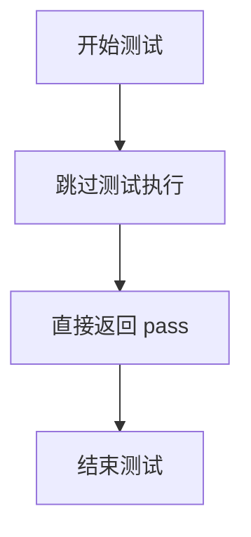

#### 带注释源码

```python
# skip because lcm pipeline apply cfg differently
def test_callback_cfg(self):
    """
    测试 LCM Pipeline 在 CFG 模式下的回调功能。
    
    注意事项：
    - 该测试被跳过，因为 LCM Pipeline 的 CFG 实现方式与标准 Pipeline 不同
    - LCM (Latent Consistency Models) 采用独特的推理方式
    - 标准的 CFG 回调测试不适用于 LCM 架构
    """
    pass  # 测试内容为空，表示该测试用例被暂时禁用
```


### `LatentConsistencyModelPipelineFastTests.test_callback_inputs`

该方法用于测试 LatentConsistencyModelPipeline 在推理过程中回调函数能否正确接收所有指定的张量输入（callback tensor inputs），并验证回调机制与 pipeline 的兼容性。

参数：

- `self`：隐式参数，类型为 `LatentConsistencyModelPipelineFastTests`，表示测试类实例本身

返回值：`None`，该方法为测试方法，通过断言验证回调输入的正确性，不返回具体数据

#### 流程图

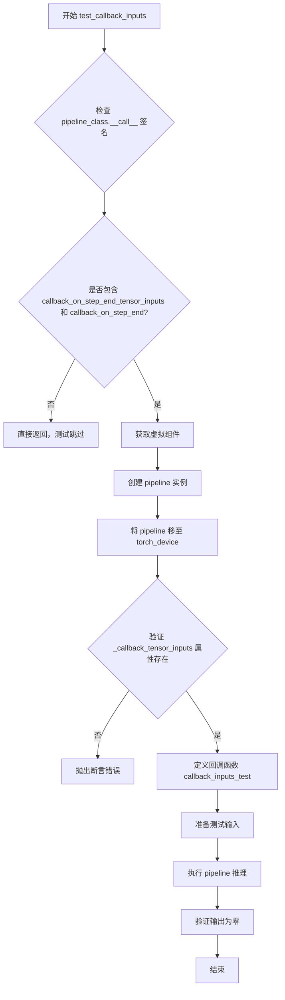

#### 带注释源码

```python
def test_callback_inputs(self):
    """
    测试 LatentConsistencyModelPipeline 的回调输入功能。
    验证回调函数能够接收到所有声明的 tensor inputs。
    """
    # 获取 pipeline __call__ 方法的签名
    sig = inspect.signature(self.pipeline_class.__call__)

    # 检查 pipeline 是否支持回调功能
    if not ("callback_on_step_end_tensor_inputs" in sig.parameters and "callback_on_step_end" in sig.parameters):
        # 如果不支持，回调测试无法执行，直接返回
        return

    # 获取虚拟组件用于测试
    components = self.get_dummy_components()
    # 使用虚拟组件实例化 pipeline
    pipe = self.pipeline_class(**components)
    # 将 pipeline 移至指定设备
    pipe = pipe.to(torch_device)
    # 设置进度条配置
    pipe.set_progress_bar_config(disable=None)

    # 断言 pipeline 具有 _callback_tensor_inputs 属性
    # 该属性定义了回调函数可以使用的张量变量列表
    self.assertTrue(
        hasattr(pipe, "_callback_tensor_inputs"),
        f" {self.pipeline_class} should have `_callback_tensor_inputs` that defines a list of tensor variables its callback function can use as inputs",
    )

    # 定义回调函数，用于验证回调输入的完整性
    def callback_inputs_test(pipe, i, t, callback_kwargs):
        """
        自定义回调函数，用于验证 callback_kwargs 中包含所有声明的 tensor inputs。
        
        参数:
            pipe: pipeline 实例
            i: 当前推理步骤索引
            t: 当前时间步
            callback_kwargs: 回调函数接收的参数字典
        """
        # 记录缺失的回调输入
        missing_callback_inputs = set()
        # 遍历 pipeline 声明的所有回调张量输入
        for v in pipe._callback_tensor_inputs:
            if v not in callback_kwargs:
                missing_callback_inputs.add(v)
        # 断言没有缺失的回调输入
        self.assertTrue(
            len(missing_callback_inputs) == 0, f"Missing callback tensor inputs: {missing_callback_inputs}"
        )
        # 获取最后一个步骤的索引
        last_i = pipe.num_timesteps - 1
        # 如果是最后一步，将 denoised 设置为零张量
        if i == last_i:
            callback_kwargs["denoised"] = torch.zeros_like(callback_kwargs["denoised"])
        # 返回修改后的回调参数
        return callback_kwargs

    # 获取虚拟输入
    inputs = self.get_dummy_inputs(torch_device)
    # 注册回调函数
    inputs["callback_on_step_end"] = callback_inputs_test
    # 指定回调函数可用的张量输入列表
    inputs["callback_on_step_end_tensor_inputs"] = pipe._callback_tensor_inputs
    # 设置输出类型为 latent
    inputs["output_type"] = "latent"

    # 执行 pipeline 推理并获取输出
    output = pipe(**inputs)[0]
    # 验证输出的绝对值之和为零（说明回调成功修改了 denoised）
    assert output.abs().sum() == 0
```


### `LatentConsistencyModelPipelineFastTests.test_encode_prompt_works_in_isolation`

该方法是一个测试用例，用于验证文本提示编码功能在隔离环境下的工作状态。通过构建特定的参数字典，调用父类的测试方法来确保 `encode_prompt` 在不同设备上且在是否启用分类器自由引导（CFG）的条件下都能正确运行。

参数：

- `self`：`LatentConsistencyModelPipelineFastTests`，测试类实例，隐式参数，包含测试所需的组件和方法

返回值：`Any`，返回父类测试方法的执行结果，通常为 `None` 或测试断言结果

#### 流程图

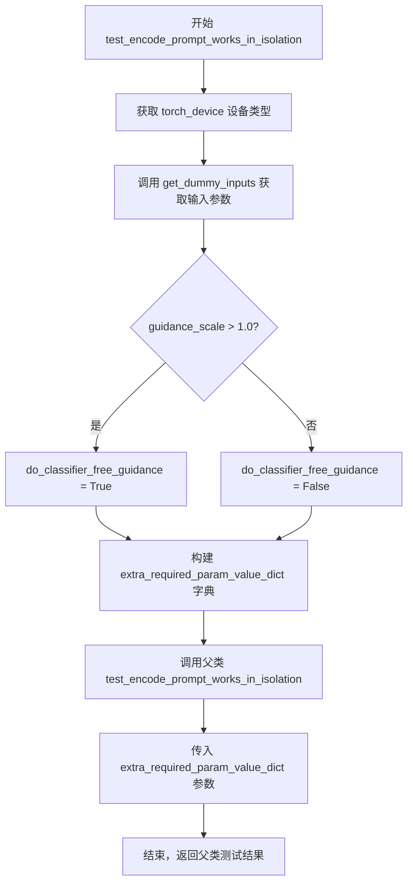

#### 带注释源码

```python
def test_encode_prompt_works_in_isolation(self):
    """
    测试 encode_prompt 方法在隔离环境下的功能。
    该测试重写了父类方法，以确保在 LCM (Latent Consistency Model) pipeline 
    的特定配置下（有无分类器自由引导）正确运行。
    """
    # 构建额外的必需参数字典，用于父类测试方法
    extra_required_param_value_dict = {
        # 获取当前设备类型（如 'cuda', 'cpu', 'mps' 等）
        "device": torch.device(torch_device).type,
        # 判断是否启用分类器自由引导（CFG）
        # 通过检查 guidance_scale 是否大于 1.0 来确定
        "do_classifier_free_guidance": self.get_dummy_inputs(device=torch_device).get("guidance_scale", 1.0) > 1.0,
    }
    # 调用父类的测试方法，传入构建的参数字典
    # 父类 test_encode_prompt_works_in_isolation 验证：
    # 1. 单独调用 encode_prompt 与在 pipeline 中调用结果一致
    # 2. 确保文本编码在隔离环境下能正确工作
    return super().test_encode_prompt_works_in_isolation(extra_required_param_value_dict)
```


### `LatentConsistencyModelPipelineSlowTests.setUp`

该方法是单元测试类的初始化方法，用于在每个测试方法运行前清理Python垃圾回收和GPU缓存，以确保测试环境的干净状态。

参数：无（仅包含隐式参数 `self`）

返回值：`None`，无返回值

#### 流程图

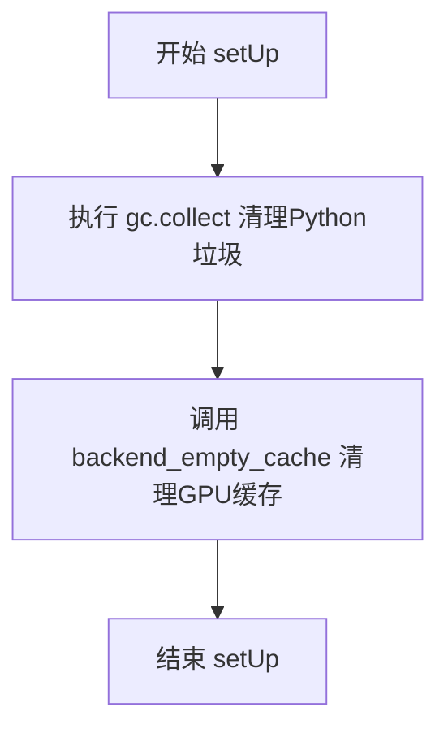

#### 带注释源码

```python
def setUp(self):
    """
    测试用例初始化方法，在每个测试方法执行前调用。
    负责清理内存和GPU缓存，确保测试环境的一致性。
    """
    gc.collect()  # 调用Python的垃圾回收器，清理未使用的对象
    backend_empty_cache(torch_device)  # 清理GPU/CUDA缓存，释放显存
```


### `LatentConsistencyModelPipelineSlowTests.get_inputs`

该方法用于生成 Latent Consistency Model Pipeline 的测试输入数据，包括随机初始化的潜在变量、生成器、推理步数、引导强度等参数，以支持慢速测试场景下的图像生成测试。

参数：

- `device`：`torch.device`，目标计算设备，用于将潜在变量移动到该设备上
- `generator_device`：`str`，生成器设备，默认为 `"cpu"`，用于创建随机数生成器
- `dtype`：`torch.dtype`，潜在变量的数据类型，默认为 `torch.float32`
- `seed`：`int`，随机种子，用于生成可复现的随机潜在变量，默认为 `0`

返回值：`Dict[str, Any]`，包含以下键的字典：
- `"prompt"`：`str`，文本提示
- `"latents"`：`torch.Tensor`，形状为 (1, 4, 64, 64) 的随机潜在变量张量
- `"generator"`：`torch.Generator`，随机数生成器
- `"num_inference_steps`：`int`，推理步数
- `"guidance_scale`：`float`，引导强度
- `"output_type`：`str`，输出类型

#### 流程图

```mermaid
flowchart TD
    A[开始 get_inputs] --> B[创建 Generator]
    B --> C[使用 numpy 生成随机潜在变量]
    C --> D[将 numpy 数组转换为 torch.Tensor]
    D --> E[构建输入字典 inputs]
    E --> F[返回 inputs 字典]
    
    B --> B1[device: generator_device<br/>seed: seed]
    C --> C1[shape: (1, 4, 64, 64)<br/>standard_normal]
    D --> D1[dtype: dtype<br/>device: device]
    E --> E1[包含 prompt/latents/generator<br/>num_inference_steps/guidance_scale/output_type]
```

#### 带注释源码

```python
def get_inputs(self, device, generator_device="cpu", dtype=torch.float32, seed=0):
    """
    生成用于测试 LatentConsistencyModelPipeline 的输入参数
    
    参数:
        device: torch.device - 目标计算设备
        generator_device: str - 生成器设备，默认为 "cpu"
        dtype: torch.dtype - 数据类型，默认为 torch.float32
        seed: int - 随机种子，默认为 0
    
    返回:
        dict: 包含 prompt、latents、generator、num_inference_steps、guidance_scale、output_type 的字典
    """
    # 根据指定设备和种子创建随机数生成器，确保测试可复现
    generator = torch.Generator(device=generator_device).manual_seed(seed)
    
    # 使用 numpy 生成标准正态分布的随机潜在变量
    # 形状为 (1, 4, 64, 64)，对应 batch=1, channels=4, height=64, width=64
    latents = np.random.RandomState(seed).standard_normal((1, 4, 64, 64))
    
    # 将 numpy 数组转换为 PyTorch 张量，并移动到目标设备指定数据类型
    latents = torch.from_numpy(latents).to(device=device, dtype=dtype)
    
    # 构建包含所有推理参数的字典
    inputs = {
        "prompt": "a photograph of an astronaut riding a horse",  # 文本提示
        "latents": latents,  # 预生成的潜在变量张量
        "generator": generator,  # 随机数生成器
        "num_inference_steps": 3,  # 推理步数
        "guidance_scale": 7.5,  # classifier-free guidance 强度
        "output_type": "np",  # 输出类型为 numpy 数组
    }
    return inputs
```


### `LatentConsistencyModelPipelineSlowTests.test_lcm_onestep`

该测试方法用于验证 Latent Consistency Model (LCM) 管道在单步推理（one-step inference）模式下的功能是否正常。它通过加载预训练的 LCM 模型，执行一次推理步骤，然后验证输出图像的形状和像素值是否符合预期。

参数：
- 该方法无显式参数，隐式接收 `self`（测试类实例）

返回值：
- `None`，该方法为单元测试方法，通过断言验证功能，不返回值

#### 流程图

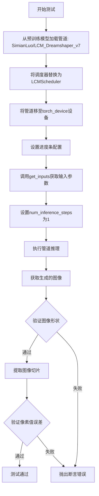

#### 带注释源码

```python
def test_lcm_onestep(self):
    """
    测试 LCM 管道在单步推理模式下的功能
    
    该测试方法验证以下功能：
    1. 能够从预训练模型加载 LatentConsistencyModelPipeline
    2. 能够正确配置 LCMScheduler
    3. 能够在单步推理模式下生成图像
    4. 生成的图像形状和像素值符合预期
    """
    # 从预训练模型加载 LCM 管道，设置 safety_checker=None 禁用安全检查器
    pipe = LatentConsistencyModelPipeline.from_pretrained(
        "SimianLuo/LCM_Dreamshaper_v7", 
        safety_checker=None
    )
    
    # 使用从原调度器配置加载的 LCMScheduler 替换默认调度器
    # LCM 使用特定的调度器来实现快速推理
    pipe.scheduler = LCMScheduler.from_config(pipe.scheduler.config)
    
    # 将管道移至指定的计算设备（如 CUDA 或 CPU）
    pipe = pipe.to(torch_device)
    
    # 配置进度条，disable=None 表示不禁用进度条
    pipe.set_progress_bar_config(disable=None)
    
    # 获取测试输入参数，包括：
    # - prompt: 文本提示
    # - latents: 初始潜在向量
    # - generator: 随机数生成器
    # - num_inference_steps: 推理步数
    # - guidance_scale: 引导尺度
    # - output_type: 输出类型
    inputs = self.get_inputs(torch_device)
    
    # 将推理步数设置为 1，实现单步推理
    # 这是 LCM 的核心特性：仅需少量步骤即可生成高质量图像
    inputs["num_inference_steps"] = 1
    
    # 执行管道推理，生成图像
    # pipe(**inputs) 返回一个对象，包含 images 属性
    image = pipe(**inputs).images
    
    # 验证生成的图像形状是否为 (1, 512, 512, 3)
    # 1: 批量大小, 512x512: 图像分辨率, 3: RGB 通道数
    assert image.shape == (1, 512, 512, 3)
    
    # 提取图像右下角 3x3 区域的像素值，并展平为一维数组
    # 用于与预期值进行对比验证
    image_slice = image[0, -3:, -3:, -1].flatten()
    
    # 定义预期的像素值切片
    # 这些值是通过多次运行确定的基准值，用于验证输出一致性
    expected_slice = np.array([
        0.1025, 0.0911, 0.0984, 
        0.0981, 0.0901, 0.0918, 
        0.1055, 0.0940, 0.0730
    ])
    
    # 验证实际像素值与预期值的最大误差是否小于 1e-3
    # 如果误差超出范围，说明模型输出不符合预期
    assert np.abs(image_slice - expected_slice).max() < 1e-3
```


### `LatentConsistencyModelPipelineSlowTests.test_lcm_multistep`

该方法是一个慢速单元测试，用于验证 LatentConsistencyModelPipeline 在多步推理（3步）情况下的功能正确性。测试加载预训练的 LCM 模型，执行推理流程，并验证生成的图像形状和像素值是否与预期值匹配。

参数：此方法无显式参数（继承自 unittest.TestCase，使用 self）

返回值：`None`，该方法为单元测试，通过断言验证图像输出

#### 流程图

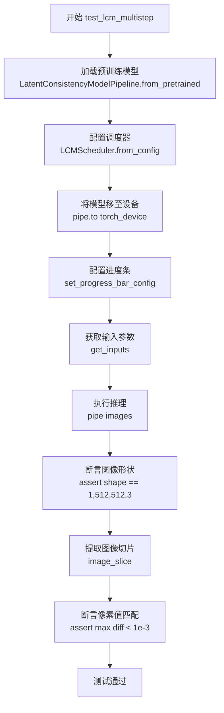

#### 带注释源码

```python
def test_lcm_multistep(self):
    """测试 LCM 模型在多步推理（3步）下的功能"""
    
    # 从预训练模型加载 LatentConsistencyModelPipeline
    # 使用 SimianLuo/LCM_Dreamshaper_v7 权重，禁用安全检查器
    pipe = LatentConsistencyModelPipeline.from_pretrained("SimianLuo/LCM_Dreamshaper_v7", safety_checker=None)
    
    # 使用当前调度器配置重新配置 LCMScheduler
    # 确保使用一致的调度器参数进行推理
    pipe.scheduler = LCMScheduler.from_config(pipe.scheduler.config)
    
    # 将模型移至指定的计算设备（GPU/CPU）
    pipe = pipe.to(torch_device)
    
    # 配置进度条显示（disable=None 表示启用进度条）
    pipe.set_progress_bar_config(disable=None)
    
    # 获取测试输入参数：提示词、latents、生成器、推理步数、guidance_scale、输出类型
    inputs = self.get_inputs(torch_device)
    
    # 执行管道推理，生成图像
    # 返回包含图像的输出对象，images 属性包含生成的图像数组
    image = pipe(**inputs).images
    
    # 断言：验证生成的图像形状为 (1, 512, 512, 3)
    # 1张图片，512x512分辨率，RGB 3通道
    assert image.shape == (1, 512, 512, 3)
    
    # 提取图像右下角 3x3 区域的红色通道像素值并展平
    image_slice = image[0, -3:, -3:, -1].flatten()
    
    # 定义期望的像素值切片（用于回归测试）
    expected_slice = np.array([0.01855, 0.01855, 0.01489, 0.01392, 0.01782, 0.01465, 0.01831, 0.02539, 0.0])
    
    # 断言：验证生成图像与期望值的最大差异小于 1e-3
    # 确保模型输出的确定性和一致性
    assert np.abs(image_slice - expected_slice).max() < 1e-3
```

## 关键组件


### LatentConsistencyModelPipeline

主pipeline类，封装了LCM（潜在一致性模型）的推理流程，整合了UNet、VAE、文本编码器等组件，支持单步和多步推理、自定义时间步、CFG回调等核心功能。

### LCMScheduler

LCM专用调度器，负责在推理过程中生成时间步序列，控制噪声调度策略，支持自定义时间步和alpha设置。

### UNet2DConditionModel

条件UNet模型，用于去噪潜在表示，接收文本嵌入和时间条件信息，输出预测的噪声残差。

### AutoencoderKL

变分自编码器（VAE），负责将图像编码到潜在空间以及从潜在空间解码回图像，支持latent通道的编解码转换。

### CLIPTextModel & CLIPTokenizer

文本编码组件，CLIPTextModel将文本转换为文本嵌入向量，CLIPTokenizer负责分词，配合UNet实现文本到图像的生成条件。

### IPAdapterTesterMixin

IP-Adapter测试混入类，提供图像提示适配器的测试能力，支持跨注意力控制的图像条件注入测试。

### PipelineLatentTesterMixin & PipelineTesterMixin

通用pipeline测试混入类，提供pipeline功能的一致性测试框架，包括批量推理、编码器隔离测试等标准化测试方法。

### 潜在一致性模型推理策略

支持one-step（单步快速推理）和multi-step（多步精调）两种推理模式，通过num_inference_steps参数控制，满足不同质量和速度需求场景。

### 张量回调机制

通过callback_on_step_end和callback_on_step_end_tensor_inputs实现推理过程中的张量注入和修改，支持denoised等中间变量的访问和干预。

### 设备与随机性控制

支持CPU/MPS/CUDA等不同设备，使用torch.Generator确保推理可复现性，通过enable_full_determinism配置实现确定性测试。


## 问题及建议


### 已知问题

- **硬编码的设备依赖**：多处使用 `device = "cpu"` 确保确定性，但后续使用 `torch_device`，可能导致在不同硬件环境下测试结果不一致或失败
- **Magic Numbers 缺乏解释**：代码中多处使用如 `64, 64, 3`、`1, 4, 64, 64`、`beta_start=0.00085` 等数值，没有常量定义或注释说明
- **重复的测试设置代码**：`test_lcm_onestep`、`test_lcm_multistep`、`test_lcm_custom_timesteps` 中存在大量重复的组件初始化、pipeline 创建和进度条设置代码
- **空测试方法**：`test_callback_cfg` 方法体仅为 `pass`，是一个被跳过的测试占位符，但未添加 `@unittest.skip` 装饰器说明跳过原因
- **模型重复加载**：`LatentConsistencyModelPipelineSlowTests` 中每个测试方法都独立调用 `from_pretrained("SimianLuo/LCM_Dreamshaper_v7")`，未共享或缓存模型实例
- **资源清理不完整**：`SlowTests` 类只有 `setUp` 进行 gc 收集和缓存清理，缺少对应的 `tearDown` 方法，可能导致内存泄漏
- **条件判断不一致**：`test_ip_adapter` 中根据 `torch_device == "cpu"` 设置不同的期望值，表明测试对设备环境敏感，缺乏跨平台一致性设计

### 优化建议

- 提取公共的 pipeline 初始化逻辑到 `@classmethod setUpClass` 或独立的 fixture 方法中，减少重复代码
- 为所有 Magic Numbers 定义有意义的常量或配置类，提高代码可读性和可维护性
- 为跳过的测试添加 `@unittest.skip("reason")` 装饰器，明确说明跳过原因
- 在 `SlowTests` 中实现 `tearDown` 方法进行资源清理，或使用 `@classmethod` 共享模型实例以提高性能
- 使用参数化测试或配置文件管理不同设备的期望值，提高测试的可维护性
- 考虑添加测试环境检查，在非预期环境下给出清晰的警告或跳过信息

## 其它


### 设计目标与约束

本测试文件旨在验证 LatentConsistencyModelPipeline 在文本到图像生成任务中的功能正确性，包括单步推理、多步推理、自定义时间步等场景。设计约束包括：使用虚拟组件进行快速测试以确保可重复性和CI友好性，使用真实预训练模型进行慢速测试以验证实际生成效果，确保在不同设备（CPU/GPU）上的确定性输出。

### 错误处理与异常设计

测试中通过断言验证输出形状、图像数值范围和一致性。预期异常情况包括：模型加载失败、GPU内存不足、输出类型不匹配、数值精度偏差超过阈值。对于设备兼容性，使用`torch_device`变量动态适配，并通过`torch.manual_seed`和`np.random.RandomState`确保随机数可复现。

### 数据流与状态机

数据流为：输入prompt → Tokenizer编码 → Text Encoder生成embeddings → UNet2DConditionModel在latent空间进行去噪 → VAE解码生成最终图像。状态机涉及LCMScheduler管理推理步骤的时间步调度，从初始噪声latents逐步去噪到最终latent，再经VAE解码为图像。

### 外部依赖与接口契约

核心依赖包括：`diffusers`库提供的LatentConsistencyModelPipeline、LCMScheduler、UNet2DConditionModel、AutoencoderKL；`transformers`库的CLIPTextModel和CLIPTokenizer；`numpy`和`torch`用于数值计算。接口契约要求pipeline接受prompt、generator、num_inference_steps、guidance_scale、output_type等参数，返回包含images属性的对象。

### 配置管理与参数设计

测试参数分为两类：dummy配置用于快速测试（32x32/64x64小分辨率），真实配置用于慢速测试（512x512标准分辨率）。关键参数包括：beta_start=0.00085, beta_end=0.012的调度器配置，guidance_scale=6.0/7.5的条件引导强度，num_inference_steps=1/2/3的推理步数。

### 性能基准与优化空间

快速测试在CPU上运行确保2秒内完成，慢速测试标记@slow装饰器。优化空间包括：可增加torch.compile加速、可添加ONNX导出测试、可引入float16/float8量化推理测试。

### 测试覆盖与边界情况

覆盖场景包括：单步推理（LCM核心特性）、多步推理、标准调度、自定义timesteps、batch推理一致性、IP Adapter兼容性、callback函数输入验证、prompt编码隔离性。边界情况包括：CPU设备兼容性、mps设备随机种子处理、safety_checker为None的场景。

### 安全性与潜在风险

代码不直接处理用户输入，仅使用预定义prompt和虚拟数据。潜在风险包括：大模型下载的网络依赖、GPU显存占用（512x512推理约需8GB）、随机性导致的不确定性。

### 代码组织与模块化设计

测试类继承自IPAdapterTesterMixin、PipelineLatentTesterMixin、PipelineTesterMixin三个mixin，实现测试代码复用。get_dummy_components和get_dummy_inputs方法封装测试数据构建逻辑，便于在不同测试方法间复用。

### 版本兼容性与迁移策略

代码依赖diffusers>=0.25.0版本（LCMScheduler和LatentConsistencyModelPipeline的引入版本）。未来迁移需关注：scheduler API变化、pipeline参数变更、model card更新。测试标记skip的用例（test_callback_cfg）反映了API差异。


    