# `diffusers\tests\pipelines\latent_consistency_models\test_latent_consistency_models_img2img.py` 详细设计文档

这是一个针对Diffusers库中LatentConsistencyModelImg2ImgPipeline的单元测试文件，包含了快速测试类和慢速测试类，用于验证LCM（Latent Consistency Model）图像到图像扩散管道的核心功能，包括单步推理、多步推理、自定义时间步、IP适配器、批处理等测试场景。

## 整体流程

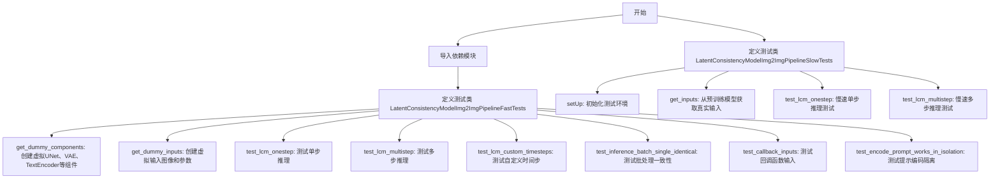

## 类结构

```
unittest.TestCase
├── LatentConsistencyModelImg2ImgPipelineFastTests (继承自 IPAdapterTesterMixin, PipelineLatentTesterMixin, PipelineTesterMixin)
│   ├── get_dummy_components()
│   ├── get_dummy_inputs()
│   ├── test_ip_adapter()
│   ├── test_lcm_onestep()
│   ├── test_lcm_multistep()
│   ├── test_lcm_custom_timesteps()
│   ├── test_inference_batch_single_identical()
│   ├── test_callback_inputs()
│   └── test_encode_prompt_works_in_isolation()
└── LatentConsistencyModelImg2ImgPipelineSlowTests (继承自 unittest.TestCase)
├── setUp()
├── get_inputs()
├── test_lcm_onestep()
└── test_lcm_multistep()
```

## 全局变量及字段


### `torch_device`
    
全局变量，指定PyTorch运行的设备（如'cuda'、'cpu'、'mps'等）

类型：`str`
    


### `expected_pipe_slice`
    
test_ip_adapter方法中的局部变量，存储期望的管道输出切片用于CPU设备上的断言验证

类型：`np.ndarray | None`
    


### `image`
    
get_dummy_inputs方法中的局部变量，存储生成的虚拟输入图像张量

类型：`torch.Tensor`
    


### `generator`
    
get_dummy_inputs方法中的局部变量，用于生成确定性随机数的torch生成器

类型：`torch.Generator`
    


### `inputs`
    
get_dummy_inputs方法中的局部变量，包含管道调用所需的参数字典

类型：`dict`
    


### `components`
    
多个测试方法中的局部变量，存储管道的所有组件（unet、scheduler、vae等）的字典

类型：`dict`
    


### `pipe`
    
多个测试方法中的局部变量，管道实例对象，用于执行推理

类型：`LatentConsistencyModelImg2ImgPipeline`
    


### `output`
    
多个测试方法中的局部变量，管道返回的输出对象，包含生成的图像

类型：`PipelineOutput`
    


### `image_slice`
    
多个测试方法中的局部变量，从输出图像中提取的切片用于断言验证

类型：`np.ndarray`
    


### `expected_slice`
    
多个测试方法中的局部变量，存储期望的图像切片值用于断言验证

类型：`np.ndarray`
    


### `LatentConsistencyModelImg2ImgPipelineFastTests.pipeline_class`
    
类属性，指向被测试的管道类LatentConsistencyModelImg2ImgPipeline

类型：`type`
    


### `LatentConsistencyModelImg2ImgPipelineFastTests.params`
    
类属性，存储管道调用所需参数的集合（排除height、width等参数）

类型：`set`
    


### `LatentConsistencyModelImg2ImgPipelineFastTests.required_optional_params`
    
类属性，存储必需的可选参数集合（排除latents、negative_prompt）

类型：`set`
    


### `LatentConsistencyModelImg2ImgPipelineFastTests.batch_params`
    
类属性，存储批处理测试所需的参数集合

类型：`set`
    


### `LatentConsistencyModelImg2ImgPipelineFastTests.image_params`
    
类属性，存储图像到图像测试的图像参数集合

类型：`set`
    


### `LatentConsistencyModelImg2ImgPipelineFastTests.image_latents_params`
    
类属性，存储图像潜在变量测试的参数集合

类型：`set`
    
    

## 全局函数及方法


### `gc.collect` (在 `LatentConsistencyModelImg2ImgPipelineSlowTests.setUp` 中)

`gc.collect` 是 Python 内置的垃圾回收函数，在此代码中用于手动触发垃圾回收周期，以回收不再使用的对象，释放内存空间。这是在测试类的 `setUp` 方法中调用的，旨在确保在运行慢速测试前清理内存，为后续的模型加载和推理提供干净的内存环境。

参数：

- （无参数）

返回值：`int`，返回回收的对象数量

#### 流程图

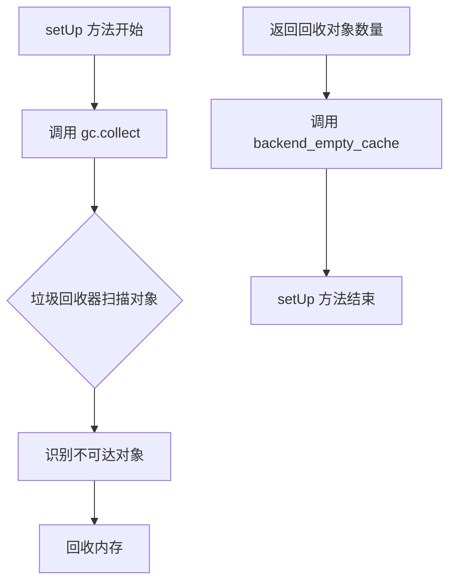

#### 带注释源码

```python
def setUp(self):
    """
    测试环境初始化方法，在每个测试方法运行前被调用。
    负责准备测试所需的内存和资源环境。
    """
    gc.collect()  # 手动触发 Python 垃圾回收器，清理已销毁的 Python 对象，释放内存
    backend_empty_cache(torch_device)  # 清理 GPU 缓存，释放显存
```


### `backend_empty_cache`

该函数用于清空 PyTorch 后端的 GPU 内存缓存，通常在测试或训练流程中用于释放 GPU 内存。

参数：

- `torch_device`：`str` 或 `torch.device`，指定要清空缓存的设备（通常是 "cuda" 或 "cpu"）

返回值：`None`，无返回值

#### 流程图

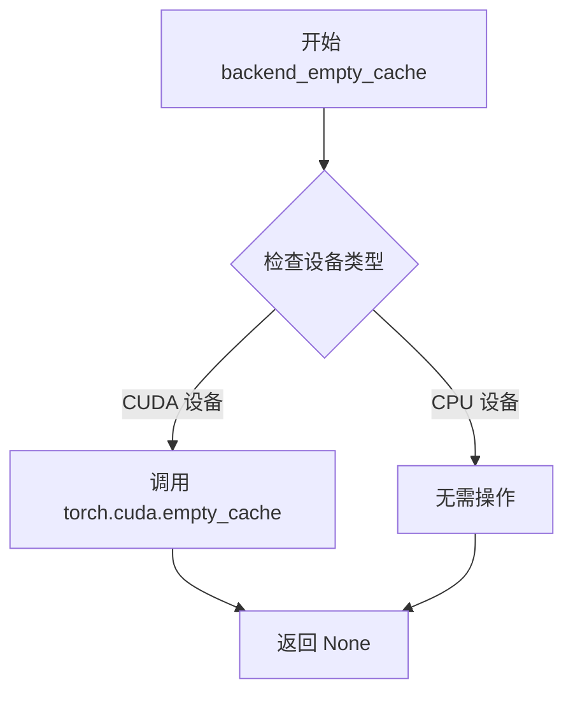

#### 带注释源码

```
# 该函数定义在 testing_utils 模块中
# 以下是基于使用方式的推断实现

def backend_empty_cache(device):
    """
    清空指定设备的内存缓存
    
    参数:
        device: 设备标识符，如 "cuda", "cuda:0", "cpu" 等
    """
    import torch
    
    # 如果是 CUDA 设备，清空 CUDA 缓存
    if device and isinstance(device, str):
        if device.startswith("cuda"):
            torch.cuda.empty_cache()
        elif hasattr(torch.cuda, 'memory_reserve') and device.startswith("mps"):
            # Apple Silicon MPS 设备
            torch.mps.empty_cache()
    
    # 如果是 torch.device 对象
    elif hasattr(device, 'type'):
        if device.type == 'cuda':
            torch.cuda.empty_cache()
        elif device.type == 'mps':
            torch.mps.empty_cache()
    
    # CPU 设备无需操作
    return None
```


### `enable_full_determinism`

该函数用于设置随机种子以确保测试的完全可重复性（determinism），通过配置 Python、内置库和深度学习框架（如 PyTorch、NumPy）的随机种子，并禁用哈希随机化，实现测试结果在多次运行中的一致性。

参数：
- 无参数

返回值：`None`，无返回值

#### 流程图

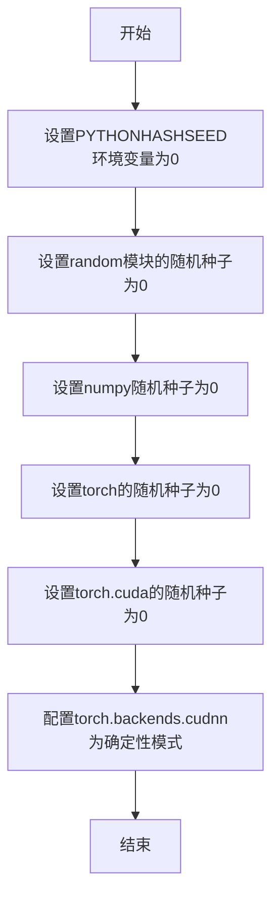

#### 带注释源码

```
# enable_full_determinism 函数实现
# 来源: ...testing_utils 模块

def enable_full_determinism(seed=0):
    """
    启用完全确定性，确保测试结果可重复。
    
    参数:
        seed (int): 随机种子，默认为0
    """
    # 设置Python哈希种子，确保hash()函数结果一致
    import os
    os.environ["PYTHONHASHSEED"] = str(seed)
    
    # 设置Python内置random模块的随机种子
    random.seed(seed)
    
    # 设置NumPy的随机种子
    import numpy as np
    np.random.seed(seed)
    
    # 设置PyTorch的随机种子
    import torch
    torch.manual_seed(seed)
    
    # 设置PyTorch CUDA的随机种子
    torch.cuda.manual_seed(seed)
    torch.cuda.manual_seed_all(seed)
    
    # 强制使用确定性算法，牺牲一定性能换取可重复性
    torch.backends.cudnn.deterministic = True
    torch.backends.cudnn.benchmark = False
    
    # 设置环境变量确保完全确定性
    os.environ["CUBLAS_WORKSPACE_CONFIG"] = ":4096:8"
```


### `floats_tensor`

该函数用于生成一个指定形状的随机浮点数张量（tensor），通常用于测试目的，生成模拟输入数据。

参数：

- `shape`：元组（tuple），张量的形状，例如 (1, 3, 32, 32)
- `rng`：可选参数，随机数生成器（random.Random），用于控制随机性，如果提供则使用该生成器，否则使用全局随机状态

返回值：`torch.Tensor`，返回生成的随机浮点数张量

#### 流程图

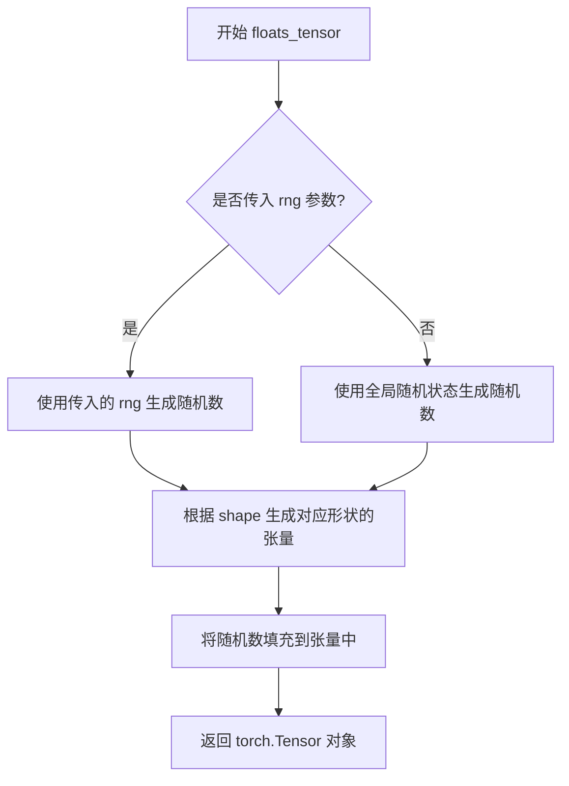

#### 带注释源码

```python
# 该函数定义在 ...testing_utils 模块中（未在此代码文件中定义）
# 以下是基于使用方式的推断实现

def floats_tensor(shape, rng=None):
    """
    生成一个指定形状的随机浮点数张量
    
    参数:
        shape: 张量的形状，例如 (1, 3, 32, 32)
        rng: 可选的随机数生成器，如果为 None 则使用全局随机状态
    
    返回:
        torch.Tensor: 包含随机浮点数的张量
    """
    if rng is not None:
        # 如果提供了随机数生成器，使用它生成随机数据
        # rng.random() 生成 [0, 1) 范围内的随机浮点数
        return torch.from_numpy(
            np.array([rng.random() for _ in range(np.prod(shape))])
        ).reshape(shape).float()
    else:
        # 否则使用 numpy 生成随机数组
        return torch.from_numpy(
            np.random.randn(*shape).astype(np.float32)
        )

# 在代码中的实际使用示例：
# image = floats_tensor((1, 3, 32, 32), rng=random.Random(seed)).to(device)
# 这行代码：
# 1. 创建一个形状为 (1, 3, 32, 32) 的随机张量（1张图片，3通道，32x32像素）
# 2. 使用指定的随机种子确保可重复性
# 3. 将张量移动到指定的设备（CPU 或 CUDA）
```


### `load_image`

从指定的URL加载图像并返回PIL图像对象，主要用于测试代码中加载外部图像资源。

参数：

-  `url`：`str`，图像的网络URL地址，指向Hugging Face数据集或其他图像源

返回值：`PIL.Image`，返回PIL图像对象，支持后续的图像处理操作如resize等

#### 流程图

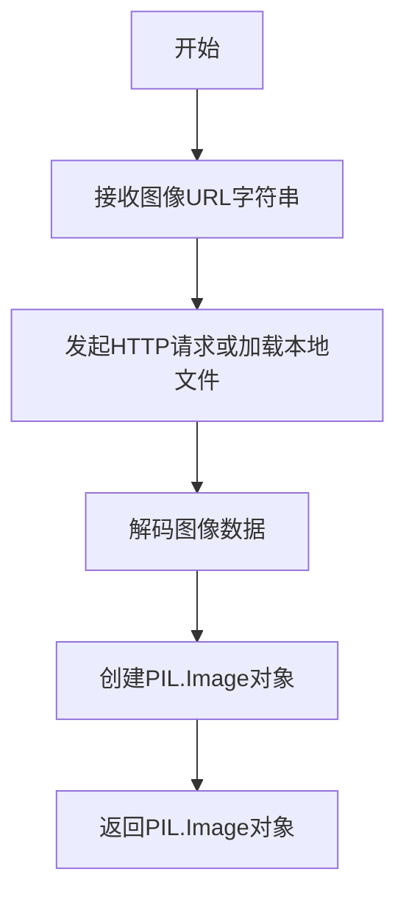

#### 带注释源码

```
# load_image 是从 testing_utils 模块导入的辅助函数
# 其实现通常位于 diffusers/src/diffusers/testing_utils.py 中

def load_image(url: str) -> PIL.Image:
    """
    从URL加载图像
    
    参数:
        url: 图像的网络地址
        
    返回:
        PIL.Image对象
    """
    # 1. 使用PIL或torchvision加载图像
    # 2. 确保图像格式正确转换为PIL.Image
    # 3. 返回图像对象
    return image
```

> **注意**：由于`load_image`函数定义在外部模块`testing_utils`中，当前代码文件仅导入并使用该函数，未包含其完整实现。从使用方式来看：
> - 输入：图像URL字符串（`"https://huggingface.co/datasets/diffusers/test-arrays/resolve/main/stable_diffusion_img2img/sketch-mountains-input.png"`）
> - 输出：PIL图像对象（后续调用了`.resize((512, 512))`方法）
> - 用途：在慢速测试中加载外部测试图像用于图像到图像的扩散模型测试


### `require_torch_accelerator`

这是一个测试装饰器函数，用于检查当前环境是否支持 CUDA（GPU）加速。如果不支持，使用该装饰器标记的测试将被跳过。

参数：

- 无显式参数（通过函数参数或配置控制行为）

返回值：`Callable`，返回一个装饰器函数，用于装饰测试类或测试方法

#### 流程图

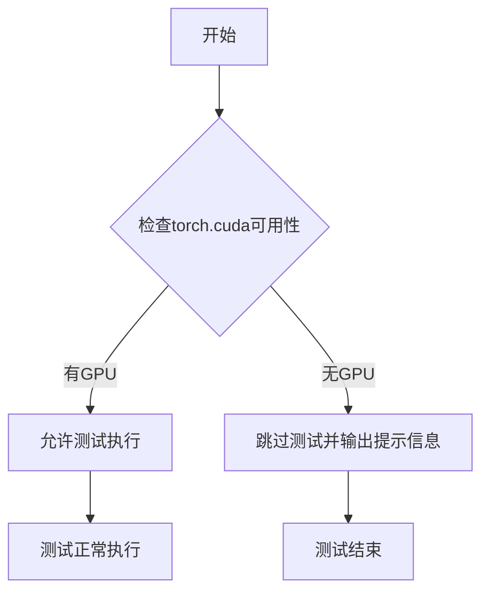

#### 带注释源码

```python
# 这是一个从 testing_utils 模块导入的装饰器
# 源代码不在当前文件中，基于使用方式推断其行为

@require_torch_accelerator  # 装饰器：要求torch加速器（GPU）
class LatentConsistencyModelImg2ImgPipelineSlowTests(unittest.TestCase):
    """
    慢速测试类，仅在有GPU环境下运行
    
    该装饰器确保：
    1. 测试仅在安装了CUDA的PyTorch环境中运行
    2. 在CPU-only环境中自动跳过测试，避免不必要的资源消耗
    3. 提供清晰的跳过原因说明
    """
```

---

**注意**：由于 `require_torch_accelerator` 是从外部模块 `testing_utils` 导入的，其完整源代码未包含在当前文件中。上述信息是基于以下观察推断的：

1. 它作为装饰器使用（`@require_torch_accelerator`）
2. 应用于测试类 `LatentConsistencyModelImg2ImgPipelineSlowTests`
3. 与 `@slow` 装饰器配合使用，标记需要 GPU 的慢速测试
4. 测试类 `LatentConsistencyModelImg2ImgPipelineSlowTests` 包含实际加载模型进行推理的测试，需要 GPU 显存


# 提取结果

根据代码分析，我需要在给定代码中查找名为`slow`的函数或方法。代码中出现了`@slow`装饰器，它是从`...testing_utils`模块导入的。

让我检查代码中所有与`slow`相关的内容：

1. **导入语句**：`from ...testing_utils import (...slow...)`
2. **使用方式**：`@slow` 作为类 `LatentConsistencyModelImg2ImgPipelineSlowTests` 的装饰器

`slow` 是一个从外部模块 `testing_utils` 导入的装饰器/函数，它不在当前代码文件中定义。由于它是外部依赖，我需要基于其使用方式来推断其功能。

---

### `slow`

标记测试为慢速测试的装饰器，用于跳过某些测试或标记需要长时间运行的测试。

参数：

- 无直接参数（作为装饰器使用，接收被装饰的函数作为参数）

返回值：返回装饰后的函数

#### 流程图

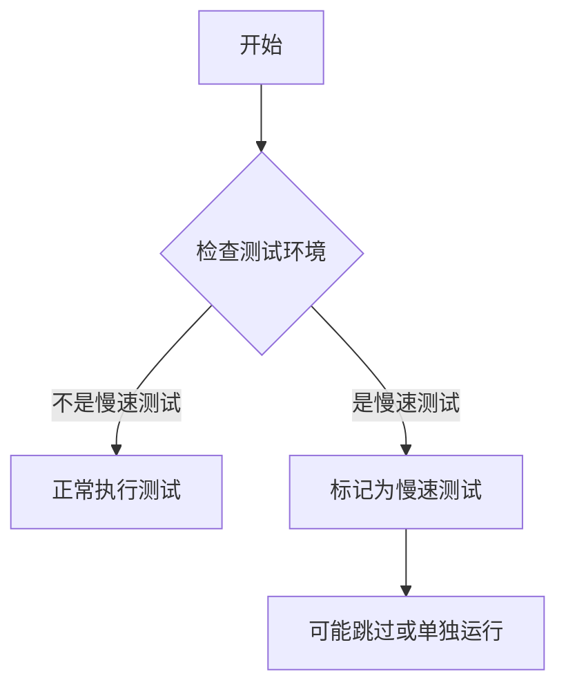

#### 带注释源码

```python
# slow 是一个从 testing_utils 导入的装饰器
# 在代码中的使用方式：
@slow
@require_torch_accelerator
class LatentConsistencyModelImg2ImgPipelineSlowTests(unittest.TestCase):
    # ... 测试类内容 ...
    
    def test_lcm_onestep(self):
        """测试LCM单步推理"""
        # 加载预训练模型
        pipe = LatentConsistencyModelImg2ImgPipeline.from_pretrained(
            "SimianLuo/LCM_Dreamshaper_v7", safety_checker=None
        )
        # 设置调度器
        pipe.scheduler = LCMScheduler.from_config(pipe.scheduler.config)
        pipe = pipe.to(torch_device)
        pipe.set_progress_bar_config(disable=None)

        # 获取测试输入
        inputs = self.get_inputs(torch_device)
        inputs["num_inference_steps"] = 1
        # 执行推理
        image = pipe(**inputs).images
        # 验证输出形状
        assert image.shape == (1, 512, 512, 3)

        # 验证图像质量
        image_slice = image[0, -3:, -3:, -1].flatten()
        expected_slice = np.array([0.3479, 0.3314, 0.3555, 0.3430, 0.3649, 0.3423, 0.3239, 0.3117, 0.3240])
        assert np.abs(image_slice - expected_slice).max() < 1e-3

    def test_lcm_multistep(self):
        """测试LCM多步推理"""
        pipe = LatentConsistencyModelImg2ImgPipeline.from_pretrained(
            "SimianLuo/LCM_Dreamshaper_v7", safety_checker=None
        )
        pipe.scheduler = LCMScheduler.from_config(pipe.scheduler.config)
        pipe = pipe.to(torch_device)
        pipe.set_progress_bar_config(disable=None)

        inputs = self.get_inputs(torch_device)
        image = pipe(**inputs).images
        assert image.shape == (1, 512, 512, 3)

        image_slice = image[0, -3:, -3:, -1].flatten()
        expected_slice = np.array([0.1442, 0.1201, 0.1598, 0.1281, 0.1412, 0.1502, 0.1455, 0.1544, 0.1231])
        assert np.abs(image_slice - expected_slice).max() < 1e-3
```

---

## 补充说明

### 关键信息

- **`slow`** 是从 `diffusers` 包的测试工具模块导入的装饰器
- 作用：标记测试类或测试方法为"慢速测试"，通常用于区分快速单元测试和需要GPU资源的集成测试
- 配合 `@require_torch_accelerator` 使用，确保测试在有GPU加速器的环境中运行

### 潜在的技术债务

1. **`slow` 装饰器的具体实现未知** - 需要查看 `testing_utils` 模块的源码才能了解其完整行为
2. **测试依赖外部模型** - `SimianLuo/LCM_Dreamshaper_v7` 是一个外部预训练模型，测试可能因网络问题或模型更新而失败

### 其他项目

- **设计目标**：通过慢速测试验证 LCM（Latent Consistency Model）在图像到图像生成任务上的正确性
- **外部依赖**：
  - `diffusers` 库
  - `transformers` 库
  - 预训练模型 `SimianLuo/LCM_Dreamshaper_v7`
  - 测试图片 URL


### `LatentConsistencyModelImg2ImgPipelineFastTests.get_dummy_components`

这是一个测试辅助方法，用于创建虚拟（dummy）模型组件，以便在单元测试中初始化 `LatentConsistencyModelImg2ImgPipeline` 管道。该方法创建了 UNet、VAE、文本编码器、调度器等扩散模型所需的所有组件，并将其打包到字典中返回，确保测试的可重复性。

参数：

- `self`：`LatentConsistencyModelImg2ImgPipelineFastTests`，隐式参数，测试类的实例方法

返回值：`Dict[str, Any]`，返回包含所有虚拟组件的字典，包括 unet、scheduler、vae、text_encoder、tokenizer、safety_checker、feature_extractor、image_encoder 和 requires_safety_checker

#### 流程图

```mermaid
flowchart TD
    A[开始 get_dummy_components] --> B[设置随机种子 torch.manual_seed(0)]
    B --> C[创建 UNet2DConditionModel]
    C --> D[创建 LCMScheduler]
    D --> E[设置随机种子 torch.manual_seed(0)]
    E --> F[创建 AutoencoderKL VAE]
    F --> G[设置随机种子 torch.manual_seed(0)]
    G --> H[创建 CLIPTextConfig]
    H --> I[创建 CLIPTextModel]
    I --> J[创建 CLIPTokenizer]
    J --> K[构建 components 字典]
    K --> L[返回 components]
```

#### 带注释源码

```python
def get_dummy_components(self):
    """
    创建虚拟组件用于测试 LatentConsistencyModelImg2ImgPipeline
    
    Returns:
        dict: 包含所有管道组件的字典
    """
    # 设置随机种子以确保 UNet 的可重复性
    torch.manual_seed(0)
    
    # 创建 UNet2DConditionModel - 用于去噪的 UNet 模型
    unet = UNet2DConditionModel(
        block_out_channels=(4, 8),       # 块输出通道数
        layers_per_block=1,              # 每个块的层数
        sample_size=32,                  # 样本尺寸
        in_channels=4,                   # 输入通道数
        out_channels=4,                  # 输出通道数
        down_block_types=("DownBlock2D", "CrossAttnDownBlock2D"),  # 下采样块类型
        up_block_types=("CrossAttnUpBlock2D", "UpBlock2D"),        # 上采样块类型
        cross_attention_dim=32,          # 交叉注意力维度
        norm_num_groups=2,               # 归一化组数
        time_cond_proj_dim=32,           # 时间条件投影维度
    )
    
    # 创建 LCMScheduler - 潜在一致性模型调度器
    scheduler = LCMScheduler(
        beta_start=0.00085,               # beta 起始值
        beta_end=0.012,                  # beta 结束值
        beta_schedule="scaled_linear",   # beta 调度策略
        clip_sample=False,                # 是否裁剪样本
        set_alpha_to_one=False,          # 是否设置 alpha 为 1
    )
    
    # 重新设置随机种子以确保 VAE 的可重复性
    torch.manual_seed(0)
    
    # 创建 AutoencoderKL - VAE 变分自编码器
    vae = AutoencoderKL(
        block_out_channels=[4, 8],       # 块输出通道数
        in_channels=3,                   # 输入通道数 (RGB)
        out_channels=3,                  # 输出通道数
        down_block_types=["DownEncoderBlock2D", "DownEncoderBlock2D"],  # 下采样编码块
        up_block_types=["UpDecoderBlock2D", "UpDecoderBlock2D"],        # 上采样解码块
        latent_channels=4,               # 潜在空间通道数
        norm_num_groups=2,               # 归一化组数
    )
    
    # 重新设置随机种子以确保文本编码器的可重复性
    torch.manual_seed(0)
    
    # 创建 CLIP 文本编码器配置
    text_encoder_config = CLIPTextConfig(
        bos_token_id=0,                  # 句子开始 token ID
        eos_token_id=2,                  # 句子结束 token ID
        hidden_size=32,                  # 隐藏层大小
        intermediate_size=64,            # 中间层大小
        layer_norm_eps=1e-05,            # 层归一化 epsilon
        num_attention_heads=8,           # 注意力头数
        num_hidden_layers=3,             # 隐藏层数量
        pad_token_id=1,                  # 填充 token ID
        vocab_size=1000,                 # 词汇表大小
    )
    
    # 创建 CLIP 文本编码器模型
    text_encoder = CLIPTextModel(text_encoder_config)
    
    # 创建 CLIP 分词器
    tokenizer = CLIPTokenizer.from_pretrained("hf-internal-testing/tiny-random-clip")
    
    # 组装所有组件到字典中
    components = {
        "unet": unet,                    # UNet2DConditionModel 实例
        "scheduler": scheduler,          # LCMScheduler 实例
        "vae": vae,                      # AutoencoderKL 实例
        "text_encoder": text_encoder,    # CLIPTextModel 实例
        "tokenizer": tokenizer,          # CLIPTokenizer 实例
        "safety_checker": None,          # 安全检查器（测试中设为 None）
        "feature_extractor": None,       # 特征提取器（测试中设为 None）
        "image_encoder": None,           # 图像编码器（测试中设为 None）
        "requires_safety_checker": False, # 是否需要安全检查器
    }
    
    return components
```


### `LatentConsistencyModelImg2ImgPipelineFastTests.get_dummy_inputs`

该方法用于生成测试专用的虚拟输入参数，创建一个模拟的图像到图像（Image-to-Image）推理所需的输入字典，包含文本提示、预处理后的图像张量、随机生成器、推理步数、引导比例和输出类型等关键参数。

参数：

- `self`：隐式参数，`LatentConsistencyModelImg2ImgPipelineFastTests` 类实例，表示测试类本身
- `device`：`torch.device` 或 `str`，指定运行推理的目标设备（如 "cpu"、"cuda" 等）
- `seed`：`int`（默认值：0），用于控制随机数生成的种子，确保测试结果可复现

返回值：`Dict[str, Any]`，返回一个包含以下键的字典：
- `"prompt"`：文本提示字符串
- `"image"`：预处理后的图像张量
- `"generator"`：PyTorch 随机数生成器
- `"num_inference_steps"`：推理步数
- `"guidance_scale"`：引导比例
- `"output_type"`：输出类型

#### 流程图

```mermaid
flowchart TD
    A[开始 get_dummy_inputs] --> B[接收 device 和 seed 参数]
    B --> C[使用 floats_tensor 创建形状为 (1, 3, 32, 32) 的随机图像张量]
    C --> D[将图像张量移动到指定 device]
    D --> E[图像值归一化: image / 2 + 0.5]
    E --> F{device 是否为 MPS?}
    F -->|是| G[使用 torch.manual_seed 创建生成器]
    F -->|否| H[使用 torch.Generator 创建带 device 的生成器]
    G --> I[生成器设置种子: manual_seed(seed)]
    H --> I
    I --> J[构建输入字典 inputs]
    J --> K[设置 prompt: 'A painting of a squirrel eating a burger']
    K --> L[设置 image: 预处理后的图像张量]
    L --> M[设置 generator: 随机数生成器]
    M --> N[设置 num_inference_steps: 2]
    N --> O[设置 guidance_scale: 6.0]
    O --> P[设置 output_type: 'np']
    P --> Q[返回 inputs 字典]
    Q --> R[结束]
```

#### 带注释源码

```python
def get_dummy_inputs(self, device, seed=0):
    """
    生成用于测试的虚拟输入参数。
    
    参数:
        device: torch.device 或 str - 运行设备
        seed: int - 随机种子，默认值为 0
    
    返回:
        dict: 包含 pipeline 调用所需参数的字典
    """
    # 使用 floats_tensor 创建形状为 (1, 3, 32, 32) 的随机浮点张量
    # rng=random.Random(seed) 确保随机结果可复现
    image = floats_tensor((1, 3, 32, 32), rng=random.Random(seed)).to(device)
    
    # 将图像值归一化到 [0, 1] 范围
    # 原始 floats_tensor 生成的值在 [-1, 1] 范围
    # 除以 2 + 0.5 后映射到 [0, 1]
    image = image / 2 + 0.5
    
    # MPS (Apple Silicon) 设备需要特殊处理
    # 使用 torch.manual_seed 而非 torch.Generator
    if str(device).startswith("mps"):
        generator = torch.manual_seed(seed)
    else:
        # 为其他设备创建带有指定种子的生成器
        generator = torch.Generator(device=device).manual_seed(seed)
    
    # 构建输入参数字典
    inputs = {
        "prompt": "A painting of a squirrel eating a burger",  # 文本提示
        "image": image,                                         # 输入图像张量
        "generator": generator,                                 # 随机数生成器
        "num_inference_steps": 2,                               # 推理步数（少用于快速测试）
        "guidance_scale": 6.0,                                  # CFG 引导比例
        "output_type": "np",                                    # 输出为 NumPy 数组
    }
    return inputs
```


### `LatentConsistencyModelImg2ImgPipelineFastTests.test_ip_adapter`

该方法是 `LatentConsistencyModelImg2ImgPipelineFastTests` 单元测试类中的一个测试函数，用于验证图像到图像（Img2Img）流水线的 IP-Adapter 功能是否正常工作。它根据当前设备设置特定的预期输出切片（仅在 CPU 设备上有预期值），然后调用父类的 `test_ip_adapter` 方法执行实际的测试逻辑。

参数：

- `self`：`LatentConsistencyModelImg2ImgPipelineFastTests`，测试类实例，隐式参数，用于访问类属性和方法
- `expected_pipe_slice`：`Optional[np.ndarray]`，关键字参数，表示图像输出的预期切片值，用于与实际输出进行对比验证。如果为 `None`，则父类测试方法将使用默认的预期值

返回值：`Any`，返回父类 `test_ip_adapter` 方法的返回值，具体类型取决于父类测试的执行结果（通常是测试断言或 `None`）

#### 流程图

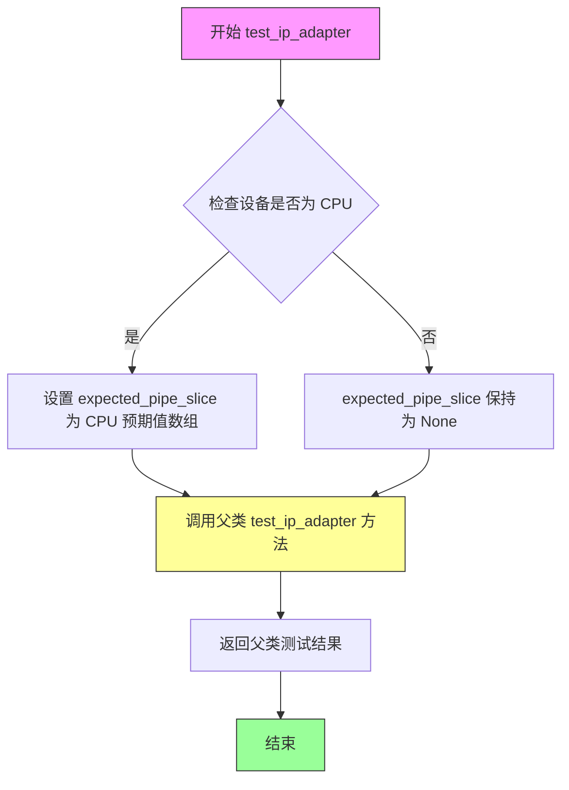

#### 带注释源码

```python
def test_ip_adapter(self):
    """
    测试 IP-Adapter 功能是否正常工作
    
    该方法根据设备类型设置不同的预期输出切片，
    然后调用父类的 test_ip_adapter 方法执行实际的测试逻辑
    """
    # 初始化预期切片为 None
    expected_pipe_slice = None
    
    # 如果当前设备是 CPU，设置特定的预期输出切片值
    # 这些数值是预先计算好的，用于验证模型输出的正确性
    if torch_device == "cpu":
        expected_pipe_slice = np.array([
            0.4003, 0.3718, 0.2863,  # 第一行像素值
            0.5500, 0.5587, 0.3772,  # 第二行像素值
            0.4617, 0.4961, 0.4417   # 第三行像素值
        ])
    
    # 调用父类 (IPAdapterTesterMixin) 的 test_ip_adapter 方法
    # 传入预期的输出切片用于验证
    return super().test_ip_adapter(expected_pipe_slice=expected_pipe_slice)
```

---

### 补充信息

**调用链分析：**
- 当前方法继承自 `IPAdapterTesterMixin` 混入类
- 通过 `super().test_ip_adapter()` 调用父类的实现
- 父类方法会构建 `LatentConsistencyModelImg2ImgPipeline` 管道实例，执行推理，并验证输出与预期切片的一致性

**技术债务与优化空间：**
1. **硬编码的预期值**：CPU 设备的预期输出切片是硬编码的数值，如果模型结构发生变化，这些值需要手动更新
2. **设备依赖逻辑**：存在设备特定的分支逻辑（`if torch_device == "cpu"`），可能导致其他设备上的测试行为不一致
3. **测试隔离性**：该测试依赖全局变量 `torch_device`，可能影响测试的可移植性


### `LatentConsistencyModelImg2ImgPipelineFastTests.test_lcm_onestep`

这是一个单元测试方法，用于验证 LatentConsistencyModelImg2ImgPipeline 在单步推理（one-step inference）模式下的功能正确性。该测试通过使用虚拟组件构建管道，设置单步推理参数，执行图像到图像的生成，并验证输出图像的形状和像素值是否符合预期。

参数：

- `self`：`LatentConsistencyModelImg2ImgPipelineFastTests`，测试类的实例，隐含参数

返回值：`None`，测试方法无返回值，通过断言验证功能

#### 流程图

```mermaid
flowchart TD
    A[开始测试 test_lcm_onestep] --> B[设置 device = cpu]
    B --> C[调用 get_dummy_components 获取虚拟组件]
    C --> D[使用虚拟组件实例化管道 pipe]
    D --> E[将管道移至 torch_device]
    E --> F[设置进度条配置 disable=None]
    F --> G[调用 get_dummy_inputs 获取虚拟输入]
    G --> H[设置 num_inference_steps = 1]
    H --> I[执行管道推理 pipe(**inputs)]
    I --> J[提取输出图像 output.images]
    J --> K{验证图像形状 == (1, 32, 32, 3)}
    K -->|是| L[提取图像切片 image[0, -3:, -3:, -1]]
    K -->|否| M[断言失败 - 测试失败]
    L --> N[定义期望切片 expected_slice]
    N --> O{验证像素差异 < 1e-3}
    O -->|是| P[测试通过]
    O -->|否| M
```

#### 带注释源码

```python
def test_lcm_onestep(self):
    # 设置设备为 CPU 以确保设备依赖的 torch.Generator 的确定性
    device = "cpu"  # ensure determinism for the device-dependent torch.Generator

    # 获取预定义的虚拟组件（UNet、VAE、Text Encoder、Scheduler 等）
    components = self.get_dummy_components()
    
    # 使用虚拟组件实例化 LatentConsistencyModelImg2ImgPipeline 管道
    pipe = self.pipeline_class(**components)
    
    # 将管道移至指定的计算设备（由 torch_device 全局变量指定）
    pipe = pipe.to(torch_device)
    
    # 配置进度条（disable=None 表示不禁用进度条）
    pipe.set_progress_bar_config(disable=None)

    # 获取虚拟输入参数：包括 prompt、image、generator、num_inference_steps 等
    inputs = self.get_dummy_inputs(device)
    
    # 修改推理步数为 1，测试单步推理模式
    inputs["num_inference_steps"] = 1
    
    # 执行管道推理，生成图像
    output = pipe(**inputs)
    
    # 从输出中提取生成的图像
    image = output.images
    
    # 断言验证输出图像形状为 (1, 32, 32, 3)
    # 1: batch size, 32x32: 图像宽高, 3: RGB 通道
    assert image.shape == (1, 32, 32, 3)

    # 提取图像右下角 3x3 像素区域的最后一个通道（alpha/红色通道）
    image_slice = image[0, -3:, -3:, -1]
    
    # 定义期望的像素值切片（用于回归测试）
    expected_slice = np.array([0.4388, 0.3717, 0.2202, 0.7213, 0.6370, 0.3664, 0.5815, 0.6080, 0.4977])
    
    # 断言验证生成图像与期望值的最大差异小于 1e-3
    # 确保模型输出的确定性和一致性
    assert np.abs(image_slice.flatten() - expected_slice).max() < 1e-3
```


### `LatentConsistencyModelImg2ImgPipelineFastTests.test_lcm_multistep`

该方法是针对 LatentConsistencyModelImg2ImgPipeline（潜在一致性模型图到图 pipelines）的多步推理测试用例。它使用虚拟组件初始化 pipelines，生成测试图像，并通过断言验证输出图像的形状和像素值是否与预期值匹配，以确保 pipelines 在多步推理模式下的正确性。

参数：

- `self`：测试类实例本身，包含 pipelines 类、参数配置等测试上下文信息

返回值：`None`，该方法为测试用例，通过断言进行验证，不返回任何值

#### 流程图

```mermaid
flowchart TD
    A[开始测试 test_lcm_multistep] --> B[设置device为cpu以确保确定性]
    B --> C[调用get_dummy_components获取虚拟组件]
    C --> D[使用虚拟组件实例化LatentConsistencyModelImg2ImgPipeline]
    D --> E[将pipeline移动到torch_device设备]
    E --> F[设置进度条配置disable=None]
    F --> G[调用get_dummy_inputs获取测试输入]
    G --> H[执行pipeline进行推理: pipe(**inputs)]
    H --> I[从输出中提取图像: output.images]
    I --> J{断言图像形状}
    J -->|形状正确| K[提取图像切片 image[0, -3:, -3:, -1]]
    J -->|形状错误| L[测试失败]
    K --> M[定义预期像素值数组]
    M --> N{断言像素值差异}
    N -->|差异小于1e-3| O[测试通过]
    N -->|差异大于等于1e-3| P[测试失败]
```

#### 带注释源码

```python
def test_lcm_multistep(self):
    """
    测试 LatentConsistencyModelImg2ImgPipeline 的多步推理功能
    验证pipeline在多步推理模式下能够正确生成图像并符合预期输出
    """
    
    # 设置设备为cpu以确保torch.Generator的确定性
    # 避免因设备差异导致的随机数生成不一致
    device = "cpu"  # ensure determinism for the device-dependent torch.Generator

    # 获取虚拟组件（UNet、VAE、scheduler、text_encoder等）
    # 用于创建测试用的pipeline实例
    components = self.get_dummy_components()
    
    # 使用虚拟组件实例化LatentConsistencyModelImg2ImgPipeline
    pipe = self.pipeline_class(**components)
    
    # 将pipeline移动到测试设备（torch_device）
    pipe = pipe.to(torch_device)
    
    # 配置进度条，disable=None表示启用进度条
    pipe.set_progress_bar_config(disable=None)

    # 获取虚拟输入数据（包括prompt、image、generator等）
    inputs = self.get_dummy_inputs(device)
    
    # 执行pipeline推理，获取输出结果
    # 这里的num_inference_steps为2（默认值），表示多步推理
    output = pipe(**inputs)
    
    # 从输出中提取生成的图像
    image = output.images
    
    # 断言验证输出图像形状为(1, 32, 32, 3)
    # 1表示batch size，32x32为图像尺寸，3为RGB通道数
    assert image.shape == (1, 32, 32, 3)

    # 提取图像右下角3x3区域并取最后一个通道（红色通道）
    # 用于与预期值进行像素级对比
    image_slice = image[0, -3:, -3:, -1]
    
    # 定义预期的像素值数组（通过预先运行测试得到的标准结果）
    expected_slice = np.array([0.4150, 0.3719, 0.2479, 0.6333, 0.6024, 0.3778, 0.5036, 0.5420, 0.4678])
    
    # 断言验证生成图像与预期图像的最大像素差异小于1e-3
    # 确保pipeline的数值输出具有确定性和一致性
    assert np.abs(image_slice.flatten() - expected_slice).max() < 1e-3
```


### `LatentConsistencyModelImg2ImgPipelineFastTests.test_lcm_custom_timesteps`

这是一个单元测试方法，用于测试 LatentConsistencyModelImg2ImgPipeline 在使用自定义时间步（timesteps）进行图像到图像生成时的功能正确性。测试通过构造虚拟组件和输入，验证管道能够正确处理自定义时间步列表 [999, 499]，并生成符合预期形状和数值范围的图像输出。

参数：此方法无显式外部参数，依赖于类属性和内部方法调用。

- `self`：隐式参数，unittest.TestCase 实例，表示测试类本身

返回值：`None`，测试通过时无返回值，失败时通过 unittest 框架抛出断言错误

#### 流程图

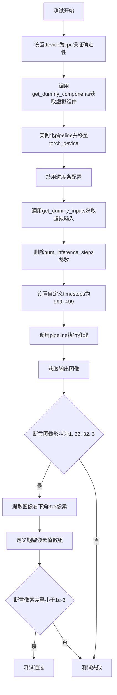

#### 带注释源码

```python
def test_lcm_custom_timesteps(self):
    """
    测试 LCM pipeline 使用自定义时间步进行图像到图像生成的功能。
    验证管道能够正确处理用户指定的 timesteps 列表并生成预期输出的图像。
    """
    # 设置设备为 CPU 以确保 torch.Generator 的确定性行为
    # 这对于测试结果的可重复性至关重要
    device = "cpu"  # ensure determinism for the device-dependent torch.Generator

    # 获取虚拟组件（UNet、VAE、Scheduler、TextEncoder、Tokenizer等）
    # 这些是用于测试的最小化模拟组件，不需要真实模型权重
    components = self.get_dummy_components()
    
    # 使用虚拟组件实例化 LatentConsistencyModelImg2ImgPipeline
    pipe = self.pipeline_class(**components)
    
    # 将 pipeline 移至指定的计算设备（CPU/CUDA）
    pipe = pipe.to(torch_device)
    
    # 配置进度条，disable=None 表示使用默认设置（显示进度条）
    pipe.set_progress_bar_config(disable=None)

    # 获取测试输入参数，包含 prompt、image、generator 等
    inputs = self.get_dummy_inputs(device)
    
    # 删除 num_inference_steps 参数，因为我们将使用自定义 timesteps
    del inputs["num_inference_steps"]
    
    # 设置自定义时间步，这是本测试的核心验证点
    # 使用 [999, 499] 两个时间步进行推理
    inputs["timesteps"] = [999, 499]
    
    # 执行 pipeline 推理，返回包含图像的结果对象
    output = pipe(**inputs)
    
    # 从输出中提取生成的图像
    image = output.images
    
    # 断言输出图像形状为 (1, 32, 32, 3)
    # 1=批量大小, 32=高度, 32=宽度, 3=RGB通道
    assert image.shape == (1, 32, 32, 3)

    # 提取图像右下角 3x3 区域的像素值用于精确验证
    # image[0] 取第一个batch, [-3:, -3:, -1] 取右下角3x3的最后一个通道
    image_slice = image[0, -3:, -3:, -1]
    
    # 定义期望的像素值数组（预计算的标准结果）
    expected_slice = np.array([0.3994, 0.3471, 0.2540, 0.7030, 0.6193, 0.3645, 0.5777, 0.5850, 0.4965])
    
    # 断言实际输出与期望值的最大差异小于 1e-3
    # 确保自定义时间步功能正常工作且数值精度符合要求
    assert np.abs(image_slice.flatten() - expected_slice).max() < 1e-3
```


### `LatentConsistencyModelImg2ImgPipelineFastTests.test_inference_batch_single_identical`

该测试方法继承自 `PipelineTesterMixin`，用于验证在使用批处理（batch）方式进行推理时，单个样本的输出与单独推理时的输出一致性，以确保批处理实现没有引入额外的数值误差。

参数：

- `self`：隐式参数，类型为 `LatentConsistencyModelImg2ImgPipelineFastTests`，表示测试类实例本身
- `expected_max_diff`：关键字参数，类型为 `float`，默认值 `5e-4`，表示允许的最大差异阈值，用于判断批处理与单独推理的输出是否足够接近

返回值：无明确的显式返回值（测试方法通常通过 `assert` 断言进行验证）

#### 流程图

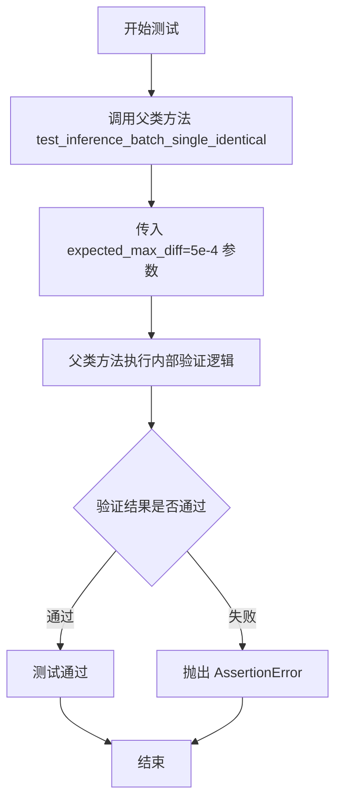

#### 带注释源码

```python
def test_inference_batch_single_identical(self):
    """
    测试方法：验证批处理推理时单个样本的输出与单独推理时的输出一致性
    
    该测试方法继承自 PipelineTesterMixin，用于确保在使用批处理方式进行推理时，
    单个样本的结果与单独推理时的结果保持一致（允许的最大差异为 5e-4）。
    这是一个重要的回归测试，用于检测批处理实现中可能引入的数值误差或不一致性。
    
    参数:
        self: LatentConsistencyModelImg2ImgPipelineFastTests 的实例
        
    返回值:
        无返回值（通过断言验证）
        
    注意:
        - 该方法调用父类的同名方法进行实际验证
        - expected_max_diff=5e-4 是经过验证的合理阈值
    """
    # 调用父类 PipelineTesterMixin 的 test_inference_batch_single_identical 方法
    # 传入 expected_max_diff 参数控制允许的最大差异阈值
    super().test_inference_batch_single_identical(expected_max_diff=5e-4)
```


### `LatentConsistencyModelImg2ImgPipelineFastTests.test_callback_inputs`

该方法用于测试 LatentConsistencyModelImg2ImgPipeline 的回调输入功能。它验证管道在推理过程中能否正确地将张量变量传递给回调函数，并检查 callback_on_step_end 和 callback_on_step_end_tensor_inputs 参数是否被正确支持。

参数：

- `self`：当前测试类实例，无需显式传递

返回值：`None`，该方法通过断言进行测试验证，无显式返回值

#### 流程图

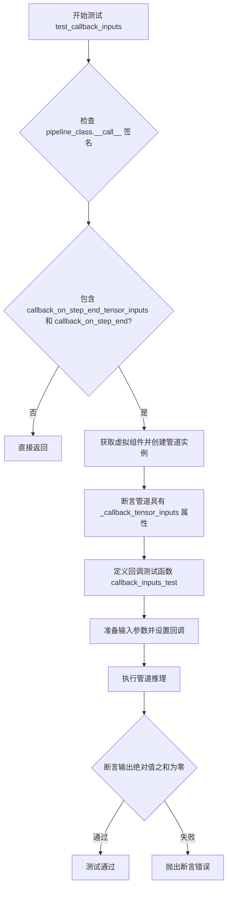

#### 带注释源码

```python
def test_callback_inputs(self):
    """
    测试管道的回调输入功能。
    验证管道支持 callback_on_step_end 和 callback_on_step_end_tensor_inputs 参数，
    并确保回调函数能正确接收所有定义的张量输入。
    """
    # 获取管道 __call__ 方法的签名
    sig = inspect.signature(self.pipeline_class.__call__)

    # 检查管道是否支持回调相关参数
    if not ("callback_on_step_end_tensor_inputs" in sig.parameters and "callback_on_step_end" in sig.parameters):
        # 如果不支持，直接返回，不执行测试
        return

    # 获取虚拟组件用于测试
    components = self.get_dummy_components()
    # 创建管道实例
    pipe = self.pipeline_class(**components)
    # 将管道移至测试设备
    pipe = pipe.to(torch_device)
    # 设置进度条配置
    pipe.set_progress_bar_config(disable=None)

    # 断言管道具有 _callback_tensor_inputs 属性
    # 该属性定义了回调函数可以使用的张量变量列表
    self.assertTrue(
        hasattr(pipe, "_callback_tensor_inputs"),
        f" {self.pipeline_class} should have `_callback_tensor_inputs` that defines a list of tensor variables its callback function can use as inputs",
    )

    def callback_inputs_test(pipe, i, t, callback_kwargs):
        """
        自定义回调函数，用于验证回调参数是否完整。
        
        参数:
            pipe: 管道实例
            i: 当前推理步骤索引
            t: 当前时间步
            callback_kwargs: 回调函数接收的关键字参数字典
        
        返回:
            callback_kwargs: 更新后的回调参数字典
        """
        # 收集缺失的回调输入
        missing_callback_inputs = set()
        for v in pipe._callback_tensor_inputs:
            if v not in callback_kwargs:
                missing_callback_inputs.add(v)
        # 断言没有缺失的回调输入
        self.assertTrue(
            len(missing_callback_inputs) == 0, f"Missing callback tensor inputs: {missing_callback_inputs}"
        )
        # 获取最后一步的索引
        last_i = pipe.num_timesteps - 1
        # 如果是最后一步，将 denoised 张量置零
        if i == last_i:
            callback_kwargs["denoised"] = torch.zeros_like(callback_kwargs["denoised"])
        return callback_kwargs

    # 获取虚拟输入
    inputs = self.get_dummy_inputs(torch_device)
    # 设置回调函数
    inputs["callback_on_step_end"] = callback_inputs_test
    # 设置回调可用的张量输入列表
    inputs["callback_on_step_end_tensor_inputs"] = pipe._callback_tensor_inputs
    # 设置输出类型为 latent
    inputs["output_type"] = "latent"

    # 执行管道推理
    output = pipe(**inputs)[0]
    # 断言输出为零（因为我们在最后一步将 denoised 置零）
    assert output.abs().sum() == 0
```


### `LatentConsistencyModelImg2ImgPipelineFastTests.test_encode_prompt_works_in_isolation`

该方法是一个单元测试，用于验证 `LatentConsistencyModelImg2ImgPipeline` 的 `encode_prompt` 功能能够在隔离环境下正常工作，即不受到管道中其他组件（如 UNet、VAE 等）的影响。它通过构建额外的必需参数字典并调用父类的同名测试方法来实现。

参数：

- `self`：`LatentConsistencyModelImg2ImgPipelineFastTests`，测试类实例，隐式参数，表示当前测试对象

返回值：`unknown`，返回父类 `test_encode_prompt_works_in_isolation` 方法的执行结果，通常为 `None` 或 `unittest.TestResult` 对象，描述测试的执行状态

#### 流程图

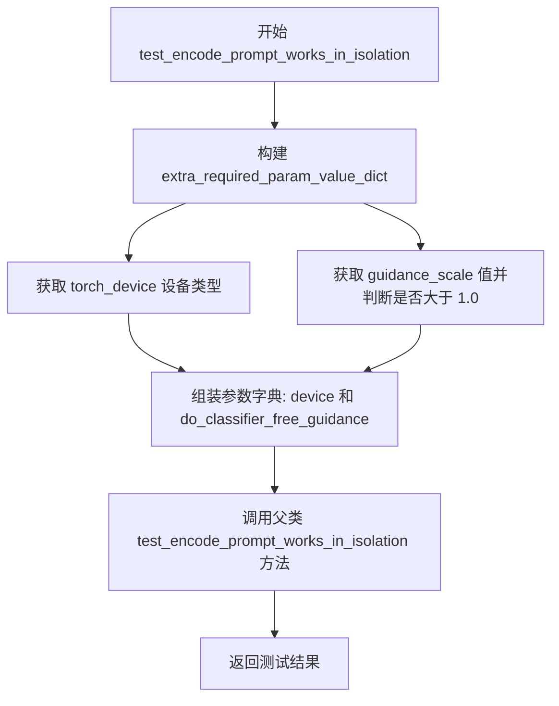

#### 带注释源码

```python
def test_encode_prompt_works_in_isolation(self):
    """
    测试 encode_prompt 功能是否能在隔离环境下正常工作
    
    该测试验证文本编码功能独立于其他管道组件（如 UNet、VAE 等），
    确保 prompt 编码不受其他_pipeline_状态的影响。
    """
    # 构建额外的必需参数字典，用于配置父类测试环境
    extra_required_param_value_dict = {
        # 获取当前计算设备类型 (如 'cpu', 'cuda', 'mps' 等)
        "device": torch.device(torch_device).type,
        
        # 判断是否启用无分类器自由引导 (CFG)
        # 根据 dummy_inputs 中的 guidance_scale 是否大于 1.0 来决定
        # 如果 guidance_scale > 1.0，则 do_classifier_free_guidance 为 True
        "do_classifier_free_guidance": self.get_dummy_inputs(device=torch_device).get("guidance_scale", 1.0) > 1.0,
    }
    
    # 调用父类 (PipelineTesterMixin) 的同名测试方法
    # 父类方法会验证 encode_prompt 在隔离环境下的正确性
    return super().test_encode_prompt_works_in_isolation(extra_required_param_value_dict)
```


### `LatentConsistencyModelImg2ImgPipelineSlowTests.setUp`

该方法是 `LatentConsistencyModelImg2ImgPipelineSlowTests` 测试类的初始化方法，在每个测试方法执行前被调用，用于清理 Python 垃圾回收和 GPU 缓存，确保测试环境干净且内存充足。

参数：

- `self`：`LatentConsistencyModelImg2ImgPipelineSlowTests`，测试类实例本身，代表当前测试用例对象

返回值：`None`，无返回值，此方法仅执行副作用操作

#### 流程图

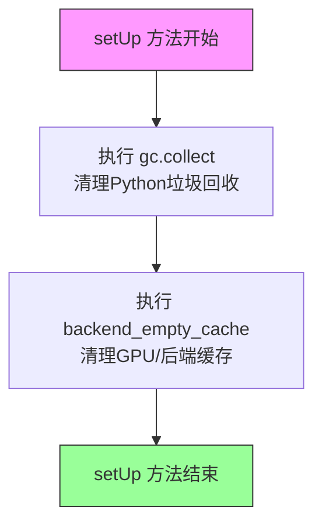

#### 带注释源码

```python
def setUp(self):
    """
    测试类初始化方法，在每个测试方法执行前自动调用。
    用于准备测试环境，清理可能的残留资源。
    """
    # 执行 Python 垃圾回收，释放不再使用的对象内存
    gc.collect()
    
    # 清理 GPU/后端缓存，确保每个测试从干净的状态开始
    # torch_device 是全局变量，表示当前使用的计算设备
    backend_empty_cache(torch_device)
```


### `LatentConsistencyModelImg2ImgPipelineSlowTests.get_inputs`

该方法为 Latent Consistency Model (LCM) Image-to-Image Pipeline 的慢速测试准备输入参数，生成随机latents、加载测试图像，并返回一个包含prompt、latents、generator、推理步数、guidance scale、输出类型和图像的字典，供pipeline调用使用。

参数：

- `self`：`LatentConsistencyModelImg2ImgPipelineSlowTests`，测试类实例，隐式参数
- `device`：`torch.device`，指定将latents张量移动到的目标设备（如cpu或cuda）
- `generator_device`：`str`，生成器设备，默认为"cpu"，用于创建随机数生成器
- `dtype`：`torch.dtype`，张量数据类型，默认为torch.float32
- `seed`：`int`，随机种子，默认为0，用于确保测试的可重复性

返回值：`Dict[str, Any]`，返回一个包含以下键的字典：
- `prompt`：`str`，文本提示
- `latents`：`torch.Tensor`，初始潜在变量张量，形状为(1, 4, 64, 64)
- `generator`：`torch.Generator`，随机数生成器
- `num_inference_steps`：`int`，推理步数
- `guidance_scale`：`float`，guidance scale参数
- `output_type`：`str`，输出类型
- `image`：`PIL.Image.Image`，初始输入图像

#### 流程图

```mermaid
flowchart TD
    A[开始 get_inputs] --> B[创建随机数生成器<br/>device=generator_device, seed=seed]
    C[生成随机latents<br/>形状(1, 4, 64, 64)<br/>使用np.random.RandomState]
    B --> C
    C --> D[将latents转换为torch.Tensor<br/>并移动到指定device和dtype]
    D --> E[加载远程测试图像<br/>从HuggingFace数据集URL]
    E --> F[调整图像大小为512x512]
    F --> G[构建inputs字典<br/>包含prompt/latents/generator等7个参数]
    G --> H[返回inputs字典]
```

#### 带注释源码

```python
def get_inputs(self, device, generator_device="cpu", dtype=torch.float32, seed=0):
    """
    为 LatentConsistencyModelImg2ImgPipeline 慢速测试准备输入参数
    
    参数:
        device: torch.device - 目标设备，用于将latents张量移动到该设备
        generator_device: str - 生成器设备，默认为"cpu"
        dtype: torch.dtype - 数据类型，默认为torch.float32
        seed: int - 随机种子，用于确保可重复性，默认为0
    
    返回:
        dict: 包含pipeline调用所需参数的字典
    """
    
    # 1. 创建随机数生成器并设置种子
    # 用于确保测试的确定性结果
    generator = torch.Generator(device=generator_device).manual_seed(seed)
    
    # 2. 生成初始latents（潜在变量）
    # 使用numpy生成标准正态分布的随机数
    # 形状 (1, 4, 64, 64) 对应 batch=1, channels=4, height=64, width=64
    latents = np.random.RandomState(seed).standard_normal((1, 4, 64, 64))
    
    # 3. 将numpy数组转换为torch.Tensor并移动到指定设备
    latents = torch.from_numpy(latents).to(device=device, dtype=dtype)
    
    # 4. 从远程URL加载测试图像
    # 使用HuggingFace diffusers测试数据集的示例图像
    init_image = load_image(
        "https://huggingface.co/datasets/diffusers/test-arrays/resolve/main"
        "/stable_diffusion_img2img/sketch-mountains-input.png"
    )
    
    # 5. 调整图像大小为512x512
    # 满足pipeline的输入尺寸要求
    init_image = init_image.resize((512, 512))
    
    # 6. 构建完整的输入参数字典
    # 包含文本提示、latents、生成器、推理步数等
    inputs = {
        "prompt": "a photograph of an astronaut riding a horse",  # 文本提示
        "latents": latents,                                        # 初始潜在变量
        "generator": generator,                                    # 随机数生成器
        "num_inference_steps": 3,                                  # 推理步数
        "guidance_scale": 7.5,                                     # CFG guidance scale
        "output_type": "np",                                        # 输出为numpy数组
        "image": init_image,                                        # 输入图像
    }
    
    # 7. 返回输入参数字典
    return inputs
```


### `LatentConsistencyModelImg2ImgPipelineSlowTests.test_lcm_onestep`

这是一个测试方法，用于验证 LatentConsistencyModelImg2ImgPipeline 在单步推理（one-step inference）模式下的功能正确性。该测试加载预训练的 LCM 模型，执行图像到图像的生成任务，并验证输出图像的形状和像素值是否符合预期。

参数：

- `self`：`LatentConsistencyModelImg2ImgPipelineSlowTests`，测试类实例本身，无需显式传递

返回值：`None`，该方法为测试方法，通过断言验证功能，不返回具体数据

#### 流程图

```mermaid
flowchart TD
    A([开始]) --> B[加载预训练模型<br/>SimianLuo/LCM_Dreamshaper_v7]
    B --> C[从模型配置创建LCMScheduler]
    C --> D[将Pipeline移动到torch_device]
    D --> E[设置进度条配置]
    E --> F[调用get_inputs获取输入参数]
    F --> G[设置num_inference_steps=1<br/>单步推理]
    G --> H[执行Pipeline生成图像]
    H --> I{断言图像形状<br/>是否为(1, 512, 512, 3)}
    I -->|是| J[提取图像切片<br/>image[0, -3:, -3:, -1]]
    J --> K[定义期望切片值<br/>np.array([0.3479, 0.3314, ...])]
    K --> L{断言切片差异<br/>max < 1e-3}
    L -->|是| M([测试通过])
    L -->|否| N([断言失败])
    I -->|否| N
```

#### 带注释源码

```python
def test_lcm_onestep(self):
    """
    测试LCM Pipeline的单步推理功能
    验证在仅使用1个推理步骤时，模型能够生成符合预期尺寸和像素值的图像
    """
    # 从预训练模型加载LatentConsistencyModelImg2ImgPipeline
    # 使用SimianLuo/LCM_Dreamshaper_v7作为测试模型
    # safety_checker设为None以避免额外的模型加载开销
    pipe = LatentConsistencyModelImg2ImgPipeline.from_pretrained(
        "SimianLuo/LCM_Dreamshaper_v7", safety_checker=None
    )
    
    # 从现有scheduler配置创建新的LCMScheduler
    # LCM使用专门的LCMScheduler来实现快速一致性模型推理
    pipe.scheduler = LCMScheduler.from_config(pipe.scheduler.config)
    
    # 将Pipeline的所有组件移动到目标设备（如CUDA）
    pipe = pipe.to(torch_device)
    
    # 配置进度条，disable=None表示启用进度条
    pipe.set_progress_bar_config(disable=None)
    
    # 获取测试输入参数，包含：
    # - prompt: 文本提示词
    # - latents: 初始潜在变量
    # - generator: 随机数生成器确保可复现性
    # - num_inference_steps: 推理步数
    # - guidance_scale: 引导尺度
    # - output_type: 输出类型（np数组）
    # - image: 输入图像
    inputs = self.get_inputs(torch_device)
    
    # 设置单步推理（one-step inference）
    # 这是LCM的核心特性：仅需极少的推理步数即可生成高质量图像
    inputs["num_inference_steps"] = 1
    
    # 执行Pipeline生成图像
    # **inputs将字典解包为关键字参数传递
    image = pipe(**inputs).images
    
    # 断言验证输出图像形状为(1, 512, 512, 3)
    # 1: batch size, 512x512: 图像分辨率, 3: RGB通道
    assert image.shape == (1, 512, 512, 3)
    
    # 提取图像右下角3x3区域的红色通道像素值
    # 用于与期望值进行精确比较
    image_slice = image[0, -3:, -3:, -1].flatten()
    
    # 定义期望的像素值切片
    # 这些值是通过已知正确的输出预先计算得出的
    expected_slice = np.array([
        0.3479, 0.3314, 0.3555,  # 第一行
        0.3430, 0.3649, 0.3423,  # 第二行
        0.3239, 0.3117, 0.3240   # 第三行
    ])
    
    # 断言实际输出与期望值的最大差异小于1e-3
    # 确保模型输出的数值精度符合预期
    assert np.abs(image_slice - expected_slice).max() < 1e-3
```


### `LatentConsistencyModelImg2ImgPipelineSlowTests.test_lcm_multistep`

这是一个单元测试方法，用于测试 Latent Consistency Model (LCM) 图像到图像（Img2Img）管道的多步推理功能。该测试加载预训练模型，执行图像生成推理，并验证输出图像的形状和像素值是否符合预期，以确保管道在多步推理场景下正常工作。

参数：

- `self`：隐式参数，代表测试类实例本身，无需显式传递

返回值：`None`，该方法为测试方法，不返回任何值，仅通过断言验证结果

#### 流程图

```mermaid
flowchart TD
    A[开始测试] --> B[加载预训练模型<br/>LatentConsistencyModelImg2ImgPipeline.from_pretrained]
    B --> C[配置LCM调度器<br/>LCMScheduler.from_config]
    C --> D[将模型移动到目标设备<br/>pipe.to torch_device]
    D --> E[设置进度条配置<br/>set_progress_bar_config]
    E --> F[获取测试输入<br/>self.get_inputs torch_device]
    F --> G[执行管道推理<br/>pipe __call__]
    G --> H[提取生成图像<br/>output.images]
    H --> I{断言图像形状<br/>1, 512, 512, 3}
    I -->|通过| J[提取图像切片<br/>image 0, -3:, -3:, -1]
    J --> K{断言像素值差异<br/>max < 1e-3}
    K -->|通过| L[测试通过]
    K -->|失败| M[抛出断言错误]
    I -->|失败| N[抛出断言错误]
```

#### 带注释源码

```python
def test_lcm_multistep(self):
    """
    测试 LCM Img2Img 管道的多步推理功能
    
    该测试方法执行以下步骤:
    1. 从预训练模型加载 LCM 管道
    2. 配置 LCM 调度器
    3. 将管道移至指定设备
    4. 获取测试输入数据
    5. 执行图像生成推理
    6. 验证输出图像的形状和像素值
    
    注意: 这是一个慢速测试，需要 GPU 支持
    """
    # 从预训练模型加载 LatentConsistencyModelImg2ImgPipeline
    # 使用 SimianLuo/LCM_Dreamshaper_v7 权重
    # safety_checker=None 禁用了安全检查器以加快推理速度
    pipe = LatentConsistencyModelImg2ImgPipeline.from_pretrained(
        "SimianLuo/LCM_Dreamshaper_v7", safety_checker=None
    )
    
    # 使用当前调度器配置创建新的 LCMScheduler 实例
    # 确保使用最新的调度器配置
    pipe.scheduler = LCMScheduler.from_config(pipe.scheduler.config)
    
    # 将管道移至目标计算设备 (如 CUDA 或 CPU)
    pipe = pipe.to(torch_device)
    
    # 配置进度条显示，disable=None 表示不禁用进度条
    pipe.set_progress_bar_config(disable=None)
    
    # 获取测试输入，包含:
    # - prompt: 文本提示 "a photograph of an astronaut riding a horse"
    # - latents: 初始潜在变量 (1, 4, 64, 64)
    # - generator: 随机数生成器，用于确保可重复性
    # - num_inference_steps: 推理步数 (3步)
    # - guidance_scale: 引导 scale (7.5)
    # - output_type: 输出类型 "np" (numpy数组)
    # - image: 输入图像 (512x512)
    inputs = self.get_inputs(torch_device)
    
    # 执行管道推理，传入所有输入参数
    # 返回包含生成图像的对象
    image = pipe(**inputs).images
    
    # 断言验证生成图像的形状
    # 期望形状: (1, 512, 512, 3) - 1张图片，512x512分辨率，RGB 3通道
    assert image.shape == (1, 512, 512, 3)
    
    # 提取生成的图像切片进行像素值验证
    # 取最后3x3像素区域，展平为一维数组
    image_slice = image[0, -3:, -3:, -1].flatten()
    
    # 定义期望的像素值切片
    # 这些值是通过在确定性条件下运行得到的参考值
    expected_slice = np.array([
        0.1442, 0.1201, 0.1598,  # 第一行
        0.1281, 0.1412, 0.1502,  # 第二行
        0.1455, 0.1544, 0.1231   # 第三行
    ])
    
    # 断言验证像素值差异在可接受范围内
    # 最大绝对误差应小于 1e-3，以确保输出的一致性
    assert np.abs(image_slice - expected_slice).max() < 1e-3
```

## 关键组件


### LatentConsistencyModelImg2ImgPipeline

潜在一致性模型图像到图像管道，是基于LCM（Latent Consistency Models）技术的图像转换核心类，支持从预训练模型加载并执行图像到图像的推理任务。

### UNet2DConditionModel

条件UNet2D模型，是扩散模型的去噪核心网络，接收噪声潜向量和时间步条件，预测需要去掉的噪声。

### AutoencoderKL

变分自编码器（VAE）KL散度版本，负责将图像编码到潜在空间以及从潜在空间解码回图像，支持图像的压缩与重建。

### CLIPTextModel & CLIPTokenizer

CLIP文本编码器和分词器组合，负责将文本提示（prompt）编码为模型可理解的文本嵌入向量，为去噪过程提供条件信息。

### LCMScheduler

潜在一致性模型专用调度器，继承自DPM-Solver++，实现了快速少步采样逻辑，支持自定义时间步和噪声调度策略。

### LatentConsistencyModelImg2ImgPipelineFastTests

快速单元测试类，继承多个Mixin测试类，验证管道在dummy组件下的功能正确性，包括单步推理、多步推理、自定义时间步等场景。

### LatentConsistencyModelImg2ImgPipelineSlowTests

慢速集成测试类，使用真实预训练模型（SimianLuo/LCM_Dreamshaper_v7）进行端到端推理测试，验证管道在实际应用中的效果。

### PipelineTesterMixin & PipelineLatentTesterMixin & IPAdapterTesterMixin

管道通用测试Mixin类，提供标准化的测试框架，包括批处理一致性、输入验证、回调函数等通用测试逻辑。

### get_dummy_components

测试辅助函数，创建用于单元测试的虚拟（dummy）模型组件，包括UNet、VAE、调度器、文本编码器等，使用固定随机种子确保可复现性。

### get_dummy_inputs

测试辅助函数，生成虚拟输入数据，包括随机图像、生成器、推理步数、引导系数等参数，用于快速测试管道调用流程。

### LCMScheduler.from_config

调度器配置加载方法，从预训练模型配置中恢复调度器实例，确保推理使用与训练一致的噪声调度策略。


## 问题及建议


### 已知问题

- **设备硬编码问题**：在 `test_lcm_onestep`、`test_lcm_multistep`、`test_lcm_custom_timesteps` 方法中使用 `device = "cpu"` 硬编码设备，但后续使用 `torch_device` 进行实际推理，设备不一致可能导致测试逻辑与实际行为不匹配
- **魔法数字和硬编码值**：多处使用硬编码的阈值和期望值（如 `expected_slice` 数组、误差阈值 `1e-3`），缺乏对这些值的来源说明或配置管理
- **重复的组件创建逻辑**：`get_dummy_components()` 在每个测试方法中重复调用，未进行缓存或复用，导致测试执行效率降低
- **资源清理不完整**：慢速测试类中虽然调用了 `gc.collect()` 和 `backend_empty_cache()`，但未在测试失败或异常时保证资源释放，缺乏 try-finally 保护
- **配置参数分散**：测试参数（如 `num_inference_steps=2`、`guidance_scale=6.0`）分散在不同方法中，未统一管理，修改时容易遗漏
- **条件分支逻辑复杂**：在 `test_ip_adapter` 中根据设备动态决定 `expected_pipe_slice`，增加了测试逻辑的复杂性
- **缺失测试覆盖**：未对 `safety_checker=None` 的场景进行边界条件测试，也未覆盖所有可能的 `output_type` 选项
- **继承关系复杂度高**：`LatentConsistencyModelImg2ImgPipelineFastTests` 继承自多个 Mixin 类，可能导致方法解析顺序（MRO）问题

### 优化建议

- **统一设备管理**：移除硬编码的 `device = "cpu"`，统一使用 `torch_device` 或在测试类级别声明设备配置常量
- **提取配置常量**：将魔法数字和阈值抽取为类级别的常量或配置文件，如 `EXPECTED_ERROR_THRESHOLD = 1e-3`
- **组件缓存机制**：在测试类初始化时创建一次 `get_dummy_components()` 并缓存结果，子类或需要重置时显式调用
- **完善资源管理**：使用 try-finally 块或 pytest fixture 确保测试资源在异常情况下也能正确释放
- **参数配置中心化**：创建测试参数配置类或字典，统一管理 `num_inference_steps`、`guidance_scale` 等参数
- **简化条件逻辑**：将 `test_ip_adapter` 中的设备相关断言解耦，使用参数化测试或跳过机制处理平台差异
- **增强错误路径测试**：添加对 `safety_checker` 为 None、模型加载失败、输入格式错误等异常场景的测试
- **文档和注释补充**：为关键的测试方法添加文档字符串，说明测试目的、预期结果和边界条件

## 其它


### 设计目标与约束

本测试文件的核心设计目标是验证 `LatentConsistencyModelImg2ImgPipeline` 管道在图像到图像（img2img）任务中的功能正确性。约束条件包括：(1) 必须继承 `IPAdapterTesterMixin`, `PipelineLatentTesterMixin`, `PipelineTesterMixin` 三个测试Mixin类以复用通用测试逻辑；(2) 快速测试必须使用虚拟（dummy）组件确保测试执行速度和确定性；(3) 慢速测试必须使用真实预训练模型 "SimianLuo/LCM_Dreamshaper_v7" 验证实际推理效果；(4) 所有测试必须支持 CPU 和 GPU 设备，且测试结果必须与预期值匹配（误差小于 1e-3）。

### 错误处理与异常设计

测试中主要通过 `assert` 语句进行错误检测与验证。关键错误处理场景包括：(1) 输出图像形状验证：`assert image.shape == (1, 32, 32, 3)` 确保输出维度正确；(2) 数值精度验证：使用 `np.abs(image_slice.flatten() - expected_slice).max() < 1e-3` 确保输出数值在允许误差范围内；(3) 回调函数输入验证：在 `test_callback_inputs` 中检查回调张量输入的完整性，确保 `pipe._callback_tensor_inputs` 中定义的所有张量都在回调参数中提供。

### 数据流与状态机

测试数据流遵循以下路径：(1) **快速测试流程**：调用 `get_dummy_components()` 构建虚拟 UNet、VAE、Scheduler、TextEncoder 等组件 → 调用 `get_dummy_inputs()` 生成包含 prompt、image、generator 等参数的输入字典 → 调用管道 `pipe(**inputs)` 执行推理 → 验证输出图像的形状和数值；(2) **慢速测试流程**：从预训练模型加载管道 → 配置 LCMScheduler → 调用 `get_inputs()` 生成包含 latents 和 init_image 的输入 → 执行推理 → 验证输出。

### 外部依赖与接口契约

主要外部依赖包括：(1) **diffusers 库**：提供 `LatentConsistencyModelImg2ImgPipeline`, `AutoencoderKL`, `LCMScheduler`, `UNet2DConditionModel` 等核心类；(2) **transformers 库**：提供 `CLIPTextConfig`, `CLIPTextModel`, `CLIPTokenizer` 用于文本编码；(3) **numpy 和 torch**：用于数值计算和张量操作。接口契约方面，管道必须接受 `prompt`, `image`, `generator`, `num_inference_steps`, `guidance_scale`, `output_type` 等标准参数，并返回包含 `images` 属性的输出对象。

### 性能考虑

快速测试使用虚拟组件（极小规模的模型）以确保测试速度，单次推理步骤设置为 1-2 步。慢速测试使用 `@slow` 和 `@require_torch_accelerator` 装饰器标记，仅在必要时运行。测试中使用 `gc.collect()` 和 `backend_empty_cache()` 管理内存资源，确保测试环境清洁。

### 测试覆盖率

测试覆盖了以下关键场景：(1) LCM 单步推理 (`test_lcm_onestep`)；(2) LCM 多步推理 (`test_lcm_multistep`)；(3) 自定义时间步 (`test_lcm_custom_timesteps`)；(4) 批处理推理一致性 (`test_inference_batch_single_identical`)；(5) 回调函数输入验证 (`test_callback_inputs`)；(6) 提示词编码隔离测试 (`test_encode_prompt_works_in_isolation`)；(7) IP Adapter 支持 (`test_ip_adapter`)。

### 安全性考虑

测试中明确设置 `safety_checker=None` 和 `requires_safety_checker=False`，以绕过安全过滤器用于测试目的。在实际部署中应启用安全检查器。测试使用的预训练模型和图像来自可信源（Hugging Face diffusers 测试数据集），确保测试数据的安全性。

    