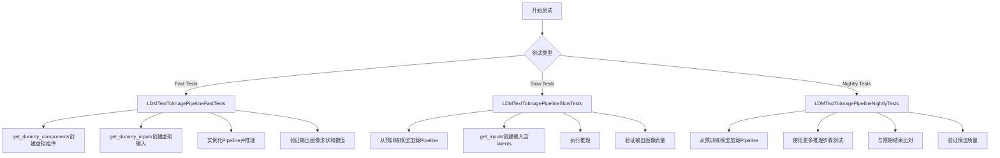
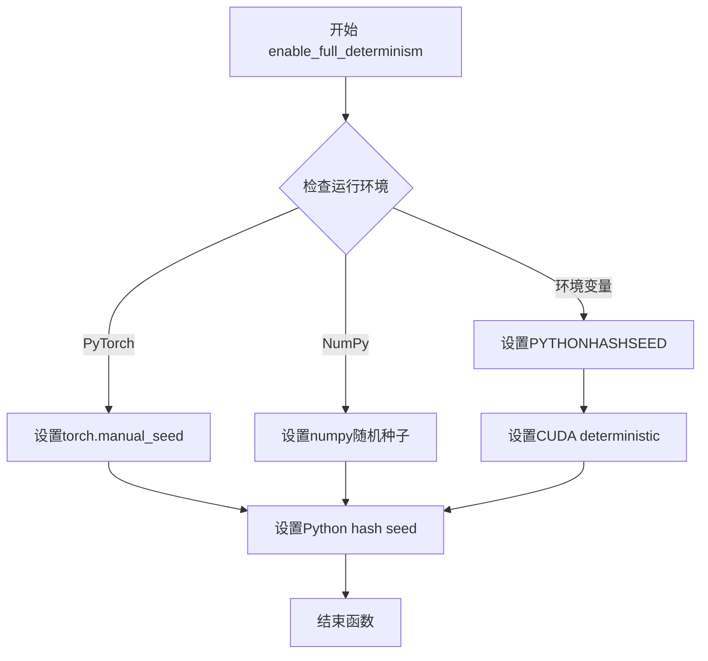
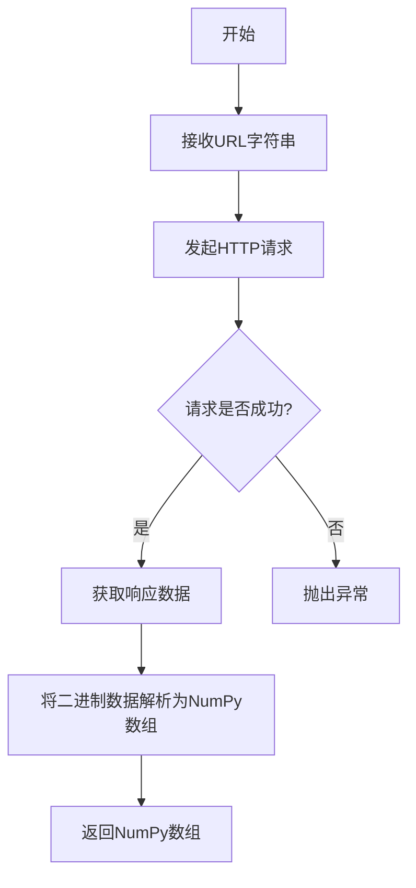
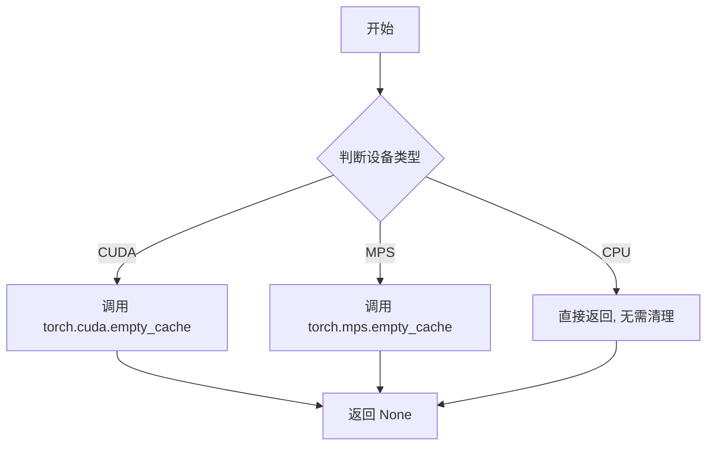
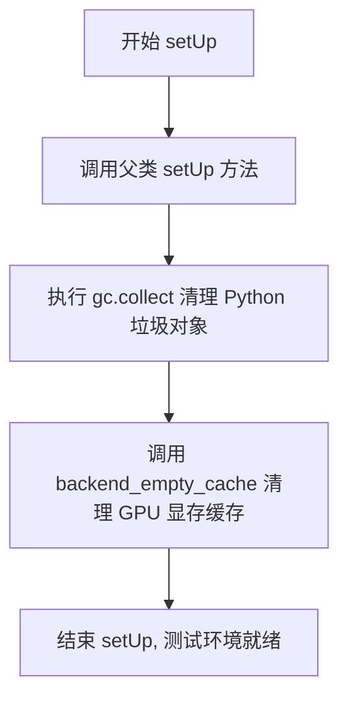
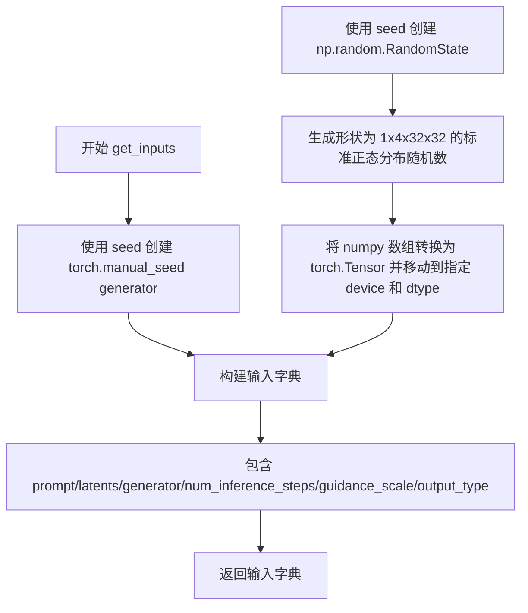
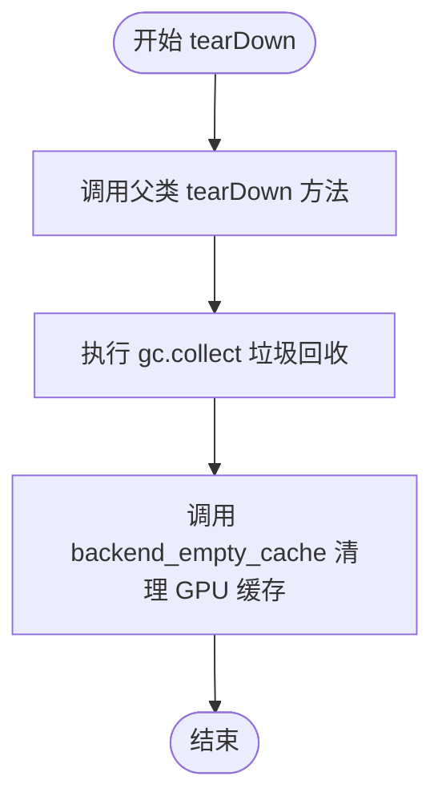
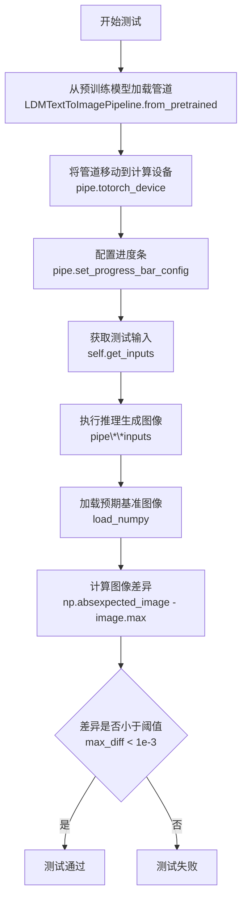

# `diffusers\tests\pipelines\latent_diffusion\test_latent_diffusion.py` 详细设计文档

这是一个用于测试LDM（Latent Diffusion Model）文本到图像生成管道的单元测试文件，包含了快速测试、慢速测试和夜间测试三类测试用例，用于验证pipeline的推理功能、组件初始化和输出图像质量。

## 整体流程



## 类结构

```
unittest.TestCase (Python标准测试基类)
├── PipelineTesterMixin (测试混入类)
│   └── LDMTextToImagePipelineFastTests
├── unittest.TestCase
│   └── LDMTextToImagePipelineSlowTests
└── unittest.TestCase
    └── LDMTextToImagePipelineNightlyTests
```

## 全局变量及字段


### `pipeline_class`
    
指向LDMTextToImagePipeline类，用于测试的pipeline类

类型：`type`
    


### `params`
    
TEXT_TO_IMAGE_PARAMS减去特定参数后的集合，定义测试参数

类型：`set`
    


### `required_optional_params`
    
必需的可选参数集合，用于验证可选参数

类型：`set`
    


### `batch_params`
    
批处理参数配置，定义批量测试参数

类型：`type`
    


### `components`
    
包含unet、scheduler、vqvae、bert、tokenizer的虚拟模型组件字典

类型：`dict`
    


### `inputs`
    
包含prompt、generator、num_inference_steps、guidance_scale、output_type的输入参数字典

类型：`dict`
    


### `device`
    
测试设备字符串，如'cpu'或'cuda'

类型：`str`
    


### `generator`
    
随机数生成器，用于确保测试的可确定性

类型：`torch.Generator`
    


### `image`
    
生成的图像结果数组

类型：`numpy.ndarray`
    


### `image_slice`
    
图像切片用于与期望值比对

类型：`numpy.ndarray`
    


### `expected_slice`
    
期望的图像切片值，用于验证生成质量

类型：`numpy.ndarray`
    


### `max_diff`
    
最大差异值，用于断言生成结果的准确性

类型：`float`
    


### `latents`
    
潜在空间张量，用于DDIM调度器的输入

类型：`torch.Tensor`
    


### `LDMTextToImagePipelineFastTests.pipeline_class`
    
测试的pipeline类，指向LDMTextToImagePipeline

类型：`type`
    


### `LDMTextToImagePipelineFastTests.params`
    
测试参数集合，TEXT_TO_IMAGE_PARAMS减去特定参数后的集合

类型：`set`
    


### `LDMTextToImagePipelineFastTests.required_optional_params`
    
必需的可选参数，用于验证可选参数配置

类型：`set`
    


### `LDMTextToImagePipelineFastTests.batch_params`
    
批处理参数，定义批量测试的配置

类型：`type`
    
    

## 全局函数及方法


### `enable_full_determinism`

该函数用于启用完全确定性模式，通过设置PyTorch和相关库的随机种子和环境变量，确保测试结果在不同运行中保持一致，实现测试的可复现性。

参数：なし（无参数）

返回值：`None`，该函数不返回任何值，主要通过修改全局状态来生效。

#### 流程图



#### 带注释源码

```python
# 导入来源: from ...testing_utils import enable_full_determinism
# 注意: 该函数定义在 testing_utils 模块中，此处仅为调用示例

# 调用方式 - 在测试文件开头调用以确保后续所有随机操作可复现
enable_full_determinism()

# 函数作用说明:
# 1. 设置 torch.manual_seed(0) - 确保PyTorch张量生成的一致性
# 2. 设置环境变量 PYTHONHASHSEED=0 - 确保Python哈希算法的确定性
# 3. 可能设置 torch.use_deterministic_algorithms() - 强制使用确定性算法
# 4. 可能设置 CUDA_VISIBLE_DEVICES_ORDER=PCI - 确保GPU设备顺序确定性

# 此函数被调用的目的:
# - 确保 LDMTextToImagePipelineFastTests 中的测试结果可复现
# - 使得图像生成的随机过程在每次测试运行时产生相同结果
# - 便于调试和定位问题
```


### `load_numpy`

从指定的URL下载并加载NumPy数组文件（.npy格式），返回NumPy数组。

参数：

-  `url`：`str`，要加载的NumPy文件URL地址

返回值：`numpy.ndarray`，从URL加载的NumPy数组

#### 流程图



#### 带注释源码

```python
def load_numpy(url: str) -> numpy.ndarray:
    """
    从URL加载numpy数组
    
    参数:
        url: str - 要加载的NumPy文件URL地址
        
    返回值:
        numpy.ndarray - 从URL加载的NumPy数组
    """
    # 注意: 此函数的实现不在当前代码文件中
    # 它是从 testing_utils 模块导入的
    # 以下为基于使用方式的推测实现:
    
    import requests
    import numpy as np
    from io import BytesIO
    
    # 发起HTTP请求获取远程文件
    response = requests.get(url)
    response.raise_for_status()  # 检查请求是否成功
    
    # 将响应内容加载为NumPy数组
    array = np.load(BytesIO(response.content))
    
    return array
```


### `backend_empty_cache`

清理特定后端的缓存，释放 GPU 内存，常用于测试用例的 setUp 和 tearDown 阶段以确保内存干净。

参数：

- `device`：`str` 或 `torch.device`，目标设备，用于确定需要清理哪个后端的缓存

返回值：`None`，无返回值

#### 流程图



#### 带注释源码

```python
def backend_empty_cache(device):
    """
    清理特定后端的缓存，释放 GPU 内存
    
    参数:
        device: 目标设备，用于确定需要清理哪个后端的缓存
               常见值: 'cuda', 'mps', 'cpu' 等
    
    返回:
        None: 无返回值
    """
    # 判断设备是否为 CUDA (NVIDIA GPU)
    if torch.cuda.is_available():
        # 清理 CUDA 缓存，释放 GPU 显存
        torch.cuda.empty_cache()
    
    # 判断设备是否为 MPS (Apple Silicon GPU)
    if str(device).startswith("mps"):
        # 清理 MPS 缓存，释放 Apple GPU 显存
        torch.mps.empty_cache()
    
    # CPU 设备无需清理缓存，函数直接结束
    # 返回 None
```


# torch_device 常量提取

### `torch_device`

这是一个从 `testing_utils` 模块导入的全局字符串常量，用于指定 PyTorch 测试运行的设备。

#### 上下文信息

由于 `torch_device` 是从外部模块 `...testing_utils` 导入的常量，而非在本文件中定义，以下信息基于代码中的使用方式和上下文推断：

- **名称**：`torch_device`
- **类型**：`str`
- **描述**：测试设备常量，指定 PyTorch 操作所使用的设备（如 "cpu"、"cuda"、"cuda:0" 或 "mps" 等）

#### 代码中的使用示例

```python
# 在 LDMTextToImagePipelineSlowTests 中使用
def setUp(self):
    super().setUp()
    gc.collect()
    backend_empty_cache(torch_device)  # 使用 torch_device 清理缓存

def test_ldm_default_ddim(self):
    pipe = LDMTextToImagePipeline.from_pretrained("CompVis/ldm-text2im-large-256").to(torch_device)  # 将模型移动到指定设备
    pipe.set_progress_bar_config(disable=None)

    inputs = self.get_inputs(torch_device)  # 传递设备信息给测试输入
    image = pipe(**inputs).images
    # ...
```

```python
# 在 LDMTextToImagePipelineNightlyTests 中使用
def test_ldm_default_ddim(self):
    pipe = LDMTextToImagePipeline.from_pretrained("CompVis/ldm-text2im-large-256").to(torch_device)
    # ...
    inputs = self.get_inputs(torch_device)
    # ...
```

#### 推断的定义形式

根据使用方式，`torch_device` 在 `testing_utils` 模块中的定义可能是类似这样的形式：

```python
# testing_utils.py 中的可能定义
import torch

# 根据环境自动选择设备
if torch.cuda.is_available():
    torch_device = "cuda"
elif torch.backends.mps.is_available():
    torch_device = "mps"
else:
    torch_device = "cpu"

# 类型注解
torch_device: str = "cuda"  # 或其他设备
```

#### 作用说明

| 项目 | 说明 |
|------|------|
| **用途** | 在测试中统一指定 PyTorch 张量和模型所使用的设备 |
| **重要性** | 确保测试在不同硬件环境下正确运行，支持 CPU、CUDA、MPS 等多种设备 |
| **相关函数** | `backend_empty_cache()` - 清理设备缓存 |

#### 注意事项

由于 `torch_device` 是导入的常量而非函数，它：
- 没有参数
- 没有返回值（它本身就是值）
- 没有执行流程图（不涉及控制流）
- 其实际定义位于 `diffusers` 库的 `testing_utils` 模块中


### `LDMTextToImagePipelineFastTests.get_dummy_components`

该方法用于创建虚拟（dummy）模型组件，返回一个包含 UNet2DConditionModel、DDIMScheduler、AutoencoderKL、CLIPTextModel 和 CLIPTokenizer 的字典，供快速测试 LDM 文本到图像管道使用。

参数：

- `self`：`LDMTextToImagePipelineFastTests`，当前测试类实例

返回值：`dict`，包含虚拟模型组件的字典，键名为 "unet"、"scheduler"、"vqvae"、"bert"、"tokenizer"

#### 流程图

```mermaid
flowchart TD
    A[开始 get_dummy_components] --> B[设置随机种子 torch.manual_seed(0)]
    B --> C[创建 UNet2DConditionModel]
    C --> D[创建 DDIMScheduler]
    D --> E[设置随机种子 torch.manual_seed(0)]
    E --> F[创建 AutoencoderKL VAE]
    F --> G[设置随机种子 torch.manual_seed(0)]
    G --> H[创建 CLIPTextConfig]
    H --> I[创建 CLIPTextModel]
    I --> J[创建 CLIPTokenizer]
    J --> K[组装 components 字典]
    K --> L[返回 components]
    
    C -.-> C1[block_out_channels: (32, 64)]
    C -.-> C2[layers_per_block: 2]
    C -.-> C3[sample_size: 32]
    C -.-> C4[cross_attention_dim: 32]
    
    F -.-> F1[block_out_channels: (32, 64)]
    F -.-> F2[in_channels: 3]
    F -.-> F3[latent_channels: 4]
    
    H -.-> H1[hidden_size: 32]
    H -.-> H2[num_hidden_layers: 5]
    H -.-> H3[vocab_size: 1000]
```

#### 带注释源码

```python
def get_dummy_components(self):
    """
    创建虚拟模型组件用于快速测试
    
    该方法生成用于测试 LDMTextToImagePipeline 的虚拟组件，
    包括 UNet、调度器、VAE、文本编码器和分词器。
    """
    # 设置随机种子以确保可重复性
    torch.manual_seed(0)
    
    # 创建 UNet2DConditionModel - 用于去噪的 UNet 网络
    unet = UNet2DConditionModel(
        block_out_channels=(32, 64),      # 块输出通道数
        layers_per_block=2,                # 每个块的层数
        sample_size=32,                    # 样本尺寸
        in_channels=4,                     # 输入通道数（潜在空间维度）
        out_channels=4,                    # 输出通道数
        down_block_types=("DownBlock2D", "CrossAttnDownBlock2D"),  # 下采样块类型
        up_block_types=("CrossAttnUpBlock2D", "UpBlock2D"),        # 上采样块类型
        cross_attention_dim=32,           # 交叉注意力维度
    )
    
    # 创建 DDIMScheduler - 用于扩散调度的调度器
    scheduler = DDIMScheduler(
        beta_start=0.00085,               # beta 起始值
        beta_end=0.012,                   # beta 结束值
        beta_schedule="scaled_linear",    # beta 调度方式
        clip_sample=False,                 # 是否裁剪样本
        set_alpha_to_one=False,           # 是否将 alpha 设置为 1
    )
    
    # 重新设置随机种子以确保 VAE 的可重复性
    torch.manual_seed(0)
    
    # 创建 AutoencoderKL - VAE 模型用于潜在空间编码/解码
    vae = AutoencoderKL(
        block_out_channels=(32, 64),      # 块输出通道数
        in_channels=3,                    # 输入通道数（RGB 图像）
        out_channels=3,                   # 输出通道数
        down_block_types=("DownEncoderBlock2D", "DownEncoderBlock2D"),  # 下采样编码器块
        up_block_types=("UpDecoderBlock2D", "UpDecoderBlock2D"),        # 上采样解码器块
        latent_channels=4,               # 潜在空间通道数
    )
    
    # 重新设置随机种子以确保文本编码器的可重复性
    torch.manual_seed(0)
    
    # 创建 CLIPTextConfig - 文本编码器配置
    text_encoder_config = CLIPTextConfig(
        bos_token_id=0,                   # 起始 token ID
        eos_token_id=2,                   # 结束 token ID
        hidden_size=32,                   # 隐藏层大小
        intermediate_size=37,             # 中间层大小
        layer_norm_eps=1e-05,             # LayerNorm  epsilon
        num_attention_heads=4,            # 注意力头数
        num_hidden_layers=5,              # 隐藏层数量
        pad_token_id=1,                   # 填充 token ID
        vocab_size=1000,                  # 词汇表大小
    )
    
    # 创建 CLIPTextModel - 基于 CLIP 的文本编码器
    text_encoder = CLIPTextModel(text_encoder_config)
    
    # 创建 CLIPTokenizer - 分词器
    tokenizer = CLIPTokenizer.from_pretrained("hf-internal-testing/tiny-random-clip")
    
    # 组装组件字典
    # 注意：键名 'vqvae' 对应 VAE，'bert' 对应 text_encoder
    components = {
        "unet": unet,           # UNet2DConditionModel 实例
        "scheduler": scheduler, # DDIMScheduler 实例
        "vqvae": vae,           # AutoencoderKL 实例（键名为 vqvae）
        "bert": text_encoder,   # CLIPTextModel 实例（键名为 bert）
        "tokenizer": tokenizer, # CLIPTokenizer 实例
    }
    
    return components
```


### `LDMTextToImagePipelineFastTests.get_dummy_inputs`

该方法是测试辅助函数，用于为 LDM 文本到图像管道创建虚拟输入参数。根据设备类型（MPS 或其他）选择不同的随机数生成器方式，并返回一个包含提示词、生成器、推理步数、引导比例和输出类型的字典，以支持测试的可重复性和一致性。

参数：

- `self`：隐式参数，`LDMTextToImagePipelineFastTests` 实例，测试类本身
- `device`：`str` 或 `torch.device`，目标计算设备，用于创建随机数生成器
- `seed`：`int`，默认值为 `0`，随机数种子，用于确保测试结果的可重复性

返回值：`dict`，包含虚拟输入参数的字典，键值对包括：
- `"prompt"`：提示词文本
- `"generator"`：PyTorch 随机数生成器
- `"num_inference_steps"`：推理步数
- `"guidance_scale"`：引导比例
- `"output_type"`：输出类型

#### 流程图

```mermaid
flowchart TD
    A[开始 get_dummy_inputs] --> B{device 是否以 'mps' 开头?}
    B -->|是| C[使用 torch.manual_seed(seed) 创建生成器]
    B -->|否| D[使用 torch.Generator(device=device) 创建生成器]
    C --> E[构建 inputs 字典]
    D --> E
    E --> F[设置 prompt 为固定文本]
    F --> G[设置 generator 为步骤C或D创建的生成器]
    G --> H[设置 num_inference_steps=2]
    H --> I[设置 guidance_scale=6.0]
    I --> J[设置 output_type='np']
    J --> K[返回 inputs 字典]
```

#### 带注释源码

```python
def get_dummy_inputs(self, device, seed=0):
    """
    创建用于测试 LDMTextToImagePipeline 的虚拟输入参数字典。
    
    参数:
        device: 目标计算设备 (如 'cpu', 'cuda', 'mps')
        seed: 随机数种子，默认值为 0，用于确保测试可重复性
    
    返回:
        dict: 包含以下键的字典:
            - prompt: 输入文本提示
            - generator: PyTorch 随机数生成器
            - num_inference_steps: 推理步数
            - guidance_scale: 引导比例
            - output_type: 输出格式 ('np' 表示 numpy 数组)
    """
    # 针对 Apple Silicon 的 MPS 设备，使用特殊的随机数生成方式
    if str(device).startswith("mps"):
        # MPS 设备不支持 torch.Generator，使用 torch.manual_seed 代替
        generator = torch.manual_seed(seed)
    else:
        # 其他设备使用 torch.Generator 以支持设备特定的随机数生成
        generator = torch.Generator(device=device).manual_seed(seed)
    
    # 构建虚拟输入参数字典
    inputs = {
        "prompt": "A painting of a squirrel eating a burger",  # 固定测试提示词
        "generator": generator,                                  # 可复现的随机生成器
        "num_inference_steps": 2,                                # 快速测试用较少步数
        "guidance_scale": 6.0,                                    # 典型引导比例
        "output_type": "np",                                      # 返回 numpy 数组便于比较
    }
    return inputs
```


### `LDMTextToImagePipelineFastTests.test_inference_text2img`

该测试方法用于验证 LDMTextToImagePipeline 的文本到图像推理功能，通过创建虚拟组件和输入，执行管道推理，并验证输出图像的形状和像素值是否符合预期。

参数：

- `self`：无显式参数，表示类实例本身（Python隐式传递）

返回值：`None`，该方法为测试方法，无返回值，通过断言进行验证

#### 流程图

```mermaid
flowchart TD
    A([开始测试]) --> B[设置设备为CPU保证确定性]
    B --> C[调用get_dummy_components获取虚拟组件]
    C --> D[创建LDMTextToImagePipeline实例]
    D --> E[将管道移至CPU设备]
    E --> F[设置进度条配置disable=None]
    F --> G[调用get_dummy_inputs获取测试输入]
    G --> H[执行管道推理 pipe.__call__]
    H --> I[获取生成的图像 images]
    I --> J[提取图像切片 image[0, -3:, -3:, -1]]
    J --> K{验证图像形状}
    K -->|通过| L{验证像素值差异}
    K -->|失败| M[抛出断言错误]
    L -->|差异<1e-3| N([测试通过])
    L -->|差异≥1e-3| M
```

#### 带注释源码

```python
def test_inference_text2img(self):
    """
    测试文本到图像推理功能
    验证管道能够根据文本提示生成正确尺寸和内容的图像
    """
    # 设置设备为CPU，确保torch.Generator的确定性
    # 避免因设备差异导致的随机性
    device = "cpu"

    # 获取虚拟组件（UNet、Scheduler、VAE、TextEncoder等）
    # 用于快速测试，无需加载真实模型权重
    components = self.get_dummy_components()

    # 使用虚拟组件创建LDMTextToImagePipeline管道实例
    pipe = LDMTextToImagePipeline(**components)

    # 将管道移至指定设备（CPU）
    pipe.to(device)

    # 配置进度条，disable=None表示不禁用进度条
    pipe.set_progress_bar_config(disable=None)

    # 获取虚拟输入参数
    # 包含：prompt文本、随机数生成器、推理步数、引导强度、输出类型
    inputs = self.get_dummy_inputs(device)

    # 执行管道推理，传入输入参数
    # 返回PipelineOutput对象，包含生成的图像
    image = pipe(**inputs).images

    # 从生成的图像中提取右下角3x3像素块
    # image shape: (batch, height, width, channels)
    image_slice = image[0, -3:, -3:, -1]

    # 断言验证：图像形状应为(1, 16, 16, 3)
    # 1张图片，16x16分辨率，3通道(RGB)
    assert image.shape == (1, 16, 16, 3)

    # 定义期望的像素值切片（用于回归测试）
    expected_slice = np.array([
        0.6101, 0.6156, 0.5622,  # 第一行
        0.4895, 0.6661, 0.3804,  # 第二行
        0.5748, 0.6136, 0.5014   # 第三行
    ])

    # 断言验证：实际像素值与期望值的最大差异应小于1e-3
    # 确保模型输出具有确定性且符合预期
    assert np.abs(image_slice.flatten() - expected_slice).max() < 1e-3
```


### `LDMTextToImagePipelineSlowTests.setUp`

该方法是 `LDMTextToImagePipelineSlowTests` 测试类的初始化方法（setUp），在每个测试方法执行前被调用，用于清理 Python 垃圾回收器和 GPU 显存缓存，以确保测试环境的内存处于干净状态，避免因内存残留导致的测试干扰。

参数：

- `self`：`LDMTextToImagePipelineSlowTests`，测试类实例本身，表示当前测试类对象

返回值：`None`，该方法不返回任何值，仅执行清理操作

#### 流程图



#### 带注释源码

```python
def setUp(self):
    """
    测试前清理缓存和内存的初始化方法
    
    该方法在每个测试方法执行前自动调用，
    用于确保测试环境处于干净的初始状态
    """
    # 调用父类的 setUp 方法，执行 unittest.TestCase 的标准初始化
    super().setUp()
    
    # 手动触发 Python 垃圾回收器，清理已释放的对象
    # 防止因对象残留导致的内存泄漏影响测试结果
    gc.collect()
    
    # 调用后端工具函数清理 GPU 显存缓存
    # torch_device 是全局变量，表示当前测试使用的设备（如 'cuda' 或 'cpu'）
    # 此操作对于显存敏感的测试尤为重要，可避免显存不足导致的测试失败
    backend_empty_cache(torch_device)
```

#### 关键组件信息

| 组件名称 | 一句话描述 |
|---------|-----------|
| `gc` | Python 内置的垃圾回收模块，用于自动回收内存中不再使用的对象 |
| `gc.collect()` | 强制执行垃圾回收，释放已删除对象占用的内存 |
| `backend_empty_cache` | 自定义工具函数，用于清理深度学习框架（PyTorch）的 GPU 显存缓存 |
| `torch_device` | 全局变量，表示当前 PyTorch 设备（如 'cuda:0' 或 'cpu'） |

#### 潜在技术债务与优化空间

1. **重复代码**：该类的 `setUp` 和 `tearDown` 方法与 `LDMTextToImagePipelineNightlyTests` 类中的实现完全相同，可考虑提取为测试基类以减少代码冗余
2. **硬编码设备依赖**：依赖全局变量 `torch_device`，在多设备测试场景下可能不够灵活
3. **缺乏错误处理**：若 `backend_empty_cache` 或 `gc.collect` 抛出异常，可能导致测试框架无法正常运行，应添加异常捕获机制

#### 其它设计说明

- **设计目标**：确保夜间测试（Nightly Tests）在执行前释放系统资源，避免因内存/显存残留导致的测试不稳定
- **错误处理**：当前实现无显式错误处理，若清理操作失败（如 GPU 不可用），测试将直接失败
- **外部依赖**：依赖 `testing_utils` 模块中的 `backend_empty_cache` 和 `torch_device`，以及 Python 内置的 `gc` 模块


### `LDMTextToImagePipelineSlowTests.tearDown`

该方法是 `LDMTextToImagePipelineSlowTests` 测试类的拆解（tearDown）方法，在每个测试方法执行完毕后被调用，用于清理测试过程中产生的缓存和内存，确保测试环境的干净状态，避免测试之间的相互影响。

参数：

- `self`：`LDMTextToImagePipelineSlowTests`（即 `unittest.TestCase`），测试类实例本身，代表当前测试对象

返回值：`None`，无返回值，仅执行清理操作

#### 流程图

```mermaid
flowchart TD
    A[开始 tearDown] --> B[调用父类 tearDown: super().tearDown]
    B --> C[执行垃圾回收: gc.collect]
    C --> D[清空 GPU 缓存: backend_empty_cache]
    D --> E[结束]
```

#### 带注释源码

```python
def tearDown(self):
    """
    测试后清理缓存和内存
    
    该方法在每个测试方法执行完毕后被调用，执行以下清理操作：
    1. 调用父类的 tearDown 方法，确保父类清理逻辑正常执行
    2. 强制进行 Python 垃圾回收，释放测试过程中产生的 Python 对象
    3. 清空 GPU/后端缓存，释放 GPU 显存，避免测试间相互影响
    """
    # 调用 unittest.TestCase 的 tearDown，释放测试框架相关资源
    super().tearDown()
    
    # 强制调用 Python 垃圾回收器，回收测试过程中创建的无法自动释放的对象
    gc.collect()
    
    # 清空 GPU 缓存，释放显存资源
    # torch_device 是一个全局变量，表示当前使用的 PyTorch 设备（如 'cuda:0', 'cpu' 等）
    backend_empty_cache(torch_device)
```


### `LDMTextToImagePipelineSlowTests.get_inputs`

该方法用于创建 LDMTextToImagePipeline 的测试输入数据，生成包含预定义 latents（潜在变量）的输入字典，用于测试文本到图像生成管道的推理流程。

参数：

- `self`：隐式参数，测试类实例
- `device`：`torch.device`，指定运行设备（如 "cpu"、"cuda" 等）
- `dtype`：`torch.dtype`，latents 的数据类型（默认为 `torch.float32`）
- `seed`：`int`，随机种子，用于生成可复现的 latents 和 generator（默认为 0）

返回值：`dict`，包含以下键值的字典：
- `prompt`（str）：文本提示词
- `latents`（torch.Tensor）：预生成的潜在变量张量，形状为 (1, 4, 32, 32)
- `generator`（torch.Generator）：随机数生成器
- `num_inference_steps`（int）：推理步数
- `guidance_scale`（float）：引导系数
- `output_type`（str）：输出类型

#### 流程图



#### 带注释源码

```python
def get_inputs(self, device, dtype=torch.float32, seed=0):
    """
    为 LDMTextToImagePipeline 创建测试输入数据
    
    参数:
        device: torch.device, 目标设备
        dtype: torch.dtype, latents 的数据类型，默认为 float32
        seed: int, 随机种子，用于生成可复现的测试数据
    
    返回:
        dict: 包含 pipeline 所需输入参数的字典
    """
    # 使用 torch.manual_seed 创建随机数生成器，确保 PyTorch 操作的确定性
    generator = torch.manual_seed(seed)
    
    # 使用 NumPy 的 RandomState 生成指定形状的潜在变量
    # 形状 (1, 4, 32, 32) 对应 batch_size=1, channels=4, height=32, width=32
    latents = np.random.RandomState(seed).standard_normal((1, 4, 32, 32))
    
    # 将 NumPy 数组转换为 PyTorch 张量，并移至目标设备指定数据类型
    latents = torch.from_numpy(latents).to(device=device, dtype=dtype)
    
    # 构建完整的输入字典，包含 pipeline 推理所需的所有参数
    inputs = {
        "prompt": "A painting of a squirrel eating a burger",  # 文本提示
        "latents": latents,                                     # 预生成 latents
        "generator": generator,                                 # 随机生成器
        "num_inference_steps": 3,                               # 推理步数（较少的步数用于快速测试）
        "guidance_scale": 6.0,                                  # CFG 引导强度
        "output_type": "np",                                    # 输出为 numpy 数组
    }
    return inputs
```


### `LDMTextToImagePipelineSlowTests.test_ldm_default_ddim`

该测试方法验证了 LDM Text-to-Image Pipeline 使用 DDIM 调度器（DDIMScheduler）的默认行为，通过加载预训练模型、执行推理并比对输出图像与预期值来确保 pipeline 的正确性。

参数：

- `self`：`LDMTextToImagePipelineSlowTests`，测试类实例本身，无需显式传递

返回值：`None`，该方法为测试用例，无返回值，通过断言验证功能正确性

#### 流程图

```mermaid
flowchart TD
    A[测试开始] --> B[调用 setUp 方法: gc.collect + backend_empty_cache]
    B --> C[从预训练模型加载 LDMTextToImagePipeline]
    C --> D[将 pipeline 移动到 torch_device]
    D --> E[配置进度条: set_progress_bar_config]
    E --> F[调用 get_inputs 获取推理参数]
    F --> G[执行 pipeline 推理: pipe.__call__]
    G --> H[提取图像切片: image[0, -3:, -3:, -1].flatten]
    H --> I[断言图像形状: (1, 256, 256, 3)]
    I --> J[计算与预期切片的最大差异]
    J --> K{最大差异 < 1e-3?}
    K -->|是| L[测试通过]
    K -->|否| M[断言失败抛出 AssertionError]
    M --> N[调用 tearDown 方法: gc.collect + backend_empty_cache]
    L --> N
```

#### 带注释源码

```python
@nightly                              # 标记为夜间测试，运行耗时较长
@require_torch_accelerator            # 需要 CUDA 支持的 torch 加速器
def test_ldm_default_ddim(self):
    # 从 HuggingFace Hub 加载预训练的 LDM Text-to-Image 大模型 (256x256)
    pipe = LDMTextToImagePipeline.from_pretrained("CompVis/ldm-text2im-large-256").to(torch_device)
    
    # 禁用或配置进度条 (传入 None 表示保持默认配置)
    pipe.set_progress_bar_config(disable=None)

    # 准备推理所需的输入参数:
    # - prompt: 文本提示 "A painting of a squirrel eating a burger"
    # - latents: 随机初始化的潜在向量 (1, 4, 32, 32)
    # - generator: 随机数生成器，确保推理可复现
    # - num_inference_steps: DDIM 推理步数 (3步)
    # - guidance_scale: 无分类器引导系数 (6.0)
    # - output_type: 输出类型为 numpy 数组
    inputs = self.get_inputs(torch_device)
    
    # 执行图像生成推理
    image = pipe(**inputs).images
    
    # 提取生成的图像切片用于验证 (取最后3x3像素区域)
    # image shape: (1, 256, 256, 3) -> slice shape: (9,)
    image_slice = image[0, -3:, -3:, -1].flatten()

    # 断言输出图像尺寸正确
    assert image.shape == (1, 256, 256, 3)
    
    # 预期的图像像素值切片 (DDIM 调度器基准值)
    expected_slice = np.array([0.51825, 0.52850, 0.52543, 0.54258, 0.52304, 0.52569, 0.54363, 0.55276, 0.56878])
    
    # 计算实际输出与预期值的最大差异
    max_diff = np.abs(expected_slice - image_slice).max()
    
    # 断言差异在可接受范围内 (1e-3 = 0.001)
    assert max_diff < 1e-3
```


### `LDMTextToImagePipelineNightlyTests.setUp`

该方法是一个测试初始化函数，在每个测试用例运行前被调用，用于执行垃圾回收和清理GPU/后端缓存，确保测试环境处于干净状态，避免因之前的测试遗留数据导致的内存泄漏或状态污染。

参数：

- `self`：`LDMTextToImagePipelineNightlyTests`，测试类实例本身，无需显式传递

返回值：`None`，无返回值

#### 流程图

```mermaid
flowchart TD
    A[开始 setUp] --> B[调用 super().setUp]
    B --> C[执行 gc.collect]
    C --> D{检查 torch_device 可用性}
    D -->|设备可用| E[调用 backend_empty_cache]
    D -->|设备不可用| F[跳过缓存清理]
    E --> G[结束 setUp]
    F --> G
```

#### 带注释源码

```python
def setUp(self):
    """
    测试前清理缓存和内存，确保测试环境干净
    
    该方法在每个测试用例执行前被 unittest 框架自动调用，
    用于重置测试状态，防止测试之间的相互影响。
    """
    # 调用父类的 setUp 方法，执行 unittest.TestCase 的标准初始化
    super().setUp()
    
    # 执行 Python 垃圾回收，释放不再使用的对象内存
    gc.collect()
    
    # 清理 GPU/后端缓存，释放显存等资源
    # torch_device 和 backend_empty_cache 由 testing_utils 模块提供
    backend_empty_cache(torch_device)
```


### `LDMTextToImagePipelineNightlyTests.tearDown`

测试后清理缓存和内存，释放GPU资源，防止内存泄漏。

参数：

- `self`：`self`，类实例本身

返回值：`None`，无返回值

#### 流程图



#### 带注释源码

```python
def tearDown(self):
    """
    测试后清理方法。
    清理测试过程中产生的GPU缓存和内存，确保测试环境干净。
    """
    # 调用父类的 tearDown 方法，完成基础清理工作
    super().tearDown()
    
    # 手动触发 Python 垃圾回收，释放不再使用的对象
    gc.collect()
    
    # 调用后端工具函数清理 GPU 显存缓存
    # torch_device 是全局变量，表示当前使用的设备（如 'cuda:0'）
    backend_empty_cache(torch_device)
```


### `LDMTextToImagePipelineNightlyTests.get_inputs`

该方法是 `LDMTextToImagePipelineNightlyTests` 测试类中的一个辅助方法，用于创建 LDM 文本到图像流水线的测试输入参数。它生成包含提示词、潜在向量、生成器、推理步骤数、引导比例和输出类型等关键参数的字典，用于验证流水线在夜间测试场景下的功能正确性。

参数：

- `self`：`LDMTextToImagePipelineNightlyTests` 实例本身，测试类实例
- `device`：`torch.device`，目标计算设备（如 CPU、CUDA 等），用于将潜在向量放置到指定设备上
- `dtype`：`torch.dtype`，数据类型，默认为 `torch.float32`，用于指定潜在向量的精度
- `seed`：`int`，随机种子，默认为 `0`，用于确保测试结果的可重复性

返回值：`dict`，包含以下键值对的字典：
- `"prompt"`：提示词文本（字符串）
- `"latents"`：初始潜在向量（`torch.Tensor`）
- `"generator"`：PyTorch 随机生成器（`torch.Generator`）
- `"num_inference_steps"`：推理步数（整数）
- `"guidance_scale"`：引导比例（浮点数）
- `"output_type"`：输出类型（字符串）

#### 流程图

```mermaid
graph TD
    A[开始] --> B[设置随机种子: torch.manual_seed(seed)]
    B --> C[生成随机潜在向量: np.random.RandomState<br/>.standard_normal((1, 4, 32, 32))]
    C --> D[转换潜在向量为Torch张量<br/>并移动到指定设备: torch.from_numpy<br/>.latents.to device=dtype]
    D --> E[构建输入参数字典 inputs]
    E --> F["添加 prompt: 'A painting of a squirrel eating a burger'"]
    F --> G["添加 latents: latents 张量"]
    G --> H["添加 generator: torch.manual_seed(seed)"]
    H --> I["添加 num_inference_steps: 50"]
    I --> J["添加 guidance_scale: 6.0"]
    J --> K["添加 output_type: 'np'"]
    K --> L[返回 inputs 字典]
```

#### 带注释源码

```python
def get_inputs(self, device, dtype=torch.float32, seed=0):
    """
    创建 LDM Text-to-Image Pipeline 的测试输入参数。
    
    参数:
        device: 目标计算设备
        dtype: 张量数据类型，默认为 torch.float32
        seed: 随机种子，用于确保可重复性
    
    返回:
        dict: 包含所有测试输入参数的字典
    """
    
    # 1. 使用指定种子设置 PyTorch 全局随机生成器
    # 确保测试的确定性，便于复现问题
    generator = torch.manual_seed(seed)
    
    # 2. 使用 NumPy 创建随机潜在向量 (latents)
    # 形状为 (1, 4, 32, 32)：1 张图像，4 个通道，32x32 空间分辨率
    # 这是 LDM 模型的潜在空间表示
    latents = np.random.RandomState(seed).standard_normal((1, 4, 32, 32))
    
    # 3. 将 NumPy 数组转换为 PyTorch 张量
    # 并移动到指定设备 (CPU/CUDA) 和指定数据类型
    latents = torch.from_numpy(latents).to(device=device, dtype=dtype)
    
    # 4. 构建完整的输入参数字典
    inputs = {
        "prompt": "A painting of a squirrel eating a burger",  # 文本提示
        "latents": latents,                                    # 初始潜在向量
        "generator": generator,                                # 随机生成器
        "num_inference_steps": 50,                             # 推理步数 (夜间测试使用更多步数)
        "guidance_scale": 6.0,                                 # Classifier-free guidance 强度
        "output_type": "np",                                   # 输出为 NumPy 数组
    }
    
    # 5. 返回输入参数字典，供 pipeline 调用
    return inputs
```


### `LDMTextToImagePipelineNightlyTests.test_ldm_default_ddim`

测试方法，用于验证 LDMTextToImagePipeline 使用默认 DDIM 调度器进行文本到图像生成的正确性，通过对比模型生成的图像与预存的基准图像，确保像素级差异小于阈值。

参数：

- `self`：`LDMTextToImagePipelineNightlyTests`，隐式参数，表示测试类实例本身

返回值：`None`，无返回值，该方法为测试用例，通过断言验证功能正确性

#### 流程图



#### 带注释源码

```python
def test_ldm_default_ddim(self):
    """
    夜间测试：验证 LDMTextToImagePipeline 使用默认 DDIM 调度器进行文本到图像生成。
    该测试从预训练模型加载管道，执行推理，并将生成的图像与预存的基准图像进行对比，
    确保像素级差异小于 1e-3，以验证模型推理的正确性和可复现性。
    """
    # 从预训练模型 'CompVis/ldm-text2im-large-256' 加载 LDMTextToImagePipeline 管道
    # 这是一个大规模文本到图像扩散模型，使用 LDM（Latent Diffusion Models）架构
    pipe = LDMTextToImagePipeline.from_pretrained("CompVis/ldm-text2im-large-256").to(torch_device)
    
    # 配置进度条显示，disable=None 表示不隐藏进度条
    pipe.set_progress_bar_config(disable=None)

    # 调用从父类继承的 get_inputs 方法，获取测试所需的输入参数
    # 包括：prompt、latents、generator、num_inference_steps、guidance_scale、output_type
    inputs = self.get_inputs(torch_device)
    
    # 执行管道推理，**inputs 将字典解包为关键字参数
    # 返回的 .images[0] 获取第一张生成的图像
    image = pipe(**inputs).images[0]

    # 从 Hugging Face 数据集加载预期的基准图像，用于对比验证
    # 该基准图像是模型在相同条件下生成的参考输出
    expected_image = load_numpy(
        "https://huggingface.co/datasets/diffusers/test-arrays/resolve/main/ldm_text2img/ldm_large_256_ddim.npy"
    )
    
    # 计算生成图像与预期图像之间的最大绝对差异
    max_diff = np.abs(expected_image - image).max()
    
    # 断言：最大差异必须小于 1e-3，否则测试失败
    # 这确保了模型推理的确定性和与基准的一致性
    assert max_diff < 1e-3
```

## 关键组件


### LDMTextToImagePipeline

核心测试类，包含快速测试、慢速测试和夜间测试三个测试套件，用于验证文本到图像生成管道的功能正确性。

### UNet2DConditionModel

去噪网络模型，在测试中配置为2D条件UNet，用于从噪声潜在向量逐步生成图像特征。

### AutoencoderKL (vqvae)

变分自编码器模型，负责将图像编码为潜在向量以及将潜在向量解码回图像，支持latent space的操作。

### CLIPTextModel (bert)

CLIP文本编码器模型，将输入文本提示转换为文本嵌入向量，为UNet提供条件信息。

### CLIPTokenizer

分词器，将文本提示转换为token IDs序列，供文本编码器使用。

### DDIMScheduler

DDIM调度器，控制去噪过程中的噪声调度策略，支持不同的beta schedule配置。

### 张量索引访问

通过 `image[0, -3:, -3:, -1]` 方式对输出图像进行切片索引，获取特定区域的像素值进行验证。

### 量化策略支持

通过 `output_type` 参数支持多种输出格式（包括 "np" 返回numpy数组），实现不同数据类型的输出转换。

### 测试参数配置

包含 `TEXT_TO_IMAGE_PARAMS` 和 `TEXT_TO_IMAGE_BATCH_PARAMS` 参数集合，定义了pipeline所需的输入参数规范。

### 设备与随机性管理

使用 `torch.manual_seed` 和 `torch.Generator` 确保测试的确定性，通过 `gc.collect()` 和 `backend_empty_cache` 管理内存。


## 问题及建议


### 已知问题

- **代码重复**：三个测试类（`LDMTextToImagePipelineFastTests`、`LDMTextToImagePipelineSlowTests`、`LDMTextToImagePipelineNightlyTests`）中 `setUp`、`tearDown` 和 `get_inputs` 方法存在大量重复代码，违反 DRY 原则
- **设备兼容性处理不一致**：`get_dummy_inputs` 中对 MPS 设备使用 `torch.manual_seed(seed)` 而其他设备使用 `torch.Generator(device=device).manual_seed(seed)`，可能导致某些场景下随机性行为不一致
- **魔法数字和硬编码值**：多处使用硬编码的数值如 `beta_start=0.00085`、`beta_end=0.012`、`latents shape (1, 4, 32, 32)` 等，缺乏配置常量统一管理
- **测试断言不够健壮**：使用 `np.abs().max() < 1e-3` 进行浮点数比较，可能在某些硬件平台上因精度问题导致误报
- **资源清理不够彻底**：`setUp` 和 `tearDown` 中只进行了 `gc.collect()` 和 `backend_empty_cache`，但没有显式释放 GPU 内存或删除大对象
- **配置参数语义不明确**：`set_progress_bar_config(disable=None)` 中 `disable=None` 的含义不清晰，应使用明确的布尔值或枚举

### 优化建议

- **提取公共基类**：将重复的 `setUp`、`tearDown` 和 `get_inputs` 方法提取到一个通用的测试基类中，三个测试类继承该基类
- **统一随机数生成**：对所有设备使用统一的随机数生成方式，或者为不同设备提供明确的注释说明差异原因
- **集中管理配置常量**：创建配置类或配置文件，将所有魔法数字和硬编码值集中管理，便于维护和修改
- **改进断言精度**：考虑使用 `np.allclose()` 代替精确比较，或提供相对误差和绝对误差的容差范围配置
- **增强资源清理**：在 `tearDown` 中显式删除大型对象（如 `pipe`、`components`）并调用 `del`，确保内存及时释放
- **明确配置语义**：将 `disable=None` 改为更明确的参数如 `disable=False` 或使用具名常量，提高代码可读性

## 其它


### 设计目标与约束

验证 LDMTextToImagePipeline 在文本到图像生成任务中的功能正确性，确保输出图像符合预期。约束条件包括：使用 CPU 设备保证确定性测试结果，使用固定的随机种子确保测试可重复性，测试覆盖快速推理、慢速推理和夜间测试三种场景。

### 错误处理与异常设计

测试中主要使用 assert 语句进行断言验证，验证图像形状是否符合预期 (1, 16, 16, 3) 或 (1, 256, 256, 3)，验证图像像素值与预期值的差异是否在允许范围内 (max_diff < 1e-3)。对于 MPS 设备，使用 torch.manual_seed 代替 torch.Generator 以兼容 Apple Silicon。

### 数据流与状态机

测试数据流：get_dummy_components() 创建虚拟组件 (UNet、Scheduler、VAE、TextEncoder、Tokenizer) → get_dummy_inputs() 生成测试输入 (prompt、generator、num_inference_steps、guidance_scale、output_type) → pipeline 执行推理 → 验证输出图像。状态转换：组件初始化 → 管道创建 → 设备转移 → 推理执行 → 结果验证。

### 外部依赖与接口契约

依赖外部组件：transformers 库 (CLIPTextConfig、CLIPTextModel、CLIPTokenizer)、diffusers 库 (AutoencoderKL、DDIMScheduler、LDMTextToImagePipeline、UNet2DConditionModel)、numpy、torch。接口契约：pipeline 接受 prompt、generator、num_inference_steps、guidance_scale、output_type 等参数，返回包含 images 属性的对象。

### 测试覆盖率说明

快速测试覆盖：pipeline 基础功能、组件初始化、推理步骤、输出类型。慢速测试覆盖：真实模型加载 (CompVis/ldm-text2im-large-256)、DDIM 调度器、少量推理步骤 (3步)。夜间测试覆盖：完整推理步骤 (50步)、与预存基准图像对比。

### 性能基准与要求

快速测试：2步推理，要求执行时间短。慢速测试：3步推理，使用真实模型。夜间测试：50步推理，验证完整生成流程。内存管理：通过 gc.collect() 和 backend_empty_cache() 管理 GPU 内存。

### 兼容性考虑

设备兼容性：支持 CPU、MPS、Apple Silicon (通过条件判断处理 generator 创建方式)。依赖版本：依赖 transformers 和 diffusers 库的特定功能。输出类型兼容性：支持 "np" 输出类型转换为 numpy 数组进行验证。

### 配置与参数说明

num_inference_steps：推理步数，快速测试为2步，慢速为3步，夜间为50步。guidance_scale：引导系数，固定为6.0。output_type：输出类型，统一使用 "np" (numpy)。device：快速测试固定使用 "cpu" 以保证确定性。

### 运行环境和平台要求

Python 版本：支持 Python 3.x。PyTorch：需要 torch 库支持。加速器支持：支持 CUDA 设备 (通过 @require_torch_accelerator 装饰器标记)。夜间测试：仅在 nightly 模式下运行。

### 测试用例设计原则

确定性原则：使用固定随机种子确保测试结果可重复。隔离原则：每个测试用例独立创建组件和输入。验证原则：通过数值比较验证输出正确性，设置容差为 1e-3。分层原则：按执行速度分为快速、慢速、夜间三个测试类。

    