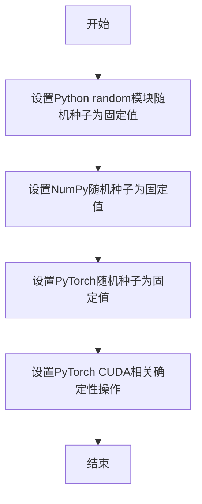
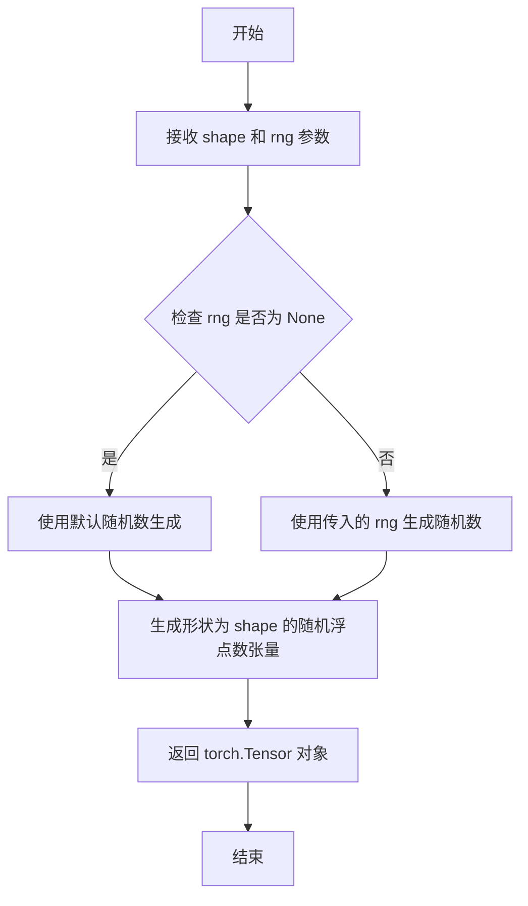
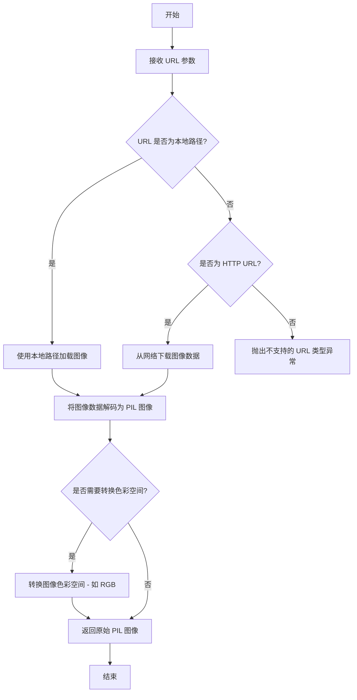
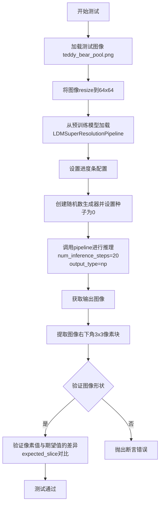
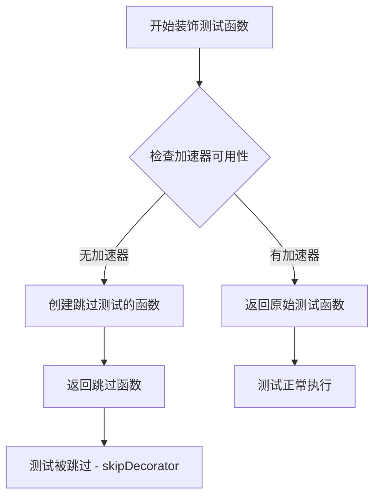
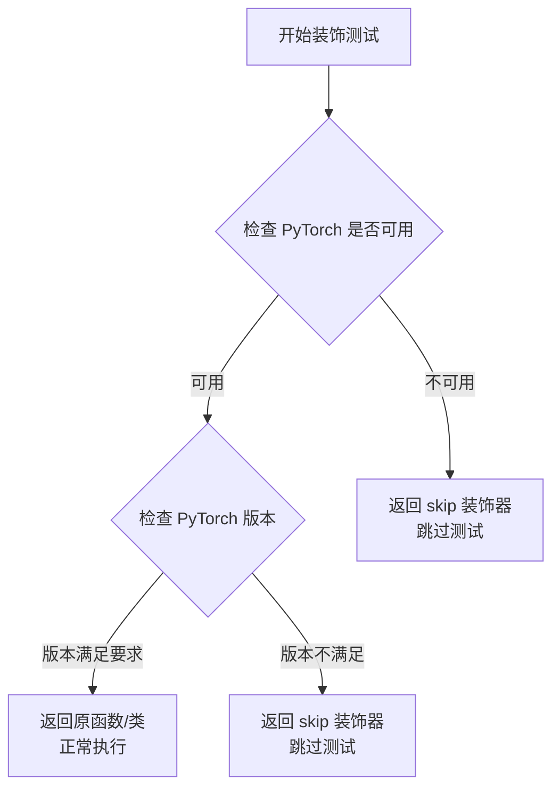
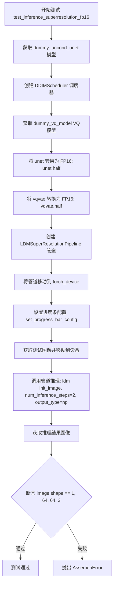
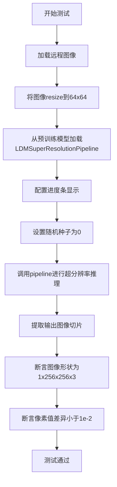

# `diffusers\tests\pipelines\latent_diffusion\test_latent_diffusion_superresolution.py` 详细设计文档

这是一个针对LDM（Latent Diffusion Model）超分辨率管道的单元测试文件，包含快速测试和集成测试，用于验证管道在CPU和GPU上的推理功能，包括FP16精度支持。

## 整体流程

```mermaid
graph TD
A[开始测试] --> B[准备虚拟模型]
B --> B1[创建dummy_uncond_unet]
B --> B2[创建dummy_vq_model]
B --> B3[创建dummy_image]
C[初始化管道] --> D[创建DDIMScheduler]
D --> E[实例化LDMSuperResolutionPipeline]
E --> F[设置设备和进度条]
F --> G[执行推理]
G --> H{测试类型}
H -- 快速测试 --> I[验证输出形状为(1, 64, 64, 3)]
H -- FP16测试 --> I1[验证输出形状为(1, 64, 64, 3)]
H -- 集成测试 --> I2[加载真实图像并调整大小]
I2 --> I3[从预训练模型加载管道]
I3 --> I4[执行20步推理]
I5[验证图像切片数值] --> J[结束测试]
I --> I5
I1 --> I5
```

## 类结构

```
unittest.TestCase (基类)
├── LDMSuperResolutionPipelineFastTests
│   ├── dummy_image (property)
│   ├── dummy_uncond_unet (property)
│   ├── dummy_vq_model (property)
│   ├── test_inference_superresolution
│   └── test_inference_superresolution_fp16
└── LDMSuperResolutionPipelineIntegrationTests (带@nightly和@require_torch装饰器)
    └── test_inference_superresolution
```

## 全局变量及字段


### `random`
    
Python标准库的随机数生成模块，用于生成测试数据

类型：`module`
    


### `unittest`
    
Python标准库的单元测试框架，提供测试用例编写和运行功能

类型：`module`
    


### `np`
    
NumPy库，用于数值计算和数组操作

类型：`module`
    


### `torch`
    
PyTorch深度学习库，用于张量计算和神经网络构建

类型：`module`
    


### `DDIMScheduler`
    
DDIM调度器类，用于扩散模型的采样调度

类型：`class`
    


### `LDMSuperResolutionPipeline`
    
LDM超分辨率管道类，用于将低分辨率图像转换为高分辨率图像

类型：`class`
    


### `UNet2DModel`
    
2D UNet模型类，用于图像到图像的扩散过程

类型：`class`
    


### `VQModel`
    
VQ-VAE模型类，用于图像的量化编码和解码

类型：`class`
    


### `PIL_INTERPOLATION`
    
PIL插值方法字典，包含各种图像缩放插值算法

类型：`dict`
    


### `enable_full_determinism`
    
测试工具函数，用于启用完全确定性模式以确保测试可复现

类型：`function`
    


### `floats_tensor`
    
测试工具函数，用于生成指定形状的随机浮点数张量

类型：`function`
    


### `load_image`
    
测试工具函数，用于从URL或本地路径加载图像

类型：`function`
    


### `nightly`
    
测试装饰器，标记需要夜间运行的集成测试

类型：`decorator`
    


### `require_accelerator`
    
测试装饰器，检查是否配置了加速器（如GPU）

类型：`decorator`
    


### `require_torch`
    
测试装饰器，检查是否安装了PyTorch

类型：`decorator`
    


### `torch_device`
    
测试工具变量，指定PyTorch使用的设备（如'cpu'或'cuda'）

类型：`str`
    


### `LDMSuperResolutionPipelineFastTests.dummy_image`
    
用于测试的虚拟图像张量，形状为(1, 3, 32, 32)

类型：`torch.Tensor`
    


### `LDMSuperResolutionPipelineFastTests.dummy_uncond_unet`
    
用于测试的无条件UNet2D模型实例

类型：`UNet2DModel`
    


### `LDMSuperResolutionPipelineFastTests.dummy_vq_model`
    
用于测试的VQ模型实例

类型：`VQModel`
    
    

## 全局函数及方法


### enable_full_determinism

设置随机种子以确保测试的完全确定性，使多次运行产生相同的结果。

参数： 无

返回值：`None`，无返回值（仅执行副作用操作）

#### 流程图



#### 带注释源码

```python
# 注意：以下源码为基于函数名和上下文的推断实现
# 实际定义在 diffusers.testing_utils 模块中

def enable_full_determinism():
    """
    启用完全确定性模式，确保测试可复现。
    通过设置各种随机数生成器的种子，使得每次运行产生相同的随机结果。
    """
    # 设置Python内置random模块的种子
    random.seed(0)
    
    # 设置NumPy的随机种子
    np.random.seed(0)
    
    # 设置PyTorch的随机种子
    torch.manual_seed(0)
    
    # 如果使用CUDA，设置CUDA操作的确定性
    if torch.cuda.is_available():
        torch.cuda.manual_seed(0)
        torch.backends.cudnn.deterministic = True
        torch.backends.cudnn.benchmark = False
```

---

**注意**：由于原始代码中仅导入了该函数而未展示其完整定义，以上内容基于函数名称、调用方式及业界常规实践进行的合理推断。实际的`enable_full_determinism`函数定义位于`diffusers.testing_utils`模块中。


### `floats_tensor`

生成指定形状的随机浮点数 PyTorch 张量，常用于测试场景中创建模拟输入数据。

参数：

- `shape`：`tuple`，张量的形状，例如 `(1, 3, 32, 32)`
- `rng`：`random.Random`，可选参数，用于生成随机数的随机数生成器实例，默认为 `None`

返回值：`torch.Tensor`，包含随机浮点数的 PyTorch 张量

#### 流程图



#### 带注释源码

```python
# floats_tensor 函数的典型实现（在 testing_utils 模块中）
def floats_tensor(shape, rng=None):
    """
    生成指定形状的随机浮点数张量。
    
    参数:
        shape: 张量的形状元组，如 (batch_size, channels, height, width)
        rng: random.Random 实例，用于控制随机性，便于测试复现
    
    返回:
        torch.Tensor: 包含随机浮点数的张量，值域通常在 [0, 1) 或 [-1, 1]
    """
    if rng is None:
        # 如果未提供随机数生成器，创建随机浮点数张量
        # 通常使用 torch.randn 或 torch.rand
        return torch.randn(*shape)
    else:
        # 使用传入的随机数生成器生成随机数
        # 这种方式便于测试时固定随机种子以复现结果
        return torch.from_numpy(
            np.array([rng.random() for _ in range(np.prod(shape))])
        ).reshape(shape).float()
```


### `load_image`

该函数用于从指定 URL 下载图像并转换为 PIL 图像对象，支持多种图像格式和插值方式。

参数：

- `url`：`str`，待下载图像的 URL 地址

返回值：`PIL.Image.Image`，下载并转换后的 PIL 图像对象

#### 流程图



#### 带注释源码

```python
def load_image(
    url: str,
    timeout: int = None,
    proxies: dict = None,
    **kwargs
) -> "PIL.Image.Image":
    """
    从指定 URL 加载图像并返回 PIL 图像对象
    
    参数:
        url: 图像的 URL 地址，可以是 http/https 地址或本地文件路径
        timeout: 下载超时时间（秒），默认无超时
        proxies: 代理服务器配置字典
        **kwargs: 其他可选参数，如 convert_mode 等
    
    返回:
        PIL.Image.Image: 加载并转换后的 PIL 图像对象，默认转换为 RGB 模式
    """
    # 检查是否为本地文件路径
    if os.path.isfile(url):
        # 加载本地图像文件
        image = Image.open(url)
    else:
        # 处理 URL，添加代理支持
        session = requests.Session()
        if proxies:
            session.proxies = proxies
        
        # 发送 HTTP GET 请求下载图像
        response = session.get(url, timeout=timeout)
        response.raise_for_status()
        
        # 从响应内容创建图像
        image = Image.open(BytesIO(response.content))
    
    # 转换图像为 RGB 模式（确保通道一致）
    if image.mode != "RGB":
        image = image.convert("RGB")
    
    return image
```


### LDMSuperResolutionPipelineIntegrationTests.test_inference_superresolution

这是带有 `@nightly` 装饰器的集成测试方法，用于测试 LDM 超分辨率管道的推理功能，验证模型是否能正确将低分辨率图像（64x64）超分辨率重建为高分辨率图像（256x256）。

参数：

- 无显式参数（但隐式使用类方法调用）

返回值：`unittest.TestResult`，pytest/unittest 框架的测试结果对象

#### 流程图



#### 带注释源码

```python
@nightly  # 标记为夜间测试，仅在特定条件下运行
@require_torch  # 要求PyTorch环境
class LDMSuperResolutionPipelineIntegrationTests(unittest.TestCase):
    """LDM超分辨率管道的集成测试类"""
    
    def test_inference_superresolution(self):
        """测试超分辨率推理功能"""
        
        # 1. 加载测试图像（从HuggingFace数据集）
        init_image = load_image(
            "https://huggingface.co/datasets/hf-internal-testing/diffusers-images/resolve/main"
            "/vq_diffusion/teddy_bear_pool.png"
        )
        
        # 2. 将图像resize到64x64作为输入
        init_image = init_image.resize((64, 64), resample=PIL_INTERPOLATION["lanczos"])

        # 3. 从预训练模型加载LDM超分辨率管道
        ldm = LDMSuperResolutionPipeline.from_pretrained("duongna/ldm-super-resolution")
        
        # 4. 配置进度条（不禁用）
        ldm.set_progress_bar_config(disable=None)

        # 5. 创建随机数生成器，确保可复现性
        generator = torch.manual_seed(0)
        
        # 6. 执行推理：将64x64图像超分辨率到256x256
        # 参数：image=输入图像, generator=随机生成器, 
        #       num_inference_steps=20步推理, output_type=np返回numpy数组
        image = ldm(image=init_image, generator=generator, num_inference_steps=20, output_type="np").images

        # 7. 提取输出图像右下角3x3像素块用于验证
        image_slice = image[0, -3:, -3:, -1]

        # 8. 断言：验证输出形状为256x256x3
        assert image.shape == (1, 256, 256, 3)
        
        # 9. 定义期望的像素值slice
        expected_slice = np.array([0.7644, 0.7679, 0.7642, 0.7633, 0.7666, 0.7560, 0.7425, 0.7257, 0.6907])

        # 10. 断言：验证像素值误差在允许范围内（1e-2）
        assert np.abs(image_slice.flatten() - expected_slice).max() < 1e-2
```

---


### `require_accelerator`

该函数是一个测试装饰器，用于检查测试环境是否具备GPU加速能力。如果系统没有可用的加速器（如CUDA），则跳过被装饰的测试方法。

参数：该函数不接受直接参数，而是通过装饰器语法 `@require_accelerator` 使用

返回值：`function` 或 `None`，返回装饰后的测试函数，如果不满足加速器要求则返回原始函数

#### 流程图



#### 带注释源码

```python
# 从 testing_utils 模块导入 require_accelerator 装饰器
# 该函数定义在 diffusers 包的 testing_utils.py 中
from ...testing_utils import (
    enable_full_determinism,
    floats_tensor,
    load_image,
    nightly,
    require_accelerator,  # 导入用于检查GPU加速器可用性的装饰器
    require_torch,
    torch_device,
)

# 使用 require_accelerator 装饰器
# 如果环境没有GPU加速器（CUDA），则跳过此测试
@require_accelerator
def test_inference_superresolution_fp16(self):
    """
    测试使用FP16精度进行超分辨率推理
    该测试需要GPU加速器才能运行
    """
    unet = self.dummy_uncond_unet
    scheduler = DDIMScheduler()
    vqvae = self.dummy_vq_model

    # 将模型转换为FP16精度（需要GPU）
    unet = unet.half()
    vqvae = vqvae.half()

    ldm = LDMSuperResolutionPipeline(unet=unet, vqvae=vqvae, scheduler=scheduler)
    ldm.to(torch_device)
    ldm.set_progress_bar_config(disable=None)

    init_image = self.dummy_image.to(torch_device)

    image = ldm(init_image, num_inference_steps=2, output_type="np").images

    assert image.shape == (1, 64, 64, 3)
```

---

**注意**：由于 `require_accelerator` 是从外部模块 `diffusers.testing_utils` 导入的，在给定的代码片段中只能看到它的导入和使用方式。其实际定义位于 `diffusers` 包的 `testing_utils.py` 模块中。该装饰器的典型实现逻辑是检查 `torch.cuda.is_available()` 的返回值，如果为 `False`，则使用 `unittest.skipIf` 装饰器跳过被标记的测试。


### `require_torch`

`require_torch` 是一个测试装饰器（decorator），用于条件性地跳过不满足 PyTorch 环境要求的测试用例。如果系统中未安装 PyTorch 或 PyTorch 版本不满足要求，则使用该装饰器修饰的测试函数或测试类将被跳过执行。

参数：

- 无显式参数（作为装饰器使用，接收被装饰的函数或类作为参数）

返回值：无返回值（装饰器直接返回被修饰的对象或返回 skip 逻辑）

#### 流程图



#### 带注释源码

```
# 注意：由于 require_torch 是从外部模块 testing_utils 导入的，
# 以下为基于使用模式的推断实现

def require_torch(func_or_class=None, *, torch_version=None):
    """
    测试装饰器：检查 PyTorch 是否满足要求
    
    参数:
        func_or_class: 被装饰的测试函数或测试类
        torch_version: 可选的 PyTorch 版本要求
    
    返回:
        如果 PyTorch 可用且版本满足要求，返回原函数/类
        否则返回 skip 装饰器
    """
    
    # 方式1：作为无参数装饰器使用 @require_torch
    if func_or_class is not None:
        return _create_skip_decorator_if_needed(func_or_class, torch_version)
    
    # 方式2：作为带参数装饰器使用 @require_torch(torch_version="2.0")
    def decorator(func_or_class):
        return _create_skip_decorator_if_needed(func_or_class, torch_version)
    
    return decorator


def _create_skip_decorator_if_needed(func_or_class, torch_version):
    """
    内部函数：根据 PyTorch 可用性创建相应的装饰器
    
    参数:
        func_or_class: 被装饰的对象
        torch_version: 版本要求
    
    返回:
        适装饰器或原对象
    """
    try:
        import torch
    except ImportError:
        # PyTorch 未安装，返回 skip 装饰器
        return unittest.skip("requires PyTorch")(func_or_class)
    
    # 检查版本（如果指定了版本要求）
    if torch_version is not None:
        if torch.__version__ < torch_version:
            return unittest.skip(f"requires PyTorch version >= {torch_version}")(func_or_class)
    
    # PyTorch 可用且版本满足要求，返回原对象
    return func_or_class
```

#### 使用示例

```python
# 在测试类上使用 - 如果没有 PyTorch 则跳过整个测试类
@nightly
@require_torch
class LDMSuperResolutionPipelineIntegrationTests(unittest.TestCase):
    def test_inference_superresolution(self):
        # 测试代码...
        pass

# 在测试方法上使用
class SomeTests(unittest.TestCase):
    @require_torch
    def test_torch_functionality(self):
        # 仅在 PyTorch 可用时运行
        import torch
        # 测试代码...
        pass
    
    @require_torch(torch_version="2.0")
    def test_torch2_functionality(self):
        # 仅在 PyTorch >= 2.0 时运行
        pass
```

#### 补充说明

- **模块来源**：`require_torch` 定义在 `diffusers` 包的 `testing_utils` 模块中
- **集成方式**：通过 `from ...testing_utils import require_torch` 导入
- **依赖项**：依赖 Python 标准库的 `unittest` 模块进行跳过逻辑处理
- **设计目的**：确保测试套件在不支持 PyTorch 的环境中能够优雅地降级，而不是失败


### `LDMSuperResolutionPipelineFastTests.dummy_image`

这是一个测试用的属性方法，用于生成虚拟图像数据，供 LDMSuperResolutionPipeline 的单元测试使用。该方法创建一个形状为 (1, 3, 32, 32) 的随机张量作为模拟输入图像。

参数： 无

返回值：`torch.Tensor`，返回形状为 (batch_size, num_channels, height, width) = (1, 3, 32, 32) 的浮点张量，作为测试用的虚拟图像。

#### 流程图

```mermaid
flowchart TD
    A[开始] --> B[设置 batch_size = 1]
    B --> C[设置 num_channels = 3]
    C --> D[设置 sizes = (32, 32)]
    D --> E[调用 floats_tensor 创建张量]
    E --> F[使用 random.Random(0) 作为随机种子]
    F --> G[将张量移动到 torch_device]
    G --> H[返回图像张量]
```

#### 带注释源码

```python
@property
def dummy_image(self):
    """
    生成用于测试的虚拟图像张量
    
    返回一个形状为 (1, 3, 32, 32) 的随机浮点张量，
    用于模拟 LDMSuperResolutionPipeline 的输入图像
    """
    # 批次大小
    batch_size = 1
    # 通道数 (RGB图像为3通道)
    num_channels = 3
    # 图像尺寸 (32x32)
    sizes = (32, 32)

    # 使用 floats_tensor 函数创建随机浮点张量
    # 使用固定种子 random.Random(0) 确保测试可复现
    image = floats_tensor((batch_size, num_channels) + sizes, rng=random.Random(0)).to(torch_device)
    
    # 返回生成的虚拟图像张量
    return image
```


### `LDMSuperResolutionPipelineFastTests.dummy_uncond_unet`

这是一个测试用的属性方法（property），用于创建一个虚拟的无条件 UNet2DModel 模型实例，供超分辨率管道的推理测试使用。该方法初始化一个配置简单的 UNet2D 模型，用于验证 `LDMSuperResolutionPipeline` 在测试环境中的基本功能。

参数：

- （无参数，这是一个属性方法）

返回值：`UNet2DModel`，返回一个配置好的虚拟 UNet2DModel 对象，用于测试超分辨率推理流程。

#### 流程图

```mermaid
flowchart TD
    A[开始] --> B[设置随机种子: torch.manual_seed(0)]
    B --> C[创建UNet2DModel实例]
    C --> D[配置模型参数]
    D --> E[block_out_channels: (32, 64)]
    D --> F[layers_per_block: 2]
    D --> G[sample_size: 32]
    D --> H[in_channels: 6]
    D --> I[out_channels: 3]
    D --> J[down_block_types: DownBlock2D, AttnDownBlock2D]
    D --> K[up_block_types: AttnUpBlock2D, UpBlock2D]
    E --> L[返回模型实例]
    F --> L
    G --> L
    H --> L
    I --> L
    J --> L
    K --> L
```

#### 带注释源码

```python
@property
def dummy_uncond_unet(self):
    """
    创建一个虚拟的无条件UNet2DModel模型，用于测试超分辨率管道。
    
    该属性方法生成一个配置简化但结构完整的UNet模型，
    专门用于单元测试场景，无需加载预训练权重。
    """
    # 设置PyTorch随机种子，确保测试结果的可复现性
    # 使用固定种子(0)使得每次调用都生成相同的模型权重
    torch.manual_seed(0)
    
    # 实例化UNet2DModel，配置如下：
    # - block_out_channels: (32, 64) 表示两个下采样阶段的通道数
    # - layers_per_block: 2 表示每个块中包含2个卷积层
    # - sample_size: 32 表示输入图像的空间尺寸为32x32
    # - in_channels: 6 表示输入通道数（可能包含图像+潜在向量等）
    # - out_channels: 3 表示输出通道数（RGB图像）
    # - down_block_types: 下采样块类型，包含标准下采样块和带注意力机制的下采样块
    # - up_block_types: 上采样块类型，包含带注意力机制的上采样块和标准上采样块
    model = UNet2DModel(
        block_out_channels=(32, 64),
        layers_per_block=2,
        sample_size=32,
        in_channels=6,
        out_channels=3,
        down_block_types=("DownBlock2D", "AttnDownBlock2D"),
        up_block_types=("AttnUpBlock2D", "UpBlock2D"),
    )
    
    # 返回配置完成的模型实例，供测试用例使用
    return model
```


### `LDMSuperResolutionPipelineFastTests.dummy_vq_model`

这是一个测试类中的属性方法（property），用于创建一个虚拟的 VQModel（Vector Quantized Model）模型实例，供单元测试使用。该方法设置了随机种子以确保测试的可重复性，并配置了特定的模型结构参数用于超分辨率Pipeline的测试场景。

参数： 无

返回值：`VQModel`，返回用于测试的虚拟 VQModel 模型实例

#### 流程图

```mermaid
flowchart TD
    A[开始] --> B[设置随机种子 torch.manual_seed(0)]
    B --> C[创建 VQModel 模型实例]
    C --> D[配置模型参数:
       - block_out_channels=[32, 64]
       - in_channels=3
       - out_channels=3
       - down_block_types=["DownEncoderBlock2D", "DownEncoderBlock2D"]
       - up_block_types=["UpDecoderBlock2D", "UpDecoderBlock2D"]
       - latent_channels=3]
    D --> E[返回模型实例]
    E --> F[结束]
```

#### 带注释源码

```python
@property
def dummy_vq_model(self):
    """
    属性方法：创建虚拟 VQModel 模型实例用于测试
    
    该方法创建一个具有特定结构的 VQModel（向量量化变分自编码器）模型，
    用于 LDMSuperResolutionPipeline 的单元测试。通过设置固定随机种子(0)
    确保测试的可重复性和确定性。
    
    返回:
        VQModel: 配置完成的虚拟 VQModel 模型实例
    """
    # 设置随机种子为0，确保测试结果可重复
    torch.manual_seed(0)
    
    # 创建 VQModel 模型实例，配置参数如下：
    model = VQModel(
        block_out_channels=[32, 64],          # 块输出通道数：[32, 64]
        in_channels=3,                          # 输入通道数：3（RGB图像）
        out_channels=3,                        # 输出通道数：3（RGB图像）
        down_block_types=["DownEncoderBlock2D", "DownEncoderBlock2D"],  # 下采样编码器块类型
        up_block_types=["UpDecoderBlock2D", "UpDecoderBlock2D"],      # 上采样解码器块类型
        latent_channels=3,                     # 潜在空间通道数：3
    )
    
    # 返回配置好的虚拟 VQModel 模型实例
    return model
```


### `LDMSuperResolutionPipelineFastTests.test_inference_superresolution`

该测试方法用于验证 LDMSuperResolutionPipeline（潜在扩散模型超分辨率管道）在 CPU 设备上的推理功能，通过创建虚拟的 UNet2DModel 和 VQModel 模型，执行 2 步推理，并验证输出图像的形状和像素值是否符合预期。

参数：

- `self`：`LDMSuperResolutionPipelineFastTests`，测试类的实例，包含测试所需的 fixture 属性

返回值：`None`，测试方法无返回值，仅通过 assert 语句进行断言验证

#### 流程图

```mermaid
flowchart TD
    A[开始测试] --> B[设置设备为 CPU]
    B --> C[获取虚拟 UNet2DModel: dummy_uncond_unet]
    C --> D[创建 DDIMScheduler 调度器]
    D --> E[获取虚拟 VQModel: dummy_vq_model]
    E --> F[创建 LDMSuperResolutionPipeline 管道实例]
    F --> G[将管道移至 CPU 设备]
    G --> H[设置进度条配置 disable=None]
    H --> I[获取虚拟图像并移至 CPU]
    I --> J[创建随机数生成器 seed=0]
    J --> K[调用管道推理: num_inference_steps=2]
    K --> L[提取图像切片 image[0, -3:, -3:, -1]]
    L --> M{断言: 图像形状 == (1, 64, 64, 3)}
    M -->|是| N[定义期望像素值数组]
    N --> O{断言: 像素差异 < 1e-2}
    O -->|是| P[测试通过]
    O -->|否| Q[测试失败]
    M -->|否| Q
```

#### 带注释源码

```python
def test_inference_superresolution(self):
    """
    测试 LDMSuperResolutionPipeline 在 CPU 上的推理功能
    
    测试流程：
    1. 创建虚拟模型（UNet2DModel, VQModel）
    2. 构建超分辨率管道
    3. 执行推理并验证输出
    """
    # ----------------------------------------
    # 步骤1: 设置设备和获取模型组件
    # ----------------------------------------
    device = "cpu"  # 测试设备为 CPU
    
    # 获取虚拟的 UNet2DModel（条件/非条件模型）
    # 该模型用于在超分辨率pipeline中进行去噪处理
    unet = self.dummy_uncond_unet
    
    # 创建 DDIM 调度器（Denoising Diffusion Implicit Models）
    # 用于控制扩散模型的采样过程
    scheduler = DDIMScheduler()
    
    # 获取虚拟的 VQModel（向量量化自编码器）
    # 用于将图像编码到潜在空间和从潜在空间解码
    vqvae = self.dummy_vq_model

    # ----------------------------------------
    # 步骤2: 构建并配置管道
    # ----------------------------------------
    # 创建 LDMSuperResolutionPipeline 管道
    # 参数: unet=去噪模型, vqvae=VAE模型, scheduler=调度器
    ldm = LDMSuperResolutionPipeline(unet=unet, vqvae=vqvae, scheduler=scheduler)
    
    # 将整个管道移至指定设备（CPU）
    ldm.to(device)
    
    # 配置进度条: disable=None 表示启用进度条
    ldm.set_progress_bar_config(disable=None)

    # ----------------------------------------
    # 步骤3: 准备输入数据
    # ----------------------------------------
    # 获取虚拟输入图像并移至设备
    # 图像尺寸: (1, 3, 32, 32) - batch_size=1, channels=3, 32x32
    init_image = self.dummy_image.to(device)

    # ----------------------------------------
    # 步骤4: 执行推理
    # ----------------------------------------
    # 创建随机数生成器，设置固定种子以确保可复现性
    generator = torch.Generator(device=device).manual_seed(0)
    
    # 调用管道进行超分辨率推理
    # 参数:
    #   - image: 输入低分辨率图像
    #   - generator: 随机数生成器（确保确定性输出）
    #   - num_inference_steps: 推理步数（2步，快速测试）
    #   - output_type: 输出类型为 numpy 数组
    # 返回值包含 images 属性，为生成的图像数组
    image = ldm(image=init_image, generator=generator, num_inference_steps=2, output_type="np").images

    # ----------------------------------------
    # 步骤5: 验证输出
    # ----------------------------------------
    # 提取图像右下角 3x3 区域的所有通道
    # 用于与期望值进行对比
    image_slice = image[0, -3:, -3:, -1]

    # 断言1: 验证输出图像形状
    # 期望形状: (1, 64, 64, 3)
    #   - batch_size=1
    #   - 64x64=2x上采样（32->64）
    #   - 3通道 RGB
    assert image.shape == (1, 64, 64, 3)
    
    # 预定义的期望像素值切片（用于回归测试）
    # 这些值是在确定性条件下通过相同配置生成的参考值
    expected_slice = np.array([0.8678, 0.8245, 0.6381, 0.6830, 0.4385, 0.5599, 0.4641, 0.6201, 0.5150])

    # 断言2: 验证像素值误差在允许范围内
    # 使用最大绝对误差 (L-infinity norm) 不超过 1e-2
    assert np.abs(image_slice.flatten() - expected_slice).max() < 1e-2
    
    # 测试结束（如果所有断言通过）
```


### `LDMSuperResolutionPipelineFastTests.test_inference_superresolution_fp16`

该测试方法验证 LDMSuperResolutionPipeline 在半精度（FP16）模式下的超分辨率推理功能，通过将 UNet2DModel 和 VQModel 转换为 FP16 后执行推理，并断言输出图像形状正确。

参数：
- `self`：`LDMSuperResolutionPipelineFastTests`，测试类实例本身，包含测试所需的资源（dummy_uncond_unet、dummy_vq_model、dummy_image）

返回值：`None`，测试方法无返回值，通过断言验证结果

#### 流程图



#### 带注释源码

```python
@require_accelerator  # 装饰器：仅在有加速器（GPU）时运行
def test_inference_superresolution_fp16(self):
    """
    测试 LDMSuperResolutionPipeline 在 FP16 模式下的推理功能
    """
    # 从测试类获取预配置的 UNet2DModel（随机初始化）
    unet = self.dummy_uncond_unet
    
    # 创建 DDIMScheduler 调度器，用于扩散模型的去噪调度
    scheduler = DDIMScheduler()
    
    # 从测试类获取预配置的 VQModel（变分量化自编码器）
    vqvae = self.dummy_vq_model

    # 将模型权重转换为半精度（FP16）以测试混合精度推理
    unet = unet.half()
    vqvae = vqvae.half()

    # 使用 UNet、VQVAE 和调度器构建超分辨率管道
    ldm = LDMSuperResolutionPipeline(unet=unet, vqvae=vqvae, scheduler=scheduler)
    
    # 将整个管道移动到计算设备（GPU/CPU）
    ldm.to(torch_device)
    
    # 配置进度条：disable=None 表示不禁用进度条
    ldm.set_progress_bar_config(disable=None)

    # 获取测试用虚拟图像并移动到计算设备
    init_image = self.dummy_image.to(torch_device)

    # 调用管道执行推理：
    # - init_image: 输入低分辨率图像
    # - num_inference_steps=2: 扩散推理步数（测试用最小步数）
    # - output_type="np": 输出 NumPy 数组格式
    # 返回结果包含 images 属性
    image = ldm(init_image, num_inference_steps=2, output_type="np").images

    # 断言输出图像形状为 (1, 64, 64, 3)
    # - 批量大小 1
    # - 输出高度 64
    # - 输出宽度 64
    # - RGB 通道 3
    assert image.shape == (1, 64, 64, 3)
```


### `LDMSuperResolutionPipelineIntegrationTests.test_inference_superresolution`

这是一个集成测试方法，用于测试 LDMSuperResolutionPipeline 的超分辨率推理功能，从预训练模型加载管道，对输入的低分辨率图像进行 20 步推理，验证输出高分辨率图像的尺寸和像素值是否符合预期。

参数：

- `self`：`unittest.TestCase`，测试类的实例方法参数，表示当前测试对象

返回值：`None`，该方法为测试方法，通过断言验证结果，不返回任何值

#### 流程图



#### 带注释源码

```python
@nightly
@require_torch
class LDMSuperResolutionPipelineIntegrationTests(unittest.TestCase):
    def test_inference_superresolution(self):
        # 从远程URL加载测试用的泰迪熊图像
        init_image = load_image(
            "https://huggingface.co/datasets/hf-internal-testing/diffusers-images/resolve/main"
            "/vq_diffusion/teddy_bear_pool.png"
        )
        # 将图像 resize 到 64x64 像素，作为低分辨率输入
        init_image = init_image.resize((64, 64), resample=PIL_INTERPOLATION["lanczos"])

        # 从预训练模型 'duongna/ldm-super-resolution' 加载超分辨率管道
        ldm = LDMSuperResolutionPipeline.from_pretrained("duongna/ldm-super-resolution")
        # 配置进度条，disable=None 表示不禁用进度条
        ldm.set_progress_bar_config(disable=None)

        # 设置 PyTorch 随机种子为 0，确保结果可复现
        generator = torch.manual_seed(0)
        # 调用管道进行超分辨率推理
        # 参数: image=输入图像, generator=随机生成器, num_inference_steps=推理步数, output_type=输出类型
        image = ldm(image=init_image, generator=generator, num_inference_steps=20, output_type="np").images

        # 提取输出图像右下角 3x3 像素区域用于验证
        image_slice = image[0, -3:, -3:, -1]

        # 断言输出图像形状为 (1, 256, 256, 3)
        # 表示 batch_size=1, 高度=256, 宽度=256, RGB三通道
        assert image.shape == (1, 256, 256, 3)
        # 定义期望的像素值切片，用于验证输出质量
        expected_slice = np.array([0.7644, 0.7679, 0.7642, 0.7633, 0.7666, 0.7560, 0.7425, 0.7257, 0.6907])

        # 断言实际输出与期望值的最大差异小于 1e-2 (0.01)
        assert np.abs(image_slice.flatten() - expected_slice).max() < 1e-2
```

## 关键组件


### LDMSuperResolutionPipeline

LDM超分辨率扩散管道，整合UNet2DModel、VQModel和DDIMScheduler实现图像从低分辨率到高分辨率的转换，支持np/pil/torch多种输出格式。

### UNet2DModel (dummy_uncond_unet)

2D去噪U-Net模型，作为扩散模型的核心去噪组件，接收带噪声的潜向量并预测噪声残差，用于迭代重构高质量图像。

### VQModel (VQVAE)

变分量化自编码器（Variational Quantized Autoencoder），负责图像的编码（压缩到潜空间）和解码（从潜空间重建图像），实现图像的压缩与重建。

### DDIMScheduler

DDIM（Denoising Diffusion Implicit Models）调度器，控制扩散模型的去噪采样过程，管理噪声调度和推理步数。

### 张量索引与图像处理

使用floats_tensor生成指定形状(B,C,H,W)的随机张量，通过PIL_INTERPOLATION["lanczos"]进行高质量图像缩放，支持多种图像格式转换。

### 惰性加载与模型加载

使用from_pretrained实现模型的延迟加载，支持从HuggingFace Hub动态加载预训练权重，减少内存占用。

### 量化策略 (FP16支持)

通过.half()方法将模型转换为半精度(FP16)进行推理，降低显存占用和加速推理，同时保持模型精度。

### 测试基础设施

包含虚拟模型生成器(dummy_image/dummy_uncond_unet/dummy_vq_model)用于快速测试，以及集成测试(IntegrationTests)使用真实预训练模型进行端到端验证。

### 随机性与确定性控制

使用torch.manual_seed和enable_full_determinism确保测试可重复性，通过generator参数控制采样随机性。

### 断言与验证

通过numpy数组比较验证输出图像形状、像素值范围和数值精度，确保模型输出符合预期。


## 问题及建议


### 已知问题

- **模型重复创建**：类属性 `dummy_uncond_unet` 和 `dummy_vq_model` 每次访问时都会重新创建模型，导致测试执行效率低下，应使用 `@cached_property` 或在 `setUp` 方法中缓存
- **硬编码魔数**：多处使用硬编码的数值如 `num_inference_steps=2`、`seed=0`、`batch_size=1` 等，缺乏配置化管理，修改时需要逐一替换
- **测试方法参数风格不一致**：`test_inference_superresolution` 使用命名参数 `image=init_image`，而 `test_inference_superresolution_fp16` 使用位置参数 `init_image`，不符合统一的测试代码规范
- **缺少输入验证测试**：没有对无效输入（如 `None` 图像、负数步数、非支持的 `output_type`）的异常处理测试
- **集成测试网络依赖**：`load_image` 依赖外部 URL（huggingface.co），无网络时测试会直接失败，缺少离线模式或 mock 机制
- **测试覆盖不完整**：缺少对调度器配置、引导度（guidance_scale）等参数的测试，以及对不同 `output_type`（如 "pt"、"pil"）的验证
- **资源清理缺失**：测试结束后未显式释放 GPU 内存（虽然在 CPU 模式下影响较小），在 GPU 测试中可能导致显存累积

### 优化建议

- 使用 `@functools.cached_property` 装饰器缓存模型实例，避免重复创建
- 将硬编码参数提取为类级别常量或配置文件，提高可维护性
- 统一测试方法的参数传递风格，使用命名参数增强可读性和鲁棒性
- 添加 `setUp` 方法进行资源初始化和 `tearDown` 方法进行资源清理
- 使用 `unittest.mock` 或 `responses` 库 mock 外部网络请求，提高测试可靠性
- 增加参数化测试（`@parameterized.expand`）覆盖多种配置组合
- 添加 `skipIf` 装饰器处理可选依赖缺失的场景（如无加速器时的跳过逻辑）
- 为集成测试添加超时控制和错误信息，提升调试体验

## 其它


### 设计目标与约束

验证 LDMSuperResolutionPipeline 的功能正确性，确保超分辨率推理在 CPU 和 GPU（FP16）环境下均能产生符合预期的输出图像。测试使用固定随机种子（manual_seed=0）以保证结果可复现，同时通过 `@nightly` 标记集成测试以控制执行频率。

### 错误处理与异常设计

测试代码依赖 `assert` 语句进行结果验证，失败时抛出 `AssertionError`。使用 `@require_torch` 和 `@require_accelerator` 装饰器确保测试在满足条件的执行环境中运行，避免因环境缺失导致的导入错误。集成测试还依赖于网络下载预训练模型，模型加载失败时将抛出异常。

### 数据流与状态机

测试数据流为：创建虚拟输入图像（`dummy_image`）→ 实例化 UNet2DModel 和 VQModel → 初始化 DDIMScheduler → 创建 LDMSuperResolutionPipeline → 调用 pipeline 的 `__call__` 方法执行推理 → 验证输出图像 shape 和像素值。状态机主要围绕模型加载、调度器配置和推理流程展开。

### 外部依赖与接口契约

依赖 `diffusers` 库的 `DDIMScheduler`、`LDMSuperResolutionPipeline`、`UNet2DModel`、`VQModel` 以及 `testing_utils` 中的辅助函数。Pipeline 输入接受 `image`（输入图像）、`generator`（随机数生成器）、`num_inference_steps`（推理步数）、`output_type`（输出类型），返回包含 `images` 属性的对象。

### 配置与参数说明

`num_inference_steps=2` 用于快速测试，`num_inference_steps=20` 用于集成测试验证。`output_type="np"` 指定输出为 NumPy 数组。`block_out_channels`、`layers_per_block`、`sample_size` 等参数用于构造虚拟模型以模拟真实推理流程。

### 性能基准与测试覆盖

当前测试覆盖 CPU 推理、FP16 GPU 推理、端到端集成推理三种场景。集成测试使用真实的预训练模型 "duongna/ldm-super-resolution"，验证完整流程的图像质量。

### 版本兼容性与平台支持

代码声明支持 Apache License 2.0，适用于 PyTorch 环境。通过 `@require_accelerator` 区分 CPU-only 和 GPU 环境。测试目标版本为支持 Python 3 和 PyTorch 的现代深度学习环境。


    