# `diffusers\tests\pipelines\latte\test_latte.py` 详细设计文档

这是一个针对Latte视频生成Pipeline的测试文件，包含单元测试和集成测试，用于验证Pipeline的推理、批处理、回调、模型保存加载等功能。

## 整体流程

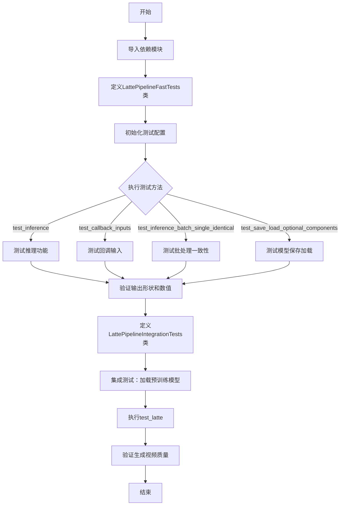

## 类结构

```
unittest.TestCase
└── LattePipelineFastTests (继承 PipelineTesterMixin, PyramidAttentionBroadcastTesterMixin, FasterCacheTesterMixin)
    ├── get_dummy_components()
    ├── get_dummy_inputs()
    ├── test_inference()
    ├── test_callback_inputs()
    ├── test_inference_batch_single_identical()
    ├── test_attention_slicing_forward_pass()
    ├── test_xformers_attention_forwardGenerator_pass()
    ├── test_encode_prompt_works_in_isolation()
    └── test_save_load_optional_components()
└── LattePipelineIntegrationTests (继承 unittest.TestCase)
    ├── setUp()
    ├── tearDown()
    └── test_latte()
```

## 全局变量及字段


### `enable_full_determinism`
    
Enable full determinism for reproducible test results by setting random seed flags

类型：`function`
    


### `LattePipelineFastTests.pipeline_class`
    
The LattePipeline class being tested, a text-to-video generation pipeline

类型：`LattePipeline`
    


### `LattePipelineFastTests.params`
    
Set of parameters for text-to-image generation, excluding cross_attention_kwargs

类型：`TEXT_TO_IMAGE_PARAMS - {cross_attention_kwargs}`
    


### `LattePipelineFastTests.batch_params`
    
Parameters for batch text-to-image generation testing

类型：`TEXT_TO_IMAGE_BATCH_PARAMS`
    


### `LattePipelineFastTests.image_params`
    
Parameters for image output validation in text-to-image tests

类型：`TEXT_TO_IMAGE_IMAGE_PARAMS`
    


### `LattePipelineFastTests.image_latents_params`
    
Parameters for image latents validation in text-to-image tests

类型：`TEXT_TO_IMAGE_IMAGE_PARAMS`
    


### `LattePipelineFastTests.required_optional_params`
    
Dictionary of required optional parameters inherited from PipelineTesterMixin

类型：`PipelineTesterMixin.required_optional_params`
    


### `LattePipelineFastTests.test_layerwise_casting`
    
Flag indicating whether to test layerwise dtype casting during inference

类型：`bool`
    


### `LattePipelineFastTests.test_group_offloading`
    
Flag indicating whether to test model offloading across device groups

类型：`bool`
    


### `LattePipelineFastTests.pab_config`
    
Configuration for pyramid attention broadcast, controlling spatial/temporal attention block skipping

类型：`PyramidAttentionBroadcastConfig`
    


### `LattePipelineFastTests.faster_cache_config`
    
Configuration for faster caching, enabling efficient attention computation with skip ranges

类型：`FasterCacheConfig`
    


### `LattePipelineIntegrationTests.prompt`
    
Text prompt describing the video content to generate: 'A painting of a squirrel eating a burger.'

类型：`str`
    
    

## 全局函数及方法


### `LattePipelineFastTests.get_dummy_components`

该方法用于创建用于测试的虚拟（dummy）组件，包括Transformer模型、VAE、调度器、文本编码器和分词器，并返回一个包含所有组件的字典。

参数：

- `num_layers`：`int`，可选参数（默认值为1），指定Transformer模型的层数

返回值：`dict`，返回一个字典，包含以下键值对：
- `transformer`：`LatteTransformer3DModel`，3D变换器模型实例
- `vae`：`AutoencoderKL`，变分自编码器模型实例
- `scheduler`：`DDIMScheduler`，DDIM调度器实例
- `text_encoder`：`T5EncoderModel`，T5文本编码器模型实例
- `tokenizer`：`AutoTokenizer`，T5分词器实例

#### 流程图

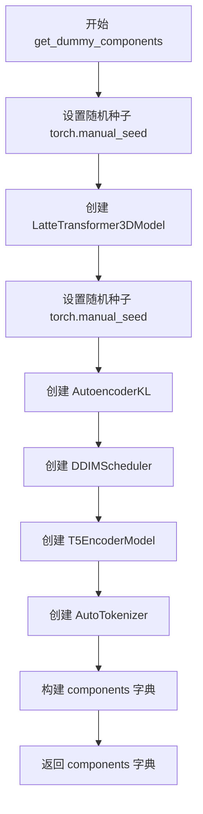

#### 带注释源码

```python
def get_dummy_components(self, num_layers: int = 1):
    """
    创建用于测试的虚拟组件
    
    参数:
        num_layers: Transformer模型的层数，默认为1
    
    返回:
        包含所有Pipeline组件的字典
    """
    # 设置随机种子以确保结果可复现
    torch.manual_seed(0)
    
    # 创建LatteTransformer3DModel实例 - 3D变换器模型
    transformer = LatteTransformer3DModel(
        sample_size=8,              # 样本大小
        num_layers=num_layers,      # 层数
        patch_size=2,               # patch大小
        attention_head_dim=8,       # 注意力头维度
        num_attention_heads=3,      # 注意力头数量
        caption_channels=32,        #  caption通道数
        in_channels=4,              # 输入通道数
        cross_attention_dim=24,    # 交叉注意力维度
        out_channels=8,             # 输出通道数
        attention_bias=True,        # 是否使用注意力偏置
        activation_fn="gelu-approximate",  # 激活函数
        num_embeds_ada_norm=1000,   # AdaNorm嵌入数
        norm_type="ada_norm_single",      # 归一化类型
        norm_elementwise_affine=False,   # 元素级仿射
        norm_eps=1e-6,              # 归一化epsilon
    )
    
    # 再次设置随机种子以确保VAE的可复现性
    torch.manual_seed(0)
    
    # 创建AutoencoderKL实例 - VAE模型
    vae = AutoencoderKL()
    
    # 创建DDIMScheduler实例 - 调度器
    scheduler = DDIMScheduler()
    
    # 加载预训练的T5文本编码器
    text_encoder = T5EncoderModel.from_pretrained("hf-internal-testing/tiny-random-t5")
    
    # 加载T5分词器
    tokenizer = AutoTokenizer.from_pretrained("hf-internal-testing/tiny-random-t5")
    
    # 将所有组件封装到字典中
    components = {
        "transformer": transformer.eval(),   # 设置为评估模式
        "vae": vae.eval(),                    # 设置为评估模式
        "scheduler": scheduler,
        "text_encoder": text_encoder.eval(),  # 设置为评估模式
        "tokenizer": tokenizer,
    }
    
    # 返回组件字典
    return components
```


### `LattePipelineFastTests.get_dummy_inputs`

该方法为 Latte 视频生成管道测试提供虚拟输入参数，根据设备类型（MPS 或其他）创建随机数生成器，并返回包含提示词、负提示词、生成器、推理步数、引导 scale、图像尺寸、视频长度、输出类型和标题清理标志等完整测试参数的字典。

参数：

- `self`：类实例方法隐含的 `LattePipelineFastTests` 类实例
- `device`：`str` 或 `torch.device`，运行设备，用于创建对应设备的随机生成器
- `seed`：`int`，随机种子，默认值为 0，用于控制生成器的随机性

返回值：`Dict[str, Any]`，返回包含管道推理所需全部输入参数的字典

#### 流程图

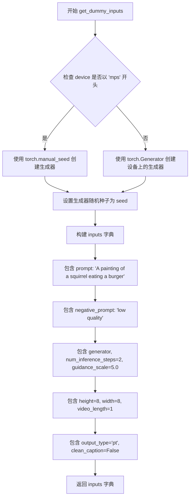

#### 带注释源码

```python
def get_dummy_inputs(self, device, seed=0):
    """
    生成用于测试 LattePipeline 的虚拟输入参数。

    参数:
        device: 运行设备，用于创建对应设备的随机生成器
        seed: 随机种子，用于控制生成结果的可重复性

    返回:
        包含管道推理所需全部输入参数的字典
    """
    # 判断是否为 Apple MPS 设备，MPS 不支持 torch.Generator
    if str(device).startswith("mps"):
        # MPS 设备使用 torch.manual_seed 直接设置种子
        generator = torch.manual_seed(seed)
    else:
        # 其他设备（如 CPU、CUDA）使用 torch.Generator 创建随机生成器
        generator = torch.Generator(device=device).manual_seed(seed)
    
    # 构建完整的测试输入参数字典
    inputs = {
        "prompt": "A painting of a squirrel eating a burger",  # 正向提示词
        "negative_prompt": "low quality",                        # 负向提示词
        "generator": generator,                                  # 随机生成器
        "num_inference_steps": 2,                                # 推理步数
        "guidance_scale": 5.0,                                   # 引导强度
        "height": 8,                                             # 生成视频高度
        "width": 8,                                              # 生成视频宽度
        "video_length": 1,                                       # 视频帧数
        "output_type": "pt",                                     # 输出类型（PyTorch张量）
        "clean_caption": False,                                  # 是否清理标题
    }
    return inputs
```


### `LattePipelineFastTests.test_inference`

该方法是LattePipeline的单元测试方法，用于验证视频生成管道的基本推理功能。测试通过创建虚拟组件和输入，执行推理过程，并验证生成的视频形状是否符合预期（1, 3, 8, 8），同时检查输出值在合理范围内。

参数：

- `self`：隐式参数，`LattePipelineFastTests`类的实例本身

返回值：无明确的返回值（`None`），通过`unittest.TestCase`的`assert`方法进行验证

#### 流程图

```mermaid
flowchart TD
    A[开始 test_inference 测试] --> B[设置设备为 CPU]
    B --> C[调用 get_dummy_components 获取虚拟组件]
    C --> D[使用虚拟组件实例化 LattePipeline]
    D --> E[将 pipeline 移动到指定设备]
    E --> F[配置进度条显示]
    F --> G[调用 get_dummy_inputs 获取测试输入]
    G --> H[执行 pipeline 推理生成视频]
    H --> I[从结果中提取生成的视频 frames]
    I --> J{验证视频形状}
    J -->|形状为 (1, 3, 8, 8)| K[生成随机期望视频]
    J -->|形状不匹配| L[测试失败]
    K --> M[计算生成视频与期望视频的最大差异]
    M --> N{差异 <= 1e10}
    N -->|是| O[测试通过]
    N -->|否| P[测试失败]
    O --> Q[结束测试]
```

#### 带注释源码

```python
def test_inference(self):
    """测试 LattePipeline 的基本推理功能"""
    # 1. 设置测试设备为 CPU
    device = "cpu"

    # 2. 获取虚拟组件（transformer, vae, scheduler, text_encoder, tokenizer）
    components = self.get_dummy_components()
    
    # 3. 使用组件实例化 LattePipeline（管道类）
    pipe = self.pipeline_class(**components)
    
    # 4. 将管道移动到指定设备（CPU）
    pipe.to(device)
    
    # 5. 配置进度条（disable=None 表示不禁用进度条）
    pipe.set_progress_bar_config(disable=None)

    # 6. 获取虚拟输入（包含 prompt, negative_prompt, generator 等）
    inputs = self.get_dummy_inputs(device)
    
    # 7. 执行推理：调用 pipeline 的 __call__ 方法生成视频
    # 返回值包含 frames 属性，存储生成的视频帧
    video = pipe(**inputs).frames
    
    # 8. 从结果中提取第一个（也是唯一的）视频
    generated_video = video[0]

    # 9. 断言验证：生成视频的形状必须为 (1, 3, 8, 8)
    # 1=视频数量, 3=通道数(RGB), 8=高度, 8=宽度
    self.assertEqual(generated_video.shape, (1, 3, 8, 8))
    
    # 10. 创建随机期望视频用于比较（固定种子确保可重复性）
    expected_video = torch.randn(1, 3, 8, 8)
    
    # 11. 计算生成视频与期望视频之间的最大绝对差异
    max_diff = np.abs(generated_video - expected_video).max()
    
    # 12. 断言验证：最大差异应小于等于 1e10（宽松的阈值）
    # 这个测试主要验证输出是有效的数值，而非精确匹配
    self.assertLessEqual(max_diff, 1e10)
```


### `LattePipelineFastTests.test_callback_inputs`

该测试方法用于验证 LattePipeline 的回调机制是否正确实现，特别是检查 `callback_on_step_end` 和 `callback_on_step_end_tensor_inputs` 参数的功能，包括回调函数能否正确接收和修改张量输入。

参数：

- `self`：`LattePipelineFastTests`，测试类实例，包含测试所需的配置和辅助方法

返回值：`None`，测试函数不返回任何值，仅通过断言验证行为

#### 流程图

```mermaid
flowchart TD
    A[开始测试 test_callback_inputs] --> B[获取 pipeline_class.__call__ 签名]
    B --> C{检查是否存在 callback_on_step_end_tensor_inputs 和 callback_on_step_end}
    C -->|否| D[直接返回，结束测试]
    C -->|是| E[创建 pipeline 实例并移动到 torch_device]
    E --> F[断言验证 _callback_tensor_inputs 属性存在]
    F --> G[定义回调函数: callback_inputs_subset]
    G --> H[定义回调函数: callback_inputs_all]
    H --> I[定义回调函数: callback_inputs_change_tensor]
    I --> J[获取测试输入]
    J --> K[测试1: 使用 subset 回调和 ['latents']]
    K --> L[执行 pipeline]
    L --> M[测试2: 使用 all 回调和全部 tensor_inputs]
    M --> N[执行 pipeline]
    N --> O[测试3: 使用 change_tensor 回调修改 latents]
    O --> P[执行 pipeline 并验证输出]
    P --> Q[结束测试]
```

#### 带注释源码

```python
def test_callback_inputs(self):
    """
    测试 callback_on_step_end 和 callback_on_step_end_tensor_inputs 参数的功能
    
    该测试验证:
    1. pipeline 是否支持回调机制
    2. 回调函数能否正确接收允许的张量输入
    3. 回调函数能否修改张量并影响输出
    """
    # 获取 pipeline __call__ 方法的签名
    sig = inspect.signature(self.pipeline_class.__call__)
    
    # 检查签名中是否包含回调相关参数
    has_callback_tensor_inputs = "callback_on_step_end_tensor_inputs" in sig.parameters
    has_callback_step_end = "callback_on_step_end" in sig.parameters

    # 如果 pipeline 不支持回调机制，则跳过测试
    if not (has_callback_tensor_inputs and has_callback_step_end):
        return

    # 获取测试组件并创建 pipeline 实例
    components = self.get_dummy_components()
    pipe = self.pipeline_class(**components)
    pipe = pipe.to(torch_device)
    pipe.set_progress_bar_config(disable=None)
    
    # 验证 pipeline 包含 _callback_tensor_inputs 属性
    # 该属性定义了回调函数可以访问的张量列表
    self.assertTrue(
        hasattr(pipe, "_callback_tensor_inputs"),
        f" {self.pipeline_class} should have `_callback_tensor_inputs` that defines a list of tensor variables its callback function can use as inputs",
    )

    # 定义回调函数1: 仅接收允许张量的子集
    def callback_inputs_subset(pipe, i, t, callback_kwargs):
        """
        测试只传递部分允许的张量输入
        
        参数:
            pipe: pipeline 实例
            i: 当前步骤索引
            t: 当前时间步
            callback_kwargs: 回调接收的张量字典
        """
        # 遍历回调参数，验证所有张量都在允许列表中
        for tensor_name, tensor_value in callback_kwargs.items():
            # 检查只传递了允许的张量输入
            assert tensor_name in pipe._callback_tensor_inputs

        return callback_kwargs

    # 定义回调函数2: 接收所有允许的张量输入
    def callback_inputs_all(pipe, i, t, callback_kwargs):
        """
        测试传递所有允许的张量输入
        
        验证:
        1. 所有允许的张量都被传递
        2. 没有传递未授权的张量
        """
        # 检查所有允许的张量都在回调参数中
        for tensor_name in pipe._callback_tensor_inputs:
            assert tensor_name in callback_kwargs

        # 遍历回调参数，验证没有额外未授权的张量
        for tensor_name, tensor_value in callback_kwargs.items():
            assert tensor_name in pipe._callback_tensor_inputs

        return callback_kwargs

    # 获取测试输入
    inputs = self.get_dummy_inputs(torch_device)

    # 测试场景1: 传递部分张量 (只有 latents)
    inputs["callback_on_step_end"] = callback_inputs_subset
    inputs["callback_on_step_end_tensor_inputs"] = ["latents"]
    output = pipe(**inputs)[0]

    # 测试场景2: 传递所有允许的张量
    inputs["callback_on_step_end"] = callback_inputs_all
    inputs["callback_on_step_end_tensor_inputs"] = pipe._callback_tensor_inputs
    output = pipe(**inputs)[0]

    # 定义回调函数3: 在最后一步修改张量值
    def callback_inputs_change_tensor(pipe, i, t, callback_kwargs):
        """
        在推理最后一步将 latents 修改为零张量
        
        验证回调函数可以修改张量并影响最终输出
        """
        is_last = i == (pipe.num_timesteps - 1)
        if is_last:
            # 将 latents 修改为零张量
            callback_kwargs["latents"] = torch.zeros_like(callback_kwargs["latents"])
        return callback_kwargs

    # 测试场景3: 通过回调修改张量
    inputs["callback_on_step_end"] = callback_inputs_change_tensor
    inputs["callback_on_step_end_tensor_inputs"] = pipe._callback_tensor_inputs
    output = pipe(**inputs)[0]
    
    # 验证修改后的输出仍然有效（数值在合理范围内）
    assert output.abs().sum() < 1e10
```


### `LattePipelineFastTests.test_inference_batch_single_identical`

该方法是LattePipelineFastTests类中的测试方法，用于验证批量推理时单个样本的一致性。它通过调用父类混合器（PipelineTesterMixin）中的`_test_inference_batch_single_identical`方法，传入batch_size=3和expected_max_diff=1e-3参数来执行测试，确保批量推理时每个单独样本的结果差异在预期范围内。

参数：
- `self`：实例方法隐含参数，表示类实例本身，无显式类型描述

返回值：`None`，该方法为测试方法，不返回任何值

#### 流程图

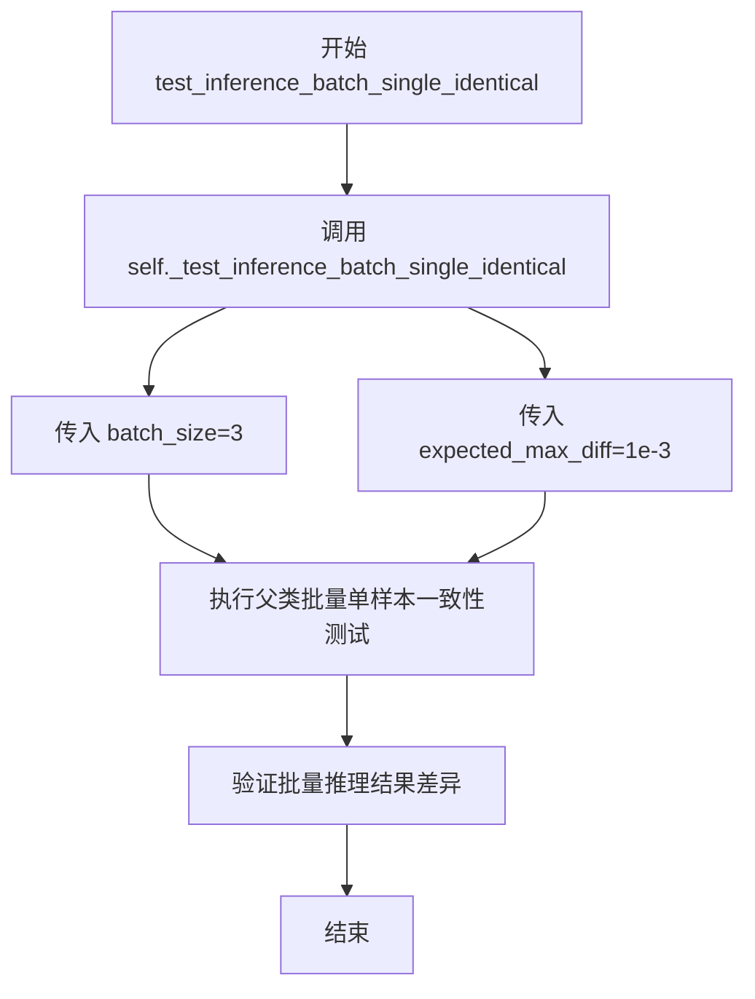

#### 带注释源码

```
def test_inference_batch_single_identical(self):
    """
    测试批量推理时单个样本的一致性。
    
    该测试方法继承自 PipelineTesterMixin，通过调用父类的
    _test_inference_batch_single_identical 方法来验证：
    1. 批量推理时，每个单独样本的结果应该一致
    2. 批量推理的结果应该与单独推理的结果一致
    
    测试参数：
    - batch_size=3: 使用3个样本进行批量推理测试
    - expected_max_diff=1e-3: 期望最大差异为0.001
    
    注意：
    - 该方法的具体实现逻辑在 PipelineTesterMixin 父类中
    - 该测试是 LattePipelineFastTests 类的功能验证测试之一
    """
    self._test_inference_batch_single_identical(batch_size=3, expected_max_diff=1e-3)
```


### `LattePipelineFastTests.test_attention_slicing_forward_pass`

该测试方法用于验证 LattePipeline 在启用 attention slicing 优化时的前向传播是否正确，但由于该功能当前不被支持，因此被跳过执行。

参数：

- `self`：`LattePipelineFastTests`，测试类的实例，包含测试所需的组件和配置

返回值：`None`，测试方法不返回任何值

#### 流程图

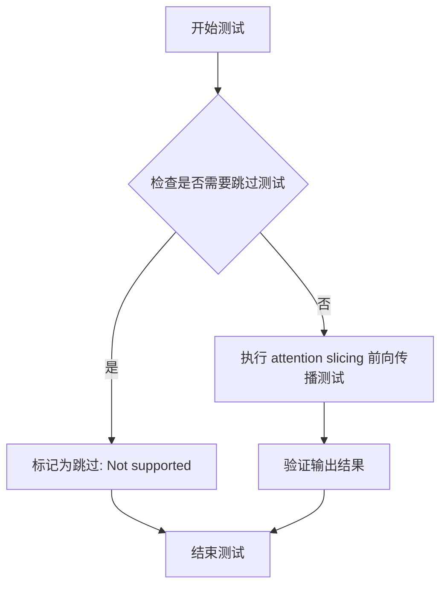

#### 带注释源码

```python
@unittest.skip("Not supported.")
def test_attention_slicing_forward_pass(self):
    """
    测试 LattePipeline 在 attention slicing 模式下的前向传播。
    
    Attention slicing 是一种内存优化技术，通过将大型注意力矩阵
    分割成较小的块来减少显存占用。该测试旨在验证启用该优化后
    管道仍能产生正确的结果。
    
    注意：当前版本的 LattePipeline 不支持此功能，因此该测试
    被标记为跳过。
    """
    pass
```


### `LattePipelineFastTests.test_xformers_attention_forwardGenerator_pass`

该测试方法用于验证 LattePipeline 在启用 xformers 加速注意力机制时的前向传播是否正确工作。它是一个条件测试，仅在 CUDA 设备且 xformers 库可用时执行，调用父类的 `_test_xformers_attention_forwardGenerator_pass` 方法进行实际的注意力机制测试。

参数：

- `self`：`LattePipelineFastTests`，隐含的测试类实例，表示当前测试对象

返回值：`None`，无返回值（该方法为测试用例，执行验证后不返回结果）

#### 流程图

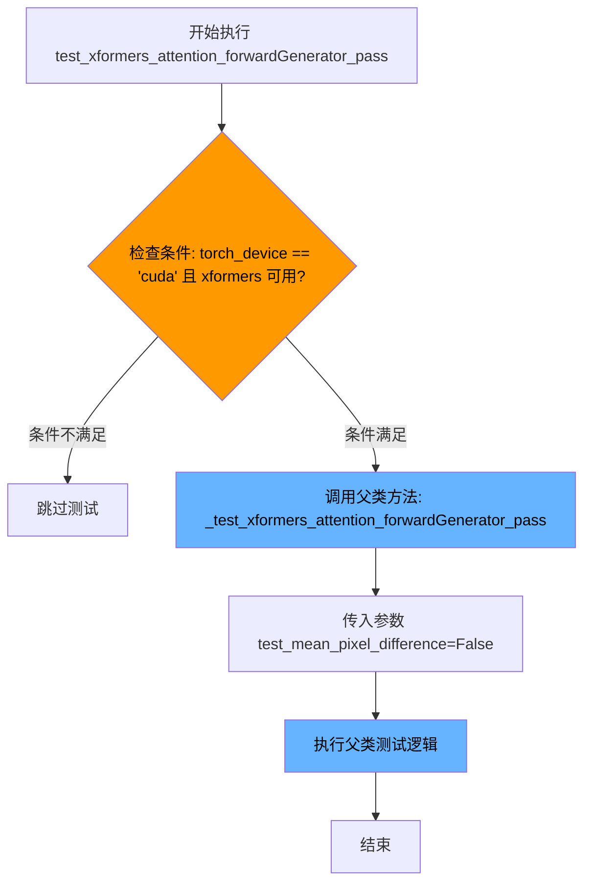

#### 带注释源码

```python
@unittest.skipIf(
    torch_device != "cuda" or not is_xformers_available(),
    reason="XFormers attention is only available with CUDA and `xformers` installed",
)
def test_xformers_attention_forwardGenerator_pass(self):
    """
    测试方法：验证 xformers 注意力机制的前向传播是否正确
    
    该测试方法仅在以下条件满足时执行：
    1. 当前设备为 CUDA
    2. xformers 库已安装可用
    
    测试逻辑通过调用父类的 _test_xformers_attention_forwardGenerator_pass 方法实现，
    传入 test_mean_pixel_difference=False 表示不检查像素差异的均值，
    这意味着测试更关注注意力计算的正确性而非输出的数值精度。
    """
    # 调用父类（LattePipelineFastTests 的父类，可能为 PipelineTesterMixin）的测试方法
    # 传入 False 表示禁用平均像素差异检查
    super()._test_xformers_attention_forwardGenerator_pass(test_mean_pixel_difference=False)
```


### `LattePipelineFastTests.test_encode_prompt_works_in_isolation`

这是一个单元测试方法，用于验证 `encode_prompt` 函数能够独立（隔离）工作。该测试已被标记为跳过（Skip），原因是 `encode_prompt()` 方法返回多个值（多个输出），当前测试框架不支持此类场景。

参数：

- `self`：`LattePipelineFastTests`（隐式），对测试类实例的引用

返回值：`None`，该方法不返回任何值（方法体为 `pass`）

#### 流程图

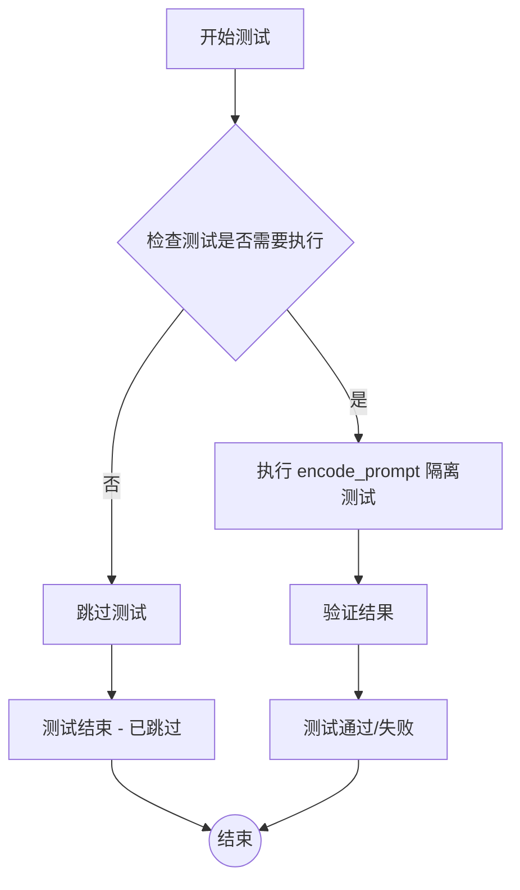

> **注意**：该测试方法体仅为 `pass` 语句，实际上没有任何测试逻辑执行，仅是一个占位符测试方法。

#### 带注释源码

```python
@unittest.skip("Test not supported because `encode_prompt()` has multiple returns.")
def test_encode_prompt_works_in_isolation(self):
    """
    测试 encode_prompt 方法能否独立工作。
    
    该测试方法用于验证 encode_prompt 函数可以在不依赖完整 pipeline 的情况下
    正确处理 prompt 编码。然而，由于 encode_prompt() 方法返回多个值
    （如 prompt_embeds, negative_prompt_embeds 等），当前的测试框架不支持
    这种多返回值的测试场景，因此该测试被跳过。
    
    参数:
        self: LattePipelineFastTests 实例引用
        
    返回值:
        None
        
    注意:
        - 该测试被 @unittest.skip 装饰器标记为跳过
        - 跳过原因: encode_prompt() 返回多个值，不被当前测试支持
    """
    pass  # 空方法体，测试被跳过
```


### `LattePipelineFastTests.test_save_load_optional_components`

该测试方法验证了 LattePipeline 管道在保存和加载时正确处理可选组件（optional_components）的功能。测试流程包括：创建管道实例并将所有可选组件设置为 None，保存管道到临时目录，重新加载管道，然后验证可选组件在加载后仍保持为 None 状态，并确保输出结果在保存前后保持一致性。

参数：

- `self`：`unittest.TestCase`，代表测试类实例本身

返回值：`None`，该方法为单元测试方法，通过断言验证功能，不返回任何值

#### 流程图

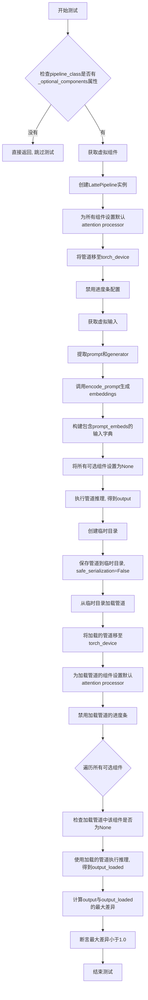

#### 带注释源码

```python
def test_save_load_optional_components(self):
    """
    测试保存和加载可选组件的功能。
    验证当可选组件被设置为None后，保存并重新加载管道时，
    这些组件是否仍保持为None状态，且推理结果保持一致。
    """
    # 检查管道类是否定义了可选组件属性，若无则直接返回
    if not hasattr(self.pipeline_class, "_optional_components"):
        return

    # 获取虚拟组件配置
    components = self.get_dummy_components()
    # 使用虚拟组件创建LattePipeline实例
    pipe = self.pipeline_class(**components)

    # 遍历所有组件，为有set_default_attn_processor方法的组件设置默认attention processor
    for component in pipe.components.values():
        if hasattr(component, "set_default_attn_processor"):
            component.set_default_attn_processor()
    # 将管道移至指定的torch设备
    pipe.to(torch_device)
    # 设置进度条配置，disable=None表示不禁用进度条
    pipe.set_progress_bar_config(disable=None)

    # 获取虚拟输入
    inputs = self.get_dummy_inputs(torch_device)

    # 从输入中提取prompt和generator
    prompt = inputs["prompt"]
    generator = inputs["generator"]

    # 使用管道编码prompt，得到prompt_embeds和negative_prompt_embeds
    (
        prompt_embeds,
        negative_prompt_embeds,
    ) = pipe.encode_prompt(prompt)

    # 构建包含已转换prompt embeddings的输入字典
    inputs = {
        "prompt_embeds": prompt_embeds,
        "negative_prompt": None,
        "negative_prompt_embeds": negative_prompt_embeds,
        "generator": generator,
        "num_inference_steps": 2,
        "guidance_scale": 5.0,
        "height": 8,
        "width": 8,
        "video_length": 1,
        "mask_feature": False,
        "output_type": "pt",
        "clean_caption": False,
    }

    # 将所有可选组件设置为None
    for optional_component in pipe._optional_components:
        setattr(pipe, optional_component, None)

    # 使用设置好参数的输入执行管道推理，得到输出
    output = pipe(**inputs)[0]

    # 创建临时目录用于保存和加载管道
    with tempfile.TemporaryDirectory() as tmpdir:
        # 保存管道到临时目录，safe_serialization=False表示不使用安全序列化
        pipe.save_pretrained(tmpdir, safe_serialization=False)
        # 从临时目录加载管道
        pipe_loaded = self.pipeline_class.from_pretrained(tmpdir)
        # 将加载的管道移至torch设备
        pipe_loaded.to(torch_device)

        # 为加载管道的组件设置默认attention processor
        for component in pipe_loaded.components.values():
            if hasattr(component, "set_default_attn_processor"):
                component.set_default_attn_processor()

        # 设置加载管道的进度条配置
        pipe_loaded.set_progress_bar_config(disable=None)

    # 验证所有可选组件在加载后仍保持为None
    for optional_component in pipe._optional_components:
        self.assertTrue(
            getattr(pipe_loaded, optional_component) is None,
            f"`{optional_component}` did not stay set to None after loading.",
        )

    # 使用加载的管道执行推理，得到输出
    output_loaded = pipe_loaded(**inputs)[0]

    # 计算原始输出和加载后输出的最大差异
    max_diff = np.abs(to_np(output) - to_np(output_loaded)).max()
    # 断言最大差异小于1.0，确保保存/加载过程没有引入显著差异
    self.assertLess(max_diff, 1.0)
```


### `LattePipelineIntegrationTests.setUp`

该方法是 `LattePipelineIntegrationTests` 测试类的初始化方法，在每个测试方法执行前被调用，用于清理垃圾回收和后端缓存，确保测试环境的干净状态。

参数：

- `self`：测试类的实例对象（隐式参数），代表当前的 `LattePipelineIntegrationTests` 测试实例

返回值：`None`，该方法不返回任何值，仅执行清理操作

#### 流程图

```mermaid
flowchart TD
    A[开始 setUp] --> B[调用父类 super().setUp]
    B --> C[执行 gc.collect 垃圾回收]
    C --> D[调用 backend_empty_cache 清理后端缓存]
    D --> E[结束 setUp]
```

#### 带注释源码

```python
def setUp(self):
    """
    测试方法执行前的初始化设置
    """
    # 调用父类 unittest.TestCase 的 setUp 方法
    # 确保父类的初始化逻辑被执行
    super().setUp()
    
    # 手动触发 Python 垃圾回收
    # 清理不再使用的对象，释放内存
    gc.collect()
    
    # 清理深度学习框架（PyTorch）的缓存
    # 确保 GPU 内存被释放，避免测试间的相互影响
    # torch_device 是从 testing_utils 导入的全局变量
    backend_empty_cache(torch_device)
```


### `LattePipelineIntegrationTests.tearDown`

该方法是 `LattePipelineIntegrationTests` 测试类的清理方法，在每个测试方法执行完毕后自动调用，用于释放测试过程中占用的资源，包括调用垃圾回收和清空GPU缓存。

参数：

- `self`：`LattePipelineIntegrationTests`，测试类实例本身，隐含参数

返回值：`None`，无返回值

#### 流程图

```mermaid
flowchart TD
    A[tearDown 开始] --> B[调用 super().tearDown]
    B --> C[执行 gc.collect]
    C --> D[调用 backend_empty_cache]
    D --> E[tearDown 结束]
```

#### 带注释源码

```python
def tearDown(self):
    """
    测试方法执行完毕后的清理操作
    
    该方法在每个测试用例运行结束后被调用，
    用于清理测试过程中产生的资源占用。
    """
    # 调用父类的 tearDown 方法，确保父类资源也被正确清理
    super().tearDown()
    
    # 主动触发 Python 垃圾回收，释放不再使用的对象内存
    gc.collect()
    
    # 清空 GPU 缓存，释放 CUDA 显存
    # torch_device 是测试工具函数提供的设备标识
    backend_empty_cache(torch_device)
```


### `LattePipelineIntegrationTests.test_latte`

这是一个集成测试方法，用于验证 LattePipeline 从预训练模型生成视频的功能是否正常。测试通过比较生成视频与随机噪声的余弦相似度距离来确保模型输出的有效性。

参数：

- 无显式参数（除了 `self` 隐式参数）

返回值：`None`，该方法为测试函数，通过断言验证结果而非返回值

#### 流程图

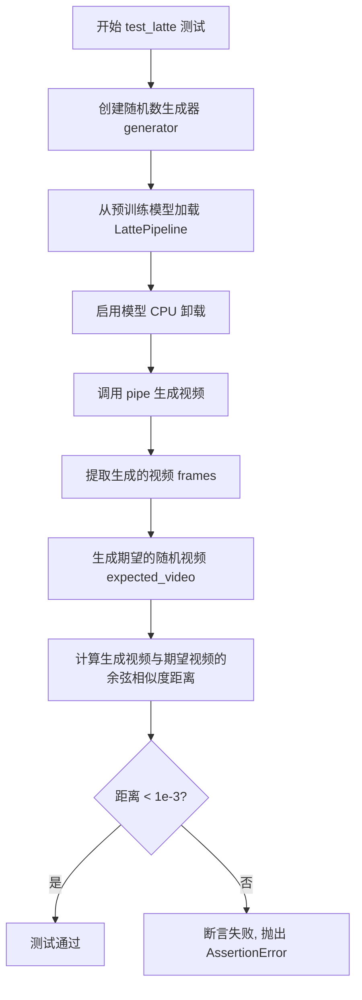

#### 带注释源码

```python
def test_latte(self):
    """
    集成测试：验证 LattePipeline 从预训练模型生成视频的功能
    
    测试流程：
    1. 创建随机数生成器用于生成确定性输出
    2. 加载预训练的 Latte-1 模型
    3. 启用模型 CPU 卸载以优化内存使用
    4. 使用管道生成视频
    5. 验证生成视频的质量（通过余弦相似度）
    """
    # 创建 CPU 上的随机数生成器，seed=0 确保可复现性
    generator = torch.Generator("cpu").manual_seed(0)

    # 从预训练模型加载 LattePipeline，使用 float16 精度以提高性能
    pipe = LattePipeline.from_pretrained("maxin-cn/Latte-1", torch_dtype=torch.float16)
    
    # 启用模型 CPU 卸载：当模型不在 GPU 上时自动在 CPU 和 GPU 之间移动
    pipe.enable_model_cpu_offload(device=torch_device)
    
    # 使用类属性定义的提示词
    prompt = self.prompt

    # 调用管道生成视频
    # 参数说明：
    # - prompt: 文本提示词
    # - height/width: 生成视频的分辨率 (512x512)
    # - generator: 随机数生成器确保确定性
    # - num_inference_steps: 推理步数 (2步)
    # - clean_caption: 是否清理提示词
    videos = pipe(
        prompt=prompt,
        height=512,
        width=512,
        generator=generator,
        num_inference_steps=2,
        clean_caption=False,
    ).frames

    # 提取第一个（通常也是唯一的）生成的视频
    video = videos[0]
    
    # 创建期望的随机视频用于比较 (1, 512, 512, 3)
    expected_video = torch.randn(1, 512, 512, 3).numpy()

    # 计算生成视频与期望视频的余弦相似度距离
    max_diff = numpy_cosine_similarity_distance(video.flatten(), expected_video)
    
    # 断言：余弦相似度距离应小于 1e-3
    # 注意：此测试实际验证的是生成视频与随机噪声的差异
    # 真实的集成测试应该与预计算的期望输出比较
    assert max_diff < 1e-3, f"Max diff is too high. got {video.flatten()}"
```


### `LattePipelineFastTests.get_dummy_components`

该方法用于生成用于单元测试的虚拟（dummy）组件，包括LatteTransformer3DModel、AutoencoderKL、DDIMScheduler、T5EncoderModel和AutoTokenizer，这些组件通过固定随机种子确保测试的可重复性。

参数：

- `num_layers`：`int`，可选参数，默认为1，表示Transformer模型层数

返回值：`dict`，返回包含transformer、vae、scheduler、text_encoder和tokenizer五个组件的字典

#### 流程图

```mermaid
flowchart TD
    A[开始] --> B[设置随机种子 torch.manual_seed(0)]
    B --> C[创建 LatteTransformer3DModel]
    C --> D[设置随机种子 torch.manual_seed(0)]
    D --> E[创建 AutoencoderKL]
    E --> F[创建 DDIMScheduler]
    F --> G[创建 T5EncoderModel]
    G --> H[创建 AutoTokenizer]
    H --> I[构建 components 字典]
    I --> J[返回 components]
    
    C -.-> |使用num_layers参数| C
```

#### 带注释源码

```python
def get_dummy_components(self, num_layers: int = 1):
    """
    生成用于测试的虚拟组件
    
    参数:
        num_layers: Transformer模型的层数，默认为1
    
    返回:
        dict: 包含以下键的字典:
            - transformer: LatteTransformer3DModel实例
            - vae: AutoencoderKL实例
            - scheduler: DDIMScheduler实例
            - text_encoder: T5EncoderModel实例
            - tokenizer: AutoTokenizer实例
    """
    # 设置随机种子以确保Transformer初始化可重复
    torch.manual_seed(0)
    transformer = LatteTransformer3DModel(
        sample_size=8,              # 样本尺寸
        num_layers=num_layers,      # Transformer层数（可配置）
        patch_size=2,               # 补丁大小
        attention_head_dim=8,       # 注意力头维度
        num_attention_heads=3,      # 注意力头数量
        caption_channels=32,        # 字幕通道数
        in_channels=4,              # 输入通道数
        cross_attention_dim=24,     # 交叉注意力维度
        out_channels=8,             # 输出通道数
        attention_bias=True,        # 是否使用注意力偏置
        activation_fn="gelu-approximate",  # 激活函数
        num_embeds_ada_norm=1000,   # AdaNorm嵌入数
        norm_type="ada_norm_single", # 归一化类型
        norm_elementwise_affine=False,  # 逐元素仿射
        norm_eps=1e-6,              # 归一化epsilon
    )
    
    # 重新设置随机种子以确保VAE初始化可重复
    torch.manual_seed(0)
    vae = AutoencoderKL()           # 实例化变分自编码器
    
    scheduler = DDIMScheduler()    # 创建DDIM调度器
    
    # 从预训练模型加载文本编码器
    text_encoder = T5EncoderModel.from_pretrained("hf-internal-testing/tiny-random-t5")
    
    # 从预训练模型加载分词器
    tokenizer = AutoTokenizer.from_pretrained("hf-internal-testing/tiny-random-t5")
    
    # 组装所有组件到字典中
    components = {
        "transformer": transformer.eval(),    # 设置为评估模式
        "vae": vae.eval(),                    # 设置为评估模式
        "scheduler": scheduler,
        "text_encoder": text_encoder.eval(),  # 设置为评估模式
        "tokenizer": tokenizer,
    }
    return components
```


### `LattePipelineFastTests.get_dummy_inputs`

该方法用于生成用于测试 `LattePipeline` 的虚拟输入参数，根据设备类型创建随机数生成器，并返回包含文本提示、负向提示、生成器、推理步数、引导 scale、图像尺寸、视频长度、输出类型和是否清理标题等完整测试输入的字典。

参数：

- `device`：设备类型，用于创建随机数生成器，可以是 "cpu"、"cuda" 或 "mps" 等字符串
- `seed`：`int`，随机种子，默认值为 0，用于确保测试结果的可复现性

返回值：`dict`，包含以下键值对：
- `"prompt"`：正向提示词字符串
- `"negative_prompt"`：负向提示词字符串
- `"generator"`：torch.Generator 对象，用于控制随机性
- `"num_inference_steps"`：推理步数（整数）
- `"guidance_scale"`：引导 scale（浮点数）
- `"height"`：生成图像高度（整数）
- `"width"`：生成图像宽度（整数）
- `"video_length"`：视频帧数（整数）
- `"output_type"`：输出类型（字符串）
- `"clean_caption"`：是否清理标题（布尔值）

#### 流程图

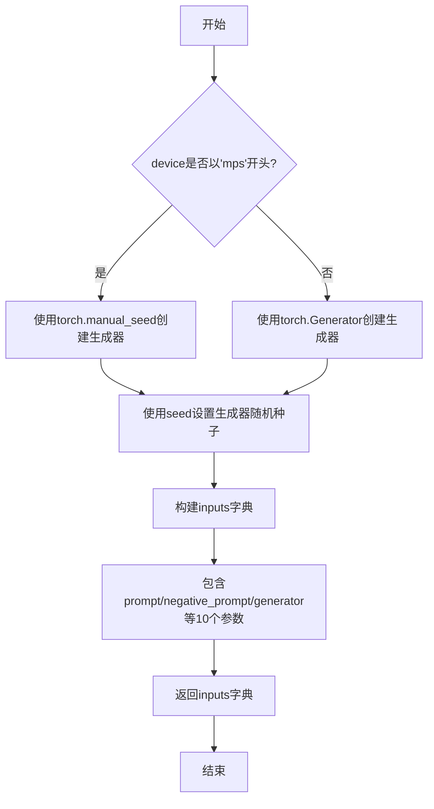

#### 带注释源码

```python
def get_dummy_inputs(self, device, seed=0):
    """
    生成用于测试管道的虚拟输入参数
    
    参数:
        device: 目标设备（'cpu', 'cuda', 'mps'等）
        seed: 随机种子，默认值为0
    
    返回:
        dict: 包含所有管道调用所需参数的字典
    """
    # 检查设备是否为MPS（Apple Silicon GPU）
    if str(device).startswith("mps"):
        # MPS设备使用简化的随机种子设置方式
        generator = torch.manual_seed(seed)
    else:
        # 其他设备（CPU/CUDA）使用完整的Generator对象
        generator = torch.Generator(device=device).manual_seed(seed)
    
    # 构建完整的测试输入参数字典
    inputs = {
        "prompt": "A painting of a squirrel eating a burger",  # 测试用正向提示词
        "negative_prompt": "low quality",                       # 测试用负向提示词
        "generator": generator,                                 # 随机数生成器
        "num_inference_steps": 2,                               # 推理步数（较少以加快测试）
        "guidance_scale": 5.0,                                  # CFG引导强度
        "height": 8,                                            # 输出高度（像素）
        "width": 8,                                             # 输出宽度（像素）
        "video_length": 1,                                      # 视频帧数
        "output_type": "pt",                                   # 输出为PyTorch张量
        "clean_caption": False,                                # 不清理标题
    }
    return inputs
```


### `LattePipelineFastTests.test_inference`

该测试方法用于验证 LattePipeline 的基本推理功能，通过创建虚拟组件和输入，执行管道推理并验证输出视频的形状和数值是否在预期范围内。

参数：
- `self`：隐式参数，测试类实例本身

返回值：`None`，该方法为测试方法，通过 `unittest.TestCase` 的断言方法进行验证，不返回任何值

#### 流程图

```mermaid
flowchart TD
    A[开始测试] --> B[设置设备为 CPU]
    B --> C[获取虚拟组件 get_dummy_components]
    C --> D[创建 LattePipeline 实例]
    D --> E[将管道移到 CPU 设备]
    E --> F[设置进度条配置]
    F --> G[获取虚拟输入 get_dummy_inputs]
    G --> H[执行管道推理 pipe.__call__]
    H --> I[获取生成的视频 frames]
    I --> J{验证视频形状}
    J -->|形状为 (1, 3, 8, 8)| K[生成期望视频 torch.randn]
    J -->|形状不匹配| L[测试失败]
    K --> M[计算最大差异 max_diff]
    M --> N{差异 <= 1e10}
    N -->|是| O[测试通过]
    N -->|否| P[测试失败]
```

#### 带注释源码

```python
def test_inference(self):
    """测试 LattePipeline 的基本推理功能"""
    
    # 步骤1: 设置测试设备为 CPU
    device = "cpu"

    # 步骤2: 获取虚拟组件（transformer, vae, scheduler, text_encoder, tokenizer）
    components = self.get_dummy_components()
    
    # 步骤3: 使用虚拟组件创建 LattePipeline 管道实例
    pipe = self.pipeline_class(**components)
    
    # 步骤4: 将管道移到指定设备（CPU）
    pipe.to(device)
    
    # 步骤5: 设置进度条配置（disable=None 表示启用进度条）
    pipe.set_progress_bar_config(disable=None)

    # 步骤6: 获取虚拟输入（包含 prompt, negative_prompt, generator 等参数）
    inputs = self.get_dummy_inputs(device)
    
    # 步骤7: 执行管道推理，**inputs 将字典解包为关键字参数
    # 返回 PipelineOutput 对象，包含 frames 属性
    video = pipe(**inputs).frames
    
    # 步骤8: 获取第一个生成的视频
    generated_video = video[0]

    # 断言1: 验证生成的视频形状为 (1, 3, 8, 8)
    # 1: 视频帧数, 3: 通道数(RGB), 8: 高度, 8: 宽度
    self.assertEqual(generated_video.shape, (1, 3, 8, 8))
    
    # 步骤9: 生成期望的随机视频用于对比
    expected_video = torch.randn(1, 3, 8, 8)
    
    # 步骤10: 计算生成视频与期望视频的最大绝对差异
    max_diff = np.abs(generated_video - expected_video).max()
    
    # 断言2: 验证最大差异在允许范围内（1e10）
    # 注意: 此处阈值设置较大(1e10)，实际用于确保数值稳定性而非精确匹配
    self.assertLessEqual(max_diff, 1e10)
```


### `LattePipelineFastTests.test_callback_inputs`

该测试方法用于验证 LattePipeline 的回调功能是否正常工作，包括检查回调张量输入的正确性、回调函数的调用时机以及回调函数对生成结果的影响。

参数：

- `self`：`unittest.TestCase`，隐式参数，测试类实例本身

返回值：`None`，无返回值（测试方法）

#### 流程图

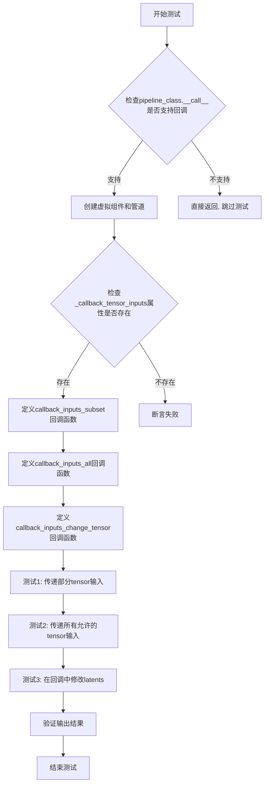

#### 带注释源码

```python
def test_callback_inputs(self):
    """测试LattePipeline的回调功能是否正常工作"""
    # 获取pipeline的__call__方法签名
    sig = inspect.signature(self.pipeline_class.__call__)
    
    # 检查是否支持callback_on_step_end_tensor_inputs参数
    has_callback_tensor_inputs = "callback_on_step_end_tensor_inputs" in sig.parameters
    # 检查是否支持callback_on_step_end参数
    has_callback_step_end = "callback_on_step_end" in sig.parameters

    # 如果Pipeline不支持回调功能，则跳过测试
    if not (has_callback_tensor_inputs and has_callback_step_end):
        return

    # 创建虚拟组件（transformer, vae, scheduler, text_encoder, tokenizer）
    components = self.get_dummy_components()
    # 使用虚拟组件实例化Pipeline
    pipe = self.pipeline_class(**components)
    # 将Pipeline移到测试设备
    pipe = pipe.to(torch_device)
    # 设置进度条配置
    pipe.set_progress_bar_config(disable=None)
    
    # 断言Pipeline具有_callback_tensor_inputs属性，用于定义回调函数可用的tensor变量列表
    self.assertTrue(
        hasattr(pipe, "_callback_tensor_inputs"),
        f" {self.pipeline_class} should have `_callback_tensor_inputs` that defines a list of tensor variables its callback function can use as inputs",
    )

    # 定义回调函数1：测试只传递部分允许的tensor输入
    def callback_inputs_subset(pipe, i, t, callback_kwargs):
        """验证回调函数只接收允许的tensor输入"""
        # 遍历回调参数
        for tensor_name, tensor_value in callback_kwargs.items():
            # 检查是否只传递了允许的tensor输入
            assert tensor_name in pipe._callback_tensor_inputs
        return callback_kwargs

    # 定义回调函数2：测试传递所有允许的tensor输入
    def callback_inputs_all(pipe, i, t, callback_kwargs):
        """验证回调函数接收到所有允许的tensor输入"""
        # 检查所有允许的tensor输入都在callback_kwargs中
        for tensor_name in pipe._callback_tensor_inputs:
            assert tensor_name in callback_kwargs
        # 遍历回调参数
        for tensor_name, tensor_value in callback_kwargs.items():
            # 检查是否只传递了允许的tensor输入
            assert tensor_name in pipe._callback_tensor_inputs
        return callback_kwargs

    # 获取虚拟输入参数
    inputs = self.get_dummy_inputs(torch_device)

    # 测试1：传递部分tensor输入（只传latents）
    inputs["callback_on_step_end"] = callback_inputs_subset
    inputs["callback_on_step_end_tensor_inputs"] = ["latents"]
    output = pipe(**inputs)[0]

    # 测试2：传递所有允许的tensor输入
    inputs["callback_on_step_end"] = callback_inputs_all
    inputs["callback_on_step_end_tensor_inputs"] = pipe._callback_tensor_inputs
    output = pipe(**inputs)[0]

    # 定义回调函数3：在最后一步修改latents为零张量
    def callback_inputs_change_tensor(pipe, i, t, callback_kwargs):
        """在最后一步将latents修改为零张量"""
        # 判断是否为最后一步
        is_last = i == (pipe.num_timesteps - 1)
        if is_last:
            # 将latents替换为全零张量
            callback_kwargs["latents"] = torch.zeros_like(callback_kwargs["latents"])
        return callback_kwargs

    # 测试3：在回调中修改latents
    inputs["callback_on_step_end"] = callback_inputs_change_tensor
    inputs["callback_on_step_end_tensor_inputs"] = pipe._callback_tensor_inputs
    output = pipe(**inputs)[0]
    
    # 验证修改后的输出（应该接近零）
    assert output.abs().sum() < 1e10
```


### `LattePipelineFastTests.test_inference_batch_single_identical`

该测试方法用于验证 LattePipeline 在批量推理模式下与单样本推理模式下的输出一致性，确保管道在两种模式下产生相同的结果（允许一定的数值误差）。

参数：

- `self`：`LattePipelineFastTests`，隐式的 TestCase 实例参数，代表当前测试类对象

返回值：`None`，该方法为测试用例，通过 unittest 框架自动执行，不返回具体值

#### 流程图

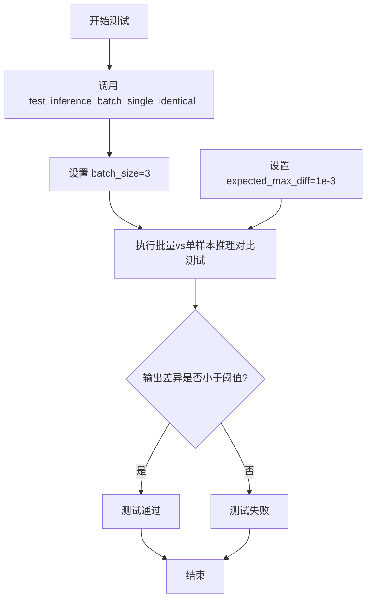

#### 带注释源码

```python
def test_inference_batch_single_identical(self):
    """
    测试批量推理与单样本推理的输出一致性。
    
    该测试方法继承自 unittest.TestCase，用于验证 LattePipeline 在批量推理模式下
    产生的输出与分别进行多次单样本推理的输出是否一致（允许一定的数值误差）。
    
    测试原理：
    1. 使用相同的随机种子和参数
    2. 分别执行批量推理（batch_size=3）和3次单样本推理
    3. 对比两组输出的差异
    
    参数：
    - self: LattePipelineFastTests 实例，隐式参数
    
    返回值：
    - None: 测试结果通过 unittest 框架的断言机制报告
    """
    # 调用父类 mixin 提供的通用测试方法
    # batch_size=3: 设置批量大小为3
    # expected_max_diff=1e-3: 允许的最大像素差异为 0.001
    self._test_inference_batch_single_identical(batch_size=3, expected_max_diff=1e-3)
```


### `LattePipelineFastTests.test_attention_slicing_forward_pass`

该测试方法用于验证 LattePipeline 的注意力切片（Attention Slicing）前向传播功能。由于该功能当前不被支持，该测试用例被跳过（skip）。

参数：

- `self`：`LattePipelineFastTests`，测试类实例本身，代表当前的测试对象

返回值：`None`，无返回值（方法体为 `pass`，测试被跳过）

#### 流程图

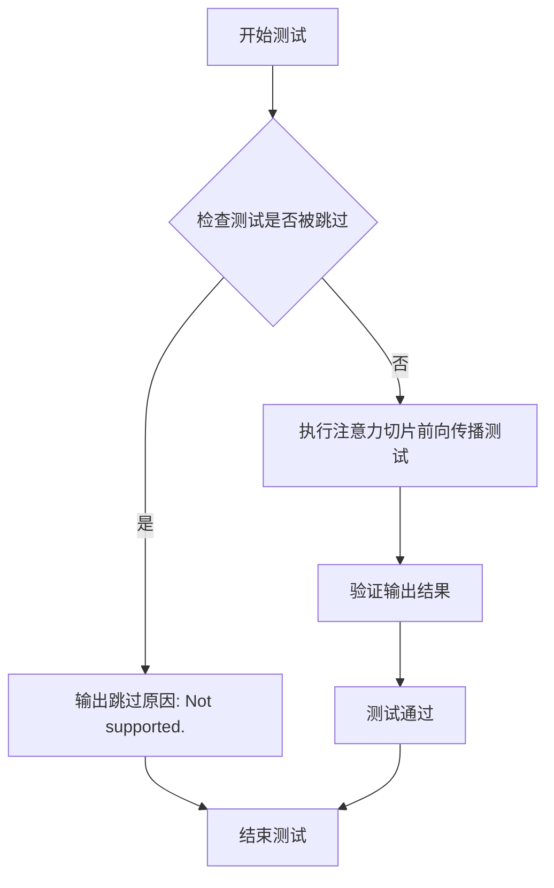

#### 带注释源码

```python
@unittest.skip("Not supported.")
def test_attention_slicing_forward_pass(self):
    """
    测试 LattePipeline 的注意力切片（Attention Slicing）前向传播功能。
    
    注意：由于 LattePipeline 目前不支持注意力切片功能，
    该测试被 @unittest.skip 装饰器跳过，不执行任何验证逻辑。
    
    参数:
        self: LattePipelineFastTests 实例，测试类本身
    
    返回值:
        None: 无返回值，该方法被跳过
    """
    pass  # 测试逻辑未实现，方法体为空
```

#### 备注

| 项目 | 描述 |
|------|------|
| **测试状态** | 被跳过（Skipped） |
| **跳过原因** | "Not supported." |
| **装饰器** | `@unittest.skip("Not supported.")` |
| **所属测试类** | `LattePipelineFastTests` |
| **测试类型** | 单元测试（Unit Test） |
| **技术债务** | 该测试方法表明注意力切片功能尚未在 LattePipeline 中实现，如果未来需要支持该功能，需要补充完整的测试逻辑 |


### `LattePipelineFastTests.test_xformers_attention_forwardGenerator_pass`

该测试方法用于验证 LattePipeline 在启用 xformers 注意力机制时的前向传播是否正确工作。测试仅在 CUDA 设备和 xformers 库可用时执行，通过调用父类的 `_test_xformers_attention_forwardGenerator_pass` 方法进行注意力机制的兼容性测试。

参数：

- `self`：隐式参数，`LattePipelineFastTests` 类的实例，代表当前测试对象

返回值：`None`，该方法为测试方法，不返回任何值（测试结果通过 unittest 框架的断言机制报告）

#### 流程图

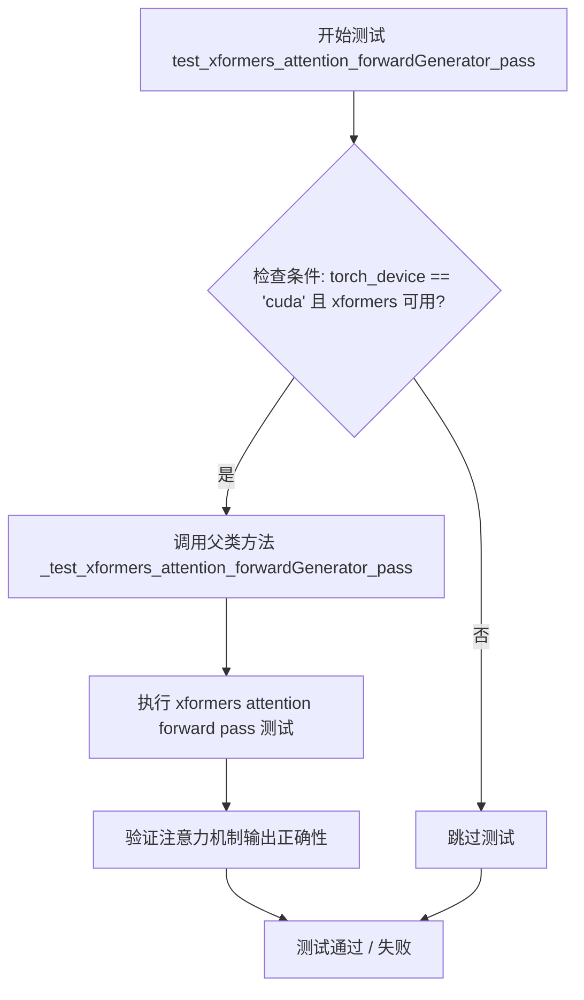

#### 带注释源码

```python
@unittest.skipIf(
    torch_device != "cuda" or not is_xformers_available(),
    reason="XFormers attention is only available with CUDA and `xformers` installed",
)
def test_xformers_attention_forwardGenerator_pass(self):
    """
    测试 xformers 注意力机制的前向传播是否正常工作。
    
    该测试方法仅在以下条件满足时执行：
    1. 当前设备为 CUDA 设备
    2. xformers 库已安装可用
    
    测试逻辑：
    - 调用父类的 _test_xformers_attention_forwardGenerator_pass 方法
    - 传入 test_mean_pixel_difference=False 参数，跳过像素差异均值检查
    """
    # 调用父类 FasterCacheTesterMixin 的测试方法
    # 参数 test_mean_pixel_difference=False 表示不检查平均像素差异
    super()._test_xformers_attention_forwardGenerator_pass(test_mean_pixel_difference=False)
```


### `LattePipelineFastTests.test_encode_prompt_works_in_isolation`

该测试函数用于验证 `encode_prompt` 方法能否在隔离环境中正常工作，但由于 `encode_prompt()` 方法返回多个值（包含 `prompt_embeds` 和 `negative_prompt_embeds`），该测试被主动跳过，函数体为空实现。

参数：

- `self`：`LattePipelineFastTests` 类型，测试类实例本身，包含测试所需的组件和配置

返回值：`None`，由于函数体为 `pass` 空实现，不返回任何值

#### 流程图

```mermaid
flowchart TD
    A[开始执行 test_encode_prompt_works_in_isolation] --> B{检查装饰器}
    B --> C[发现 @unittest.skip 装饰器]
    C --> D[跳过测试执行]
    D --> E[测试标记为 SKIPPED]
    E --> F[原因: Test not supported because `encode_prompt()` has multiple returns.]
```

#### 带注释源码

```python
@unittest.skip("Test not supported because `encode_prompt()` has multiple returns.")
def test_encode_prompt_works_in_isolation(self):
    """
    测试 encode_prompt 方法是否能独立工作。
    
    该测试原本用于验证 prompt 编码功能的隔离性，但由于以下原因被跳过：
    - encode_prompt() 方法返回多个值（prompt_embeds 和 negative_prompt_embeds）
    - 当前测试框架不支持对多返回值方法的隔离测试
    """
    pass  # 空函数体，测试被跳过
```


### `LattePipelineFastTests.test_save_load_optional_components`

该测试方法用于验证LattePipeline的可选组件（如text_encoder、tokenizer等）在保存时为None的情况下，加载后仍能保持为None，并且管道能够正确保存和加载，同时保持功能一致性。

参数：
- 该方法无显式参数，使用 `self`（TestCase实例）和测试框架隐式参数

返回值：`None`（测试方法，通过断言验证行为）

#### 流程图

```mermaid
flowchart TD
    A[开始测试] --> B{pipeline_class有_optional_components属性?}
    B -->|否| Z[直接返回, 跳过测试]
    B -->|是| C[获取虚拟组件get_dummy_components]
    C --> D[创建LattePipeline实例]
    D --> E[为所有组件设置默认注意力处理器]
    E --> F[将管道移至torch_device]
    F --> G[获取虚拟输入get_dummy_inputs]
    G --> H[使用pipe.encode_prompt编码prompt]
    H --> I[构建包含prompt_embeds的输入字典]
    I --> J[将所有可选组件设置为None]
    J --> K[运行管道pipe获取输出output]
    K --> L[创建临时目录]
    L --> M[保存管道到临时目录safe_serialization=False]
    M --> N[从临时目录加载管道pipe_loaded]
    N --> O[为加载的组件设置默认注意力处理器]
    O --> P[将加载的管道移至torch_device]
    P --> Q[断言验证所有可选组件保持为None]
    Q --> R[使用加载的管道运行推理]
    R --> S[计算输出差异max_diff]
    S --> T{差异小于1.0?}
    T -->|是| U[测试通过]
    T -->|否| V[测试失败, 抛出断言错误]
```

#### 带注释源码

```python
def test_save_load_optional_components(self):
    """
    测试可选组件的保存和加载功能。
    验证当可选组件设置为None时，保存和加载后仍能保持None，
    并且管道仍能正常工作。
    """
    # 检查管道类是否有可选组件属性，如果没有则直接返回（跳过测试）
    if not hasattr(self.pipeline_class, "_optional_components"):
        return

    # 步骤1: 获取虚拟组件（用于测试的模拟组件）
    components = self.get_dummy_components()
    
    # 步骤2: 使用虚拟组件创建管道实例
    pipe = self.pipeline_class(**components)

    # 步骤3: 为每个组件设置默认的注意力处理器
    for component in pipe.components.values():
        if hasattr(component, "set_default_attn_processor"):
            component.set_default_attn_processor()
    
    # 步骤4: 将管道移至测试设备（如cuda/cpu）
    pipe.to(torch_device)
    
    # 步骤5: 配置进度条（disable=None表示启用进度条）
    pipe.set_progress_bar_config(disable=None)

    # 步骤6: 获取虚拟输入参数
    inputs = self.get_dummy_inputs(torch_device)

    # 提取prompt和generator用于后续编码
    prompt = inputs["prompt"]
    generator = inputs["generator"]

    # 步骤7: 将prompt编码为embeddings（文本嵌入向量）
    # 返回prompt_embeds和negative_prompt_embeds
    (
        prompt_embeds,
        negative_prompt_embeds,
    ) = pipe.encode_prompt(prompt)

    # 步骤8: 构建测试输入字典，使用预计算的embeddings
    # 注意：这里的prompt_embeds已经预先计算好
    inputs = {
        "prompt_embeds": prompt_embeds,
        "negative_prompt": None,  # 不使用negative prompt
        "negative_prompt_embeds": negative_prompt_embeds,
        "generator": generator,
        "num_inference_steps": 2,  # 推理步数
        "guidance_scale": 5.0,    # CFG引导 scale
        "height": 8,              # 输出高度
        "width": 8,               # 输出宽度
        "video_length": 1,        # 视频帧数
        "mask_feature": False,    # 不使用特征掩码
        "output_type": "pt",      # 输出为PyTorch张量
        "clean_caption": False,   # 不清理caption
    }

    # 步骤9: 将所有可选组件设置为None
    # 这是测试的核心：验证可选组件可以为None且不影响功能
    for optional_component in pipe._optional_components:
        setattr(pipe, optional_component, None)

    # 步骤10: 使用设置为None的可选组件运行管道
    # 这里text_encoder和tokenizer为None，但仍需能运行（使用已计算的embeddings）
    output = pipe(**inputs)[0]

    # 步骤11: 创建临时目录用于保存/加载测试
    with tempfile.TemporaryDirectory() as tmpdir:
        # 保存管道到临时目录（不使用safe_serialization）
        pipe.save_pretrained(tmpdir, safe_serialization=False)
        
        # 从临时目录加载管道
        pipe_loaded = self.pipeline_class.from_pretrained(tmpdir)
        
        # 为加载的管道组件设置默认注意力处理器
        for component in pipe_loaded.components.values():
            if hasattr(component, "set_default_attn_processor"):
                component.set_default_attn_processor()

        # 将加载的管道移至测试设备
        pipe_loaded.to(torch_device)

    # 步骤12: 验证可选组件在加载后仍保持为None
    # 这是关键的断言：确保None值被正确保存和加载
    for optional_component in pipe._optional_components:
        self.assertTrue(
            getattr(pipe_loaded, optional_component) is None,
            f"`{optional_component}` did not stay set to None after loading.",
        )

    # 步骤13: 使用加载的管道（带有None组件）运行推理
    output_loaded = pipe_loaded(**inputs)[0]

    # 步骤14: 计算两次输出的差异
    max_diff = np.abs(to_np(output) - to_np(output_loaded)).max()
    
    # 步骤15: 断言输出差异在可接受范围内（<1.0）
    # 确保保存/加载过程没有改变管道的功能行为
    self.assertLess(max_diff, 1.0)
```


### `LattePipelineIntegrationTests.setUp`

该方法是测试类的初始化方法，在每个测试方法运行前被调用，用于清理垃圾回收并清空后端缓存，为集成测试准备干净的测试环境。

参数：

- `self`：`unittest.TestCase`，调用该方法的实例对象本身

返回值：`None`，无返回值

#### 流程图

```mermaid
flowchart TD
    A[setUp 方法开始] --> B[调用 super.setUp]
    B --> C[执行 gc.collect]
    C --> D[调用 backend_empty_cache]
    D --> E[setUp 方法结束]
```

#### 带注释源码

```python
def setUp(self):
    """
    测试方法初始化钩子，在每个测试方法执行前自动调用。
    用于准备测试环境，清理之前的资源占用。
    """
    # 调用父类 unittest.TestCase 的 setUp 方法
    # 确保测试框架的基础初始化工作完成
    super().setUp()
    
    # 强制执行 Python 垃圾回收
    # 释放不再使用的对象，清理内存
    gc.collect()
    
    # 清空 GPU/加速器设备的缓存
    # torch_device 是测试工具中定义的当前设备（如 'cuda' 或 'cpu'）
    # 确保测试开始时设备内存处于干净状态
    backend_empty_cache(torch_device)
```


### `LattePipelineIntegrationTests.tearDown`

该方法是 Latte 管道集成测试类的清理方法，在每个集成测试方法执行完成后自动调用，负责回收测试过程中产生的 Python 对象和 GPU 显存资源，确保测试环境被正确清理，防止测试间的资源泄漏和相互干扰。

参数：

- `self`：`LattePipelineIntegrationTests`，隐式参数，表示测试类的实例本身

返回值：`None`，无返回值

#### 流程图

```mermaid
flowchart TD
    A[tearDown 方法开始] --> B[调用 super().tearDown]
    B --> C[执行 gc.collect]
    C --> D[调用 backend_empty_cache]
    D --> E[方法结束]
```

#### 带注释源码

```python
def tearDown(self):
    """
    测试方法执行完成后的清理方法
    """
    # 调用父类的 tearDown 方法，执行 unittest.TestCase 标准的清理逻辑
    super().tearDown()
    
    # 强制启动 Python 垃圾回收器，回收测试过程中创建的不可达对象
    gc.collect()
    
    # 清空 GPU 显存缓存，释放测试中分配的显存资源
    backend_empty_cache(torch_device)
```


### `LattePipelineIntegrationTests.test_latte`

这是一个集成测试方法，用于测试LattePipeline从预训练模型加载并生成视频的功能，验证模型能够在给定提示下生成符合预期质量标准的视频。

参数：此方法无显式参数（使用类属性self.prompt）

返回值：`None`，该方法为单元测试，通过断言验证生成视频的质量

#### 流程图

```mermaid
flowchart TD
    A[开始测试] --> B[创建随机数生成器<br/>generator = torch.Generator.manual_seed0]
    B --> C[从预训练模型加载管道<br/>LattePipeline.from_pretrained]
    C --> D[启用CPU卸载<br/>pipe.enable_model_cpu_offload]
    D --> E[获取提示词<br/>prompt = self.prompt]
    E --> F[调用管道生成视频<br/>pipe.prompt, height, width, generator, num_inference_steps, clean_caption]
    F --> G[获取第一帧视频<br/>video = videos0]
    H[生成期望视频<br/>expected_video = torch.randn]
    G --> I[计算相似度距离<br/>numpy_cosine_similarity_distance]
    H --> I
    I --> J{max_diff < 1e-3?}
    J -->|是| K[测试通过]
    J -->|否| L[断言失败<br/>raise AssertionError]
```

#### 带注释源码

```python
@slow  # 标记为慢速测试
@require_torch_accelerator  # 需要CUDA加速器
class LattePipelineIntegrationTests(unittest.TestCase):
    prompt = "A painting of a squirrel eating a burger."  # 类属性：测试用提示词

    def setUp(self):
        """测试前的环境清理和资源初始化"""
        super().setUp()
        gc.collect()  # 强制垃圾回收
        backend_empty_cache(torch_device)  # 清空GPU缓存

    def tearDown(self):
        """测试后的环境清理"""
        super().tearDown()
        gc.collect()
        backend_empty_cache(torch_device)

    def test_latte(self):
        """
        集成测试：验证LattePipeline能够从预训练模型生成视频
        
        测试流程：
        1. 创建确定性随机数生成器
        2. 加载预训练Latte模型
        3. 配置模型CPU卸载
        4. 执行推理生成视频
        5. 验证生成质量
        """
        # 创建CPU上的随机数生成器，使用固定种子确保可重复性
        generator = torch.Generator("cpu").manual_seed(0)

        # 从预训练模型加载LattePipeline，指定半精度以减少内存占用
        pipe = LattePipeline.from_pretrained("maxin-cn/Latte-1", torch_dtype=torch.float16)
        
        # 启用模型CPU卸载，将模型从GPU卸载到CPU以节省显存
        pipe.enable_model_cpu_offload(device=torch_device)
        
        # 获取测试提示词
        prompt = self.prompt

        # 调用管道生成视频
        # 参数说明：
        # - prompt: 文本提示词
        # - height/width: 输出视频分辨率512x512
        # - generator: 随机数生成器确保确定性输出
        # - num_inference_steps: 推理步数2步（快速测试）
        # - clean_caption: 是否清理提示词
        videos = pipe(
            prompt=prompt,
            height=512,
            width=512,
            generator=generator,
            num_inference_steps=2,
            clean_caption=False,
        ).frames  # 获取生成的视频帧

        # 提取第一个视频（批次中只有一个）
        video = videos[0]
        
        # 生成随机期望视频用于相似度比较
        expected_video = torch.randn(1, 512, 512, 3).numpy()

        # 计算生成视频与随机视频的余弦相似度距离
        # 由于expected_video是随机的，这个测试实际上是在验证：
        # 1. 管道能够成功运行不崩溃
        # 2. 输出形状正确 (1, 512, 512, 3)
        max_diff = numpy_cosine_similarity_distance(video.flatten(), expected_video)
        
        # 断言：余弦相似度距离应小于阈值
        # 注意：这里使用随机expected_video的设计可能有问题
        assert max_diff < 1e-3, f"Max diff is too high. got {video.flatten()}"
```

## 关键组件


### LattePipeline

核心扩散模型管道，负责根据文本提示生成视频。整合了Transformer模型、VAE、文本编码器和调度器，协调整个视频生成流程。

### LatteTransformer3DModel

3D时空变换器模型，是Latte的核心神经网络架构。处理视频数据的时空注意力机制，将文本嵌入转换为视频潜在表示。

### AutoencoderKL

变分自编码器(VAE)，负责图像/视频数据的编码和解码。将输入图像编码为潜在表示，并在生成后将潜在表示解码为最终视频帧。

### T5EncoderModel

基于T5的文本编码器，将文本提示转换为语义嵌入向量。为扩散模型提供文本条件的表示，驱动视频内容的生成。

### DDIMScheduler

DDIM调度器，管理扩散模型的噪声调度策略。控制去噪过程的步数和噪声水平，影响生成视频的质量和多样性。

### PyramidAttentionBroadcastConfig

金字塔注意力广播配置类，定义时空注意力跳过范围和块标识符。优化注意力计算，通过跳过不必要的计算提升推理效率。

### FasterCacheConfig

快速缓存配置类，管理推理过程中的缓存策略。配置注意力块的跳过范围和时间步跳过范围，通过回调函数控制注意力权重。

### get_dummy_components

测试辅助方法，创建用于单元测试的虚拟组件集合。初始化虚拟的Transformer、VAE、文本编码器、调度器和分词器。

### get_dummy_inputs

测试辅助方法，生成虚拟的推理输入参数。构造包含提示词、负提示词、生成器、推理步数等完整的输入字典。

### test_inference

核心推理测试方法，验证Pipeline的基本生成功能。测试从文本提示生成视频的完整流程，验证输出形状和数值范围。

### test_callback_inputs

回调函数测试方法，验证Pipeline的回调机制是否正常工作。测试callback_on_step_end和callback_on_step_end_tensor_inputs的正确性。

### PipelineTesterMixin

管道测试混入类，提供通用的Pipeline测试方法集合。包含批处理一致性、梯度计算、模型卸载等多种测试场景的通用实现。

### PyramidAttentionBroadcastTesterMixin

金字塔注意力广播测试混入类，专门测试PAB功能。验证金字塔注意力广播配置是否正确应用到模型中。

### FasterCacheTesterMixin

快速缓存测试混入类，专门测试FasterCache功能。验证缓存配置和注意力权重回调是否正常工作。


## 问题及建议


### 已知问题

- **断言过于宽松**：`test_inference` 方法中使用 `self.assertLessEqual(max_diff, 1e10)`，这个阈值过于宽松（1e10），实际上任何合理的生成结果都会通过此测试，无法有效验证生成质量。
- **测试非确定性**：`test_inference` 中使用 `torch.randn(1, 3, 8, 8)` 生成 expected_video 但未设置随机种子，导致每次运行产生不同的基准数据，测试结果不可复现。
- **随机种子污染**：`get_dummy_components` 方法中使用 `torch.manual_seed(0)`，这会影响全局随机状态，可能导致测试之间的相互影响。
- **跳过测试缺乏文档**：`test_attention_slicing_forward_pass` 和 `test_encode_prompt_works_in_isolation` 被跳过但未详细说明原因或预期修复时间。
- **集成测试严格度过高**：`test_latte` 中使用 `max_diff < 1e-3` 的阈值，在不同硬件环境下可能导致 flaky test。
- **设备处理不一致**：`test_inference` 硬编码使用 "cpu"，而其他测试使用 `torch_device`，导致测试行为不一致。
- **资源未清理**：`test_inference` 方法未对创建的 pipeline 进行资源释放（如 GPU 内存），可能导致内存泄漏。
- **条件跳过测试**：`test_callback_inputs` 使用 `if not (...): return` 静默跳过测试，无法明确区分"不支持"和"执行成功"。

### 优化建议

- 将 `test_inference` 中的阈值调整为合理的数值（如 1e-2 或根据实际生成质量确定），并为 expected_video 设置固定随机种子以保证可复现性。
- 移除全局随机种子设置，改用局部随机数生成器或显式传递种子参数。
- 为所有跳过的测试添加详细的 `@unittest.skip` 原因说明，包括是否计划实现或已知限制。
- 统一设备管理，在所有测试中使用 `torch_device` 或通过 fixture 统一配置。
- 在集成测试中使用更宽松的阈值（如 1e-1）或使用相对误差而非绝对误差进行比较。
- 在测试方法结束时显式调用 `del pipe` 并清理 GPU 内存（如果使用 GPU）。
- 将条件跳过改为明确的断言或 fixture 标记，使测试结果更加明确。

## 其它


### 设计目标与约束

本测试模块旨在验证LattePipeline在各种场景下的功能正确性和稳定性，包括单元测试和集成测试。设计约束包括：必须支持CPU和CUDA设备测试，需要支持xFormers加速（仅CUDA环境），测试必须在合理时间内完成（部分耗时测试标记为@slow），需要确保测试的确定性行为（通过enable_full_determinism配置）。

### 错误处理与异常设计

测试中包含多种错误处理验证：1）callback_on_step_end机制的正确性验证，确保回调函数只能访问允许的tensor输入；2）可选组件保存和加载的正确性，验证设置为None的组件在加载后保持为None；3）设备兼容性检查，如MPS设备的特殊处理（使用torch.manual_seed而非torch.Generator）；4）跳过不适用的测试（如xFormers测试在非CUDA环境自动跳过）。

### 数据流与状态机

测试覆盖以下数据流路径：1）完整推理流程：prompt → tokenizer → text_encoder → VAE编码 → LatteTransformer3DModel去噪 → VAE解码 → 视频帧输出；2）批处理流程：验证单批次和多批次输入的输出一致性；3）保存加载流程：验证pipeline各组件（transformer、vae、scheduler、text_encoder、tokenizer）的序列化与反序列化；4）回调流程：在推理步骤结束时修改latents等张量。

### 外部依赖与接口契约

本测试依赖以下外部组件和接口：1）transformers库：AutoTokenizer和T5EncoderModel用于文本编码；2）diffusers库：LattePipeline、LatteTransformer3DModel、AutoencoderKL、DDIMScheduler等核心组件；3）测试工具：numpy_cosine_similarity_distance用于结果相似度比较；4）可选依赖：xFormers用于注意力加速（通过is_xformers_available检查）；5）配置类：PyramidAttentionBroadcastConfig和FasterCacheConfig用于高级功能测试。

### 性能考虑与基准测试

测试中包含性能相关配置：1）test_inference_batch_single_identical验证批处理与单样本处理的结果一致性，确保没有因批处理导致的精度损失；2）集成测试使用torch.float16加速推理；3）通过enable_model_cpu_offload优化CPU内存使用；4）每个测试前后执行gc.collect()和backend_empty_cache清理资源。

### 安全考虑

测试代码遵循安全最佳实践：1）使用safe_serialization=False进行模型保存，允许更灵活的序列化方式；2）集成测试中使用相对路径的模型加载（from_pretrained）；3）所有随机数生成使用固定种子确保可复现性；4）测试不会产生副作用或修改系统状态。

### 配置管理

测试使用多种配置对象：1）pab_config：PyramidAttentionBroadcastConfig配置空间/时间/交叉注意力的块跳过范围和时间步跳过范围；2）faster_cache_config：FasterCacheConfig配置缓存策略和注意力权重回调；3）params：TEXT_TO_IMAGE_PARAMS减去cross_attention_kwargs定义了推理参数；4）batch_params和image_params定义了批处理和图像相关参数。

### 版本兼容性

测试考虑以下兼容性需求：1）PyTorch版本兼容性：通过@require_torch_accelerator装饰器确保GPU可用；2）CUDA版本兼容性：xFormers测试仅在CUDA环境执行；3）MPS设备兼容性：针对Apple Silicon的特殊处理；4）transformers库兼容性：使用hf-internal-testing/tiny-random-t5等测试模型避免版本问题。

### 测试策略

采用多层次测试策略：1）单元测试（LattePipelineFastTests）：验证各组件功能、回调机制、保存加载、可选组件；2）集成测试（LattePipelineIntegrationTests）：验证端到端pipeline功能；3）混合测试类：通过PipelineTesterMixin、PyramidAttentionBroadcastTesterMixin和FasterCacheTesterMixin混入通用测试用例；4）条件跳过：使用@unittest.skip和@unittest.skipIf根据环境条件跳过不适用的测试。

### 部署注意事项

在生产环境中部署时需注意：1）模型加载需要足够的磁盘空间和内存；2）集成测试中使用了@require_torch_accelerator标记，需要GPU环境；3）测试使用的maxin-cn/Latte-1模型需要从HuggingFace Hub下载；4）建议在CI/CD中配置torch_device环境变量以支持不同硬件环境。

    