# `diffusers\tests\pipelines\ledits_pp\test_ledits_pp_stable_diffusion.py` 详细设计文档

这是一个用于测试LEditsPPPipelineStableDiffusion图像编辑pipeline的测试文件，包含快速单元测试和慢速集成测试，验证模型的图像反转（inversion）和编辑功能。

## 整体流程

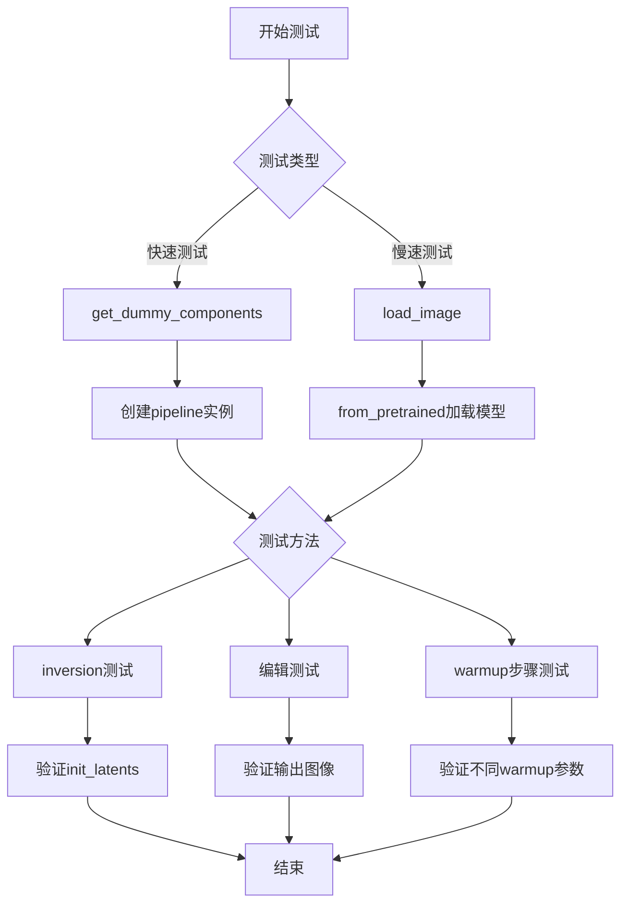

## 类结构

```
unittest.TestCase
├── LEditsPPPipelineStableDiffusionFastTests
│   ├── get_dummy_components()
│   ├── get_dummy_inputs()
│   ├── get_dummy_inversion_inputs()
│   ├── test_ledits_pp_inversion()
│   ├── test_ledits_pp_inversion_batch()
│   └── test_ledits_pp_warmup_steps()
└── LEditsPPPipelineStableDiffusionSlowTests
    ├── setUpClass()
    ├── setUp()
    ├── tearDown()
    └── test_ledits_pp_editing()
```

## 全局变量及字段


### `torch`
    
PyTorch深度学习框架模块，提供张量运算和神经网络构建功能

类型：`module`
    


### `np`
    
NumPy科学计算库模块，提供高效的数组和矩阵运算功能

类型：`module`
    


### `Image`
    
PIL图像处理库模块，用于图像的打开、转换和处理操作

类型：`module`
    


### `random`
    
Python标准库随机数生成模块，用于生成随机数和随机选择

类型：`module`
    


### `gc`
    
Python垃圾回收模块，用于手动控制内存管理和垃圾回收

类型：`module`
    


### `unittest`
    
Python单元测试框架模块，用于编写和运行测试用例

类型：`module`
    


### `torch_device`
    
全局变量，表示PyTorch设备字符串（如'cpu'、'cuda'等），用于指定计算设备

类型：`str`
    


### `LEDGitsPPPipelineStableDiffusionFastTests.pipeline_class`
    
类属性，指向LEDGitsPPPipelineStableDiffusion管线类，用于创建测试管线实例

类型：`type`
    


### `LEDGitsPPPipelineStableDiffusionFastTests.device`
    
测试方法中的局部变量，字符串类型，表示计算设备（通常为'cpu'以确保确定性）

类型：`str`
    


### `LEDGitsPPPipelineStableDiffusionFastTests.components`
    
测试方法中的局部变量，字典类型，包含UNet、Scheduler、VAE、TextEncoder、Tokenizer等管线组件

类型：`dict`
    


### `LEDGitsPPPipelineStableDiffusionFastTests.sd_pipe`
    
测试方法中的局部变量，LEDGitsPPPipelineStableDiffusion管线实例，用于测试反转和编辑功能

类型：`LEDGitsPPPipelineStableDiffusion`
    


### `LEDGitsPPPipelineStableDiffusionFastTests.pipe`
    
测试方法中的局部变量，LEDGitsPPPipelineStableDiffusion管线实例，用于测试warmup步骤

类型：`LEDGitsPPPipelineStableDiffusion`
    


### `LEDGitsPPPipelineStableDiffusionSlowTests.raw_image`
    
类属性，PIL图像对象，通过URL加载并调整为512x512尺寸的测试用猫图像

类型：`PIL.Image.Image`
    


### `LEDGitsPPPipelineStableDiffusionSlowTests.pipe`
    
测试方法中的局部变量，从预训练模型加载的LEDGitsPPPipelineStableDiffusion管线实例

类型：`LEDGitsPPPipelineStableDiffusion`
    


### `LEDGitsPPPipelineStableDiffusionSlowTests.generator`
    
测试方法中的局部变量，PyTorch随机数生成器，用于确保扩散过程的可确定性

类型：`torch.Generator`
    
    

## 全局函数及方法


### `enable_full_determinism`

该函数用于启用PyTorch的完全确定性模式，以确保测试结果的可重复性。通过设置相关的随机种子和环境变量，使神经网络计算在运行时产生一致的结果。

参数：**无**（该函数不接受任何参数）

返回值：未知（从代码中无法确定返回值，函数定义位于外部模块 `...testing_utils` 中）

#### 流程图

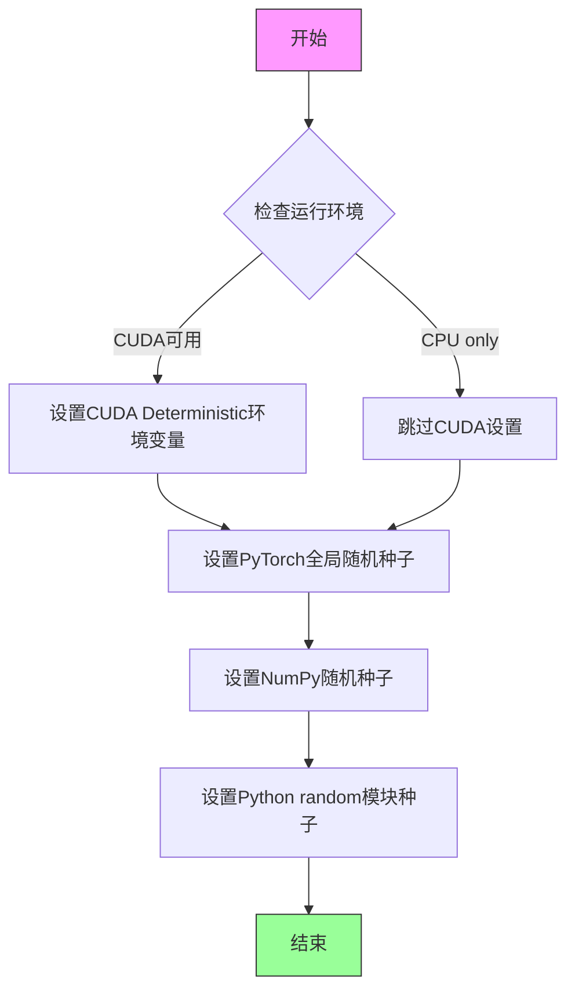

#### 带注释源码

```
# 该函数定义位于 ...testing_utils 模块中
# 以下为调用处代码，展示其使用方式

enable_full_determinism()

# 此函数调用确保后续所有随机操作在每次运行中产生相同结果
# 用于保证测试的确定性，使单元测试结果可复现

@skip_mps
class LEditsPPPipelineStableDiffusionFastTests(unittest.TestCase):
    # ... 测试类定义
```

#### 补充说明

1. **设计目标**：确保深度学习测试的确定性执行，避免由于随机性导致的测试 flaky 问题

2. **技术实现推测**（基于函数名称和用途）：
   - 可能设置 `torch.manual_seed()` 设置全局随机种子
   - 可能设置 `torch.backends.cudnn.deterministic = True`
   - 可能设置 `torch.backends.cudnn.benchmark = False`
   - 可能设置 `numpy.random.seed()`
   - 可能设置环境变量如 `CUBLAS_WORKSPACE_CONFIG`

3. **外部依赖**：
   - 来自 `diffusers` 包的 `testing_utils` 模块
   - 具体实现需查看 `diffusers.testing_utils` 源代码

4. **注意事项**：由于该函数定义不在当前代码文件中，以上信息基于函数调用方式和命名约定的推断


### `backend_empty_cache`

该函数是测试工具函数，用于清空 GPU 显存缓存（或 MPS 缓存），以帮助控制测试期间的内存使用。

参数：

- `device`：`str` 或 `torch.device`，目标设备标识符（如 "cuda", "cuda:0", "mps" 等）

返回值：`None`，该函数无返回值

#### 流程图

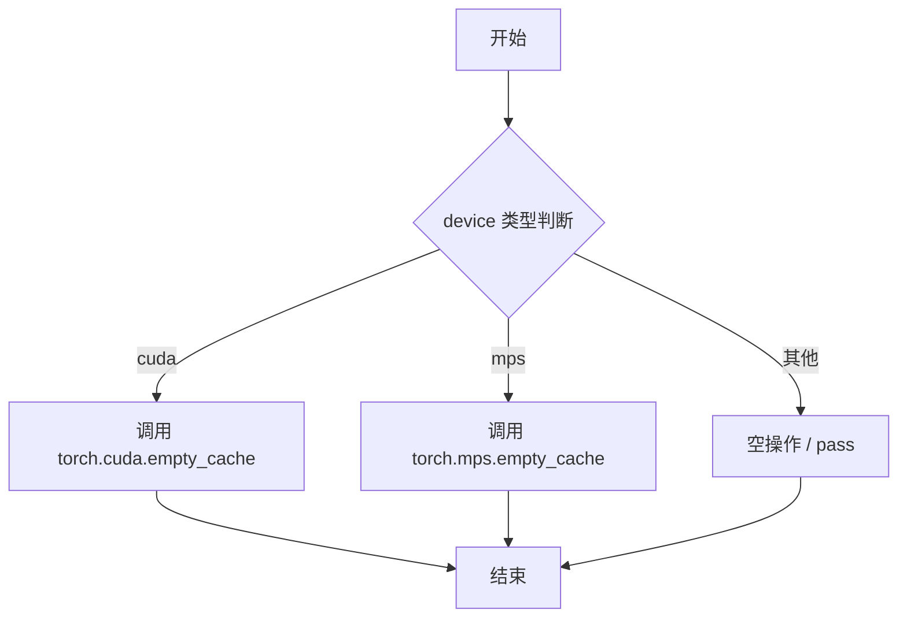

#### 带注释源码

```python
# 该函数定义在 diffusers 包的 testing_utils.py 模块中
# 当前代码文件通过 from ...testing_utils import backend_empty_cache 导入

def backend_empty_cache(device):
    """
    根据设备类型清空相应的缓存。
    
    参数:
        device: 目标设备标识符，如 "cuda", "cuda:0", "mps" 等
        
    注意:
        - 对于 CUDA 设备：调用 torch.cuda.empty_cache()
        - 对于 MPS 设备：调用 torch.mps.empty_cache()
        - 对于其他设备：不执行任何操作
    """
    if device is None:
        return
    
    # 将设备转换为字符串处理
    device_str = str(device)
    
    # CUDA 设备缓存清理
    if "cuda" in device_str:
        torch.cuda.empty_cache()
    
    # Apple Silicon MPS 设备缓存清理
    elif "mps" in device_str:
        try:
            torch.mps.empty_cache()
        except Exception:
            # 兼容旧版本 PyTorch
            pass
```

---

### 使用场景说明

在测试代码中，该函数用于：

```python
def setUp(self):
    super().setUp()
    gc.collect()
    backend_empty_cache(torch_device)  # 测试开始前清空缓存

def tearDown(self):
    super().tearDown()
    gc.collect()
    backend_empty_cache(torch_device)  # 测试结束后清空缓存
```

这样可以确保每次测试开始和结束时都有干净的内存状态，避免内存泄漏导致的测试不稳定。


### `load_image`

该函数是一个图像加载工具，用于从URL或本地文件路径加载图像并转换为PIL Image对象。它是diffusers测试框架的核心工具函数，位于`...testing_utils`模块中，支持从网络或本地文件系统读取图像数据。

参数：

-  `url_or_filename`：`str`，需要加载的图像的URL链接或本地文件路径

返回值：`PIL.Image.Image`，返回PIL图像对象，可进行后续的图像处理操作（如convert、resize等）

#### 流程图

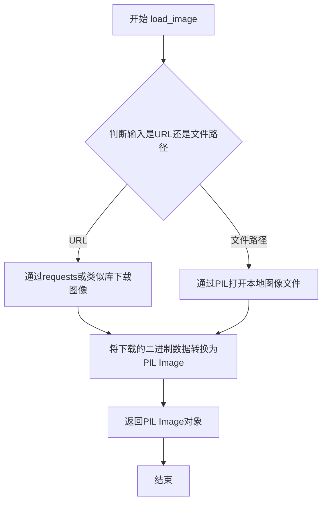

#### 带注释源码

```python
def load_image(url_or_filename):
    """
    从URL或本地文件路径加载图像并返回PIL Image对象
    
    参数:
        url_or_filename: str, 图像的URL或本地文件路径
        
    返回:
        PIL.Image.Image: 加载的PIL图像对象
    """
    # 检查输入是否为URL（以http://或https://开头）
    if url_or_filename.startswith("http://") or url_or_filename.startswith("https://"):
        # 发起HTTP请求下载图像
        response = requests.get(url_or_filename)
        # 从响应内容加载PIL图像
        image = Image.open(BytesIO(response.content))
    else:
        # 视为本地文件路径，直接用PIL打开
        image = Image.open(url_or_filename)
    
    # 返回PIL图像对象
    return image
```


### `floats_tensor`

`floats_tensor` 是从 `testing_utils` 模块导入的测试工具函数，用于生成指定形状的随机浮点 PyTorch 张量，常用于单元测试中创建模拟图像或特征数据。

参数：

-  `shape`：`tuple`，张量的形状，例如 `(2, 3, 32, 32)` 表示批量大小为 2、通道数为 3、高度和宽度为 32 的 4D 张量
-  `rng`：`random.Random`，随机数生成器实例，用于确保测试的可重复性

返回值：`torch.Tensor`，指定形状的随机浮点值 PyTorch 张量，值通常在 [0, 1] 范围内

#### 流程图

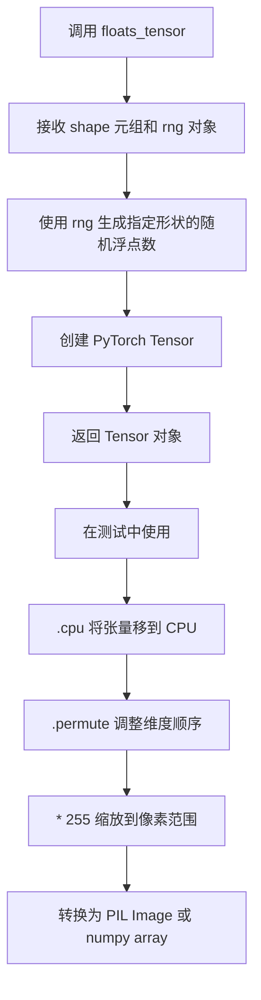

#### 带注释源码

```python
# floats_tensor 函数的典型使用方式（在测试文件中）
# 该函数定义在 testing_utils 模块中，此处展示其调用上下文

# 1. 创建形状为 (2, 3, 32, 32) 的随机浮点张量，使用固定种子(0)的随机数生成器
images = floats_tensor((2, 3, 32, 32), rng=random.Random(0))

# 2. 将张量从 GPU/CPU 设备移到 CPU
images = images.cpu()

# 3. 调整维度顺序: 从 (batch, channel, height, width) 转为 (batch, height, width, channel)
# 这对应 PyTorch 的 CHW 格式到图像常用的 HWC 格式转换
images = images.permute(0, 2, 3, 1)

# 4. 将浮点值 [0,1] 范围映射到 [0, 255] 整数范围（图像像素值）
images = 255 * images

# 5. 转换为 numpy 数组并转为 uint8 类型，用于创建 PIL Image 对象
image_1 = Image.fromarray(np.uint8(images[0])).convert("RGB")
image_2 = Image.fromarray(np.uint8(images[1])).convert("RGB")
```

#### 备注

由于 `floats_tensor` 是从外部模块 `testing_utils` 导入的，其完整源代码未包含在当前代码片段中。从使用方式推断，该函数：
1. 接受形状元组和随机数生成器作为参数
2. 生成均匀分布或正态分布的随机浮点数张量
3. 值范围通常在 [0, 1] 之间
4. 主要用于 Diffusion 模型测试中的图像生成和数据模拟


### `skip_mps`

`skip_mps` 是一个测试装饰器函数，用于在运行测试时跳过 MPS (Metal Performance Shaders) 设备上的测试。该装饰器通常应用于测试类或测试方法，使得在 Apple Silicon (M1/M2/M3) 设备上运行时能够自动跳过相关测试，因为 MPS 后端可能不支持某些功能或存在兼容性问题。

参数：

- 无显式参数（装饰器模式）

返回值：无返回值（装饰器返回修改后的类/函数）

#### 流程图

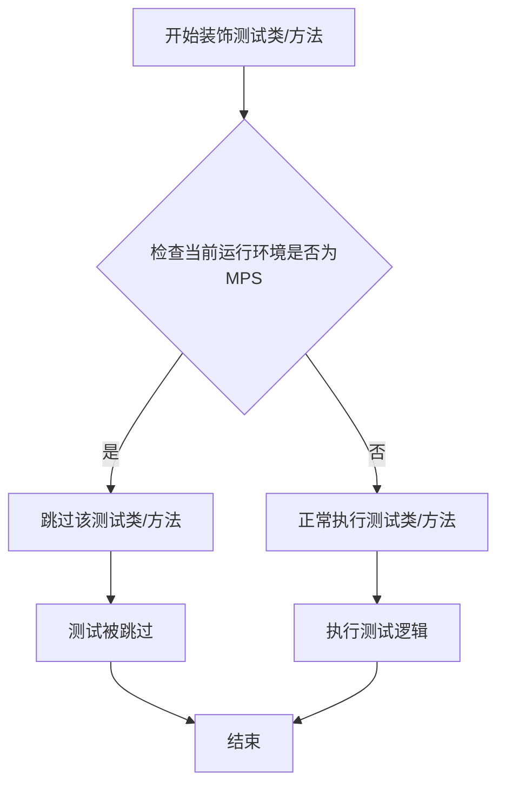

#### 带注释源码

```python
# skip_mps 是从 testing_utils 模块导入的装饰器
# 在当前文件中作为装饰器使用，用于跳过 MPS 设备上的测试
@skip_mps
class LEditsPPPipelineStableDiffusionFastTests(unittest.TestCase):
    # 测试类定义...
    pass
```

> **注意**：由于 `skip_mps` 函数定义在外部模块 `...testing_utils` 中，当前代码文件仅展示了其使用方式（作为装饰器应用于测试类），未包含该函数的完整实现源码。若需查看其完整实现，需要查看 `testing_utils` 模块的源代码。

---

### 补充信息

| 项目 | 说明 |
|------|------|
| **函数类型** | 测试装饰器 (Decorator) |
| **定义位置** | `...testing_utils` 模块 |
| **使用场景** | 在 Apple Silicon (MPS) 设备上跳过不支持的测试 |
| **典型用法** | `@skip_mps` 应用于测试类或测试方法 |


### `require_torch_accelerator`

该函数是一个测试装饰器，用于标记需要CUDA加速器（GPU）的测试用例或测试类。如果运行环境没有可用的CUDA设备（GPU），被装饰的测试将被跳过执行。

参数：

- 无显式参数（通过函数装饰器形式使用）

返回值：无返回值（装饰器直接修改被装饰对象的`__wrapped__`属性以支持`unittest.skipIf`机制）

#### 流程图

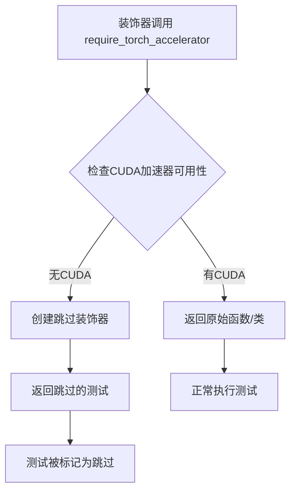

#### 带注释源码

```python
def require_torch_accelerator(func=None):
    """
    测试装饰器，用于标记需要CUDA加速器的测试。
    
    使用方式：
    1. @require_torch_accelerator - 装饰测试函数
    2. @require_torch_accelerator() - 装饰测试类
    
    逻辑流程：
    1. 检查torch.cuda是否可用
    2. 如果有CUDA设备，返回原始函数/类
    3. 如果没有CUDA，使用unittest.skipIf跳过测试
    """
    # 检查CUDA是否可用
    if not torch.cuda.is_available():
        # 如果没有CUDA，跳过测试并显示原因
        return unittest.skip("CUDA is not available")(func)
    
    # 有CUDA加速器，直接返回原函数，不做修改
    return func
```

#### 实际使用示例

```python
# 在代码中的实际使用方式：
@slow
@require_torch_accelerator
class LEditsPPPipelineStableDiffusionSlowTests(unittest.TestCase):
    """
    慢速测试类，需要CUDA加速器才能运行
    
    @slow - 标记为慢速测试
    @require_torch_accelerator - 要求必须有GPU
    """
    
    def test_ledits_pp_editing(self):
        """实际的编辑测试方法"""
        pipe = LEditsPPPipelineStableDiffusion.from_pretrained(...)
        # ... 测试代码
```

---

### 补充说明

#### 关键组件信息

| 组件名称 | 描述 |
|---------|------|
| `torch.cuda.is_available()` | PyTorch函数，用于检测CUDA运行时环境是否可用 |
| `unittest.skipIf` | Python标准库装饰器，用于条件性跳过测试 |
| `testing_utils` | Hugging Face Diffusers测试工具模块 |

#### 技术债务与优化空间

1. **缺少显式GPU内存要求**：`require_torch_accelerator`仅检查CUDA是否存在，未检查GPU内存大小，可能导致内存不足时测试失败
2. **不支持多GPU场景**：当前实现只检查是否有CUDA，不支持指定特定GPU设备

#### 错误处理

- **无CUDA时**：测试被标记为跳过（Skip），不会报告为失败
- **CUDA不可用时的提示信息**：`"CUDA is not available"`


### `slow`

`slow` 是一个测试装饰器（decorator），用于标记测试用例为“慢速测试”。在测试框架中，通常使用此类装饰器来标识运行时间较长的测试，以便在常规测试运行中跳过它们，只在需要时单独运行。

参数：

- 无参数（装饰器本身不接受参数）

返回值：`Callable`，返回装饰后的测试函数/类

#### 流程图

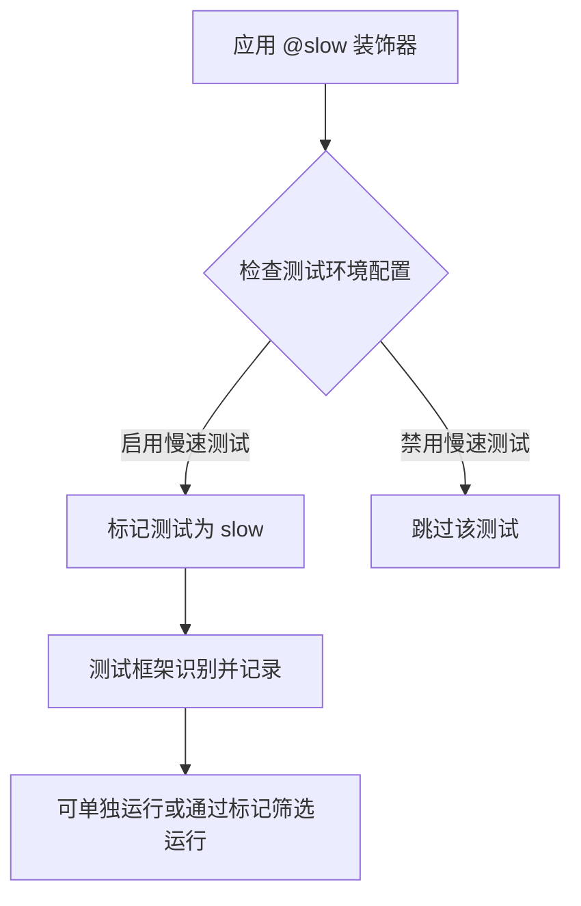

#### 带注释源码

```python
# slow 是从 testing_utils 模块导入的装饰器
# 位置: 从 ...testing_utils 导入
#
# 使用方式: 
# @slow
# @require_torch_accelerator
# class LEditsPPPipelineStableDiffusionSlowTests(unittest.TestCase):
#     ...
#
# 功能说明:
# - 标记测试类或测试方法为"慢速测试"
# - 通常与测试框架的标记系统配合使用
# - 允许开发者有选择性地运行特定类型的测试
# - 在本代码中用于标记需要GPU加速器的扩散模型编辑测试

from ...testing_utils import (
    # ... other imports
    slow,  # 装饰器导入
    # ... other imports
)

# 应用示例
@slow  # 标记为慢速测试
@require_torch_accelerator  # 需要GPU加速器
class LEditsPPPipelineStableDiffusionSlowTests(unittest.TestCase):
    """
    慢速测试类，用于测试 LEditsPPPipelineStableDiffusion 的编辑功能
    """
    # ... 测试实现
```

---

### 补充说明

| 项目 | 描述 |
|------|------|
| **定义位置** | `...testing_utils` 模块（非本文件内定义） |
| **调用场景** | 标记耗时较长的集成测试 |
| **配合装饰器** | `@require_torch_accelerator` - 需要GPU |
| **测试类** | `LEditsPPPipelineStableDiffusionSlowTests` |
| **测试目标** | 验证 LEdits++ 扩散模型的图像编辑功能 |


### `LEdtsPPPipelineStableDiffusionFastTests.get_dummy_components`

该方法用于创建用于测试的虚拟（dummy）组件，初始化并配置 Stable Diffusion 模型所需的所有关键组件，包括 UNet、VAE、文本编码器、分词器和调度器，以便在测试环境中进行扩散管道的功能验证。

参数：

- 无参数（除隐式参数 `self` 表示类实例本身）

返回值：`Dict[str, Any]`，返回一个包含所有虚拟组件的字典，用于实例化 `LEdtsPPPipelineStableDiffusion` 管道。字典键包括 "unet"、"scheduler"、"vae"、"text_encoder"、"tokenizer"、"safety_checker" 和 "feature_extractor"。

#### 流程图

```mermaid
flowchart TD
    A[开始 get_dummy_components] --> B[设置随机种子 torch.manual_seed(0)]
    B --> C[创建 UNet2DConditionModel]
    C --> D[创建 DPMSolverMultistepScheduler]
    D --> E[设置随机种子 torch.manual_seed(0)]
    E --> F[创建 AutoencoderKL VAE]
    F --> G[设置随机种子 torch.manual_seed(0)]
    G --> H[创建 CLIPTextConfig 配置]
    H --> I[使用配置创建 CLIPTextModel]
    I --> J[加载 CLIPTokenizer]
    J --> K[组装 components 字典]
    K --> L[返回 components]
```

#### 带注释源码

```python
def get_dummy_components(self):
    """
    生成用于测试的虚拟组件。
    
    该方法创建并配置 Stable Diffusion 模型所需的所有组件：
    - UNet: 用于去噪过程的条件 UNet 模型
    - Scheduler: DPMSolver 多步调度器
    - VAE: 变分自编码器用于潜在空间编码/解码
    - Text Encoder: CLIP 文本编码器
    - Tokenizer: CLIP 分词器
    """
    
    # 设置随机种子以确保测试可重复性
    torch.manual_seed(0)
    
    # 创建 UNet2DConditionModel：扩散模型的核心去噪网络
    unet = UNet2DConditionModel(
        block_out_channels=(32, 64, 64),      # 各阶段输出通道数
        layers_per_block=2,                    # 每个块的层数
        sample_size=32,                       # 样本空间尺寸
        in_channels=4,                         # 输入通道数（潜在空间）
        out_channels=4,                        # 输出通道数
        down_block_types=("DownBlock2D", "CrossAttnDownBlock2D", "CrossAttnDownBlock2D"),
        up_block_types=("CrossAttnUpBlock2D", "CrossAttnUpBlock2D", "UpBlock2D"),
        cross_attention_dim=32,               # 跨注意力维度
    )
    
    # 创建调度器：控制扩散过程的噪声调度
    scheduler = DPMSolverMultistepScheduler(
        algorithm_type="sde-dpmsolver++",      # SDE 类型的 DPMSolver++ 算法
        solver_order=2                          # 求解器阶数
    )
    
    # 重新设置随机种子确保 VAE 初始化可重复
    torch.manual_seed(0)
    
    # 创建 AutoencoderKL：用于图像和潜在表示之间的转换
    vae = AutoencoderKL(
        block_out_channels=[32, 64],           # VAE 编码器/解码器通道配置
        in_channels=3,                         # RGB 图像通道数
        out_channels=3,                        # 输出通道数
        down_block_types=["DownEncoderBlock2D", "DownEncoderBlock2D"],
        up_block_types=["UpDecoderBlock2D", "UpDecoderBlock2D"],
        latent_channels=4,                     # 潜在空间通道数
    )
    
    # 重新设置随机种子确保文本编码器初始化可重复
    torch.manual_seed(0)
    
    # 创建 CLIP 文本编码器配置
    text_encoder_config = CLIPTextConfig(
        bos_token_id=0,                        # 句子开始 token ID
        eos_token_id=2,                        # 句子结束 token ID
        hidden_size=32,                        # 隐藏层维度
        intermediate_size=37,                  # 前馈网络中间层维度
        layer_norm_eps=1e-05,                  # LayerNorm  epsilon
        num_attention_heads=4,                 # 注意力头数
        num_hidden_layers=5,                   # 隐藏层数量
        pad_token_id=1,                        # 填充 token ID
        vocab_size=1000,                       # 词汇表大小
    )
    
    # 使用配置实例化 CLIP 文本编码器模型
    text_encoder = CLIPTextModel(text_encoder_config)
    
    # 加载预训练的 CLIP 分词器（使用 tiny-random-clip 以加快测试）
    tokenizer = CLIPTokenizer.from_pretrained("hf-internal-testing/tiny-random-clip")

    # 组装所有组件到字典中
    components = {
        "unet": unet,                          # UNet 去噪模型
        "scheduler": scheduler,                # 扩散调度器
        "vae": vae,                            # VAE 编码器/解码器
        "text_encoder": text_encoder,          # 文本编码模型
        "tokenizer": tokenizer,                # 文本分词器
        "safety_checker": None,                # 安全检查器（测试中禁用）
        "feature_extractor": None,             # 特征提取器（测试中禁用）
    }
    
    # 返回包含所有虚拟组件的字典
    return components
```


### `LEditsPPPipelineStableDiffusionFastTests.get_dummy_inputs`

该方法是测试类 `LEditsPPPipelineStableDiffusionFastTests` 的辅助方法（Helper Method），用于生成用于单元测试的虚拟输入（Dummy Inputs）。它根据传入的设备（device）和种子（seed）初始化随机数生成器，并预配置了编辑提示词、反向编辑方向和引导系数等参数，以便后续调用 LEdits Pipeline 进行测试。

参数：

- `device`：`str` 或 `torch.device`，目标运行设备（如 "cpu", "cuda", "mps"）。函数内部通过字符串判断处理不同设备的生成器初始化逻辑。
- `seed`：`int`，随机种子，默认为 0。用于设置生成器的初始状态以确保测试结果的可复现性。

返回值：`dict`，返回一个包含 generator、editing_prompt、reverse_editing_direction 和 edit_guidance_scale 的字典对象。

#### 流程图

```mermaid
flowchart TD
    A([开始 get_dummy_inputs]) --> B{device 是否以 'mps' 开头?}
    B -- 是 (MPS设备) --> C[使用 torch.manual_seed(seed) 初始化生成器]
    B -- 否 (CPU/CUDA设备) --> D[使用 torch.Generator(device).manual_seed(seed) 初始化生成器]
    C --> E[构建输入字典 inputs]
    D --> E
    E --> F([返回 inputs 字典])
```

#### 带注释源码

```python
def get_dummy_inputs(self, device, seed=0):
    """
    生成用于 LEdits Pipeline 测试的虚拟输入参数。
    
    Args:
        device: 目标设备字符串或对象。
        seed: 随机数生成器的种子。
        
    Returns:
        包含生成器和编辑参数的字典。
    """
    # 兼容处理：对于 Apple Silicon 的 MPS 设备，使用 CPU 方式的随机种子
    # 因为在某些 PyTorch 版本或测试环境下，直接创建 MPS Generator 可能不支持或不稳定
    if str(device).startswith("mps"):
        generator = torch.manual_seed(seed)
    else:
        # 对于 CUDA 或 CPU，创建一个指定设备的生成器并设置种子
        generator = torch.Generator(device=device).manual_seed(seed)
        
    # 组装测试所需的输入参数
    inputs = {
        "generator": generator,
        "editing_prompt": ["wearing glasses", "sunshine"],  # 编辑提示词
        "reverse_editing_direction": [False, True],         # 编辑方向（正向/反向）
        "edit_guidance_scale": [10.0, 5.0],                 # 编辑引导系数
    }
    return inputs
```


### `LEditsPPPipelineStableDiffusionFastTests.get_dummy_inversion_inputs`

该方法用于生成虚拟的反演（inversion）输入参数，主要为 LEditsPPPipelineStableDiffusion 模型的测试提供模拟图像和反演相关的配置参数，包括源图像、提示词、引导强度、反演步数等。

参数：

- `self`：`LEditsPPPipelineStableDiffusionFastTests`，测试类的实例，隐含参数
- `device`：`str`，目标设备字符串，用于确定生成器的创建方式和设备兼容性判断（如 "cpu", "cuda", "mps"）
- `seed`：`int`，随机种子，默认值为 0，用于控制生成器的随机性，确保测试可复现

返回值：`dict`，包含反演所需参数的字典，键值对包括：

- `"image"`：`List[Image]`，PIL Image 对象列表，包含两张 RGB 图像
- `"source_prompt`：`str`，源提示词，此处为空字符串
- `"source_guidance_scale`：`float`，源图像引导比例，固定为 3.5
- `"num_inversion_steps`：`int`，反演步数，固定为 20
- `"skip`：`float`，跳过比例，固定为 0.15
- `"generator`：`torch.Generator`，PyTorch 随机数生成器，用于确保扩散过程的可确定性

#### 流程图

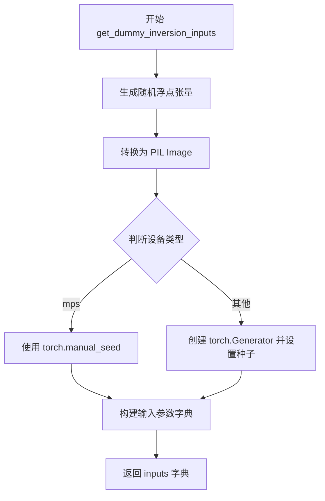

#### 带注释源码

```python
def get_dummy_inversion_inputs(self, device, seed=0):
    """
    生成用于测试 LEdits PP 反演功能的虚拟输入参数。
    
    参数:
        device (str): 目标设备，用于确定生成器的创建方式
        seed (int): 随机种子，默认 0，用于确保测试的可复现性
    
    返回:
        dict: 包含反演所需参数的字典
    """
    # 使用 floats_tensor 生成形状为 (2, 3, 32, 32) 的随机浮点张量
    # 范围在 [0, 1] 之间，使用 random.Random(0) 确保确定性
    images = floats_tensor((2, 3, 32, 32), rng=random.Random(0)).cpu().permute(0, 2, 3, 1)
    
    # 将图像像素值缩放到 [0, 255] 范围
    images = 255 * images
    
    # 从第一张图像数组创建 PIL Image 并转换为 RGB 模式
    image_1 = Image.fromarray(np.uint8(images[0])).convert("RGB")
    
    # 从第二张图像数组创建 PIL Image 并转换为 RGB 模式
    image_2 = Image.fromarray(np.uint8(images[1])).convert("RGB")
    
    # 判断设备是否为 Apple MPS (Metal Performance Shaders)
    if str(device).startswith("mps"):
        # MPS 设备使用 torch.manual_seed 设置种子
        generator = torch.manual_seed(seed)
    else:
        # 其他设备（CPU/CUDA）创建指定设备的 Generator 并设置种子
        generator = torch.Generator(device=device).manual_seed(seed)
    
    # 构建包含所有反演所需参数的字典
    inputs = {
        "image": [image_1, image_2],           # 输入图像列表
        "source_prompt": "",                    # 源提示词（空）
        "source_guidance_scale": 3.5,          # 源图像引导比例
        "num_inversion_steps": 20,              # 反演扩散步数
        "skip": 0.15,                           # 跳过反演步骤的比例
        "generator": generator,                 # 随机数生成器
    }
    
    return inputs
```


### `LEditsPPPipelineStableDiffusionFastTests.test_ledits_pp_inversion`

这是一个单元测试方法，用于测试 LEditsPPPipelineStableDiffusion 管线在单张图像上的反演（inversion）功能。测试验证管线能否正确地将图像反演为潜在表示（latents），并检查反演结果的形状和数值精度是否符合预期。

参数：

-  `self`：`unittest.TestCase`，测试类的实例本身

返回值：无（`None`），此方法为单元测试方法，通过断言验证结果，不返回任何值

#### 流程图

```mermaid
flowchart TD
    A[开始测试] --> B[设置设备为CPU保证确定性]
    B --> C[获取虚拟组件: get_dummy_components]
    C --> D[创建LEditsPPPipelineStableDiffusion管线实例]
    D --> E[将管线移动到torch_device]
    E --> F[设置进度条配置: set_progress_bar_config]
    F --> G[获取反演虚拟输入: get_dummy_inversion_inputs]
    G --> H[提取单张图像: inputs['image'] = inputs['image'][0]]
    H --> I[调用管线反演方法: sd_pipe.invert]
    I --> J{断言init_latents形状}
    J -->|通过| K[提取潜在表示切片]
    K --> L{断言数值精度}
    L -->|通过| M[测试通过]
    J -->|失败| N[抛出AssertionError]
    L -->|失败| N
```

#### 带注释源码

```python
def test_ledits_pp_inversion(self):
    """
    测试 LEditsPPPipelineStableDiffusion 管线在单张图像上的反演功能。
    验证反演后的潜在表示（latents）形状和数值精度是否符合预期。
    """
    # 1. 设置设备为 CPU，确保设备相关的 torch.Generator 的确定性
    device = "cpu"  # ensure determinism for the device-dependent torch.Generator
    
    # 2. 获取虚拟组件（dummy components），用于测试的轻量级模型配置
    components = self.get_dummy_components()
    
    # 3. 使用虚拟组件创建 LEditsPPPipelineStableDiffusion 管线实例
    sd_pipe = LEditsPPPipelineStableDiffusion(**components)
    
    # 4. 将管线移动到指定的计算设备（如 CUDA、CPU 等）
    sd_pipe = sd_pipe.to(torch_device)
    
    # 5. 配置进度条，disable=None 表示不禁用进度条
    sd_pipe.set_progress_bar_config(disable=None)
    
    # 6. 获取反演所需的虚拟输入参数
    inputs = self.get_dummy_inversion_inputs(device)
    
    # 7. 由于此测试只处理单张图像，从图像列表中提取第一张图像
    # 输入包含两张图像的列表，此处只使用第一张
    inputs["image"] = inputs["image"][0]
    
    # 8. 调用管线的 invert 方法执行反演操作
    # 反演是将图像转换为潜在表示的过程，用于后续的编辑操作
    sd_pipe.invert(**inputs)
    
    # 9. 断言：验证反演后初始潜在表示的形状
    # 预期形状：(batch_size=1, channels=4, height, width)
    # 其中 height = width = 32 / vae_scale_factor
    assert sd_pipe.init_latents.shape == (
        1,                              # batch size = 1（单张图像）
        4,                              # 潜在空间通道数
        int(32 / sd_pipe.vae_scale_factor),  # 潜在空间高度
        int(32 / sd_pipe.vae_scale_factor),  # 潜在空间宽度
    )
    
    # 10. 提取潜在表示的切片用于数值验证
    # 取最后一个维度通道的前3x3区域
    latent_slice = sd_pipe.init_latents[0, -1, -3:, -3:].to(device)
    
    # 11. 定义期望的数值切片（通过参考实现预先计算得出）
    expected_slice = np.array([-0.9084, -0.0367, 0.2940, 0.0839, 0.6890, 0.2651, -0.7104, 2.1090, -0.7822])
    
    # 12. 断言：验证反演结果的数值精度
    # 使用最大绝对误差不超过 1e-3 的标准
    assert np.abs(latent_slice.flatten() - expected_slice).max() < 1e-3
```


### `LEditsPPPipelineStableDiffusionFastTests.test_ledits_pp_inversion_batch`

这是一个单元测试方法，用于测试 `LEditsPPPipelineStableDiffusion` 管道在批量模式下的图像反转（inversion）功能。该测试验证批量反转后的初始潜在变量形状是否符合预期，并检查关键 latent 值的正确性。

参数：
- 该方法无显式参数（使用 `self` 访问类属性）

返回值：`None`，通过 `assert` 语句进行验证

#### 流程图

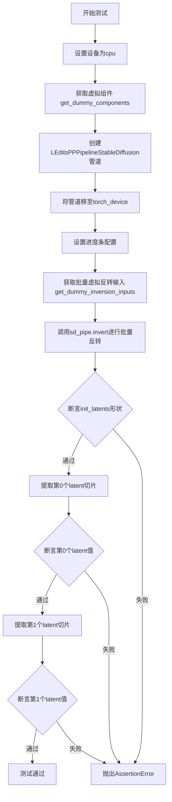

#### 带注释源码

```python
def test_ledits_pp_inversion_batch(self):
    """
    测试 LEditsPPPipelineStableDiffusion 管道在批量模式下的图像反转功能。
    验证批量反转后的 latent 形状和关键值是否符合预期。
    """
    # 1. 设置设备为 cpu，确保 torch.Generator 的确定性
    device = "cpu"  # ensure determinism for the device-dependent torch.Generator
    
    # 2. 获取虚拟组件（UNet、VAE、scheduler、text_encoder、tokenizer 等）
    components = self.get_dummy_components()
    
    # 3. 使用虚拟组件创建 LEditsPPPipelineStableDiffusion 管道实例
    sd_pipe = LEditsPPPipelineStableDiffusion(**components)
    
    # 4. 将管道移至指定的计算设备（torch_device）
    sd_pipe = sd_pipe.to(torch_device)
    
    # 5. 配置进度条（disable=None 表示启用进度条）
    sd_pipe.set_progress_bar_config(disable=None)

    # 6. 获取批量反转的虚拟输入（包含2张图像）
    inputs = self.get_dummy_inversion_inputs(device)
    
    # 7. 调用管道的 invert 方法执行批量图像反转
    # 反转过程会将图像转换为初始 latent 表示
    sd_pipe.invert(**inputs)
    
    # 8. 断言批量反转后的 latent 形状
    # 形状应为 (batch_size=2, channels=4, height, width)
    # 其中 height = 32 / vae_scale_factor, width = 32 / vae_scale_factor
    assert sd_pipe.init_latents.shape == (
        2,  # batch_size: 2张图像
        4,  # latent channels: 4
        int(32 / sd_pipe.vae_scale_factor),  # latent高度
        int(32 / sd_pipe.vae_scale_factor),  # latent宽度
    )

    # 9. 提取第一个图像（batch index=0）的最后一个通道的右下角 3x3 区域
    latent_slice = sd_pipe.init_latents[0, -1, -3:, -3:].to(device)

    # 10. 定义第一个图像的预期 latent 值切片
    expected_slice = np.array([0.2528, 0.1458, -0.2166, 0.4565, -0.5657, -1.0286, -0.9961, 0.5933, 1.1173])
    
    # 11. 断言第一个图像的 latent 值与预期值的最大误差小于 1e-3
    assert np.abs(latent_slice.flatten() - expected_slice).max() < 1e-3

    # 12. 提取第二个图像（batch index=1）的最后一个通道的右下角 3x3 区域
    latent_slice = sd_pipe.init_latents[1, -1, -3:, -3:].to(device)

    # 13. 定义第二个图像的预期 latent 值切片
    expected_slice = np.array([-0.0796, 2.0583, 0.5501, 0.5358, 0.0282, -0.2803, -1.0470, 0.7023, -0.0072])
    
    # 14. 断言第二个图像的 latent 值与预期值的最大误差小于 1e-3
    assert np.abs(latent_slice.flatten() - expected_slice).max() < 1e-3
```


### `LEDitsPPPipelineStableDiffusionFastTests.test_ledits_pp_warmup_steps`

这是一个单元测试方法，用于测试 LEditsPPPipelineStableDiffusion 管道在不同编辑预热步骤（edit_warmup_steps）配置下的功能正确性。该测试通过设置不同的 warmup 步骤值（如 [0,5]、[5,0]、[5,10]、[10,5]）来验证管道能否正确处理各种预热参数组合，并成功生成图像。

参数：

- `self`：`LEDitsPPPipelineStableDiffusionFastTests`，测试类实例本身，包含测试所需的组件和辅助方法

返回值：`None`，该方法为测试方法，不返回任何值，通过断言验证功能正确性

#### 流程图

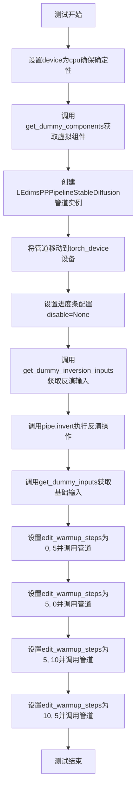

#### 带注释源码

```python
def test_ledits_pp_warmup_steps(self):
    """
    测试 LEditsPPPipelineStableDiffusion 在不同 edit_warmup_steps 配置下的功能。
    
    该测试验证管道能够正确处理各种预热步骤组合：
    - [0, 5]: 第一个概念无预热，第二个概念5步预热
    - [5, 0]: 第一个概念5步预热，第二个概念无预热
    - [5, 10]: 第一个概念5步预热，第二个概念10步预热
    - [10, 5]: 第一个概念10步预热，第二个概念5步预热
    """
    # 设置设备为cpu以确保torch.Generator的确定性
    device = "cpu"  # ensure determinism for the device-dependent torch.Generator
    
    # 获取用于测试的虚拟（dummy）组件
    # 包含：UNet、调度器、VAE、文本编码器、分词器等
    components = self.get_dummy_components()
    
    # 使用虚拟组件创建LEdimsPP管道实例
    pipe = LEditsPPPipelineStableDiffusion(**components)
    
    # 将管道移至目标设备（如cuda或mps）
    pipe = pipe.to(torch_device)
    
    # 配置进度条，disable=None表示不禁用进度条
    pipe.set_progress_bar_config(disable=None)
    
    # 获取反演所需的输入参数
    # 包含：image, source_prompt, source_guidance_scale, 
    # num_inversion_steps, skip, generator
    inversion_inputs = self.get_dummy_inversion_inputs(device)
    
    # 执行反演操作，建立从图像到潜在空间的映射
    # 这是编辑流程的前置步骤
    pipe.invert(**inversion_inputs)
    
    # 获取编辑所需的输入参数
    # 包含：generator, editing_prompt, reverse_editing_direction, edit_guidance_scale
    inputs = self.get_dummy_inputs(device)
    
    # 测试场景1：第一个概念无预热步骤，第二个概念5步预热
    inputs["edit_warmup_steps"] = [0, 5]
    # 调用管道执行编辑，访问返回的图像
    pipe(**inputs).images
    
    # 测试场景2：第一个概念5步预热，第二个概念无预热
    inputs["edit_warmup_steps"] = [5, 0]
    pipe(**inputs).images
    
    # 测试场景3：第一个概念5步预热，第二个概念10步预热
    inputs["edit_warmup_steps"] = [5, 10]
    pipe(**inputs).images
    
    # 测试场景4：第一个概念10步预热，第二个概念5步预热
    inputs["edit_warmup_steps"] = [10, 5]
    pipe(**inputs).images
    
    # 测试完成，所有场景均成功执行即表示通过
```


### `LEditsPPPipelineStableDiffusionSlowTests.setUpClass`

该方法是测试类的类方法（@classmethod），在所有测试方法运行前执行一次，用于加载测试所需的原始图像（猫咪图片），并将其转换为RGB格式且调整大小为512x512像素，然后存储为类属性供后续测试使用。

参数：

- `cls`：`LEditsPPPipelineStableDiffusionSlowTests`，类对象本身，代表当前测试类

返回值：`None`，无返回值（方法通过修改类属性 `cls.raw_image` 来存储结果）

#### 流程图

```mermaid
flowchart TD
    A[setUpClass 开始] --> B[调用 load_image 函数加载远程图片]
    B --> C[调用 convert('RGB') 转换为 RGB 模式]
    C --> D[调用 resize((512, 512)) 调整图像大小为 512x512]
    D --> E[将处理后的图像赋值给类属性 cls.raw_image]
    E --> F[setUpClass 结束]
```

#### 带注释源码

```python
@classmethod
def setUpClass(cls):
    """
    类方法，在测试类初始化时调用一次。
    用于加载测试所需的原始图像并设置为类属性。
    """
    # 使用 testing_utils 中的 load_image 函数从 URL 加载图像
    raw_image = load_image(
        "https://huggingface.co/datasets/hf-internal-testing/diffusers-images/resolve/main/pix2pix/cat_6.png"
    )
    
    # 将图像转换为 RGB 模式（确保通道顺序为 RGB）
    # 然后调整大小为 512x512 像素
    raw_image = raw_image.convert("RGB").resize((512, 512))
    
    # 将处理后的图像存储为类属性，供测试方法使用
    cls.raw_image = raw_image
```


### `LEDitsPPPipelineStableDiffusionSlowTests.setUp`

该方法是测试类的初始化方法，在每个测试用例执行前被调用，用于清理GPU内存和缓存，确保测试环境的干净状态，避免因之前的测试残留导致的内存问题。

参数：

- `self`：`unittest.TestCase`，测试用例实例本身

返回值：`None`，无返回值（setUp 方法不返回任何值）

#### 流程图

```mermaid
flowchart TD
    A[开始 setUp] --> B[调用 super().setUp]
    B --> C[执行 gc.collect 垃圾回收]
    C --> D[调用 backend_empty_cache 清理GPU缓存]
    D --> E[结束 setUp]
```

#### 带注释源码

```python
def setUp(self):
    """
    测试用例初始化方法，在每个测试方法运行前调用。
    负责清理GPU内存和缓存，确保测试环境干净。
    """
    # 调用父类的 setUp 方法，执行 unittest.TestCase 的标准初始化
    super().setUp()
    
    # 手动触发 Python 的垃圾回收，释放不再使用的对象内存
    gc.collect()
    
    # 清理 GPU/CUDA 缓存，释放显存资源
    # torch_device 是全局变量，表示当前测试使用的设备（如 'cuda' 或 'cpu'）
    backend_empty_cache(torch_device)
```


### `LEditsPPPipelineStableDiffusionSlowTests.tearDown`

清理测试资源的方法，在每个测试用例执行完毕后被调用，用于执行垃圾回收和清空GPU缓存，以确保测试环境不会因为残留数据而影响后续测试。

参数：

-  `self`：`unittest.TestCase`，测试类的实例对象，隐式参数无需手动传递

返回值：`None`，无返回值

#### 流程图

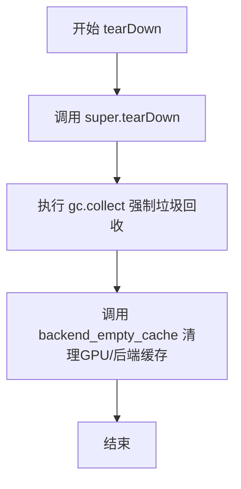

#### 带注释源码

```python
def tearDown(self):
    """
    测试用例清理方法，在每个测试方法执行完毕后自动调用。
    用于释放测试过程中产生的内存和GPU资源。
    """
    # 调用父类的 tearDown 方法，完成 unittest 框架的标准清理工作
    super().tearDown()
    
    # 执行 Python 垃圾回收，释放测试过程中产生的不可达对象
    gc.collect()
    
    # 调用后端工具函数清理 GPU 显存/缓存
    # torch_device 是全局变量，指定了当前使用的计算设备
    backend_empty_cache(torch_device)
```


### `LEDitsPPPipelineStableDiffusionSlowTests.test_ledits_pp_editing`

这是一个集成测试方法，用于测试 LEditsPPPipelineStableDiffusion 管道在编辑图像任务上的功能。它首先加载预训练的 Stable Diffusion v1.5 模型，然后对输入图像进行反演（inversion），最后使用编辑提示和引导尺度对图像进行重建，并验证重建结果的正确性。

参数：

- `self`：当前测试类实例，无需显式传递

返回值：`None`，该方法为测试方法，无返回值，通过断言验证功能正确性

#### 流程图

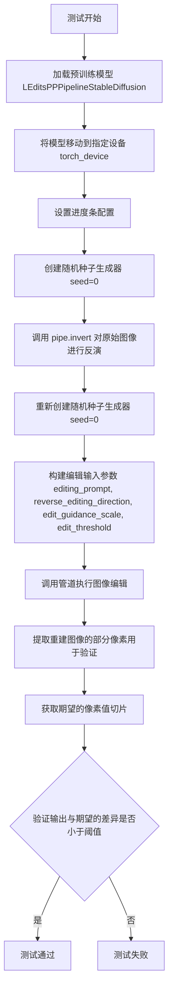

#### 带注释源码

```python
def test_ledits_pp_editing(self):
    # 从预训练模型加载 LEditsPPPipelineStableDiffusion 管道
    # 使用 stable-diffusion-v1-5 模型权重，不加载 safety_checker，使用 float16 精度
    pipe = LEditsPPPipelineStableDiffusion.from_pretrained(
        "stable-diffusion-v1-5/stable-diffusion-v1-5", safety_checker=None, torch_dtype=torch.float16
    )
    # 将管道移动到指定设备（GPU/CPU等）
    pipe = pipe.to(torch_device)
    # 设置进度条配置，disable=None 表示不禁用进度条
    pipe.set_progress_bar_config(disable=None)

    # 创建随机种子生成器，用于后续的扩散过程
    generator = torch.manual_seed(0)
    # 对原始图像进行反演（inversion），获取初始潜在向量
    # 这是 LEdits++ 编辑流程的第一步
    _ = pipe.invert(image=self.raw_image, generator=generator)
    
    # 重新创建相同种子的生成器，确保可重复性
    generator = torch.manual_seed(0)
    
    # 构建编辑输入参数字典
    inputs = {
        "generator": generator,                      # 随机生成器
        "editing_prompt": ["cat", "dog"],           # 编辑提示词（将猫编辑为狗）
        "reverse_editing_direction": [True, False], # 编辑方向（第一个提示词反向，第二个正向）
        "edit_guidance_scale": [5.0, 5.0],         # 编辑引导尺度
        "edit_threshold": [0.8, 0.8],              # 编辑阈值
    }
    
    # 执行图像编辑，返回 numpy 格式的图像
    # **inputs 解包字典作为关键字参数
    reconstruction = pipe(**inputs, output_type="np").images[0]

    # 从重建图像中提取特定区域的像素值用于验证
    # 提取 150:153 行、140:143 列的像素，最后一个通道（通常是红色通道）
    output_slice = reconstruction[150:153, 140:143, -1]
    # 将 2D 像素数组展平为 1D 向量
    output_slice = output_slice.flatten()
    
    # 创建期望值对象，包含不同设备（xpu, cuda）的预期输出
    expected_slices = Expectations(
        {
            # XPU 设备（第三版本）的期望像素值
            ("xpu", 3): np.array(
                [
                    0.9511719,
                    0.94140625,
                    0.87597656,
                    0.9472656,
                    0.9296875,
                    0.8378906,
                    0.94433594,
                    0.91503906,
                    0.8491211,
                ]
            ),
            # CUDA 设备（第七版本）的期望像素值
            ("cuda", 7): np.array(
                [
                    0.9453125,
                    0.93310547,
                    0.84521484,
                    0.94628906,
                    0.9111328,
                    0.80859375,
                    0.93847656,
                    0.9042969,
                    0.8144531,
                ]
            ),
        }
    )
    
    # 根据当前运行环境获取对应的期望值
    expected_slice = expected_slices.get_expectation()
    
    # 断言：输出与期望的最大差异应小于 1e-2（0.01）
    # 用于验证管道输出的正确性
    assert np.abs(output_slice - expected_slice).max() < 1e-2
```

## 关键组件


### LEditsPPPipelineStableDiffusion 管道核心类

LEdtsPPPipelineStableDiffusion是一个基于Stable Diffusion的图像编辑管道，支持图像反转（inversion）功能，通过学习噪声来重建输入图像，并支持文本引导的图像编辑操作。

### invert 方法（图像反转）

将输入图像编码为潜在表示，通过学习噪声实现图像到潜在空间的反向转换，为后续编辑操作提供初始潜在向量。

### 编辑引导参数（editing_prompt, reverse_editing_direction, edit_guidance_scale）

控制图像编辑的方向、强度和文本提示词，使模型能够根据给定的提示词对图像进行有针对性的修改。

### UNet2DConditionModel（条件U-Net）

扩散模型的骨干网络，接收潜在表示和文本嵌入进行去噪处理，生成编辑后的图像潜在表示。

### AutoencoderKL（变分自编码器）

负责将图像编码到潜在空间以及从潜在空间解码回图像，支持图像的压缩和重建。

### DPMSolverMultistepScheduler（调度器）

实现SDE-DPMSolver++算法的高级调度器，控制扩散模型的去噪步骤和采样过程。

### 测试用例设计（FastTests & SlowTests）

包含单元测试（FastTests）和集成测试（SlowTests），分别用于快速验证核心功能和完整流程的正确性。

### 图像批处理与张量切片

支持批量图像处理，使用numpy和torch进行张量操作，包括维度转换、形状验证和数值比较。


## 问题及建议


### 已知问题

- **测试覆盖不完整**：`test_ledits_pp_warmup_steps` 方法执行了多次推理但缺少断言验证，无法确认 warmup_steps 参数是否正确生效
- **魔法数字和硬编码值**：多处使用硬编码的数值如 `0.15`（skip）、`20`（num_inversion_steps）、`3.5`（source_guidance_scale），缺乏配置常量或参数化支持
- **外部网络依赖**：`test_ledits_pp_editing` 依赖 HuggingFace URL 加载测试图像，网络不稳定时会导致测试失败
- **设备处理不一致**：测试中强制使用 `"cpu"` 设备以保证确定性，但 `torch_device` 在其他地方可能被使用，导致行为不一致
- **资源管理不完整**：FastTests 类缺少 `tearDown` 方法清理 GPU 内存，仅 SlowTests 有 `gc.collect()` 和 `backend_empty_cache` 调用
- **安全检查器处理**：代码中显式设置 `safety_checker=None`，但未测试默认值行为或相关警告
- **批处理与单张处理差异**：`test_ledits_pp_inversion` 仅测试单张图像，未覆盖单张到批处理的边界情况

### 优化建议

- 为 `test_ledits_pp_warmup_steps` 添加断言，验证不同 warmup_steps 配置下的输出差异或中间状态
- 将硬编码的魔法数字提取为类级别常量或测试配置类，提高可维护性
- 考虑使用本地缓存的测试图像或 mock `load_image` 函数，消除外部网络依赖
- 统一设备管理策略，在测试类中定义 `setUp` 方法处理设备初始化和确定性种子
- 为 FastTests 添加 `tearDown` 方法以保持资源管理一致性
- 增加错误处理测试，如无效的 `editing_prompt`、不匹配的 `reverse_editing_direction` 长度等边界情况

## 其它


### 设计目标与约束

本测试文件旨在验证LEditPPPipelineStableDiffusionpipeline的图像编辑功能，包括反演（inversion）、批量处理和warmup步骤的正确性。约束条件包括：1）设备依赖性测试需在CPU上确保确定性，mps设备使用特殊处理；2）slow测试需要实际GPU硬件支持；3）数值精度要求控制在1e-3到1e-2之间。

### 错误处理与异常设计

测试中主要使用assert语句进行验证，包括：1）latent张量形状验证，确保维度为(1/2, 4, 8, 8)；2）数值精度验证，使用np.abs().max() < 1e-3进行阈值比较；3）slow测试中使用Expectations类处理不同设备（xpu/cuda）的预期值差异。对于mps设备有专门的处理逻辑，避免Generator兼容性问题。

### 数据流与状态机

数据流主要分为两条路径：1）反演路径：输入图像→VAE编码→latent空间→保存init_latents；2）编辑路径：init_latents→UNet去噪→VAE解码→输出图像。状态机转换：get_dummy_components()创建组件→get_dummy_inputs()准备参数→调用invert()或直接调用pipeline执行编辑。

### 外部依赖与接口契约

核心依赖包括：1）diffusers库：LEditsPPPipelineStableDiffusion、UNet2DConditionModel、AutoencoderKL、DPMSolverMultistepScheduler；2）transformers库：CLIPTextModel、CLIPTokenizer、CLIPTextConfig；3）PyTorch及numpy、PIL。接口契约：pipeline构造函数接收components字典，invert()方法接受image、source_prompt、source_guidance_scale等参数，__call__方法接受editing_prompt、reverse_editing_direction等编辑控制参数。

### 测试覆盖范围

FastTests覆盖：1）单图反演（test_ledits_pp_inversion）；2）批量反演（test_ledits_pp_inversion_batch）；3）warmup步骤组合（test_ledits_pp_warmup_steps）。SlowTests覆盖：1）完整编辑流程（test_ledits_pp_editing）。覆盖率为pipeline核心功能的正向路径验证，未覆盖错误输入、边界条件、并发调用等场景。

### 性能考量与基准

测试中关注：1）内存管理：使用gc.collect()和backend_empty_cache()清理内存；2）确定性保证：通过enable_full_determinism()和固定随机种子确保可复现性；3）设备兼容性：针对mps设备使用torch.manual_seed替代Generator。slow测试使用float16精度以平衡速度和内存。

### 兼容性考虑

代码考虑了多种平台兼容性：1）CPU设备用于确定性测试；2）mps设备特殊处理（Apple Silicon）；3）cuda/xpu设备支持；4）slow测试标记需要accelerator。Expectations类支持多设备预期值差异处理，体现跨平台兼容性设计。

### 配置参数详解

关键参数包括：1）edit_warmup_steps：控制编辑warmup步数，支持[0,5]、[5,0]等组合；2）edit_guidance_scale：引导强度，当前测试使用5.0和10.0；3）reverse_editing_direction：布尔列表控制编辑方向；4）edit_threshold：编辑阈值，slow测试使用0.8；5）num_inversion_steps：反演步数，测试使用20步；6）skip：跳跃比例，测试使用0.15。

    