# `diffusers\tests\pipelines\ledits_pp\test_ledits_pp_stable_diffusion_xl.py` 详细设计文档

这是LEditPP (Ledits++ ) Stable Diffusion XL模型的测试文件，包含快速单元测试和慢速集成测试，用于验证图像编辑管道的反转、预热和编辑功能。

## 整体流程

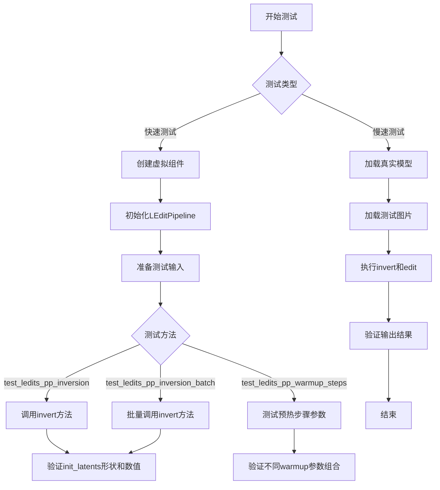

## 类结构

```
unittest.TestCase
├── LEditsPPPipelineStableDiffusionXLFastTests (快速测试类)
│   ├── get_dummy_components()
│   ├── get_dummy_inputs()
│   ├── get_dummy_inversion_inputs()
│   ├── test_ledits_pp_inversion()
│   ├── test_ledits_pp_inversion_batch()
│   └── test_ledits_pp_warmup_steps()
└── LEditsPPPipelineStableDiffusionXLSlowTests (慢速测试类)
    ├── setUpClass()
    └── test_ledits_pp_edit()
```

## 全局变量及字段


### `device`
    
指定运行设备，此处为CPU以确保torch.Generator的确定性

类型：`str`
    


### `components`
    
包含UNet、VAE、文本编码器、图像编码器等SDXL模型组件的字典

类型：`Dict[str, Any]`
    


### `sd_pipe`
    
LEdit Stable Diffusion XL pipelines实例，用于图像编辑和反演

类型：`LEDitsPPPipelineStableDiffusionXL`
    


### `pipe`
    
从预训练模型加载的LEdit Stable Diffusion XL pipelines实例

类型：`LEDitsPPPipelineStableDiffusionXL`
    


### `inputs`
    
包含生成器、编辑提示、反演参数等的输入字典

类型：`Dict[str, Any]`
    


### `latent_slice`
    
从init_latents中提取的潜在表示切片，用于验证反演结果

类型：`np.ndarray`
    


### `expected_slice`
    
期望的潜在表示切片数值，用于单元测试断言

类型：`np.ndarray`
    


### `generator`
    
PyTorch随机数生成器，用于确保扩散过程的可重复性

类型：`torch.Generator`
    


### `reconstruction`
    
编辑后的图像重建结果，以numpy数组形式存储

类型：`np.ndarray`
    


### `output_slice`
    
从重建图像中提取的像素切片，用于验证编辑效果

类型：`np.ndarray`
    


### `LEDitsPPPipelineStableDiffusionXLFastTests.pipeline_class`
    
指定测试类使用的pipeline类为LEdit Stable Diffusion XL

类型：`Type[LEDitsPPPipelineStableDiffusionXL]`
    


### `LEDitsPPPipelineStableDiffusionXLSlowTests.raw_image`
    
从URL加载并调整大小的原始测试图像(512x512)

类型：`PIL.Image.Image`
    
    

## 全局函数及方法


### `enable_full_determinism`

该函数是测试工具函数，用于确保PyTorch、NumPy和Python random模块的随机种子固定，以实现测试的完全确定性和可重复性。

参数：无

返回值：`None`，该函数通过直接修改全局状态来确保确定性，不返回任何值。

#### 流程图

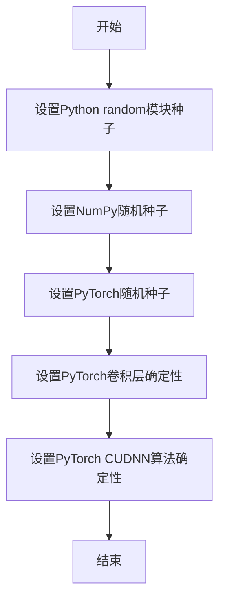

#### 带注释源码

```
# enable_full_determinism 函数源码
# 注意：该函数从 ...testing_utils 模块导入，以下为推断的实现逻辑

def enable_full_determinism(seed: int = 0):
    """
    启用完全确定性，确保测试结果可重复。
    
    参数:
        seed: 随机种子，默认为0
    """
    # 1. 设置Python random模块的全局随机种子
    random.seed(seed)
    
    # 2. 设置NumPy的随机种子
    np.random.seed(seed)
    
    # 3. 设置PyTorch的随机种子
    torch.manual_seed(seed)
    
    # 4. 如果使用CUDA，设置GPU随机种子
    if torch.cuda.is_available():
        torch.cuda.manual_seed(seed)
        torch.cuda.manual_seed_all(seed)
    
    # 5. 强制PyTorch使用确定性算法
    torch.backends.cudnn.deterministic = True
    torch.backends.cudnn.benchmark = False
    
    # 6. 设置环境变量确保完全确定性
    import os
    os.environ['CUBLAS_WORKSPACE_CONFIG'] = ':4096:8'
```

#### 说明

由于该函数是外部导入的测试工具，源码为基于函数名称和用途的推断实现。该函数的核心作用是在测试开始前固定所有随机因素，确保测试结果在每次运行时完全一致，这对于调试和持续集成环境非常重要。


### `skip_mps`

该函数是一个测试装饰器，用于跳过在 MPS (Metal Performance Shaders) 设备上运行的测试用例，通常用于 Apple Silicon GPU 环境。

参数：

- 无

返回值：`Callable`，返回装饰后的测试函数或类

#### 流程图

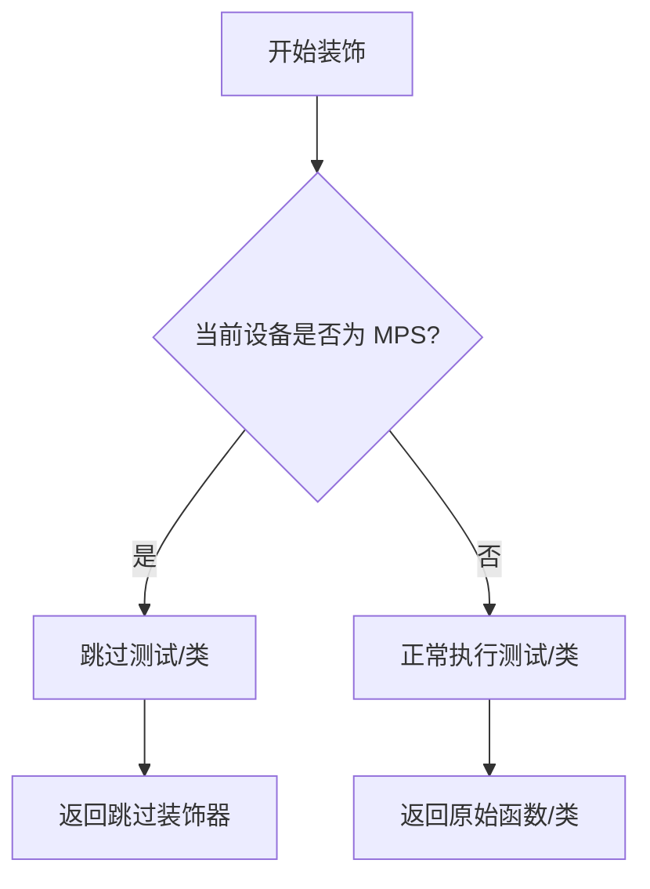

#### 带注释源码

```python
# 这是一个从 testing_utils 导入的装饰器函数
# 用于在 MPS (Apple Metal Performance Shaders) 设备上跳过测试
# 源代码未在当前文件中提供，需要查看 testing_utils 模块

# 使用示例：
@skip_mps  # 装饰器应用于测试类
class LEditsPPPipelineStableDiffusionXLFastTests(unittest.TestCase):
    # 当在 MPS 设备上运行时，整个类的测试将被跳过
    pass
```


### `slow`

`slow` 是一个装饰器，用于标记测试为慢速测试。在测试框架中，这类测试通常在常规测试运行中被跳过，仅在需要显式运行慢速测试时执行（例如通过设置环境变量或特定标志）。

参数：

- `func`：任意可调用对象（通常是类或函数），被 `slow` 装饰器包装。
  - 类型：`Callable`
  - 描述：被标记为慢速的类或函数。

返回值：
- 类型：`Callable`
- 描述：返回装饰后的对象，通常是一个跳过测试的函数（如果测试环境不运行慢速测试）。

#### 流程图

由于 `slow` 函数的实现细节未在给定代码中提供，无法直接生成其内部的 Mermaid 流程图。通常，`slow` 装饰器的逻辑可能如下：

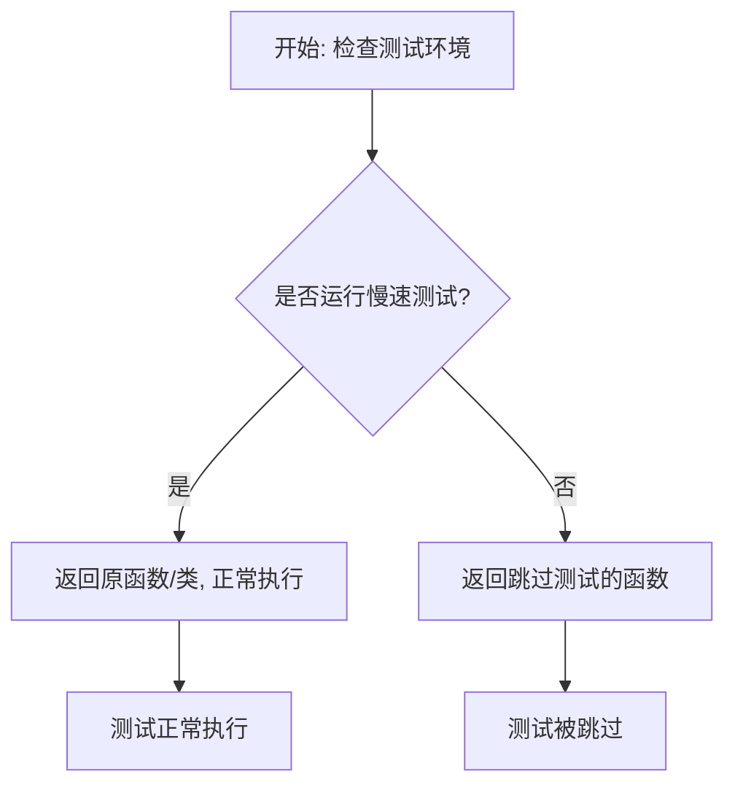

#### 带注释源码

`slow` 函数的源码未在当前代码块中定义，它是从 `...testing_utils` 模块导入的。以下是其在代码中的典型使用方式（基于常见实现推测）：

```python
# 假设 slow 的实现可能类似于:
def slow(func):
    """
    装饰器: 标记测试为慢速测试。
    如果环境变量未设置运行慢速测试, 则跳过该测试。
    """
    import unittest
    import os

    # 检查是否设置了运行慢速测试的环境变量
    run_slow = os.getenv("RUN_SLOW", False)
    
    # 如果不运行慢速测试, 则跳过该测试
    if not run_slow:
        return unittest.skip("Skipping slow test")(func)
    
    # 否则, 返回原函数
    return func

# 在代码中的使用:
@slow
@require_torch_accelerator
class LEditsPPPipelineStableDiffusionXLSlowTests(unittest.TestCase):
    # 测试类内容
    pass
```

**注意**: 实际的 `slow` 函数定义未在给定代码中提供，以上源码为基于常见模式的推测。具体实现需参考 `diffusers` 库的 `testing_utils` 模块。


### `require_torch_accelerator`

这是一个装饰器函数，用于标记测试用例需要 PyTorch 加速器（如 CUDA GPU）才能运行。如果当前环境没有可用的加速器，被装饰的测试将被跳过。

参数：此函数不接受直接参数，而是作为装饰器使用，通过其配置行为来控制测试执行。

返回值：无返回值，作为装饰器使用。

#### 流程图

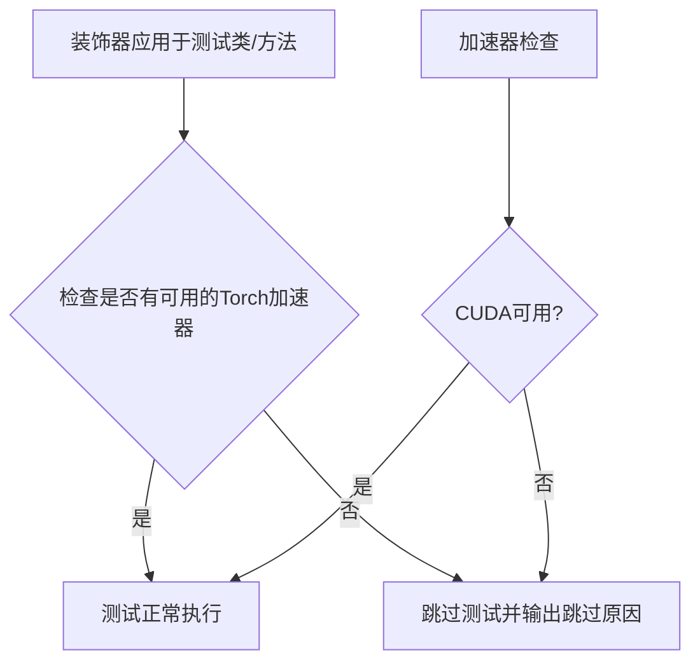

#### 带注释源码

```python
# require_torch_accelerator 是从 diffusers.testing_utils 模块导入的装饰器
# 由于源代码未在此文件中提供，我们根据其使用方式推断其行为：

# 导入语句：
from ...testing_utils import (
    enable_full_determinism,
    floats_tensor,
    load_image,
    require_torch_accelerator,  # <-- 装饰器导入
    skip_mps,
    slow,
    torch_device,
)

# 使用方式 1：应用于测试类
@require_torch_accelerator  # <-- 类级别装饰器
class LEditsPPPipelineStableDiffusionXLSlowTests(unittest.TestCase):
    """
    装饰器功能说明：
    1. 检测当前环境是否有可用的 PyTorch 加速器（CUDA/MPS等）
    2. 如果有加速器，测试正常执行
    3. 如果没有加速器，测试会被跳过（skip），不会失败
    4. 通常与 @slow 装饰器一起使用，标记需要 GPU 的慢速测试
    """
    
    @classmethod
    def setUpClass(cls):
        # 类的其他方法...
        pass
    
    def test_ledits_pp_edit(self):
        # 测试实现...
        pass

# 可能的装饰器内部实现逻辑（推断）：
"""
def require_torch_accelerator(fn):
    '''
    检查是否有可用的 Torch 加速器设备。
    如果没有 GPU，测试将被跳过。
    '''
    def wrapper(*args, **kwargs):
        if not torch.cuda.is_available() and not torch.backends.mps.is_available():
            raise unittest.SkipTest("Test requires a Torch accelerator (CUDA/MPS)")
        return fn(*args, **kwargs)
    return wrapper
"""
```


### `floats_tensor`

该函数是一个测试工具函数，用于生成指定形状的随机浮点数张量，通常用于单元测试中生成模拟数据。在代码中，它被 `get_dummy_inversion_inputs` 方法调用，用于生成随机的图像张量数据。

参数：

-  `shape`：`Tuple[int, ...]`，表示生成张量的形状，例如代码中传入的 `(2, 3, 32, 2)` 表示生成 2 个样本、3 通道、32x32 大小的张量
-  `rng`：`random.Random`，可选参数，用于生成随机数的随机数生成器对象，默认为 `None`

返回值：`torch.Tensor`，返回一个指定形状的 PyTorch 浮点数张量，张量中的值通常在 [0, 1] 范围内

#### 流程图

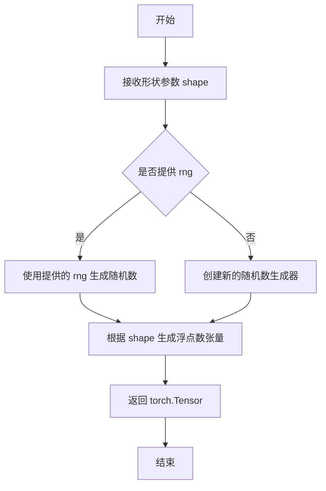

#### 带注释源码

```
# 注意：由于该函数定义在 testing_utils 模块中，以下为基于代码使用方式的推断源码

def floats_tensor(shape: Tuple[int, ...], rng: Optional[random.Random] = None) -> torch.Tensor:
    """
    生成指定形状的随机浮点数张量。
    
    参数:
        shape: 张量的形状，例如 (2, 3, 32, 32) 表示 2 个样本、3 通道、32x32 像素
        rng: 随机数生成器对象，用于生成可重复的随机数序列
        
    返回:
        浮点数类型的 PyTorch 张量，值通常在 [0, 1] 范围内
    """
    if rng is not None:
        # 使用提供的随机数生成器生成随机数据
        # 通常通过 numpy 或 torch 的随机函数实现
        pass
    else:
        # 使用默认的随机数生成器
        pass
    
    # 生成指定形状的张量并返回
    return torch.rand(shape)
```

#### 使用示例

在代码中的实际调用方式：

```python
# 从 testing_utils 导入 floats_tensor
from ...testing_utils import floats_tensor

# 在 get_dummy_inversion_inputs 方法中使用
images = floats_tensor((2, 3, 32, 32), rng=random.Random(0)).cpu().permute(0, 2, 3, 1)
images = 255 * images  # 将 [0,1] 范围内的值转换为 [0,255]
image_1 = Image.fromarray(np.uint8(images[0])).convert("RGB")
image_2 = Image.fromarray(np.uint8(images[1])).convert("RGB")
```


### `load_image`

该函数是diffusers测试工具模块提供的图像加载工具，用于从本地路径或URL加载图像，并返回PIL Image对象供测试使用。

参数：

- `url_or_path`：`str`，图像的URL地址或本地文件路径

返回值：`PIL.Image.Image`，返回PIL图像对象，通常是PngImageFile或类似的PIL图像类型

#### 流程图

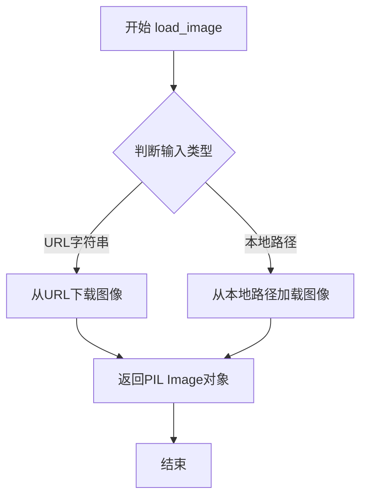

#### 带注释源码

```python
# load_image 函数定义在 diffusers 库的 testing_utils 模块中
# 以下是基于代码使用方式的推断实现

def load_image(url_or_path: str) -> "PIL.Image.Image":
    """
    从URL或本地路径加载图像。
    
    参数:
        url_or_path: 图像的URL地址或本地文件路径
        
    返回:
        PIL图像对象
    """
    # 尝试判断是URL还是本地路径
    if url_or_path.startswith("http://") or url_or_path.startswith("https://"):
        # 从URL加载图像
        image = Image.open(requests.get(url_or_path, stream=True).raw)
    else:
        # 从本地路径加载图像
        image = Image.open(url_or_path)
    
    # 转换为RGB模式（如果需要）
    # image = image.convert("RGB")
    
    return image
```

> **注意**：由于 `load_image` 函数是从外部模块 `...testing_utils` 导入的，其完整源代码不在本文件范围内。上述源码是基于该函数在代码中的典型使用方式推断得出的。该函数在测试中被用于加载远程图像资源：
>
> ```python
> raw_image = load_image(
>     "https://huggingface.co/datasets/hf-internal-testing/diffusers-images/resolve/main/pix2pix/cat_6.png"
> )
> raw_image = raw_image.convert("RGB").resize((512, 512))
> ```


### `torch_device`

`torch_device` 是从 `diffusers` 测试工具模块 (`testing_utils`) 导入的一个全局函数/变量，用于获取当前可用的 PyTorch 计算设备（通常是 "cuda"、"cpu" 或 "mps"）。

#### 参数

无参数。

#### 流程图

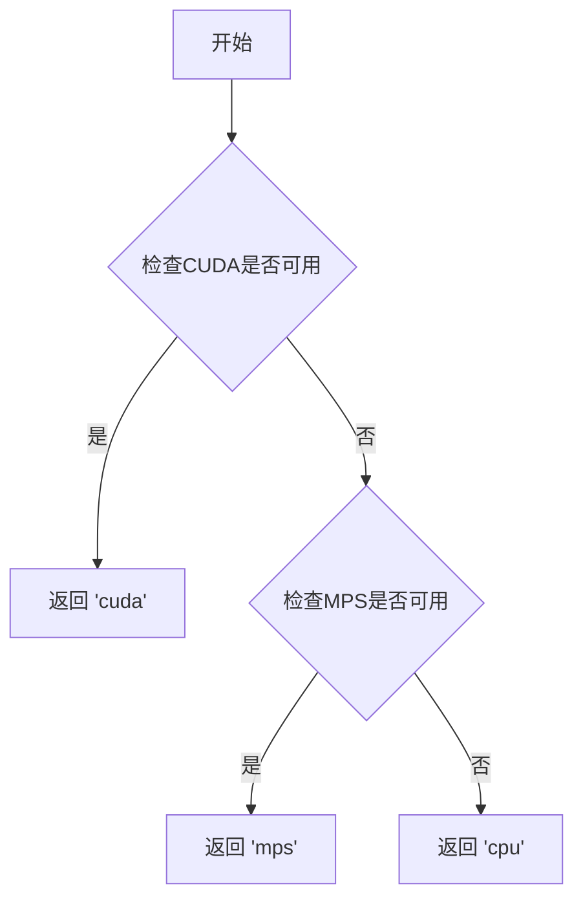

#### 带注释源码

```python
# torch_device 是从 testing_utils 模块导入的全局变量/函数
# 在本文件中通过 from ...testing_utils import ... 导入
# 源码位于 testing_utils.py 中，逻辑类似于：

def get_torch_device():
    """
    获取可用的 PyTorch 设备。
    
    优先级: cuda > mps > cpu
    """
    if torch.cuda.is_available():
        return "cuda"
    elif torch.backends.mps.is_available():  # Apple Silicon
        return "mps"
    else:
        return "cpu"

# 在代码中的使用示例：
sd_pipe = sd_pipe.to(torch_device)  # 将模型移动到指定设备
pipe = pipe.to(torch_device)         # 将模型移动到指定设备
```

#### 说明

由于 `torch_device` 定义在外部模块 `testing_utils.py` 中而非当前文件，因此无法直接获取其完整源码。从代码中的使用方式（`sd_pipe.to(torch_device)`）可以推断，它返回一个字符串类型的设备标识符，用于将模型和张量移动到指定的计算设备上。该函数的主要目的是自动检测并返回最合适的设备（优先 CUDA，其次 MPS，最后 CPU），以便测试代码能够在不同的硬件环境下正常运行。


### `LEditsPPPipelineStableDiffusionXLFastTests.get_dummy_components`

该方法用于创建 Stable Diffusion XL 模型的虚拟（dummy）组件集合，包括 UNet、VAE、文本编码器、图像编码器等，用于单元测试目的。通过接受可选参数控制是否跳过第一个文本编码器以及时间条件投影维度，生成可配置的测试组件字典。

参数：

- `skip_first_text_encoder`：`bool`，可选参数（默认值为 `False`），控制是否在返回的组件中包含第一个文本编码器（当为 `True` 时，text_encoder 和 tokenizer 将被设为 `None`）
- `time_cond_proj_dim`：`int`，可选参数（默认值为 `None`），用于指定 UNet 模型的时间条件投影维度

返回值：`dict`，返回一个包含以下键的字典：
- `unet`：UNet2DConditionModel 实例
- `scheduler`：DPMSolverMultistepScheduler 实例
- `vae`：AutoencoderKL 实例
- `text_encoder`：CLIPTextModel 实例（当 skip_first_text_encoder 为 True 时为 None）
- `tokenizer`：CLIPTokenizer 实例（当 skip_first_text_encoder 为 True 时为 None）
- `text_encoder_2`：CLIPTextModelWithProjection 实例
- `tokenizer_2`：CLIPTokenizer 实例
- `image_encoder`：CLIPVisionModelWithProjection 实例
- `feature_extractor`：CLIPImageProcessor 实例

#### 流程图

```mermaid
flowchart TD
    A[开始 get_dummy_components] --> B[设置随机种子 torch.manual_seed(0)]
    B --> C[创建 UNet2DConditionModel]
    C --> D[创建 DPMSolverMultistepScheduler]
    D --> E[设置随机种子 torch.manual_seed(0)]
    E --> F[创建 AutoencoderKL VAE]
    F --> G[设置随机种子 torch.manual_seed(0)]
    G --> H[创建 CLIPVisionConfig 和 CLIPVisionModelWithProjection]
    H --> I[创建 CLIPImageProcessor]
    I --> J[设置随机种子 torch.manual_seed(0)]
    J --> K[创建 CLIPTextConfig 和 CLIPTextModel]
    K --> L[创建 CLIPTokenizer]
    L --> M[创建 CLIPTextModelWithProjection 和第二个 CLIPTokenizer]
    M --> N{skip_first_text_encoder?}
    N -->|True| O[text_encoder 和 tokenizer 设为 None]
    N -->|False| P[保留 text_encoder 和 tokenizer]
    O --> Q[构建 components 字典]
    P --> Q
    Q --> R[返回 components 字典]
```

#### 带注释源码

```python
def get_dummy_components(self, skip_first_text_encoder=False, time_cond_proj_dim=None):
    """
    创建用于测试的虚拟组件
    
    参数:
        skip_first_text_encoder: bool, 是否跳过第一个文本编码器
        time_cond_proj_dim: int, UNet的时间条件投影维度
    
    返回:
        dict: 包含所有虚拟组件的字典
    """
    # 设置随机种子以确保可重复性
    torch.manual_seed(0)
    
    # 创建 UNet2DConditionModel - 用于去噪的UNet模型
    unet = UNet2DConditionModel(
        block_out_channels=(32, 64),          # 输出通道数
        layers_per_block=2,                    # 每层块数
        sample_size=32,                       # 样本大小
        in_channels=4,                        # 输入通道数（latent空间）
        out_channels=4,                       # 输出通道数
        time_cond_proj_dim=time_cond_proj_dim, # 时间条件投影维度
        down_block_types=("DownBlock2D", "CrossAttnDownBlock2D"),  # 下采样块类型
        up_block_types=("CrossAttnUpBlock2D", "UpBlock2D"),       # 上采样块类型
        # SD2-specific config below
        attention_head_dim=(2, 4),            # 注意力头维度
        use_linear_projection=True,           # 使用线性投影
        addition_embed_type="text_time",      # 添加嵌入类型
        addition_time_embed_dim=8,            # 时间嵌入维度
        transformer_layers_per_block=(1, 2),  # Transformer层数
        projection_class_embeddings_input_dim=80,  # 投影类嵌入输入维度
        cross_attention_dim=64 if not skip_first_text_encoder else 32,  # 交叉注意力维度
    )
    
    # 创建 DPMSolverMultistepScheduler - 调度器
    scheduler = DPMSolverMultistepScheduler(
        algorithm_type="sde-dpmsolver++",  # 算法类型
        solver_order=2                      # 求解器阶数
    )
    
    # 重新设置随机种子
    torch.manual_seed(0)
    
    # 创建 AutoencoderKL - VAE变分自编码器
    vae = AutoencoderKL(
        block_out_channels=[32, 64],        # 输出通道数
        in_channels=3,                      # 输入通道数（RGB图像）
        out_channels=3,                     # 输出通道数
        down_block_types=["DownEncoderBlock2D", "DownEncoderBlock2D"],  # 下采样块
        up_block_types=["UpDecoderBlock2D", "UpDecoderBlock2D"],        # 上采样块
        latent_channels=4,                  # 潜在空间通道数
        sample_size=128,                    # 样本大小
    )
    
    # 重新设置随机种子
    torch.manual_seed(0)
    
    # 创建 CLIPVisionConfig - 图像编码器配置
    image_encoder_config = CLIPVisionConfig(
        hidden_size=32,                     # 隐藏层大小
        image_size=224,                     # 图像尺寸
        projection_dim=32,                  # 投影维度
        intermediate_size=37,                # 中间层大小
        num_attention_heads=4,              # 注意力头数
        num_channels=3,                     # 通道数
        num_hidden_layers=5,                # 隐藏层数
        patch_size=14,                      # 补丁大小
    )
    
    # 创建 CLIPVisionModelWithProjection - 图像编码器
    image_encoder = CLIPVisionModelWithProjection(image_encoder_config)

    # 创建 CLIPImageProcessor - 图像预处理器
    feature_extractor = CLIPImageProcessor(
        crop_size=224,                      # 裁剪尺寸
        do_center_crop=True,                # 是否中心裁剪
        do_normalize=True,                  # 是否归一化
        do_resize=True,                      # 是否调整大小
        image_mean=[0.48145466, 0.4578275, 0.40821073],   # 图像均值
        image_std=[0.26862954, 0.26130258, 0.27577711],   # 图像标准差
        resample=3,                          # 重采样方式
        size=224,                            # 尺寸
    )

    # 重新设置随机种子
    torch.manual_seed(0)
    
    # 创建 CLIPTextConfig - 文本编码器配置
    text_encoder_config = CLIPTextConfig(
        bos_token_id=0,                      # 起始符ID
        eos_token_id=2,                      # 结束符ID
        hidden_size=32,                      # 隐藏层大小
        intermediate_size=37,                # 中间层大小
        layer_norm_eps=1e-05,                # LayerNorm epsilon
        num_attention_heads=4,               # 注意力头数
        num_hidden_layers=5,                # 隐藏层数
        pad_token_id=1,                      # 填充符ID
        vocab_size=1000,                     # 词汇表大小
        # SD2-specific config below
        hidden_act="gelu",                   # 激活函数
        projection_dim=32,                   # 投影维度
    )
    
    # 创建 CLIPTextModel - 第一个文本编码器
    text_encoder = CLIPTextModel(text_encoder_config)
    
    # 创建 CLIPTokenizer - 第一个分词器
    tokenizer = CLIPTokenizer.from_pretrained("hf-internal-testing/tiny-random-clip")

    # 创建 CLIPTextModelWithProjection - 第二个文本编码器（带投影）
    text_encoder_2 = CLIPTextModelWithProjection(text_encoder_config)
    
    # 创建第二个分词器
    tokenizer_2 = CLIPTokenizer.from_pretrained("hf-internal-testing/tiny-random-clip")

    # 组装所有组件到字典中
    components = {
        "unet": unet,
        "scheduler": scheduler,
        "vae": vae,
        # 根据skip_first_text_encoder决定是否包含第一个文本编码器
        "text_encoder": text_encoder if not skip_first_text_encoder else None,
        "tokenizer": tokenizer if not skip_first_text_encoder else None,
        "text_encoder_2": text_encoder_2,
        "tokenizer_2": tokenizer_2,
        "image_encoder": image_encoder,
        "feature_extractor": feature_extractor,
    }
    
    return components
```


### `LEdtsPPPipelineStableDiffusionXLFastTests.get_dummy_inputs`

该方法用于生成 LEditsPP Pipeline（潜在编辑流水线）的虚拟测试输入数据，封装了生成器配置、编辑提示、反向编辑方向和编辑引导比例等关键参数，为后续的图像编辑测试提供标准化的输入结构。

参数：

- `self`：`LEdtsPPPipelineStableDiffusionXLFastTests`，测试类实例自身
- `device`：`str`，计算设备标识符（如 "cpu"、"cuda" 等），用于创建对应的随机数生成器
- `seed`：`int`，随机种子，默认为 0，用于确保测试的可重复性

返回值：`Dict[str, Any]`，返回包含虚拟输入参数的字典，包括生成器对象、编辑提示列表、反向编辑方向列表和编辑引导比例列表

#### 流程图

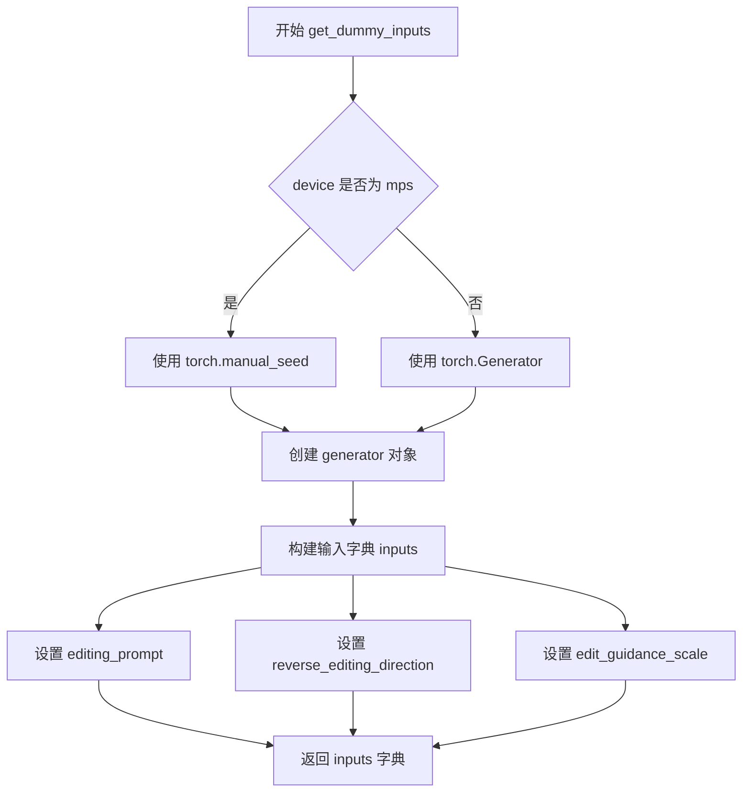

#### 带注释源码

```python
def get_dummy_inputs(self, device, seed=0):
    """
    生成用于 LEditsPP 流水线测试的虚拟输入参数
    
    参数:
        device: str, 计算设备标识符（如 'cpu', 'cuda' 等）
        seed: int, 随机种子，用于确保测试结果的可重复性，默认值为 0
    
    返回:
        dict: 包含测试所需参数的字典
            - generator: torch.Generator, 随机数生成器对象
            - editing_prompt: list, 编辑提示列表
            - reverse_editing_direction: list, 反向编辑方向标志列表
            - edit_guidance_scale: list, 编辑引导比例列表
    """
    # 判断设备是否为 Apple MPS (Metal Performance Shaders)
    if str(device).startswith("mps"):
        # MPS 设备使用 torch.manual_seed 创建生成器
        generator = torch.manual_seed(seed)
    else:
        # 其他设备（如 CPU、CUDA）使用 torch.Generator 创建独立生成器
        generator = torch.Generator(device=device).manual_seed(seed)
    
    # 构建输入参数字典，包含图像编辑所需的核心参数
    inputs = {
        "generator": generator,  # 随机数生成器，确保采样可重复
        "editing_prompt": ["wearing glasses", "sunshine"],  # 编辑提示文本列表
        "reverse_editing_direction": [False, True],  # 是否反转每个提示的编辑方向
        "edit_guidance_scale": [10.0, 5.0],  # 编辑引导比例，控制编辑强度
    }
    return inputs
```


### `LEditsPPPipelineStableDiffusionXLFastTests.get_dummy_inversion_inputs`

该方法是一个测试辅助函数，用于生成虚拟的反转（inversion）输入参数，以便在单元测试中模拟 LEdits++ Pipeline 的反转过程。它创建两个虚拟图像、设置随机数生成器，并返回一个包含图像、提示词、引导比例等反转所需参数的字典。

参数：

- `device`：`torch.device` 或 `str`，执行设备，用于确定随机数生成器的设备类型（特别是处理 MPS 设备）
- `seed`：`int`，随机种子，默认为 0，用于确保测试的可重复性

返回值：`Dict`，包含以下键的字典：
- `image`：`List[PIL.Image.Image]`，待反转的图像列表（包含两个 RGB 图像）
- `source_prompt`：`str`，源提示词（此处为空字符串）
- `source_guidance_scale`：`float`，源图像引导比例（3.5）
- `num_inversion_steps`：`int`，反转步数（20）
- `skip`：`float`，跳过比例（0.15）
- `generator`：`torch.Generator`，PyTorch 随机数生成器实例

#### 流程图

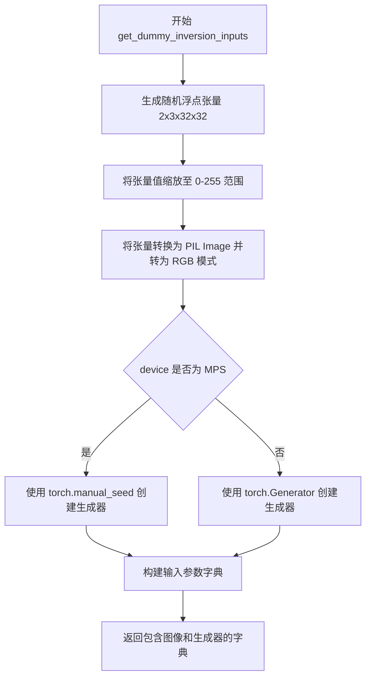

#### 带注释源码

```python
def get_dummy_inversion_inputs(self, device, seed=0):
    """
    生成用于 LEdits++ Pipeline 反转过程的虚拟输入参数
    
    参数:
        device: 目标设备（CPU/MPS/CUDA 等）
        seed: 随机种子，用于确保测试可重复性
    
    返回:
        包含反转所需参数的字典
    """
    # 使用随机浮点张量生成虚拟图像数据 (batch=2, channels=3, height=32, width=32)
    images = floats_tensor((2, 3, 32, 32), rng=random.Random(0)).cpu().permute(0, 2, 3, 1)
    # 将浮点值从 [0,1] 范围映射到 [0,255] 像素值范围
    images = 255 * images
    # 将第一张图像转换为 PIL Image 对象并转换为 RGB 模式
    image_1 = Image.fromarray(np.uint8(images[0])).convert("RGB")
    # 将第二张图像转换为 PIL Image 对象并转换为 RGB 模式
    image_2 = Image.fromarray(np.uint8(images[1])).convert("RGB")

    # 根据设备类型创建随机数生成器
    # MPS (Apple Silicon) 设备需要特殊处理，使用 torch.manual_seed
    if str(device).startswith("mps"):
        generator = torch.manual_seed(seed)
    else:
        # 其他设备使用 torch.Generator 以支持更精细的随机控制
        generator = torch.Generator(device=device).manual_seed(seed)

    # 构建完整的反转输入参数字典
    inputs = {
        "image": [image_1, image_2],               # 待反转的图像列表
        "source_prompt": "",                        # 源提示词（空表示无文本条件）
        "source_guidance_scale": 3.5,               # classifier-free guidance 强度
        "num_inversion_steps": 20,                  # DDIM 反转的步数
        "skip": 0.15,                               # 反转过程中跳过的噪声比例
        "generator": generator,                     # 随机数生成器确保可重复性
    }
    return inputs
```


### `LEditsPPPipelineStableDiffusionXLFastTests.test_ledits_pp_inversion`

该方法是一个单元测试，用于测试 LEditsPPPipelineStableDiffusionXL 管道中的图像反转（inversion）功能是否正确工作。测试通过创建虚拟组件和输入，执行反转操作，然后验证生成的初始潜在向量（init_latents）的形状和数值是否符合预期。

参数：

- `self`：隐式参数，测试类实例本身

返回值：`None`（无返回值），该方法为单元测试，使用断言进行验证

#### 流程图

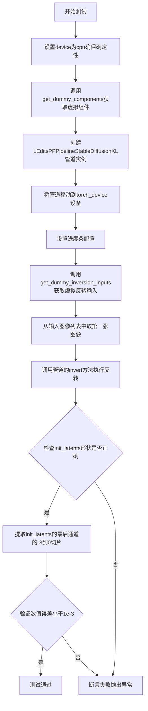

#### 带注释源码

```python
def test_ledits_pp_inversion(self):
    """
    测试 LEdits++ Pipeline 的反转功能
    
    该测试方法验证 StableDiffusionXL 管道能够正确执行图像反转操作，
    这是编辑图像前的必要步骤，用于获取初始潜在向量表示。
    """
    # 设置设备为 cpu，确保 torch.Generator 的确定性
    device = "cpu"  # ensure determinism for the device-dependent torch.Generator
    
    # 获取虚拟组件（包含 UNet, VAE, Scheduler, TextEncoders 等）
    components = self.get_dummy_components()
    
    # 使用虚拟组件创建 LEditsPP 管道实例
    sd_pipe = LEditsPPPipelineStableDiffusionXL(**components)
    
    # 将管道移动到目标设备（如 CUDA）
    sd_pipe = sd_pipe.to(torch_device)
    
    # 配置进度条（disable=None 表示启用进度条）
    sd_pipe.set_progress_bar_config(disable=None)
    
    # 获取虚拟反转输入参数
    inputs = self.get_dummy_inversion_inputs(device)
    
    # 只取第一张图像进行单图反转测试
    inputs["image"] = inputs["image"][0]
    
    # 执行图像反转操作，填充反向噪声
    # 反转后结果存储在 sd_pipe.init_latents 中
    sd_pipe.invert(**inputs)
    
    # 断言：验证 init_latents 的形状是否符合预期
    # 预期形状：(batch_size=1, channels=4, height, width)
    # 其中 height = width = 32 / vae_scale_factor
    assert sd_pipe.init_latents.shape == (
        1,
        4,
        int(32 / sd_pipe.vae_scale_factor),
        int(32 / sd_pipe.vae_scale_factor),
    )
    
    # 提取最后一个通道的右下角 3x3 区域
    # 用于与预期数值进行对比验证
    latent_slice = sd_pipe.init_latents[0, -1, -3:, -3:].to(device)
    
    # 定义预期的潜在向量数值切片
    expected_slice = np.array([-0.9084, -0.0367, 0.2940, 0.0839, 0.6890, 0.2651, -0.7103, 2.1090, -0.7821])
    
    # 断言：验证实际数值与预期值的最大误差小于 1e-3
    assert np.abs(latent_slice.flatten() - expected_slice).max() < 1e-3
```


### `LEditsPPPipelineStableDiffusionXLFastTests.test_ledits_pp_inversion_batch`

该方法是一个单元测试，用于验证 LEditsPPPipelineStableDiffusionXL 管道在批量图像反转（inversion）场景下的功能正确性。测试创建虚拟组件和输入，调用 invert 方法进行批量反转，并验证返回的初始潜在变量的形状和数值是否符合预期。

参数：

- `self`：隐式参数，表示测试类实例本身，无需显式传递

返回值：`None`，该方法为测试方法，通过断言（assert）验证功能正确性，不返回任何值

#### 流程图

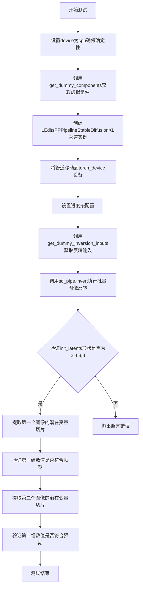

#### 带注释源码

```python
def test_ledits_pp_inversion_batch(self):
    """测试LEditsPPPipelineStableDiffusionXL的批量图像反转功能"""
    # 设置device为cpu以确保torch.Generator的确定性
    device = "cpu"  # ensure determinism for the device-dependent torch.Generator
    
    # 获取虚拟组件（UNet、VAE、文本编码器等）
    components = self.get_dummy_components()
    
    # 使用虚拟组件创建LEditsPPPipelineStableDiffusionXL管道实例
    sd_pipe = LEditsPPPipelineStableDiffusionXL(**components)
    
    # 将管道移动到指定的计算设备（如CUDA或CPU）
    sd_pipe = sd_pipe.to(torch_device)
    
    # 配置进度条，disable=None表示不禁用进度条
    sd_pipe.set_progress_bar_config(disable=None)
    
    # 获取用于反转的虚拟输入数据（包含图像、源提示词等）
    inputs = self.get_dummy_inversion_inputs(device)
    
    # 执行批量图像反转，invert方法会返回init_latents
    sd_pipe.invert(**inputs)
    
    # 验证批量反转后的init_latents形状：批量大小为2，通道数为4
    assert sd_pipe.init_latents.shape == (
        2,                                              # 批量大小（2张图像）
        4,                                              # 潜在空间通道数
        int(32 / sd_pipe.vae_scale_factor),            # 高度下采样
        int(32 / sd_pipe.vae_scale_factor),             # 宽度下采样
    )
    
    # 提取第一个图像的最后一个潜在变量切片的指定区域
    latent_slice = sd_pipe.init_latents[0, -1, -3:, -3:].to(device)
    
    # 定义预期的潜在变量数值切片
    expected_slice = np.array([0.2528, 0.1458, -0.2166, 0.4565, -0.5656, -1.0286, -0.9961, 0.5933, 1.1172])
    
    # 断言实际数值与预期数值的最大误差小于1e-3
    assert np.abs(latent_slice.flatten() - expected_slice).max() < 1e-3
    
    # 提取第二个图像的最后一个潜在变量切片的指定区域
    latent_slice = sd_pipe.init_latents[1, -1, -3:, -3:].to(device)
    
    # 定义第二张图像的预期潜在变量数值切片
    expected_slice = np.array([-0.0796, 2.0583, 0.5500, 0.5358, 0.0282, -0.2803, -1.0470, 0.7024, -0.0072])
    
    # 断言第二张图像的实际数值与预期数值的最大误差小于1e-3
    assert np.abs(latent_slice.flatten() - expected_slice).max() < 1e-3
```


### `LEditsPPPipelineStableDiffusionXLFastTests.test_ledits_pp_warmup_steps`

这是一个单元测试函数，用于测试 LEditsPPPipelineStableDiffusionXL pipeline 在不同编辑预热步骤（edit_warmup_steps）配置下的功能正确性。测试通过创建虚拟组件、进行图像反演，然后使用不同的 warmup_steps 参数调用 pipeline，验证输出图像的有效性。

参数：

- `self`：隐式参数，`unittest.TestCase` 实例，代表测试类本身

返回值：`None`，测试函数无返回值（测试断言通过即可）

#### 流程图

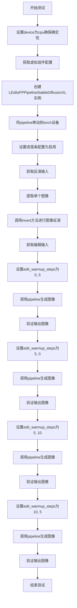

#### 带注释源码

```python
def test_ledits_pp_warmup_steps(self):
    """
    测试 LEditsPPPipelineStableDiffusionXL pipeline 的编辑预热步骤功能
    
    该测试验证不同 edit_warmup_steps 参数配置下的 pipeline 能否正确生成图像
    """
    # 设置设备为 CPU 以确保 torch.Generator 的确定性
    device = "cpu"  # ensure determinism for the device-dependent torch.Generator
    
    # 获取虚拟组件配置，用于创建测试用的 pipeline
    components = self.get_dummy_components()
    
    # 使用虚拟组件实例化 LEditsPPPipelineStableDiffusionXL pipeline
    pipe = LEditsPPPipelineStableDiffusionXL(**components)
    
    # 将 pipeline 移动到 torch 设备（可能是 CUDA 或 CPU）
    pipe = pipe.to(torch_device)
    
    # 配置进度条，设置为 None 表示不禁用（即显示进度条）
    pipe.set_progress_bar_config(disable=None)
    
    # 获取用于反演的虚拟输入
    inversion_inputs = self.get_dummy_inversion_inputs(device)
    
    # 从输入图像列表中提取单个图像（取第一个）
    inversion_inputs["image"] = inversion_inputs["image"][0]
    
    # 执行图像反演，生成初始潜在向量
    # 这步是 LEdits++ 算法的关键，准备用于编辑的噪声/潜在表示
    pipe.invert(**inversion_inputs)
    
    # 获取用于编辑的虚拟输入参数
    inputs = self.get_dummy_inputs(device)
    
    # 测试场景1：第一个编辑提示的 warmup 步骤为0，第二个为5
    inputs["edit_warmup_steps"] = [0, 5]
    
    # 执行编辑操作并获取生成的图像
    # 测试参数：[0, 5] - 表示第一个编辑提示不进行预热，第二个进行5步预热
    pipe(**inputs).images
    
    # 测试场景2：warmup 步骤配置为 [5, 0]
    inputs["edit_warmup_steps"] = [5, 0]
    pipe(**inputs).images
    
    # 测试场景3：warmup 步骤配置为 [5, 10]
    inputs["edit_warmup_steps"] = [5, 10]
    pipe(**inputs).images
    
    # 测试场景4：warmup 步骤配置为 [10, 5]
    inputs["edit_warmup_steps"] = [10, 5]
    pipe(**inputs).images
```


### `LEDitsPPPipelineStableDiffusionXLSlowTests.setUpClass`

这是一个类方法（class method），用于在测试类初始化时加载一张测试用的猫图片，将其调整为512x512大小，并存储为类属性 `raw_image`，供后续测试用例使用。

参数：

-  `cls`：`class`，类方法的隐式参数，代表类本身

返回值：`None`，该方法没有显式返回值（隐式返回 None）

#### 流程图

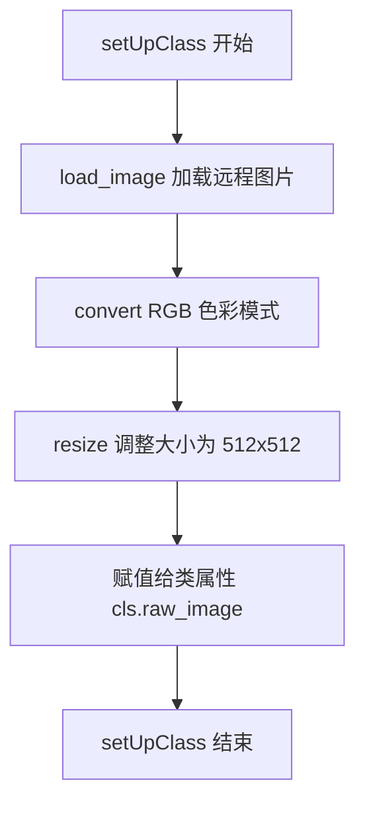

#### 带注释源码

```
@classmethod
def setUpClass(cls):
    # 从 Hugging Face Hub 加载一张测试用的猫图片
    raw_image = load_image(
        "https://huggingface.co/datasets/hf-internal-testing/diffusers-images/resolve/main/pix2pix/cat_6.png"
    )
    # 将图片转换为 RGB 色彩模式，确保兼容性
    raw_image = raw_image.convert("RGB").resize((512, 512))
    # 将处理后的图片存储为类属性，供测试用例使用
    cls.raw_image = raw_image
```


### `LEDitsPPPipelineStableDiffusionXLSlowTests.test_ledits_pp_edit`

该函数是一个集成测试方法，用于测试 LEditsPPPipelineStableDiffusionXL pipeline 的图像编辑功能。测试首先加载预训练的 Stable Diffusion XL 模型，然后对输入图像进行反演（inversion），接着使用编辑提示词、引导比例和阈值等参数执行图像编辑，最后验证重建图像的像素值是否符合预期。

参数：

- `self`：unittest.TestCase，自动传入的测试类实例，用于访问类属性和方法

返回值：无返回值（void），该方法为单元测试，通过断言验证功能正确性

#### 流程图

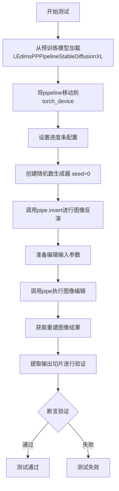

#### 带注释源码

```python
def test_ledits_pp_edit(self):
    # 从预训练模型加载Stable Diffusion XL pipeline
    # 加载stabilityai/stable-diffusion-xl-base-1.0模型，并禁用安全检查器和watermarker
    pipe = LEditsPPPipelineStableDiffusionXL.from_pretrained(
        "stabilityai/stable-diffusion-xl-base-1.0", safety_checker=None, add_watermarker=None
    )
    
    # 将pipeline移动到指定的计算设备（如CUDA）
    pipe = pipe.to(torch_device)
    
    # 设置进度条配置，disable=None表示启用进度条
    pipe.set_progress_bar_config(disable=None)

    # 创建随机数生成器，设置种子为0以确保可重复性
    # 用于后续的扩散过程
    generator = torch.manual_seed(0)
    
    # 执行图像反演（inversion）过程
    # 将原始图像反演到潜在空间，num_zero_noise_steps=0表示不使用零噪声步骤
    _ = pipe.invert(image=self.raw_image, generator=generator, num_zero_noise_steps=0)
    
    # 准备编辑输入参数字典
    inputs = {
        "generator": generator,                          # 随机数生成器
        "editing_prompt": ["cat", "dog"],               # 编辑提示词：将图像中的猫编辑为狗
        "reverse_editing_direction": [True, False],    # 反转编辑方向：第一个提示词正向，第二个反向
        "edit_guidance_scale": [2.0, 4.0],             # 编辑引导比例，控制编辑强度
        "edit_threshold": [0.8, 0.8],                   # 编辑阈值，控制编辑影响的区域
    }
    
    # 调用pipeline执行图像编辑
    # output_type="np"表示返回numpy数组格式的图像
    reconstruction = pipe(**inputs, output_type="np").images[0]

    # 从重建图像中提取特定区域进行验证
    # 提取位置(150:153, 140:143)的像素值，即3x3的像素块
    output_slice = reconstruction[150:153, 140:143, -1]
    
    # 将3x3像素块展平为一维数组
    output_slice = output_slice.flatten()
    
    # 预期输出的像素值（用于验证）
    expected_slice = np.array(
        [0.56419, 0.44121838, 0.2765603, 0.5708484, 0.42763475, 0.30945742, 0.5387106, 0.4735807, 0.3547244]
    )
    
    # 断言：验证输出与预期值的最大绝对误差小于1e-3
    assert np.abs(output_slice - expected_slice).max() < 1e-3
```

## 关键组件


### LEditsPPPipelineStableDiffusionXL

Stable Diffusion XL 的 LEdits++ 图像编辑管道实现，支持基于文本提示的图像编辑和图像反演操作。

### UNet2DConditionModel

条件 UNet 模型，用于去噪过程，接受文本嵌入和时间步条件进行图像生成。

### AutoencoderKL

变分自编码器（VAE）模型，负责图像的潜在空间编码和解码，将图像转换为潜在表示并从潜在表示重建图像。

### CLIPTextModel 和 CLIPTextModelWithProjection

CLIP 文本编码器模型，用于将文本提示编码为向量表示，支持双文本编码器架构（text_encoder 和 text_encoder_2）。

### CLIPVisionModelWithProjection

CLIP 视觉编码器模型，带投影层，用于编码输入图像并生成视觉特征向量。

### DPMSolverMultistepScheduler

DPM-Solver++ 调度器，用于扩散模型的采样过程，支持 SDE 和 ODE 求解器。

### invert 方法

图像反演方法，将输入图像逆向编码到潜在空间，生成初始潜在向量，用于基于图像的编辑任务。

### 编辑提示与引导

支持多个编辑提示（editing_prompt）、反向编辑方向（reverse_editing_direction）和编辑引导尺度（edit_guidance_scale），实现灵活的文本引导图像编辑。

### 测试组件

包含快速单元测试（LEditsPPPipelineStableDiffusionXLFastTests）和慢速集成测试（LEditsPPPipelineStableDiffusionXLSlowTests），验证管道功能正确性。


## 问题及建议


### 已知问题

- **硬编码的设备选择逻辑重复**：多处出现 `if str(device).startswith("mps")` 判断逻辑，应该抽取为工具函数或使用 fixture
- **测试方法中硬编码 device = "cpu"**：虽然注释说明是为了 determinism，但会导致在不同设备上运行测试时行为不一致
- **Magic Numbers 缺乏解释**：如 `num_inversion_steps=20`、`skip=0.15`、`source_guidance_scale=3.5` 等数值没有常量定义，修改时难以理解其含义
- **期望值硬编码且无注释**：多个 `expected_slice` 数组值直接写死，缺少来源说明，使得测试结果难以维护
- **注释掉的代码未清理**：`from diffusers.image_processor import VaeImageProcessor` 被注释但未删除
- **测试状态副作用**：`sd_pipe.init_latents` 被直接修改和断言，测试之间可能存在隐式依赖
- **变量命名不规范**：使用 `_` 忽略返回值（如 `_ = pipe.invert(...)`），可读性较差
- **缺少资源清理**：没有 `tearDown` 或 `tearDownClass` 方法来释放 GPU 内存等资源
- **缺失类型注解**：所有方法都缺少返回类型注解，影响代码可维护性
- **重复的断言模式**：多次使用 `np.abs(...).max() < 1e-3` 的断言模式，可抽取为辅助函数

### 优化建议

- **抽取设备工具函数**：创建 `get_device_aware_generator(device, seed)` 统一处理 MPS 和其他设备的 Generator 创建逻辑
- **定义配置常量类**：将 magic numbers 提取为类常量或配置文件，如 `INVERSION_STEPS = 20`、`SKIP_RATIO = 0.15`
- **封装断言辅助函数**：创建 `assert_latent_similarity(actual, expected, tolerance=1e-3)` 减少重复代码
- **添加类型注解**：为所有方法添加返回类型，如 `-> None`，提升代码清晰度
- **使用 pytest fixtures**：利用 `@pytest.fixture` 管理 pipeline 组件和设备，减少 `get_dummy_components` 的重复调用
- **清理注释代码**：删除未使用的导入语句，保持代码整洁
- **添加资源清理**：实现 `tearDownClass` 方法确保测试后释放 CUDA 内存
- **文档化期望值来源**：为 expected_slice 添加注释说明数值来源或计算方式
- **考虑参数化测试**：使用 `@pytest.mark.parametrize` 合并相似测试用例

## 其它


### 设计目标与约束

本测试文件旨在验证 LEditsPPPipelineStableDiffusionXL 管道在图像编辑任务中的正确性，包括反演(inversion)、批量处理和不同预热步骤(edit_warmup_steps)场景下的功能测试。测试采用固定随机种子确保可重复性，设备默认为CPU以保证确定性行为。测试覆盖快速单元测试和慢速集成测试两类，其中慢速测试需使用GPU加速并标记@slow和@require_torch_accelerator装饰器。

### 错误处理与异常设计

测试用例通过断言(assert)验证关键输出结果的数值正确性，包括latents维度、切片数值与预期值的最大误差检查。测试未显式捕获异常，依赖unittest框架的默认异常传播机制。对于设备相关的随机数生成器，根据设备类型(MPS vs 其他)采用不同的初始化方式以确保兼容性。测试中的容差设为1e-3，用于浮点数比较。

### 数据流与状态机

测试数据流如下：首先通过get_dummy_components()创建虚拟的UNet、VAE、调度器、文本编码器和图像编码器组件；然后实例化LEditsPPPipelineStableDiffusionXL管道并移至目标设备；接着准备get_dummy_inputs()或get_dummy_inversion_inputs()提供的输入参数；最后调用管道的invert()或__call__()方法执行推理。状态转换包括：组件初始化 -> 管道实例化 -> 设备迁移 -> 输入准备 -> 前向传播 -> 结果验证。

### 外部依赖与接口契约

本测试文件依赖以下外部组件：transformers库提供CLIPTextModel、CLIPTextModelWithProjection、CLIPTokenizer、CLIPImageProcessor等模型和处理器；diffusers库提供LEditsPPPipelineStableDiffusionXL、UNet2DConditionModel、AutoencoderKL、DPMSolverMultistepScheduler等核心组件；numpy用于数值计算；PIL用于图像处理；torch用于张量操作。接口契约要求组件字典包含unet、scheduler、vae、text_encoder、tokenizer、text_encoder_2、tokenizer_2、image_encoder、feature_extractor等键。

### 性能考虑

快速测试使用最小化配置(极小的hidden_size、num_hidden_layers等)以缩短执行时间。慢速测试从预训练模型"stabilityai/stable-diffusion-xl-base-1.0"加载完整权重，需要GPU加速。测试通过torch.manual_seed()和enable_full_determinism()确保可重复性，但这可能影响并行性能。反演步骤数(num_inversion_steps)设为20，编辑引导比例(edit_guidance_scale)设为5.0-10.0范围。

### 配置和参数说明

关键测试参数包括：editing_prompt列表指定编辑提示词；reverse_editing_direction列表指定每个提示词的方向反转状态；edit_guidance_scale列表控制编辑引导强度；edit_threshold列表设置编辑阈值；num_inversion_steps控制反演步数；skip参数控制跳过的反演比例；source_guidance_scale控制源图像引导强度；edit_warmup_steps控制编辑预热步骤数。

### 使用示例和用例

快速测试用例包括：test_ledits_pp_inversion验证单图反演功能；test_ledits_pp_inversion_batch验证批量反演功能；test_ledits_pp_warmup_steps验证不同预热步骤配置下的编辑效果。慢速测试用例test_ledits_pp_edit展示完整编辑流程：先对原始图像进行反演，然后使用编辑提示词生成编辑后的图像。真实使用场景包括图像风格迁移、物体替换、场景变换等应用。

    