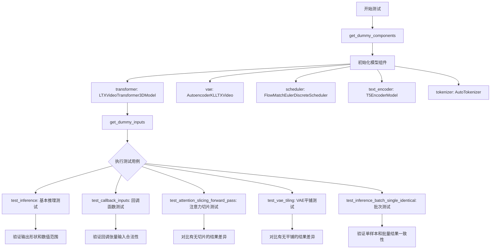
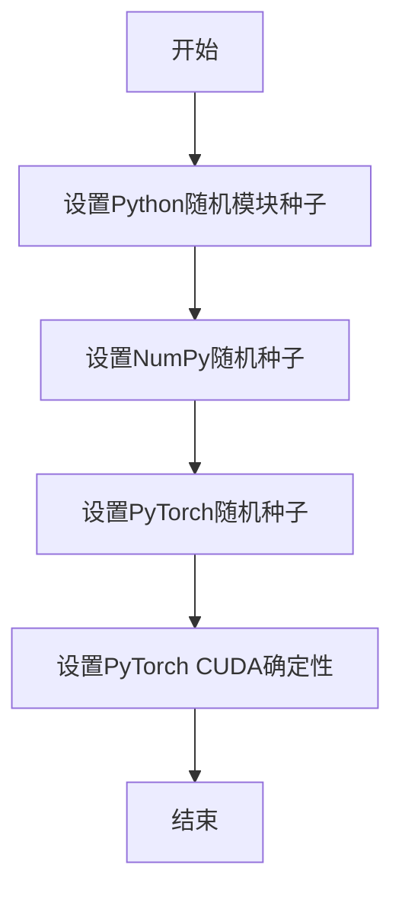
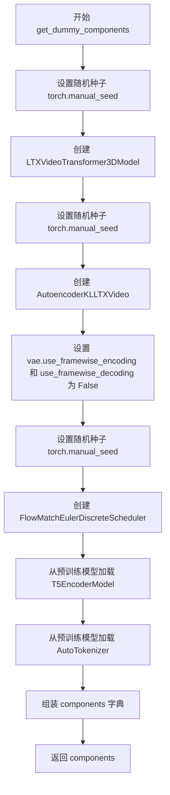
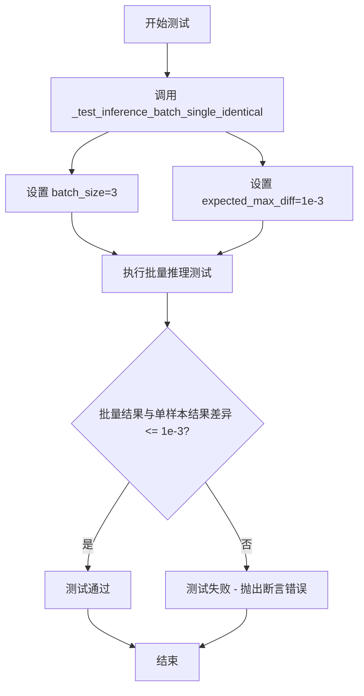
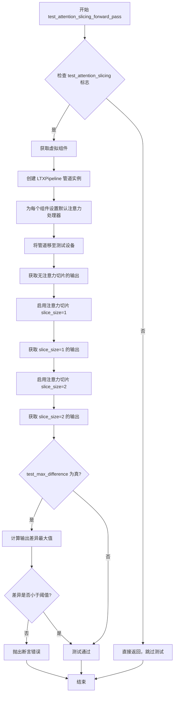
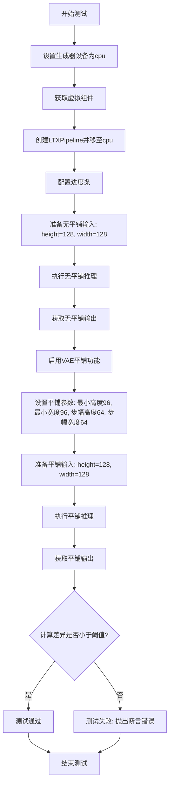
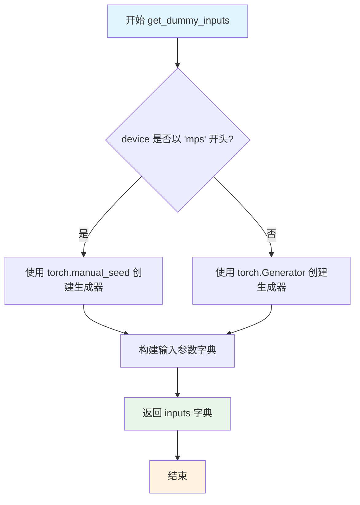
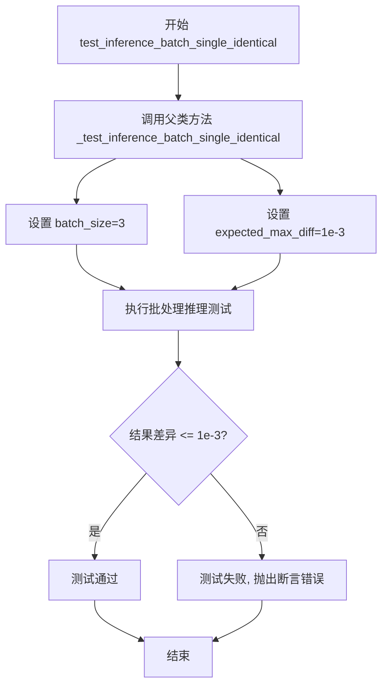
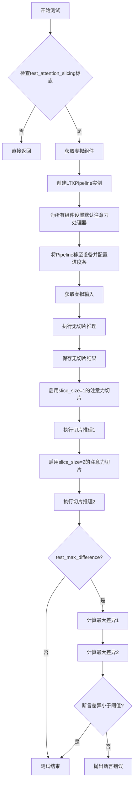
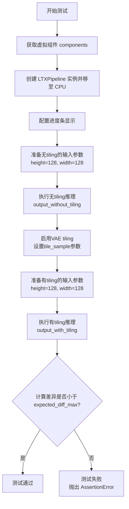

# `diffusers\tests\pipelines\ltx\test_ltx.py` 详细设计文档

这是LTXVideoPipeline的单元测试文件，用于测试LTX文本到视频生成模型的各种功能，包括模型组件初始化、推理调用、回调函数处理、注意力切片和VAE平铺等核心功能的正确性。

## 整体流程



## 类结构

```
unittest.TestCase (基类)
├── PipelineTesterMixin (测试混入类)
├── FirstBlockCacheTesterMixin (测试混入类)
└── LTXPipelineFastTests (主测试类)
    ├── 字段: pipeline_class = LTXPipeline
    ├── 字段: params = TEXT_TO_IMAGE_PARAMS
    ├── 字段: batch_params = TEXT_TO_IMAGE_BATCH_PARAMS
    ├── 字段: image_params = TEXT_TO_IMAGE_IMAGE_PARAMS
    ├── 字段: image_latents_params = TEXT_TO_IMAGE_IMAGE_PARAMS
    ├── 字段: required_optional_params
    ├── 字段: test_xformers_attention = False
    ├── 字段: test_layerwise_casting = True
    ├── 字段: test_group_offloading = True
    ├── 方法: get_dummy_components(num_layers)
    ├── 方法: get_dummy_inputs(device, seed)
    ├── 方法: test_inference()
    ├── 方法: test_callback_inputs()
    ├── 方法: test_inference_batch_single_identical()
    ├── 方法: test_attention_slicing_forward_pass()
    └── 方法: test_vae_tiling()
```

## 全局变量及字段


### `enable_full_determinism`
    
启用完全确定性以确保测试可复现

类型：`global function`
    


### `LTXPipelineFastTests.pipeline_class`
    
被测试的管道类

类型：`LTXPipeline类`
    


### `LTXPipelineFastTests.params`
    
文本到图像管道参数集合，排除cross_attention_kwargs

类型：`frozenset`
    


### `LTXPipelineFastTests.batch_params`
    
批量参数集合

类型：`set`
    


### `LTXPipelineFastTests.image_params`
    
图像参数集合

类型：`set`
    


### `LTXPipelineFastTests.image_latents_params`
    
图像潜在向量参数集合

类型：`set`
    


### `LTXPipelineFastTests.required_optional_params`
    
必需的可选参数集合

类型：`frozenset`
    


### `LTXPipelineFastTests.test_xformers_attention`
    
是否测试xformers注意力

类型：`bool`
    


### `LTXPipelineFastTests.test_layerwise_casting`
    
是否测试逐层类型转换

类型：`bool`
    


### `LTXPipelineFastTests.test_group_offloading`
    
是否测试组卸载功能

类型：`bool`
    
    

## 全局函数及方法


### `enable_full_determinism`

设置随机种子以确保测试结果可复现，通过配置各种随机数生成器的种子，使得测试过程在任何环境下运行都能得到一致的結果。

参数：
- 该函数无显式参数

返回值：`None`，无返回值

#### 流程图



#### 带注释源码

```
# 注意：以下为基于函数名和上下文的推断实现
# 实际实现位于 testing_utils 模块中

def enable_full_determinism(seed: int = 0):
    """
    设置随机种子以确保测试结果可复现
    
    参数:
        seed: 随机种子值，默认为0
    """
    import random
    import numpy as np
    import torch
    
    # 1. 设置Python内置random模块的种子
    random.seed(seed)
    
    # 2. 设置NumPy的随机种子
    np.random.seed(seed)
    
    # 3. 设置PyTorch的随机种子
    torch.manual_seed(seed)
    
    # 4. 如果使用CUDA，设置CUDA的确定性模式
    if torch.cuda.is_available():
        torch.cuda.manual_seed_all(seed)
        # 启用确定性算法，确保可复现性
        torch.backends.cudnn.deterministic = True
        torch.backends.cudnn.benchmark = False
```

---

**注意**：由于 `enable_full_determinism` 函数是从 `...testing_utils` 模块导入的，当前代码文件中仅包含其调用语句，并未提供函数的具体实现。上述源码为基于函数名称和测试场景的合理推断。


### `LTXPipelineFastTests.get_dummy_components`

创建虚拟模型组件用于测试，生成包含transformer、vae、scheduler、text_encoder和tokenizer的虚拟组件字典。

参数：

- `num_layers`：`int`，可选，默认值为 1，表示transformer的层数

返回值：`dict`，返回包含虚拟组件的字典，键名为 "transformer"、"vae"、"scheduler"、"text_encoder"、"tokenizer"

#### 流程图



#### 带注释源码

```python
def get_dummy_components(self, num_layers: int = 1):
    """
    创建虚拟模型组件用于测试
    
    参数:
        num_layers: int, transformer的层数，默认为1
    
    返回:
        dict: 包含虚拟组件的字典
    """
    # 设置随机种子以确保结果可复现
    torch.manual_seed(0)
    
    # 创建虚拟的LTXVideoTransformer3DModel transformer组件
    transformer = LTXVideoTransformer3DModel(
        in_channels=8,           # 输入通道数
        out_channels=8,         # 输出通道数
        patch_size=1,           # 空间patch大小
        patch_size_t=1,         # 时间patch大小
        num_attention_heads=4,  # 注意力头数
        attention_head_dim=8,   # 注意力头维度
        cross_attention_dim=32, # 交叉注意力维度
        num_layers=num_layers,  # 层数，由参数传入
        caption_channels=32,    # 文本 caption 通道数
    )

    # 重新设置随机种子
    torch.manual_seed(0)
    
    # 创建虚拟的AutoencoderKLLTXVideo VAE组件
    vae = AutoencoderKLLTXVideo(
        in_channels=3,                         # 输入通道数 (RGB)
        out_channels=3,                        # 输出通道数
        latent_channels=8,                     # 潜在空间通道数
        block_out_channels=(8, 8, 8, 8),       # 编码器块输出通道
        decoder_block_out_channels=(8, 8, 8, 8),# 解码器块输出通道
        layers_per_block=(1, 1, 1, 1, 1),      # 每个块的层数
        decoder_layers_per_block=(1, 1, 1, 1, 1),# 解码器每块层数
        # 时空缩放配置
        spatio_temporal_scaling=(True, True, False, False),
        decoder_spatio_temporal_scaling=(True, True, False, False),
        # 解码器噪声注入配置
        decoder_inject_noise=(False, False, False, False, False),
        upsample_residual=(False, False, False, False),
        upsample_factor=(1, 1, 1, 1),
        timestep_conditioning=False,           # 时间步条件
        patch_size=1,                           # patch大小
        patch_size_t=1,                         # 时间patch大小
        encoder_causal=True,                   # 编码器因果关系
        decoder_causal=False,                  # 解码器非因果
    )
    # 禁用帧级编解码，使用批次级处理
    vae.use_framewise_encoding = False
    vae.use_framewise_decoding = False

    # 重新设置随机种子
    torch.manual_seed(0)
    
    # 创建虚拟的FlowMatchEulerDiscreteScheduler调度器
    scheduler = FlowMatchEulerDiscreteScheduler()
    
    # 从预训练模型加载虚拟的T5文本编码器
    text_encoder = T5EncoderModel.from_pretrained("hf-internal-testing/tiny-random-t5")
    
    # 从预训练模型加载虚拟的T5分词器
    tokenizer = AutoTokenizer.from_pretrained("hf-internal-testing/tiny-random-t5")

    # 组装组件字典
    components = {
        "transformer": transformer,   # 3D视频transformer模型
        "vae": vae,                   # 变分自编码器
        "scheduler": scheduler,       # 扩散调度器
        "text_encoder": text_encoder, # 文本编码器
        "tokenizer": tokenizer,       # 分词器
    }
    
    # 返回组件字典供测试使用
    return components
```


### `LTXPipelineFastTests.get_dummy_inputs`

创建虚拟输入参数，用于测试 LTXVideo 管道推理。

参数：

- `device`：`str`，目标设备，用于创建随机数生成器
- `seed`：`int`，默认值为 `0`，随机种子，用于确保测试可复现

返回值：`dict`，包含以下键值对：
- `prompt`：提示词文本
- `negative_prompt`：负面提示词
- `generator`：PyTorch 随机数生成器
- `num_inference_steps`：推理步数
- `guidance_scale`：引导系数
- `height`：生成图像高度
- `width`：生成图像宽度
- `num_frames`：生成帧数
- `max_sequence_length`：最大序列长度
- `output_type`：输出类型

#### 流程图

```mermaid
flowchart TD
    A[开始] --> B{设备是 MPS?}
    B -->|是| C[使用 torch.manual_seed(seed)]
    B -->|否| D[创建 Generator device=device 并设置种子]
    C --> E[构建输入字典]
    D --> E
    E --> F[返回 inputs 字典]
    F --> G[结束]
```

#### 带注释源码

```python
def get_dummy_inputs(self, device, seed=0):
    """
    创建虚拟输入参数用于测试 LTXVideo Pipeline
    
    参数:
        device: 目标设备字符串，用于创建随机数生成器
        seed: 随机种子，默认值为0，确保测试可复现
    
    返回:
        包含测试所需所有输入参数的字典
    """
    # 根据设备类型选择合适的随机数生成方式
    # MPS (Apple Silicon) 不支持 torch.Generator，需要使用 torch.manual_seed
    if str(device).startswith("mps"):
        generator = torch.manual_seed(seed)
    else:
        # 其他设备（如 cpu, cuda）使用 torch.Generator 创建生成器
        generator = torch.Generator(device=device).manual_seed(seed)

    # 构建测试用的输入参数字典
    inputs = {
        "prompt": "dance monkey",           # 文本提示词
        "negative_prompt": "",              # 负面提示词（空字符串表示无负面引导）
        "generator": generator,             # 随机数生成器，确保可复现性
        "num_inference_steps": 2,           # 推理步数，较少步数用于快速测试
        "guidance_scale": 3.0,               # Classifier-free guidance 引导系数
        "height": 32,                        # 生成图像高度（像素）
        "width": 32,                         # 生成图像宽度（像素）
        # 8 * k + 1 是 LTXVideo 的推荐帧数格式
        "num_frames": 9,                     # 生成视频帧数
        "max_sequence_length": 16,           # T5 文本编码器的最大序列长度
        "output_type": "pt",                 # 输出类型，pt 表示 PyTorch 张量
    }

    return inputs
```


### test_inference

该方法是 `LTXPipelineFastTests` 类的实例方法，用于测试 LTX 视频生成管道的基本推理功能。方法会创建虚拟组件和输入，执行推理流程，并验证生成视频的形状和数值合理性。

参数：

- `self`：`LTXPipelineFastTests` 类实例，隐式参数，表示当前测试类实例

返回值：`None`，无返回值（测试方法，通过断言验证结果）

#### 流程图

```mermaid
flowchart TD
    A[开始 test_inference] --> B[设置设备为 CPU]
    B --> C[调用 get_dummy_components 获取虚拟组件]
    C --> D[使用虚拟组件实例化 LTXPipeline]
    D --> E[将管道移至 CPU 设备]
    E --> F[配置进度条: disable=None]
    F --> G[调用 get_dummy_inputs 获取虚拟输入]
    G --> H[执行管道推理: pipe(**inputs)]
    H --> I[提取生成视频: video = output.frames]
    I --> J[获取第一帧: generated_video = video[0]]
    J --> K{断言: 视频形状是否为 (9, 3, 32, 32)}
    K -->|是| L[生成随机期望视频]
    L --> M[计算最大差值: max_diff]
    M --> N{断言: max_diff <= 1e10}
    N -->|是| O[测试通过]
    N -->|否| P[测试失败]
    K -->|否| P
```

#### 带注释源码

```python
def test_inference(self):
    """
    测试 LTX 视频管道的基本推理功能
    
    该方法执行以下步骤:
    1. 创建虚拟组件(transformer, vae, scheduler, text_encoder, tokenizer)
    2. 使用虚拟组件实例化 LTXPipeline
    3. 执行视频生成推理
    4. 验证生成视频的形状和数值合理性
    """
    # 步骤1: 设置目标设备为 CPU
    device = "cpu"

    # 步骤2: 获取虚拟组件(模型、VAE、调度器、文本编码器、分词器)
    components = self.get_dummy_components()
    
    # 步骤3: 使用虚拟组件实例化 LTX 视频生成管道
    pipe = self.pipeline_class(**components)
    
    # 步骤4: 将管道移至指定设备(CPU)
    pipe.to(device)
    
    # 步骤5: 配置进度条(传入 None 表示使用默认配置)
    pipe.set_progress_bar_config(disable=None)

    # 步骤6: 获取虚拟输入参数(prompt, negative_prompt, generator等)
    inputs = self.get_dummy_inputs(device)
    
    # 步骤7: 执行管道推理,获取生成的视频帧
    # pipe(**inputs) 返回 PipelineOutput,包含 frames 属性
    video = pipe(**inputs).frames
    
    # 步骤8: 提取第一个生成的视频(因为可能返回批量视频)
    generated_video = video[0]

    # 步骤9: 断言验证生成视频的形状
    # 期望形状: (9帧, 3通道, 32高度, 32宽度)
    self.assertEqual(generated_video.shape, (9, 3, 32, 32))
    
    # 步骤10: 生成随机期望视频用于对比
    expected_video = torch.randn(9, 3, 32, 32)
    
    # 步骤11: 计算生成视频与随机视频的最大绝对差值
    max_diff = np.abs(generated_video - expected_video).max()
    
    # 步骤12: 断言差值在合理范围内(用于检测数值溢出等异常)
    # 注意: 1e10 的阈值非常宽松,主要用于检测 NaN/Inf 等异常值
    self.assertLessEqual(max_diff, 1e10)
```


### `LTXPipelineFastTests.test_callback_inputs`

该方法用于测试 LTX 视频生成管道在推理过程中回调函数的功能完整性，验证 `callback_on_step_end` 和 `callback_on_step_end_tensor_inputs` 参数的正确性，确保回调函数能够按预期接收、验证和修改张量输入。

参数：
- `self`：`LTXPipelineFastTests`，测试类实例本身，包含测试所需的组件和配置

返回值：`None`，无返回值（测试方法）

#### 流程图

```mermaid
flowchart TD
    A[开始测试] --> B[获取管道 __call__ 方法签名]
    B --> C{检查是否支持回调参数}
    C -->|不支持| D[直接返回, 跳过测试]
    C -->|支持| E[创建管道实例并配置设备]
    E --> F[断言管道存在 _callback_tensor_inputs 属性]
    F --> G[定义 callback_inputs_subset 回调函数<br/>验证只传递允许的张量]
    G --> H[定义 callback_inputs_all 回调函数<br/>验证所有允许的张量都被传递]
    H --> I[使用 subset 测试: callback_on_step_end=callback_inputs_subset<br/>callback_on_step_end_tensor_inputs=['latents']]
    I --> J[执行管道推理并获取输出]
    J --> K[使用 all 测试: callback_on_step_end=callback_inputs_all<br/>callback_on_step_end_tensor_inputs=pipe._callback_tensor_inputs]
    K --> L[执行管道推理并获取输出]
    L --> M[定义 callback_inputs_change_tensor 回调函数<br/>在最后一步将 latents 置零]
    M --> N[执行管道推理]
    N --> O{验证输出绝对值和小于阈值}
    O -->|通过| P[测试通过]
    O -->|失败| Q[测试失败]
```

#### 带注释源码

```python
def test_callback_inputs(self):
    """
    测试推理过程中的回调函数功能。
    验证管道正确支持 callback_on_step_end 和 callback_on_step_end_tensor_inputs 参数。
    """
    # 获取管道 __call__ 方法的签名
    sig = inspect.signature(self.pipeline_class.__call__)
    # 检查方法签名中是否包含回调相关的参数
    has_callback_tensor_inputs = "callback_on_step_end_tensor_inputs" in sig.parameters
    has_callback_step_end = "callback_on_step_end" in sig.parameters

    # 如果管道不支持回调功能，则跳过此测试
    if not (has_callback_tensor_inputs and has_callback_step_end):
        return

    # 获取虚拟组件并创建管道实例
    components = self.get_dummy_components()
    pipe = self.pipeline_class(**components)
    # 将管道移至测试设备
    pipe = pipe.to(torch_device)
    # 配置进度条（disable=None 表示不禁用）
    pipe.set_progress_bar_config(disable=None)
    
    # 断言管道具有 _callback_tensor_inputs 属性
    # 该属性定义了回调函数可以使用的张量变量列表
    self.assertTrue(
        hasattr(pipe, "_callback_tensor_inputs"),
        f" {self.pipeline_class} should have `_callback_tensor_inputs` that defines a list of tensor variables its callback function can use as inputs",
    )

    # ----- 定义回调函数 1: 验证只传递允许的张量 -----
    def callback_inputs_subset(pipe, i, t, callback_kwargs):
        """
        测试只传递张量子集的情况。
        遍历回调参数，验证每个张量名称都在允许列表中。
        """
        # 遍历回调参数中的所有张量
        for tensor_name, tensor_value in callback_kwargs.items():
            # 检查只传递了允许的张量输入
            assert tensor_name in pipe._callback_tensor_inputs
        return callback_kwargs

    # ----- 定义回调函数 2: 验证所有允许的张量都被传递 -----
    def callback_inputs_all(pipe, i, t, callback_kwargs):
        """
        测试传递所有允许张量的情况。
        验证允许列表中的每个张量都在回调参数中。
        """
        # 检查所有允许的张量都被传递
        for tensor_name in pipe._callback_tensor_inputs:
            assert tensor_name in callback_kwargs

        # 遍历回调参数，验证每个张量都在允许列表中
        for tensor_name, tensor_value in callback_kwargs.items():
            assert tensor_name in pipe._callback_tensor_inputs

        return callback_kwargs

    # 获取测试输入
    inputs = self.get_dummy_inputs(torch_device)

    # ----- 测试 1: 只传递张量子集 -----
    # 设置只允许 'latents' 作为回调输入
    inputs["callback_on_step_end"] = callback_inputs_subset
    inputs["callback_on_step_end_tensor_inputs"] = ["latents"]
    # 执行推理（只返回第一项，即生成的视频帧）
    output = pipe(**inputs)[0]

    # ----- 测试 2: 传递所有允许的张量 -----
    # 设置使用所有允许的回调输入
    inputs["callback_on_step_end"] = callback_inputs_all
    inputs["callback_on_step_end_tensor_inputs"] = pipe._callback_tensor_inputs
    # 执行推理
    output = pipe(**inputs)[0]

    # ----- 定义回调函数 3: 修改张量值 -----
    def callback_inputs_change_tensor(pipe, i, t, callback_kwargs):
        """
        测试在回调中修改张量值。
        在最后一步将 latents 置零，验证修改会影响最终输出。
        """
        # 判断是否为最后一步
        is_last = i == (pipe.num_timesteps - 1)
        if is_last:
            # 将 latents 替换为全零张量
            callback_kwargs["latents"] = torch.zeros_like(callback_kwargs["latents"])
        return callback_kwargs

    # ----- 测试 3: 修改张量 -----
    inputs["callback_on_step_end"] = callback_inputs_change_tensor
    inputs["callback_on_step_end_tensor_inputs"] = pipe._callback_tensor_inputs
    # 执行推理
    output = pipe(**inputs)[0]
    # 验证输出几乎为零（因为 latents 被置零）
    assert output.abs().sum() < 1e10
```


### `LTXPipelineFastTests.test_inference_batch_single_identical`

测试批量推理与单样本推理结果的一致性，确保在批处理模式下推理结果与单样本推理结果保持一致（数值差异在可接受范围内）。

参数：

- `self`：隐式参数，测试类实例本身

返回值：`None`，通过 `unittest.TestCase` 的断言来验证结果

#### 流程图



#### 带注释源码

```python
def test_inference_batch_single_identical(self):
    """
    测试批量推理与单样本推理结果的一致性。
    
    该方法验证在使用批处理（batch_size=3）进行推理时，
    结果应与多次单样本推理的结果保持高度一致（差异小于1e-3）。
    这确保了模型的确定性和数值稳定性。
    """
    # 调用父类或混入类中实现的核心测试逻辑
    # batch_size=3: 使用3个样本的批次进行测试
    # expected_max_diff=1e-3: 期望批量推理与单样本推理的最大差异为0.001
    self._test_inference_batch_single_identical(batch_size=3, expected_max_diff=1e-3)
```


### `LTXPipelineFastTests.test_attention_slicing_forward_pass`

该方法是一个单元测试函数，用于验证注意力切片（Attention Slicing）功能在 LTXVideo 管道中是否正常工作。它通过比较启用注意力切片前后的推理结果，确保启用切片功能不会影响最终的输出质量。

参数：

- `test_max_difference`：`bool`，是否测试最大差异，默认为 `True`
- `test_mean_pixel_difference`：`bool`，是否测试平均像素差异，默认为 `True`
- `expected_max_diff`：`float`，期望的最大差异阈值，默认为 `1e-3`

返回值：`None`，该方法为测试方法，无返回值，通过断言验证功能正确性

#### 流程图



#### 带注释源码

```python
def test_attention_slicing_forward_pass(
    self, test_max_difference=True, test_mean_pixel_difference=True, expected_max_diff=1e-3
):
    """
    测试注意力切片功能的前向传播是否正常工作
    
    参数:
        test_max_difference: 是否测试最大差异
        test_mean_pixel_difference: 是否测试平均像素差异
        expected_max_diff: 期望的最大差异阈值
    """
    # 检查是否启用了注意力切片测试，如果未启用则跳过
    if not self.test_attention_slicing:
        return

    # 获取虚拟/测试用的模型组件
    components = self.get_dummy_components()
    
    # 使用虚拟组件创建 LTXPipeline 管道实例
    pipe = self.pipeline_class(**components)
    
    # 为每个组件设置默认的注意力处理器
    for component in pipe.components.values():
        if hasattr(component, "set_default_attn_processor"):
            component.set_default_attn_processor()
    
    # 将管道移至测试设备（如 CPU 或 CUDA）
    pipe.to(torch_device)
    
    # 设置进度条配置（disable=None 表示启用进度条）
    pipe.set_progress_bar_config(disable=None)

    # 获取生成器设备
    generator_device = "cpu"
    
    # 获取测试输入数据
    inputs = self.get_dummy_inputs(generator_device)
    
    # 执行不带注意力切片的推理，获取基准输出
    output_without_slicing = pipe(**inputs)[0]

    # 启用注意力切片，设置 slice_size=1
    pipe.enable_attention_slicing(slice_size=1)
    
    # 重新获取输入并执行推理
    inputs = self.get_dummy_inputs(generator_device)
    output_with_slicing1 = pipe(**inputs)[0]

    # 启用注意力切片，设置 slice_size=2
    pipe.enable_attention_slicing(slice_size=2)
    
    # 重新获取输入并执行推理
    inputs = self.get_dummy_inputs(generator_device)
    output_with_slicing2 = pipe(**inputs)[0]

    # 如果需要测试最大差异
    if test_max_difference:
        # 计算启用 slice_size=1 时与基准的最大差异
        max_diff1 = np.abs(to_np(output_with_slicing1) - to_np(output_without_slicing)).max()
        
        # 计算启用 slice_size=2 时与基准的最大差异
        max_diff2 = np.abs(to_np(output_with_slicing2) - to_np(output_without_slicing)).max()
        
        # 断言：注意力切片不应影响推理结果
        self.assertLess(
            max(max_diff1, max_diff2),
            expected_max_diff,
            "Attention slicing should not affect the inference results",
        )
```


### `test_vae_tiling`

该测试方法用于验证VAE（变分自编码器）平铺功能是否正常工作。通过对比启用平铺与未启用平铺的推理结果，确保平铺功能不会对输出质量产生显著影响。

参数：

- `expected_diff_max`：`float`，预期输出之间的最大差异阈值，默认为0.2
- `self`：隐含的实例参数，代表测试类`LTXPipelineFastTests`的实例

返回值：`None`，该方法为测试方法，通过断言验证结果而非返回值

#### 流程图



#### 带注释源码

```python
def test_vae_tiling(self, expected_diff_max: float = 0.2):
    """
    测试VAE平铺功能
    VAE平铺是一种将大图像分割成小块进行处理的技术，
    用于处理超出内存限制的大尺寸图像
    """
    # 设置生成器设备为CPU
    generator_device = "cpu"
    
    # 获取预定义的虚拟组件（transformer、vae、scheduler等）
    components = self.get_dummy_components()

    # 使用虚拟组件实例化LTXVideo生成管道
    pipe = self.pipeline_class(**components)
    
    # 将管道移至CPU设备
    pipe.to("cpu")
    
    # 配置进度条显示（disable=None表示启用进度条）
    pipe.set_progress_bar_config(disable=None)

    # === 步骤1: 不使用平铺的推理 ===
    # 获取虚拟输入
    inputs = self.get_dummy_inputs(generator_device)
    
    # 设置较大的输出尺寸（128x128），以测试平铺功能
    inputs["height"] = inputs["width"] = 128
    
    # 执行推理并获取第一帧结果
    output_without_tiling = pipe(**inputs)[0]

    # === 步骤2: 启用平铺功能 ===
    # 调用VAE的enable_tiling方法启用平铺
    pipe.vae.enable_tiling(
        tile_sample_min_height=96,      # 最小平铺高度
        tile_sample_min_width=96,       # 最小平铺宽度
        tile_sample_stride_height=64,   # 垂直方向平铺步幅
        tile_sample_stride_width=64,    # 水平方向平铺步幅
    )
    
    # 准备相同的输入参数用于平铺推理
    inputs = self.get_dummy_inputs(generator_device)
    inputs["height"] = inputs["width"] = 128
    
    # 执行平铺推理
    output_with_tiling = pipe(**inputs)[0]

    # === 步骤3: 验证结果一致性 ===
    # 计算两种方式输出差异的最大值
    # 使用assertLess断言差异在预期范围内
    self.assertLess(
        (to_np(output_without_tiling) - to_np(output_with_tiling)).max(),
        expected_diff_max,  # 阈值0.2
        "VAE tiling should not affect the inference results"  # 失败时的错误信息
    )
```


### `LTXPipelineFastTests.get_dummy_components`

该函数用于创建LTX视频生成管道的虚拟（dummy）测试组件，包括transformer模型、VAE、调度器、文本编码器和分词器，并返回一个包含这些组件的字典，以便在单元测试中进行推理验证。

参数：

- `num_layers`：`int`，可选参数，默认值为`1`，指定transformer模型中的层数。

返回值：`Dict[str, Any]`，返回一个字典，包含以下键值对：
- `"transformer"`：`LTXVideoTransformer3DModel`实例，LTX视频变换器模型
- `"vae"`：`AutoencoderKLLTXVideo`实例，变分自编码器模型
- `"scheduler"`：`FlowMatchEulerDiscreteScheduler`实例，流匹配欧拉离散调度器
- `"text_encoder"`：`T5EncoderModel`实例，T5文本编码器
- `"tokenizer"`：`AutoTokenizer`实例，T5分词器

#### 流程图

```mermaid
flowchart TD
    A[开始] --> B[设置随机种子 torch.manual_seed(0)]
    B --> C[创建 transformer: LTXVideoTransformer3DModel]
    C --> D[设置随机种子 torch.manual_seed(0)]
    D --> E[创建 vae: AutoencoderKLLTXVideo]
    E --> F[配置 vae.use_framewise_encoding 和 vae.use_framewise_decoding]
    F --> G[设置随机种子 torch.manual_seed(0)]
    G --> H[创建 scheduler: FlowMatchEulerDiscreteScheduler]
    H --> I[加载 text_encoder: T5EncoderModel]
    I --> J[加载 tokenizer: AutoTokenizer]
    J --> K[组装 components 字典]
    K --> L[返回 components]
    L --> M[结束]
```

#### 带注释源码

```python
def get_dummy_components(self, num_layers: int = 1):
    """
    创建用于测试的虚拟组件，包括transformer、vae、scheduler、text_encoder和tokenizer。
    
    参数:
        num_layers: int, 可选参数，默认值为1，指定transformer模型中的层数
    """
    # 设置随机种子以确保可重复性
    torch.manual_seed(0)
    # 创建LTXVideoTransformer3DModel实例
    # 参数说明：
    # - in_channels=8: 输入通道数
    # - out_channels=8: 输出通道数
    # - patch_size=1: 空间分块大小
    # - patch_size_t: 时间分块大小
    # - num_attention_heads=4: 注意力头数
    # - attention_head_dim=8: 注意力头维度
    # - cross_attention_dim=32: 跨注意力维度
    # - num_layers=num_layers: transformer层数
    # - caption_channels=32:  caption通道数
    transformer = LTXVideoTransformer3DModel(
        in_channels=8,
        out_channels=8,
        patch_size=1,
        patch_size_t=1,
        num_attention_heads=4,
        attention_head_dim=8,
        cross_attention_dim=32,
        num_layers=num_layers,
        caption_channels=32,
    )

    # 重新设置随机种子以确保VAE的初始化独立
    torch.manual_seed(0)
    # 创建AutoencoderKLLTXVideo实例（VAE）
    # 参数说明：
    # - in_channels=3: 输入通道数（RGB）
    # - out_channels=3: 输出通道数
    # - latent_channels=8: 潜在空间通道数
    # - block_out_channels: 编码器块输出通道数
    # - decoder_block_out_channels: 解码器块输出通道数
    # - layers_per_block: 每个块的层数
    # - decoder_layers_per_block: 解码器每块层数
    # - spatio_temporal_scaling: 时空缩放配置
    # - decoder_spatio_temporal_scaling: 解码器时空缩放配置
    # - decoder_inject_noise: 解码器噪声注入配置
    # - upsample_residual: 上采样残差配置
    # - upsample_factor: 上采样因子
    # - timestep_conditioning: 时间步条件
    # - patch_size: 分块大小
    # - patch_size_t: 时间分块大小
    # - encoder_causal: 编码器因果模式
    # - decoder_causal: 解码器因果模式
    vae = AutoencoderKLLTXVideo(
        in_channels=3,
        out_channels=3,
        latent_channels=8,
        block_out_channels=(8, 8, 8, 8),
        decoder_block_out_channels=(8, 8, 8, 8),
        layers_per_block=(1, 1, 1, 1, 1),
        decoder_layers_per_block=(1, 1, 1, 1, 1),
        spatio_temporal_scaling=(True, True, False, False),
        decoder_spatio_temporal_scaling=(True, True, False, False),
        decoder_inject_noise=(False, False, False, False, False),
        upsample_residual=(False, False, False, False),
        upsample_factor=(1, 1, 1, 1),
        timestep_conditioning=False,
        patch_size=1,
        patch_size_t=1,
        encoder_causal=True,
        decoder_causal=False,
    )
    # 禁用帧级编码和解码，使用批量处理
    vae.use_framewise_encoding = False
    vae.use_framewise_decoding = False

    # 重新设置随机种子以确保调度器的初始化独立
    torch.manual_seed(0)
    # 创建FlowMatchEulerDiscreteScheduler调度器实例
    scheduler = FlowMatchEulerDiscreteScheduler()
    
    # 加载预训练的T5文本编码器和分词器
    # 使用huggingface测试用的小型随机T5模型
    text_encoder = T5EncoderModel.from_pretrained("hf-internal-testing/tiny-random-t5")
    tokenizer = AutoTokenizer.from_pretrained("hf-internal-testing/tiny-random-t5")

    # 组装组件字典，将所有模型和分词器封装在一起
    components = {
        "transformer": transformer,
        "vae": vae,
        "scheduler": scheduler,
        "text_encoder": text_encoder,
        "tokenizer": tokenizer,
    }
    return components
```


### `LTXPipelineFastTests.get_dummy_inputs`

该方法为 LTXVideo 管道测试生成虚拟输入参数，用于单元测试中的推理验证。它根据目标设备类型（MPS 或其他）创建随机数生成器，并返回一个包含提示词、推理步数、引导 scale、图像尺寸等完整输入字典。

参数：

- `self`：隐式参数，测试类实例本身
- `device`：`str` 或 `torch.device`，目标计算设备，用于创建随机数生成器
- `seed`：`int`，默认值为 `0`，随机种子，用于确保测试可复现性

返回值：`Dict[str, Any]`，包含以下键值对的字典：
- `prompt`：文本提示词
- `negative_prompt`：负面提示词
- `generator`：PyTorch 随机数生成器
- `num_inference_steps`：推理步数
- `guidance_scale`：引导强度
- `height` / `width`：输出图像尺寸
- `num_frames`：生成帧数
- `max_sequence_length`：最大序列长度
- `output_type`：输出类型

#### 流程图



#### 带注释源码

```python
def get_dummy_inputs(self, device, seed=0):
    """
    为 LTXVideo 管道生成虚拟输入参数，用于单元测试。
    
    参数:
        device: 目标计算设备（如 'cpu', 'cuda', 'mps'）
        seed: 随机种子，确保测试结果可复现
    
    返回:
        包含管道推理所需参数的字典
    """
    # MPS 设备不支持 torch.Generator，需要使用 torch.manual_seed
    if str(device).startswith("mps"):
        generator = torch.manual_seed(seed)
    else:
        # 为其他设备创建带有种子的随机数生成器
        generator = torch.Generator(device=device).manual_seed(seed)

    # 构建完整的输入参数字典
    inputs = {
        "prompt": "dance monkey",          # 文本提示词
        "negative_prompt": "",              # 负面提示词（空）
        "generator": generator,            # 随机生成器确保可复现性
        "num_inference_steps": 2,           # 推理步数（测试用小值）
        "guidance_scale": 3.0,              # Classifier-free guidance 强度
        "height": 32,                       # 输出高度
        "width": 32,                        # 输出宽度
        # 8 * k + 1 is the recommendation   # 帧数需满足 8k+1 格式
        "num_frames": 9,
        "max_sequence_length": 16,          # T5 文本编码器最大序列长度
        "output_type": "pt",                # 输出为 PyTorch 张量
    }

    return inputs
```


### `LTXPipelineFastTests.test_inference`

该测试方法用于验证 LTX 视频生成流水线的推理功能是否正常工作。它通过创建虚拟（dummy）组件实例化管道，执行完整的文本到视频生成流程，并验证生成的视频帧的形状和数值是否符合预期。

参数：
- 该方法无显式参数（隐式参数 `self` 为测试类实例）

返回值：`None`，该方法为单元测试方法，通过 `assert` 语句进行验证，不返回任何值

#### 流程图

```mermaid
flowchart TD
    A[开始测试] --> B[设置设备为 CPU]
    B --> C[调用 get_dummy_components 获取虚拟组件]
    C --> D[使用虚拟组件实例化 LTXPipeline]
    D --> E[将管道移至 CPU 设备]
    E --> F[配置进度条: disable=None]
    F --> G[调用 get_dummy_inputs 获取测试输入]
    G --> H[执行管道推理: pipe(**inputs)]
    H --> I[提取生成的视频帧: video[0]]
    I --> J{验证视频形状是否为 (9, 3, 32, 32)}
    J -->|是| K[生成随机期望视频]
    J -->|否| L[测试失败]
    K --> M[计算最大差异]
    M --> N{最大差异 <= 1e10?}
    N -->|是| O[测试通过]
    N -->|否| P[测试失败]
```

#### 带注释源码

```python
def test_inference(self):
    """
    测试 LTXPipeline 的推理功能。
    验证生成的视频形状和数值是否在预期范围内。
    """
    # 1. 设置测试设备为 CPU
    device = "cpu"

    # 2. 获取虚拟组件（transformer, vae, scheduler, text_encoder, tokenizer）
    components = self.get_dummy_components()
    
    # 3. 使用虚拟组件实例化 LTXPipeline 管道
    pipe = self.pipeline_class(**components)
    
    # 4. 将管道移至指定设备（CPU）
    pipe.to(device)
    
    # 5. 配置进度条（disable=None 表示不禁用进度条）
    pipe.set_progress_bar_config(disable=None)

    # 6. 获取虚拟输入参数
    # 包含: prompt, negative_prompt, generator, num_inference_steps,
    #       guidance_scale, height, width, num_frames, max_sequence_length, output_type
    inputs = self.get_dummy_inputs(device)
    
    # 7. 执行管道推理，返回结果包含 frames 属性
    # pipe(**inputs) 调用 LTXPipeline.__call__ 方法
    video = pipe(**inputs).frames
    
    # 8. 提取第一个生成的视频
    generated_video = video[0]

    # 9. 断言验证：生成的视频形状应为 (9, 3, 32, 32)
    # 即: num_frames=9, channels=3, height=32, width=32
    self.assertEqual(generated_video.shape, (9, 3, 32, 32))
    
    # 10. 生成随机期望视频用于差异比较
    expected_video = torch.randn(9, 3, 32, 32)
    
    # 11. 计算生成视频与期望视频的最大绝对差异
    max_diff = np.abs(generated_video - expected_video).max()
    
    # 12. 断言验证：最大差异应小于等于 1e10
    # 这是一个宽松的上界检查，确保数值在合理范围内（非无穷大/NaN）
    self.assertLessEqual(max_diff, 1e10)
```


### `LTXPipelineFastTests.test_callback_inputs`

该测试方法用于验证 LTXVideoPipeline 的回调功能是否正常工作，包括 `callback_on_step_end` 和 `callback_on_step_end_tensor_inputs` 参数的正确性，以及回调函数是否能正确接收和修改 tensor 类型的输入参数。

参数：

- `self`：隐式参数，`LTXPipelineFastTests` 类的实例，代表测试类本身

返回值：`None`，该方法为 `unittest.TestCase` 的测试方法，不返回任何值

#### 流程图

```mermaid
flowchart TD
    A([开始测试]) --> B{检查pipeline是否有callback参数}
    B -->|没有| C([直接返回])
    B -->|有| D[创建pipeline并移到设备]
    D --> E{断言pipeline有_callback_tensor_inputs}
    E -->|失败| F([抛出断言错误])
    E -->|成功| G[定义callback_inputs_subset回调<br/>验证只传入允许的tensor])
    G --> H[定义callback_inputs_all回调<br/>验证所有tensor都被传入])
    H --> I[定义callback_inputs_change_tensor回调<br/>最后一步将latents置零])
    I --> J[获取dummy_inputs]
    J --> K[设置subset回调<br/>tensor_inputs=['latents']]
    K --> L[执行pipeline]
    L --> M[设置all回调<br/>tensor_inputs=全部tensor_inputs]
    M --> N[执行pipeline]
    N --> O[设置change_tensor回调<br/>tensor_inputs=全部tensor_inputs]
    O --> P[执行pipeline]
    P --> Q{检查输出sum<br/>< 1e-10}
    Q -->|是| R([测试通过])
    Q -->|否| S([断言失败])
```

#### 带注释源码

```python
def test_callback_inputs(self):
    """
    测试 pipeline 的回调输入功能。
    验证 callback_on_step_end 和 callback_on_step_end_tensor_inputs 参数是否正确工作。
    """
    # 获取 pipeline __call__ 方法的签名
    sig = inspect.signature(self.pipeline_class.__call__)
    
    # 检查 pipeline 是否支持这两个回调参数
    has_callback_tensor_inputs = "callback_on_step_end_tensor_inputs" in sig.parameters
    has_callback_step_end = "callback_on_step_end" in sig.parameters

    # 如果不支持，直接返回，跳过测试
    if not (has_callback_tensor_inputs and has_callback_step_end):
        return

    # 获取虚拟组件并创建 pipeline
    components = self.get_dummy_components()
    pipe = self.pipeline_class(**components)
    pipe = pipe.to(torch_device)
    pipe.set_progress_bar_config(disable=None)
    
    # 断言 pipeline 应该有 _callback_tensor_inputs 属性
    # 该属性定义了回调函数可以使用的 tensor 变量列表
    self.assertTrue(
        hasattr(pipe, "_callback_tensor_inputs"),
        f" {self.pipeline_class} should have `_callback_tensor_inputs` that defines a list of tensor variables its callback function can use as inputs",
    )

    # 定义回调函数1: 验证只传入允许的 tensor 输入子集
    def callback_inputs_subset(pipe, i, t, callback_kwargs):
        # 遍历回调参数
        for tensor_name, tensor_value in callback_kwargs.items():
            # 检查只传入允许的 tensor 输入
            assert tensor_name in pipe._callback_tensor_inputs

        return callback_kwargs

    # 定义回调函数2: 验证所有允许的 tensor 都被传入
    def callback_inputs_all(pipe, i, t, callback_kwargs):
        # 检查所有允许的 tensor 都在 callback_kwargs 中
        for tensor_name in pipe._callback_tensor_inputs:
            assert tensor_name in callback_kwargs

        # 再次验证只传入允许的 tensor
        for tensor_name, tensor_value in callback_kwargs.items():
            assert tensor_name in pipe._callback_tensor_inputs

        return callback_kwargs

    # 获取虚拟输入
    inputs = self.get_dummy_inputs(torch_device)

    # 测试1: 只传入 latents 作为回调 tensor 输入
    inputs["callback_on_step_end"] = callback_inputs_subset
    inputs["callback_on_step_end_tensor_inputs"] = ["latents"]
    output = pipe(**inputs)[0]

    # 测试2: 传入所有允许的 tensor 作为回调输入
    inputs["callback_on_step_end"] = callback_inputs_all
    inputs["callback_on_step_end_tensor_inputs"] = pipe._callback_tensor_inputs
    output = pipe(**inputs)[0]

    # 定义回调函数3: 在最后一步将 latents 修改为全零
    def callback_inputs_change_tensor(pipe, i, t, callback_kwargs):
        is_last = i == (pipe.num_timesteps - 1)
        if is_last:
            # 将 latents 置零
            callback_kwargs["latents"] = torch.zeros_like(callback_kwargs["latents"])
        return callback_kwargs

    # 测试3: 通过回调修改 latents，验证输出应该接近全零
    inputs["callback_on_step_end"] = callback_inputs_change_tensor
    inputs["callback_on_step_end_tensor_inputs"] = pipe._callback_tensor_inputs
    output = pipe(**inputs)[0]
    
    # 验证修改后的输出应该接近零
    assert output.abs().sum() < 1e10
```


### `LTXPipelineFastTests.test_inference_batch_single_identical`

该方法是一个单元测试用例，用于验证LTX视频生成管道在批处理模式下的推理结果与单样本推理结果的一致性。它通过调用父类方法 `_test_inference_batch_single_identical` 来执行具体测试逻辑，传入批大小为3，期望最大差异阈值为1e-3。

参数：

- `self`：`LTXPipelineFastTests`，测试类实例本身，无需显式传入

返回值：无返回值（`None`），该方法为测试用例，通过断言验证结果一致性

#### 流程图



#### 带注释源码

```python
def test_inference_batch_single_identical(self):
    """
    测试方法：验证批处理推理结果与单样本推理结果的一致性
    
    该测试方法继承自 PipelineTesterMixin 或 FirstBlockCacheTesterMixin，
    用于确保在使用批处理生成视频时，输出结果与单独生成每个视频的结果一致。
    这是视频生成管道的重要质量保证测试。
    """
    # 调用父类提供的批处理一致性测试方法
    # 参数 batch_size=3: 测试使用3个样本的批次进行推理
    # 参数 expected_max_diff=1e-3: 期望批处理结果与单样本结果的
    # 最大绝对差异不超过0.001（用于容忍浮点数精度误差）
    self._test_inference_batch_single_identical(batch_size=3, expected_max_diff=1e-3)
```


### `LTXPipelineFastTests.test_attention_slicing_forward_pass`

该方法用于测试LTXVideo Pipeline的注意力切片（Attention Slicing）功能，验证在不同切片大小下推理结果与原始结果之间的差异是否在可接受范围内，确保注意力切片优化不会影响输出质量。

参数：

- `test_max_difference`：`bool`，是否测试最大差异，默认为True
- `test_mean_pixel_difference`：`bool`，是否测试平均像素差异（当前未使用），默认为True
- `expected_max_diff`：`float`，期望的最大差异阈值，默认为1e-3

返回值：`None`，该方法为单元测试方法，通过断言验证结果，不返回具体数值

#### 流程图



#### 带注释源码

```python
def test_attention_slicing_forward_pass(
    self, test_max_difference=True, test_mean_pixel_difference=True, expected_max_diff=1e-3
):
    """
    测试注意力切片前向传播，验证切片优化不影响输出质量
    
    参数:
        test_max_difference: bool - 是否测试最大差异
        test_mean_pixel_difference: bool - 是否测试平均像素差异（暂未使用）
        expected_max_diff: float - 允许的最大差异阈值
    """
    
    # 检查是否启用注意力切片测试，若未启用则跳过
    if not self.test_attention_slicing:
        return

    # 获取用于测试的虚拟组件（transformer, vae, scheduler等）
    components = self.get_dummy_components()
    
    # 使用虚拟组件创建LTXPipeline实例
    pipe = self.pipeline_class(**components)
    
    # 遍历所有组件，为支持set_default_attn_processor的组件设置默认注意力处理器
    for component in pipe.components.values():
        if hasattr(component, "set_default_attn_processor"):
            component.set_default_attn_processor()
    
    # 将Pipeline移至测试设备并配置进度条（disable=None表示启用进度条）
    pipe.to(torch_device)
    pipe.set_progress_bar_config(disable=None)

    # 设置生成器设备为CPU
    generator_device = "cpu"
    
    # 获取虚拟输入（包含prompt、negative_prompt、生成器、推理步数等参数）
    inputs = self.get_dummy_inputs(generator_device)
    
    # 执行不带注意力切片的推理，获取基准输出
    # pipe(**inputs)返回包含frames的元组，[0]获取第一个元素即视频帧
    output_without_slicing = pipe(**inputs)[0]

    # 启用注意力切片，slice_size=1表示将注意力计算分片
    pipe.enable_attention_slicing(slice_size=1)
    
    # 重新获取输入（使用新的随机种子）
    inputs = self.get_dummy_inputs(generator_device)
    
    # 执行带slice_size=1的推理
    output_with_slicing1 = pipe(**inputs)[0]

    # 启用注意力切片，slice_size=2
    pipe.enable_attention_slicing(slice_size=2)
    
    # 重新获取输入
    inputs = self.get_dummy_inputs(generator_device)
    
    # 执行带slice_size=2的推理
    output_with_slicing2 = pipe(**inputs)[0]

    # 如果需要测试最大差异
    if test_max_difference:
        # 将tensor转换为numpy数组，计算无切片与slice_size=1输出的最大绝对差异
        max_diff1 = np.abs(to_np(output_with_slicing1) - to_np(output_without_slicing)).max()
        
        # 计算无切片与slice_size=2输出的最大绝对差异
        max_diff2 = np.abs(to_np(output_with_slicing2) - to_np(output_without_slicing)).max()
        
        # 断言：两个差异中的最大值必须小于期望的最大差异阈值
        # 若失败则抛出AssertionError并显示错误信息
        self.assertLess(
            max(max_diff1, max_diff2),
            expected_max_diff,
            "Attention slicing should not affect the inference results",
        )
```


### `LTXPipelineFastTests.test_vae_tiling`

该测试方法用于验证VAE（变分自编码器）的tiling（平铺）功能是否正确实现，确保在启用tiling前后，推理结果的一致性在可接受的误差范围内（默认最大允许差异为0.2）。

参数：

- `expected_diff_max`：`float`，可选参数，默认值为0.2，指定无tiling和有tiling两种情况下的输出差异最大值，超过此值则测试失败

返回值：`None`，该方法为单元测试方法，无返回值，通过`assert`语句验证结果

#### 流程图



#### 带注释源码

```python
def test_vae_tiling(self, expected_diff_max: float = 0.2):
    """
    测试VAE tiling功能，确保启用tiling后推理结果与不使用tiling时的结果差异在可接受范围内。
    
    参数:
        expected_diff_max: float, 默认0.2, 允许的最大差异阈值
    """
    # 设置生成器设备为CPU
    generator_device = "cpu"
    # 获取虚拟组件（包含transformer, vae, scheduler, text_encoder, tokenizer）
    components = self.get_dummy_components()

    # 使用虚拟组件创建LTXPipeline管道实例
    pipe = self.pipeline_class(**components)
    # 将管道移至CPU设备
    pipe.to("cpu")
    # 配置进度条（disable=None表示启用进度条）
    pipe.set_progress_bar_config(disable=None)

    # --- 步骤1: 不使用tiling进行推理 ---
    # 获取虚拟输入参数
    inputs = self.get_dummy_inputs(generator_device)
    # 设置较高的分辨率以测试tiling效果（128x128）
    inputs["height"] = inputs["width"] = 128
    # 执行推理并获取结果（frames[0]为生成的视频）
    output_without_tiling = pipe(**inputs)[0]

    # --- 步骤2: 启用tiling后进行推理 ---
    # 启用VAE的tiling功能，设置平铺参数
    pipe.vae.enable_tiling(
        tile_sample_min_height=96,     # 平铺采样最小高度
        tile_sample_min_width=96,       # 平铺采样最小宽度
        tile_sample_stride_height=64,   # 垂直方向平铺步长
        tile_sample_stride_width=64,    # 水平方向平铺步长
    )
    # 重新获取虚拟输入参数（重置generator状态）
    inputs = self.get_dummy_inputs(generator_device)
    # 设置相同的分辨率
    inputs["height"] = inputs["width"] = 128
    # 执行推理并获取结果
    output_with_tiling = pipe(**inputs)[0]

    # --- 步骤3: 验证结果一致性 ---
    # 计算两种情况下输出的最大差异，并断言其小于预期阈值
    self.assertLess(
        (to_np(output_without_tiling) - to_np(output_with_tiling)).max(),
        expected_diff_max,
        "VAE tiling should not affect the inference results",
    )
```

## 关键组件


### LTXPipeline

LTXVideo的主管道类，封装了完整的文本到视频生成流程，协调transformer、vae、调度器和文本编码器的工作。

### LTXVideoTransformer3DModel

3D视频变换器模型，负责在潜在空间中进行去噪处理，支持时空注意力机制，处理视频帧的时空相关性。

### AutoencoderKLLTXVideo

LTXVideo的VAE模型，支持图像/视频的编码和解码，可配置时空缩放和tiling，用于将输入图像转换为潜在表示并从潜在重建视频。

### FlowMatchEulerDiscreteScheduler

基于欧拉离散方法的Flow Match调度器，控制去噪过程中的噪声调度和采样步数。

### T5EncoderModel + AutoTokenizer

文本编码组件，将文本prompt编码为transformer可理解的嵌入表示，用于条件生成。

### Attention Slicing

注意力切片机制，通过将大型注意力计算分块处理来降低显存占用，支持自定义切片大小。

### VAE Tiling

VAE平铺机制，通过分块处理大型图像/视频来避免OOM，支持自定义tile大小和步长。

### Callback机制

推理回调系统，支持在每个推理步骤结束后执行自定义函数，可访问和修改中间张量如latents。

### FirstBlockCacheTesterMixin

首次块缓存混合类，可能用于缓存transformer的首个块以优化推理速度。

### 测试组件

包含多种测试用例：test_inference（推理测试）、test_attention_slicing_forward_pass（注意力切片测试）、test_vae_tiling（VAE平铺测试）、test_callback_inputs（回调输入测试）、test_inference_batch_single_identical（批处理一致性测试）。


## 问题及建议


### 已知问题

-   **测试阈值过于宽松**：`test_inference` 方法中的断言 `self.assertLessEqual(max_diff, 1e10)` 阈值设置过大（1e10），几乎任何值都能通过，使该测试失去意义，无法有效验证生成结果的正确性
-   **随机种子重复设置**：在 `get_dummy_components` 方法中多次调用 `torch.manual_seed(0)`，应在方法开始时统一设置一次
-   **设备处理不一致**：部分测试使用硬编码的 `"cpu"`，而部分使用 `torch_device`，可能导致测试行为不一致
-   **测试方法签名不一致**：`test_attention_slicing_forward_pass` 方法接收参数但默认值在类定义中未被使用，且调用方式不明确
-   **缺少错误处理测试**：没有针对无效输入（如负数帧数、非法 `output_type`）的异常测试
-   **回调测试覆盖不完整**：`test_callback_inputs` 中使用条件判断提前返回，当管道不支持回调时会静默跳过测试，无明确提示

### 优化建议

-   **调整测试阈值**：将 `test_inference` 中的阈值从 `1e10` 改为更合理的值（如 `1e-2` 或 `1e-3`），确保测试真正验证输出一致性
-   **统一随机种子管理**：在 `get_dummy_components` 开头统一设置一次随机种子，避免重复调用
-   **统一设备管理**：将硬编码的 `"cpu"` 替换为 `torch_device`，或使用配置统一的设备常量
-   **增强异常测试**：添加对边界条件和错误输入的测试，如 `num_frames=0`、`height=-1` 等
-   **明确跳过逻辑**：对于可选功能的测试，使用 `unittest.skipIf` 装饰器明确标注跳过条件，而非静默 return
-   **添加性能基准**：考虑添加推理时间、内存占用等性能指标的验证
-   **减少测试依赖**：将部分外部模型加载替换为更轻量的 mock 实现，加快测试执行速度

## 其它


### 设计目标与约束

该测试文件旨在验证LTXVideo生成管道的核心功能正确性，包括模型推理、批处理一致性、注意力切片和VAE平铺等特性。测试设计遵循最小化原则，使用dummy组件和低维度参数以加快测试执行速度，同时确保测试覆盖管道的主要功能路径。

### 错误处理与异常设计

测试中包含多个断言检查点，验证输出形状、数值范围和功能特性。对于不支持的功能（如xFormers注意力），测试会提前返回而非抛出异常。回调函数测试中包含完整的参数验证逻辑，确保传入的tensor名称在允许列表中，否则触发断言错误。

### 数据流与状态机

测试数据流遵循以下路径：get_dummy_components()创建模型组件 → get_dummy_inputs()生成输入参数 → 管道执行__call__方法 → 返回生成结果。状态管理主要通过pipeline_class的实例化、set_progress_bar_config配置和enable_attention_slicing/vae.enable_tiling等方法实现。

### 外部依赖与接口契约

该测试依赖以下外部组件：transformers库的T5EncoderModel和AutoTokenizer用于文本编码，diffusers库的LTXPipeline、LTXVideoTransformer3DModel、AutoencoderKLLTXVideo和FlowMatchEulerDiscreteScheduler用于视频生成，以及numpy和torch用于数值计算。测试使用hf-internal-testing/tiny-random-t5作为预训练模型来源。

### 性能考虑

测试采用轻量级配置（num_layers=1、patch_size=1、较小通道数）以降低计算开销。enable_full_determinism()确保测试可复现性。test_vae_tiling测试使用128x128分辨率而非更高分辨率，平衡了测试覆盖率和执行时间。

### 测试覆盖率

当前测试覆盖了以下场景：基础推理（test_inference）、回调机制（test_callback_inputs）、批处理一致性（test_inference_batch_single_identical）、注意力切片（test_attention_slicing_forward_pass）和VAE平铺（test_vae_tiling）。未覆盖的场景包括：多GPU并行、分布式推理、内存泄漏检测和长时间生成稳定性。

### 配置与参数说明

关键测试参数包括：num_inference_steps=2（最小推理步数）、guidance_scale=3.0（引导强度）、height=32、width=32（空间分辨率）、num_frames=9（帧数，符合8*k+1格式）、max_sequence_length=16（最大序列长度）、output_type="pt"（输出PyTorch张量）。

### 已知限制

测试在MPS设备上使用torch.manual_seed而非torch.Generator，因为MPS后端对Generator支持有限。test_xformers_attention被禁用，test_layerwise_casting和test_group_offloading虽然启用但测试中未显式验证。VAE平铺测试的expected_diff_max为0.2，阈值相对宽松。

### 安全考虑

测试文件仅用于验证功能正确性，不涉及用户数据处理或敏感信息。测试使用的模型为tiny-random-t5（小型随机初始化模型），不包含任何预训练知识或敏感内容。

### 扩展性设计

测试类继承自PipelineTesterMixin和FirstBlockCacheTesterMixin，支持流水线式添加新测试用例。get_dummy_components()方法接受num_layers参数，便于测试不同深度的模型配置。params、batch_params和image_params使用集合运算定义，易于扩展或修改参数集。


    