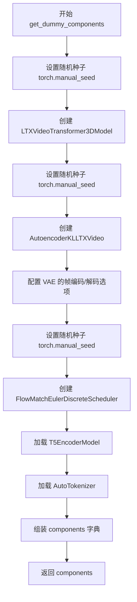
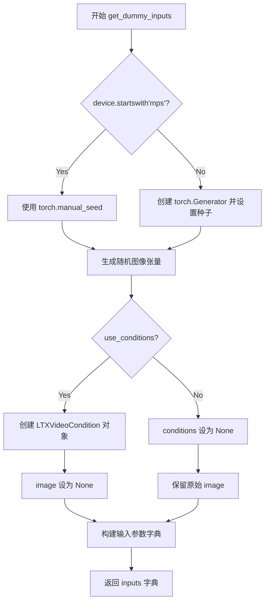
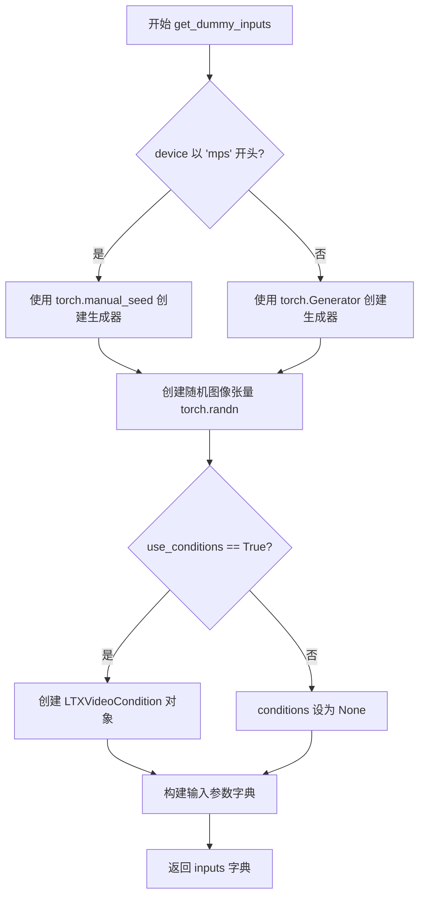
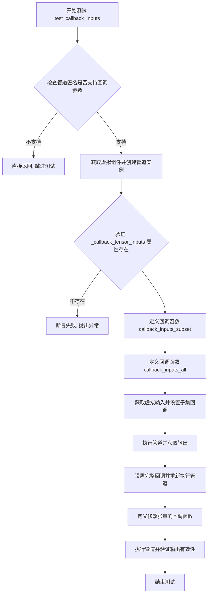
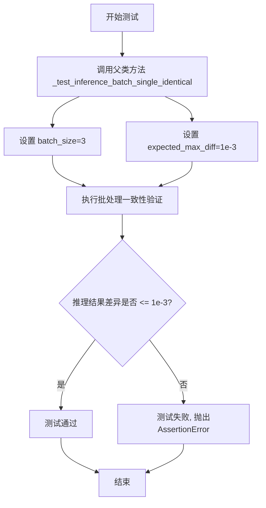
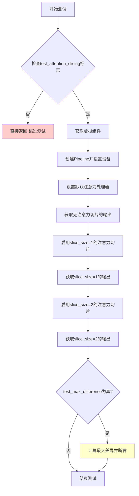
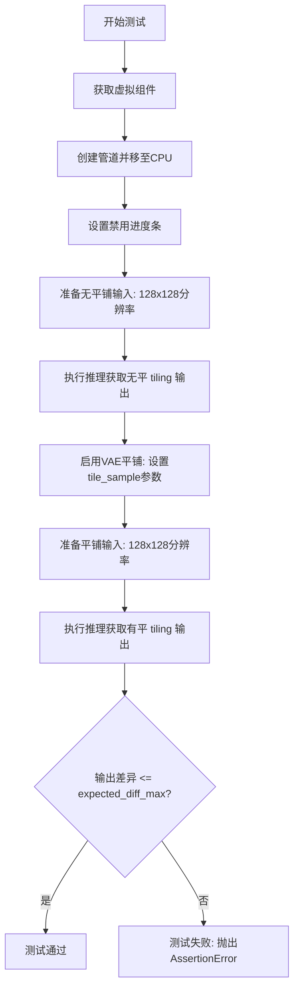

# `diffusers\tests\pipelines\ltx\test_ltx_condition.py` 详细设计文档

这是一个针对 Diffusers 库中 LTXConditionPipeline 的单元测试文件，用于验证视频生成管道在推理、批处理一致性、注意力切片以及 VAE 平铺等场景下的功能正确性和输出稳定性。

## 整体流程

```mermaid
graph TD
    A[开始: test_xxx] --> B[获取组件: get_dummy_components]
B --> C[初始化管道: pipeline_class(**components)]
C --> D[准备输入: get_dummy_inputs]
D --> E{执行管道: pipe(**inputs)]
E --> F[获取结果: frames]
F --> G{断言验证]
G -->|通过| H[测试结束]
G -->|失败| I[抛出 AssertionError]
```

## 类结构

```
object
└── unittest.TestCase
    └── PipelineTesterMixin (混入类)
        └── LTXConditionPipelineFastTests (待测类)
```

## 全局变量及字段


### `enable_full_determinism`
    
调用后设置随机种子以保证测试可复现

类型：`全局函数`
    


### `to_np`
    
将 PyTorch 张量转换为 NumPy 数组

类型：`工具函数`
    


### `torch_device`
    
指定测试使用的设备 (如 'cuda', 'cpu')

类型：`全局变量`
    


### `LTXConditionPipelineFastTests.LTXConditionPipelineFastTests.pipeline_class`
    
当前测试的管道类 (LTXConditionPipeline)

类型：`类型`
    


### `LTXConditionPipelineFastTests.LTXConditionPipelineFastTests.params`
    
管道参数字段集合

类型：`Set`
    


### `LTXConditionPipelineFastTests.LTXConditionPipelineFastTests.batch_params`
    
批处理参数字段集合

类型：`Set`
    


### `LTXConditionPipelineFastTests.LTXConditionPipelineFastTests.image_params`
    
图像参数字段集合

类型：`Set`
    


### `LTXConditionPipelineFastTests.LTXConditionPipelineFastTests.image_latents_params`
    
图像潜在向量参数字段集合

类型：`Set`
    


### `LTXConditionPipelineFastTests.LTXConditionPipelineFastTests.required_optional_params`
    
必选可选参数集合

类型：`Frozenset`
    


### `LTXConditionPipelineFastTests.LTXConditionPipelineFastTests.test_xformers_attention`
    
是否测试 xformers 注意力 (默认 False)

类型：`Boolean`
    
    

## 全局函数及方法


### `LTXConditionPipelineFastTests.get_dummy_components`

该方法为 LTX 视频条件管道测试类初始化所需的模型组件（transformer、VAE、调度器、文本编码器和分词器），以便在单元测试中创建完整的管道实例进行推理验证。

参数：
- （无显式参数，仅包含隐式 `self`）

返回值：`dict`，返回包含 `"transformer"`、`"vae"`、`"scheduler"`、`"text_encoder"` 和 `"tokenizer"` 键的字典，这些键映射到对应的模型或配置对象。

#### 流程图



#### 带注释源码

```python
def get_dummy_components(self):
    """
    初始化测试所需的模型组件。
    
    Returns:
        dict: 包含 transformer、vae、scheduler、text_encoder、tokenizer 的字典
    """
    # 设置随机种子以确保可重复性
    torch.manual_seed(0)
    
    # 创建虚拟的 LTXVideoTransformer3DModel 实例
    # 用于视频生成的 Transformer 主干网络
    transformer = LTXVideoTransformer3DModel(
        in_channels=8,              # 输入通道数
        out_channels=8,             # 输出通道数
        patch_size=1,               # 空间 patch 大小
        patch_size_t=1,             # 时间 patch 大小
        num_attention_heads=4,      # 注意力头数量
        attention_head_dim=8,       # 注意力头维度
        cross_attention_dim=32,     # 交叉注意力维度
        num_layers=1,               # Transformer 层数（最小配置用于测试）
        caption_channels=32,        # 标题/文本嵌入通道数
    )

    # 重新设置随机种子确保 VAE 初始化可重复
    torch.manual_seed(0)
    
    # 创建虚拟的 AutoencoderKLLTXVideo 实例
    # 用于视频的变分自编码器（编码器-解码器）
    vae = AutoencoderKLLTXVideo(
        in_channels=3,                              # RGB 输入通道
        out_channels=3,                             # RGB 输出通道
        latent_channels=8,                          # 潜在空间通道数
        block_out_channels=(8, 8, 8, 8),             # 编码器块输出通道
        decoder_block_out_channels=(8, 8, 8, 8),     # 解码器块输出通道
        layers_per_block=(1, 1, 1, 1, 1),           # 每块的层数
        decoder_layers_per_block=(1, 1, 1, 1, 1),   # 解码器每块层数
        spatio_temporal_scaling=(True, True, False, False),     # 时空缩放配置
        decoder_spatio_temporal_scaling=(True, True, False, False), # 解码器时空缩放
        decoder_inject_noise=(False, False, False, False, False), # 解码器噪声注入
        upsample_residual=(False, False, False, False),           # 上采样残差连接
        upsample_factor=(1, 1, 1, 1),                               # 上采样因子
        timestep_conditioning=False,    # 时间步条件
        patch_size=1,                   # 空间 patch 大小
        patch_size_t=1,                 # 时间 patch 大小
        encoder_causal=True,            # 编码器因果掩码
        decoder_causal=False,           # 解码器因果掩码
    )
    
    # 配置 VAE 使用帧级编码/解码（测试中禁用）
    vae.use_framewise_encoding = False  # 禁用逐帧编码
    vae.use_framewise_decoding = False  # 禁用逐帧解码

    # 设置随机种子用于调度器初始化
    torch.manual_seed(0)
    
    # 创建 Flow Match Euler 离散调度器
    # 用于扩散模型的噪声调度
    scheduler = FlowMatchEulerDiscreteScheduler()
    
    # 加载虚拟的 T5 文本编码器
    text_encoder = T5EncoderModel.from_pretrained("hf-internal-testing/tiny-random-t5")
    
    # 加载虚拟的 T5 分词器
    tokenizer = AutoTokenizer.from_pretrained("hf-internal-testing/tiny-random-t5")

    # 组装所有组件到字典中
    components = {
        "transformer": transformer,    # 视频生成 Transformer
        "vae": vae,                    # 视频 VAE
        "scheduler": scheduler,       # 噪声调度器
        "text_encoder": text_encoder, # 文本编码器
        "tokenizer": tokenizer,        # 文本分词器
    }
    
    # 返回组件字典供管道初始化使用
    return components
```


### `LTXConditionPipelineFastTests.get_dummy_inputs`

该方法为 LTX 视频条件管道测试构造符合管道签名的参数字典，用于生成虚拟（dummy）输入数据，支持两种模式：直接图像输入和条件（conditions）输入模式。

参数：

- `self`：隐式参数，测试类实例本身
- `device`：`str`，目标设备字符串（如 "cpu"、"cuda"），用于指定张量存放设备和创建随机数生成器
- `seed`：`int`（默认值：0），随机种子，用于确保测试结果的可复现性
- `use_conditions`：`bool`（默认值：False），标志位，控制在管道调用时是使用 `LTXVideoCondition` 对象还是直接使用图像张量

返回值：`Dict[str, Any]`，包含符合 `LTXConditionPipeline` 调用签名的参数字典，字典键包括 conditions、image、prompt、negative_prompt、generator、num_inference_steps、guidance_scale、height、width、num_frames、max_sequence_length、output_type

#### 流程图



#### 带注释源码

```python
def get_dummy_inputs(self, device, seed=0, use_conditions=False):
    """
    为 LTX 条件管道测试构造符合签名的虚拟输入参数字典。
    
    参数:
        device: 目标设备字符串
        seed: 随机种子，确保测试可复现
        use_conditions: 是否使用 LTXVideoCondition 对象模式
    
    返回:
        符合管道 __call__ 方法签名的参数字典
    """
    # 针对 Apple MPS 设备使用不同的随机数生成方式
    if str(device).startswith("mps"):
        # MPS 设备使用 torch.manual_seed
        generator = torch.manual_seed(seed)
    else:
        # 其他设备创建指定设备的 Generator 对象
        generator = torch.Generator(device=device).manual_seed(seed)

    # 生成随机图像张量 (1, 3, 32, 32)
    image = torch.randn((1, 3, 32, 32), generator=generator, device=device)
    
    # 根据模式选择条件对象
    if use_conditions:
        # 使用 LTXVideoCondition 包装图像作为条件输入
        conditions = LTXVideoCondition(
            image=image,
        )
    else:
        # 不使用条件模式
        conditions = None

    # 构建完整的管道参数字典
    inputs = {
        "conditions": conditions,                          # 条件对象或 None
        "image": None if use_conditions else image,        # 直接图像或 None
        "prompt": "dance monkey",                          # 文本提示词
        "negative_prompt": "",                             # 负面提示词
        "generator": generator,                            # 随机数生成器
        "num_inference_steps": 2,                          # 推理步数
        "guidance_scale": 3.0,                             # 引导强度
        "height": 32,                                      # 输出高度
        "width": 32,                                       # 输出宽度
        # 8 * k + 1 is the recommendation
        "num_frames": 9,                                   # 帧数量（推荐 8*k+1）
        "max_sequence_length": 16,                        # 最大序列长度
        "output_type": "pt",                              # 输出类型（PyTorch 张量）
    }

    return inputs
```


### `LTXConditionPipelineFastTests.get_dummy_components`

初始化并返回虚拟模型组件（Transformer, VAE, Scheduler, TextEncoder, Tokenizer），用于测试 LTXConditionPipeline 的推理功能。

参数：该函数无参数。

返回值：`Dict[str, Any]`，返回一个包含以下键的字典：
- `transformer`：`LTXVideoTransformer3DModel`，3D 视频变换器模型
- `vae`：`AutoencoderKLLTXVideo`，视频变分自编码器模型
- `scheduler`：`FlowMatchEulerDiscreteScheduler`，基于流匹配的欧拉离散调度器
- `text_encoder`：`T5EncoderModel`，T5 文本编码器模型
- `tokenizer`：`AutoTokenizer`，T5 分词器

#### 流程图

```mermaid
flowchart TD
    A[开始] --> B[设置随机种子 torch.manual_seed(0)]
    B --> C[创建 Transformer: LTXVideoTransformer3DModel]
    C --> D[创建 VAE: AutoencoderKLLTXVideo]
    D --> E[配置 VAE 帧编解码选项]
    E --> F[创建 Scheduler: FlowMatchEulerDiscreteScheduler]
    F --> G[加载 Text Encoder: T5EncoderModel]
    G --> H[加载 Tokenizer: AutoTokenizer]
    H --> I[组装 components 字典]
    I --> J[返回 components]
```

#### 带注释源码

```python
def get_dummy_components(self):
    """
    初始化并返回虚拟模型组件，用于测试 LTXConditionPipeline
    """
    # 设置随机种子以确保可重复性
    torch.manual_seed(0)
    
    # 创建视频变换器模型 (Transformer)
    # 参数: 8通道输入/输出, 4个注意力头, 8维注意力, 32维交叉注意力, 1层
    transformer = LTXVideoTransformer3DModel(
        in_channels=8,
        out_channels=8,
        patch_size=1,
        patch_size_t=1,
        num_attention_heads=4,
        attention_head_dim=8,
        cross_attention_dim=32,
        num_layers=1,
        caption_channels=32,
    )

    # 再次设置随机种子确保 VAE 可重复初始化
    torch.manual_seed(0)
    
    # 创建视频变分自编码器 (VAE)
    # 配置: 3通道 RGB, 8通道潜在空间, 4级编码器/解码器块
    vae = AutoencoderKLLTXVideo(
        in_channels=3,
        out_channels=3,
        latent_channels=8,
        block_out_channels=(8, 8, 8, 8),
        decoder_block_out_channels=(8, 8, 8, 8),
        layers_per_block=(1, 1, 1, 1, 1),
        decoder_layers_per_block=(1, 1, 1, 1, 1),
        spatio_temporal_scaling=(True, True, False, False),
        decoder_spatio_temporal_scaling=(True, True, False, False),
        decoder_inject_noise=(False, False, False, False, False),
        upsample_residual=(False, False, False, False),
        upsample_factor=(1, 1, 1, 1),
        timestep_conditioning=False,
        patch_size=1,
        patch_size_t=1,
        encoder_causal=True,
        decoder_causal=False,
    )
    # 禁用帧级编解码，使用批处理模式
    vae.use_framewise_encoding = False
    vae.use_framewise_decoding = False

    # 设置随机种子确保调度器可重复初始化
    torch.manual_seed(0)
    
    # 创建基于流匹配的欧拉离散调度器
    scheduler = FlowMatchEulerDiscreteScheduler()
    
    # 加载预训练的 T5 小型随机模型作为文本编码器
    text_encoder = T5EncoderModel.from_pretrained("hf-internal-testing/tiny-random-t5")
    
    # 加载对应的 T5 分词器
    tokenizer = AutoTokenizer.from_pretrained("hf-internal-testing/tiny-random-t5")

    # 组装所有组件到字典中
    components = {
        "transformer": transformer,
        "vae": vae,
        "scheduler": scheduler,
        "text_encoder": text_encoder,
        "tokenizer": tokenizer,
    }
    
    # 返回组件字典，供 pipeline 构造函数使用
    return components
```


### `LTXConditionPipelineFastTests.get_dummy_inputs`

该方法是测试类中的辅助函数，用于生成虚拟输入数据（图像、Prompts、参数），以供 LTX 条件视频生成管道进行推理测试。它根据设备类型创建随机生成器，生成模拟图像或条件对象，并返回一个包含管道推理所需全部参数的字典。

**参数：**

- `device`：`str`，目标设备标识符（如 "cpu"、"cuda" 等），用于创建随机数生成器和张量设备
- `seed`：`int`，随机种子，默认为 0，用于确保测试结果的可重复性
- `use_conditions`：`bool`，默认为 False，标志位，指示是否使用 LTXVideoCondition 条件对象而非直接图像输入

**返回值：** `dict`，包含以下键值的字典：
- `conditions`：`LTXVideoCondition | None`，条件对象或 None
- `image`：`torch.Tensor | None`，输入图像张量或 None
- `prompt`：`str`，文本提示词
- `negative_prompt`：`str`，负向提示词
- `generator`：`torch.Generator`，随机数生成器
- `num_inference_steps`：`int`，推理步数
- `guidance_scale`：`float`，引导系数
- `height`：`int`，生成图像高度
- `width`：`int`，生成图像宽度
- `num_frames`：`int`，生成的视频帧数
- `max_sequence_length`：`int`，最大序列长度
- `output_type`：`str`，输出类型

#### 流程图



#### 带注释源码

```python
def get_dummy_inputs(self, device, seed=0, use_conditions=False):
    """
    生成用于 LTX 条件管道推理测试的虚拟输入数据
    
    参数:
        device: 目标设备 (如 "cpu", "cuda")
        seed: 随机种子，用于确保可重复性
        use_conditions: 是否使用条件对象而非直接图像
    
    返回:
        包含管道推理所需全部参数的字典
    """
    # 根据设备类型选择随机数生成器的创建方式
    # MPS 设备需要特殊处理，使用 torch.manual_seed 而非 torch.Generator
    if str(device).startswith("mps"):
        generator = torch.manual_seed(seed)
    else:
        generator = torch.Generator(device=device).manual_seed(seed)

    # 生成随机图像张量，形状为 (1, 3, 32, 32)
    # 使用指定的生成器和设备确保一致性
    image = torch.randn((1, 3, 32, 32), generator=generator, device=device)
    
    # 根据 use_conditions 标志决定使用条件对象还是直接图像
    if use_conditions:
        # 创建 LTXVideoCondition 条件对象，包含图像条件信息
        conditions = LTXVideoCondition(
            image=image,
        )
    else:
        # 不使用条件时设为 None，此时 image 参数将被使用
        conditions = None

    # 构建完整的输入参数字典，包含管道推理所需的所有参数
    inputs = {
        "conditions": conditions,                                    # 条件对象或 None
        "image": None if use_conditions else image,                  # 直接图像或 None（二者选一）
        "prompt": "dance monkey",                                    # 文本提示词
        "negative_prompt": "",                                       # 负向提示词
        "generator": generator,                                      # 随机数生成器
        "num_inference_steps": 2,                                    # 推理步数（测试用小值）
        "guidance_scale": 3.0,                                      # classifier-free guidance 系数
        "height": 32,                                                # 生成高度
        "width": 32,                                                 # 生成宽度
        # 8 * k + 1 is the recommendation
        "num_frames": 9,                                             # 视频帧数（建议值为 8k+1）
        "max_sequence_length": 16,                                   # T5 文本编码器最大序列长度
        "output_type": "pt",                                         # 输出类型为 PyTorch 张量
    }

    return inputs
```


### `LTXConditionPipelineFastTests.test_inference`

该测试方法验证 LTXConditionPipeline 的基本推理流程，通过创建虚拟组件并执行两次推理（分别使用直接图像输入和条件输入），确保输出视频帧的形状正确且两种输入方式产生的输出差异在可接受范围内。

参数：
- `self`：隐式参数，unittest.TestCase 实例本身

返回值：`None`（无返回值），通过 `self.assertEqual` 和 `self.assertLessEqual` 进行断言验证

#### 流程图

```mermaid
flowchart TD
    A[开始 test_inference] --> B[设置设备为 cpu]
    B --> C[调用 get_dummy_components 创建虚拟组件]
    C --> D[使用虚拟组件实例化 LTXConditionPipeline]
    D --> E[将管道移动到 cpu 设备]
    E --> F[设置进度条配置 disable=None]
    F --> G[调用 get_dummy_inputs 获取第一组输入 - 不使用 conditions]
    G --> H[调用 get_dummy_inputs 获取第二组输入 - 使用 conditions]
    H --> I[执行第一次推理: pipe\*\*inputs]
    I --> J[从结果中提取 frames]
    K[执行第二次推理: pipe\*\*inputs2] --> L[从结果中提取 frames]
    J --> L
    L --> M[断言验证: generated_video.shape == (9, 3, 32, 32)]
    M --> N[计算两次输出的最大差异]
    N --> O[断言验证: max_diff <= 1e-3]
    O --> P[结束测试]
```

#### 带注释源码

```python
def test_inference(self):
    """测试基本推理流程，验证输出形状和非空性"""
    # 1. 设置计算设备为 CPU
    device = "cpu"

    # 2. 获取虚拟组件（transformer, vae, scheduler, text_encoder, tokenizer）
    components = self.get_dummy_components()
    
    # 3. 使用虚拟组件实例化 LTXConditionPipeline 管道
    pipe = self.pipeline_class(**components)
    
    # 4. 将管道移至指定设备（CPU）
    pipe.to(device)
    
    # 5. 配置进度条（disable=None 表示不禁用进度条）
    pipe.set_progress_bar_config(disable=None)

    # 6. 获取第一组输入（不使用 conditions，直接使用 image）
    inputs = self.get_dummy_inputs(device)
    
    # 7. 获取第二组输入（使用 conditions=True）
    inputs2 = self.get_dummy_inputs(device, use_conditions=True)
    
    # 8. 执行第一次推理，使用直接图像输入
    # 返回值是一个包含 frames 的对象
    video = pipe(**inputs).frames
    # 提取第一帧（批处理中的第一个样本）
    generated_video = video[0]
    
    # 9. 执行第二次推理，使用条件输入
    video2 = pipe(**inputs2).frames
    generated_video2 = video2[0]

    # 10. 断言验证：输出形状应为 (9帧, 3通道, 32高度, 32宽度)
    # num_frames=9, 通道数=3, height=32, width=32
    self.assertEqual(generated_video.shape, (9, 3, 32, 32))

    # 11. 计算两次推理输出的最大绝对差异
    max_diff = np.abs(generated_video - generated_video2).max()
    
    # 12. 断言验证：最大差异应小于等于 1e-3
    # 确保直接图像输入和条件输入产生一致的输出
    self.assertLessEqual(max_diff, 1e-3)
```

#### 关键组件信息

| 组件名称 | 描述 |
|---------|------|
| `LTXConditionPipeline` | LTX 视频生成管道，整合 transformer、VAE、scheduler、text_encoder |
| `LTXVideoTransformer3DModel` | 3D 视频变换器模型，处理时空注意力 |
| `AutoencoderKLLTXVideo` | VAE 编解码器，用于潜在空间编码/解码 |
| `FlowMatchEulerDiscreteScheduler` | 离散欧拉调度器，用于 Flow Match 采样 |
| `T5EncoderModel` | 文本编码器，将文本提示编码为条件嵌入 |
| `LTXVideoCondition` | 条件输入封装类，用于传递图像条件 |

#### 潜在技术债务与优化空间

1. **测试用例覆盖不足**：
   - 仅测试了 `num_inference_steps=2` 的情况，未覆盖不同步数的推理
   - 缺少对 `guidance_scale` 参数不同值的测试
   - 未验证 `max_sequence_length` 参数的影响

2. **设备兼容性测试缺失**：
   - 仅在 `cpu` 设备上测试，未测试 `cuda` 或 `mps` 设备
   - GPU 推理的正确性和性能未被验证

3. **断言验证不够全面**：
   - 仅验证形状和非空性，未检查输出数值的合理范围
   - 缺少对 NaN 或 Inf 值的检测

4. **测试数据多样性**：
   - 仅使用单一随机种子 (seed=0)
   - 仅测试单一 prompt ("dance monkey")
   - 未测试负提示词 (negative_prompt) 的效果

#### 其它项目

**设计目标**：
- 验证 LTXConditionPipeline 管道能正确执行推理
- 确保直接图像输入和条件输入两种方式产生一致的输出

**约束条件**：
- 输出形状必须为 `(9, 3, 32, 32)` 即 `num_frames=9, channels=3, height=32, width=32`
- 两种输入方式的输出差异必须小于等于 `1e-3`

**错误处理**：
- 测试依赖 `unittest.TestCase` 的断言机制
- 若形状不匹配或差异过大，测试将失败并抛出异常

**依赖项**：
- `diffusers` 库：管道和模型组件
- `transformers` 库：T5 文本编码器
- `numpy`：数值计算和差异比较
- `torch`：张量操作


### `LTXConditionPipelineFastTests.test_callback_inputs`

该测试方法用于验证 LTXConditionPipeline 管道中回调函数 (`callback_on_step_end`) 和张量输入 (`callback_on_step_end_tensor_inputs`) 的合法性，确保管道正确传递允许的张量给回调函数，并允许回调函数修改这些张量。

参数：无（使用 `self` 访问实例属性）

返回值：`None`（`unittest.TestCase` 测试方法无返回值，通过断言验证）

#### 流程图



#### 带注释源码

```python
def test_callback_inputs(self):
    """
    测试管道回调函数 (callback_on_step_end) 和张量输入的合法性
    
    该测试验证:
    1. 管道签名包含回调相关参数
    2. 管道具有 _callback_tensor_inputs 属性
    3. 回调函数只能接收允许的张量输入
    4. 回调函数可以修改张量并影响输出
    """
    # 获取管道 __call__ 方法的签名
    sig = inspect.signature(self.pipeline_class.__call__)
    
    # 检查管道是否支持回调张量输入参数
    has_callback_tensor_inputs = "callback_on_step_end_tensor_inputs" in sig.parameters
    
    # 检查管道是否支持步结束回调参数
    has_callback_step_end = "callback_on_step_end" in sig.parameters

    # 如果管道不支持这些参数, 则跳过测试
    if not (has_callback_tensor_inputs and has_callback_step_end):
        return

    # 获取虚拟组件并实例化管道
    components = self.get_dummy_components()
    pipe = self.pipeline_class(**components)
    pipe = pipe.to(torch_device)
    pipe.set_progress_bar_config(disable=None)
    
    # 断言管道具有 _callback_tensor_inputs 属性
    # 该属性定义了回调函数可以使用的张量变量列表
    self.assertTrue(
        hasattr(pipe, "_callback_tensor_inputs"),
        f" {self.pipeline_class} should have `_callback_tensor_inputs` that defines a list of tensor variables its callback function can use as inputs",
    )

    # 定义回调函数: 仅接收允许张量的子集
    def callback_inputs_subset(pipe, i, t, callback_kwargs):
        """
        回调函数验证 - 仅传递允许张量的子集
        
        参数:
            pipe: 管道实例
            i: 当前推理步索引
            t: 当前时间步
            callback_kwargs: 回调关键字参数字典
            
        返回:
            callback_kwargs: 未修改的回调参数
        """
        # 遍历回调参数中的所有张量
        for tensor_name, tensor_value in callback_kwargs.items():
            # 检查只传递了允许的张量输入
            assert tensor_name in pipe._callback_tensor_inputs

        return callback_kwargs

    # 定义回调函数: 接收所有允许的张量
    def callback_inputs_all(pipe, i, t, callback_kwargs):
        """
        回调函数验证 - 接收所有允许的张量
        
        参数:
            pipe: 管道实例
            i: 当前推理步索引
            t: 当前时间步
            callback_kwargs: 回调关键字参数字典
            
        返回:
            callback_kwargs: 未修改的回调参数
        """
        # 验证所有允许的张量都在回调参数中
        for tensor_name in pipe._callback_tensor_inputs:
            assert tensor_name in callback_kwargs

        # 再次验证回调参数只包含允许的张量
        for tensor_name, tensor_value in callback_kwargs.items():
            assert tensor_name in pipe._callback_tensor_inputs

        return callback_kwargs

    # 获取虚拟输入数据
    inputs = self.get_dummy_inputs(torch_device)

    # 测试1: 仅传递张量子集给回调
    # 设置仅接收 'latents' 作为回调输入
    inputs["callback_on_step_end"] = callback_inputs_subset
    inputs["callback_on_step_end_tensor_inputs"] = ["latents"]
    output = pipe(**inputs)[0]

    # 测试2: 传递所有允许的张量给回调
    # 使用管道定义的所有回调张量输入
    inputs["callback_on_step_end"] = callback_inputs_all
    inputs["callback_on_step_end_tensor_inputs"] = pipe._callback_tensor_inputs
    output = pipe(**inputs)[0]

    # 定义回调函数: 在最后一步修改 latents 张量
    def callback_inputs_change_tensor(pipe, i, t, callback_kwargs):
        """
        回调函数示例 - 修改张量值
        
        参数:
            pipe: 管道实例
            i: 当前推理步索引
            t: 当前时间步
            callback_kwargs: 回调关键字参数字典
            
        返回:
            callback_kwargs: 修改后的回调参数
        """
        # 检查是否是最后一步
        is_last = i == (pipe.num_timesteps - 1)
        if is_last:
            # 将 latents 修改为零张量
            callback_kwargs["latents"] = torch.zeros_like(callback_kwargs["latents"])
        return callback_kwargs

    # 测试3: 通过回调修改张量
    inputs["callback_on_step_end"] = callback_inputs_change_tensor
    inputs["callback_on_step_end_tensor_inputs"] = pipe._callback_tensor_inputs
    output = pipe(**inputs)[0]
    
    # 验证修改后的输出有效性 (输出和应小于合理阈值)
    assert output.abs().sum() < 1e10
```


### `LTXConditionPipelineFastTests.test_inference_batch_single_identical`

测试批处理模式下单帧与单帧推理的一致性，验证使用批处理（多帧同时推理）与非批处理（单帧单独推理）产生相同结果的能力，确保模型在两种推理模式下输出一致。

参数：

- `self`：`LTXConditionPipelineFastTests`，隐式参数，表示测试类实例本身

返回值：`None`，无返回值（测试方法执行断言，不返回具体值）

#### 流程图



#### 带注释源码

```python
def test_inference_batch_single_identical(self):
    """
    测试批处理模式下单帧与单帧推理的一致性。
    
    该测试方法验证使用批处理模式（多个条件同时推理）与非批处理模式
    （逐个条件单独推理）产生的输出结果是否一致。这是确保模型在两种
    推理模式下都能正确工作的重要测试用例。
    
    测试通过调用父类 PipelineTesterMixin 的 _test_inference_batch_single_identical 
    方法实现，该方法会：
    1. 创建 pipeline 实例
    2. 分别使用批处理和单帧模式进行推理
    3. 比较两种模式的输出差异
    4. 断言差异小于指定的阈值 (1e-3)
    """
    # 调用父类的批处理一致性测试方法
    # batch_size=3: 使用3个样本进行批处理测试
    # expected_max_diff=1e-3: 允许的最大差异阈值为0.001
    self._test_inference_batch_single_identical(batch_size=3, expected_max_diff=1e-3)
```


### `LTXConditionPipelineFastTests.test_attention_slicing_forward_pass`

测试注意力切片 (Attention Slicing) 功能对推理结果的影响，验证启用注意力切片后不会改变模型的输出结果。

参数：

- `test_max_difference`：`bool`，默认为 `True`，是否测试最大差异
- `test_mean_pixel_difference`：`bool`，默认为 `True`，是否测试平均像素差异
- `expected_max_diff`：`float`，默认为 `1e-3`，预期的最大差异阈值

返回值：`None`，无返回值（该方法为测试用例，通过断言验证结果）

#### 流程图



#### 带注释源码

```python
def test_attention_slicing_forward_pass(
    self, test_max_difference=True, test_mean_pixel_difference=True, expected_max_diff=1e-3
):
    """
    测试注意力切片功能对推理结果的影响。
    
    参数:
        test_max_difference: 是否测试最大差异
        test_mean_pixel_difference: 是否测试平均像素差异
        expected_max_diff: 预期的最大差异阈值
    """
    # 如果注意力切片测试被禁用，则跳过该测试
    if not self.test_attention_slicing:
        return

    # 获取虚拟组件（transformer, vae, scheduler, text_encoder, tokenizer）
    components = self.get_dummy_components()
    
    # 创建Pipeline实例
    pipe = self.pipeline_class(**components)
    
    # 为所有支持attention processor的组件设置默认的attention processor
    for component in pipe.components.values():
        if hasattr(component, "set_default_attn_processor"):
            component.set_default_attn_processor()
    
    # 将pipeline移动到测试设备
    pipe.to(torch_device)
    
    # 设置进度条配置
    pipe.set_progress_bar_config(disable=None)

    # 获取生成器设备
    generator_device = "cpu"
    
    # 获取测试输入（不启用注意力切片）
    inputs = self.get_dummy_inputs(generator_device)
    
    # 执行推理，获取无注意力切片时的输出
    output_without_slicing = pipe(**inputs)[0]

    # 启用注意力切片，slice_size=1
    pipe.enable_attention_slicing(slice_size=1)
    inputs = self.get_dummy_inputs(generator_device)
    output_with_slicing1 = pipe(**inputs)[0]

    # 启用注意力切片，slice_size=2
    pipe.enable_attention_slicing(slice_size=2)
    inputs = self.get_dummy_inputs(generator_device)
    output_with_slicing2 = pipe(**inputs)[0]

    # 如果需要测试最大差异
    if test_max_difference:
        # 计算slice_size=1与无切片输出的最大差异
        max_diff1 = np.abs(to_np(output_with_slicing1) - to_np(output_without_slicing)).max()
        
        # 计算slice_size=2与无切片输出的最大差异
        max_diff2 = np.abs(to_np(output_with_slicing2) - to_np(output_without_slicing)).max()
        
        # 断言：注意力切片不应该影响推理结果
        self.assertLess(
            max(max_diff1, max_diff2),
            expected_max_diff,
            "Attention slicing should not affect the inference results",
        )
```


### `LTXConditionPipelineFastTests.test_vae_tiling`

测试 VAE 平铺 (Tiling) 功能在处理高分辨率图像时的有效性和误差范围，验证启用平铺后的输出与未启用时的差异在可接受范围内。

参数：

- `self`：隐式参数，`unittest.TestCase`，测试类实例本身
- `expected_diff_max`：`float`，期望的最大差异阈值，默认为 0.2

返回值：无返回值（`None`），通过 `assert` 断言验证结果

#### 流程图



#### 带注释源码

```python
def test_vae_tiling(self, expected_diff_max: float = 0.2):
    """
    测试 VAE 平铺 (Tiling) 功能在处理高分辨率图像时的有效性和误差范围
    
    参数:
        expected_diff_max: float, 期望的最大差异阈值，默认为 0.2
    """
    # 确定运行设备为 CPU
    generator_device = "cpu"
    
    # 获取虚拟组件（transformer, vae, scheduler, text_encoder, tokenizer）
    components = self.get_dummy_components()
    
    # 使用虚拟组件创建 LTXConditionPipeline 管道实例
    pipe = self.pipeline_class(**components)
    
    # 将管道移至 CPU 设备
    pipe.to("cpu")
    
    # 设置进度条配置，disable=None 表示不禁用进度条
    pipe.set_progress_bar_config(disable=None)
    
    # --- 第一部分：未启用平铺的推理 ---
    
    # 获取虚拟输入参数
    inputs = self.get_dummy_inputs(generator_device)
    
    # 设置高分辨率图像参数：128x128
    inputs["height"] = inputs["width"] = 128
    
    # 执行推理（未启用 VAE tiling），获取输出
    output_without_tiling = pipe(**inputs)[0]
    
    # --- 第二部分：启用平铺的推理 ---
    
    # 启用 VAE 平铺功能，并设置平铺采样参数
    # tile_sample_min_height/width: 最小平铺块高度/宽度
    # tile_sample_stride_height/width: 平铺块步幅，控制重叠区域
    pipe.vae.enable_tiling(
        tile_sample_min_height=96,
        tile_sample_min_width=96,
        tile_sample_stride_height=64,
        tile_sample_stride_width=64,
    )
    
    # 重新获取虚拟输入参数（确保generator状态独立）
    inputs = self.get_dummy_inputs(generator_device)
    
    # 再次设置高分辨率图像参数
    inputs["height"] = inputs["width"] = 128
    
    # 执行推理（启用 VAE tiling），获取输出
    output_with_tiling = pipe(**inputs)[0]
    
    # --- 第三部分：验证结果 ---
    
    # 断言：比较无平铺与有平铺输出的最大差异
    # 差异应小于 expected_diff_max (默认0.2)，确保平铺不影响生成质量
    self.assertLess(
        (to_np(output_without_tiling) - to_np(output_with_tiling)).max(),
        expected_diff_max,
        "VAE tiling should not affect the inference results",
    )
```

## 关键组件


### LTXConditionPipeline

LTXConditionPipeline 是基于 T5 文本编码器和 LTXVideoTransformer3DModel 变换器的条件视频生成管道，支持图像条件输入和文本提示生成视频。

### LTXVideoTransformer3DModel

LTXVideoTransformer3DModel 是用于 LTXVideo 生成的 3D 变换器模型，处理时空_patchify_和交叉注意力机制，实现基于文本和图像条件的视频帧预测。

### AutoencoderKLLTXVideo

AutoencoderKLLTXVideo 是 LTX 视频的变分自编码器（VAE），支持分块编码/解码、时空缩放和 VAE tiling，用于视频潜在空间的压缩与重建。

### FlowMatchEulerDiscreteScheduler

FlowMatchEulerDiscreteScheduler 是基于欧拉离散方法的流匹配调度器，用于扩散模型推理过程中的时间步调度和噪声预测。

### LTXVideoCondition

LTXVideoCondition 是视频生成的条件类，封装图像条件输入，支持基于图像条件的视频生成流程。

### T5EncoderModel

T5EncoderModel 是基于 T5 架构的文本编码器，将文本提示编码为文本嵌入向量，作为生成模型的交叉注意力条件输入。

### AutoTokenizer

AutoTokenizer 是用于 T5 文本模型的 tokenizer，将文本字符串转换为 token ID 序列，供文本编码器处理。

### 注意力切片（Attention Slicing）

注意力切片是一种内存优化技术，通过将注意力计算分片处理降低显存占用，支持 set_default_attn_processor 和 enable_attention_slicing 接口。

### VAE Tiling

VAE Tiling 是一种针对大分辨率图像/视频的 VAE 推理优化技术，通过分块编码/解码避免内存溢出，支持 tile_sample_min_height/width 和 tile_sample_stride_height/width 参数配置。

### 回调机制（Callback）

回调机制支持在推理每一步结束后执行自定义函数，支持 callback_on_step_end 和 callback_on_step_end_tensor_inputs 参数，允许修改中间结果如 latents。


## 问题及建议


### 已知问题

-   **测试方法参数不完整**：`test_attention_slicing_forward_pass` 方法定义了三个参数（`test_max_difference`、`test_mean_pixel_difference`、`expected_max_diff`），但在调用 `_test_inference_batch_single_identical` 时未传递这些参数，导致测试行为不确定
-   **未使用的变量**：在 `test_callback_inputs` 方法中，变量 `output` 被多次赋值但从未在断言中使用，测试逻辑不完整
-   **硬编码设备和种子**：`device = "cpu"` 硬编码在 `test_inference` 方法中，且 `torch.manual_seed(0)` 在 `get_dummy_components` 中重复调用，可能导致测试之间的隐式依赖
-   **条件测试未执行**：`test_xformers_attention = False` 且 `test_attention_slicing_forward_pass` 中有 `if not self.test_attention_slicing: return` 的判断，但 `test_attention_slicing` 属性未在类中定义，可能导致某些测试分支永远不会执行
-   **MPS设备特殊处理不一致**：在 `get_dummy_inputs` 中对 MPS 设备做了特殊处理（使用 `torch.manual_seed` 代替 `torch.Generator`），但这种不一致的处理方式可能导致在 MPS 设备上测试时行为不同
-   **魔法数字**：代码中存在多个硬编码的数值（如 `9` 帧、`32` 分辨率、`1e-3` 阈值等），缺乏常量定义，可读性和可维护性较差
-   **缺失的断言**：在 `test_inference` 中只验证了生成的视频形状和两个输出之间的差异，但没有验证输出内容的合理性和数值范围

### 优化建议

-   **统一设备管理**：将设备配置提取为类属性或测试 fixture，避免在每个测试方法中硬编码设备类型
-   **完善测试断言**：在 `test_callback_inputs` 等方法中为所有 `output` 变量添加有意义的断言，确保测试真正验证了预期行为
-   **提取常量**：将魔法数字定义为类常量或模块级常量，并添加清晰的注释说明其含义和来源
-   **修复测试方法调用**：确保 `test_attention_slicing_forward_pass` 被正确调用，或者将其参数改为默认值以避免调用时的歧义
-   **统一随机种子管理**：考虑使用 pytest 的 fixture 或类级别的 `setUp` 方法来管理随机种子，避免在每个方法中重复设置
-   **添加设备兼容性检查**：将 MPS 设备的特殊处理抽象为统一的接口，确保在不同设备上测试行为一致
-   **增加边界条件测试**：添加对异常输入（如负数帧数、零分辨率等）的测试覆盖，提高代码的健壮性

## 其它


### 设计目标与约束

本测试文件旨在验证LTXConditionPipeline的条件视频生成能力，确保管道在给定条件图像（condition）时能够正确生成视频内容。测试覆盖了单次推理、批处理一致性、注意力切片、VAE平铺等核心功能。设计约束包括：不支持cross_attention_kwargs参数；必须支持callback_on_step_end和callback_on_step_end_tensor_inputs回调机制；测试必须在CPU和CUDA设备上都能运行；生成的视频帧数必须符合num_frames参数要求。

### 错误处理与异常设计

代码中的错误处理主要体现在以下几个方面：1）callback机制检测：test_callback_inputs方法会检查pipeline是否实现了callback_on_step_end和callback_on_step_end_tensor_inputs参数，如果不支持则直接返回；2）设备兼容性处理：在get_dummy_inputs中特别处理了MPS设备，使用torch.manual_seed替代torch.Generator；3）张量输入验证：回调函数中验证传入的tensor_name是否在_callback_tensor_inputs列表中，防止非法参数传入；4）数值精度验证：使用np.abs().max()比较生成结果的差异，确保数值在可接受范围内。

### 数据流与状态机

测试数据流如下：1）初始化阶段：get_dummy_components创建transformer、vae、scheduler、text_encoder、tokenizer等组件；2）输入准备阶段：get_dummy_inputs根据device和seed生成条件图像、prompt、负提示词等输入参数；3）推理执行阶段：pipe(**inputs)调用pipeline的__call__方法执行推理；4）结果验证阶段：检查输出frames的shape、数值差异等。状态机主要体现在：管道的set_progress_bar_config用于控制进度条显示状态；enable_attention_slicing和enable_tiling用于切换不同的处理模式。

### 外部依赖与接口契约

本测试文件依赖以下外部组件和接口：1）transformers库：T5EncoderModel和AutoTokenizer用于文本编码；2）diffusers库：LTXConditionPipeline、AutoencoderKLLTXVideo、FlowMatchEulerDiscreteScheduler、LTXVideoTransformer3DModel等核心组件；3）测试框架：unittest.TestCase和PipelineTesterMixin；4）工具库：numpy、torch、inspect。对外提供的接口包括：pipeline_class属性指向LTXConditionPipeline类；params、batch_params、image_params等参数集定义了可配置的输入维度。

### 性能考虑

测试中涉及的性能相关特性包括：1）注意力切片（Attention Slicing）：通过enable_attention_slicing测试不同slice_size（1和2）对推理结果的影响，验证数值一致性；2）VAE平铺（Tiling）：test_vae_tiling测试在高分辨率（128x128）下启用平铺后的结果与不使用平铺的差异，expected_diff_max设为0.2允许一定的数值误差；3）确定性控制：通过enable_full_determinism和固定的随机种子确保测试可复现；4）设备兼容性：支持CPU、CUDA和MPS设备。

### 测试策略

测试采用以下策略：1）单元测试框架：使用unittest.TestCase作为基础，每个测试方法独立运行；2）Dummy组件策略：使用get_dummy_components创建轻量级的虚拟模型（tiny-random-t5、小尺寸transformer和vae），加快测试速度；3）对比验证：test_inference对比使用conditions和直接使用image两种方式的输出差异；4）回归测试：通过test_inference_batch_single_identical验证批处理和单样本处理的一致性；5）参数化测试：支持自定义expected_max_diff、test_max_difference等参数。

### 版本兼容性

代码中处理的版本兼容性问题包括：1）MPS设备支持：通过str(device).startswith("mps")判断是否为Apple Silicon设备，采用不同的随机数生成方式；2）回调机制兼容性：检查pipeline_class.__call__的签名中是否包含callback_on_step_end_tensor_inputs和callback_on_step_end参数；3）xFormers注意力：test_xformers_attention设为False，表示默认不测试xFormers注意力优化。

### 配置与参数说明

关键配置参数说明：1）num_inference_steps=2：推理步数，测试时使用较小值加快速度；2）guidance_scale=3.0：引导强度；3）height/width=32：生成视频的分辨率；4）num_frames=9：生成帧数（必须满足8*k+1格式）；5）max_sequence_length=16：文本序列最大长度；6）output_type="pt"：输出类型为PyTorch张量。

### 安全考虑

代码中未包含直接的安全敏感操作，但测试文件本身需要注意的是：1）模型加载：使用hf-internal-testing/tiny-random-t5测试模型，避免加载真实敏感模型；2）随机性控制：通过固定种子确保测试可复现，避免因随机性导致的 flaky 测试；3）内存管理：使用较小的图像尺寸（32x32）和帧数（9帧）控制内存占用。

### 扩展性考虑

测试框架设计具有良好的扩展性：1）PipelineTesterMixin继承：可以复用其他pipeline的通用测试逻辑；2）参数集合定义：通过params、batch_params、image_params等集合定义，方便添加新参数；3）测试方法独立：每个test_xxx方法相互独立，可单独运行；4）组件化设计：get_dummy_components返回的components字典可以方便地替换或添加新组件。

    