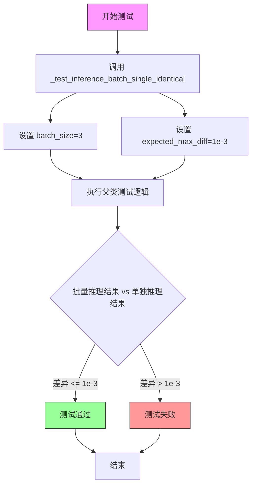
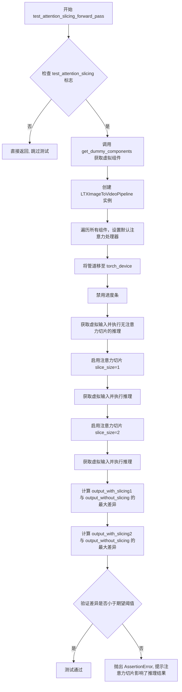
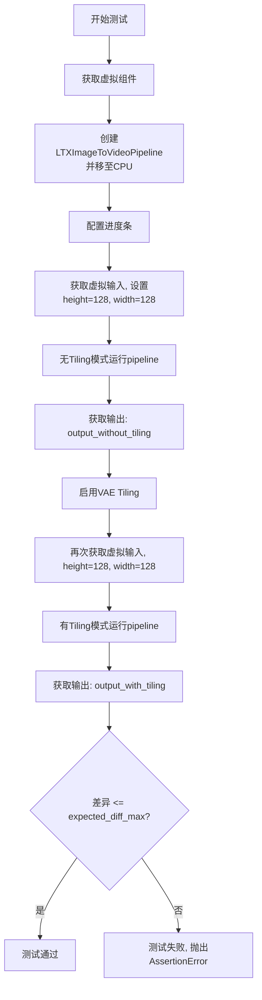

# `diffusers\tests\pipelines\ltx\test_ltx_image2video.py` 详细设计文档

这是一个针对LTXImageToVideoPipeline（图像到视频生成管道）的单元测试文件，通过模拟输入和模型组件，验证管道在推理执行、回调处理、批处理一致性、注意力切片以及VAE平铺等关键功能上的正确性和性能。

## 整体流程

```mermaid
graph TD
    Start([开始]) --> Import[导入依赖库]
    Import --> DefineClass[定义测试类 LTXImageToVideoPipelineFastTests]
    DefineClass --> TestInference[执行 test_inference]
    TestInference --> Components[调用 get_dummy_components 初始化虚拟模型]
    Components --> Inputs[调用 get_dummy_inputs 构造输入]
    Inputs --> RunPipe[实例化管道并执行推理 pipe(**inputs)]
    RunPipe --> Assert[断言输出视频的形状 (9, 3, 32, 32) 和数值差异]
    DefineClass --> TestCallback[执行 test_callback_inputs]
    TestCallback --> CheckSig[检查回调函数签名和 _callback_tensor_inputs]
    CheckSig --> TestSubset[测试传入部分 tensor inputs]
    TestSubset --> TestAll[测试传入全部 tensor inputs]
    TestAll --> TestChange[测试修改 callback 中的 tensor]
    DefineClass --> TestBatch[执行 test_inference_batch_single_identical]
    DefineClass --> TestSlice[执行 test_attention_slicing_forward_pass]
    TestSlice --> CompareSlice[对比有/无注意力切片的输出]
    DefineClass --> TestTiling[执行 test_vae_tiling]
    TestTiling --> CompareTiling[对比有/无 VAE tiling 的输出]
```

## 类结构

```
LTXImageToVideoPipelineFastTests (测试类)
├── unittest.TestCase (基类)
└── PipelineTesterMixin (混入类，提供通用测试方法)
    ├── get_dummy_components (方法: 创建虚拟模型组件)
    ├── get_dummy_inputs (方法: 创建虚拟输入数据)
    └── test_* (方法: 各项测试用例)
```

## 全局变量及字段


### `LTXImageToVideoPipelineFastTests.pipeline_class`
    
The pipeline class being tested, referencing LTXImageToVideoPipeline from diffusers

类型：`type`
    


### `LTXImageToVideoPipelineFastTests.params`
    
Set of text-to-image pipeline parameters, excluding cross_attention_kwargs

类型：`set`
    


### `LTXImageToVideoPipelineFastTests.batch_params`
    
Set of batch parameters including image parameter for text-to-image pipeline

类型：`set`
    


### `LTXImageToVideoPipelineFastTests.image_params`
    
Set of image parameters for text-to-image pipeline

类型：`set`
    


### `LTXImageToVideoPipelineFastTests.image_latents_params`
    
Set of image latents parameters for text-to-image pipeline

类型：`set`
    


### `LTXImageToVideoPipelineFastTests.required_optional_params`
    
Frozenset of optional parameters that are required for pipeline inference

类型：`frozenset`
    


### `LTXImageToVideoPipelineFastTests.test_xformers_attention`
    
Boolean flag indicating whether to test xformers attention mechanism

类型：`bool`
    
    

## 全局函数及方法


### `LTXImageToVideoPipelineFastTests.get_dummy_components`

该方法用于创建虚拟（dummy）组件字典，为LTXImageToVideoPipeline的单元测试提供所需的模型组件，包括Transformer、VAE、调度器、文本编码器和分词器。

参数：
- 无（仅包含`self`参数）

返回值：`Dict[str, Any]`，返回包含虚拟组件的字典，键为组件名称，值为对应的模型或分词器对象。

#### 流程图

```mermaid
flowchart TD
    A[开始 get_dummy_components] --> B[设置随机种子 torch.manual_seed(0)]
    B --> C[创建虚拟 Transformer<br/>LTXVideoTransformer3DModel]
    C --> D[设置随机种子 torch.manual_seed(0)]
    D --> E[创建虚拟 VAE<br/>AutoencoderKLLTXVideo]
    E --> F[配置 VAE 属性<br/>use_framewise_encoding/decoding = False]
    F --> G[设置随机种子 torch.manual_seed(0)]
    G --> H[创建虚拟 Scheduler<br/>FlowMatchEulerDiscreteScheduler]
    H --> I[加载虚拟 Text Encoder<br/>T5EncoderModel]
    I --> J[加载虚拟 Tokenizer<br/>AutoTokenizer]
    J --> K[组装组件字典]
    K --> L[返回 components 字典]
    
    style A fill:#f9f,stroke:#333
    style L fill:#9f9,stroke:#333
```

#### 带注释源码

```python
def get_dummy_components(self):
    """
    创建用于测试的虚拟组件字典
    
    该方法初始化所有必需的模型组件，包括：
    - Transformer: 用于视频生成的Transformer模型
    - VAE: 变分自编码器用于潜在空间编码/解码
    - Scheduler: 扩散调度器
    - Text Encoder: 文本编码器
    - Tokenizer: 文本分词器
    
    Returns:
        dict: 包含所有虚拟组件的字典
    """
    # 设置随机种子确保测试可重复性
    torch.manual_seed(0)
    
    # 创建虚拟Transformer模型
    # 参数配置：8通道输入/输出，4个注意力头，每个头8维，1层，32维交叉注意力
    transformer = LTXVideoTransformer3DModel(
        in_channels=8,           # 输入通道数
        out_channels=8,         # 输出通道数
        patch_size=1,           # 空间patch大小
        patch_size_t=1,         # 时间patch大小
        num_attention_heads=4,  # 注意力头数量
        attention_head_dim=8,   # 注意力头维度
        cross_attention_dim=32, # 交叉注意力维度
        num_layers=1,           # Transformer层数
        caption_channels=32,    # _caption特征通道数
    )

    # 重新设置随机种子确保VAE初始化独立
    torch.manual_seed(0)
    
    # 创建虚拟VAE模型
    # 配置为处理3通道RGB图像，8通道潜在表示
    vae = AutoencoderKLLTXVideo(
        in_channels=3,           # RGB图像通道数
        out_channels=3,          # 输出通道数
        latent_channels=8,       # 潜在空间通道数
        block_out_channels=(8, 8, 8, 8),      # 编码器块输出通道
        decoder_block_out_channels=(8, 8, 8, 8),  # 解码器块输出通道
        layers_per_block=(1, 1, 1, 1, 1),     # 每个块的层数
        decoder_layers_per_block=(1, 1, 1, 1, 1),  # 解码器每块层数
        # 时空缩放配置：[时间缩放, 空间缩放1, 空间缩放2, ...]
        spatio_temporal_scaling=(True, True, False, False),
        decoder_spatio_temporal_scaling=(True, True, False, False),
        decoder_inject_noise=(False, False, False, False, False),  # 解码器噪声注入
        upsample_residual=(False, False, False, False),  # 上采样残差连接
        upsample_factor=(1, 1, 1, 1),   # 上采样因子
        timestep_conditioning=False,    # 时间步条件
        patch_size=1,                   # Patch大小
        patch_size_t=1,                 # 时间Patch大小
        encoder_causal=True,            # 编码器因果掩码
        decoder_causal=False,           # 解码器非因果
    )
    
    # 禁用帧级编解码，使用批量处理模式
    vae.use_framewise_encoding = False  # 禁用帧级编码
    vae.use_framewise_decoding = False  # 禁用帧级解码

    # 重新设置随机种子确保Scheduler初始化独立
    torch.manual_seed(0)
    
    # 创建欧拉离散调度器（Flow Match变体）
    scheduler = FlowMatchEulerDiscreteScheduler()
    
    # 加载虚拟T5文本编码器（从测试仓库）
    text_encoder = T5EncoderModel.from_pretrained("hf-internal-testing/tiny-random-t5")
    
    # 加载虚拟T5分词器
    tokenizer = AutoTokenizer.from_pretrained("hf-internal-testing/tiny-random-t5")

    # 组装组件字典
    components = {
        "transformer": transformer,    # 视频生成Transformer
        "vae": vae,                     # 变分自编码器
        "scheduler": scheduler,         # 扩散调度器
        "text_encoder": text_encoder,   # 文本编码器
        "tokenizer": tokenizer,         # 分词器
    }
    
    return components  # 返回组件字典供pipeline使用
```


### `LTXImageToVideoPipelineFastTests.get_dummy_inputs`

该方法是一个测试辅助函数，用于生成虚拟输入参数，以便对 LTX Image-to-Video pipeline 进行单元测试。它根据传入的设备和随机种子创建模拟的图像、生成器和其他推理参数。

参数：

- `self`：隐式参数，测试类实例本身
- `device`：设备参数，用于指定计算设备（如 "cpu"、"cuda" 等）
- `seed`：整数，默认值为 0，用于控制随机数生成的种子

返回值：`字典`，包含以下键值对：
- `image`：torch.Tensor - 形状为 (1, 3, 32, 32) 的随机图像张量
- `prompt`：字符串 - 输入提示词 "dance monkey"
- `negative_prompt`：字符串 - 负向提示词为空字符串
- `generator`：torch.Generator - 随机数生成器
- `num_inference_steps`：整数 - 推理步数设为 2
- `guidance_scale`：浮点数 - 引导比例设为 3.0
- `height`：整数 - 输出高度设为 32
- `width`：整数 - 输出宽度设为 32
- `num_frames`：整数 - 生成帧数设为 9
- `max_sequence_length`：整数 - 最大序列长度设为 16
- `output_type`：字符串 - 输出类型设为 "pt"（PyTorch 张量）

#### 流程图

```mermaid
flowchart TD
    A[开始 get_dummy_inputs] --> B{device 是否以 'mps' 开头?}
    B -->|是| C[使用 torch.manual_seed(seed)]
    B -->|否| D[创建 torch.Generator device=device 并设置种子]
    C --> E[创建随机图像张量]
    D --> E
    E --> F[构建输入字典 inputs]
    F --> G[包含 image, prompt, negative_prompt, generator 等]
    F --> H[设置 num_inference_steps=2, guidance_scale=3.0]
    F --> I[设置 height=32, width=32, num_frames=9]
    F --> J[设置 max_sequence_length=16, output_type='pt']
    G --> K[返回 inputs 字典]
    H --> K
    I --> K
    J --> K
    K --> L[结束]
```

#### 带注释源码

```python
def get_dummy_inputs(self, device, seed=0):
    """
    生成用于测试的虚拟输入参数
    
    参数:
        device: str - 计算设备（如 'cpu', 'cuda', 'mps'）
        seed: int - 随机种子，默认值为 0
    
    返回:
        dict: 包含 pipeline 推理所需的所有输入参数
    """
    # 根据设备类型选择随机生成器的创建方式
    # MPS 设备需要特殊处理，不能使用 torch.Generator
    if str(device).startswith("mps"):
        generator = torch.manual_seed(seed)
    else:
        generator = torch.Generator(device=device).manual_seed(seed)

    # 创建形状为 (batch=1, channels=3, height=32, width=32) 的随机图像张量
    # 使用指定的生成器以确保可重复性
    image = torch.rand((1, 3, 32, 32), generator=generator, device=device)

    # 构建完整的输入参数字典
    inputs = {
        "image": image,                     # 输入图像张量
        "prompt": "dance monkey",            # 文本提示词
        "negative_prompt": "",               # 负向提示词（空）
        "generator": generator,             # 随机数生成器确保可重复性
        "num_inference_steps": 2,            # 推理步数（较少用于快速测试）
        "guidance_scale": 3.0,               # Classifier-free guidance 强度
        "height": 32,                       # 输出图像高度
        "width": 32,                        # 输出图像宽度
        # 8 * k + 1 是推荐帧数公式（k为整数）
        "num_frames": 9,                    # 生成视频的帧数
        "max_sequence_length": 16,          # 文本编码器的最大序列长度
        "output_type": "pt",                # 输出格式为 PyTorch 张量
    }

    return inputs
```


### `LTXImageToVideoPipelineFastTests.test_inference`

该方法是 `LTXImageToVideoPipelineFastTests` 类的推理测试方法，用于验证 LTXImageToVideoPipeline 在给定虚拟组件和输入的情况下能否正确执行图像到视频的生成任务，并通过断言验证输出视频的形状和数值合理性。

参数：无（仅包含 `self` 隐式参数）

返回值：`None`，该方法为单元测试方法，不返回任何值，通过 `unittest` 断言验证结果

#### 流程图

```mermaid
flowchart TD
    A[开始 test_inference 测试] --> B[设置设备为 CPU]
    B --> C[调用 get_dummy_components 获取虚拟组件]
    C --> D[使用虚拟组件实例化 LTXImageToVideoPipeline]
    D --> E[将管道移至指定设备 CPU]
    E --> F[设置进度条配置 disable=None]
    F --> G[调用 get_dummy_inputs 获取虚拟输入]
    G --> H[执行管道推理: pipe\*\*inputs]
    H --> I[获取生成的视频 frames]
    I --> J[提取第一帧视频: video[0]]
    J --> K{断言验证}
    K --> L[验证视频形状为 (9, 3, 32, 32)]
    L --> M[生成随机期望视频]
    M --> N[计算生成视频与期望视频的最大绝对差异]
    N --> O{断言验证}
    O --> P[验证最大差异 <= 1e10]
    P --> Q[测试通过]
    
    style K fill:#ff9999
    style O fill:#ff9999
```

#### 带注释源码

```python
def test_inference(self):
    """
    测试 LTXImageToVideoPipeline 的推理功能
    
    该测试方法验证管道能够:
    1. 使用虚拟组件正确初始化
    2. 接受标准输入参数并执行推理
    3. 生成符合预期形状的视频张量
    4. 生成的数值在合理范围内
    """
    
    # 步骤1: 设置测试设备为 CPU
    # 注: 对于 MPS 设备需要特殊处理，但此处固定使用 CPU
    device = "cpu"

    # 步骤2: 获取虚拟组件
    # 调用 get_dummy_components 方法创建测试所需的全部组件:
    # - transformer: LTXVideoTransformer3DModel (视频变换器)
    # - vae: AutoencoderKLLTXVideo (变分自编码器)
    # - scheduler: FlowMatchEulerDiscreteScheduler (调度器)
    # - text_encoder: T5EncoderModel (文本编码器)
    # - tokenizer: AutoTokenizer (分词器)
    components = self.get_dummy_components()
    
    # 步骤3: 使用虚拟组件实例化管道
    # pipeline_class 即 LTXImageToVideoPipeline
    pipe = self.pipeline_class(**components)
    
    # 步骤4: 将管道移至指定设备
    pipe.to(device)
    
    # 步骤5: 配置进度条
    # disable=None 表示不禁用进度条
    pipe.set_progress_bar_config(disable=None)

    # 步骤6: 获取虚拟输入
    # 包含以下字段:
    # - image: 随机生成的输入图像 (1, 3, 32, 32)
    # - prompt: "dance monkey"
    # - negative_prompt: ""
    # - generator: 随机数生成器
    # - num_inference_steps: 2 (推理步数)
    # - guidance_scale: 3.0 (引导尺度)
    # - height: 32, width: 32 (输出尺寸)
    # - num_frames: 9 (生成帧数)
    # - max_sequence_length: 16 (最大序列长度)
    # - output_type: "pt" (PyTorch 张量输出)
    inputs = self.get_dummy_inputs(device)
    
    # 步骤7: 执行管道推理
    # 调用管道的 __call__ 方法，传入所有输入参数
    # 返回 PipelineOutput 对象，包含 frames 属性
    video = pipe(**inputs).frames
    
    # 步骤8: 提取生成的视频
    # frames 是一个列表，video[0] 获取第一批次生成的视频
    # 形状应为 (num_frames, channels, height, width) = (9, 3, 32, 32)
    generated_video = video[0]

    # 步骤9: 断言验证视频形状
    # 验证生成的视频形状是否为 (9, 3, 32, 32)
    # 9 帧, 3 通道 (RGB), 32x32 像素
    self.assertEqual(generated_video.shape, (9, 3, 32, 32))
    
    # 步骤10: 生成期望的随机视频用于差异比较
    # 创建形状相同的随机张量作为期望输出参考
    expected_video = torch.randn(9, 3, 32, 32)
    
    # 步骤11: 计算生成视频与期望视频的最大绝对差异
    # 使用 torch.amax 获取最大元素值
    max_diff = torch.amax(torch.abs(generated_video - expected_video))
    
    # 步骤12: 断言验证差异在可接受范围内
    # 由于使用固定随机种子，差异应该是有界的
    # 阈值 1e10 是一个非常宽松的上限，确保数值稳定性
    self.assertLessEqual(max_diff, 1e10)
```

#### 关键组件信息

| 组件名称 | 一句话描述 |
|---------|-----------|
| `LTXImageToVideoPipeline` | 基于 Transformer 和 VAE 的图像到视频生成管道 |
| `LTXVideoTransformer3DModel` | 处理时空注意力的 3D 视频变换器模型 |
| `AutoencoderKLLTXVideo` | 用于视频潜在空间编码和解码的变分自编码器 |
| `FlowMatchEulerDiscreteScheduler` | 基于 Flow Match 的欧拉离散调度器 |
| `T5EncoderModel` | 用于编码文本提示的 T5 文本编码器 |

#### 潜在技术债务与优化空间

1. **测试断言过于宽松**: `self.assertLessEqual(max_diff, 1e10)` 的阈值过大，无法有效检测模型输出质量问题，建议使用更严格的阈值（如 `1e-3`）并配合固定随机种子进行确定性测试

2. **缺少数值精度验证**: 测试未验证输出张量的数据类型（float32/float16）或数值范围是否合理

3. **设备兼容性测试不足**: 硬编码 `device = "cpu"`，未测试 GPU/MPS 设备上的运行情况

4. **缺少性能基准测试**: 未测量推理时间、内存占用等性能指标

5. **测试依赖外部模型**: 依赖 `hf-internal-testing/tiny-random-t5` 预训练模型，可能存在下载失败风险


### `LTXImageToVideoPipelineFastTests.test_callback_inputs`

该测试函数用于验证LTXImageToVideoPipeline管道是否正确支持`callback_on_step_end`和`callback_on_step_end_tensor_inputs`回调功能，包括检查回调张量输入的有效性、测试部分张量输入回调、完整张量输入回调以及回调中修改张量值等场景。

参数：

- `self`：`unittest.TestCase`，表示测试类实例本身，继承自unittest.TestCase

返回值：`None`，该函数为单元测试函数，不返回任何值，仅通过assert进行断言验证

#### 流程图

```mermaid
flowchart TD
    A[开始测试 test_callback_inputs] --> B[获取pipeline __call__方法签名]
    B --> C{检查是否存在callback_on_step_end_tensor_inputs和callback_on_step_end参数}
    C -->|不存在| D[直接返回, 跳过测试]
    C -->|存在| E[创建pipeline实例并移到torch_device]
    E --> F[断言pipeline具有_callback_tensor_inputs属性]
    F --> G[定义callback_inputs_subset函数 - 验证仅传入允许的张量]
    G --> H[定义callback_inputs_all函数 - 验证所有允许的张量都被传入]
    H --> I[获取dummy_inputs]
    I --> J[测试场景1: 传入subset回调和['latents']作为tensor_inputs]
    J --> K[调用pipeline执行推理]
    K --> L[测试场景2: 传入all回调和所有_callback_tensor_inputs]
    L --> M[再次调用pipeline执行推理]
    M --> N[定义callback_inputs_change_tensor函数 - 最后一步将latents置零]
    N --> O[测试场景3: 使用修改tensor的回调]
    O --> P[再次调用pipeline执行推理]
    P --> Q[断言输出的绝对值和小于阈值]
    Q --> R[测试结束]
```

#### 带注释源码

```python
def test_callback_inputs(self):
    """
    测试LTXImageToVideoPipeline的callback_on_step_end和callback_on_step_end_tensor_inputs功能。
    该测试验证:
    1. pipeline是否支持回调功能
    2. 回调是否只能访问允许的张量输入
    3. 回调是否可以修改张量值
    """
    # 获取pipeline的__call__方法的签名
    sig = inspect.signature(self.pipeline_class.__call__)
    
    # 检查pipeline是否支持callback_on_step_end_tensor_inputs和callback_on_step_end参数
    has_callback_tensor_inputs = "callback_on_step_end_tensor_inputs" in sig.parameters
    has_callback_step_end = "callback_on_step_end" in sig.parameters

    # 如果pipeline不支持这些回调参数,则直接返回,跳过测试
    if not (has_callback_tensor_inputs and has_callback_step_end):
        return

    # 创建pipeline组件并实例化pipeline
    components = self.get_dummy_components()
    pipe = self.pipeline_class(**components)
    # 将pipeline移到测试设备
    pipe = pipe.to(torch_device)
    # 禁用进度条
    pipe.set_progress_bar_config(disable=None)
    
    # 断言pipeline具有_callback_tensor_inputs属性,用于定义回调函数可用的张量变量列表
    self.assertTrue(
        hasattr(pipe, "_callback_tensor_inputs"),
        f" {self.pipeline_class} should have `_callback_tensor_inputs` that defines a list of tensor variables its callback function can use as inputs",
    )

    # 定义回调函数1: 验证只传入允许的张量输入子集
    def callback_inputs_subset(pipe, i, t, callback_kwargs):
        # 遍历回调参数
        for tensor_name, tensor_value in callback_kwargs.items():
            # 检查只传入了允许的张量输入
            assert tensor_name in pipe._callback_tensor_inputs
        return callback_kwargs

    # 定义回调函数2: 验证所有允许的张量输入都被传入
    def callback_inputs_all(pipe, i, t, callback_kwargs):
        # 遍历所有允许的张量,确保它们都在callback_kwargs中
        for tensor_name in pipe._callback_tensor_inputs:
            assert tensor_name in callback_kwargs
        # 遍历回调参数,再次验证只传入允许的张量
        for tensor_name, tensor_value in callback_kwargs.items():
            assert tensor_name in pipe._callback_tensor_inputs
        return callback_kwargs

    # 获取测试输入
    inputs = self.get_dummy_inputs(torch_device)

    # 测试1: 传入回调函数子集和指定的tensor_inputs=['latents']
    inputs["callback_on_step_end"] = callback_inputs_subset
    inputs["callback_on_step_end_tensor_inputs"] = ["latents"]
    # 执行推理
    output = pipe(**inputs)[0]

    # 测试2: 传入完整回调和所有允许的tensor_inputs
    inputs["callback_on_step_end"] = callback_inputs_all
    inputs["callback_on_step_end_tensor_inputs"] = pipe._callback_tensor_inputs
    # 执行推理
    output = pipe(**inputs)[0]

    # 定义回调函数3: 在最后一步修改latents为全零
    def callback_inputs_change_tensor(pipe, i, t, callback_kwargs):
        # 判断是否为最后一步
        is_last = i == (pipe.num_timesteps - 1)
        if is_last:
            # 将latents修改为全零张量
            callback_kwargs["latents"] = torch.zeros_like(callback_kwargs["latents"])
        return callback_kwargs

    # 测试3: 使用修改张量的回调
    inputs["callback_on_step_end"] = callback_inputs_change_tensor
    inputs["callback_on_step_end_tensor_inputs"] = pipe._callback_tensor_inputs
    # 执行推理
    output = pipe(**inputs)[0]
    # 验证输出结果(由于latents被置零,输出应该接近于零)
    assert output.abs().sum() < 1e10
```


### `LTXImageToVideoPipelineFastTests.test_inference_batch_single_identical`

该测试方法用于验证批量推理（batch inference）时，单个样本的结果与单独推理的结果是否保持一致，确保批处理模式不会引入额外的数值误差或改变模型的输出。

参数：

- `self`：`LTXImageToVideoPipelineFastTests`，隐式参数，测试类实例本身

返回值：`None`，该方法为测试方法，不返回任何值（unittest框架通过断言验证）

#### 流程图



#### 带注释源码

```python
def test_inference_batch_single_identical(self):
    """
    测试批量推理时单个样本的一致性。
    
    该测试方法验证在使用批处理进行推理时，批中单个样本的输出
    与单独对该样本进行推理的输出是否一致。这是确保扩散模型
    批处理推理正确性的重要测试用例。
    
    测试参数:
        batch_size: 3 - 批处理中的样本数量
        expected_max_diff: 1e-3 - 允许的最大差异阈值
    """
    # 调用父类 PipelineTesterMixin 提供的测试方法
    # 该方法会执行以下操作:
    # 1. 使用相同的输入分别进行单独推理和批量推理
    # 2. 比较两种推理方式的输出差异
    # 3. 如果差异超过 expected_max_diff 则断言失败
    self._test_inference_batch_single_identical(batch_size=3, expected_max_diff=1e-3)
```

---

### 补充信息

#### 1. 代码概述

`LTXImageToVideoPipelineFastTests` 是一个集成测试类，用于测试 **LTXImageToVideoPipeline**（图像到视频生成管道）的功能和性能。该管道基于扩散模型架构，结合了 Transformer、VAE（变分自编码器）、调度器和文本编码器来将静态图像转换为视频。

#### 2. 类的详细信息

| 字段/属性 | 类型 | 描述 |
|-----------|------|------|
| `pipeline_class` | `type` | 被测试的管道类（LTXImageToVideoPipeline） |
| `params` | `frozenset` | 管道推理参数集合（不包括 cross_attention_kwargs） |
| `batch_params` | `set` | 批量推理参数，包含 image 参数 |
| `image_params` | `set` | 图像相关参数 |
| `image_latents_params` | `set` | 图像潜在向量参数 |
| `required_optional_params` | `frozenset` | 必须的可选参数集合 |
| `test_xformers_attention` | `bool` | 是否测试 xformers 注意力（默认 False） |

#### 3. 全局函数和辅助方法

| 方法名称 | 参数 | 返回值 | 描述 |
|----------|------|--------|------|
| `get_dummy_components()` | 无 | `dict` | 创建用于测试的虚拟组件（transformer, vae, scheduler, text_encoder, tokenizer） |
| `get_dummy_inputs(device, seed=0)` | device: str, seed: int | `dict` | 创建用于测试的虚拟输入参数 |
| `test_inference()` | 无 | `None` | 测试基本推理功能 |
| `test_callback_inputs()` | 无 | `None` | 测试回调函数输入参数 |
| `test_inference_batch_single_identical()` | 无 | `None` | 测试批量推理一致性（本任务目标） |
| `test_attention_slicing_forward_pass()` | 无 | `None` | 测试注意力切片优化 |
| `test_vae_tiling()` | 无 | `None` | 测试 VAE 分块优化 |

#### 4. 关键组件信息

| 组件名称 | 类型 | 一句话描述 |
|----------|------|------------|
| `LTXImageToVideoPipeline` | class | 图像到视频生成的主管道类 |
| `LTXVideoTransformer3DModel` | class | 3D 视频变换器模型，用于去噪过程 |
| `AutoencoderKLLTXVideo` | class | VAE 模型，用于编码图像和解码潜在向量到视频 |
| `FlowMatchEulerDiscreteScheduler` | class | 调度器，控制去噪步骤 |
| `T5EncoderModel` | class | 文本编码器，将文本提示编码为嵌入 |

#### 5. 技术债务与优化空间

1. **测试覆盖不完整**：`_test_inference_batch_single_identical` 方法的实现细节未知，无法确认其完整的测试逻辑
2. **硬编码参数**：测试中使用了硬编码的参数值（如 `batch_size=3`, `expected_max_diff=1e-3`），建议参数化
3. **设备兼容性**：部分测试对 MPS 设备有特殊处理，可能存在潜在的平台兼容性问题
4. **缺少异步测试**：未测试异步推理模式

#### 6. 其他项目

- **设计目标**：确保 LTX 图像到视频管道在不同配置下的正确性和数值稳定性
- **约束**：测试在 CPU 上运行（`device = "cpu"`），但提供了 GPU/CUDA 支持
- **错误处理**：使用 unittest 断言进行错误验证
- **数据流**：测试验证从图像输入到视频帧输出的完整流程


### `LTXImageToVideoPipelineFastTests.test_attention_slicing_forward_pass`

该方法用于测试LTXImageToVideoPipeline在启用注意力切片（attention slicing）功能前后的推理结果一致性，验证注意力切片优化不会影响模型的输出质量。

参数：

- `self`：`LTXImageToVideoPipelineFastTests`，测试类的实例，包含测试所需的配置和辅助方法
- `test_max_difference`：`bool`，是否测试最大差异，默认为True，用于控制是否执行最大差异比较
- `test_mean_pixel_difference`：`bool`，是否测试平均像素差异，默认为True（当前未使用，为未来扩展预留）
- `expected_max_diff`：`float`，期望的最大差异阈值，默认为1e-3，用于判断注意力切片是否影响推理结果

返回值：`None`，该方法为测试方法，通过断言验证结果，不返回任何值

#### 流程图



#### 带注释源码

```python
def test_attention_slicing_forward_pass(
    self, test_max_difference=True, test_mean_pixel_difference=True, expected_max_diff=1e-3
):
    """
    测试注意力切片功能对推理结果的影响。
    
    该测试验证启用注意力切片（Attention Slicing）后，模型的输出结果
    与未启用时保持一致，确保优化措施不会影响生成质量。
    
    参数:
        test_max_difference: 是否执行最大差异比较测试
        test_mean_pixel_difference: 是否执行平均像素差异比较（当前未使用）
        expected_max_diff: 允许的最大差异阈值，默认为1e-3
    """
    
    # 检查测试类是否启用了注意力切片测试
    # 如果未启用，则直接返回，不执行测试
    if not self.test_attention_slicing:
        return

    # 步骤1: 获取虚拟组件（transformer, vae, scheduler, text_encoder, tokenizer）
    components = self.get_dummy_components()
    
    # 步骤2: 创建图像转视频管道实例
    pipe = self.pipeline_class(**components)
    
    # 步骤3: 为所有支持该功能的组件设置默认注意力处理器
    # 这是确保测试一致性的关键步骤
    for component in pipe.components.values():
        if hasattr(component, "set_default_attn_processor"):
            component.set_default_attn_processor()
    
    # 步骤4: 将管道移至测试设备（torch_device）
    pipe.to(torch_device)
    
    # 步骤5: 禁用进度条显示，避免测试输出混乱
    pipe.set_progress_bar_config(disable=None)

    # 步骤6: 在没有注意力切片的情况下执行推理
    # 作为基准参考输出
    generator_device = "cpu"
    inputs = self.get_dummy_inputs(generator_device)
    output_without_slicing = pipe(**inputs)[0]

    # 步骤7: 启用注意力切片（slice_size=1）并执行推理
    # slice_size=1 表示将注意力计算分割成更小的块
    pipe.enable_attention_slicing(slice_size=1)
    inputs = self.get_dummy_inputs(generator_device)
    output_with_slicing1 = pipe(**inputs)[0]

    # 步骤8: 启用注意力切片（slice_size=2）并执行推理
    # 较大的slice_size可能产生不同的优化效果
    pipe.enable_attention_slicing(slice_size=2)
    inputs = self.get_dummy_inputs(generator_device)
    output_with_slicing2 = pipe(**inputs)[0]

    # 步骤9: 如果启用了最大差异测试
    if test_max_difference:
        # 将输出转换为numpy数组进行数值比较
        max_diff1 = np.abs(to_np(output_with_slicing1) - to_np(output_without_slicing)).max()
        max_diff2 = np.abs(to_np(output_with_slicing2) - to_np(output_without_slicing)).max()
        
        # 断言：注意力切片不应影响推理结果
        # 如果差异超过阈值，则测试失败
        self.assertLess(
            max(max_diff1, max_diff2),
            expected_max_diff,
            "Attention slicing should not affect the inference results"
        )
```


### `LTXImageToVideoPipelineFastTests.test_vae_tiling`

该测试方法用于验证 VAE (变分自编码器) 的 tiling（分块）功能是否正常工作。通过比较启用 tiling 与未启用 tiling 两种情况下的推理结果差异，确保分块处理不会影响最终的图像到视频生成质量。

参数：

- `self`：隐式参数，`unittest.TestCase` 实例，代表测试类本身
- `expected_diff_max`：`float`，默认值为 `0.2`，表示允许的最大差异阈值，用于判断 tiling 模式下的输出是否与原始输出足够接近

返回值：`None`，该方法为单元测试方法，通过 `assert` 语句验证结果，不返回任何值

#### 流程图



#### 带注释源码

```python
def test_vae_tiling(self, expected_diff_max: float = 0.2):
    """
    测试 VAE tiling 功能是否正常工作。
    VAE tiling 允许在处理大尺寸图像时将其分割成多个小块分别处理，
    以减少内存占用。该测试确保启用 tiling 后不会显著影响生成结果的质量。
    
    参数:
        expected_diff_max: float, 默认 0.2
            允许的最大差异阈值。如果实际差异超过此值，测试将失败。
    """
    
    # 设置生成器设备为 CPU
    generator_device = "cpu"
    
    # 获取预定义的虚拟组件（transformer, VAE, scheduler, text_encoder, tokenizer）
    components = self.get_dummy_components()
    
    # 使用虚拟组件创建图像到视频管道实例
    pipe = self.pipeline_class(**components)
    
    # 将管道移至 CPU 设备
    pipe.to("cpu")
    
    # 配置进度条（disable=None 表示不禁用进度条）
    pipe.set_progress_bar_config(disable=None)
    
    # ======== 测试未启用 tiling 的情况 ========
    # 获取虚拟输入参数
    inputs = self.get_dummy_inputs(generator_device)
    
    # 设置输入图像的高度和宽度为 128
    # 使用较大的尺寸以确保能体现 tiling 的效果
    inputs["height"] = inputs["width"] = 128
    
    # 在不使用 tiling 的情况下运行管道，获取输出
    output_without_tiling = pipe(**inputs)[0]
    
    # ======== 测试启用 tiling 的情况 ========
    # 启用 VAE tiling，配置分块参数
    # tile_sample_min_height/width: 分块的最小高度/宽度
    # tile_sample_stride_height/width: 分块之间的步长（重叠区域）
    pipe.vae.enable_tiling(
        tile_sample_min_height=96,
        tile_sample_min_width=96,
        tile_sample_stride_height=64,
        tile_sample_stride_width=64,
    )
    
    # 重新获取虚拟输入（因为之前的调用可能修改了某些状态）
    inputs = self.get_dummy_inputs(generator_device)
    
    # 再次设置高度和宽度
    inputs["height"] = inputs["width"] = 128
    
    # 在启用 tiling 的情况下运行管道，获取输出
    output_with_tiling = pipe(**inputs)[0]
    
    # ======== 验证结果 ========
    # 计算两种模式的输出差异，并将结果从 PyTorch tensor 转换为 NumPy 数组
    # 断言差异最大值小于允许的阈值
    # 如果差异过大，说明 tiling 功能可能引入了显著的误差
    self.assertLess(
        (to_np(output_without_tiling) - to_np(output_with_tiling)).max(),
        expected_diff_max,
        "VAE tiling should not affect the inference results",
    )
```

## 关键组件


### LTXImageToVideoPipeline

LTXImageToVideoPipeline是LTX视频生成管道的主类，负责将输入图像转换为视频序列，整合了变换器、VAE、调度器和文本编码器等组件。

### LTXVideoTransformer3DModel

LTXVideoTransformer3DModel是3D视频变换器模型，用于处理时空维度的特征提取和生成，具备8通道输入输出、4个注意力头、1层变换器结构。

### AutoencoderKLLTXVideo

AutoencoderKLLTXVideo是LTX视频的变分自编码器(VAE)，支持图像到潜在空间的编码和潜在空间到图像的解码，具备帧级编码/解码模式切换和瓦片(tiling)处理能力。

### FlowMatchEulerDiscreteScheduler

FlowMatchEulerDiscreteScheduler是基于欧拉离散方法的流匹配调度器，用于控制去噪过程中的时间步长和采样策略。

### T5EncoderModel + AutoTokenizer

T5EncoderModel和AutoTokenizer构成文本编码模块，将文本提示转换为变换器可处理的嵌入表示，支持最大序列长度16的文本输入。

### 测试框架组件

PipelineTesterMixin提供了管道测试的通用接口，包括批次推理一致性、注意力切片、VAE瓦片等测试功能，支持回调机制和TensorFlow兼容性检查。


## 问题及建议


### 已知问题

- **test_inference 方法的断言过于宽松**：使用 `torch.randn` 生成随机期望输出，然后检查 `max_diff <= 1e10`，这是一个极其宽松的阈值，实际上无法验证输出正确性，只是确保输出是有限值。
- **test_callback_inputs 可能成为空操作**：如果 pipeline 不支持回调相关参数，测试会提前返回，导致测试无效。
- **设备处理不一致**：`test_inference` 方法硬编码使用 `"cpu"`，而其他测试方法使用 `torch_device` 全局变量。
- **test_vae_tiling 缺乏有效验证**：只检查开启 tiling 后不会崩溃，但没有验证 tiling 功能是否真正生效或产生正确的分块输出。
- **硬编码的魔法数字**：如 `num_frames=9` 旁的注释 `# 8 * k + 1 is the recommendation` 缺乏明确解释，`expected_max_diff=1e-3` 和 `expected_diff_max=0.2` 等阈值未说明依据。
- **MPS 设备处理特殊逻辑**：`get_dummy_inputs` 中对 MPS 设备使用不同的随机数生成器创建方式，与其他测试的处理方式不一致。
- **资源未显式释放**：测试加载了多个模型组件（transformer、vae、text_encoder 等），但没有显式的资源清理逻辑。

### 优化建议

- 修复 `test_inference` 的验证逻辑：使用固定种子生成期望输出，或采用更严格的阈值进行有意义的数值比较。
- 为 `test_callback_inputs` 添加明确的跳过说明，或确保测试能在支持回调的 pipeline 上运行。
- 统一设备管理：所有测试方法应统一使用 `torch_device` 变量或在配置中集中管理设备设置。
- 增强 `test_vae_tiling`：添加对 tiling 实际工作效果的验证，例如检查内存使用或输出分块的一致性。
- 提取魔法数字为常量或配置文件：创建测试常量类或在类级别定义阈值和参数，提高可维护性。
- 规范化 MPS 设备处理：使用统一的随机数生成器创建方式，确保跨设备测试的一致性。
- 添加上下文管理器或 `tearDown` 方法：确保测试后的资源释放，特别是在使用 GPU 时。

## 其它


### 设计目标与约束

本测试文件的设计目标是验证LTXImageToVideoPipeline图像到视频生成管道的功能正确性、性能一致性和鲁棒性。约束条件包括：测试必须在CPU设备上运行以确保可重复性；使用固定随机种子(0)保证测试结果确定性；测试仅验证功能正确性，不验证生成视频的实际质量；测试必须在有限的推理步数(num_inference_steps=2)下完成以提高测试速度。

### 错误处理与异常设计

测试文件采用unittest框架的标准断言机制进行错误处理。当测试失败时，会抛出AssertionError并显示具体的差异值。关键断言包括：验证输出视频维度必须为(9,3,32,32)；验证生成结果与期望结果的差异必须小于等于1e10；验证VAE tiling前后差异应小于0.2；验证attention slicing不影响推理结果。对于callback相关的测试，使用了条件返回来优雅处理不支持callback的pipeline版本。

### 数据流与状态机

测试数据流如下：首先通过get_dummy_components()方法创建虚拟的transformer、vae、scheduler、text_encoder和tokenizer组件；然后通过get_dummy_inputs()方法生成包含图像、prompt、生成器等参数的输入字典；最后调用pipeline的__call__方法执行推理流程。状态机主要体现在pipeline的不同状态：初始状态（组件创建）-> 准备状态（参数设置）-> 执行状态（推理过程）-> 完成状态（返回结果）。

### 外部依赖与接口契约

本测试文件依赖以下外部组件和接口契约：transformers库的T5EncoderModel和AutoTokenizer用于文本编码；diffusers库的LTXImageToVideoPipeline、LTXVideoTransformer3DModel、AutoencoderKLLTXVideo和FlowMatchEulerDiscreteScheduler用于视频生成管线；numpy和torch用于数值计算；unittest框架用于测试组织。接口契约要求pipeline_class必须支持指定的params、batch_params和image_params，并且必须实现特定的回调机制(callback_on_step_end和callback_on_step_end_tensor_inputs)。

### 测试策略与覆盖率

测试采用多层次的覆盖策略：基础功能测试(test_inference)验证单次推理的正确性；批处理一致性测试(test_inference_batch_single_identical)验证批量推理与单次推理的结果一致性；性能优化测试(test_attention_slicing_forward_pass和test_vae_tiling)验证各种优化技术不影响结果正确性；回调机制测试(test_callback_inputs)验证自定义回调函数的正确集成。测试使用虚拟(dummy)组件而非真实预训练模型，以确保测试的快速执行和可重复性。

### 性能基准与优化方向

当前测试性能基准：单次推理使用2个推理步数，生成9帧32x32分辨率的视频。优化方向包括：可以增加对更高效调度器的测试以提升推理速度；可以添加对不同注意力切片大小的性能对比测试；可以测试更大分辨率和更多帧数的生成能力；可以添加推理时间和内存占用的基准测试。VAE tiling测试已验证在128x128分辨率下的正确性，可进一步测试更高分辨率场景。

    