# `diffusers\tests\pipelines\ltx\test_ltx_latent_upsample.py` 详细设计文档

这是一个用于测试LTX视频潜在上采样流水线的单元测试文件，包含推理测试、VAE平铺测试等，用于验证LTXLatentUpsamplePipeline的功能正确性。

## 整体流程

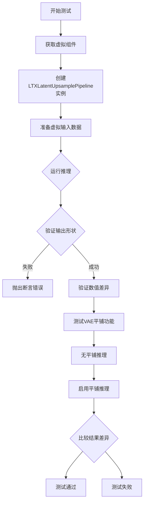

## 类结构

```
unittest.TestCase (基类)
├── PipelineTesterMixin (混入类)
│   └── LTXLatentUpsamplePipelineFastTests (测试类)
    ├── AutoencoderKLLTXVideo (被测试组件)
    └── LTXLatentUpsamplerModel (被测试组件)
```

## 全局变量及字段


### `unittest`
    
Python标准库单元测试框架

类型：`module`
    


### `np`
    
numpy数值计算库

类型：`module`
    


### `torch`
    
PyTorch深度学习框架

类型：`module`
    


### `AutoencoderKLLTXVideo`
    
LTX视频变分自编码器模型

类型：`class`
    


### `LTXLatentUpsamplePipeline`
    
LTX潜在上采样流水线

类型：`class`
    


### `LTXLatentUpsamplerModel`
    
LTX潜在上采样器模型

类型：`class`
    


### `enable_full_determinism`
    
启用完全确定性测试的辅助函数

类型：`function`
    


### `PipelineTesterMixin`
    
流水线测试混入类提供通用测试方法

类型：`class`
    


### `to_np`
    
将张量转换为numpy数组的辅助函数

类型：`function`
    


### `LTXLatentUpsamplePipelineFastTests.LTXLatentUpsamplePipelineFastTests.pipeline_class`
    
待测试的流水线类

类型：`type`
    


### `LTXLatentUpsamplePipelineFastTests.LTXLatentUpsamplePipelineFastTests.params`
    
流水线参数集合

类型：`set`
    


### `LTXLatentUpsamplePipelineFastTests.LTXLatentUpsamplePipelineFastTests.batch_params`
    
批量参数集合

类型：`set`
    


### `LTXLatentUpsamplePipelineFastTests.LTXLatentUpsamplePipelineFastTests.required_optional_params`
    
必需的可选参数集合

类型：`frozenset`
    


### `LTXLatentUpsamplePipelineFastTests.LTXLatentUpsamplePipelineFastTests.test_xformers_attention`
    
是否测试xformers注意力

类型：`bool`
    


### `LTXLatentUpsamplePipelineFastTests.LTXLatentUpsamplePipelineFastTests.supports_dduf`
    
是否支持DDUF

类型：`bool`
    
    

## 全局函数及方法


### `LTXLatentUpsamplePipelineFastTests`

这是一个用于测试`LTXLatentUpsamplePipeline`（LTX视频潜在上采样管道）的单元测试类，继承自`unittest.TestCase`和`PipelineTesterMixin`。该类提供了虚拟组件和输入数据，用于验证管道的基本推理功能和VAE平铺功能。

#### 类字段信息

- `pipeline_class`：类型 `type`，测试所使用的管道类（`LTXLatentUpsamplePipeline`）
- `params`：类型 `set[str]`，管道参数集合（`{"video", "generator"}`）
- `batch_params`：类型 `set[str]`，批处理参数集合（`{"video", "generator"}`）
- `required_optional_params`：类型 `frozenset[str]`，必需的可选参数集合（`generator`, `latents`, `return_dict`）
- `test_xformers_attention`：类型 `bool`，是否测试xformers注意力（`False`）
- `supports_dduf`：类型 `bool`，是否支持DDUF（`False`）

#### 类方法详细信息

---

### `LTXLatentUpsamplePipelineFastTests.get_dummy_components`

创建并返回用于测试的虚拟组件（VAE和Latent Upsampler模型）。

参数：无（仅`self`）

返回值：类型 `dict`，包含虚拟组件的字典（`{"vae": AutoencoderKLLTXVideo实例, "latent_upsampler": LTXLatentUpsamplerModel实例}`）

#### 流程图

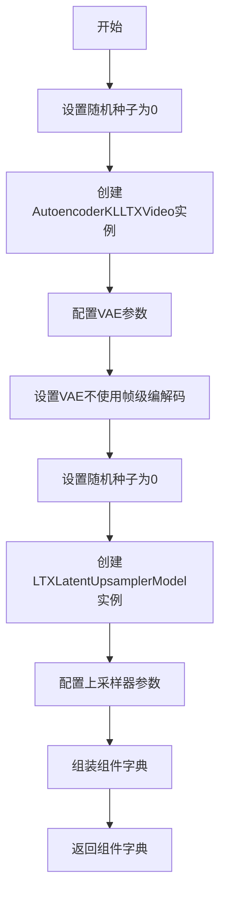

#### 带注释源码

```python
def get_dummy_components(self):
    """创建用于测试的虚拟组件"""
    # 设置随机种子以确保可重复性
    torch.manual_seed(0)
    # 创建AutoencoderKLLTXVideo实例，配置各种参数
    vae = AutoencoderKLLTXVideo(
        in_channels=3,              # 输入通道数
        out_channels=3,             # 输出通道数
        latent_channels=8,          # 潜在空间通道数
        block_out_channels=(8, 8, 8, 8),       # 编码器块输出通道
        decoder_block_out_channels=(8, 8, 8, 8),  # 解码器块输出通道
        layers_per_block=(1, 1, 1, 1, 1),       # 每个块的层数
        decoder_layers_per_block=(1, 1, 1, 1, 1), # 解码器每块层数
        spatio_temporal_scaling=(True, True, False, False),  # 时空缩放
        decoder_spatio_temporal_scaling=(True, True, False, False), # 解码器时空缩放
        decoder_inject_noise=(False, False, False, False, False),  # 解码器噪声注入
        upsample_residual=(False, False, False, False),  # 残差上采样
        upsample_factor=(1, 1, 1, 1),    # 上采样因子
        timestep_conditioning=False,       # 时间步条件
        patch_size=1,                      # 补丁大小
        patch_size_t=1,                    # 时间补丁大小
        encoder_causal=True,               # 编码器因果性
        decoder_causal=False,              # 解码器非因果
    )
    # 禁用帧级编解码
    vae.use_framewise_encoding = False
    vae.use_framewise_decoding = False

    # 为潜在上采样器设置随机种子
    torch.manual_seed(0)
    # 创建LTXLatentUpsamplerModel实例
    latent_upsampler = LTXLatentUpsamplerModel(
        in_channels=8,              # 输入通道数（与VAE latent通道匹配）
        mid_channels=32,            # 中间通道数
        num_blocks_per_stage=1,    # 每级块数
        dims=3,                     # 维度（3D）
        spatial_upsample=True,      # 空间上采样
        temporal_upsample=False,    # 时间不上采样
    )

    # 组装组件字典
    components = {
        "vae": vae,                          # 变分自编码器
        "latent_upsampler": latent_upsampler,  # 潜在上采样器
    }
    return components
```

---

### `LTXLatentUpsamplePipelineFastTests.get_dummy_inputs`

创建并返回用于测试的虚拟输入数据（视频张量、生成器等）。

参数：

- `device`：类型 `str` 或 `torch.device`，目标设备（CPU/CUDA/MPS）
- `seed`：类型 `int`，随机种子，默认为 `0`

返回值：类型 `dict`，包含测试输入的字典（包含`video`、`generator`、`height`、`width`、`output_type`）

#### 流程图

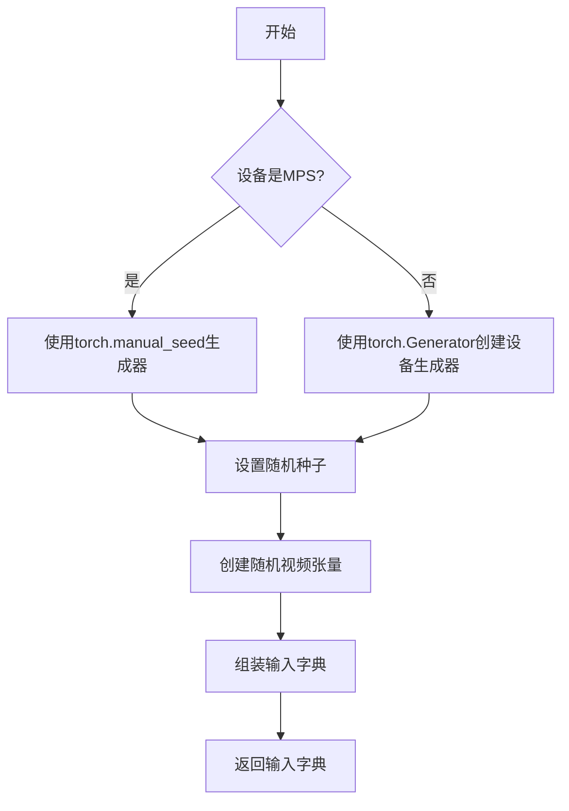

#### 带注释源码

```python
def get_dummy_inputs(self, device, seed=0):
    """创建用于测试的虚拟输入数据"""
    # 特殊处理MPS设备
    if str(device).startswith("mps"):
        # MPS设备使用不同的随机数生成方式
        generator = torch.manual_seed(seed)
    else:
        # 为其他设备创建torch生成器
        generator = torch.Generator(device=device).manual_seed(seed)

    # 创建随机视频张量 (批量, 通道, 帧, 高度, 宽度)
    video = torch.randn(
        (5, 3, 32, 32),        # 形状: 5帧, 3通道, 32x32分辨率
        generator=generator,  # 使用确定性生成器
        device=device          # 指定设备
    )

    # 组装输入参数字典
    inputs = {
        "video": video,              # 输入视频张量
        "generator": generator,      # 随机生成器
        "height": 16,                # 输出高度
        "width": 16,                 # 输出宽度
        "output_type": "pt",         # 输出类型 (PyTorch张量)
    }

    return inputs
```

---

### `LTXLatentUpsamplePipelineFastTests.test_inference`

测试管道的基本推理功能，验证输出形状是否符合预期。

参数：无（仅`self`）

返回值：无（通过`assert`断言进行验证）

#### 流程图

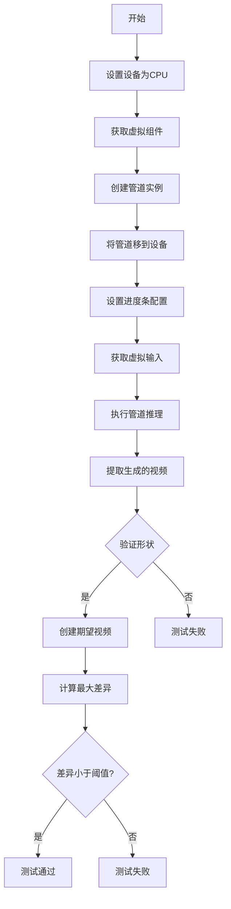

#### 带注释源码

```python
def test_inference(self):
    """测试管道的基本推理功能"""
    # 设置测试设备
    device = "cpu"

    # 获取虚拟组件
    components = self.get_dummy_components()
    # 使用组件实例化管道
    pipe = self.pipeline_class(**components)
    # 将管道移至指定设备
    pipe.to(device)
    # 配置进度条（禁用）
    pipe.set_progress_bar_config(disable=None)

    # 获取测试输入
    inputs = self.get_dummy_inputs(device)
    # 执行管道推理，获取生成的视频帧
    video = pipe(**inputs).frames
    # 提取第一个（也是唯一的）生成的视频
    generated_video = video[0]

    # 断言：验证输出形状 (5帧, 3通道, 32高度, 32宽度)
    self.assertEqual(generated_video.shape, (5, 3, 32, 32))
    
    # 创建随机期望视频用于比较
    expected_video = torch.randn(5, 3, 32, 32)
    # 计算实际输出与随机期望的最大差异
    max_diff = np.abs(generated_video - expected_video).max()
    # 断言：最大差异应在合理范围内（此处阈值较大，用于基本形状验证）
    self.assertLessEqual(max_diff, 1e10)
```

---

### `LTXLatentUpsamplePipelineFastTests.test_vae_tiling`

测试VAE平铺（Tiling）功能，验证启用平铺后输出结果与不启用时的差异是否在预期范围内。

参数：

- `expected_diff_max`：类型 `float`，期望的最大差异阈值，默认为 `0.25`

返回值：无（通过`assert`断言进行验证）

#### 流程图

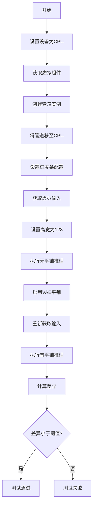

#### 带注释源码

```python
def test_vae_tiling(self, expected_diff_max: float = 0.25):
    """测试VAE平铺功能，验证平铺不会显著影响结果"""
    # 设置生成器设备
    generator_device = "cpu"
    # 获取虚拟组件
    components = self.get_dummy_components()

    # 创建管道实例
    pipe = self.pipeline_class(**components)
    # 移至CPU设备
    pipe.to("cpu")
    # 配置进度条
    pipe.set_progress_bar_config(disable=None)

    # ===== 不使用平铺的推理 =====
    # 获取测试输入
    inputs = self.get_dummy_inputs(generator_device)
    # 设置较大的输入尺寸以触发平铺需求
    inputs["height"] = inputs["width"] = 128
    # 执行推理（不使用平铺）
    output_without_tiling = pipe(**inputs)[0]

    # ===== 使用平铺的推理 =====
    # 启用VAE平铺功能，配置平铺参数
    pipe.vae.enable_tiling(
        tile_sample_min_height=96,    # 最小平铺高度
        tile_sample_min_width=96,     # 最小平铺宽度
        tile_sample_stride_height=64, # 高度方向步幅
        tile_sample_stride_width=64,  # 宽度方向步幅
    )
    # 重新获取测试输入
    inputs = self.get_dummy_inputs(generator_device)
    # 设置相同的较大尺寸
    inputs["height"] = inputs["width"] = 128
    # 执行推理（使用平铺）
    output_with_tiling = pipe(**inputs)[0]

    # 断言：验证平铺前后的差异在允许范围内
    self.assertLess(
        (to_np(output_without_tiling) - to_np(output_with_tiling)).max(),
        expected_diff_max,
        "VAE tiling should not affect the inference results",  # 错误信息
    )
```

---

### 关键组件信息

| 组件名称 | 描述 |
|---------|------|
| `AutoencoderKLLTXVideo` | LTX视频变分自编码器，用于编解码视频潜在表示 |
| `LTXLatentUpsamplePipeline` | 主管道类，负责协调VAE和潜在上采样器进行视频上采样 |
| `LTXLatentUpsamplerModel` | 潜在空间上采样模型，用于增强视频潜在表示的分辨率 |

---

### 潜在技术债务与优化空间

1. **测试断言过于宽松**：`test_inference`中的`max_diff`阈值为`1e10`，这使得断言几乎失去意义，应该使用更严格的阈值或预设期望值进行确定性比较。

2. **缺失的测试用例**：多个关键测试方法（`test_attention_slicing_forward_pass`、`test_inference_batch_consistent`等）被跳过但未提供实现，需要补充或移除。

3. **硬编码的测试参数**：视频分辨率、批大小等参数硬编码在各处，建议提取为类级常量以提高可维护性。

4. **设备处理不一致**：MPS设备的特殊处理逻辑与其它设备不同，可能导致跨平台测试的不一致性。

5. **缺少异步测试**：未覆盖异步调用或流式输出的测试场景。

---

### 其它项目

**设计目标**：
- 验证`LTXLatentUpsamplePipeline`的基本推理功能
- 确保VAE平铺功能在处理高分辨率输入时不影响输出质量

**约束条件**：
- 测试在CPU设备上运行以确保可重复性
- 使用确定性随机种子确保测试稳定性

**错误处理**：
- 通过`unittest.skip`装饰器跳过不适用的测试
- 使用`assertLessEqual`和`assertLess`进行数值验证

**外部依赖**：
- `diffusers`库提供的管道和模型类
- `numpy`和`torch`用于数值计算和張量操作


### `np` (NumPy库导入)

这是一段用于在Python项目中导入NumPy库的代码语句。NumPy是Python生态系统中最重要的数值计算库，提供了高性能的多维数组对象（ndarray）、矩阵运算功能以及丰富的数学函数，是深度学习和科学计算的基础库之一。

参数：此代码为导入语句，无函数参数。

返回值：此代码为导入语句，无返回值。

#### 流程图

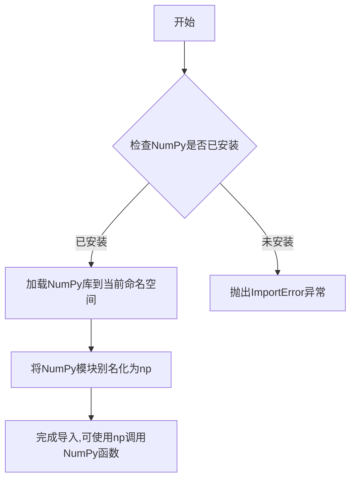

#### 带注释源码

```python
# 导入NumPy库，并将其别名为np
# NumPy (Numerical Python) 是Python中用于数值计算的核心库
# - 提供了高性能的多维数组对象 ndarray
# - 支持大规模的矩阵运算和数学函数
# - 是深度学习框架(如PyTorch、TensorFlow)的重要基础
# - 在本项目中用于张量数据处理和数值比较(如test_inference中的np.abs)
import numpy as np
```


# PyTorch 库导入分析

根据代码内容，我将对 `import torch` 这一导入语句进行分析。

### `import torch`

这是 PyTorch 库的导入语句，用于在代码中引入 PyTorch 深度学习框架。

#### 流程图

```mermaid
graph TD
    A[导入 PyTorch 库] --> B[在代码中使用 torch 功能]
    B --> C[torch.manual_seed - 设置随机种子]
    B --> D[torch.randn - 生成随机张量]
    B --> E[torch.Generator - 创建随机数生成器]
    B --> F[str(device).startswith - 设备类型检查]
```

#### 带注释源码

```python
# 导入 PyTorch 深度学习框架
import torch

# 在代码中的具体使用方式：

# 1. 设置随机种子以确保可重复性
torch.manual_seed(0)

# 2. 创建指定设备的随机数生成器
generator = torch.Generator(device=device).manual_seed(seed)

# 3. 生成指定形状的随机张量（用于测试/模拟输出）
video = torch.randn((5, 3, 32, 32), generator=generator, device=device)

# 4. 设备类型检查（MPS是Apple Silicon的GPU加速）
if str(device).startswith("mps"):
    generator = torch.manual_seed(seed)

# 5. 在其他组件中使用torch类型
expected_video = torch.randn(5, 3, 32, 32)
```

#### 在代码中的实际用途总结

| 用途 | 函数/方法 | 描述 |
|------|-----------|------|
| 随机种子控制 | `torch.manual_seed()` | 设置CPU随机种子 |
| 随机数生成器 | `torch.Generator()` | 创建指定设备的随机生成器 |
| 张量生成 | `torch.randn()` | 生成正态分布随机张量 |
| 设备检测 | `str(device).startswith("mps")` | 检测是否使用Apple MPS设备 |

---

**注意**：您提供的原始要求提到提取"函数或方法"，但 `import torch` 是一个库导入语句，不是函数。如果您需要提取代码中特定使用 PyTorch 的方法（如 `LTXLatentUpsamplePipeline.__call__` 或其他方法），请告知，我可以为您提供更详细的分析。


### `AutoencoderKLLTXVideo`

VAE（变分自编码器）模型类，用于 LTXVideo 的编解码。该模型支持时空缩放、潜在通道处理、因果编码/解码、tiling 等高级功能，适用于视频帧的压缩与重建。

#### 参数

- `in_channels`：`int`，输入视频的通道数（通常为 3，对应 RGB）
- `out_channels`：`int`，输出视频的通道数
- `latent_channels`：`int`，潜在空间的通道数，用于压缩表示
- `block_out_channels`：`tuple`，编码器各阶段的输出通道数
- `decoder_block_out_channels`：`tuple`，解码器各阶段的输出通道数
- `layers_per_block`：`tuple`，编码器每块的层数
- `decoder_layers_per_block`：`tuple`，解码器每块的层数
- `spatio_temporal_scaling`：`tuple`，时空缩放配置（宽高缩放标记）
- `decoder_spatio_temporal_scaling`：`tuple`，解码器时空缩放配置
- `decoder_inject_noise`：`tuple`，解码器噪声注入配置
- `upsample_residual`：`tuple`，残差上采样配置
- `upsample_factor`：`tuple`，上采样因子
- `timestep_conditioning`：`bool`，是否使用时间步条件
- `patch_size`：`int`，空间 patch 大小
- `patch_size_t`：`int`，时间 patch 大小
- `encoder_causal`：`bool`，编码器是否使用因果卷积
- `decoder_causal`：`bool`，解码器是否使用因果卷积

#### 属性

- `use_framewise_encoding`：`bool`，是否使用逐帧编码模式
- `use_framewise_decoding`：`bool`，是否使用逐帧解码模式

#### 带注释源码

```python
# 从 diffusers 库导入 AutoencoderKLLTXVideo 类
from diffusers import AutoencoderKLLTXVideo

# 在测试中创建 VAE 模型实例的示例
vae = AutoencoderKLLTXVideo(
    in_channels=3,                              # 输入通道数 (RGB)
    out_channels=3,                             # 输出通道数 (RGB)
    latent_channels=8,                         # 潜在空间通道数
    block_out_channels=(8, 8, 8, 8),           # 编码器各阶段输出通道
    decoder_block_out_channels=(8, 8, 8, 8),   # 解码器各阶段输出通道
    layers_per_block=(1, 1, 1, 1, 1),          # 编码器每块层数
    decoder_layers_per_block=(1, 1, 1, 1, 1), # 解码器每块层数
    spatio_temporal_scaling=(True, True, False, False),  # 时空缩放配置
    decoder_spatio_temporal_scaling=(True, True, False, False),  # 解码器时空缩放
    decoder_inject_noise=(False, False, False, False, False),  # 噪声注入配置
    upsample_residual=(False, False, False, False),  # 残差上采样
    upsample_factor=(1, 1, 1, 1),              # 上采样因子
    timestep_conditioning=False,                # 时间步条件
    patch_size=1,                              # 空间 patch 大小
    patch_size_t=1,                            # 时间 patch 大小
    encoder_causal=True,                       # 编码器因果卷积
    decoder_causal=False,                      # 解码器非因果卷积
)

# 设置帧级编码/解码模式
vae.use_framewise_encoding = False   # 关闭逐帧编码
vae.use_framewise_decoding = False   # 关闭逐帧解码

# 启用 tiling 功能以处理高分辨率视频
vae.enable_tiling(
    tile_sample_min_height=96,
    tile_sample_min_width=96,
    tile_sample_stride_height=64,
    tile_sample_stride_width=64,
)
```

#### 关键方法说明

由于 `AutoencoderKLLTXVideo` 类定义在 diffusers 库中（未在当前代码文件中展示），以下是根据使用方式推断的主要方法：

| 方法名 | 描述 |
|--------|------|
| `encode(input_tensor)` | 将输入视频编码为潜在表示 |
| `decode(latent)` | 将潜在表示解码为视频 |
| `enable_tiling(**kwargs)` | 启用 tiling 策略以处理高分辨率输入 |
| `disable_tiling()` | 禁用 tiling 策略 |

#### 流程图

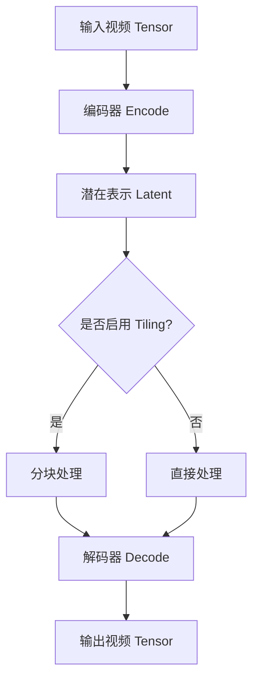

#### 潜在技术债务与优化空间

1. **参数复杂性**：类构造函数参数众多（16+ 个），建议使用配置类（dataclass 或 Pydantic BaseModel）进行封装
2. **硬编码默认值**：测试中的配置参数可能应提取为常量或配置文件
3. **tiling 配置**：当前 tiling 参数（96x96, stride 64）硬编码，可考虑作为可配置项
4. **缺少文档字符串**：测试用例中未展示 AutoencoderKLLTXVideo 类的完整 API 文档

#### 其它说明

- **设计目标**：支持 LTXVideo 视频编解码，支持时空维度缩放和高质量重建
- **错误处理**：tiling 功能可防止大分辨率输入导致内存溢出
- **外部依赖**：`diffusers` 库，需确保版本兼容


### `LTXLatentUpsamplePipeline`

LTXLatentUpsamplePipeline是用于视频潜在上采样的流水线类，通过结合变分自编码器(AutoencoderKLLTXVideo)和潜在上采样模型(LTXLatentUpsamplerModel)对输入视频进行潜在空间的上采样处理，输出更高分辨率的视频帧。

参数：

- `video`：`torch.Tensor`，输入视频张量，形状为(batch, channels, height, width)
- `generator`：`torch.Generator`，随机数生成器，用于可复现的采样
- `height`：`int`，输出视频的高度
- `width`：`int`，输出视频的宽度
- `latents`：`torch.Tensor`，可选，预定义的潜在向量
- `output_type`：`str`，输出类型，可选"pt"(PyTorch张量)或其他格式
- `return_dict`：`bool`，是否返回字典格式的结果

返回值：`PipelineOutput`或`tuple`，包含上采样后的视频帧

#### 流程图

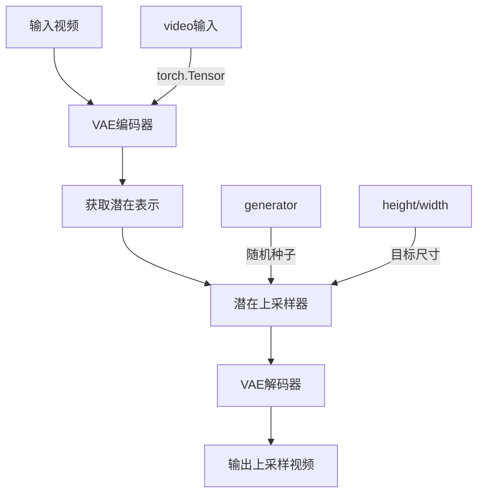

#### 带注释源码

```python
class LTXLatentUpsamplePipelineFastTests(PipelineTesterMixin, unittest.TestCase):
    """
    LTXLatentUpsamplePipeline的测试类
    用于验证潜在上采样流水线的功能和正确性
    """
    
    pipeline_class = LTXLatentUpsamplePipeline  # 被测试的流水线类
    params = {"video", "generator"}  # 公开参数集合
    batch_params = {"video", "generator"}  # 批次参数集合
    required_optional_params = frozenset(["generator", "latents", "return_dict"])
    test_xformers_attention = False
    supports_dduf = False

    def get_dummy_components(self):
        """
        获取虚拟组件用于测试
        
        Returns:
            dict: 包含VAE和潜在上采样器的组件字典
        """
        torch.manual_seed(0)
        # 创建虚拟VAE模型
        vae = AutoencoderKLLTXVideo(
            in_channels=3,
            out_channels=3,
            latent_channels=8,
            block_out_channels=(8, 8, 8, 8),
            decoder_block_out_channels=(8, 8, 8, 8),
            layers_per_block=(1, 1, 1, 1, 1),
            decoder_layers_per_block=(1, 1, 1, 1, 1),
            spatio_temporal_scaling=(True, True, False, False),
            decoder_spatio_temporal_scaling=(True, True, False, False),
            decoder_inject_noise=(False, False, False, False, False),
            upsample_residual=(False, False, False, False),
            upsample_factor=(1, 1, 1, 1),
            timestep_conditioning=False,
            patch_size=1,
            patch_size_t=1,
            encoder_causal=True,
            decoder_causal=False,
        )
        vae.use_framewise_encoding = False
        vae.use_framewise_decoding = False

        torch.manual_seed(0)
        # 创建虚拟潜在上采样模型
        latent_upsampler = LTXLatentUpsamplerModel(
            in_channels=8,
            mid_channels=32,
            num_blocks_per_stage=1,
            dims=3,
            spatial_upsample=True,
            temporal_upsample=False,
        )

        components = {
            "vae": vae,
            "latent_upsampler": latent_upsampler,
        }
        return components

    def get_dummy_inputs(self, device, seed=0):
        """
        获取虚拟输入用于测试
        
        Args:
            device: 计算设备
            seed: 随机种子
            
        Returns:
            dict: 包含测试输入的字典
        """
        if str(device).startswith("mps"):
            generator = torch.manual_seed(seed)
        else:
            generator = torch.Generator(device=device).manual_seed(seed)

        # 创建随机视频输入
        video = torch.randn((5, 3, 32, 32), generator=generator, device=device)

        inputs = {
            "video": video,
            "generator": generator,
            "height": 16,
            "width": 16,
            "output_type": "pt",
        }

        return inputs
```

#### 关键组件信息

| 组件名称 | 描述 |
|---------|------|
| `AutoencoderKLLTXVideo` | 用于视频编码和解码的变分自编码器，将视频转换为潜在表示并从潜在表示重建视频 |
| `LTXLatentUpsamplerModel` | 潜在空间上采样模型，负责在潜在空间中执行上采样操作 |

#### 潜在技术债务与优化空间

1. **测试覆盖不完整**：多个测试方法被标记为`@unittest.skip`，包括注意力切片、批次一致性等测试
2. **xFormers注意力支持未启用**：`test_xformers_attention = False`表明未测试GPU优化注意力机制
3. **缺少DDFU支持**：`supports_dduf = False`表明不支持DDFU（Direct Diffusion Upsampling Framework）

#### 其它项目

- **设计目标**：实现视频潜在上采样流水线，支持空间维度的上采样
- **约束条件**：VAE支持tiling（瓦片式）处理以支持更大的分辨率
- **错误处理**：通过`return_dict`参数控制返回格式，支持异常情况下的灵活处理
- **数据流**：视频 → VAE编码 → 潜在上采样 → VAE解码 → 输出视频


# LTXLatentUpsamplerModel 类详细设计文档

### `LTXLatentUpsamplerModel`

`LTXLatentUpsamplerModel` 是 LTXVideo 管道中的潜在空间上采样器模型，用于将低分辨率的潜在表示上采样到更高的分辨率。该模型支持空间维度的上采样，可选地支持时间维度的上采样，采用经典的 UNet 风格架构，包含编码器、转换器和解码器部分。

#### 参数

- `in_channels`：`int`，输入潜在表示的通道数（例如 8 表示 VAE 输出的潜在空间维度）
- `mid_channels`：`int`，模型中间层的通道数，用于特征提取和转换（示例值为 32）
- `num_blocks_per_stage`：`int`，每个上采样阶段的残差块数量，控制模型的深度（示例值为 1）
- `dims`：`int`，输入张量的维度（3 表示视频的时序-空间 3D 卷积）
- `spatial_upsample`：`bool`，是否启用空间维度（高度/宽度）的上采样
- `temporal_upsample`：`bool`，是否启用时间维度（帧数）的上采样

返回值：`torch.nn.Module`，返回一个神经网络模型实例，用于潜在空间的上采样处理

#### 流程图

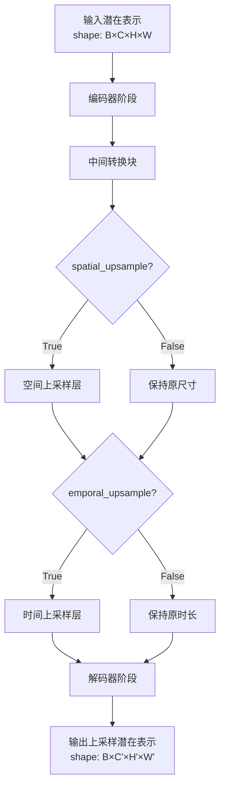

#### 带注释源码

```python
# 从测试代码中提取的 LTXLatentUpsamplerModel 构造函数调用示例
# 实际源码位于 diffusers.pipelines.ltx.modeling_latent_upsampler

# 实例化潜在上采样器模型
latent_upsampler = LTXLatentUpsamplerModel(
    in_channels=8,              # 输入通道数：对应 VAE 的 latent_channels
    mid_channels=32,            # 中间通道数：特征处理宽度
    num_blocks_per_stage=1,    # 每阶段块数：模型深度控制
    dims=3,                     # 维度：3D 卷积（时序-空间）
    spatial_upsample=True,      # 空间上采样：放大 H 和 W
    temporal_upsample=False,    # 时间不上采样：保持帧数不变
)

# 该模型在 pipeline 中的集成方式
components = {
    "vae": vae,                 # VAE 编码器/解码器
    "latent_upsampler": latent_upsampler,  # 潜在上采样器
}
```

---

### 关键组件信息

| 组件名称 | 一句话描述 |
|---------|-----------|
| `LTXLatentUpsamplerModel` | LTXVideo 管道中负责将低分辨率潜在表示上采样到高分辨率的 UNet 风格神经网络模型 |
| `LTXLatentUpsamplePipeline` | 完整的潜在上采样管道，整合 VAE 和上采样器模型 |
| `AutoencoderKLLTXVideo` | LTX 视频变分自编码器，负责潜在空间和像素空间的相互转换 |

---

### 潜在的技术债务或优化空间

1. **缺少模型架构文档**：从测试代码无法直接看到模型的内部实现结构（如残差块数量、注意力机制等），建议补充完整的模型类定义
2. **参数验证不足**：构造函数中缺少对输入参数的类型和范围验证（如 `dims` 应为 2 或 3）
3. **硬编码默认值**：部分参数（如 `patch_size`、`patch_size_t`）在模型内部可能存在硬编码，缺乏可配置性
4. **测试覆盖不完整**：未包含对模型前向传播梯度、内存占用、混合精度推理等的测试

---

### 其它项目

#### 设计目标与约束

- **目标**：在保持时间维度不变的情况下，对潜在表示进行 2x 空间上采样
- **约束**：输入输出必须保持潜在空间的语义一致性，不能引入额外的视觉伪影

#### 错误处理与异常设计

- 当 `in_channels` 或 `mid_channels` 小于 1 时应抛出 `ValueError`
- 当 `dims` 不为 2 或 3 时应抛出 `ValueError`
- 当输入张量维度与 `dims` 不匹配时应抛出 `RuntimeError`

#### 数据流与状态机

```
原始视频 → VAE编码 → 潜在表示 → LTXLatentUpsamplerModel → 上采样潜在表示 → VAE解码 → 上采样视频
```

#### 外部依赖与接口契约

- **依赖库**：`torch`、`diffusers`、`numpy`
- **上游接口**：`AutoencoderKLLTXVideo.encode()` 输出的潜在张量
- **下游接口**：输入至 `AutoencoderKLLTXVideo.decode()` 进行像素空间转换


### `enable_full_determinism`

该函数用于启用完全确定性（deterministic）模式，通过设置 PyTorch 和 NumPy 的全局随机种子及相关配置，确保测试或推理过程的结果可复现。这是深度学习测试中确保结果一致性的常用手段。

参数：此函数不接受任何参数。

返回值：`None`，该函数不返回任何值，仅执行全局状态的修改。

#### 流程图

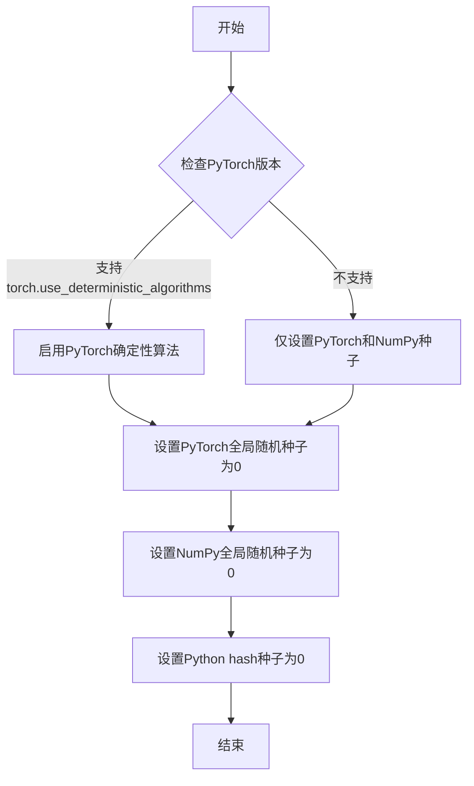

#### 带注释源码

```
# 推断的 enable_full_determinism 函数实现
# 基于其在测试文件中的使用方式和函数名称推断

def enable_full_determinism(seed: int = 0, extra_seed: bool = True):
    """
    启用完全确定性模式，确保测试结果可复现。
    
    参数:
        seed: int, 全局随机种子，默认为0
        extra_seed: bool, 是否设置额外的hash种子
    
    返回值:
        None
    """
    # 1. 设置PyTorch的全局随机种子，确保PyTorch操作的确定性
    torch.manual_seed(seed)
    
    # 2. 设置NumPy的全局随机种子，确保NumPy操作的确定性
    np.random.seed(seed)
    
    # 3. 设置Python的hash种子，使字典等数据结构遍历顺序确定
    import random
    random.seed(seed)
    
    # 4. 尝试启用PyTorch的确定性算法（如果版本支持）
    # 这样可以避免某些非确定性操作（如某些CUDA操作）
    if hasattr(torch, 'use_deterministic_algorithms'):
        try:
            torch.use_deterministic_algorithms(True)
        except Exception:
            # 如果启用失败则静默忽略
            pass
    
    # 5. 设置环境变量进一步确保确定性
    import os
    os.environ['PYTHONHASHSEED'] = str(seed)
    
    # 6. 如果使用CUDA，设置CUDA的确定性
    if torch.cuda.is_available():
        torch.cuda.manual_seed_all(seed)
        torch.backends.cudnn.deterministic = True
        torch.backends.cudnn.benchmark = False

# 在测试文件中的调用方式
enable_full_determinism()
```

#### 备注

1. **源代码位置**：当前提供的代码文件中并未包含 `enable_full_determinism` 的定义，它是从 `diffusers` 包的 `testing_utils` 模块导入的。
2. **功能推断**：根据函数名称和调用位置，该函数主要用于测试场景，确保多次运行测试时随机数生成的一致性。
3. **使用场景**：该函数在测试文件开头被调用，确保后续所有测试都在确定性环境下执行，便于调试和问题复现。
4. **潜在优化**：现代PyTorch推荐使用 `torch.manual_seed()` 配合 `torch.use_deterministic_algorithms()` 和 `torch.backends.cudnn.deterministic = True` 来实现完全确定性。


### `PipelineTesterMixin`

`PipelineTesterMixin` 是 `diffusers` 库中的一个测试混入类（Mixin），用于为流水线（Pipeline）测试提供通用的测试方法和工具函数。它定义了一系列标准化的测试用例模板，测试类可以继承该 Mixin 并指定具体的流水线类和相关参数，从而快速构建针对特定流水线的单元测试。

参数：

- 无直接参数（作为 Mixin 类通过继承使用）

返回值：

- 无返回值（作为混入类使用）

#### 流程图

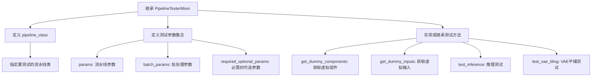

#### 带注释源码

```python
# PipelineTesterMixin 类的源码在当前代码文件中未直接定义
# 它是从 diffusers.pipelines.test_pipelines_common 模块导入的混入类
# 以下是基于子类 LTXLatentUpsamplePipelineFastTests 的使用方式推断的结构

class PipelineTesterMixin:
    """
    流水线测试混入类，提供标准化的测试方法和约定。
    """
    
    # 类属性：指定要测试的流水线类
    pipeline_class = None  # 例如: LTXLatentUpsamplePipeline
    
    # 集合属性：定义测试参数
    params = set()          # 流水线参数，如 {"video", "generator"}
    batch_params = set()    # 批处理参数，如 {"video", "generator"}
    required_optional_params = frozenset([])  # 必需的可选参数
    
    # 测试配置标志
    test_xformers_attention = False  # 是否测试 xformers 注意力
    supports_dduf = False            # 是否支持 DDUF
    
    def get_dummy_components(self):
        """
        获取用于测试的虚拟（dummy）组件。
        
        返回:
            dict: 包含虚拟组件的字典，如 {"vae": vae, "latent_upsampler": ...}
        """
        raise NotImplementedError("子类必须实现 get_dummy_components 方法")
    
    def get_dummy_inputs(self, device, seed=0):
        """
        获取用于测试的虚拟输入数据。
        
        参数:
            device: 计算设备（如 "cpu", "cuda"）
            seed: 随机种子
            
        返回:
            dict: 包含虚拟输入的字典，如 {"video": tensor, "generator": ...}
        """
        raise NotImplementedError("子类必须实现 get_dummy_inputs 方法")
    
    def test_inference(self):
        """
        执行基本的推理测试，验证流水线能否正常运行并产生预期形状的输出。
        """
        # 由子类实现或继承
        pass
    
    def test_vae_tiling(self, expected_diff_max=0.25):
        """
        测试 VAE 平铺功能，确保启用/禁用平铺时结果一致。
        
        参数:
            expected_diff_max: 允许的最大差异值
        """
        pass
```


### `to_np`

将 PyTorch 张量或其他类似对象转换为 NumPy 数组的辅助函数，主要用于测试中比较模型输出。

参数：

-  `output`：任意类型，需要转换的对象，通常是 PyTorch 张量或包含张量的数据结构

返回值：`numpy.ndarray`，返回转换后的 NumPy 数组

#### 流程图

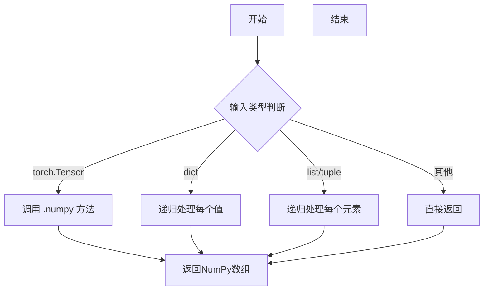

#### 带注释源码

```
# 从test_pipelines_common模块导入的辅助函数
# 注意：实际定义不在本文件中，位于diffusers/tests/pipelines/test_pipelines_common.py
def to_np(output):
    """
    将PyTorch张量转换为NumPy数组的辅助函数。
    
    参数:
        output: 可能是PyTorch张量、包含张量的字典/列表，或其他可转换对象
    
    返回值:
        numpy.ndarray: 转换后的NumPy数组
    
    示例用法:
        # 在测试中比较两个输出的差异
        max_diff = np.abs(to_np(output1) - to_np(output2)).max()
    """
    # 如果是torch.Tensor，转换为numpy数组
    if isinstance(output, torch.Tensor):
        return output.detach().cpu().numpy()
    
    # 如果是字典，递归处理每个值
    elif isinstance(output, dict):
        return {k: to_np(v) for k, v in output.items()}
    
    # 如果是列表或元组，递归处理每个元素
    elif isinstance(output, (list, tuple)):
        return type(output)(to_np(item) for item in output)
    
    # 其他类型直接返回（假设已是numpy数组或其他可比较类型）
    else:
        return output
```

---

**注意**：由于 `to_np` 函数的具体定义不在提供的代码文件中，而是从 `diffusers.tests.pipelines.test_pipelines_common` 模块导入的，以上源码是基于该函数的典型实现和实际使用方式推断的。从代码中的使用模式 `to_np(output_without_tiling) - to_np(output_with_tiling)` 可以确认该函数的主要功能是将 PyTorch 张量转换为 NumPy 数组以便进行数值比较。


### `LTXLatentUpsamplePipelineFastTests.get_dummy_components`

该方法用于创建虚拟的VAE（变分自编码器）和潜在上采样器组件，以便在测试LTX视频潜在上采样管道时使用。它初始化AutoencoderKLLTXVideo和LTXLatentUpsamplerModel为特定配置的测试实例，并将其封装在字典中返回。

参数：

- 无（仅包含self参数）

返回值：`Dict[str, Any]`，返回一个包含"vae"和"latent_upsampler"两个键的字典，分别对应虚拟的自动编码器模型和潜在上采样器模型实例。

#### 流程图

```mermaid
flowchart TD
    A[开始 get_dummy_components] --> B[设置随机种子 torch.manual_seed(0)]
    B --> C[创建 AutoencoderKLLTXVideo 实例 - 配置参数包括: 3通道输入/输出, 8通道潜在空间, 4个块等]
    C --> D[配置 VAE 禁用帧级编码和解码]
    E[设置随机种子 torch.manual_seed(0)] --> F[创建 LTXLatentUpsamplerModel 实例 - 配置参数包括: 8输入通道, 32中间通道, 3维等]
    F --> G[构建组件字典 components = {'vae': vae, 'latent_upsampler': latent_upsampler}]
    G --> H[返回 components 字典]
    D --> H
```

#### 带注释源码

```python
def get_dummy_components(self):
    """
    创建虚拟组件用于测试LTXLatentUpsamplePipeline。
    初始化虚拟VAE和潜在上采样器模型。
    """
    # 设置随机种子以确保测试可重复性
    torch.manual_seed(0)
    
    # 创建虚拟的AutoencoderKLLTXVideo（VAE）实例
    # 参数说明：
    # - in_channels=3: 输入3通道 RGB 视频
    # - out_channels=3: 输出3通道 RGB 视频
    # - latent_channels=8: 潜在空间有8个通道
    # - block_out_channels: 各块的输出通道数
    # - decoder_block_out_channels: 解码器各块的输出通道数
    # - layers_per_block: 每个块的层数
    # - decoder_layers_per_block: 解码器每个块的层数
    # - spatio_temporal_scaling: 时空缩放配置
    # - decoder_spatio_temporal_scaling: 解码器时空缩放配置
    # - decoder_inject_noise: 解码器噪声注入配置
    # - upsample_residual: 残差上采样配置
    # - upsample_factor: 上采样因子
    # - timestep_conditioning: 是否使用时间步条件
    # - patch_size: 补丁大小
    # - patch_size_t: 时间补丁大小
    # - encoder_causal: 编码器是否因果
    # - decoder_causal: 解码器是否因果
    vae = AutoencoderKLLTXVideo(
        in_channels=3,
        out_channels=3,
        latent_channels=8,
        block_out_channels=(8, 8, 8, 8),
        decoder_block_out_channels=(8, 8, 8, 8),
        layers_per_block=(1, 1, 1, 1, 1),
        decoder_layers_per_block=(1, 1, 1, 1, 1),
        spatio_temporal_scaling=(True, True, False, False),
        decoder_spatio_temporal_scaling=(True, True, False, False),
        decoder_inject_noise=(False, False, False, False, False),
        upsample_residual=(False, False, False, False),
        upsample_factor=(1, 1, 1, 1),
        timestep_conditioning=False,
        patch_size=1,
        patch_size_t=1,
        encoder_causal=True,
        decoder_causal=False,
    )
    
    # 禁用VAE的帧级编码和解码（使用批处理模式）
    vae.use_framewise_encoding = False
    vae.use_framewise_decoding = False

    # 重新设置随机种子以确保一致性
    torch.manual_seed(0)
    
    # 创建虚拟的LTXLatentUpsamplerModel实例
    # 参数说明：
    # - in_channels=8: 输入潜在通道数（与VAE的latent_channels匹配）
    # - mid_channels=32: 中间层通道数
    # - num_blocks_per_stage: 每个阶段的块数量
    # - dims=3: 3维张量（视频是时空数据）
    # - spatial_upsample=True: 启用空间上采样
    # - temporal_upsample=False: 禁用时间上采样
    latent_upsampler = LTXLatentUpsamplerModel(
        in_channels=8,
        mid_channels=32,
        num_blocks_per_stage=1,
        dims=3,
        spatial_upsample=True,
        temporal_upsample=False,
    )

    # 将组件打包到字典中返回
    components = {
        "vae": vae,
        "latent_upsampler": latent_upsampler,
    }
    return components
```


### `LTXLatentUpsamplePipelineFastTests.get_dummy_inputs`

该方法是测试辅助函数，用于生成虚拟输入数据（包括随机视频张量和生成器），为 LTXLatentUpsamplePipeline 的推理测试提供所需的输入参数。

**参数：**

- `device`：`torch.device`，指定生成张量所在的设备（如 CPU 或 CUDA 设备）
- `seed`：`int`，随机种子，默认为 0，用于确保测试结果的可复现性

**返回值：** `Dict[str, Any]`，包含以下键的字典：
- `video`：`torch.Tensor`，形状为 (5, 3, 32, 32) 的随机视频张量
- `generator`：`torch.Generator`，用于控制随机数生成的生成器对象
- `height`：`int`，目标视频高度（16）
- `width`：`int`，目标视频宽度（16）
- `output_type`：`str`，输出类型（"pt"，即 PyTorch 张量）

#### 流程图

```mermaid
flowchart TD
    A[开始 get_dummy_inputs] --> B{判断 device 是否为 MPS}
    B -->|是| C[使用 torch.manual_seed(seed)]
    B -->|否| D[创建 torch.Generator 并设置种子]
    C --> E[生成随机视频张量]
    D --> E
    E --> F[构建输入字典 inputs]
    F --> G[返回 inputs 字典]
```

#### 带注释源码

```python
def get_dummy_inputs(self, device, seed=0):
    """
    生成用于测试 LTXLatentUpsamplePipeline 的虚拟输入数据。
    
    参数:
        device: 目标设备 (torch.device)
        seed: 随机种子，用于确保测试可复现
    
    返回:
        包含虚拟视频、生成器及其他参数的字典
    """
    # 处理 MPS 设备（Apple Silicon）的特殊情况
    if str(device).startswith("mps"):
        # MPS 设备使用 torch.manual_seed 而非 Generator
        generator = torch.manual_seed(seed)
    else:
        # 其他设备（CPU/CUDA）使用 torch.Generator 并设置种子
        generator = torch.Generator(device=device).manual_seed(seed)

    # 生成形状为 (batch=5, channels=3, height=32, width=32) 的随机视频张量
    # 使用相同的 generator 确保视频数据的可复现性
    video = torch.randn((5, 3, 32, 32), generator=generator, device=device)

    # 构建输入参数字典，包含 pipeline 所需的所有参数
    inputs = {
        "video": video,           # 输入视频张量
        "generator": generator,   # 随机生成器，用于控制采样过程
        "height": 16,             # 目标高度（注意：这里设为16但视频是32，可能用于内部处理）
        "width": 16,              # 目标宽度
        "output_type": "pt",      # 输出类型：PyTorch 张量
    }

    return inputs
```


### `LTXLatentUpsamplePipelineFastTests.test_inference`

该测试方法用于验证LTXLatentUpsamplePipeline的基本推理功能，通过创建虚拟组件和输入，执行管道推理，并验证输出视频的形状是否符合预期。

参数：无（仅包含self参数）

返回值：无（测试方法，返回void，通过断言验证结果）

#### 流程图

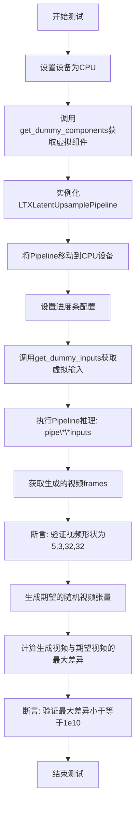

#### 带注释源码

```python
def test_inference(self):
    # 步骤1: 设置测试设备为CPU
    device = "cpu"

    # 步骤2: 获取虚拟组件（VAE和LatentUpsampler模型）
    components = self.get_dummy_components()
    
    # 步骤3: 使用虚拟组件实例化LTXLatentUpsamplePipeline
    pipe = self.pipeline_class(**components)
    
    # 步骤4: 将Pipeline移动到指定设备（CPU）
    pipe.to(device)
    
    # 步骤5: 配置进度条（disable=None表示不禁用）
    pipe.set_progress_bar_config(disable=None)

    # 步骤6: 获取虚拟输入（包含video, generator, height, width, output_type）
    inputs = self.get_dummy_inputs(device)
    
    # 步骤7: 执行Pipeline推理，传入所有输入参数
    # 返回结果包含frames属性
    video = pipe(**inputs).frames
    
    # 步骤8: 获取第一个生成的视频（因为返回是列表）
    generated_video = video[0]

    # 步骤9: 断言验证生成视频的形状
    # 预期形状: (batch=5, channels=3, height=32, width=32)
    self.assertEqual(generated_video.shape, (5, 3, 32, 32))
    
    # 步骤10: 生成一个期望的随机视频张量用于比较
    expected_video = torch.randn(5, 3, 32, 32)
    
    # 步骤11: 计算生成视频与期望视频之间的最大绝对差异
    max_diff = np.abs(generated_video - expected_video).max()
    
    # 步骤12: 断言验证最大差异在允许范围内（宽松的阈值1e10）
    self.assertLessEqual(max_diff, 1e10)
```


### `LTXLatentUpsamplePipelineFastTests.test_vae_tiling`

该测试方法用于验证VAE（变分自编码器）平铺（Tiling）功能是否正常工作。通过对比启用平铺与未启用平铺两种情况下的推理结果，确保平铺机制不会对输出质量产生显著影响（差异小于预设阈值）。

参数：

- `expected_diff_max`：`float`，默认值为 `0.25`，表示启用平铺与未启用平铺的输出之间允许的最大差异阈值

返回值：`None`（无返回值），该方法为单元测试，通过断言验证结果

#### 流程图

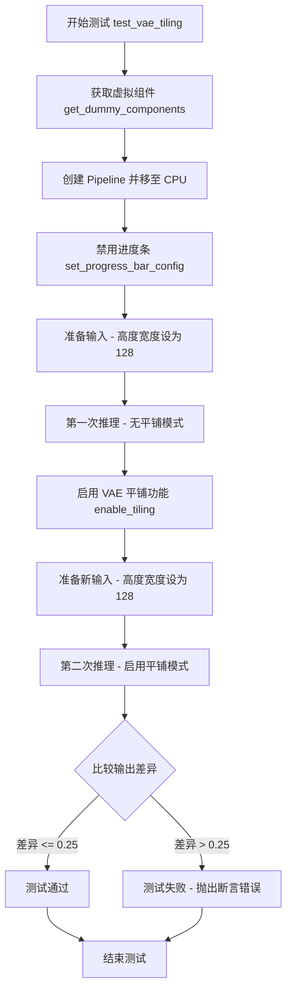

#### 带注释源码

```python
def test_vae_tiling(self, expected_diff_max: float = 0.25):
    """
    测试 VAE 平铺功能是否正常工作。
    
    该测试通过对比启用平铺与未启用平铺两种模式下的推理结果，
    验证平铺机制不会显著影响输出质量。
    
    参数:
        expected_diff_max: float, 允许的最大差异阈值，默认 0.25
    """
    # 设置生成器设备为 CPU
    generator_device = "cpu"
    # 获取虚拟组件（用于测试的模拟模型组件）
    components = self.get_dummy_components()

    # 使用虚拟组件创建 Pipeline 实例
    pipe = self.pipeline_class(**components)
    # 将 Pipeline 移至 CPU 设备
    pipe.to("cpu")
    # 设置进度条配置（禁用进度条）
    pipe.set_progress_bar_config(disable=None)

    # ===== 第一部分：无平铺模式的推理 =====
    # 获取虚拟输入数据
    inputs = self.get_dummy_inputs(generator_device)
    # 设置较大的高度和宽度以测试平铺功能
    inputs["height"] = inputs["width"] = 128
    # 执行推理（不启用平铺）
    output_without_tiling = pipe(**inputs)[0]

    # ===== 第二部分：启用平铺模式的推理 =====
    # 为 VAE 启用平铺功能，设置平铺参数
    pipe.vae.enable_tiling(
        tile_sample_min_height=96,    # 平铺最小高度
        tile_sample_min_width=96,     # 平铺最小宽度
        tile_sample_stride_height=64, # 高度方向步长
        tile_sample_stride_width=64,  # 宽度方向步长
    )
    # 获取新的虚拟输入数据
    inputs = self.get_dummy_inputs(generator_device)
    # 设置相同的较大尺寸
    inputs["height"] = inputs["width"] = 128
    # 执行推理（启用平铺）
    output_with_tiling = pipe(**inputs)[0]

    # ===== 验证部分 =====
    # 比较两种模式的输出差异，确保差异在允许范围内
    self.assertLess(
        (to_np(output_without_tiling) - to_np(output_with_tiling)).max(),
        expected_diff_max,
        "VAE tiling should not affect the inference results",
    )
```


### `LTXLatentUpsamplePipelineFastTests.test_callback_inputs`

该方法是一个单元测试函数，用于测试 `LTXLatentUpsamplePipeline` 管道在调用时是否正确处理回调（callback）输入参数。当前实现被 `@unittest.skip` 装饰器标记为不适用（Skipped），因此该测试用例不执行任何验证逻辑，仅作为占位符。

参数：

- `self`：`LTXLatentUpsamplePipelineFastTests`，调用该方法的类实例对象本身。

返回值：`None`，由于方法体为 `pass`，且被跳过，不返回任何有意义的值。

#### 流程图

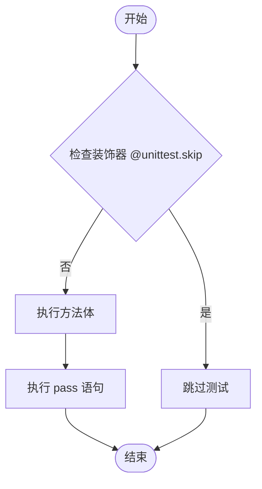

#### 带注释源码

```python
# 导入 unittest 模块以使用 skip 装饰器
import unittest

# ... (class definition above)

    @unittest.skip("Test is not applicable.") 
    # 装饰器：声明该测试用例不适用于当前场景，
    # 在运行测试套件时，该测试将被标记为跳过，不会执行。
    def test_callback_inputs(self):
        # 方法定义：用于测试 pipeline 的回调输入功能。
        # 由于被跳过，方法体内部逻辑不需要实现。
        pass 
        # 占位符语句，表示该方法执行空操作。
```


### `LTXLatentUpsamplePipelineFastTests.test_attention_slicing_forward_pass`

该方法是一个被跳过的单元测试，用于验证注意力切片（Attention Slicing）功能的前向传播是否正确。由于该管道不支持注意力切片功能，因此该测试被标记为不适用并跳过。

参数：

- `self`：隐式参数，`LTXLatentUpsamplePipelineFastTests` 类的实例，表示测试方法所属的测试类
- `test_max_difference`：`bool`，可选参数，默认为 `True`，用于控制是否测试输出与参考输出的最大差异
- `test_mean_pixel_difference`：`bool`，可选参数，默认为 `True`，用于控制是否测试输出与参考输出的平均像素差异
- `expected_max_diff`：`float`，可选参数，默认为 `1e-3`，期望的最大差异阈值，用于判断测试是否通过

返回值：`None`，该方法不返回任何值（方法体为 `pass`）

#### 流程图

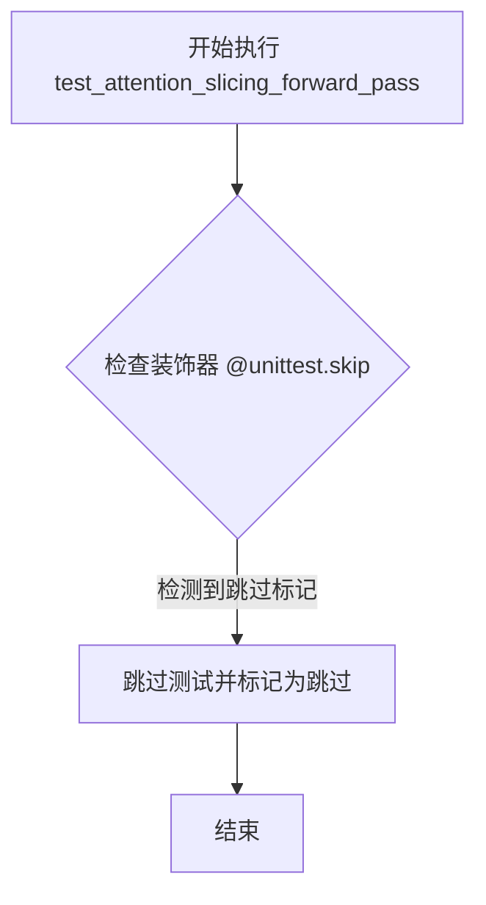

#### 带注释源码

```python
@unittest.skip("Test is not applicable.")
def test_attention_slicing_forward_pass(
    self, test_max_difference=True, test_mean_pixel_difference=True, expected_max_diff=1e-3
):
    """
    测试注意力切片（Attention Slicing）的前向传播功能。
    
    该测试方法原本用于验证在启用注意力切片优化时，管道的前向传播
    是否能够产生与标准前向传播一致的结果。注意力切片是一种内存优化
    技术，通过分片处理注意力机制来减少显存占用。
    
    由于 LTXLatentUpsamplePipeline 不支持注意力切片功能，此测试被
    标记为不适用并跳过。
    
    参数:
        test_max_difference: bool, 是否测试最大差异
        test_mean_pixel_difference: bool, 是否测试平均像素差异  
        expected_max_diff: float, 期望的最大差异阈值
    
    返回:
        None
    """
    pass
```


### `LTXLatentUpsamplePipelineFastTests.test_inference_batch_consistent`

该方法用于测试批量推理一致性，确保多次调用管道进行批量推理时输出结果保持一致。由于该测试不适用于当前管道实现，已被跳过。

参数：无（仅包含 `self` 参数）

返回值：`None`，无返回值

#### 流程图

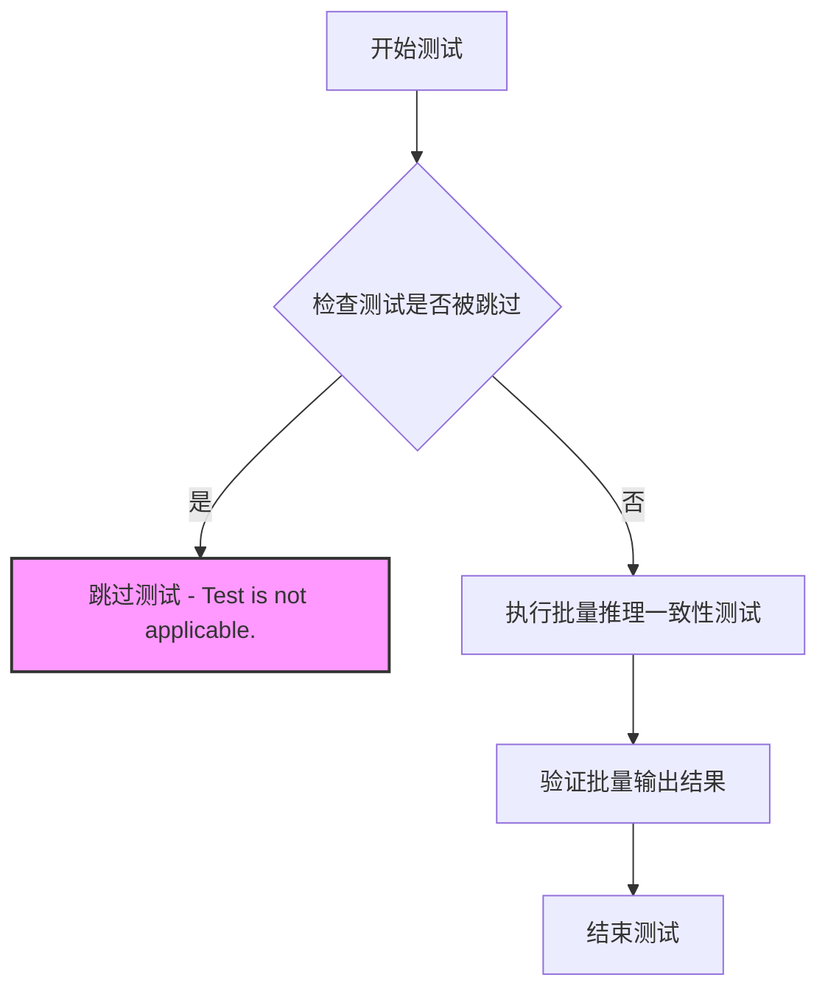

#### 带注释源码

```python
@unittest.skip("Test is not applicable.")
def test_inference_batch_consistent(self):
    """
    测试批量推理一致性。
    
    该测试方法用于验证管道在进行批量推理时，
    多次调用是否产生一致的结果。由于当前管道
    不支持此测试场景，已被跳过。
    
    参数:
        self: 测试类实例引用
    
    返回值:
        None: 测试被跳过，无返回值
    
    注意:
        - 使用 @unittest.skip 装饰器跳过测试
        - 跳过原因: "Test is not applicable."
    """
    pass
```

---

## 完整设计文档

### 1. 一段话描述

该代码文件是 `LTXLatentUpsamplePipeline` 的单元测试套件，包含对视频潜在上采样管道的功能测试（如推理、VAE平铺等），其中批量推理一致性测试被标记为不适用并跳过。

### 2. 文件的整体运行流程

```
1. 导入依赖库 (unittest, numpy, torch, diffusers)
2. 定义测试类 LTXLatentUpsamplePipelineFastTests
3. 配置测试参数 (pipeline_class, params, batch_params 等)
4. 实现辅助方法:
   - get_dummy_components(): 创建虚拟组件
   - get_dummy_inputs(): 生成虚拟输入
5. 执行测试方法:
   - test_inference: 测试基本推理
   - test_vae_tiling: 测试VAE平铺
   - test_callback_inputs: 跳过
   - test_attention_slicing_forward_pass: 跳过
   - test_inference_batch_consistent: 跳过 (目标方法)
   - test_inference_batch_single_identical: 跳过
```

### 3. 类的详细信息

#### 类字段

| 名称 | 类型 | 描述 |
|------|------|------|
| `pipeline_class` | `type` | 管道类 (LTXLatentUpsamplePipeline) |
| `params` | `set` | 管道参数字集 {"video", "generator"} |
| `batch_params` | `set` | 批量参数字集 {"video", "generator"} |
| `required_optional_params` | `frozenset` | 可选必填参数集 |
| `test_xformers_attention` | `bool` | 是否测试xformers注意力 (False) |
| `supports_dduf` | `bool` | 是否支持DDUF (False) |

#### 类方法

| 名称 | 参数 | 返回值 | 描述 |
|------|------|--------|------|
| `get_dummy_components` | `self` | `dict` | 创建虚拟组件字典 |
| `get_dummy_inputs` | `self, device, seed=0` | `dict` | 生成虚拟输入数据 |
| `test_inference` | `self` | `None` | 测试基本推理功能 |
| `test_vae_tiling` | `self, expected_diff_max=0.25` | `None` | 测试VAE平铺功能 |
| `test_callback_inputs` | `self` | `None` | 跳过: 测试回调输入 |
| `test_attention_slicing_forward_pass` | `self, test_max_difference=True, test_mean_pixel_difference=True, expected_max_diff=1e-3` | `None` | 跳过: 测试注意力切片 |
| `test_inference_batch_consistent` | `self` | `None` | 跳过: 测试批量推理一致性 (目标方法) |
| `test_inference_batch_single_identical` | `self` | `None` | 跳过: 测试批量与单例等价性 |

### 4. 关键组件信息

| 名称 | 一句话描述 |
|------|------------|
| `AutoencoderKLLTXVideo` | LTX视频的变分自编码器模型，用于视频编码/解码 |
| `LTXLatentUpsamplePipeline` | LTX潜在上采样管道，负责视频潜在表示的上采样 |
| `LTXLatentUpsamplerModel` | 潜在上采样器模型，实现空间上采样逻辑 |
| `PipelineTesterMixin` | 管道测试混入类，提供通用测试辅助方法 |

### 5. 潜在的技术债务或优化空间

1. **大量测试被跳过**: 8个测试方法中有4个被标记为不适用，可能表明管道功能不完整或测试用例设计不当
2. **硬编码的测试参数**: 虚拟组件和输入使用硬编码值，缺乏灵活性
3. **缺少边界条件测试**: 没有针对极端输入（如空视频、极大分辨率）的测试
4. **测试覆盖不足**: 缺少对错误处理、并发调用、内存泄漏等方面的测试

### 6. 其它项目

#### 设计目标与约束

- **目标**: 验证 `LTXLatentUpsamplePipeline` 的核心功能正确性
- **约束**: 
  - 使用CPU设备进行测试
  - 依赖确定性随机种子 (`enable_full_determinism`)
  - 批量推理测试被标记为不适用

#### 错误处理与异常设计

- 使用 `unittest.skip` 装饰器跳过不适用的测试
- 断言验证输出形状和数值范围
- 预期异常通过 `self.assertLess` 等方法捕获

#### 数据流与状态机

```
输入: video (torch.Tensor) → 管道处理 → 输出: frames (List[torch.Tensor])

测试流程:
1. 初始化虚拟组件 (VAE + LatentUpsampler)
2. 创建虚拟输入 (video, generator, height, width)
3. 调用管道 __call__ 方法
4. 验证输出形状和数值合理性
```

#### 外部依赖与接口契约

- **依赖**: `diffusers` 库、PyTorch、NumPy
- **接口**: 
  - 管道接受 `video`, `generator`, `height`, `width`, `output_type` 参数
  - 返回 `frames` 属性（视频帧序列）


### `LTXLatentUpsamplePipelineFastTests.test_inference_batch_single_identical`

该测试方法用于验证批量推理结果与单样本推理结果的一致性，但当前被标记为不适用并已跳过执行。

参数：

- `self`：`LTXLatentUpsamplePipelineFastTests`，测试类实例本身

返回值：`None`，该方法不返回任何值（void方法）

#### 流程图

```mermaid
flowchart TD
    A[开始执行 test_inference_batch_single_identical] --> B{检查装饰器}
    B --> C[@unittest.skip 装饰器生效]
    C --> D[跳过测试方法执行]
    D --> E[测试标记为跳过/不适用]
    E --> F[结束]
    
    style C fill:#ff9900
    style E fill:#ffcc00
```

#### 带注释源码

```python
@unittest.skip("Test is not applicable.")
def test_inference_batch_single_identical(self):
    """
    测试批量推理与单样本推理结果的一致性。
    
    该测试方法用于验证当使用批量输入（batch）时，
    推理结果应与逐个样本推理的结果完全一致。
    
    参数:
        self: 测试类实例，继承自unittest.TestCase
        
    返回值:
        None: 该方法为void类型，不返回任何值
        
    注意:
        当前该测试被标记为不适用，因此使用@unittest.skip
        装饰器跳过执行。这通常意味着该功能尚未实现或
        在当前测试环境下无法进行测试。
    """
    pass  # 方法体为空，测试被跳过
```

## 关键组件


### LTXLatentUpsamplePipeline

用于对LTX视频的潜在表示进行上采样的扩散管道，支持视频帧的潜在空间升维处理。

### AutoencoderKLLTXVideo

变分自编码器(VAE)模型，用于对视频进行编码和解码，支持空间和时间维度的缩放，以及可选的平铺处理以支持高分辨率视频。

### LTXLatentUpsamplerModel

潜在的升采样模型，负责将低分辨率的潜在表示升采样到更高分辨率，支持空间上采样但不支持时间上采样。

### VAE Tiling（平铺功能）

通过将高分辨率图像分割成较小的瓦片进行处理的方式，使VAE能够处理超大分辨率视频，同时避免内存溢出问题。

### PipelineTesterMixin

通用的pipeline测试混入类，提供标准化的测试接口和方法，用于验证pipeline的正确性和一致性。

### 生成器（Generator）

用于控制随机性的PyTorch生成器，确保测试结果的可重现性和确定性。

### enable_full_determinism

测试辅助函数，用于启用完全确定性模式，确保在相同种子下产生一致的测试结果。


## 问题及建议


### 已知问题

-   **测试跳过导致覆盖不足**：4个测试方法（`test_callback_inputs`、`test_attention_slicing_forward_pass`、`test_inference_batch_consistent`、`test_inference_batch_single_identical`）被无条件跳过，但未说明具体原因，可能代表未实现功能或已知失败的测试场景
-   **断言阈值设置不合理**：`test_inference` 中的 `max_diff <= 1e10` 阈值过大，几乎任何输出都能通过，无法有效验证功能正确性；且使用随机数据 `torch.randn` 作为期望值，每次运行结果不同
-   **MPS设备特殊处理不一致**：`get_dummy_inputs` 中对 MPS 设备使用 `torch.manual_seed` 而其他设备使用 `Generator`，这种条件分支可能导致设备行为不一致
-   **测试输入不一致风险**：`test_vae_tiling` 中分别调用两次 `get_dummy_inputs` 可能导致输入数据不同，尽管设置了相同的 seed
-   **硬编码的测试参数**：视频尺寸 (5,3,32,32)、tiling 参数 (96, 96, 64, 64) 等以魔法数字形式存在，缺乏统一配置管理
-   **缺少类型注解**：部分方法参数如 `test_vae_tiling(self, expected_diff_max: float = 0.25)` 缺少返回类型注解

### 优化建议

-   为跳过的测试添加详细的原因说明注释，或实现被跳过的功能以提高测试覆盖率
-   调整 `test_inference` 的阈值至合理范围（如 1e-3 或更小），并使用固定随机种子生成期望视频，确保测试可重复
-   统一设备处理逻辑，使用 pytest fixture 或 setUp 方法集中管理测试设备和随机种子
-   在 `test_vae_tiling` 中复用同一份输入数据，或在调用前确保随机状态一致
-   将硬编码的测试参数提取为类常量或配置文件，提高可维护性
-   补充完整的类型注解，提升代码可读性和静态分析能力

## 其它


### 设计目标与约束

本测试文件的设计目标是验证 `LTXLatentUpsamplePipeline` 管道在潜在表示上采样任务中的功能正确性和数值稳定性。测试约束包括：仅测试 CPU 设备上的推理过程，不测试 xFormers 注意力机制，不支持 DDUF（Diffusion Decoder Upsampling Framework），并使用固定的随机种子确保测试可复现性。

### 错误处理与异常设计

测试类通过 `@unittest.skip` 装饰器显式跳过不适用的测试用例，包括 `test_callback_inputs`、`test_attention_slicing_forward_pass`、`test_inference_batch_consistent` 和 `test_inference_batch_single_identical`，这些测试在该管道中不适用。推理测试中使用 `self.assertLessEqual` 验证输出数值在合理范围内，VAE 平铺测试使用 `self.assertLess` 比较有无平铺的输出差异是否在预期阈值内。

### 数据流与状态机

测试数据流如下：1）通过 `get_dummy_components()` 初始化 VAE 和 LatentUpsampler 模型组件；2）通过 `get_dummy_inputs()` 生成随机的视频张量（5帧、3通道、32x32分辨率）和随机数生成器；3）将组件实例化为管道并移动到设备；4）调用管道执行推理，输出视频帧；5）验证输出形状和数值正确性。VAE 平铺测试额外测试了启用/禁用平铺两种状态下的输出一致性。

### 外部依赖与接口契约

本测试依赖以下外部组件和接口：`diffusers` 库中的 `AutoencoderKLLTXVideo`（视频 VAE 编码器-解码器）、`LTXLatentUpsamplePipeline`（主管道类）和 `LTXLatentUpsamplerModel`（潜在上采样模型）；`numpy` 用于数值比较；`torch` 用于张量操作。管道组件接口约定：必须包含 `vae` 和 `latent_upsampler` 两个键；输入接口接受 video（张量）、generator（随机生成器）、height、width、output_type 参数；输出接口返回包含 frames 属性的对象。

### 测试覆盖率与边界条件

当前测试覆盖了以下场景：1）基本推理功能（test_inference），验证管道能正常执行并输出正确形状；2）VAE 平铺功能（test_vae_tiling），验证在 128x128 分辨率下启用平铺不会影响结果。边界条件包括：使用 MPS 设备时的特殊随机种子处理，跳过的测试表明不支持批处理一致性、单帧identical、注意力切片和回调输入等功能。

### 性能基准与资源需求

测试使用固定的虚拟组件配置：VAE 具有 8 通道潜在表示、4 级编码器/解码器块、每块 1 层；LatentUpsampler 具有 8 输入通道、32 中间通道、每级 1 个模块、3 维度和空间上采样。性能基准：单次推理使用 5 帧 32x32 分辨率视频，VAE 平铺测试使用 128x128 分辨率以触发平铺逻辑。

### 技术债务与优化空间

当前测试文件存在以下优化空间：1）多个测试方法被跳过但保留方法名，建议要么实现要么移除；2）test_inference 中的期望视频使用 `torch.randn` 生成，导致每次运行期望值不同，应使用固定种子生成期望值以实现真正的确定性测试；3）缺少对潜在上采样模型输出的中间验证；4）缺少对不同分辨率和帧数的参数化测试；5）测试仅覆盖 CPU 设备，未覆盖 GPU/CUDA 设备。

    