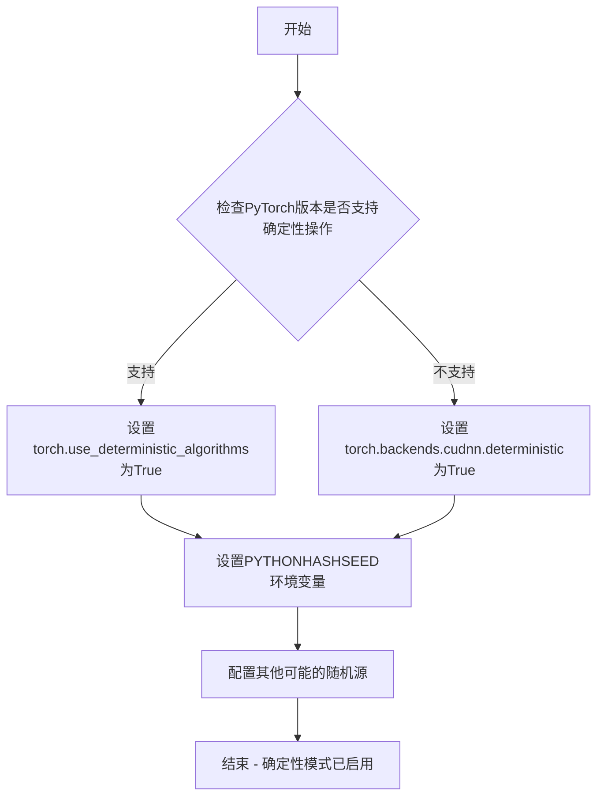
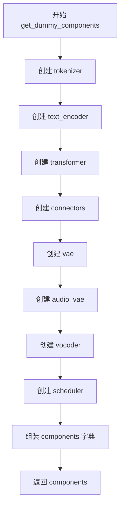
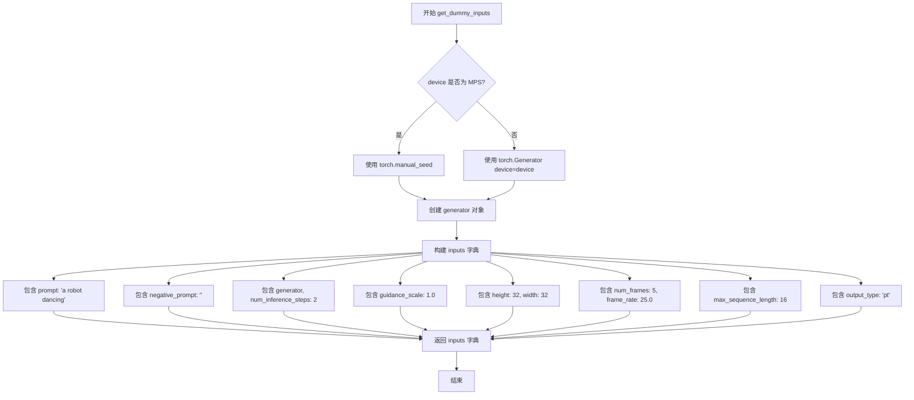
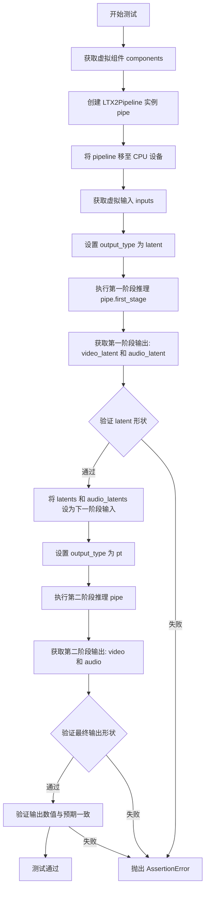
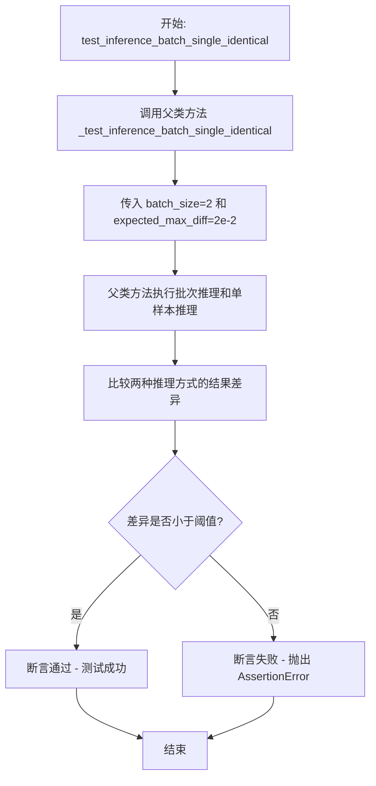

# `diffusers\tests\pipelines\ltx2\test_ltx2.py` 详细设计文档

该文件是针对 LTX2 视频生成流水线的单元测试套件，定义了 LTX2PipelineFastTests 测试类，通过 unittest 框架验证模型从文本提示生成视频和音频的能力，包括端到端推理、双阶段潜在空间推理以及批次一致性测试。

## 整体流程

```mermaid
graph TD
    Start[开始] --> Setup[获取虚拟组件 get_dummy_components]
    Setup --> CreatePipeline[实例化 LTX2Pipeline]
    CreatePipeline --> PrepareInputs[获取虚拟输入 get_dummy_inputs]
    PrepareInputs --> Execute{执行测试}
    Execute -- test_inference --> Run1[单阶段推理: pipe(**inputs)]
    Execute -- test_two_stages_inference --> Run2a[第一阶段: 生成 Latent]
    Run2a --> Run2b[第二阶段: 重构 Video/Audio]
    Run1 --> Assert[断言: 形状与数值]
    Run2b --> Assert
    Assert --> End[结束]
```

## 类结构

```
unittest.TestCase
├── PipelineTesterMixin
│   └── LTX2PipelineFastTests
```

## 全局变量及字段


### `LTX2PipelineFastTests.pipeline_class`
    
要测试的LTX2管道类

类型：`type`
    


### `LTX2PipelineFastTests.params`
    
文本到图像管道的参数集合，排除交叉注意力kwargs

类型：`frozenset`
    


### `LTX2PipelineFastTests.batch_params`
    
批量推理时使用的参数集合

类型：`frozenset`
    


### `LTX2PipelineFastTests.image_params`
    
图像生成相关的参数集合

类型：`frozenset`
    


### `LTX2PipelineFastTests.image_latents_params`
    
图像潜在向量相关的参数集合

类型：`frozenset`
    


### `LTX2PipelineFastTests.required_optional_params`
    
必需的可选参数集合，包含推理步数、生成器、潜在向量等

类型：`frozenset`
    


### `LTX2PipelineFastTests.test_attention_slicing`
    
标识是否测试注意力切片功能

类型：`bool`
    


### `LTX2PipelineFastTests.test_xformers_attention`
    
标识是否测试xformers注意力机制

类型：`bool`
    


### `LTX2PipelineFastTests.supports_dduf`
    
标识管道是否支持DDUF（_decoder denoising unflow）

类型：`bool`
    


### `LTX2PipelineFastTests.base_text_encoder_ckpt_id`
    
基础文本编码器的HuggingFace检查点ID，用于加载小型Gemma3模型

类型：`str`
    
    

## 全局函数及方法


### `enable_full_determinism`

该函数用于启用完全确定性（full determinism）模式，确保PyTorch和相关库在执行操作时产生可重复的结果，这对于测试和调试非常重要，可以消除由于非确定性操作（如并行操作、浮点运算顺序等）导致的测试结果不确定性。

参数：

- （无参数）

返回值：`None`，该函数通常通过设置全局或环境变量来改变库的随机行为，不返回任何值。

#### 流程图



#### 带注释源码

```
# 注意：由于enable_full_determinism是从testing_utils模块导入的，
# 以下是基于其功能推测的源码实现

def enable_full_determinism(seed: int = 0, extra_seed: bool = True):
    """
    启用完全确定性模式，确保测试结果可重复。
    
    参数：
    - seed: int, 随机种子，默认为0
    - extra_seed: bool, 是否设置额外的随机种子，默认为True
    
    返回值：
    - None
    """
    
    # 1. 设置PyTorch的确定性算法模式
    #    这会强制PyTorch使用确定性算法而不是可能非确定性的算法
    torch.use_deterministic_algorithms(True)
    
    # 2. 设置CUDNN后端为确定性模式
    #    CUDNN的某些算法可能不是确定性的，此设置确保卷积等操作可重复
    torch.backends.cudnn.deterministic = True
    torch.backends.cudnn.benchmark = False
    
    # 3. 设置Python哈希种子
    #    Python的哈希算法在每次运行时会随机化，设置固定种子确保可重复
    import os
    os.environ["PYTHONHASHSEED"] = str(seed)
    
    # 4. 设置NumPy随机种子（如果使用NumPy）
    try:
        import numpy as np
        np.random.seed(seed)
    except ImportError:
        pass
    
    # 5. 设置PyTorch随机种子
    torch.manual_seed(seed)
    torch.cuda.manual_seed_all(seed)
    
    # 6. 设置Python random模块的随机种子
    import random
    random.seed(seed)
    
    # 7. 根据extra_seed标志设置额外的环境变量
    #    这些环境变量可以进一步确保某些第三方库的行为确定性
    if extra_seed:
        os.environ["CUBLAS_WORKSPACE_CONFIG"] = ":4096:8"
    
    return None
```


### `LTX2PipelineFastTests.get_dummy_components`

该方法用于创建和返回LTX2Pipeline所需的虚拟（dummy）组件字典，主要用于单元测试场景。它初始化了分词器、文本编码器、视频Transformer模型、文本连接器、视频VAE、音频VAE、 vocoder声码器以及调度器等全部核心组件，并使用固定随机种子确保测试结果的可重复性。

参数：

- `self`：隐式参数，LTX2PipelineFastTests类的实例

返回值：`Dict[str, Any]`，包含LTX2Pipeline所有组件的字典，键名包括transformer、vae、audio_vae、scheduler、text_encoder、tokenizer、connectors、vocoder

#### 流程图



#### 带注释源码

```python
def get_dummy_components(self):
    # 1. 从预训练模型加载分词器（使用微型Gemma3模型作为测试基础）
    tokenizer = AutoTokenizer.from_pretrained(self.base_text_encoder_ckpt_id)
    
    # 2. 加载文本编码器（条件生成模型，用于将文本转换为嵌入表示）
    text_encoder = Gemma3ForConditionalGeneration.from_pretrained(self.base_text_encoder_ckpt_id)

    # 3. 设置随机种子0，确保测试结果可重复
    torch.manual_seed(0)
    
    # 4. 创建视频Transformer 3D模型（核心扩散变换器）
    #    参数：4通道输入/输出、2个注意力头、8维注意力头维度、16维交叉注意力维度、2层等
    transformer = LTX2VideoTransformer3DModel(
        in_channels=4,
        out_channels=4,
        patch_size=1,
        patch_size_t=1,
        num_attention_heads=2,
        attention_head_dim=8,
        cross_attention_dim=16,
        audio_in_channels=4,
        audio_out_channels=4,
        audio_num_attention_heads=2,
        audio_attention_head_dim=4,
        audio_cross_attention_dim=8,
        num_layers=2,
        qk_norm="rms_norm_across_heads",
        caption_channels=text_encoder.config.text_config.hidden_size,
        rope_double_precision=False,
        rope_type="split",
    )

    # 5. 设置随机种子0，重新初始化
    torch.manual_seed(0)
    
    # 6. 创建文本连接器（用于连接文本编码器与视频/音频生成过程）
    connectors = LTX2TextConnectors(
        caption_channels=text_encoder.config.text_config.hidden_size,
        text_proj_in_factor=text_encoder.config.text_config.num_hidden_layers + 1,
        video_connector_num_attention_heads=4,
        video_connector_attention_head_dim=8,
        video_connector_num_layers=1,
        video_connector_num_learnable_registers=None,
        audio_connector_num_attention_heads=4,
        audio_connector_attention_head_dim=8,
        audio_connector_num_layers=1,
        audio_connector_num_learnable_registers=None,
        connector_rope_base_seq_len=32,
        rope_theta=10000.0,
        rope_double_precision=False,
        causal_temporal_positioning=False,
        rope_type="split",
    )

    # 7. 设置随机种子0
    torch.manual_seed(0)
    
    # 8. 创建视频VAE（变分自编码器，用于视频潜在空间编码/解码）
    vae = AutoencoderKLLTX2Video(
        in_channels=3,
        out_channels=3,
        latent_channels=4,
        block_out_channels=(8,),
        decoder_block_out_channels=(8,),
        layers_per_block=(1,),
        decoder_layers_per_block=(1, 1),
        spatio_temporal_scaling=(True,),
        decoder_spatio_temporal_scaling=(True,),
        decoder_inject_noise=(False, False),
        downsample_type=("spatial",),
        upsample_residual=(False,),
        upsample_factor=(1,),
        timestep_conditioning=False,
        patch_size=1,
        patch_size_t=1,
        encoder_causal=True,
        decoder_causal=False,
    )
    # 禁用帧级编码/解码，使用批量处理
    vae.use_framewise_encoding = False
    vae.use_framewise_decoding = False

    # 9. 设置随机种子0
    torch.manual_seed(0)
    
    # 10. 创建音频VAE（用于音频潜在空间编码/解码）
    audio_vae = AutoencoderKLLTX2Audio(
        base_channels=4,
        output_channels=2,
        ch_mult=(1,),
        num_res_blocks=1,
        attn_resolutions=None,
        in_channels=2,
        resolution=32,
        latent_channels=2,
        norm_type="pixel",
        causality_axis="height",
        dropout=0.0,
        mid_block_add_attention=False,
        sample_rate=16000,
        mel_hop_length=160,
        is_causal=True,
        mel_bins=8,
    )

    # 11. 设置随机种子0
    torch.manual_seed(0)
    
    # 12. 创建声码器（将梅尔频谱图转换为音频波形）
    vocoder = LTX2Vocoder(
        in_channels=audio_vae.config.output_channels * audio_vae.config.mel_bins,
        hidden_channels=32,
        out_channels=2,
        upsample_kernel_sizes=[4, 4],
        upsample_factors=[2, 2],
        resnet_kernel_sizes=[3],
        resnet_dilations=[[1, 3, 5]],
        leaky_relu_negative_slope=0.1,
        output_sampling_rate=16000,
    )

    # 13. 创建调度器（使用Euler离散方法进行流匹配采样）
    scheduler = FlowMatchEulerDiscreteScheduler()

    # 14. 组装所有组件到字典中
    components = {
        "transformer": transformer,
        "vae": vae,
        "audio_vae": audio_vae,
        "scheduler": scheduler,
        "text_encoder": text_encoder,
        "tokenizer": tokenizer,
        "connectors": connectors,
        "vocoder": vocoder,
    }

    # 15. 返回组件字典，供pipeline初始化使用
    return components
```


### `LTX2PipelineFastTests.get_dummy_inputs`

该方法用于生成LTX2Pipeline的虚拟输入参数，为单元测试提供可控的、可复现的推理输入数据。

参数：

- `self`：隐式参数，LTX2PipelineFastTests类的实例方法
- `device`：`torch.device`，目标设备，用于创建随机数生成器
- `seed`：`int`，随机种子，默认值为0，用于确保测试的可重复性

返回值：`Dict[str, Any]`，返回包含推理所需参数的字典，包括提示词、负提示词、生成器、推理步数、引导 scale、图像尺寸、帧数、帧率、最大序列长度和输出类型

#### 流程图



#### 带注释源码

```python
def get_dummy_inputs(self, device, seed=0):
    """
    生成用于 LTX2 Pipeline 测试的虚拟输入参数。
    
    Args:
        self: LTX2PipelineFastTests 实例的方法
        device (torch.device): 目标计算设备，用于创建随机数生成器
        seed (int): 随机种子，用于确保测试结果可复现，默认值为 0
    
    Returns:
        Dict[str, Any]: 包含 pipeline 推理所需参数的字典
    """
    # 判断设备是否为 Apple MPS (Metal Performance Shaders)
    # MPS 设备不支持 torch.Generator，需要使用 torch.manual_seed 代替
    if str(device).startswith("mps"):
        # 对于 MPS 设备，使用简化的随机种子设置方式
        generator = torch.manual_seed(seed)
    else:
        # 对于 CPU/CUDA 设备，创建带指定种子的生成器
        # 这样可以确保每次测试使用相同的随机状态，提高测试可重复性
        generator = torch.Generator(device=device).manual_seed(seed)

    # 构建测试用的输入参数字典
    inputs = {
        "prompt": "a robot dancing",           # 文本提示词
        "negative_prompt": "",                 # 负向提示词（为空表示不使用）
        "generator": generator,                 # 随机数生成器，控制噪声采样
        "num_inference_steps": 2,              # 推理步数，较少步数用于快速测试
        "guidance_scale": 1.0,                  # 引导强度，1.0 表示不使用分类器自由引导
        "height": 32,                           # 生成视频的高度（像素）
        "width": 32,                            # 生成视频的宽度（像素）
        "num_frames": 5,                        # 生成视频的帧数
        "frame_rate": 25.0,                     # 视频帧率
        "max_sequence_length": 16,              # 文本序列最大长度
        "output_type": "pt",                    # 输出类型，'pt' 表示 PyTorch 张量
    }

    # 返回包含完整推理参数的字典，供 pipeline.__call__ 使用
    return inputs
```


### `LTX2PipelineFastTests.test_inference`

该测试方法验证 LTX2Pipeline 在 CPU 设备上执行文本到视频和音频的生成推理功能，通过构建虚拟组件、运行完整推理流程并校验输出帧（video）和音频（audio）的形状及数值正确性。

参数：

- `self`：`LTX2PipelineFastTests`，测试类的实例，隐含参数，用于访问类属性和方法

返回值：`None`，该方法为测试用例，通过 `self.assertEqual` 和 `assert torch.allclose` 断言验证输出，不返回任何值

#### 流程图

```mermaid
flowchart TD
    A[开始测试 test_inference] --> B[设置设备为 CPU]
    B --> C[调用 get_dummy_components 获取虚拟组件]
    C --> D[使用虚拟组件实例化 LTX2Pipeline]
    D --> E[将 Pipeline 移至 CPU 设备]
    E --> F[设置进度条配置 disable=None]
    F --> G[调用 get_dummy_inputs 获取虚拟输入]
    G --> H[执行 Pipeline 推理: pipe\*\*inputs]
    H --> I[获取输出: video = output.frames, audio = output.audio]
    I --> J{验证 video 形状}
    J -->|通过| K{验证 audio 形状}
    J -->|失败| L[断言失败]
    K -->|通过| M[提取视频和音频的期望张量片]
    M --> N[展平 video 和 audio]
    N --> O[生成测试切片: video[:8] + video[-8:]]
    O --> P[断言视频数值 close]
    P -->|通过| Q[断言音频数值 close]
    P -->|失败| L
    Q -->|通过| R[测试通过]
    Q -->|失败| L
```

#### 带注释源码

```python
def test_inference(self):
    """测试 LTX2Pipeline 的完整推理流程，验证视频和音频输出的形状及数值正确性"""
    
    # 步骤1: 设置计算设备为 CPU
    device = "cpu"

    # 步骤2: 获取虚拟组件（用于测试的模拟模型组件）
    # 包含: transformer, vae, audio_vae, scheduler, text_encoder, tokenizer, connectors, vocoder
    components = self.get_dummy_components()
    
    # 步骤3: 使用虚拟组件实例化 LTX2Pipeline 管道
    pipe = self.pipeline_class(**components)
    
    # 步骤4: 将管道移至指定设备（CPU）
    pipe.to(device)
    
    # 步骤5: 配置进度条（disable=None 表示不禁用进度条）
    pipe.set_progress_bar_config(disable=None)

    # 步骤6: 获取虚拟输入参数
    # 包含: prompt, negative_prompt, generator, num_inference_steps, guidance_scale,
    #       height, width, num_frames, frame_rate, max_sequence_length, output_type
    inputs = self.get_dummy_inputs(device)
    
    # 步骤7: 执行管道推理，生成视频和音频
    output = pipe(**inputs)
    
    # 步骤8: 从输出对象中提取视频帧和音频数据
    video = output.frames    # 视频帧张量
    audio = output.audio    # 音频张量

    # 步骤9: 断言验证视频输出形状
    # 期望形状: (batch=1, frames=5, channels=3, height=32, width=32)
    self.assertEqual(video.shape, (1, 5, 3, 32, 32))
    
    # 步骤10: 断言验证音频输出形状
    # 期望: batch=1, 通道数等于 vocoder 的 out_channels
    self.assertEqual(audio.shape[0], 1)
    self.assertEqual(audio.shape[1], components["vocoder"].config.out_channels)

    # 步骤11: 定义期望的视频张量切片（用于数值验证）
    # fmt: off
    expected_video_slice = torch.tensor(
        [
            0.4331, 0.6203, 0.3245, 0.7294, 0.4822, 0.5703, 0.2999, 0.7700, 
            0.4961, 0.4242, 0.4581, 0.4351, 0.1137, 0.4437, 0.6304, 0.3184
        ]
    )
    
    # 步骤12: 定义期望的音频张量切片（用于数值验证）
    expected_audio_slice = torch.tensor(
        [
            0.0263, 0.0528, 0.1217, 0.1104, 0.1632, 0.1072, 0.1789, 0.0949, 
            0.0672, -0.0069, 0.0688, 0.0097, 0.0808, 0.1231, 0.0986, 0.0739
        ]
    )
    # fmt: on

    # 步骤13: 展平视频和音频张量以便提取切片
    video = video.flatten()
    audio = audio.flatten()
    
    # 步骤14: 生成测试切片（取前8个和后8个元素，合并为16个元素的切片）
    generated_video_slice = torch.cat([video[:8], video[-8:]])
    generated_audio_slice = torch.cat([audio[:8], audio[-8:]])

    # 步骤15: 断言验证视频输出的数值正确性（使用 torch.allclose 进行近似比较）
    assert torch.allclose(expected_video_slice, generated_video_slice, atol=1e-4, rtol=1e-4)
    
    # 步骤16: 断言验证音频输出的数值正确性
    assert torch.allclose(expected_audio_slice, generated_audio_slice, atol=1e-4, rtol=1e-4)
```


### `LTX2PipelineFastTests.test_two_stages_inference`

该方法测试 LTX2Pipeline 的两阶段推理功能：首先以 latent 模式运行第一阶段获取视频和音频的潜在表示，然后将潜在表示作为输入运行第二阶段以生成最终的视频和音频帧，并验证输出形状和数值的正确性。

参数：

- `self`：`LTX2PipelineFastTests`，测试类实例，包含测试所需的组件和配置信息

返回值：`None`，该方法为单元测试方法，通过 assert 语句验证推理结果的正确性，不返回具体数值

#### 流程图



#### 带注释源码

```python
def test_two_stages_inference(self):
    """测试 LTX2Pipeline 的两阶段推理功能：先输出 latent，再从 latent 生成最终视频和音频"""
    device = "cpu"  # 设定测试设备为 CPU

    # 获取虚拟组件，用于初始化 pipeline
    components = self.get_dummy_components()
    # 使用虚拟组件创建 LTX2Pipeline 实例
    pipe = self.pipeline_class(**components)
    # 将 pipeline 移至指定设备
    pipe.to(device)
    # 配置进度条（禁用）
    pipe.set_progress_bar_config(disable=None)

    # 获取虚拟输入参数
    inputs = self.get_dummy_inputs(device)
    # 设置第一阶段输出类型为 latent（潜在表示）
    inputs["output_type"] = "latent"
    # 执行第一阶段推理，返回潜在表示
    first_stage_output = pipe(**inputs)
    # 从第一阶段输出中提取视频和音频的潜在表示
    video_latent = first_stage_output.frames
    audio_latent = first_stage_output.audio

    # 验证视频 latent 形状：(batch, channels, frames, height, width)
    self.assertEqual(video_latent.shape, (1, 4, 3, 16, 16))
    # 验证音频 latent 形状：(batch, channels, frames, samples)
    self.assertEqual(audio_latent.shape, (1, 2, 5, 2))
    # 验证音频 latent 的通道数与 vocoder 配置一致
    self.assertEqual(audio_latent.shape[1], components["vocoder"].config.out_channels)

    # 将第一阶段的 latent 作为第二阶段的输入
    inputs["latents"] = video_latent
    inputs["audio_latents"] = audio_latent
    # 设置第二阶段输出类型为 pytorch tensor
    inputs["output_type"] = "pt"
    # 执行第二阶段推理，从 latent 生成最终视频和音频
    second_stage_output = pipe(**inputs)
    # 从第二阶段输出中提取最终的 video 和 audio
    video = second_stage_output.frames
    audio = second_stage_output.audio

    # 验证最终视频形状：(batch, frames, channels, height, width)
    self.assertEqual(video.shape, (1, 5, 3, 32, 32))
    # 验证最终音频批次维度
    self.assertEqual(audio.shape[0], 1)
    # 验证最终音频通道数与 vocoder 配置一致
    self.assertEqual(audio.shape[1], components["vocoder"].config.out_channels)

    # 预期的视频切片数值（用于验证推理精度）
    expected_video_slice = torch.tensor(
        [
            0.5514, 0.5943, 0.4260, 0.5971, 0.4306, 0.6369, 0.3124, 0.6964, 0.5419, 0.2412, 0.3882, 0.4504, 0.1941, 0.3404, 0.6037, 0.2464
        ]
    )
    # 预期的音频切片数值（用于验证推理精度）
    expected_audio_slice = torch.tensor(
        [
            0.0252, 0.0526, 0.1211, 0.1119, 0.1638, 0.1042, 0.1776, 0.0948, 0.0672, -0.0069, 0.0688, 0.0097, 0.0808, 0.1231, 0.0986, 0.0739
        ]
    )

    # 展平输出以便比较
    video = video.flatten()
    audio = audio.flatten()
    # 提取首尾各8个元素组成验证切片
    generated_video_slice = torch.cat([video[:8], video[-8:]])
    generated_audio_slice = torch.cat([audio[:8], audio[-8:]])

    # 断言视频输出数值与预期一致（容差 1e-4）
    assert torch.allclose(expected_video_slice, generated_video_slice, atol=1e-4, rtol=1e-4)
    # 断言音频输出数值与预期一致（容差 1e-4）
    assert torch.allclose(expected_audio_slice, generated_audio_slice, atol=1e-4, rtol=1e-4)
```


### `LTX2PipelineFastTests.test_inference_batch_single_identical`

该方法是一个单元测试，用于验证批处理推理（batch inference）与单样本推理（single inference）产生的结果是否一致。这是 Diffusion Pipeline 测试中的常见模式，确保模型在处理批量数据时不会因内部状态或随机性导致结果差异。

参数：

- `self`：隐式参数，测试类实例本身
- `batch_size`：整型，默认值为 2，表示批处理中的样本数量
- `expected_max_diff`：浮点型，默认值为 2e-2（0.02），允许的最大差异阈值

返回值：无返回值（`None`），该方法通过断言进行验证

#### 流程图



#### 带注释源码

```python
def test_inference_batch_single_identical(self):
    """
    测试方法：验证批处理推理与单样本推理结果的一致性
    
    该测试方法继承自 PipelineTesterMixin，通过调用父类的
    _test_inference_batch_single_identical 方法来实现。
    它确保当使用相同的输入和随机种子时，批处理推理（batch_size=2）
    产生的结果与单样本推理产生的结果在数值上非常接近（差异小于 2e-2）。
    
    这种测试对于确保模型的确定性和批处理逻辑的正确性非常重要。
    """
    # 调用父类 PipelineTesterMixin 的测试方法
    # batch_size=2: 使用两个样本的批次进行测试
    # expected_max_diff=2e-2: 允许的最大平均差异为 0.02
    self._test_inference_batch_single_identical(batch_size=2, expected_max_diff=2e-2)
```

## 关键组件


### LTX2Pipeline

LTX2Pipeline是主要的文本到视频和音频生成管道，协调文本编码器、变换器、VAE、连接器和声码器来生成视频和音频内容。

### LTX2VideoTransformer3DModel

3D视频变换器模型，负责基于文本嵌入和潜在表示进行去噪处理，生成视频 latent。

### AutoencoderKLLTX2Video

视频自动编码器（VAE），将视频帧编码到潜在空间并从潜在空间解码恢复视频帧。

### AutoencoderKLLTX2Audio

音频自动编码器（VAE），将音频编码到潜在空间并从潜在空间解码，使用梅尔频谱图表示。

### LTX2TextConnectors

文本连接器模块，负责将文本嵌入投影到视频和音频 latent 空间，建立文本与视听内容之间的关联。

### LTX2Vocoder

语音合成器，将音频 latent（梅尔频谱图）转换为最终的波形音频输出。

### FlowMatchEulerDiscreteScheduler

基于欧拉离散方法的 Flow Match 调度器，用于控制去噪过程中的噪声调度。

### 两阶段推理机制

支持两阶段生成：第一阶段输出 latent 表示，第二阶段利用 latent 进行重建，实现潜在空间操作和精确控制。

### 张量切片与输出验证

通过张量切片（video[:8], video[-8:]）对输出进行验证，采用首尾采样策略确保输出一致性检查的效率。


## 问题及建议


### 已知问题

- **硬编码的配置值过多**：多个参数如 `num_inference_steps=2`、`guidance_scale=1.0`、`height=32`、`width=32`、`num_frames=5`、`frame_rate=25.0`、`max_sequence_length=16` 等被硬编码在 `get_dummy_inputs` 方法中，缺乏灵活性和可配置性
- **测试用例之间存在重复代码**：`test_inference` 和 `test_two_stages_inference` 方法中，视频和音频的切片提取、比较逻辑几乎完全相同，造成代码冗余
- **硬编码的测试模型路径**：`base_text_encoder_ckpt_id = "hf-internal-testing/tiny-gemma3"` 是硬编码的 HuggingFace 模型路径，依赖于外部服务可用性
- **禁用的功能标志缺乏说明**：`test_attention_slicing = False`、`test_xformers_attention = False`、`supports_dduf = False` 被硬编码为 False，但未说明原因，无法判断是功能未实现还是存在已知问题
- **设备兼容性处理不一致**：使用 `str(device).startswith("mps")` 进行特殊处理，且 MPS 设备使用 `torch.manual_seed(seed)` 而其他设备使用 `torch.Generator(device=device).manual_seed(seed)`，这种差异可能导致测试行为不一致
- **资源管理不完善**：测试方法中没有显式的资源清理（如模型卸载、GPU 内存释放），可能在连续运行多个测试时导致内存泄漏
- **断言信息不够详细**：使用 `assert torch.allclose(...)` 时没有提供自定义错误消息，测试失败时难以快速定位问题
- **浮点数容差固定**：使用固定的 `atol=1e-4, rtol=1e-4` 容差，没有根据不同测试场景进行调整

### 优化建议

- **提取公共测试逻辑**：将视频和音频切片的提取与比较逻辑封装成私有方法（如 `_compare_video_slices`、`_compare_audio_slices`），减少代码重复
- **使用配置类或 fixture**：将硬编码的超参数提取到类级别的类属性或使用 pytest fixture 进行参数化，提高测试灵活性
- **增加错误处理测试**：添加对无效输入（如负数分辨率、超过限制的帧数等）的测试用例，提高测试覆盖率
- **统一设备处理逻辑**：使用统一的设备抽象层或辅助方法处理 CPU、MPS、CUDA 等不同设备的差异
- **添加资源清理机制**：在测试类中实现 `tearDown` 方法或在测试方法结束时显式释放模型资源
- **改进断言消息**：为关键断言添加描述性错误消息，如 `assert torch.allclose(..., atol=1e-4), f"Video mismatch: expected {expected_video_slice}, got {generated_video_slice}"`
- **增加文档注释**：为禁用的功能标志添加注释说明原因，为复杂的模型配置参数添加文档

## 其它


### 设计目标与约束

本测试文件旨在验证 LTX2Pipeline 的核心功能正确性，包括文本到视频和音频的生成能力、两阶段推理流程（latent 模式）以及批处理一致性。测试约束包括：仅支持 CPU 设备（部分 MPS 设备兼容）、禁用注意力切片和 xFormers、不支持 DDUF（Decoupled Diffusion Upsampling Flow）。设计目标确保管道在给定固定随机种子时产生确定性的数值输出，并验证输出维度符合预期配置。

### 错误处理与异常设计

测试未显式捕获异常，采用 unittest 标准断言进行验证。潜在错误场景包括：设备不兼容导致张量运算失败、模型组件加载失败、输出维度不匹配、浮点精度误差超出容差范围（atol=1e-4, rtol=1e-4）。测试使用 `torch.allclose` 进行数值近似比较，允许有限误差而非严格相等，以适应浮点运算的固有不确定性。

### 数据流与状态机

测试数据流遵循以下状态转换：初始化阶段创建虚拟组件（tokenizer, text_encoder, transformer, vae, audio_vae, scheduler, connectors, vocoder）→ 推理输入准备（get_dummy_inputs）→ 管道执行（pipe.__call__）→ 输出验证（output.frames, output.audio）。两阶段测试额外包含 latent 状态：第一次推理输出 latent（video_latent, audio_latent）→ 将 latent 作为第二次推理的输入 → 最终输出验证。状态转换由 PipelineTesterMixin 框架管理，确保各测试方法间状态隔离。

### 外部依赖与接口契约

核心依赖包括：transformers 库（AutoTokenizer, Gemma3ForConditionalGeneration）提供文本编码能力；diffusers 库（LTX2Pipeline, AutoencoderKLLTX2Video, AutoencoderKLLTX2Audio, FlowMatchEulerDiscreteScheduler, LTX2VideoTransformer3DModel, LTX2TextConnectors, LTX2Vocoder）提供管道及组件实现；torch 库提供张量运算和随机数生成。接口契约规定：pipeline 接受 prompt, negative_prompt, generator, num_inference_steps, guidance_scale, height, width, num_frames, frame_rate, max_sequence_length, output_type 等参数；返回对象包含 frames（视频张量）和 audio（音频张量）属性。

### 测试覆盖与测试策略

测试覆盖三个主要场景：单次推理（test_inference）验证端到端管道功能；两阶段推理（test_two_stages_inference）验证 latent 模式下的管道可重入性；批处理一致性（test_inference_batch_single_identical）验证批处理与单样本处理的结果等价性。测试使用固定随机种子（torch.manual_seed(0)）和确定性调度器（FlowMatchEulerDiscreteScheduler）确保可重现性。参数化测试通过继承 PipelineTesterMixin 获取标准化的参数集（TEXT_TO_IMAGE_PARAMS, TEXT_TO_IMAGE_BATCH_PARAMS, TEXT_TO_IMAGE_IMAGE_PARAMS）。

### 性能考虑与资源需求

测试设计为轻量级执行，使用极小模型配置（num_layers=2, attention_head_dim=8, hidden_channels=32）以降低计算开销。设备限制为 CPU 以确保基础兼容性，MPS 设备通过 generator 类型特殊处理。测试采用最小推理步数（num_inference_steps=2）和低分辨率（height=32, width=32, num_frames=5）以加速执行。enable_full_determinism() 调用确保跨环境的数值一致性，尽管这可能牺牲部分性能以换取可重现性。

### 配置参数详解

测试类定义了多组配置参数：params 指定可配置参数集合（排除 cross_attention_kwargs）；batch_params 定义批处理相关参数；image_params 和 image_latents_params 定义图像/潜在向量参数；required_optional_params 定义管道必须支持的可选参数列表（包括 num_inference_steps, generator, latents, audio_latents, output_type, return_dict, callback_on_step_end, callback_on_step_end_tensor_inputs）。base_text_encoder_ckpt_id 指定文本编码器检查点路径（"hf-internal-testing/tiny-gemma3"），用于加载轻量级测试模型。

### 潜在优化空间

当前测试未覆盖以下优化方向：GPU 设备上的推理性能基准测试、混合精度（FP16/BF16）兼容性验证、梯度检查点（gradient checkpointing）支持、分布式推理扩展性、内存占用分析与优化建议。测试可增加异常输入边界条件（如空 prompt、极高分辨率、过长序列）验证管道的健壮性。两阶段测试可扩展为多阶段验证，以覆盖更复杂的生成流程。


    