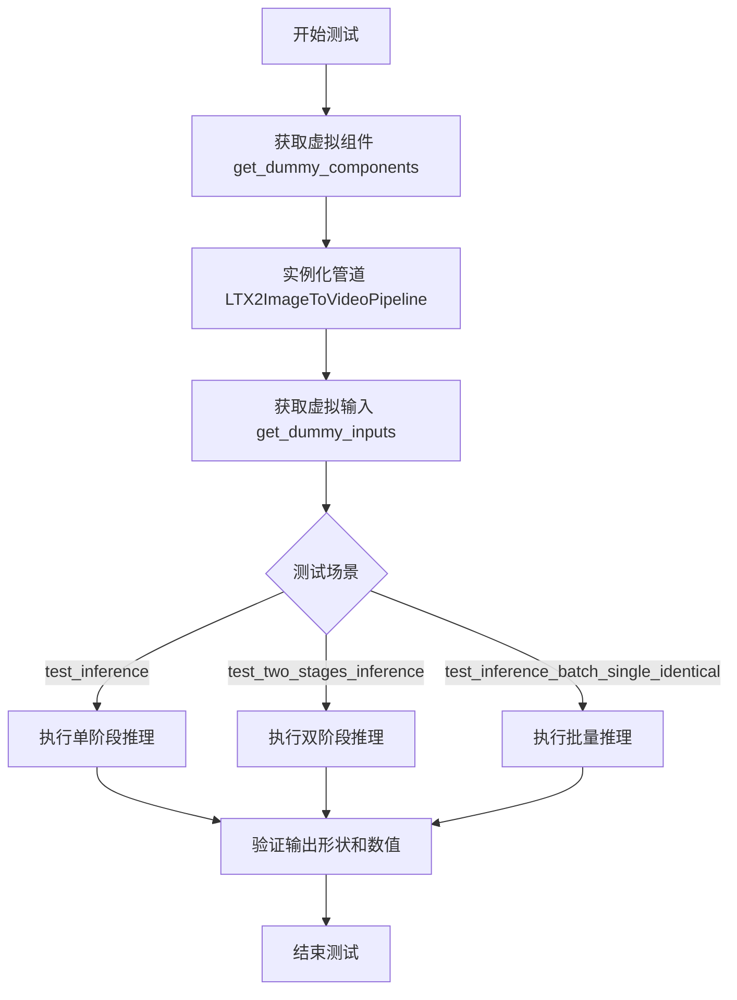
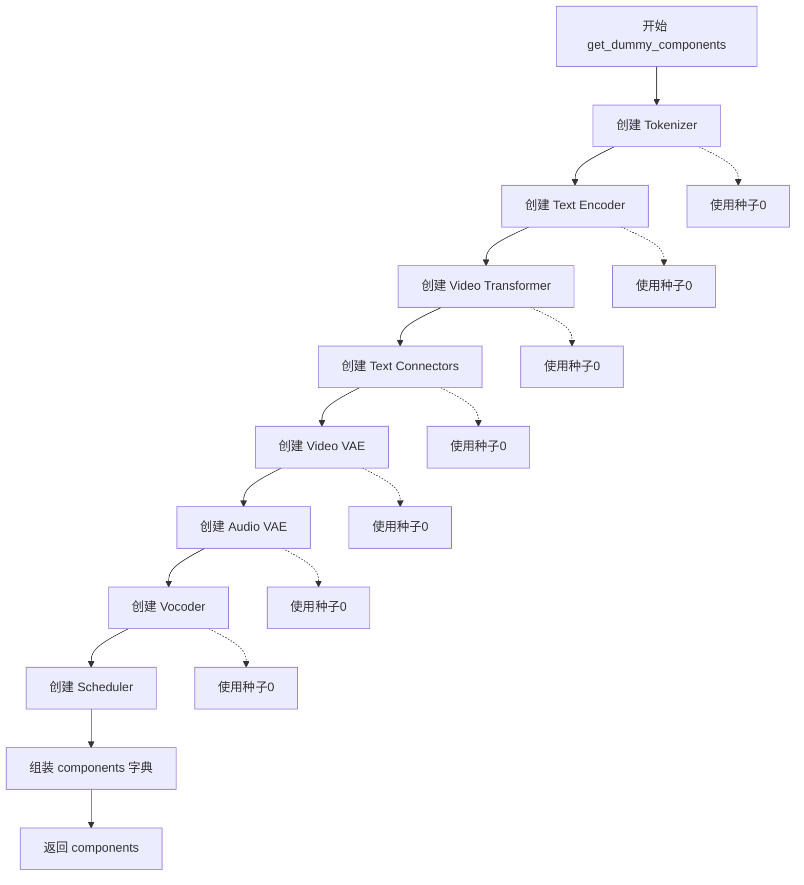
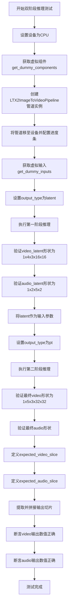
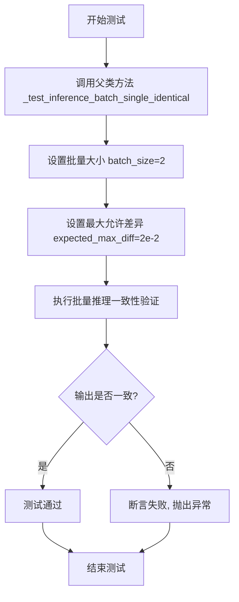
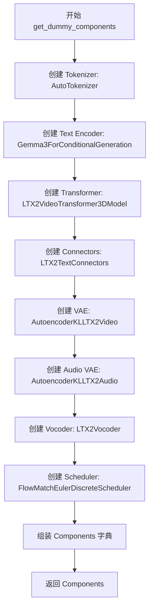
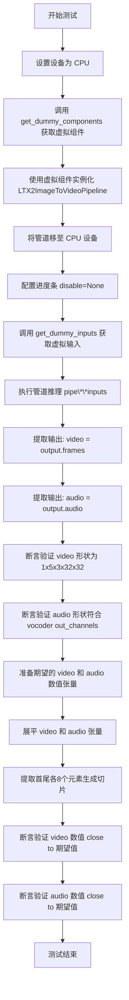
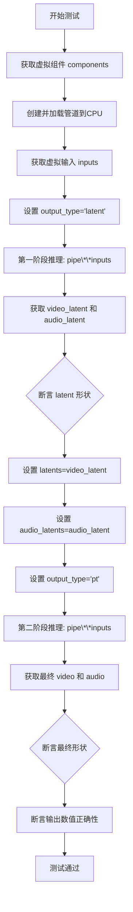
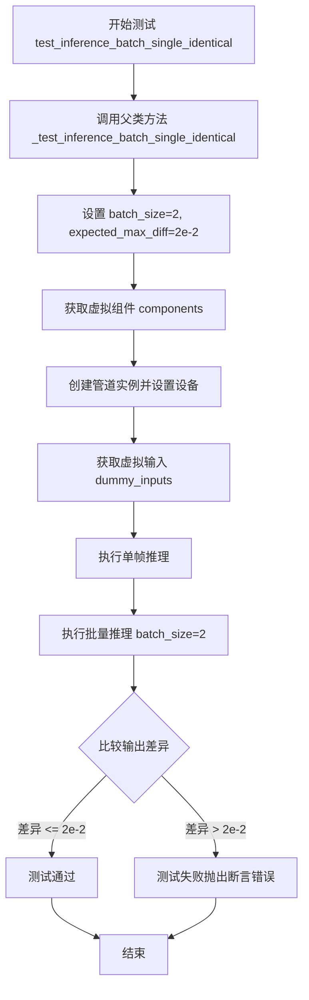

# `diffusers\tests\pipelines\ltx2\test_ltx2_image2video.py` 详细设计文档

这是一个用于测试LTX2ImageToVideoPipeline的单元测试文件，验证图像到视频生成管道的功能正确性，包括单阶段推理、双阶段推理和批量推理等场景。

## 整体流程



## 类结构

```
PipelineTesterMixin (测试混入类)
└── LTX2ImageToVideoPipelineFastTests (单元测试类)
```

## 全局变量及字段


### `unittest`
    
Python标准库单元测试框架

类型：`module`
    


### `torch`
    
PyTorch深度学习框架

类型：`module`
    


### `transformers`
    
HuggingFace Transformers库，用于预训练模型和tokenizer

类型：`module`
    


### `diffusers`
    
HuggingFace Diffusers库，用于扩散模型和管道

类型：`module`
    


### `enable_full_determinism`
    
启用完全确定性的测试工具函数，确保测试结果可复现

类型：`function`
    


### `LTX2ImageToVideoPipelineFastTests.pipeline_class`
    
要测试的管道类

类型：`type`
    


### `LTX2ImageToVideoPipelineFastTests.params`
    
管道参数集合

类型：`set`
    


### `LTX2ImageToVideoPipelineFastTests.batch_params`
    
批量参数集合

类型：`set`
    


### `LTX2ImageToVideoPipelineFastTests.image_params`
    
图像参数集合

类型：`set`
    


### `LTX2ImageToVideoPipelineFastTests.image_latents_params`
    
图像潜在变量参数集合

类型：`set`
    


### `LTX2ImageToVideoPipelineFastTests.required_optional_params`
    
必需的可选参数集合

类型：`frozenset`
    


### `LTX2ImageToVideoPipelineFastTests.test_attention_slicing`
    
是否测试注意力切片

类型：`bool`
    


### `LTX2ImageToVideoPipelineFastTests.test_xformers_attention`
    
是否测试xformers注意力

类型：`bool`
    


### `LTX2ImageToVideoPipelineFastTests.supports_dduf`
    
是否支持DDUF

类型：`bool`
    


### `LTX2ImageToVideoPipelineFastTests.base_text_encoder_ckpt_id`
    
基础文本编码器检查点ID

类型：`str`
    
    

## 全局函数及方法


### `LTX2ImageToVideoPipelineFastTests.get_dummy_components`

该函数创建并返回一个包含所有虚拟组件的字典，用于LTX2图像到视频管道的单元测试。这些组件包括分词器、文本编码器、视频Transformer、文本连接器、视频VAE、音频VAE、 vocoder（声码器）和调度器，所有组件均使用固定随机种子初始化以确保测试的可重复性。

参数： 无

返回值：`Dict`，返回一个包含以下键的字典：
- `"transformer"`：`LTX2VideoTransformer3DModel`，视频处理Transformer模型
- `"vae"`：`AutoencoderKLLTX2Video`，视频 variational autoencoder
- `"audio_vae"`：`AutoencoderKLLTX2Audio`，音频 variational autoencoder
- `"scheduler"`：`FlowMatchEulerDiscreteScheduler`，用于推理的调度器
- `"text_encoder"`：`Gemma3ForConditionalGeneration`，文本编码器模型
- `"tokenizer"`：`AutoTokenizer`，文本分词器
- `"connectors"`：`LTX2TextConnectors`，文本-视频连接器
- `"vocoder"`：`LTX2Vocoder`，音频合成声码器

#### 流程图



#### 带注释源码

```python
def get_dummy_components(self):
    # 1. 从预训练模型加载分词器 (tiny-gemma3)
    tokenizer = AutoTokenizer.from_pretrained(self.base_text_encoder_ckpt_id)
    
    # 2. 从预训练模型加载文本编码器 (Gemma3ForConditionalGeneration)
    text_encoder = Gemma3ForConditionalGeneration.from_pretrained(self.base_text_encoder_ckpt_id)

    # 3. 创建视频Transformer模型，使用固定种子确保可重复性
    torch.manual_seed(0)
    transformer = LTX2VideoTransformer3DModel(
        in_channels=4,
        out_channels=4,
        patch_size=1,
        patch_size_t=1,
        num_attention_heads=2,
        attention_head_dim=8,
        cross_attention_dim=16,
        audio_in_channels=4,
        audio_out_channels=4,
        audio_num_attention_heads=2,
        audio_attention_head_dim=4,
        audio_cross_attention_dim=8,
        num_layers=2,
        qk_norm="rms_norm_across_heads",
        caption_channels=text_encoder.config.text_config.hidden_size,
        rope_double_precision=False,
        rope_type="split",
    )

    # 4. 创建文本-视频连接器
    torch.manual_seed(0)
    connectors = LTX2TextConnectors(
        caption_channels=text_encoder.config.text_config.hidden_size,
        text_proj_in_factor=text_encoder.config.text_config.num_hidden_layers + 1,
        video_connector_num_attention_heads=4,
        video_connector_attention_head_dim=8,
        video_connector_num_layers=1,
        video_connector_num_learnable_registers=None,
        audio_connector_num_attention_heads=4,
        audio_connector_attention_head_dim=8,
        audio_connector_num_layers=1,
        audio_connector_num_learnable_registers=None,
        connector_rope_base_seq_len=32,
        rope_theta=10000.0,
        rope_double_precision=False,
        causal_temporal_positioning=False,
        rope_type="split",
    )

    # 5. 创建视频VAE (AutoencoderKL)
    torch.manual_seed(0)
    vae = AutoencoderKLLTX2Video(
        in_channels=3,
        out_channels=3,
        latent_channels=4,
        block_out_channels=(8,),
        decoder_block_out_channels=(8,),
        layers_per_block=(1,),
        decoder_layers_per_block=(1, 1),
        spatio_temporal_scaling=(True,),
        decoder_spatio_temporal_scaling=(True,),
        decoder_inject_noise=(False, False),
        downsample_type=("spatial",),
        upsample_residual=(False,),
        upsample_factor=(1,),
        timestep_conditioning=False,
        patch_size=1,
        patch_size_t=1,
        encoder_causal=True,
        decoder_causal=False,
    )
    # 配置VAE的帧级编码/解码选项
    vae.use_framewise_encoding = False
    vae.use_framewise_decoding = False

    # 6. 创建音频VAE
    torch.manual_seed(0)
    audio_vae = AutoencoderKLLTX2Audio(
        base_channels=4,
        output_channels=2,
        ch_mult=(1,),
        num_res_blocks=1,
        attn_resolutions=None,
        in_channels=2,
        resolution=32,
        latent_channels=2,
        norm_type="pixel",
        causality_axis="height",
        dropout=0.0,
        mid_block_add_attention=False,
        sample_rate=16000,
        mel_hop_length=160,
        is_causal=True,
        mel_bins=8,
    )

    # 7. 创建Vocoder (声码器)
    torch.manual_seed(0)
    vocoder = LTX2Vocoder(
        in_channels=audio_vae.config.output_channels * audio_vae.config.mel_bins,
        hidden_channels=32,
        out_channels=2,
        upsample_kernel_sizes=[4, 4],
        upsample_factors=[2, 2],
        resnet_kernel_sizes=[3],
        resnet_dilations=[[1, 3, 5]],
        leaky_relu_negative_slope=0.1,
        output_sampling_rate=16000,
    )

    # 8. 创建调度器 (Flow Match Euler Discrete Scheduler)
    scheduler = FlowMatchEulerDiscreteScheduler()

    # 9. 组装所有组件到字典中并返回
    components = {
        "transformer": transformer,
        "vae": vae,
        "audio_vae": audio_vae,
        "scheduler": scheduler,
        "text_encoder": text_encoder,
        "tokenizer": tokenizer,
        "connectors": connectors,
        "vocoder": vocoder,
    }

    return components
```


### `LTX2ImageToVideoPipelineFastTests.get_dummy_inputs`

该方法是测试辅助函数，用于为 LTX2 图像到视频管道生成虚拟输入数据。根据传入的设备和种子值，生成包含图像、提示词、推理参数等的测试输入字典，支持 CPU、MPS 等不同设备，并确保测试的可重复性。

参数：

- `self`：`LTX2ImageToVideoPipelineFastTests`，测试类实例本身
- `device`：`str`，目标设备字符串（如 "cpu"、"mps"、"cuda" 等），用于创建生成器和指定张量设备
- `seed`：`int`，随机种子，默认为 0，用于控制生成器的随机性，确保测试可重复

返回值：`dict`，包含以下键值对：

- `image`：`torch.Tensor`，形状为 (1, 3, 32, 32) 的随机图像张量
- `prompt`：`str`，正向提示词，值为 "a robot dancing"
- `negative_prompt`：`str`，负向提示词，值为空字符串
- `generator`：`torch.Generator`，随机数生成器，用于控制推理过程的随机性
- `num_inference_steps`：`int`，推理步数，值为 2
- `guidance_scale`：`float`，引导比例，值为 1.0
- `height`：`int`，输出高度，值为 32
- `width`：`int`，输出宽度，值为 32
- `num_frames`：`int`，视频帧数，值为 5
- `frame_rate`：`float`，帧率，值为 25.0
- `max_sequence_length`：`int`，最大序列长度，值为 16
- `output_type`：`str`，输出类型，值为 "pt"（PyTorch 张量）

#### 流程图

```mermaid
flowchart TD
    A[开始 get_dummy_inputs] --> B{检查设备类型}
    B -->|MPS 设备| C[使用 torch.manual_seed]
    B -->|其他设备| D[使用 torch.Generator(device)]
    C --> E[创建随机数生成器 generator]
    D --> E
    E --> F[生成随机图像张量<br/>shape: (1, 3, 32, 32)]
    F --> G[构建输入字典 inputs]
    G --> H[返回 inputs 字典]
    
    style A fill:#e1f5fe
    style H fill:#e8f5e8
```

#### 带注释源码

```python
def get_dummy_inputs(self, device, seed=0):
    """
    生成用于测试的虚拟输入参数字典。
    
    参数:
        device: 目标设备字符串，用于创建生成器和张量
        seed: 随机种子，确保测试可重复性
    
    返回:
        包含图像、提示词、生成器及推理参数的字典
    """
    
    # 判断是否为 MPS (Apple Silicon) 设备
    # MPS 设备不支持 torch.Generator，需要使用 torch.manual_seed
    if str(device).startswith("mps"):
        # MPS 设备：直接使用 CPU 随机种子
        generator = torch.manual_seed(seed)
    else:
        # 其他设备（CPU/CUDA）：创建设备特定的生成器
        generator = torch.Generator(device=device).manual_seed(seed)

    # 生成随机图像张量
    # 形状: (batch=1, channels=3, height=32, width=32)
    # 使用指定生成器确保可重复性
    image = torch.rand((1, 3, 32, 32), generator=generator, device=device)

    # 构建完整的输入参数字典
    inputs = {
        # 输入图像
        "image": image,
        
        # 文本提示词
        "prompt": "a robot dancing",
        "negative_prompt": "",
        
        # 随机生成器，控制推理随机性
        "generator": generator,
        
        # 推理参数
        "num_inference_steps": 2,    # 扩散模型推理步数
        "guidance_scale": 1.0,        # Classifier-free guidance 强度
        
        # 输出图像/视频参数
        "height": 32,
        "width": 32,
        "num_frames": 5,              # 生成视频的帧数
        "frame_rate": 25.0,           # 视频帧率
        
        # 序列长度限制
        "max_sequence_length": 16,
        
        # 输出格式: "pt" 返回 PyTorch 张量
        "output_type": "pt",
    }

    # 返回完整的输入字典供 pipeline 调用
    return inputs
```


### `LTX2ImageToVideoPipelineFastTests.test_inference`

该函数执行单阶段推理测试，验证图像到视频管道能否正确生成视频帧和音频，并确保输出维度、形状和数值符合预期。

参数：
- `self`：隐式参数，类型为 `LTX2ImageToVideoPipelineFastTests` 实例，表示测试类本身

返回值：无返回值（`None`），该函数为单元测试方法，通过 `self.assertEqual` 和 `torch.allclose` 断言验证输出正确性

#### 流程图

```mermaid
flowchart TD
    A[开始 test_inference] --> B[设置设备为 CPU]
    B --> C[获取虚拟组件 components]
    C --> D[使用虚拟组件初始化管道 pipe]
    D --> E[将管道移至 CPU 设备]
    E --> F[配置进度条]
    F --> G[获取虚拟输入 inputs]
    G --> H[执行管道推理: output = pipe\*\*inputs]
    H --> I[提取视频 output.frames 和音频 output.audio]
    I --> J[断言验证视频形状 (1, 5, 3, 32, 32)]
    J --> K[断言验证音频批次维度为 1]
    K --> L[断言验证音频通道数与 vocoder 输出通道一致]
    L --> M[定义预期视频切片 expected_video_slice]
    M --> N[定义预期音频切片 expected_audio_slice]
    N --> O[展平视频和音频张量]
    O --> P[提取视频首尾各8个元素生成 generated_video_slice]
    P --> Q[提取音频首尾各8个元素生成 generated_audio_slice]
    Q --> R[断言视频切片数值接近]
    R --> S[断言音频切片数值接近]
    S --> T[测试结束]
```

#### 带注释源码

```python
def test_inference(self):
    # 设置测试设备为 CPU
    device = "cpu"

    # 获取虚拟组件（transformer, vae, audio_vae, scheduler, text_encoder, tokenizer, connectors, vocoder）
    components = self.get_dummy_components()
    # 使用虚拟组件实例化 LTX2ImageToVideoPipeline 管道
    pipe = self.pipeline_class(**components)
    # 将管道移至指定设备（CPU）
    pipe.to(device)
    # 配置进度条（disable=None 表示不禁用进度条）
    pipe.set_progress_bar_config(disable=None)

    # 获取虚拟输入（包含图像、提示词、生成器、推理步数等参数）
    inputs = self.get_dummy_inputs(device)
    # 执行管道推理，获取输出对象（包含 frames 和 audio 属性）
    output = pipe(**inputs)
    # 从输出中提取生成的视频帧（frames）和音频（audio）
    video = output.frames
    audio = output.audio

    # 断言验证生成的视频形状：1个批次，5帧，3通道，32x32分辨率
    self.assertEqual(video.shape, (1, 5, 3, 32, 32))
    # 断言验证音频批次维度为 1
    self.assertEqual(audio.shape[0], 1)
    # 断言验证音频通道数与 vocoder 配置的输出通道数一致
    self.assertEqual(audio.shape[1], components["vocoder"].config.out_channels)

    # 格式：关闭自动格式化
    # fmt: off
    # 定义预期视频张量切片（用于数值验证）
    expected_video_slice = torch.tensor(
        [
            0.3573, 0.8382, 0.3581, 0.6114, 0.3682, 0.7969, 0.2552, 0.6399, 0.3113, 0.1497, 0.3249, 0.5395, 0.3498, 0.4526, 0.4536, 0.4555
        ]
    )
    # 定义预期音频张量切片（用于数值验证）
    expected_audio_slice = torch.tensor(
        [
            0.0294, 0.0498, 0.1269, 0.1135, 0.1639, 0.1116, 0.1730, 0.0931, 0.0672, -0.0069, 0.0688, 0.0097, 0.0808, 0.1231, 0.0986, 0.0739
        ]
    )
    # fmt: on

    # 将视频和音频张量展平为一维，便于提取首尾元素进行比对
    video = video.flatten()
    audio = audio.flatten()
    # 提取视频张量的前8个和后8个元素，拼接成16元素切片
    generated_video_slice = torch.cat([video[:8], video[-8:]])
    # 提取音频张量的前8个和后8个元素，拼接成16元素切片
    generated_audio_slice = torch.cat([audio[:8], audio[-8:]])

    # 断言验证生成的视频切片与预期值在容差范围内接近（绝对误差1e-4，相对误差1e-4）
    assert torch.allclose(expected_video_slice, generated_video_slice, atol=1e-4, rtol=1e-4)
    # 断言验证生成的音频切片与预期值在容差范围内接近（绝对误差1e-4，相对误差1e-4）
    assert torch.allclose(expected_audio_slice, generated_audio_slice, atol=1e-4, rtol=1e-4)
```


### `LTX2ImageToVideoPipelineFastTests.test_two_stages_inference`

该方法执行双阶段推理测试，首先以"latent"模式运行管道获取视频和音频的潜在表示，然后将这些潜在表示作为输入再次运行管道以生成最终的视频和音频输出，验证两阶段推理的正确性和数值一致性。

参数：

- `self`：隐式参数，`LTX2ImageToVideoPipelineFastTests`类的实例，测试用例本身

返回值：`None`，无返回值，该方法为`unittest.TestCase`测试方法，通过断言验证推理结果

#### 流程图



#### 带注释源码

```python
def test_two_stages_inference(self):
    """执行双阶段推理测试，验证先输出latent再输出最终视频的pipeline流程"""
    
    # 步骤1: 设置计算设备为CPU
    device = "cpu"

    # 步骤2: 获取虚拟组件（transformer, vae, audio_vae, scheduler, text_encoder, tokenizer, connectors, vocoder）
    components = self.get_dummy_components()
    
    # 步骤3: 使用虚拟组件实例化LTX2ImageToVideoPipeline管道
    pipe = self.pipeline_class(**components)
    
    # 步骤4: 将管道移至指定设备并配置进度条
    pipe.to(device)
    pipe.set_progress_bar_config(disable=None)

    # 步骤5: 获取测试用虚拟输入
    inputs = self.get_dummy_inputs(device)
    
    # 步骤6: 设置第一阶段输出类型为latent（潜在表示）
    inputs["output_type"] = "latent"
    
    # 步骤7: 执行第一阶段推理，获取潜在表示
    first_stage_output = pipe(**inputs)
    video_latent = first_stage_output.frames  # 视频潜在表示
    audio_latent = first_stage_output.audio    # 音频潜在表示

    # 步骤8: 断言验证第一阶段输出的形状
    # video_latent形状: (batch=1, channels=4, frames=3, height=16, width=16)
    self.assertEqual(video_latent.shape, (1, 4, 3, 16, 16))
    # audio_latent形状: (batch=1, channels=2, frames=5, samples=2)
    self.assertEqual(audio_latent.shape, (1, 2, 5, 2))
    # 验证音频通道数与vocoder输出通道数一致
    self.assertEqual(audio_latent.shape[1], components["vocoder"].config.out_channels)

    # 步骤9: 配置第二阶段推理参数
    inputs["latents"] = video_latent      # 使用第一阶段的video latent
    inputs["audio_latents"] = audio_latent # 使用第一阶段的audio latent
    inputs["output_type"] = "pt"          # 设置输出类型为PyTorch张量

    # 步骤10: 执行第二阶段推理，从latent重建最终输出
    second_stage_output = pipe(**inputs)
    video = second_stage_output.frames     # 最终视频输出
    audio = second_stage_output.audio      # 最终音频输出

    # 步骤11: 断言验证第二阶段输出的形状
    # 最终video形状: (batch=1, frames=5, channels=3, height=32, width=32)
    self.assertEqual(video.shape, (1, 5, 3, 32, 32))
    self.assertEqual(audio.shape[0], 1)    # 批次大小为1
    # 验证音频输出通道数
    self.assertEqual(audio.shape[1], components["vocoder"].config.out_channels)

    # 步骤12: 定义期望的视频输出切片（用于数值验证）
    # fmt: off
    expected_video_slice = torch.tensor(
        [
            0.2665, 0.6915, 0.2939, 0.6767, 0.2552, 0.6215, 0.1765, 0.6248, 
            0.2800, 0.2356, 0.3480, 0.5395, 0.3190, 0.4128, 0.4784, 0.4086
        ]
    )
    # 步骤13: 定义期望的音频输出切片
    expected_audio_slice = torch.tensor(
        [
            0.0273, 0.0490, 0.1253, 0.1129, 0.1655, 0.1057, 0.1707, 0.0943, 
            0.0672, -0.0069, 0.0688, 0.0097, 0.0808, 0.1231, 0.0986, 0.0739
        ]
    )
    # fmt: on

    # 步骤14: 扁平化输出并提取首尾各8个元素用于验证
    video = video.flatten()
    audio = audio.flatten()
    # 拼接前8个和后8个元素，共16个
    generated_video_slice = torch.cat([video[:8], video[-8:]])
    generated_audio_slice = torch.cat([audio[:8], audio[-8:]])

    # 步骤15: 断言验证输出数值与期望值的接近程度
    # 允许的绝对误差和相对误差均为1e-4
    assert torch.allclose(expected_video_slice, generated_video_slice, atol=1e-4, rtol=1e-4)
    assert torch.allclose(expected_audio_slice, generated_audio_slice, atol=1e-4, rtol=1e-4)
```


### `LTX2ImageToVideoPipelineFastTests.test_inference_batch_single_identical`

该测试方法执行批量推理一致性测试，通过比较单样本推理和批量推理的输出结果，验证管道在批量处理时能产生与单独处理每个样本一致的结果。

参数：

- `self`：隐含的 TestCase 实例，表示当前的测试类实例

返回值：无（`None`），该方法为测试方法，通过断言验证结果，不返回具体数值

#### 流程图



#### 带注释源码

```python
def test_inference_batch_single_identical(self):
    """
    测试批量推理的一致性。
    
    该测试方法继承自 PipelineTesterMixin，通过调用父类的
    _test_inference_batch_single_identical 方法来验证：
    1. 批量推理的结果应与多次单独推理的结果一致
    2. 验证管道在批处理模式下能正确处理输入
    
    参数:
        self: 测试类实例,包含管道配置和辅助方法
        
    返回值:
        无返回值,通过 unittest 断言验证推理一致性
        
    异常:
        AssertionError: 当批量推理结果与单样本推理结果的差异超过 expected_max_diff 时抛出
    """
    # 调用父类/混合类的批量一致性测试方法
    # batch_size=2: 测试两个样本的批量处理
    # expected_max_diff=2e-2: 允许的最大差异阈值为 0.02
    self._test_inference_batch_single_identical(batch_size=2, expected_max_diff=2e-2)
```


### `LTX2ImageToVideoPipelineFastTests.get_dummy_components`

该方法用于创建并返回一个包含虚拟（dummy）组件的字典，这些组件用于LTX2图像到视频pipeline的单元测试。方法会依次初始化tokenizer、text_encoder、transformer、connectors、vae、audio_vae、vocoder和scheduler等所有pipeline所需的组件。

参数：
- 无参数

返回值：`Dict[str, Any]`，返回一个包含以下键的字典：`transformer`、`vae`、`audio_vae`、`scheduler`、`text_encoder`、`tokenizer`、`connectors`、`vocoder`，用于构建和测试LTX2ImageToVideoPipeline。

#### 流程图



#### 带注释源码

```python
def get_dummy_components(self):
    """
    创建虚拟组件用于测试LTX2ImageToVideoPipeline
    
    Returns:
        Dict[str, Any]: 包含所有pipeline组件的字典
    """
    # 1. 创建Tokenizer - 使用预训练的小型Gemma3模型
    tokenizer = AutoTokenizer.from_pretrained(self.base_text_encoder_ckpt_id)
    
    # 2. 创建Text Encoder - 用于将文本转换为embedding
    text_encoder = Gemma3ForConditionalGeneration.from_pretrained(self.base_text_encoder_ckpt_id)

    # 3. 创建Transformer - 3D视频变换器模型，用于去噪过程
    torch.manual_seed(0)  # 设置随机种子以确保可复现性
    transformer = LTX2VideoTransformer3DModel(
        in_channels=4,
        out_channels=4,
        patch_size=1,
        patch_size_t=1,
        num_attention_heads=2,
        attention_head_dim=8,
        cross_attention_dim=16,
        audio_in_channels=4,
        audio_out_channels=4,
        audio_num_attention_heads=2,
        audio_attention_head_dim=4,
        audio_cross_attention_dim=8,
        num_layers=2,
        qk_norm="rms_norm_across_heads",
        caption_channels=text_encoder.config.text_config.hidden_size,
        rope_double_precision=False,
        rope_type="split",
    )

    # 4. 创建Text Connectors - 连接文本和视频的桥梁
    torch.manual_seed(0)
    connectors = LTX2TextConnectors(
        caption_channels=text_encoder.config.text_config.hidden_size,
        text_proj_in_factor=text_encoder.config.text_config.num_hidden_layers + 1,
        video_connector_num_attention_heads=4,
        video_connector_attention_head_dim=8,
        video_connector_num_layers=1,
        video_connector_num_learnable_registers=None,
        audio_connector_num_attention_heads=4,
        audio_connector_attention_head_dim=8,
        audio_connector_num_layers=1,
        audio_connector_num_learnable_registers=None,
        connector_rope_base_seq_len=32,
        rope_theta=10000.0,
        rope_double_precision=False,
        causal_temporal_positioning=False,
        rope_type="split",
    )

    # 5. 创建Video VAE - 变分自编码器，用于视频的编码和解码
    torch.manual_seed(0)
    vae = AutoencoderKLLTX2Video(
        in_channels=3,
        out_channels=3,
        latent_channels=4,
        block_out_channels=(8,),
        decoder_block_out_channels=(8,),
        layers_per_block=(1,),
        decoder_layers_per_block=(1, 1),
        spatio_temporal_scaling=(True,),
        decoder_spatio_temporal_scaling=(True,),
        decoder_inject_noise=(False, False),
        downsample_type=("spatial",),
        upsample_residual=(False,),
        upsample_factor=(1,),
        timestep_conditioning=False,
        patch_size=1,
        patch_size_t=1,
        encoder_causal=True,
        decoder_causal=False,
    )
    # 配置VAE的帧级编码/解码选项
    vae.use_framewise_encoding = False
    vae.use_framewise_decoding = False

    # 6. 创建Audio VAE - 用于音频的变分编码器
    torch.manual_seed(0)
    audio_vae = AutoencoderKLLTX2Audio(
        base_channels=4,
        output_channels=2,
        ch_mult=(1,),
        num_res_blocks=1,
        attn_resolutions=None,
        in_channels=2,
        resolution=32,
        latent_channels=2,
        norm_type="pixel",
        causality_axis="height",
        dropout=0.0,
        mid_block_add_attention=False,
        sample_rate=16000,
        mel_hop_length=160,
        is_causal=True,
        mel_bins=8,
    )

    # 7. 创建Vocoder - 将mel频谱转换为音频波形
    torch.manual_seed(0)
    vocoder = LTX2Vocoder(
        in_channels=audio_vae.config.output_channels * audio_vae.config.mel_bins,
        hidden_channels=32,
        out_channels=2,
        upsample_kernel_sizes=[4, 4],
        upsample_factors=[2, 2],
        resnet_kernel_sizes=[3],
        resnet_dilations=[[1, 3, 5]],
        leaky_relu_negative_slope=0.1,
        output_sampling_rate=16000,
    )

    # 8. 创建Scheduler - 调度器，用于扩散模型的采样步骤
    scheduler = FlowMatchEulerDiscreteScheduler()

    # 9. 组装所有组件到字典中
    components = {
        "transformer": transformer,
        "vae": vae,
        "audio_vae": audio_vae,
        "scheduler": scheduler,
        "text_encoder": text_encoder,
        "tokenizer": tokenizer,
        "connectors": connectors,
        "vocoder": vocoder,
    }

    return components
```


### `LTX2ImageToVideoPipelineFastTests.get_dummy_inputs`

该方法用于生成虚拟（dummy）输入数据，以便对 LTX2 图像到视频转换管道进行单元测试。它根据传入的设备类型（MPS 或其他）创建随机数生成器，生成随机图像张量，并返回一个包含图像、提示词、负提示词、生成器、推理步数、引导比例、输出尺寸、帧数、帧率、最大序列长度和输出类型等完整测试参数的字典。

参数：

- `self`：隐式参数，测试类实例本身
- `device`：`str`，目标设备标识符（如 "cpu"、"cuda"、"mps"），用于确定生成器的设备和图像张量的存放位置
- `seed`：`int`，随机数种子（默认值为 0），用于确保测试结果的可复现性

返回值：`Dict[str, Any]`，包含以下键值的字典：
- `image`：torch.Tensor，形状为 (1, 3, 32, 32) 的随机图像张量
- `prompt`：`str`，正向提示词 "a robot dancing"
- `negative_prompt`：`str`，负向提示词（空字符串）
- `generator`：torch.Generator，随机数生成器对象
- `num_inference_steps`：`int`，推理步数（2 步）
- `guidance_scale`：`float`，引导比例（1.0）
- `height`：`int`，输出高度（32 像素）
- `width`：`int`，输出宽度（32 像素）
- `num_frames`：`int`，生成帧数（5 帧）
- `frame_rate`：`float`，帧率（25.0 fps）
- `max_sequence_length`：`int`，最大序列长度（16）
- `output_type`：`str`，输出类型（"pt" 表示 PyTorch 张量）

#### 流程图

```mermaid
flowchart TD
    A[开始 get_dummy_inputs] --> B{device 以 'mps' 开头?}
    B -->|是| C[使用 torch.manual_seed 创建生成器]
    B -->|否| D[使用 torch.Generator 创建生成器]
    C --> E[设置随机种子为 seed]
    D --> E
    E --> F[使用生成器创建随机图像张量<br/>形状: (1, 3, 32, 32)]
    F --> G[构建 inputs 字典<br/>包含 image, prompt, negative_prompt<br/>generator, num_inference_steps<br/>guidance_scale, height, width<br/>num_frames, frame_rate<br/>max_sequence_length, output_type]
    G --> H[返回 inputs 字典]
```

#### 带注释源码

```python
def get_dummy_inputs(self, device, seed=0):
    """
    生成用于测试 LTX2ImageToVideoPipeline 的虚拟输入数据。
    
    参数:
        device: 目标设备字符串标识符
        seed: 随机种子，用于确保测试可复现
    
    返回:
        包含所有管道调用参数的字典
    """
    
    # 根据设备类型选择不同的随机数生成器创建方式
    # MPS (Metal Performance Shaders) 设备需要特殊处理
    if str(device).startswith("mps"):
        # MPS 设备使用 torch.manual_seed 直接设置 CPU 随机种子
        generator = torch.manual_seed(seed)
    else:
        # 其他设备（CPU/CUDA）使用 torch.Generator 创建设备特定的生成器
        generator = torch.Generator(device=device).manual_seed(seed)

    # 生成随机图像张量作为管道输入
    # 形状: (batch=1, channels=3, height=32, width=32)
    # 使用传入的生成器确保随机性可复现
    image = torch.rand((1, 3, 32, 32), generator=generator, device=device)

    # 构建完整的测试输入参数字典
    # 这些参数模拟了实际调用管道时的输入
    inputs = {
        "image": image,                          # 输入图像张量
        "prompt": "a robot dancing",             # 正向文本提示
        "negative_prompt": "",                   # 负向文本提示（无）
        "generator": generator,                  # 随机生成器确保可复现性
        "num_inference_steps": 2,                 # 扩散模型推理步数
        "guidance_scale": 1.0,                   # classifier-free guidance 强度
        "height": 32,                            # 输出视频高度
        "width": 32,                             # 输出视频宽度
        "num_frames": 5,                         # 生成视频的帧数
        "frame_rate": 25.0,                      # 视频帧率
        "max_sequence_length": 16,               # 变压器模型最大序列长度
        "output_type": "pt",                     # 输出格式：PyTorch 张量
    }

    # 返回包含所有测试参数的字典
    return inputs
```


### `LTX2ImageToVideoPipelineFastTests.test_inference`

该测试方法验证 LTX2ImageToVideoPipeline 的单阶段推理功能，通过创建虚拟组件和输入，执行管道推理，并验证输出的视频和音频张量形状及数值是否符合预期。

参数：

- `self`：隐式参数，测试类实例本身

返回值：无（`None`），该方法为测试方法，通过断言验证输出，不返回实际数据

#### 流程图



#### 带注释源码

```python
def test_inference(self):
    """
    测试单阶段推理功能，验证 LTX2ImageToVideoPipeline 能正确处理图像到视频的生成。
    """
    # 1. 设置测试设备为 CPU
    device = "cpu"

    # 2. 获取虚拟组件（用于测试的模拟模型组件）
    components = self.get_dummy_components()
    
    # 3. 使用虚拟组件实例化管道
    pipe = self.pipeline_class(**components)
    
    # 4. 将管道移至指定设备
    pipe.to(device)
    
    # 5. 配置进度条（disable=None 表示不禁用进度条）
    pipe.set_progress_bar_config(disable=None)

    # 6. 获取虚拟输入参数
    inputs = self.get_dummy_inputs(device)
    
    # 7. 执行管道推理，**inputs 将字典展开为关键字参数
    output = pipe(**inputs)
    
    # 8. 从输出中提取视频帧
    video = output.frames
    
    # 9. 从输出中提取音频
    audio = output.audio

    # 10. 断言验证视频形状: (batch=1, frames=5, channels=3, height=32, width=32)
    self.assertEqual(video.shape, (1, 5, 3, 32, 32))
    
    # 11. 断言验证音频批次维度
    self.assertEqual(audio.shape[0], 1)
    
    # 12. 断言验证音频通道数与 vocoder 配置一致
    self.assertEqual(audio.shape[1], components["vocoder"].config.out_channels)

    # 13. 定义期望的视频张量切片（用于数值验证）
    # fmt: off
    expected_video_slice = torch.tensor(
        [
            0.3573, 0.8382, 0.3581, 0.6114, 0.3682, 0.7969, 0.2552, 0.6399,
            0.3113, 0.1497, 0.3249, 0.5395, 0.3498, 0.4526, 0.4536, 0.4555
        ]
    )
    
    # 14. 定义期望的音频张量切片（用于数值验证）
    expected_audio_slice = torch.tensor(
        [
            0.0294, 0.0498, 0.1269, 0.1135, 0.1639, 0.1116, 0.1730, 0.0931,
            0.0672, -0.0069, 0.0688, 0.0097, 0.0808, 0.1231, 0.0986, 0.0739
        ]
    )
    # fmt: on

    # 15. 展平视频和音频张量以便比较
    video = video.flatten()
    audio = audio.flatten()
    
    # 16. 连接首尾各8个元素生成切片（用于快速验证）
    generated_video_slice = torch.cat([video[:8], video[-8:]])
    generated_audio_slice = torch.cat([audio[:8], audio[-8:]])

    # 17. 断言验证视频数值在容差范围内匹配
    assert torch.allclose(expected_video_slice, generated_video_slice, atol=1e-4, rtol=1e-4)
    
    # 18. 断言验证音频数值在容差范围内匹配
    assert torch.allclose(expected_audio_slice, generated_audio_slice, atol=1e-4, rtol=1e-4)
```


### `LTX2ImageToVideoPipelineFastTests.test_two_stages_inference`

测试双阶段推理功能，验证管道能够先输出潜在表示（latent），然后再将该潜在表示作为输入继续推理最终的视频和音频帧。

参数：

- `self`：隐式参数，测试类实例本身

返回值：`None`，该方法为单元测试方法，通过断言验证输出结果的正确性

#### 流程图



#### 带注释源码

```python
def test_two_stages_inference(self):
    """
    测试双阶段推理功能：验证管道支持先输出潜在表示，
    再将潜在表示作为输入继续推理最终视频/音频的完整流程
    """
    device = "cpu"  # 指定测试设备为CPU

    # 第一步：获取虚拟组件（transformer, vae, audio_vae, scheduler, text_encoder, tokenizer, connectors, vocoder）
    components = self.get_dummy_components()
    
    # 第二步：使用虚拟组件实例化LTX2ImageToVideoPipeline管道
    pipe = self.pipeline_class(**components)
    pipe.to(device)  # 将管道移至CPU设备
    pipe.set_progress_bar_config(disable=None)  # 配置进度条

    # 第三步：获取虚拟输入参数（包含图像、提示词、推理步数等）
    inputs = self.get_dummy_inputs(device)
    
    # ==================== 第一阶段推理：输出潜在表示 ====================
    inputs["output_type"] = "latent"  # 设置输出为潜在表示而非完整视频
    
    # 执行第一阶段推理，管道返回latent形式的输出
    first_stage_output = pipe(**inputs)
    
    # 从输出中提取视频和音频的潜在表示
    video_latent = first_stage_output.frames    # 视频潜在表示
    audio_latent = first_stage_output.audio     # 音频潜在表示

    # 断言：验证第一阶段输出的形状符合预期
    # video_latent形状应为(1, 4, 3, 16, 16) - 批次数=1, 通道=4, 时间=3, 空间=16x16
    self.assertEqual(video_latent.shape, (1, 4, 3, 16, 16))
    # audio_latent形状应为(1, 2, 5, 2) - 批次数=1, 通道=2, 时间=5, 空间=2
    self.assertEqual(audio_latent.shape, (1, 2, 5, 2))
    # 验证音频通道数与vocoder配置一致
    self.assertEqual(audio_latent.shape[1], components["vocoder"].config.out_channels)

    # ==================== 第二阶段推理：使用潜在表示继续生成 ====================
    # 将第一阶段的latent输出设置为下一阶段的输入
    inputs["latents"] = video_latent      # 设置视频潜在输入
    inputs["audio_latents"] = audio_latent # 设置音频潜在输入
    inputs["output_type"] = "pt"          # 设置输出为PyTorch张量

    # 执行第二阶段推理，从潜在表示重建最终视频和音频
    second_stage_output = pipe(**inputs)
    
    # 提取最终生成的视频和音频
    video = second_stage_output.frames    # 最终视频帧
    audio = second_stage_output.audio     # 最终音频

    # 断言：验证最终输出形状正确
    # video形状应为(1, 5, 3, 32, 32) - 批次数=1, 帧数=5, 通道=3, 空间=32x32
    self.assertEqual(video.shape, (1, 5, 3, 32, 32))
    # audio形状验证
    self.assertEqual(audio.shape[0], 1)
    self.assertEqual(audio.shape[1], components["vocoder"].config.out_channels)

    # ==================== 数值验证：确保输出与预期值接近 ====================
    # 定义预期的视频切片数值（用于回归测试）
    expected_video_slice = torch.tensor([
        0.2665, 0.6915, 0.2939, 0.6767, 0.2552, 0.6215, 0.1765, 0.6248,
        0.2800, 0.2356, 0.3480, 0.5395, 0.3190, 0.4128, 0.4784, 0.4086
    ])
    
    # 定义预期的音频切片数值
    expected_audio_slice = torch.tensor([
        0.0273, 0.0490, 0.1253, 0.1129, 0.1655, 0.1057, 0.1707, 0.0943,
        0.0672, -0.0069, 0.0688, 0.0097, 0.0808, 0.1231, 0.0986, 0.0739
    ])

    # 展平输出并提取首尾各8个元素
    video = video.flatten()
    audio = audio.flatten()
    generated_video_slice = torch.cat([video[:8], video[-8:]])
    generated_audio_slice = torch.cat([audio[:8], audio[-8:]])

    # 使用torch.allclose验证数值在允许误差范围内匹配
    assert torch.allclose(expected_video_slice, generated_video_slice, atol=1e-4, rtol=1e-4)
    assert torch.allclose(expected_audio_slice, generated_audio_slice, atol=1e-4, rtol=1e-4)
```


### `LTX2ImageToVideoPipelineFastTests.test_inference_batch_single_identical`

该测试方法用于验证批量推理功能，检查在使用批量大小为2进行推理时，结果与单帧推理结果的一致性，确保模型在批量处理模式下能产生相同的输出。

参数：

- 继承自 `PipelineTesterMixin` 的 `_test_inference_batch_single_identical` 方法，无显式参数
- 内部调用参数：`batch_size=2`（批量大小），`expected_max_diff=2e-2`（预期最大差异阈值）

返回值：`None`（无返回值），该方法为测试用例，通过断言验证结果一致性

#### 流程图



#### 带注释源码

```python
def test_inference_batch_single_identical(self):
    """
    测试批量推理功能，验证批量推理结果与单帧推理结果的一致性。
    
    该测试方法继承自 PipelineTesterMixin，调用父类的 _test_inference_batch_single_identical 方法。
    批量大小设置为2，预期最大差异阈值为 2e-2，用于确保模型在批量处理模式下
    能够产生与单帧处理一致的输出结果。
    
    参数:
        batch_size: int - 批量大小，设置为2
        expected_max_diff: float - 预期最大差异阈值，设置为 2e-2
    
    返回:
        None - 测试方法无返回值，通过断言验证结果
    
    异常:
        AssertionError - 当批量推理结果与单帧推理结果差异超过阈值时抛出
    """
    # 调用父类的批量一致性测试方法
    # batch_size=2: 使用2个样本进行批量推理
    # expected_max_diff=2e-2: 允许的最大差异为0.02
    self._test_inference_batch_single_identical(batch_size=2, expected_max_diff=2e-2)
```

## 关键组件


### LTX2ImageToVideoPipeline

核心的视频生成管道，负责协调文本到视频的完整生成流程，支持图像到视频的转换，以及多阶段推理（latent和pixel级别）。

### LTX2VideoTransformer3DModel

3D视频Transformer模型，处理视频latent的时空建模，支持文本和音频条件的交叉注意力机制。

### LTX2TextConnectors

文本连接器模块，连接文本编码器输出与视频生成模型，包含视频连接器和音频连接器，支持位置编码（RoPE）和可学习寄存器。

### AutoencoderKLLTX2Video

视频变分自编码器（VAE），负责视频帧与latent之间的相互转换，支持Kullback-Leibler散度编码。

### AutoencoderKLLTX2Audio

音频变分自编码器（VAE），处理音频信号的编码和解码，将音频转换为mel频谱表示。

### LTX2Vocoder

声码器模块，将mel频谱转换为实际的音频波形，输出采样率为16000Hz。

### FlowMatchEulerDiscreteScheduler

基于Flow Matching的欧拉离散调度器，控制去噪推理步骤中的噪声调度。

### Gemma3ForConditionalGeneration

文本编码器模型，将文本提示编码为条件向量，供生成管道使用。

### PipelineTesterMixin

测试混合基类，提供pipeline一致性验证的通用测试方法。

### 双阶段推理支持

支持先输出latent再解码的两阶段生成模式，实现latent级别的自回归或迭代 refinement。

### 张量索引与形状验证

测试中验证输出视频形状(1, 5, 3, 32, 32)和音频形状，确保时空维度一致性。


## 问题及建议


### 已知问题

- **硬编码的配置参数**：在 `get_dummy_components` 方法中，大量模型配置参数（如 `patch_size=1`、`num_layers=2`、`attention_head_dim=8` 等）被硬编码，缺乏配置常量或参数化设计，导致修改配置时需要改动多处代码。
- **测试逻辑重复**：在 `test_inference` 和 `test_two_stages_inference` 方法中，视频和音频切片的提取逻辑（`video.flatten()`、`audio.flatten()`、`torch.cat`）完全重复，未抽取为独立辅助方法。
- **缺少测试用例文档**：所有测试方法均无文档字符串（docstring），难以快速理解各测试用例的验证目标和预期行为。
- **设备兼容性处理不规范**：通过 `str(device).startswith("mps")` 判断 MPS 设备的方式不够健壮，应使用 `torch.backends.mps.is_available()` 或统一的设备抽象层。
- **断言缺乏上下文信息**：使用 `assert torch.allclose(...)` 时未提供自定义错误消息，测试失败时难以快速定位具体差异。
- **未覆盖错误场景**：缺少对非法输入（如 `num_inference_steps=0`、不匹配的 `latents` 形状、`output_type` 异常值等）的异常测试。
- **参数配置不透明**：`params = TEXT_TO_IMAGE_PARAMS - {"cross_attention_kwargs"}` 的设计依赖外部定义，且移除 `cross_attention_kwargs` 的原因未注明，外部依赖的隐式变化可能导致测试失效。
- **未验证可选功能标志**：类属性 `test_attention_slicing`、`test_xformers_attention` 和 `supports_dduf` 被设置为 `False`，但测试中未验证这些功能是否真正被禁用或跳过。

### 优化建议

- **抽取配置常量**：将 `get_dummy_components` 中的核心超参数提取为类级别常量或配置文件，提高可维护性。
- **提取公共辅助方法**：将重复的切片提取和对比逻辑封装为 `_extract_slice_and_compare` 等私有方法，减少代码冗余。
- **添加测试文档**：为每个测试方法补充 docstring，说明测试目的、输入约束和预期输出。
- **改进设备检测**：使用 `torch.cuda.is_available()` 和 `torch.backends.mps.is_available()` 进行显式设备检测。
- **增强断言信息**：在断言中加入自定义错误消息，如 `assert torch.allclose(..., atol=1e-4), f"Video mismatch: expected {expected_video_slice}, got {generated_video_slice}"`。
- **补充边界测试**：增加异常输入测试用例，验证 pipeline 的错误处理能力。
- **注释关键设计决策**：对 `params` 配置调整、特征标志设置等关键设计决策添加代码注释，说明业务原因。

## 其它


### 设计目标与约束

本测试文件旨在验证LTX2ImageToVideoPipeline的图像转视频生成功能，测试覆盖单阶段推理、两阶段推理（latent空间）以及批处理一致性。测试环境为CPU设备，使用小型模型配置（tiny-gemma3）进行快速验证，不支持xformers attention和attention slicing，遵循HuggingFace Diffusers测试框架规范。

### 错误处理与异常设计

测试用例使用PyTorch的torch.allclose进行数值精度验证（atol=1e-4, rtol=1e-4），通过assert语句确保输出形状和数值符合预期。对于MPS设备使用torch.manual_seed，其他设备使用torch.Generator进行确定性随机数生成，确保测试可复现性。测试未显式捕获异常，依赖unittest框架的默认异常处理机制。

### 数据流与状态机

单阶段推理流程：get_dummy_inputs → pipeline(**inputs) → output.frames/video + output.audio
两阶段推理流程：第一阶段output_type="latent"生成video_latent和audio_latent，第二阶段将latents作为输入继续推理，最终输出完整视频和音频
状态转换：初始化状态 → 首阶段推理状态 → 潜在空间状态 → 第二阶段推理状态 → 完成状态

### 外部依赖与接口契约

核心依赖包括torch、transformers（AutoTokenizer、Gemma3ForConditionalGeneration）、diffusers（LTX2ImageToVideoPipeline、LTX2VideoTransformer3DModel、LTX2TextConnectors、AutoencoderKLLTX2Video、AutoencoderKLLTX2Audio、LTX2Vocoder、FlowMatchEulerDiscreteScheduler）。管道输入契约：image（图像tensor）、prompt（文本提示）、negative_prompt、generator、num_inference_steps、guidance_scale、height、width、num_frames、frame_rate、max_sequence_length、output_type。输出契约：LTX2VideoPipelineOutput对象包含frames属性（视频tensor）和audio属性（音频tensor）。

### 配置参数详解

test_attention_slicing=False和test_xformers_attention=False表示不支持相关优化方法。supports_dduf=False表示不支持DDUF。required_optional_params定义了推理时可选的关键参数集。params通过TEXT_TO_IMAGE_PARAMS减去cross_attention_kwargs构造，batch_params包含image参数，image_params和image_latents_params使用TEXT_TO_IMAGE_IMAGE_PARAMS。

### 测试覆盖范围

test_inference：验证标准单阶段推理功能，检查输出视频形状(1,5,3,32,32)和音频形状，验证关键帧数值精度
test_two_stages_inference：验证两阶段推理（latent空间），第一阶段输出video_latent形状(1,4,3,16,16)和audio_latent形状(1,2,5,2)，第二阶段还原为完整视频音频
test_inference_batch_single_identical：验证批处理一致性，batch_size=2，expected_max_diff=2e-2

### 性能基准与资源需求

测试使用CPU设备运行，使用torch.manual_seed(0)确保确定性。transformer配置：2层，2个attention heads，head_dim=8。VAE配置：block_out_channels=(8,)，layers_per_block=(1,)。音频VAE配置：base_channels=4，mel_bins=8。Vocoder配置：hidden_channels=32。推理步数设置为2（num_inference_steps=2）以加速测试。

### 关键技术特性

支持视频和音频的联合生成，通过connectors实现文本与视频/音频的连接，使用FlowMatchEulerDiscreteScheduler进行调度，支持rope位置编码（split类型），支持因果时间定位（causal_temporal_positioning=False），VAE支持spatio_temporal_scaling和framewise编码/解码选项。

### 潜在扩展方向

可增加更多推理步骤的测试以验证收敛性，可添加不同guidance_scale值的对比测试，可测试更长的num_frames和不同的frame_rate组合，可验证极端分辨率下的行为，可增加内存使用情况的监控测试。


    