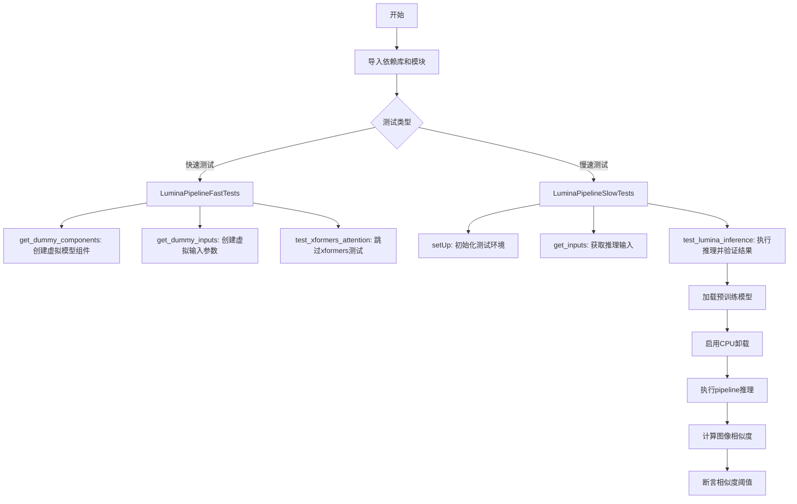
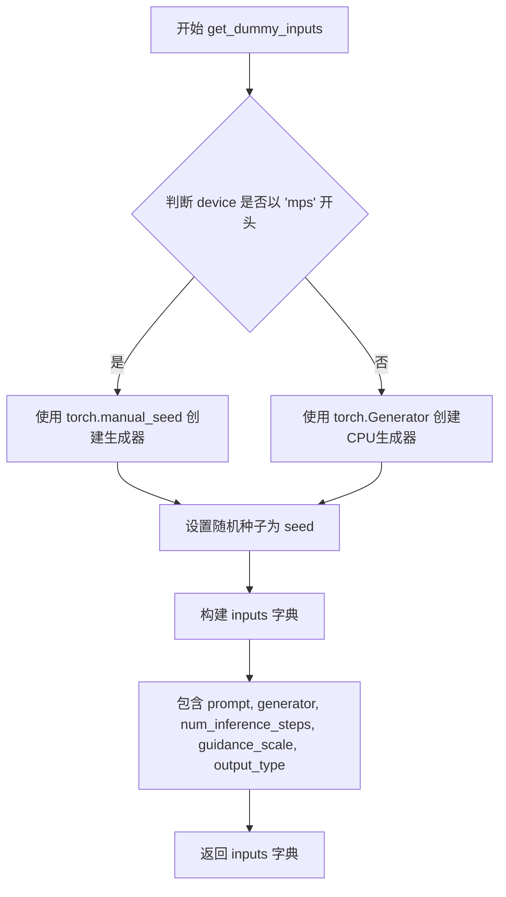
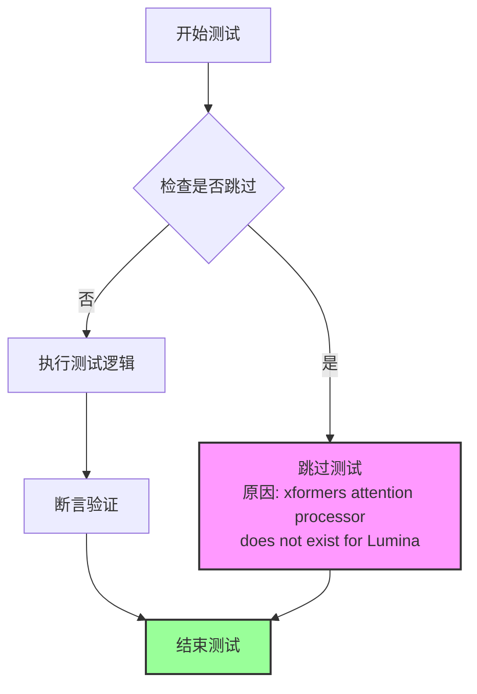
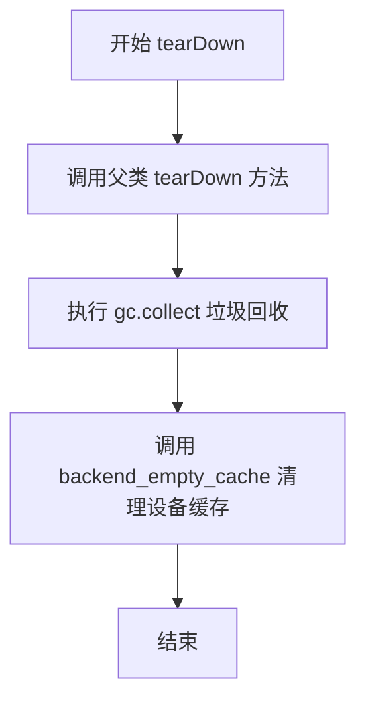
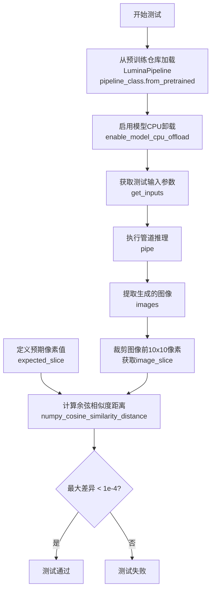

# `diffusers\tests\pipelines\lumina\test_lumina_nextdit.py` 详细设计文档

这是一个Lumina图像生成Pipeline的测试文件，包含快速单元测试和慢速集成测试，用于验证Lumina-Next-Diffusers模型的推理功能、模型组件配置和图像生成质量。

## 整体流程



## 类结构

```
unittest.TestCase
├── LuminaPipelineFastTests
│   └── PipelineTesterMixin
└── LuminaPipelineSlowTests
```

## 全局变量及字段


### `LuminaPipelineFastTests.pipeline_class`
    
The pipeline class being tested, LuminaPipeline

类型：`type`
    


### `LuminaPipelineFastTests.params`
    
Frozen set of pipeline parameters including prompt, height, width, guidance_scale, negative_prompt, prompt_embeds, and negative_prompt_embeds

类型：`frozenset`
    


### `LuminaPipelineFastTests.batch_params`
    
Frozen set of batch parameters for the pipeline, including prompt and negative_prompt

类型：`frozenset`
    


### `LuminaPipelineFastTests.supports_dduf`
    
Boolean flag indicating whether the pipeline supports DDUF (Decoupled Diffuser), set to False

类型：`bool`
    


### `LuminaPipelineFastTests.test_layerwise_casting`
    
Boolean flag indicating whether to test layerwise casting, set to True

类型：`bool`
    


### `LuminaPipelineFastTests.test_group_offloading`
    
Boolean flag indicating whether to test group offloading, set to True

类型：`bool`
    


### `LuminaPipelineSlowTests.pipeline_class`
    
The pipeline class being tested, LuminaPipeline

类型：`type`
    


### `LuminaPipelineSlowTests.repo_id`
    
The Hugging Face repository ID for the Lumina-Next-SFT-diffusers model

类型：`str`
    
    

## 全局函数及方法


### `LuminaPipelineFastTests.get_dummy_components`

该方法用于创建并返回一组虚拟（dummy）组件，模拟 LuminaPipeline 所需的全部子模块（包括 Transformer、VAE、调度器、文本编码器和分词器），以便在单元测试中执行推理而无需加载真实模型权重。

参数：
- （无参数）

返回值：`dict`，返回包含以下键值对的字典：
- `"transformer"`：`LuminaNextDiT2DModel`，图像变换 Transformer 模型
- `"vae"`：`AutoencoderKL`，变分自编码器
- `"scheduler"`：`FlowMatchEulerDiscreteScheduler`，采样调度器
- `"text_encoder"`：`GemmaForCausalLM`，文本编码器模型
- `"tokenizer"`：`AutoTokenizer`，文本分词器

#### 流程图

```mermaid
flowchart TD
    A[开始 get_dummy_components] --> B[设置随机种子 torch.manual_seed(0)]
    B --> C[创建 LuminaNextDiT2DModel transformer]
    C --> D[创建 AutoencoderKL vae]
    D --> E[创建 FlowMatchEulerDiscreteScheduler]
    E --> F[创建 AutoTokenizer from_pretrained]
    F --> G[设置随机种子 torch.manual_seed(0)]
    G --> H[创建 GemmaConfig]
    H --> I[创建 GemmaForCausalLM text_encoder]
    I --> J[构建 components 字典]
    J --> K[返回 components 字典]
```

#### 带注释源码

```python
def get_dummy_components(self):
    """
    创建并返回用于测试的虚拟组件字典。
    
    该方法初始化所有 Pipeline 所需的子模块：
    - Transformer (LuminaNextDiT2DModel)
    - VAE (AutoencoderKL)
    - Scheduler (FlowMatchEulerDiscreteScheduler)
    - Text Encoder (GemmaForCausalLM)
    - Tokenizer (AutoTokenizer)
    
    Returns:
        dict: 包含所有虚拟组件的字典，键为组件名称，值为对应的模型/模块实例。
    """
    # 设置随机种子以确保测试可复现
    torch.manual_seed(0)
    
    # 创建虚拟 Transformer 模型，配置参数用于小规模测试
    transformer = LuminaNextDiT2DModel(
        sample_size=4,           # 输入样本尺寸
        patch_size=2,            # 补丁大小
        in_channels=4,            # 输入通道数
        hidden_size=4,            # 隐藏层维度
        num_layers=2,             # 层数
        num_attention_heads=1,   # 注意力头数
        num_kv_heads=1,           # KV 头数
        multiple_of=16,          # 维度倍数
        ffn_dim_multiplier=None, # FFN 维度乘数
        norm_eps=1e-5,           # 归一化 epsilon
        learn_sigma=True,         # 是否学习 sigma
        qk_norm=True,             # 是否使用 QK 归一化
        cross_attention_dim=8,   # 跨注意力维度
        scaling_factor=1.0,      # 缩放因子
    )
    
    # 重新设置随机种子，确保 VAE 与其他组件的初始化独立
    torch.manual_seed(0)
    # 创建虚拟 VAE 模型
    vae = AutoencoderKL()
    
    # 创建虚拟调度器
    scheduler = FlowMatchEulerDiscreteScheduler()
    
    # 从预训练路径加载虚拟分词器
    tokenizer = AutoTokenizer.from_pretrained("hf-internal-testing/dummy-gemma")
    
    # 再次设置随机种子，确保文本编码器初始化可复现
    torch.manual_seed(0)
    # 创建虚拟文本编码器配置
    config = GemmaConfig(
        head_dim=2,              # 头维度
        hidden_size=8,           # 隐藏层维度
        intermediate_size=37,    # 中间层维度
        num_attention_heads=4,   # 注意力头数
        num_hidden_layers=2,     # 隐藏层数
        num_key_value_heads=4,   # KV 头数
    )
    # 创建虚拟文本编码器模型
    text_encoder = GemmaForCausalLM(config)
    
    # 组装所有虚拟组件为字典
    components = {
        "transformer": transformer.eval(),    # 设置为评估模式
        "vae": vae.eval(),                    # 设置为评估模式
        "scheduler": scheduler,
        "text_encoder": text_encoder.eval(),  # 设置为评估模式
        "tokenizer": tokenizer,
    }
    
    return components
```


### `LuminaPipelineFastTests.get_dummy_inputs`

该方法用于生成虚拟输入参数，为LuminaPipeline的单元测试提供标准的测试数据。它根据设备类型（MPS或其他）创建不同类型的随机数生成器，并返回包含提示词、生成器、推理步数、引导比例和输出类型等参数的字典。

参数：

- `device`：设备对象，用于判断是否为MPS设备
- `seed`：整数，默认值为0，用于设置随机种子

返回值：`dict`，包含测试所需的虚拟输入参数

#### 流程图



#### 带注释源码

```
def get_dummy_inputs(self, device, seed=0):
    # 判断设备是否为MPS (Apple Silicon)
    if str(device).startswith("mps"):
        # MPS设备使用torch.manual_seed创建生成器
        generator = torch.manual_seed(seed)
    else:
        # 其他设备使用CPU上的torch.Generator
        generator = torch.Generator(device="cpu").manual_seed(seed)

    # 构建测试用的虚拟输入参数字典
    inputs = {
        "prompt": "A painting of a squirrel eating a burger",  # 测试用提示词
        "generator": generator,  # 随机数生成器，确保可复现性
        "num_inference_steps": 2,  # 推理步数，减少以加快测试速度
        "guidance_scale": 5.0,  # CFG引导比例
        "output_type": "np",  # 输出类型为numpy数组
    }
    return inputs
```


### `LuminaPipelineFastTests.test_xformers_attention_forwardGenerator_pass`

该测试方法用于验证 Lumina 模型中 xformers 注意力机制的前向传播功能，但由于 Lumina 模型不支持 xformers attention processor，该测试被跳过，方法体为空实现。

参数：

- `self`：`LuminaPipelineFastTests`，隐含的 unittest.TestCase 参数，代表当前测试类实例

返回值：`None`，无返回值（Python 方法无显式 return 时默认返回 None）

#### 流程图



#### 带注释源码

```python
@unittest.skip("xformers attention processor does not exist for Lumina")
def test_xformers_attention_forwardGenerator_pass(self):
    """
    测试 xformers attention forwardGenerator 的前向传播功能。
    
    该测试方法原本用于验证 Lumina 模型中 xformers 注意力机制的前向传播功能。
    但由于 Lumina 模型不支持 xformers attention processor，因此该测试被跳过。
    
    参数:
        self: LuminaPipelineFastTests 实例，unittest.TestCase 的隐含参数
        
    返回值:
        None: 无返回值，方法体为空实现（pass）
        
    备注:
        - 使用 @unittest.skip 装饰器跳过此测试
        - 跳过原因字符串: "xformers attention processor does not exist for Lumina"
        - 测试类继承自 unittest.TestCase 和 PipelineTesterMixin
    """
    pass  # 空方法体，由于测试被跳过，不执行任何操作
```


### `LuminaPipelineSlowTests.setUp`

该方法是一个测试 fixture（初始化方法），在每个测试方法执行前被调用。它首先调用父类的 `setUp` 方法完成基础初始化，然后执行垃圾回收（`gc.collect()`）和清空 GPU/后端缓存（`backend_empty_cache(torch_device)`），以确保测试环境处于干净状态，避免之前测试的残留数据影响当前测试。

参数：

- `self`：`object`，隐式参数，指向测试类实例本身

返回值：`None`，该方法不返回任何值，作为 `setUp` fixture 方法不需要返回值

#### 流程图

```mermaid
flowchart TD
    A[开始 setUp] --> B[调用 super().setUp]
    B --> C[执行 gc.collect]
    C --> D[调用 backend_empty_cache]
    D --> E[结束]
```

#### 带注释源码

```python
def setUp(self):
    """
    测试初始化方法，在每个测试方法运行前被调用。
    负责清理环境，确保测试隔离性。
    """
    # 调用父类的 setUp 方法，执行 unittest.TestCase 的标准初始化
    super().setUp()
    
    # 手动触发 Python 垃圾回收，释放未使用的对象内存
    gc.collect()
    
    # 清空 GPU/后端缓存，释放显存，确保无残留数据
    backend_empty_cache(torch_device)
```


### `LuminaPipelineSlowTests.tearDown`

清理测试环境，释放在测试过程中分配的内存和GPU缓存资源。

参数：

- `self`：`unittest.TestCase`，测试类实例本身

返回值：`None`，无返回值

#### 流程图



#### 带注释源码

```python
def tearDown(self):
    """
    测试方法执行完成后的清理工作
    
    该方法在每个测试用例结束后被调用，负责释放测试过程中
    分配的内存和GPU资源，确保测试之间的隔离性
    """
    # 调用父类的 tearDown 方法，完成 unittest 框架的基础清理
    super().tearDown()
    
    # 手动触发 Python 垃圾回收器，释放测试过程中创建的可回收对象
    gc.collect()
    
    # 清空 GPU/后端缓存，释放 GPU 显存资源
    # torch_device 是测试工具函数，提供当前测试设备的标识
    backend_empty_cache(torch_device)
```


### `LuminaPipelineSlowTests.get_inputs`

该方法用于生成用于LuminaPipeline推理测试的虚拟输入参数。它根据设备类型（是否为MPS）创建不同类型的随机数生成器，并返回一个包含提示词、推理步数、引导系数、输出类型和生成器的字典。

参数：

- `self`：隐式参数，`LuminaPipelineSlowTests`类的实例
- `device`：`str`，目标设备字符串，用于判断是否为MPS设备（如"cuda:0", "cpu", "mps"等）
- `seed`：`int`，默认值为0，用于设置随机数生成器的种子，确保测试可复现

返回值：`Dict[str, Any]`，返回一个字典，包含以下键值对：
- `prompt`：str，提示词文本"A photo of a cat"
- `num_inference_steps`：int，推理步数，值为2
- `guidance_scale`：float，引导系数，值为5.0
- `output_type`：str，输出类型，值为"np"（numpy数组）
- `generator`：`torch.Generator`，PyTorch随机数生成器对象

#### 流程图

```mermaid
flowchart TD
    A[开始 get_inputs] --> B{device 以 'mps' 开头?}
    B -->|是| C[使用 torch.manual_seed(seed)]
    B -->|否| D[创建 torch.Generator device='cpu']
    D --> E[调用 generator.manual_seed(seed)]
    C --> F[构建输入字典]
    E --> F
    F --> G[返回字典包含 prompt, num_inference_steps, guidance_scale, output_type, generator]
    G --> H[结束]
```

#### 带注释源码

```python
def get_inputs(self, device, seed=0):
    """
    生成用于LuminaPipeline推理测试的虚拟输入参数。
    
    参数:
        device: 目标设备字符串，用于判断是否为MPS设备
        seed: 随机种子，默认值为0，用于确保测试可复现
    
    返回:
        包含推理所需参数的字典
    """
    # 判断是否为Apple MPS设备
    if str(device).startswith("mps"):
        # MPS设备使用torch.manual_seed设置CPU生成器的种子
        generator = torch.manual_seed(seed)
    else:
        # 其他设备（如cuda、cpu）创建CPU上的生成器并设置种子
        generator = torch.Generator(device="cpu").manual_seed(seed)

    # 返回包含所有必要推理参数的字典
    return {
        "prompt": "A photo of a cat",       # 输入提示词
        "num_inference_steps": 2,            # 推理步数
        "guidance_scale": 5.0,               # CFG引导强度
        "output_type": "np",                 # 输出为numpy数组
        "generator": generator,              # 随机生成器确保可复现性
    }
```


### `LuminaPipelineSlowTests.test_lumina_inference`

该方法是一个集成测试用例，用于验证 LuminaPipeline 端到端的推理功能是否正常工作。它加载预训练的 Lumina 模型，执行文本到图像的生成推理，并将生成的图像与预期结果进行相似度对比，以确保模型输出符合预期。

参数：

- `self`：隐式参数，`LuminaPipelineSlowTests` 类的实例，代表测试用例本身

返回值：`None`，该方法没有返回值，通过断言验证推理结果的正确性

#### 流程图



#### 带注释源码

```python
# 定义测试方法 test_lumina_inference，属于 LuminaPipelineSlowTests 测试类
def test_lumina_inference(self):
    """
    测试 LuminaPipeline 端到端推理功能
    验证模型能够根据文本提示生成图像，并与预期结果进行对比
    """
    
    # 步骤1：从预训练模型仓库加载 LuminaPipeline
    # self.repo_id = "Alpha-VLLM/Lumina-Next-SFT-diffusers"
    # torch_dtype=torch.bfloat16 表示使用 bf16 精度以减少显存占用
    pipe = self.pipeline_class.from_pretrained(self.repo_id, torch_dtype=torch.bfloat16)
    
    # 步骤2：启用模型 CPU 卸载功能
    # 将不活跃的模型层自动卸载到 CPU，节省 GPU 显存
    # torch_device 是测试工具提供的设备标识（如 'cuda', 'cpu' 等）
    pipe.enable_model_cpu_offload(device=torch_device)
    
    # 步骤3：获取测试输入参数
    # 包含 prompt、num_inference_steps、guidance_scale、output_type、generator 等
    inputs = self.get_inputs(torch_device)
    
    # 步骤4：执行管道推理
    # 将输入参数解包传递给管道，生成图像
    # 返回值包含 images 列表，取第一个元素即为生成的图像
    image = pipe(**inputs).images[0]
    
    # 步骤5：提取图像的一个切片用于验证
    # 获取图像左上角 10x10 像素区域
    # image 形状为 [height, width, channels] 或 [channels, height, width]
    image_slice = image[0, :10, :10]
    
    # 步骤6：定义预期输出的像素值
    # 这是一个已知的正确输出，用于验证模型推理的正确性
    expected_slice = np.array(
        [
            [0.17773438, 0.18554688, 0.22070312],
            [0.046875, 0.06640625, 0.10351562],
            [0.0, 0.0, 0.02148438],
            [0.0, 0.0, 0.0],
            [0.0, 0.0, 0.0],
            [0.0, 0.0, 0.0],
            [0.0, 0.0, 0.0],
            [0.0, 0.0, 0.0],
            [0.0, 0.0, 0.0],
            [0.0, 0.0, 0.0],
        ],
        dtype=np.float32,
    )
    
    # 步骤7：计算生成图像与预期图像的余弦相似度距离
    # 将两个矩阵展平后计算，distance 越小表示相似度越高
    max_diff = numpy_cosine_similarity_distance(expected_slice.flatten(), image_slice.flatten())
    
    # 步骤8：断言验证
    # 要求最大差异小于 1e-4，否则抛出 AssertionError
    assert max_diff < 1e-4
```

## 关键组件


### LuminaPipelineFastTests

快速测试类，继承自unittest.TestCase和PipelineTesterMixin，用于对LuminaPipeline进行单元测试，验证管道的基本功能。

### LuminaPipelineSlowTests

慢速测试类，使用@slow和@require_torch_accelerator装饰器标记，用于在实际硬件加速器上进行完整推理测试，验证模型输出质量。

### get_dummy_components

创建虚拟组件方法，初始化LuminaNextDiT2DModel、AutoencoderKL、FlowMatchEulerDiscreteScheduler、GemmaForCausalLM和AutoTokenizer，用于测试环境。

### get_dummy_inputs

创建虚拟输入方法，生成包含prompt、generator、num_inference_steps、guidance_scale和output_type的字典，用于管道推理测试。

### test_lumina_inference

推理测试方法，从预训练模型加载LuminaPipeline，启用模型CPU卸载，使用bfloat16精度执行推理，验证输出图像与预期结果的余弦相似度。

### pipeline_class

类属性，指定测试的管道类为LuminaPipeline。

### params

类属性，定义管道参数集合，包含prompt、height、width、guidance_scale等关键参数。

### supports_dduf

类属性，标志位，指示管道不支持DDUF（Decomposition Diffusion Upsampling Fusion）。

### test_layerwise_casting

类属性，标志位，启用层级别类型转换测试。

### test_group_offloading

类属性，标志位，启用组卸载测试。

### LuminaNextDiT2DModel

扩散变换器模型组件，配置patch_size=2、hidden_size=4、num_layers=2等参数，负责图像生成的变换器处理。

### AutoencoderKL

变分自编码器组件，负责潜在空间的编码和解码，将图像转换为潜在表示。

### FlowMatchEulerDiscreteScheduler

欧拉离散调度器，实现Flow Match算法，控制去噪过程的噪声调度。

### GemmaForCausalLM

因果语言模型作为文本编码器，将文本提示转换为文本嵌入向量。

### AutoTokenizer

分词器组件，负责将文本prompt转换为token ids序列。

### enable_model_cpu_offload

模型CPU卸载功能，将模型层在CPU和GPU之间动态移动以节省显存。

### torch.bfloat16

精度配置，使用Brain Float 16格式进行推理，平衡精度和显存占用。


## 问题及建议


### 已知问题

- **魔法数字和硬编码值**：`num_inference_steps=2`、`guidance_scale=5.0`、`seed=0`等值在多处重复硬编码，缺乏配置化管理
- **代码重复**：`get_dummy_inputs`和`get_inputs`方法逻辑几乎相同，仅返回字典键名不同（`prompt` vs `prompt`），违反DRY原则
- **设备兼容性处理冗余**：MPS设备的判断逻辑`if str(device).startswith("mps")`在两个方法中重复，且逻辑与通用逻辑混在一起
- **缺失的测试覆盖**：`test_xformers_attention_forwardGenerator_pass`被跳过但仅pass无替代测试；未测试negative_prompt相关功能
- **资源清理不完善**：手动调用`gc.collect()`和`empty_cache()`，但未使用`torch.no_grad()`减少推理时的显存占用
- **缺少错误处理**：`from_pretrained`未捕获可能出现的异常（如网络问题、模型不存在），缺少超时和重试机制
- **测试参数耦合**：`params`和`batch_params`定义为类属性但未在测试方法中灵活使用
- **repo_id硬编码**：`"Alpha-VLLM/Lumina-Next-SFT-diffusers"`直接写在类中，不利于配置管理

### 优化建议

- 提取公共配置到常量或配置文件，统一管理测试参数
- 合并`get_dummy_inputs`和`get_inputs`为单一方法，通过参数区分用途
- 将设备判断逻辑抽取为工具函数，如`create_generator(device, seed)`
- 使用`torch.no_grad()`包装推理代码，减少显存占用
- 为`from_pretrained`添加try-except异常处理和适当的错误信息
- 为关键方法添加docstring说明参数和返回值用途
- 考虑将repo_id改为可选参数或从环境变量读取，提高测试灵活性
- 补充negative_prompt相关测试用例，完善测试覆盖率

## 其它


### 设计目标与约束

验证LuminaPipeline在CPU和GPU环境下的推理功能正确性，确保图像生成流程符合预期。约束条件包括：必须支持torch加速器，需要bfloat16精度支持，xformers attention在该模型中不可用。

### 错误处理与异常设计

测试用例使用@unittest.skip装饰器跳过不支持的功能（xformers attention）。推理结果通过numpy_cosine_similarity_distance计算相似度距离，阈值设为1e-4作为断言条件。GPU内存通过gc.collect()和backend_empty_cache()管理，防止内存泄漏。

### 数据流与状态机

测试流程：初始化组件(get_dummy_components) → 准备输入(get_dummy_inputs/get_inputs) → 执行推理(pipe(**inputs)) → 验证输出(断言图像切片相似度)。快速度测试使用虚拟组件，慢速测试从HuggingFace加载真实预训练模型。

### 外部依赖与接口契约

主要依赖：transformers(AutoTokenizer, GemmaConfig, GemmaForCausalLM)、diffusers(AutoencoderKL, FlowMatchEulerDiscreteScheduler, LuminaNextDiT2DModel, LuminaPipeline)、numpy、torch。接口契约：pipeline_class.from_pretrained()返回Pipeline实例，调用__call__方法返回包含images属性的对象。

### 性能考虑与优化建议

启用model_cpu_offload()减少GPU显存占用。使用torch_dtype=torch.bfloat16降低内存占用。建议：可增加ONNX导出测试、可添加量化推理测试、建议增加多GPU分布式测试覆盖。

### 测试覆盖范围

快速度测试：验证基础pipeline调用流程、测试layerwise_casting和group_offloading功能。慢速测试：验证真实模型推理结果与预期切片的一致性。未覆盖：xformers attention、VAE tiling、ControlNet条件生成、多prompt批处理。

### 配置与参数说明

关键参数：num_inference_steps=2（推理步数）、guidance_scale=5.0（引导强度）、output_type="np"（输出numpy数组）、torch.bfloat16（慢速测试精度）。pipeline参数：prompt、height、width、guidance_scale、negative_prompt、prompt_embeds、negative_prompt_embeds。

### 关键组件信息

LuminaNextDiT2DModel：Diffusion Transformer模型，用于图像生成。AutoencoderKL：VAE编解码器，处理潜在空间。FlowMatchEulerDiscreteScheduler：基于Flow Matching的调度器。GemmaForCausalLM：文本编码器，将prompt转换为embedding。

    