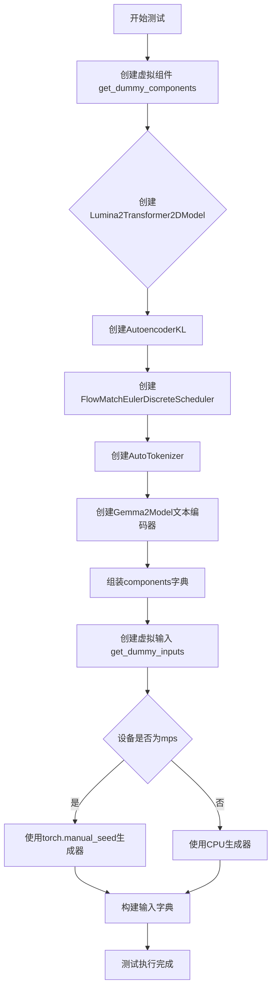
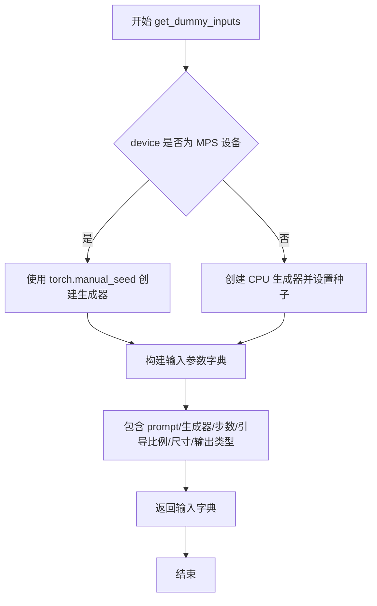
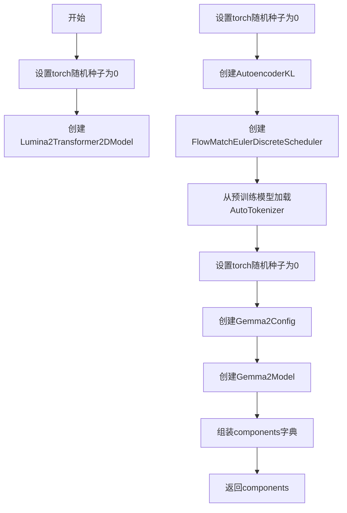
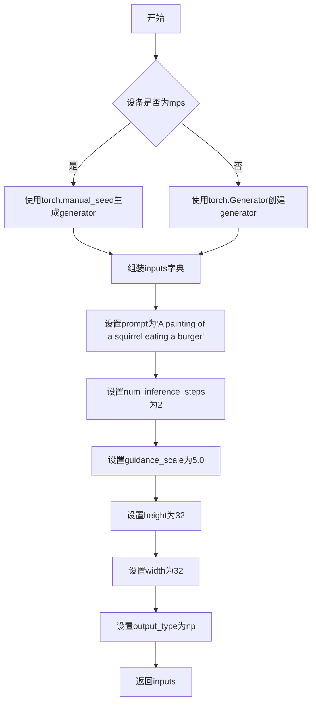

# `diffusers\tests\pipelines\lumina2\test_pipeline_lumina2.py` 详细设计文档

这是一个针对Lumina2Pipeline（扩散模型图像生成管道）的单元测试文件，继承自unittest.TestCase和PipelineTesterMixin，提供了虚拟组件和虚拟输入的生成方法，用于验证管道的功能和正确性。

## 整体流程



## 类结构

```
Lumina2PipelineFastTests (测试类)
└── 继承: unittest.TestCase, PipelineTesterMixin
```

## 全局变量及字段


### `Lumina2PipelineFastTests.pipeline_class`
    
The pipeline class being tested, set to Lumina2Pipeline

类型：`type`
    


### `Lumina2PipelineFastTests.params`
    
Frozen set of required parameters for the pipeline such as prompt, height, width, guidance_scale, etc.

类型：`frozenset`
    


### `Lumina2PipelineFastTests.batch_params`
    
Frozen set of parameters that support batching, containing prompt and negative_prompt

类型：`frozenset`
    


### `Lumina2PipelineFastTests.required_optional_params`
    
Frozen set of optional parameters that are required for testing, including num_inference_steps, generator, latents, etc.

类型：`frozenset`
    


### `Lumina2PipelineFastTests.supports_dduf`
    
Boolean flag indicating whether the pipeline supports DDUF (Diffusion Distillation Unified Framework), set to False

类型：`bool`
    


### `Lumina2PipelineFastTests.test_xformers_attention`
    
Boolean flag to enable xformers attention testing, set to False

类型：`bool`
    


### `Lumina2PipelineFastTests.test_layerwise_casting`
    
Boolean flag to enable layerwise casting testing, set to True

类型：`bool`
    
    

## 全局函数及方法


### `Lumina2PipelineFastTests.get_dummy_components`

该方法用于创建并返回一个包含 Lumina2Pipeline 所需的所有虚拟组件（transformer、vae、scheduler、text_encoder、tokenizer）的字典，以便在单元测试中进行快速的推理测试。

参数：

- 该方法没有参数（仅包含 self 参数，但 self 是隐式的实例引用）

返回值：`Dict[str, Any]`，返回一个字典，包含以下键值对：
- `"transformer"`：Lumina2Transformer2DModel 实例，图像变换模型
- `"vae"`：AutoencoderKL 实例，变分自编码器
- `"scheduler"`：FlowMatchEulerDiscreteScheduler 实例，调度器
- `"text_encoder"`：Gemma2Model 实例，文本编码器
- `"tokenizer"`：AutoTokenizer 实例，文本分词器

#### 流程图

```mermaid
flowchart TD
    A[开始 get_dummy_components] --> B[设置随机种子 torch.manual_seed(0)]
    B --> C[创建 Lumina2Transformer2DModel]
    C --> D[设置随机种子 torch.manual_seed(0)]
    D --> E[创建 AutoencoderKL]
    E --> F[创建 FlowMatchEulerDiscreteScheduler]
    F --> G[加载 AutoTokenizer]
    G --> H[设置随机种子 torch.manual_seed(0)]
    H --> I[创建 Gemma2Config]
    I --> J[创建 Gemma2Model 作为 text_encoder]
    J --> K[组装 components 字典]
    K --> L[返回 components 字典]
```

#### 带注释源码

```python
def get_dummy_components(self):
    """
    创建并返回用于单元测试的虚拟组件字典。
    
    该方法初始化 Lumina2Pipeline 所需的所有模型和配置，
    使用较小的参数规模以加快测试速度。
    """
    
    # 设置随机种子确保结果可重现
    torch.manual_seed(0)
    
    # 创建图像变换器模型 (Lumina2Transformer2DModel)
    # 参数配置：
    # - sample_size=4: 输入样本尺寸
    # - patch_size=2: 图像分块大小
    # - in_channels=4: 输入通道数
    # - hidden_size=8: 隐藏层维度
    # - num_layers=2: 变换器层数
    # - num_attention_heads=1: 注意力头数
    # - num_kv_heads=1: Key-Value 头数
    # - multiple_of=16: FFN 维度倍数
    # - ffn_dim_multiplier=None: FFN 维度乘数
    # - norm_eps=1e-5: 归一化 epsilon
    # - scaling_factor=1.0: 缩放因子
    # - axes_dim_rope=[4, 2, 2]: RoPE 轴维度
    # - cap_feat_dim=8: 特征捕获维度
    transformer = Lumina2Transformer2DModel(
        sample_size=4,
        patch_size=2,
        in_channels=4,
        hidden_size=8,
        num_layers=2,
        num_attention_heads=1,
        num_kv_heads=1,
        multiple_of=16,
        ffn_dim_multiplier=None,
        norm_eps=1e-5,
        scaling_factor=1.0,
        axes_dim_rope=[4, 2, 2],
        cap_feat_dim=8,
    )

    # 重新设置随机种子，确保 VAE 的初始化与 transformer 独立
    torch.manual_seed(0)
    
    # 创建变分自编码器 (VAE)
    # 参数配置：
    # - sample_size=32: VAE 处理样本尺寸
    # - in_channels=3: RGB 图像输入通道
    # - out_channels=3: RGB 图像输出通道
    # - block_out_channels=(4,): 输出块通道数
    # - layers_per_block=1: 每块层数
    # - latent_channels=4: 潜在空间通道数
    # - norm_num_groups=1: 归一化组数
    # - use_quant_conv=False: 不使用量化卷积
    # - use_post_quant_conv=False: 不使用后量化卷积
    # - shift_factor=0.0609: 移位因子
    # - scaling_factor=1.5035: 缩放因子
    vae = AutoencoderKL(
        sample_size=32,
        in_channels=3,
        out_channels=3,
        block_out_channels=(4,),
        layers_per_block=1,
        latent_channels=4,
        norm_num_groups=1,
        use_quant_conv=False,
        use_post_quant_conv=False,
        shift_factor=0.0609,
        scaling_factor=1.5035,
    )

    # 创建调度器 - Flow Match Euler 离散调度器
    scheduler = FlowMatchEulerDiscreteScheduler()
    
    # 加载预训练的分词器 (使用虚拟模型进行测试)
    tokenizer = AutoTokenizer.from_pretrained("hf-internal-testing/dummy-gemma")

    # 重新设置随机种子，确保文本编码器初始化独立
    torch.manual_seed(0)
    
    # 创建文本编码器配置 (Gemma2)
    # 参数配置：
    # - head_dim=4: 注意力头维度
    # - hidden_size=8: 隐藏层维度
    # - intermediate_size=8: FFN 中间层维度
    # - num_attention_heads=2: 注意力头数
    # - num_hidden_layers=2: 隐藏层数
    # - num_key_value_heads=2: KV 头数
    # - sliding_window=2: 滑动窗口大小
    config = Gemma2Config(
        head_dim=4,
        hidden_size=8,
        intermediate_size=8,
        num_attention_heads=2,
        num_hidden_layers=2,
        num_key_value_heads=2,
        sliding_window=2,
    )
    
    # 使用配置创建 Gemma2Model 作为文本编码器
    text_encoder = Gemma2Model(config)

    # 组装组件字典
    components = {
        "transformer": transformer,
        "vae": vae.eval(),  # 设置为评估模式
        "scheduler": scheduler,
        "text_encoder": text_encoder,
        "tokenizer": tokenizer,
    }
    
    # 返回完整的组件字典供测试使用
    return components
```


### `Lumina2PipelineFastTests.get_dummy_inputs`

该方法用于生成虚拟（dummy）输入参数，模拟 Lumina2Pipeline 的推理调用所需的测试数据，包括提示词、生成器、推理步数、引导比例、图像尺寸和输出类型等。

参数：

- `self`：测试类实例本身，`Lumina2PipelineFastTests`，表示当前测试类对象
- `device`：`torch.device` 或 `str`，指定计算设备，用于判断是否为 MPS 设备
- `seed`：`int`，随机种子，默认为 0，用于保证测试结果的可复现性

返回值：`dict`，包含模拟推理所需的输入参数字典，键包括 prompt、generator、num_inference_steps、guidance_scale、height、width、output_type

#### 流程图



#### 带注释源码

```python
def get_dummy_inputs(self, device, seed=0):
    """
    生成虚拟输入参数，用于测试 Lumina2Pipeline 的推理功能。
    
    参数:
        device: 计算设备，用于判断是否为 MPS (Apple Silicon) 设备
        seed: 随机种子，确保测试结果可复现
    
    返回:
        dict: 包含推理所需的所有虚拟输入参数
    """
    # 判断是否为 MPS 设备（MPS 是 Apple Silicon 的 GPU 加速后端）
    if str(device).startswith("mps"):
        # MPS 设备使用 torch.manual_seed 直接设置全局随机种子
        generator = torch.manual_seed(seed)
    else:
        # 其他设备（CPU/CUDA）创建指定设备的生成器对象
        generator = torch.Generator(device="cpu").manual_seed(seed)

    # 构建完整的虚拟输入参数字典
    inputs = {
        "prompt": "A painting of a squirrel eating a burger",  # 测试用提示词
        "generator": generator,   # 随机生成器，确保确定性输出
        "num_inference_steps": 2, # 推理步数，减少以加快测试速度
        "guidance_scale": 5.0,    # CFG 引导比例
        "height": 32,             # 输出图像高度（像素）
        "width": 32,              # 输出图像宽度（像素）
        "output_type": "np",      # 输出类型为 NumPy 数组
    }
    return inputs
```


## 关键组件


### Lumina2Pipeline

Lumina2Pipeline 是基于扩散模型的图像生成流水线，整合了Transformer变换器、VAE变分自编码器、文本编码器和调度器，实现文本到图像的端到端生成。

### Lumina2Transformer2DModel

Lumina2Transformer2DModel 是核心的变换器模型，负责处理扩散过程中的潜在表示，采用patch化处理和旋转位置编码（RoPE），支持多头注意力机制和键值对注意力优化。

### AutoencoderKL

AutoencoderKL 是变分自编码器模型，负责将图像编码到潜在空间以及从潜在空间解码恢复图像，支持量化卷积操作和后量化卷积，用于图像的压缩与重建。

### FlowMatchEulerDiscreteScheduler

FlowMatchEulerDiscreteScheduler 是基于欧拉离散方法的调度器，实现了Flow Matching扩散采样算法，负责控制扩散过程中的噪声调度和时间步进。

### Gemma2Model

Gemma2Model 是基于Gemma2配置的文本编码器，将文本提示（prompt）编码为嵌入向量，为图像生成提供文本条件信息。

### PipelineTesterMixin

PipelineTesterMixin 是测试混合类，提供通用的流水线测试方法和断言，用于验证扩散流水线的正确性、一致性和参数支持。

### 测试参数配置

包含params（单样本参数）、batch_params（批处理参数）、required_optional_params（可选必需参数）三个frozenset集合，定义了流水线支持的输入参数范围。

### 虚拟组件工厂

get_dummy_components方法创建用于单元测试的虚拟模型组件，包括配置好的Transformer、VAE、Scheduler、TextEncoder和Tokenizer，模拟完整推理pipeline。

### 虚拟输入工厂

get_dummy_inputs方法生成测试用的虚拟输入，包含prompt、generator、num_inference_steps、guidance_scale、height、width、output_type等关键参数，并处理了MPS设备的兼容性。


## 问题及建议


### 已知问题

- **缺失实际测试方法**：类中仅定义了组件和输入的获取方法，但没有实现任何实际的 `test_*` 方法来执行验证逻辑。
- **设备兼容性处理不一致**：`get_dummy_inputs` 方法中对 MPS 设备特殊处理（仅使用 `torch.manual_seed` 而非创建 `Generator` 对象），可能导致测试在 Apple Silicon 设备上的行为与其他设备不一致。
- **模型模式设置不统一**：`get_dummy_components` 中显式调用了 `vae.eval()`，但未对 `transformer` 和 `text_encoder` 设置 eval 模式，可能导致推理行为与实际部署不符。
- **随机种子重复设置**：在 `get_dummy_components` 中多次调用 `torch.manual_seed(0)`，这种模式容易在代码演进时引入隐藏的依赖关系，且不利于并行测试。
- **缺少类型注解**：所有方法参数和返回值均无类型注解，影响代码可维护性和 IDE 支持。
- **资源清理缺失**：创建的模型组件未在测试后显式释放或清理，可能导致内存泄漏（在大型测试套件中尤为明显）。
- **配置参数缺乏说明**：如 `Gemma2Config` 中的 `sliding_window=2`、VAE 的 `shift_factor=0.0609` 和 `scaling_factor=1.5035` 等魔法数字缺乏上下文说明。

### 优化建议

- 实现具体的测试方法（如 `test_inference`, `test_num_inference_steps` 等）以充分利用 `PipelineTesterMixin` 提供的验证逻辑。
- 统一设备处理逻辑，使用 `torch.Generator(device=device)` 创建随机数生成器，或提取设备检测逻辑到辅助方法中。
- 在 `get_dummy_components` 中对所有推理组件（transformer、text_encoder）调用 `.eval()` 并使用 `torch.no_grad()` 包装推理调用。
- 考虑将随机种子管理抽取为测试 fixture 或上下文管理器，确保测试隔离并支持并行执行。
- 添加完整的类型注解（Python 3.10+ 可使用 `from __future__ import annotations`）和文档字符串。
- 使用 `@classmethod` 的 `setUpClass` 方法集中创建组件，或实现 `tearDown` 方法进行资源清理。
- 将魔法数字提取为类常量或配置文件，并添加注释说明其来源和用途。

## 其它


### 一段话描述

该代码是Lumina2Diffusion Pipeline的单元测试类，通过unittest框架验证Pipeline的各类功能，包括组件初始化、推理参数处理、批处理支持等核心功能。

### 文件的整体运行流程

该测试文件遵循unittest测试框架的执行流程：首先通过`setUp`或直接调用获取虚拟组件和虚拟输入，然后执行各类测试方法验证Pipeline的不同功能模块。测试流程包括：1) 初始化测试组件（transformer、vae、scheduler、text_encoder、tokenizer）；2) 准备虚拟输入参数；3) 执行Pipeline调用并验证输出；4) 检查各类可选参数的支持情况。

### 类的详细信息

**类名**: Lumina2PipelineFastTests
**基类**: unittest.TestCase, PipelineTesterMixin
**核心功能**: 继承unittest.TestCase实现Lumina2Pipeline的单元测试，继承PipelineTesterMixin获取通用的pipeline测试方法集合

### 类字段

**pipeline_class**
- 类型: type
- 描述: 指定被测试的Pipeline类为Lumina2Pipeline

**params**
- 类型: frozenset
- 描述: 定义单样本推理可接受的参数集合，包含prompt、height、width等7个参数

**batch_params**
- 类型: frozenset
- 描述: 定义批处理支持的参数集合，仅支持prompt和negative_prompt

**required_optional_params**
- 类型: frozenset
- 描述: 定义可选的必需参数集合，包含num_inference_steps、generator等7个参数

**supports_dduf**
- 类型: bool
- 描述: 标记该Pipeline不支持DDUF（Decoder-only Diffusion upsampling features）

**test_xformers_attention**
- 类型: bool
- 描述: 标记该Pipeline不测试xformers注意力机制优化

**test_layerwise_casting**
- 类型: bool
- 描述: 标记该Pipeline支持逐层类型转换测试

### 类方法

**get_dummy_components**
- 参数: 无
- 返回值类型: dict
- 返回值描述: 返回包含transformer、vae、scheduler、text_encoder、tokenizer的组件字典
- Mermaid流程图:

- 源码:
```python
def get_dummy_components(self):
    torch.manual_seed(0)
    transformer = Lumina2Transformer2DModel(
        sample_size=4,
        patch_size=2,
        in_channels=4,
        hidden_size=8,
        num_layers=2,
        num_attention_heads=1,
        num_kv_heads=1,
        multiple_of=16,
        ffn_dim_multiplier=None,
        norm_eps=1e-5,
        scaling_factor=1.0,
        axes_dim_rope=[4, 2, 2],
        cap_feat_dim=8,
    )

    torch.manual_seed(0)
    vae = AutoencoderKL(
        sample_size=32,
        in_channels=3,
        out_channels=3,
        block_out_channels=(4,),
        layers_per_block=1,
        latent_channels=4,
        norm_num_groups=1,
        use_quant_conv=False,
        use_post_quant_conv=False,
        shift_factor=0.0609,
        scaling_factor=1.5035,
    )

    scheduler = FlowMatchEulerDiscreteScheduler()
    tokenizer = AutoTokenizer.from_pretrained("hf-internal-testing/dummy-gemma")

    torch.manual_seed(0)
    config = Gemma2Config(
        head_dim=4,
        hidden_size=8,
        intermediate_size=8,
        num_attention_heads=2,
        num_hidden_layers=2,
        num_key_value_heads=2,
        sliding_window=2,
    )
    text_encoder = Gemma2Model(config)

    components = {
        "transformer": transformer,
        "vae": vae.eval(),
        "scheduler": scheduler,
        "text_encoder": text_encoder,
        "tokenizer": tokenizer,
    }
    return components
```

**get_dummy_inputs**
- 参数: device, seed=0
- 参数类型: device: 设备对象, seed: int
- 参数描述: device指定测试设备，seed指定随机种子用于生成器初始化
- 返回值类型: dict
- 返回值描述: 返回包含prompt、generator、num_inference_steps等推理参数的字典
- Mermaid流程图:

- 源码:
```python
def get_dummy_inputs(self, device, seed=0):
    if str(device).startswith("mps"):
        generator = torch.manual_seed(seed)
    else:
        generator = torch.Generator(device="cpu").manual_seed(seed)

    inputs = {
        "prompt": "A painting of a squirrel eating a burger",
        "generator": generator,
        "num_inference_steps": 2,
        "guidance_scale": 5.0,
        "height": 32,
        "width": 32,
        "output_type": "np",
    }
    return inputs
```

### 全局变量和全局函数

该文件未定义全局变量或全局函数，所有内容均在类作用域内。

### 关键组件信息

**Lumina2Pipeline**
- 描述: Lumina2扩散模型的主Pipeline类，负责协调各组件完成文本到图像的生成

**Lumina2Transformer2DModel**
- 描述: Lumina2的Transformer模型，负责潜在空间的去噪过程

**AutoencoderKL**
- 描述: VAE编码器和解码器，负责图像与潜在表示之间的转换

**FlowMatchEulerDiscreteScheduler**
- 描述: 基于Flow Matching的Euler离散调度器，控制去噪过程的采样步骤

**Gemma2Model**
- 描述: Google的Gemma2文本编码器模型，负责将文本提示转换为embedding

**AutoTokenizer**
- 描述: Hugging Face的tokenizer，用于文本分词

**PipelineTesterMixin**
- 描述: 通用Pipeline测试混入类，提供标准化的测试方法集合

### 潜在的技术债务或优化空间

1. **测试覆盖不完整**: 当前仅定义了组件获取方法和输入获取方法，缺少实际测试方法的实现（如test_inference、test_batch_generation等）

2. **硬编码的随机种子**: 多处使用torch.manual_seed(0)，可能导致测试的确定性过强，建议使用参数化的seed

3. **设备兼容性处理粗糙**: 通过str(device).startswith("mps")判断设备类型不够健壮，应使用更可靠的方式

4. **魔法数字**: 配置中存在大量硬编码数值（如shift_factor=0.0609、scaling_factor=1.5035），缺乏常量定义

5. **测试配置分散**: params、batch_params、required_optional_params分散定义，建议使用 dataclass 或配置类统一管理

6. **缺少异步测试**: 未包含异步推理的测试用例

7. **tokenizer依赖外部模型**: 使用了"hf-internal-testing/dummy-gemma"这个测试用模型，可能在CI环境外无法使用

### 其它项目

### 设计目标与约束

**目标**:
- 验证Lumina2Pipeline能够正确初始化并加载各个组件
- 验证Pipeline能够接受标准参数集并正确执行推理
- 确保批处理功能按预期工作
- 验证各类可选参数（generator、latents、callback等）的支持情况

**约束**:
- 必须继承PipelineTesterMixin以保持与其它Pipeline测试的一致性
- 参数集必须与Pipeline实际接受的参数匹配
- 测试必须在CPU和GPU环境下均可运行
- 需要支持MPS设备（Apple Silicon）

### 错误处理与异常设计

- **设备相关错误**: 当设备为MPS时使用特殊的generator创建方式，避免MPS设备上的Generator兼容性问

- **外部依赖错误**: tokenizer从预训练模型加载可能抛出FileNotFoundError或ConnectionError

- **配置错误**: Lumina2Transformer2DModel和Gemma2Config的参数必须匹配，否则可能在运行时产生维度不匹配错误

### 数据流与状态机

**数据流**:
1. 测试准备阶段: get_dummy_components() → 组装components字典
2. 输入准备阶段: get_dummy_inputs() → 组装inputs字典
3. Pipeline执行阶段: Pipeline(components) → pipeline(**inputs)
4. 结果验证阶段: 验证输出类型、尺寸、内容

**状态机**:
- 测试类本身无状态机，但Pipeline内部包含: 初始化态 → 就绪态 → 运行态 → 完成态

### 外部依赖与接口契约

**外部依赖**:
- torch: 张量计算和随机数生成
- transformers: Gemma2Model、AutoTokenizer、Gemma2Config
- diffusers: Lumina2Pipeline、Lumina2Transformer2DModel、AutoencoderKL、FlowMatchEulerDiscreteScheduler
- unittest: 测试框架

**接口契约**:
- get_dummy_components() 必须返回包含所有Pipeline必需组件的字典
- get_dummy_inputs() 必须返回符合Pipeline __call__ 签名的参数字典
- 组件的device属性应与传入的device参数一致
- 生成器(generator)必须与目标设备兼容

### 测试策略

- **单元测试级别**: 聚焦于单个组件的虚拟配置和输入准备
- **集成测试**: 通过PipelineTesterMixin的测试方法验证端到端功能
- **参数化测试**: 通过params、batch_params、required_optional_params定义参数组合
- **回归测试**: 固定的随机种子确保测试结果可复现

### 性能考虑

- 使用小尺寸模型和少量推理步数（num_inference_steps=2）以加快测试速度
- VAE使用eval()模式避免训练模式的计算开销
- 虚拟组件使用最小的hidden_size、num_layers等参数
- 测试输出类型设置为"np"（numpy数组）避免张量比较的开销

    