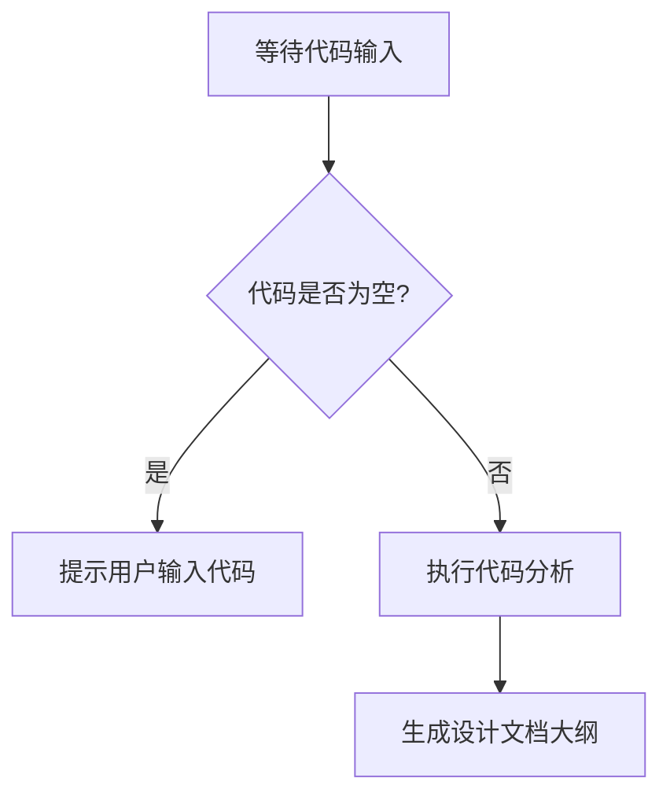
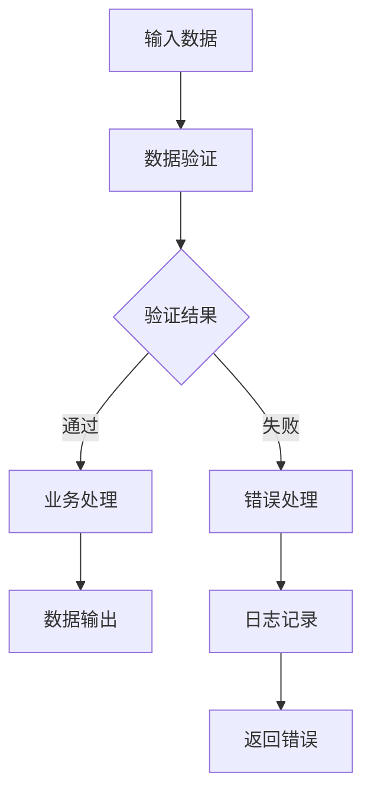

# `diffusers\tests\pipelines\marigold\__init__.py` 详细设计文档

未提供源代码内容，无法进行分析。请提供需要分析的代码。

## 整体流程



## 类结构

```

```

## 全局变量及字段


    

## 全局函数及方法


## 关键组件


## 问题及建议


### 已知问题

-   未提供待分析的源代码，无法进行技术债务识别和优化空间分析

### 优化建议

-   请提供需要分析的代码内容，以便进行详细的技术债务识别和优化建议


## 其它


### 设计目标与约束

描述该模块的设计目标，包括功能目标、性能目标、可维护性目标等，以及各种约束条件如技术栈约束、时间约束、兼容性约束等。

### 错误处理与异常设计

描述系统中错误处理的策略，包括异常类型定义、错误码规范、错误传播机制、降级策略等。说明何时抛出异常、何时返回错误码，以及如何记录和监控错误。

### 数据流与状态机

使用 mermaid 流程图展示数据在系统中的流转过程，包括数据输入、处理、输出各环节。若模块涉及状态机，绘制状态转换图并说明各状态的含义及转换条件。



### 外部依赖与接口契约

列出模块的所有外部依赖，包括第三方库、服务、数据库、消息队列等。详细说明与外部系统交互的接口契约，包括接口定义、参数规范、返回值格式、调用协议等。

### 性能要求与基准

描述模块的性能要求，包括响应时间、吞吐量、并发能力、资源占用等指标。说明性能测试的基准和预期目标，以及性能优化的策略和手段。

### 安全性考虑

描述模块的安全设计，包括身份认证、授权控制、数据加密、输入校验、安全审计等方面。说明如何防止常见安全威胁如注入攻击、越权访问、数据泄露等。

### 配置管理

说明模块的配置项清单，包括配置来源、配置格式、配置加载时机、配置校验等。描述不同环境（开发、测试、生产）的配置差异和切换机制。

### 版本兼容性

描述模块的版本管理策略，包括API版本控制、向后兼容性维护、版本升级路径等。说明与上下游模块的版本依赖关系和兼容性要求。

### 部署架构

描述模块在系统架构中的位置和部署方式，包括运行环境、容器化方案、集群部署、高可用策略等。说明与其他服务的部署依赖和通信方式。

### 测试策略

描述模块的测试策略，包括单元测试、集成测试、端到端测试的覆盖范围和测试方法。说明测试数据的准备、测试环境的搭建、以及测试用例的设计原则。

### 监控与运维

描述模块的监控指标和告警策略，包括业务指标、技术指标、日志规范等。说明运维人员需要关注的健康状态、性能瓶颈、异常告警等信息。

### 关键技术选型

说明模块采用关键技术的原因和考量，包括技术选型的优缺点分析、与现有技术栈的融合方式、技术债务评估等。

### 带注释源码

展示核心逻辑的带注释源码，说明关键代码段的设计意图和实现细节。

```java
// 示例：数据处理核心逻辑
public Result processData(InputData input) {
    // 第一步：输入参数校验，确保数据合法性
    if (!validateInput(input)) {
        return Result.error(ErrorCode.INVALID_INPUT);
    }
    
    // 第二步：业务规则处理，执行核心业务逻辑
    BusinessResult businessResult = executeBusiness(input);
    
    // 第三步：结果封装与返回，处理异常情况
    return Result.success(businessResult);
}
```


    