# `diffusers\tests\pipelines\marigold\test_marigold_depth.py` 详细设计文档

这是 Marigold 深度估计管道的测试文件，包含快速单元测试和集成测试，用于验证管道在不同配置（不同分辨率、推理步骤、集成数量、批处理大小等）下的深度预测功能正确性。

## 整体流程

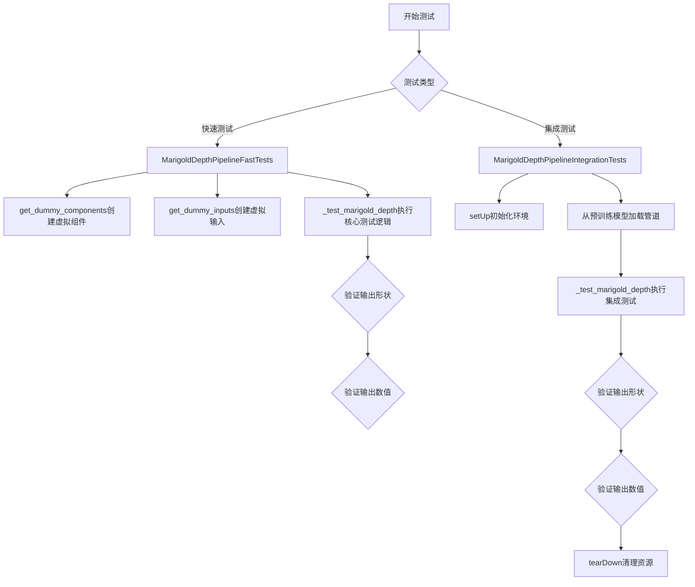

## 类结构

```
unittest.TestCase (基类)
├── PipelineTesterMixin (混入类)
│   └── MarigoldDepthPipelineFastTests
│       ├── 测试方法: test_marigold_depth_dummy_*
│       └── 辅助方法: get_dummy_*, _test_marigold_depth
└── unittest.TestCase
    └── MarigoldDepthPipelineIntegrationTests
        ├── setUp / tearDown
        └── 测试方法: test_marigold_depth_einstein_*
```

## 全局变量及字段


### `unet`
    
UNet模型，用于在潜在空间中预测深度信息

类型：`UNet2DConditionModel`
    


### `scheduler`
    
LCM调度器，用于控制扩散模型的采样步骤

类型：`LCMScheduler`
    


### `vae`
    
变分自编码器，用于编码和解码图像

类型：`AutoencoderKL`
    


### `text_encoder`
    
CLIP文本编码器，用于将文本提示编码为嵌入向量

类型：`CLIPTextModel`
    


### `tokenizer`
    
CLIP分词器，用于将文本分割为token

类型：`CLIPTokenizer`
    


### `prediction_type`
    
预测类型，指示模型输出为深度图

类型：`str`
    


### `scale_invariant`
    
标志位，表示预测是否具有尺度不变性

类型：`bool`
    


### `shift_invariant`
    
标志位，表示预测是否具有平移不变性

类型：`bool`
    


### `components`
    
包含所有管道组件的字典

类型：`dict`
    


### `image`
    
输入图像张量，形状为(1, 3, H, W)

类型：`torch.Tensor`
    


### `generator`
    
随机数生成器，用于控制推理过程中的随机性

类型：`torch.Generator`
    


### `inputs`
    
包含管道输入参数的字典

类型：`dict`
    


### `prediction`
    
管道输出的深度预测结果

类型：`torch.Tensor`
    


### `prediction_slice`
    
预测结果的切片，用于验证精度

类型：`numpy.ndarray`
    


### `pipe`
    
Marigold深度估计管道的实例

类型：`MarigoldDepthPipeline`
    


### `pipe_inputs`
    
传递给管道的输入参数字典

类型：`dict`
    


### `device`
    
计算设备字符串，如'cpu'或'cuda'

类型：`str`
    


### `from_pretrained_kwargs`
    
从预训练模型加载时的可选参数

类型：`dict`
    


### `is_fp16`
    
标志位，指示是否使用半精度浮点数

类型：`bool`
    


### `model_id`
    
预训练模型在HuggingFace Hub上的标识符

类型：`str`
    


### `image_url`
    
测试用图像的URL地址

类型：`str`
    


### `width`
    
输入图像的宽度像素值

类型：`int`
    


### `height`
    
输入图像的高度像素值

类型：`int`
    


### `expected_slice`
    
测试预期的深度值切片，用于验证结果正确性

类型：`numpy.ndarray`
    


### `expected_slices`
    
包含不同设备/版本预期值的容器对象

类型：`Expectations`
    


### `MarigoldDepthPipelineFastTests.pipeline_class`
    
被测试的管道类，指向MarigoldDepthPipeline

类型：`type`
    


### `MarigoldDepthPipelineFastTests.params`
    
管道必需的位置参数集合

类型：`frozenset`
    


### `MarigoldDepthPipelineFastTests.batch_params`
    
支持批量处理的参数集合

类型：`frozenset`
    


### `MarigoldDepthPipelineFastTests.image_params`
    
图像相关参数的集合

类型：`frozenset`
    


### `MarigoldDepthPipelineFastTests.image_latents_params`
    
潜在空间图像参数的集合

类型：`frozenset`
    


### `MarigoldDepthPipelineFastTests.callback_cfg_params`
    
回调函数配置参数的集合

类型：`frozenset`
    


### `MarigoldDepthPipelineFastTests.test_xformers_attention`
    
标志位，指示是否测试xformers注意力机制

类型：`bool`
    


### `MarigoldDepthPipelineFastTests.required_optional_params`
    
必需的可选参数集合

类型：`frozenset`
    
    

## 全局函数及方法


### `gc.collect`

`gc.collect` 是 Python 标准库 `gc` 模块中的函数，用于显式触发垃圾回收机制，遍历所有代（generation）的垃圾对象并释放内存。在该测试代码中用于在测试用例的 `setUp` 和 `tearDown` 阶段清理内存，确保每次测试前后的内存状态干净，避免内存泄漏影响测试结果。

参数：
- 该函数无显式参数（Python 实现中支持可选的 `generation` 参数指定回收代际，但此代码中未使用）

返回值：`int`，返回回收的对象数量

#### 流程图

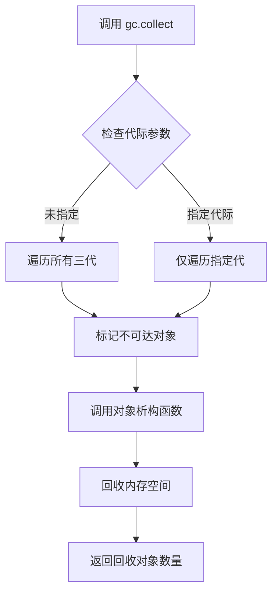

#### 带注释源码

```python
# 位于 MarigoldDepthPipelineIntegrationTests 类的 setUp 方法中
def setUp(self):
    super().setUp()
    gc.collect()  # 显式触发垃圾回收，清理上一轮测试残留的不可达对象
    backend_empty_cache(torch_device)  # 同时清理 GPU 缓存

# 位于 MarigoldDepthPipelineIntegrationTests 类的 tearDown 方法中
def tearDown(self):
    super().tearDown()
    gc.collect()  # 显式触发垃圾回收，释放本轮测试创建的对象内存
    backend_empty_cache(torch_device)  # 同时清理 GPU 缓存
```


### `random.Random`

用于创建一个独立的随机数生成器实例，以便在测试中生成确定性的随机数据。

参数：

- `seed`：`int`，可选，生成器的种子值，用于确保测试的可重复性。如果为 `None`，则使用系统当前时间作为种子。

返回值：`random.Random`，返回一个独立的随机数生成器对象。

#### 流程图

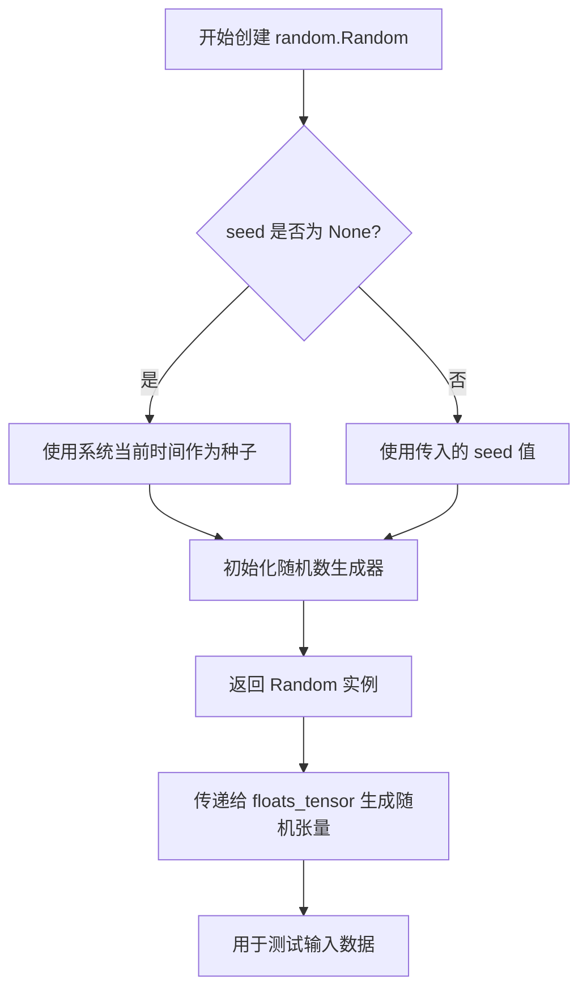

#### 带注释源码

```python
# random.Random 是 Python 标准库 random 模块中的 Random 类
# 用于创建一个独立的随机数生成器实例
# 在代码中用于确保测试的可重复性

# 使用示例（来自 get_dummy_inputs 方法）:
image = floats_tensor((1, 3, 32, 32), rng=random.Random(seed)).to(device)

# 解释：
# 1. random.Random(seed) 创建一个带有确定性种子的随机数生成器
# 2. 这个生成器被传递给 floats_tensor 函数
# 3. floats_tensor 使用这个生成器创建指定形状的随机浮点数张量
# 4. 通过使用固定的 seed 值，可以确保每次测试运行生成相同的随机数据
# 5. 这对于单元测试的确定性和可重复性至关重要

# 完整的调用链：
# random.Random(seed)  # 创建随机生成器
#     ↓
# floats_tensor((1, 3, 32, 32), rng=...)  # 使用生成器创建张量
#     ↓
# image = ...  # 获取随机图像张量
```


# MarigoldDepthPipeline 测试文档

## 1. 一段话描述

该代码是 Marigold 深度估计管道的单元测试和集成测试套件，用于验证 `MarigoldDepthPipeline` 在不同配置下（如不同分辨率、批量大小、集成数量、精度）生成深度图的功能正确性。

## 2. 文件的整体运行流程

文件包含两个主要测试类：`MarigoldDepthPipelineFastTests`（快速单元测试）和 `MarigoldDepthPipelineIntegrationTests`（集成测试）。测试流程为：准备虚拟组件/模型 → 构造输入数据 → 执行管道推理 → 验证输出形状和数值精度。

---

### `MarigoldDepthPipelineFastTests.get_dummy_components`

#### 描述

创建用于单元测试的虚拟（dummy）模型组件，包括 UNet、调度器、VAE、文本编码器和分词器。

#### 参数

- `time_cond_proj_dim`：`Optional[int]`，可选的时间条件投影维度，默认为 None

#### 返回值

`Dict[str, Any]`，包含以下键的字典：
- `unet`：UNet2DConditionModel 实例
- `scheduler`：LCMScheduler 实例
- `vae`：AutoencoderKL 实例
- `text_encoder`：CLIPTextModel 实例
- `tokenizer`：CLIPTokenizer 实例
- `prediction_type`：字符串 "depth"
- `scale_invariant`：布尔值 True
- `shift_invariant`：布尔值 True

#### 流程图

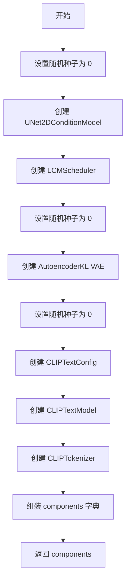

#### 带注释源码

```python
def get_dummy_components(self, time_cond_proj_dim=None):
    """创建用于测试的虚拟模型组件"""
    torch.manual_seed(0)  # 设置随机种子以确保可重复性
    unet = UNet2DConditionModel(
        block_out_channels=(32, 64),  # UNet 块输出通道数
        layers_per_block=2,            # 每层块数
        time_cond_proj_dim=time_cond_proj_dim,  # 时间条件投影维度
        sample_size=32,               # 样本尺寸
        in_channels=8,                # 输入通道数
        out_channels=4,               # 输出通道数
        down_block_types=("DownBlock2D", "CrossAttnDownBlock2D"),  # 下采样块类型
        up_block_types=("CrossAttnUpBlock2D", "UpBlock2D"),        # 上采样块类型
        cross_attention_dim=32,       # 交叉注意力维度
    )
    scheduler = LCMScheduler(
        beta_start=0.00085,           # beta 起始值
        beta_end=0.012,               # beta 结束值
        prediction_type="v_prediction",  # 预测类型
        set_alpha_to_one=False,      # 设置 alpha 为 1
        steps_offset=1,               # 步骤偏移
        beta_schedule="scaled_linear", # beta 调度方案
        clip_sample=False,            # 裁剪采样
        thresholding=False,           # 阈值处理
    )
    torch.manual_seed(0)
    vae = AutoencoderKL(
        block_out_channels=[32, 64], # VAE 块输出通道
        in_channels=3,                # 输入通道
        out_channels=3,              # 输出通道
        down_block_types=["DownEncoderBlock2D", "DownEncoderBlock2D"],  # 下编码块
        up_block_types=["UpDecoderBlock2D", "UpDecoderBlock2D"],        # 上解码块
        latent_channels=4,           # 潜在空间通道数
    )
    torch.manual_seed(0)
    text_encoder_config = CLIPTextConfig(
        bos_token_id=0,              # 起始 token ID
        eos_token_id=2,              # 结束 token ID
        hidden_size=32,              # 隐藏层大小
        intermediate_size=37,        # 中间层大小
        layer_norm_eps=1e-05,         # LayerNorm epsilon
        num_attention_heads=4,       # 注意力头数
        num_hidden_layers=5,         # 隐藏层数
        pad_token_id=1,              # 填充 token ID
        vocab_size=1000,             # 词汇表大小
    )
    text_encoder = CLIPTextModel(text_encoder_config)
    tokenizer = CLIPTokenizer.from_pretrained("hf-internal-testing/tiny-random-clip")

    components = {
        "unet": unet,
        "scheduler": scheduler,
        "vae": vae,
        "text_encoder": text_encoder,
        "tokenizer": tokenizer,
        "prediction_type": "depth",
        "scale_invariant": True,
        "shift_invariant": True,
    }
    return components
```

---

### `MarigoldDepthPipelineFastTests.get_dummy_inputs`

#### 描述

创建用于测试的虚拟输入数据，包括图像张量和管道参数。

#### 参数

- `device`：`str`，目标设备（如 "cpu"、"cuda"）
- `seed`：`int`，随机种子，默认为 0

#### 返回值

`Dict[str, Any]`，包含以下键的字典：
- `image`：浮点张量，形状为 (1, 3, 32, 32)，值域 [0, 1]
- `num_inference_steps`：整数 1
- `processing_resolution`：整数 0
- `generator`：torch.Generator 实例
- `output_type`：字符串 "np"

#### 流程图

```mermaid
flowchart TD
    A[开始] --> B[生成随机图像张量 1x3x32x32]
    B --> C[将图像值域从 [-1,1] 映射到 [0,1]]
    C --> D{设备是否为 MPS?}
    D -->|是| E[使用 torch.manual_seed]
    D -->|否| F[创建 torch.Generator]
    E --> G[构建输入字典]
    F --> G
    G --> H[返回 inputs]
```

#### 带注释源码

```python
def get_dummy_inputs(self, device, seed=0):
    """生成用于测试的虚拟输入"""
    # 生成随机浮点张量 (1, 3, 32, 32)
    image = floats_tensor((1, 3, 32, 32), rng=random.Random(seed)).to(device)
    # 将图像值域从 [-1, 1] 映射到 [0, 1]
    image = image / 2 + 0.5
    # MPS 设备需要特殊处理随机数生成器
    if str(device).startswith("mps"):
        generator = torch.manual_seed(seed)
    else:
        generator = torch.Generator(device=device).manual_seed(seed)
    
    inputs = {
        "image": image,                        # 输入图像
        "num_inference_steps": 1,              # 推理步数
        "processing_resolution": 0,            # 处理分辨率 (0 表示原始分辨率)
        "generator": generator,                # 随机数生成器
        "output_type": "np",                    # 输出类型为 numpy
    }
    return inputs
```

---

### `MarigoldDepthPipelineFastTests._test_marigold_depth`

#### 描述

核心深度测试方法，用于验证 Marigold 深度管道输出的形状和数值正确性。

#### 参数

- `generator_seed`：`int`，随机种子，默认为 0
- `expected_slice`：`np.ndarray`，期望的预测切片值
- `atol`：`float`，绝对误差容限，默认为 1e-4
- `**pipe_kwargs`：其他传递给管道的关键字参数

#### 返回值

无返回值（通过 assert 语句进行验证）

#### 流程图

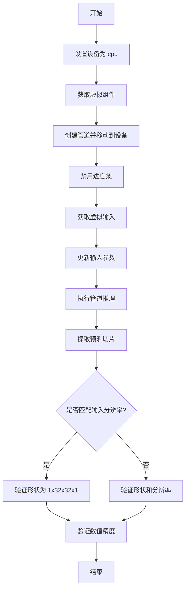

#### 带注释源码

```python
def _test_marigold_depth(
    self,
    generator_seed: int = 0,
    expected_slice: np.ndarray = None,
    atol: float = 1e-4,
    **pipe_kwargs,
):
    """测试 Marigold 深度估计管道的核心方法"""
    device = "cpu"
    components = self.get_dummy_components()  # 获取虚拟组件

    # 创建管道实例并移动到设备
    pipe = self.pipeline_class(**components)
    pipe.to(device)
    pipe.set_progress_bar_config(disable=None)  # 启用进度条

    # 获取输入并更新额外参数
    pipe_inputs = self.get_dummy_inputs(device, seed=generator_seed)
    pipe_inputs.update(**pipe_kwargs)

    # 执行推理获取预测结果
    prediction = pipe(**pipe_inputs).prediction

    # 提取预测切片用于验证
    prediction_slice = prediction[0, -3:, -3:, -1].flatten()

    # 验证输出分辨率
    if pipe_inputs.get("match_input_resolution", True):
        # 匹配输入分辨率时，期望形状为 (1, 32, 32, 1)
        self.assertEqual(prediction.shape, (1, 32, 32, 1), "Unexpected output resolution")
    else:
        # 不匹配时验证最大维度
        self.assertTrue(prediction.shape[0] == 1 and prediction.shape[3] == 1, "Unexpected output dimensions")
        self.assertEqual(
            max(prediction.shape[1:3]),
            pipe_inputs.get("processing_resolution", 768),
            "Unexpected output resolution",
        )

    # 验证数值精度
    self.assertTrue(np.allclose(prediction_slice, expected_slice, atol=atol))
```

---

### `MarigoldDepthPipelineFastTests.test_marigold_depth_dummy_defaults`

#### 描述

测试默认配置下的深度估计功能，使用单个推理步骤和默认参数。

#### 参数

无（继承自父类 `_test_marigold_depth` 的默认参数）

#### 返回值

无返回值（通过 assert 语句进行验证）

#### 流程图

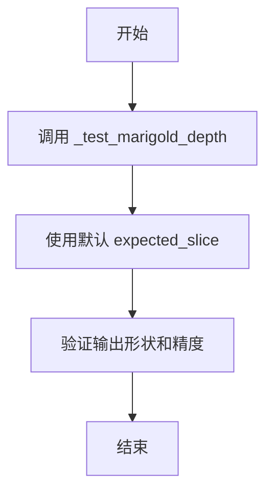

#### 带注释源码

```python
def test_marigold_depth_dummy_defaults(self):
    """测试默认配置下的深度估计"""
    self._test_marigold_depth(
        # 期望的预测切片值（9个元素的数组）
        expected_slice=np.array([0.4529, 0.5184, 0.4985, 0.4355, 0.4273, 0.4153, 0.5229, 0.4818, 0.4627]),
    )
```

---

### `MarigoldDepthPipelineIntegrationTests._test_marigold_depth`

#### 描述

集成测试的核心方法，从预训练模型加载并验证深度估计的准确性。

#### 参数

- `is_fp16`：`bool`，是否使用半精度 FP16，默认为 True
- `device`：`str`，目标设备，默认为 "cuda"
- `generator_seed`：`int`，随机种子，默认为 0
- `expected_slice`：`np.ndarray`，期望的预测切片值
- `model_id`：`str`，预训练模型 ID，默认为 "prs-eth/marigold-lcm-v1-0"
- `image_url`：`str`，测试图像 URL，默认为爱因斯坦图像
- `atol`：`float`，绝对误差容限，默认为 1e-4
- `**pipe_kwargs`：其他传递给管道的关键字参数

#### 返回值

无返回值（通过 assert 语句进行验证）

#### 流程图

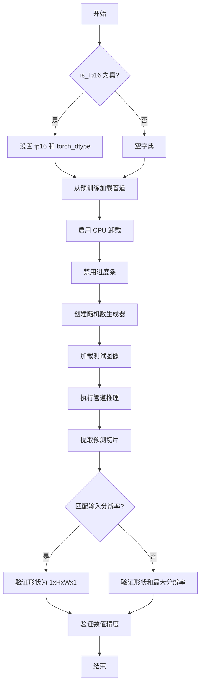

#### 带注释源码

```python
def _test_marigold_depth(
    self,
    is_fp16: bool = True,
    device: str = "cuda",
    generator_seed: int = 0,
    expected_slice: np.ndarray = None,
    model_id: str = "prs-eth/marigold-lcm-v1-0",
    image_url: str = "https://marigoldmonodepth.github.io/images/einstein.jpg",
    atol: float = 1e-4,
    **pipe_kwargs,
):
    """集成测试核心方法，验证预训练模型的深度估计能力"""
    from_pretrained_kwargs = {}
    if is_fp16:
        # 使用 FP16 变体和半精度
        from_pretrained_kwargs["variant"] = "fp16"
        from_pretrained_kwargs["torch_dtype"] = torch.float16

    # 从预训练模型加载管道
    pipe = MarigoldDepthPipeline.from_pretrained(model_id, **from_pretrained_kwargs)
    pipe.enable_model_cpu_offload(device=torch_device)  # 启用 CPU 卸载
    pipe.set_progress_bar_config(disable=None)

    # 创建确定性随机数生成器
    generator = torch.Generator(device=device).manual_seed(generator_seed)

    # 加载测试图像
    image = load_image(image_url)
    width, height = image.size

    # 执行深度估计
    prediction = pipe(image, generator=generator, **pipe_kwargs).prediction

    # 提取预测切片用于验证
    prediction_slice = prediction[0, -3:, -3:, -1].flatten()

    # 验证输出分辨率
    if pipe_kwargs.get("match_input_resolution", True):
        self.assertEqual(prediction.shape, (1, height, width, 1), "Unexpected output resolution")
    else:
        self.assertTrue(prediction.shape[0] == 1 and prediction.shape[3] == 1, "Unexpected output dimensions")
        self.assertEqual(
            max(prediction.shape[1:3]),
            pipe_kwargs.get("processing_resolution", 768),
            "Unexpected output resolution",
        )

    # 验证数值精度
    self.assertTrue(np.allclose(prediction_slice, expected_slice, atol=atol))
```

---

### `MarigoldDepthPipelineIntegrationTests.test_marigold_depth_einstein_f16_accelerator_G0_S1_P768_E1_B1_M1`

#### 描述

使用 FP16 精度在加速器上对爱因斯坦图像进行深度估计的集成测试，验证 768 分辨率、单次推理、单个集成的配置。

#### 参数

无（继承自 `_test_marigold_depth` 的参数）

#### 返回值

无返回值

#### 流程图

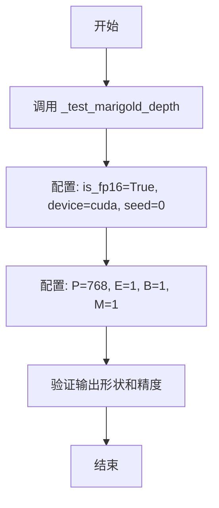

#### 带注释源码

```python
def test_marigold_depth_einstein_f16_accelerator_G0_S1_P768_E1_B1_M1(self):
    """测试 FP16 精度下爱因斯坦图像的深度估计"""
    self._test_marigold_depth(
        is_fp16=True,                                       # 使用半精度 FP16
        device=torch_device,                                # 使用加速器设备
        generator_seed=0,                                   # 随机种子 0
        expected_slice=np.array([0.1241, 0.1262, 0.1290, 
                                 0.1238, 0.1250, 0.1265, 
                                 0.1224, 0.1225, 0.1179]), # 期望的深度值切片
        num_inference_steps=1,                              # 单次推理步骤
        processing_resolution=768,                          # 处理分辨率 768
        ensemble_size=1,                                    # 单个集成
        batch_size=1,                                       # 批量大小 1
        match_input_resolution=True,                        # 匹配输入分辨率
    )
```

---

## 3. 关键组件信息

| 组件名称 | 描述 |
|---------|------|
| `MarigoldDepthPipeline` | Marigold 深度估计管道主类 |
| `UNet2DConditionModel` | 条件 UNet 模型，用于去噪过程 |
| `AutoencoderKL` | VAE 编码器/解码器，用于图像潜在表示 |
| `LCMScheduler` | 潜在一致性模型调度器 |
| `CLIPTextModel` | 文本编码器模型 |
| `CLIPTokenizer` | 文本分词器 |

---

## 4. 潜在的技术债务或优化空间

1. **测试参数命名不规范**：方法名使用缩写（如 G0_S1_P32_E1_B1_M1），难以直观理解参数含义
2. **重复代码**：`_test_marigold_depth` 方法在两个测试类中重复定义，代码复用性低
3. **硬编码期望值**：数值期望值硬编码在测试中，缺乏外部配置管理
4. **缺少异步测试**：未使用异步方式测试管道性能
5. **Flaky 测试**：部分测试标记为 `@is_flaky`，表明存在不稳定性

---

## 5. 其它项目

### 设计目标与约束

- **单元测试**：验证管道在虚拟组件下的功能正确性
- **集成测试**：验证真实预训练模型的深度估计准确性
- **精度验证**：使用 numpy 的 `allclose` 验证输出精度（atol=1e-4）

### 错误处理与异常设计

- 测试 `num_inference_steps` 和 `processing_resolution` 为 None 时抛出 `ValueError`
- 使用 `self.assertRaises` 验证异常情况

### 数据流与状态机

1. 加载/创建模型组件 → 2. 准备输入数据 → 3. 执行管道推理 → 4. 验证输出形状 → 5. 验证数值精度

### 外部依赖与接口契约

- 依赖 `diffusers` 库的管道和模型
- 依赖 `transformers` 库的文本编码器
- 依赖 `testing_utils` 中的辅助函数（`floats_tensor`、`load_image` 等）


### `np.array`

NumPy 库中的核心函数，用于将 Python 列表或其他类似数组的数据结构转换为 NumPy 的 ndarray 对象。在该代码中主要用于创建测试用例中的期望输出切片（expected_slice），用于验证管道输出的深度预测结果是否正确。

参数：

- `obj`：`array_like`，要转换的数组类似对象（如列表、元组等）
- `dtype`：`data-type, optional`，可选参数，指定数组的数据类型
- `copy`：`bool, optional`，可选参数，是否复制数据
- `order`：`{'K', 'A', 'C', 'F'}, optional`，可选参数，指定内存布局
- `subok`：`bool, optional`，可选参数，是否允许子类
- `ndmin`：`int, optional`，可选参数，指定最小维度数

返回值：`numpy.ndarray`，返回创建的 NumPy 数组对象

#### 流程图

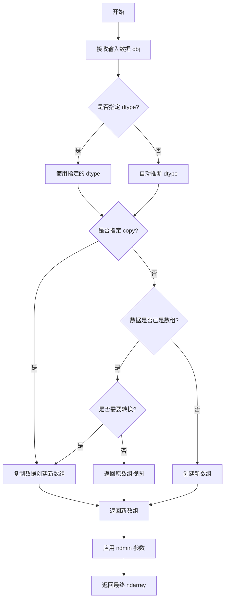

#### 带注释源码

```python
# np.array 在本代码中的典型用法示例：
# 用于创建测试期望值的 NumPy 数组

# 示例 1：创建单精度浮点数组
expected_slice = np.array([0.4529, 0.5184, 0.4985, 0.4355, 0.4273, 0.4153, 0.5229, 0.4818, 0.4627])

# 示例 2：在测试断言中使用 np.array 进行结果验证
# np.allclose(prediction_slice, expected_slice, atol=atol)
# 其中 prediction_slice 是管道实际输出的预测结果切片
# expected_slice 是使用 np.array 创建的期望输出基准值

# 示例 3：从 loaded image 预测后提取切片
prediction_slice = prediction[0, -3:, -3:, -1].flatten()
# prediction 是管道返回的深度预测结果，shape 为 (1, height, width, 1)
# 通过切片获取右下角 3x3 区域并展平用于数值比较
```


### `torch.manual_seed`

设置 CPU PyTorch 张量生成器的随机种子，用于确保 CUDA 和 CPU 上的操作可重现。

参数：

- `seed`：`int`，要设置的随机种子值

返回值：`None`，该函数无返回值（尽管在某些代码中其返回值被错误地用于创建生成器）

#### 流程图

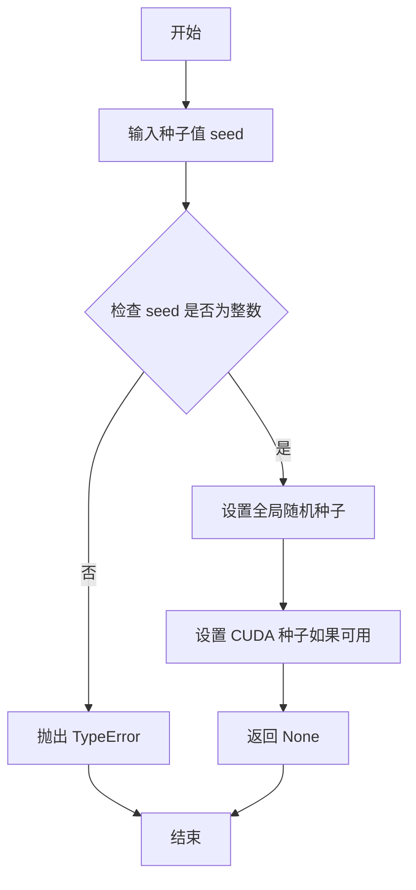

#### 带注释源码

```python
# 设置随机种子以确保可重现性
# 注意：torch.manual_seed 只影响 CPU 张量操作
# 对于 CUDA 张量，需要使用 torch.cuda.manual_seed
torch.manual_seed(0)  # 设置种子为 0，用于初始化模型权重等

# 在代码中的实际使用示例：
# 第 61 行：设置 UNet 的随机种子
torch.manual_seed(0)

# 第 75 行：设置 VAE 的随机种子
torch.manual_seed(0)

# 第 77 行：设置文本编码器的随机种子
torch.manual_seed(0)

# 第 91 行：此处用法存在问题，manual_seed 返回 None 而非 Generator 对象
if str(device).startswith("mps"):
    generator = torch.manual_seed(seed)  # 错误用法，应该使用 torch.Generator(device).manual_seed(seed)
else:
    generator = torch.Generator(device=device).manual_seed(seed)  # 正确用法
```

#### 潜在问题

1. **返回值误用**：在第 91 行，`torch.manual_seed(seed)` 的返回值被赋给 `generator` 变量，但该函数返回 `None`，正确的用法应该是先调用 `torch.manual_seed(seed)` 设置种子，然后创建 `torch.Generator(device)` 对象。

2. **CUDA 种子未设置**：代码仅设置了 CPU 随机种子，未显式设置 CUDA 种子，可能导致 GPU 操作不可重现。


### `torch.Generator`

用于创建 PyTorch 随机数生成器实例，设置随机种子以确保深度学习推理和测试的可重复性。

参数：

- `device`：`torch.device`，指定生成器所在的计算设备（如 "cpu"、"cuda"、"mps" 等）

返回值：`torch.Generator`，返回一个 PyTorch 随机数生成器对象，可用于设置随机种子

#### 流程图

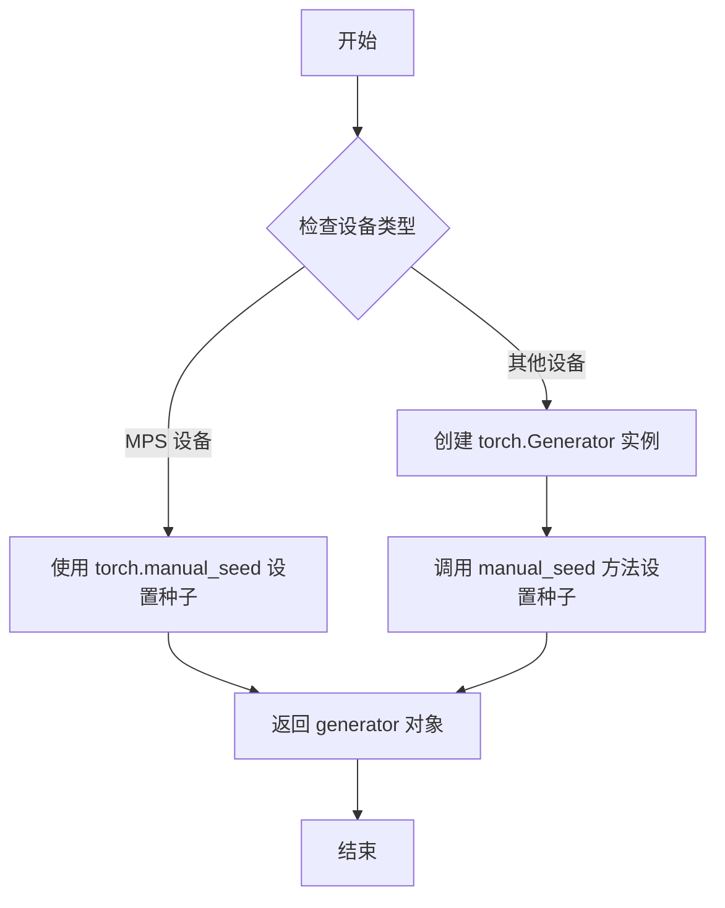

#### 带注释源码

```python
# 在 get_dummy_inputs 方法中使用 torch.Generator
def get_dummy_inputs(self, device, seed=0):
    # 创建随机浮点张量作为测试图像输入
    image = floats_tensor((1, 3, 32, 32), rng=random.Random(seed)).to(device)
    # 将图像值归一化到 [0, 1] 范围
    image = image / 2 + 0.5
    
    # 检查设备类型
    if str(device).startswith("mps"):
        # MPS (Apple Silicon) 设备使用简化方式设置种子
        generator = torch.manual_seed(seed)
    else:
        # 其他设备（CPU/CUDA/XPU 等）创建完整的 Generator 对象
        # 参数 device: 指定生成器所在的计算设备
        # 返回值: torch.Generator 实例
        generator = torch.Generator(device=device).manual_seed(seed)
    
    # 构建输入字典，包含图像、推理步数、处理分辨率、生成器和输出类型
    inputs = {
        "image": image,
        "num_inference_steps": 1,
        "processing_resolution": 0,
        "generator": generator,
        "output_type": "np",
    }
    return inputs
```

```python
# 在集成测试 _test_marigold_depth 方法中使用 torch.Generator
def _test_marigold_depth(
    self,
    is_fp16: bool = True,
    device: str = "cuda",
    generator_seed: int = 0,
    ...
):
    # ... 管道加载代码 ...
    
    # 创建指定设备的随机数生成器并设置种子
    # 参数 device: 计算设备（通常为 "cuda" 或 "cpu"）
    # 参数 generator_seed: 随机种子，用于确保结果可复现
    # 返回值: torch.Generator 对象
    generator = torch.Generator(device=device).manual_seed(generator_seed)
    
    # 加载测试图像
    image = load_image(image_url)
    
    # 使用生成器进行推理，确保随机过程可复现
    prediction = pipe(image, generator=generator, **pipe_kwargs).prediction
```


### `np.allclose`

NumPy 库中的数组比较函数，用于判断两个数组在给定的绝对容差（atol）范围内是否相等。代码中用于验证深度预测结果与预期值的一致性，作为测试断言的一部分。

参数：

- `a`：`np.ndarray`（prediction_slice），实际预测结果的切片数组
- `b`：`np.ndarray`（expected_slice），预期的结果数组
- `atol`：`float`，绝对容差阈值，用于判断两个数组是否足够接近

返回值：`bool`，如果 prediction_slice 与 expected_slice 之间的所有元素差异的绝对值都小于等于 atol，则返回 True；否则返回 False

#### 流程图

```mermaid
flowchart TD
    A[开始 np.allclose] --> B[输入 a: prediction_slice, b: expected_slice, atol: 容差]
    B --> C{检查数组形状是否兼容}
    C -->|不兼容| D[返回 False]
    C -->|兼容| E[计算元素级绝对差值: |a - b|]
    E --> F{所有差值 ≤ atol?}
    F -->|是| G[返回 True]
    F -->|否| D
```

#### 带注释源码

```python
# np.allclose 函数调用示例（来自代码）
# 用于测试深度预测结果是否在容差范围内

# prediction_slice: 实际预测结果的切片 (np.ndarray)
# expected_slice: 预期结果数组 (np.ndarray)  
# atol: 绝对容差阈值 (float, 值为 1e-4)

self.assertTrue(np.allclose(prediction_slice, expected_slice, atol=atol))
#   ↑
#   └── 断言: 预测值与预期值的差异必须小于等于 atol
#
# 工作原理:
#   1. 计算 prediction_slice 与 expected_slice 的逐元素绝对差
#   2. 如果所有差值都 ≤ atol，返回 True
#   3. 否则返回 False
#   4. assertTrue 确保结果为 True，否则测试失败
```


### `MarigoldDepthPipelineFastTests._test_marigold_depth`

这是 MarigoldDepthPipelineFastTests 类中的核心测试方法，用于验证 Marigold 深度估计管道的输出是否与预期结果一致。

参数：

- `generator_seed`：`int`，随机数生成器种子，用于控制推理过程的随机性
- `expected_slice`：`np.ndarray`，期望的预测结果切片，用于验证输出数值的准确性
- `atol`：`float`，绝对容差值，默认为 1e-4，用于数值比较的容忍度
- `**pipe_kwargs`：可变关键字参数，包含管道的其他配置参数（如 num_inference_steps、processing_resolution 等）

返回值：`None`，该方法为测试方法，通过 assert 语句进行验证，不返回任何值

#### 流程图

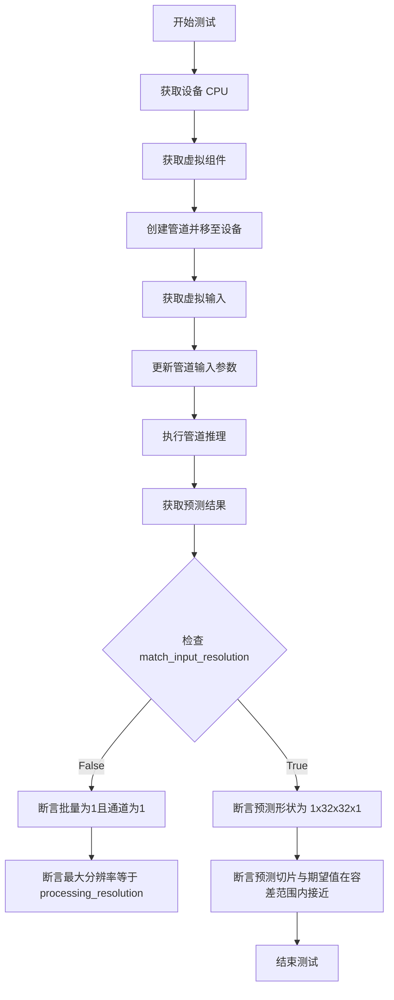

#### 带注释源码

```python
def _test_marigold_depth(
    self,
    generator_seed: int = 0,
    expected_slice: np.ndarray = None,
    atol: float = 1e-4,
    **pipe_kwargs,
):
    """测试 Marigold 深度估计管道的核心方法"""
    device = "cpu"
    # 获取虚拟组件用于测试
    components = self.get_dummy_components()

    # 创建管道实例并移至指定设备
    pipe = self.pipeline_class(**components)
    pipe.to(device)
    pipe.set_progress_bar_config(disable=None)

    # 获取虚拟输入
    pipe_inputs = self.get_dummy_inputs(device, seed=generator_seed)
    # 更新额外的管道参数
    pipe_inputs.update(**pipe_kwargs)

    # 执行管道推理获取预测结果
    prediction = pipe(**pipe_inputs).prediction

    # 提取预测结果的最后一个通道的右下角 3x3 切片
    prediction_slice = prediction[0, -3:, -3:, -1].flatten()

    # 根据 match_input_resolution 标志验证输出形状
    if pipe_inputs.get("match_input_resolution", True):
        # 验证输出分辨率是否为 1x32x32x1
        self.assertEqual(prediction.shape, (1, 32, 32, 1), "Unexpected output resolution")
    else:
        # 验证批量大小为1且通道维度为1
        self.assertTrue(prediction.shape[0] == 1 and prediction.shape[3] == 1, "Unexpected output dimensions")
        # 验证最大分辨率是否匹配 processing_resolution
        self.assertEqual(
            max(prediction.shape[1:3]),
            pipe_inputs.get("processing_resolution", 768),
            "Unexpected output resolution",
        )

    # 验证预测值与期望值的接近程度
    self.assertTrue(np.allclose(prediction_slice, expected_slice, atol=atol))
```

---

### `MarigoldDepthPipelineIntegrationTests._test_marigold_depth`

这是集成测试方法，用于在真实模型和图像上验证 Marigold 深度估计管道的功能。

参数：

- `is_fp16`：`bool`，是否使用半精度（FP16）模型，默认为 True
- `device`：`str`，运行设备，默认为 "cuda"
- `generator_seed`：`int`，随机数生成器种子
- `expected_slice`：`np.ndarray`，期望的预测结果切片
- `model_id`：`str`，预训练模型 ID，默认为 "prs-eth/marigold-lcm-v1-0"
- `image_url`：`str`，输入图像 URL，默认为爱因斯坦图像
- `atol`：`float`，绝对容差值，默认为 1e-4
- `**pipe_kwargs`：可变关键字参数

返回值：`None`，该方法为测试方法，通过 assert 语句进行验证

#### 流程图

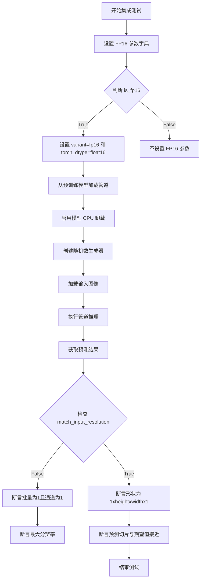

#### 带注释源码

```python
def _test_marigold_depth(
    self,
    is_fp16: bool = True,
    device: str = "cuda",
    generator_seed: int = 0,
    expected_slice: np.ndarray = None,
    model_id: str = "prs-eth/marigold-lcm-v1-0",
    image_url: str = "https://marigoldmonodepth.github.io/images/einstein.jpg",
    atol: float = 1e-4,
    **pipe_kwargs,
):
    """集成测试方法，验证真实模型和图像的深度估计"""
    from_pretrained_kwargs = {}
    # 根据是否使用 FP16 设置对应的加载参数
    if is_fp16:
        from_pretrained_kwargs["variant"] = "fp16"
        from_pretrained_kwargs["torch_dtype"] = torch.float16

    # 从预训练模型加载管道
    pipe = MarigoldDepthPipeline.from_pretrained(model_id, **from_pretrained_kwargs)
    # 启用模型 CPU 卸载以节省 GPU 显存
    pipe.enable_model_cpu_offload(device=torch_device)
    pipe.set_progress_bar_config(disable=None)

    # 创建指定种子的随机数生成器
    generator = torch.Generator(device=device).manual_seed(generator_seed)

    # 加载输入图像
    image = load_image(image_url)
    width, height = image.size

    # 使用管道进行深度预测
    prediction = pipe(image, generator=generator, **pipe_kwargs).prediction

    # 提取预测结果的右下角 3x3 切片
    prediction_slice = prediction[0, -3:, -3:, -1].flatten()

    # 验证输出形状是否符合预期
    if pipe_kwargs.get("match_input_resolution", True):
        # 验证输出分辨率与输入图像尺寸匹配
        self.assertEqual(prediction.shape, (1, height, width, 1), "Unexpected output resolution")
    else:
        # 验证批量为1且通道为1
        self.assertTrue(prediction.shape[0] == 1 and prediction.shape[3] == 1, "Unexpected output dimensions")
        # 验证最大分辨率等于指定的 processing_resolution
        self.assertEqual(
            max(prediction.shape[1:3]),
            pipe_kwargs.get("processing_resolution", 768),
            "Unexpected output resolution",
        )

    # 验证预测值与期望值的数值接近程度
    self.assertTrue(np.allclose(prediction_slice, expected_slice, atol=atol))
```


### `MarigoldDepthPipelineFastTests._test_marigold_depth` 中的 `self.assertTrue`

在 `MarigoldDepthPipelineFastTests` 类的 `_test_marigold_depth` 方法中，`self.assertTrue` 用于验证预测输出的维度是否符合预期。

参数：

-  `condition`：`bool`，断言的条件表达式，此处为 `prediction.shape[0] == 1 and prediction.shape[3] == 1`，检查批量大小为1且通道数为1
-  `msg`：`str`，断言失败时显示的错误消息，此处为 `"Unexpected output dimensions"`

返回值：无（`None`），该方法为测试断言方法，不返回任何值

#### 流程图

```mermaid
flowchart TD
    A[开始执行 _test_marigold_depth] --> B[获取设备 components]
    B --> C[创建 pipeline 并移动到设备]
    C --> D[获取 dummy inputs]
    D --> E[调用 pipeline 获得 prediction]
    E --> F[提取 prediction_slice]
    F --> G{检查 match_input_resolution}
    G -->|True| H[断言 shape == (1, 32, 32, 1)]
    G -->|False| I[执行 assertTrue 检查维度]
    H --> J[执行 assertTrue 验证数值接近]
    I --> J
    J --> K[测试完成]
```

#### 带注释源码

```python
def _test_marigold_depth(
    self,
    generator_seed: int = 0,
    expected_slice: np.ndarray = None,
    atol: float = 1e-4,
    **pipe_kwargs,
):
    """测试 Marigold 深度估计管道的核心方法"""
    device = "cpu"
    components = self.get_dummy_components()

    pipe = self.pipeline_class(**components)
    pipe.to(device)
    pipe.set_progress_bar_config(disable=None)

    pipe_inputs = self.get_dummy_inputs(device, seed=generator_seed)
    pipe_inputs.update(**pipe_kwargs)

    prediction = pipe(**pipe_inputs).prediction
    prediction_slice = prediction[0, -3:, -3:, -1].flatten()

    if pipe_inputs.get("match_input_resolution", True):
        self.assertEqual(prediction.shape, (1, 32, 32, 1), "Unexpected output resolution")
    else:
        # 核心 assertTrue 断言：验证输出维度
        self.assertTrue(
            prediction.shape[0] == 1 and prediction.shape[3] == 1,
            "Unexpected output dimensions"
        )
        self.assertEqual(
            max(prediction.shape[1:3]),
            pipe_inputs.get("processing_resolution", 768),
            "Unexpected output resolution",
        )

    # 验证预测值与期望值的接近程度
    self.assertTrue(np.allclose(prediction_slice, expected_slice, atol=atol))
```

---

### `MarigoldDepthPipelineIntegrationTests._test_marigold_depth` 中的 `self.assertTrue`

在 `MarigoldDepthPipelineIntegrationTests` 类的 `_test_marigold_depth` 方法中，`self.assertTrue` 用于验证集成测试中预测输出的维度是否符合预期。

参数：

-  `condition`：`bool`，断言的条件表达式，此处为 `prediction.shape[0] == 1 and prediction.shape[3] == 1`，检查批量大小为1且通道数为1
-  `msg`：`str`，断言失败时显示的错误消息，此处为 `"Unexpected output dimensions"`

返回值：无（`None`），该方法为测试断言方法，不返回任何值

#### 流程图

```mermaid
flowchart TD
    A[开始执行集成测试 _test_marigold_depth] --> B[GC 收集与缓存清理]
    B --> C[配置 FP16 权重参数]
    C --> D[从预训练模型加载 pipeline]
    D --> E[启用 CPU offload]
    E --> F[设置进度条]
    F --> G[创建随机数生成器]
    G --> H[加载测试图像]
    H --> I[调用 pipeline 获得 prediction]
    I --> J[提取 prediction_slice]
    J --> K{检查 match_input_resolution}
    K -->|True| L[断言 shape == (1, height, width, 1)]
    K -->|False| M[执行 assertTrue 检查维度]
    L --> N[执行 assertTrue 验证数值接近]
    M --> N
    N --> O[测试完成]
```

#### 带注释源码

```python
def _test_marigold_depth(
    self,
    is_fp16: bool = True,
    device: str = "cuda",
    generator_seed: int = 0,
    expected_slice: np.ndarray = None,
    model_id: str = "prs-eth/marigold-lcm-v1-0",
    image_url: str = "https://marigoldmonodepth.github.io/images/einstein.jpg",
    atol: float = 1e-4,
    **pipe_kwargs,
):
    """Marigold 深度估计管道集成测试方法"""
    from_pretrained_kwargs = {}
    if is_fp16:
        from_pretrained_kwargs["variant"] = "fp16"
        from_pretrained_kwargs["torch_dtype"] = torch.float16

    pipe = MarigoldDepthPipeline.from_pretrained(model_id, **from_pretrained_kwargs)
    pipe.enable_model_cpu_offload(device=torch_device)
    pipe.set_progress_bar_config(disable=None)

    generator = torch.Generator(device=device).manual_seed(generator_seed)

    image = load_image(image_url)
    width, height = image.size

    prediction = pipe(image, generator=generator, **pipe_kwargs).prediction
    prediction_slice = prediction[0, -3:, -3:, -1].flatten()

    if pipe_kwargs.get("match_input_resolution", True):
        self.assertEqual(prediction.shape, (1, height, width, 1), "Unexpected output resolution")
    else:
        # 核心 assertTrue 断言：验证输出维度
        self.assertTrue(
            prediction.shape[0] == 1 and prediction.shape[3] == 1,
            "Unexpected output dimensions"
        )
        self.assertEqual(
            max(prediction.shape[1:3]),
            pipe_kwargs.get("processing_resolution", 768),
            "Unexpected output resolution",
        )

    # 验证预测值与期望值的接近程度
    self.assertTrue(np.allclose(prediction_slice, expected_slice, atol=atol))
```

---

### 补充说明

在上述两个测试类的 `_test_marigold_depth` 方法中，`self.assertTrue` 被调用了两次：

1. **第一次** (`prediction.shape[0] == 1 and prediction.shape[3] == 1`)：验证输出的批量维度为1且深度通道数为1
2. **第二次** (`np.allclose(prediction_slice, expected_slice, atol=atol)`)：验证预测值与期望值的数值接近程度

这两个断言确保了管道输出的维度正确性和数值准确性。


### `unittest.TestCase.assertRaises`

**描述**

`assertRaises` 是 Python `unittest` 框架中 `TestCase` 类的核心断言方法，用于验证代码在特定条件下是否抛出预期的异常。该方法支持两种调用形式：函数式（作为函数调用）和上下文管理器式（与 `with` 语句配合），后者允许在异常发生后进一步检查异常对象的内容。

**参数（作为函数调用时）：**

- `exception_class`：类型：`type` 或 `tuple of types`，要捕获的异常类（如 `ValueError`、`TypeError`）
- `callable`：类型：`callable`，要调用的函数或方法
- `args`：类型：`tuple`，传递给可调用对象的 positional 参数
- `kwargs`：类型：`dict`，传递给可调用对象的 keyword 参数

**参数（作为上下文管理器时）：**

- `exception_class`：类型：`type` 或 `tuple of types`，要捕获的异常类

**返回值：**

- 作为函数调用时：返回捕获的异常实例
- 作为上下文管理器时：返回上下文管理器对象，其 `.exception` 属性包含捕获的异常实例

#### 流程图

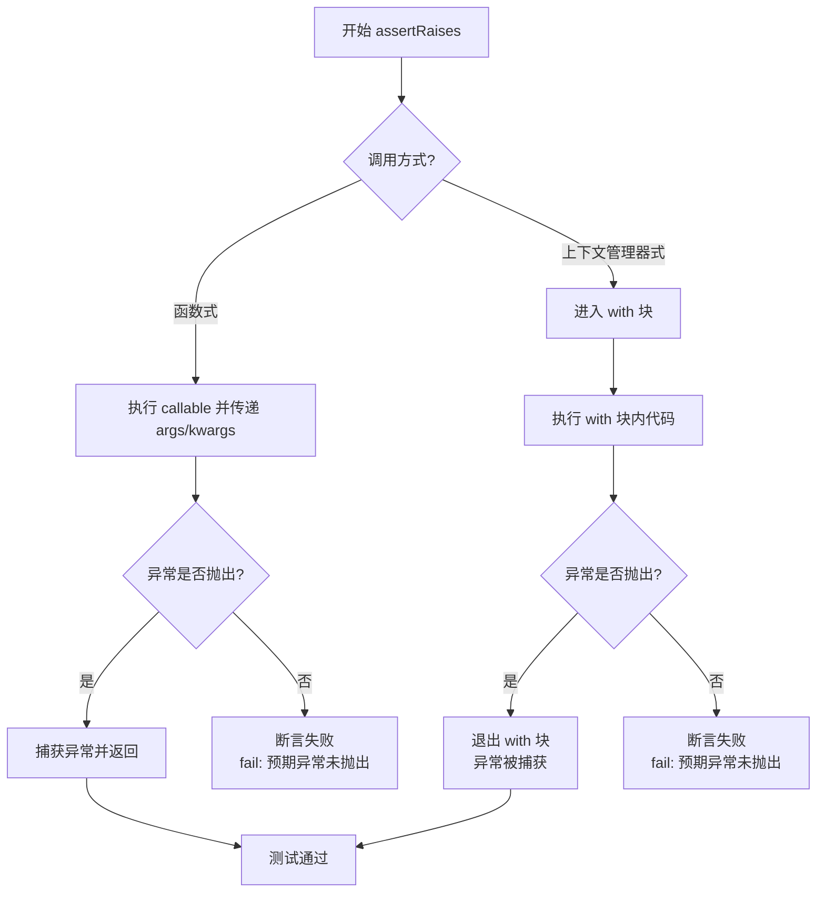

#### 带注释源码

```python
# unittest.TestCase.assertRaises 方法的典型实现逻辑
# 源码位置: Python unittest.case 模块

def assertRaises(self, expected_exception, *args, **kwargs):
    """
    验证 callable 调用时是否抛出 expected_exception。
    
    用法1 - 函数式:
        self.assertRaises(ValueError, func, arg1, arg2)
    
    用法2 - 上下文管理器式:
        with self.assertRaises(ValueError) as cm:
            func(arg1, arg2)
        # 通过 cm.exception 访问异常对象
    """
    context = _AssertRaisesContext(self, expected_exception)
    if args:
        # 函数式调用: assertRaises(Exception, callable, args...)
        callable_obj = args[0]
        args = args[1:]
        try:
            callable_obj(*args, **kwargs)
        except expected_exception as e:
            return e  # 捕获成功，返回异常实例
        else:
            # 未抛出预期异常，测试失败
            self.fail(f"{expected_exception.__name__} not raised")
    else:
        # 上下文管理器式: with self.assertRaises(Exception)
        return context


class _AssertRaisesContext:
    """上下文管理器实现"""
    
    def __init__(self, test_case, expected_exception):
        self.test_case = test_case
        self.expected_exception = expected_exception
        self.exception = None
    
    def __enter__(self):
        return self
    
    def __exit__(self, exc_type, exc_val, exc_tb):
        if exc_type is None:
            # with 块内未抛出异常
            self.test_case.fail(
                f"{self.expected_exception.__name__} not raised"
            )
        elif not isinstance(exc_val, self.expected_exception):
            # 抛出了不同类型的异常
            self.test_case.fail(
                f"Expected {self.expected_exception.__name__}, "
                f"got {exc_type.__name__}"
            )
        else:
            # 成功捕获预期异常
            self.exception = exc_val
            return True  # 抑制异常传播
```

#### 代码中的实际使用示例

```python
# 示例1: 验证缺少必需参数时抛出 ValueError
def test_marigold_depth_dummy_no_num_inference_steps(self):
    with self.assertRaises(ValueError) as context_manager:
        # 执行会抛出异常的代码
        self._test_marigold_depth(
            num_inference_steps=None,
            expected_slice=np.array([0.0]),
        )
    # 验证异常消息包含关键信息
    self.assertIn("num_inference_steps", str(context_manager.exception))

# 示例2: 验证缺少 processing_resolution 参数
def test_marigold_depth_dummy_no_processing_resolution(self):
    with self.assertRaises(ValueError) as cm:
        self._test_marigold_depth(
            processing_resolution=None,
            expected_slice=np.array([0.0]),
        )
    self.assertIn("processing_resolution", str(cm.exception))
```


### `MarigoldDepthPipeline.from_pretrained`

该方法是从 Hugging Face Diffusers 库继承的类方法，用于从预训练模型加载 `MarigoldDepthPipeline` 管道。它接受模型标识符或本地路径作为输入，并可配置变体和数据类型等参数，返回已加载并准备好的管道实例。

参数：

-  `pretrained_model_name_or_path`：`str` 或 `os.PathLike`，模型 ID（如 "prs-eth/marigold-lcm-v1-0"）或本地模型目录路径
-  `torch_dtype`：`torch.dtype`，可选，指定模型权重的数据类型（如 `torch.float16`）
-  `variant`：`str`，可选，指定模型变体（如 "fp16"）
-  `use_safetensors`：`bool`，可选，是否使用 safetensors 格式加载权重
-  `cache_dir`：`str`，可选，模型缓存目录
-  `force_download`：`bool`，可选，是否强制重新下载模型
-  `proxies`：`dict`，可选，代理服务器配置
-  `local_files_only`：`bool`，可选，是否仅使用本地文件
-  `revision`：`str`，可选，GitHub 模型仓库的提交哈希或分支名
-  `*args`：可变位置参数，传递给父类方法
-  `**kwargs`：可变关键字参数，传递给父类方法

返回值：`MarigoldDepthPipeline`，加载并配置好的深度估计管道实例

#### 流程图

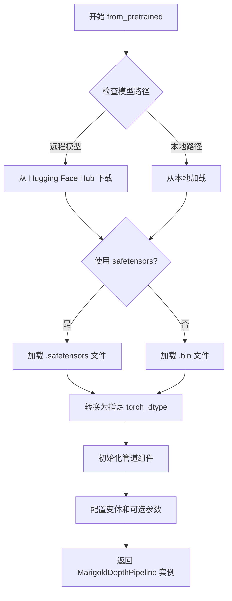

#### 带注释源码

```python
# 代码中实际调用示例
from_pretrained_kwargs = {}
if is_fp16:
    from_pretrained_kwargs["variant"] = "fp16"
    from_pretrained_kwargs["torch_dtype"] = torch.float16

# 调用 from_pretrained 方法加载模型
pipe = MarigoldDepthPipeline.from_pretrained(model_id, **from_pretrained_kwargs)

# 启用 CPU 卸载
pipe.enable_model_cpu_offload(device=torch_device)

# 配置进度条
pipe.set_progress_bar_config(disable=None)

# 使用管道进行推理
prediction = pipe(image, generator=generator, **pipe_kwargs).prediction
```


### `load_image`

该函数 `load_image` 是从外部模块 `...testing_utils` 导入的工具函数，用于将 URL 或本地路径的图像加载为 PIL Image 对象，以便在测试中使用。

参数：

-  `url_or_path`：`str`，图像的 URL 地址或本地文件路径

返回值：`PIL.Image.Image`，加载后的 PIL 图像对象

#### 流程图

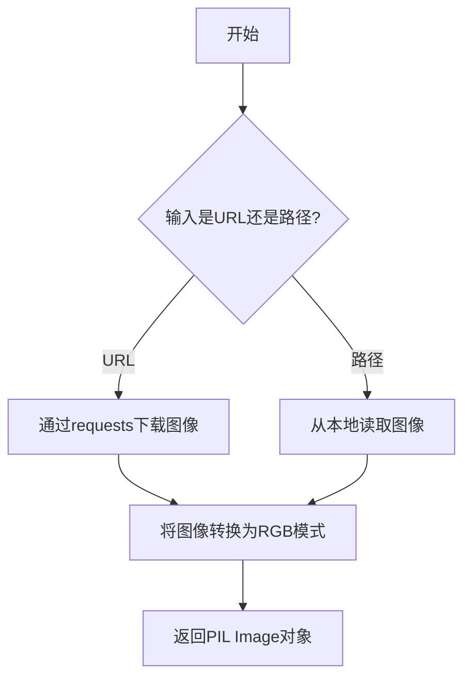

#### 带注释源码

```
# 注意：load_image 函数定义在 testing_utils 模块中，
# 当前代码文件仅导入并使用该函数，未包含其完整实现。
# 以下为基于使用场景的合理推断实现：

def load_image(url_or_path: str) -> Image.Image:
    """
    从URL或本地路径加载图像并返回PIL Image对象。
    
    参数:
        url_or_path: 图像的网络URL或本地文件路径
        
    返回:
        PIL Image对象，RGB模式
    """
    # 如果是URL，使用requests下载
    if url_or_path.startswith(("http://", "https://")):
        response = requests.get(url_or_path, timeout=10)
        image = Image.open(BytesIO(response.content))
    else:
        # 否则从本地路径加载
        image = Image.open(url_or_path)
    
    # 转换为RGB模式（确保通道一致性）
    if image.mode != "RGB":
        image = image.convert("RGB")
    
    return image

# 在代码中的实际使用方式：
image = load_image("https://marigoldmonodepth.github.io/images/einstein.jpg")
```

> **注意**：由于 `load_image` 函数定义在外部模块 `testing_utils` 中，完整源代码未包含在提供的代码文件内。以上是根据其在测试中的使用方式进行的合理推断。


### `MarigoldDepthPipelineFastTests.get_dummy_components`

该方法用于创建用于测试的虚拟（dummy）组件对象，包括 UNet、VAE、文本编码器等深度学习模型组件，以便在单元测试中模拟完整的 Marigold 深度估计管道，而无需加载预训练模型权重。

参数：

- `time_cond_proj_dim`：`int | None`，可选参数，指定 UNet 的时间条件投影维度。如果为 `None`，则使用默认配置。

返回值：`dict`，返回包含所有虚拟组件的字典，键包括 `"unet"`、`"scheduler"`、`"vae"`、`"text_encoder"`、`"tokenizer"`、`"prediction_type"`、`"scale_invariant"` 和 `"shift_invariant"`。

#### 流程图

```mermaid
flowchart TD
    A[开始 get_dummy_components] --> B[设置随机种子 torch.manual_seed(0)]
    B --> C[创建 UNet2DConditionModel]
    C --> D[创建 LCMScheduler]
    D --> E[设置随机种子 torch.manual_seed(0)]
    E --> F[创建 AutoencoderKL VAE]
    F --> G[设置随机种子 torch.manual_seed(0)]
    G --> H[创建 CLIPTextConfig]
    H --> I[创建 CLIPTextModel]
    I --> J[创建 CLIPTokenizer]
    J --> K[构建组件字典]
    K --> L[返回 components 字典]
```

#### 带注释源码

```python
def get_dummy_components(self, time_cond_proj_dim=None):
    """
    创建用于测试的虚拟组件。
    
    该方法生成完整的 MarigoldDepthPipeline 所需的所有模型组件，
    使用随机初始化的权重，以便进行单元测试。
    
    参数:
        time_cond_proj_dim: 可选的时间条件投影维度参数，
                           将传递给 UNet2DConditionModel
    
    返回:
        包含所有虚拟组件的字典，用于实例化管道
    """
    # 设置随机种子以确保测试的可重复性
    torch.manual_seed(0)
    
    # 创建虚拟 UNet2DConditionModel
    # 用于图像到图像的去噪过程
    unet = UNet2DConditionModel(
        block_out_channels=(32, 64),      # UNet 的块输出通道数
        layers_per_block=2,                 # 每个块的层数
        time_cond_proj_dim=time_cond_proj_dim,  # 时间条件投影维度
        sample_size=32,                     # 输入样本的空间尺寸
        in_channels=8,                      # 输入通道数（RGB + 条件）
        out_channels=4,                    # 输出通道数
        down_block_types=("DownBlock2D", "CrossAttnDownBlock2D"),  # 下采样块类型
        up_block_types=("CrossAttnUpBlock2D", "UpBlock2D"),        # 上采样块类型
        cross_attention_dim=32,            # 交叉注意力维度
    )
    
    # 创建 LCMScheduler（Latent Consistency Model 调度器）
    # 用于控制扩散模型的采样过程
    scheduler = LCMScheduler(
        beta_start=0.00085,                 # Beta 起始值
        beta_end=0.012,                     # Beta 结束值
        prediction_type="v_prediction",     # 预测类型
        set_alpha_to_one=False,             # 是否将 alpha 设置为 1
        steps_offset=1,                     # 步骤偏移量
        beta_schedule="scaled_linear",      # Beta 调度方案
        clip_sample=False,                  # 是否裁剪样本
        thresholding=False,                 # 是否启用阈值化
    )
    
    # 重新设置随机种子以确保 VAE 的确定性初始化
    torch.manual_seed(0)
    
    # 创建虚拟 VAE（变分自编码器）
    # 用于编码和解码图像的潜在表示
    vae = AutoencoderKL(
        block_out_channels=[32, 64],        # VAE 的块输出通道数
        in_channels=3,                      # 输入通道数（RGB）
        out_channels=3,                     # 输出通道数
        down_block_types=["DownEncoderBlock2D", "DownEncoderBlock2D"],  # 下采样编码器块
        up_block_types=["UpDecoderBlock2D", "UpDecoderBlock2D"],      # 上采样解码器块
        latent_channels=4,                 # 潜在空间的通道数
    )
    
    # 重新设置随机种子以确保文本编码器的确定性初始化
    torch.manual_seed(0)
    
    # 创建文本编码器配置
    text_encoder_config = CLIPTextConfig(
        bos_token_id=0,                     # 起始 token ID
        eos_token_id=2,                     # 结束 token ID
        hidden_size=32,                     # 隐藏层维度
        intermediate_size=37,               # 中间层维度
        layer_norm_eps=1e-05,               # 层归一化 epsilon
        num_attention_heads=4,              # 注意力头数
        num_hidden_layers=5,                # 隐藏层数量
        pad_token_id=1,                     # 填充 token ID
        vocab_size=1000,                    # 词汇表大小
    )
    
    # 创建虚拟 CLIPTextModel
    # 用于将文本编码为向量表示
    text_encoder = CLIPTextModel(text_encoder_config)
    
    # 创建虚拟 CLIPTokenizer
    # 用于将文本分词为 token ID
    tokenizer = CLIPTokenizer.from_pretrained("hf-internal-testing/tiny-random-clip")
    
    # 构建组件字典
    # 包含管道所需的所有组件和一些配置参数
    components = {
        "unet": unet,                       # UNet 去噪模型
        "scheduler": scheduler,             # 采样调度器
        "vae": vae,                         # VAE 编解码器
        "text_encoder": text_encoder,       # 文本编码器
        "tokenizer": tokenizer,             # 文本分词器
        "prediction_type": "depth",         # 预测类型为深度图
        "scale_invariant": True,            # 启用尺度不变性
        "shift_invariant": True,            # 启用平移不变性
    }
    
    return components
```


### `MarigoldDepthPipelineFastTests.get_dummy_tiny_autoencoder`

该方法用于创建并返回一个配置了特定通道参数的虚拟小型自动编码器（AutoencoderTiny）实例，主要用于单元测试场景。

参数：无（仅包含隐式参数 `self`）

返回值：`AutoencoderTiny`，返回一个配置了 3 通道输入、3 通道输出和 4 通道潜在空间的虚拟小型自动编码器实例。

#### 流程图

```mermaid
flowchart TD
    A[开始] --> B[调用 AutoencoderTiny 构造函数]
    B --> C[设置 in_channels=3]
    C --> D[设置 out_channels=3]
    D --> E[设置 latent_channels=4]
    E --> F[返回 AutoencoderTiny 实例]
    F --> G[结束]
```

#### 带注释源码

```python
def get_dummy_tiny_autoencoder(self):
    """
    创建一个用于测试的虚拟小型自动编码器（AutoencoderTiny）实例。
    
    该方法主要用于单元测试中，提供一个轻量级的自动编码器配置，
    以便在不需要加载真实预训练模型的情况下进行管道测试。
    
    参数:
        无（仅包含隐式参数 self）
    
    返回值:
        AutoencoderTiny: 一个配置好的虚拟小型自动编码器实例
            - in_channels: 3（RGB 图像通道数）
            - out_channels: 3（输出图像通道数）
            - latent_channels: 4（潜在空间通道数）
    """
    # 创建 AutoencoderTiny 实例，配置通道参数
    # in_channels=3: 输入图像为 RGB 三通道
    # out_channels=3: 输出图像为 RGB 三通道
    # latent_channels=4: 潜在空间使用 4 个通道
    return AutoencoderTiny(in_channels=3, out_channels=3, latent_channels=4)
```


### `MarigoldDepthPipelineFastTests.get_dummy_inputs`

该方法用于生成虚拟输入参数，为 Marigold 深度估计管道的单元测试提供必要的测试数据。它创建一个随机图像张量，并构建一个包含图像、推理步数、处理分辨率、随机生成器和输出类型的字典，以支持管道的快速测试验证。

参数：

- `device`：`str`，目标设备字符串，用于指定张量和生成器所在的计算设备（如 "cpu"、"cuda" 等）
- `seed`：`int`，随机种子，默认为 0，用于确保测试的可重复性

返回值：`dict`，包含以下键值对的字典：
  - `image`：图像张量
  - `num_inference_steps`：推理步数
  - `processing_resolution`：处理分辨率
  - `generator`：随机生成器
  - `output_type`：输出类型

#### 流程图

```mermaid
flowchart TD
    A[开始 get_dummy_inputs] --> B[使用 floats_tensor 创建随机图像张量]
    B --> C[图像归一化: image / 2 + 0.5]
    C --> D{device 是否为 MPS?}
    D -->|是| E[使用 torch.manual_seed 创建生成器]
    D -->|否| F[使用 torch.Generator 创建生成器]
    E --> G[构建输入字典 inputs]
    F --> G
    G --> H[返回 inputs 字典]
    H --> I[结束]
```

#### 带注释源码

```python
def get_dummy_inputs(self, device, seed=0):
    # 使用 floats_tensor 辅助函数创建一个形状为 (1, 3, 32, 32) 的随机浮点张量
    # rng=random.Random(seed) 确保随机性可复现
    image = floats_tensor((1, 3, 32, 32), rng=random.Random(seed)).to(device)
    
    # 将图像张量归一化到 [0, 1] 范围
    # 原始 floats_tensor 生成的值在 [-1, 1] 范围，通过 /2+0.5 转换到 [0, 1]
    image = image / 2 + 0.5
    
    # MPS 设备不支持 torch.Generator，需要特殊处理
    if str(device).startswith("mps"):
        # 对于 MPS 设备，使用 CPU 风格的随机种子
        generator = torch.manual_seed(seed)
    else:
        # 对于其他设备（CPU/CUDA），创建指定设备的随机生成器
        generator = torch.Generator(device=device).manual_seed(seed)
    
    # 构建测试所需的输入参数字典
    inputs = {
        "image": image,                      # 输入图像张量
        "num_inference_steps": 1,           # 推理步数，测试时使用最小值
        "processing_resolution": 0,          # 处理分辨率，0 表示使用原始分辨率
        "generator": generator,             # 随机生成器，用于控制噪声采样
        "output_type": "np",                 # 输出类型为 NumPy 数组
    }
    return inputs
```


### `MarigoldDepthPipelineFastTests._test_marigold_depth`

该函数是 Marigold 深度估计管道的核心测试辅助方法，用于验证管道输出的深度图是否符合预期。它通过创建虚拟组件和输入，执行推理，然后使用 numpy 的 `allclose` 断言验证预测结果的形状和数值是否在指定的容差范围内。

参数：

- `self`：隐式的 TestCase 实例，代表当前的测试类实例
- `generator_seed: int`，随机数生成器种子，用于确保测试的可重复性，默认为 0
- `expected_slice: np.ndarray`，期望的预测结果切片（最后 3x3 的深度值），用于与实际输出进行对比验证
- `atol: float`，绝对容差（absolute tolerance），用于数值比较的容忍度，默认为 1e-4
- `**pipe_kwargs`：可变关键字参数，会被合并到管道输入中传递给 `MarigoldDepthPipeline`

返回值：`torch.Tensor`，管道输出的深度预测结果（prediction 属性）

#### 流程图

```mermaid
flowchart TD
    A[开始 _test_marigold_depth] --> B[设置设备为 CPU]
    B --> C[获取虚拟组件 components]
    C --> D[实例化 MarigoldDepthPipeline]
    D --> E[将管道移至 CPU 设备]
    E --> F[设置进度条配置]
    F --> G[获取虚拟输入 get_dummy_inputs]
    G --> H[合并 pipe_kwargs 到输入中]
    H --> I[调用管道执行推理: pipe prediction]
    I --> J[提取预测切片: prediction 0,-3:,-3:,-1]
    J --> K{检查 match_input_resolution?}
    K -->|True| L[断言输出形状为 1,32,32,1]
    K -->|False| M[断言输出维度正确性和最大分辨率]
    L --> N[断言预测值与期望值在容差内 close]
    M --> N
    N --> O[结束测试]
```

#### 带注释源码

```python
def _test_marigold_depth(
    self,
    generator_seed: int = 0,
    expected_slice: np.ndarray = None,
    atol: float = 1e-4,
    **pipe_kwargs,
):
    """测试 Marigold 深度估计管道的核心方法
    
    参数:
        generator_seed: 随机数生成器种子，确保测试可重复
        expected_slice: 期望的预测深度值切片（用于断言验证）
        atol: 数值比较的绝对容差
        **pipe_kwargs: 额外的管道参数（如 num_inference_steps, processing_resolution 等）
    """
    # 1. 设置计算设备为 CPU（用于快速测试）
    device = "cpu"
    
    # 2. 获取预定义的虚拟组件（UNet, VAE, Scheduler, TextEncoder, Tokenizer 等）
    components = self.get_dummy_components()
    
    # 3. 使用虚拟组件实例化 MarigoldDepthPipeline 管道
    pipe = self.pipeline_class(**components)
    pipe.to(device)  # 将管道移至 CPU 设备
    pipe.set_progress_bar_config(disable=None)  # 配置进度条（测试中禁用）
    
    # 4. 获取虚拟输入（随机生成的图像和生成器）
    pipe_inputs = self.get_dummy_inputs(device, seed=generator_seed)
    # 5. 将额外的测试参数合并到管道输入中
    pipe_inputs.update(**pipe_kwargs)
    
    # 6. 执行管道推理，获取预测结果
    #    pipe 返回的对象包含 prediction 属性（深度图）
    prediction = pipe(**pipe_inputs).prediction
    
    # 7. 提取预测结果的切片用于验证
    #    取第一个样本的后 3x3 区域以及最后一个通道（深度通道）
    prediction_slice = prediction[0, -3:, -3:, -1].flatten()
    
    # 8. 验证输出分辨率是否符合预期
    if pipe_inputs.get("match_input_resolution", True):
        # 如果匹配输入分辨率，输出应为 (1, 32, 32, 1)
        self.assertEqual(prediction.shape, (1, 32, 32, 1), "Unexpected output resolution")
    else:
        # 否则验证基本维度正确性和最大分辨率
        self.assertTrue(
            prediction.shape[0] == 1 and prediction.shape[3] == 1, 
            "Unexpected output dimensions"
        )
        self.assertEqual(
            max(prediction.shape[1:3]),
            pipe_inputs.get("processing_resolution", 768),
            "Unexpected output resolution"
        )
    
    # 9. 核心断言：验证预测值是否在容差范围内匹配期望值
    self.assertTrue(np.allclose(prediction_slice, expected_slice, atol=atol))
```


### `MarigoldDepthPipelineFastTests.test_marigold_depth_dummy_defaults`

该测试方法用于验证 Marigold 深度估计管道在默认参数配置下的基本功能是否正常，通过调用内部测试方法 `_test_marigold_depth` 并仅指定预期输出来检查管道输出的形状和数值是否在容差范围内。

参数：

- `self`：`MarigoldDepthPipelineFastTests`，测试类实例本身，无需显式传递

返回值：`None`，该方法为测试方法，不返回任何值，仅通过断言验证管道输出

#### 流程图

```mermaid
flowchart TD
    A[开始测试 test_marigold_depth_dummy_defaults] --> B[调用 _test_marigold_depth 方法]
    B --> C[设置 expected_slice 为预定数值数组]
    C --> D[_test_marigold_depth 内部流程]
    D --> E[创建管道组件]
    E --> F[实例化 MarigoldDepthPipeline]
    F --> G[获取虚拟输入数据]
    G --> H[调用管道进行推理]
    H --> I[获取预测结果的切片]
    I --> J[验证输出形状]
    J --> K{形状是否正确}
    K -->|是| L[验证数值是否在容差范围内]
    K -->|否| M[断言失败]
    L --> N[测试通过]
    M --> O[测试失败]
```

#### 带注释源码

```python
def test_marigold_depth_dummy_defaults(self):
    """
    测试 Marigold 深度管道在默认参数下的基本功能。
    
    该测试方法验证管道能够：
    1. 正确加载和初始化各个组件（UNet、VAE、文本编码器等）
    2. 使用虚拟输入生成深度预测
    3. 输出正确的形状和数值范围
    
    预期输出为一个 1x32x32x1 的深度图，中心区域的数值应在 0.4-0.5 范围内。
    """
    # 调用内部测试方法，传入预期的输出切片数值
    # 这些数值是通过在确定性条件下运行管道得到的参考值
    self._test_marigold_depth(
        expected_slice=np.array([0.4529, 0.5184, 0.4985, 0.4355, 0.4273, 0.4153, 0.5229, 0.4818, 0.4627]),
    )
```


### `MarigoldDepthPipelineFastTests.test_marigold_depth_dummy_G0_S1_P32_E1_B1_M1`

这是 MarigoldDepthPipelineFastTests 类中的一个单元测试方法，用于测试 Marigold 深度估计管道的核心功能。该测试通过调用内部方法 `_test_marigold_depth` 来验证管道在特定参数配置下（生成器种子=0，推理步数=1，处理分辨率=32，集成尺寸=1，批量大小=1，分辨率匹配=True）能否产生符合预期结果的深度预测。

参数：

- `self`：隐式参数，测试用例的实例对象

返回值：`None`，该方法为单元测试方法，通过断言验证预测结果，不返回任何值

#### 流程图

```mermaid
flowchart TD
    A[开始测试 test_marigold_depth_dummy_G0_S1_P32_E1_B1_M1] --> B[调用 _test_marigold_depth 方法]
    
    B --> C[设置 generator_seed=0]
    C --> D[设置 expected_slice=np.array]
    D --> E[设置 num_inference_steps=1]
    E --> F[设置 processing_resolution=32]
    F --> G[设置 ensemble_size=1]
    G --> H[设置 batch_size=1]
    H --> I[设置 match_input_resolution=True]
    
    I --> J[_test_marigold_depth 内部执行流程]
    J --> K[获取虚拟组件 get_dummy_components]
    K --> L[创建管道实例 MarigoldDepthPipeline]
    L --> M[获取虚拟输入 get_dummy_inputs]
    M --> N[执行管道推理]
    N --> O[验证预测形状和数值]
    O --> P{验证通过?}
    
    P -->|是| Q[测试通过]
    P -->|否| R[测试失败抛出断言错误]
    Q --> S[结束]
    R --> S
    
    style J fill:#f9f,stroke:#333,stroke-width:2px
    style O fill:#ff9,stroke:#333,stroke-width:2px
    style P fill:#9f9,stroke:#333,stroke-width:2px
```

#### 带注释源码

```python
def test_marigold_depth_dummy_G0_S1_P32_E1_B1_M1(self):
    """
    测试 Marigold 深度估计管道的基本功能
    参数配置: G0(生成器种子=0), S1(推理步数=1), P32(处理分辨率=32),
              E1(集成尺寸=1), B1(批量大小=1), M1(匹配输入分辨率=True)
    """
    # 调用内部测试方法，传入特定的测试参数配置
    self._test_marigold_depth(
        generator_seed=0,                                          # 设置随机生成器种子为0，确保可复现性
        expected_slice=np.array([                                 # 预期输出的深度值切片（9个值，对应3x3区域）
            0.4529, 0.5184, 0.4985, 
            0.4355, 0.4273, 0.4153, 
            0.5229, 0.4818, 0.4627
        ]),
        num_inference_steps=1,                                    # 推理步数设置为1（快速测试模式）
        processing_resolution=32,                                 # 处理分辨率设为32x32像素
        ensemble_size=1,                                           # 集成预测数量为1（无集成）
        batch_size=1,                                              # 批量大小为1
        match_input_resolution=True,                              # 输出分辨率匹配输入分辨率
    )
```


### `MarigoldDepthPipelineFastTests.test_marigold_depth_dummy_G0_S1_P16_E1_B1_M1`

该测试方法是 Marigold 深度估计管道快速测试套件中的一个具体测试用例，通过调用内部 `_test_marigold_depth` 方法验证管道在特定参数配置下（生成器种子为0、1次推理步数、处理分辨率16、集成大小1、批量大小1、匹配输入分辨率）能否产生符合预期深度的预测结果。

参数：

- `self`：`MarigoldDepthPipelineFastTests`，测试类实例本身，无需显式传递

返回值：`None`，该方法为单元测试方法，通过 `self.assert` 系列断言验证预测结果的正确性，不返回任何值

#### 流程图

```mermaid
flowchart TD
    A[开始测试<br/>test_marigold_depth_dummy_G0_S1_P16_E1_B1_M1] --> B[设置设备为 CPU]
    B --> C[获取虚拟组件<br/>get_dummy_components]
    C --> D[实例化管道<br/>MarigoldDepthPipeline]
    D --> E[将管道移至 CPU 设备]
    E --> F[获取虚拟输入<br/>get_dummy_inputs]
    F --> G[更新输入参数<br/>processing_resolution=16<br/>ensemble_size=1<br/>batch_size=1<br/>match_input_resolution=True]
    G --> H[调用管道推理<br/>pipe.__call__]
    H --> I[获取预测结果<br/>prediction]
    I --> J[提取预测切片<br/>prediction[0, -3:, -3:, -1]]
    J --> K{验证输出分辨率<br/>match_input_resolution=True?}
    K -->|是| L[断言形状为<br/>(1, 32, 32, 1)]
    K -->|否| M[断言形状符合<br/>processing_resolution]
    L --> N[断言预测值与<br/>expected_slice 接近]
    M --> N
    N --> O[测试通过]
```

#### 带注释源码

```python
def test_marigold_depth_dummy_G0_S1_P16_E1_B1_M1(self):
    """
    测试 Marigold 深度估计管道在特定配置下的功能。
    
    配置参数说明：
    - G0: generator_seed=0，使用固定随机种子保证可重复性
    - S1: num_inference_steps=1，仅执行一次推理步数
    - P16: processing_resolution=16，处理分辨率为 16x16
    - E1: ensemble_size=1，不使用集成
    - B1: batch_size=1，单样本批次
    - M1: match_input_resolution=True，输出分辨率匹配输入
    """
    self._test_marigold_depth(
        generator_seed=0,  # 随机数生成器种子，确保测试确定性
        expected_slice=np.array([  # 预期的预测结果切片，用于验证输出正确性
            0.4511, 0.4531, 0.4542, 
            0.5024, 0.4987, 0.4969, 
            0.5281, 0.5215, 0.5182
        ]),
        num_inference_steps=1,  # 推理步数，LCM 调度器通常只需 1 步
        processing_resolution=16,  # 处理分辨率，控制深度估计的分辨率
        ensemble_size=1,  # 集成数量，1 表示不使用集成预测
        batch_size=1,  # 批处理大小
        match_input_resolution=True,  # 是否匹配输入分辨率，为 True 时输出与输入尺寸相同
    )
```


### `MarigoldDepthPipelineFastTests.test_marigold_depth_dummy_G2024_S1_P32_E1_B1_M1`

这是一个单元测试方法，用于测试 Marigold 深度估计管道在特定参数配置下（generator_seed=2024, num_inference_steps=1, processing_resolution=32, ensemble_size=1, batch_size=1, match_input_resolution=True）的深度预测功能是否正常，并通过与预期结果进行数值比较来验证管道的正确性。

参数：

- `self`：`MarigoldDepthPipelineFastTests` 类型，测试类实例本身

返回值：`None`，该方法为测试方法，无返回值，通过断言验证深度预测结果的正确性

#### 流程图

```mermaid
flowchart TD
    A[开始测试 test_marigold_depth_dummy_G2024_S1_P32_E1_B1_M1] --> B[调用 _test_marigold_depth 方法]
    B --> C[设置 generator_seed=2024]
    C --> D[设置 expected_slice 预期深度值数组]
    D --> E[配置参数: num_inference_steps=1, processing_resolution=32]
    E --> F[配置参数: ensemble_size=1, batch_size=1, match_input_resolution=True]
    F --> G[执行管道推理]
    G --> H[提取预测结果切片]
    H --> I[验证输出分辨率]
    I --> J[断言预测值与预期值接近]
    J --> K{断言通过?}
    K -->|是| L[测试通过]
    K -->|否| M[测试失败]
```

#### 带注释源码

```python
def test_marigold_depth_dummy_G2024_S1_P32_E1_B1_M1(self):
    """
    测试 Marigold 深度管道在特定配置下的深度预测功能
    
    测试配置说明:
    - generator_seed=2024: 使用特定随机种子确保可重复性
    - num_inference_steps=1: 推理步数为1（单步推理）
    - processing_resolution=32: 处理分辨率为32x32
    - ensemble_size=1: 集成数量为1（无集成）
    - batch_size=1: 批处理大小为1
    - match_input_resolution=True: 输出分辨率匹配输入分辨率
    
    预期结果: 深度预测值的最后3x3像素区域应接近给定的预期数组
    """
    # 调用内部测试方法，传入特定参数配置
    self._test_marigold_depth(
        generator_seed=2024,  # 随机生成器种子，确保测试可重复
        # 预期深度值切片，用于验证预测结果的准确性
        expected_slice=np.array([0.4671, 0.4739, 0.5130, 0.4308, 0.4411, 0.4720, 0.5064, 0.4796, 0.4795]),
        num_inference_steps=1,  # 推理步数，LCM调度器通常使用较少步数
        processing_resolution=32,  # 处理分辨率，控制深度估计的分辨率
        ensemble_size=1,  # 集成大小，1表示不使用集成
        batch_size=1,  # 批处理大小
        match_input_resolution=True,  # 是否匹配输入分辨率
    )
```


### `MarigoldDepthPipelineFastTests.test_marigold_depth_dummy_G0_S2_P32_E1_B1_M1`

这是 `MarigoldDepthPipelineFastTests` 类中的一个测试方法，用于测试 Marigold 深度估计管道在特定参数配置下（generator_seed=0, num_inference_steps=2, processing_resolution=32, ensemble_size=1, batch_size=1, match_input_resolution=True）的功能是否正常，通过调用内部方法 `_test_marigold_depth` 并验证输出深度图的形状和数值是否符合预期。

参数：

- `self`：`MarigoldDepthPipelineFastTests` 类型，测试类实例本身，无需显式传递

返回值：`None`，该方法为测试方法，不返回任何值，直接通过断言验证管道输出的正确性

#### 流程图

```mermaid
flowchart TD
    A[开始测试 test_marigold_depth_dummy_G0_S2_P32_E1_B1_M1] --> B[调用 _test_marigold_depth 方法]
    B --> C[设置 generator_seed=0]
    C --> D[设置 expected_slice=np.array 包含9个浮点数值]
    D --> E[设置 num_inference_steps=2]
    E --> F[设置 processing_resolution=32]
    F --> G[设置 ensemble_size=1]
    G --> H[设置 batch_size=1]
    H --> I[设置 match_input_resolution=True]
    I --> J[_test_marigold_depth 内部执行管道推理]
    J --> K[验证输出形状为 1x32x32x1]
    K --> L[验证预测值与 expected_slice 的偏差小于 atol=1e-4]
    L --> M[测试通过 或 测试失败]
```

#### 带注释源码

```python
def test_marigold_depth_dummy_G0_S2_P32_E1_B1_M1(self):
    """
    测试 Marigold 深度管道在特定参数配置下的功能。
    配置: G(enerator seed)=0, S(teps)=2, P(rocessing resolution)=32,
          E(ensemble size)=1, B(atch size)=1, M(atch input resolution)=1
    """
    self._test_marigold_depth(
        generator_seed=0,                              # 随机数生成器种子设为0，确保可重复性
        expected_slice=np.array([                      # 期望的深度预测值切片（最后3x3区域的扁平化结果）
            0.4165, 0.4485, 0.4647,                     # 深度图最后一行的前三个值
            0.4003, 0.4577, 0.5074,                     # 深度图倒数第二行的值
            0.5106, 0.5077, 0.5042                      # 深度图倒数第三行的值
        ]),
        num_inference_steps=2,                         # 推理步数设为2（相比默认的1步）
        processing_resolution=32,                      # 处理分辨率设为32x32像素
        ensemble_size=1,                              # 集合大小为1（不进行多次推理取平均）
        batch_size=1,                                  # 批处理大小为1
        match_input_resolution=True,                  # 输出分辨率需匹配输入分辨率（32x32）
    )
```


### `MarigoldDepthPipelineFastTests.test_marigold_depth_dummy_G0_S1_P64_E1_B1_M1`

这是一个单元测试方法，用于测试 Marigold 深度估计管道在特定配置下（生成器种子为0、1步推理、处理分辨率64、集成大小1、批大小1、匹配输入分辨率）的深度预测功能是否正确。

参数：
- `self`：测试类实例本身，无显式参数

返回值：`None`，该方法为测试方法，通过断言验证结果，不返回实际数据

#### 流程图

```mermaid
flowchart TD
    A[开始测试方法] --> B[调用 _test_marigold_depth 方法]
    
    B --> C[设置 generator_seed=0]
    C --> D[设置 expected_slice 预期值数组]
    D --> E[设置 num_inference_steps=1]
    E --> F[设置 processing_resolution=64]
    F --> G[设置 ensemble_size=1]
    G --> H[设置 batch_size=1]
    H --> I[设置 match_input_resolution=True]
    
    I --> J[_test_marigold_depth 内部执行]
    
    J --> K[创建管道实例]
    K --> L[准备虚拟输入图像]
    L --> M[执行管道推理]
    M --> N[获取预测结果]
    N --> O[断言输出形状和数值]
    O --> P[测试结束]
```

#### 带注释源码

```python
def test_marigold_depth_dummy_G0_S1_P64_E1_B1_M1(self):
    """
    测试 Marigold 深度估计管道在特定配置下的功能
    配置含义：G0=生成器种子0, S1=1步推理, P64=处理分辨率64, 
             E1=集成大小1, B1=批大小1, M1=匹配输入分辨率
    """
    # 调用内部测试方法，传入特定测试参数
    self._test_marigold_depth(
        generator_seed=0,                    # 随机生成器种子设为0，确保可重复性
        expected_slice=np.array([            # 预期输出的深度值切片（最后3x3区域）
            0.4817, 0.5425, 0.5146, 
            0.5367, 0.5034, 0.4743, 
            0.4395, 0.4734, 0.4399
        ]),
        num_inference_steps=1,               # 推理步数设为1（快速测试）
        processing_resolution=64,             # 处理分辨率设为64x64像素
        ensemble_size=1,                      # 集成预测数量为1（无集成）
        batch_size=1,                         # 批处理大小为1
        match_input_resolution=True,          # 输出分辨率需匹配输入分辨率
    )
```


### `MarigoldDepthPipelineFastTests.test_marigold_depth_dummy_G0_S1_P32_E3_B1_M1`

这是一个标记为 `@is_flaky` 的单元测试方法，用于验证 Marigold 深度估计管道在特定参数组合下的功能正确性。该测试使用生成器种子 0、1 次推理步骤、处理分辨率 32、集成大小 3、批大小 1，并启用输入分辨率匹配。

参数：

- `self`：`MarigoldDepthPipelineFastTests` 实例，测试类本身无需显式传递

返回值：`None`（测试方法无返回值，通过断言验证结果）

#### 流程图

```mermaid
flowchart TD
    A[开始测试 test_marigold_depth_dummy_G0_S1_P32_E3_B1_M1] --> B[调用 _test_marigold_depth 方法]
    B --> C[设置 generator_seed=0]
    B --> D[设置 expected_slice 为预期深度值数组]
    B --> E[设置 num_inference_steps=1]
    B --> F[设置 processing_resolution=32]
    B --> G[设置 ensemble_size=3]
    B --> H[设置 ensembling_kwargs={'reduction': 'mean'}]
    B --> I[设置 batch_size=1]
    B --> J[设置 match_input_resolution=True]
    B --> K[在 CPU 设备上创建管道实例]
    K --> L[调用 get_dummy_inputs 获取测试输入]
    L --> M[执行管道推理]
    M --> N[获取预测结果 prediction]
    N --> O[提取预测切片 prediction_slice]
    O --> P{验证输出形状}
    P -->|match_input_resolution=True| Q[断言 shape == (1, 32, 32, 1)]
    P -->|其他情况| R[验证输出维度符合 processing_resolution]
    Q --> S[断言预测值与预期值接近 atol=1e-4]
    R --> S
    S --> T[测试通过]
```

#### 带注释源码

```python
@is_flaky  # 标记为可能不稳定的测试，允许偶尔失败
def test_marigold_depth_dummy_G0_S1_P32_E3_B1_M1(self):
    """
    测试 Marigold 深度估计管道：
    - G0: 生成器种子为 0
    - S1: 1 次推理步骤
    - P32: 处理分辨率为 32
    - E3: 集成大小为 3（三次预测平均）
    - B1: 批大小为 1
    - M1: 匹配输入分辨率（True）
    """
    self._test_marigold_depth(
        generator_seed=0,  # 设置随机生成器种子确保可重复性
        # 预期输出的深度值切片（最后3x3区域的扁平化数组）
        expected_slice=np.array([0.3260, 0.3591, 0.2837, 0.2971, 0.2750, 0.2426, 0.4200, 0.3588, 0.3254]),
        num_inference_steps=1,  # 推理步数
        processing_resolution=32,  # 处理分辨率
        ensemble_size=3,  # 集成预测数量
        ensembling_kwargs={"reduction": "mean"},  # 集成方式：求平均
        batch_size=1,  # 批处理大小
        match_input_resolution=True,  # 输出分辨率是否匹配输入
    )
```


### `MarigoldDepthPipelineFastTests.test_marigold_depth_dummy_G0_S1_P32_E4_B2_M1`

该测试方法用于验证 Marigold 深度估计管道在特定参数配置下（生成器种子0、单步推理、处理分辨率32、集合大小4、批量大小2、匹配输入分辨率）的功能正确性，通过对比预测结果与预期深度切片来确保管道输出符合预期。

参数：

- `self`：`MarigoldDepthPipelineFastTests`，隐含的测试类实例参数，代表当前测试对象

返回值：`None`，该方法为测试方法，不返回任何值，直接通过断言验证深度预测的正确性

#### 流程图

```mermaid
flowchart TD
    A[开始测试 test_marigold_depth_dummy_G0_S1_P32_E4_B2_M1] --> B[调用 _test_marigold_depth 方法]
    B --> C[设置 generator_seed=0]
    C --> D[设置 expected_slice 预期深度值数组]
    D --> E[配置 num_inference_steps=1 单步推理]
    E --> F[设置 processing_resolution=32]
    F --> G[配置 ensemble_size=4 集合大小]
    G --> H[设置 ensembling_kwargs={'reduction': 'mean'}]
    H --> I[配置 batch_size=2]
    I --> J[设置 match_input_resolution=True]
    J --> K[执行管道推理获取预测结果]
    K --> L[提取预测切片 prediction[0, -3:, -3:, -1]]
    L --> M{验证输出分辨率}
    M -->|match_input_resolution=True| N[断言 shape=(1, 32, 32, 1)]
    M -->|False| O[断言其他分辨率条件]
    N --> P[验证预测切片与预期值的接近程度]
    O --> P
    P --> Q[测试通过]
```

#### 带注释源码

```python
@is_flaky  # 标记为可能不稳定的测试，允许偶尔的失败
def test_marigold_depth_dummy_G0_S1_P32_E4_B2_M1(self):
    """
    测试 Marigold 深度管道在特定参数配置下的功能：
    - G0: generator_seed=0 (固定随机种子)
    - S1: num_inference_steps=1 (单步推理)
    - P32: processing_resolution=32 (处理分辨率32)
    - E4: ensemble_size=4 (4次集合预测)
    - B2: batch_size=2 (批量大小2)
    - M1: match_input_resolution=True (匹配输入分辨率)
    """
    # 调用内部测试方法，传入所有测试参数
    self._test_marigold_depth(
        generator_seed=0,  # 使用固定随机种子确保可重复性
        expected_slice=np.array([  # 预期的深度预测切片值，用于验证输出正确性
            0.3180, 0.4194, 0.3013, 
            0.2902, 0.3245, 0.2897, 
            0.4718, 0.4174, 0.3705
        ]),
        num_inference_steps=1,  # 推理步数，LCM通常只需1步
        processing_resolution=32,  # 管道处理图像的分辨率
        ensemble_size=4,  # 集合预测数量，用于多预测平均
        ensembling_kwargs={"reduction": "mean"},  # 集合方法：取平均值
        batch_size=2,  # 输入批量大小
        match_input_resolution=True,  # 输出分辨率是否匹配输入分辨率
    )
```


### `MarigoldDepthPipelineFastTests.test_marigold_depth_dummy_G0_S1_P16_E1_B1_M0`

该测试方法用于验证 MarigoldDepthPipeline 在特定参数配置下（generator_seed=0, num_inference_steps=1, processing_resolution=16, ensemble_size=1, batch_size=1, match_input_resolution=False）的深度估计功能，通过对比预测结果与预期切片来确保管道输出的正确性。

参数：

- `self`：`MarigoldDepthPipelineFastTests`，测试类的实例对象，无需显式传递

返回值：`None`，该方法为测试用例，通过断言验证结果，不返回任何值

#### 流程图

```mermaid
flowchart TD
    A[开始测试 test_marigold_depth_dummy_G0_S1_P16_E1_B1_M0] --> B[调用 _test_marigold_depth 方法]
    B --> C[传入参数: generator_seed=0]
    B --> D[传入参数: expected_slice=np.array([0.5515, 0.4588, 0.4197, 0.4741, 0.4229, 0.4328, 0.5333, 0.5314, 0.5182])]
    B --> E[传入参数: num_inference_steps=1]
    B --> F[传入参数: processing_resolution=16]
    B --> G[传入参数: ensemble_size=1]
    B --> H[传入参数: batch_size=1]
    B --> I[传入参数: match_input_resolution=False]
    C --> J[在 _test_marigold_depth 内部执行管道推理]
    D --> J
    E --> J
    F --> J
    G --> J
    H --> J
    I --> J
    J --> K[获取预测结果的切片 prediction[0, -3:, -3:, -1].flatten()]
    K --> L[断言验证预测形状和数值]
    L --> M[结束测试]
```

#### 带注释源码

```python
def test_marigold_depth_dummy_G0_S1_P16_E1_B1_M0(self):
    """
    测试 Marigold 深度估计管道在特定参数配置下的功能
    
    参数配置说明:
    - generator_seed=0: 使用固定随机种子以确保可重复性
    - num_inference_steps=1: 单步推理（LCM 加速）
    - processing_resolution=16: 处理分辨率为 16x16 像素
    - ensemble_size=1: 不使用集成（单模型推理）
    - batch_size=1: 单批次处理
    - match_input_resolution=False: 输出分辨率不匹配输入分辨率
    """
    # 调用内部测试方法 _test_marigold_depth，传入特定测试参数
    self._test_marigold_depth(
        generator_seed=0,  # 随机数生成器种子
        # 预期的深度预测值切片（用于断言验证）
        expected_slice=np.array([0.5515, 0.4588, 0.4197, 0.4741, 0.4229, 0.4328, 0.5333, 0.5314, 0.5182]),
        num_inference_steps=1,  # 推理步数
        processing_resolution=16,  # 处理分辨率
        ensemble_size=1,  # 集成大小
        batch_size=1,  # 批次大小
        match_input_resolution=False,  # 不匹配输入分辨率
    )
```


### `MarigoldDepthPipelineFastTests.test_marigold_depth_dummy_no_num_inference_steps`

该测试方法用于验证当 `num_inference_steps` 参数为 `None` 时，`MarigoldDepthPipeline` 是否能正确抛出 `ValueError` 异常，确保 pipeline 必须指定推理步数才能正常运行。

参数：无（该测试方法仅使用 `self` 隐式参数）

返回值：`None`，该方法为一个测试用例，不返回任何值，仅通过断言验证异常抛出

#### 流程图

```mermaid
flowchart TD
    A[开始测试] --> B[调用 _test_marigold_depth 方法]
    B --> C[传入参数 num_inference_steps=None]
    B --> D[传入参数 expected_slice=np.array([0.0])]
    C --> E[在 assertRaises 上下文中执行 pipe]
    E --> F{pipeline 执行是否抛出 ValueError?}
    F -->|是| G[测试通过]
    F -->|否| H[测试失败]
    G --> I[验证异常消息包含 'num_inference_steps']
    I --> J[结束测试]
```

#### 带注释源码

```python
def test_marigold_depth_dummy_no_num_inference_steps(self):
    """
    测试当 num_inference_steps 为 None 时，pipeline 是否能正确抛出 ValueError。
    
    该测试确保 MarigoldDepthPipeline 在调用时必须指定 num_inference_steps 参数，
    否则将抛出 ValueError 异常。这是验证参数必要性的重要测试用例。
    """
    # 使用 assertRaises 上下文管理器来捕获预期的 ValueError 异常
    with self.assertRaises(ValueError) as e:
        # 调用内部测试方法 _test_marigold_depth，传入 num_inference_steps=None
        # 期望 pipeline 在执行时因为缺少必要参数而抛出 ValueError
        self._test_marigold_depth(
            num_inference_steps=None,  # 关键测试参数：设为 None，期望触发异常
            expected_slice=np.array([0.0]),  # 虚拟的期望输出值，实际不会被使用
        )
        # 注意：上面的 assertIn 检查实际上永远不会执行到，
        # 因为 pipeline 会在 assertRaises 块内抛出异常
        # 这是一个潜在的代码问题：self.assertIn 应该放在 except 块中
        self.assertIn("num_inference_steps", str(e))
```


### `MarigoldDepthPipelineFastTests.test_marigold_depth_dummy_no_processing_resolution`

这是一个测试方法，用于验证当 `processing_resolution` 参数为 `None` 时，`MarigoldDepthPipeline` 是否正确抛出 `ValueError` 异常。该测试方法属于单元测试类 `MarigoldDepthPipelineFastTests`，通过调用内部方法 `_test_marigold_depth` 并传入 `processing_resolution=None` 来触发异常，然后使用 `assertIn` 验证异常消息中包含 "processing_resolution" 关键字，从而确保管道对缺失的处理分辨率参数有正确的错误处理。

参数：

- `self`：`unittest.TestCase`，测试类的实例本身，隐含参数

返回值：`None`，该方法为测试方法，不返回任何值，仅通过断言验证行为

#### 流程图

```mermaid
flowchart TD
    A[开始测试方法] --> B[调用 _test_marigold_depth 方法]
    B --> C[传入 processing_resolution=None]
    C --> D{管道是否抛出 ValueError?}
    D -->|是| E[捕获 ValueError 异常]
    D -->|否| F[测试失败 - 未抛出预期异常]
    E --> G{异常消息是否包含 'processing_resolution'?}
    G -->|是| H[测试通过]
    G -->|否| I[测试失败 - 错误消息不匹配]
    F --> J[测试失败]
    H --> J
    I --> J
```

#### 带注释源码

```python
def test_marigold_depth_dummy_no_processing_resolution(self):
    """
    测试当 processing_resolution 参数为 None 时管道是否正确抛出 ValueError。
    这是一个负向测试用例，用于验证错误处理逻辑。
    """
    # 使用 assertRaises 上下文管理器捕获预期的 ValueError 异常
    with self.assertRaises(ValueError) as e:
        # 调用内部测试方法，传入 processing_resolution=None
        # 这应该导致管道内部抛出 ValueError
        self._test_marigold_depth(
            processing_resolution=None,  # 设为 None 以触发异常
            expected_slice=np.array([0.0]),  # 期望的输出切片（实际不会被使用）
        )
        # 验证异常消息中是否包含 'processing_resolution' 关键字
        self.assertIn("processing_resolution", str(e))
```


### `MarigoldDepthPipelineIntegrationTests.setUp`

这是测试框架的初始化方法，在每个测试方法执行前被自动调用，用于清理GPU内存和重置随机种子，确保测试环境的一致性。

参数：

- `self`：`MarigoldDepthPipelineIntegrationTests`，测试类实例本身

返回值：`None`，无返回值（该方法不返回任何值）

#### 流程图

```mermaid
flowchart TD
    A[setUp 开始] --> B[调用 super().setUp]
    B --> C[执行 gc.collect]
    C --> D[调用 backend_empty_cache]
    D --> E[setUp 结束]
```

#### 带注释源码

```python
def setUp(self):
    """
    测试用例初始化方法，在每个测试方法运行前被调用
    """
    # 调用父类的 setUp 方法，执行 unittest.TestCase 的标准初始化
    super().setUp()
    
    # 手动触发 Python 垃圾回收，释放不再使用的对象内存
    gc.collect()
    
    # 调用后端工具函数清理 GPU/CUDA 缓存，确保测试环境干净
    backend_empty_cache(torch_device)
```


### `MarigoldDepthPipelineIntegrationTests.tearDown`

这是测试框架的清理方法，用于在每个集成测试用例执行完毕后释放资源、清理内存和GPU缓存，确保测试环境干净，避免测试之间的相互影响。

参数：

- `self`：`MarigoldDepthPipelineIntegrationTests`，隐式参数，表示测试类的实例本身

返回值：`None`，无返回值，执行清理操作后直接结束

#### 流程图

```mermaid
flowchart TD
    A[tearDown 开始] --> B[调用父类 tearDown]
    B --> C[执行 gc.collect]
    C --> D[调用 backend_empty_cache 清理 GPU 缓存]
    D --> E[tearDown 结束]
```

#### 带注释源码

```python
def tearDown(self):
    """
    测试用例清理方法，在每个集成测试执行完毕后调用。
    用于释放测试过程中占用的资源，防止内存泄漏和GPU显存溢出。
    """
    # 调用父类的 tearDown 方法，执行 unittest.TestCase 的标准清理
    super().tearDown()
    
    # 手动触发 Python 垃圾回收，释放测试过程中创建的对象
    gc.collect()
    
    # 清理后端（GPU/CPU）缓存，释放显存或内存缓存
    backend_empty_cache(torch_device)
```


### `MarigoldDepthPipelineIntegrationTests._test_marigold_depth`

该函数是一个集成测试方法，用于测试 Marigold 深度估计管道的功能。它加载预训练的 Marigold 深度估计模型，对指定 URL 的图像进行深度预测，并验证输出深度图的形状和数值是否符合预期。

参数：

- `self`：`MarigoldDepthPipelineIntegrationTests`，测试类实例自身
- `is_fp16`：`bool`，是否使用半精度（fp16）加载模型，默认为 True
- `device`：`str`，运行设备，默认为 "cuda"
- `generator_seed`：`int`，随机数生成器种子，用于确保输出的确定性，默认为 0
- `expected_slice`：`np.ndarray`，期望的预测结果切片，用于与实际输出进行数值比较
- `model_id`：`str`，预训练模型的 Hugging Face 模型 ID，默认为 "prs-eth/marigold-lcm-v1-0"
- `image_url`：`str`，输入图像的 URL 地址，默认为爱因斯坦图像 URL
- `atol`：`float`，绝对误差容忍度，用于数值比较，默认为 1e-4
- `**pipe_kwargs`：可变关键字参数，会传递给管道调用的其他参数（如 num_inference_steps、processing_resolution 等）

返回值：`None`，该方法通过断言进行验证，不返回任何值

#### 流程图

```mermaid
flowchart TD
    A[开始] --> B{is_fp16是否为True?}
    B -->|是| C[设置variant为fp16<br>设置torch_dtype为float16]
    B -->|否| D[不设置fp16相关参数]
    C --> E[从预训练模型加载管道]
    D --> E
    E --> F[启用模型CPU卸载<br>设置进度条配置]
    G[创建随机数生成器<br>使用generator_seed]
    H[从URL加载图像<br>获取图像宽高]
    I[调用管道进行深度预测<br>传入图像和生成器]
    J[提取预测结果切片<br>取最后3x3区域]
    K{检查match_input_resolution<br>是否匹配输入分辨率}
    K -->|是| L[验证输出形状为<br>1 x height x width x 1]
    K -->|否| M[验证输出维度<br>最大边长为processing_resolution]
    L --> N[使用np.allclose比较<br>prediction_slice与expected_slice<br>使用atol容忍度]
    M --> N
    N --> O[结束]
```

#### 带注释源码

```python
def _test_marigold_depth(
    self,
    is_fp16: bool = True,
    device: str = "cuda",
    generator_seed: int = 0,
    expected_slice: np.ndarray = None,
    model_id: str = "prs-eth/marigold-lcm-v1-0",
    image_url: str = "https://marigoldmonodepth.github.io/images/einstein.jpg",
    atol: float = 1e-4,
    **pipe_kwargs,
):
    """
    集成测试方法：测试 Marigold 深度估计管道的预测功能
    
    参数:
        is_fp16: 是否使用半精度(fp16)加载模型
        device: 运行设备
        generator_seed: 随机种子用于生成确定性输出
        expected_slice: 期望的预测结果切片用于验证
        model_id: HuggingFace模型ID
        image_url: 输入图像URL
        atol: 数值比较的绝对误差容忍度
        **pipe_kwargs: 传递给管道的其他参数
    """
    # 根据is_fp16配置设置模型加载参数
    from_pretrained_kwargs = {}
    if is_fp16:
        from_pretrained_kwargs["variant"] = "fp16"
        from_pretrained_kwargs["torch_dtype"] = torch.float16

    # 从预训练模型加载Marigold深度估计管道
    pipe = MarigoldDepthPipeline.from_pretrained(model_id, **from_pretrained_kwargs)
    # 启用模型CPU卸载以节省GPU显存
    pipe.enable_model_cpu_offload(device=torch_device)
    # 设置进度条配置（disable=None表示启用进度条）
    pipe.set_progress_bar_config(disable=None)

    # 创建随机数生成器并设置种子，确保输出可复现
    generator = torch.Generator(device=device).manual_seed(generator_seed)

    # 从URL加载输入图像
    image = load_image(image_url)
    # 获取图像原始宽高
    width, height = image.size

    # 调用管道进行深度预测，传入图像、生成器和额外参数
    prediction = pipe(image, generator=generator, **pipe_kwargs).prediction

    # 提取预测结果的切片：取第一张图的最后3x3区域的所有通道
    # 形状为 [3, 3, channels]，然后flatten成1D数组
    prediction_slice = prediction[0, -3:, -3:, -1].flatten()

    # 根据match_input_resolution参数验证输出形状
    if pipe_kwargs.get("match_input_resolution", True):
        # 如果匹配输入分辨率，验证输出形状是否为 (1, height, width, 1)
        self.assertEqual(prediction.shape, (1, height, width, 1), "Unexpected output resolution")
    else:
        # 否则验证基本维度：batch=1, channel=1
        self.assertTrue(prediction.shape[0] == 1 and prediction.shape[3] == 1, "Unexpected output dimensions")
        # 验证最大边长是否为指定的processing_resolution（默认768）
        self.assertEqual(
            max(prediction_shape[1:3]),
            pipe_kwargs.get("processing_resolution", 768),
            "Unexpected output resolution",
        )

    # 使用numpy的allclose验证预测值与期望值的接近程度
    self.assertTrue(np.allclose(prediction_slice, expected_slice, atol=atol))
```


### `MarigoldDepthPipelineIntegrationTests.test_marigold_depth_einstein_f32_cpu_G0_S1_P32_E1_B1_M1`

该测试方法用于验证 MarigoldDepthPipeline 在 CPU 设备上使用 f32 精度对爱因斯坦图像进行深度估计的功能，测试参数为生成器种子0、1次推理步骤、处理分辨率32、集成大小1、批次大小1、匹配输入分辨率。

参数：

- `self`：测试类实例本身，无类型描述

返回值：无返回值（`None`），该方法为单元测试方法，通过断言验证深度估计结果的正确性

#### 流程图

```mermaid
flowchart TD
    A[开始测试] --> B[调用 _test_marigold_depth 方法]
    B --> C{设置管道参数}
    C --> D[is_fp16=False<br/>device=cpu<br/>generator_seed=0]
    C --> E[num_inference_steps=1<br/>processing_resolution=32<br/>ensemble_size=1<br/>batch_size=1<br/>match_input_resolution=True]
    F[在 _test_marigold_depth 中] --> G[配置 from_pretrained_kwargs<br/>不启用 fp16]
    G --> H[从预训练模型加载管道<br/>MarigoldDepthPipeline.from_pretrained]
    H --> I[启用 CPU 卸载<br/>enable_model_cpu_offload]
    I --> J[创建随机数生成器<br/>generator]
    J --> K[加载测试图像<br/>load_image]
    K --> L[调用管道进行预测<br/>pipe.prediction]
    L --> M[提取预测结果切片<br/>prediction_slice]
    M --> N{验证输出形状}
    N --> O[验证匹配输入分辨率<br/>shape = (1, height, width, 1)]
    O --> P[验证预测值精度<br/>np.allclose with atol=1e-4]
    P --> Q[测试通过]
```

#### 带注释源码

```python
def test_marigold_depth_einstein_f32_cpu_G0_S1_P32_E1_B1_M1(self):
    """
    测试 MarigoldDepthPipeline 在 CPU 设备上使用 f32 精度
    对爱因斯坦图像进行深度估计的功能。
    
    测试参数说明：
    - G0: generator_seed = 0 (生成器种子为0)
    - S1: num_inference_steps = 1 (推理步数为1)
    - P32: processing_resolution = 32 (处理分辨率为32)
    - E1: ensemble_size = 1 (集成大小为1)
    - B1: batch_size = 1 (批次大小为1)
    - M1: match_input_resolution = True (匹配输入分辨率)
    """
    # 调用内部测试方法，传递测试参数
    self._test_marigold_depth(
        is_fp16=False,                      # 不使用 fp16 精度，使用完整的 float32
        device="cpu",                       # 在 CPU 设备上运行测试
        generator_seed=0,                   # 随机生成器种子，确保可重复性
        # 预期的深度预测结果切片，用于验证输出正确性
        expected_slice=np.array([0.4323, 0.4323, 0.4323, 0.4323, 0.4323, 0.4323, 0.4323, 0.4323, 0.4323]),
        num_inference_steps=1,              # 推理过程采用单步生成
        processing_resolution=32,           # 深度估计的处理分辨率为 32x32
        ensemble_size=1,                    # 集成预测数量为1（无集成）
        batch_size=1,                       # 输入批次大小为1
        match_input_resolution=True,        # 输出分辨率匹配输入图像分辨率
    )
```


### `MarigoldDepthPipelineIntegrationTests.test_marigold_depth_einstein_f32_accelerator_G0_S1_P768_E1_B1_M1`

这是一个集成测试方法，用于在加速器设备（如 CUDA）上使用 32 位浮点数精度测试 Marigold 深度估计管道对爱因斯坦图像的处理能力，验证输出深度图的预测值是否符合预期。

参数：
-  `self`：测试类实例本身，无需显式传递

返回值：无返回值（`None`），该方法为 `unittest.TestCase` 的测试方法，通过断言验证管道输出的正确性

#### 流程图

```mermaid
flowchart TD
    A[开始测试] --> B[调用 _test_marigold_depth 方法]
    B --> C{is_fp16=False?}
    C -->|是| D[设置 from_pretrained_kwargs 为 fp16 变体]
    C -->|否| E[不设置 fp16 变体]
    D --> F[从预训练模型加载 MarigoldDepthPipeline]
    E --> F
    F --> G[启用模型 CPU 卸载到设备]
    G --> H[创建随机数生成器并设置种子为 0]
    H --> I[加载爱因斯坦图像]
    I --> J[调用 pipe 进行深度预测]
    J --> K[提取预测结果切片]
    K --> L{检查 match_input_resolution?}
    L -->|True| M[验证输出形状为 1xHxWx1]
    L -->|False| N[验证输出尺寸和最大分辨率]
    M --> O[断言预测值与期望值接近]
    N --> O
    O --> P[测试结束]
```

#### 带注释源码

```python
def test_marigold_depth_einstein_f32_accelerator_G0_S1_P768_E1_B1_M1(self):
    """
    集成测试：测试 Marigold 深度管道在加速器设备上使用 f32 精度
    针对爱因斯坦图像进行深度估计，参数配置为 G0_S1_P768_E1_B1_M1
    
    参数含义：
    - G0: generator_seed = 0
    - S1: num_inference_steps = 1
    - P768: processing_resolution = 768
    - E1: ensemble_size = 1
    - B1: batch_size = 1
    - M1: match_input_resolution = True
    """
    # 调用内部测试方法，传递测试配置参数
    self._test_marigold_depth(
        is_fp16=False,                                           # 使用 32 位浮点数（Full Precision）
        device=torch_device,                                      # 使用测试工具获取的加速器设备
        generator_seed=0,                                         # 随机数生成器种子为 0
        # 期望的预测值切片（来自预先计算的基准值）
        expected_slice=np.array([0.1244, 0.1265, 0.1292, 0.1240, 0.1252, 0.1266, 0.1246, 0.1226, 0.1180]),
        num_inference_steps=1,                                   # 推理步数为 1 步（LCM 加速）
        processing_resolution=768,                               # 处理分辨率为 768x768
        ensemble_size=1,                                         # 集成数量为 1（无集成）
        batch_size=1,                                            # 批次大小为 1
        match_input_resolution=True,                             # 输出分辨率匹配输入图像
    )
```


### `MarigoldDepthPipelineIntegrationTests.test_marigold_depth_einstein_f16_accelerator_G0_S1_P768_E1_B1_M1`

这是一个集成测试函数，用于验证 Marigold 深度估计管道在 FP16 精度模式下对 Einstein 图像进行深度预测的功能。测试使用指定的生成器种子、推理步数、处理分辨率等参数，验证管道输出的深度图分辨率和像素值是否符合预期。

参数：

- `self`：unittest.TestCase，测试类实例本身

返回值：无返回值（测试函数，通过断言验证结果）

#### 流程图

```mermaid
flowchart TD
    A[开始测试] --> B[调用 _test_marigold_depth 方法]
    B --> C[设置 FP16 模式: is_fp16=True]
    C --> D[设置设备: device=torch_device]
    D --> E[设置生成器种子: generator_seed=0]
    E --> F[设置预期输出切片]
    F --> G[设置推理参数: 1步, 分辨率768, ensemble=1, batch=1, match_input_resolution=True]
    G --> H[_test_marigold_depth 内部流程]
    H --> I[从预训练模型加载管道]
    I --> J[启用模型CPU卸载]
    J --> K[加载Einstein图像]
    K --> L[执行深度预测]
    L --> M[验证输出形状和像素值]
    M --> N{验证通过?}
    N -->|是| O[测试通过]
    N -->|否| P[测试失败]
```

#### 带注释源码

```python
def test_marigold_depth_einstein_f16_accelerator_G0_S1_P768_E1_B1_M1(self):
    """
    集成测试：验证 Marigold 深度管道在 FP16 精度下对 Einstein 图像的深度预测功能。
    
    测试参数含义：
    - f16: FP16 精度模式
    - accelerator: 使用 GPU 加速器
    - G0: Generator seed = 0
    - S1: num_inference_steps = 1 (单步推理)
    - P768: processing_resolution = 768
    - E1: ensemble_size = 1 (无集成)
    - B1: batch_size = 1
    - M1: match_input_resolution = True (输出分辨率匹配输入)
    """
    self._test_marigold_depth(
        is_fp16=True,                                        # 使用 FP16 精度
        device=torch_device,                                 # 使用 CUDA/XPU 设备
        generator_seed=0,                                    # 随机种子为 0，确保可复现
        # 预期输出的最后 3x3 像素值（用于验证）
        expected_slice=np.array([0.1241, 0.1262, 0.1290, 
                                 0.1238, 0.1250, 0.1265, 
                                 0.1244, 0.1225, 0.1179]),
        num_inference_steps=1,                               # 单步推理
        processing_resolution=768,                           # 处理分辨率 768x768
        ensemble_size=1,                                     # 无集成
        batch_size=1,                                        # 单批次
        match_input_resolution=True,                         # 匹配输入分辨率
    )
```


### `MarigoldDepthPipelineIntegrationTests.test_marigold_depth_einstein_f16_accelerator_G2024_S1_P768_E1_B1_M1`

该测试方法用于验证 Marigold 深度估计管道在 Einstein 图像上使用 FP16 精度、2024 随机种子、768 处理分辨率、1 个推理步骤、1 个集成样本和 1 批次大小时的深度预测功能是否正常，并确保输出深度图与预期值在给定容差范围内匹配。

参数：

- `self`：`unittest.TestCase`，测试类的实例本身

返回值：`None`，该方法为单元测试方法，通过断言验证深度预测结果，不返回任何值

#### 流程图

```mermaid
flowchart TD
    A[开始测试] --> B[调用 _test_marigold_depth 方法]
    B --> C{加载预训练模型 MarigoldDepthPipeline}
    C --> D[设置模型为 FP16 精度]
    D --> E[启用模型 CPU 卸载]
    E --> F[从 URL 加载 Einstein 测试图像]
    F --> G[使用 generator_seed=2024 创建随机生成器]
    G --> H[调用 pipeline 进行深度估计]
    H --> I[提取预测结果的最后 3x3 区域]
    I --> J{验证输出分辨率}
    J -->|match_input_resolution=True| K[检查输出形状为 (1, height, width, 1)]
    J -->|match_input_resolution=False| L[检查输出形状和最大分辨率]
    K --> M{断言: 预测值与预期值的容差}
    M -->|通过| N[测试通过]
    M -->|失败| O[测试失败]
```

#### 带注释源码

```python
def test_marigold_depth_einstein_f16_accelerator_G2024_S1_P768_E1_B1_M1(self):
    """
    测试 Marigold 深度管道在 Einstein 图像上的 FP16 加速器推理。
    
    测试配置:
    - is_fp16=True: 使用 float16 精度
    - device=torch_device: 使用配置的加速器设备 (CUDA/XPU)
    - generator_seed=2024: 随机种子 2024
    - processing_resolution=768: 处理分辨率 768 像素
    - num_inference_steps=1: 单步推理
    - ensemble_size=1: 不使用集成
    - batch_size=1: 单批次
    - match_input_resolution=True: 输出分辨率匹配输入
    """
    self._test_marigold_depth(
        is_fp16=True,                           # 启用 FP16 精度
        device=torch_device,                    # 使用加速器设备
        generator_seed=2024,                    # 随机种子 2024
        # 预期深度值切片 (来自多次运行的经验值)
        expected_slice=np.array([0.1710, 0.1725, 0.1738, 0.1700, 0.1700, 0.1696, 0.1698, 0.1663, 0.1592]),
        num_inference_steps=1,                  # 推理步数
        processing_resolution=768,             # 处理分辨率
        ensemble_size=1,                        # 集成数量
        batch_size=1,                           # 批次大小
        match_input_resolution=True,            # 匹配输入分辨率
    )
```


### `MarigoldDepthPipelineIntegrationTests.test_marigold_depth_einstein_f16_accelerator_G0_S2_P768_E1_B1_M1`

这是一个集成测试方法，用于测试 Marigold 深度估计管道在 Einstein 图像上的推理流程，配置为 FP16 精度、2 个推理步数、768 处理分辨率、单个集成和单个批次。

参数：

- `self`：隐式参数，`MarigoldDepthPipelineIntegrationTests` 类型，测试类实例本身

返回值：`None`，无返回值（测试方法不返回任何内容）

#### 流程图

```mermaid
flowchart TD
    A[开始测试] --> B[获取期望值<br/>Expectations对象]
    B --> C{判断设备类型}
    C -->|CUDA 7| D[选择CUDA数组<br/>[0.1085, 0.1098, ...]]
    C -->|XPU 3| E[选择XPU数组<br/>[0.1084, 0.1096, ...]]
    D --> F[调用_test_marigold_depth方法]
    E --> F
    F --> G[设置FP16精度<br/>is_fp16=True]
    G --> H[设置设备为torch_device]
    H --> I[设置随机种子<br/>generator_seed=0]
    I --> J[配置推理参数<br/>num_inference_steps=2<br/>processing_resolution=768<br/>ensemble_size=1<br/>batch_size=1<br/>match_input_resolution=True]
    J --> K[执行管道推理<br/>pipe(image, generator=generator<br/>**pipe_kwargs)]
    K --> L[验证输出形状和精度]
    L --> M[结束测试]
```

#### 带注释源码

```python
def test_marigold_depth_einstein_f16_accelerator_G0_S2_P768_E1_B1_M1(self):
    """
    测试 Marigold 深度估计管道在 Einstein 图像上的推理流程
    配置：FP16精度、2步推理、768分辨率、单集成、单批次、匹配输入分辨率
    """
    # fmt: off
    # 创建期望值对象，用于不同设备后端
    expected_slices = Expectations(
        {
            # CUDA 设备 (compute capability 7.x) 的期望输出切片
            ("cuda", 7): np.array([0.1085, 0.1098, 0.1110, 0.1081, 0.1085, 0.1082, 0.1085, 0.1057, 0.0996]),
            # XPU 设备 (rendering version 3) 的期望输出切片
            ("xpu", 3): np.array([0.1084, 0.1096, 0.1108, 0.1080, 0.1083, 0.1080,
 0.1085, 0.1057, 0.0996]),
        }
    )
    # 根据当前设备获取对应的期望值
    expected_slice = expected_slices.get_expectation()
    # fmt: on

    # 调用内部测试方法，验证深度估计管道的完整流程
    self._test_marigold_depth(
        is_fp16=True,                    # 使用 FP16 半精度浮点数
        device=torch_device,             # 使用 torch 设备 (cuda/cpu/xpu)
        generator_seed=0,                # 随机数生成器种子
        expected_slice=expected_slice,  # 期望的预测输出切片
        num_inference_steps=2,           # 推理步数 (S=2)
        processing_resolution=768,       # 处理分辨率 (P=768)
        ensemble_size=1,                 # 集成数量 (E=1)
        batch_size=1,                    # 批次大小 (B=1)
        match_input_resolution=True,     # 匹配输入分辨率 (M=1)
    )
```


### `MarigoldDepthPipelineIntegrationTests.test_marigold_depth_einstein_f16_accelerator_G0_S1_P512_E1_B1_M1`

该测试函数用于验证Marigold深度估计管道在使用FP16精度、512分辨率、单个推理步骤、集成大小为1、批大小为1且匹配输入分辨率的设置下，对爱因斯坦图像的深度预测功能是否正常。

参数：
- 该测试函数无显式参数，通过调用`_test_marigold_depth`方法传递以下参数：
  - `is_fp16`：`bool`，启用FP16半精度计算
  - `device`：`str`，指定运行设备（从`torch_device`获取）
  - `generator_seed`：`int`，随机种子为0
  - `expected_slice`：`np.ndarray`，期望的预测结果切片用于验证
  - `num_inference_steps`：`int`，推理步骤数为1
  - `processing_resolution`：`int`，处理分辨率为512
  - `ensemble_size`：`int`，集成大小为1
  - `batch_size`：`int`，批大小为1
  - `match_input_resolution`：`bool`，匹配输入分辨率

返回值：该测试函数无返回值，通过断言验证预测结果的正确性

#### 流程图

```mermaid
flowchart TD
    A[开始测试 test_marigold_depth_einstein_f16_accelerator_G0_S1_P512_E1_B1_M1] --> B[调用 _test_marigold_depth 方法]
    B --> C{设置 from_pretrained_kwargs}
    C -->|is_fp16=True| D[设置 variant='fp16' 和 torch_dtype=torch.float16]
    C -->|is_fp16=False| E[不设置额外参数]
    D --> F[从预训练模型加载 MarigoldDepthPipeline]
    E --> F
    F --> G[启用模型CPU卸载]
    G --> H[设置进度条配置]
    H --> I[创建随机数生成器 seed=0]
    I --> J[加载爱因斯坦图像]
    J --> K[调用 pipeline 进行深度预测]
    K --> L[提取预测结果切片]
    L --> M{验证输出分辨率}
    M -->|match_input_resolution=True| N[验证形状为 1xHxWx1]
    M -->|match_input_resolution=False| O[验证形状和分辨率]
    N --> P[断言预测结果与期望值接近]
    O --> P
    P --> Q[测试通过/失败]
```

#### 带注释源码

```python
def test_marigold_depth_einstein_f16_accelerator_G0_S1_P512_E1_B1_M1(self):
    """
    测试函数：验证Marigold深度估计管道在特定配置下的功能
    配置：FP16精度、512分辨率、单步推理、集成大小1、批大小1、匹配输入分辨率
    """
    # 调用内部测试方法，传递预设的参数配置
    self._test_marigold_depth(
        is_fp16=True,                                      # 启用FP16半精度模式
        device=torch_device,                               # 使用全局设备（通常为CUDA）
        generator_seed=0,                                  # 随机种子设为0，确保可重复性
        # 期望的预测结果切片（来自最后3x3像素的深度值）
        expected_slice=np.array([0.2683, 0.2693, 0.2698, 0.2666, 0.2632, 0.2615, 0.2656, 0.2603, 0.2573]),
        num_inference_steps=1,                             # 推理步数：1步（LCM快速推理）
        processing_resolution=512,                         # 处理分辨率：512像素
        ensemble_size=1,                                   # 集成数量：1（无集成）
        batch_size=1,                                      # 批大小：1
        match_input_resolution=True,                       # 输出分辨率匹配输入图像尺寸
    )
```


### `MarigoldDepthPipelineIntegrationTests.test_marigold_depth_einstein_f16_accelerator_G0_S1_P768_E3_B1_M1`

该方法是 MarigoldDepthPipelineIntegrationTests 类中的一个集成测试用例，用于测试 Marigold 深度估计管道在 Einstein 图像上使用 fp16 精度、768x768 分辨率、3 个集成样本、批次大小为 1、匹配输入分辨率的配置下的深度预测功能是否正常，并验证预测结果与期望值的数值一致性。

参数：

- `self`：`unittest.TestCase`，测试类实例本身

返回值：`None`，该方法为测试用例，通过断言验证预测结果的正确性，不返回任何值

#### 流程图

```mermaid
flowchart TD
    A[开始测试] --> B[调用 _test_marigold_depth 方法]
    B --> C[设置 fp16=True, device=torch_device]
    C --> D[设置 generator_seed=0]
    C --> E[设置 expected_slice 期望值数组]
    C --> F[设置 num_inference_steps=1]
    C --> G[设置 processing_resolution=768]
    C --> H[设置 ensemble_size=3]
    C --> I[设置 ensembling_kwargs={'reduction': 'mean'}]
    C --> J[设置 batch_size=1]
    C --> K[设置 match_input_resolution=True]
    
    K --> L[_test_marigold_depth 内部逻辑]
    L --> L1[配置 fp16 变体和 dtype]
    L1 --> L2[从预训练模型加载管道]
    L2 --> L3[启用 CPU 卸载并设置进度条]
    L3 --> L4[创建随机数生成器]
    L4 --> L5[加载 Einstein 测试图像]
    L5 --> L6[调用管道进行推理]
    L6 --> L7[提取预测结果切片]
    L7 --> L8[验证输出形状]
    L8 --> L9[断言预测值与期望值接近]
    L9 --> M[测试通过]
    
    M --> N[结束测试]
```

#### 带注释源码

```python
@is_flaky
def test_marigold_depth_einstein_f16_accelerator_G0_S1_P768_E3_B1_M1(self):
    """
    测试 Marigold 深度估计管道在 Einstein 图像上的 fp16 推理。
    
    测试配置说明：
    - G0: generator_seed = 0
    - S1: num_inference_steps = 1
    - P768: processing_resolution = 768
    - E3: ensemble_size = 3
    - B1: batch_size = 1
    - M1: match_input_resolution = True
    """
    # 调用通用测试方法 _test_marigold_depth，传入特定测试参数
    self._test_marigold_depth(
        is_fp16=True,                          # 使用 fp16 精度（半精度浮点）
        device=torch_device,                   # 使用配置的加速器设备（cuda/xpu 等）
        generator_seed=0,                      # 随机数生成器种子，确保可复现性
        # 期望的预测结果切片（9 个数值，对应预测结果的最后 3x3 区域）
        expected_slice=np.array([0.1200, 0.1215, 0.1237, 0.1193, 0.1197, 0.1202, 0.1196, 0.1166, 0.1109]),
        num_inference_steps=1,                 # 推理步数（扩散模型采样步数）
        processing_resolution=768,            # 处理分辨率（图像缩放到的目标尺寸）
        ensemble_size=3,                       # 集成大小（多次推理并平均以提高稳定性）
        ensembling_kwargs={"reduction": "mean"},  # 集成参数：取平均值
        batch_size=1,                          # 批次大小
        match_input_resolution=True,           # 输出分辨率是否匹配输入图像分辨率
    )
```


### `MarigoldDepthPipelineIntegrationTests.test_marigold_depth_einstein_f16_accelerator_G0_S1_P768_E4_B2_M1`

这是一个集成测试函数，用于测试Marigold深度估计管道在fp16精度、accelerator设备上，使用爱因斯坦图像进行推理的功能，配置为generator_seed=0、单次推理步数、768处理分辨率、4个集成成员、2批次大小并匹配输入分辨率。

参数：

- `self`：`unittest.TestCase`，测试类实例本身

返回值：`None`，该函数为测试函数，不返回任何值

#### 流程图

```mermaid
flowchart TD
    A[开始测试 test_marigold_depth_einstein_f16_accelerator_G0_S1_P768_E4_B2_M1] --> B[调用 _test_marigold_depth 方法]
    
    B --> C[设置参数 is_fp16=True]
    C --> D[设置 device=torch_device]
    D --> E[设置 generator_seed=0]
    E --> F[设置 expected_slice 验证数组]
    F --> G[设置 num_inference_steps=1]
    G --> H[设置 processing_resolution=768]
    H --> I[设置 ensemble_size=4]
    I --> J[设置 ensembling_kwargs={'reduction': 'mean'}]
    J --> K[设置 batch_size=2]
    K --> L[设置 match_input_resolution=True]
    
    L --> M[_test_marigold_depth 内部执行流程]
    
    M --> M1[从预训练模型加载 MarigoldDepthPipeline]
    M1 --> M2[启用模型CPU卸载]
    M2 --> M3[创建随机数生成器]
    M3 --> M4[加载爱因斯坦图像]
    M4 --> M5[调用管道进行深度预测]
    M5 --> M6[验证输出形状和预测值]
    M6 --> M7[测试完成]
```

#### 带注释源码

```python
def test_marigold_depth_einstein_f16_accelerator_G0_S1_P768_E4_B2_M1(self):
    """
    测试Marigold深度管道在fp16精度下的集成测试
    配置：G0(generator_seed=0), S1(单次推理步数), P768(768处理分辨率),
          E4(4个集成成员), B2(2批次大小), M1(匹配输入分辨率)
    """
    # 调用内部测试方法，传递特定的测试参数配置
    self._test_marigold_depth(
        is_fp16=True,                                              # 使用fp16精度
        device=torch_device,                                       # 使用accelerator设备
        generator_seed=0,                                          # 随机数生成器种子
        # 期望的预测值切片，用于验证输出正确性
        expected_slice=np.array([0.1121, 0.1135, 0.1155, 0.1111, 0.1115, 0.1118, 0.1111, 0.1079, 0.1019]),
        num_inference_steps=1,                                    # 推理步数
        processing_resolution=768,                                 # 处理分辨率
        ensemble_size=4,                                           # 集成成员数量
        ensembling_kwargs={"reduction": "mean"},                  # 集成参数：均值约简
        batch_size=2,                                              # 批次大小
        match_input_resolution=True,                              # 匹配输入分辨率
    )
```


### `MarigoldDepthPipelineIntegrationTests.test_marigold_depth_einstein_f16_accelerator_G0_S1_P512_E1_B1_M1`

这是一个集成测试方法，用于测试 Marigold 深度估计管道在爱因斯坦图像上的性能。测试配置为：FP16 精度、使用加速器设备（cuda/xpu）、随机种子 0、1 个推理步骤、处理分辨率 512、集合大小为 1、批处理大小为 1、匹配输入分辨率为 True。

参数：

- `self`：无类型，测试类实例本身

返回值：`None`，无返回值（测试方法执行验证但不返回结果）

#### 流程图

```mermaid
flowchart TD
    A[开始测试方法] --> B[调用 self._test_marigold_depth]
    B --> C[设置 is_fp16=True]
    B --> D[设置 device=torch_device]
    B --> E[设置 generator_seed=0]
    B --> F[设置 expected_slice 预期值数组]
    B --> G[设置 num_inference_steps=1]
    B --> H[设置 processing_resolution=512]
    B --> I[设置 ensemble_size=1]
    B --> J[设置 batch_size=1]
    B --> K[设置 match_input_resolution=True]
    K --> L[_test_marigold_depth 内部执行]
    L --> M[加载预训练模型 MarigoldDepthPipeline]
    M --> N[启用模型 CPU 卸载]
    N --> O[加载爱因斯坦图像]
    O --> P[执行深度预测管道]
    P --> Q[提取预测结果切片]
    Q --> R[验证输出形状和数值]
    R --> S[测试完成]
```

#### 带注释源码

```python
def test_marigold_depth_einstein_f16_accelerator_G0_S1_P512_E1_B1_M1(self):
    """
    集成测试方法：测试 Marigold 深度估计管道
    
    测试配置参数含义：
    - G0: generator_seed = 0 (随机种子)
    - S1: num_inference_steps = 1 (推理步数)
    - P512: processing_resolution = 512 (处理分辨率)
    - E1: ensemble_size = 1 (集成数量)
    - B1: batch_size = 1 (批处理大小)
    - M1: match_input_resolution = True (匹配输入分辨率)
    - f16: is_fp16 = True (使用 FP16 精度)
    - accelerator: 使用加速器设备 (cuda/xpu)
    """
    # 调用内部测试方法，传递所有配置参数
    self._test_marigold_depth(
        is_fp16=True,                           # 使用 FP16 精度
        device=torch_device,                    # 使用加速器设备 (cuda/xpu)
        generator_seed=0,                       # 随机种子为 0
        # 预期输出的深度值切片 (3x3 矩阵的扁平化结果)
        expected_slice=np.array([0.2683, 0.2693, 0.2698, 0.2666, 0.2632, 0.2615, 0.2656, 0.2603, 0.2573]),
        num_inference_steps=1,                  # 推理步数为 1
        processing_resolution=512,              # 处理分辨率为 512
        ensemble_size=1,                        # 集成大小为 1 (无集成)
        batch_size=1,                           # 批处理大小为 1
        match_input_resolution=True,            # 输出分辨率匹配输入图像尺寸
    )
```

## 关键组件


### MarigoldDepthPipeline

MarigoldDepthPipeline 是核心的深度估计管道类，基于 LCM（Latent Consistency Models）实现单目深度估计，支持多分辨率处理和模型集成。

### UNet2DConditionModel

条件 UNet 去噪模型，负责在潜在空间中进行去噪操作，接受时间步条件和文本条件输入，输出深度预测的潜在表示。

### AutoencoderKL

变分自编码器（VAE）模型，用于将图像编码到潜在空间以及从潜在空间解码重建图像，支持 3 通道输入输出和 4 通道潜在表示。

### LCMScheduler

LCM 调度器，实现加速采样策略，支持 v_prediction 预测类型、scaled_linear beta 调度曲线，以及可配置的采样参数。

### MarigoldDepthPipelineFastTests

快速单元测试类，继承 PipelineTesterMixin 和 unittest.TestCase，用于验证管道的基本功能和数值正确性，包含多种参数组合的测试用例。

### MarigoldDepthPipelineIntegrationTests

集成测试类，使用 @slow 和 @require_torch_accelerator 装饰器标记，在真实硬件上测试完整管道的端到端深度估计能力。

### get_dummy_components 方法

创建用于测试的虚拟组件集合，包括 UNet、VAE、文本编码器、调度器等，配置为小型模型以加快测试速度。

### _test_marigold_depth 方法

核心测试方法，验证管道输出的深度预测形状、数值精度和分辨率匹配情况，支持可配置的推理步数、处理分辨率、集成大小和批大小参数。

### from_pretrained 方法

从 HuggingFace Hub 加载预训练模型权重，支持 fp16 变体和 torch_dtype 配置，实现模型 CPU 卸载以优化显存使用。

### 量化策略支持

代码支持 fp16（半精度）和 f32（单精度）两种精度模式，通过 from_pretrained_kwargs 中的 variant 和 torch_dtype 参数切换，用于平衡推理速度和精度。

### 多设备支持

管道支持多种计算设备，包括 CPU、CUDA GPU、XPU 和 MPS（Apple Silicon），通过 device 参数和 torch_device 全局配置适配不同硬件环境。

### 集成推理（Ensemble）

支持 ensemble_size 参数进行多次推理并集成结果，可通过 ensembling_kwargs 配置 reduction 方式（如 mean），提高深度估计的稳定性和精度。

### 图像处理与分辨率控制

支持 processing_resolution 参数控制处理分辨率，match_input_resolution 参数决定输出分辨率是否匹配输入图像，支持灵活的输出尺寸配置。

### 模型 CPU 卸载

使用 enable_model_cpu_offload 方法实现模型 CPU 卸载，在推理过程中动态将模型移入/移出 GPU 显存，优化大模型的显存使用。

### 随机性控制

通过 generator 参数支持确定性推理，使用 torch.manual_seed 和 Generator.manual_seed 确保测试的可重复性。


## 问题及建议


### 已知问题

- **代码重复**：两个测试类（`MarigoldDepthPipelineFastTests` 和 `MarigoldDepthPipelineIntegrationTests`）中的 `_test_marigold_depth` 方法几乎完全相同，违反 DRY 原则。
- **异常测试逻辑错误**：`test_marigold_depth_dummy_no_num_inference_steps` 和 `test_marigold_depth_dummy_no_processing_resolution` 方法中，`self.assertIn` 断言在 `with` 块外部执行，无法捕获预期异常。
- **硬编码值泛滥**：大量魔法数字（如 `processing_resolution=32`, `ensemble_size=1`）和期望数组值散落在各处，缺乏常量定义。
- **测试命名可读性差**：方法名使用过度缩写（如 `G0_S1_P32_E1_B1_M1`），难以直观理解测试意图。
- **文档缺失**：所有测试方法均无 docstring，无法快速了解每个测试的验证目标。
- **设备管理不一致**：集成测试中部分使用 `torch_device`，部分硬编码 `"cuda"`，不一致。
- **期望值跨平台差异**：集成测试中 `expected_slice` 针对不同设备（cuda/xpu）硬编码不同值，缺乏统一管理机制。
- **资源清理不完整**：`setUp` 和 `tearDown` 仅在集成测试类中实现，快照测试类缺失。

### 优化建议

- 抽取公共测试基类，将 `_test_marigold_depth` 方法统一实现，避免重复代码。
- 将异常断言移入 `with` 块内部，确保异常被正确捕获。
- 创建配置类或枚举定义测试参数常量（如 `ProcessingResolution`, `EnsembleSize`）。
- 重命名测试方法，使用描述性名称替代缩写（如 `test_single_inference_step_32px`）。
- 为所有测试方法添加 docstring，说明测试目的、输入和预期输出。
- 统一使用 `torch_device` 或配置化设备选择逻辑。
- 引入平台感知的期望值管理机制（可使用 `parametrized` 或配置文件）。
- 在快速测试类中添加资源清理逻辑（`gc.collect()`, `backend_empty_cache`）。

## 其它


### 设计目标与约束

设计目标是为 MarigoldDepthPipeline 提供全面的单元测试和集成测试覆盖，确保深度估计功能在各种配置下（不同的推理步数、处理分辨率、集成大小、批处理大小、匹配输入分辨率选项）都能正确运行。约束条件包括：必须继承 PipelineTesterMixin 和 unittest.TestCase，必须使用 frozenset 定义参数集合，集成测试需要 @slow 和 @require_torch_accelerator 装饰器。

### 错误处理与异常设计

代码中包含两处显式的错误处理：在 test_marigold_depth_dummy_no_num_inference_steps 中验证 num_inference_steps 参数不能为 None，错误信息应包含 "num_inference_steps"；在 test_marigold_depth_dummy_no_processing_resolution 中验证 processing_resolution 参数不能为 None，错误信息应包含 "processing_resolution"。使用 self.assertRaises(ValueError) 捕获 ValueError 异常。

### 数据流与状态机

测试数据流：get_dummy_components() 创建虚拟模型组件 → get_dummy_inputs() 生成虚拟输入（含图像、推理步数、处理分辨率、生成器、输出类型）→ _test_marigold_depth() 执行推理并验证输出形状和数值。集成测试额外包含 from_pretrained_kwargs 配置（variant="fp16", torch_dtype=torch.float16）和 model_cpu_offload 管理。

### 外部依赖与接口契约

依赖的外部模块包括：numpy（数值计算）、torch（深度学习框架）、transformers（CLIPTextModel、CLIPTokenizer）、diffusers（AutoencoderKL、AutoencoderTiny、LCMScheduler、MarigoldDepthPipeline、UNet2DConditionModel）、unittest（测试框架）。本地测试工具来自 ...testing_utils（Expectations、backend_empty_cache、enable_full_determinism、floats_tensor、is_flaky、load_image、require_torch_accelerator、slow、torch_device）和 ..test_pipelines_common（PipelineTesterMixin）。

### 配置参数说明

关键配置参数包括：num_inference_steps（推理步数，默认1）、processing_resolution（处理分辨率，影响输出尺寸）、ensemble_size（集成数量，用于多次推理结果融合）、batch_size（批处理大小）、match_input_resolution（是否匹配输入分辨率）、generator（随机数生成器）、output_type（输出类型，默认"np"）、ensembling_kwargs（集成选项，如 reduction="mean"）。

### 测试覆盖范围

单元测试覆盖9种配置组合（含默认参数、不同的处理分辨率和推理步数、不同的随机种子、不同的集成大小和批处理大小、不同的匹配输入分辨率选项）。集成测试覆盖6种配置（含不同的精度选项 f32/f16、不同的设备 cpu/cuda/xpu、不同的处理分辨率、不同的推理步数、不同的集成大小和批处理大小）。

### 性能基准与要求

集成测试使用预训练模型 "prs-eth/marigold-lcm-v1-0"，测试图像为 "https://marigoldmonodepth.github.io/images/einstein.jpg"。数值精度要求 atol=1e-4，使用 np.allclose 进行比较。部分测试标记为 @is_flaky（test_marigold_depth_dummy_G0_S1_P32_E3_B1_M1 和 test_marigold_depth_dummy_G0_S1_P32_E4_B2_M1），表明结果可能存在不稳定因素。

### 版本兼容性

代码支持多种设备：CPU、CUDA、XPU（通过 torch_device 变量）。支持 FP16 和 FP32 精度。支持 MPS 设备（通过 str(device).startswith("mps") 判断）。需要 torch、transformers、diffusers 等库的兼容版本。

### 安全考虑

代码本身为测试文件，不涉及敏感数据处理。集成测试从 HuggingFace Hub 下载预训练模型，需注意网络连接和模型来源可靠性。使用 enable_full_determinism() 确保测试可重复性。

### 使用示例与典型场景

典型使用场景1：单张图像深度估计（默认配置，ensemble_size=1, batch_size=1, match_input_resolution=True）。典型使用场景2：多集成深度估计（ensemble_size>1，使用 mean 融合）。典型使用场景3：批处理推理（batch_size>1）。典型使用场景4：自定义分辨率处理（processing_resolution!=输入分辨率，match_input_resolution=False）。典型使用场景5：多步推理（num_inference_steps>1）。
    