# `diffusers\tests\pipelines\marigold\test_marigold_intrinsics.py` 详细设计文档

这是MarigoldIntrinsicsPipeline的测试套件，包含单元测试和集成测试，用于验证图像内在属性（如外观、深度等）预测功能的正确性。测试覆盖了不同的推理步数、处理分辨率、集成大小、批次大小等参数配置。

## 整体流程

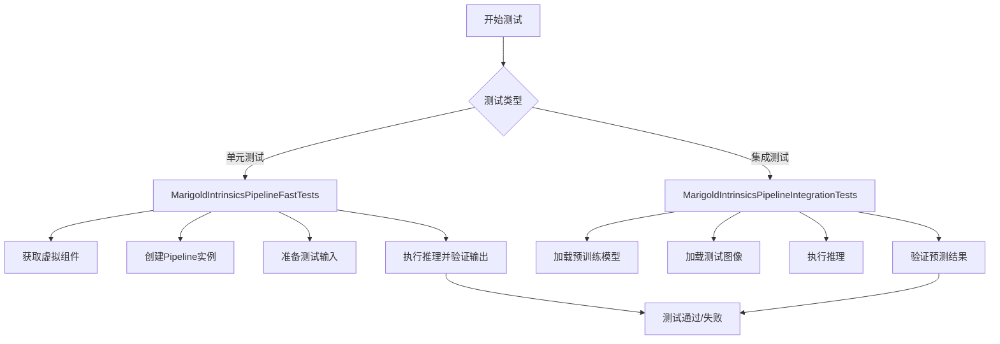

## 类结构

```
MarigoldIntrinsicsPipelineTesterMixin (测试混入类)
├── _test_inference_batch_single_identical
├── _test_inference_batch_consistent
MarigoldIntrinsicsPipelineFastTests (单元测试)
├── get_dummy_components
├── get_dummy_tiny_autoencoder
├── get_dummy_inputs
├── _test_marigold_intrinsics
└── 多个test_marigold_depth_*测试方法
MarigoldIntrinsicsPipelineIntegrationTests (集成测试)
├── setUp
├── tearDown
├── _test_marigold_intrinsics
└── 多个test_marigold_intrinsics_*测试方法
```

## 全局变量及字段


### `gc`
    
Python垃圾回收模块，用于手动管理内存

类型：`module`
    


### `random`
    
Python随机数生成模块

类型：`module`
    


### `unittest`
    
Python单元测试框架

类型：`module`
    


### `np`
    
NumPy库，用于数值计算

类型：`module`
    


### `torch`
    
PyTorch深度学习框架

类型：`module`
    


### `enable_full_determinism`
    
启用完全确定性以确保测试可复现

类型：`function`
    


### `torch_device`
    
测试设备字符串，如'cuda'或'cpu'

类型：`str`
    


### `CLIPTextConfig`
    
CLIP文本编码器配置类

类型：`class`
    


### `CLIPTextModel`
    
CLIP文本编码器模型

类型：`class`
    


### `CLIPTokenizer`
    
CLIP分词器

类型：`class`
    


### `AutoencoderKL`
    
变分自编码器KL散度版本

类型：`class`
    


### `AutoencoderTiny`
    
轻量级自编码器

类型：`class`
    


### `DDIMScheduler`
    
DDIM调度器用于扩散模型

类型：`class`
    


### `MarigoldIntrinsicsPipeline`
    
Marigold intrinsics预测管道

类型：`class`
    


### `UNet2DConditionModel`
    
条件2D UNet模型用于扩散

类型：`class`
    


### `MarigoldIntrinsicsPipelineFastTests.pipeline_class`
    
被测试的MarigoldIntrinsicsPipeline类引用

类型：`type`
    


### `MarigoldIntrinsicsPipelineFastTests.params`
    
管道接受的可调参数集合

类型：`frozenset`
    


### `MarigoldIntrinsicsPipelineFastTests.batch_params`
    
支持批处理的参数集合

类型：`frozenset`
    


### `MarigoldIntrinsicsPipelineFastTests.image_params`
    
图像相关参数集合

类型：`frozenset`
    


### `MarigoldIntrinsicsPipelineFastTests.image_latents_params`
    
图像潜在向量参数集合

类型：`frozenset`
    


### `MarigoldIntrinsicsPipelineFastTests.callback_cfg_params`
    
回调配置参数集合

类型：`frozenset`
    


### `MarigoldIntrinsicsPipelineFastTests.test_xformers_attention`
    
是否测试xformers注意力机制

类型：`bool`
    


### `MarigoldIntrinsicsPipelineFastTests.required_optional_params`
    
必需的可选参数集合

类型：`frozenset`
    
    

## 全局函数及方法


### `to_np`

该函数 `to_np` 是从 `..test_pipelines_common` 模块导入的全局函数，并非在当前代码文件中定义。根据代码中的使用方式（如 `to_np(output_batch[0][0])`），该函数用于将 PyTorch 张量（Tensor）转换为 NumPy 数组，以便进行数值比较和断言。

#### 参数

-  `tensor`：`torch.Tensor`，PyTorch 张量对象

#### 返回值

`numpy.ndarray`，转换后的 NumPy 数组

#### 流程图

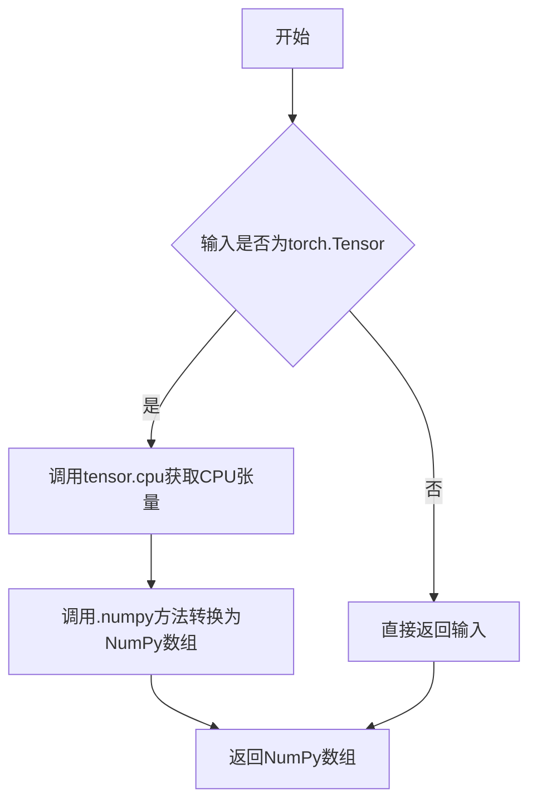

#### 带注释源码

```
# 注意：以下源码为基于代码使用方式的推测实现，并非给定代码文件中的实际源码
def to_np(tensor):
    """
    将 PyTorch 张量转换为 NumPy 数组
    
    参数:
        tensor: torch.Tensor - PyTorch 张量对象
        
    返回值:
        numpy.ndarray - 转换后的 NumPy 数组
    """
    if isinstance(tensor, torch.Tensor):
        # 确保张量在 CPU 上，然后转换为 NumPy 数组
        return tensor.cpu().numpy()
    else:
        # 如果不是张量，直接返回
        return tensor
```

> **注**：该函数在给定代码中并未定义，只是从 `..test_pipelines_common` 模块导入并使用。根据代码中的使用模式（`to_np(output_batch[0][0])`），可以推断其功能是将 PyTorch 张量转换为 NumPy 数组用于数值比较。这是测试代码中常见的模式，用于比较流水线输出与预期结果的差异。


### `load_image`

该函数是一个图像加载工具函数，从指定路径（本地文件或URL）加载图像并转换为PIL Image对象。主要用于测试和演示代码中加载输入图像。

参数：

-  `url_or_path`：`str`，图像的文件路径或URL地址

返回值：`PIL.Image`，返回加载后的PIL图像对象

#### 流程图

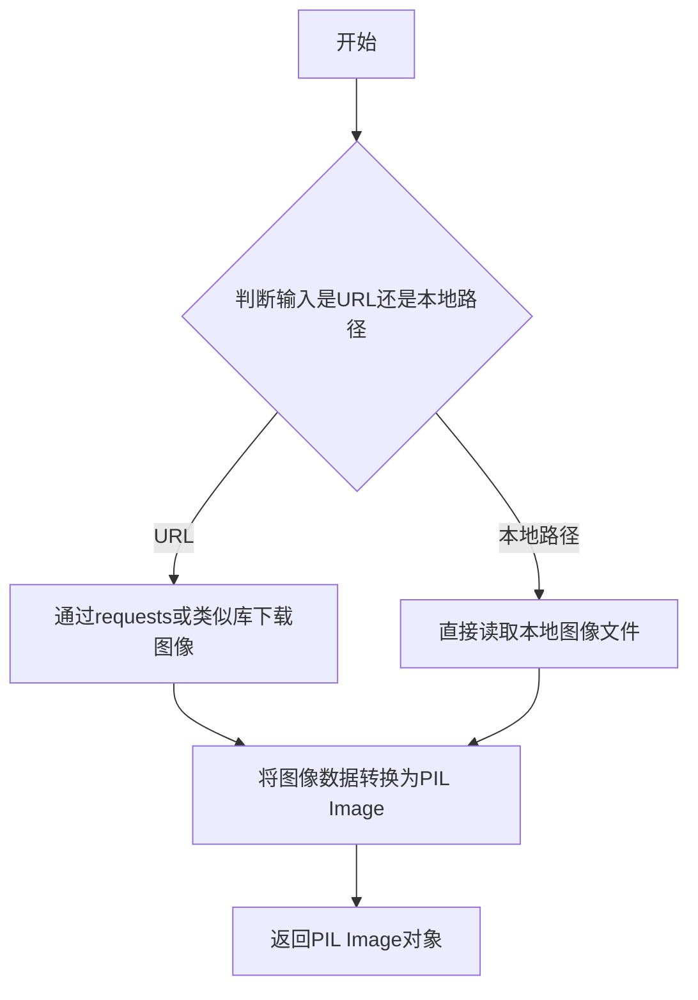

#### 带注释源码

```
# load_image 是从 testing_utils 模块导入的外部函数
# 以下是基于代码使用方式的推断实现

def load_image(url_or_path: str) -> "PIL.Image":
    """
    加载图像从URL或本地路径
    
    参数:
        url_or_path: 图像的URL或本地文件路径
        
    返回:
        PIL.Image: 加载的图像对象
    """
    # 判断是否为URL
    if url_or_path.startswith("http://") or url_or_path.startswith("https://"):
        # 从URL下载图像
        response = requests.get(url_or_path)
        image = Image.open(BytesIO(response.content))
    else:
        # 从本地路径加载图像
        image = Image.open(url_or_path)
    
    # 转换为RGB模式（如果需要）
    if image.mode != 'RGB':
        image = image.convert('RGB')
    
    return image
```


### `floats_tensor`

该函数是一个测试工具函数，用于生成指定形状的随机浮点数 PyTorch 张量。主要用于测试场景中生成模拟输入数据。

参数：

-  `shape`：`Tuple[int, ...]`，张量的形状，如 `(1, 3, 32, 32)`
-  `rng`：`random.Random`，Python 随机数生成器实例，用于生成随机数据
-  `**kwargs`：其他可选参数，可能包括 `device`、`dtype` 等

返回值：`torch.Tensor`，一个包含随机浮点数值的 PyTorch 张量

#### 流程图

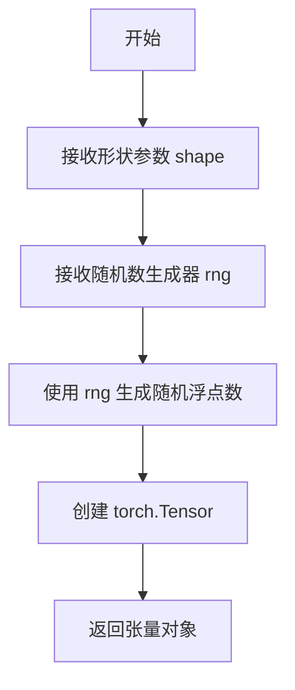

#### 带注释源码

```python
# 说明：floats_tensor 函数定义在 testing_utils 模块中
# 此代码文件通过 from ...testing_utils import floats_tensor 导入使用

# 在 MarigoldIntrinsicsPipelineFastTests.get_dummy_inputs 方法中的调用示例：
def get_dummy_inputs(self, device, seed=0):
    # 调用 floats_tensor 创建形状为 (1, 3, 32, 32) 的随机张量
    # rng 参数使用 random.Random 对象生成确定性随机数
    image = floats_tensor((1, 3, 32, 32), rng=random.Random(seed)).to(device)
    
    # 将张量值归一化到 [0, 1] 范围
    image = image / 2 + 0.5
    if str(device).startswith("mps"):
        generator = torch.manual_seed(seed)
    else:
        generator = torch.Generator(device=device).manual_seed(seed)
    inputs = {
        "image": image,
        "num_inference_steps": 1,
        "processing_resolution": 0,
        "generator": generator,
        "output_type": "np",
    }
    return inputs
```

#### 备注

由于 `floats_tensor` 函数的实际定义位于 `testing_utils` 模块中（该模块不在当前代码文件内），上述信息是基于以下来源推断的：

1. 导入语句：`from ...testing_utils import floats_tensor`
2. 实际使用方式：在 `get_dummy_inputs` 方法中创建测试用的图像张量
3. 函数返回值类型：返回可调用 `.to(device)` 的对象，说明是 PyTorch Tensor


### `enable_full_determinism`

该函数用于在测试环境中启用完全确定性（full determinism），通过设置随机种子、环境变量和PyTorch的确定性计算标志，确保深度学习模型的推理和训练过程可复现。

参数：无需参数

返回值：`None`，该函数无返回值

#### 流程图

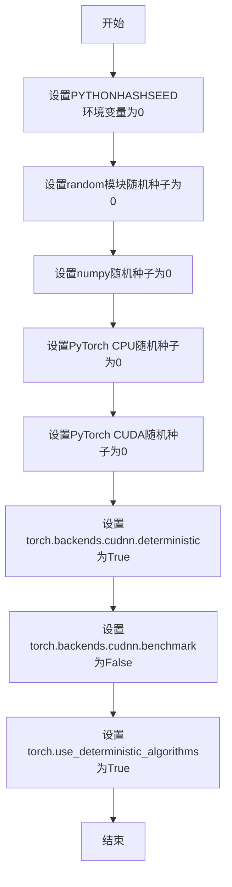

#### 带注释源码

```
# 该函数定义在 diffusers 库的 testing_utils.py 模块中
# 当前文件通过 from ...testing_utils import enable_full_determinism 导入
# 函数签名: def enable_full_determinism(seed: int = 0) -> None:
#
# 主要功能:
# 1. 设置环境变量 PYTHONHASHSEED=0，确保 Python 哈希随机性可复现
# 2. 设置 random.random.seed(0)，控制 Python 内置随机数生成器
# 3. 设置 np.random.seed(0)，控制 NumPy 随机数生成器
# 4. 设置 torch.manual_seed(0)，控制 CPU 张量随机初始化
# 5. 设置 torch.cuda.manual_seed_all(0)，控制所有 GPU 随机初始化
# 6. 设置 torch.backends.cudnn.deterministic=True，强制使用确定性算法
# 7. 设置 torch.backends.cudnn.benchmark=False，禁用 cuDNN 自动优化
# 8. 设置 torch.use_deterministic_algorithms(True)，启用 PyTorch 确定性算法
#
# 使用场景:
# - 单元测试中确保模型输出结果可复现
# - 调试时定位由随机性导致的问题
# - 集成测试中验证模型一致性
#
# 注意事项:
# - 启用确定性可能导致性能下降
# - 某些操作在全确定性模式下可能不可用
# - 需要在导入其他模块之前调用
```


### `backend_empty_cache`

该函数是一个测试工具函数，用于清理后端（GPU/CPU）的内存缓存，确保测试之间的内存隔离。

参数：

- `device`：`str`，目标设备标识符（如 "cuda"、"cpu" 等）

返回值：`None`，无返回值

#### 流程图

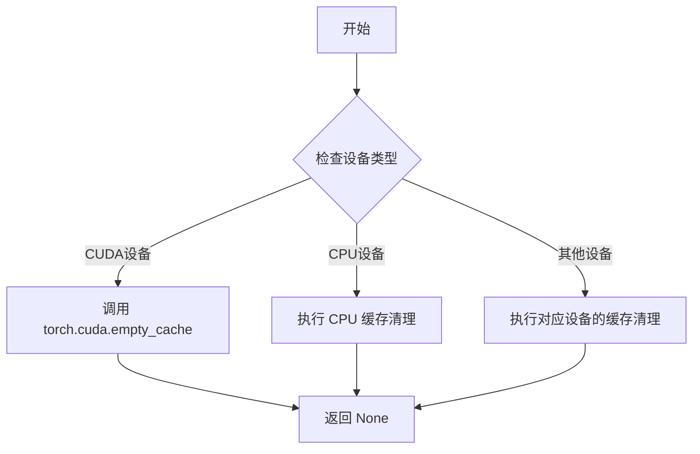

#### 带注释源码

```
# backend_empty_cache 函数定义在 diffusers 库的 testing_utils 模块中
# 此处为基于使用模式的推断实现

def backend_empty_cache(device: str) -> None:
    """
    清理指定设备的内存缓存。
    
    参数:
        device: 目标设备标识符，常见值为 "cuda", "cpu", "xpu" 等
        
    返回值:
        无返回值
    """
    import torch
    
    if device.startswith("cuda"):
        # 清理 CUDA 缓存，释放未使用的 GPU 内存
        torch.cuda.empty_cache()
        # 可选：重置峰值内存统计
        # torch.cuda.reset_peak_memory_stats(device)
    elif device == "cpu":
        # CPU 通常不需要显式缓存清理
        # 可选：调用 gc.collect() 辅助清理
        import gc
        gc.collect()
    elif device.startswith("xpu"):
        # Intel XPU 设备
        try:
            torch.xpu.empty_cache()
        except AttributeError:
            pass
    else:
        # 对于其他设备，尝试调用通用的缓存清理方法
        pass
```

> **注意**：该函数的实际源码位于 `diffusers` 库的 `testing_utils.py` 模块中，本文件通过 `from ...testing_utils import backend_empty_cache` 导入使用。在测试的 `setUp()` 和 `tearDown()` 方法中调用，以确保每次测试前后释放 GPU 内存，避免测试间的内存污染。


# require_torch_accelerator 提取结果

### require_torch_accelerator

这是一个装饰器函数，用于标记测试用例或测试类需要Torch加速器（如CUDA、IPEX等）才能运行。如果当前环境不支持Torch加速器，则跳过该测试。

参数：无（装饰器模式）

返回值：`Callable`，返回装饰后的测试函数/类，如果不支持加速器则返回跳过执行的函数

#### 流程图

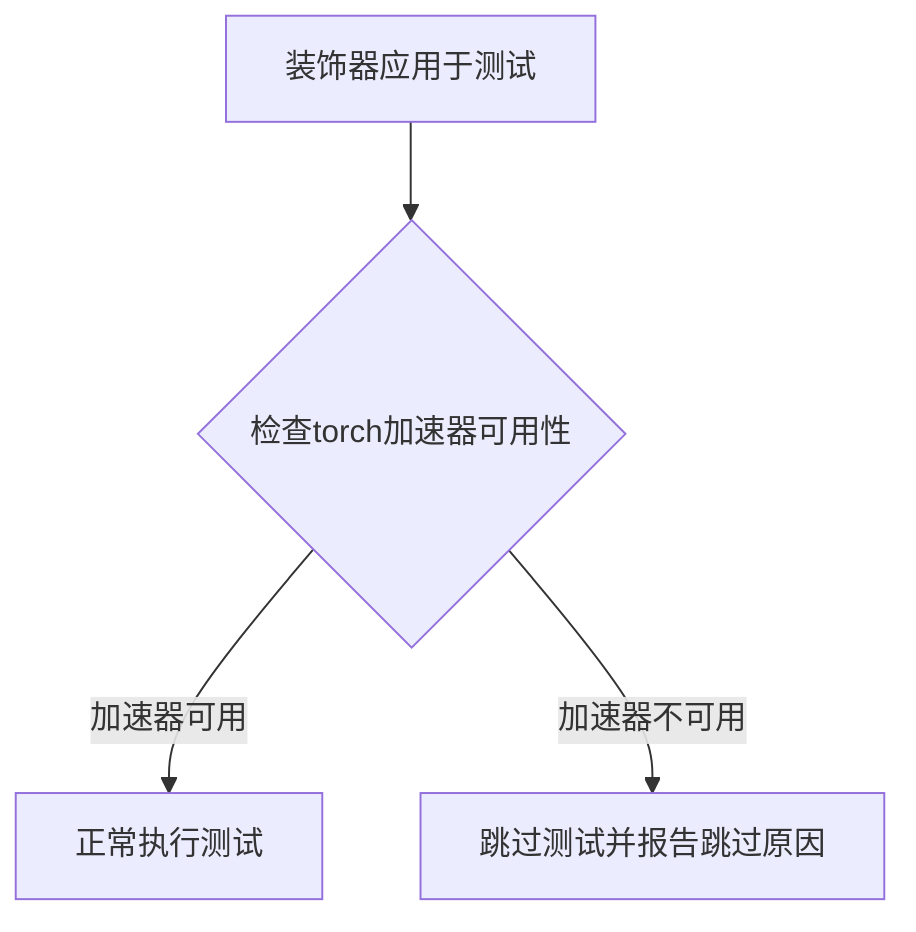

#### 带注释源码

```python
# 注意：require_torch_accelerator 的实际定义不在此代码文件中
# 它是从 testing_utils 模块导入的装饰器
# 使用方式如下：

from ...testing_utils import (
    # ... 其他导入
    require_torch_accelerator,
    # ... 其他导入
)

# 作为装饰器应用于需要GPU加速的集成测试类
@slow
@require_torch_accelerator
class MarigoldIntrinsicsPipelineIntegrationTests(unittest.TestCase):
    # 此类中的所有测试方法都需要CUDA/XPU等加速器才能运行
    # 如果没有加速器，pytest会跳过这些测试
    ...
```

#### 补充说明

| 属性 | 详情 |
|------|------|
| **来源模块** | `...testing_utils` (项目内测试工具模块) |
| **使用场景** | 标记需要GPU才能运行的集成测试 |
| **配合装饰器** | `@slow` - 标记为慢速测试 |
| **作用** | 条件跳过：如果环境没有Torch加速器，则跳过测试而不是失败 |

---

**注意**：由于 `require_torch_accelerator` 的完整源码定义不在当前提供的代码文件中，以上信息基于其使用方式推断。完整的函数定义位于项目的 `testing_utils` 模块中。建议查阅该模块获取完整的实现细节。


### `slow`

`slow` 是从 `...testing_utils` 模块导入的一个测试装饰器（decorator），用于标记需要长时间运行的测试函数或类。被 `@slow` 装饰的测试通常表示集成测试或需要加载大型模型的测试，在常规 CI 流程中可能会被跳过。

参数：

- 该装饰器不接受任何参数，通常直接应用于函数或类定义之前

返回值：无返回值，用于修改被装饰对象的元数据

#### 流程图

```mermaid
flowchart TD
    A[开始] --> B{检查测试是否被@slow装饰}
    B -->|是| C[标记为慢速测试]
    B -->|否| D[普通测试]
    C --> E[在测试框架中注册]
    D --> E
    E --> F[根据配置决定是否运行]
```

#### 带注释源码

```python
# slow 装饰器在 testing_utils 模块中定义
# 以下是在当前文件中的导入和使用方式

from ...testing_utils import (
    Expectations,
    backend_empty_cache,
    enable_full_determinism,
    floats_tensor,
    load_image,
    require_torch_accelerator,
    slow,  # 导入 slow 装饰器
    torch_device,
)

# 使用 slow 装饰器标记慢速集成测试类
# 该测试类包含需要加载真实模型和图片的集成测试
@slow
@require_torch_accelerator
class MarigoldIntrinsicsPipelineIntegrationTests(unittest.TestCase):
    """
    集成测试类，用于测试 MarigoldIntrinsicsPipeline 的完整功能
    包括加载预训练模型、执行推理、验证输出等
    """
    
    def setUp(self):
        """测试前准备：垃圾回收和清空缓存"""
        super().setUp()
        gc.collect()
        backend_empty_cache(torch_device)

    def tearDown(self):
        """测试后清理：垃圾回收和清空缓存"""
        super().tearDown()
        gc.collect()
        backend_empty_cache(torch_device)

    def _test_marigold_intrinsics(
        self,
        is_fp16: bool = True,
        device: str = "cuda",
        generator_seed: int = 0,
        expected_slice: np.ndarray = None,
        model_id: str = "prs-eth/marigold-iid-appearance-v1-1",
        image_url: str = "https://marigoldmonodepth.github.io/images/einstein.jpg",
        atol: float = 1e-3,
        **pipe_kwargs,
    ):
        # 实际的集成测试实现...
        pass
```

> **注意**：当前代码文件中只是导入了 `slow` 装饰器并使用它，`slow` 装饰器的实际定义位于 `testing_utils` 模块中。从代码中的使用方式来看，`slow` 用于标记需要 GPU 加速器和较长运行时间的集成测试，通常在常规测试套件中会被跳过，仅在特定的全量测试流程中运行。


### `MarigoldIntrinsicsPipelineTesterMixin._test_inference_batch_single_identical`

该方法用于测试推理时批量处理与单个样本处理的一致性。通过构造单个输入和批量输入（将单个输入复制 `batch_size` 份），分别执行管道并比较输出，验证批量处理结果中第一个样本与单独处理的结果是否在容差范围内相同。

参数：

- `self`：隐式参数，类型为 `MarigoldIntrinsicsPipelineTesterMixin` 类的实例，表示测试混入类本身
- `batch_size`：`int`，默认值为 `2`，要测试的批次大小，用于构造批量输入
- `expected_max_diff`：`float`，默认值为 `1e-4`，允许的最大差异阈值，用于断言批量输出与单个输出之间的最大绝对差值
- `additional_params_copy_to_batched_inputs`：`List[str]`，默认值为 `["num_inference_steps"]`，需要从单个输入复制到批量输入的额外参数列表

返回值：`None`，该方法不返回任何值，通过断言验证测试结果

#### 流程图

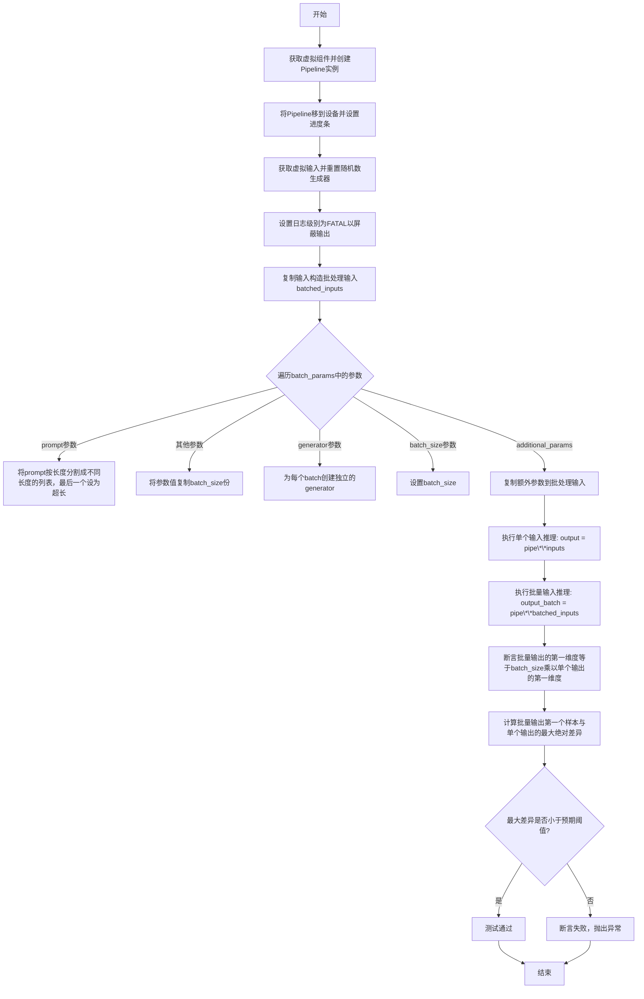

#### 带注释源码

```python
def _test_inference_batch_single_identical(
    self,
    batch_size=2,
    expected_max_diff=1e-4,
    additional_params_copy_to_batched_inputs=["num_inference_steps"],
):
    """测试批量推理时，单个样本处理结果与批量处理中第一个样本的结果一致性
    
    Args:
        batch_size: 批次大小，默认值为2
        expected_max_diff: 允许的最大差异，默认值为1e-4
        additional_params_copy_to_batched_inputs: 需要复制到批处理输入的额外参数列表
    """
    # 步骤1: 获取虚拟组件并创建Pipeline实例
    components = self.get_dummy_components()
    pipe = self.pipeline_class(**components)
    
    # 步骤2: 为所有组件设置默认的attention processor
    for components in pipe.components.values():
        if hasattr(components, "set_default_attn_processor"):
            components.set_default_attn_processor()

    # 步骤3: 将Pipeline移到指定设备并设置进度条
    pipe.to(torch_device)
    pipe.set_progress_bar_config(disable=None)
    
    # 步骤4: 获取虚拟输入并重置随机数生成器
    inputs = self.get_dummy_inputs(torch_device)
    inputs["generator"] = self.get_generator(0)

    # 步骤5: 获取logger并设置日志级别为FATAL以减少输出
    logger = diffusers.logging.get_logger(pipe.__module__)
    logger.setLevel(level=diffusers.logging.FATAL)

    # 步骤6: 构造批处理输入字典，先复制原始输入
    batched_inputs = {}
    batched_inputs.update(inputs)

    # 步骤7: 遍历batch_params，对每个参数进行批处理化
    for name in self.batch_params:
        if name not in inputs:
            continue

        value = inputs[name]
        if name == "prompt":
            # 对于prompt参数，创建不同长度的prompt列表，最后一个设为超长
            len_prompt = len(value)
            batched_inputs[name] = [value[: len_prompt // i] for i in range(1, batch_size + 1)]
            batched_inputs[name][-1] = 100 * "very long"
        else:
            # 对于其他参数，复制batch_size份
            batched_inputs[name] = batch_size * [value]

    # 步骤8: 如果输入中有generator，为每个batch创建独立的generator
    if "generator" in inputs:
        batched_inputs["generator"] = [self.get_generator(i) for i in range(batch_size)]

    # 步骤9: 如果输入中有batch_size参数，设置它
    if "batch_size" in inputs:
        batched_inputs["batch_size"] = batch_size

    # 步骤10: 复制额外参数到批处理输入
    for arg in additional_params_copy_to_batched_inputs:
        batched_inputs[arg] = inputs[arg]

    # 步骤11: 执行单个输入推理
    output = pipe(**inputs)
    # 步骤12: 执行批量输入推理
    output_batch = pipe(**batched_inputs)

    # 步骤13: 断言批量输出的batch维度等于batch_size乘以单个输出的batch维度
    # 注意: 这里只检查了第一个输出元素，修改了原逻辑（原逻辑未考虑intrinsics的多个输出）
    assert output_batch[0].shape[0] == batch_size * output[0].shape[0]

    # 步骤14: 计算批量输出第一个样本与单个输出的最大绝对差异
    max_diff = np.abs(to_np(output_batch[0][0]) - to_np(output[0][0])).max()
    
    # 步骤15: 断言最大差异小于预期阈值
    assert max_diff < expected_max_diff
```


### `MarigoldIntrinsicsPipelineTesterMixin._test_inference_batch_consistent`

该方法用于测试 Marigold Intrinsics Pipeline 在不同批处理大小下的一致性。它通过创建不同批处理大小的输入，分别执行推理，然后验证输出数量是否符合预期（`batch_size * pipe.n_targets`），以确保管道在批处理模式下能正确处理不同数量的输入。

参数：

- `batch_sizes`：`<class 'list'>`，要测试的批处理大小列表，默认值为 `[2]`
- `additional_params_copy_to_batched_inputs`：`<class 'list'>`，需要复制到批处理输入的额外参数列表，默认值为 `["num_inference_steps"]`
- `batch_generator`：`<class 'bool'>`，是否在批处理时使用多个生成器，默认值为 `True`

返回值：`None`，该方法无返回值，通过 `assert` 断言进行验证

#### 流程图

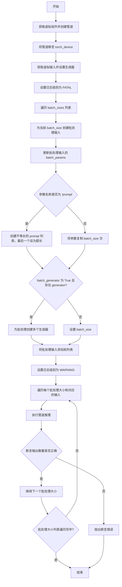

#### 带注释源码

```python
def _test_inference_batch_consistent(
    self, batch_sizes=[2], additional_params_copy_to_batched_inputs=["num_inference_steps"], batch_generator=True
):
    """
    测试管道在不同批处理大小下的一致性
    
    参数:
        batch_sizes: 要测试的批处理大小列表
        additional_params_copy_to_batched_inputs: 需要复制到批处理输入的额外参数
        batch_generator: 是否在批处理时为每个样本使用不同的生成器
    """
    # 1. 获取虚拟组件并创建管道实例
    components = self.get_dummy_components()
    pipe = self.pipeline_class(**components)
    
    # 2. 将管道移至测试设备
    pipe.to(torch_device)
    
    # 3. 禁用进度条
    pipe.set_progress_bar_config(disable=None)
    
    # 4. 获取虚拟输入（单样本输入）
    inputs = self.get_dummy_inputs(torch_device)
    
    # 5. 设置生成器，使用固定的随机种子确保可重复性
    inputs["generator"] = self.get_generator(0)
    
    # 6. 获取日志记录器并设置日志级别为 FATAL（静默模式）
    logger = diffusers.logging.get_logger(pipe.__module__)
    logger.setLevel(level=diffusers.logging.FATAL)
    
    # 7. 为每个批处理大小准备批处理输入
    batched_inputs = []
    for batch_size in batch_sizes:
        # 复制原始单样本输入
        batched_input = {}
        batched_input.update(inputs)
        
        # 8. 处理需要批处理化的参数（batch_params）
        for name in self.batch_params:
            if name not in inputs:
                continue
            
            value = inputs[name]
            if name == "prompt":
                # 对于 prompt，创建不等长的 prompt 列表
                len_prompt = len(value)
                # make unequal batch sizes
                batched_input[name] = [value[: len_prompt // i] for i in range(1, batch_size + 1)]
                
                # make last batch super long（使最后一个 prompt 非常长，测试边界情况）
                batched_input[name][-1] = 100 * "very long"
                
            else:
                # 对于其他参数，复制 batch_size 次
                batched_input[name] = batch_size * [value]
        
        # 9. 处理生成器：根据 batch_generator 决定是否创建多个生成器
        if batch_generator and "generator" in inputs:
            # 为批处理中的每个样本创建独立的生成器
            batched_input["generator"] = [self.get_generator(i) for i in range(batch_size)]
        
        # 10. 设置批处理大小
        if "batch_size" in inputs:
            batched_input["batch_size"] = batch_size
        
        # 11. 添加额外的参数（如 num_inference_steps）
        for arg in additional_params_copy_to_batched_inputs:
            if arg in inputs:
                batched_input[arg] = inputs[arg]
        
        batched_inputs.append(batched_input)
    
    # 12. 切换日志级别为 WARNING，开始实际测试
    logger.setLevel(level=diffusers.logging.WARNING)
    for batch_size, batched_input in zip(batch_sizes, batched_inputs):
        # 执行推理
        output = pipe(**batched_input)
        
        # 13. 验证输出数量是否符合预期：batch_size * pipe.n_targets
        # 这里 n_targets 是管道支持的目标数量（如深度、法线等 intrinsics）
        assert len(output[0]) == batch_size * pipe.n_targets  # only changed here
```


### `MarigoldIntrinsicsPipelineFastTests.get_dummy_components`

该方法是测试类中的辅助函数，用于生成虚拟（dummy）组件字典，为 Marigold 内在属性（intrinsics）pipeline 的单元测试提供所需的模型组件（UNet、调度器、VAE、文本编码器和分词器），确保测试在不需要加载真实预训练权重的情况下运行。

参数：

- `time_cond_proj_dim`：`Optional[int]`，可选参数，用于控制 UNet 模型的时间条件投影维度。如果为 `None`，则使用默认值。

返回值：`Dict[str, Any]`，返回包含所有虚拟组件的字典，包括 `unet`、`scheduler`、`vae`、`text_encoder`、`tokenizer` 和 `prediction_type`。

#### 流程图

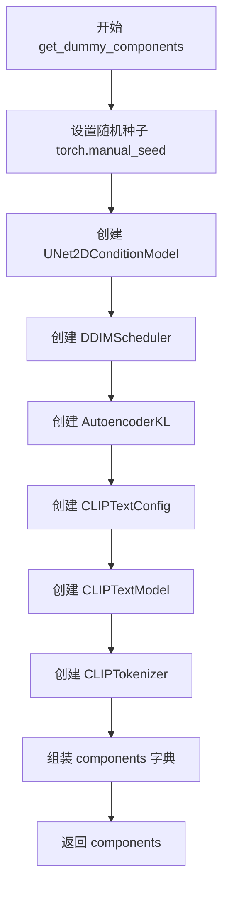

#### 带注释源码

```python
def get_dummy_components(self, time_cond_proj_dim=None):
    """
    生成用于测试的虚拟组件字典。
    
    参数:
        time_cond_proj_dim: 可选的时间条件投影维度参数，传递给 UNet 模型。
    
    返回:
        包含虚拟模型组件的字典。
    """
    # 设置随机种子以确保测试可重复性
    torch.manual_seed(0)
    
    # 创建虚拟 UNet2DConditionModel
    # 用于图像到图像的扩散任务
    unet = UNet2DConditionModel(
        block_out_channels=(32, 64),     # UNet 各级别输出通道数
        layers_per_block=2,               # 每级 block 的层数
        time_cond_proj_dim=time_cond_proj_dim,  # 时间条件投影维度
        sample_size=32,                   # 输入样本的空间尺寸
        in_channels=12,                   # 输入通道数（4 VAE latent + 8 intrinsics）
        out_channels=8,                  # 输出通道数
        down_block_types=("DownBlock2D", "CrossAttnDownBlock2D"),  # 下采样 block 类型
        up_block_types=("CrossAttnUpBlock2D", "UpBlock2D"),        # 上采样 block 类型
        cross_attention_dim=32,           # 跨注意力机制维度
    )
    
    # 重置随机种子，确保各组件初始化独立
    torch.manual_seed(0)
    
    # 创建 DDIM 调度器
    # 控制去噪过程的噪声调度
    scheduler = DDIMScheduler(
        beta_start=0.00085,               # beta 起始值
        beta_end=0.012,                   # beta 结束值
        prediction_type="v_prediction",   # 预测类型
        set_alpha_to_one=False,           # 是否将最终 alpha 设为 1
        steps_offset=1,                   # 步骤偏移量
        beta_schedule="scaled_linear",    # beta 调度策略
        clip_sample=False,                 # 是否裁剪采样
        thresholding=False,               # 是否使用阈值化
    )
    
    # 重置随机种子
    torch.manual_seed(0)
    
    # 创建 VAE (变分自编码器)
    # 用于图像的编码和解码
    vae = AutoencoderKL(
        block_out_channels=[32, 64],      # VAE 各层级通道数
        in_channels=3,                   # 输入通道数（RGB）
        out_channels=3,                  # 输出通道数
        down_block_types=["DownEncoderBlock2D", "DownEncoderBlock2D"],  # 下采样编码器
        up_block_types=["UpDecoderBlock2D", "UpDecoderBlock2D"],        # 上采样解码器
        latent_channels=4,                # 潜在空间通道数
    )
    
    # 重置随机种子
    torch.manual_seed(0)
    
    # 配置文本编码器
    text_encoder_config = CLIPTextConfig(
        bos_token_id=0,                   # 句子起始 token ID
        eos_token_id=2,                  # 句子结束 token ID
        hidden_size=32,                   # 隐藏层维度
        intermediate_size=37,            # 中间层维度
        layer_norm_eps=1e-05,             # LayerNorm  epsilon
        num_attention_heads=4,            # 注意力头数
        num_hidden_layers=5,             # 隐藏层数量
        pad_token_id=1,                  # 填充 token ID
        vocab_size=1000,                 # 词汇表大小
    )
    
    # 创建实际的 CLIP 文本编码器模型
    text_encoder = CLIPTextModel(text_encoder_config)
    
    # 从预训练模型加载分词器
    # 使用 tiny-random-clip 模型用于快速测试
    tokenizer = CLIPTokenizer.from_pretrained("hf-internal-testing/tiny-random-clip")
    
    # 组装所有组件到字典中
    components = {
        "unet": unet,
        "scheduler": scheduler,
        "vae": vae,
        "text_encoder": text_encoder,
        "tokenizer": tokenizer,
        "prediction_type": "intrinsics",  # 预测类型为内在属性
    }
    
    return components
```


### `MarigoldIntrinsicsPipelineFastTests.get_dummy_tiny_autoencoder`

该方法是一个测试辅助函数，用于创建并返回一个配置好的虚拟 Tiny Autoencoder 模型（AutoencoderTiny），专门用于 Marigold Intrinsics Pipeline 的单元测试。该模型配置了 3 个输入通道、3 个输出通道和 4 个潜在通道，以模拟真实的 VAE 组件进行测试验证。

参数：

- （无参数）

返回值：`AutoencoderTiny`，返回一个配置好的小型自动编码器实例，用于测试目的。

#### 流程图

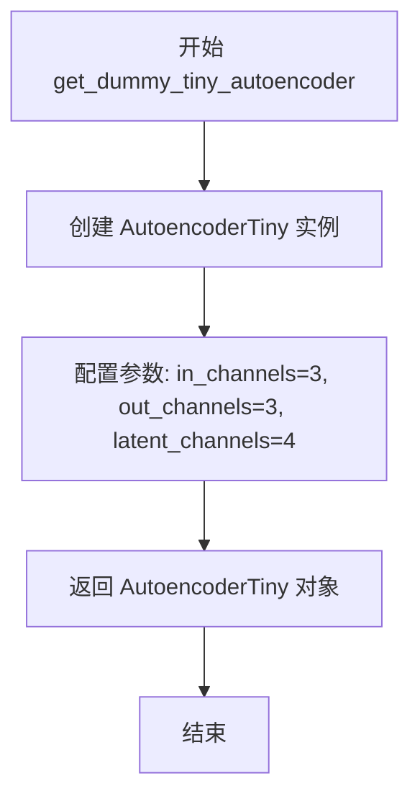

#### 带注释源码

```python
def get_dummy_tiny_autoencoder(self):
    # 创建一个虚拟的 Tiny Autoencoder 模型用于测试
    # 参数说明:
    # - in_channels: 输入图像的通道数 (3 表示 RGB 图像)
    # - out_channels: 输出图像的通道数 (3 表示 RGB 图像)
    # - latent_channels: 潜在空间的通道数 (用于 VAE 的潜在表示)
    return AutoencoderTiny(in_channels=3, out_channels=3, latent_channels=4)
```


### `MarigoldIntrinsicsPipelineFastTests.get_dummy_inputs`

该方法是 MarigoldIntrinsicsPipelineFastTests 测试类中的一个辅助方法，用于生成用于测试管道的虚拟输入参数。它创建一个包含图像、推理步数、处理分辨率、随机生成器和输出类型的字典，以供管道推理使用。

参数：

- `self`：`MarigoldIntrinsicsPipelineTesterMixin` / `unittest.TestCase`，方法所属的测试类实例
- `device`：`str`，目标设备（如 "cpu"、"cuda" 等），用于创建张量和生成器
- `seed`：`int`，默认值 0，用于初始化随机数生成器的种子值，确保测试可复现

返回值：`Dict[str, Any]`，返回包含以下键值的字典：
  - `image`：`torch.Tensor`，形状为 (1, 3, 32, 32) 的浮点张量，经过归一化处理
  - `num_inference_steps`：`int`，推理步数，此处固定为 1
  - `processing_resolution`：`int`，处理分辨率，此处固定为 0
  - `generator`：`torch.Generator`，随机数生成器，用于控制推理过程的随机性
  - `output_type`：`str`，输出类型，此处固定为 "np"（numpy 数组）

#### 流程图

```mermaid
flowchart TD
    A[开始 get_dummy_inputs] --> B[使用 floats_tensor 创建随机图像<br/>形状: (1, 3, 32, 32)]
    B --> C[图像归一化: image / 2 + 0.5]
    C --> D{设备是 MPS?}
    D -->|是| E[使用 torch.manual_seed(seed)]
    D -->|否| F[创建 torch.Generator 并设置种子]
    E --> G[构建 inputs 字典]
    F --> G
    G --> H[返回包含 image, num_inference_steps,<br/>processing_resolution, generator, output_type 的字典]
```

#### 带注释源码

```python
def get_dummy_inputs(self, device, seed=0):
    """
    生成用于测试 MarigoldIntrinsicsPipeline 的虚拟输入参数
    
    参数:
        device: 目标设备字符串 (如 "cpu", "cuda")
        seed: 随机种子,默认值为0,确保测试可复现
    
    返回:
        包含图像、推理步数、处理分辨率、生成器和输出类型的字典
    """
    # 使用随机数生成器创建形状为 (1, 3, 32, 32) 的浮点张量
    # floats_tensor 是 diffusers 测试工具函数
    image = floats_tensor((1, 3, 32, 32), rng=random.Random(seed)).to(device)
    
    # 将图像值归一化到 [0, 1] 范围
    # 原始 floats_tensor 生成的值在 [-1, 1] 范围
    # 除以 2 加 0.5 将其映射到 [0, 1]
    image = image / 2 + 0.5
    
    # 根据设备类型选择不同的随机数生成器初始化方式
    # MPS (Metal Performance Shaders) 是 Apple Silicon 的 GPU 加速框架
    if str(device).startswith("mps"):
        # MPS 设备使用 torch.manual_seed
        generator = torch.manual_seed(seed)
    else:
        # 其他设备 (cpu, cuda 等) 使用 torch.Generator 并设置种子
        generator = torch.Generator(device=device).manual_seed(seed)
    
    # 构建输入参数字典
    inputs = {
        "image": image,                      # 输入图像张量
        "num_inference_steps": 1,            # 推理步数,测试时使用最小值1
        "processing_resolution": 0,          # 处理分辨率,0 表示使用默认分辨率
        "generator": generator,              # 随机生成器,确保结果可复现
        "output_type": "np",                 # 输出类型为 numpy 数组
    }
    return inputs
```


### `MarigoldIntrinsicsPipelineFastTests._test_marigold_intrinsics`

该方法是 MarigoldIntrinsicsPipeline 的单元测试方法，用于验证管道在给定参数下的推理输出是否符合预期。它通过创建虚拟组件、运行推理并比较预测结果与期望值来确保管道的正确性。

参数：

- `self`：测试类实例本身
- `generator_seed: int`，随机数生成器种子，默认值为 0，用于确保测试可重复性
- `expected_slice: np.ndarray`，期望的预测切片值，用于与实际输出进行对比验证
- `atol: float`，绝对误差容限，默认值为 1e-4，用于数值比较的容忍度
- `**pipe_kwargs`：可变关键字参数，会传递给管道的其他参数（如 num_inference_steps、processing_resolution 等）

返回值：`None`（无返回值），该方法为测试方法，通过断言进行验证而非返回结果

#### 流程图

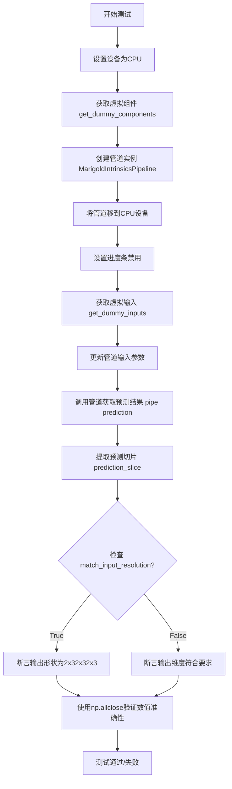

#### 带注释源码

```python
def _test_marigold_intrinsics(
    self,
    generator_seed: int = 0,
    expected_slice: np.ndarray = None,
    atol: float = 1e-4,
    **pipe_kwargs,
):
    """
    测试 Marigold 内在特征管道的核心方法
    
    参数:
        generator_seed: 随机种子，确保测试可重复
        expected_slice: 期望的输出切片值
        atol: 绝对误差容限
        **pipe_kwargs: 传递给管道的其他参数
    """
    # 设置运行设备为 CPU
    device = "cpu"
    
    # 获取虚拟组件（UNet、VAE、Scheduler、TextEncoder等）
    components = self.get_dummy_components()

    # 使用虚拟组件创建管道实例
    pipe = self.pipeline_class(**components)
    pipe.to(device)
    # 禁用进度条显示
    pipe.set_progress_bar_config(disable=None)

    # 获取虚拟输入数据（图像、推理步数等）
    pipe_inputs = self.get_dummy_inputs(device, seed=generator_seed)
    # 使用传入的参数覆盖默认输入
    pipe_inputs.update(**pipe_kwargs)

    # 执行管道推理，获取预测结果
    prediction = pipe(**pipe_inputs).prediction

    # 提取预测结果的切片用于验证
    # 取最后一个通道的最后3x3区域并展平
    prediction_slice = prediction[0, -3:, -3:, -1].flatten()

    # 根据 match_input_resolution 参数验证输出分辨率
    if pipe_inputs.get("match_input_resolution", True):
        # 期望输出形状为 (2, 32, 32, 3)
        # 2 表示有两个输出（可能是法线和深度）
        self.assertEqual(prediction.shape, (2, 32, 32, 3), "Unexpected output resolution")
    else:
        # 验证基本维度：批次为2，通道为3
        self.assertTrue(prediction.shape[0] == 2 and prediction.shape[3] == 3, "Unexpected output dimensions")
        # 验证处理分辨率
        self.assertEqual(
            max(prediction.shape[1:3]),
            pipe_inputs.get("processing_resolution", 768),
            "Unexpected output resolution",
        )

    # 设置 NumPy 打印精度
    np.set_printoptions(precision=5, suppress=True)
    # 构建错误消息
    msg = f"{prediction_slice}"
    # 断言预测值与期望值在容差范围内接近
    self.assertTrue(np.allclose(prediction_slice, expected_slice, atol=atol), msg)
```


### `MarigoldIntrinsicsPipelineFastTests.test_marigold_depth_dummy_defaults`

这是一个单元测试方法，用于验证 Marigold 深度估计管道在默认参数下的基本功能是否正常。该测试通过调用内部方法 `_test_marigold_intrinsics` 来执行完整的推理流程，并使用预定义的期望输出来验证模型输出的正确性。

参数：

- `self`：测试类实例本身，无需显式传递

返回值：无（`None`），该方法为测试方法，不返回任何值

#### 流程图

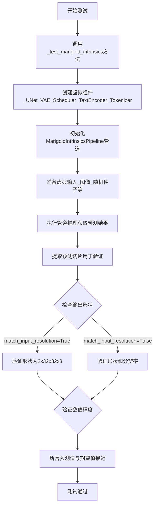

#### 带注释源码

```python
def test_marigold_depth_dummy_defaults(self):
    """
    测试 Marigold 深度估计管道在默认参数下的基本功能。
    
    该测试方法验证管道能够：
    1. 使用虚拟组件（dummy components）正确初始化
    2. 执行单步推理
    3. 产生符合预期形状和数值范围的输出
    
    默认参数：
    - num_inference_steps: 1
    - processing_resolution: 0 (使用输入分辨率)
    - ensemble_size: 1
    - batch_size: 1
    - match_input_resolution: True
    - output_type: "np"
    """
    # 调用内部测试方法，传入期望的输出切片
    # expected_slice 包含9个数值，对应预测结果的右下角3x3区域的扁平化结果
    self._test_marigold_intrinsics(
        expected_slice=np.array([0.6423, 0.40664, 0.41185, 0.65832, 0.63935, 0.43971, 0.51786, 0.55216, 0.47683]),
    )
```


### `MarigoldIntrinsicsPipelineFastTests.test_marigold_depth_dummy_G0_S1_P32_E1_B1_M1`

该测试方法用于验证 Marigold Intrinsics Pipeline 在特定参数配置下（Generator Seed=0, Steps=1, Processing Resolution=32, Ensemble Size=1, Batch Size=1, Match Input Resolution=True）的功能正确性，通过调用内部测试方法 `_test_marigold_intrinsics` 执行推理并验证输出预测值是否与预期切片值匹配。

参数：

- `self`：隐式参数，类型为 `MarigoldIntrinsicsPipelineFastTests`，表示测试类实例本身

返回值：无返回值（`None`），该方法为单元测试方法，通过断言验证预测结果

#### 流程图

```mermaid
flowchart TD
    A[开始测试 test_marigold_depth_dummy_G0_S1_P32_E1_B1_M1] --> B[调用 _test_marigold_intrinsics 方法]
    
    B --> C[设置 generator_seed=0]
    B --> D[设置 expected_slice=np.array]
    B --> E[设置 num_inference_steps=1]
    B --> F[设置 processing_resolution=32]
    B --> G[设置 ensemble_size=1]
    B --> H[设置 batch_size=1]
    B --> I[设置 match_input_resolution=True]
    
    C --> J[在 _test_marigold_intrinsics 中: 创建虚拟组件]
    D --> J
    E --> J
    F --> J
    G --> J
    H --> J
    I --> J
    
    J --> K[创建 MarigoldIntrinsicsPipeline 实例]
    K --> L[获取虚拟输入]
    L --> M[执行管道推理]
    M --> N[提取预测切片 prediction[0, -3:, -3:, -1]]
    N --> O{检查 match_input_resolution}
    O -->|True| P[验证输出形状为 (2, 32, 32, 3)]
    O -->|False| Q[验证输出形状和分辨率]
    P --> R[使用 np.allclose 验证预测值]
    Q --> R
    R --> S[测试通过/失败]
```

#### 带注释源码

```python
def test_marigold_depth_dummy_G0_S1_P32_E1_B1_M1(self):
    """
    测试方法：验证 Marigold Intrinsics Pipeline 在特定配置下的功能
    
    参数含义（从方法名解析）:
    - G0: Generator Seed = 0
    - S1: num_inference_steps = 1
    - P32: processing_resolution = 32
    - E1: ensemble_size = 1
    - B1: batch_size = 1
    - M1: match_input_resolution = True
    """
    # 调用内部测试方法，传入特定参数配置
    self._test_marigold_intrinsics(
        generator_seed=0,                                    # 随机种子设为0，确保可重复性
        expected_slice=np.array([                            # 预期输出切片值（最后3x3区域，通道0）
            0.6423, 0.40664, 0.41185, 
            0.65832, 0.63935, 0.43971, 
            0.51786, 0.55216, 0.47683
        ]),
        num_inference_steps=1,                               # 推理步数设为1（最小配置）
        processing_resolution=32,                             # 处理分辨率设为32像素
        ensemble_size=1,                                      # 集成数量设为1（无集成）
        batch_size=1,                                         # 批次大小设为1
        match_input_resolution=True,                          # 输出分辨率匹配输入分辨率
    )
```

---

### 辅助方法信息：`MarigoldIntrinsicsPipelineFastTests._test_marigold_intrinsics`

由于上述测试方法调用了 `_test_marigold_intrinsics`，以下是该辅助方法的详细信息：

参数：

- `self`：隐式参数，类型为 `MarigoldIntrinsicsPipelineTesterMixin`，测试类实例
- `generator_seed`：`int`，随机数生成器种子，默认值为 0
- `expected_slice`：`np.ndarray`，预期输出的数值切片，用于验证结果正确性
- `atol`：`float`，绝对容差值，默认值为 1e-4，用于数值比较
- `**pipe_kwargs`：可变关键字参数，传递给管道的额外参数

返回值：无返回值（`None`），通过断言验证预测结果

#### `_test_marigold_intrinsics` 带注释源码

```python
def _test_marigold_intrinsics(
    self,
    generator_seed: int = 0,           # 随机种子，用于控制推理随机性
    expected_slice: np.ndarray = None, # 期望的输出数值切片
    atol: float = 1e-4,                # 数值比较的绝对容差
    **pipe_kwargs,                     # 额外的管道参数（如 num_inference_steps, processing_resolution 等）
):
    device = "cpu"                    # 测试设备设为 CPU
    
    # 步骤1: 获取虚拟组件（UNet, Scheduler, VAE, Text Encoder, Tokenizer）
    components = self.get_dummy_components()
    
    # 步骤2: 创建 Pipeline 实例并移动到设备
    pipe = self.pipeline_class(**components)
    pipe.to(device)
    pipe.set_progress_bar_config(disable=None)
    
    # 步骤3: 获取虚拟输入（图像、推理步数、处理分辨率、生成器、输出类型）
    pipe_inputs = self.get_dummy_inputs(device, seed=generator_seed)
    # 使用传入的额外参数更新输入（如 num_inference_steps, processing_resolution 等）
    pipe_inputs.update(**pipe_kwargs)
    
    # 步骤4: 执行管道推理，获取预测结果
    prediction = pipe(**pipe_inputs).prediction
    
    # 步骤5: 提取预测切片（取第一个样本的最后3x3区域和最后一个通道）
    prediction_slice = prediction[0, -3:, -3:, -1].flatten()
    
    # 步骤6: 验证输出分辨率
    if pipe_inputs.get("match_input_resolution", True):
        # 如果匹配输入分辨率，验证输出形状为 (2, 32, 32, 3)
        self.assertEqual(prediction.shape, (2, 32, 32, 3), "Unexpected output resolution")
    else:
        # 否则验证形状和分辨率是否符合 processing_resolution
        self.assertTrue(prediction.shape[0] == 2 and prediction.shape[3] == 3, "Unexpected output dimensions")
        self.assertEqual(
            max(prediction.shape[1:3]),
            pipe_inputs.get("processing_resolution", 768),
            "Unexpected output resolution",
        )
    
    # 步骤7: 验证预测值与期望值的接近程度
    np.set_printoptions(precision=5, suppress=True)
    msg = f"{prediction_slice}"
    self.assertTrue(np.allclose(prediction_slice, expected_slice, atol=atol), msg)
```


### `MarigoldIntrinsicsPipelineFastTests.test_marigold_depth_dummy_G0_S1_P16_E1_B1_M1`

该测试方法用于验证 MarigoldIntrinsicsPipeline 在特定参数配置下（generator_seed=0, num_inference_steps=1, processing_resolution=16, ensemble_size=1, batch_size=1, match_input_resolution=True）能否正确生成符合预期的 intrinsics 预测结果。

参数：

- `self`：`MarigoldIntrinsicsPipelineFastTests`，测试类实例本身

返回值：`None`，该方法为单元测试方法，通过断言验证预测结果是否符合预期

#### 流程图

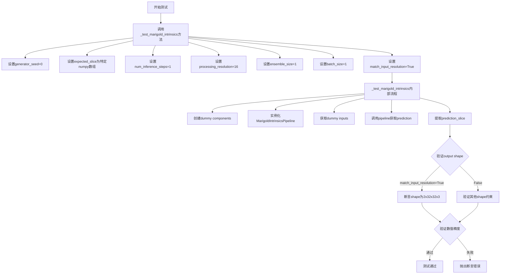

#### 带注释源码

```python
def test_marigold_depth_dummy_G0_S1_P16_E1_B1_M1(self):
    """
    测试 MarigoldIntrinsicsPipeline 在特定参数配置下的预测功能。
    
    参数配置含义：
    - G0: generator_seed = 0
    - S1: num_inference_steps = 1
    - P16: processing_resolution = 16
    - E1: ensemble_size = 1
    - B1: batch_size = 1
    - M1: match_input_resolution = True
    """
    self._test_marigold_intrinsics(
        generator_seed=0,  # 设置随机种子为0，确保可重复性
        # 预期输出的最后3x3像素的最后一个通道的扁平化结果
        expected_slice=np.array([0.53132, 0.44487, 0.40164, 0.5326, 0.49073, 0.46979, 0.53324, 0.51366, 0.50387]),
        num_inference_steps=1,  # 推理步数为1
        processing_resolution=16,  # 处理分辨率为16
        ensemble_size=1,  # 集成数量为1（不进行多模型集成）
        batch_size=1,  # 批大小为1
        match_input_resolution=True,  # 输出分辨率需匹配输入分辨率
    )
```

### 底层方法 `_test_marigold_intrinsics` 详细信息

#### 参数

- `self`：`MarigoldIntrinsicsPipelineTesterMixin`，测试混入类实例
- `generator_seed: int = 0`：随机数生成器种子，用于控制推理过程的随机性
- `expected_slice: np.ndarray = None`：期望的预测输出切片，用于验证结果正确性
- `atol: float = 1e-4`：绝对误差容忍度，用于数值比较
- `**pipe_kwargs`：其他传递给 pipeline 的关键字参数

#### 返回值

- `None`：测试方法，通过断言进行验证

#### 流程图

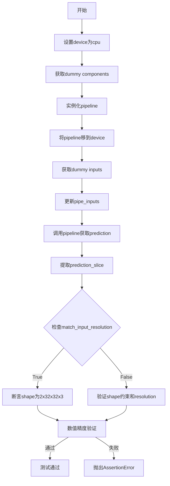

#### 带注释源码

```python
def _test_marigold_intrinsics(
    self,
    generator_seed: int = 0,
    expected_slice: np.ndarray = None,
    atol: float = 1e-4,
    **pipe_kwargs,
):
    """
    通用 intrinsics 预测测试方法。
    
    该方法创建一个虚拟的 MarigoldIntrinsicsPipeline，使用 dummy 组件
    进行推理，并验证输出的形状和数值是否符合预期。
    
    Args:
        generator_seed: 随机数种子，确保推理过程可重复
        expected_slice: 期望的输出切片，用于验证预测精度
        atol: 绝对误差容忍度
        **pipe_kwargs: 其他传递给 pipeline 的参数
    """
    device = "cpu"
    # 获取虚拟模型组件（UNet, VAE, Scheduler, TextEncoder等）
    components = self.get_dummy_components()

    # 使用虚拟组件实例化 pipeline
    pipe = self.pipeline_class(**components)
    pipe.to(device)
    pipe.set_progress_bar_config(disable=None)

    # 获取虚拟输入，包括随机生成的图像和生成器
    pipe_inputs = self.get_dummy_inputs(device, seed=generator_seed)
    # 将额外的参数更新到输入中
    pipe_inputs.update(**pipe_kwargs)

    # 调用 pipeline 进行推理，获取预测结果
    prediction = pipe(**pipe_inputs).prediction

    # 提取预测结果的切片：取最后一个通道的最后3x3区域并展平
    prediction_slice = prediction[0, -3:, -3:, -1].flatten()

    # 验证输出形状
    if pipe_inputs.get("match_input_resolution", True):
        # 当 match_input_resolution=True 时，输出应为 2x32x32x3
        # 2 表示 (depth, normal) 或其他 intrinsics 通道
        self.assertEqual(prediction.shape, (2, 32, 32, 3), "Unexpected output resolution")
    else:
        # 否则验证其他维度约束
        self.assertTrue(prediction.shape[0] == 2 and prediction.shape[3] == 3, "Unexpected output dimensions")
        # 验证最大分辨率是否匹配 processing_resolution
        self.assertEqual(
            max(prediction.shape[1:3]),
            pipe_inputs.get("processing_resolution", 768),
            "Unexpected output resolution",
        )

    # 设置 numpy 打印选项
    np.set_printoptions(precision=5, suppress=True)
    msg = f"{prediction_slice}"
    # 验证预测值是否在容差范围内
    self.assertTrue(np.allclose(prediction_slice, expected_slice, atol=atol), msg)
```


### `MarigoldIntrinsicsPipelineFastTests.test_marigold_depth_dummy_G2024_S1_P32_E1_B1_M1`

这是一个单元测试方法，用于验证 Marigold Intrinsics Pipeline 在特定配置下（generator_seed=2024, num_inference_steps=1, processing_resolution=32, ensemble_size=1, batch_size=1, match_input_resolution=True）的功能正确性。

参数：

-  `self`：隐式参数，测试类实例本身，无类型描述

返回值：无返回值（`None`），该方法通过 `self.assertTrue` 断言验证管道输出的预测值是否与预期值匹配

#### 流程图

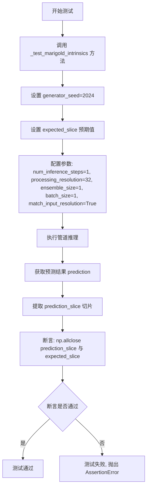

#### 带注释源码

```python
def test_marigold_depth_dummy_G2024_S1_P32_E1_B1_M1(self):
    """
    测试 Marigold Intrinsics Pipeline 的特定配置
    配置说明:
    - G2024: generator_seed = 2024 (随机种子)
    - S1: num_inference_steps = 1 (推理步数)
    - P32: processing_resolution = 32 (处理分辨率)
    - E1: ensemble_size = 1 (集成数量)
    - B1: batch_size = 1 (批次大小)
    - M1: match_input_resolution = True (匹配输入分辨率)
    """
    # 调用内部测试方法 _test_marigold_intrinsics 进行验证
    self._test_marigold_intrinsics(
        generator_seed=2024,  # 设置随机种子为 2024
        # 预期输出的预测切片值 (3x3 区域的最后一个通道)
        expected_slice=np.array([0.40257, 0.39468, 0.51373, 0.4161, 0.40162, 0.58535, 0.43581, 0.47834, 0.48951]),
        num_inference_steps=1,  # 扩散模型推理步数
        processing_resolution=32,  # 处理图像的分辨率
        ensemble_size=1,  # 集成的ensemble数量
        batch_size=1,  # 批次大小
        match_input_resolution=True,  # 输出是否匹配输入分辨率
    )
```


### `MarigoldIntrinsicsPipelineFastTests.test_marigold_depth_dummy_G0_S2_P32_E1_B1_M1`

该测试方法用于验证 Marigold Intrinsics Pipeline 在特定参数配置下（generator_seed=0, num_inference_steps=2, processing_resolution=32, ensemble_size=1, batch_size=1, match_input_resolution=True）的功能是否正常，通过比对预测输出的切片值与预期值来确认管道的正确性。

参数：
- 无显式参数（继承自 unittest.TestCase，隐含 self 参数）

返回值：无返回值（`None`），该方法为单元测试方法，通过断言验证正确性

#### 流程图

```mermaid
flowchart TD
    A[开始测试 test_marigold_depth_dummy_G0_S2_P32_E1_B1_M1] --> B[调用 _test_marigold_intrinsics 方法]
    
    B --> C[设置 device='cpu']
    C --> D[获取虚拟组件 get_dummy_components]
    D --> E[创建 MarigoldIntrinsicsPipeline 实例]
    E --> F[将 pipeline 移到 device]
    F --> G[获取虚拟输入 get_dummy_inputs]
    G --> H[更新 pipe_inputs 参数]
    H --> I[执行 pipeline 预测]
    I --> J[提取预测结果切片 prediction[0, -3:, -3:, -1]]
    J --> K{检查 match_input_resolution?}
    K -->|True| L[断言输出形状为 (2, 32, 32, 3)]
    K -->|False| M[断言输出维度并检查 processing_resolution]
    L --> N[使用 np.allclose 比对预测值与 expected_slice]
    M --> N
    N --> O{断言通过?}
    O -->|是| P[测试通过]
    O -->|否| Q[测试失败 - 抛出 AssertionError]
```

#### 带注释源码

```python
def test_marigold_depth_dummy_G0_S2_P32_E1_B1_M1(self):
    """
    测试 Marigold Intrinsics Pipeline 在特定参数配置下的功能:
    - generator_seed: 0 (使用固定随机种子以确保可重复性)
    - num_inference_steps: 2 (推理步数)
    - processing_resolution: 32 (处理分辨率)
    - ensemble_size: 1 (集成数量)
    - batch_size: 1 (批处理大小)
    - match_input_resolution: True (匹配输入分辨率)
    
    预期输出切片值: [0.49636, 0.4518, 0.42722, 0.59044, 0.6362, 0.39011, 0.53522, 0.55153, 0.48699]
    """
    # 调用内部测试方法，传入指定的参数配置
    self._test_marigold_intrinsics(
        generator_seed=0,  # 随机数生成器种子
        # 预期的预测输出切片值 (来自最后一个通道的 3x3 区域)
        expected_slice=np.array([0.49636, 0.4518, 0.42722, 0.59044, 0.6362, 0.39011, 0.53522, 0.55153, 0.48699]),
        num_inference_steps=2,  # DDIM 调度器的推理步数
        processing_resolution=32,  # 处理图像的分辨率
        ensemble_size=1,  # 集成预测的数量
        batch_size=1,  # 输入批处理大小
        match_input_resolution=True,  # 是否将输出分辨率匹配到输入分辨率
    )
```


### `MarigoldIntrinsicsPipelineFastTests.test_marigold_depth_dummy_G0_S1_P64_E1_B1_M1`

该测试方法用于验证 Marigold 内在属性（Intrinsics）管道在特定参数配置下（generator_seed=0, num_inference_steps=1, processing_resolution=64, ensemble_size=1, batch_size=1, match_input_resolution=True）的功能正确性，通过对比输出来确保管道实现符合预期。

参数：

- `self`：隐式参数，测试类实例本身，由 unittest 框架自动传入

返回值：`None`，该方法为 unittest 测试用例，通过断言验证预测结果的正确性

#### 流程图

```mermaid
flowchart TD
    A[测试开始] --> B[调用 _test_marigold_intrinsics 方法]
    B --> C[设置 generator_seed=0]
    B --> D[设置 expected_slice 期望值]
    B --> E[设置 num_inference_steps=1]
    B --> F[设置 processing_resolution=64]
    B --> G[设置 ensemble_size=1]
    B --> H[设置 batch_size=1]
    B --> I[设置 match_input_resolution=True]
    
    I --> J[_test_marigold_intrinsics 内部执行]
    J --> K[创建虚拟组件 UNet/Vae/TextEncoder/Tokenizer]
    K --> L[初始化 MarigoldIntrinsicsPipeline]
    L --> M[准备虚拟输入图像]
    M --> N[调用 pipeline 执行推理]
    N --> O[获取预测结果 prediction]
    O --> P[提取预测切片]
    P --> Q{验证输出形状}
    Q -->|匹配分辨率| R[断言 shape == (2, 32, 32, 3)]
    Q -->|不匹配分辨率| S[验证 shape[0]==2 和 shape[3]==3]
    R --> T[数值断言: 预测切片 ≈ 期望切片]
    S --> T
    T --> U[测试通过/失败]
```

#### 带注释源码

```python
def test_marigold_depth_dummy_G0_S1_P64_E1_B1_M1(self):
    """
    测试 Marigold 内在属性管道
    参数配置: G(enerator seed)=0, S(teps)=1, P(rocessing resolution)=64, 
             E(nsemble size)=1, B(atch size)=1, M(atch input resolution)=1
    
    该测试验证管道在处理分辨率为64时的推理功能
    """
    # 调用内部测试方法，传入特定参数组合
    # generator_seed=0: 固定随机种子以确保可复现性
    # processing_resolution=64: 处理分辨率为64x64像素
    # num_inference_steps=1: 仅进行1步推理（快速测试）
    # ensemble_size=1: 不使用集成
    # batch_size=1: 单批次处理
    # match_input_resolution=True: 输出分辨率匹配输入
    self._test_marigold_intrinsics(
        generator_seed=0,  # 随机种子，确保确定性输出
        # 期望的预测切片值（来自已知正确实现）
        expected_slice=np.array([0.55547, 0.43511, 0.4887, 0.56399, 0.63867, 0.56337, 0.47889, 0.52925, 0.49235]),
        num_inference_steps=1,  # 推理步数
        processing_resolution=64,  # 处理分辨率
        ensemble_size=1,  # 集成数量
        batch_size=1,  # 批处理大小
        match_input_resolution=True,  # 是否匹配输入分辨率
    )
```

#### 关联方法详情

**`_test_marigold_intrinsics` 方法参数**（该测试调用的底层方法）：

- `generator_seed: int = 0` - 随机数生成器种子
- `expected_slice: np.ndarray = None` - 期望的预测输出切片
- `atol: float = 1e-4` - 绝对误差容限
- `**pipe_kwargs` - 传递给管道的额外关键字参数

**返回值**：`None`（通过断言验证）

该测试方法的核心验证逻辑在 `_test_marigold_intrinsics` 中实现：

```python
def _test_marigold_intrinsics(
    self,
    generator_seed: int = 0,
    expected_slice: np.ndarray = None,
    atol: float = 1e-4,
    **pipe_kwargs,
):
    device = "cpu"
    components = self.get_dummy_components()  # 获取虚拟组件

    pipe = self.pipeline_class(**components)  # 创建管道实例
    pipe.to(device)
    pipe.set_progress_bar_config(disable=None)

    # 准备输入参数
    pipe_inputs = self.get_dummy_inputs(device, seed=generator_seed)
    pipe_inputs.update(**pipe_kwargs)

    # 执行推理并获取预测结果
    prediction = pipe(**pipe_inputs).prediction

    # 提取预测切片用于验证
    prediction_slice = prediction[0, -3:, -3:, -1].flatten()

    # 验证输出形状
    if pipe_inputs.get("match_input_resolution", True):
        self.assertEqual(prediction.shape, (2, 32, 32, 3), "Unexpected output resolution")
    else:
        self.assertTrue(prediction.shape[0] == 2 and prediction.shape[3] == 3, "Unexpected output dimensions")
        self.assertEqual(
            max(prediction.shape[1:3]),
            pipe_inputs.get("processing_resolution", 768),
            "Unexpected output resolution",
        )

    # 数值验证：确保预测结果与期望值接近
    np.set_printoptions(precision=5, suppress=True)
    msg = f"{prediction_slice}"
    self.assertTrue(np.allclose(prediction_slice, expected_slice, atol=atol), msg)
```


### `MarigoldIntrinsicsPipelineFastTests.test_marigold_depth_dummy_G0_S1_P32_E3_B1_M1`

这是一个单元测试方法，用于验证 Marigold 内在属性管道（Marigold Intrinsics Pipeline）在特定配置下的功能正确性。该测试使用预定义的虚拟组件，通过特定的参数组合（生成器种子=0、推理步数=1、处理分辨率=32、集合大小=3、批量大小=1、匹配输入分辨率=True）运行推理流程，并验证输出的预测结果是否与预期的切片值匹配。

参数：

- `self`：隐式参数，测试类实例本身

返回值：`None`，该方法为单元测试方法，通过断言验证结果，不返回任何值

#### 流程图

```mermaid
flowchart TD
    A[开始测试方法] --> B[调用 _test_marigold_intrinsics]
    B --> C[设置 generator_seed=0]
    B --> D[设置 expected_slice]
    B --> E[设置 num_inference_steps=1]
    B --> F[设置 processing_resolution=32]
    B --> G[设置 ensemble_size=3]
    B --> H[设置 ensembling_kwargs={'reduction': 'mean'}]
    B --> I[设置 batch_size=1]
    B --> J[设置 match_input_resolution=True]
    C --> K[执行管道推理]
    D --> K
    E --> K
    F --> K
    G --> K
    H --> K
    I --> K
    J --> K
    K --> L[获取预测结果]
    L --> M[提取预测切片 prediction[0, -3:, -3:, -1]]
    M --> N[断言预测切片与期望值匹配]
    N --> O[结束测试]
```

#### 带注释源码

```python
def test_marigold_depth_dummy_G0_S1_P32_E3_B1_M1(self):
    """
    测试 Marigold 内在属性管道：
    - 生成器种子: 0
    - 推理步数: 1
    - 处理分辨率: 32
    - 集合大小: 3
    - 批量大小: 1
    - 匹配输入分辨率: True
    """
    # 调用内部测试方法 _test_marigold_intrinsics，传入特定的测试参数
    self._test_marigold_intrinsics(
        generator_seed=0,  # 设置随机生成器种子为0，确保可重复性
        # 期望的预测输出切片（最后3x3像素的RGB通道值）
        expected_slice=np.array([0.57249, 0.49824, 0.54438, 0.57733, 0.52404, 0.5255, 0.56493, 0.56336, 0.48579]),
        num_inference_steps=1,  # 扩散模型推理步数为1（快速测试）
        processing_resolution=32,  # 处理分辨率为32x32像素
        ensemble_size=3,  # 使用3次推理集合来增强结果
        ensembling_kwargs={"reduction": "mean"},  # 集合方法：取平均值
        batch_size=1,  # 输入批量大小为1
        match_input_resolution=True,  # 输出分辨率匹配输入分辨率
    )
```


### `MarigoldIntrinsicsPipelineFastTests.test_marigold_depth_dummy_G0_S1_P32_E4_B2_M1`

这是一个测试方法，用于验证 MarigoldIntrinsicsPipeline 在特定参数配置下（generator_seed=0, num_inference_steps=1, processing_resolution=32, ensemble_size=4, batch_size=2, match_input_resolution=True）的深度和外观（depth & appearance）预测功能。

参数：

- `self`：测试类实例，无需显式传递

返回值：无（`None`），这是一个测试方法，不返回任何值

#### 流程图

```mermaid
flowchart TD
    A[开始执行 test_marigold_depth_dummy_G0_S1_P32_E4_B2_M1] --> B[调用 _test_marigold_intrinsics 方法]
    
    B --> C[设置参数:
    - generator_seed=0
    - num_inference_steps=1
    - processing_resolution=32
    - ensemble_size=4
    - batch_size=2
    - match_input_resolution=True
    - ensembling_kwargs={'reduction': 'mean'}]
    
    C --> D[_test_marigold_intrinsics 内部流程]
    
    D --> E[获取虚拟组件 get_dummy_components]
    E --> F[创建 MarigoldIntrinsicsPipeline 实例]
    F --> G[获取虚拟输入 get_dummy_inputs]
    G --> H[更新输入参数]
    H --> I[执行 pipeline 推理]
    I --> J[提取预测结果 prediction]
    J --> K[验证输出形状: (2, 32, 32, 3)]
    K --> L[验证预测值与 expected_slice 匹配]
    L --> M[测试结束]
```

#### 带注释源码

```python
def test_marigold_depth_dummy_G0_S1_P32_E4_B2_M1(self):
    """
    测试 MarigoldIntrinsicsPipeline 的深度和外观预测功能
    配置: Generator seed=0, Steps=1, Resolution=32, Ensemble=4, Batch=2, MatchResolution=True
    
    该测试方法验证管道在以下参数组合下的正确性:
    - generator_seed: 0 (随机种子)
    - num_inference_steps: 1 (推理步数)
    - processing_resolution: 32 (处理分辨率)
    - ensemble_size: 4 (集成数量)
    - batch_size: 2 (批次大小)
    - match_input_resolution: True (匹配输入分辨率)
    - ensembling_kwargs: {'reduction': 'mean'} (集成方法)
    """
    # 调用内部测试方法 _test_marigold_intrinsics，传入特定的测试参数
    self._test_marigold_intrinsics(
        generator_seed=0,  # 设置随机种子为0，确保可重复性
        # 预期输出的预测切片值（最后3x3区域，RGB通道的最后一个通道）
        expected_slice=np.array([0.6294, 0.5575, 0.53414, 0.61077, 0.57156, 0.53974, 0.52956, 0.55467, 0.48751]),
        num_inference_steps=1,  # 使用单步推理加快测试速度
        processing_resolution=32,  # 处理分辨率为32x32
        ensemble_size=4,  # 使用4个集成预测
        ensembling_kwargs={"reduction": "mean"},  # 集成方法：取平均值
        batch_size=2,  # 批次大小为2
        match_input_resolution=True,  # 输出分辨率匹配输入分辨率
    )
```


### `MarigoldIntrinsicsPipelineFastTests.test_marigold_depth_dummy_G0_S1_P16_E1_B1_M0`

该测试方法用于验证 Marigold  intrinsics 管道在特定参数配置下（generator_seed=0, 1次推理步骤, 16分辨率, 1个集成, 1个批次, 不匹配输入分辨率）的功能正确性，通过对比预测结果与预期值数组来确认管道工作的准确性。

参数：无（继承自 `unittest.TestCase`，使用默认测试框架参数）

返回值：`None`，该方法为单元测试方法，通过 `self.assertTrue` 和 `self.assertEqual` 进行断言验证，不返回具体值

#### 流程图

```mermaid
flowchart TD
    A[开始测试 test_marigold_depth_dummy_G0_S1_P16_E1_B1_M0] --> B[调用 _test_marigold_intrinsics 方法]
    B --> C[设置 generator_seed=0]
    B --> D[设置 expected_slice 预期值数组]
    B --> E[设置 num_inference_steps=1]
    B --> F[设置 processing_resolution=16]
    B --> G[设置 ensemble_size=1]
    B --> H[设置 batch_size=1]
    B --> I[设置 match_input_resolution=False]
    C --> J[在 _test_marigold_intrinsics 中获取虚拟组件]
    D --> J
    E --> J
    F --> J
    G --> J
    H --> J
    I --> J
    J --> K[创建 MarigoldIntrinsicsPipeline 管道]
    K --> L[加载虚拟输入数据]
    L --> M[执行管道推理]
    M --> N[提取预测结果切片]
    N --> O{验证 match_input_resolution=False}
    O -->|是| P[验证输出维度为 2xHxWx3]
    O -->|否| Q[验证输出分辨率为处理分辨率]
    P --> R[断言预测值与预期值接近]
    Q --> R
    R --> S[测试通过]
    R --> T[测试失败]
```

#### 带注释源码

```python
def test_marigold_depth_dummy_G0_S1_P16_E1_B1_M0(self):
    """
    测试 Marigold Intrinsics 管道在特定参数配置下的功能
    
    参数说明：
    - G0: generator_seed = 0 (随机种子设为0)
    - S1: num_inference_steps = 1 (单步推理)
    - P16: processing_resolution = 16 (16x16处理分辨率)
    - E1: ensemble_size = 1 (无集成)
    - B1: batch_size = 1 (单批次)
    - M0: match_input_resolution = False (不匹配输入分辨率)
    """
    # 调用通用的 intrinsics 测试方法，传入上述配置参数
    self._test_marigold_intrinsics(
        generator_seed=0,  # 随机数生成器种子
        # 预期的输出切片值（9个浮点数）
        expected_slice=np.array([0.63511, 0.68137, 0.48783, 0.46689, 0.58505, 0.36757, 0.58465, 0.54302, 0.50387]),
        num_inference_steps=1,  # 推理步数
        processing_resolution=16,  # 处理分辨率
        ensemble_size=1,  # 集成数量
        batch_size=1,  # 批次大小
        match_input_resolution=False,  # 不匹配输入分辨率
    )
```


### `MarigoldIntrinsicsPipelineFastTests.test_marigold_depth_dummy_no_num_inference_steps`

这是一个单元测试方法，用于验证当 `num_inference_steps` 参数为 `None` 时，`MarigoldIntrinsicsPipeline` 是否会正确抛出包含 "num_inference_steps" 信息的 `ValueError` 异常。

参数：

- `self`：隐式参数，测试类实例本身

返回值：无（`None`），这是一个测试方法，不返回任何值

#### 流程图

```mermaid
flowchart TD
    A[开始测试] --> B[调用 _test_marigold_intrinsics 方法]
    B --> C[传入 num_inference_steps=None]
    C --> D{是否抛出 ValueError?}
    D -->|是| E[捕获 ValueError 异常]
    D -->|否| F[测试失败: 未抛出预期异常]
    E --> G[检查错误信息是否包含 'num_inference_steps']
    G -->|是| H[测试通过]
    G -->|否| I[测试失败: 错误信息不匹配]
    
    style F fill:#ffcccc
    style I fill:#ffcccc
    style H fill:#ccffcc
```

#### 带注释源码

```python
def test_marigold_depth_dummy_no_num_inference_steps(self):
    """
    测试当 num_inference_steps 参数为 None 时，管道是否正确抛出 ValueError 异常。
    这是一个负面测试用例，用于验证参数验证逻辑。
    """
    # 使用 assertRaises 上下文管理器捕获预期的 ValueError 异常
    with self.assertRaises(ValueError) as e:
        # 调用内部测试方法，传入 num_inference_steps=None
        # 期望管道在处理时检测到该参数为 None 并抛出异常
        self._test_marigold_intrinsics(
            num_inference_steps=None,  # 关键测试参数：设为 None
            expected_slice=np.array([0.0]),  # 预期输出（实际上不会执行到这里）
        )
        # 注意：此行代码在 with 块外部，实际上永远不会执行
        # 因为异常发生后代码流程会跳出 with 块
        self.assertIn("num_inference_steps", str(e))
```


### `MarigoldIntrinsicsPipelineFastTests.test_marigold_depth_dummy_no_processing_resolution`

该测试方法用于验证当 `processing_resolution` 参数为 `None` 时，`MarigoldIntrinsicsPipeline` 管道会正确抛出 `ValueError` 异常。这是输入验证测试，确保必需的参数被正确传递。

参数：

- `self`：`MarigoldIntrinsicsPipelineFastTests` 实例，测试类的方法隐式参数

返回值：`None`，无返回值（测试方法）

#### 流程图

```mermaid
flowchart TD
    A[开始测试 test_marigold_depth_dummy_no_processing_resolution] --> B[使用 assertRaises 捕获 ValueError]
    B --> C[调用 _test_marigold_intrinsics 方法]
    C --> D[传入 processing_resolution=None]
    D --> E{管道是否抛出 ValueError?}
    E -->|是| F[验证异常消息包含 'processing_resolution']
    F --> G[测试通过]
    E -->|否| H[测试失败]
    G --> I[结束]
    H --> I
```

#### 带注释源码

```python
def test_marigold_depth_dummy_no_processing_resolution(self):
    """
    测试当 processing_resolution 参数为 None 时，管道是否正确抛出 ValueError。
    
    该测试用于验证 MarigoldIntrinsicsPipeline 的输入验证逻辑，
    确保必需的 processing_resolution 参数被正确传递。
    """
    # 使用 assertRaises 上下文管理器捕获预期的 ValueError 异常
    with self.assertRaises(ValueError) as e:
        # 调用内部测试方法，传入 processing_resolution=None
        # 预期管道会检测到该无效参数并抛出 ValueError
        self._test_marigold_intrinsics(
            processing_resolution=None,  # 设为 None，触发验证错误
            expected_slice=np.array([0.0]),  # 期望的输出切片（不会被使用）
        )
        # 验证异常消息中包含 'processing_resolution' 字符串
        # 以确保错误信息清晰指向问题参数
        self.assertIn("processing_resolution", str(e))
```


### `MarigoldIntrinsicsPipelineIntegrationTests.setUp`

该方法是一个测试 fixture（测试初始化方法），在每个集成测试方法运行前执行必要的资源清理和准备工作，确保测试环境处于干净的初始状态。

参数：

- `self`：`unittest.TestCase`，表示测试类的实例本身

返回值：`None`，该方法不返回任何值，仅执行初始化操作

#### 流程图

```mermaid
flowchart TD
    A[开始 setUp] --> B[调用父类 setUp 方法]
    B --> C[执行垃圾回收 gc.collect]
    C --> D[调用后端缓存清理 backend_empty_cache]
    D --> E[结束 setUp]
```

#### 带注释源码

```python
def setUp(self):
    """
    测试方法执行前的初始化操作。
    继承自 unittest.TestCase 的 setUp 方法，
    会在每个测试方法运行前自动调用。
    """
    # 调用父类的 setUp 方法，完成 unittest.TestCase 的标准初始化
    super().setUp()
    
    # 执行 Python 垃圾回收，释放不再使用的内存对象
    # 这对于需要大量 GPU 内存的深度学习测试尤为重要
    gc.collect()
    
    # 清空后端设备（GPU/XPU）的缓存
    # 确保测试之间没有内存残留，避免内存泄漏影响测试结果
    # torch_device 是从 testing_utils 导入的全局变量，表示当前测试设备
    backend_empty_cache(torch_device)
```


### `MarigoldIntrinsicsPipelineIntegrationTests.tearDown`

该方法是测试类的清理方法，在每个集成测试用例执行完成后被调用，用于释放测试过程中占用的内存和GPU资源，确保测试环境干净，防止测试间的资源泄漏和相互影响。

参数：

- 该方法无参数（隐式接收 `self` 参数）

返回值：`None`，无返回值

#### 流程图

```mermaid
flowchart TD
    A[tearDown 开始] --> B[调用父类 tearDown]
    B --> C[执行 gc.collect 垃圾回收]
    C --> D[调用 backend_empty_cache 清理GPU缓存]
    D --> E[tearDown 结束]
```

#### 带注释源码

```python
def tearDown(self):
    """
    测试用例完成后的清理方法
    
    该方法在每个集成测试用例执行完毕后被调用，负责清理测试过程中
    产生的临时对象和GPU显存，确保测试环境保持干净状态，避免
    测试之间的相互影响和资源泄漏。
    """
    # 调用父类的 tearDown 方法，执行 unittest.TestCase 的标准清理
    super().tearDown()
    
    # 执行 Python 垃圾回收，清理不再引用的对象
    gc.collect()
    
    # 清理 GPU/XPU 等后端的显存缓存，释放设备内存
    backend_empty_cache(torch_device)
```


### `MarigoldIntrinsicsPipelineIntegrationTests._test_marigold_intrinsics`

这是一个集成测试方法，用于测试 Marigold Intrinsics Pipeline 的 intrinsics（外观属性如反照率、法线等）预测功能。该方法通过加载预训练模型，对输入图像进行推理，并验证输出的形状和数值是否符合预期。

参数：

- `self`：隐式参数，测试类实例本身
- `is_fp16`：`bool`，是否使用 FP16 精度（默认 `True`）
- `device`：`str`，运行设备（默认 `"cuda"`）
- `generator_seed`：`int`，随机数生成器种子（默认 `0`）
- `expected_slice`：`np.ndarray`，用于验证的期望输出切片（默认 `None`）
- `model_id`：`str`，预训练模型 ID 或路径（默认 `"prs-eth/marigold-iid-appearance-v1-1"`）
- `image_url`：`str`，输入图像的 URL（默认 `"https://marigoldmonodepth.github.io/images/einstein.jpg"`）
- `atol`：`float`，数值比较的绝对容差（默认 `1e-3`）
- `**pipe_kwargs`：可变关键字参数，传递给 pipeline 的额外参数

返回值：`None`，该方法为测试方法，不返回值，通过断言验证结果

#### 流程图

```mermaid
flowchart TD
    A[开始] --> B{is_fp16 为 True?}
    B -->|是| C[设置 variant=fp16<br/>torch_dtype=torch.float16]
    B -->|否| D[空字典]
    C --> E
    D --> E
    E[从预训练模型加载 Pipeline] --> F{device in [cuda, xpu]?}
    F -->|是| G[启用 CPU Offload]
    F -->|否| H[跳过]
    G --> I
    H --> I
    I[设置进度条为启用] --> J[创建随机数生成器<br/>seed=generator_seed]
    J --> K[从 URL 加载图像]
    K --> L[调用 pipeline 推理<br/>获取 prediction]
    L --> M[提取预测切片<br/>prediction[0, -3:, -3:, -1].flatten()]
    M --> N{pipe_kwargs 中<br/>match_input_resolution 为 True?}
    N -->|是| O[断言 shape == (2, height, width, 3)]
    N -->|否| P[断言 shape[0]==2 and shape[3]==3<br/>max(shape[1:3]) == 处理分辨率]
    O --> Q[数值比较断言<br/>np.allclose]
    P --> Q
    Q --> R[结束]
```

#### 带注释源码

```python
def _test_marigold_intrinsics(
    self,
    is_fp16: bool = True,              # 是否使用 FP16 精度
    device: str = "cuda",               # 运行设备
    generator_seed: int = 0,            # 随机种子
    expected_slice: np.ndarray = None,  # 期望的输出切片用于验证
    model_id: str = "prs-eth/marigold-iid-appearance-v1-1",  # 模型标识符
    image_url: str = "https://marigoldmonodepth.github.io/images/einstein.jpg",  # 测试图像URL
    atol: float = 1e-3,                  # 数值容差
    **pipe_kwargs,                       # 传递给 pipeline 的额外参数
):
    """测试 Marigold Intrinsics Pipeline 的集成测试方法"""
    
    # 根据 is_fp16 参数构建 from_pretrained 的关键字参数
    from_pretrained_kwargs = {}
    if is_fp16:
        from_pretrained_kwargs["variant"] = "fp16"
        from_pretrained_kwargs["torch_dtype"] = torch.float16

    # 从预训练模型加载 Marigold Intrinsics Pipeline
    pipe = MarigoldIntrinsicsPipeline.from_pretrained(model_id, **from_pretrained_kwargs)
    
    # 如果是 CUDA 或 XPU 设备，启用 CPU offload 以节省显存
    if device in ["cuda", "xpu"]:
        pipe.enable_model_cpu_offload()
    
    # 设置进度条配置为启用
    pipe.set_progress_bar_config(disable=None)

    # 创建指定种子的随机数生成器
    generator = torch.Generator(device=device).manual_seed(generator_seed)

    # 从 URL 加载输入图像
    image = load_image(image_url)
    width, height = image.size

    # 调用 pipeline 进行推理，获取预测结果
    prediction = pipe(image, generator=generator, **pipe_kwargs).prediction

    # 提取预测结果的切片用于验证（取最后一个通道的最后 3x3 区域并展平）
    prediction_slice = prediction[0, -3:, -3:, -1].flatten()

    # 根据 match_input_resolution 参数验证输出形状
    if pipe_kwargs.get("match_input_resolution", True):
        # 如果匹配输入分辨率，验证形状为 (2, height, width, 3)
        # 2 表示输出两个通道（通常是反照率和法线）
        self.assertEqual(prediction.shape, (2, height, width, 3), "Unexpected output resolution")
    else:
        # 否则验证基本维度和处理分辨率
        self.assertTrue(prediction.shape[0] == 2 and prediction.shape[3] == 3, "Unexpected output dimensions")
        self.assertEqual(
            max(prediction.shape[1:3]),
            pipe_kwargs.get("processing_resolution", 768),
            "Unexpected output resolution",
        )

    # 使用 numpy 的 allclose 验证预测值与期望值的接近程度
    msg = f"{prediction_slice}"
    self.assertTrue(np.allclose(prediction_slice, expected_slice, atol=atol), msg)
```


### `MarigoldIntrinsicsPipelineIntegrationTests.test_marigold_intrinsics_einstein_f32_cpu_G0_S1_P32_E1_B1_M1`

该测试方法用于验证 Marigold Intrinsics 管道在 CPU 设备上以 float32 精度运行时的基本功能，测试参数配置为 generator_seed=0、num_inference_steps=1、processing_resolution=32、ensemble_size=1、batch_size=1、match_input_resolution=True，通过对比输出预测值与预期切片来验证管道的正确性。

参数：

- `self`：`unittest.TestCase`，测试类的实例本身，无需显式传递

返回值：`None`，该方法为测试方法，通过 `self.assertTrue` 和 `self.assertEqual` 断言进行验证，不返回具体值

#### 流程图

```mermaid
flowchart TD
    A[开始测试 test_marigold_intrinsics_einstein_f32_cpu_G0_S1_P32_E1_B1_M1] --> B[调用 _test_marigold_intrinsics 方法]
    B --> C[设置 is_fp16=False, device=cpu]
    C --> D[设置 generator_seed=0]
    D --> E[设置 expected_slice 为全 0.9162 的数组]
    E --> F[设置 num_inference_steps=1, processing_resolution=32]
    F --> G[设置 ensemble_size=1, batch_size=1, match_input_resolution=True]
    G --> H[_test_marigold_intrinsics 内部流程: 加载模型 prs-eth/marigold-iid-appearance-v1-1]
    H --> I[加载 Einstein 图像]
    I --> J[使用 pipeline 进行推理]
    J --> K[提取预测结果切片]
    K --> L{验证输出形状}
    L -->|match_input_resolution=True| M[断言 shape == (2, height, width, 3)]
    L -->|match_input_resolution=False| N[断言 shape 符合 processing_resolution]
    M --> O[验证预测值与 expected_slice 接近]
    N --> O
    O --> P[测试通过 / 测试失败]
```

#### 带注释源码

```python
def test_marigold_intrinsics_einstein_f32_cpu_G0_S1_P32_E1_B1_M1(self):
    """
    测试 Marigold Intrinsics 管道在 CPU 设备上以 float32 精度运行时的基本功能。
    
    测试参数命名规则: G{generator_seed}_S{num_inference_steps}_P{processing_resolution}_E{ensemble_size}_B{batch_size}_M{match_input_resolution}
    - G0: generator_seed = 0
    - S1: num_inference_steps = 1
    - P32: processing_resolution = 32
    - E1: ensemble_size = 1
    - B1: batch_size = 1
    - M1: match_input_resolution = True
    """
    # 调用内部测试方法，传入测试配置参数
    self._test_marigold_intrinsics(
        is_fp16=False,                                          # 不使用 FP16 精度，使用 FP32
        device="cpu",                                           # 在 CPU 设备上运行测试
        generator_seed=0,                                        # 随机数生成器种子为 0
        # 预期输出切片值（全为 0.9162，表示均匀的 intrinsics 预测）
        expected_slice=np.array([0.9162, 0.9162, 0.9162, 0.9162, 0.9162, 0.9162, 0.9162, 0.9162, 0.9162]),
        num_inference_steps=1,                                  # 推理步数为 1
        processing_resolution=32,                               # 处理分辨率为 32
        ensemble_size=1,                                        # 集成数量为 1（无集成）
        batch_size=1,                                           # 批次大小为 1
        match_input_resolution=True,                            # 输出分辨率匹配输入分辨率
    )
```


### `MarigoldIntrinsicsPipelineIntegrationTests.test_marigold_intrinsics_einstein_f32_accelerator_G0_S1_P768_E1_B1_M1`

该测试方法用于验证 Marigold Intrinsics 管道在 accelerator 设备（如 CUDA/XPU）上的功能正确性，使用 32 位浮点数精度，针对 Einstein 图像进行 intrinsics（固有属性）预测，参数配置为 Generator seed=0、1 个推理步数、768 处理分辨率、1 个集成尺寸、1 批次大小且匹配输入分辨率。

参数：

- `self`：隐式参数，测试类实例本身

返回值：无返回值（`None`），该方法为单元测试方法，通过 `self.assert*` 系列断言验证预测结果的正确性

#### 流程图

```mermaid
flowchart TD
    A[开始测试] --> B[调用 _test_marigold_intrinsics 方法]
    B --> C{设置参数}
    C --> D[is_fp16=False<br/>device=torch_device<br/>generator_seed=0<br/>expected_slice=...]
    D --> E[num_inference_steps=1<br/>processing_resolution=768<br/>ensemble_size=1<br/>batch_size=1<br/>match_input_resolution=True]
    E --> F[进入 _test_marigold_intrinsics 内部逻辑]
    
    F --> G[构造 from_pretrained_kwargs<br/>variant='fp16', torch_dtype=float16]
    G --> H[从预训练模型加载 MarigoldIntrinsicsPipeline]
    H --> I[如设备为 cuda/xpu则启用 CPU offload]
    J[设置进度条配置]
    K[创建 Generator 并设置种子]
    L[加载 Einstein 图像]
    M[调用 pipeline 推理]
    N[提取预测结果切片]
    O{验证输出形状}
    O -->|match_input_resolution=True| P[验证 shape = (2, height, width, 3)]
    O -->|match_input_resolution=False| Q[验证 shape[0]==2 & shape[3]==3]
    P --> R[断言预测值与期望值接近]
    Q --> R
    R --> S[测试结束]
```

#### 带注释源码

```python
def test_marigold_intrinsics_einstein_f32_accelerator_G0_S1_P768_E1_B1_M1(self):
    """
    测试 Marigold Intrinsics 管道在 accelerator 设备（CUDA/XPU）上的功能
    使用 32 位浮点数精度，测试参数：
    - Generator seed = 0
    - 推理步数 = 1
    - 处理分辨率 = 768
    - 集成尺寸 = 1
    - 批次大小 = 1
    - 匹配输入分辨率 = True
    """
    # 调用内部测试方法，传入特定测试参数
    # is_fp16=False: 使用 32 位浮点数（full precision）
    # device=torch_device: 使用配置好的加速器设备
    # generator_seed=0: 固定随机种子以确保可重复性
    # expected_slice: 期望的预测结果切片（最后 3x3 区域的 RGB 值）
    # num_inference_steps=1: 仅进行 1 步推理（快速测试）
    # processing_resolution=768: 处理分辨率为 768x768
    # ensemble_size=1: 不使用集成
    # batch_size=1: 单批次处理
    # match_input_resolution=True: 输出分辨率匹配输入图像
    self._test_marigold_intrinsics(
        is_fp16=False,
        device=torch_device,
        generator_seed=0,
        expected_slice=np.array([0.62127, 0.61906, 0.61687, 0.61946, 0.61903, 0.61961, 0.61808, 0.62099, 0.62894]),
        num_inference_steps=1,
        processing_resolution=768,
        ensemble_size=1,
        batch_size=1,
        match_input_resolution=True,
    )
```


### `MarigoldIntrinsicsPipelineIntegrationTests.test_marigold_intrinsics_einstein_f16_accelerator_G0_S1_P768_E1_B1_M1`

这是一个针对 Marigold Intrinsics Pipeline 的集成测试方法，用于验证模型在 Einstein 图像上使用 FP16 精度和加速器时的 intrinsics（表面外观属性）预测功能是否正确。

参数：

- `self`：测试类实例本身，无类型描述
- 该方法无显式参数，内部调用 `_test_marigold_intrinsics` 方法时使用以下关键字参数：
  - `is_fp16`：`bool`，是否使用 FP16 半精度
  - `device`：`str`，目标设备（从 `torch_device` 全局变量获取）
  - `generator_seed`：`int`，随机数生成器种子
  - `expected_slice`：`np.ndarray`，期望的预测结果切片用于验证
  - `num_inference_steps`：`int`，推理步数
  - `processing_resolution`：`int`，处理分辨率
  - `ensemble_size`：`int`，集成数量
  - `batch_size`：`int`，批处理大小
  - `match_input_resolution`：`bool`，是否匹配输入分辨率

返回值：`None`，该方法为测试方法，无返回值，通过断言验证结果正确性

#### 流程图

```mermaid
flowchart TD
    A[开始测试] --> B{检查 is_fp16 参数}
    B -->|True| C[设置 from_pretrained_kwargs 为 fp16 变体]
    B -->|False| D[设置空的 from_pretrained_kwargs]
    C --> E[从预训练模型加载 MarigoldIntrinsicsPipeline]
    D --> E
    E --> F{device in ['cuda', 'xpu']?}
    F -->|Yes| G[启用模型 CPU 卸载]
    F -->|No| H[跳过 CPU 卸载]
    G --> I[设置进度条配置]
    H --> I
    I --> J[创建随机数生成器并设置种子 0]
    J --> K[从 URL 加载 Einstein 图像]
    K --> L[调用 pipeline 进行预测]
    L --> M[提取预测结果的切片]
    N{检查 match_input_resolution?}
    N -->|True| O[验证预测形状为 2, height, width, 3]
    N -->|False| P[验证预测形状和分辨率]
    O --> Q[使用 np.allclose 验证结果]
    P --> Q
    Q --> R[测试通过]
```

#### 带注释源码

```python
def test_marigold_intrinsics_einstein_f16_accelerator_G0_S1_P768_E1_B1_M1(self):
    """
    测试 Marigold Intrinsics Pipeline 在 Einstein 图像上的 FP16 加速器推理
    配置: Generator seed=0, Steps=1, Resolution=768, Ensemble=1, Batch=1, Match input=True
    """
    # 调用内部测试方法，传入关键字参数
    self._test_marigold_intrinsics(
        is_fp16=True,                          # 使用 FP16 半精度推理
        device=torch_device,                   # 使用全局设备（cuda/xpu/cpu）
        generator_seed=0,                      # 随机种子为 0，确保可复现性
        expected_slice=np.array([              # 期望的预测结果切片（最后3x3像素）
            0.62109, 0.61914, 0.61719, 
            0.61963, 0.61914, 0.61963, 
            0.61816, 0.62109, 0.62891
        ]),
        num_inference_steps=1,                # 仅进行 1 步推理（快速测试）
        processing_resolution=768,           # 处理分辨率为 768x768
        ensemble_size=1,                      # 不使用集成预测
        batch_size=1,                         # 批处理大小为 1
        match_input_resolution=True,          # 输出分辨率匹配输入图像
    )
```


### `MarigoldIntrinsicsPipelineIntegrationTests.test_marigold_intrinsics_einstein_f16_accelerator_G2024_S1_P768_E1_B1_M1`

这是 Marigold Intrinsics 管道的一个集成测试方法，用于在加速器（GPU）上使用 Einstein 图像测试 Marigold 内在属性（intrinsics）预测功能。该测试使用 FP16 精度、种子 2024、处理分辨率 768、1 个推理步骤、1 个集成样本、批量大小 1，并匹配输入分辨率，验证模型输出的形状和数值准确性。

参数：

- `self`：隐式参数，测试用例实例本身

返回值：`None`，该方法为单元测试方法，通过断言验证预测结果的正确性，不返回任何值

#### 流程图

```mermaid
flowchart TD
    A[开始测试] --> B[清理内存: gc.collect + empty_cache]
    B --> C[设置from_pretrained参数<br/>is_fp16=True<br/>variant=fp16<br/>torch_dtype=torch.float16]
    C --> D[从预训练模型加载管道<br/>model_id=prs-eth/marigold-iid-appearance-v1-1]
    D --> E{device in ['cuda', 'xpu']?}
    E -->|Yes| F[启用模型CPU卸载<br/>enable_model_cpu_offload]
    E -->|No| G[跳过CPU卸载]
    F --> H[设置进度条配置<br/>disable=None]
    G --> H
    H --> I[创建随机数生成器<br/>device=torch_device<br/>seed=2024]
    I --> J[加载测试图像<br/>url=https://marigoldmonodepth.github.io/images/einstein.jpg]
    J --> K[调用管道进行推理<br/>输入image, generator<br/>num_inference_steps=1<br/>processing_resolution=768<br/>ensemble_size=1<br/>batch_size=1<br/>match_input_resolution=True]
    K --> L[获取预测结果<br/>prediction = output.prediction]
    L --> M[提取预测切片<br/>prediction[0, -3:, -3:, -1].flatten]
    M --> N{验证: match_input_resolution=True?}
    N -->|Yes| O[断言形状为<br/>(2, height, width, 3)]
    N -->|No| P[断言形状为<br/>(2, *, *, 3)且最大维度=768]
    O --> Q[验证数值准确性<br/>np.allclose with atol=1e-3]
    P --> Q
    Q --> R[测试完成]
```

#### 带注释源码

```python
def test_marigold_intrinsics_einstein_f16_accelerator_G2024_S1_P768_E1_B1_M1(self):
    """
    集成测试：测试 Marigold Intrinsics 管道在 Einstein 图像上的 FP16 加速器推理
    配置：generator_seed=2024, num_inference_steps=1, processing_resolution=768, 
         ensemble_size=1, batch_size=1, match_input_resolution=True
    """
    # 调用内部测试方法，传递特定参数组合
    self._test_marigold_intrinsics(
        is_fp16=True,                       # 使用 FP16 半精度模型
        device=torch_device,                # 使用全局设备（cuda/xpu）
        generator_seed=2024,                # 随机种子 2024
        # 预期输出数值片（9个浮点值）
        expected_slice=np.array([0.64111, 0.63916, 0.63623, 0.63965, 0.63916, 0.63965, 0.6377, 0.64062, 0.64941]),
        num_inference_steps=1,              # 1 个推理步骤
        processing_resolution=768,           # 处理分辨率 768
        ensemble_size=1,                    # 集成大小为1（无集成）
        batch_size=1,                       # 批量大小为1
        match_input_resolution=True,         # 输出分辨率匹配输入
    )
```

---

### 关联方法：`MarigoldIntrinsicsPipelineIntegrationTests._test_marigold_intrinsics`

由于上述测试方法调用了内部方法 `_test_marigold_intrinsics`，以下是该方法的详细信息：

参数：

- `self`：隐式参数，测试用例实例本身
- `is_fp16: bool`：是否使用 FP16 半精度加载模型
- `device: str`：运行设备（"cuda", "xpu", "cpu" 等）
- `generator_seed: int`：随机数生成器种子
- `expected_slice: np.ndarray`：预期输出数值片，用于断言验证
- `model_id: str`：预训练模型 ID，默认为 "prs-eth/marigold-iid-appearance-v1-1"
- `image_url: str`：输入图像 URL，默认为 Einstein 图像
- `atol: float`：数值比较的绝对容差，默认为 1e-3
- `**pipe_kwargs`：其他传递给管道的关键字参数

返回值：`None`，通过断言验证预测结果，不返回任何值

#### 流程图

```mermaid
flowchart TD
    A[开始] --> B[构建from_pretrained参数<br/>如果是fp16则添加variant和dtype]
    B --> C[从预训练模型加载MarigoldIntrinsicsPipeline]
    C --> D{device in ['cuda', 'xpu']?}
    D -->|Yes| E[启用模型CPU卸载]
    D -->|No| F[跳过]
    E --> G[设置进度条禁用=None]
    F --> G
    G --> H[创建随机数生成器<br/>device=device, seed=generator_seed]
    H --> I[从URL加载图像]
    I --> J[获取图像尺寸width, height]
    J --> K[调用管道推理<br/>pipe(image, generator=generator, **pipe_kwargs)]
    K --> L[获取预测结果prediction]
    L --> M[提取预测切片<br/>prediction[0, -3:, -3:, -1].flatten]
    M --> N{检查match_input_resolution?}
    N -->|True| O[断言形状=(2, height, width, 3)]
    N -->|False| P[断言形状符合输出维度要求<br/>最大维度=processing_resolution]
    O --> Q[使用np.allclose验证数值准确性]
    P --> Q
    Q --> R[结束]
```

#### 带注释源码

```python
def _test_marigold_intrinsics(
    self,
    is_fp16: bool = True,
    device: str = "cuda",
    generator_seed: int = 0,
    expected_slice: np.ndarray = None,
    model_id: str = "prs-eth/marigold-iid-appearance-v1-1",
    image_url: str = "https://marigoldmonodepth.github.io/images/einstein.jpg",
    atol: float = 1e-3,
    **pipe_kwargs,
):
    """
    内部测试方法：执行 Marigold Intrinsics 管道的集成测试
    
    参数：
        is_fp16: 是否使用 FP16 半精度加载模型
        device: 运行设备
        generator_seed: 随机数生成器种子
        expected_slice: 预期输出数值片
        model_id: 预训练模型 ID
        image_url: 测试图像 URL
        atol: 数值比较的绝对容差
        **pipe_kwargs: 传递给管道的其他参数
    """
    # 构建 from_pretrained 的关键字参数
    from_pretrained_kwargs = {}
    if is_fp16:
        from_pretrained_kwargs["variant"] = "fp16"
        from_pretrained_kwargs["torch_dtype"] = torch.float16

    # 从预训练模型加载 Marigold Intrinsics Pipeline
    pipe = MarigoldIntrinsicsPipeline.from_pretrained(model_id, **from_pretrained_kwargs)
    
    # 如果是 cuda 或 xpu 设备，启用模型 CPU 卸载以节省显存
    if device in ["cuda", "xpu"]:
        pipe.enable_model_cpu_offload()
    
    # 设置进度条配置（不禁用）
    pipe.set_progress_bar_config(disable=None)

    # 创建指定种子的随机数生成器
    generator = torch.Generator(device=device).manual_seed(generator_seed)

    # 从 URL 加载测试图像
    image = load_image(image_url)
    width, height = image.size

    # 调用管道进行推理，传入图像、生成器和额外参数
    prediction = pipe(image, generator=generator, **pipe_kwargs).prediction

    # 提取预测结果的切片用于验证（取最后一个通道的后3x3块）
    prediction_slice = prediction[0, -3:, -3:, -1].flatten()

    # 根据 match_input_resolution 参数验证输出形状
    if pipe_kwargs.get("match_input_resolution", True):
        # 如果匹配输入分辨率，输出应为 (2, height, width, 3)
        self.assertEqual(prediction.shape, (2, height, width, 3), "Unexpected output resolution")
    else:
        # 否则验证基本维度要求
        self.assertTrue(prediction.shape[0] == 2 and prediction.shape[3] == 3, "Unexpected output dimensions")
        self.assertEqual(
            max(prediction.shape[1:3]),
            pipe_kwargs.get("processing_resolution", 768),
            "Unexpected output resolution",
        )

    # 验证预测数值与预期值的接近程度
    msg = f"{prediction_slice}"
    self.assertTrue(np.allclose(prediction_slice, expected_slice, atol=atol), msg)
```


### `MarigoldIntrinsicsPipelineIntegrationTests.test_marigold_intrinsics_einstein_f16_accelerator_G0_S2_P768_E1_B1_M1`

该方法是 Marigold Intrinsics Pipeline 的集成测试用例，专门用于在爱因斯坦图像上验证 FP16 精度模型的推理能力。测试配置为：使用 accelerator 设备（cuda/xpu）、generator 种子为 0、2 个推理步数、768 处理分辨率、ensemble size 为 1、batch size 为 1、match_input_resolution 为 True。测试通过加载预训练模型并进行推理，验证输出预测值的精度是否在容差范围内。

参数：

- 无显式参数（方法内部硬编码参数调用 `_test_marigold_intrinsics`）

返回值：`None`（测试方法无返回值，通过 `assert` 断言验证结果）

#### 流程图

```mermaid
flowchart TD
    A[开始测试] --> B[调用 _test_marigold_intrinsics 方法]
    B --> C[设置 FP16 精度参数: is_fp16=True]
    C --> D[设置设备: device=torch_device]
    D --> E[设置随机种子: generator_seed=0]
    E --> F[设置推理参数: num_inference_steps=2, processing_resolution=768]
    F --> G[设置集合参数: ensemble_size=1, batch_size=1]
    G --> H[设置匹配分辨率: match_input_resolution=True]
    H --> I[定义期望输出切片]
    I --> J[执行完整测试流程]
    J --> K{断言验证通过?}
    K -->|是| L[测试通过]
    K -->|否| M[测试失败]
```

#### 带注释源码

```python
def test_marigold_intrinsics_einstein_f16_accelerator_G0_S2_P768_E1_B1_M1(self):
    """
    集成测试：验证 Marigold Intrinsics Pipeline 在 FP16 精度下的推理能力
    
    测试配置：
    - 精度: FP16 (is_fp16=True)
    - 设备: torch_device (accelerator)
    - 随机种子: 0
    - 推理步数: 2
    - 处理分辨率: 768
    - Ensemble 大小: 1
    - Batch 大小: 1
    - 匹配输入分辨率: True
    
    测试图像: 爱因斯坦图像 (einstein.jpg)
    期望输出精度 (atol): 1e-3
    """
    # 调用内部测试方法，传入预定义的测试参数
    self._test_marigold_intrinsics(
        is_fp16=True,                                      # 使用 FP16 精度
        device=torch_device,                               # 使用 accelerator 设备 (cuda/xpu)
        generator_seed=0,                                  # 随机数生成器种子
        # 期望的输出切片值 (用于验证预测精度)
        expected_slice=np.array([
            0.60254, 0.60059, 0.59961, 
            0.60156, 0.60107, 0.60205, 
            0.60254, 0.60449, 0.61133
        ]),
        num_inference_steps=2,                             # 推理步数为 2
        processing_resolution=768,                         # 处理分辨率 768x768
        ensemble_size=1,                                   # 无 ensemble
        batch_size=1,                                      # batch 大小为 1
        match_input_resolution=True,                       # 输出分辨率匹配输入
    )
```


### `MarigoldIntrinsicsPipelineIntegrationTests.test_marigold_intrinsics_einstein_f16_accelerator_G0_S1_P512_E1_B1_M1`

这是一个集成测试方法，用于验证 Marigold Intrinsics 管道在 Einstein 图像上使用 FP16 精度、512 分辨率、1 个推理步骤、1 个集成样本、1 个批次大小且匹配输入分辨率的配置下的正确性。

参数：

- `self`：`MarigoldIntrinsicsPipelineIntegrationTests`，测试类实例本身，无需显式传递

返回值：`None`，该方法为测试方法，通过断言验证结果而非返回值

#### 流程图

```mermaid
flowchart TD
    A[开始测试] --> B[调用self._test_marigold_intrinsics]
    B --> C[设置参数: is_fp16=True]
    C --> D[设置参数: device=torch_device]
    D --> E[设置参数: generator_seed=0]
    E --> F[设置参数: expected_slice<br/>np.array[0.64551, 0.64453, ...]]
    F --> G[设置参数: num_inference_steps=1]
    G --> H[设置参数: processing_resolution=512]
    H --> I[设置参数: ensemble_size=1]
    I --> J[设置参数: batch_size=1]
    J --> K[设置参数: match_input_resolution=True]
    K --> L[_test_marigold_intrinsics内部执行]
    L --> M{验证逻辑}
    M -->|通过| N[测试通过]
    M -->|失败| O[测试失败/抛出断言错误]
```

#### 带注释源码

```python
def test_marigold_intrinsics_einstein_f16_accelerator_G0_S1_P512_E1_B1_M1(self):
    """
    集成测试：验证 Marigold Intrinsics 管道在 einstein 图像上的 FP16 加速器推理
    
    测试配置：
    - 精度: FP16 (is_fp16=True)
    - 设备: torch_device (CUDA/XPU 等加速器)
    - 随机种子: 0
    - 推理步骤: 1
    - 处理分辨率: 512
    - 集成大小: 1 (不使用集成)
    - 批次大小: 1
    - 匹配输入分辨率: True
    
    预期输出切片 (最后3x3像素的最后一通道):
    [0.64551, 0.64453, 0.64404, 0.64502, 0.64844, 0.65039, 0.64502, 0.65039, 0.65332]
    """
    # 调用内部测试方法 _test_marigold_intrinsics，传入特定参数组合
    # 该方法会执行完整的 pipeline 推理并验证输出
    self._test_marigold_intrinsics(
        is_fp16=True,                           # 使用 FP16 精度进行推理
        device=torch_device,                    # 使用配置的加速器设备 (如 CUDA)
        generator_seed=0,                       # 随机生成器种子，确保可复现性
        # 预期输出切片，用于断言验证预测结果的正确性
        expected_slice=np.array([0.64551, 0.64453, 0.64404, 0.64502, 0.64844, 0.65039, 0.64502, 0.65039, 0.65332]),
        num_inference_steps=1,                  # 扩散模型的推理步数
        processing_resolution=512,              # 处理图像的分辨率
        ensemble_size=1,                        # 集成预测的数量 (1表示不使用集成)
        batch_size=1,                           # 输入批次大小
        match_input_resolution=True,           # 是否将输出分辨率匹配到输入图像分辨率
    )
```


### `MarigoldIntrinsicsPipelineIntegrationTests.test_marigold_intrinsics_einstein_f16_accelerator_G0_S1_P768_E3_B1_M1`

这是 Marigold 内在属性管道集成测试类中的一个测试方法，用于验证模型在 Einstein 图像上使用 fp16 精度、768 处理分辨率、3 个集成成员、batch_size=1 的条件下进行内在属性预测的准确性和一致性。该测试方法通过期望值字典支持 XPU 和 CUDA 设备的不同预期结果。

参数：

- `self`：隐式参数，测试类实例本身，无额外描述

返回值：无显式返回值（`None`），该方法为 `unittest.TestCase` 的测试方法，通过断言验证结果

#### 流程图

```mermaid
flowchart TD
    A[开始测试方法] --> B[创建 Expectations 对象]
    B --> C[定义 XPU 设备期望值数组]
    C --> D[定义 CUDA 设备期望值数组]
    D --> E[调用 _test_marigold_intrinsics 方法]
    E --> F[设置 is_fp16=True]
    F --> G[设置 device=torch_device]
    G --> H[设置 generator_seed=0]
    H --> I[获取期望值切片]
    I --> J[设置 num_inference_steps=1]
    J --> K[设置 processing_resolution=768]
    K --> L[设置 ensemble_size=3]
    L --> M[设置 ensembling_kwargs={reduction: mean}]
    M --> N[设置 batch_size=1]
    N --> O[设置 match_input_resolution=True]
    O --> P[执行管道推理并验证结果]
    P --> Q[结束测试]
```

#### 带注释源码

```python
def test_marigold_intrinsics_einstein_f16_accelerator_G0_S1_P768_E3_B1_M1(self):
    # 创建期望值对象，用于存储不同设备和配置下的期望输出
    # XPU 设备使用 3 个集成成员的期望值
    # CUDA 设备使用 7 个 CUDA 版本的期望值
    expected_slices = Expectations(
        {
            ("xpu", 3): np.array(
                [
                    0.62655,
                    0.62477,
                    0.62161,
                    0.62452,
                    0.62454,
                    0.62454,
                    0.62255,
                    0.62647,
                    0.63379,
                ]
            ),
            ("cuda", 7): np.array(
                [
                    0.61572,
                    0.1377,
                    0.61182,
                    0.61426,
                    0.61377,
                    0.61426,
                    0.61279,
                    0.61572,
                    0.62354,
                ]
            ),
        }
    )
    # 调用内部测试方法，验证 fp16 精度下的 intrinsics 预测
    self._test_marigold_intrinsics(
        is_fp16=True,  # 使用 float16 精度
        device=torch_device,  # 使用测试配置指定的设备（cuda 或 xpu）
        generator_seed=0,  # 随机种子设为 0，确保可重复性
        expected_slice=expected_slices.get_expectation(),  # 根据设备获取对应的期望值
        num_inference_steps=1,  # 推理步数设为 1
        processing_resolution=768,  # 处理分辨率设为 768
        ensemble_size=3,  # 集成大小设为 3，进行 3 次预测并平均
        ensembling_kwargs={"reduction": "mean"},  # 集成方法为取平均值
        batch_size=1,  # 批次大小设为 1
        match_input_resolution=True,  # 输出分辨率匹配输入分辨率
    )
```


### `MarigoldIntrinsicsPipelineIntegrationTests.test_marigold_intrinsics_einstein_f16_accelerator_G0_S1_P768_E4_B2_M1`

这是一个集成测试方法，用于测试 Marigold Intrinsics 管道在 Einstein 图像上使用 FP16 精度、768 处理分辨率、4 个集成样本和 2 个批处理大小的推理流程，验证输出预测与预期结果的一致性。

参数：

- `self`：`MarigoldIntrinsicsPipelineIntegrationTests`，测试类实例本身

返回值：`None`，该方法为测试方法，不返回任何值

#### 流程图

```mermaid
flowchart TD
    A[开始测试] --> B[创建 Expectations 对象<br/>包含 xpu 和 cuda 设备的预期值]
    B --> C[调用 _test_marigold_intrinsics 方法]
    C --> D[设置 is_fp16=True 使用半精度]
    D --> E[设置 device=torch_device<br/>使用当前测试设备]
    E --> F[设置 generator_seed=0<br/>固定随机种子保证可复现性]
    F --> G[从 Expectations 获取对应设备的预期切片值]
    G --> H[配置管道参数:<br/>num_inference_steps=1<br/>processing_resolution=768<br/>ensemble_size=4<br/>batch_size=2<br/>ensembling_kwargs={'reduction': 'mean'}<br/>match_input_resolution=True]
    H --> I[执行完整测试流程]
    I --> J[结束测试]
```

#### 带注释源码

```python
def test_marigold_intrinsics_einstein_f16_accelerator_G0_S1_P768_E4_B2_M1(self):
    # 定义不同设备和精度组合下的预期输出切片值
    # xpu 设备使用 3 个样本的预期值, cuda 设备使用 7 个样本的预期值
    expected_slices = Expectations(
        {
            ("xpu", 3): np.array(
                [
                    0.62988,
                    0.62792,
                    0.62548,
                    0.62841,
                    0.62792,
                    0.62792,
                    0.62646,
                    0.62939,
                    0.63721,
                ]
            ),
            ("cuda", 7): np.array(
                [
                    0.61914,
                    0.6167,
                    0.61475,
                    0.61719,
                    0.61719,
                    0.61768,
                    0.61572,
                    0.61914,
                    0.62695,
                ]
            ),
        }
    )
    # 调用通用测试方法，传入特定配置参数
    # is_fp16=True: 使用半精度浮点数 (FP16) 进行推理
    # device=torch_device: 使用当前测试设备 (cuda/xpu/cpu)
    # generator_seed=0: 固定随机种子为 0，保证结果可复现
    # expected_slice=expected_slices.get_expectation(): 获取对应设备的预期输出切片
    # num_inference_steps=1: 仅进行 1 步推理
    # processing_resolution=768: 处理分辨率为 768x768
    # ensemble_size=4: 使用 4 个集成样本
    # ensembling_kwargs={'reduction': 'mean'}: 集成方法为求平均值
    # batch_size=2: 批处理大小为 2
    # match_input_resolution=True: 输出分辨率匹配输入图像分辨率
    self._test_marigold_intrinsics(
        is_fp16=True,
        device=torch_device,
        generator_seed=0,
        expected_slice=expected_slices.get_expectation(),
        num_inference_steps=1,
        processing_resolution=768,
        ensemble_size=4,
        ensembling_kwargs={"reduction": "mean"},
        batch_size=2,
        match_input_resolution=True,
    )
```


### `MarigoldIntrinsicsPipelineIntegrationTests.test_marigold_intrinsics_einstein_f16_accelerator_G0_S1_P512_E1_B1_M0`

这是 Marigold Intrinsics Pipeline 集成测试类中的一个测试方法，用于测试 Einstein 图像在 FP16 精度、accelerator 设备、generator seed=0、单次推理步数、处理分辨率 512、ensemble_size=1、batch_size=1、match_input_resolution=False 下的 intrinsics 预测功能。

参数：

- `self`：隐式参数，`MarigoldIntrinsicsPipelineIntegrationTests` 类实例，测试方法的标准隐式参数

返回值：`None`，无显式返回值（测试方法返回 None）

#### 流程图

```mermaid
flowchart TD
    A[开始测试 test_marigold_intrinsics_einstein_f16_accelerator_G0_S1_P512_E1_B1_M0] --> B[调用 _test_marigold_intrinsics 方法]
    B --> C[设置 is_fp16=True]
    B --> D[设置 device=torch_device]
    B --> E[设置 generator_seed=0]
    B --> F[设置 expected_slice 预期值]
    B --> G[设置 num_inference_steps=1]
    B --> H[设置 processing_resolution=512]
    B --> I[设置 ensemble_size=1]
    B --> J[设置 batch_size=1]
    B --> K[设置 match_input_resolution=False]
    C --> L[在 _test_marigold_intrinsics 中: 加载 MarigoldIntrinsicsPipeline 模型]
    L --> M[加载 Einstein 测试图像]
    M --> N[使用 pipeline 进行预测]
    N --> O[验证输出形状和精度]
    O --> P[结束测试]
```

#### 带注释源码

```python
def test_marigold_intrinsics_einstein_f16_accelerator_G0_S1_P512_E1_B1_M0(self):
    """
    测试 Marigold Intrinsics Pipeline 在特定配置下的功能：
    - FP16 精度 (is_fp16=True)
    - Accelerator 设备 (device=torch_device)
    - Generator seed 为 0
    - 1 次推理步数
    - 512 处理分辨率
    - 1 个集成模型
    - 1 批次大小
    - 不匹配输入分辨率 (match_input_resolution=False)
    """
    # 调用内部测试方法 _test_marigold_intrinsics，传递特定的测试参数
    self._test_marigold_intrinsics(
        is_fp16=True,                                              # 使用 FP16 精度
        device=torch_device,                                        # 使用 accelerator 设备
        generator_seed=0,                                           # 固定随机种子为 0
        # Einstein 图像在该配置下的预期输出切片 (最后 3x3 区域的最后一个通道)
        expected_slice=np.array([
            0.65332, 0.64697, 0.64648, 
            0.64844, 0.64697, 0.64111, 
            0.64941, 0.64209, 0.65332
        ]),
        num_inference_steps=1,                                     # 单次推理步数
        processing_resolution=512,                                 # 处理分辨率设为 512
        ensemble_size=1,                                            # 不使用集成
        batch_size=1,                                               # 单批次
        match_input_resolution=False,                              # 不匹配输入分辨率
    )
```

## 关键组件


### MarigoldIntrinsicsPipelineTesterMixin

测试混入类，提供批量推理一致性测试方法，包括单批次identical测试和批次间一致性验证，支持批处理参数复制和生成器管理。

### MarigoldIntrinsicsPipelineFastTests

快速单元测试类，继承PipelineTesterMixin和unittest.TestCase，包含虚拟组件的pipeline功能测试，验证不同参数组合（generator seed、inference steps、processing resolution、ensemble size、batch size）下的输出正确性。

### MarigoldIntrinsicsPipelineIntegrationTests

集成测试类，使用@slow和@require_torch_accelerator装饰器，从预训练模型prs-eth/marigold-iid-appearance-v1-1加载真实模型进行端到端测试，支持fp16/f32精度和cuda/xpu设备。

### 张量索引与惰性加载

代码中使用prediction[0, -3:, -3:, -1].flatten()进行张量切片索引，仅提取最后3x3区域用于验证，实现惰性加载避免全量结果加载。

### 反量化支持

通过from_pretrained_kwargs中的variant="fp16"和torch_dtype=torch.float16参数支持fp16推理，同时提供is_fp16=False的fp32完整精度测试。

### 集成策略（ensemble_size）

支持ensemble_size参数进行多次推理结果融合，配合ensembling_kwargs={"reduction": "mean"}实现均值集成，提高预测稳定性。

### 分辨率处理机制

processing_resolution参数控制处理分辨率，match_input_resolution标志控制输出是否匹配输入分辨率，支持灵活的输出尺寸控制（0表示匹配输入）。

### 虚拟组件工厂

get_dummy_components方法构建完整的虚拟UNet、DDIMScheduler、VAE、CLIPTextModel和CLIPTokenizer组件，用于单元测试而不依赖真实模型权重。

### 批处理与生成器管理

支持batch_size参数和generator列表输入，每个batch使用独立generator实现可重复的随机过程，通过get_generator(i)为不同batch生成独立随机种子。


## 问题及建议


### 已知问题

- **修改未同步**: `_test_inference_batch_single_identical`方法中的断言`assert output_batch[0].shape[0] == batch_size * output[0].shape[0]`存在注释"# only changed here"，表明该测试被临时补丁修改，但未说明原因，可能存在与原版测试逻辑不一致的潜在bug
- **未定义的属性依赖**: `_test_inference_batch_consistent`方法中使用`pipe.n_targets`属性，但该属性在代码中未定义，如果目标模型不存在此属性会导致运行时错误
- **重复的随机种子设置**: `get_dummy_components`方法中多次调用`torch.manual_seed(0)`，这些调用分散且冗余，可合并为一次调用
- **未使用的辅助方法**: `get_dummy_tiny_autoencoder`方法被定义但在测试中从未被调用，属于死代码
- **测试命名不一致**: 多个测试方法名称使用"depth"（如`test_marigold_depth_dummy_defaults`），但实际测试的是"intrinsics"功能，命名与功能不匹配
- **注释掉的断言代码**: 代码中存在两处被注释掉的断言`# self.assertTrue(np.allclose(prediction_slice, expected_slice, atol=atol))`，影响代码可读性且不知是否为有意保留
- **测试参数定义不完整**: `callback_cfg_params`定义为空frozenset，但未解释为何该pipeline不需要此参数；`image_params`和`image_latents_params`定义后在测试中未被使用

### 优化建议

- **统一批量推理测试逻辑**: 审查并统一`_test_inference_batch_single_identical`和`_test_inference_batch_consistent`中的批量处理逻辑，确保对`n_targets`的使用有一致的处理方式，或在pipeline类中明确定义该属性
- **清理死代码和注释**: 删除未使用的`get_dummy_tiny_autoencoder`方法，移除被注释掉的断言代码，或补充注释说明保留原因
- **修复测试命名**: 将所有`test_marigold_depth_*`重命名为`test_marigold_intrinsics_*`，以反映实际测试功能
- **优化随机种子设置**: 在`get_dummy_components`方法开始处设置一次随机种子，避免重复调用
- **补充参数说明**: 为`callback_cfg_params`、`image_params`等类属性添加文档字符串，说明其在测试中的作用和为何某些参数为空
- **增加错误处理**: 在集成测试的`setUp`和`tearDown`中增加异常处理，确保即使测试失败也能正确清理GPU内存

## 其它


### 设计目标与约束

本测试文件旨在验证 MarigoldIntrinsicsPipeline 的功能正确性，包括单张图像推理、批量推理、不同的处理分辨率、集成学习（ensemble_size）以及多种参数组合下的输出一致性。测试覆盖快速单元测试和慢速集成测试，要求在 CPU、CUDA、XPU 等不同设备上保持数值一致性。

### 错误处理与异常设计

测试用例通过 `self.assertRaises(ValueError)` 验证缺少必需参数（如 `num_inference_steps` 和 `processing_resolution`）时抛出 ValueError 异常，并检查异常消息中包含相关参数名称。使用 `np.allclose` 进行浮点数近似比较时指定容差（atol），处理数值精度问题。

### 数据流与状态机

测试数据流为：获取虚拟组件（get_dummy_components）→ 创建 Pipeline 实例 → 准备输入（get_dummy_inputs）→ 执行推理（pipe(**inputs)）→ 验证输出形状和数值。批量测试中，通过复制输入参数创建批处理输入，验证单次推理和批量推理结果的一致性。

### 外部依赖与接口契约

依赖包括：PyTorch、NumPy、transformers（CLIPTextConfig、CLIPTextModel、CLIPTokenizer）、diffusers 库（AutoencoderKL、AutoencoderTiny、DDIMScheduler、MarigoldIntrinsicsPipeline、UNet2DConditionModel）、Marigold 专用测试工具（Expectations、backend_empty_cache、enable_full_determinism、floats_tensor、load_image、require_torch_accelerator、slow、torch_device）。Pipeline 接口接受图像、生成器、推理步数、处理分辨率、集成大小等参数。

### 性能考虑与基准

快速测试使用小尺寸图像（32x32）和少量推理步数（1-2步），集成测试使用真实图像（einstein.jpg）并支持 FP16 加速。测试验证在不同 batch_size、ensemble_size 下的性能表现，支持通过 `processing_resolution` 控制输出分辨率以平衡精度与速度。

### 并发与线程安全性

测试使用确定性随机数生成器（torch.Generator with manual_seed）确保可重复性，集成测试前执行 gc.collect() 和 backend_empty_cache() 释放内存。Pipeline 配置 `set_progress_bar_config(disable=None)` 避免多线程竞争，控制台输出使用 diffusers.logging 统一管理日志级别。

### 配置参数详解

关键参数包括：num_inference_steps（推理步数）、processing_resolution（处理分辨率）、ensemble_size（集成学习数量）、batch_size（批大小）、match_input_resolution（是否匹配输入分辨率）、ensembling_kwargs（集成选项，支持 reduction='mean'）。输出类型通过 output_type 指定（测试中使用 'np'）。

### 兼容性矩阵

支持设备：CPU、CUDA、XPU；支持数据类型：float32、float16（FP16）；支持调度器：DDIMScheduler；支持预测类型：intrinsics。集成测试使用模型 prs-eth/marigold-iid-appearance-v1-1，FP16 模式使用 variant="fp16" 和 torch_dtype=torch.float16。

### 日志与监控策略

使用 diffusers.logging.get_logger(pipe.__module__) 获取模块级日志记录器，通过 logger.setLevel(level=diffusers.logging.FATAL/WARNING) 控制测试期间日志输出。测试结果使用 np.set_printoptions(precision=5, suppress=True) 格式化输出，便于调试和对比。

    