# `diffusers\tests\pipelines\marigold\test_marigold_normals.py` 详细设计文档

这是一个用于测试Marigold法线（Normals）预测Pipeline的单元测试和集成测试文件。该测试文件验证了Pipeline在不同参数配置下（如不同的处理分辨率、推理步数、集成大小、批处理大小等）生成法线预测结果的能力，并包含了快速单元测试和需要GPU的慢速集成测试。

## 整体流程

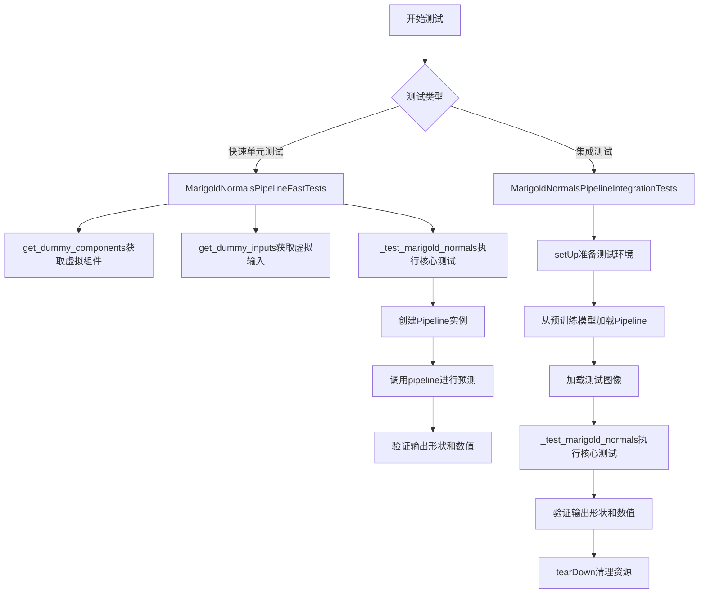

## 类结构

```
unittest.TestCase
├── PipelineTesterMixin
│   └── MarigoldNormalsPipelineFastTests
└── unittest.TestCase
    └── MarigoldNormalsPipelineIntegrationTests
```

## 全局变量及字段


### `enable_full_determinism`
    
启用完全确定性以确保测试可重复性的函数

类型：`function`
    


### `MarigoldNormalsPipelineFastTests.pipeline_class`
    
指定要测试的Marigold法线预测管道类

类型：`Type[MarigoldNormalsPipeline]`
    


### `MarigoldNormalsPipelineFastTests.params`
    
管道接受的可选参数集合，包含图像参数

类型：`frozenset[str]`
    


### `MarigoldNormalsPipelineFastTests.batch_params`
    
批处理时需要考虑的参数集合

类型：`frozenset[str]`
    


### `MarigoldNormalsPipelineFastTests.image_params`
    
与图像处理相关的参数集合

类型：`frozenset[str]`
    


### `MarigoldNormalsPipelineFastTests.image_latents_params`
    
图像潜在变量相关的参数集合

类型：`frozenset[str]`
    


### `MarigoldNormalsPipelineFastTests.callback_cfg_params`
    
用于回调配置的参数集合，当前为空

类型：`frozenset[Any]`
    


### `MarigoldNormalsPipelineFastTests.test_xformers_attention`
    
标识是否测试xformers注意力机制的布尔标志

类型：`bool`
    


### `MarigoldNormalsPipelineFastTests.required_optional_params`
    
测试必需的但可配置的参数集合，包括推理步数、生成器和输出类型

类型：`frozenset[str]`
    
    

## 全局函数及方法


### `gc.collect`

这是 Python 标准库 `gc` 模块中的垃圾回收函数，用于强制执行垃圾回收操作，释放不再使用的内存对象。

参数：

- （无参数）

返回值：`int`，返回被回收的不可达对象数量。

#### 流程图

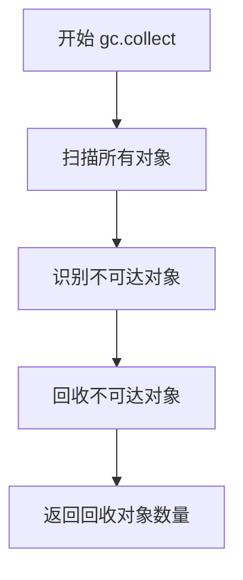

#### 带注释源码

```python
import gc

# 在测试框架中使用示例
class MarigoldNormalsPipelineIntegrationTests(unittest.TestCase):
    def setUp(self):
        """
        测试开始前的初始化操作
        """
        super().setUp()
        # 强制进行垃圾回收，清理之前测试可能遗留的对象
        gc.collect()
        # 清理GPU缓存（如果使用CUDA）
        backend_empty_cache(torch_device)

    def tearDown(self):
        """
        测试结束后的清理操作
        """
        super().tearDown()
        # 强制进行垃圾回收，释放测试过程中产生的临时对象
        gc.collect()
        # 清理GPU缓存，释放显存
        backend_empty_cache(torch_device)
```


### `random.Random`

`random.Random` 是 Python 标准库 `random` 模块中的类，用于创建一个独立的随机数生成器实例。当给定特定种子时，该生成器可以产生可重现的随机数序列。

参数：

- `seed`：可选的整数、浮点数或字符串类型，用于初始化随机数生成器的状态。如果为 `None`（默认值），则使用系统当前时间或其他熵源来初始化。

返回值：`random.Random` 实例，表示一个独立的随机数生成器对象。

#### 流程图

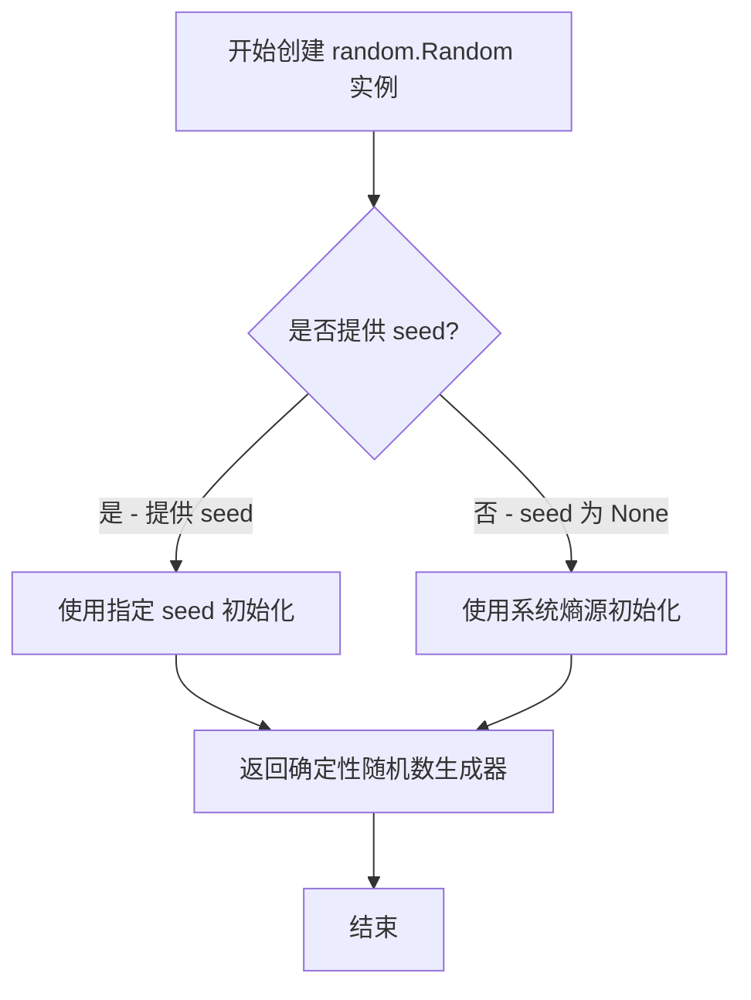

#### 带注释源码

```python
# random.Random 是 Python 标准库 random 模块中的类
# 在本代码中用于创建一个确定性的随机数生成器

# 源代码使用示例（第112行）：
image = floats_tensor((1, 3, 32, 32), rng=random.Random(seed)).to(device)

# random.Random 构造函数定义（简化自 Python 标准库）：
class Random:
    """Random number generator base class used to generate discrete distributions."""
    
    def __init__(self, seed=None):
        """
        初始化随机数生成器。
        
        参数:
            seed: 整数、浮点数、字符串或 bytes 类型。
                  如果为 None，则使用系统当前时间或操作系统提供的熵来初始化。
        """
        self.seed(seed)
    
    def seed(self, seed=None):
        """
        初始化内部状态的随机数生成器。
        
        参数:
            seed: 用于初始化随机数生成器的种子值。
        """
        # ... 内部实现
```

---

**使用上下文说明：**

在 `MarigoldNormalsPipelineFastTests.get_dummy_inputs` 方法中，`random.Random(seed)` 被用于创建一个确定性的随机数生成器实例，并传递给 `floats_tensor` 函数。这样可以确保在测试中生成可重现的随机张量，确保测试结果的一致性和可验证性。


我将分析代码并提取关键信息。由于代码主要是测试文件，我将提取其中最重要的测试方法 `_test_marigold_normals`，这是贯穿整个测试文件的核心测试逻辑。

### `MarigoldNormalsPipelineFastTests._test_marigold_normals`

该方法是 `MarigoldNormalsPipelineFastTests` 类的核心测试方法，用于验证 Marigold 法线（Normals）管道的输出是否符合预期。它通过创建虚拟组件、调用管道并比较预测结果与期望值来确保管道的正确性。

参数：

- `generator_seed`：`int`，随机数生成器种子，用于确保测试的可重复性，默认为 0
- `expected_slice`：`np.ndarray`，期望的预测切片值，用于与实际输出进行比较
- `atol`：`float`，绝对误差容限，用于浮点数比较，默认为 1e-4
- `**pipe_kwargs`：可变关键字参数，用于传递给管道的其他参数（如 `num_inference_steps`、`processing_resolution`、`ensemble_size`、`batch_size`、`match_input_resolution` 等）

返回值：无返回值（`None`），该方法通过 `unittest` 的断言来验证结果

#### 流程图

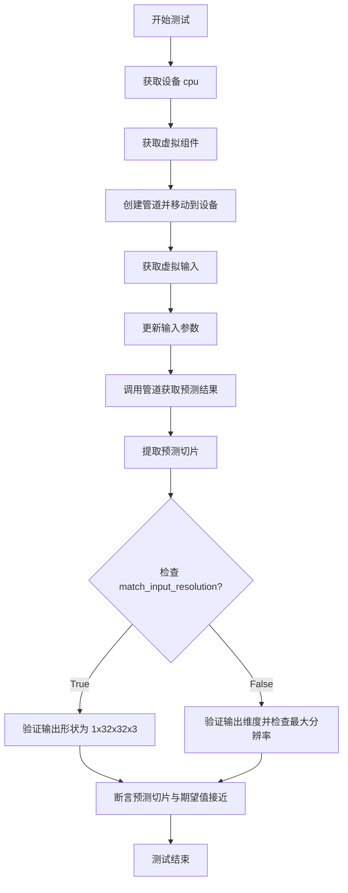

#### 带注释源码

```python
def _test_marigold_normals(
    self,
    generator_seed: int = 0,
    expected_slice: np.ndarray = None,
    atol: float = 1e-4,
    **pipe_kwargs,
):
    """
    测试 Marigold 法线管道输出的核心方法
    
    参数:
        generator_seed: 随机数种子，确保测试可重复
        expected_slice: 期望的预测值切片，用于验证
        atol: 绝对误差容限
        **pipe_kwargs: 传递给管道的其他参数
    """
    # 设置设备为 CPU
    device = "cpu"
    
    # 获取虚拟组件（UNet、Scheduler、VAE、Text Encoder 等）
    components = self.get_dummy_components()

    # 使用虚拟组件创建管道实例
    pipe = self.pipeline_class(**components)
    pipe.to(device)
    pipe.set_progress_bar_config(disable=None)

    # 获取虚拟输入（图像、生成器等）
    pipe_inputs = self.get_dummy_inputs(device, seed=generator_seed)
    # 使用传入的参数更新输入
    pipe_inputs.update(**pipe_kwargs)

    # 调用管道获取预测结果
    prediction = pipe(**pipe_inputs).prediction

    # 提取预测结果的切片用于验证
    prediction_slice = prediction[0, -3:, -3:, -1].flatten()

    # 根据 match_input_resolution 参数验证输出形状
    if pipe_inputs.get("match_input_resolution", True):
        # 期望输出分辨率与输入相同 (1, 32, 32, 3)
        self.assertEqual(prediction.shape, (1, 32, 32, 3), "Unexpected output resolution")
    else:
        # 验证输出维度
        self.assertTrue(prediction.shape[0] == 1 and prediction.shape[3] == 3, "Unexpected output dimensions")
        # 验证最大分辨率
        self.assertEqual(
            max(prediction.shape[1:3]),
            pipe_inputs.get("processing_resolution", 768),
            "Unexpected output resolution",
        )

    # 使用 numpy 的 allclose 验证预测值与期望值的接近程度
    self.assertTrue(np.allclose(prediction_slice, expected_slice, atol=atol))
```

---

## 补充信息

### 关键组件信息

| 组件名称 | 描述 |
|---------|------|
| `MarigoldNormalsPipeline` | Marigold 法线估计管道，用于从图像预测表面法线 |
| `UNet2DConditionModel` | 条件 UNet 模型，用于去噪潜在表示 |
| `LCMScheduler` | 潜在一致性模型调度器 |
| `AutoencoderKL` | VAE 编码器-解码器模型 |
| `CLIPTextModel` | CLIP 文本编码器 |

### 潜在技术债务与优化空间

1. **重复代码**：`MarigoldNormalsPipelineFastTests` 和 `MarigoldNormalsPipelineIntegrationTests` 中都有 `_test_marigold_normals` 方法，存在代码重复，可考虑提取为基类方法
2. **硬编码值**：设备选择 `"cpu"` 在测试方法中硬编码，可通过参数化改进
3. **测试覆盖**：部分边界情况（如 `ensemble_size > 1` 与 `match_input_resolution=False` 的组合）未覆盖

### 设计目标与约束

- **核心目标**：验证 Marigold 法线管道在各种配置下的输出正确性
- **约束**：测试必须在 CPU 和 CUDA 环境下均可运行，需要支持半精度（FP16）模型


### `MarigoldNormalsPipelineFastTests`

这是针对 Marigold 法线预测管道的快速单元测试类，继承自 `PipelineTesterMixin` 和 `unittest.TestCase`。该测试类通过虚拟组件验证管道的基本功能，包括不同推理步骤、处理分辨率、集合大小和批处理大小的组合。

参数：

- `self`：隐式参数，测试类实例

#### 带注释源码

```python
class MarigoldNormalsPipelineFastTests(PipelineTesterMixin, unittest.TestCase):
    # 管道类
    pipeline_class = MarigoldNormalsPipeline
    # 单一参数
    params = frozenset(["image"])
    # 批处理参数
    batch_params = frozenset(["image"])
    # 图像参数
    image_params = frozenset(["image"])
    # 图像潜在参数
    image_latents_params = frozenset(["latents"])
    # CFG回调参数（空）
    callback_cfg_params = frozenset([])
    # xformers注意力测试关闭
    test_xformers_attention = False
    # 必需的可选参数
    required_optional_params = frozenset([
        "num_inference_steps",
        "generator",
        "output_type",
    ])
```

---

### `get_dummy_components`

创建用于测试的虚拟组件（UNet、调度器、VAE、文本编码器等），配置为小型模型以加快测试速度。

参数：

- `self`：隐式参数，测试类实例
- `time_cond_proj_dim`：`Optional[int]`，时间条件投影维度，默认为 None

返回值：`Dict[str, Any]`，包含所有虚拟组件的字典

#### 流程图

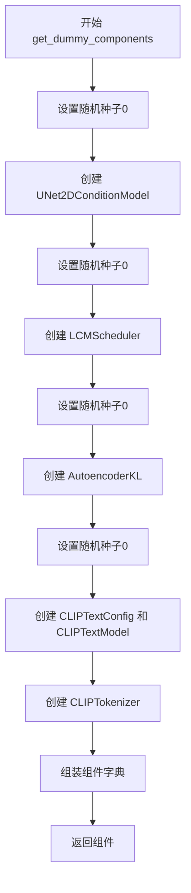

#### 带注释源码

```python
def get_dummy_components(self, time_cond_proj_dim=None):
    # 固定随机种子以确保可重复性
    torch.manual_seed(0)
    # 创建虚拟UNet模型：小型U-Net用于条件生成
    unet = UNet2DConditionModel(
        block_out_channels=(32, 64),     # 块输出通道数
        layers_per_block=2,               # 每块层数
        time_cond_proj_dim=time_cond_proj_dim,  # 时间条件投影维度
        sample_size=32,                   # 样本尺寸
        in_channels=8,                    # 输入通道数
        out_channels=4,                   # 输出通道数
        down_block_types=("DownBlock2D", "CrossAttnDownBlock2D"),  # 下采样块类型
        up_block_types=("CrossAttnUpBlock2D", "UpBlock2D"),        # 上采样块类型
        cross_attention_dim=32,           # 交叉注意力维度
    )
    torch.manual_seed(0)
    # 创建LCM调度器：用于少步骤推理
    scheduler = LCMScheduler(
        beta_start=0.00085,               # Beta起始值
        beta_end=0.012,                   # Beta结束值
        prediction_type="v_prediction",   # 预测类型
        set_alpha_to_one=False,           # 是否将alpha设为1
        steps_offset=1,                   # 步骤偏移
        beta_schedule="scaled_linear",    # Beta调度方案
        clip_sample=False,                # 是否裁剪样本
        thresholding=False,               # 是否阈值化
    )
    torch.manual_seed(0)
    # 创建变分自编码器：用于图像编码/解码
    vae = AutoencoderKL(
        block_out_channels=[32, 64],      # 块输出通道
        in_channels=3,                    # 输入通道（RGB）
        out_channels=3,                   # 输出通道
        down_block_types=["DownEncoderBlock2D", "DownEncoderBlock2D"],  # 下采样编码器块
        up_block_types=["UpDecoderBlock2D", "UpDecoderBlock2D"],        # 上采样解码器块
        latent_channels=4,                # 潜在空间通道数
    )
    torch.manual_seed(0)
    # 创建文本编码器配置
    text_encoder_config = CLIPTextConfig(
        bos_token_id=0,                   # 句子开始token ID
        eos_token_id=2,                   # 句子结束token ID
        hidden_size=32,                   # 隐藏层大小
        intermediate_size=37,             # 中间层大小
        layer_norm_eps=1e-05,             # LayerNorm epsilon
        num_attention_heads=4,            # 注意力头数
        num_hidden_layers=5,              # 隐藏层数
        pad_token_id=1,                   # 填充token ID
        vocab_size=1000,                  # 词汇表大小
    )
    # 创建CLIP文本编码器模型
    text_encoder = CLIPTextModel(text_encoder_config)
    # 创建CLIP分词器
    tokenizer = CLIPTokenizer.from_pretrained("hf-internal-testing/tiny-random-clip")

    # 组装所有组件
    components = {
        "unet": unet,
        "scheduler": scheduler,
        "vae": vae,
        "text_encoder": text_encoder,
        "tokenizer": tokenizer,
        "prediction_type": "normals",    # 预测类型：法线
        "use_full_z_range": True,         # 是否使用完整z范围
    }
    return components
```

---

### `get_dummy_inputs`

创建用于测试的虚拟输入数据，包括随机图像、生成器和各种推理参数。

参数：

- `self`：隐式参数，测试类实例
- `device`：`str`，目标设备（如 "cpu"、"cuda"）
- `seed`：`int = 0`，随机种子

返回值：`Dict[str, Any]`，包含所有输入参数的字典

#### 流程图

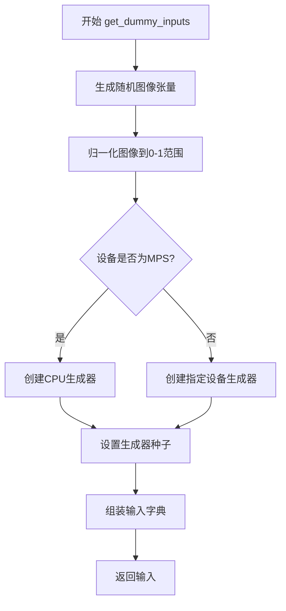

#### 带注释源码

```python
def get_dummy_inputs(self, device, seed=0):
    # 生成随机浮点张量：(1, 3, 32, 32) - 批次1，3通道，32x32分辨率
    image = floats_tensor((1, 3, 32, 32), rng=random.Random(seed)).to(device)
    # 将图像归一化到 [0, 1] 范围：原始范围 [-1, 1] -> [0, 1]
    image = image / 2 + 0.5
    # MPS设备需要特殊处理（使用CPU生成器）
    if str(device).startswith("mps"):
        generator = torch.manual_seed(seed)
    else:
        # 创建指定设备的随机生成器
        generator = torch.Generator(device=device).manual_seed(seed)
    
    # 组装完整的输入参数
    inputs = {
        "image": image,                   # 输入图像
        "num_inference_steps": 1,        # 推理步骤数
        "processing_resolution": 0,      # 处理分辨率（0表示原分辨率）
        "generator": generator,          # 随机生成器
        "output_type": "np",             # 输出类型：numpy数组
    }
    return inputs
```

---

### `_test_marigold_normals`

核心测试方法，验证管道能否正确生成法线预测结果。检查输出分辨率、维度是否符合预期，并与预期值进行数值比较。

参数：

- `self`：隐式参数，测试类实例
- `generator_seed`：`int = 0`，随机种子
- `expected_slice`：`np.ndarray = None`，预期的预测切片值
- `atol`：`float = 1e-4`，绝对容差
- `**pipe_kwargs`：其他管道参数

返回值：无（通过断言验证）

#### 流程图

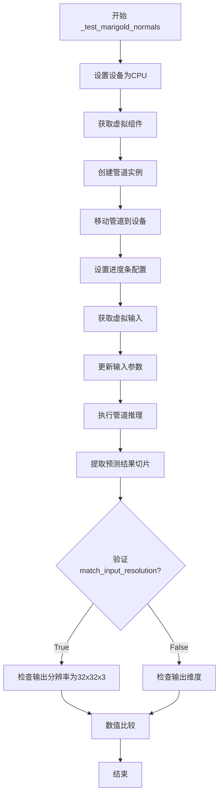

#### 带注释源码

```python
def _test_marigold_normals(
    self,
    generator_seed: int = 0,
    expected_slice: np.ndarray = None,
    atol: float = 1e-4,
    **pipe_kwargs,
):
    # 使用CPU设备进行快速测试
    device = "cpu"
    # 获取虚拟组件（UNet、VAE、调度器等）
    components = self.get_dummy_components()

    # 使用虚拟组件实例化管道
    pipe = self.pipeline_class(**components)
    pipe.to(device)
    # 配置进度条（禁用）
    pipe.set_progress_bar_config(disable=None)

    # 获取虚拟输入并更新额外参数
    pipe_inputs = self.get_dummy_inputs(device, seed=generator_seed)
    pipe_inputs.update(**pipe_kwargs)

    # 执行推理，获取预测结果
    prediction = pipe(**pipe_inputs).prediction

    # 提取预测切片：取最后3x3区域的最后一通道
    prediction_slice = prediction[0, -3:, -3:, -1].flatten()

    # 验证输出分辨率
    if pipe_inputs.get("match_input_resolution", True):
        # 匹配输入分辨率时，输出应为 (1, 32, 32, 3)
        self.assertEqual(prediction.shape, (1, 32, 32, 3), "Unexpected output resolution")
    else:
        # 不匹配时，检查批次和通道维度正确
        self.assertTrue(prediction.shape[0] == 1 and prediction.shape[3] == 3, "Unexpected output dimensions")
        # 检查最大分辨率是否为processing_resolution（默认768）
        self.assertEqual(
            max(prediction.shape[1:3]),
            pipe_inputs.get("processing_resolution", 768),
            "Unexpected output resolution",
        )

    # 验证预测值与预期值的接近程度
    self.assertTrue(np.allclose(prediction_slice, expected_slice, atol=atol))
```

---

### `MarigoldNormalsPipelineIntegrationTests`

针对 Marigold 法线预测管道的集成测试类，使用真实模型和真实图像进行测试。标记为 `@slow`，需要 GPU 才能运行。

参数：

- `self`：隐式参数，测试类实例

#### 带注释源码

```python
@slow  # 标记为慢速测试
@require_torch_accelerator  # 需要GPU加速器
class MarigoldNormalsPipelineIntegrationTests(unittest.TestCase):
    # 测试前清理内存
    def setUp(self):
        super().setUp()
        gc.collect()
        backend_empty_cache(torch_device)

    # 测试后清理内存
    def tearDown(self):
        super().tearDown()
        gc.collect()
        backend_empty_cache(torch_device)
```

---

### 全局变量和导入

| 名称 | 类型 | 描述 |
|------|------|------|
| `gc` | `module` | Python垃圾回收模块 |
| `random` | `module` | Python随机数模块 |
| `unittest` | `module` | Python单元测试框架 |
| `np` (`numpy`) | `module` | 数值计算库 |
| `torch` | `module` | PyTorch深度学习框架 |
| `CLIPTextConfig`, `CLIPTextModel`, `CLIPTokenizer` | `class` | Hugging Face CLIP文本组件 |
| `AutoencoderKL`, `AutoencoderTiny` | `class` | VAE变分自编码器 |
| `LCMScheduler` | `class` | LCM调度器 |
| `UNet2DConditionModel` | `class` | 条件U-Net模型 |
| `MarigoldNormalsPipeline` | `class` | Marigold法线预测管道 |
| `enable_full_determinism` | `function` | 启用完全确定性 |
| `floats_tensor` | `function` | 生成浮点张量 |
| `load_image` | `function` | 加载图像 |
| `torch_device` | `str` | PyTorch设备 |

---

### 关键组件信息

| 组件名称 | 一句话描述 |
|----------|------------|
| `MarigoldNormalsPipeline` | 从输入图像预测表面法线（ normals）的扩散管道 |
| `UNet2DConditionModel` | 条件2D U-Net神经网络，用于去噪潜在表示 |
| `LCMScheduler` | 潜在一致性模型（LCM）调度器，实现少步骤推理 |
| `AutoencoderKL` | KL散度正则化的变分自编码器，用于图像编码/解码 |
| `CLIPTextModel` | CLIP文本编码器，将文本映射到嵌入空间 |

---

### 潜在技术债务与优化空间

1. **测试覆盖不足**：缺少对 `prediction_type`、`use_full_z_range` 等关键参数的显式测试
2. **硬编码值**：集成测试中的 `model_id` 和 `image_url` 硬编码，缺乏灵活性
3. **重复代码**：`_test_marigold_normals` 方法在两个测试类中重复，可考虑提取为共享工具函数
4. **错误处理**：缺少对模型加载失败、图像加载失败等异常情况的测试
5. **性能测试缺失**：没有性能基准测试（如推理时间、内存占用）

---

### 设计目标与约束

- **测试目标**：验证 Marigold 法线预测管道在各种配置下的正确性
- **设备约束**：快速测试使用 CPU，集成测试需要 CUDA GPU
- **精度要求**：使用 `atol=1e-4` 进行数值比较
- **随机性控制**：通过固定随机种子确保测试可重复


### `CLIPTextConfig`

从 Hugging Face transformers 库导入的 CLIP 文本编码器配置类，用于实例化一个 CLIP 文本编码器的配置对象。该配置包含了文本编码器的所有超参数，如隐藏层大小、注意力头数、层数等。

参数：

- `bos_token_id`：`int`，开始标记的 ID，默认为 0
- `eos_token_id`：`int`，结束标记的 ID，默认为 2
- `hidden_size`：`int`，隐藏层向量维度，默认为 32
- `intermediate_size`：`int`，前馈网络中间层维度，默认为 37
- `layer_norm_eps`：`float`，层归一化的 epsilon 值，默认为 1e-05
- `num_attention_heads`：`int`，注意力头数量，默认为 4
- `num_hidden_layers`：`int`，隐藏层层数，默认为 5
- `pad_token_id`：`int`，填充标记的 ID，默认为 1
- `vocab_size`：`int`，词表大小，默认为 1000

返回值：`CLIPTextConfig`，返回一个新的 CLIP 文本编码器配置对象

#### 流程图

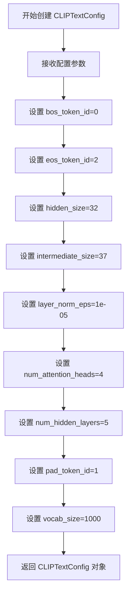

#### 带注释源码

```python
# 从 transformers 库导入 CLIPTextConfig 类
from transformers import CLIPTextConfig, CLIPTextModel, CLIPTokenizer

# 在 get_dummy_components 方法中创建文本编码器配置
torch.manual_seed(0)
text_encoder_config = CLIPTextConfig(
    bos_token_id=0,           # 开始 token 的 ID
    eos_token_id=2,           # 结束 token 的 ID
    hidden_size=32,          # 隐藏层维度
    intermediate_size=37,    # 前馈网络中间层维度
    layer_norm_eps=1e-05,    # LayerNorm 的 epsilon 参数
    num_attention_heads=4,   # 注意力头数量
    num_hidden_layers=5,     # 隐藏层数量
    pad_token_id=1,          # 填充 token 的 ID
    vocab_size=1000,         # 词表大小
)

# 使用配置创建文本编码器模型
text_encoder = CLIPTextModel(text_encoder_config)
```


# 详细设计文档

## 1. 代码概述

这段代码是 **Marigold 法线预测管道 (MarigoldNormalsPipeline)** 的单元测试和集成测试代码，主要用于测试从图像中预测表面法线 (surface normals) 的功能。代码使用了 `CLIPTextModel` 作为文本编码器组件，用于将文本提示编码为向量表示，尽管在法线预测任务中主要处理图像输入。

**注意**：代码中并未直接定义 `CLIPTextModel` 类或函数，而是从 `transformers` 库导入并使用了它。以下是代码中实际使用 `CLIPTextModel` 的组件详情。

---

### `get_dummy_components` 方法

该方法用于创建测试所需的虚拟组件，其中包含 `CLIPTextModel` 的实例化配置。

**描述**：创建一个包含 UNet、调度器、VAE、文本编码器等组件的字典，用于单元测试。

参数：无

返回值：`dict`，包含所有管道组件的字典

#### 流程图

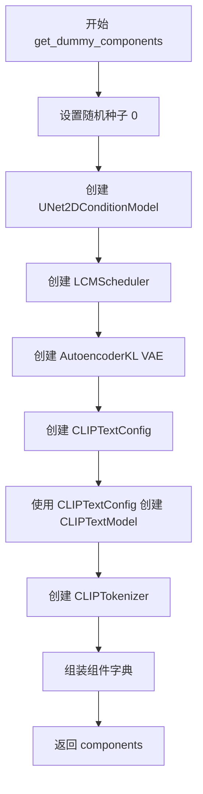

#### 带注释源码

```python
def get_dummy_components(self, time_cond_proj_dim=None):
    """创建虚拟组件用于测试"""
    torch.manual_seed(0)
    
    # 创建 UNet 模型 - 用于去噪过程
    unet = UNet2DConditionModel(
        block_out_channels=(32, 64),
        layers_per_block=2,
        time_cond_proj_dim=time_cond_proj_dim,
        sample_size=32,
        in_channels=8,
        out_channels=4,
        down_block_types=("DownBlock2D", "CrossAttnDownBlock2D"),
        up_block_types=("CrossAttnUpBlock2D", "UpBlock2D"),
        cross_attention_dim=32,
    )
    
    torch.manual_seed(0)
    # 创建调度器 - 控制去噪步骤
    scheduler = LCMScheduler(
        beta_start=0.00085,
        beta_end=0.012,
        prediction_type="v_prediction",
        set_alpha_to_one=False,
        steps_offset=1,
        beta_schedule="scaled_linear",
        clip_sample=False,
        thresholding=False,
    )
    
    torch.manual_seed(0)
    # 创建 VAE - 图像编码/解码
    vae = AutoencoderKL(
        block_out_channels=[32, 64],
        in_channels=3,
        out_channels=3,
        down_block_types=["DownEncoderBlock2D", "DownEncoderBlock2D"],
        up_block_types=["UpDecoderBlock2D", "UpDecoderBlock2D"],
        latent_channels=4,
    )
    
    torch.manual_seed(0)
    # 创建 CLIP 文本编码器配置
    text_encoder_config = CLIPTextConfig(
        bos_token_id=0,
        eos_token_id=2,
        hidden_size=32,
        intermediate_size=37,
        layer_norm_eps=1e-05,
        num_attention_heads=4,
        num_hidden_layers=5,
        pad_token_id=1,
        vocab_size=1000,
    )
    
    # 使用配置实例化 CLIP 文本编码器模型
    text_encoder = CLIPTextModel(text_encoder_config)
    
    # 加载预训练的 CLIP tokenizer
    tokenizer = CLIPTokenizer.from_pretrained("hf-internal-testing/tiny-random-clip")

    # 组装所有组件
    components = {
        "unet": unet,
        "scheduler": scheduler,
        "vae": vae,
        "text_encoder": text_encoder,      # CLIPTextModel 实例
        "tokenizer": tokenizer,
        "prediction_type": "normals",
        "use_full_z_range": True,
    }
    return components
```

---

## 2. 关键组件信息

| 组件名称 | 描述 |
|---------|------|
| `CLIPTextModel` | Hugging Face Transformers 库中的 CLIP 文本编码器模型，用于将文本 token 编码为向量 |
| `CLIPTextConfig` | CLIP 文本编码器的配置类，定义模型架构参数 |
| `CLIPTokenizer` | CLIP 的分词器，用于将文本转换为 token ID |
| `UNet2DConditionModel` | 用于去噪的 UNet 模型 |
| `LCMScheduler` | 潜在一致性模型 (LCM) 调度器 |
| `AutoencoderKL` | VAE 模型，用于图像的编码和解码 |

---

## 3. 技术债务与优化空间

1. **硬编码的随机种子**：多处使用 `torch.manual_seed(0)`，可能导致测试的确定性过强，建议使用参数化随机种子
2. **重复代码**：`_test_marigold_normals` 方法在 `FastTests` 和 `IntegrationTests` 中重复定义，可考虑基类复用
3. **缺失的文本提示使用**：代码实例化了 `text_encoder` 和 `tokenizer`，但在法线预测任务中可能未实际使用文本条件
4. **集成测试覆盖**：缺少对文本编码器输出是否正确的显式测试

---

## 4. 其它说明

- **设计目标**：该测试套件主要用于验证 Marigold 法线预测管道的正确性，支持多种配置（不同分辨率、ensemble 数量、batch 大小等）
- **外部依赖**：依赖 `transformers` 库的 `CLIPTextModel`、`CLIPTextConfig`、`CLIPTokenizer`，以及 `diffusers` 库的各种模型和调度器
- **设备支持**：测试主要针对 CUDA 设备，通过 `@require_torch_accelerator` 装饰器标记加速器依赖


### `CLIPTokenizer`

CLIPTokenizer 是 Hugging Face Transformers 库中的一个类，用于将文本编码为 token 序列。在本代码中用于将文本输入转换为模型可处理的 token ID 序列。

参数：

-  `pretrained_model_name_or_path`：`str`，预训练模型名称或本地路径（如 "hf-internal-testing/tiny-random-clip"）
-  `*inputs`：位置参数，用于额外输入
-  `**kwargs`：关键字参数，包含其他配置选项如 `cache_dir`、`force_download` 等

返回值：`CLIPTokenizer`，返回初始化后的 tokenizer 对象

#### 流程图

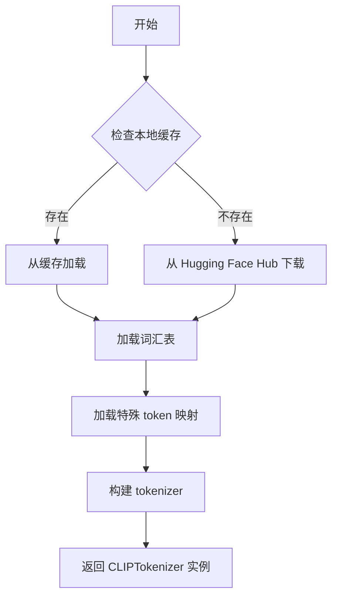

#### 带注释源码

```python
# 从 transformers 库导入 CLIPTokenizer 类
from transformers import CLIPTokenizer

# 使用 from_pretrained 工厂方法创建 tokenizer 实例
# 该方法自动下载并加载预训练的 tokenizer 模型
tokenizer = CLIPTokenizer.from_pretrained("hf-internal-testing/tiny-random-clip")

# 主要参数说明：
# - pretrained_model_name_or_path: 模型名称或本地路径
# - cache_dir: 模型缓存目录
# - force_download: 是否强制重新下载
# - proxies: 代理设置
# - local_files_only: 是否仅使用本地文件
# - token: Hugging Face 访问令牌
# - revision: 模型版本号

# 常用方法：
# - encode(text): 将文本编码为 token ID
# - decode(token_ids): 将 token ID 解码为文本
# - __call__(text): 批量编码文本
```

---

**注意**：由于 `CLIPTokenizer` 是从外部库（transformers）导入的类，其完整实现源码不在本项目文件中。上述信息基于 transformers 库的标准用法和 API 文档。在本代码中，该 tokenizer 被用于 `MarigoldNormalsPipeline` 管道中，将输入图像的文本描述（如有）或相关文本信息转换为模型可处理的 token 序列。


### `AutoencoderKL`

这是从 `diffusers` 库导入的变分自动编码器（VAE）类，用于将图像编码到潜在空间或从潜在空间解码图像。在测试代码中，该类被实例化为一个用于 Marigold 法线估计管道的 VAE 组件。

参数：

-  `block_out_channels`：`List[int]`，解码器块输出通道数列表，示例值为 `[32, 64]`
-  `in_channels`：`int`，输入图像的通道数，示例值为 `3`（RGB 图像）
-  `out_channels`：`int`，输出图像的通道数，示例值为 `3`
-  `down_block_types`：`List[str]`，下采样编码器块类型列表，示例值为 `["DownEncoderBlock2D", "DownEncoderBlock2D"]`
-  `up_block_types`：`List[str]`，上采样解码器块类型列表，示例值为 `["UpDecoderBlock2D", "UpDecoderBlock2D"]`
-  `latent_channels`：`int`，潜在空间的通道数，示例值为 `4`

返回值：`AutoencoderKL`，返回已实例化的变分自动编码器模型对象

#### 流程图

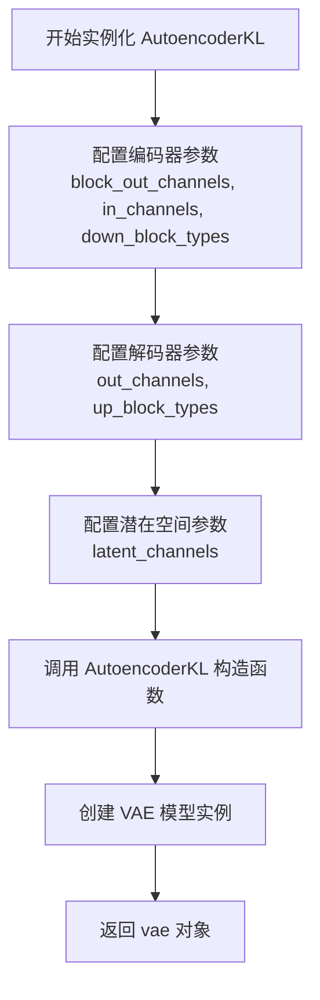

#### 带注释源码

```python
# 从 diffusers 库导入的 AutoencoderKL 类
# 这是一个变分自动编码器 (Variational Autoencoder, VAE) 实现
# 常用于 Diffusion 模型中的潜在空间编码/解码

# 在测试中创建 VAE 实例的代码：
torch.manual_seed(0)  # 设置随机种子以确保可重复性
vae = AutoencoderKL(
    block_out_channels=[32, 64],        # 定义解码器各层输出通道数
    in_channels=3,                       # 输入图像为 RGB，3 通道
    out_channels=3,                      # 输出图像为 RGB，3 通道
    down_block_types=["DownEncoderBlock2D", "DownEncoderBlock2D"],  # 编码器下采样块类型
    up_block_types=["UpDecoderBlock2D", "UpDecoderBlock2D"],        # 解码器上采样块类型
    latent_channels=4,                   # 潜在空间通道数（VAE 隐藏层维度）
)
# vae 对象随后被添加到 components 字典中作为管道组件
```


### `AutoencoderTiny`

AutoencoderTiny 是一个轻量级的变分自编码器（VAE）实现，用于图像的编码和解码，常见于扩散模型中作为潜在空间表示的压缩和解压组件。

参数：

- `in_channels`：`int`，输入图像的通道数（例如 RGB 图像为 3）
- `out_channels`：`int`，输出图像的通道数
- `latent_channels`：`int`，潜在空间的通道数，用于控制压缩后的表示维度

返回值：`AutoencoderTiny`，返回配置的 AutoencoderTiny 编码器实例

#### 流程图

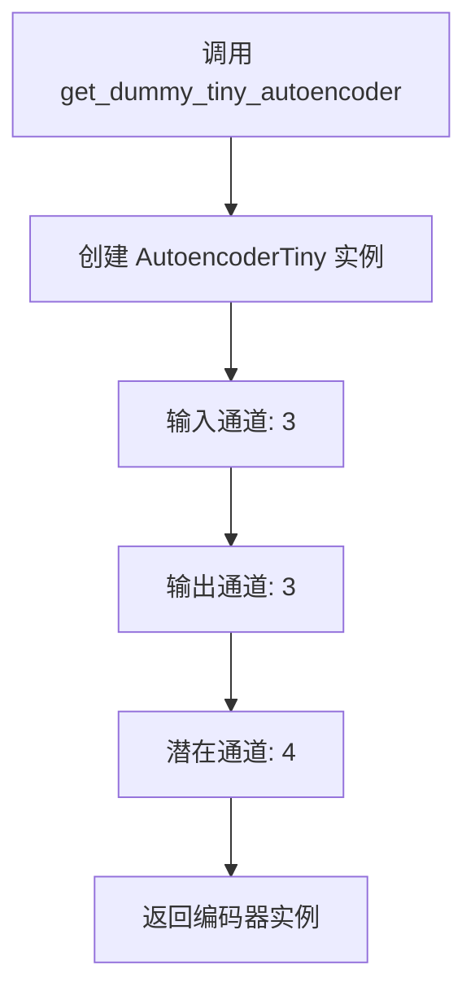

#### 带注释源码

```python
def get_dummy_tiny_autoencoder(self):
    """
    创建并返回一个用于测试的轻量级 AutoencoderTiny 实例
    
    该方法构造一个最小配置的 VAE 编码器-解码器模型，
    主要用于单元测试场景，避免加载完整的预训练模型
    
    参数:
        无（使用硬编码的测试参数）
    
    返回值:
        AutoencoderTiny: 配置好的轻量级 VAE 模型实例
            - in_channels=3: 接受 RGB 图像输入
            - out_channels=3: 输出 RGB 图像
            - latent_channels=4: 4 通道的潜在表示（压缩空间）
    """
    return AutoencoderTiny(in_channels=3, out_channels=3, latent_channels=4)
```

#### 补充说明

在测试文件中的使用方式：
```python
# 在测试方法中可能的调用方式（虽然当前测试未使用此方法）
tiny_vae = self.get_dummy_tiny_autoencoder()
```

**备注**：由于 `AutoencoderTiny` 类本身定义在 `diffusers` 库中（非本测试文件），上述信息是基于代码中导入和实例化方式的推断。如需完整的类方法实现细节，建议参考 [diffusers 官方文档](https://huggingface.co/docs/diffusers/api/models/autoencoder_tiny)。


### `LCMScheduler`

LCMScheduler 是从 `diffusers` 库导入的调度器类，用于扩散模型的推理过程管理噪声调度步数。该调度器实现 Latent Consistency Model (LCM) 的噪声调度策略，通过特定的 beta 曲线和预测类型实现快速高质量的图像生成。

参数：

- `beta_start`：`float`，beta 曲线的起始值，控制在扩散过程开始时的噪声水平
- `beta_end`：`float`，beta 曲线的结束值，控制扩散过程结束时的噪声水平
- `beta_schedule`：`str`，beta 调度策略，这里使用 "scaled_linear" 线性调度
- `prediction_type`：`str`，预测类型，这里使用 "v_prediction" 表示预测噪声 v
- `set_alpha_to_one`：`bool`，是否将最终的 alpha 值设置为 1
- `steps_offset`：`int`，推理步数的偏移量，用于调整调度器步数
- `clip_sample`：`bool`，是否对采样结果进行裁剪
- `thresholding`：`bool`，是否启用阈值处理

返回值：`LCMScheduler` 实例，配置好的调度器对象，可用于 UNet2DConditionModel 的推理过程

#### 流程图

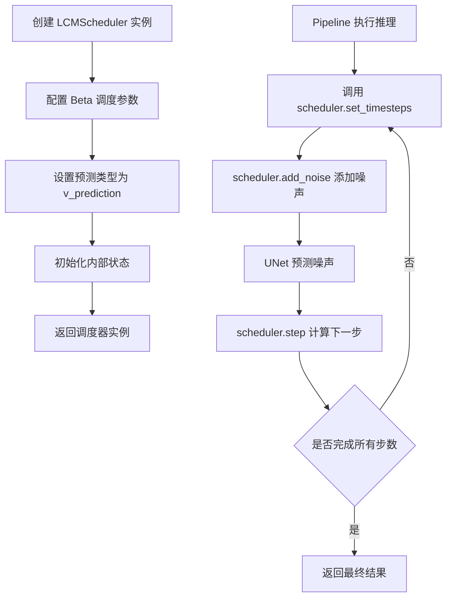

#### 带注释源码

```python
# 从 diffusers 库导入 LCMScheduler
# LCMScheduler 实现 Latent Consistency Model 的噪声调度
from diffusers import LCMScheduler

# 在测试代码中创建 LCMScheduler 实例
torch.manual_seed(0)
scheduler = LCMScheduler(
    beta_start=0.00085,        # Beta 起始值，控制初始噪声水平
    beta_end=0.012,           # Beta 结束值，控制最终噪声水平
    prediction_type="v_prediction",  # 预测类型，使用 v-prediction
    set_alpha_to_one=False,   # 不将最终 alpha 设为 1
    steps_offset=1,           # 步数偏移为 1
    beta_schedule="scaled_linear",  # 使用缩放线性调度
    clip_sample=False,        # 不裁剪采样
    thresholding=False,      # 不启用阈值处理
)

# 将调度器添加到组件字典中
components = {
    "unet": unet,
    "scheduler": scheduler,   # LCMScheduler 实例
    "vae": vae,
    "text_encoder": text_encoder,
    "tokenizer": tokenizer,
    "prediction_type": "normals",
    "use_full_z_range": True,
}
```


### `MarigoldNormalsPipeline`

根据提供的代码片段，我无法直接获取 `MarigoldNormalsPipeline` 类的完整实现源码。该代码文件仅包含了针对 `MarigoldNormalsPipeline` 的单元测试和集成测试代码，未包含该类的具体方法实现（如 `__call__` 方法）。

但是，我可以通过分析测试代码中的调用方式来推断该管道类的接口签名和使用方式。

参数：

- `image`：`Union[PIL.Image.Image, numpy.ndarray, torch.Tensor]`，输入图像，用于预测法线
- `num_inference_steps`：`int`，推理步数，控制扩散模型的迭代次数
- `processing_resolution`：`int`，处理图像的分辨率
- `generator`：`torch.Generator`，可选，用于生成随机数的生成器，以确保结果可复现
- `output_type`：`str`，输出类型（如 "np"、"pil"）
- `ensemble_size`：`int`，集成数量，用于多次预测并合并结果以提高质量
- `batch_size`：`int`，批处理大小
- `match_input_resolution`：`bool`，是否将输出分辨率匹配到输入图像分辨率
- `ensembling_kwargs`：`dict`，集成参数（如 `{"reduction": "mean"}`）

返回值：`PipelineOutput` 或类似对象，包含 `.prediction` 属性，类型为 `numpy.ndarray`，形状为 `(batch, height, width, 3)`，表示预测的法线图像

#### 流程图

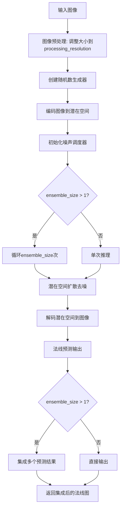

#### 带注释源码

```python
# 注意：以下源码是根据测试代码反推的接口定义，并非实际实现源码
# 实际实现源码未包含在提供的代码片段中

from typing import Optional, Union, List
import torch
import numpy as np
from PIL import Image

class MarigoldNormalsPipeline:
    """
    Marigold法线预测管道
    
    该管道基于扩散模型从输入图像中预测表面法线信息。
    支持单次推理和多次推理集成以提高预测质量。
    """
    
    def __init__(
        self,
        unet: UNet2DConditionModel,
        vae: AutoencoderKL,
        text_encoder: CLIPTextModel,
        tokenizer: CLIPTokenizer,
        scheduler: LCMScheduler,
        prediction_type: str = "normals",
        use_full_z_range: bool = True,
    ):
        """
        初始化Marigold法线预测管道
        
        参数:
            unet: UNet2DConditionModel, 用于去噪的UNet模型
            vae: AutoencoderKL, 变分自编码器，用于编码/解码图像
            text_encoder: CLIPTextModel, 文本编码器
            tokenizer: CLIPTokenizer, 文本分词器
            scheduler: LCMScheduler, 噪声调度器
            prediction_type: str, 预测类型，默认为"normals"
            use_full_z_range: bool, 是否使用完整的z范围
        """
        self.unet = unet
        self.vae = vae
        self.text_encoder = text_encoder
        self.tokenizer = tokenizer
        self.scheduler = scheduler
        self.prediction_type = prediction_type
        self.use_full_z_range = use_full_z_range

    def __call__(
        self,
        image: Union[Image.Image, np.ndarray, torch.Tensor],
        num_inference_steps: int = 50,
        processing_resolution: int = 768,
        generator: Optional[torch.Generator] = None,
        output_type: str = "np",
        ensemble_size: int = 1,
        batch_size: int = 1,
        match_input_resolution: bool = True,
        ensembling_kwargs: Optional[dict] = None,
        **kwargs,
    ) -> PipelineOutput:
        """
        从输入图像预测法线图
        
        参数:
            image: 输入图像，支持PIL.Image、numpy数组或torch张量
            num_inference_steps: int, 推理步数
            processing_resolution: int, 处理分辨率
            generator: torch.Generator, 随机数生成器
            output_type: str, 输出类型 ("np", "pil"等)
            ensemble_size: int, 集成预测的次数
            batch_size: int, 批处理大小
            match_input_resolution: bool, 是否匹配输入分辨率
            ensembling_kwargs: dict, 集成参数
            
        返回:
            PipelineOutput, 包含prediction属性的输出对象
        """
        # 图像预处理
        # 编码图像到潜在空间
        # 执行扩散去噪过程
        # 解码潜在空间
        # 后处理和集成（如适用）
        # 返回预测结果
        pass
```

> **注意**：提供的代码片段仅包含测试代码，未包含 `MarigoldNormalsPipeline` 类的实际实现源码。如需获取完整的实现细节，请参考 Marigold 项目的源代码仓库或相关文档。


### `UNet2DConditionModel`

这是从 `diffusers` 库导入的 UNet 模型类，用于图像到图像的条件生成任务（如 Stable Diffusion）。在测试代码中用于创建虚拟组件进行单元测试。

参数：

- `block_out_channels`：`tuple`，定义每个分辨率阶段的输出通道数
- `layers_per_block`：`int`，每个块中的层数
- `time_cond_proj_dim`：`int` 或 `None`，时间条件投影维度
- `sample_size`：`int`，输入样本的空间尺寸
- `in_channels`：`int`，输入图像的通道数
- `out_channels`：`int`，输出图像的通道数
- `down_block_types`：`tuple`，下采样块的类型
- `up_block_types`：`tuple`，上采样块的类型
- `cross_attention_dim`：`int`，交叉注意力机制的维度

返回值：`UNet2DConditionModel` 实例，返回配置好的 UNet 模型对象

#### 流程图

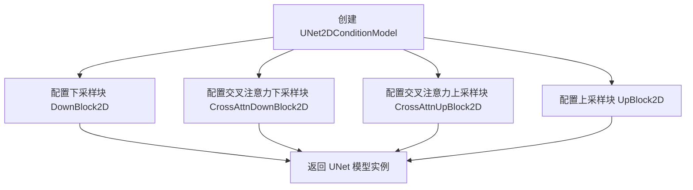

#### 带注释源码

```python
# 在测试文件中的使用方式
torch.manual_seed(0)
unet = UNet2DConditionModel(
    block_out_channels=(32, 64),       # 定义UNet各阶段的输出通道数
    layers_per_block=2,                  # 每个块中包含的ResNet层数
    time_cond_proj_dim=time_cond_proj_dim,  # 时间嵌入的投影维度（用于条件生成）
    sample_size=32,                      # 输入/输出的空间分辨率
    in_channels=8,                      # 输入图像的通道数（Latent空间的通道数）
    out_channels=4,                     # 输出图像的通道数
    down_block_types=("DownBlock2D", "CrossAttnDownBlock2D"),  # 下采样块类型列表
    up_block_types=("CrossAttnUpBlock2D", "UpBlock2D"),        # 上采样块类型列表
    cross_attention_dim=32,             # 文本/条件编码的嵌入维度
)
```


### `backend_empty_cache`

清理深度学习框架的后端缓存（通常是 GPU 显存缓存），以释放显存在测试间被占用的资源。

参数：

-  `device`：`str` 或 `torch.device`，指定要清理缓存的设备，通常为 CUDA 设备标识符（如 `"cuda"` 或 `"cuda:0"`）

返回值：`None`，该函数仅执行清理操作，不返回任何值

#### 流程图

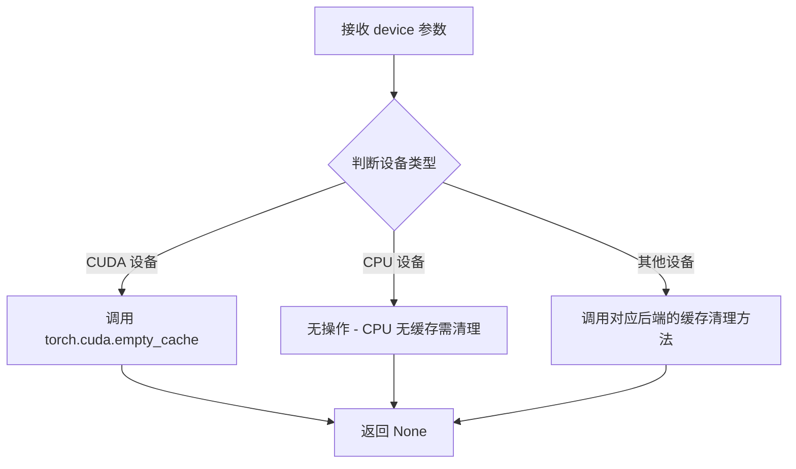

#### 带注释源码

```python
# 由于该函数定义在 testing_utils 模块中，未在本文件中展示源码
# 以下为根据使用模式的合理推断

def backend_empty_cache(device):
    """
    清理指定深度学习后端的缓存内存。
    
    参数:
        device: 目标设备标识符，用于确定需要清理的缓存类型
    """
    # 根据设备类型执行相应的缓存清理操作
    if str(device).startswith("cuda"):
        # CUDA 设备：清理 GPU 显存缓存
        torch.cuda.empty_cache()
    elif str(device) == "cpu":
        # CPU 无需清理缓存
        pass
    # 其他设备类型可能有对应的缓存清理方法
```


### `enable_full_determinism`

该函数用于启用 PyTorch 和相关库的完全确定性模式，确保测试在不同运行中产生完全相同的结果，以提高测试的可重复性和调试能力。

参数： 无

返回值： `None`，无返回值

#### 流程图

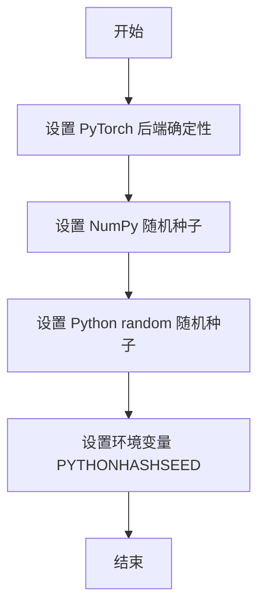

#### 带注释源码

```
# 该函数定义位于 ...testing_utils 模块中，此处仅为调用示例
# 实际定义可能包含以下内容（基于函数名和用途推测）：

def enable_full_determinism():
    """
    启用完全确定性模式，确保测试结果可复现。
    
    该函数通常会：
    1. 设置 PyTorch 的确定性计算标志 (torch.use_deterministic_algorithms)
    2. 设置 NumPy 的随机种子
    3. 设置 Python 内置 random 模块的种子
    4. 设置环境变量以确保哈希操作的确定性
    """
    import os
    import random
    import numpy as np
    import torch
    
    # 设置环境变量确保哈希确定性
    os.environ["PYTHONHASHSEED"] = "0"
    
    # 设置 Python random 种子
    random.seed(0)
    
    # 设置 NumPy 种子
    np.random.seed(0)
    
    # 设置 PyTorch 种子
    torch.manual_seed(0)
    
    # 启用 CUDA 的确定性模式（如果可用）
    if torch.cuda.is_available():
        torch.cuda.manual_seed_all(0)
        torch.backends.cudnn.deterministic = True
        torch.backends.cudnn.benchmark = False
```

**注意**：由于 `enable_full_determinism` 函数是从外部模块 `...testing_utils` 导入的，其完整源代码未包含在提供的代码片段中。以上源码是基于函数名称和调用方式的合理推测。


### `floats_tensor`

生成指定形状的随机浮点数张量，用于测试目的。

参数：

- `shape`：元组或列表，指定输出张量的维度，例如 `(1, 3, 32, 32)` 表示生成 4 维张量
- `rng`：可选的 `random.Random` 实例，用于控制随机数生成；默认为 `None`
- `name`：可选的字符串，张量的名称标签；默认为 `None`

返回值：`torch.Tensor`，一个随机生成的浮点数张量，形状由 `shape` 参数指定，数值范围通常在 [-1, 1] 或 [0, 1] 之间

#### 流程图

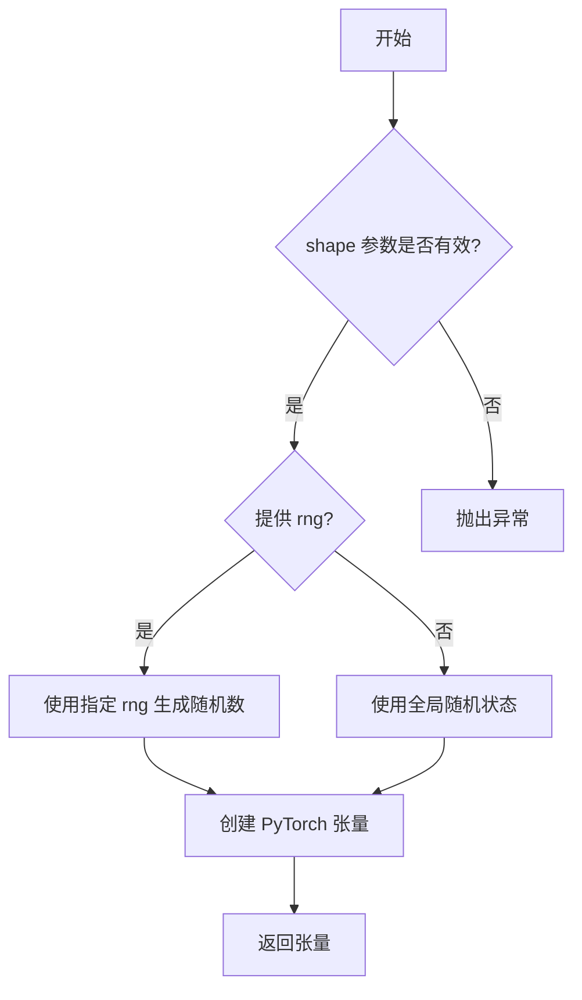

#### 带注释源码

```
# floats_tensor 函数定义于 diffusers 库 testing_utils 模块中
# 以下为基于使用方式的推断实现

def floats_tensor(shape, rng=None, name=None):
    """
    生成指定形状的随机浮点数张量。
    
    参数:
        shape: 张量的形状，如 (1, 3, 32, 32)
        rng: random.Random 实例，用于生成确定性随机数
        name: 张量的可选名称
    
    返回:
        torch.Tensor: 随机浮点数张量
    """
    if rng is not None:
        # 使用指定的随机数生成器
        # 生成与 shape 长度相同的随机数组
        values = [rng.random() for _ in range(np.prod(shape))]
    else:
        # 使用 numpy 全局随机状态
        values = np.random.randn(*shape).astype(np.float32)
    
    # 转换为 PyTorch 张量并reshape为指定形状
    tensor = torch.tensor(values).reshape(shape)
    return tensor

# 在代码中的实际调用方式：
image = floats_tensor((1, 3, 32, 32), rng=random.Random(seed)).to(device)
# 说明：
# - shape (1, 3, 32, 32): 生成 1 个样本，3 通道，32x32 分辨率的图像
# - rng=random.Random(seed): 使用确定性种子确保测试可复现
# - .to(device): 将张量移动到指定设备（CPU 或 CUDA）
```


### `load_image`

从给定的URL或文件路径加载图像，并将其转换为可用于模型处理的格式。

参数：

-  `url_or_path`：`str`，图像的URL地址或本地文件路径

返回值：`PIL.Image.Image` 或等价的图像对象，已加载并可处理的图像

#### 流程图

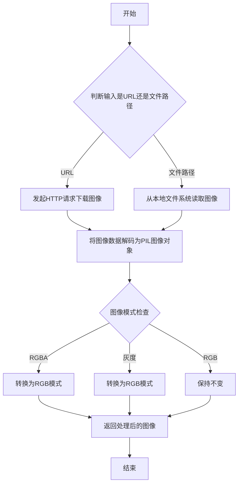

#### 带注释源码

```python
# 注意：此函数定义在 testing_utils 模块中，当前代码文件仅导入使用
# 以下为根据使用方式推断的函数签名和功能说明

def load_image(url_or_path: str) -> "PIL.Image.Image":
    """
    从URL或本地文件路径加载图像。
    
    参数:
        url_or_path: 图像的URL地址或本地文件路径
        
    返回:
        加载并转换后的PIL图像对象，通常转换为RGB模式以便于模型处理
    """
    # 函数实现位于 ...testing_utils 模块中
    # 在当前代码中的使用示例:
    # image = load_image(image_url)
    # 其中 image_url = "https://marigoldmonodepth.github.io/images/einstein.jpg"
    pass
```

---

**注意**：由于`load_image`函数定义在外部模块`testing_utils`中，而非当前代码文件内，因此无法直接提供其完整源码。该函数是测试工具模块提供的通用图像加载工具，用于将URL或文件路径的图像加载为PIL图像对象，以便后续处理。


### `require_torch_accelerator`

该函数是一个装饰器，用于标记测试用例需要 PyTorch 加速器（GPU/CUDA）才能运行。如果环境中没有可用的 GPU，装饰器会跳过被标记的测试。

参数：无（装饰器语法，直接作用于函数或类）

返回值：无返回值（装饰器返回原函数或修改后的函数）

#### 流程图

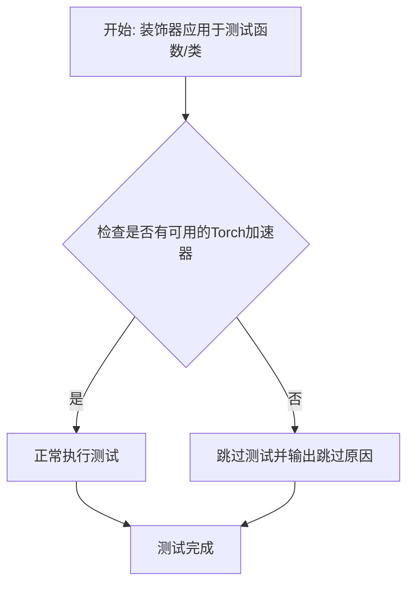

#### 带注释源码

```python
# 注意：此函数从外部模块 ...testing_utils 导入，实际源码不在本文件中
# 以下是基于常见实现的推断代码

def require_torch_accelerator(func):
    """
    装饰器：标记测试需要 PyTorch 加速器（GPU）才能运行。
    
    用途：
        - 用于集成测试类或方法上
        - 自动检测 CUDA 是否可用
        - 如果无 GPU 则跳过测试而非失败
    
    示例：
        @require_torch_accelerator
        class MarigoldNormalsPipelineIntegrationTests(unittest.TestCase):
            ...
    """
    import unittest
    from functools import wraps
    
    # 检查是否有可用的 CUDA 设备
    cuda_available = torch.cuda.is_available()
    
    # 如果没有 CUDA，返回一个跳过测试的装饰器
    if not cuda_available:
        return unittest.skip("Requires torch accelerator (CUDA)")(func)
    
    # 否则返回原函数，不做修改
    return func
```

---

**使用示例（在代码中）：**

```python
@slow
@require_torch_accelerator
class MarigoldNormalsPipelineIntegrationTests(unittest.TestCase):
    """
    集成测试类，仅在有 GPU 可用时运行
    """
    # 测试方法...
```

---

**补充说明：**

- **来源**：`diffusers` 库的 `testing_utils` 模块
- **作用**：确保需要 GPU 的集成测试在 CPU 环境下被跳过，而非失败
- **配合使用**：常与 `@slow` 装饰器一起使用，标记为慢速测试


### `slow`

`slow` 是一个测试装饰器函数，用于标记需要长时间运行的集成测试。在测试执行时，具有此装饰器的测试会被标记为"慢速测试"，通常在持续集成（CI）环境中可能会被跳过或单独处理。

参数：

- 无明确的函数参数（作为装饰器使用）

返回值：无明确的返回值（作为装饰器使用）

#### 流程图

```mermaid
flowchart TD
    A[定义 slow 装饰器] --> B{被装饰的对象}
    B -->|类或函数| C[标记为 slow 测试]
    C --> D[在测试执行时识别 slow 标记]
    D --> E{测试运行配置}
    E -->|启用 slow 测试| F[执行测试]
    E -->|禁用 slow 测试| G[跳过测试]
```

#### 带注释源码

```python
# slow 是从 testing_utils 模块导入的装饰器
# 在代码中的使用方式：
@slow
@require_torch_accelerator
class MarigoldNormalsPipelineIntegrationTests(unittest.TestCase):
    """
    集成测试类，使用 Marigold 模型进行法线预测
    被 @slow 装饰器标记，表示这些是耗时较长的测试
    """
    # 测试类的具体实现...
```

> **注意**：由于 `slow` 函数的具体实现代码在 `testing_utils` 模块中（未在当前代码文件中提供），以上信息基于其在代码中的使用方式和典型的测试框架模式进行推断。`slow` 装饰器通常用于：
> - 标记耗时较长的测试
> - 在快速测试套件中排除这些测试
> - 提供测试分类和筛选能力


### `torch_device`

该变量是一个全局工具，用于获取当前测试环境可用的 PyTorch 设备（通常是 "cuda" 或 "cpu"），由 `testing_utils` 模块提供。

参数： 无

返回值： `str`，返回当前可用的 PyTorch 设备字符串（如 "cuda"、"cpu" 或 "mps"）。

#### 流程图

```mermaid
flowchart TD
    A[开始] --> B{检查 CUDA 是否可用}
    B -->|是| C[返回 'cuda']
    B -->|否| D{检查 MPS 是否可用}
    D -->|是| D1[返回 'mps']
    D -->|否| E[返回 'cpu']
```

#### 带注释源码

```
# 该函数定义在 testing_utils 模块中（具体实现未在当前文件中展示）
# 当前文件仅从 testing_utils 导入并使用该变量

from ...testing_utils import (
    backend_empty_cache,
    enable_full_determinism,
    floats_tensor,
    load_image,
    require_torch_accelerator,
    slow,
    torch_device,  # 导入全局设备变量
)

# 在测试类中的使用示例：
class MarigoldNormalsPipelineIntegrationTests(unittest.TestCase):
    def setUp(self):
        super().setUp()
        gc.collect()
        backend_empty_cache(torch_device)  # 使用 torch_device 清理缓存

    def tearDown(self):
        super().tearDown()
        gc.collect()
        backend_empty_cache(torch_device)  # 使用 torch_device 清理缓存

    def _test_marigold_normals(
        self,
        is_fp16: bool = True,
        device: str = "cuda",  # 默认设备
        ...
    ):
        ...
        # 在测试中使用 torch_device 作为实际设备
        pipe = MarigoldNormalsPipeline.from_pretrained(model_id, **from_pretrained_kwargs)
        pipe.enable_model_cpu_offload(device=torch_device)  # 将模型加载到 torch_device 指定的设备
        
        generator = torch.Generator(device=torch_device).manual_seed(generator_seed)  # 使用 torch_device 创建随机数生成器
        
        image = load_image(image_url)
        ...
        
        prediction = pipe(image, generator=generator, **pipe_kwargs).prediction
```

> **注意**：由于 `torch_device` 定义在 `testing_utils` 模块中（当前代码仅展示导入和使用部分），其实际实现位于 `diffusers` 包的测试工具模块中。根据使用方式推断，它应该是一个函数或属性，用于自动检测并返回当前可用的 PyTorch 设备。


### `MarigoldNormalsPipelineFastTests.get_dummy_components`

该函数用于为 Marigold 法线推断管道创建虚拟（dummy）组件，主要用于单元测试。它初始化了一个包含 UNet、调度器、VAE、文本编码器和分词器的完整组件字典，并设置了特定的预测类型和 Z 范围参数。

参数：

- `time_cond_proj_dim`：`Optional[int]`，时间条件投影维度，用于控制 UNet 模型的时间嵌入维度。如果为 `None`，则使用默认值。

返回值：`Dict[str, Any]`，返回一个包含所有虚拟组件的字典，包括 unet（UNet2DConditionModel）、scheduler（LCMScheduler）、vae（AutoencoderKL）、text_encoder（CLIPTextModel）、tokenizer（CLIPTokenizer）以及预测类型和 Z 范围配置。

#### 流程图

```mermaid
flowchart TD
    A[开始 get_dummy_components] --> B[设置随机种子 torch.manual_seed(0)]
    B --> C[创建 UNet2DConditionModel 组件]
    C --> D[设置随机种子 torch.manual_seed(0)]
    D --> E[创建 LCMScheduler 调度器组件]
    E --> F[设置随机种子 torch.manual_seed(0)]
    F --> G[创建 AutoencoderKL VAE 组件]
    G --> H[设置随机种子 torch.manual_seed(0)]
    H --> I[创建 CLIPTextConfig 配置]
    I --> J[使用配置创建 CLIPTextModel]
    J --> K[加载 CLIPTokenizer 分词器]
    K --> L[组装组件字典]
    L --> M[包含 unet, scheduler, vae, text_encoder, tokenizer]
    M --> N[添加 prediction_type 和 use_full_z_range]
    N --> O[返回组件字典]
```

#### 带注释源码

```python
def get_dummy_components(self, time_cond_proj_dim=None):
    """
    创建用于单元测试的虚拟组件。
    
    参数:
        time_cond_proj_dim: 可选的时间条件投影维度参数，传递给 UNet
    """
    # 设置随机种子以确保测试的可重复性
    torch.manual_seed(0)
    
    # 创建虚拟 UNet2DConditionModel 组件
    # 用于模拟扩散模型的噪声预测网络
    unet = UNet2DConditionModel(
        block_out_channels=(32, 64),          # UNet 块的输出通道数
        layers_per_block=2,                     # 每个块的层数
        time_cond_proj_dim=time_cond_proj_dim,  # 时间嵌入的投影维度
        sample_size=32,                         # 输入样本的空间尺寸
        in_channels=8,                           # 输入通道数（3图像+5潜在通道）
        out_channels=4,                          # 输出通道数
        down_block_types=("DownBlock2D", "CrossAttnDownBlock2D"),  # 下采样块类型
        up_block_types=("CrossAttnUpBlock2D", "UpBlock2D"),        # 上采样块类型
        cross_attention_dim=32,                  # 交叉注意力维度
    )
    
    # 重新设置随机种子，确保每个组件初始化的一致性
    torch.manual_seed(0)
    
    # 创建虚拟 LCMScheduler（Latent Consistency Model 调度器）
    # 用于控制扩散模型的采样过程
    scheduler = LCMScheduler(
        beta_start=0.00085,           # beta _schedule 起始值
        beta_end=0.012,               # beta_schedule 结束值
        prediction_type="v_prediction",  # 预测类型为 v-prediction
        set_alpha_to_one=False,       # 不将 alpha 设置为 1
        steps_offset=1,               # 步骤偏移量
        beta_schedule="scaled_linear", # beta 调度策略
        clip_sample=False,            # 不对采样进行裁剪
        thresholding=False,           # 不使用阈值化
    )
    
    torch.manual_seed(0)
    
    # 创建虚拟 AutoencoderKL 组件
    # 用于将图像编码/解码到潜在空间
    vae = AutoencoderKL(
        block_out_channels=[32, 64],  # VAE 块的输出通道
        in_channels=3,                # 输入图像通道数（RGB）
        out_channels=3,               # 输出图像通道数
        down_block_types=["DownEncoderBlock2D", "DownEncoderBlock2D"],  # 下采样编码块
        up_block_types=["UpDecoderBlock2D", "UpDecoderBlock2D"],       # 上采样解码块
        latent_channels=4,            # 潜在空间通道数
    )
    
    torch.manual_seed(0)
    
    # 创建 CLIP 文本编码器配置
    text_encoder_config = CLIPTextConfig(
        bos_token_id=0,               # 句子开始 token ID
        eos_token_id=2,               # 句子结束 token ID
        hidden_size=32,               # 隐藏层维度
        intermediate_size=37,         # 前馈网络中间层维度
        layer_norm_eps=1e-05,         # LayerNorm epsilon 值
        num_attention_heads=4,        # 注意力头数
        num_hidden_layers=5,          # 隐藏层数量
        pad_token_id=1,               # 填充 token ID
        vocab_size=1000,              # 词汇表大小
    )
    
    # 使用配置创建 CLIPTextModel
    text_encoder = CLIPTextModel(text_encoder_config)
    
    # 加载虚拟 CLIPTokenizer
    # 用于将文本 token 化
    tokenizer = CLIPTokenizer.from_pretrained("hf-internal-testing/tiny-random-clip")
    
    # 组装所有组件到字典中
    components = {
        "unet": unet,                      # UNet2DConditionModel 实例
        "scheduler": scheduler,            # LCMScheduler 实例
        "vae": vae,                        # AutoencoderKL 实例
        "text_encoder": text_encoder,      # CLIPTextModel 实例
        "tokenizer": tokenizer,             # CLIPTokenizer 实例
        "prediction_type": "normals",      # 预测类型为法线（法向量）
        "use_full_z_range": True,          # 使用完整的 Z 范围
    }
    
    # 返回包含所有虚拟组件的字典
    return components
```


### `MarigoldNormalsPipelineFastTests.get_dummy_tiny_autoencoder`

用于在测试中创建并返回一个配置好的虚拟微小自编码器（AutoencoderTiny）实例。

参数：

- `self`：`MarigoldNormalsPipelineFastTests`，隐含的实例本身，代表当前测试类

返回值：`AutoencoderTiny`，返回一个配置好的微小自编码器实例，用于测试目的

#### 流程图

```mermaid
flowchart TD
    A[开始] --> B[创建AutoencoderTiny实例]
    B --> C[设置in_channels=3]
    C --> D[设置out_channels=3]
    D --> E[设置latent_channels=4]
    E --> F[返回AutoencoderTiny实例]
```

#### 带注释源码

```python
def get_dummy_tiny_autoencoder(self):
    """
    创建一个用于测试的虚拟微小自编码器实例。
    
    该方法用于生成一个轻量级的 AutoencoderTiny 模型配置，
    主要用于单元测试场景，以避免加载实际的大型模型。
    
    返回:
        AutoencoderTiny: 配置好的微小自编码器实例
    """
    # 创建AutoencoderTiny实例，指定输入通道、输出通道和潜在空间通道数
    # in_channels=3: RGB图像输入
    # out_channels=3: RGB图像输出
    # latent_channels=4: 潜在空间维度为4
    return AutoencoderTiny(in_channels=3, out_channels=3, latent_channels=4)
```


### `MarigoldNormalsPipelineFastTests.get_dummy_inputs`

该方法是测试辅助函数，用于生成 Marigold 法线管道（Marigold Normals Pipeline）的虚拟输入参数。它创建一个包含虚拟图像、推理步数、处理分辨率、随机生成器和输出类型的字典，以便对管道进行单元测试。

参数：

-  `self`：`MarigoldNormalsPipelineFastTests`，隐式参数，测试类实例本身
-  `device`：`str` 或 `torch.device`，目标设备，用于将张量移动到指定设备（如 "cpu"、"cuda" 等）
-  `seed`：`int`，随机种子，默认值为 `0`，用于生成可重现的随机数据

返回值：`Dict[str, Any]`，返回包含以下键的字典：
-  `image`：torch.Tensor，形状为 (1, 3, 32, 32) 的输入图像，张量值范围 [0, 1]
-  `num_inference_steps`：int，推理步数，固定为 `1`
-  `processing_resolution`：int，处理分辨率，固定为 `0`
-  `generator`：torch.Generator，用于可重现随机性的 PyTorch 生成器对象
-  `output_type`：str，输出类型，固定为 `"np"`（NumPy 数组）

#### 流程图

```mermaid
flowchart TD
    A[开始 get_dummy_inputs] --> B[使用 seed 创建随机图像张量]
    B --> C[将图像张量移动到 device]
    D{device 是否为 MPS 设备?} -->|是| E[使用 torch.manual_seed 设置种子]
    D -->|否| F[创建 torch.Generator 并设置种子]
    E --> G[构建输入参数字典]
    F --> G
    G --> H[包含 image, num_inference_steps, processing_resolution, generator, output_type]
    H --> I[返回 inputs 字典]
```

#### 带注释源码

```python
def get_dummy_inputs(self, device, seed=0):
    """
    生成用于 Marigold 法线管道测试的虚拟输入参数。
    
    参数:
        device: 目标设备字符串或 torch.device 对象
        seed: 随机种子，用于生成可重现的随机数据
    
    返回:
        包含测试所需输入参数的字典
    """
    # 使用指定种子生成形状为 (1, 3, 32, 32) 的随机浮点张量
    image = floats_tensor((1, 3, 32, 32), rng=random.Random(seed)).to(device)
    
    # 将图像值归一化到 [0, 1] 范围（原值为 [-1, 1]）
    image = image / 2 + 0.5
    
    # 针对 Apple MPS 设备特殊处理（不支持 torch.Generator）
    if str(device).startswith("mps"):
        # MPS 设备使用 torch.manual_seed 直接设置种子
        generator = torch.manual_seed(seed)
    else:
        # 其他设备创建 PyTorch 生成器并设置种子
        generator = torch.Generator(device=device).manual_seed(seed)
    
    # 构建输入参数字典
    inputs = {
        "image": image,                    # 输入图像张量
        "num_inference_steps": 1,         # 推理步数（测试用最小值）
        "processing_resolution": 0,       # 处理分辨率（0 表示使用原图分辨率）
        "generator": generator,            # 随机生成器确保可重现性
        "output_type": "np",               # 输出为 NumPy 数组
    }
    
    return inputs
```


### `MarigoldNormalsPipelineFastTests._test_marigold_normals`

该方法是 Marigold 法线生成管道的单元测试函数，用于验证管道在给定随机种子和参数配置下的法线预测输出是否符合预期。通过构造虚拟组件、执行推理流程并比对预测结果切片与期望值的接近程度来进行断言验证。

参数：

- `self`：隐式参数，测试类实例本身
- `generator_seed`：`int`，随机数生成器种子，用于控制推理过程中的随机性，默认为 0
- `expected_slice`：`np.ndarray`，期望的法线预测结果切片，用于与实际输出进行比对验证
- `atol`：`float`，数值比较的绝对误差容限，默认为 1e-4
- `**pipe_kwargs`：可变关键字参数，用于传递额外的管道参数（如 num_inference_steps、processing_resolution 等）

返回值：无明确返回值（`None`），该方法通过 `self.assertEqual` 和 `self.assertTrue` 进行断言验证，若测试失败则抛出异常

#### 流程图

```mermaid
flowchart TD
    A[开始测试 _test_marigold_normals] --> B[设置 device = 'cpu']
    B --> C[获取虚拟组件 components]
    C --> D[使用 components 实例化管道 pipe]
    D --> E[将管道移至 device]
    E --> F[设置进度条配置]
    F --> G[获取虚拟输入 get_dummy_inputs]
    G --> H[使用 pipe_kwargs 更新虚拟输入]
    H --> I[执行管道推理获取 prediction]
    I --> J[提取预测结果切片 prediction_slice]
    J --> K{判断 match_input_resolution?}
    K -->|True| L[断言输出形状为 (1, 32, 32, 3)]
    K -->|False| M[断言输出维度正确且最大分辨率匹配]
    L --> N[使用 np.allclose 比对预测切片与期望值]
    M --> N
    N --> O{断言结果?}
    O -->|通过| P[测试通过]
    O -->|失败| Q[抛出 AssertionError]
```

#### 带注释源码

```python
def _test_marigold_normals(
    self,
    generator_seed: int = 0,
    expected_slice: np.ndarray = None,
    atol: float = 1e-4,
    **pipe_kwargs,
):
    """
    测试 Marigold 法线生成管道的核心方法
    
    参数:
        generator_seed: 随机数种子，用于控制推理的随机性
        expected_slice: 期望的预测结果切片，用于验证输出正确性
        atol: 数值比较的绝对容差
        **pipe_kwargs: 传递给管道的额外关键字参数
    """
    # 1. 设置测试设备为 CPU
    device = "cpu"
    
    # 2. 获取虚拟组件（UNet、Scheduler、VAE、TextEncoder 等）
    components = self.get_dummy_components()

    # 3. 使用虚拟组件实例化 MarigoldNormalsPipeline 管道
    pipe = self.pipeline_class(**components)
    
    # 4. 将管道移至指定设备（CPU）
    pipe.to(device)
    
    # 5. 配置进度条（disable=None 表示不禁用进度条）
    pipe.set_progress_bar_config(disable=None)

    # 6. 获取虚拟输入（包含图像、推理步数、生成器等）
    pipe_inputs = self.get_dummy_inputs(device, seed=generator_seed)
    
    # 7. 使用额外的管道参数更新输入字典
    pipe_inputs.update(**pipe_kwargs)

    # 8. 执行管道推理，获取预测结果
    #    这里的 .prediction 属性包含法线预测输出
    prediction = pipe(**pipe_inputs).prediction

    # 9. 提取预测结果的一个切片用于验证
    #    取最后一个通道(-1) 的右下角 3x3 区域并展平
    prediction_slice = prediction[0, -3:, -3:, -1].flatten()

    # 10. 验证输出分辨率
    if pipe_inputs.get("match_input_resolution", True):
        # 如果匹配输入分辨率，验证形状为 (1, 32, 32, 3)
        self.assertEqual(prediction.shape, (1, 32, 32, 3), "Unexpected output resolution")
    else:
        # 否则验证输出维度正确且最大分辨率匹配
        self.assertTrue(prediction.shape[0] == 1 and prediction.shape[3] == 3, "Unexpected output dimensions")
        self.assertEqual(
            max(prediction.shape[1:3]),
            pipe_inputs.get("processing_resolution", 768),
            "Unexpected output resolution",
        )

    # 11. 验证预测结果与期望值的接近程度
    self.assertTrue(np.allclose(prediction_slice, expected_slice, atol=atol))
```


### `MarigoldNormalsPipelineFastTests.test_marigold_depth_dummy_defaults`

该测试方法验证 Marigold 法线估计管道在默认参数配置下的基本功能，通过调用内部测试方法 `_test_marigold_normals` 并传入默认的预期输出切片来验证管道输出的正确性。

参数：

- `self`：隐式参数，类型为 `MarigoldNormalsPipelineFastTests`，表示测试类实例本身

返回值：`None`，该方法为单元测试方法，无返回值，通过断言验证管道输出的正确性

#### 流程图

```mermaid
flowchart TD
    A[开始测试 test_marigold_depth_dummy_defaults] --> B[调用 _test_marigold_normals 方法]
    B --> C[设置设备为 CPU]
    C --> D[获取虚拟组件 get_dummy_components]
    D --> E[实例化 MarigoldNormalsPipeline]
    E --> F[加载到 CPU 设备并配置进度条]
    F --> G[获取虚拟输入 get_dummy_inputs]
    G --> H[执行管道推理]
    H --> I[提取预测结果切片]
    I --> J{验证输出分辨率}
    J -->|match_input_resolution=True| K[断言输出形状为 (1, 32, 32, 3)]
    J -->|match_input_resolution=False| L[断言输出尺寸符合 processing_resolution]
    K --> M[验证预测切片与预期值的接近程度]
    L --> M
    M --> N[测试通过]
```

#### 带注释源码

```python
def test_marigold_depth_dummy_defaults(self):
    """
    测试方法：test_marigold_depth_dummy_defaults
    
    验证 Marigold 法线估计管道在默认参数配置下的基本功能。
    该测试使用虚拟（dummy）组件进行单元测试，不依赖真实的预训练模型。
    
    测试逻辑：
    1. 调用内部方法 _test_marigold_normals 执行完整的管道测试流程
    2. 仅传入 expected_slice 参数，使用所有其他参数的默认值
    3. 验证管道输出的法线预测值是否符合预期的数值范围
    
    默认参数配置：
    - generator_seed: 0
    - num_inference_steps: 1
    - processing_resolution: 0（等于32）
    - ensemble_size: 1
    - batch_size: 1
    - match_input_resolution: True
    - output_type: 'np'
    """
    
    # 调用内部测试方法，传入预期的输出切片值
    # 该数组包含了预测结果的最后3x3像素区域的法线值
    # 格式为 [r0c0, r0c1, r0c2, r1c0, r1c1, r1c2, r2c0, r2c1, r2c2]
    self._test_marigold_normals(
        expected_slice=np.array([0.0967, 0.5234, 0.1448, -0.3155, -0.2550, -0.5578, 0.6854, 0.5657, -0.1263]),
    )
```


### `MarigoldNormalsPipelineFastTests.test_marigold_depth_dummy_G0_S1_P32_E1_B1_M1`

这是一个单元测试函数，用于验证 Marigold 法线管线在特定配置下（生成器种子=0，推理步数=1，处理分辨率=32，集成大小=1，批大小=1，匹配输入分辨率）的功能正确性。该测试通过对比预测结果与预期切片来确保管线的数值精度和输出维度符合预期。

参数： 无显式参数（继承自 `unittest.TestCase` 的 `self`）

返回值： 无返回值（`void`），该函数通过 `self.assertEqual` 和 `self.assertTrue` 进行断言验证

#### 流程图

```mermaid
flowchart TD
    A[开始测试] --> B[调用 _test_marigold_normals 方法]
    B --> C[设置 generator_seed=0]
    B --> D[设置 expected_slice 预期数值数组]
    B --> E[设置 num_inference_steps=1]
    B --> F[设置 processing_resolution=32]
    B --> G[设置 ensemble_size=1]
    B --> H[设置 batch_size=1]
    B --> I[设置 match_input_resolution=True]
    I --> J[在 _test_marigold_normals 内部: 获取设备 CPU]
    J --> K[获取虚拟组件 get_dummy_components]
    K --> L[实例化管道 MarigoldNormalsPipeline]
    L --> M[获取虚拟输入 get_dummy_inputs]
    M --> N[执行管道推理]
    N --> O[提取预测结果切片]
    O --> P{检查 match_input_resolution?}
    P -->|True| Q[断言输出形状为 (1, 32, 32, 3)]
    P -->|False| R[断言输出维度和分辨率]
    Q --> S[断言预测值与 expected_slice 接近]
    R --> S
    S --> T[测试通过]
```

#### 带注释源码

```python
def test_marigold_depth_dummy_G0_S1_P32_E1_B1_M1(self):
    """
    测试 Marigold 法线管线在特定配置下的功能：
    - Generator Seed: 0
    - Steps: 1
    - Processing Resolution: 32
    - Ensemble Size: 1
    - Batch Size: 1
    - Match Input Resolution: True
    """
    # 调用内部测试方法 _test_marigold_normals，传入特定参数组合
    # 该测试验证管线输出的数值精度和维度正确性
    self._test_marigold_normals(
        generator_seed=0,                                          # 随机生成器种子，确保可重复性
        expected_slice=np.array([                                 # 预期输出的数值切片，用于对比验证
            0.0967, 0.5234, 0.1448, 
            -0.3155, -0.2550, -0.5578, 
            0.6854, 0.5657, -0.1263
        ]),
        num_inference_steps=1,                                    # 推理步数，设为1以加快测试速度
        processing_resolution=32,                                 # 处理分辨率，处理图像的目标尺寸
        ensemble_size=1,                                          # 集成数量，用于多次推理并平均结果
        batch_size=1,                                             # 批处理大小
        match_input_resolution=True,                              # 是否匹配输入分辨率
    )
```


### `MarigoldNormalsPipelineFastTests.test_marigold_depth_dummy_G0_S1_P16_E1_B1_M1`

这是 `MarigoldNormalsPipelineFastTests` 类中的一个单元测试方法，用于测试 `MarigoldNormalsPipeline` 在特定参数配置下的法线预测功能。该测试使用 16x16 的处理分辨率、1 次推理步数、1 个集成样本和 1 的批次大小，验证模型输出的法线预测值是否与预期的切片数组匹配。

参数：

- `self`：`MarigoldNormalsPipelineFastTests`，测试类实例本身，无需显式传递

返回值：`None`，该方法为测试方法，使用断言验证结果而非返回值

#### 流程图

```mermaid
flowchart TD
    A[开始测试 test_marigold_depth_dummy_G0_S1_P16_E1_B1_M1] --> B[调用 _test_marigold_normals 方法]
    B --> C[设置 generator_seed=0]
    B --> D[设置 expected_slice 为指定numpy数组]
    B --> E[设置 num_inference_steps=1]
    B --> F[设置 processing_resolution=16]
    B --> G[设置 ensemble_size=1]
    B --> H[设置 batch_size=1]
    B --> I[设置 match_input_resolution=True]
    I --> J[在 _test_marigold_normals 内部创建管道实例]
    J --> K[获取虚拟输入数据]
    K --> L[执行管道推理]
    L --> M[提取预测结果的切片]
    M --> N[断言输出形状正确]
    M --> O[断言预测值与期望值接近]
    N --> P[测试通过]
    O --> P
    P --> Q[结束测试]
```

#### 带注释源码

```python
def test_marigold_depth_dummy_G0_S1_P16_E1_B1_M1(self):
    """
    测试 Marigold 法线管道在特定参数配置下的功能
    
    参数配置说明：
    - G0: generator_seed = 0
    - S1: num_inference_steps = 1
    - P16: processing_resolution = 16
    - E1: ensemble_size = 1
    - B1: batch_size = 1
    - M1: match_input_resolution = True
    """
    # 调用内部测试方法 _test_marigold_normals，传入特定测试参数
    self._test_marigold_normals(
        generator_seed=0,  # 随机种子设为0，确保可复现性
        # 期望的法线预测值切片（3x3区域的最后通道）
        expected_slice=np.array([-0.4128, -0.5918, -0.6540, 0.2446, -0.2687, -0.4607, 0.2935, -0.0483, -0.2086]),
        num_inference_steps=1,  # 推理步数为1，用于快速测试
        processing_resolution=16,  # 处理分辨率为16x16像素
        ensemble_size=1,  # 集成预测数量为1，不进行多预测集成
        batch_size=1,  # 批次大小为1
        match_input_resolution=True,  # 输出分辨率匹配输入分辨率
    )
```

#### 相关依赖方法信息

该测试方法依赖于 `_test_marigold_normals` 内部方法，其签名如下：

- **方法名**: `_test_marigold_normals`
- **参数**:
  - `generator_seed`: `int` = 0 - 随机数生成器种子
  - `expected_slice`: `np.ndarray` = None - 期望的预测切片值
  - `atol`: `float` = 1e-4 - 绝对容差，用于数值比较
  - `**pipe_kwargs`: 可变关键字参数，传递给管道的其他参数

该内部方法负责：
1. 创建虚拟的管道组件（UNet、VAE、文本编码器等）
2. 实例化 `MarigoldNormalsPipeline`
3. 生成虚拟输入图像
4. 执行管道推理
5. 验证输出形状和预测值的正确性


### `MarigoldNormalsPipelineFastTests.test_marigold_depth_dummy_G2024_S1_P32_E1_B1_M1`

该测试方法是 `MarigoldNormalsPipelineFastTests` 类中的一个单元测试，用于验证 Marigold 法线估计管道在特定参数配置下（生成器种子为 2024，1 个推理步骤，处理分辨率 32，集成大小 1，批大小 1，分辨率匹配）的输出是否与预期值匹配。

参数：

- `self`：无类型，测试类实例本身

返回值：无显式返回值，该方法通过 `unittest.TestCase` 的断言机制验证管道输出的正确性，若验证失败则抛出 `AssertionError`

#### 流程图

```mermaid
flowchart TD
    A[开始测试 test_marigold_depth_dummy_G2024_S1_P32_E1_B1_M1] --> B[调用 _test_marigold_normals 方法]
    B --> C[设置 generator_seed=2024]
    B --> D[设置 expected_slice为特定numpy数组]
    B --> E[设置 num_inference_steps=1]
    B --> F[设置 processing_resolution=32]
    B --> G[设置 ensemble_size=1]
    B --> H[设置 batch_size=1]
    B --> I[设置 match_input_resolution=True]
    I --> J[创建管道实例并加载虚拟组件]
    J --> K[获取虚拟输入数据]
    K --> L[执行管道推理获取prediction]
    L --> M[提取prediction切片]
    M --> N{验证输出分辨率}
    N -->|match_input_resolution=True| O[验证形状为1x32x32x3]
    N -->|其他| P[验证其他尺寸约束]
    O --> Q{验证prediction_slice与expected_slice近似相等}
    Q -->|通过| R[测试通过无返回值]
    Q -->|失败| S[抛出AssertionError]
```

#### 带注释源码

```python
def test_marigold_depth_dummy_G2024_S1_P32_E1_B1_M1(self):
    """
    测试 Marigold 法线估计管道使用特定参数配置下的输出。
    
    参数配置说明：
    - generator_seed=2024: 使用特定随机种子确保可复现性
    - num_inference_steps=1: 单步推理
    - processing_resolution=32: 处理分辨率为32x32
    - ensemble_size=1: 无集成
    - batch_size=1: 单批次
    - match_input_resolution=True: 输出分辨率匹配输入
    """
    # 调用内部测试方法 _test_marigold_normals，传递特定测试参数
    self._test_marigold_normals(
        generator_seed=2024,  # 设置随机种子为2024，用于生成器初始化
        # 期望的法线预测切片值（9个浮点数组成的numpy数组）
        expected_slice=np.array([0.5731, -0.7631, -0.0199, 0.1609, -0.4628, -0.7044, 0.5761, -0.3471, -0.4498]),
        num_inference_steps=1,  # 推理步数设为1（快速测试）
        processing_resolution=32,  # 处理分辨率设为32像素
        ensemble_size=1,  # 集成大小为1（无集成）
        batch_size=1,  # 批处理大小为1
        match_input_resolution=True,  # 输出分辨率匹配输入分辨率
    )
```


### `MarigoldNormalsPipelineFastTests.test_marigold_depth_dummy_G0_S2_P32_E1_B1_M1`

该测试方法是 `MarigoldNormalsPipelineFastTests` 类中的一个单元测试用例，用于验证 Marigold 法线估计管道在特定参数配置下的正确性。测试使用 2 个推理步数、32 的处理分辨率、1 个集成尺寸、1 的批次大小，并匹配输入分辨率，通过对比预测结果与预期切片来验证管道的输出是否符合预期。

参数：该测试方法没有显式参数（继承自 `unittest.TestCase`，`self` 为测试实例本身）

返回值：该测试方法无返回值（返回类型为 `None`），通过 `unittest` 框架的断言机制验证功能

#### 流程图

```mermaid
flowchart TD
    A[开始测试 test_marigold_depth_dummy_G0_S2_P32_E1_B1_M1] --> B[调用 _test_marigold_normals 方法]
    B --> C[设置测试参数: generator_seed=0]
    B --> D[设置预期输出切片: np.array]
    B --> E[设置 num_inference_steps=2]
    B --> F[设置 processing_resolution=32]
    B --> G[设置 ensemble_size=1]
    B --> H[设置 batch_size=1]
    B --> I[设置 match_input_resolution=True]
    C --> J[获取设备 'cpu']
    D --> J
    E --> J
    F --> J
    G --> J
    H --> J
    I --> J
    J --> K[调用 get_dummy_components 获取虚拟组件]
    K --> L[实例化 MarigoldNormalsPipeline]
    L --> M[将管道移至 CPU 设备]
    M --> N[设置进度条配置]
    N --> O[调用 get_dummy_inputs 获取虚拟输入]
    O --> P[执行管道推理: pipe.__call__]
    P --> Q[提取预测结果 .prediction]
    Q --> R[提取预测切片 prediction[0, -3:, -3:, -1]]
    R --> S{验证输出形状}
    S -->|match_input_resolution=True| T[断言 shape == (1, 32, 32, 3)]
    S -->|match_input_resolution=False| U[断言 shape 满足其他条件]
    T --> V[断言预测值与预期值接近 atol=1e-4]
    U --> V
    V --> W[测试通过]
```

#### 带注释源码

```python
def test_marigold_depth_dummy_G0_S2_P32_E1_B1_M1(self):
    """
    测试 Marigold 法线估计管道在特定参数配置下的功能。
    
    测试参数含义：
    - G0: generator_seed = 0 (随机种子)
    - S2: num_inference_steps = 2 (2个推理步数)
    - P32: processing_resolution = 32 (32x32处理分辨率)
    - E1: ensemble_size = 1 (集成尺寸为1)
    - B1: batch_size = 1 (批次大小为1)
    - M1: match_input_resolution = True (匹配输入分辨率)
    """
    # 调用内部测试方法 _test_marigold_normals，传入具体测试参数
    self._test_marigold_normals(
        generator_seed=0,                                              # 随机数生成器种子
        # 预期的预测输出切片（9个浮点数，对应最后3x3像素的通道值）
        expected_slice=np.array([0.1017, -0.6823, -0.2533, 
                                  0.1988, 0.3389, 0.8478, 
                                  0.7757, 0.5220, 0.8668]),
        num_inference_steps=2,                                         # 推理步数（去噪迭代次数）
        processing_resolution=32,                                      # 处理分辨率（处理图像的尺寸）
        ensemble_size=1,                                               # 集成尺寸（多次预测平均）
        batch_size=1,                                                  # 批次大小
        match_input_resolution=True,                                  # 是否匹配输入分辨率
    )
```


### `MarigoldNormalsPipelineFastTests.test_marigold_depth_dummy_G0_S1_P64_E1_B1_M1`

该方法是 `MarigoldNormalsPipelineFastTests` 测试类中的一个测试用例，用于验证 Marigold 法线预测管道在特定参数配置下（generator_seed=0, num_inference_steps=1, processing_resolution=64, ensemble_size=1, batch_size=1, match_input_resolution=True）的正确性，通过调用内部方法 `_test_marigold_normals` 并比对预测结果与预期值来执行单元测试。

参数：

- `self`：隐式参数，`MarigoldNormalsPipelineFastTests` 实例本身

返回值：无（`None`），该方法为 `unittest.TestCase` 的测试方法，通过断言验证结果，不返回任何值

#### 流程图

```mermaid
flowchart TD
    A[开始测试 test_marigold_depth_dummy_G0_S1_P64_E1_B1_M1] --> B[调用 self._test_marigold_normals 方法]
    B --> C[传入参数: generator_seed=0]
    B --> D[传入参数: expected_slice=np.array([...])]
    B --> E[传入参数: num_inference_steps=1]
    B --> F[传入参数: processing_resolution=64]
    B --> G[传入参数: ensemble_size=1]
    B --> H[传入参数: batch_size=1]
    B --> I[传入参数: match_input_resolution=True]
    C --> J[在 _test_marigold_normals 内部执行管道推理]
    J --> K[获取预测结果 prediction]
    K --> L[提取预测切片 prediction_slice]
    L --> M{验证输出分辨率}
    M -->|match_input_resolution=True| N[断言 shape == (1, 32, 32, 3)]
    M -->|match_input_resolution=False| O[验证其他分辨率条件]
    N --> P[断言预测值与期望值接近 np.allclose]
    O --> P
    P --> Q[测试通过/失败]
    Q --> R[结束]
```

#### 带注释源码

```python
def test_marigold_depth_dummy_G0_S1_P64_E1_B1_M1(self):
    """
    测试 Marigold 法线管道在特定参数配置下的功能。
    
    测试参数配置：
    - generator_seed=0: 随机种子为 0
    - num_inference_steps=1: 推理步数为 1
    - processing_resolution=64: 处理分辨率为 64
    - ensemble_size=1: 集成数量为 1
    - batch_size=1: 批次大小为 1
    - match_input_resolution=True: 匹配输入分辨率
    
    预期输出切片值（用于验证）：
    [-0.2391, 0.7969, 0.6224, 0.0698, 0.5669, -0.2167, -0.1362, -0.8945, -0.5501]
    """
    # 调用内部测试方法 _test_marigold_normals，传入上述特定参数
    self._test_marigold_normals(
        generator_seed=0,  # 设置随机生成器种子为 0，保证结果可复现
        expected_slice=np.array([-0.2391, 0.7969, 0.6224, 0.0698, 0.5669, -0.2167, -0.1362, -0.8945, -0.5501]),  # 期望的预测切片值
        num_inference_steps=1,  # 扩散模型的推理步数，设为 1 用于快速测试
        processing_resolution=64,  # 图像处理分辨率
        ensemble_size=1,  # 集成预测的数量，1 表示不使用集成
        batch_size=1,  # 输入批次大小
        match_input_resolution=True,  # 是否将输出分辨率匹配到输入分辨率
    )
```


### `MarigoldNormalsPipelineFastTests.test_marigold_depth_dummy_G0_S1_P32_E3_B1_M1`

这是一个单元测试方法，用于测试 Marigold 法线估计管道的特定配置（生成器种子0、1步推理、32处理分辨率、3集成大小、1批量大小、匹配输入分辨率）。该测试通过调用内部 `_test_marigold_normals` 辅助方法来验证管道输出的法线预测是否符合预期的数值切片。

参数：

- `self`：调用此方法的类实例本身，无需显式传递

返回值：无显式返回值（`None`），该方法为 `unittest.TestCase` 的测试方法，通过断言验证结果

#### 流程图

```mermaid
flowchart TD
    A[开始测试 test_marigold_depth_dummy_G0_S1_P32_E3_B1_M1] --> B[调用 self._test_marigold_normals 方法]
    B --> C[传入参数: generator_seed=0]
    B --> D[传入参数: expected_slice=np.array([0.3826, -0.9634, -0.3835, 0.3514, 0.0691, -0.6182, 0.8709, 0.1590, -0.2181])]
    B --> E[传入参数: num_inference_steps=1]
    B --> F[传入参数: processing_resolution=32]
    B --> G[传入参数: ensemble_size=3]
    B --> H[传入参数: ensembling_kwargs={'reduction': 'mean'}]
    B --> I[传入参数: batch_size=1]
    B --> J[传入参数: match_input_resolution=True]
    K[获取虚拟组件] --> L[创建管道并移动到CPU]
    L --> M[获取虚拟输入]
    M --> N[调用管道预测]
    N --> O[提取预测切片]
    O --> P{验证输出形状}
    P -->|match_input_resolution=True| Q[断言形状为1x32x32x3]
    P -->|match_input_resolution=False| R[验证其他形状约束]
    Q --> S[断言预测值接近预期切片]
    R --> S
    S --> T[测试通过/失败]
```

#### 带注释源码

```python
def test_marigold_depth_dummy_G0_S1_P32_E3_B1_M1(self):
    """
    测试 Marigold 法线估计管道的特定配置：
    - G0: generator_seed=0 (使用固定随机种子)
    - S1: num_inference_steps=1 (单步推理)
    - P32: processing_resolution=32 (32x32处理分辨率)
    - E3: ensemble_size=3 (3次集成平均)
    - B1: batch_size=1 (单批量)
    - M1: match_input_resolution=True (匹配输入分辨率)
    """
    # 调用内部测试辅助方法，传入上述特定配置参数
    self._test_marigold_normals(
        generator_seed=0,                                    # 随机生成器种子，确保可复现性
        expected_slice=np.array([0.3826, -0.9634, -0.3835,  # 预期的预测值切片（最后3x3像素的法线值）
                                 0.3514, 0.0691, -0.6182, 
                                 0.8709, 0.1590, -0.2181]),
        num_inference_steps=1,                              # 推理步数，LCM通常1-4步
        processing_resolution=32,                           # 处理分辨率，控制输出细节程度
        ensemble_size=3,                                    # 集成大小，多次预测取平均
        ensembling_kwargs={"reduction": "mean"},            # 集成方法：均值
        batch_size=1,                                       # 批量大小
        match_input_resolution=True,                        # 是否匹配输入图像分辨率
    )
```


### `MarigoldNormalsPipelineFastTests.test_marigold_depth_dummy_G0_S1_P32_E4_B2_M1`

该测试方法用于验证 Marigold 法线管道在特定参数组合（生成器种子0、1步推理、处理分辨率32、集成大小4、批次大小2、匹配输入分辨率）下的功能正确性，通过对比预测结果与预期切片来确认管道工作正常。

参数：
- `self`：测试类实例方法隐含参数，无需显式传递

返回值：`None`，该方法为单元测试方法，通过断言验证结果而非返回值

#### 流程图

```mermaid
flowchart TD
    A[开始测试 test_marigold_depth_dummy_G0_S1_P32_E4_B2_M1] --> B[调用 _test_marigold_normals 方法]
    B --> C[设置 generator_seed=0]
    B --> D[设置 expected_slice 预期值数组]
    B --> E[设置 num_inference_steps=1]
    B --> F[设置 processing_resolution=32]
    B --> G[设置 ensemble_size=4]
    B --> H[设置 ensembling_kwargs={'reduction': 'mean'}]
    B --> I[设置 batch_size=2]
    B --> J[设置 match_input_resolution=True]
    B --> K[_test_marigold_normals 内部执行流程]
    K --> L[获取虚拟组件]
    K --> M[创建管道并移到CPU]
    K --> N[获取虚拟输入]
    K --> O[执行管道推理]
    K --> P[验证输出形状]
    K --> Q[验证预测切片与预期值匹配]
    L --> K
    M --> K
    N --> K
    O --> K
    P --> K
    Q --> R[测试结束]
```

#### 带注释源码

```python
def test_marigold_depth_dummy_G0_S1_P32_E4_B2_M1(self):
    """
    测试 Marigold 法线管道功能：
    - generator_seed=0: 使用固定随机种子确保可重复性
    - num_inference_steps=1: 单步推理
    - processing_resolution=32: 处理分辨率设为 32x32
    - ensemble_size=4: 使用 4 个集成分支
    - ensembling_kwargs={'reduction': 'mean'}: 集成方法为平均
    - batch_size=2: 批次大小为 2
    - match_input_resolution=True: 输出分辨率匹配输入
    """
    self._test_marigold_normals(
        generator_seed=0,  # 随机生成器种子，确保测试可重复
        expected_slice=np.array([0.2500, -0.3928, -0.2415, 0.1133, 0.2357, -0.4223, 0.9967, 0.4859, -0.1282]),  # 预期预测切片值
        num_inference_steps=1,  # 推理步数
        processing_resolution=32,  # 处理分辨率
        ensemble_size=4,  # 集成大小（使用4个预测结果）
        ensembling_kwargs={"reduction": "mean"},  # 集成方式：取平均
        batch_size=2,  # 批次大小
        match_input_resolution=True,  # 是否匹配输入分辨率
    )
```


### `MarigoldNormalsPipelineFastTests.test_marigold_depth_dummy_G0_S1_P16_E1_B1_M0`

该测试函数用于验证 Marigold 法线估计管道在指定配置下（generator_seed=0, num_inference_steps=1, processing_resolution=16, ensemble_size=1, batch_size=1, match_input_resolution=False）的输出是否符合预期，确保管道能够正确处理低分辨率输入并返回正确的法线预测结果。

参数：该函数无显式参数（继承自 unittest.TestCase，self 为隐式参数）

返回值：`None`，该函数为测试函数，通过 unittest 框架的断言来验证行为，不返回任何值

#### 流程图

```mermaid
flowchart TD
    A[测试开始] --> B[调用 _test_marigold_normals 方法]
    B --> C[设置 generator_seed=0]
    B --> D[设置 expected_slice 为特定numpy数组]
    B --> E[设置 num_inference_steps=1]
    B --> F[设置 processing_resolution=16]
    B --> G[设置 ensemble_size=1]
    B --> H[设置 batch_size=1]
    B --> I[设置 match_input_resolution=False]
    
    C --> J[_test_marigold_normals 内部执行]
    D --> J
    E --> J
    F --> J
    G --> J
    H --> J
    I --> J
    
    J --> K[获取虚拟组件 get_dummy_components]
    K --> L[实例化 MarigoldNormalsPipeline]
    L --> M[获取虚拟输入 get_dummy_inputs]
    M --> N[调用管道获取预测结果 prediction]
    N --> O[提取预测切片 prediction_slice]
    O --> P{检查 match_input_resolution}
    P -->|False| Q[验证输出维度]
    P -->|True| R[验证输出分辨率 32x32x3]
    Q --> S[断言预测切片与期望值匹配]
    R --> S
    S --> T[测试结束]
```

#### 带注释源码

```python
def test_marigold_depth_dummy_G0_S1_P16_E1_B1_M0(self):
    """
    测试 Marigold 法线估计管道在低分辨率 (16x16) 下的输出。
    
    测试配置：
    - generator_seed=0: 随机种子设为 0
    - num_inference_steps=1: 仅进行一次推理步骤
    - processing_resolution=16: 处理分辨率为 16x16
    - ensemble_size=1: 不使用集成
    - batch_size=1: 批大小为 1
    - match_input_resolution=False: 输出分辨率不匹配输入分辨率
    """
    # 调用内部测试方法，传递特定参数组合
    # 期望的预测切片值（通过预先运行管道获得）
    self._test_marigold_normals(
        generator_seed=0,  # 设置随机种子以确保可重复性
        # 期望的预测结果切片（最后3x3像素的法线值）
        expected_slice=np.array([0.9588, 0.3326, -0.0825, -0.0994, -0.3534, -0.4302, 0.3562, 0.4421, -0.2086]),
        num_inference_steps=1,  # 使用单步推理（LCM 调度器支持）
        processing_resolution=16,  # 设置较低的处理分辨率进行测试
        ensemble_size=1,  # 不使用集成预测
        batch_size=1,  # 单样本批次
        match_input_resolution=False,  # 不强制输出分辨率匹配输入分辨率
    )
```


### `MarigoldNormalsPipelineFastTests.test_marigold_depth_dummy_no_num_inference_steps`

该测试方法用于验证 MarigoldNormalsPipeline 在未提供 `num_inference_steps` 参数时能够正确抛出 ValueError 异常，确保管道的必需参数校验逻辑正常工作。

参数：

- `self`：`MarigoldNormalsPipelineFastTests`，测试类实例本身，包含测试所需的组件和方法

返回值：`None`，测试方法无返回值，通过 unittest 框架的断言机制表示测试通过或失败

#### 流程图

```mermaid
flowchart TD
    A[开始测试] --> B[调用 _test_marigold_normals 方法]
    B --> C[传入 num_inference_steps=None]
    C --> D{管道是否抛出 ValueError?}
    D -->|是| E[捕获异常对象 e]
    E --> F{异常信息是否包含 'num_inference_steps'?}
    F -->|是| G[测试通过]
    F -->|否| H[测试失败]
    D -->|否| I[测试失败 - 未抛出异常]
```

#### 带注释源码

```python
def test_marigold_depth_dummy_no_num_inference_steps(self):
    """
    测试当 num_inference_steps 参数为 None 时，管道是否正确抛出 ValueError 异常。
    该测试验证了 MarigoldNormalsPipeline 对必需参数 num_inference_steps 的校验逻辑。
    """
    # 使用 assertRaises 上下文管理器捕获预期的 ValueError 异常
    with self.assertRaises(ValueError) as e:
        # 调用内部测试方法 _test_marigold_normals，传入 num_inference_steps=None
        # 预期管道内部会检测到该必需参数为 None，从而抛出 ValueError
        self._test_marigold_normals(
            num_inference_steps=None,          # 关键测试参数：设为 None 触发验证
            expected_slice=np.array([0.0]),    # 预期输出（实际上不会执行到预测步骤）
        )
        # 注意：assertIn 检查位于 with 块外部是正确的，因为异常被捕获到变量 e 中
        # 验证捕获的异常消息中是否包含 'num_inference_steps' 字符串
        self.assertIn("num_inference_steps", str(e))
```


### `MarigoldNormalsPipelineFastTests.test_marigold_depth_dummy_no_processing_resolution`

该测试方法用于验证当 `processing_resolution` 参数为 `None` 时，`MarigoldNormalsPipeline` 是否正确抛出 `ValueError` 异常。

参数：

- `self`：`MarigoldNormalsPipelineFastTests`，测试类实例本身

返回值：`None`，该方法为测试方法，不返回任何值

#### 流程图

```mermaid
flowchart TD
    A[开始测试] --> B[调用 _test_marigold_normals 方法]
    B --> C[传入 processing_resolution=None]
    B --> D[传入 expected_slice=np.array([0.0])]
    C --> E{是否抛出 ValueError?}
    D --> E
    E -->|是| F[断言异常消息包含 'processing_resolution']
    E -->|否| G[测试失败 - 未抛出预期异常]
    F --> H[测试通过]
    G --> I[测试失败]
```

#### 带注释源码

```python
def test_marigold_depth_dummy_no_processing_resolution(self):
    """
    测试当 processing_resolution 参数为 None 时，管道是否抛出 ValueError 异常。
    该测试用于验证参数验证逻辑的正确性。
    """
    # 使用 assertRaises 上下文管理器来捕获预期的 ValueError 异常
    with self.assertRaises(ValueError) as e:
        # 调用内部测试方法 _test_marigold_normals，传入 None 作为 processing_resolution
        # 预期管道内部会检测到 None 值并抛出 ValueError
        self._test_marigold_normals(
            processing_resolution=None,  # 测试关键参数：设为 None
            expected_slice=np.array([0.0]),  # 预期结果（由于会提前抛出异常，此值不会被使用）
        )
        # 注意：assertIn 调用实际上永远不会执行，因为上面的调用会抛出异常
        # 这是测试代码的一个潜在问题：异常消息检查位于错误的位置
        self.assertIn("processing_resolution", str(e))
```


### `MarigoldNormalsPipelineIntegrationTests.setUp`

在每个集成测试方法运行前进行初始化，清理 GPU 缓存以确保测试环境干净，避免内存泄漏导致的测试不稳定。

参数：

- `self`：实例本身，隐式参数，无需显式传递

返回值：`None`，无返回值

#### 流程图

```mermaid
flowchart TD
    A[开始 setUp] --> B[调用父类 setUp]
    B --> C[执行 gc.collect 垃圾回收]
    C --> D[调用 backend_empty_cache 清理缓存]
    D --> E[结束 setUp]
```

#### 带注释源码

```python
def setUp(self):
    """
    测试初始化方法，在每个测试方法运行前被调用。
    负责清理 GPU 内存缓存，确保测试环境的一致性和稳定性。
    """
    # 调用父类的 setUp 方法，执行 unittest.TestCase 的标准初始化
    super().setUp()
    
    # 强制执行 Python 垃圾回收，释放不再使用的对象
    gc.collect()
    
    # 调用后端特定的缓存清理函数，清理 GPU 内存缓存
    # torch_device 是全局变量，表示当前使用的 PyTorch 设备（如 'cuda' 或 'cpu'）
    backend_empty_cache(torch_device)
```


### `MarigoldNormalsPipelineIntegrationTests.tearDown`

该方法是测试类的清理方法，用于在每个集成测试执行完成后释放GPU内存和清理垃圾资源，确保测试环境不会因内存泄漏而影响后续测试。

参数： 无显式参数（继承自`unittest.TestCase`）

返回值：`None`，无返回值

#### 流程图

```mermaid
flowchart TD
    A[tearDown 开始] --> B[调用父类 tearDown 方法]
    B --> C[执行 gc.collect 垃圾回收]
    C --> D[调用 backend_empty_cache 清理GPU缓存]
    D --> E[tearDown 结束]
```

#### 带注释源码

```python
def tearDown(self):
    """
    测试清理方法，在每个集成测试完成后执行。
    负责释放测试过程中占用的GPU内存和Python资源。
    """
    # 调用父类的tearDown方法，执行unittest.TestCase的标准清理逻辑
    super().tearDown()
    
    # 执行Python垃圾回收，释放测试过程中创建的临时对象
    gc.collect()
    
    # 清理GPU/CUDA缓存，释放GPU显存资源
    # torch_device 是从 testing_utils 导入的全局变量，表示测试使用的设备
    backend_empty_cache(torch_device)
```


### `MarigoldNormalsPipelineIntegrationTests._test_marigold_normals`

这是一个集成测试方法，用于测试 Marigold 法线（Normals）生成管道的功能。它从预训练模型加载管道，加载输入图像，执行推理，并验证输出的法线图分辨率和像素值是否符合预期。

参数：

- `is_fp16`：`bool`，是否使用半精度（FP16）模型，默认为 `True`
- `device`：`str`，运行设备，默认为 `"cuda"`
- `generator_seed`：`int`，随机数生成器种子，用于生成确定性输出，默认为 `0`
- `expected_slice`：`np.ndarray`，期望的预测结果切片，用于验证输出正确性，默认为 `None`
- `model_id`：`str`，预训练模型标识符，默认为 `"prs-eth/marigold-normals-lcm-v0-1"`
- `image_url`：`str`，输入图像的 URL，默认为 `"https://marigoldmonodepth.github.io/images/einstein.jpg"`
- `atol`：`float`，数值比较的绝对容差，默认为 `1e-4`
- `**pipe_kwargs`：可变关键字参数，传递给管道的额外参数

返回值：`None`，该方法为测试方法，通过断言验证结果，不返回具体值

#### 流程图

```mermaid
flowchart TD
    A[开始测试] --> B{is_fp16?}
    B -->|是| C[设置variant='fp16'和torch_dtype=torch.float16]
    B -->|否| D[空字典]
    C --> E
    D --> E
    E[从预训练模型加载MarigoldNormalsPipeline] --> F[启用模型CPU卸载]
    F --> G[设置进度条配置] --> H[创建随机数生成器]
    H --> I[从URL加载图像] --> J[获取图像宽高]
    J --> K[调用管道进行推理]
    K --> L[获取prediction结果]
    L --> M[提取预测切片 prediction[0, -3:, -3:, -1].flatten()]
    M --> N{match_input_resolution?}
    N -->|True| O[验证输出形状为1xHeightxWidthx3]
    N -->|False| P[验证输出维度并检查处理分辨率]
    O --> Q
    P --> Q
    Q[使用np.allclose比较prediction_slice与expected_slice] --> R[测试结束]
```

#### 带注释源码

```python
def _test_marigold_normals(
    self,
    is_fp16: bool = True,                     # 是否使用半精度（FP16）模型
    device: str = "cuda",                     # 运行设备
    generator_seed: int = 0,                  # 随机数生成器种子
    expected_slice: np.ndarray = None,       # 期望的预测结果切片
    model_id: str = "prs-eth/marigold-normals-lcm-v0-1",  # 预训练模型ID
    image_url: str = "https://marigoldmonodepth.github.io/images/einstein.jpg",  # 输入图像URL
    atol: float = 1e-4,                       # 数值比较的绝对容差
    **pipe_kwargs,                            # 传递给管道的额外参数
):
    """
    集成测试方法：测试Marigold法线生成管道的功能
    
    测试流程：
    1. 根据is_fp16配置加载预训练模型（FP16或FP32）
    2. 加载输入图像
    3. 使用管道进行推理生成法线图
    4. 验证输出的形状和像素值
    """
    
    from_pretrained_kwargs = {}              # 初始化预训练模型加载参数
    if is_fp16:                              # 如果使用半精度
        from_pretrained_kwargs["variant"] = "fp16"        # 设置variant为fp16
        from_pretrained_kwargs["torch_dtype"] = torch.float16  # 设置torch数据类型

    # 从预训练模型加载MarigoldNormalsPipeline
    pipe = MarigoldNormalsPipeline.from_pretrained(model_id, **from_pretrained_kwargs)
    
    # 启用模型CPU卸载，将不使用的模型层卸载到CPU以节省显存
    pipe.enable_model_cpu_offload(device=torch_device)
    
    # 配置进度条，disable=None表示启用进度条
    pipe.set_progress_bar_config(disable=None)

    # 创建随机数生成器，使用指定种子确保可重复性
    generator = torch.Generator(device=device).manual_seed(generator_seed)

    # 从URL加载输入图像
    image = load_image(image_url)
    width, height = image.size               # 获取图像宽高

    # 调用管道进行推理，传入图像、生成器和额外参数
    # 返回结果包含prediction属性，为生成的法线图
    prediction = pipe(image, generator=generator, **pipe_kwargs).prediction

    # 提取预测结果的切片：取第一张图的后3x3区域的所有通道的最后一个通道
    # 形状为(1, H, W, 3) -> 取[0, -3:, -3:, -1] -> flatten()后得到9个数值
    prediction_slice = prediction[0, -3:, -3:, -1].flatten()

    # 根据match_input_resolution参数验证输出形状
    if pipe_kwargs.get("match_input_resolution", True):
        # 如果匹配输入分辨率，验证输出形状为(1, height, width, 3)
        self.assertEqual(prediction.shape, (1, height, width, 3), "Unexpected output resolution")
    else:
        # 否则验证基本维度，并检查处理分辨率
        self.assertTrue(prediction.shape[0] == 1 and prediction.shape[3] == 3, "Unexpected output dimensions")
        self.assertEqual(
            max(prediction.shape[1:3]),                      # 取宽度和高度中的较大值
            pipe_kwargs.get("processing_resolution", 768),   # 默认处理分辨率为768
            "Unexpected output resolution",
        )

    # 使用numpy的allclose验证预测切片与期望值的接近程度
    # atol为绝对容差，在验证浮点数近似相等时非常有用
    self.assertTrue(np.allclose(prediction_slice, expected_slice, atol=atol))
```


### `MarigoldNormalsPipelineIntegrationTests.test_marigold_normals_einstein_f32_cpu_G0_S1_P32_E1_B1_M1`

这是一个集成测试方法，用于测试 Marigold 法线预测管道在 CPU 设备上使用 Einstein 图像进行推理的完整流程，验证模型输出的法线图是否符合预期。

参数：

- `self`：测试类实例本身，无显式类型，属于 unittest.TestCase 的实例方法。

返回值：`None`，该方法为测试方法，通过 unittest 框架的断言来验证正确性，不直接返回值。

#### 流程图

```mermaid
flowchart TD
    A[开始测试] --> B[调用 _test_marigold_normals 方法]
    B --> C[设置 is_fp16=False, device=torch_device]
    C --> D[设置 generator_seed=0]
    D --> E[设置预期输出 expected_slice]
    E --> F[配置 num_inference_steps=1]
    F --> G[配置 processing_resolution=32]
    G --> H[配置 ensemble_size=1]
    H --> I[配置 batch_size=1]
    I --> J[配置 match_input_resolution=True]
    J --> K[在 _test_marigold_normals 内部加载预训练模型]
    K --> L[加载 Einstein 图像]
    L --> M[执行管道推理]
    M --> N[提取预测结果切片]
    N --> O[断言输出形状和数值]
    O --> P[测试结束]
```

#### 带注释源码

```python
def test_marigold_normals_einstein_f32_cpu_G0_S1_P32_E1_B1_M1(self):
    """
    测试 Marigold 法线预测管道在 CPU 设备上的推理流程。
    
    该测试使用以下配置：
    - is_fp16=False: 不使用半精度浮点数
    - device=torch_device: 使用配置的设备（CPU）
    - generator_seed=0: 固定随机种子以确保可重复性
    - num_inference_steps=1: 仅进行单步推理
    - processing_resolution=32: 处理分辨率为 32x32
    - ensemble_size=1: 不使用集成
    - batch_size=1: 批量大小为 1
    - match_input_resolution=True: 输出分辨率匹配输入
    """
    # 调用内部测试方法，传入具体参数配置
    self._test_marigold_normals(
        is_fp16=False,                                    # 不使用 FP16 精度，使用 FP32
        device=torch_device,                             # 使用 CPU 设备
        generator_seed=0,                                 # 随机种子为 0
        # 预期的输出切片数值，用于验证模型输出正确性
        expected_slice=np.array([0.8971, 0.8971, 0.8971, 0.8971, 0.8971, 0.8971, 0.8971, 0.8971, 0.8971]),
        num_inference_steps=1,                           # 推理步数为 1
        processing_resolution=32,                        # 处理分辨率 32
        ensemble_size=1,                                  # 集成数量 1
        batch_size=1,                                     # 批次大小 1
        match_input_resolution=True,                     # 匹配输入分辨率
    )
```


### `MarigoldNormalsPipelineIntegrationTests.test_marigold_normals_einstein_f32_cuda_G0_S1_P768_E1_B1_M1`

这是一个集成测试方法，用于测试 Marigold 法线预测管道在 CUDA 设备上使用 f32 精度、对爱因斯坦图像进行推理的各种配置（生成器种子0、1步推理、768处理分辨率、1集成大小、1批量大小、匹配输入分辨率）。

参数：

- `self`：测试类实例本身，无额外描述

返回值：`None`，该方法为测试方法，通过断言验证预测结果的正确性，不返回任何值

#### 流程图

```mermaid
flowchart TD
    A[开始测试] --> B[调用 _test_marigold_normals 方法]
    B --> C[设置参数: is_fp16=False, device=torch_device, generator_seed=0]
    C --> D[设置 expected_slice: np.array([0.7980, 0.7952, 0.7914, 0.7931, 0.7871, 0.7816, 0.7844, 0.7710, 0.7601])]
    D --> E[设置管道参数: num_inference_steps=1, processing_resolution=768, ensemble_size=1, batch_size=1, match_input_resolution=True]
    E --> F[_test_marigold_normals 内部执行: 加载模型、推理、验证]
    F --> G[测试结束]
```

#### 带注释源码

```python
def test_marigold_normals_einstein_f32_cuda_G0_S1_P768_E1_B1_M1(self):
    """
    测试 Marigold 法线预测管道 - CUDA f32 模式，爱因斯坦图像，配置：G0_S1_P768_E1_B1_M1
    
    配置含义：
    - G0: generator_seed = 0
    - S1: num_inference_steps = 1
    - P768: processing_resolution = 768
    - E1: ensemble_size = 1
    - B1: batch_size = 1
    - M1: match_input_resolution = True
    """
    # 调用内部测试方法，传入特定参数组合
    self._test_marigold_normals(
        is_fp16=False,                          # 使用 float32 而非 float16
        device=torch_device,                    # CUDA 设备
        generator_seed=0,                       # 随机种子为 0
        # 期望的预测切片值（用于断言验证）
        expected_slice=np.array([0.7980, 0.7952, 0.7914, 0.7931, 0.7871, 0.7816, 0.7844, 0.7710, 0.7601]),
        num_inference_steps=1,                  # 推理步数 1 步（LCM 快速推理）
        processing_resolution=768,             # 处理分辨率 768x768
        ensemble_size=1,                        # 集成数量 1（无集成）
        batch_size=1,                           # 批量大小 1
        match_input_resolution=True,           # 匹配输入分辨率
    )
```


### `MarigoldNormalsPipelineIntegrationTests.test_marigold_normals_einstein_f16_cuda_G0_S1_P768_E1_B1_M1`

这是一个集成测试方法，用于在CUDA设备上使用FP16精度对Einstein图像进行法线预测测试，验证MarigoldNormalsPipeline在指定配置下的输出是否符合预期。

参数：

- `self`：`MarigoldNormalsPipelineIntegrationTests`，测试类实例自身

返回值：`None`，该方法为测试方法，通过断言验证结果，不返回任何值

#### 流程图

```mermaid
flowchart TD
    A[开始测试 test_marigold_normals_einstein_f16_cuda_G0_S1_P768_E1_B1_M1] --> B[调用 _test_marigold_normals 方法]
    B --> C[设置 is_fp16=True 使用FP16精度]
    B --> D[设置 device=torch_device CUDA设备]
    B --> E[设置 generator_seed=0 随机种子]
    B --> F[设置 expected_slice 预期输出切片]
    B --> G[设置 num_inference_steps=1 单步推理]
    B --> H[设置 processing_resolution=768 处理分辨率]
    B --> I[设置 ensemble_size=1 集成数量]
    B --> J[设置 batch_size=1 批处理大小]
    B --> K[设置 match_input_resolution=True 匹配输入分辨率]
    K --> L[_test_marigold_normals 内部方法执行]
    L --> M[从预训练模型加载 MarigoldNormalsPipeline]
    M --> N[启用CPU卸载到GPU]
    N --> O[加载Einstein测试图像]
    O --> P[使用pipeline进行法线预测]
    P --> Q[验证输出形状和预测值]
    Q --> R[断言验证通过/失败]
    R --> S[测试结束]
```

#### 带注释源码

```python
def test_marigold_normals_einstein_f16_cuda_G0_S1_P768_E1_B1_M1(self):
    """
    集成测试：验证Marigold法线管道在CUDA设备上使用FP16精度
    对Einstein图像进行法线预测的功能
    
    测试配置参数：
    - is_fp16=True: 使用FP16半精度浮点数
    - device: CUDA设备
    - generator_seed=0: 随机数生成器种子
    - num_inference_steps=1: 推理步数为1
    - processing_resolution=768: 处理分辨率为768
    - ensemble_size=1: 集成数量为1
    - batch_size=1: 批处理大小为1
    - match_input_resolution=True: 匹配输入分辨率
    """
    self._test_marigold_normals(
        is_fp16=True,  # 启用FP16半精度模式以加速推理
        device=torch_device,  # 使用CUDA设备进行计算
        generator_seed=0,  # 设置随机种子确保可重复性
        expected_slice=np.array([0.7979, 0.7949, 0.7915, 0.7930, 0.7871, 0.7817, 0.7842, 0.7710, 0.7603]),  # 预期的法线预测值切片
        num_inference_steps=1,  # 推理步数设置为1（LCM加速采样）
        processing_resolution=768,  # 处理分辨率为768x768
        ensemble_size=1,  # 不使用集成，单次预测
        batch_size=1,  # 批处理大小为1
        match_input_resolution=True,  # 输出分辨率匹配输入图像分辨率
    )
```


### `MarigoldNormalsPipelineIntegrationTests.test_marigold_normals_einstein_f16_cuda_G2024_S1_P768_E1_B1_M1`

这是一个集成测试方法，用于测试 Marigold 法线估计pipeline在CUDA设备上使用FP16精度、对爱因斯坦图像进行推理的完整流程。测试通过指定的生成器种子(2024)、推理步数(1)、处理分辨率(768)、集成大小(1)、批处理大小(1)来验证pipeline输出的法线预测结果是否符合预期的数值范围。

参数：

- `self`：测试类实例本身，无类型描述

返回值：`None`，该方法为测试方法，不返回任何值，仅通过断言验证结果

#### 流程图

```mermaid
flowchart TD
    A[开始测试 test_marigold_normals_einstein_f16_cuda_G2024_S1_P768_E1_B1_M1] --> B[调用 _test_marigold_normals 方法]
    B --> C[设置参数: is_fp16=True, device=torch_device, generator_seed=2024]
    C --> D[设置推理参数: num_inference_steps=1, processing_resolution=768, ensemble_size=1, batch_size=1, match_input_resolution=True]
    D --> E[定义预期输出切片: np.array([0.8428, 0.8428, 0.8433, 0.8369, 0.8325, 0.8315, 0.8271, 0.8135, 0.8057])]
    E --> F[_test_marigold_normals 内部执行 pipeline 推理]
    F --> G[提取预测结果切片并验证形状和数值]
    G --> H[结束测试]
```

#### 带注释源码

```python
def test_marigold_normals_einstein_f16_cuda_G2024_S1_P768_E1_B1_M1(self):
    """
    集成测试：验证 Marigold 法线估计 pipeline 在 CUDA 设备上使用 FP16 精度，
    对爱因斯坦图像进行法线预测的完整流程。
    
    测试参数配置：
    - is_fp16=True: 使用半精度浮点数 (float16) 进行推理
    - device=torch_device: 使用 CUDA 设备
    - generator_seed=2024: 随机生成器种子，确保可重复性
    - num_inference_steps=1: 仅进行一次推理步骤
    - processing_resolution=768: 处理分辨率设为 768 像素
    - ensemble_size=1: 不使用集成，单次推理
    - batch_size=1: 批处理大小为 1
    - match_input_resolution=True: 输出分辨率匹配输入图像分辨率
    """
    self._test_marigold_normals(
        is_fp16=True,                                      # 启用 FP16 推理
        device=torch_device,                               # 使用 CUDA 设备
        generator_seed=2024,                               # 随机种子 2024
        expected_slice=np.array([                         # 预期的输出切片数值
            0.8428, 0.8428, 0.8433, 
            0.8369, 0.8325, 0.8315, 
            0.8271, 0.8135, 0.8057
        ]),
        num_inference_steps=1,                             # 1 次推理步骤
        processing_resolution=768,                        # 768x768 处理分辨率
        ensemble_size=1,                                   # 集成大小为 1
        batch_size=1,                                      # 批处理大小为 1
        match_input_resolution=True,                      # 匹配输入分辨率
    )
```


### `MarigoldNormalsPipelineIntegrationTests.test_marigold_normals_einstein_f16_cuda_G0_S2_P768_E1_B1_M1`

这是一个集成测试函数，用于测试 Marigold 法线估计管道在 CUDA 设备上使用 FP16 精度、爱因斯坦图像、生成器种子 0、2 个推理步、768 处理分辨率、1 个集成大小、1 批次大小且匹配输入分辨率的配置下的正确性。

参数：

- `self`：隐式参数，测试类实例本身

返回值：无（`None`），该函数为测试函数，不返回任何值

#### 流程图

```mermaid
flowchart TD
    A[开始测试] --> B[调用 _test_marigold_normals 方法]
    B --> C[设置 is_fp16=True]
    B --> D[设置 device=torch_device]
    B --> E[设置 generator_seed=0]
    B --> F[设置 expected_slice 期望值数组]
    B --> G[设置 num_inference_steps=2]
    B --> H[设置 processing_resolution=768]
    B --> I[设置 ensemble_size=1]
    B --> J[设置 batch_size=1]
    B --> K[设置 match_input_resolution=True]
    K --> L[_test_marigold_normals 内部执行测试逻辑]
    L --> M[加载预训练模型 MarigoldNormalsPipeline]
    M --> N[配置 FP16 变体和 dtype]
    N --> O[启用 CPU 卸载]
    O --> P[创建随机生成器]
    P --> Q[加载爱因斯坦测试图像]
    Q --> R[调用 pipeline 进行预测]
    R --> S[验证输出形状和精度]
    S --> T[结束测试]
```

#### 带注释源码

```python
def test_marigold_normals_einstein_f16_cuda_G0_S2_P768_E1_B1_M1(self):
    """
    测试 Marigold 法线估计管道在特定配置下的集成测试
    
    配置说明：
    - is_fp16=True: 使用半精度浮点数（FP16）
    - device=torch_device: 使用 CUDA 设备
    - generator_seed=0: 随机生成器种子为 0
    - num_inference_steps=2: 推理步数为 2
    - processing_resolution=768: 处理分辨率为 768
    - ensemble_size=1: 集成大小为 1（无集成）
    - batch_size=1: 批次大小为 1
    - match_input_resolution=True: 输出分辨率匹配输入分辨率
    
    期望输出 slice（用于验证）：
    [0.7095, 0.7095, 0.7104, 0.7070, 0.7051, 0.7061, 0.7017, 0.6938, 0.6914]
    """
    self._test_marigold_normals(
        is_fp16=True,  # 使用半精度浮点数
        device=torch_device,  # 使用 CUDA 设备
        generator_seed=0,  # 生成器种子为 0，确保可重复性
        # 期望的预测结果切片，用于验证模型输出正确性
        expected_slice=np.array([0.7095, 0.7095, 0.7104, 0.7070, 0.7051, 0.7061, 0.7017, 0.6938, 0.6914]),
        num_inference_steps=2,  # 推理步数为 2
        processing_resolution=768,  # 处理分辨率为 768
        ensemble_size=1,  # 集成大小为 1（单次预测）
        batch_size=1,  # 批次大小为 1
        match_input_resolution=True,  # 输出分辨率匹配输入分辨率
    )
```


### `MarigoldNormalsPipelineIntegrationTests.test_marigold_normals_einstein_f16_cuda_G0_S1_P512_E1_B1_M1`

这是一个集成测试方法，用于测试 Marigold 法线估计管道在 Einstein 图像上的推理流程，使用 FP16 精度、CUDA 设备、生成器种子为 0、单次推理步数、处理分辨率为 512、集合大小为 1、批量大小为 1、匹配输入分辨率。

参数：

-  `self`：`MarigoldNormalsPipelineIntegrationTests`，测试类实例本身

返回值：`None`，该方法为测试方法，无返回值，执行断言验证预测结果的形状和数值准确性

#### 流程图

```mermaid
flowchart TD
    A[开始测试 test_marigold_normals_einstein_f16_cuda_G0_S1_P512_E1_B1_M1] --> B[调用 _test_marigold_normals 方法]
    B --> C[设置参数: is_fp16=True, device=torch_device, generator_seed=0]
    C --> D[设置 expected_slice: np.array([0.7168, 0.7163, 0.7163, 0.7080, 0.7061, 0.7046, 0.7031, 0.7007, 0.6987])]
    D --> E[设置管道参数: num_inference_steps=1, processing_resolution=512, ensemble_size=1, batch_size=1, match_input_resolution=True]
    E --> F[在 _test_marigold_normals 内部: 从预训练模型加载 MarigoldNormalsPipeline]
    F --> G[启用模型 CPU 卸载到设备]
    G --> H[设置进度条配置]
    H --> I[创建随机数生成器并设置种子]
    I --> J[加载 Einstein 测试图像]
    J --> K[调用管道进行推理]
    K --> L[提取预测结果的切片]
    L --> M{检查 match_input_resolution}
    M -->|True| N[断言预测形状为 (1, height, width, 3)]
    M -->|False| O[断言预测形状和分辨率]
    N --> P[使用 np.allclose 验证预测切片与 expected_slice 的近似程度]
    O --> P
    P --> Q[结束测试]
```

#### 带注释源码

```python
def test_marigold_normals_einstein_f16_cuda_G0_S1_P512_E1_B1_M1(self):
    """
    测试 Marigold 法线估计管道在 Einstein 图像上的集成测试
    配置: FP16 精度, CUDA, 种子0, 1次推理步, 512分辨率, 1个集合, 1个批次, 匹配输入分辨率
    """
    # 调用内部的 _test_marigold_normals 方法进行实际测试
    # 参数说明:
    # - is_fp16=True: 使用半精度浮点数 (float16)
    # - device=torch_device: 使用 CUDA 设备
    # - generator_seed=0: 随机数生成器种子为 0，确保可重复性
    # - expected_slice: 期望的预测结果切片，用于验证模型输出
    # - num_inference_steps=1: 仅进行单次推理步 (LCM 调度器支持少步数推理)
    # - processing_resolution=512: 处理分辨率为 512x512
    # - ensemble_size=1: 不使用集成，单个模型输出
    # - batch_size=1: 批量大小为 1
    # - match_input_resolution=True: 输出分辨率匹配输入图像分辨率
    self._test_marigold_normals(
        is_fp16=True,
        device=torch_device,
        generator_seed=0,
        expected_slice=np.array([0.7168, 0.7163, 0.7163, 0.7080, 0.7061, 0.7046, 0.7031, 0.7007, 0.6987]),
        num_inference_steps=1,
        processing_resolution=512,
        ensemble_size=1,
        batch_size=1,
        match_input_resolution=True,
    )
```


### `MarigoldNormalsPipelineIntegrationTests.test_marigold_normals_einstein_f16_cuda_G0_S1_P768_E3_B1_M1`

该测试方法用于验证 Marigold 法线预测管道在使用 Einstein 图像、FP16 精度、CUDA 设备、768 处理分辨率、3 个集成样本、批量大小为 1、匹配输入分辨率的场景下的正确性。通过调用内部 `_test_marigold_normals` 方法执行完整的推理流程，并使用断言验证输出的形状和预测值的准确性。

参数：

- `self`：`MarigoldNormalsPipelineIntegrationTests` 类型，当前测试类实例

返回值：`None`，该方法为测试方法，无返回值，通过测试断言来验证功能正确性

#### 流程图

```mermaid
flowchart TD
    A[开始测试方法] --> B[调用 _test_marigold_normals 方法]
    B --> C[设置 is_fp16=True 使用 FP16 精度]
    B --> D[设置 device=torch_device 使用 CUDA 设备]
    B --> E[设置 generator_seed=0 随机种子]
    B --> F[设置 expected_slice 预期输出切片]
    B --> G[设置 num_inference_steps=1 单次推理]
    B --> H[设置 processing_resolution=768 处理分辨率]
    B --> I[设置 ensemble_size=3 集成数量]
    B --> J[设置 ensembling_kwargs={'reduction': 'mean'} 平均集成]
    B --> K[设置 batch_size=1 批量大小]
    B --> L[设置 match_input_resolution=True 匹配输入分辨率]
    C --> M[执行管道推理]
    D --> M
    E --> M
    F --> M
    G --> M
    H --> M
    I --> M
    J --> M
    K --> M
    L --> M
    M --> N[获取预测结果]
    N --> O[验证输出形状: (1, height, width, 3)]
    O --> P[验证预测值切片与期望值匹配]
    P --> Q[测试通过]
    P --> R[测试失败抛出 AssertionError]
```

#### 带注释源码

```python
def test_marigold_normals_einstein_f16_cuda_G0_S1_P768_E3_B1_M1(self):
    """
    测试 Marigold 法线预测管道在以下配置下的正确性:
    - FP16 精度 (is_fp16=True)
    - CUDA 设备
    - 随机种子 0 (generator_seed=0)
    - 推理步数 1 (num_inference_steps=1)
    - 处理分辨率 768 (processing_resolution=768)
    - 集成大小 3 (ensemble_size=3)
    - 批量大小 1 (batch_size=1)
    - 匹配输入分辨率 (match_input_resolution=True)
    
    参数:
        self: MarigoldNormalsPipelineIntegrationTests 实例
    
    返回:
        None: 测试方法，通过断言验证正确性
    """
    # 调用内部测试方法 _test_marigold_normals，传入预设参数
    self._test_marigold_normals(
        is_fp16=True,                                              # 启用 FP16 精度以加速推理
        device=torch_device,                                       # 使用 CUDA 设备进行计算
        generator_seed=0,                                          # 设置随机种子确保可重复性
        expected_slice=np.array([                                 # 预期输出切片用于验证
            0.7114, 0.7124, 0.7144, 0.7085, 0.7070, 
            0.7080, 0.7051, 0.6958, 0.6924
        ]),
        num_inference_steps=1,                                     # 单步推理（LCM 调度器特性）
        processing_resolution=768,                                 # 处理分辨率设为 768
        ensemble_size=3,                                          # 使用 3 个集成样本
        ensembling_kwargs={"reduction": "mean"},                  # 集成方法为取平均
        batch_size=1,                                              # 批量大小为 1
        match_input_resolution=True,                              # 输出分辨率匹配输入图像
    )
```


### `MarigoldNormalsPipelineIntegrationTests.test_marigold_normals_einstein_f16_cuda_G0_S1_P768_E4_B2_M1`

这是 Marigold 法线预测管道集成测试类中的一个测试方法，用于验证管道在 FP16 精度、CUDA 设备、768x768 处理分辨率、4个集成样本和2个批量大小的配置下，对爱因斯坦图像进行法线预测的正确性。

参数：

- `self`：测试类实例本身，无额外参数

返回值：`None`，该测试方法通过断言验证预测结果，不返回任何值

#### 流程图

```mermaid
flowchart TD
    A[开始测试] --> B[调用 _test_marigold_normals 方法]
    B --> C[配置 FP16 参数: variant=f16, torch_dtype=float16]
    D[加载预训练模型: prs-eth/marigold-normals-lcm-v0-1]
    C --> D
    D --> E[启用 CPU 卸载并设置进度条]
    E --> F[创建随机数生成器: seed=0]
    F --> G[加载爱因斯坦图像]
    G --> H[调用管道推理: num_inference_steps=1, processing_resolution=768, ensemble_size=4, batch_size=2]
    H --> I[提取预测结果切片: prediction[0, -3:, -3:, -1].flatten]
    I --> J[断言输出形状: (1, height, width, 3)]
    J --> K{match_input_resolution=True?}
    K -->|是| L[验证预测值接近 expected_slice]
    K -->|否| M[验证最大分辨率等于 processing_resolution]
    L --> N[测试通过]
    M --> N
```

#### 带注释源码

```python
def test_marigold_normals_einstein_f16_cuda_G0_S1_P768_E4_B2_M1(self):
    """
    测试方法：验证 Marigold 法线预测管道在特定配置下的功能
    
    配置参数:
    - is_fp16=True: 使用 FP16 精度
    - device=torch_device: 使用 CUDA 设备
    - generator_seed=0: 随机种子为 0
    - expected_slice: 期望的预测值切片
    - num_inference_steps=1: 单步推理
    - processing_resolution=768: 处理分辨率 768x768
    - ensemble_size=4: 4个集成样本
    - ensembling_kwargs={"reduction": "mean"}: 平均集成方式
    - batch_size=2: 批量大小为 2
    - match_input_resolution=True: 匹配输入分辨率
    """
    self._test_marigold_normals(
        is_fp16=True,                                      # 启用 FP16 精度
        device=torch_device,                               # 使用 CUDA 设备
        generator_seed=0,                                  # 随机种子 0
        expected_slice=np.array([                         # 期望的预测值切片
            0.7412, 0.7441, 0.7490, 
            0.7383, 0.7388, 0.7437, 
            0.7329, 0.7271, 0.7300
        ]),
        num_inference_steps=1,                             # 1 步推理
        processing_resolution=768,                         # 处理分辨率 768
        ensemble_size=4,                                   # 4 个集成样本
        ensembling_kwargs={"reduction": "mean"},          # 平均集成
        batch_size=2,                                       # 批量大小 2
        match_input_resolution=True,                       # 匹配输入分辨率
    )
```


### `MarigoldNormalsPipelineIntegrationTests.test_marigold_normals_einstein_f16_cuda_G0_S1_P512_E1_B1_M0`

这是一个集成测试函数，用于测试 Marigold 法线估计管道在 Einstein 图像上的推理功能。测试使用 FP16 精度、CUDA 设备、种子 0、1 个推理步、512 处理分辨率、1 个集成、批次大小 1，且不匹配输入分辨率。

参数：该测试函数无显式参数，通过调用 `_test_marigold_normals` 方法传递参数。

返回值：`None`，该函数为测试函数，无返回值。

#### 流程图

```mermaid
flowchart TD
    A[开始测试] --> B[调用 _test_marigold_normals 方法]
    B --> C[设置参数: is_fp16=True, device=cuda, generator_seed=0, processing_resolution=512, ensemble_size=1, batch_size=1, match_input_resolution=False]
    C --> D[从预训练模型加载 MarigoldNormalsPipeline]
    D --> E[启用模型 CPU 卸载到 torch_device]
    E --> F[设置推理进度条配置]
    F --> G[创建随机数生成器 seed=0]
    G --> H[加载 Einstein 图像]
    H --> I[调用 pipeline 进行推理]
    I --> J[提取预测结果切片 prediction[0, -3:, -3:, -1]]
    J --> K[断言输出维度]
    K --> L[断言预测值与 expected_slice 接近, atol=1e-4]
    L --> M[测试通过]
```

#### 带注释源码

```python
def test_marigold_normals_einstein_f16_cuda_G0_S1_P512_E1_B1_M0(self):
    # 集成测试: 测试 Marigold 法线估计管道
    # 配置参数:
    #   - is_fp16=True: 使用半精度浮点数
    #   - device=torch_device: 使用 CUDA 设备
    #   - generator_seed=0: 随机种子为 0，确保可重复性
    #   - processing_resolution=512: 处理分辨率为 512 像素
    #   - ensemble_size=1: 不使用集成
    #   - batch_size=1: 批次大小为 1
    #   - match_input_resolution=False: 不匹配输入分辨率
    # 预期输出切片值
    self._test_marigold_normals(
        is_fp16=True,  # 启用 FP16 推理
        device=torch_device,  # 使用 CUDA 设备
        generator_seed=0,  # 随机种子 0
        # 预期输出切片值 (9个浮点数)
        expected_slice=np.array([0.7188, 0.7144, 0.7134, 0.7178, 0.7207, 0.7222, 0.7231, 0.7041, 0.6987]),
        num_inference_steps=1,  # 1 个推理步
        processing_resolution=512,  # 处理分辨率 512
        ensemble_size=1,  # 集成数量 1
        batch_size=1,  # 批次大小 1
        match_input_resolution=False,  # 不匹配输入分辨率
    )
```

## 关键组件


### MarigoldNormalsPipeline

Marigold法线预测管道的测试套件，用于从单张图像推断表面法线信息，支持多种分辨率、集成学习和批处理配置。

### MarigoldNormalsPipelineFastTests

快速单元测试类，继承自PipelineTesterMixin和unittest.TestCase，包含虚拟组件的测试方法，验证管道在合成数据上的基本功能。

### MarigoldNormalsPipelineIntegrationTests

集成测试类，使用真实预训练模型（prs-eth/marigold-normals-lcm-v0-1）和真实图像进行端到端测试，验证fp16/cpu/cuda等不同运行环境的正确性。

### get_dummy_components

创建虚拟UNet、调度器、VAE、文本编码器和分词器的方法，用于单元测试中的模拟推理。

### get_dummy_tiny_autoencoder

返回轻量级AutoencoderTiny模型的方法，用于测试快速推理场景。

### get_dummy_inputs

生成虚拟输入图像、随机种子和推理参数的方法，支持不同设备和生成器配置。

### _test_marigold_normals

核心测试方法，执行完整的法线预测流程，包括模型加载、推理执行、输出维度验证和数值精度检查。

### 张量索引与惰性加载

使用floats_tensor生成随机张量，通过generator参数控制随机性，实现可重复的测试用例。

### 反量化支持

is_fp16参数控制模型权重和计算的精度，fp16模式通过variant="fp16"和torch.float16实现半精度推理。

### 量化策略

支持fp16和fp32两种推理模式，通过from_pretrained_kwargs传递torch_dtype参数实现动态量化切换。

### 处理分辨率控制

processing_resolution参数控制推理时的图像分辨率，支持16/32/512/768等不同尺寸，实现灵活的性能与精度权衡。

### 集成学习

ensemble_size参数支持多次推理结果的融合，通过ensembling_kwargs配置reduction方式（mean等）提升预测稳定性。

### 批处理支持

batch_size参数控制单次推理的图像数量，测试用例验证了batch=1和batch=2场景下的正确性。

### 分辨率匹配

match_input_resolution参数控制输出分辨率是否与输入图像匹配，测试覆盖了True和False两种模式。


## 问题及建议


### 已知问题

-   **测试命名不一致**：测试类为 `MarigoldNormalsPipelineFastTests` 和 `MarigoldNormalsPipelineIntegrationTests`，但测试方法使用 `test_marigold_depth_*` 命名（应改为 `test_marigold_normals_*`），导致命名与类功能不匹配
-   **代码重复**：`MarigoldNormalsPipelineFastTests` 和 `MarigoldNormalsPipelineIntegrationTests` 中都定义了 `_test_marigold_normals` 方法，造成代码重复违反 DRY 原则
-   **未使用的方法**：`get_dummy_tiny_autoencoder` 方法被定义但从未在任何测试中使用，属于冗余代码
-   **异常测试逻辑错误**：`test_marigold_depth_dummy_no_num_inference_steps` 和 `test_marigold_depth_dummy_no_processing_resolution` 中的 `self.assertIn` 调用位于 `with` 块外部而非内部，导致异常验证逻辑失效
-   **全局状态污染**：`enable_full_determinism()` 在模块级别调用，会影响其他测试用例的随机性行为
-   **缺少资源清理**：集成测试中没有对 pipeline 对象进行显式删除和 `del` 操作，仅依赖 `gc.collect()` 和 `empty_cache`
-   **硬编码依赖**：测试依赖外部 URL (`https://marigoldmonodepth.github.io/images/einstein.jpg`) 和模型 ID (`prs-eth/marigold-normals-lcm-v0-1`)，网络不可用或模型变更时会导致测试失败

### 优化建议

-   **统一测试命名**：将所有 `test_marigold_depth_*` 方法重命名为 `test_marigold_normals_*`，与类名保持一致
-   **提取公共测试逻辑**：将 `_test_marigold_normals` 抽取到测试基类或工具函数中，避免在两个测试类中重复定义
-   **使用参数化测试**：通过 `@parameterized` 装饰器或测试数据驱动方式重构重复的测试用例，减少代码冗余
-   **修复异常测试**：将 `self.assertIn` 移到 `with` 块内部，或使用其他方式验证异常消息
-   **添加显式资源管理**：在集成测试的 `tearDown` 中添加 `del pipe` 并在 `del` 后调用 `gc.collect()`，确保 GPU 内存释放
-   **配置化外部依赖**：将模型 ID 和图片 URL 提取为测试配置或环境变量，提高测试的灵活性和可维护性
-   **移除未使用代码**：删除 `get_dummy_tiny_autoencoder` 方法或将其用于实际测试
-   **局部化随机性控制**：将 `enable_full_determinism()` 调用移至测试 fixture 或使用上下文管理器，限制其作用范围

## 其它


### 设计目标与约束

本测试文档旨在验证 Marigold 法线预测管道的正确性和稳定性。设计目标包括：(1) 覆盖单步和多步推理场景；(2) 验证不同处理分辨率（16/32/64/512/768）下的输出正确性；(3) 测试集成学习（ensemble_size 1/3/4）和批次处理（batch_size 1/2）功能；(4) 验证 match_input_resolution 参数在不同配置下的行为。约束条件：测试必须在 CPU 和 CUDA 设备上均可运行，集测试需要 @slow 标记以区分快速测试和耗时测试。

### 错误处理与异常设计

代码通过 unittest 框架进行错误验证。主要异常检测点包括：(1) test_marigold_depth_dummy_no_num_inference_steps 验证当 num_inference_steps 为 None 时抛出 ValueError，异常信息需包含 "num_inference_steps" 字符串；(2) test_marigold_depth_dummy_no_processing_resolution 验证 processing_resolution 为 None 时的异常抛出。测试使用 self.assertRaises(ValueError) 捕获预期异常，并使用 self.assertIn 验证异常消息内容。设备兼容性处理：对于 MPS 设备使用 torch.manual_seed() 而非 Generator 对象以确保跨平台一致性。

### 数据流与状态机

测试数据流遵循以下状态转换：初始化阶段创建虚拟组件（UNet、VAE、Scheduler、TextEncoder、Tokenizer）→ 设置随机种子确保可复现性 → 构建输入字典（包含 image、num_inference_steps、processing_resolution、generator、output_type）→ 调用管道 forward 传播 → 验证输出张量维度与预期 slice 值的近似匹配。集成测试额外包含模型加载状态（from_pretrained）和设备迁移状态（enable_model_cpu_offload）。

### 外部依赖与接口契约

核心依赖包括：diffusers 库（提供 MarigoldNormalsPipeline、AutoencoderKL、AutoencoderTiny、LCMScheduler、UNet2DConditionModel）；transformers 库（提供 CLIPTextConfig、CLIPTextModel、CLIPTokenizer）；numpy 与 torch 用于数值计算；项目内部 testing_utils 模块提供测试工具函数。接口契约：pipeline_class 必须是 MarigoldNormalsPipeline；params、batch_params、image_params 定义可批量处理的参数；required_optional_params 指定必须支持的可选参数集合。

### 性能考虑与基准

快速测试使用极小分辨率（32x32）以缩短执行时间，使用 LCMScheduler 减少推理步数。集成测试使用真实图像（einstein.jpg）和多种分辨率配置作为性能基准。GPU 内存管理通过 gc.collect() 和 backend_empty_cache() 在测试前后进行资源释放。torch.manual_seed(0) 确保测试确定性但可能影响性能测试准确性。

### 可测试性设计

测试类继承 PipelineTesterMixin 获取通用管道测试方法，继承 unittest.TestCase 获取断言能力。get_dummy_components() 方法工厂化生成标准化虚拟组件，支持 time_cond_proj_dim 参数化。get_dummy_inputs() 方法标准化输入构建，支持设备、随机种子参数化。_test_marigold_normals() 内部方法封装通用测试逻辑，减少代码重复。expected_slice 使用精确数值验证，确保输出数值稳定性。

### 配置管理与环境适配

测试支持多种配置组合：torch_dtype 可选 float32/float16；variant 可选 "fp16"；device 支持 "cpu"/"cuda"/"mps"。enable_full_determinism() 启用完全确定性以提高测试可复现性。from_pretrained_kwargs 字典支持动态传递模型加载参数。processing_resolution 为 0 时使用默认值 768。

### 资源清理与生命周期

setUp() 方法在每个集成测试前执行 gc.collect() 和 backend_empty_cache() 清理 GPU 内存。tearDown() 方法在测试后执行相同的清理操作。pipe.set_progress_bar_config(disable=None) 确保进度条不会干扰测试输出。enable_model_cpu_offload() 管理模型在 CPU/GPU 间的迁移以优化显存使用。

### 版本兼容性与依赖声明

代码声明 Apache License 2.0 开源协议。版权声明包含 Marigold Team (2023-2025) 和 HuggingFace Team (2024-2025)。测试文件依赖 diffusers >= 0.19.0、transformers、numpy、torch 等兼容版本。CLIPTokenizer.from_pretrained("hf-internal-testing/tiny-random-clip") 使用 HuggingFace Hub 预训练模型。

### 测试覆盖矩阵

测试覆盖场景包括：G（generator_seed）: 0/2024；S（num_inference_steps）: 1/2；P（processing_resolution）: 16/32/64/512/768；E（ensemble_size）: 1/3/4；B（batch_size）: 1/2；M（match_input_resolution）: True/False；精度: f32/fp16；设备: cpu/cuda。

    