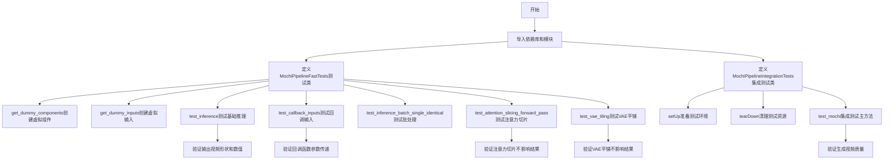
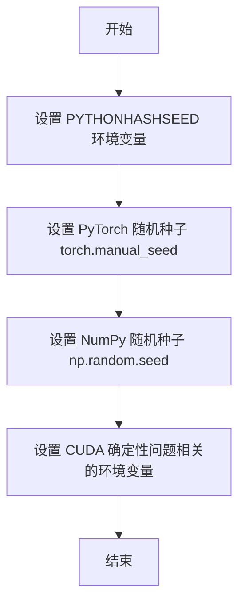
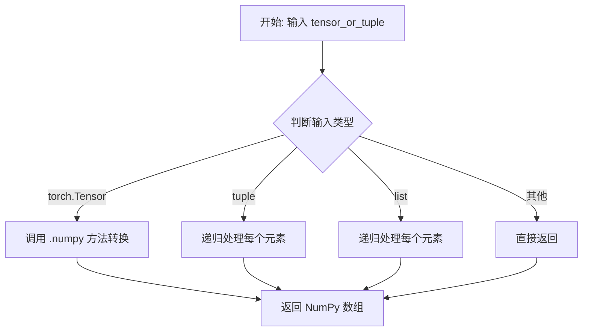
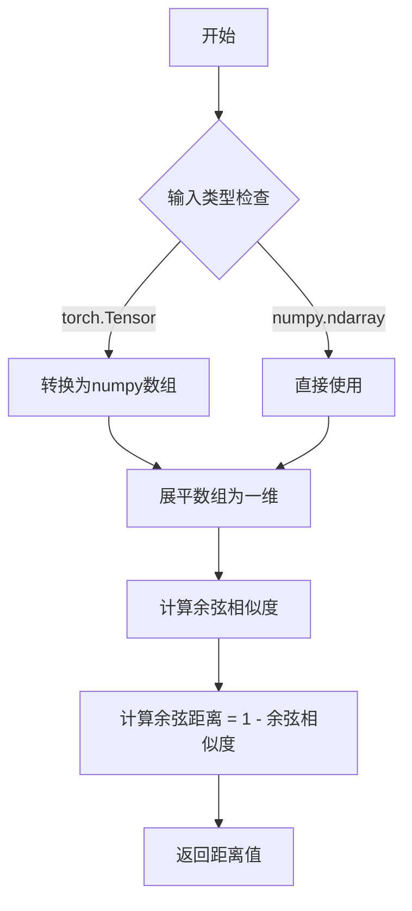
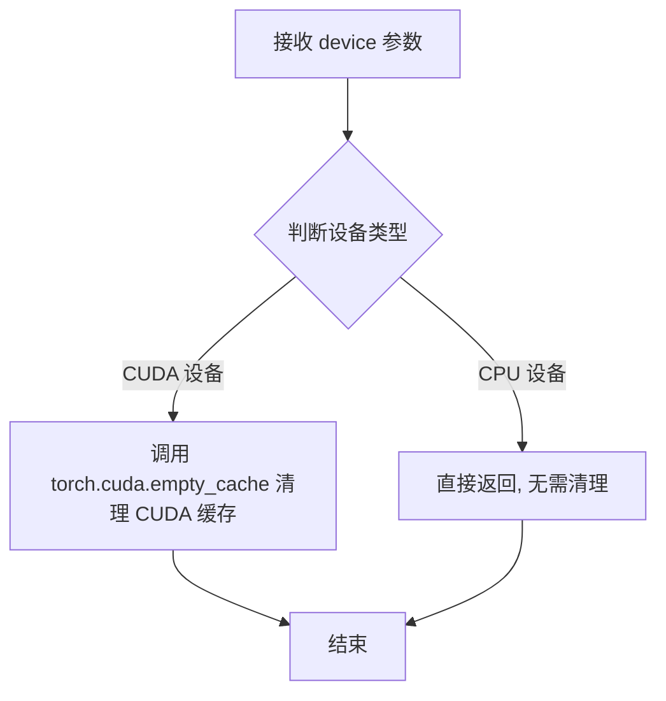
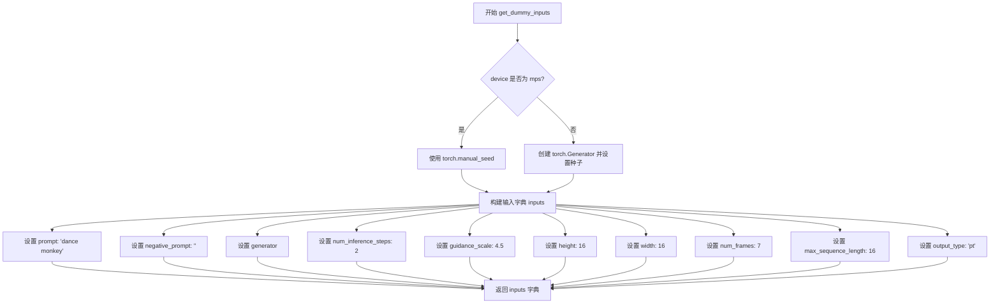
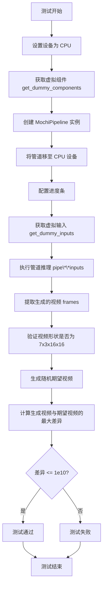
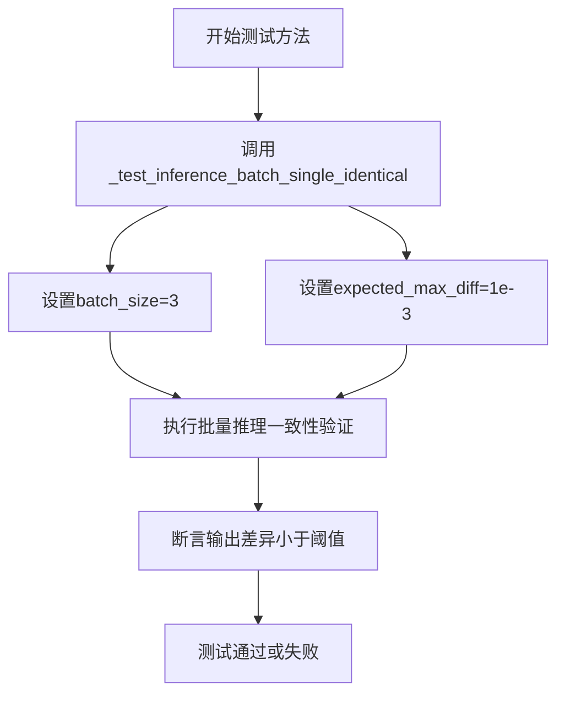
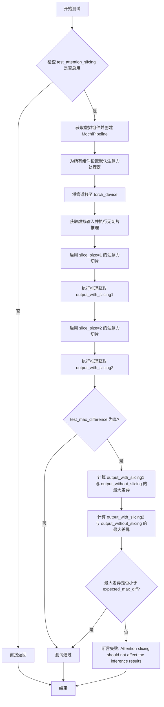
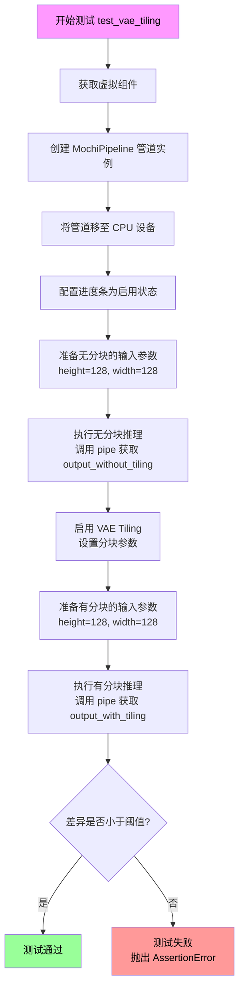

# `diffusers\tests\pipelines\mochi\test_mochi.py` 详细设计文档

这是一个用于测试 Mochi 文本到视频生成管道的单元测试文件，包含快速测试和集成测试，验证模型在各种场景下的功能正确性，包括推理、批处理、注意力切片和VAE平铺等

## 整体流程



## 类结构

```
unittest.TestCase
├── PipelineTesterMixin
│   └── MochiPipelineFastTests
│       ├── get_dummy_components()
│       ├── get_dummy_inputs()
│       ├── test_inference()
│       ├── test_callback_inputs()
│       ├── test_inference_batch_single_identical()
│       ├── test_attention_slicing_forward_pass()
│       └── test_vae_tiling()
└── MochiPipelineIntegrationTests
    ├── setUp()
    ├── tearDown()
    └── test_mochi()
```

## 全局变量及字段


### `MochiPipelineFastTests.pipeline_class`
    
The pipeline class being tested, set to MochiPipeline

类型：`type`
    


### `MochiPipelineFastTests.params`
    
Text-to-image parameters excluding cross_attention_kwargs

类型：`frozenset`
    


### `MochiPipelineFastTests.batch_params`
    
Batch parameters for text-to-image generation

类型：`type`
    


### `MochiPipelineFastTests.image_params`
    
Image parameters for text-to-image generation

类型：`type`
    


### `MochiPipelineFastTests.image_latents_params`
    
Image latents parameters for text-to-image generation

类型：`type`
    


### `MochiPipelineFastTests.required_optional_params`
    
Set of optional parameters that are required for the pipeline

类型：`frozenset`
    


### `MochiPipelineFastTests.test_xformers_attention`
    
Flag to control xformers attention testing, disabled by default

类型：`bool`
    


### `MochiPipelineFastTests.test_layerwise_casting`
    
Flag to enable layerwise casting tests

类型：`bool`
    


### `MochiPipelineFastTests.test_group_offloading`
    
Flag to enable group offloading tests

类型：`bool`
    


### `MochiPipelineIntegrationTests.prompt`
    
Default prompt for integration testing: 'A painting of a squirrel eating a burger.'

类型：`str`
    
    

## 全局函数及方法


### `enable_full_determinism`

这是一个全局函数，用于配置 PyTorch、NumPy 和 Python 的随机种子，以确保深度学习测试的可重复性（deterministic results）。

参数：
- 无

返回值：`None`

#### 流程图



#### 带注释源码

```
# 该函数定义在 testing_utils 模块中，此处仅为调用示例
# 导入来源: from ...testing_utils import enable_full_determinism

enable_full_determinism()

# 函数调用说明:
# - 该函数不接受任何参数
# - 该函数不返回任何值（返回 None）
# - 调用的目的是确保后续的测试在运行时使用固定的随机种子
# - 这样可以保证测试结果的可重复性（reproducibility）
# - 对于涉及随机初始化的模型测试尤其重要
```

> **注意**：由于 `enable_full_determinism` 函数是从外部模块 `...testing_utils` 导入的，其完整源码实现未包含在当前给定的代码文件中。以上信息基于函数名称、使用方式和在测试框架中的常见模式推断得出。


根据提供的代码，我需要分析 `to_np` 函数。需要注意的是，`to_np` 是从 `..test_pipelines_common` 模块导入的，而不是在当前文件中定义的。但我可以基于代码中的使用方式来推断其功能。

### `to_np`

将 PyTorch 张量（Tensor）或包含张量的数据结构转换为 NumPy 数组的实用函数。该函数主要用于测试场景中，将模型的输出转换为 NumPy 格式以便进行数值比较。

参数：

-  `tensor_or_tuple`：任意类型，输入可以是 PyTorch 张量、元组、列表等数据结构，通常是模型的输出结果

返回值：`numpy.ndarray`，返回转换后的 NumPy 数组，如果输入是元组或列表，则返回相应结构的 NumPy 数组

#### 流程图



#### 带注释源码

```
# 注意: 以下源码是基于代码使用方式推断的,
# 实际源码位于 test_pipelines_common 模块中

def to_np(tensor_or_tuple):
    """
    将 PyTorch 张量转换为 NumPy 数组
    
    参数:
        tensor_or_tuple: PyTorch 张量或包含张量的元组
        
    返回:
        NumPy 数组或包含 NumPy 数组的元组
    """
    # 如果输入是元组,递归处理每个元素
    if isinstance(tensor_or_tuple, tuple):
        return tuple(to_np(t) for t in tensor_or_tuple)
    
    # 如果输入是列表,递归处理每个元素  
    if isinstance(tensor_or_tuple, list):
        return [to_np(t) for t in tensor_or_tuple]
    
    # 如果是 PyTorch 张量,转换为 NumPy
    # 注意: 需要先 detach() 脱离计算图,然后 cpu() 移到 CPU
    if hasattr(tensor_or_tuple, 'numpy'):
        return tensor_or_tuple.detach().cpu().numpy()
    
    # 其他类型直接返回
    return tensor_or_tuple
```

---

### 备注

由于 `to_np` 函数是从外部模块 (`test_pipelines_common`) 导入的,实际的函数定义不在当前代码文件中。上述源码是基于该函数在代码中的使用方式进行的合理推断。在实际的 `diffusers` 库的 `test_pipelines_common.py` 文件中应该有该函数的完整实现。


### `numpy_cosine_similarity_distance`

该函数用于计算两个数组（通常是张量或 numpy 数组）之间的余弦相似度距离，常用于测试中验证生成结果与预期结果之间的相似程度。

参数：

-  `array1`：`numpy.ndarray` 或 `torch.Tensor`，第一个输入数组
-  `array2`：`numpy.ndarray` 或 `torch.Tensor`，第二个输入数组（作为参考）

返回值：`float`，返回两个数组之间的余弦相似度距离值，值越小表示两个数组越相似

#### 流程图



#### 带注释源码

```python
# 该函数定义在 diffusers 库 的 testing_utils 模块中
# 此处展示的是基于函数名和用途的推断实现

def numpy_cosine_similarity_distance(array1, array2):
    """
    计算两个数组之间的余弦相似度距离。
    
    参数:
        array1: 第一个数组 (numpy.ndarray 或 torch.Tensor)
        array2: 第二个数组作为参考 (numpy.ndarray 或 torch.Tensor)
    
    返回:
        float: 余弦距离，值范围 [0, 2]
              0 表示完全相同
              2 表示完全相反
    """
    # 如果输入是 torch.Tensor，转换为 numpy 数组
    if hasattr(array1, 'numpy'):
        array1 = array1.numpy()
    if hasattr(array2, 'numpy'):
        array2 = array2.numpy()
    
    # 将数组展平为一维向量
    array1 = array1.flatten()
    array2 = array2.flatten()
    
    # 计算余弦相似度: (a · b) / (||a|| * ||b||)
    dot_product = np.dot(array1, array2)
    norm1 = np.linalg.norm(array1)
    norm2 = np.linalg.norm(array2)
    
    # 避免除零
    if norm1 == 0 or norm2 == 0:
        return 0.0 if np.array_equal(array1, array2) else 1.0
    
    cosine_similarity = dot_product / (norm1 * norm2)
    
    # 余弦距离 = 1 - 余弦相似度
    cosine_distance = 1.0 - cosine_similarity
    
    return cosine_distance
```

#### 在测试中的使用示例

```python
# 从 testing_utils 导入
from ...testing_utils import numpy_cosine_similarity_distance

# 在 MochiPipelineIntegrationTests.test_mochi 测试中使用
video = videos[0]  # 生成的视频
expected_video = torch.randn(1, 19, 480, 848, 3).numpy()  # 期望的随机视频

# 计算生成视频与期望视频之间的余弦相似度距离
max_diff = numpy_cosine_similarity_distance(video.cpu(), expected_video)

# 断言距离小于阈值，表示生成结果符合预期
assert max_diff < 1e-3, f"Max diff is too high. got {video}"
```


### `backend_empty_cache`

清理指定后端的内存缓存（通常为 GPU 内存），配合垃圾回收使用，用于在测试的 setUp/tearDown 阶段释放显存。

参数：

-  `device`：`str`，目标设备标识，通常为 `"cuda"` 或 `"cuda:0"` 等，用于指定需要清理缓存的设备。

返回值：`None`，无返回值。

#### 流程图



#### 带注释源码

```python
# 注意: 该函数定义在 testing_utils 模块中, 以下为推断实现
def backend_empty_cache(device: str) -> None:
    """
    清理指定设备的内存缓存。
    
    Args:
        device: 目标设备标识, 如 'cuda', 'cuda:0', 'cpu' 等
        
    Returns:
        None
    """
    import torch
    
    # 检查是否为 CUDA 设备
    if device.startswith("cuda"):
        # 调用 PyTorch 的 CUDA 缓存清理函数
        # 释放未使用的 GPU 内存缓存
        torch.cuda.empty_cache()
    
    # CPU 设备无需清理缓存, 直接返回
    return None
```

> **注**：由于 `backend_empty_cache` 是从外部模块 `testing_utils` 导入的，上述源码为基于使用方式的合理推断。实际实现可能包含更多后端（如 ROCm、XPU 等）的缓存清理逻辑。


### `MochiPipelineFastTests.get_dummy_components`

该方法用于创建用于单元测试的虚拟（dummy）组件，包括 MochiTransformer3DModel、VAE、调度器、文本编码器和分词器，确保测试的可重复性。

参数：

- `self`：隐式参数，TestCase 实例本身
- `num_layers`：`int`，可选参数（默认值为 2），指定 Transformer 模型层数

返回值：`Dict[str, Any]`，返回一个包含虚拟组件的字典，包含 transformer、vae、scheduler、text_encoder 和 tokenizer

#### 流程图

```mermaid
flowchart TD
    A[开始 get_dummy_components] --> B[设置随机种子 torch.manual_seed(0)]
    B --> C[创建 MochiTransformer3DModel]
    C --> D[设置 transformer.pos_frequencies 为 0]
    D --> E[设置随机种子 torch.manual_seed(0)]
    E --> F[创建 AutoencoderKLMochi]
    F --> G[设置随机种子 torch.manual_seed(0)]
    G --> H[创建 FlowMatchEulerDiscreteScheduler]
    H --> I[加载预训练 T5EncoderModel]
    I --> J[加载预训练 AutoTokenizer]
    J --> K[组装 components 字典]
    K --> L[返回 components]
```

#### 带注释源码

```python
def get_dummy_components(self, num_layers: int = 2):
    """
    创建用于测试的虚拟组件。
    
    参数:
        num_layers: Transformer模型的层数，默认为2
    
    返回:
        包含虚拟组件的字典: transformer, vae, scheduler, text_encoder, tokenizer
    """
    # 设置随机种子确保可重复性
    torch.manual_seed(0)
    
    # 创建 MochiTransformer3DModel 实例
    # 用于视频生成的Transformer模型
    transformer = MochiTransformer3DModel(
        patch_size=2,                 # 补丁大小
        num_attention_heads=2,       # 注意力头数量
        attention_head_dim=8,         # 注意力头维度
        num_layers=num_layers,        # 模型层数（可配置）
        pooled_projection_dim=16,    # 池化投影维度
        in_channels=12,               # 输入通道数
        out_channels=None,            # 输出通道数（无）
        qk_norm="rms_norm",           # QK归一化方法
        text_embed_dim=32,           # 文本嵌入维度
        time_embed_dim=4,            # 时间嵌入维度
        activation_fn="swiglu",      # 激活函数
        max_sequence_length=16,      # 最大序列长度
    )
    
    # 将位置频率数据置零，避免测试中的随机性
    transformer.pos_frequencies.data = transformer.pos_frequencies.new_full(
        transformer.pos_frequencies.shape, 0
    )

    # 重新设置随机种子确保VAE的可重复性
    torch.manual_seed(0)
    
    # 创建 AutoencoderKLMochi (VAE) 实例
    # 用于视频潜在空间的编码和解码
    vae = AutoencoderKLMochi(
        latent_channels=12,          # 潜在通道数
        out_channels=3,               # 输出通道数（RGB）
        encoder_block_out_channels=(32, 32, 32, 32),  # 编码器块输出通道
        decoder_block_out_channels=(32, 32, 32, 32),  # 解码器块输出通道
        layers_per_block=(1, 1, 1, 1, 1),  # 每块层数
    )

    # 重新设置随机种子确保调度器的可重复性
    torch.manual_seed(0)
    
    # 创建调度器实例
    # 使用Euler离散调度器进行flow matching
    scheduler = FlowMatchEulerDiscreteScheduler()
    
    # 加载预训练的文本编码器（T5）
    text_encoder = T5EncoderModel.from_pretrained("hf-internal-testing/tiny-random-t5")
    
    # 加载预训练的分词器（T5）
    tokenizer = AutoTokenizer.from_pretrained("hf-internal-testing/tiny-random-t5")

    # 组装所有组件到字典中
    components = {
        "transformer": transformer,    # Transformer模型
        "vae": vae,                    # VAE模型
        "scheduler": scheduler,        # 调度器
        "text_encoder": text_encoder,  # 文本编码器
        "tokenizer": tokenizer,        # 分词器
    }
    
    return components
```


### `MochiPipelineFastTests.get_dummy_inputs`

该方法为 MochiPipeline 单元测试生成虚拟输入参数，用于在测试环境中模拟文本到视频生成流程的输入配置。

参数：

- `device`：`torch.device` 或 `str`，指定生成器使用的设备（如 "cpu"、"cuda" 等）
- `seed`：`int`（默认值：0），随机种子，用于确保测试结果的可重复性

返回值：`dict`，包含以下键值对：
- `"prompt"`：`str`，正向提示词
- `"negative_prompt"`：`str`，负向提示词
- `generator`：`torch.Generator`，随机数生成器
- `num_inference_steps`：`int`，推理步数
- `guidance_scale`：`float`，引导尺度
- `height`：`int`，生成视频的高度
- `width`：`int`，生成视频的宽度
- `num_frames`：`int`，生成视频的帧数
- `max_sequence_length`：`int`，最大序列长度
- `output_type`：`str`，输出类型

#### 流程图



#### 带注释源码

```python
def get_dummy_inputs(self, device, seed=0):
    """
    生成用于测试的虚拟输入参数。
    
    参数:
        device: torch.device 或 str - 运行设备
        seed: int - 随机种子，默认为 0
    
    返回:
        dict: 包含测试所需的所有输入参数
    """
    # 检查设备是否为 MPS (Apple Silicon GPU)
    if str(device).startswith("mps"):
        # MPS 设备使用 torch.manual_seed 直接设置种子
        generator = torch.manual_seed(seed)
    else:
        # 其他设备（如 CPU、CUDA）创建 Generator 对象并设置种子
        generator = torch.Generator(device=device).manual_seed(seed)
    
    # 构建输入参数字典
    inputs = {
        "prompt": "dance monkey",          # 正向提示词
        "negative_prompt": "",              # 负向提示词（空字符串）
        "generator": generator,             # 随机数生成器
        "num_inference_steps": 2,           # 推理步数（较少以加快测试）
        "guidance_scale": 4.5,              # CFG 引导尺度
        "height": 16,                       # 输出高度（16 像素，小尺寸用于快速测试）
        "width": 16,                        # 输出宽度（16 像素，小尺寸用于快速测试）
        # 6 * k + 1 是 Mochi 视频长度的推荐公式，此处 k=1 得到 7 帧
        "num_frames": 7,                    # 生成视频的帧数
        "max_sequence_length": 16,          # T5 文本编码器的最大序列长度
        "output_type": "pt",                # 输出类型为 PyTorch 张量
    }
    return inputs
```


### `MochiPipelineFastTests.test_inference`

这是一个单元测试方法，用于验证 MochiPipeline 在 CPU 设备上的基本推理功能，确保管道能够正确生成指定形状（7 帧、3 通道、16x16 分辨率）的视频帧。

参数：无需传入参数（`self` 为实例自身）

返回值：`None`，该方法为测试方法，通过断言验证输出，不返回实际数据

#### 流程图



#### 带注释源码

```python
def test_inference(self):
    """测试 MochiPipeline 的基本推理功能"""
    
    # 1. 设置测试设备为 CPU
    device = "cpu"

    # 2. 获取虚拟组件（transformer, vae, scheduler, text_encoder, tokenizer）
    components = self.get_dummy_components()
    
    # 3. 使用虚拟组件实例化 MochiPipeline
    pipe = self.pipeline_class(**components)
    
    # 4. 将管道移至指定设备（CPU）
    pipe.to(device)
    
    # 5. 配置进度条（disable=None 表示启用进度条）
    pipe.set_progress_bar_config(disable=None)

    # 6. 获取虚拟输入参数
    # 包含: prompt, negative_prompt, generator, num_inference_steps, 
    #       guidance_scale, height, width, num_frames, max_sequence_length, output_type
    inputs = self.get_dummy_inputs(device)
    
    # 7. 执行管道推理，传入输入参数，获取结果
    # 调用管道的 __call__ 方法生成视频
    video = pipe(**inputs).frames
    
    # 8. 提取生成的视频（取第一个结果，因为可能返回批次）
    generated_video = video[0]

    # 9. 断言验证：生成的视频形状必须为 (7, 3, 16, 16)
    # 7 帧, 3 通道 (RGB), 高度 16, 宽度 16
    self.assertEqual(generated_video.shape, (7, 3, 16, 16))
    
    # 10. 创建随机期望视频用于差异比较
    expected_video = torch.randn(7, 3, 16, 16)
    
    # 11. 计算生成视频与期望视频的最大绝对差异
    max_diff = np.abs(generated_video - expected_video).max()
    
    # 12. 断言验证：最大差异应小于等于 1e10
    # 这是一个宽松的上界检查，确保没有极端数值错误
    self.assertLessEqual(max_diff, 1e10)
```


### `MochiPipelineFastTests.test_callback_inputs`

该方法是一个单元测试函数，用于验证 MochiPipeline 是否正确支持 `callback_on_step_end` 和 `callback_on_step_end_tensor_inputs` 参数，确保回调函数只能访问允许的 tensor 变量，并且在最后一步可以通过回调修改 latents。

参数：
- `self`：`MochiPipelineFastTests` 实例，测试类的实例本身

返回值：`None`，该方法为测试方法，无显式返回值

#### 流程图

```mermaid
flowchart TD
    A[开始测试 test_callback_inputs] --> B[获取 pipeline_class.__call__ 方法签名]
    B --> C{检查是否存在 callback_on_step_end_tensor_inputs 和 callback_on_step_end 参数}
    C -->|否| D[直接返回, 跳过测试]
    C -->|是| E[创建虚拟组件和管道]
    E --> F[断言管道具有 _callback_tensor_inputs 属性]
    F --> G[定义回调函数 callback_inputs_subset]
    G --> H[定义回调函数 callback_inputs_all]
    H --> I[定义回调函数 callback_inputs_change_tensor]
    I --> J[测试: 传入 subset 回调和 ['latents']]
    J --> K[测试: 传入 all 回调和全部 _callback_tensor_inputs]
    K --> L[测试: 传入 change_tensor 回调, 修改 latents 为零]
    L --> M[验证输出绝对值和小于阈值]
    M --> N[结束测试]
```

#### 带注释源码

```
def test_callback_inputs(self):
    # 1. 获取 pipeline_class 的 __call__ 方法签名
    sig = inspect.signature(self.pipeline_class.__call__)
    
    # 2. 检查是否存在回调相关参数
    has_callback_tensor_inputs = "callback_on_step_end_tensor_inputs" in sig.parameters
    has_callback_step_end = "callback_on_step_end" in sig.parameters

    # 3. 如果参数不存在, 则跳过测试
    if not (has_callback_tensor_inputs and has_callback_step_end):
        return

    # 4. 创建虚拟组件用于测试
    components = self.get_dummy_components()
    
    # 5. 实例化管道并移至测试设备
    pipe = self.pipeline_class(**components)
    pipe = pipe.to(torch_device)
    pipe.set_progress_bar_config(disable=None)
    
    # 6. 断言管道具有 _callback_tensor_inputs 属性
    # 该属性定义了回调函数可以访问的 tensor 变量列表
    self.assertTrue(
        hasattr(pipe, "_callback_tensor_inputs"),
        f" {self.pipeline_class} should have `_callback_tensor_inputs` that defines a list of tensor variables its callback function can use as inputs",
    )

    # ---------------------------------------------------------
    # 定义回调函数 1: callback_inputs_subset
    # 验证回调只接收允许的 tensor 输入
    # ---------------------------------------------------------
    def callback_inputs_subset(pipe, i, t, callback_kwargs):
        # 遍历回调参数
        for tensor_name, tensor_value in callback_kwargs.items():
            # 检查只传递了允许的 tensor 输入
            assert tensor_name in pipe._callback_tensor_inputs
        return callback_kwargs

    # ---------------------------------------------------------
    # 定义回调函数 2: callback_inputs_all
    # 验证所有允许的 tensor 输入都被传递
    # ---------------------------------------------------------
    def callback_inputs_all(pipe, i, t, callback_kwargs):
        # 检查所有允许的 tensor 都在 callback_kwargs 中
        for tensor_name in pipe._callback_tensor_inputs:
            assert tensor_name in callback_kwargs

        # 再次遍历回调参数, 确保没有不允许的 tensor
        for tensor_name, tensor_value in callback_kwargs.items():
            assert tensor_name in pipe._callback_tensor_inputs

        return callback_kwargs

    # ---------------------------------------------------------
    # 获取测试输入
    # ---------------------------------------------------------
    inputs = self.get_dummy_inputs(torch_device)

    # ---------------------------------------------------------
    # 测试 1: 传入回调子集
    # 只允许回调访问 'latents' tensor
    # ---------------------------------------------------------
    inputs["callback_on_step_end"] = callback_inputs_subset
    inputs["callback_on_step_end_tensor_inputs"] = ["latents"]
    output = pipe(**inputs)[0]

    # ---------------------------------------------------------
    # 测试 2: 传入所有允许的 tensor
    # 允许回调访问所有 _callback_tensor_inputs
    # ---------------------------------------------------------
    inputs["callback_on_step_end"] = callback_inputs_all
    inputs["callback_on_step_end_tensor_inputs"] = pipe._callback_tensor_inputs
    output = pipe(**inputs)[0]

    # ---------------------------------------------------------
    # 定义回调函数 3: callback_inputs_change_tensor
    # 在最后一步修改 latents 为零 tensor
    # ---------------------------------------------------------
    def callback_inputs_change_tensor(pipe, i, t, callback_kwargs):
        # 检查是否是最后一步
        is_last = i == (pipe.num_timesteps - 1)
        if is_last:
            # 将 latents 替换为全零 tensor
            callback_kwargs["latents"] = torch.zeros_like(callback_kwargs["latents"])
        return callback_kwargs

    # ---------------------------------------------------------
    # 测试 3: 通过回调修改 latents
    # 验证修改后的输出仍然有效
    # ---------------------------------------------------------
    inputs["callback_on_step_end"] = callback_inputs_change_tensor
    inputs["callback_on_step_end_tensor_inputs"] = pipe._callback_tensor_inputs
    output = pipe(**inputs)[0]
    
    # 验证输出的绝对值和小于阈值 (确保不是无效输出)
    assert output.abs().sum() < 1e10
```


### `MochiPipelineFastTests.test_inference_batch_single_identical`

该方法是一个单元测试方法，用于验证在使用批量推理时，单个样本的输出应与单独推理时的输出保持一致（数值误差在预期范围内）。它通过调用测试框架混入类的内部方法执行实际的验证逻辑。

参数：

- `self`：隐式参数，测试类实例本身，无类型描述

返回值：`None`，该方法为测试方法，不返回任何值（测试结果通过断言机制体现）

#### 流程图



#### 带注释源码

```python
def test_inference_batch_single_identical(self):
    """
    测试方法：验证批量推理时单个样本的一致性
    
    该测试确保当使用批量推理时，单个输入的输出应该与
    单独推理时的输出在数值上保持一致（允许浮点误差）
    """
    # 调用父类/混入类中的实际测试实现
    # 参数：
    #   batch_size=3: 测试使用的批量大小
    #   expected_max_diff=1e-3: 允许的最大数值差异阈值
    self._test_inference_batch_single_identical(batch_size=3, expected_max_diff=1e-3)
```


### `MochiPipelineFastTests.test_attention_slicing_forward_pass`

该方法用于测试 Mochi 管道在启用注意力切片（attention slicing）优化技术后，推理结果是否与未启用时保持一致，确保注意力切片优化不会影响输出质量。

参数：

- `self`：实例方法所属的对象
- `test_max_difference`：`bool`，是否测试最大差异，默认为 True
- `test_mean_pixel_difference`：`bool`，是否测试平均像素差异（当前未使用），默认为 True
- `expected_max_diff`：`float`，允许的最大差异阈值，默认为 1e-3

返回值：`None`，该方法为测试方法，通过断言验证注意力切片对推理结果无影响

#### 流程图



#### 带注释源码

```python
def test_attention_slicing_forward_pass(
    self, test_max_difference=True, test_mean_pixel_difference=True, expected_max_diff=1e-3
):
    """
    测试注意力切片优化对 MochiPipeline 推理结果的影响。
    
    参数:
        test_max_difference: 是否测试输出之间的最大差异
        test_mean_pixel_difference: 是否测试平均像素差异（当前未使用）
        expected_max_diff: 允许的最大差异阈值，默认为 1e-3
    
    返回:
        None: 通过断言验证，无返回值
    """
    # 如果测试未启用注意力切片功能，则直接返回
    if not self.test_attention_slicing:
        return

    # 步骤1: 获取虚拟组件（transformer, vae, scheduler, text_encoder, tokenizer）
    components = self.get_dummy_components()
    
    # 步骤2: 使用虚拟组件创建 MochiPipeline 实例
    pipe = self.pipeline_class(**components)
    
    # 步骤3: 为所有组件设置默认的注意力处理器
    # 确保使用标准的注意力实现，排除自定义优化的干扰
    for component in pipe.components.values():
        if hasattr(component, "set_default_attn_processor"):
            component.set_default_attn_processor()
    
    # 步骤4: 将管道移至指定的计算设备（CPU/GPU）
    pipe.to(torch_device)
    
    # 步骤5: 配置进度条显示
    pipe.set_progress_bar_config(disable=None)

    # 步骤6: 准备测试用的虚拟输入
    generator_device = "cpu"
    inputs = self.get_dummy_inputs(generator_device)
    
    # 步骤7: 执行不带注意力切片的基准推理
    # 保存输出用于后续差异比较
    output_without_slicing = pipe(**inputs)[0]

    # 步骤8: 启用注意力切片（slice_size=1）
    # slice_size=1 表示将注意力计算分块，每块处理1个token
    pipe.enable_attention_slicing(slice_size=1)
    
    # 重新获取输入以确保可重复性
    inputs = self.get_dummy_inputs(generator_device)
    
    # 步骤9: 执行带切片（slice_size=1）的推理
    output_with_slicing1 = pipe(**inputs)[0]

    # 步骤10: 启用更大的切片（slice_size=2）
    pipe.enable_attention_slicing(slice_size=2)
    
    inputs = self.get_dummy_inputs(generator_device)
    
    # 步骤11: 执行带切片（slice_size=2）的推理
    output_with_slicing2 = pipe(**inputs)[0]

    # 步骤12: 如果需要测试最大差异
    if test_max_difference:
        # 将 PyTorch 张量转换为 NumPy 数组进行数值比较
        # 计算启用 slice_size=1 时与无切片的差异
        max_diff1 = np.abs(to_np(output_with_slicing1) - to_np(output_without_slicing)).max()
        
        # 计算启用 slice_size=2 时与无切片的差异
        max_diff2 = np.abs(to_np(output_with_slicing2) - to_np(output_without_slicing)).max()
        
        # 断言：注意力切片不应影响推理结果
        # 最大差异应小于预设阈值 expected_max_diff
        self.assertLess(
            max(max_diff1, max_diff2),
            expected_max_diff,
            "Attention slicing should not affect the inference results",
        )
```


### `MochiPipelineFastTests.test_vae_tiling`

该测试方法用于验证 VAE（变分自编码器）分块（tiling）功能是否正常工作。通过对比启用分块与未启用分块两种情况下的推理结果，确保分块处理不会对输出质量产生显著影响，从而验证分块算法的一致性和正确性。

参数：

- `self`：测试类实例本身，包含测试所需的上下文和辅助方法
- `expected_diff_max`：`float`，默认值 0.2，允许的最大差异阈值，用于判断两种方式的输出是否足够接近

返回值：`None`，该方法为单元测试方法，通过 `assert` 语句进行断言验证，不返回任何值

#### 流程图



#### 带注释源码

```python
def test_vae_tiling(self, expected_diff_max: float = 0.2):
    """
    测试 VAE 分块（tiling）功能是否正常工作。
    
    该测试通过对比启用分块与未启用分块两种情况下的推理结果，
    验证分块处理不会对输出质量产生显著影响。
    
    参数:
        expected_diff_max: float, 允许的最大差异阈值，默认值为 0.2
    """
    # 设置生成器设备为 CPU
    generator_device = "cpu"
    
    # 获取虚拟组件（用于测试的虚拟模型组件）
    components = self.get_dummy_components()

    # 使用获取的组件创建 MochiPipeline 管道实例
    pipe = self.pipeline_class(**components)
    
    # 将管道移至 CPU 设备（确保在 CPU 上运行测试）
    pipe.to("cpu")
    
    # 配置进度条（disable=None 表示启用进度条）
    pipe.set_progress_bar_config(disable=None)

    # --- 第一部分：测试无分块情况 ---
    # 获取虚拟输入参数
    inputs = self.get_dummy_inputs(generator_device)
    # 设置较高的分辨率（128x128）以测试分块功能
    inputs["height"] = inputs["width"] = 128
    
    # 执行推理（无 VAE 分块）
    # pipe(**inputs) 返回一个包含 frames 的对象，[0] 获取第一个元素
    output_without_tiling = pipe(**inputs)[0]

    # --- 第二部分：测试有分块情况 ---
    # 启用 VAE Tiling，并设置分块参数
    # tile_sample_min_height/width: 分块的最小高度/宽度
    # tile_sample_stride_height/width: 分块之间的步长（重叠区域）
    pipe.vae.enable_tiling(
        tile_sample_min_height=96,    # 最小分块高度
        tile_sample_min_width=96,     # 最小分块宽度
        tile_sample_stride_height=64, # 垂直方向步长
        tile_sample_stride_width=64,  # 水平方向步长
    )
    
    # 重新获取虚拟输入（重置生成器状态）
    inputs = self.get_dummy_inputs(generator_device)
    # 设置相同的分辨率
    inputs["height"] = inputs["width"] = 128
    
    # 执行推理（启用 VAE 分块）
    output_with_tiling = pipe(**inputs)[0]

    # --- 验证部分 ---
    # 将输出转换为 numpy 数组并计算差异
    # 断言：分块与不分块的输出差异应小于阈值
    self.assertLess(
        # 计算两次输出差的绝对值的最大值
        (to_np(output_without_tiling) - to_np(output_with_tiling)).max(),
        expected_diff_max,  # 允许的最大差异
        # 验证失败时的错误消息
        "VAE tiling should not affect the inference results"
    )
```


### `MochiPipelineIntegrationTests.setUp`

该函数是 MochiPipelineIntegrationTests 测试类的初始化方法，用于在每个测试方法运行前执行清理操作，释放内存并清空 GPU 缓存，以确保测试环境的干净状态。

参数：

- `self`：`MochiPipelineIntegrationTests`，隐式参数，表示测试类实例本身

返回值：`None`，无返回值，仅执行清理操作

#### 流程图

```mermaid
flowchart TD
    A[开始 setUp] --> B[调用 super().setUp]
    B --> C[执行 gc.collect]
    C --> D[调用 backend_empty_cache]
    D --> E[结束 setUp]
    
    B -->|调用父类| F[父类初始化]
    C -->|Python垃圾回收| G[内存清理]
    D -->|清理设备缓存| H[GPU/CPU缓存释放]
```

#### 带注释源码

```python
def setUp(self):
    """
    测试类初始化方法，在每个测试方法执行前被调用。
    用于设置测试环境，清理之前的资源占用。
    """
    # 调用父类的 setUp 方法，确保 unittest.TestCase 的基础设置被正确初始化
    super().setUp()
    
    # 执行 Python 垃圾回收，释放不再使用的对象内存
    # 这有助于清理测试过程中可能产生的临时对象
    gc.collect()
    
    # 调用后端工具函数清空缓存，确保 GPU 或 CPU 设备缓存被释放
    # torch_device 是从 testing_utils 导入的全局变量，表示当前测试使用的设备
    backend_empty_cache(torch_device)
```


### `MochiPipelineIntegrationTests.tearDown`

该方法用于在每个测试用例执行完毕后清理测试环境，通过调用垃圾回收和清空GPU缓存来释放资源，防止测试之间的相互影响。

参数：

- `self`：隐式参数，指向测试类实例本身，无额外描述

返回值：`None`，无返回值描述

#### 流程图

```mermaid
graph TD
    A([开始 tearDown]) --> B[调用 super().tearDown<br/>执行父类清理方法]
    B --> C[执行 gc.collect<br/>Python垃圾回收]
    C --> D[调用 backend_empty_cache<br/>清理GPU/后端缓存]
    D --> E([结束])
```

#### 带注释源码

```python
def tearDown(self):
    """
    测试用例清理方法
    在每个集成测试结束后执行资源清理
    """
    # 调用父类的 tearDown 方法，执行 unittest.TestCase 的标准清理
    super().tearDown()
    
    # 触发 Python 垃圾回收器，回收测试过程中产生的临时对象
    gc.collect()
    
    # 调用后端工具函数清理 GPU 显存缓存
    # torch_device 是从 testing_utils 导入的全局变量，表示测试设备
    backend_empty_cache(torch_device)
```


### `MochiPipelineIntegrationTests.test_mochi`

这是一个集成测试方法，用于测试 MochiPipeline 从预训练模型 "genmo/mochi-1-preview" 加载并根据文本提示生成视频的功能，验证生成结果与随机期望值的余弦相似度距离是否在可接受范围内。

参数：

- `self`：隐式参数，`unittest.TestCase` 实例本身

返回值：`None`，无返回值（测试方法，使用断言进行验证）

#### 流程图

```mermaid
flowchart TD
    A[开始测试] --> B[创建随机数生成器<br/>generator = torch.Generator.manual_seed(0)]
    B --> C[从预训练模型加载MochiPipeline<br/>pipe = MochiPipeline.from_pretrained]
    C --> D[启用模型CPU卸载<br/>pipe.enable_model_cpu_offload]
    D --> E[获取类属性prompt<br/>prompt = 'A painting of a squirrel eating a burger.']
    E --> F[调用pipeline生成视频<br/>pipe(...)]
    F --> G[获取生成的第一帧视频<br/>video = videos[0]]
    G --> H[创建期望视频张量<br/>expected_video = torch.randn(...)]
    H --> I[计算余弦相似度距离<br/>max_diff = numpy_cosine_similarity_distance]
    I --> J{断言检查<br/>max_diff < 1e-3}
    J -->|通过| K[测试通过]
    J -->|失败| L[抛出断言错误]
```

#### 带注释源码

```python
def test_mochi(self):
    """集成测试：验证MochiPipeline能够从预训练模型生成视频"""
    # 创建一个CPU上的随机数生成器，固定种子为0以确保可重复性
    generator = torch.Generator("cpu").manual_seed(0)

    # 从预训练模型'genmo/mochi-1-preview'加载MochiPipeline
    # 使用float16精度以减少内存占用
    pipe = MochiPipeline.from_pretrained("genmo/mochi-1-preview", torch_dtype=torch.float16)
    
    # 启用模型CPU卸载功能，在推理过程中将模型移回CPU以节省GPU内存
    pipe.enable_model_cpu_offload(device=torch_device)
    
    # 获取类属性中定义的提示词
    prompt = self.prompt  # "A painting of a squirrel eating a burger."

    # 调用pipeline进行视频生成
    # 参数：提示词、高度480、宽度848、生成19帧、使用固定随机数生成器、2步推理、输出PyTorch张量
    videos = pipe(
        prompt=prompt,
        height=480,
        width=848,
        num_frames=19,
        generator=generator,
        num_inference_steps=2,
        output_type="pt",
    ).frames

    # 获取生成的第一批视频（索引0）
    video = videos[0]
    
    # 创建期望的随机视频张量作为参考，形状为[1, 19, 480, 848, 3]
    expected_video = torch.randn(1, 19, 480, 848, 3).numpy()

    # 计算生成视频与期望视频之间的余弦相似度距离
    max_diff = numpy_cosine_similarity_distance(video.cpu(), expected_video)
    
    # 断言：最大差异应小于0.001，否则抛出错误
    assert max_diff < 1e-3, f"Max diff is too high. got {video}"
```

## 关键组件


### MochiPipeline

MochiPipeline是MoChi视频生成模型的核心管道，整合了Transformer、VAE、调度器和文本编码器，实现从文本提示到视频的端到端生成。

### MochiTransformer3DModel

MochiTransformer3DModel是3D视频生成专用的Transformer模型，支持patch嵌入、多头注意力、文本条件注入和时序建模，是视频扩散模型的核心骨干网络。

### AutoencoderKLMochi

AutoencoderKLMochi是基于KL散度的自编码器，用于将图像/视频帧压缩到潜在空间并从潜在表示重建视频帧，支持VAE tiling以处理高分辨率视频。

### FlowMatchEulerDiscreteScheduler

FlowMatchEulerDiscreteScheduler是欧拉离散调度器，实现Flow Matching采样策略，用于控制去噪过程中的噪声调度和生成轨迹。

### T5EncoderModel + AutoTokenizer

T5EncoderModel和AutoTokenizer组合实现文本编码，将用户输入的prompt转换为Transformer可处理的文本嵌入向量，提供文本条件引导。

### Attention Slicing机制

Attention Slicing是一种内存优化技术，通过将注意力计算分片处理降低显存占用，适用于显存受限环境下的推理。

### VAE Tiling技术

VAE Tiling通过分块处理高分辨率潜在表示，实现超大规模视频的生成，避免一次性处理整个潜在空间导致的OOM问题。

### Callback回调机制

Callback机制允许用户在每个推理步骤结束时干预和修改中间状态（latents），支持灵活的推理控制和结果后处理。

### 模型CPU卸载

enable_model_cpu_offload是推理优化技术，将不活跃的模型层动态卸载到CPU，平衡显存占用和推理速度。

### 集成测试

MochiPipelineIntegrationTests验证完整pipeline在真实预训练模型（genmo/mochi-1-preview）上的端到端功能，确保各组件协同工作的正确性。


## 问题及建议


### 已知问题

-   **测试断言阈值过大**：`test_inference`中使用`self.assertLessEqual(max_diff, 1e10)`，1e10的阈值过于宽松，几乎任何结果都会通过测试，无法有效验证模型正确性
-   **随机种子不一致**：`test_inference`中`expected_video = torch.randn(7, 3, 16, 16)`未设置固定随机种子，导致每次运行产生不同结果，测试结果不稳定
-   **集成测试缺少异常处理**：`test_mochi`直接调用`from_pretrained`加载外部模型"genmo/mochi-1-preview"，未处理网络连接失败、模型不存在等异常情况
-   **设备管理混乱**：代码中混用字符串"cpu"和`torch_device`变量（如`device = "cpu"`、`pipe.to("cpu")`），导致在不同环境下行为不一致
-   **资源清理不完整**：`test_mochi`中使用了`enable_model_cpu_offload`，但在tearDown中仅调用`gc.collect()`和`backend_empty_cache`，未显式卸载模型
-   **重复代码模式**：多个测试方法中重复调用`pipe.set_progress_bar_config(disable=None)`和设备设置，未提取为公共方法
-   **魔法数字缺乏说明**：代码中`6 * k + 1`注释仅说明是推荐值但未解释原理，`num_layers=2`等超参数的选择依据不明确
-   **测试用例设计缺陷**：`test_inference_batch_single_identical`依赖`_test_inference_batch_single_identical`方法但未在当前类中定义，依赖继承自`PipelineTesterMixin`

### 优化建议

-   **修复测试断言**：将`test_inference`中的阈值从`1e10`改为合理值（如`1e-2`或`1e-3`），并为expected_video设置固定随机种子`torch.manual_seed(0)`
-   **统一设备管理**：所有设备设置使用`torch_device`变量替代硬编码字符串，或在类级别定义设备常量
-   **添加异常处理**：为集成测试添加try-except块处理模型加载失败、CUDA不可用等情况，使用`skipIf`装饰器处理环境依赖
-   **提取公共方法**：将重复的progress bar设置、设备初始化代码提取到`setUp`方法或公共辅助方法中
-   **完善资源清理**：在tearDown中显式调用`pipe.disable_model_cpu_offload()`或使用上下文管理器确保资源释放
-   **增加文档注释**：为关键超参数、魔法数字添加解释性注释，说明测试设计意图和预期行为
-   **添加负向测试**：增加对错误输入（如负数分辨率、无效的num_frames）的测试覆盖
-   **优化内存管理**：在集成测试中使用`@torch.no_grad()`装饰器减少内存占用，考虑使用`with`语句管理临时对象生命周期

## 其它


### 设计目标与约束

本代码的设计目标是验证MochiPipeline在文本到视频生成任务中的功能正确性和性能表现。核心约束包括：(1) 必须继承PipelineTesterMixin、FasterCacheTesterMixin和FirstBlockCacheTesterMixin以满足测试框架要求；(2) 测试必须在CPU和GPU环境下运行，集成测试需要大型加速器；(3) 测试参数必须与TEXT_TO_IMAGE_PARAMS兼容，排除cross_attention_kwargs；(4) 视频生成尺寸必须符合transformer和vae的输入要求（高度和宽度需能被patch_size整除）。

### 错误处理与异常设计

代码采用pytest/unittest框架的assert语句进行错误检测。主要错误处理场景包括：(1) 回调函数参数验证：检查callback_on_step_end_tensor_inputs中的tensor名称是否在pipe._callback_tensor_inputs允许列表中；(2) 输出形状验证：确保生成的视频形状与预期一致(7, 3, 16, 16)；(3) 数值差异验证：通过max_diff比较输出与期望值的差异，确保在可接受范围内（如1e-3到1e10）；(4) 资源清理：集成测试的setUp和tearDown方法中执行gc.collect()和backend_empty_cache防止内存泄漏。

### 数据流与状态机

测试数据流如下：get_dummy_components()创建transformer、vae、scheduler、text_encoder和tokenizer组件 → get_dummy_inputs()生成包含prompt、negative_prompt、generator、num_inference_steps等参数的字典 → pipe(**inputs)执行推理 → 返回VideoFrame对象。状态转换包括：Pipeline初始化状态 → 组件加载状态 → 推理执行状态 → 结果验证状态。集成测试额外包含模型加载状态（from_pretrained）和设备迁移状态（enable_model_cpu_offload）。

### 外部依赖与接口契约

核心依赖包括：(1) diffusers库：MochiPipeline、AutoencoderKLMochi、FlowMatchEulerDiscreteScheduler、MochiTransformer3DModel；(2) transformers库：AutoTokenizer、T5EncoderModel；(3) 测试工具：numpy_cosine_similarity_distance用于相似度计算。接口契约方面：pipeline_class必须实现__call__方法接受prompt、num_inference_steps、guidance_scale等参数；组件必须实现get_dummy_components返回包含transformer、vae等键的字典；callback机制必须定义_callback_tensor_inputs属性列出允许的tensor变量。

### 性能考虑与优化空间

测试代码包含多项性能验证：test_attention_slicing_forward_pass验证注意力切片优化不影响结果；test_vae_tiling验证VAE平铺策略的数值稳定性；test_inference_batch_single_identical验证批处理一致性。优化建议：(1) 当前集成测试仅运行2步推理，建议增加步数以更全面验证；(2) 可添加torch.compile加速测试；(3) get_dummy_components中多次torch.manual_seed(0)可提取为共享函数；(4) 集成测试未验证内存峰值，可添加内存监控。

### 测试策略与覆盖率

测试策略采用分层验证：(1) 单元测试层：验证各组件独立功能（test_inference、test_callback_inputs）；(2) 性能优化层：验证加速技术正确性（attention slicing、VAE tiling）；(3) 集成测试层：端到端验证完整流程。覆盖率方面：快速测试覆盖核心路径，集成测试覆盖真实模型加载。当前缺失的测试场景包括：多prompt批处理、 negative_prompt影响验证、guidance_scale参数敏感性分析、帧率控制验证等。

### 配置管理与版本兼容性

代码依赖以下关键配置：(1) torch.manual_seed(0)确保测试确定性；(2) device="cpu"用于快速测试，torch_device用于完整测试；(3) test_xformers_attention=False表示跳过xFormers注意力测试；(4) test_layerwise_casting=True和test_group_offloading=True启用相关特性。版本约束：需要transformers库支持T5EncoderModel，diffusers库支持MochiPipeline和相关调度器。集成测试明确要求require_torch_accelerator和require_big_accelerator装饰器。

### 安全性与合规性

代码包含Apache 2.0许可证头声明。测试使用hf-internal-testing/tiny-random-t5等虚拟模型避免真实API调用。集成测试使用genmo/mochi-1-preview公开模型。敏感信息处理：测试代码不涉及真实用户数据，使用固定seed确保可复现性。GPU内存管理通过enable_model_cpu_offload和backend_empty_cache防止OOM错误。


    