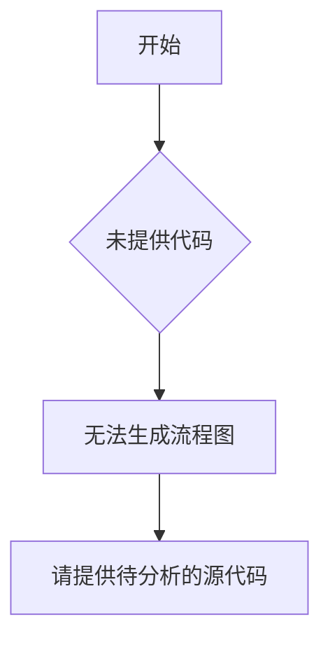

# `diffusers\tests\pipelines\omnigen\__init__.py` 详细设计文档

未提供源代码文件，无法进行分析。

## 整体流程



## 类结构

```

```

## 全局变量及字段


    

## 全局函数及方法


## 关键组件


### 代码分析

未提供有效的源代码内容可供分析。请提供需要分析的代码。


## 问题及建议


### 已知问题

-   未提供代码内容，无法进行技术债务分析

### 优化建议

-   请提供待分析的源代码，以便进行详细的技术债务识别和优化建议生成

## 其它


### 设计目标与约束

描述系统的设计目标，包括性能、可靠性、可维护性、可扩展性等非功能需求，以及技术约束、业务约束、预算约束等。

### 错误处理与异常设计

详细说明系统中的错误处理机制，包括异常类型、错误代码、错误消息格式、日志记录策略、以及如何向用户呈现错误。

### 数据流与状态机

描述数据在系统中的流动过程，包括数据输入、处理、存储和输出的完整路径；对于有状态的系统，描述状态机模型、状态转换条件和触发事件。

### 外部依赖与接口契约

列出系统依赖的外部系统、库或服务，包括接口定义、协议、数据格式、认证机制，以及与这些依赖的交互方式。

### 性能考虑

描述性能相关的设计决策，如缓存策略、异步处理、负载均衡、数据库查询优化等，以确保系统满足性能指标。

### 安全性设计

说明安全相关的设计，如身份验证、授权、数据加密、输入验证、防止常见攻击（如SQL注入、XSS）等。

### 可观测性和监控

描述日志记录、指标收集、追踪机制，以便于系统监控、故障排查和性能分析。

### 部署和运维

描述系统的部署架构、配置管理、环境要求、以及运维相关的考虑，如备份、恢复、扩展策略。

### 兼容性设计

描述系统对硬件、软件、浏览器、版本的兼容性考虑，以及如何处理向后兼容性问题。

### 附录

包括术语表、参考资料、变更历史等辅助信息。

    