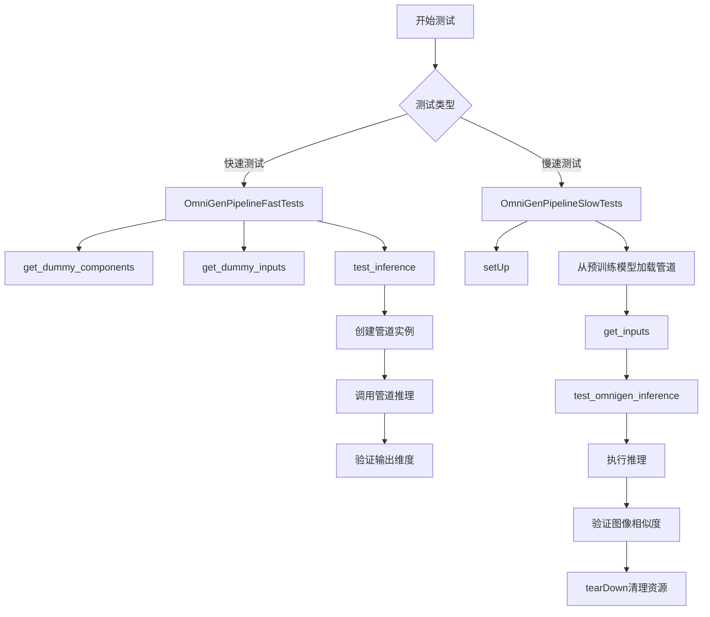
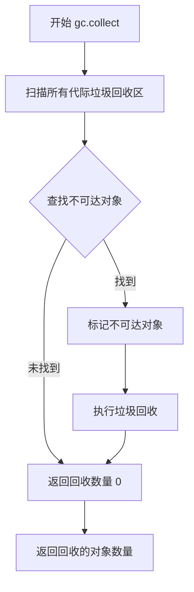
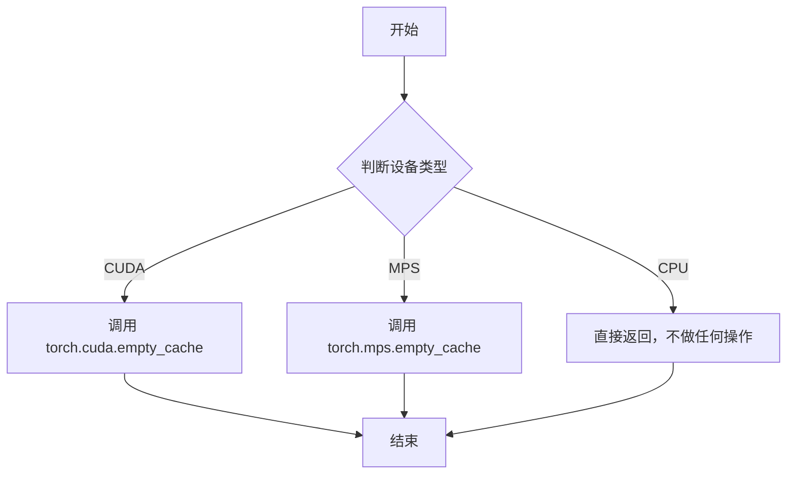
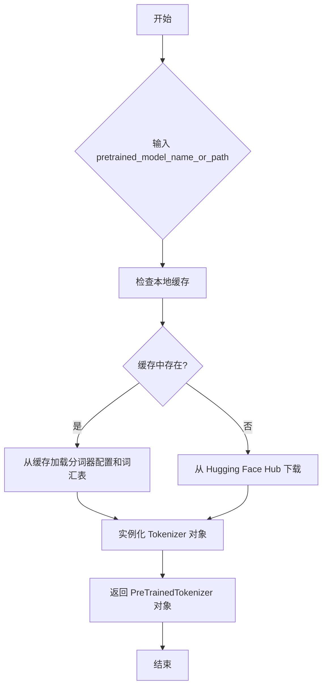
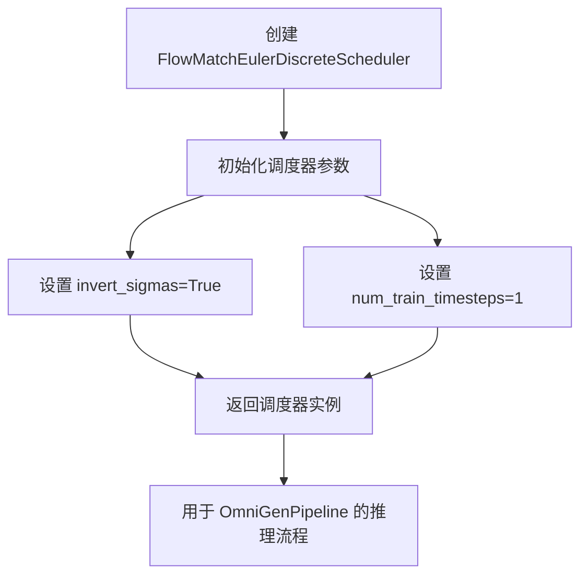
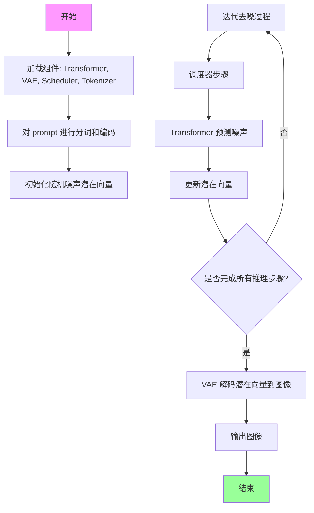
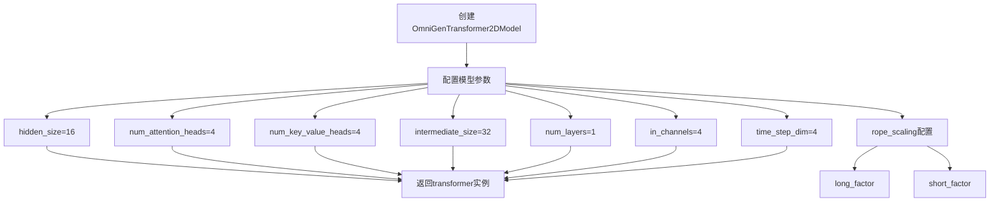
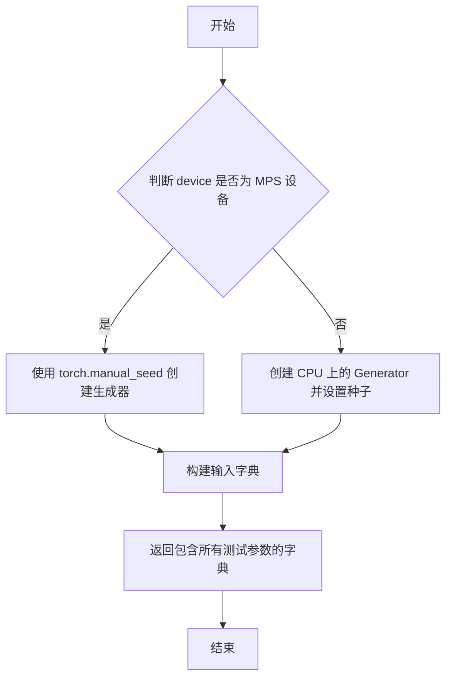
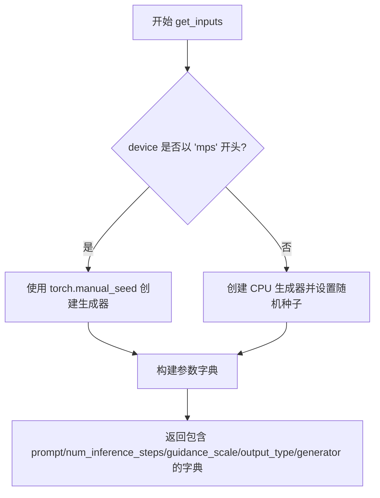
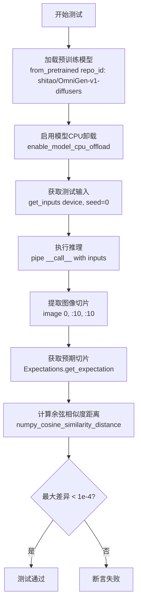

# `diffusers\tests\pipelines\omnigen\test_pipeline_omnigen.py` 详细设计文档

这是一个用于测试 OmniGen 扩散管道（Diffusion Pipeline）的单元测试文件，包含快速测试和慢速测试两种测试用例，用于验证管道在图像生成任务中的正确性，包括模型组件初始化、推理流程和输出结果验证。

## 整体流程



## 类结构

```
unittest.TestCase
├── OmniGenPipelineFastTests
│   └── PipelineTesterMixin
└── OmniGenPipelineSlowTests
```

## 全局变量及字段


### `transformer`
    
OmniGen变换器模型，用于图像生成的核心Transformer网络

类型：`OmniGenTransformer2DModel`
    


### `vae`
    
变分自编码器模型，负责潜在空间的编码和解码

类型：`AutoencoderKL`
    


### `scheduler`
    
离散欧拉调度器，控制去噪扩散过程中的时间步调度

类型：`FlowMatchEulerDiscreteScheduler`
    


### `tokenizer`
    
分词器，用于将文本提示转换为模型可处理的token序列

类型：`AutoTokenizer`
    


### `components`
    
包含pipeline所有组件的字典，包括transformer、vae、scheduler和tokenizer

类型：`dict`
    


### `inputs`
    
包含推理参数的字典，如prompt、generator、num_inference_steps等

类型：`dict`
    


### `generator`
    
PyTorch随机数生成器，用于控制图像生成的随机性

类型：`torch.Generator`
    


### `pipe`
    
OmniGen pipeline实例，用于执行图像生成推理

类型：`OmniGenPipeline`
    


### `generated_image`
    
pipeline生成的图像数据，形状为(16, 16, 3)

类型：`np.ndarray`
    


### `image`
    
从pipeline输出中提取的图像数组

类型：`np.ndarray`
    


### `image_slice`
    
图像的切片部分，用于与期望值进行对比

类型：`np.ndarray`
    


### `expected_slices`
    
包含不同设备/版本预期图像切片值的期望对象

类型：`Expectations`
    


### `expected_slice`
    
根据当前设备获取的期望图像切片值

类型：`np.ndarray`
    


### `max_diff`
    
生成图像与期望图像之间的余弦相似度距离最大值

类型：`float`
    


### `OmniGenPipelineFastTests.pipeline_class`
    
测试使用的pipeline类，指向OmniGenPipeline

类型：`type[OmniGenPipeline]`
    


### `OmniGenPipelineFastTests.params`
    
pipeline推理参数集合，包含prompt和guidance_scale

类型：`frozenset`
    


### `OmniGenPipelineFastTests.batch_params`
    
批量推理参数集合，仅包含prompt

类型：`frozenset`
    


### `OmniGenPipelineFastTests.test_xformers_attention`
    
标志位，指示是否测试xformers注意力机制优化

类型：`bool`
    


### `OmniGenPipelineFastTests.test_layerwise_casting`
    
标志位，指示是否测试逐层类型转换

类型：`bool`
    


### `OmniGenPipelineSlowTests.pipeline_class`
    
慢速测试使用的pipeline类，指向OmniGenPipeline

类型：`type[OmniGenPipeline]`
    


### `OmniGenPipelineSlowTests.repo_id`
    
HuggingFace模型仓库ID，用于加载预训练的OmniGen模型

类型：`str`
    
    

## 全局函数及方法


### `gc.collect`

Python 标准库中的垃圾回收函数，用于强制执行垃圾回收周期，扫描不可达的对象并释放其占用的内存。在测试框架中用于在测试前后清理内存，防止内存泄漏。

参数：
- 无参数

返回值：`int`，返回回收的对象数量

#### 流程图



#### 带注释源码

```python
# Python 标准库 gc 模块中的 collect 函数
# 用法：在 OmniGenPipelineSlowTests 测试类中调用

# 在 setUp 方法中调用：
def setUp(self):
    super().setUp()
    gc.collect()  # 强制执行垃圾回收，清理之前的内存占用
    backend_empty_cache(torch_device)  # 清理 GPU 缓存

# 在 tearDown 方法中调用：
def tearDown(self):
    super().tearDown()
    gc.collect()  # 强制执行垃圾回收，清理测试过程中产生的临时对象
    backend_empty_cache(torch_device)  # 清理 GPU 缓存
```


### `backend_empty_cache`

该函数是一个跨后端（CPU、CUDA、Apple Silicon等）的缓存清理工具函数，用于在测试或推理过程中释放GPU/设备内存缓存，以确保内存得到有效释放并避免内存泄漏。

参数：

- `device`：`str` 或 `torch.device`，表示目标设备（如 "cuda"、"cpu"、"mps" 等）

返回值：`None`，无返回值

#### 流程图



#### 带注释源码

```
# 由于 backend_empty_cache 是从外部模块 ...testing_utils 导入的
# 以下是基于其使用方式和常见实现模式的推断源码

def backend_empty_cache(device):
    """
    根据设备类型清空相应的内存缓存
    
    参数:
        device: torch设备字符串或设备对象，如 'cuda', 'cpu', 'mps'
    """
    import torch
    
    # 将设备转换为字符串便于比较
    device_str = str(device)
    
    # 判断是否为CUDA设备（包括GPU编号）
    if device_str.startswith("cuda"):
        # 清空CUDA缓存，释放未使用的GPU内存
        torch.cuda.empty_cache()
    
    # 判断是否为Apple Silicon MPS设备
    elif device_str.startswith("mps"):
        # 清空MPS缓存，释放Metal性能着色器内存
        torch.mps.empty_cache()
    
    # CPU设备无需清理缓存，函数直接返回
    else:
        pass
```

> **注意**：由于该函数是从 `...testing_utils` 外部模块导入的，以上源码为基于其功能和使用方式的推断实现。实际实现可能包含更多后端支持或错误处理逻辑。


### `numpy_cosine_similarity_distance`

该函数用于计算两个向量之间的余弦相似度距离（1 - 余弦相似度），常用于比较预期输出与实际输出之间的差异，在图像生成模型的测试中用于验证生成结果与预期结果的一致性。

参数：

- `vec1`：`numpy.ndarray`，第一个向量，通常为预期数据的扁平化数组
- `vec2`：`numpy.ndarray`，第二个向量，通常为实际计算/生成数据的扁平化数组

返回值：`float`，返回两个向量之间的余弦相似度距离值，值越小表示两个向量越相似

#### 流程图

```mermaid
flowchart TD
    A[开始] --> B[输入向量 vec1 和 vec2]
    B --> C[计算 vec1 的范数]
    B --> D[计算 vec2 的范数]
    C --> E[计算点积 vec1 · vec2]
    D --> E
    E --> F[计算余弦相似度: cos_sim = dot / (norm1 * norm2)]
    F --> G[计算距离: distance = 1 - cos_sim]
    G --> H[返回 distance]
    H --> I[结束]
```

#### 带注释源码

```
# 注意：该函数从外部模块 ...testing_utils 导入，未在本文件中定义
# 以下是基于使用方式的推断实现

def numpy_cosine_similarity_distance(vec1: np.ndarray, vec2: np.ndarray) -> float:
    """
    计算两个向量之间的余弦相似度距离。
    
    余弦相似度衡量两个向量方向的相似程度，范围为 [-1, 1]。
    余弦距离 = 1 - 余弦相似度，范围为 [0, 2]，值越小表示越相似。
    
    参数:
        vec1: 第一个向量（预期值）
        vec2: 第二个向量（实际值）
    
    返回:
        两个向量之间的余弦距离
    """
    # 将输入展平为一维向量（如果还不是一维）
    vec1 = vec1.flatten()
    vec2 = vec2.flatten()
    
    # 计算点积
    dot_product = np.dot(vec1, vec2)
    
    # 计算向量的 L2 范数（欧几里得范数）
    norm1 = np.linalg.norm(vec1)
    norm2 = np.linalg.norm(vec2)
    
    # 避免除以零
    if norm1 == 0 or norm2 == 0:
        return 1.0  # 如果任一向量为零范数，返回最大距离
    
    # 计算余弦相似度
    cosine_similarity = dot_product / (norm1 * norm2)
    
    # 计算余弦距离（1 - 余弦相似度）
    cosine_distance = 1.0 - cosine_similarity
    
    return float(cosine_distance)

# 使用示例（来自测试代码）:
# expected_slice = np.array([...])  # 预期的图像切片数据
# image_slice = generated_image[0, :10, :10]  # 实际生成的图像切片
# max_diff = numpy_cosine_similarity_distance(expected_slice.flatten(), image_slice.flatten())
# assert max_diff < 1e-4  # 验证差异在可接受范围内
```

---

### 补充说明

**使用场景分析**：

在 `OmniGenPipelineSlowTests.test_omnigen_inference` 测试中，该函数用于验证 OmniGen 图像生成模型的推理结果是否符合预期。具体流程如下：

1. 使用预训练模型 `shitao/OmniGen-v1-diffusers` 生成图像
2. 提取生成图像的部分切片 `image[0, :10, :10]`
3. 与预期的数值切片 `expected_slice` 进行比较
4. 计算两者之间的余弦相似度距离作为 `max_diff`
5. 断言差异小于 `1e-4`，确保模型输出稳定性

**技术债务/优化空间**：

- 当前实现依赖外部模块，缺少源码可见性
- 可以考虑使用更高效的向量化计算方式
- 对于极小值的数值稳定性处理可以更完善


### `AutoTokenizer.from_pretrained`

该函数是 Hugging Face Transformers 库中 `AutoTokenizer` 类的类方法，用于从预训练模型加载对应的分词器（Tokenizer）。它根据提供的模型名称或路径自动选择并实例化合适的分词器类，支持加载包含分词器配置和词汇表文件的预训练模型。

参数：

- `pretrained_model_name_or_path`：`str`，预训练模型的名称（可以是 Hugging Face Hub 上的模型 ID）或本地路径。代码中传入的是 `"hf-internal-testing/llama-tokenizer"`。

返回值：`PreTrainedTokenizer`，返回加载后的分词器对象，包含词汇表、分词方法等，用于对文本进行编码和解码。

#### 流程图



#### 带注释源码

```python
# 从 transformers 库导入 AutoTokenizer 类
from transformers import AutoTokenizer

# 在 OmniGenPipelineFastTests 类的 get_dummy_components 方法中
# 调用 AutoTokenizer.from_pretrained 类方法加载预训练分词器

tokenizer = AutoTokenizer.from_pretrained("hf-internal-testing/llama-tokenizer")
# 参数说明：
#   - "hf-internal-testing/llama-tokenizer": Hugging Face Hub 上的测试用 Llama 分词器模型ID
# 返回值：
#   - tokenizer: PreTrainedTokenizer 类型对象，包含:
#       * vocab: 词汇表字典
#       * token_to_id mapping: token 到 id 的映射
#       * id_to_token mapping: id 到 token 的映射
#       * special tokens: 特殊 token（如 [PAD], [UNK], [CLS] 等）
#       * 编码方法: __call__, encode, batch_encode_plus 等
#       * 解码方法: decode, batch_decode 等
```


### `AutoencoderKL`

描述：在 `OmniGenPipelineFastTests.get_dummy_components` 方法中实例化，用于创建一个虚拟的 VAE（变分自编码器）模型，作为 OmniGenPipeline 的组件之一，用于测试目的。

参数：

- `sample_size`：`int`，输入图像的空间分辨率，代码中设置为 `32`。
- `in_channels`：`int`，输入图像的通道数，代码中设置为 `3`（RGB 图像）。
- `out_channels`：`int`，输出图像的通道数，代码中设置为 `3`。
- `block_out_channels`：`tuple[int, ...]`，解码器每个块的输出通道数，代码中设置为 `(4, 4, 4, 4)`。
- `layers_per_block`：`int`，每个解码器块中的层数，代码中设置为 `1`。
- `latent_channels`：`int`，潜在空间的通道数，代码中设置为 `4`。
- `norm_num_groups`：`int`，归一化的组数，用于组归一化，代码中设置为 `1`。
- `up_block_types`：`list[str]`，上采样解码器块的类型列表，代码中包含四个 `"UpDecoderBlock2D"`。

返回值：`AutoencoderKL`，返回一个 VAE 模型实例，在测试中作为 `components` 字典的 `"vae"` 键值。

#### 流程图

```mermaid
graph TD
    A[开始实例化 AutoencoderKL] --> B[传入 sample_size=32]
    B --> C[传入 in_channels=3, out_channels=3]
    C --> D[传入 block_out_channels=(4,4,4,4)]
    D --> E[传入 layers_per_block=1, latent_channels=4]
    E --> F[传入 norm_num_groups=1]
    F --> G[传入 up_block_types 列表]
    G --> H[创建 AutoencoderKL 实例]
    H --> I[返回 VAE 实例用于测试]
```

#### 带注释源码

```python
# 在 OmniGenPipelineFastTests 类中定义的方法，用于获取虚拟组件
def get_dummy_components(self):
    # 设置随机种子以确保可重复性
    torch.manual_seed(0)

    # 创建虚拟的 Transformer 模型
    transformer = OmniGenTransformer2DModel(
        hidden_size=16,
        num_attention_heads=4,
        num_key_value_heads=4,
        intermediate_size=32,
        num_layers=1,
        in_channels=4,
        time_step_dim=4,
        rope_scaling={"long_factor": list(range(1, 3)), "short_factor": list(range(1, 3))},
    )

    # 重新设置随机种子以确保 VAE 的确定性
    torch.manual_seed(0)
    # 实例化 AutoencoderKL（VAE）模型，用于图像的编码和解码
    vae = AutoencoderKL(
        sample_size=32,  # 输入图像尺寸为 32x32
        in_channels=3,   # 输入通道数为 3（RGB）
        out_channels=3,  # 输出通道数为 3
        block_out_channels=(4, 4, 4, 4),  # 四个解码器块的输出通道数
        layers_per_block=1,  # 每个块包含 1 层
        latent_channels=4,  # 潜在空间通道数为 4
        norm_num_groups=1,   # 归一化组数为 1
        # 上采样解码器块类型列表，包含四个 UpDecoderBlock2D 块
        up_block_types=["UpDecoderBlock2D", "UpDecoderBlock2D", "UpDecoderBlock2D", "UpDecoderBlock2D"],
    )

    # 创建调度器
    scheduler = FlowMatchEulerDiscreteScheduler(invert_sigmas=True, num_train_timesteps=1)
    # 加载分词器
    tokenizer = AutoTokenizer.from_pretrained("hf-internal-testing/llama-tokenizer")

    # 组合所有组件到字典中
    components = {
        "transformer": transformer,
        "vae": vae,
        "scheduler": scheduler,
        "tokenizer": tokenizer,
    }
    return components
```


### `FlowMatchEulerDiscreteScheduler`

FlowMatchEulerDiscreteScheduler 是 diffusers 库中的一个调度器类，用于在扩散模型推理过程中生成时间步序列。该调度器基于 Euler 方法实现 Flow Matching 离散时间步调度，支持 sigma 反转功能。

参数：

- `invert_sigmas`：`bool`，是否反转 sigma 值
- `num_train_timesteps`：`int`，训练时使用的时间步总数

返回值：`FlowMatchEulerDiscreteScheduler` 实例，返回一个配置好的调度器对象

#### 流程图



#### 带注释源码

```python
# 从 diffusers 库导入 FlowMatchEulerDiscreteScheduler
from diffusers import FlowMatchEulerDiscreteScheduler

# 在 get_dummy_components 方法中创建调度器实例
scheduler = FlowMatchEulerDiscreteScheduler(
    invert_sigmas=True,      # bool: 启用 sigma 反转功能
    num_train_timesteps=1    # int: 训练时间步数为 1（用于测试环境）
)

# 调度器被添加到 components 字典中
components = {
    "transformer": transformer,
    "vae": vae,
    "scheduler": scheduler,  # 调度器组件
    "tokenizer": tokenizer,
}
```

> **注意**：该类的完整实现源码位于 diffusers 库中，未包含在当前代码文件内。上述代码仅展示其在测试框架中的使用方式。


### `OmniGenPipeline`

OmniGenPipeline 是一个基于扩散模型的图像生成管道，支持根据文本提示（prompt）生成图像。该管道整合了 Transformer 模型、VAE 解码器、调度器和分词器，能够执行文本到图像的生成任务，并支持可配置的推理步数、引导比例和输出格式。

参数：

- `transformer`：`OmniGenTransformer2DModel`，将文本嵌入转换为图像特征的 Transformer 模型
- `vae`：`AutoencoderKL`，变分自编码器，用于将潜在表示解码为图像
- `scheduler`：`FlowMatchEulerDiscreteScheduler`，扩散过程的调度器，控制去噪步骤
- `tokenizer`：`AutoTokenizer`，用于将文本提示编码为 token 序列

（从测试代码推断，管道还支持以下运行时参数：）

- `prompt`：str，文本提示，描述要生成的图像内容
- `generator`：torch.Generator，用于控制随机性的生成器
- `num_inference_steps`：int，推理步数，决定去噪过程的迭代次数
- `guidance_scale`：float，引导比例，控制文本提示对生成结果的影响程度
- `output_type`：str，输出类型（如 "np" 表示 numpy 数组）
- `height`：int，生成图像的高度
- `width`：int，生成图像的宽度

返回值：`PipeOutput`（或类似结构），包含生成的图像数组，访问方式为 `.images[0]`

#### 流程图



#### 带注释源码

```python
# 从 diffusers 库导入的 OmniGenPipeline 类
# 这是一个图像生成管道，用于根据文本提示生成图像

# 在 OmniGenPipelineFastTests 中的使用示例：
pipe = self.pipeline_class(**self.get_dummy_components()).to(torch_device)
# 其中 get_dummy_components() 返回包含以下键的字典：
components = {
    "transformer": transformer,       # OmniGenTransformer2DModel 实例
    "vae": vae,                        # AutoencoderKL 实例
    "scheduler": scheduler,            # FlowMatchEulerDiscreteScheduler 实例
    "tokenizer": tokenizer,            # AutoTokenizer 实例
}

# 调用管道进行推理
inputs = {
    "prompt": "A painting of a squirrel eating a burger",
    "generator": generator,
    "num_inference_steps": 1,
    "guidance_scale": 3.0,
    "output_type": "np",
    "height": 16,
    "width": 16,
}
generated_image = pipe(**inputs).images[0]

# 在 OmniGenPipelineSlowTests 中的使用示例：
# 从预训练模型加载管道
pipe = self.pipeline_class.from_pretrained(self.repo_id, torch_dtype=torch.bfloat16)
pipe.enable_model_cpu_offload()

inputs = self.get_inputs(torch_device)
image = pipe(**inputs).images[0]
```

#### 补充说明

1. **设计目标**：OmniGenPipeline 旨在提供一个统一的图像生成接口，能够根据文本描述生成对应图像

2. **组件协作**：
   - Tokenizer 负责将文本转换为模型可处理的 token 序列
   - Transformer 负责在潜在空间中根据文本特征进行去噪预测
   - Scheduler 控制去噪过程的调度
   - VAE 将最终的潜在表示解码为可见的图像像素

3. **外部依赖**：
   - `diffusers` 库：核心依赖，提供管道基类和调度器
   - `transformers` 库：提供分词器
   - PyTorch：深度学习后端
   - 预训练模型 "shitao/OmniGen-v1-diffusers"（慢速测试用）

4. **测试覆盖**：
   - `OmniGenPipelineFastTests`：快速单元测试，使用虚拟组件
   - `OmniGenPipelineSlowTests`：集成测试，使用真实预训练模型

5. **潜在优化空间**：
   - 当前测试仅验证基本功能，可增加更多边界情况测试
   - 可考虑添加模型性能基准测试
   - 错误处理机制在测试代码中未充分体现


### `OmniGenTransformer2DModel`

OmniGenTransformer2DModel 是一个用于图像生成的Transformer模型，来自diffusers库。该模型接收隐藏层大小、注意力头数、KV头数、中间层大小、层数、输入通道数、时间步维度等参数，用于构建具备旋转位置编码（RoPE）缩放能力的扩散模型核心组件。

参数：

- `hidden_size`：`int`，隐藏层维度大小，控制模型特征表示的维度
- `num_attention_heads`：`int`，注意力头的数量，决定多头注意力的并行数量
- `num_key_value_heads`：`int`，Key-Value头的数量，用于分组查询注意力机制
- `intermediate_size`：`int`，前馈网络中间层维度
- `num_layers`：`int`，Transformer层数
- `in_channels`：`int`，输入通道数
- `time_step_dim`：`int`，时间步嵌入维度
- `rope_scaling`：`dict`，旋转位置编码（RoPE）的缩放配置，包含long_factor和short_factor

返回值：`OmniGenTransformer2DModel` 实例，返回配置好的Transformer模型对象

#### 流程图



#### 带注释源码

```python
# 在测试中创建OmniGenTransformer2DModel实例的代码
transformer = OmniGenTransformer2DModel(
    hidden_size=16,  # 隐藏层维度，模型特征表示的宽度
    num_attention_heads=4,  # 注意力头数量，用于多头注意力机制
    num_key_value_heads=4,  # KV头数量，支持分组查询注意力
    intermediate_size=32,  # 前馈网络中间层维度
    num_layers=1,  # Transformer层数
    in_channels=4,  # 输入通道数，对应潜在空间的通道数
    time_step_dim=4,  # 时间步嵌入维度，用于扩散过程的时间编码
    rope_scaling={  # 旋转位置编码缩放配置
        "long_factor": list(range(1, 3)),  # 长距离位置编码缩放因子
        "short_factor": list(range(1, 3)),  # 短距离位置编码缩放因子
    },
)

# 该transformer随后被用在pipeline组件中
components = {
    "transformer": transformer,  # 作为核心生成模型
    "vae": vae,  # 变分自编码器用于编码/解码
    "scheduler": scheduler,  # 调度器控制扩散过程
    "tokenizer": tokenizer,  # 分词器处理文本输入
}
```


### `OmniGenPipelineFastTests.get_dummy_components`

该方法用于创建和返回一组虚拟（dummy）组件，用于单元测试目的。它初始化OmniGenPipeline所需的关键组件，包括Transformer模型、VAE编码器、调度器和分词器，并使用固定随机种子确保测试的可重复性。

参数：

- `self`：实例方法隐含的当前对象引用

返回值：`dict`，返回一个包含pipeline所需组件的字典，包括transformer（OmniGenTransformer2DModel）、vae（AutoencoderKL）、scheduler（FlowMatchEulerDiscreteScheduler）和tokenizer（AutoTokenizer）。

#### 流程图

```mermaid
flowchart TD
    A[开始 get_dummy_components] --> B[设置随机种子 torch.manual_seed(0)]
    B --> C[创建 OmniGenTransformer2DModel]
    C --> D[设置随机种子 torch.manual_seed(0)]
    D --> E[创建 AutoencoderKL]
    E --> F[创建 FlowMatchEulerDiscreteScheduler]
    F --> G[从预训练模型加载 AutoTokenizer]
    G --> H[组装 components 字典]
    H --> I[返回 components 字典]
```

#### 带注释源码

```python
def get_dummy_components(self):
    """
    创建用于测试的虚拟组件。
    
    该方法初始化所有必需的Pipeline组件，包括Transformer、VAE、
    Scheduler和Tokenizer，以便进行单元测试。使用固定随机种子
    确保测试结果的可重复性。
    """
    # 设置随机种子以确保测试的可重复性
    torch.manual_seed(0)

    # 创建Transformer模型 - 负责图像生成的核心变换器
    transformer = OmniGenTransformer2DModel(
        hidden_size=16,              # 隐藏层大小
        num_attention_heads=4,       # 注意力头数量
        num_key_value_heads=4,       # KV头数量
        intermediate_size=32,       # 前馈网络中间层大小
        num_layers=1,                # Transformer层数
        in_channels=4,               # 输入通道数
        time_step_dim=4,             # 时间步维度
        # RoPE缩放配置，用于处理不同长度的序列
        rope_scaling={"long_factor": list(range(1, 3)), "short_factor": list(range(1, 3))},
    )

    # 重新设置随机种子，确保VAE与Transformer使用相同的初始状态
    torch.manual_seed(0)

    # 创建VAE模型 - 负责图像的编码和解码
    vae = AutoencoderKL(
        sample_size=32,              # 样本尺寸
        in_channels=3,               # 输入通道数（RGB）
        out_channels=3,              # 输出通道数
        # 各个解码器块的通道数配置
        block_out_channels=(4, 4, 4, 4),
        layers_per_block=1,          # 每个块的层数
        latent_channels=4,          # 潜在空间通道数
        norm_num_groups=1,           # 归一化组数
        # 上采样解码器块类型
        up_block_types=["UpDecoderBlock2D", "UpDecoderBlock2D", "UpDecoderBlock2D", "UpDecoderBlock2D"],
    )

    # 创建调度器 - 控制去噪过程的采样策略
    scheduler = FlowMatchEulerDiscreteScheduler(
        invert_sigmas=True,          # 是否反转sigma值
        num_train_timesteps=1        # 训练时间步数
    )

    # 从预训练模型加载分词器 - 用于处理文本输入
    tokenizer = AutoTokenizer.from_pretrained("hf-internal-testing/llama-tokenizer")

    # 组装所有组件到字典中并返回
    components = {
        "transformer": transformer,
        "vae": vae,
        "scheduler": scheduler,
        "tokenizer": tokenizer,
    }
    return components
```


### `OmniGenPipelineFastTests.get_dummy_inputs`

该方法用于生成用于测试的虚拟输入参数，根据设备类型（MPS或其他）选择不同的随机数生成器，并返回包含提示词、生成器、推理步数、引导 scale、输出类型和图像尺寸的字典。

参数：

- `device`：`str` 或 `torch.device`，运行设备，用于判断是否为 MPS 设备以选择合适的随机数生成器
- `seed`：`int`，默认值为 `0`，用于设置随机数生成器的种子，确保测试结果可复现

返回值：`Dict[str, Any]`，包含以下键值对的字典：
- `prompt`：字符串，测试用的提示词
- `generator`：`torch.Generator`，随机数生成器对象
- `num_inference_steps`：整数，推理步数
- `guidance_scale`：浮点数，引导系数
- `output_type`：字符串，输出类型
- `height`：整数，生成图像的高度
- `width`：整数，生成图像的宽度

#### 流程图



#### 带注释源码

```python
def get_dummy_inputs(self, device, seed=0):
    # 判断设备是否为 Apple MPS (Metal Performance Shaders)
    if str(device).startswith("mps"):
        # MPS 设备使用 torch.manual_seed 直接设置种子
        generator = torch.manual_seed(seed)
    else:
        # 其他设备（如 CPU、CUDA）创建 CPU 上的生成器并设置种子
        # 这样可以确保在不同设备上测试的一致性
        generator = torch.Generator(device="cpu").manual_seed(seed)

    # 构建测试用的虚拟输入参数字典
    inputs = {
        "prompt": "A painting of a squirrel eating a burger",  # 测试用提示词
        "generator": generator,                                  # 随机数生成器
        "num_inference_steps": 1,                                # 推理步数（最少1步用于快速测试）
        "guidance_scale": 3.0,                                    # Classifier-free guidance 引导系数
        "output_type": "np",                                      # 输出类型为 numpy 数组
        "height": 16,                                             # 生成图像高度
        "width": 16,                                              # 生成图像宽度
    }
    return inputs
```


### `OmniGenPipelineFastTests.test_inference`

该测试方法用于验证OmniGenPipeline的推理功能，通过创建虚拟组件和输入，执行图像生成流程，并验证输出图像的维度是否符合预期（16x16x3）。

参数：

- `self`：`OmniGenPipelineFastTests`，测试类实例，包含测试所需的pipeline_class和配置

返回值：`numpy.ndarray`，生成的图像数据，形状为(16, 16, 3)，RGB格式

#### 流程图

```mermaid
flowchart TD
    A[开始测试] --> B[获取虚拟组件: get_dummy_components]
    B --> C[创建Pipeline实例]
    C --> D[将Pipeline移至torch_device设备]
    D --> E[获取虚拟输入: get_dummy_inputs]
    E --> F[执行Pipeline推理: pipe.__call__]
    F --> G[提取生成的图像: .images[0]]
    G --> H{验证图像形状}
    H -->|形状为16x16x3| I[测试通过]
    H -->|形状不符合| J[测试失败]
```

#### 带注释源码

```python
def test_inference(self):
    """
    测试OmniGenPipeline的推理功能
    
    该测试方法执行以下步骤：
    1. 使用虚拟组件创建Pipeline实例
    2. 使用虚拟输入执行推理
    3. 验证生成的图像形状是否符合预期
    """
    
    # 步骤1: 获取虚拟组件（transformer, vae, scheduler, tokenizer）
    # 并使用这些组件实例化OmniGenPipeline，然后移至指定的计算设备
    # torch_device通常为'cuda'或'cpu'
    pipe = self.pipeline_class(**self.get_dummy_components()).to(torch_device)

    # 步骤2: 准备虚拟输入参数，包括：
    # - prompt: 文本提示 "A painting of a squirrel eating a burger"
    # - generator: 随机数生成器，确保结果可复现
    # - num_inference_steps: 推理步数（设为1以加快测试）
    # - guidance_scale: 引导比例
    # - output_type: 输出类型（'np'表示numpy数组）
    # - height/width: 生成图像的尺寸
    inputs = self.get_dummy_inputs(torch_device)
    
    # 步骤3: 执行推理，pipe返回包含images的输出对象
    # .images[0]提取第一张生成的图像
    generated_image = pipe(**inputs).images[0]

    # 步骤4: 断言验证
    # 确认生成的图像形状为(16, 16, 3)，即高度16、宽度16、RGB三通道
    self.assertEqual(generated_image.shape, (16, 16, 3))
```


### `OmniGenPipelineSlowTests.setUp`

该方法是测试类的初始化方法，用于在每个测试方法运行前执行必要的清理和准备工作，包括调用父类的setUp方法、强制垃圾回收以及清空GPU缓存，以确保测试环境处于干净状态。

参数：

- `self`：实例方法隐含的第一个参数，表示测试类实例本身，无需显式传递

返回值：`None`，该方法不返回任何值，仅执行副作用操作

#### 流程图

```mermaid
graph TD
    A[开始 setUp] --> B[调用 super().setUp]
    B --> C[执行 gc.collect 强制垃圾回收]
    C --> D[调用 backend_empty_cache 清理GPU缓存]
    D --> E[结束 setUp 返回None]
```

#### 带注释源码

```python
def setUp(self):
    """
    测试用例初始化方法，在每个测试方法执行前调用
    用于设置测试环境和清理资源
    """
    # 调用父类的setUp方法，执行 unittest.TestCase 的标准初始化
    super().setUp()
    
    # 强制 Python 垃圾回收器运行，释放不再使用的对象内存
    # 这对于 GPU 测试尤为重要，可以帮助释放 GPU 显存
    gc.collect()
    
    # 清空 GPU 缓存（显存），确保测试开始时 GPU 内存处于干净状态
    # torch_device 是测试工具中定义的全局变量，表示当前测试使用的设备
    backend_empty_cache(torch_device)
```


### `OmniGenPipelineSlowTests.tearDown`

该方法是 `OmniGenPipelineSlowTests` 测试类的清理方法，用于在每个测试用例执行完毕后进行资源释放和内存清理，确保测试环境干净，避免内存泄漏和GPU显存占用问题。

参数：

- `self`：`unittest.TestCase`，测试类实例本身，包含测试状态和配置信息

返回值：`None`，无返回值，执行清理操作

#### 流程图

```mermaid
flowchart TD
    A[开始 tearDown] --> B[调用 super().tearDown]
    B --> C[执行 gc.collect 强制垃圾回收]
    C --> D[调用 backend_empty_cache 清理GPU缓存]
    D --> E[结束 tearDown]
```

#### 带注释源码

```python
def tearDown(self):
    """
    测试用例清理方法，在每个测试方法执行完毕后调用。
    负责释放测试过程中占用的资源，包括内存和GPU显存。
    """
    # 调用父类的 tearDown 方法，执行 unittest 框架的标准清理逻辑
    super().tearDown()
    
    # 手动触发 Python 垃圾回收器，回收测试过程中创建的已失效对象
    gc.collect()
    
    # 调用后端工具函数清空 GPU 缓存，释放 GPU 显存资源
    # torch_device 是从 testing_utils 导入的全局变量，表示当前测试设备
    backend_empty_cache(torch_device)
```


### `OmniGenPipelineSlowTests.get_inputs`

这是一个测试辅助方法，用于生成 OmniGen 管道（Pipeline）的输入参数字典。该方法根据目标设备类型（MPS 或其他）创建相应随机生成器，并返回包含提示词、推理步数、引导比例、输出类型和生成器的完整参数字典，供管道推理调用使用。

参数：

- `self`：`OmniGenPipelineSlowTests`，方法所属的测试类实例
- `device`：`torch.device` 或 `str`，目标计算设备，用于判断是否为 Apple MPS 设备
- `seed`：`int`，随机种子，默认为 0，用于初始化生成器以保证结果可复现

返回值：`dict`，包含以下键值对：

- `prompt`：str，提示词内容
- `num_inference_steps`：int，推理步数
- `guidance_scale`：float，引导比例系数
- `output_type`：str，输出类型（"np" 表示 NumPy 数组）
- `generator`：torch.Generator，随机生成器实例

#### 流程图



#### 带注释源码

```python
def get_inputs(self, device, seed=0):
    """
    生成 OmniGenPipeline 推理所需的输入参数字典。
    
    参数:
        device: 目标计算设备，用于判断是否为 MPS 设备
        seed: 随机种子，用于生成器的初始化
    
    返回:
        包含 pipeline 调用所需参数的字典
    """
    # 判断设备是否为 Apple MPS (Metal Performance Shaders)
    if str(device).startswith("mps"):
        # MPS 设备使用 torch.manual_seed 创建生成器
        generator = torch.manual_seed(seed)
    else:
        # 其他设备（如 CPU/CUDA）创建 CPU 生成器并设置种子
        generator = torch.Generator(device="cpu").manual_seed(seed)

    # 构建并返回推理输入参数字典
    return {
        "prompt": "A photo of a cat",           # 输入文本提示
        "num_inference_steps": 2,               # 扩散模型推理步数
        "guidance_scale": 2.5,                  # Classifier-free guidance 强度
        "output_type": "np",                    # 输出格式为 NumPy 数组
        "generator": generator,                 # 随机生成器用于结果复现
    }
```


### `OmniGenPipelineSlowTests.test_omnigen_inference`

这是一个集成测试方法，用于验证 OmniGen 文本到图像生成管道在实际硬件上的推理功能。测试加载预训练模型，执行图像生成，并通过余弦相似度验证输出是否符合预期。

参数：

- `self`：隐式参数，`unittest.TestCase` 实例方法的标准参数

返回值：`无`（测试方法无返回值，通过断言验证）

#### 流程图



#### 带注释源码

```python
def test_omnigen_inference(self):
    """
    测试 OmniGen 管道在真实硬件上的推理功能
    
    该测试方法执行以下步骤：
    1. 从预训练模型加载管道
    2. 配置模型CPU卸载以优化内存使用
    3. 使用指定参数执行推理
    4. 验证生成图像与预期值的相似度
    """
    # 从预训练模型加载 OmniGenPipeline
    # 使用 bfloat16 精度以平衡性能和内存
    pipe = self.pipeline_class.from_pretrained(
        self.repo_id,  # "shitao/OmniGen-v1-diffusers"
        torch_dtype=torch.bfloat16
    )
    
    # 启用模型CPU卸载
    # 这是一种内存优化技术，将不活跃的模型层卸载到CPU
    pipe.enable_model_cpu_offload()
    
    # 获取测试输入参数
    # 包含: prompt, num_inference_steps, guidance_scale, output_type, generator
    inputs = self.get_inputs(torch_device)
    
    # 执行管道推理
    # 返回包含生成图像的输出对象
    # inputs 字典包含:
    #   - prompt: "A photo of a cat"
    #   - num_inference_steps: 2
    #   - guidance_scale: 2.5
    #   - output_type: "np"
    #   - generator: 随机数生成器
    image = pipe(**inputs).images[0]
    
    # 提取图像的一个切片用于验证
    # 取第一行的前10个像素
    image_slice = image[0, :10, :10]
    
    # 定义不同设备和GPU型号的预期输出切片
    # 支持: XPU 3, CUDA 7, CUDA 8
    expected_slices = Expectations(
        {
            ("xpu", 3): np.array([...], dtype=np.float32),
            ("cuda", 7): np.array([...], dtype=np.float32),
            ("cuda", 8): np.array([...], dtype=np.float32),
        }
    )
    
    # 根据当前设备获取对应的预期切片
    expected_slice = expected_slices.get_expectation()
    
    # 计算预期切片与实际切片之间的余弦相似度距离
    # 距离越小表示生成图像与预期越相似
    max_diff = numpy_cosine_similarity_distance(
        expected_slice.flatten(), 
        image_slice.flatten()
    )
    
    # 断言: 余弦相似度距离必须小于 1e-4
    # 这确保生成结果在数值上与预期一致
    assert max_diff < 1e-4
```

## 关键组件


### OmniGenPipelineFastTests

用于快速单元测试的测试类，使用虚拟（dummy）组件验证OmniGenPipeline的基本推理功能，不需要加载真实模型。

### OmniGenPipelineSlowTests

用于慢速集成测试的测试类，从预训练模型仓库加载真实模型进行端到端推理验证，支持多种硬件平台（XPU、CUDA）。

### get_dummy_components

创建虚拟Transformer、VAE、Scheduler和Tokenizer组件的工厂函数，用于快速测试。包含完整的模型配置参数设置。

### get_dummy_inputs / get_inputs

创建测试输入的函数，构建包含prompt、generator、num_inference_steps、guidance_scale等参数的字典，支持MPS设备的特殊处理。

### 张量索引与惰性加载

在test_omnigen_inference中使用image[0, :10, :10]进行张量切片索引，仅提取部分像素进行相似度比较，实现惰性加载避免加载完整图像。

### 反量化支持

在test_omnigen_inference中使用torch.bfloat16进行半精度推理，支持从预训练模型加载时指定数据类型，减少显存占用。

### 量化策略

通过enable_model_cpu_offload()实现模型CPU卸载，结合bfloat16量化，在有限显存下运行大模型。

### Expectations

用于存储和获取不同硬件平台（xpu、cuda）不同版本（3、7、8）的期望输出切片，支持平台特定的验证逻辑。

### PipelineTesterMixin

测试混入类，提供通用的pipeline测试方法与断言逻辑。


## 问题及建议


### 已知问题

- **硬编码的模型仓库ID**: `repo_id = "shitao/OmniGen-v1-diffusers"` 硬编码在测试类中，无法灵活配置不同的模型路径或本地模型
- **设备兼容性处理不一致**: `get_dummy_inputs` 和 `get_inputs` 方法中都有 MPS 设备判断逻辑，存在代码重复，且对其他设备（如 NPU）的支持不完善
- **内存管理不完善**: `test_omnigen_inference` 中使用 `enable_model_cpu_offload()` 但未使用上下文管理器确保资源释放，管道对象在测试结束后可能仍持有 GPU 内存引用
- **测试配置不完整**: `params` 和 `batch_params` 仅包含 `prompt` 和 `guidance_scale`，遗漏了 `negative_prompt`、`guidance_rescale`、`num_images_per_prompt` 等重要参数
- **缺少错误处理**: 管道加载和推理过程没有 try-except 包装，无法优雅处理模型加载失败或推理异常
- **脆弱的期望值测试**: `expected_slices` 硬编码了特定 GPU 架构（xpu、cuda 7/8）的数值，跨设备或跨版本时测试容易失败
- **配置标志缺乏说明**: `test_xformers_attention = False` 和 `test_layerwise_casting = True` 的设置没有注释说明原因
- **缺少资源清理验证**: 测试结束后未验证 GPU 内存是否真正释放
- **调度器参数风险**: `FlowMatchEulerDiscreteScheduler(invert_sigmas=True, num_train_timesteps=1)` 中 `num_train_timesteps=1` 仅为测试值，可能导致实际行为与生产环境差异
- **缺少回调支持**: 未实现 pipeline callback 测试，无法验证中间步骤的输出或自定义处理逻辑

### 优化建议

- 将模型仓库 ID 改为可通过环境变量或配置文件传入的参数，支持本地模型路径测试
- 抽取设备判断逻辑为共享工具函数，使用策略模式处理不同设备的种子生成逻辑
- 使用 `torch.cuda.empty_cache()` 和显式删除管道对象 (`del pipe`) 确保 GPU 内存释放，在 tearDown 中添加内存泄漏检测
- 扩展 `params` 和 `batch_params` 包含更多参数，添加参数验证测试用例
- 为关键操作添加 try-except-finally 块，捕获并记录具体的异常信息，便于调试
- 将期望值测试改为基于相似度阈值或相对误差，而非精确匹配，提高测试的鲁棒性
- 为配置标志添加详细的 docstring 或注释，说明启用/禁用的原因和影响
- 实现 `PipelineTesterMixin` 中定义的标准测试方法（如 `test_callback`、`test_attention_slicing` 等），确保完整的测试覆盖
- 考虑添加参数化测试，覆盖更多调度器配置和推理参数组合
- 添加模型设备放置验证测试，确认模型正确加载到预期设备（CPU/GPU）

## 其它


### 设计目标与约束

1. **功能验证目标**：验证OmniGenPipeline在给定prompt下生成图像的正确性，确保输出图像尺寸符合预期(16x16x3)
2. **设备兼容性约束**：需要支持多种设备包括cpu、mps(Mac Silicon)、cuda、xpu，通过torch_device环境变量控制
3. **测试分层约束**：分为快速测试(使用dummy components)和慢速测试(使用真实预训练模型)两个层次
4. **精度约束**：慢速测试使用numpy_cosine_similarity_distance验证生成结果与预期值的余弦相似度，要求max_diff < 1e-4
5. **随机性约束**：使用固定种子(0)确保测试可复现性

### 错误处理与异常设计

1. **断言失败处理**：使用unittest框架的标准断言机制，当图像尺寸不匹配或精度不足时抛出AssertionError
2. **设备特定处理**：MPS设备使用torch.manual_seed()，其他设备使用torch.Generator(device="cpu")，处理不同设备的随机数生成差异
3. **资源清理异常**：在tearDown中使用try-finally模式确保资源清理，即使测试失败也能释放内存
4. **预期值获取异常**：expected_slices.get_expectation()根据当前设备自动获取对应的预期值切片

### 数据流与状态机

**快速测试流程**：
1. 初始化状态：创建dummy components(transformer, vae, scheduler, tokenizer)
2. 输入准备状态：生成dummy inputs(prompt, generator, num_inference_steps等)
3. 执行状态：调用pipe(**inputs)执行推理
4. 验证状态：检查生成的图像shape是否为(16, 16, 3)

**慢速测试流程**：
1. 加载状态：从预训练模型仓库"shitao/OmniGen-v1-diffusers"加载pipeline
2. 内存优化状态：调用enable_model_cpu_offload()启用模型CPU卸载
3. 推理状态：执行推理生成图像
4. 比较状态：计算生成图像与预期值的余弦相似度距离
5. 验证状态：断言max_diff < 1e-4

### 外部依赖与接口契约

1. **核心依赖**：
   - `transformers.AutoTokenizer`：用于文本tokenization
   - `diffusers.AutoencoderKL`：VAE解码器
   - `diffusers.FlowMatchEulerDiscreteScheduler`：调度器
   - `diffusers.OmniGenPipeline`：主pipeline类
   - `diffusers.OmniGenTransformer2DModel`：Transformer模型

2. **测试框架依赖**：
   - `unittest.TestCase`：测试基类
   - `testing_utils.Expectations`：存储和获取不同设备下的预期值
   - `testing_utils.numpy_cosine_similarity_distance`：计算相似度
   - `test_pipelines_common.PipelineTesterMixin`：通用pipeline测试混入类

3. **硬件依赖**：
   - `torch`：深度学习框架
   - `numpy`：数值计算
   - 需要torch accelerator支持（通过@require_torch_accelerator装饰器）

### 性能考量

1. **内存管理**：在慢速测试的setUp和tearDown中调用gc.collect()和backend_empty_cache()显式管理GPU内存
2. **模型卸载**：使用enable_model_cpu_offload()将模型分片加载到CPU，推理时按需加载到GPU，降低显存峰值
3. **推理步数限制**：快速测试使用1步推理，慢速测试使用2步推理，最大限度减少计算量
4. **数据类型优化**：使用torch.bfloat16进行推理，减少显存占用和加速计算
5. **批量大小**：测试使用单样本生成，避免批量推理带来的内存压力

### 安全性考虑

1. **模型来源验证**：从HuggingFace Hub加载预训练模型，需确保repo_id的合法性
2. **设备安全**：使用torch_device环境变量控制设备，避免硬编码设备导致的问题
3. **内存安全**：在tearDown中清理内存，防止测试泄漏导致后续测试失败

### 可维护性与扩展性

1. **模块化设计**：通过PipelineTesterMixin提供通用测试接口，新pipeline可复用测试结构
2. **配置参数化**：params和batch_params使用frozenset定义，支持动态扩展测试参数
3. **设备适配**：通过get_dummy_inputs()方法处理MPS和其他设备的差异，便于新增设备支持
4. **预期值管理**：Expectations类支持按(device_type, device_capability)键存储多个预期值，便于添加新设备或新CUDA版本的预期结果

### 测试策略

1. **单元测试**：快速测试使用dummy components验证pipeline基本功能，无需GPU资源
2. **集成测试**：慢速测试使用真实预训练模型验证端到端功能
3. **回归测试**：通过固定预期值切片和精度阈值，防止模型更新导致输出变化
4. **条件测试**：使用@slow和@require_torch_accelerator装饰器控制测试执行条件
5. **跨平台测试**：支持xpu、cuda、mps、cpu多种设备的验证

### 配置管理

1. **随机种子配置**：通过seed参数控制生成器的随机种子，快速测试使用seed=0，慢速测试使用seed=0
2. **模型配置**：get_dummy_components()中硬编码模型结构参数(hidden_size=16, num_layers=1等)，便于快速测试
3. **推理配置**：num_inference_steps、guidance_scale、output_type等参数在inputs字典中统一管理
4. **环境配置**：通过torch_device全局变量控制测试设备

### 版本兼容性

1. **CUDA版本差异**：expected_slices包含cuda:7和cuda:8两套预期值，处理不同CUDA版本的数值差异
2. **设备类型差异**：Expectations使用(device_type, capability)元组作为键，兼容不同设备类型
3. **依赖库版本**：依赖diffusers库的特定类(OmniGenPipeline, FlowMatchEulerDiscreteScheduler等)，需与库版本匹配

### 资源管理

1. **GPU内存管理**：使用backend_empty_cache()清理GPU缓存
2. **Python内存管理**：使用gc.collect()触发垃圾回收
3. **上下文管理**：setUp/tearDown确保资源在测试前分配、测试后释放
4. **模型内存卸载**：enable_model_cpu_offload()实现模型在CPU和GPU间的动态迁移

### 日志与监控

1. **测试结果输出**：unittest框架自动输出测试通过/失败状态
2. **精度验证输出**：max_diff数值帮助定位生成质量问题的严重程度
3. **内存清理日志**：gc.collect()和backend_empty_cache()的执行无显式日志，但可通过memory_debug等工具监控


    