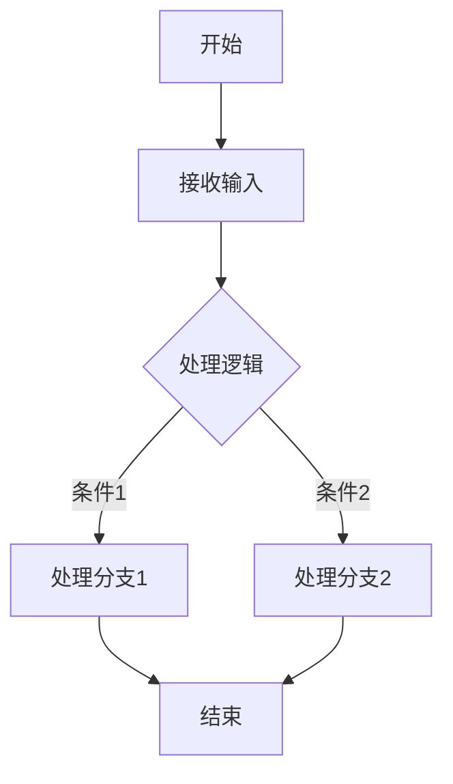

# `diffusers\tests\pipelines\pag\__init__.py` 详细设计文档

等待提供代码后分析

## 整体流程



## 类结构

```
等待代码分析后生成
```

## 全局变量及字段


    

## 全局函数及方法


## 关键组件


由于您提供的代码部分是空的，我无法识别任何关键组件。

请提供需要分析的源代码，我将为您生成包含以下内容的详细设计文档：

- 一段话描述（核心功能概述）
- 文件的整体运行流程
- 类的详细信息（字段、方法、全局变量和函数）
- 关键组件信息（张量索引、惰性加载、反量化支持、量化策略等）
- 潜在技术债务或优化空间
- 其它项目（设计目标、错误处理、数据流等）

请在代码部分粘贴您的源代码，我会按照要求的格式输出完整的设计文档。


## 问题及建议


### 已知问题

-   未提供代码内容，无法进行分析

### 优化建议

-   请提供需要分析的代码内容，以便进行技术债务和优化空间的评估


## 其它


### 设计目标与约束

（未提供代码，无法填写具体内容）

### 错误处理与异常设计

（未提供代码，无法填写具体内容）

### 数据流与状态机

（未提供代码，无法填写具体内容）

### 外部依赖与接口契约

（未提供代码，无法填写具体内容）

### 安全性设计

（未提供代码，无法填写具体内容）

### 性能考虑与资源管理

（未提供代码，无法填写具体内容）

### 兼容性设计

（未提供代码，无法填写具体内容）

### 部署与配置

（未提供代码，无法填写具体内容）

### 测试策略

（未提供代码，无法填写具体内容）

### 监控与运维

（未提供代码，无法填写具体内容）

### 版本演进与扩展性

（未提供代码，无法填写具体内容）

### 总结

由于用户提供的代码部分为空（``` ```），我无法提取具体的代码内容来填写上述详细设计文档的各项内容。

请提供具体的代码，以便我能够：
1. 概述代码的核心功能
2. 分析整体运行流程
3. 详细描述类结构、字段和方法
4. 识别关键组件
5. 指出技术债务和优化空间
6. 填写上述所有设计文档项目的内容

    