# `diffusers\tests\pipelines\pag\test_pag_animatediff.py` 详细设计文档

这是一个针对AnimateDiffPAGPipeline（带 PAG - Perturbed Attention Guidance 的动画扩散管道）的单元测试文件，用于验证管道各种功能，包括从基础管道创建、UNet加载、IP适配器、设备转换、数据类型转换、提示嵌入、FreeInit、FreeNoise、xFormers注意力、VAE切片、PAG启用禁用等功能。

## 整体流程

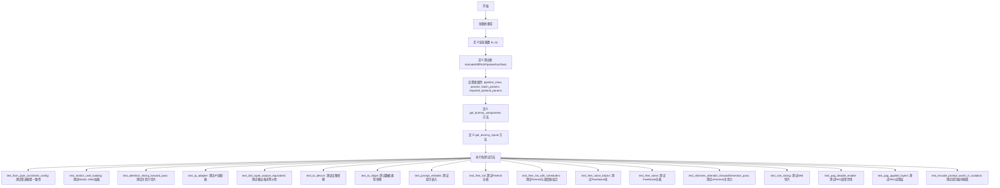

## 类结构

```
unittest.TestCase (Python标准测试基类)
├── IPAdapterTesterMixin (IP适配器测试Mixin)
├── SDFunctionTesterMixin (SD函数测试Mixin)
├── PipelineTesterMixin (管道测试Mixin)
├── PipelineFromPipeTesterMixin (从管道创建测试Mixin)
└── AnimateDiffPAGPipelineFastTests (具体测试类)
    ├── get_dummy_components (创建虚拟组件)
    ├── get_dummy_inputs (创建虚拟输入)
    └── ... (各种测试方法)
```

## 全局变量及字段


### `to_np`
    
将PyTorch张量转换为NumPy数组，移除梯度信息并移至CPU

类型：`function`
    


### `AnimateDiffPAGPipelineFastTests.pipeline_class`
    
要测试的AnimateDiff PAG pipeline类

类型：`type[AnimateDiffPAGPipeline]`
    


### `AnimateDiffPAGPipelineFastTests.params`
    
文本到图像推理参数集合，包含TEXT_TO_IMAGE_PARAMS及pag_scale和pag_adaptive_scale

类型：`frozenset`
    


### `AnimateDiffPAGPipelineFastTests.batch_params`
    
批量推理参数集合，定义批处理相关的参数

类型：`frozenset`
    


### `AnimateDiffPAGPipelineFastTests.required_optional_params`
    
可选参数集合，定义pipeline调用时可选的必需参数如num_inference_steps、generator等

类型：`frozenset`
    
    

## 全局函数及方法


### `to_np`

将 PyTorch 张量转换为 NumPy 数组的全局辅助函数。如果输入已经是 NumPy 数组，则直接返回；如果输入是 PyTorch 张量，则先分离计算图、移到 CPU，再转换为 NumPy 数组。

参数：

- `tensor`：`Union[torch.Tensor, np.ndarray]`，待转换的张量，可以是 PyTorch 张量或 NumPy 数组

返回值：`np.ndarray`，转换后的 NumPy 数组

#### 流程图

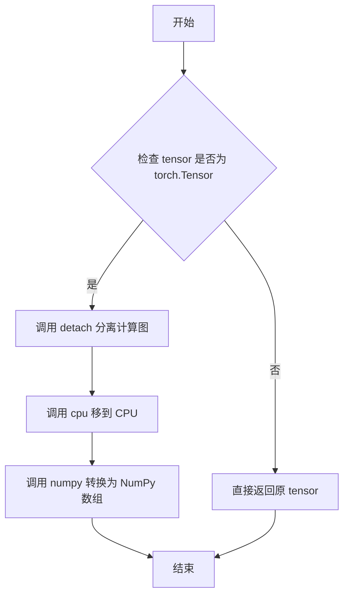

#### 带注释源码

```python
def to_np(tensor):
    """
    将 PyTorch 张量转换为 NumPy 数组的辅助函数。
    
    该函数首先检查输入是否为 PyTorch 张量（torch.Tensor）。如果是，
    则调用 detach() 分离计算图以避免梯度追踪，然后调用 cpu() 将张量
    从 GPU 移至 CPU，最后调用 numpy() 将其转换为 NumPy 数组。
    如果输入已经是 NumPy 数组，则直接返回，无需转换。
    
    参数:
        tensor: Union[torch.Tensor, np.ndarray]
            待转换的张量，可以是 PyTorch 张量或 NumPy 数组
            
    返回:
        np.ndarray
            转换后的 NumPy 数组
    """
    # 检查输入是否为 PyTorch 张量
    if isinstance(tensor, torch.Tensor):
        # detach() 分离计算图，避免梯度追踪
        # cpu() 将张量从 GPU 移到 CPU（CUDA -> CPU）
        # numpy() 将 PyTorch 张量转换为 NumPy 数组
        tensor = tensor.detach().cpu().numpy()

    # 返回张量（可能是转换后的 NumPy 数组，或原始的 NumPy 数组）
    return tensor
```


### `AnimateDiffPAGPipelineFastTests.get_dummy_components`

该方法用于创建并返回 AnimateDiffPAGPipeline 测试所需的虚拟组件（dummy components），包括 UNet、调度器、VAE、文本编码器、tokenizer 和运动适配器等，用于单元测试中模拟完整的扩散管道。

参数：

- `self`：实例方法，隐式参数，代表 `AnimateDiffPAGPipelineFastTests` 测试类的实例

返回值：`Dict`，包含构建 `AnimateDiffPAGPipeline` 所需的所有组件的字典

#### 流程图

```mermaid
flowchart TD
    A[开始 get_dummy_components] --> B[设置 cross_attention_dim = 8]
    B --> C[设置 block_out_channels = (8, 8)]
    C --> D[使用 torch.manual_seed(0) 设置随机种子]
    D --> E[创建 UNet2DConditionModel]
    E --> F[创建 DDIMScheduler]
    F --> G[使用 torch.manual_seed(0) 设置随机种子]
    G --> H[创建 AutoencoderKL]
    H --> I[使用 torch.manual_seed(0) 设置随机种子]
    I --> J[创建 CLIPTextConfig]
    J --> K[创建 CLIPTextModel]
    K --> L[创建 CLIPTokenizer]
    L --> M[创建 MotionAdapter]
    M --> N[组装 components 字典]
    N --> O[返回 components]
```

#### 带注释源码

```python
def get_dummy_components(self):
    """
    创建并返回用于测试的虚拟组件字典。
    这些组件模拟了 AnimateDiffPAGPipeline 所需的所有模块。
    """
    # 设置交叉注意力维度为 8（用于测试的小规模维度）
    cross_attention_dim = 8
    # 设置 UNet 块的输出通道数
    block_out_channels = (8, 8)

    # 设置随机种子以确保测试可重复性
    torch.manual_seed(0)
    # 创建 UNet2DConditionModel：用于去噪的 UNet 网络
    unet = UNet2DConditionModel(
        block_out_channels=block_out_channels,
        layers_per_block=2,
        sample_size=8,
        in_channels=4,
        out_channels=4,
        down_block_types=("CrossAttnDownBlock2D", "DownBlock2D"),
        up_block_types=("CrossAttnUpBlock2D", "UpBlock2D"),
        cross_attention_dim=cross_attention_dim,
        norm_num_groups=2,
    )
    # 创建 DDIMScheduler：用于扩散过程的调度器
    scheduler = DDIMScheduler(
        beta_start=0.00085,
        beta_end=0.012,
        beta_schedule="linear",
        clip_sample=False,
    )
    
    # 重新设置随机种子以确保 VAE 的独立性
    torch.manual_seed(0)
    # 创建 AutoencoderKL：用于潜在空间编码/解码的 VAE
    vae = AutoencoderKL(
        block_out_channels=block_out_channels,
        in_channels=3,
        out_channels=3,
        down_block_types=["DownEncoderBlock2D", "DownEncoderBlock2D"],
        up_block_types=["UpDecoderBlock2D", "UpDecoderBlock2D"],
        latent_channels=4,
        norm_num_groups=2,
    )
    
    # 重新设置随机种子以确保文本编码器的独立性
    torch.manual_seed(0)
    # 创建 CLIPTextConfig：文本编码器的配置
    text_encoder_config = CLIPTextConfig(
        bos_token_id=0,
        eos_token_id=2,
        hidden_size=cross_attention_dim,
        intermediate_size=37,
        layer_norm_eps=1e-05,
        num_attention_heads=4,
        num_hidden_layers=5,
        pad_token_id=1,
        vocab_size=1000,
    )
    # 创建 CLIPTextModel：文本编码器模型
    text_encoder = CLIPTextModel(text_encoder_config)
    # 创建 CLIPTokenizer：用于将文本 token 化
    tokenizer = CLIPTokenizer.from_pretrained("hf-internal-testing/tiny-random-clip")
    
    # 创建 MotionAdapter：用于动画扩散的运动适配器
    motion_adapter = MotionAdapter(
        block_out_channels=block_out_channels,
        motion_layers_per_block=2,
        motion_norm_num_groups=2,
        motion_num_attention_heads=4,
    )

    # 组装所有组件到字典中
    components = {
        "unet": unet,                    # UNet 去噪模型
        "scheduler": scheduler,          # 扩散调度器
        "vae": vae,                      # 变分自编码器
        "motion_adapter": motion_adapter, # 运动适配器
        "text_encoder": text_encoder,    # 文本编码器
        "tokenizer": tokenizer,          # 分词器
        "feature_extractor": None,      # 特征提取器（测试中为 None）
        "image_encoder": None,           # 图像编码器（测试中为 None）
    }
    return components  # 返回组件字典
```


### `AnimateDiffPAGPipelineFastTests.get_dummy_inputs`

该方法用于生成测试用的虚拟输入参数，根据设备类型（MPS或其他）创建随机数生成器，并返回一个包含提示词、生成器、推理步数、引导比例、PAG比例和输出类型的字典，供 AnimateDiffPAGPipeline 推理测试使用。

参数：

- `device`：设备参数，类型为 `str` 或 `torch.device`，用于指定运行设备（MPS、CPU、CUDA等）
- `seed`：类型为 `int`，默认值为 `0`，用于设置随机数种子以确保测试可复现

返回值：`dict`，包含以下键值对：
- `"prompt"`：字符串，提示词内容
- `generator`：torch.Generator 对象，随机数生成器
- `num_inference_steps`：整数，推理步数
- `guidance_scale`：浮点数，引导比例（CFG）
- `pag_scale`：浮点数，PAG（Progressive Attribute Guidance）比例
- `output_type`：字符串，输出类型（如 "pt" 表示 PyTorch 张量）

#### 流程图

```mermaid
flowchart TD
    A[开始 get_dummy_inputs] --> B{判断 device 是否为 MPS}
    B -->|是 MPS| C[使用 torch.manual_seed(seed)]
    B -->|不是 MPS| D[创建 torch.Generator(device=device)]
    C --> E[设置随机种子 .manual_seed(seed)]
    D --> E
    E --> F[构建输入字典 inputs]
    F --> G[设置 prompt: 'A painting of a squirrel eating a burger']
    G --> H[设置 generator]
    H --> I[设置 num_inference_steps: 2]
    I --> J[设置 guidance_scale: 7.5]
    J --> K[设置 pag_scale: 3.0]
    K --> L[设置 output_type: 'pt']
    L --> M[返回 inputs 字典]
```

#### 带注释源码

```python
def get_dummy_inputs(self, device, seed=0):
    # 判断是否为 MPS (Apple Silicon) 设备
    if str(device).startswith("mps"):
        # MPS 设备使用 torch.manual_seed 进行简单随机种子设置
        generator = torch.manual_seed(seed)
    else:
        # 其他设备（CPU/CUDA）使用 torch.Generator 创建带设备的随机生成器
        generator = torch.Generator(device=device).manual_seed(seed)

    # 构建测试用的输入参数字典
    inputs = {
        "prompt": "A painting of a squirrel eating a burger",  # 测试用提示词
        "generator": generator,  # 随机数生成器，确保可复现性
        "num_inference_steps": 2,  # 推理步数，测试时使用较小值加快速度
        "guidance_scale": 7.5,  # Classifier-free guidance 引导比例
        "pag_scale": 3.0,  # Progressive Attribute Guidance 比例，AnimateDiffPAG 特有参数
        "output_type": "pt",  # 输出类型为 PyTorch 张量
    }
    return inputs  # 返回包含所有输入参数的字典
```


### `AnimateDiffPAGPipelineFastTests.test_from_pipe_consistent_config`

该测试方法用于验证 AnimateDiffPAGPipeline 与 StableDiffusionPipeline 之间通过 `from_pipe` 方法进行相互转换时配置的一致性。具体流程为：创建原始 StableDiffusionPipeline，转换为 AnimateDiffPAGPipeline，再转换回 StableDiffusionPipeline，最后比较原始配置与最终配置是否一致。

参数：无（仅使用 `self` 实例属性）

返回值：`None`（测试方法，通过断言验证）

#### 流程图

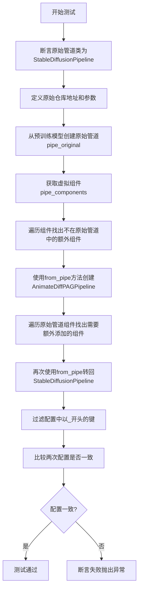

#### 带注释源码

```python
def test_from_pipe_consistent_config(self):
    """
    测试从 StableDiffusionPipeline 通过 from_pipe 方法转换为 AnimateDiffPAGPipeline，
    再转换回 StableDiffusionPipeline 后配置的一致性
    """
    # 1. 断言确认原始管道类是 StableDiffusionPipeline
    assert self.original_pipeline_class == StableDiffusionPipeline
    
    # 2. 定义原始管道的仓库地址和额外参数
    original_repo = "hf-internal-testing/tinier-stable-diffusion-pipe"
    original_kwargs = {"requires_safety_checker": False}

    # 3. 创建原始管道（StableDiffusionPipeline）
    pipe_original = self.original_pipeline_class.from_pretrained(original_repo, **original_kwargs)

    # 4. 获取虚拟组件（用于构建 AnimateDiffPAGPipeline）
    pipe_components = self.get_dummy_components()
    
    # 5. 找出原始管道中不存在的额外组件（AnimateDiff特有的组件如motion_adapter）
    pipe_additional_components = {}
    for name, component in pipe_components.items():
        if name not in pipe_original.components:
            pipe_additional_components[name] = component

    # 6. 使用 from_pipe 方法将原始管道转换为 AnimateDiffPAGPipeline
    pipe = self.pipeline_class.from_pipe(pipe_original, **pipe_additional_components)

    # 7. 找出需要转回原始管道时需要的额外组件
    original_pipe_additional_components = {}
    for name, component in pipe_original.components.items():
        # 如果组件不存在于新管道中，或类型不匹配，则需要额外添加
        if name not in pipe.components or not isinstance(component, pipe.components[name].__class__):
            original_pipe_additional_components[name] = component

    # 8. 再次使用 from_pipe 方法将管道转回 StableDiffusionPipeline
    pipe_original_2 = self.original_pipeline_class.from_pipe(pipe, **original_pipe_additional_components)

    # 9. 过滤配置，去除以_开头的内部键（如私有属性）
    original_config = {k: v for k, v in pipe_original.config.items() if not k.startswith("_")}
    original_config_2 = {k: v for k, v in pipe_original_2.config.items() if not k.startswith("_")}
    
    # 10. 断言两次配置完全一致
    assert original_config_2 == original_config
```


### `AnimateDiffPAGPipelineFastTests.test_motion_unet_loading`

该测试方法用于验证 AnimateDiffPAGPipeline 在实例化时能够正确加载 motion UNet（UNetMotionModel），确保运动适配器（MotionAdapter）被正确集成到管道中，而不是使用标准的 UNet2DConditionModel。

参数：
- `self`：`AnimateDiffPAGPipelineFastTests` 类型，测试类实例本身，包含测试所需的组件和配置

返回值：`None`，该方法为测试方法，使用 assert 语句进行断言验证，不返回任何值

#### 流程图

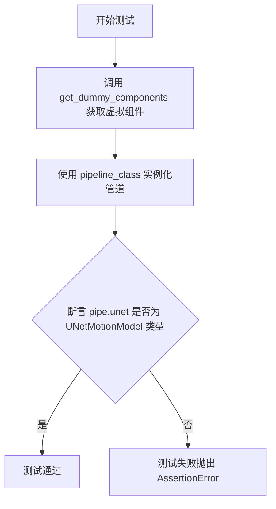

#### 带注释源码

```python
def test_motion_unet_loading(self):
    """
    测试 motion UNet 的加载功能
    
    该测试方法验证 AnimateDiffPAGPipeline 在实例化时是否正确加载了
    UNetMotionModel 而不是标准的 UNet2DConditionModel。
    这是确保运动适配器正确集成的关键测试。
    """
    # 获取虚拟组件配置，用于测试
    # 包含 unet, scheduler, vae, motion_adapter, text_encoder, tokenizer 等
    components = self.get_dummy_components()
    
    # 使用虚拟组件实例化 AnimateDiffPAGPipeline
    # pipeline_class 指向 AnimateDiffPAGPipeline
    pipe = self.pipeline_class(**components)
    
    # 断言验证 pipe.unet 是 UNetMotionModel 的实例
    # 这是核心验证点：确保运动适配器被正确加载为 motion UNet
    assert isinstance(pipe.unet, UNetMotionModel)
```


### `AnimateDiffPAGPipelineFastTests.test_attention_slicing_forward_pass`

该测试方法用于验证 AnimateDiffPAGPipeline 的注意力切片（attention slicing）前向传播功能，但由于该管道未启用注意力切片功能，该测试目前被跳过。

参数：

- `self`：`AnimateDiffPAGPipelineFastTests`，表示测试类实例本身

返回值：`None`，由于测试被跳过，不执行任何操作

#### 流程图

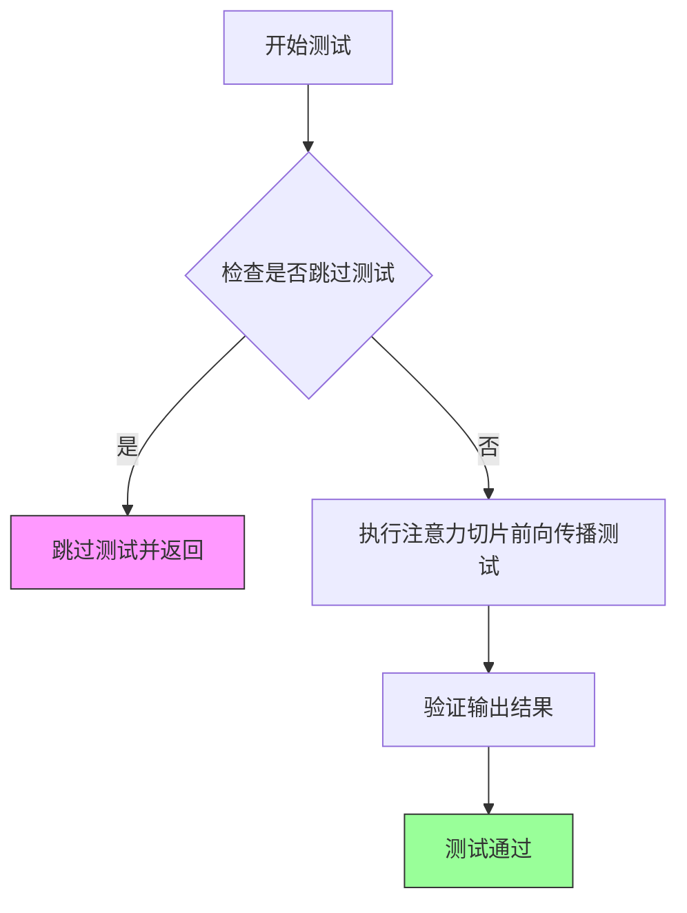

#### 带注释源码

```python
@unittest.skip("Attention slicing is not enabled in this pipeline")
def test_attention_slicing_forward_pass(self):
    """
    测试 AnimateDiffPAGPipeline 的注意力切片前向传播功能。
    
    注意：该测试被跳过，因为 AnimateDiffPAGPipeline 当前不支持
    注意力切片功能。注意力切片是一种内存优化技术，用于减少
    推理过程中的显存占用。
    
    Args:
        self: AnimateDiffPAGPipelineFastTests 实例
        
    Returns:
        None: 测试被跳过，无返回值
        
    Raises:
        unittest.SkipTest: 总是抛出跳过异常，原因是注意力切片未启用
    """
    pass  # 空方法体，测试被跳过
```

#### 补充说明

| 项目 | 描述 |
|------|------|
| **测试状态** | 已跳过（Skipped） |
| **跳过原因** | Attention slicing is not enabled in this pipeline |
| **所属测试类** | `AnimateDiffPAGPipelineFastTests` |
| **测试类型** | 单元测试（Unit Test） |
| **技术债务** | 该测试方法为空实现，表明注意力切片功能尚未在 AnimateDiffPAGPipeline 中实现，如需支持需要添加相应的代码逻辑 |


### AnimateDiffPAGPipelineFastTests.test_ip_adapter

该方法是`AnimateDiffPAGPipelineFastTests`类中的一个测试用例，用于测试IP-Adapter功能在不同硬件设备上的兼容性。它根据当前运行设备（CPU或GPU）设置不同的预期输出切片值，并调用父类的`test_ip_adapter`方法执行实际的IP-Adapter功能测试。

参数：

- 该方法无显式参数（继承自unittest.TestCase）

返回值：`None`，该方法为测试用例，无返回值

#### 流程图

```mermaid
flowchart TD
    A[开始 test_ip_adapter] --> B{torch_device == 'cpu'?}
    B -->|是| C[设置 expected_pipe_slice 为预设的numpy数组]
    B -->|否| D[设置 expected_pipe_slice = None]
    C --> E[调用 super().test_ip_adapter]
    D --> E
    E --> F[执行父类的IP-Adapter测试逻辑]
    F --> G[结束]
```

#### 带注释源码

```python
def test_ip_adapter(self):
    """
    测试IP-Adapter功能在不同设备上的行为
    
    该测试方法继承自IPAdapterTesterMixin，用于验证AnimateDiffPAGPipeline
    的IP-Adapter功能是否正常工作。根据运行设备的不同，使用不同的预期值进行验证。
    """
    # 初始化预期输出切片为None
    expected_pipe_slice = None

    # 根据设备类型设置不同的预期值
    # CPU设备需要使用特定的预期值以确保测试的确定性
    if torch_device == "cpu":
        # CPU设备上的预期输出切片值（27个浮点数）
        expected_pipe_slice = np.array(
            [
                0.5068,
                0.5294,
                0.4926,
                0.4810,
                0.4188,
                0.5935,
                0.5295,
                0.3947,
                0.5300,
                0.4706,
                0.3950,
                0.4737,
                0.4072,
                0.3227,
                0.5481,
                0.4864,
                0.4518,
                0.5315,
                0.5979,
                0.5374,
                0.3503,
                0.5275,
                0.6067,
                0.4914,
                0.5440,
                0.4775,
                0.5538,
            ]
        )
    
    # 调用父类的test_ip_adapter方法执行实际测试
    # 父类方法来自IPAdapterTesterMixin，会验证IP-Adapter的输出是否符合预期
    return super().test_ip_adapter(expected_pipe_slice=expected_pipe_slice)
```


### `AnimateDiffPAGPipelineFastTests.test_dict_tuple_outputs_equivalent`

该函数是 AnimateDiffPAGPipelineFastTests 测试类中的一个测试方法，用于验证管道输出在字典格式和元组格式下是否等价。它根据设备类型设置不同的预期输出切片，然后调用父类的同名测试方法进行验证。

参数：

- `self`：隐式参数，TestCase 实例本身，无需显式传递

返回值：继承自 `SDFunctionTesterMixin.test_dict_tuple_outputs_equivalent` 的返回值，通常为 `None`（测试通过时）或抛出断言异常（测试失败时）

#### 流程图

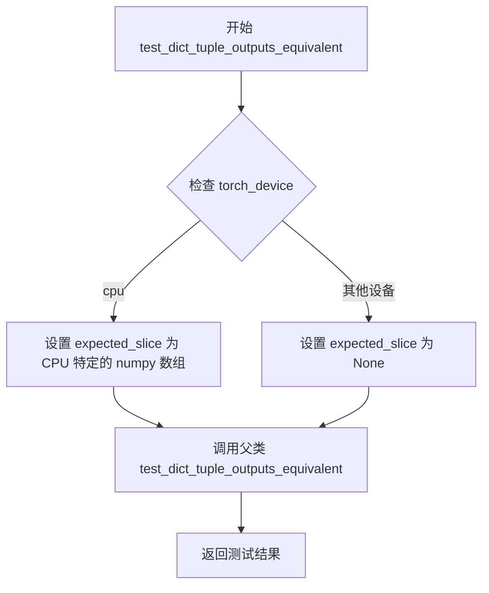

#### 带注释源码

```
def test_dict_tuple_outputs_equivalent(self):
    """
    测试管道的字典输出和元组输出是否等价。
    
    该测试方法继承自 SDFunctionTesterMixin，用于验证管道在返回字典格式
    （如 {'images': ..., 'latents': ...}）和元组格式（(images, latents)）
    时，两种方式的输出结果是否一致。
    """
    # 初始化预期输出切片为 None
    expected_slice = None
    
    # 根据设备类型设置不同的预期输出切片
    # 这是因为不同设备（CPU vs GPU）上可能会产生微小的数值差异
    if torch_device == "cpu":
        # CPU 设备上的预期输出值，用于结果验证
        expected_slice = np.array([0.5295, 0.3947, 0.5300, 0.4864, 0.4518, 0.5315, 0.5440, 0.4775, 0.5538])
    
    # 调用父类的测试方法，传入预期的输出切片
    # 父类 SDFunctionTesterMixin.test_dict_tuple_outputs_equivalent 会：
    # 1. 以字典格式调用管道
    # 2. 以元组格式调用管道
    # 3. 比较两种输出格式的结果是否等价
    return super().test_dict_tuple_outputs_equivalent(expected_slice=expected_slice)
```


### `AnimateDiffPAGPipelineFastTests.test_to_device`

该测试方法验证 AnimateDiffPAGPipeline 管道能否正确地将所有组件移动到指定的计算设备（CPU 或 CUDA），并确保在目标设备上生成的输出不包含 NaN 值。

参数： 无显式参数（仅包含隐式 `self` 参数）

返回值：`None`，该方法为单元测试方法，通过断言验证设备转换的正确性，不返回任何值。

#### 流程图

```mermaid
flowchart TD
    A[开始测试] --> B[获取虚拟组件: get_dummy_components]
    B --> C[创建管道实例: AnimateDiffPAGPipeline]
    C --> D[将管道移动到CPU: pipe.to('cpu')]
    D --> E[提取所有组件的设备类型]
    E --> F{所有组件设备均为CPU?}
    F -- 否 --> G[测试失败: 断言错误]
    F -- 是 --> H[使用CPU运行管道并获取输出]
    H --> I{输出包含NaN?}
    I -- 是 --> J[测试失败: 断言错误]
    I -- 否 --> K[将管道移动到torch_device]
    K --> L[提取所有组件的设备类型]
    L --> M{所有组件设备均为torch_device?}
    M -- 否 --> G
    M -- 是 --> N[使用torch_device运行管道并获取输出]
    N --> O{输出包含NaN?}
    O -- 是 --> J
    O -- 否 --> P[测试通过]
```

#### 带注释源码

```python
@require_accelerator  # 装饰器：仅在有accelerator（GPU）时运行此测试
def test_to_device(self):
    """
    测试管道将所有组件移动到指定设备的功能。
    验证CPU和CUDA设备上的设备转换和输出有效性。
    """
    # 步骤1：获取虚拟（dummy）组件用于测试
    components = self.get_dummy_components()
    
    # 步骤2：使用虚拟组件创建AnimateDiffPAGPipeline实例
    pipe = self.pipeline_class(**components)
    
    # 步骤3：配置进度条（disable=None表示不禁用）
    pipe.set_progress_bar_config(disable=None)

    # 步骤4：将管道所有组件移动到CPU设备
    pipe.to("cpu")
    
    # 步骤5：获取所有组件的设备类型列表
    # 注意：pipeline内部会创建新的motion UNet，需要从components中检查
    model_devices = [
        component.device.type  # 提取设备类型字符串（如'cpu', 'cuda'）
        for component in pipe.components.values()  # 遍历所有组件
        if hasattr(component, "device")  # 仅处理有device属性的组件
    ]
    
    # 步骤6：断言所有组件都在CPU上
    self.assertTrue(all(device == "cpu" for device in model_devices))

    # 步骤7：在CPU上运行管道生成图像
    # get_dummy_inputs返回测试所需的输入参数
    output_cpu = pipe(**self.get_dummy_inputs("cpu"))[0]
    
    # 步骤8：断言CPU输出不包含NaN值（验证数值稳定性）
    self.assertTrue(np.isnan(output_cpu).sum() == 0)

    # 步骤9：将管道移动到指定的torch_device（通常是CUDA设备）
    pipe.to(torch_device)
    
    # 步骤10：重新获取所有组件的设备类型
    model_devices = [
        component.device.type
        for component in pipe.components.values()
        if hasattr(component, "device")
    ]
    
    # 步骤11：断言所有组件都在目标设备上
    self.assertTrue(all(device == torch_device for device in model_devices))

    # 步骤12：在目标设备上运行管道生成图像
    output_device = pipe(**self.get_dummy_inputs(torch_device))[0]
    
    # 步骤13：断言目标设备输出不包含NaN值
    self.assertTrue(np.isnan(to_np(output_device)).sum() == 0)
```


### `AnimateDiffPAGPipelineFastTests.test_to_dtype`

该测试方法用于验证 AnimateDiffPAGPipeline 管道能否正确地在不同数据类型（dtype）之间进行转换，包括从默认的 float32 转换到 float16，并确保所有模型组件的 dtype 都正确更新。

参数：

- `self`：`AnimateDiffPAGPipelineFastTests`，代表测试类的实例本身，用于访问类属性和方法

返回值：`None`，该方法为一个测试方法，通过 unittest 的 assert 语句进行验证，不返回任何值

#### 流程图

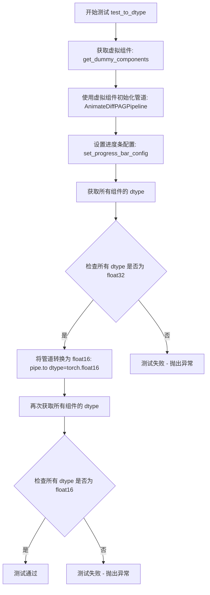

#### 带注释源码

```python
def test_to_dtype(self):
    """
    测试方法：验证管道能够在不同数据类型之间转换
    
    该测试确保：
    1. 管道默认使用 float32 数据类型
    2. 管道能够正确转换为 float16 数据类型
    3. 所有模型组件的 dtype 都被正确更新
    """
    # 步骤1: 获取用于测试的虚拟（dummy）组件
    # 这些组件是轻量级的模型，用于快速测试
    components = self.get_dummy_components()
    
    # 步骤2: 使用虚拟组件初始化 AnimateDiffPAGPipeline 管道
    pipe = self.pipeline_class(**components)
    
    # 步骤3: 设置进度条配置，disable=None 表示不禁用进度条
    pipe.set_progress_bar_config(disable=None)
    
    # 步骤4: 验证默认数据类型为 float32
    # 注意：AnimateDiff 管道在内部创建了新的 motion UNet，
    # 因此需要从 pipe.components 中检查 dtype，而不是从 pipe.unet
    model_dtypes = [component.dtype for component in pipe.components.values() if hasattr(component, "dtype")]
    
    # 断言：所有模型组件的 dtype 都应该是 torch.float32
    self.assertTrue(all(dtype == torch.float32 for dtype in model_dtypes))
    
    # 步骤5: 将管道转换为 float16 数据类型
    pipe.to(dtype=torch.float16)
    
    # 步骤6: 验证转换后的数据类型为 float16
    model_dtypes = [component.dtype for component in pipe.components.values() if hasattr(component, "dtype")]
    
    # 断言：所有模型组件的 dtype 都应该是 torch.float16
    self.assertTrue(all(dtype == torch.float16 for dtype in model_dtypes))
```


### `AnimateDiffPAGPipelineFastTests.test_prompt_embeds`

该测试方法用于验证 AnimateDiffPAGPipeline 能够接受预计算的 prompt embeddings（提示词嵌入）而不是原始的文本 prompt。测试通过构建虚拟组件、初始化管道、准备包含预计算嵌入的输入，然后执行管道来验证功能的正确性。

参数：

- `self`：`AnimateDiffPAGPipelineFastTests`，测试类实例，包含测试所需的组件和配置

返回值：`None`，无返回值（测试方法）

#### 流程图

```mermaid
flowchart TD
    A[开始测试 test_prompt_embeds] --> B[调用 get_dummy_components 获取虚拟组件]
    B --> C[使用虚拟组件初始化 AnimateDiffPAGPipeline]
    C --> D[设置进度条配置 disable=None]
    D --> E[将管道移动到 torch_device]
    E --> F[调用 get_dummy_inputs 获取虚拟输入]
    F --> G[从输入字典中移除 'prompt' 键]
    G --> H[生成随机 prompt_embeds 张量]
    H --> I[将 prompt_embeds 添加到输入字典]
    I --> J[执行管道调用 pipe(**inputs)]
    J --> K[测试完成, 无显式返回值]
```

#### 带注释源码

```python
def test_prompt_embeds(self):
    """
    测试管道是否接受预计算的 prompt_embeds 而不是原始 prompt
    """
    # 1. 获取虚拟组件（用于测试的轻量级模型配置）
    components = self.get_dummy_components()
    
    # 2. 使用虚拟组件实例化管道
    pipe = self.pipeline_class(**components)
    
    # 3. 配置进度条（disable=None 表示启用进度条）
    pipe.set_progress_bar_config(disable=None)
    
    # 4. 将管道移动到测试设备（cuda 或 cpu）
    pipe.to(torch_device)

    # 5. 获取虚拟输入参数
    inputs = self.get_dummy_inputs(torch_device)
    
    # 6. 移除 prompt 键，因为我们要测试 prompt_embeds
    inputs.pop("prompt")
    
    # 7. 创建随机初始化的 prompt_embeds
    # 形状: (batch_size=1, seq_len=4, hidden_size=text_encoder.config.hidden_size)
    inputs["prompt_embeds"] = torch.randn(
        (1, 4, pipe.text_encoder.config.hidden_size), 
        device=torch_device
    )
    
    # 8. 执行管道，验证管道能正确处理 prompt_embeds
    # 如果管道不支持 prompt_embeds，此处会抛出异常
    pipe(**inputs)
```


### `AnimateDiffPAGPipelineFastTests.test_free_init`

该测试方法用于验证 AnimateDiffPAGPipeline 中 FreeInit 功能的正确性。测试通过对比启用 FreeInit、禁用 FreeInit 和默认管道输出的结果，确保 FreeInit 功能能够有效改变生成帧的内容，并且禁用后能够恢复到与默认管道相似的输出。

参数：

- `self`：实例方法参数，类型为 `AnimateDiffPAGPipelineFastTests`，表示测试类实例本身

返回值：`None`，因为这是一个单元测试方法，通过断言验证行为而不返回具体值

#### 流程图

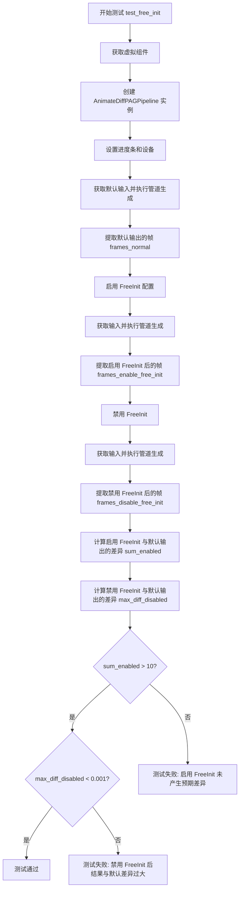

#### 带注释源码

```python
def test_free_init(self):
    """
    测试 AnimateDiffPAGPipeline 的 FreeInit 功能。
    验证启用 FreeInit 后生成结果与默认不同，禁用后与默认相似。
    """
    # 步骤1: 获取预定义的虚拟组件，用于构建测试管道
    components = self.get_dummy_components()
    
    # 步骤2: 使用虚拟组件实例化 AnimateDiffPAGPipeline 管道
    pipe: AnimateDiffPAGPipeline = self.pipeline_class(**components)
    
    # 步骤3: 配置进度条（disable=None 表示启用进度条）
    pipe.set_progress_bar_config(disable=None)
    
    # 步骤4: 将管道移动到测试设备（如 CUDA 或 CPU）
    pipe.to(torch_device)

    # 步骤5: 获取默认输入，执行管道生成，获取基准输出帧
    inputs_normal = self.get_dummy_inputs(torch_device)
    frames_normal = pipe(**inputs_normal).frames[0]

    # 步骤6: 启用 FreeInit，配置参数：
    # - num_iters=2: 迭代次数
    # - use_fast_sampling=True: 使用快速采样
    # - method="butterworth": 使用巴特沃斯滤波器方法
    # - order=4: 滤波器阶数
    # - spatial_stop_frequency=0.25: 空间停止频率
    # - temporal_stop_frequency=0.25: 时间停止频率
    pipe.enable_free_init(
        num_iters=2,
        use_fast_sampling=True,
        method="butterworth",
        order=4,
        spatial_stop_frequency=0.25,
        temporal_stop_frequency=0.25,
    )
    
    # 步骤7: 使用相同的虚拟输入执行管道，获取启用 FreeInit 后的输出
    inputs_enable_free_init = self.get_dummy_inputs(torch_device)
    frames_enable_free_init = pipe(**inputs_enable_free_init).frames[0]

    # 步骤8: 禁用 FreeInit 功能
    pipe.disable_free_init()
    
    # 步骤9: 再次执行管道，获取禁用 FreeInit 后的输出
    inputs_disable_free_init = self.get_dummy_inputs(torch_device)
    frames_disable_free_init = pipe(**inputs_disable_free_init).frames[0]

    # 步骤10: 计算启用 FreeInit 与默认输出的差异绝对值之和
    sum_enabled = np.abs(to_np(frames_normal) - to_np(frames_enable_free_init)).sum()
    
    # 步骤11: 计算禁用 FreeInit 与默认输出的差异绝对值的最大值
    max_diff_disabled = np.abs(to_np(frames_normal) - to_np(frames_disable_free_init)).max()

    # 步骤12: 断言验证 - 启用 FreeInit 应该产生明显不同的结果（差异大于10）
    self.assertGreater(
        sum_enabled, 1e1, "Enabling of FreeInit should lead to results different from the default pipeline results"
    )
    
    # 步骤13: 断言验证 - 禁用 FreeInit 应该产生与默认管道相似的结果（差异小于0.001）
    self.assertLess(
        max_diff_disabled,
        1e-3,
        "Disabling of FreeInit should lead to results similar to the default pipeline results",
    )
```


### `AnimateDiffPAGPipelineFastTests.test_free_init_with_schedulers`

该测试方法验证了 AnimateDiffPAGPipeline 在启用 FreeInit 功能并结合不同调度器（DPMSolverMultistepScheduler 和 LCMScheduler）时的行为是否符合预期。通过对比默认管道输出与启用 FreeInit 后的输出，确保 FreeInit 能够产生明显不同的结果。

参数：
- `self`：隐式参数，表示测试类实例本身，无类型，返回该方法所属的测试类实例。

返回值：`None`，该方法为单元测试方法，通过 `self.assertGreater` 断言验证结果，不返回任何值。

#### 流程图

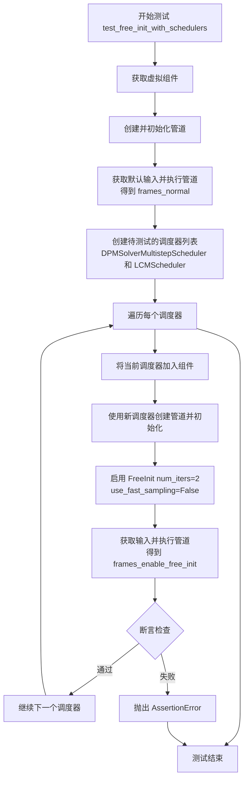

#### 带注释源码

```python
def test_free_init_with_schedulers(self):
    """
    测试 FreeInit 功能在不同调度器下的表现。
    验证启用 FreeInit 后生成的帧与默认管道生成的帧存在显著差异。
    """
    # 1. 获取预定义的虚拟组件（UNet、VAE、文本编码器、运动适配器等）
    components = self.get_dummy_components()
    
    # 2. 使用虚拟组件初始化 AnimateDiffPAGPipeline 管道
    pipe: AnimateDiffPAGPipeline = self.pipeline_class(**components)
    
    # 3. 配置进度条（disable=None 表示启用进度条）
    pipe.set_progress_bar_config(disable=None)
    
    # 4. 将管道移至测试设备（torch_device）
    pipe.to(torch_device)

    # 5. 获取默认输入，执行管道获取基准帧序列
    inputs_normal = self.get_dummy_inputs(torch_device)
    frames_normal = pipe(**inputs_normal).frames[0]

    # 6. 定义要测试的调度器列表
    schedulers_to_test = [
        # DPMSolverMultistepScheduler：多步DPM求解器调度器
        DPMSolverMultistepScheduler.from_config(
            components["scheduler"].config,
            timestep_spacing="linspace",
            beta_schedule="linear",
            algorithm_type="dpmsolver++",
            steps_offset=1,
            clip_sample=False,
        ),
        # LCMScheduler：潜在一致性模型调度器
        LCMScheduler.from_config(
            components["scheduler"].config,
            timestep_spacing="linspace",
            beta_schedule="linear",
            steps_offset=1,
            clip_sample=False,
        ),
    ]
    
    # 7. 从组件中移除默认调度器（后续会逐一添加新调度器）
    components.pop("scheduler")

    # 8. 遍历每个调度器进行测试
    for scheduler in schedulers_to_test:
        # 8.1 将当前调度器加入组件
        components["scheduler"] = scheduler
        
        # 8.2 使用新调度器创建管道实例
        pipe: AnimateDiffPAGPipeline = self.pipeline_class(**components)
        
        # 8.3 配置进度条并移至测试设备
        pipe.set_progress_bar_config(disable=None)
        pipe.to(torch_device)

        # 8.4 启用 FreeInit
        # num_iters=2: 迭代2次
        # use_fast_sampling=False: 不使用快速采样
        pipe.enable_free_init(num_iters=2, use_fast_sampling=False)

        # 8.5 获取输入并执行管道
        inputs = self.get_dummy_inputs(torch_device)
        frames_enable_free_init = pipe(**inputs).frames[0]
        
        # 8.6 计算基准帧与FreeInit帧之间的差异绝对值之和
        sum_enabled = np.abs(to_np(frames_normal) - to_np(frames_enable_free_init)).sum()

        # 8.7 断言：FreeInit启用后结果应与默认结果明显不同（差异大于10）
        self.assertGreater(
            sum_enabled,
            1e1,
            "Enabling of FreeInit should lead to results different from the default pipeline results",
        )
```


### `AnimateDiffPAGPipelineFastTests.test_free_noise_blocks`

该测试方法用于验证AnimateDiffPAGPipeline中FreeNoise功能的启用和禁用是否正确地转换UNet中down_blocks的motion_modules的transformer_blocks类型。测试首先启用FreeNoise并断言transformer_blocks已转换为FreeNoiseTransformerBlock类型，然后禁用FreeNoise并断言transformer_blocks已恢复为非FreeNoiseTransformerBlock类型。

参数：
- `self`：隐式参数，测试类实例本身，无需额外描述

返回值：`None`，该方法为单元测试方法，通过assert断言验证功能，不返回任何值

#### 流程图

```mermaid
flowchart TD
    A[开始测试] --> B[获取虚拟组件 components = self.get_dummy_components]
    B --> C[创建管道 pipe = self.pipeline_class(**components)]
    C --> D[设置进度条禁用状态 pipe.set_progress_bar_config(disable=None)]
    D --> E[将管道移至设备 pipe.to(torch_device)]
    E --> F[启用FreeNoise功能 pipe.enable_free_noise]
    F --> G[遍历down_blocks中的所有motion_modules和transformer_blocks]
    G --> H{检查transformer_block是否为FreeNoiseTransformerBlock实例}
    H -->|是| I[断言通过: isintance返回True]
    H -->|否| J[断言失败: 抛出AssertionError]
    I --> K[禁用FreeNoise功能 pipe.disable_free_noise]
    K --> L[再次遍历down_blocks中的所有motion_modules和transformer_blocks]
    L --> M{检查transformer_block是否不为FreeNoiseTransformerBlock实例}
    M -->|是| N[断言通过: isinstance返回False]
    M -->|否| O[断言失败: 抛出AssertionError]
    N --> P[测试结束]
```

#### 带注释源码

```python
def test_free_noise_blocks(self):
    """
    测试FreeNoise功能的启用和禁用是否正确地转换transformer blocks的类型。
    
    测试逻辑：
    1. 启用FreeNoise后，motion_modules中的transformer_blocks应转换为FreeNoiseTransformerBlock
    2. 禁用FreeNoise后，transformer_blocks应恢复为原来的类型
    """
    # 步骤1：获取预定义的虚拟组件（用于测试的dummy模型和配置）
    components = self.get_dummy_components()
    
    # 步骤2：使用虚拟组件创建AnimateDiffPAGPipeline实例
    pipe: AnimateDiffPAGPipeline = self.pipeline_class(**components)
    
    # 步骤3：配置进度条（disable=None表示不禁用进度条）
    pipe.set_progress_bar_config(disable=None)
    
    # 步骤4：将管道及其所有组件移至测试设备（如CPU或CUDA）
    pipe.to(torch_device)
    
    # 步骤5：启用FreeNoise功能
    # 这应该会将UNet中down_blocks的motion_modules的transformer_blocks
    # 转换为FreeNoiseTransformerBlock类型
    pipe.enable_free_noise()
    
    # 步骤6：遍历UNet的所有down_blocks
    for block in pipe.unet.down_blocks:
        # 遍历每个block中的所有motion_modules
        for motion_module in block.motion_modules:
            # 遍历每个motion_module中的所有transformer_blocks
            for transformer_block in motion_module.transformer_blocks:
                # 断言：启用FreeNoise后，transformer_block应为FreeNoiseTransformerBlock实例
                self.assertTrue(
                    isinstance(transformer_block, FreeNoiseTransformerBlock),
                    "Motion module transformer blocks must be an instance of `FreeNoiseTransformerBlock` after enabling FreeNoise.",
                )
    
    # 步骤7：禁用FreeNoise功能
    # 这应该会将transformer_blocks恢复为原来的类型
    pipe.disable_free_noise()
    
    # 步骤8：再次遍历验证类型已恢复
    for block in pipe.unet.down_blocks:
        for motion_module in block.motion_modules:
            for transformer_block in motion_module.transformer_blocks:
                # 断言：禁用FreeNoise后，transformer_block不应为FreeNoiseTransformerBlock实例
                self.assertFalse(
                    isinstance(transformer_block, FreeNoiseTransformerBlock),
                    "Motion module transformer blocks must not be an instance of `FreeNoiseTransformerBlock` after disabling FreeNoise.",
                )
```


### `AnimateDiffPAGPipelineFastTests.test_free_noise`

该测试方法用于验证 FreeNoise（自由噪声）功能的正确性，通过启用和禁用 FreeNoise 并比较生成的帧差异，确保启用 FreeNoise 后产生不同的结果，禁用后产生与默认管道相似的结果。

参数：无（仅包含 `self` 隐式参数）

返回值：无（`None`，该方法为 `void` 类型）

#### 流程图

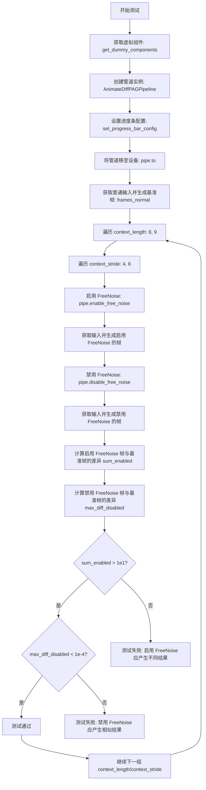

#### 带注释源码

```python
def test_free_noise(self):
    """
    测试 FreeNoise 功能的启用和禁用行为。
    
    验证逻辑：
    1. 生成基准帧（不启用 FreeNoise）
    2. 启用 FreeNoise 后生成帧应与基准帧明显不同（差异 > 1e1）
    3. 禁用 FreeNoise 后生成帧应与基准帧非常相似（差异 < 1e-4）
    
    测试参数组合：
    - context_length: 8, 9
    - context_stride: 4, 6
    """
    # 步骤1: 获取预配置的虚拟组件（UNet、VAE、调度器、文本编码器等）
    components = self.get_dummy_components()
    
    # 步骤2: 使用虚拟组件实例化 AnimateDiffPAGPipeline 管道
    pipe: AnimateDiffPAGPipeline = self.pipeline_class(**components)
    
    # 步骤3: 配置进度条（disable=None 表示启用进度条）
    pipe.set_progress_bar_config(disable=None)
    
    # 步骤4: 将管道移至测试设备（CPU 或 CUDA）
    pipe.to(torch_device)

    # 步骤5: 生成基准帧（不启用 FreeNoise 的正常推理）
    inputs_normal = self.get_dummy_inputs(torch_device)
    frames_normal = pipe(**inputs_normal).frames[0]

    # 步骤6: 遍历不同的 FreeNoise 参数组合
    for context_length in [8, 9]:
        for context_stride in [4, 6]:
            # 启用 FreeNoise：传入 context_length 和 context_stride 参数
            pipe.enable_free_noise(context_length, context_stride)

            # 使用相同输入生成启用 FreeNoise 的帧
            inputs_enable_free_noise = self.get_dummy_inputs(torch_device)
            frames_enable_free_noise = pipe(**inputs_enable_free_noise).frames[0]

            # 禁用 FreeNoise：恢复默认噪声行为
            pipe.disable_free_noise()

            # 使用相同输入生成禁用 FreeNoise 的帧
            inputs_disable_free_noise = self.get_dummy_inputs(torch_device)
            frames_disable_free_noise = pipe(**inputs_disable_free_noise).frames[0]

            # 计算差异指标
            # sum_enabled: 启用 FreeNoise 与基准的总体差异
            sum_enabled = np.abs(to_np(frames_normal) - to_np(frames_enable_free_noise)).sum()
            
            # max_diff_disabled: 禁用 FreeNoise 与基准的最大差异
            max_diff_disabled = np.abs(to_np(frames_normal) - to_np(frames_disable_free_noise)).max()

            # 断言验证
            # 验证1: 启用 FreeNoise 应该产生明显不同的结果
            self.assertGreater(
                sum_enabled,
                1e1,
                "Enabling of FreeNoise should lead to results different from the default pipeline results"
            )
            
            # 验证2: 禁用 FreeNoise 应该产生与默认相似的结果
            self.assertLess(
                max_diff_disabled,
                1e-4,
                "Disabling of FreeNoise should lead to results similar to the default pipeline results",
            )
```


### `AnimateDiffPAGPipelineFastTests.test_xformers_attention_forwardGenerator_pass`

该测试方法用于验证 XFormers 内存高效注意力机制在 AnimateDiffPAGPipeline 中的正确性。测试通过比较启用 xformers 前后的推理输出差异，确保使用 xformers 不会影响模型的生成结果。

参数：

- `self`：`AnimateDiffPAGPipelineFastTests`，测试类的实例，包含测试所需的组件和辅助方法

返回值：`None`，该方法为单元测试方法，通过断言验证结果，不返回具体数值

#### 流程图

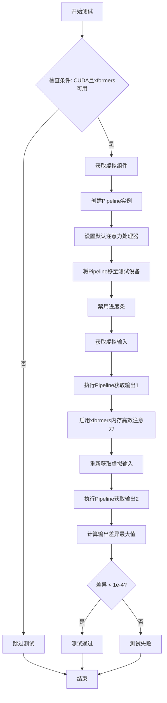

#### 带注释源码

```python
@unittest.skipIf(
    torch_device != "cuda" or not is_xformers_available(),
    # 条件跳过：仅在CUDA设备且xformers可用时执行该测试
    reason="XFormers attention is only available with CUDA and `xformers` installed",
)
def test_xformers_attention_forwardGenerator_pass(self):
    # 获取用于测试的虚拟组件（UNet、VAE、Scheduler等）
    components = self.get_dummy_components()
    # 使用虚拟组件创建AnimateDiffPAGPipeline实例
    pipe = self.pipeline_class(**components)
    # 遍历所有组件，将支持默认注意力处理器的组件设置为默认处理器
    for component in pipe.components.values():
        if hasattr(component, "set_default_attn_processor"):
            component.set_default_attn_processor()
    # 将Pipeline移至测试设备（如cuda）
    pipe.to(torch_device)
    # 禁用进度条显示以减少测试输出
    pipe.set_progress_bar_config(disable=None)

    # 获取虚拟输入参数（包含prompt、generator、num_inference_steps等）
    inputs = self.get_dummy_inputs(torch_device)
    # 执行Pipeline推理，获取不含xformers优化的输出
    output_without_offload = pipe(**inputs).frames[0]
    # 确保输出张量已移至CPU以便进行numpy转换
    output_without_offload = (
        output_without_offload.cpu() if torch.is_tensor(output_without_offload) else output_without_offload
    )

    # 启用XFormers内存高效注意力机制
    pipe.enable_xformers_memory_efficient_attention()
    # 重新获取虚拟输入（使用新的随机种子）
    inputs = self.get_dummy_inputs(torch_device)
    # 执行Pipeline推理，获取含xformers优化的输出
    output_with_offload = pipe(**inputs).frames[0]
    # 确保输出张量已移至CPU
    output_with_offload = (
        output_with_offload.cpu() if torch.is_tensor(output_with_offload) else output_without_offload
    )

    # 计算两个输出之间的最大绝对差异
    max_diff = np.abs(to_np(output_with_offload) - to_np(output_without_offload)).max()
    # 断言：XFormers注意力机制不应影响推理结果的数值精度
    self.assertLess(max_diff, 1e-4, "XFormers attention should not affect the inference results")
```


### `AnimateDiffPAGPipelineFastTests.test_vae_slicing`

该方法是测试类 `AnimateDiffPAGPipelineFastTests` 中的一个测试用例，用于验证 VAE（变分自编码器）切片功能是否正常工作。该方法调用父类的 `test_vae_slicing` 方法，并传入 `image_count=2` 参数来测试处理2张图像时的 VAE 切片功能。

参数：

- `self`：测试类实例对象，表示当前的测试用例类本身

返回值：`unittest.TestResult` 或 `None`，取决于父类 `test_vae_slicing` 方法的返回值，用于表示测试执行的结果

#### 流程图

```mermaid
flowchart TD
    A[开始: test_vae_slicing] --> B{调用父类方法}
    B --> C[super().test_vae_slicing(image_count=2)]
    C --> D[执行VAE切片测试]
    D --> E{测试通过?}
    E -->|是| F[返回测试结果]
    E -->|否| G[抛出断言错误]
    F --> H[结束]
    G --> H
```

#### 带注释源码

```python
def test_vae_slicing(self):
    """
    测试 VAE 切片功能是否正常工作。
    
    该测试方法继承自测试混合类，通过调用父类的 test_vae_slicing 方法
    来验证 AnimateDiffPAGPipeline 中的 VAE 切片功能是否正确实现。
    VAE 切片是一种内存优化技术，将 VAE 解码过程分片处理以减少显存占用。
    
    参数:
        self: AnimateDiffPAGPipelineFastTests 的实例对象
        
    返回值:
        返回父类 test_vae_slicing 方法的执行结果，通常是 unittest.TestResult
    """
    # 调用父类 (PipelineTesterMixin) 的 test_vae_slicing 方法
    # 传入 image_count=2 参数，测试处理2张图像时的 VAE 切片功能
    return super().test_vae_slicing(image_count=2)
```


### `AnimateDiffPAGPipelineFastTests.test_pag_disable_enable`

该测试函数验证了 AnimateDiffPAGPipeline 中 PAG（Prompt-guided Attention Guidance）功能的禁用和启用行为。测试通过比较基础管道（无 PAG）、PAG 禁用（pag_scale=0.0）和 PAG 启用时的输出，来确保 PAG 功能正确实现：基础管道与 PAG 禁用时应产生相同输出，而 PAG 启用时应产生不同的输出。

参数：

- `self`：`AnimateDiffPAGPipelineFastTests`，测试类实例，包含测试所需的配置和辅助方法

返回值：`None`，该测试函数通过断言验证 PAG 功能，不返回任何值

#### 流程图

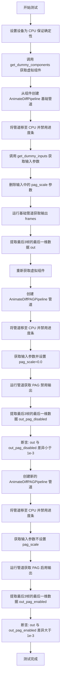

#### 带注释源码

```python
def test_pag_disable_enable(self):
    """
    测试 PAG (Prompt-guided Attention Guidance) 的禁用和启用功能
    
    验证逻辑：
    1. 基础管道（AnimateDiffPipeline）输出应与 PAG 禁用时（pag_scale=0.0）输出相同
    2. 基础管道输出应与 PAG 启用时输出不同
    """
    device = "cpu"  # ensure determinism for the device-dependent torch.Generator
    components = self.get_dummy_components()  # 获取虚拟组件用于测试

    # ========== 步骤1: 测试基础管道（无 PAG） ==========
    # base pipeline (expect same output when pag is disabled)
    components.pop("pag_applied_layers", None)  # 移除 pag_applied_layers 配置
    pipe_sd = AnimateDiffPipeline(**components)  # 创建基础 AnimateDiff 管道
    pipe_sd = pipe_sd.to(device)  # 将管道移至 CPU 设备
    pipe_sd.set_progress_bar_config(disable=None)  # 禁用进度条

    inputs = self.get_dummy_inputs(device)  # 获取虚拟输入参数
    del inputs["pag_scale"]  # 删除 pag_scale 参数，因为基础管道不支持
    # 验证基础管道确实没有 pag_scale 参数
    assert "pag_scale" not in inspect.signature(pipe_sd.__call__).parameters, (
        f"`pag_scale` should not be a call parameter of the base pipeline {pipe_sd.__class__.__name__}."
    )
    # 运行基础管道并提取最后3帧的最后一维数据用于比较
    out = pipe_sd(**inputs).frames[0, -3:, -3:, -1]

    # ========== 步骤2: 测试 PAG 禁用 (pag_scale=0.0) ==========
    components = self.get_dummy_components()  # 重新获取虚拟组件

    # pag disabled with pag_scale=0.0
    pipe_pag = self.pipeline_class(**components)  # 创建 AnimateDiffPAGPipeline
    pipe_pag = pipe_pag.to(device)  # 将管道移至 CPU
    pipe_pag.set_progress_bar_config(disable=None)  # 禁用进度条

    inputs = self.get_dummy_inputs(device)  # 获取输入参数
    inputs["pag_scale"] = 0.0  # 设置 pag_scale 为 0.0 禁用 PAG
    # 运行管道并提取最后3帧的最后一维数据
    out_pag_disabled = pipe_pag(**inputs).frames[0, -3:, -3:, -1]

    # ========== 步骤3: 测试 PAG 启用 ==========
    # pag enabled
    pipe_pag = self.pipeline_class(**components)  # 创建新的 AnimateDiffPAGPipeline
    pipe_pag = pipe_pag.to(device)  # 将管道移至 CPU
    pipe_pag.set_progress_bar_config(disable=None)  # 禁用进度条

    inputs = self.get_dummy_inputs(device)  # 获取输入参数（不设置 pag_scale，使用默认值）
    # 运行管道并提取最后3帧的最后一维数据
    out_pag_enabled = pipe_pag(**inputs).frames[0, -3:, -3:, -1]

    # ========== 步骤4: 断言验证 ==========
    # 验证基础管道输出与 PAG 禁用输出相同（差异小于 1e-3）
    assert np.abs(out.flatten() - out_pag_disabled.flatten()).max() < 1e-3
    # 验证基础管道输出与 PAG 启用输出不同（差异大于 1e-3）
    assert np.abs(out.flatten() - out_pag_enabled.flatten()).max() > 1e-3
```


### `AnimateDiffPAGPipelineFastTests.test_pag_applied_layers`

该测试方法用于验证 `AnimateDiffPAGPipeline` 中 PAG（Progressive Attention Guidance）应用层功能的正确性，确保 PAG 机制能够正确地应用于指定的 UNet 注意力处理器层，包括所有层、特定层（mid、down、up）以及更细粒度的层标识，同时验证无效层标识会抛出适当的异常。

参数：

- `self`：`AnimateDiffPAGPipelineFastTests`，测试类实例，隐含的 `self` 参数

返回值：`None`，无返回值，这是一个单元测试方法，通过 `assert` 语句验证功能正确性

#### 流程图

```mermaid
flowchart TD
    A[开始 test_pag_applied_layers] --> B[设置设备为 CPU, 获取虚拟组件]
    B --> C[创建基础 Pipeline, 移除 pag_applied_layers]
    C --> D[获取所有自注意力层列表<br/>包括 attn1 和 motion_modules 中的 attn2]
    D --> E[设置 PAG 应用层为 'down', 'mid', 'up']
    E --> F{验证 PAG 注意力处理器<br/>是否覆盖所有自注意力层}
    F -->|是| G[重置注意力处理器]
    G --> H[测试 PAG 应用层为 'mid']
    H --> I[获取中间块的所有自注意力层]
    I --> J{验证 PAG 处理器<br/>是否匹配中间层}
    J -->|是| K[重置注意力处理器]
    K --> L[测试 PAG 应用层为 'mid_block']
    L --> M[重置注意力处理器]
    M --> N[测试 PAG 应用层为正则表达式<br/>'mid_block.(attentions|motion_modules)']
    N --> O[重置注意力处理器]
    O --> P[测试无效层 'mid_block.attentions.1'<br/>预期抛出 ValueError]
    P -->|抛出 ValueError| Q[测试 PAG 应用层为 'down']
    Q --> R[重置注意力处理器]
    R --> S[测试 PAG 应用层为 'down_blocks.0']
    S --> T[重置注意力处理器]
    T --> U[测试 PAG 应用层为 'blocks.1']
    U --> V[重置注意力处理器]
    V --> W[测试无效层 'motion_modules.42'<br/>预期抛出 ValueError]
    W -->|抛出 ValueError| X[结束测试]
    
    F -->|否| F1[测试失败: 断言错误]
    J -->|否| J1[测试失败: 断言错误]
    P -->|未抛出异常| P1[测试失败: 期望异常]
    W -->|未抛出异常| W1[测试失败: 期望异常]
```

#### 带注释源码

```python
def test_pag_applied_layers(self):
    """
    测试 PAG (Progressive Attention Guidance) 应用层功能
    验证 _set_pag_attn_processor 方法能够正确地将 PAG 应用于指定的层
    """
    # 设备设置为 CPU，确保随机数生成器的确定性
    device = "cpu"
    
    # 获取用于测试的虚拟组件（UNet、VAE、调度器等）
    components = self.get_dummy_components()

    # --- 场景 1: 测试将 PAG 应用于所有层 (down, mid, up) ---
    
    # 创建基础 pipeline，移除 pag_applied_layers 参数
    components.pop("pag_applied_layers", None)
    pipe = self.pipeline_class(**components)  # AnimateDiffPAGPipeline
    pipe = pipe.to(device)
    pipe.set_progress_bar_config(disable=None)

    # 获取所有自注意力层:
    # 1. 包含 "attn1" 的层（标准的自注意力层）
    # 2. 包含 "motion_modules" 和 "attn2" 的层（运动模块中的自注意力）
    all_self_attn_layers = [
        k for k in pipe.unet.attn_processors.keys() 
        if "attn1" in k or ("motion_modules" in k and "attn2" in k)
    ]
    
    # 保存原始的注意力处理器，以便后续重置
    original_attn_procs = pipe.unet.attn_processors
    
    # 设置 PAG 应用层为 ["down", "mid", "up"]
    pag_layers = ["down", "mid", "up"]
    pipe._set_pag_attn_processor(pag_applied_layers=pag_layers, do_classifier_free_guidance=False)
    
    # 断言: 设置后的 PAG 注意力处理器应该覆盖所有自注意力层
    assert set(pipe.pag_attn_processors) == set(all_self_attn_layers)

    # --- 场景 2: 测试将 PAG 应用于中间层 (mid) ---
    
    # 重置注意力处理器为原始状态
    pipe.unet.set_attn_processor(original_attn_procs.copy())
    
    # 定义中间块的所有自注意力层
    all_self_attn_mid_layers = [
        "mid_block.attentions.0.transformer_blocks.0.attn1.processor",
        "mid_block.motion_modules.0.transformer_blocks.0.attn1.processor",
        "mid_block.motion_modules.0.transformer_blocks.0.attn2.processor",
    ]
    
    # 测试不同的层标识符表示方式
    # 方式 1: "mid"
    pag_layers = ["mid"]
    pipe._set_pag_attn_processor(pag_applied_layers=pag_layers, do_classifier_free_guidance=False)
    assert set(pipe.pag_attn_processors) == set(all_self_attn_mid_layers)

    # 方式 2: "mid_block"
    pipe.unet.set_attn_processor(original_attn_procs.copy())
    pag_layers = ["mid_block"]
    pipe._set_pag_attn_processor(pag_applied_layers=pag_layers, do_classifier_free_guidance=False)
    assert set(pipe.pag_attn_processors) == set(all_self_attn_mid_layers)

    # 方式 3: 使用正则表达式模式 "mid_block.(attentions|motion_modules)"
    pipe.unet.set_attn_processor(original_attn_procs.copy())
    pag_layers = ["mid_block.(attentions|motion_modules)"]
    pipe._set_pag_attn_processor(pag_applied_layers=pag_layers, do_classifier_free_guidance=False)
    assert set(pipe.pag_attn_processors) == set(all_self_attn_mid_layers)

    # 方式 4: 测试不存在的层索引，应该抛出 ValueError
    pipe.unet.set_attn_processor(original_attn_procs.copy())
    pag_layers = ["mid_block.attentions.1"]
    with self.assertRaises(ValueError):
        pipe._set_pag_attn_processor(pag_applied_layers=pag_layers, do_classifier_free_guidance=False)

    # --- 场景 3: 测试将 PAG 应用于下采样层 (down) ---
    
    # 测试 "down" 应用于所有下采样块
    pipe.unet.set_attn_processor(original_attn_procs.copy())
    pag_layers = ["down"]
    pipe._set_pag_attn_processor(pag_applied_layers=pag_layers, do_classifier_free_guidance=False)
    assert len(pipe.pag_attn_processors) == 10  # 应该有 10 个 PAG 处理器

    # 测试 "down_blocks.0" 应用于第一个下采样块
    pipe.unet.set_attn_processor(original_attn_procs.copy())
    pag_layers = ["down_blocks.0"]
    pipe._set_pag_attn_processor(pag_applied_layers=pag_layers, do_classifier_free_guidance=False)
    assert len(pipe.pag_attn_processors) == 6  # 应该有 6 个 PAG 处理器

    # 测试 "blocks.1" 使用通用块索引
    pipe.unet.set_attn_processor(original_attn_procs.copy())
    pag_layers = ["blocks.1"]
    pipe._set_pag_attn_processor(pag_applied_layers=pag_layers, do_classifier_free_guidance=False)
    assert len(pipe.pag_attn_processors) == 10  # 应该有 10 个 PAG 处理器

    # --- 场景 4: 测试无效的运动模块索引 ---
    
    # 测试不存在的运动模块索引，应该抛出 ValueError
    pipe.unet.set_attn_processor(original_attn_procs.copy())
    pag_layers = ["motion_modules.42"]
    with self.assertRaises(ValueError):
        pipe._set_pag_attn_processor(pag_applied_layers=pag_layers, do_classifier_free_guidance=False)
```


### `AnimateDiffPAGPipelineFastTests.test_encode_prompt_works_in_isolation`

该方法用于测试文本编码提示（prompt encoding）功能是否能够在隔离环境中正常工作。它通过调用父类的同名测试方法，并传入额外的必需参数字典（包含设备类型、每提示生成的图像数量以及是否执行无分类器自由引导的标志）来验证 `AnimateDiffPAGPipeline` 的提示编码功能是否与基线管道保持一致。

参数：

- `self`：测试类实例本身，无需显式传递

返回值：`unittest.TestResult`，返回父类测试方法的执行结果，用于验证提示编码功能是否正常工作

#### 流程图

```mermaid
flowchart TD
    A[开始执行 test_encode_prompt_works_in_isolation] --> B[构建 extra_required_param_value_dict]
    B --> C{获取 torch_device}
    C -->|是| D[device = torch.device(torch_device).type]
    C -->|否| E[device = 'cpu']
    D --> F[num_images_per_prompt = 1]
    F --> G[do_classifier_free_guidance = guidance_scale > 1.0]
    G --> H[调用父类 test_encode_prompt_works_in_isolation]
    H --> I[传入 extra_required_param_value_dict]
    I --> J[返回测试结果]
```

#### 带注释源码

```python
def test_encode_prompt_works_in_isolation(self):
    """
    测试提示编码功能是否能够在隔离环境中正常工作。
    该测试验证 AnimateDiffPAGPipeline 的 prompt encoding 
    与基线管道的行为保持一致。
    """
    # 构建传递给父类测试方法的额外参数字典
    extra_required_param_value_dict = {
        # 获取当前测试设备的类型（如 'cuda' 或 'cpu'）
        "device": torch.device(torch_device).type,
        # 指定每提示生成的图像数量为1
        "num_images_per_prompt": 1,
        # 根据 guidance_scale 是否大于1.0来决定是否启用无分类器自由引导
        "do_classifier_free_guidance": self.get_dummy_inputs(device=torch_device).get("guidance_scale", 1.0) > 1.0,
    }
    # 调用父类（SDFunctionTesterMixin 或 PipelineTesterMixin）的同名测试方法
    # 传入构建好的额外参数，并返回测试结果
    return super().test_encode_prompt_works_in_isolation(extra_required_param_value_dict)
```

## 关键组件


### AnimateDiffPAGPipeline

AnimateDiff的PAG（Progressive Attention Guidance）变体管道，支持运动生成与条件引导的文本到图像动画生成。

### MotionAdapter

运动适配器模块，为UNet添加时序运动能力，控制帧间变化和动作连贯性。

### FreeNoiseTransformerBlock

自由噪声变换器块，支持自由噪声（FreeNoise）技术，通过张量索引与惰性加载实现高效噪声采样。

### IPAdapterTesterMixin

IP-Adapter测试混入类，提供图像提示适配器的测试功能，支持跨注意力图像条件注入。

### PAG (Progressive Attention Guidance)

渐进式注意力引导策略，通过pag_scale和pag_applied_layers参数控制生成过程中的注意力导向。

### FreeInit

自由初始化技术，通过butterworth滤波器进行时空频率控制，提升采样多样性。

### FreeNoise

自由噪声技术，通过context_length和context_stride参数实现噪声时空一致性，提升长视频生成质量。

### xformers_memory_efficient_attention

xFormers高效注意力机制，大幅降低注意力计算的显存占用。

### VAE Slicing

VAE分片解码技术，通过将latent分块处理降低显存峰值，支持批量图像生成。

### Scheduler

调度器系统，支持DDIMScheduler、DPMSolverMultistepScheduler、LCMScheduler等多种采样策略。

### UNetMotionModel

运动UNet模型，整合标准2D条件UNet与MotionAdapter的时序层。


## 问题及建议


### 已知问题

-   **硬编码的设备依赖值**：在 `test_ip_adapter` 和 `test_dict_tuple_outputs_equivalent` 方法中，针对 CPU 设备硬编码了特定的 `expected_pipe_slice` 和 `expected_slice` 值，这种方式不够灵活，可能在不同环境或版本下导致测试失败
-   **Magic Numbers 缺乏解释**：代码中多处使用魔法数字（如 `1e1`, `1e3`, `1e4`, `0.00085`, `0.012` 等），缺乏注释说明这些阈值的依据和含义
-   **重复的 seed 设置**：在 `get_dummy_components()` 方法中多次调用 `torch.manual_seed(0)`，这种模式虽然能保证一致性，但不够清晰，且容易在添加新组件时遗漏
-   **测试方法逻辑重复**：多个测试方法（如 `test_to_device`、`test_to_dtype`、`test_free_init` 等）都包含相似的 pipeline 创建、设备转换和结果验证逻辑，导致代码冗余
-   **被跳过的测试未说明原因**：`test_attention_slicing_forward_pass` 被无条件跳过，但没有详细说明为什么该功能不可用，这可能导致未来维护者忽视潜在的功能缺陷
-   **设备处理不一致**：MPS 设备使用 `torch.manual_seed(seed)` 而其他设备使用 `torch.Generator(device=device).manual_seed(seed)`，这种差异可能引入平台相关行为
-   **外部依赖强耦合**：代码直接导入大量 `diffusers` 和 `transformers` 模块，版本兼容性风险较高，且缺乏对这些依赖版本的显式约束

### 优化建议

-   **提取设备相关的测试数据**：将设备特定的预期值分离到独立的配置文件或测试数据类中，通过参数化方式处理不同设备的测试场景
-   **定义常量类**：创建一个配置类或常量模块，将所有魔法数字和阈值集中管理，并添加详细注释说明每个值的用途和依据
-   **重构组件创建逻辑**：将 `get_dummy_components()` 方法中的 seed 设置封装为独立的辅助方法，确保每次创建组件时都正确设置随机种子
-   **提取公共测试逻辑**：创建测试基类的辅助方法处理 pipeline 创建、设备转换和断言验证等重复逻辑，减少代码冗余
-   **补充跳过测试的文档**：为 `test_attention_slicing_forward_pass` 添加详细的文档字符串，说明跳过的原因、相关的 issue 链接以及未来的处理计划
-   **统一设备处理策略**：创建一个统一的设备处理辅助函数，封装 MPS 和其他设备的差异，确保测试行为的一致性
-   **添加依赖版本检查**：在测试文件开头添加依赖版本验证逻辑，确保使用的 `diffusers` 和 `transformers` 版本满足测试要求

## 其它


### 设计目标与约束

本测试模块旨在验证AnimateDiffPAGPipeline的核心功能，包括文本到视频生成、PAG（Progressive Attention Guidance）引导、FreeNoise和FreeInit等高级特性。测试需在CPU和CUDA环境下运行，CUDA环境需安装xformers以支持高效注意力机制。测试约束包括：注意力切片功能已禁用，测试需使用accelerator环境，xformers测试仅限CUDA环境。

### 错误处理与异常设计

测试中的错误处理主要通过以下机制实现：1) 使用`assert`语句验证预期结果，如`test_from_pipe_consistent_config`中验证配置一致性，`test_pag_disable_enable`中验证PAG启用/禁用效果；2) 使用`unittest.skip`和`unittest.skipIf`跳过不适用的测试场景；3) 使用`self.assertRaises`捕获预期异常，如`test_pag_applied_layers`中验证无效层名时抛出ValueError；4) 数值误差验证使用`np.isnan`和`np.abs`检查NaN值和数值差异。

### 数据流与状态机

测试数据流如下：1) 初始化阶段通过`get_dummy_components()`创建虚拟模型组件（UNet、VAE、TextEncoder、Scheduler、MotionAdapter等），通过`get_dummy_inputs()`生成虚拟输入（prompt、generator、num_inference_steps等）；2) 执行阶段将组件和输入传递给pipeline执行推理；3) 验证阶段比较输出帧的数值特征。状态转换包括：PAG启用/禁用、FreeInit启用/禁用、FreeNoise启用/禁用、xformers注意力启用/禁用、设备迁移（CPU/GPU）。

### 外部依赖与接口契约

本测试依赖以下外部组件和接口契约：1) **diffusers库**：提供AnimateDiffPAGPipeline、AnimateDiffPipeline、StableDiffusionPipeline等管道类，以及UNet2DConditionModel、AutoencoderKL、MotionAdapter等模型组件；2) **transformers库**：提供CLIPTextConfig、CLIPTextModel、CLIPTokenizer用于文本编码；3) **numpy和torch**：用于数值计算和张量操作；4) **本地测试框架**：依赖`testing_utils`中的`require_accelerator`和`torch_device`，`pipeline_params`中的参数定义，`test_pipelines_common`中的测试mixin类。接口契约包括：pipeline必须实现`__call__`方法接受prompt、generator、num_inference_steps等参数并返回包含frames的结果对象。

### 配置与参数管理

测试中的配置管理涉及多个层面：1) **模型配置**：通过`get_dummy_components()`创建虚拟模型参数，如`cross_attention_dim=8`、`block_out_channels=(8, 8)`、`layers_per_block=2`等；2) **调度器配置**：DDIMScheduler使用`beta_start=0.00085`、`beta_end=0.012`、`beta_schedule="linear"`；3) **PAG配置**：通过`pag_scale`和`pag_adaptive_scale`参数控制PAG强度，`pag_applied_layers`指定应用PAG的层；4) **FreeInit配置**：通过`num_iters`、`use_fast_sampling`、`method`、`order`、`spatial_stop_frequency`、`temporal_stop_frequency`等参数配置；5) **FreeNoise配置**：通过`context_length`和`context_stride`控制噪声上下文。

### 测试覆盖范围分析

测试覆盖了以下功能领域：1) **管道加载与配置**：test_from_pipe_consistent_config、test_motion_unet_loading；2) **设备与数据类型迁移**：test_to_device、test_to_dtype；3) **提示词嵌入**：test_prompt_embeds、test_encode_prompt_works_in_isolation；4) **IP适配器**：test_ip_adapter；5) **FreeInit功能**：test_free_init、test_free_init_with_schedulers；6) **FreeNoise功能**：test_free_noise_blocks、test_free_noise；7) **xformers注意力**：test_xformers_attention_forwardGenerator_pass；8) **VAE切片**：test_vae_slicing；9) **PAG功能**：test_pag_disable_enable、test_pag_applied_layers；10) **输出格式**：test_dict_tuple_outputs_equivalent。

### 性能基准与验证标准

测试中的性能验证标准包括：1) **数值一致性**：禁用功能后输出应与基准输出相似（差异小于1e-3至1e-4）；2) **功能差异性**：启用功能后输出应与基准输出明显不同（差异大于1e1）；3) **设备兼容性**：模型组件和输出需在CPU和GPU设备上正确运行，无NaN值；4) **数据类型一致性**：float32和float16数据类型需正确应用；5) **xformers兼容性**：启用xformers后输出差异应小于1e-4。

### 版本兼容性与环境要求

测试对环境有以下要求：1) **Python版本**：未明确指定，但依赖的torch和transformers库通常需要Python 3.8+；2) **torch版本**：需支持torch.manual_seed、torch.Tensor、torch.device等API；3) **diffusers版本**：需支持AnimateDiffPAGPipeline、AnimateDiffPipeline、MotionAdapter等类；4) **可选依赖**：xformers仅在CUDA环境下可用且需要安装；5) **accelerator**：部分测试需要accelerator环境（通过@require_accelerator装饰器标识）。

### 测试数据与fixtures

测试使用的虚拟数据fixtures包括：1) **模型组件**：通过`get_dummy_components()`方法创建，包含UNet（8通道输出、每块2层）、VAE（3通道输入输出、4通道潜在空间）、TextEncoder（8隐藏维度、4注意力头、5层）、Tokenizer（1000词汇量）、MotionAdapter（运动层每块2层、4注意力头）；2) **输入数据**：通过`get_dummy_inputs()`方法生成，包含文本提示"A painting of a squirrel eating a burger"、固定种子generator、2步推理、7.5引导 scale、3.0 PAG scale；3) **预期输出片段**：针对CPU设备有预定义的输出数值片段用于验证。


    